# 1. Android 系统架构

Android 不是简单的“Linux 内核加 Java 应用”。它是由应用、Java/Kotlin Framework、系统服务、Native 服务、运行时、硬件抽象层、Linux 内核和硬件共同组成的分层系统。

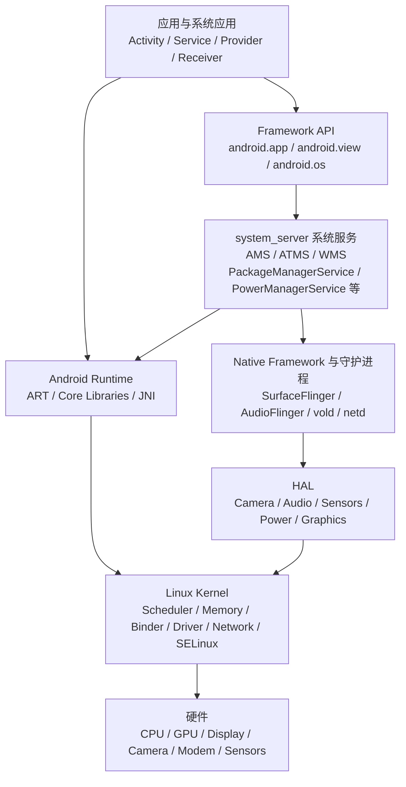

## 1.1 各层职责

### 应用层

包括普通应用、系统应用和特权应用。应用通常运行在独立 Linux 进程中，拥有独立 UID、虚拟地址空间、ART 实例和 Binder 线程池。

### Framework API 层

向上提供稳定的 Java/Kotlin API，例如：

- `ActivityManager`
- `WindowManager`
- `PackageManager`
- `PowerManager`
- `AlarmManager`
- `LocationManager`
- `SensorManager`

这些 `Manager` 往往不是功能的最终执行者，而是客户端代理。真正的系统逻辑通常运行在 `system_server` 或独立 Native 服务中。

### 系统服务层

大部分核心 Java 系统服务运行在 `system_server`：

- Activity 和进程管理
- 窗口与任务管理
- 包管理
- 电源管理
- 输入管理
- 显示管理
- 作业调度
- 闹钟管理
- 网络策略
- 权限与设备策略

`system_server` 是 Android 用户空间最关键的进程之一。它发生死锁、长时间停顿或反复崩溃时，通常会造成全系统异常。

### Native Framework 与守护进程

常见组件包括：

- `SurfaceFlinger`：图层合成与显示输出。
- `AudioFlinger`：音频混音和音频数据通路。
- `vold`：卷和存储管理。
- `netd`：网络配置、路由、防火墙等。
- `servicemanager`：Binder 服务注册与发现。
- `hwservicemanager`：传统 HIDL HAL 服务管理。
- `lmkd`：根据内存压力回收低优先级进程。

### Android Runtime

ART 负责：

- 加载和验证 DEX 字节码。
- 解释执行、JIT 编译和 AOT 编译代码。
- 管理 Java 堆。
- 执行垃圾回收。
- 管理线程、类、方法和对象元数据。
- 提供 JNI 边界。

### HAL

HAL 为 Framework 或 Native 服务提供稳定硬件接口，使上层不需要了解具体芯片和驱动实现。

### Linux 内核

Linux 内核负责：

- 进程和线程调度。
- 虚拟内存和页回收。
- 文件系统和块 I/O。
- 网络协议栈。
- 电源管理。
- 设备驱动。
- Binder 驱动。
- cgroup、cpuset、PSI、futex、epoll 等机制。
- SELinux 强制访问控制。

## 1.2 Android 与普通 Linux 用户空间的主要差异

Android 使用 Linux 内核，但用户空间有明显差异：

1. C 库主要使用 Bionic，而不是 glibc。
2. 应用沙箱以 UID、SELinux 域、权限和 Binder 身份共同实现。
3. 核心 IPC 机制是 Binder。
4. 应用进程主要由 Zygote fork，而不是直接执行独立 ELF 主程序。
5. 内存压力管理依赖进程重要性、OOM 调整值、cgroup 和 `lmkd`。
6. 图形显示依赖 Surface、BufferQueue、SurfaceFlinger 和 Hardware Composer。
7. Java/Kotlin 代码运行在 ART 上，而不是标准桌面 JVM。
8. 系统和厂商实现通过分区、VINTF 和稳定 HAL 接口解耦。

## 1.3 一个系统调用链示例：打开相机

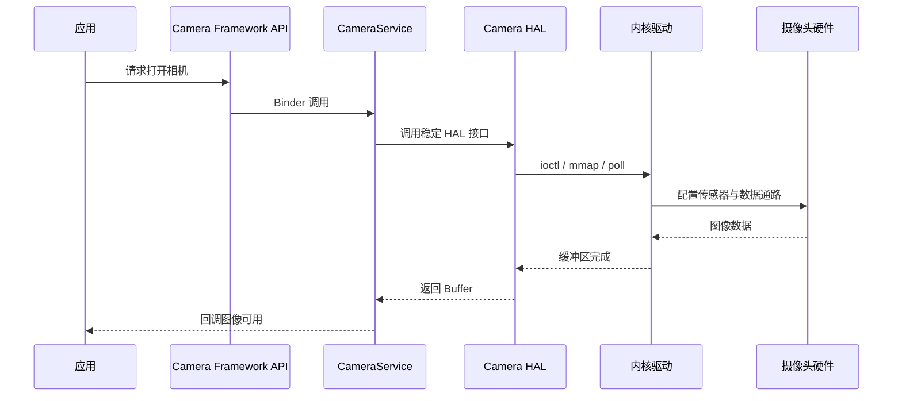

分析任何 Android 系统问题时，都应先问：

- 请求从哪一层发起？
- 跨越了哪些进程？
- 是否经过 Binder？
- 是否进入 HAL？
- 最终依赖哪个驱动或内核子系统？
- 延迟、错误或资源泄漏发生在哪个边界？

---

# 2. Android 启动流程

## 2.1 总体流程

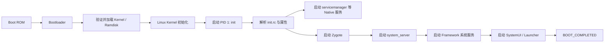

## 2.2 Bootloader

Bootloader 通常负责：

- 初始化最基本的硬件。
- 选择启动槽位。
- 执行启动镜像完整性校验。
- 加载内核、ramdisk、设备树等。
- 向内核传递命令行或 bootconfig 参数。
- 跳转到 Linux 内核入口。

Android Verified Boot 用于建立从硬件根信任到启动分区的验证链。启动速度慢时，也必须区分耗时发生在 Bootloader 阶段还是内核、init、Framework 阶段。

## 2.3 Linux 内核初始化

内核启动后会完成：

- CPU、异常向量和中断初始化。
- 页表、伙伴系统、slab 分配器初始化。
- 调度器、时钟和定时器初始化。
- 驱动探测。
- 挂载初始根文件系统。
- 创建内核线程。
- 启动用户空间 PID 1：`/init`。

内核启动日志通常通过 `dmesg` 或串口获取。

## 2.4 init 进程

Android `init` 是 PID 1，主要职责包括：

- 解析 `init.rc` 和各模块的 rc 文件。
- 管理 service 生命周期。
- 处理 property service。
- 挂载文件系统和分区。
- 配置权限、用户、组、能力和 SELinux 上下文。
- 创建目录和设备节点。
- 根据 trigger 执行动作。

一个简化的 rc 服务定义如下：

```text
service exampled /system/bin/exampled
    class core
    user system
    group system
    disabled
    oneshot
```

需要理解的字段：

- `class`：服务所属启动阶段。
- `user/group`：运行身份。
- `disabled`：不随 class 自动启动。
- `oneshot`：退出后不自动重启。
- `critical`：关键服务反复崩溃可能触发系统恢复策略。

## 2.5 ServiceManager 与 Binder 就绪

`servicemanager` 是 Binder 服务注册中心。服务端将 Binder 服务注册进去，客户端按名称查询服务。

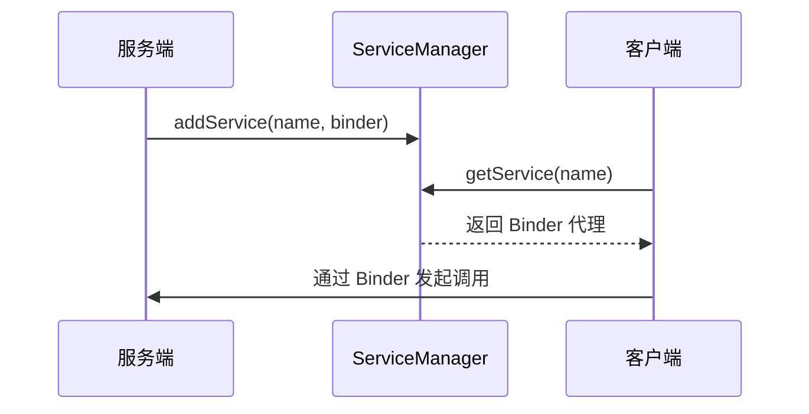

## 2.6 Zygote

Zygote 是应用进程和部分系统进程的孵化器。其核心思路是：

1. 先启动 ART。
2. 预加载常用类、资源和共享库。
3. 监听本地 Unix Domain Socket。
4. 收到进程创建请求后 fork。
5. 子进程完成 UID、GID、SELinux、cgroup、进程名等配置。
6. 进入目标 Java 入口。

fork 后，未修改的内存页可通过写时复制共享，因此 Zygote 预加载有助于减少启动开销和物理内存占用。

现代 64 位设备通常存在不同 ABI 的 Zygote 进程。具体数量和名称依设备配置而定。

## 2.7 system_server

Zygote 会 fork 出 `system_server`。`system_server` 加载大量 Framework 服务，其启动大致分为：

- Bootstrap services：最基础服务。
- Core services：核心服务。
- Other services：窗口、输入、网络、媒体相关管理服务等。

服务之间存在严格依赖。例如：

- PackageManagerService 依赖文件系统和安装信息。
- ActivityManagerService 需要进程和组件管理基础设施。
- WindowManagerService 需要显示和输入系统。
- PowerManagerService 与 DisplayManagerService、BatteryService 等协作。

## 2.8 启动完成不等于所有工作完成

`BOOT_COMPLETED` 发出时，设备已经具备基本交互能力，但后台仍可能进行：

- 应用优化和编译。
- 媒体扫描。
- 数据库升级。
- 账户同步。
- 设备厂商自定义服务初始化。

因此分析开机性能时，应明确指标：

- 内核启动完成时间。
- `init` 到 Zygote 时间。
- `system_server` 可用时间。
- 首帧时间。
- Launcher 可交互时间。
- 后台稳定时间。

---

# 3. 应用进程启动流程

以启动一个尚未存在进程的 Activity 为例：

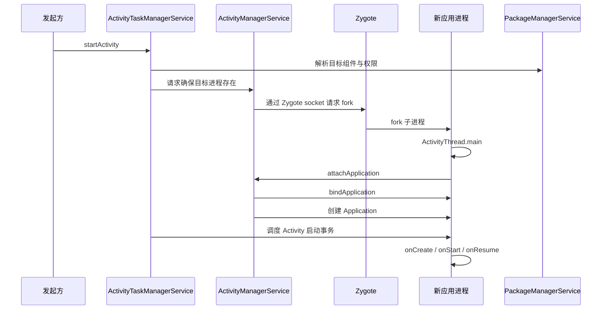

## 3.1 `ActivityThread.main()`

应用进程 Java 入口通常是 `ActivityThread.main()`，主要完成：

- 准备主线程 Looper。
- 创建 `ActivityThread`。
- 向 AMS 注册当前应用进程。
- 进入 `Looper.loop()` 消息循环。

`ActivityThread` 名字容易造成误解：它不是一个 Thread 子类，而是应用主线程的核心管理对象。

## 3.2 `Application` 和 Activity 创建

AMS 将应用绑定信息发送到应用进程后，应用主线程会：

1. 创建或获取 ClassLoader。
2. 加载应用代码。
3. 创建 `LoadedApk`。
4. 创建 `Application`。
5. 调用 `Application.onCreate()`。
6. 根据生命周期事务创建 Activity。
7. 创建 Window、DecorView 和 View 层级。
8. 完成 measure、layout、draw，并提交图形缓冲区。

## 3.3 冷启动、温启动和热启动

### 冷启动

目标进程不存在，需要：

- Zygote fork。
- 创建 ART 应用运行环境。
- 加载应用和类。
- 创建 Application。
- 创建 Activity。
- 绘制首帧。

### 温启动

进程存在，但 Activity 需要重新创建。

### 热启动

进程和 Activity 基本仍存在，主要进行任务切换和恢复。

启动优化时必须先确认所测类型，否则数据不可比较。

---

# 4. Android Framework 核心结构

## 4.1 Manager、Binder 接口与系统服务

常见调用结构：


例如应用调用 `PowerManager`，其背后可能通过 `IPowerManager` Binder 接口进入 `PowerManagerService`。

## 4.2 ActivityManagerService

AMS 主要关注：

- 应用进程管理。
- 进程重要性和 OOM 调整。
- Service、BroadcastReceiver、ContentProvider 运行管理。
- ANR 处理。
- 与 Zygote 协作启动进程。
- 进程死亡清理。

现代 Android 中，Activity 和任务栈管理的大量职责已经拆分到 ATMS。

## 4.3 ActivityTaskManagerService

ATMS 主要负责：

- Activity 生命周期协调。
- Task 和返回栈。
- 多窗口与显示区域。
- Activity 启动模式。
- 前后台切换。
- 与 WMS 协调窗口可见性。

## 4.4 WindowManagerService

WMS 负责窗口层面的管理：

- 窗口添加、删除和层级。
- 窗口布局和可见性。
- 焦点窗口。
- 输入目标。
- 屏幕旋转。
- 多显示器。
- 与 SurfaceFlinger 协调图层。

WMS 管理的是窗口状态；SurfaceFlinger 负责合成图形 Buffer。二者不能混为一谈。

## 4.5 PackageManagerService

PMS 负责：

- APK 扫描与安装信息维护。
- 包名、组件、权限和签名信息。
- Intent 解析。
- 应用 UID 分配。
- 共享库和安装会话。
- 与 dexopt、ART Service 等协作。

## 4.6 PowerManagerService

主要负责：

- 屏幕和设备唤醒状态。
- WakeLock 管理。
- 用户活动超时。
- Doze/Idle 相关协作。
- 与 Display、Battery、Dream、Power HAL 交互。

## 4.7 InputManagerService

输入事件通常经历：


输入卡顿可能来自：

- 内核输入事件迟到。
- InputReader/InputDispatcher 延迟。
- WMS 焦点或窗口状态问题。
- Binder 或锁竞争。
- 应用主线程不消费消息。

## 4.8 Framework 服务常见设计模式

### 客户端代理

Manager 隐藏 Binder 细节，提供易用 API。

### 服务端状态机

系统服务通常维护复杂状态机，而不是简单函数集合。

### Handler 串行化状态修改

许多服务使用专用 Handler 线程串行处理状态变化，以减少锁复杂度。

### Binder 线程只做短任务

Binder 线程若执行长时间 I/O、持锁等待或复杂计算，可能耗尽线程池并形成级联阻塞。

### 权限检查靠近服务端

不能只相信客户端传参。服务端通常需要校验：

- 调用 UID/PID。
- Android 权限。
- AppOps。
- 用户和 Profile。
- SELinux 策略。

---

# 5. Handler、Looper 与线程模型

## 5.1 基本关系


- 一个线程最多对应一个 Looper。
- 一个 Looper 持有一个 MessageQueue。
- 多个 Handler 可以绑定同一个 Looper。
- Handler 决定消息如何处理，Looper 决定消息在哪个线程执行。

## 5.2 MessageQueue 为什么能等待而不持续空转

MessageQueue 的等待最终依赖 Native 层的 poll 机制。没有到期消息时，线程阻塞等待；当新消息加入、文件描述符有事件或超时到期时被唤醒。

这类设计把：

- Java 消息。
- Native 文件描述符事件。
- 定时任务。

统一到同一事件循环中。

## 5.3 同步屏障和异步消息

同步屏障会暂时阻止普通同步消息执行，但允许标记为异步的消息越过屏障。显示系统可利用该机制优先执行与下一帧有关的输入、动画和绘制任务。

错误使用或屏障未移除可能造成消息队列长期阻塞。

## 5.4 主线程阻塞的常见来源

- 文件和数据库 I/O。
- 网络请求。
- 大对象序列化。
- Binder 同步调用。
- 锁竞争。
- 频繁 GC。
- 大量 View inflate、measure、layout、draw。
- Native 方法长时间不返回。
- 等待工作线程结果。

## 5.5 Handler 内存泄漏的本质

问题不在 Handler 机制本身，而在引用链：

```text
MessageQueue -> Message -> Handler -> 外部对象/Activity
```

如果延迟消息生命周期超过 Activity，Activity 可能无法及时回收。常见处理方式：

- 避免不必要的长延迟消息。
- 在生命周期结束时移除回调和消息。
- 避免匿名内部类无意捕获外部对象。
- 使用明确的生命周期所有权。

---

# 6. Binder IPC

Binder 是 Android Framework 最核心的跨进程通信机制之一。

## 6.1 Binder 的四个角色

- Client：发起调用。
- Server：提供服务。
- ServiceManager：服务注册和发现。
- Binder Driver：内核中的事务路由、对象引用和线程唤醒机制。

## 6.2 AIDL 生成的 Proxy 与 Stub

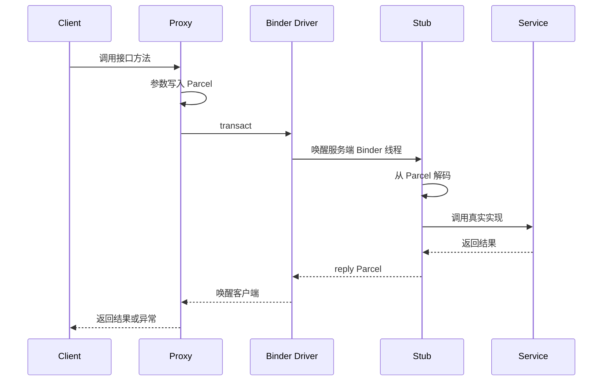

## 6.3 Binder 对象模型

服务端的 Binder 实体在内核中对应 Binder node；客户端持有的是 Binder reference。引用可跨进程传递，因此 Binder 不只是“传字节”，还维护分布式对象引用关系。

## 6.4 同步事务与异步事务

### 同步事务

调用线程阻塞，直到服务端返回。风险包括：

- 服务端慢导致客户端阻塞。
- 主线程同步调用造成卡顿或 ANR。
- 嵌套同步调用形成死锁。
- 服务端 Binder 线程池耗尽。

### 异步 `oneway` 事务

调用方在事务提交后较快返回，不等待服务端执行完成。需要注意：

- 不等于消息一定立即处理。
- 不能直接获得返回值。
- 同一 Binder 节点上的异步事务通常需要考虑顺序和积压。
- 服务端处理过慢会造成异步队列堆积。

## 6.5 Binder 线程池

服务端进程需要 Binder 线程池处理事务。常见问题：

- 所有 Binder 线程都在等待同一把锁。
- Binder 线程同步调用另一个拥塞服务。
- 在线程中执行磁盘 I/O。
- 回调重新进入原服务形成递归调用。
- 线程池配置太小或任务粒度过大。

排查时要看完整依赖链，而不是只看最外层调用者。

## 6.6 Binder 嵌套调用

一个服务处理 Binder 请求时，可以同步调用另一个进程；后者还可能回调原进程。Binder 的调用栈可能跨多个进程：

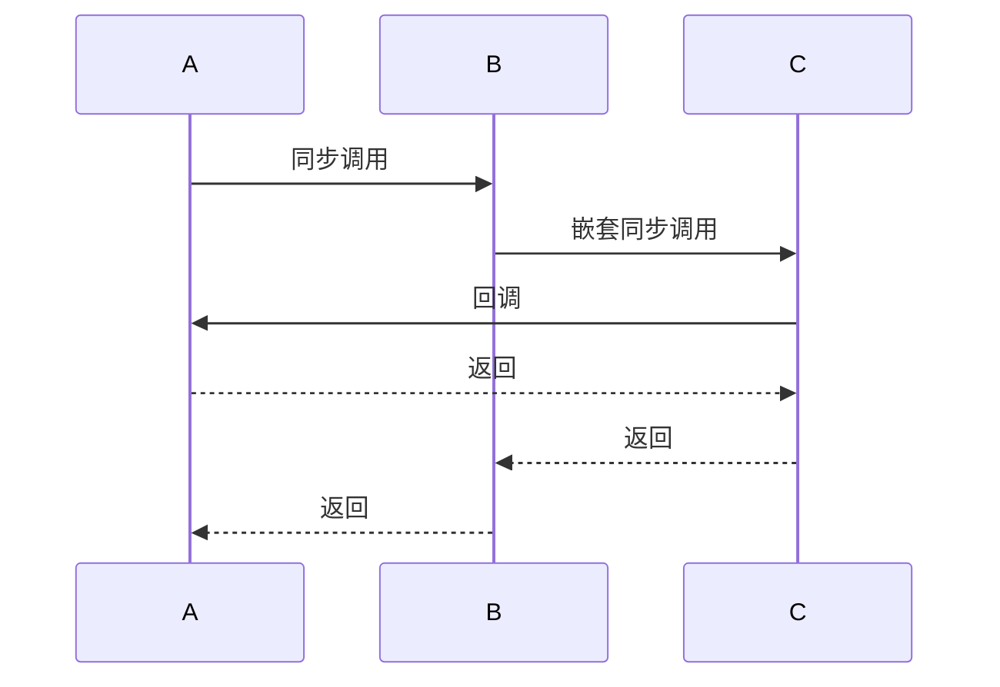

因此锁设计必须考虑跨进程重入。典型原则：

- 尽量不要持有内部锁发起外部 Binder 调用。
- 回调接口要假设对方可能立即反向调用。
- Binder 接口实现应限制单次事务耗时。

## 6.7 Binder 身份

服务端可以获取调用方 UID/PID。系统服务在代替客户端执行特权操作时，经常需要：

```text
clearCallingIdentity()
执行系统自身身份下的操作
restoreCallingIdentity()
```

错误处理调用身份可能产生权限绕过或错误拒绝。

## 6.8 Binder 数据拷贝

常见概括是 Binder 相比传统 IPC 减少一次用户空间拷贝，但不能简单理解为“完全零拷贝”。事务数据仍需从发送方用户空间复制到内核管理的目标缓冲区，并映射给接收方访问。大块数据通常应使用共享内存、文件描述符或图形 Buffer，而不是塞进 Parcel。

## 6.9 Binder 常见故障

- `TransactionTooLargeException`：事务或事务缓冲区压力过大。
- `DeadObjectException`：远端进程死亡。
- Binder 线程池饥饿。
- 同步调用超时或主线程阻塞。
- 服务未注册。
- SELinux 拒绝访问 Binder 服务。
- 客户端未处理服务重启。

## 6.10 Binder 排查思路

1. 确认调用是同步还是异步。
2. 找出客户端线程状态。
3. 找出服务端实际处理线程。
4. 检查服务端是否等待锁、I/O 或其他 Binder。
5. 检查线程池是否全部占满。
6. 查看 Perfetto 中 Binder transaction 和 thread state。
7. 检查服务是否发生死亡或重启。

---

# 7. HAL、Treble、AIDL 与 VINTF

## 7.1 HAL 的目的

HAL 将硬件差异封装在标准接口之后：


上层依赖接口语义，不直接依赖特定芯片寄存器、设备节点或 ioctl 细节。

## 7.2 常见 HAL

- Camera HAL
- Audio HAL
- Sensors HAL
- Power HAL
- Thermal HAL
- Health HAL
- Graphics Composer HAL
- Gralloc Mapper/Allocator
- Bluetooth HAL
- GNSS HAL

## 7.3 Binderized HAL

现代 HAL 通常运行在独立进程，通过 Binder 与 Framework 或 Native 服务通信。优点：

- 故障隔离。
- 权限边界清晰。
- 接口可版本化。
- 便于独立更新和测试。

代价：

- IPC 延迟。
- 序列化成本。
- 线程池和进程生命周期复杂度。

## 7.4 HIDL 与 AIDL HAL

HIDL 曾是 Treble 早期用于 HAL 版本化的接口描述语言。现代 Android 更倾向使用稳定 AIDL HAL。

稳定 AIDL 的重点是：

- 接口版本演进。
- 跨 system/vendor 分区的稳定性。
- Parcel 类型的兼容扩展。
- 测试和冻结接口定义。

新代码不应把 HIDL 当作默认首选，但维护旧设备时仍需理解其服务管理和线程模型。

## 7.5 Treble 的核心思想

Treble 通过稳定接口和分区边界，降低 Framework 升级对厂商实现的耦合。

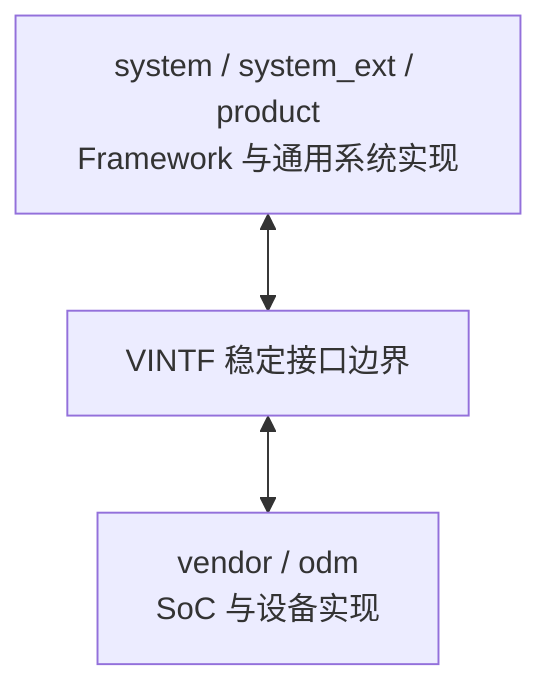

## 7.6 常见分区

- `boot`：内核和启动相关内容，具体布局随版本变化。
- `system`：主要 AOSP Framework 和系统组件。
- `vendor`：芯片和设备厂商实现。
- `product`：产品级配置和应用。
- `system_ext`：系统扩展组件。
- `odm`：设备型号相关厂商内容。
- `data`：用户数据和可变运行数据。
- `metadata`：部分加密和更新元数据。

动态分区、A/B 更新、APEX 和 Mainline 进一步改变了系统组件的交付方式。

## 7.7 VINTF

VINTF 通过设备 manifest 和 Framework compatibility matrix 描述双方提供和要求的 HAL 版本。其目标是让构建、启动和 VTS 测试能够发现不兼容组合。

## 7.8 HAL 问题定位

一个硬件功能异常，可以按以下边界逐层定位：

1. Framework API 是否返回错误。
2. 系统服务是否正确调用 HAL。
3. Binder/AIDL 事务是否成功。
4. HAL 服务是否存活、线程是否阻塞。
5. HAL 参数和状态机是否正确。
6. ioctl 是否成功。
7. 驱动是否收到中断和数据。
8. 硬件时钟、电源域和固件是否正常。

---

# 8. Android 图形显示系统

## 8.1 一帧是如何产生的


## 8.2 Choreographer

Choreographer 将应用一帧中的工作与显示节奏协调，主要处理：

- 输入。
- 动画。
- 布局遍历。
- 绘制提交。
- 帧回调。

帧预算取决于刷新率：

| 刷新率 | 单帧理论周期 |
|---:|---:|
| 60 Hz | 约 16.67 ms |
| 90 Hz | 约 11.11 ms |
| 120 Hz | 约 8.33 ms |

实际可用时间还受到调度、合成、缓冲和 deadline 设计影响，不能把所有周期都视为应用可独占的 CPU 时间。

## 8.3 ViewRootImpl

ViewRootImpl 是 View 层级与 Window 系统之间的重要桥梁，负责：

- 接收输入事件。
- 发起 traversal。
- 执行 measure/layout/draw。
- 与 WMS 交互窗口状态。
- 管理 Surface。

## 8.4 RenderThread 与 HWUI

硬件加速绘制时，主线程构建和更新显示列表，RenderThread 负责更多渲染提交工作。主线程轻并不代表一定不会掉帧，因为还可能存在：

- RenderThread 忙。
- GPU 执行时间过长。
- Buffer 获取阻塞。
- SurfaceFlinger 合成压力。
- HWC 或显示驱动延迟。

## 8.5 Surface 与 BufferQueue

BufferQueue 连接生产者和消费者：

- 生产者：应用渲染、相机、视频解码器。
- 消费者：SurfaceFlinger、ImageReader、编码器等。

典型循环：

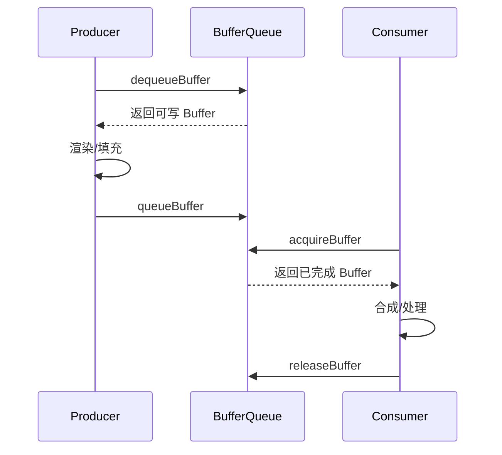

## 8.6 SurfaceFlinger

SurfaceFlinger 负责：

- 接收各图层 Buffer。
- 维护图层树。
- 计算可见区域、变换、裁剪和 Z 顺序。
- 与 Hardware Composer 决定合成策略。
- 向显示设备提交最终帧。

## 8.7 Hardware Composer

HWC HAL 根据硬件能力决定：

- 哪些图层可由显示控制器直接合成。
- 哪些图层需要 GPU 合成。
- Overlay、颜色、缩放、旋转和显示配置。

GPU 合成比例异常升高可能增加功耗和延迟。

## 8.8 Fence

Fence 用于表达异步硬件任务完成状态。图形 Buffer 在生产、消费和显示之间流转时，必须正确等待 acquire/release fence，否则可能：

- 读取未完成 Buffer。
- 覆盖仍在显示的 Buffer。
- 出现花屏、撕裂或长时间等待。

## 8.9 卡顿来源分类

### 应用主线程

- 布局层级复杂。
- 重复 measure/layout。
- 主线程 I/O。
- Binder 同步等待。
- 锁竞争。
- 大量对象分配和 GC。

### RenderThread/GPU

- 过度绘制。
- 大纹理上传。
- Shader 编译。
- GPU 命令过多。
- GPU 频率不足或热降频。

### SurfaceFlinger/HWC

- 图层数量过多。
- 合成策略不理想。
- 显示模式切换。
- HWC HAL 延迟。

### 调度和系统负载

- 关键线程长期 Runnable 但拿不到 CPU。
- CPU 大核未及时提升频率。
- 高优先级后台线程争抢 CPU。
- 内存回收、I/O 或中断风暴。

---

# 9. Android Runtime 总览

## 9.1 ART 的职责

ART 不只是垃圾回收器，它包括：

- DEX 文件加载和校验。
- 类链接和初始化。
- 解释器。
- JIT 编译器。
- AOT 编译工具链。
- 代码缓存。
- 线程管理。
- Java 堆和 GC。
- JNI。
- 调试、采样和运行时 instrumentation。

## 9.2 ART 与 Dalvik

Dalvik 时代主要以解释执行和 JIT 为主，ART 引入更系统的 AOT 能力。现代 ART 不是“只做 AOT”，而是解释、JIT、AOT 和基于 Profile 的混合执行体系。

## 9.3 ART 进程内结构概览

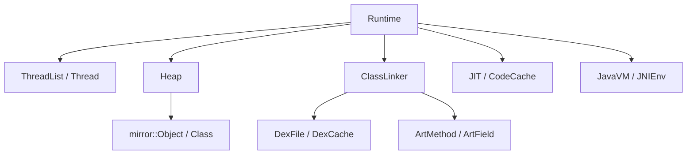

常见核心概念：

- `Runtime`：进程级 ART 全局对象。
- `Thread`：ART 对线程的运行时表示。
- `Heap`：管理 Java 堆空间、分配器和 GC。
- `ClassLinker`：类加载、解析、链接和初始化的重要组件。
- `DexFile`：DEX 文件视图。
- `DexCache`：缓存解析后的字符串、类型、字段和方法。
- `ArtMethod`：方法运行时元数据及入口信息。
- `mirror::Object`：托管对象的 Native 表示。
- `JNIEnv`：线程相关的 JNI 函数环境。

---

# 10. DEX、类加载与 ART 内部结构

## 10.1 DEX 的设计

DEX 是 Android 的字节码与元数据格式。相比每个 class 文件独立维护常量池，DEX 对多个类的数据进行集中组织，以适应移动设备的存储和加载需求。

典型内容包括：

- 字符串表。
- 类型表。
- 原型表。
- 字段和方法 ID。
- 类定义。
- 字节码指令。
- 调试信息。
- 注解。

## 10.2 DEX 校验

ART 在执行前会进行字节码验证，检查：

- 指令是否合法。
- 寄存器类型流是否一致。
- 分支目标是否有效。
- 方法调用参数是否匹配。
- 对象使用是否满足类型规则。

验证可以提前发现非法字节码，并为解释器和编译器提供类型信息。

## 10.3 类加载器层次

常见类加载器包括：

- BootClassLoader：加载核心类库。
- PathClassLoader：常用于已安装应用的 classpath。
- DexClassLoader：可加载指定 DEX/JAR/APK 路径。
- InMemoryDexClassLoader：从内存中的 DEX Buffer 加载。

类加载涉及：

1. 按类名查找。
2. 查找已加载类。
3. 定位 DEX ClassDef。
4. 创建 `Class` 对象。
5. 加载父类和接口。
6. 链接字段、方法和 vtable/iftable。
7. 验证。
8. 初始化静态字段并执行 `<clinit>`。

## 10.4 双亲委派不是绝对规则

Android 类加载通常具有父加载器优先的思想，但具体 ClassLoader 可重写行为。插件化、热修复和动态代码加载常利用 classpath 顺序或自定义 ClassLoader。由此带来的风险包括：

- 类重复定义。
- 类型由不同 ClassLoader 加载，名字相同但类型不相等。
- JNI `FindClass` 使用错误的 ClassLoader。
- 优化产物与 ClassLoaderContext 不一致。

## 10.5 `ArtMethod`

`ArtMethod` 可以理解为一个方法在 ART 中的运行时描述，通常关联：

- 声明类。
- 访问标志。
- DEX 方法索引。
- 解释器或编译代码入口。
- JNI 入口。
- 热度和 instrumentation 信息。

内部字段和布局高度依赖 Android 版本，不能把某个版本的结构偏移当作稳定 ABI。

## 10.6 对象布局

托管对象通常包含：

- 对应类的引用或压缩引用。
- 锁字/对象头相关状态。
- 实例字段。
- 对齐填充。

数组对象还包含长度和元素区。具体布局、引用宽度和压缩方式依版本及构建配置而变化。

## 10.7 OAT、ODEX、VDEX、ART 文件

常见概念：

- DEX：原始字节码和类元数据。
- VDEX：与验证、DEX 内容或相关元数据有关的产物，格式随版本演进。
- ODEX/OAT：包含编译代码及 ART 运行所需元数据的产物，命名和组织随版本变化。
- ART image：预初始化对象、类和运行时数据的映像，可加快启动并支持共享。

不要死记某个版本的文件扩展名对应关系，重点理解：

1. 原始字节码。
2. 验证结果。
3. 编译代码。
4. 运行时映像。
5. Profile。

它们共同服务于启动速度、运行性能、存储占用和更新成本之间的平衡。

---

# 11. 解释执行、JIT 与 AOT

## 11.1 三种执行方式

### 解释执行

解释器逐条读取 DEX 指令并执行。

优点：

- 无需提前编译。
- 启动和安装阶段额外成本较低。
- 能执行未编译方法。

缺点：

- 热代码长期解释执行性能较低。

### JIT

JIT 在应用运行过程中识别热点方法并编译为机器码。

优点：

- 根据真实运行行为选择热点。
- 无需编译所有代码。
- 可收集分支、类型和调用信息。

缺点：

- 运行时有编译开销。
- 代码缓存占内存。
- 第一次运行热点代码前仍可能较慢。

### AOT

AOT 在构建、安装、空闲维护或其他阶段提前编译 DEX。

优点：

- 运行时可直接执行机器码。
- 减少热身过程。
- 对启动和稳定热点有利。

缺点：

- 占用存储空间。
- 编译耗时。
- 系统或依赖更新可能使产物失效。
- 缺少完整运行时信息时，优化可能不如 Profile 引导准确。

## 11.2 现代 ART 的混合模式

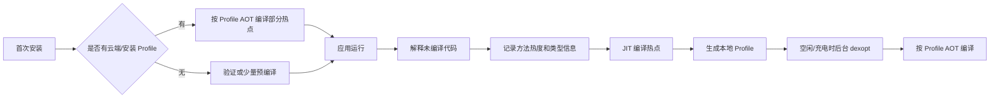

这种设计在以下目标之间折中：

- 安装速度。
- 首次启动速度。
- 稳态性能。
- 存储占用。
- OTA 后恢复速度。
- 电量和温度。

## 11.3 JIT 热度

运行时会记录方法调用和循环执行等热度信号。达到阈值后可进入编译队列。JIT 还可能利用：

- 类型反馈。
- 内联缓存。
- 分支信息。
- OSR：在长循环仍在执行时切换到编译代码。

## 11.4 Code Cache

JIT 编译代码存放在进程内 Code Cache。它不仅包含机器码，还可能包含：

- 栈映射。
- 异常和去优化信息。
- GC 可见引用位置。
- 调试元数据。

Code Cache 太小会限制 JIT 收益，太大则增加内存压力。

## 11.5 去优化

编译器可能基于假设生成优化代码。如果运行时发现假设不再成立，ART 可以回退到解释器或较保守执行路径。去优化要求精确恢复：

- DEX 程序计数器。
- 虚拟寄存器值。
- 对象引用位置。
- 调用栈状态。

## 11.6 dex2oat 和 Compiler Filter

常见编译过滤器概念：

- `verify`：主要进行验证，不进行完整 AOT。
- `speed-profile`：编译 Profile 指定的热点代码。
- `speed`：更积极地编译代码。

不同版本支持项可能变化。实际设备配置需结合系统属性、ART Service、包状态和编译原因查看。

## 11.7 Profile Guided Compilation

Profile 可以记录：

- 热方法。
- 热类。
- 启动期间使用的类和方法。

Profile 引导的价值是把有限编译预算用于真正重要的代码，而不是把整个 APK 全量编译。

## 11.8 编译状态排查

常用思路：

```bash
adb shell cmd package compile -m speed-profile -f <package>
adb shell cmd package compile -m speed -f <package>
adb shell cmd package dump-profiles <package>
adb shell dumpsys package <package>
```

命令可用性和行为依系统版本、权限和构建类型而定。分析结果时要记录：

- 安装来源。
- 是否带 Profile。
- 当前编译 filter。
- 是否清理过数据。
- 是否完成后台 dexopt。
- 系统是否刚 OTA。

---

# 12. ART 垃圾回收

## 12.1 垃圾回收解决什么问题

Java/Kotlin 对象通常在托管堆中分配。程序不再可达的对象由 GC 回收。GC 必须回答：

1. 哪些对象仍然可达？
2. 如何回收不可达对象？
3. 是否移动存活对象？
4. 如何在应用线程并发运行时保持正确性？
5. 如何控制暂停时间、吞吐和内存占用？

## 12.2 GC Roots

常见根包括：

- Java 线程栈中的引用。
- JNI 全局引用和局部引用。
- 静态字段。
- ART 内部运行时引用。
- 已加载类和 ClassLoader 相关引用。
- Native 注册的根。

从根出发可达的对象视为存活。

## 12.3 基本 GC 算法

### Mark-Sweep

1. 从 Roots 标记可达对象。
2. 扫描堆并回收未标记对象。

优点：对象不移动。缺点：可能产生碎片。

### Mark-Compact

1. 标记存活对象。
2. 移动对象消除碎片。
3. 更新引用。

优点：空间连续。缺点：移动和引用更新成本高。

### Copying

把存活对象从一个区域复制到另一区域，旧区域整体回收。

优点：分配快、天然整理碎片。缺点：需要转移空间和引用读写屏障。

### Generational GC

基于“多数对象朝生夕死”的经验，将对象按年龄或区域管理，频繁回收年轻代，较少进行全堆回收。

## 12.4 ART Concurrent Copying

现代 ART 默认 GC 方案通常以 Concurrent Copying 为核心。其重要特点包括：

- 应用线程与标记/复制阶段尽可能并发。
- 通过读屏障保证对象移动期间引用访问正确。
- 使用 Region 和 TLAB 提高分配效率。
- 支持年轻代回收。
- 将 Stop-The-World 阶段控制在较短范围。


“并发 GC”不等于“完全无暂停”。线程仍需在某些阶段到达安全点，根扫描和阶段切换也可能需要暂停。

## 12.5 TLAB 与 Bump Pointer

Thread-Local Allocation Buffer 为线程分配独立小区域。线程分配对象时只需移动 top 指针：

```text
object_address = top
top += aligned_object_size
```

优势：

- 常见分配路径无需全局锁。
- 分配成本低。
- 缓存局部性较好。

TLAB 用尽后，线程再向堆申请新的区域。

## 12.6 RegionSpace

RegionSpace 把堆划分为固定大小 Region，可支持：

- 年轻对象区域。
- 存活对象复制目标区域。
- Region 级回收。
- 降低全堆连续空间要求。

## 12.7 Large Object Space

大对象不适合频繁复制，通常进入大对象空间。大量大对象可能造成：

- 映射和回收成本高。
- 峰值内存高。
- 碎片或地址空间压力。
- GC 周期更频繁。

ART 的 Large Object Space 主要用于符合运行时策略的大型托管对象，例如大型 primitive 数组或用于序列化的 `byte[]`。Bitmap 需要区分 Java 层对象和像素数据：Android 8.0（API 26）及以上的 Bitmap 像素数据位于 Native Heap，不属于 ART Large Object Space；更早版本的内存归属有所不同。

## 12.8 Read Barrier

对象可能在并发复制时移动。应用线程读取引用时，读屏障帮助判断：

- 对象是否已转移。
- 是否需要读取 forwarding address。
- 是否需要协助复制或修正引用。

读屏障增加每次引用读取的潜在成本，但换取更短暂停时间和并发压缩能力。

## 12.9 Write Barrier、Card Table 与 Remembered Set

当应用修改对象引用时，GC 需要知道新引用关系。写屏障可以把对应内存区域标记为脏。

Card Table 将堆划分为较粗粒度的卡片：

```text
写入对象字段
    ↓
计算对象地址所属 Card
    ↓
把 Card 标记为 dirty
    ↓
GC 扫描脏 Card，发现跨代或新增引用
```

分代 GC 中，老年代对象指向年轻代对象时，若不记录该关系，年轻代回收可能错误回收仍被老年代引用的对象。

## 12.10 Safe Point 与线程挂起

GC 需要在可准确识别对象引用的位置观察线程。编译器会生成栈映射和挂起检查，处于 ART Runnable 状态的线程需要定期响应挂起请求。普通 JNI Native 代码或阻塞中的内核调用通常会进入非 Runnable 状态并释放 mutator lock，GC 可将其视为已挂起；长时间运行的 `@FastNative`、`@CriticalNative`、仍持有 mutator lock 的 ART 内部代码，或迟迟到不了挂起点的 Runnable 线程，才可能明显增加 time-to-suspend。

## 12.11 GC 触发因素

- 分配达到堆增长阈值。
- TLAB/Region 不足。
- 显式 GC 请求。
- 后台状态转换。
- Native 内存压力通知。
- 大对象分配失败。
- 并发 GC 来不及追上分配速度。

## 12.12 GC 性能指标

需要关注：

- GC 次数。
- Young GC 与 Full GC 比例。
- 总 GC 时间。
- 最大暂停、P95/P99 暂停。
- time to suspend。
- 每秒分配字节数。
- 每秒回收字节数。
- GC 吞吐。
- 堆增长上限。
- 大对象空间占用。

## 12.13 常见 GC 问题

### 分配速率过高

即使 GC 每次暂停很短，频繁触发仍会抢占 CPU、污染缓存并增加功耗。

### 内存泄漏

对象始终从 Roots 可达，GC 无法回收。

### 大对象抖动

短时间反复分配和释放大数组、Bitmap 或 Buffer。

### Native 内存增长

Java 堆看似正常，但 Native heap、graphics、DMA-BUF、线程栈或 mmap 持续增长。

### 线程难以挂起

某线程长时间不进入安全点，使 GC 暂停被放大。

## 12.14 获取 GC 信息

```bash
adb logcat | grep -i "GC"
adb shell dumpsys meminfo <package>
adb shell kill -s QUIT <pid>
```

向进程发送 `SIGQUIT` 可生成线程和 GC 相关信息，具体文件位置和权限依版本而定。

---

# 13. JNI 原理与工程实践

JNI 连接托管代码和 C/C++ 代码，是性能、稳定性和内存安全问题的高发边界。

## 13.1 JavaVM 与 JNIEnv

### `JavaVM*`

- 进程级虚拟机接口。
- 可在线程之间保存和共享。
- 常用于线程 attach/detach。

### `JNIEnv*`

- 与当前线程绑定。
- 不能直接跨线程复用。
- 提供 JNI 函数表。

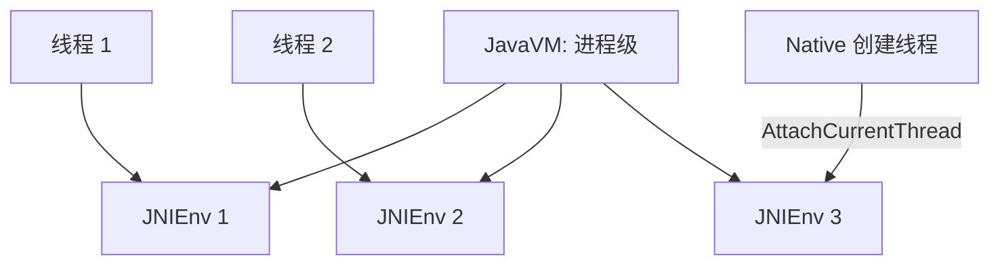

## 13.2 Native 方法注册

### 静态符号查找

通过约定命名的 `Java_package_Class_method` 符号查找。

### `RegisterNatives`

在 `JNI_OnLoad` 或类初始化阶段显式注册方法表。

优点：

- 符号控制更明确。
- 可避免超长导出名。
- 便于隐藏大部分 Native 符号。
- 注册失败可尽早暴露。

## 13.3 Local、Global 与 Weak Global Reference

### Local Reference

- 通常只在当前 Native 方法和当前线程中有效。
- Native 方法返回后自动失效。
- 大循环中应及时 `DeleteLocalRef`，避免局部引用表膨胀。

### Global Reference

- 通过 `NewGlobalRef` 创建。
- 跨 Native 调用和线程有效。
- 必须显式 `DeleteGlobalRef`。
- 会阻止对象回收。

### Weak Global Reference

- 不阻止对象被 GC。
- 使用前需要判断对象是否已回收。

不能用 `==` 判断两个 `jobject` 是否指向同一托管对象，应使用 `IsSameObject`。

## 13.4 Native 线程 Attach

Native 创建的线程若要调用 JNI，需：

1. `AttachCurrentThread`。
2. 获取本线程 `JNIEnv*`。
3. 执行 JNI 操作。
4. 线程结束前 `DetachCurrentThread`。

长生命周期 Native 线程要特别注意局部引用不会像普通 JNI 方法返回那样自动批量清理。

## 13.5 `FindClass` 的 ClassLoader 问题

在 Java 调用进入的 JNI 方法中，ART 通常能基于当前调用上下文找到正确 ClassLoader。Native 自建线程中直接 `FindClass` 时，可能只看到 BootClassLoader 范围。

常见解决方式：

- 在 Java 类初始化时缓存 `jclass` GlobalRef。
- 缓存应用 ClassLoader 和 `loadClass` 方法。
- 在 `JNI_OnLoad` 的适当上下文中完成 ID 缓存。

## 13.6 缓存 `jclass`、`jmethodID` 和 `jfieldID`

频繁查找类、方法和字段会增加开销。常用模式：

- 类初始化时查找。
- `jclass` 转为 GlobalRef。
- 缓存 `jmethodID` 和 `jfieldID`。

`jmethodID` 和 `jfieldID` 不是 `jobject`，不要对它们调用 `NewGlobalRef`。

## 13.7 字符串

Java 字符串内部编码和 JNI 接口语义不能简单等同于 C UTF-8 字符串。使用：

- `GetStringChars` / `ReleaseStringChars`
- `GetStringUTFChars` / `ReleaseStringUTFChars`

必须成对释放，并理解 Modified UTF-8 与标准 UTF-8 的差异。

## 13.8 数组访问

常见接口：

- `Get<Type>ArrayElements`
- `Release<Type>ArrayElements`
- `Get<Type>ArrayRegion`
- `Set<Type>ArrayRegion`
- `GetPrimitiveArrayCritical`

实现可以返回直接指针，也可以返回拷贝。调用者不能假设一定零拷贝。

Critical 区域应：

- 尽可能短。
- 不做阻塞操作。
- 不执行复杂 JNI 调用。
- 尽快 Release。

否则可能妨碍 GC 或运行时调度。

## 13.9 JNI 异常

许多 JNI 调用可能留下 pending exception。发生异常后，只允许调用有限的 JNI 接口进行检查、描述或清除。常见错误是：

1. `CallObjectMethod` 触发异常。
2. Native 代码未检查。
3. 继续调用大量 JNI API。
4. 最终出现难定位崩溃。

应使用：

```cpp
if (env->ExceptionCheck()) {
    // 记录、转换或返回，让异常回到 Java 层
}
```

## 13.10 JNI 性能原则

- 减少跨 JNI 边界次数。
- 批量传输数据，而不是逐元素调用。
- 避免频繁字符串和对象转换。
- 缓存类和方法 ID。
- 避免把复杂 Java 对象图映射到 Native。
- 对延迟敏感路径避免长时间 Pin 数组。
- 不要在持有 Java/Native 锁时发起可能回调的跨层调用。

## 13.11 JNI 稳定性风险

- `JNIEnv*` 跨线程使用。
- LocalRef 越界或生命周期错误。
- GlobalRef 泄漏。
- Native use-after-free。
- 数组越界。
- 错误释放 JNI 返回指针。
- Native 异常穿越 C ABI。
- Java 异常未检查。
- 方法签名错误。
- 类被不同 ClassLoader 加载。

## 13.12 CheckJNI

CheckJNI 能检测多类 JNI 误用，例如：

- 错误线程使用 `JNIEnv*`。
- 错误引用。
- 错误方法签名。
- 未处理异常后继续调用。

它有明显开销，适合调试构建或问题复现阶段。

---

# 14. Android 中的 Linux 进程与调度

## 14.1 进程与线程

在 Linux 中，进程和线程都由 task 表示。线程共享进程的大量资源：

- 地址空间。
- 文件描述符表。
- 信号处理配置。
- 部分命名空间。

每个线程仍有独立：

- 调度实体。
- 内核栈。
- 用户栈。
- 寄存器上下文。
- TID。

Android 应用进程通常包含：

- 主线程。
- Binder 线程。
- GC 线程。
- JIT 线程。
- Finalizer/ReferenceQueue 相关线程。
- RenderThread。
- 业务线程池。
- Native 库线程。

## 14.2 调度状态

Perfetto 或 `/proc` 中常见线程状态：

- Running：正在 CPU 上执行。
- Runnable：可运行但等待 CPU。
- Sleeping：等待事件。
- Uninterruptible Sleep：常见于部分 I/O 等待。
- Blocked on futex：等待用户空间锁或条件变量。

重要区别：

- Running 时间长，表示真正消耗 CPU。
- Runnable 时间长，表示有工作但调度不到 CPU。
- Sleeping 时间长不一定是问题，事件线程本就应阻塞等待。

## 14.3 调度类

常见调度策略：

- 普通公平调度类。
- `SCHED_FIFO` / `SCHED_RR` 实时调度。
- `SCHED_DEADLINE`。
- Idle 等低优先级策略。

实时线程使用不当可能饿死普通线程。Android 对音频、显示等延迟敏感路径会谨慎使用实时调度和优先级继承。

## 14.4 nice 值与线程优先级

nice 值影响普通调度类中的 CPU 份额倾向。它不是绝对执行顺序，也不能保证 deadline。

Java 层线程优先级最终会映射到 Linux 调度参数和 Android 策略，但系统还会通过 cgroup、cpuset、uclamp、任务配置等共同约束。

## 14.5 cgroup、cpuset 与 task profile

Android 使用 cgroup 对线程和进程分组，以控制：

- 可运行 CPU 集合。
- CPU 资源权重。
- 内存统计和限制。
- 冻结状态。
- I/O 或其他资源策略。

cpuset 可限制任务在哪些 CPU 上运行。例如前台关键任务可获得更有利 CPU 集合，后台任务可能被限制在节能核。

## 14.6 PELT 与 uclamp 调度信号

PELT（Per-Entity Load Tracking）为任务、运行队列和 cgroup 维护带时间衰减的
负载与利用率信号。它反映一段时间内的运行行为，不是当前瞬间 CPU 占用率：

```text
新近运行时间权重较大
久远历史按指数方式逐渐衰减
        ↓
形成 util_avg 等调度信号
```

因此，突发任务刚唤醒时 PELT 可能还没完全增长，工作结束后也不会立刻归零。
频率不变性和 CPU capacity 归一化又使利用率能在不同频率、不同大小核之间比较。

Utilization Clamping 在利用率信号上增加约束：

- `uclamp.min` 表达最低性能需求，可影响选核和 `schedutil` 的频率请求；
- `uclamp.max` 限制任务对 CPU capacity 的需求上界，可用于约束后台负载；
- 实际生效值还会合并任务、cgroup 和系统策略，并受到可用 CPU、热限制等约束；
- uclamp 是提示和约束，不保证线程固定运行在某个核或某个频率。

Android 可以通过 task profile、Power HAL、性能提示会话等机制，把前台状态和工作
期限转换为线程分组、cpuset、uclamp 或平台相关请求。具体映射属于设备策略，应用
不应假设某个提示必然对应固定频率或固定大核。Android 策略如何连接这些内核信号，
见第 28.1 节的整体能效链路。

## 14.7 EAS 与 Energy Model

Energy Aware Scheduling 在任务唤醒选核时，结合 PELT 利用率、CPU capacity 和
Energy Model 估算不同放置方案的能量代价：


EAS 负责选择运行位置，不直接设置 CPU 频率。`schedutil` 使用同类利用率信号向
CPUFreq 请求频率，二者共享一致信号时才能形成较连贯的选核与调频决策。

EAS 依赖正确的异构 CPU capacity、频率不变利用率和平台 Energy Model。系统进入
过载状态时，内核可能退出节能放置路径并恢复以吞吐和负载均衡为主的选择。因此
“打开 EAS”不等于所有场景都会优先放到小核。

调度异常常见表现包括：

- 短任务的 PELT 爬升滞后，频率或大核响应太慢；
- `uclamp.min` 过高导致长期高频，`uclamp.max` 过低又造成关键线程延迟；
- Energy Model、CPU capacity 或频率不变性不准确，导致能耗估算偏离真实硬件；
- 线程频繁迁核破坏缓存局部性；
- 热限制压低可用 capacity，使同一策略在热机状态下表现完全不同。

本节只解释调度器如何形成利用率和选择 CPU；调频、空闲状态与热反馈分别在
第 28.6～28.8 节展开。

## 14.8 futex

大部分 pthread mutex、condition variable 和 Java 锁的阻塞路径最终依赖 futex。无竞争时锁操作主要在用户空间完成；出现竞争时才进入内核等待和唤醒。

Perfetto 中看到 futex 等待时，应继续找持锁线程，而不是只看等待线程。

## 14.9 优先级反转

高优先级线程等待低优先级线程持有的资源，而中优先级线程持续占用 CPU，导致低优先级线程无法释放资源。

Binder 对同步事务提供一定的优先级继承机制；pthread 锁是否支持优先级继承取决于锁属性和实现。设计上仍应减少跨优先级共享锁。

---

# 15. Android 中的 Linux 内存管理

## 15.1 虚拟地址空间

每个进程看到独立虚拟地址空间。虚拟地址通过页表映射到：

- 物理页。
- 文件页。
- 共享内存。
- 设备映射。
- 尚未分配的匿名页。

64 位虚拟地址空间大，不等于物理内存占用大。应区分：

- 地址空间预留。
- 已映射页。
- 已驻留页。
- 独占页。
- 共享页。

## 15.2 缺页异常

访问尚未建立有效映射的虚拟页时触发 page fault。

### Minor fault

通常不需要从块设备读取数据，例如：

- 写时复制。
- 页已在 page cache 中。
- 新匿名页分配。

### Major fault

需要存储 I/O，延迟通常更高。

启动阶段大量 major fault 可能说明代码和资源冷读较多。

## 15.3 匿名页与文件页

### 匿名页

堆、栈等无直接文件后备的页。

### 文件页

代码、共享库、APK、映射文件和 page cache。

内存压力下，干净文件页可丢弃后重新读取；匿名页若需回收通常依赖 swap/zram 或直接杀进程。

## 15.4 RSS、PSS、USS

### RSS

进程当前驻留物理内存总量，共享页会在多个进程重复计数。

### PSS

共享页按共享进程数比例分摊，更适合估计进程对系统物理内存的贡献。

### USS

进程独占物理页，进程退出后通常可直接释放的部分。

分析 Android 内存不能只看 Java Heap。完整占用包括：

- Java Heap。
- Native Heap。
- Code。
- Stack。
- Graphics。
- mmap 文件。
- DMA-BUF。
- Ashmem/memfd。
- Page table。
- 内核为该进程维护的资源。

## 15.5 `/proc/<pid>/smaps`

`smaps` 按映射区域提供：

- Size。
- RSS。
- PSS。
- Shared/Private Clean/Dirty。
- Anonymous。
- Swap。

用于回答：内存究竟增长在哪个映射区？

## 15.6 Page Cache

文件读取通常经过页缓存。第一次读取可能触发存储 I/O，后续读取直接命中内存。

Page cache 增大不一定是泄漏，因为内核会在压力下回收。判断问题时要结合：

- `MemAvailable`。
- PSI。
- reclaim 活动。
- swap/zram。
- refault。
- lmkd kill。

## 15.7 内存回收

内存压力下，内核可能：

- 回收干净文件页。
- 回写脏页。
- 扫描匿名页。
- 压缩并写入 zram。
- 触发直接回收。
- 进行内存规整。

直接回收发生在分配线程上下文中，可能造成明显卡顿。

## 15.8 zram

zram 在内存中提供压缩交换空间。优点：

- 比闪存 swap 延迟低。
- 可用 CPU 换取有效内存容量。

代价：

- 压缩和解压消耗 CPU。
- 压缩率依数据类型变化。
- 过度依赖会产生抖动。

## 15.9 PSI

Pressure Stall Information 统计任务因 CPU、内存或 I/O 资源不足而停顿的时间。相比只看 free memory，PSI 更直接反映资源压力对执行延迟的影响。

Android 的 `lmkd` 可使用内存 PSI 监控压力并选择进程终止。

## 15.10 lmkd 与进程优先级

Framework 根据组件状态计算进程重要性和 OOM 调整值。内存压力下，`lmkd` 通常优先终止低重要性进程，例如缓存进程，而保护前台、可感知和关键系统进程。

一个简化顺序：

```text
前台/关键系统进程
    > 可感知进程
    > 服务进程
    > 后台进程
    > 缓存进程
```

实际实现更复杂，还会考虑内存压力等级、swap、thrashing、进程大小等。

## 15.11 内存碎片

### 用户空间碎片

Native allocator 或 Java 堆中空闲块不连续。

### 物理内存碎片

高阶连续页难以分配，影响大页、DMA 和连续内存需求。

### 虚拟地址空间碎片

32 位进程更容易因地址空间碎片无法创建大映射，即使物理内存尚有剩余。

---

# 16. 文件系统、存储与 I/O

## 16.1 VFS

Linux VFS 为 ext4、F2FS、procfs、sysfs 等提供统一接口：

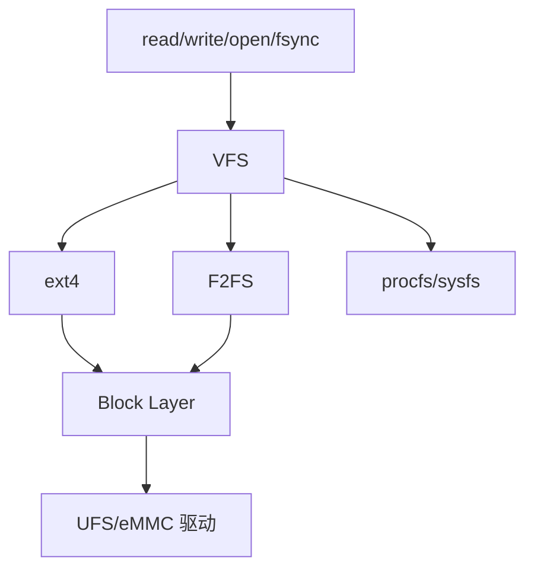

## 16.2 ext4 与 F2FS

Android 设备常见 ext4 或 F2FS。两者设计取舍不同：

- ext4：成熟、通用、日志文件系统。
- F2FS：针对闪存特征设计，采用日志结构思想。

实际性能高度依赖内核版本、挂载参数、存储硬件、文件大小和工作负载。

## 16.3 Page Cache 与 writeback

`write()` 返回不一定表示数据已持久化到闪存。数据可能先写入 page cache，由后台 writeback 刷盘。

`fsync()` 会显著影响延迟，尤其当：

- 脏页多。
- 文件系统日志提交。
- 存储设备忙。
- 发生 GC、磨损均衡或固件内部操作。

## 16.4 SQLite 事务

数据库性能取决于：

- 事务粒度。
- WAL 或其他 journal 模式。
- 索引。
- 查询计划。
- `fsync` 次数。
- 并发读写。
- 数据库线程和主线程隔离。

把多次小写入合并为事务，通常能显著减少持久化屏障次数。

## 16.5 mmap

mmap 将文件或匿名内存映射到地址空间。优势：

- 可按需缺页加载。
- 减少显式 read/copy。
- 便于进程间共享。

风险：

- 访问延迟在缺页时突然出现。
- 文件截断或 I/O 错误可能触发信号。
- 大量随机映射造成页表和 TLB 压力。

## 16.6 DMA-BUF

图形、相机和媒体数据常用 DMA-BUF 在设备和进程之间共享 Buffer，避免大块像素数据通过 Binder Parcel 复制。

分析内存时，DMA-BUF 可能不完整体现在 Java Heap 或普通 Native Heap 中，需要结合系统级统计。

## 16.7 I/O 调度和优先级

块层、文件系统、cgroup I/O 策略和存储固件共同影响延迟。应用看到的慢 I/O 可能来自：

- page fault。
- 文件系统锁。
- writeback。
- 存储队列拥塞。
- 闪存内部 GC。
- 加密层。
- 竞争进程。

---

# 17. Linux 驱动与设备接口

## 17.1 驱动模型

典型驱动流程：

1. 驱动注册到总线。
2. 设备由设备树、ACPI 或总线枚举发现。
3. 匹配 compatible/ID。
4. 调用 probe。
5. 申请中断、时钟、GPIO、regulator、DMA。
6. 创建字符设备、sysfs 节点或子系统接口。

## 17.2 用户空间访问驱动

常见方式：

- `open/read/write/ioctl`。
- `mmap`。
- `poll/epoll`。
- sysfs 属性。
- netlink。
- Binderized HAL 间接访问。

## 17.3 中断

硬件事件触发中断后，驱动通常把工作拆分为：

- 快速中断处理。
- threaded IRQ、workqueue、tasklet 或其他延后机制。

中断处理过长可能增加调度延迟。中断风暴会表现为 CPU 时间大量进入 irq/softirq。

## 17.4 `/proc`、`/sys` 与 `/dev`

- `/proc`：进程和内核运行状态视图。
- `/sys`：设备模型、驱动和内核对象属性。
- `/dev`：设备节点。

这些是排查 CPU、内存、驱动、电源和设备状态的重要入口。

---

# 18. GKI、KMI 与厂商模块

Android Common Kernel（ACK）在上游 LTS 内核基础上承载 Android 所需的公共改动。
Generic Kernel Image（GKI）进一步把设备无关的公共内核与 SoC、板级代码分开，
降低每台设备长期维护一棵大型私有内核分支的成本。

```mermaid
flowchart TB
    U["Linux LTS / upstream"] --> A["Android Common Kernel"]
    A --> G["GKI 内核"]
    A --> M["GKI modules"]
    K["KMI 稳定接口"] --> V["Vendor modules"]
    G --> K
    G --> B["通用调度、内存、VFS、安全等核心能力"]
    M --> C["与 GKI 同步构建的通用可加载能力"]
    V --> H["SoC 与设备专用驱动"]
```

GKI 不表示一份内核镜像无需任何设备代码就能驱动所有硬件。设备树、vendor ramdisk、
固件、HAL 和厂商模块仍负责具体 SoC 与板级差异；GKI 解决的是公共核心与设备扩展
之间的边界和更新关系。

## 18.1 KMI 稳定的范围

KMI（Kernel Module Interface）是 GKI 内核与厂商模块之间的内核二进制接口，
包括受监控的导出符号及其相关类型布局。它不是：

- Linux mainline 对所有内核模块承诺的永久 ABI；
- 所有内核导出符号的集合；
- Android 用户空间 ABI、HAL 接口或 VINTF；
- 跨 Android 版本和跨 LTS 分支任意混用模块的保证。

KMI 只在特定 Android 版本与 LTS 内核组合的分支内维护，例如
`android15-6.6`。厂商模块只能依赖符号列表允许的 KMI 符号，并应使用与目标 GKI
兼容的配置、AOSP LLVM 工具链和构建环境。ABI 监控会比较符号与类型变化；
`CONFIG_MODVERSIONS` 还能在加载阶段辅助发现不兼容模块。

## 18.2 GKI module 与 Vendor module

| 类型 | 主要内容 | 接口约束 | 更新关系 |
|---|---|---|---|
| GKI module | 通用、硬件无关但不必内建的能力 | 受保护模块可使用非 KMI 内部接口 | 必须与对应 GKI 一起构建和更新 |
| Vendor module | SoC、板级和设备专用驱动 | 只能依赖稳定 KMI 与允许的扩展点 | 可在 KMI 兼容范围内独立于 GKI 构建 |

产品相关代码通常应放在厂商模块，而不是直接修改 GKI 公共核心。通用改动优先提交
上游；确实需要从核心路径调用厂商扩展时，Android 还提供受约束的 vendor hook。
hook 不是随意绕过 KMI 的入口，仍要考虑回调上下文、数据生命周期和 ABI 兼容。

## 18.3 模块所在分区与加载时机

具体布局随 Android 版本和设备启动配置变化，常见关系是：

```text
boot
  └─ GKI 内核

init_boot（较新启动设备）
  └─ 通用 ramdisk；不存放内核

system_dlkm
  └─ 与 GKI 同步构建、签名的 GKI modules

vendor_boot 中的 vendor ramdisk
  └─ 挂载根文件系统前就必须加载的厂商模块

vendor_dlkm 或 vendor
  └─ 启动后期加载的厂商模块
```

早期存储、文件系统或加密链路依赖的模块必须进入 first-stage `init` 可访问的位置。
`modules.dep`、`modules.alias` 和 `modules.load` 描述依赖与加载顺序，但模块仍应尽量
避免把正确性建立在脆弱的手工顺序上；driver probe dependency 应由设备模型表达。

## 18.4 常见加载失败

- `Unknown symbol`：引用了不存在、未导出或不在允许 KMI 中的符号；
- `version magic` / modversion 不匹配：模块和运行内核的版本、配置或 ABI 不一致；
- 签名、AVB 或 SELinux 拒绝：模块来源、分区或加载者权限不符合策略；
- 依赖未就绪：`modules.dep`、模块位置或 first-stage 加载集合不完整；
- probe 失败：模块已经加载，但设备树、固件、时钟、中断或 regulator 等资源有误。

排查时先区分“`.ko` 没有装载”和“模块已装载但驱动没有绑定设备”。前者查看
模块签名、依赖和 KMI，后者查看 `/sys/bus/*/devices`、driver bind 状态、设备树和
`dmesg` 中的 probe 错误。

---

# 19. Android 安全模型

Android 的权限边界由应用身份、Linux 权限和强制访问控制共同构成。排查权限问题时，
需要区分 Framework 授权、UID/GID、Capability、SELinux 与系统调用过滤分别在哪一层生效。

## 19.1 SELinux

Android 使用 SELinux enforcing 模式实施强制访问控制。一次操作通常需要同时满足：

- Linux DAC 权限。
- Android Framework 权限或 AppOps。
- SELinux allow 规则。

`avc: denied` 不应直接通过扩大权限粗暴解决。正确流程：

1. 确认源域和目标类型。
2. 确认操作是否符合安全架构。
3. 调整文件标签或服务边界。
4. 只添加最小必要规则。
5. 验证无越权通路。

## 19.2 Linux Capability

系统服务可使用 capability 获得特定内核权限，而不必以完整 root 权限运行。capability 仍需与 SELinux、UID/GID 和 seccomp 共同考虑。

## 19.3 seccomp

seccomp 可限制进程允许执行的系统调用，减少攻击面。Native 服务增加新系统调用时，可能还需要更新相应策略。

---

# 20. Android 网络体系

## 20.1 数据通路概览

```mermaid
flowchart LR
    A[应用 Socket API] --> B[Bionic]
    B --> C[Linux Socket]
    C --> D[TCP/UDP/IP]
    D --> E[路由 / 防火墙 / eBPF]
    E --> F[Wi-Fi / 蜂窝驱动]
    F --> G[网络硬件]
```

Framework 还通过 ConnectivityService、NetworkAgent、netd 等管理：

- 网络选择。
- 默认网络。
- VPN。
- DNS。
- UID 网络策略。
- 网络验证。
- 路由和防火墙。

## 20.2 epoll

高并发 Native 服务常使用 epoll：

1. 把多个 FD 注册到 epoll。
2. 线程阻塞在 `epoll_wait`。
3. 内核返回就绪事件。
4. 用户空间处理读写。

需要理解 LT 与 ET：

- LT：条件仍满足时可重复通知。
- ET：状态边沿变化时通知，通常必须循环读写到 `EAGAIN`。

## 20.3 网络性能常见瓶颈

- DNS 慢。
- TCP 建连和 TLS 握手。
- 丢包与重传。
- 蜂窝网络唤醒成本。
- 小包频繁发送。
- 错误超时和重试策略。
- 主线程网络处理。
- Socket Buffer 过小或过大。
- VPN、代理或防火墙额外路径。

## 20.4 网络与功耗

无线硬件从低功耗状态唤醒有固定成本。把许多零散请求合并，通常比持续发送小请求更省电。Doze 和后台网络限制也是基于这一现实。

---

# 21. 性能分析工具体系

## 21.1 工具与问题类型

| 工具 | 主要用途 |
|---|---|
| Perfetto | 系统级时间线、调度、Binder、频率、图形、内存、I/O |
| Systrace/atrace | 基于 ftrace 和用户 Trace Marker 的系统追踪 |
| Simpleperf | Android 上的 CPU 采样、硬件事件和调用栈分析 |
| Linux perf | 内核性能计数器、采样、调度和事件分析 |
| ftrace | 内核函数、调度、irq、tracepoint 追踪 |
| logcat | Framework、应用和 Native 日志 |
| dumpsys | 查询系统服务内部状态 |
| bugreport | 汇总日志、dumpsys、ANR、系统状态 |
| tombstone | Native 崩溃上下文和回溯 |
| heapprofd | Native heap 采样分析 |
| Java heap dump | 托管对象引用和泄漏分析 |
| `/proc` | 进程、线程、内存、调度和文件描述符状态 |

## 21.2 Perfetto

Perfetto 是现代 Android 系统级性能分析主工具，可采集：

- ftrace 调度事件。
- CPU 频率和 idle 状态。
- Binder transaction。
- FrameTimeline。
- SurfaceFlinger 图层信息。
- atrace 自定义区间。
- 内存计数器。
- Native heap profile。
- Java heap profile。
- `procfs` 统计。

### Perfetto 阅读顺序

1. 先定位异常时间范围。
2. 找用户可感知事件：输入、启动、帧、音频 underrun。
3. 看关键线程是 Running、Runnable 还是 Sleeping。
4. 如果 Runnable，找谁占 CPU。
5. 如果 Sleeping，找等待对象：futex、Binder、I/O、epoll。
6. 沿 Binder 跨进程追踪。
7. 查看 CPU 频率、核类型和热限制。
8. 对照日志和系统状态。

## 21.3 Systrace、atrace 与 ftrace 的关系

可以把三者理解为：

```text
ftrace：Linux 内核追踪基础设施
atrace：Android 设备侧控制器，启用内核和用户空间类别
systrace：历史上的主机侧封装与 HTML 报告工具
Perfetto：更现代的采集、存储、查询和分析体系
```

掌握 Systrace 的轨道和事件仍有价值，但新问题通常优先使用 Perfetto。

## 21.4 Simpleperf

Simpleperf 适合回答：CPU 时间究竟花在哪些函数？

常见命令：

```bash
# 查看可用事件
simpleperf list

# 统计事件
simpleperf stat -p <pid> --duration 10

# 采样调用栈
simpleperf record -p <pid> -g --duration 10

# 查看报告
simpleperf report
```

关键注意：

- 需要符号文件才能得到高质量函数名和源码位置。
- 栈展开质量取决于 frame pointer、DWARF 和编译配置。
- 采样频率太高会增加开销。
- Java、JIT 和 Native 混合栈需要相应支持和正确产物。

## 21.5 perf

Linux perf 可用于：

- CPU cycles/instructions。
- cache miss。
- branch miss。
- 调度事件。
- 火焰图数据。
- 内核和用户函数采样。

在 Android 量产设备上可能受到权限、内核配置和 SELinux 限制。

## 21.6 常用 adb 命令

```bash
adb shell ps -A -T
adb shell top -H
adb shell dumpsys activity processes
adb shell dumpsys meminfo <package>
adb shell cat /proc/<pid>/status
adb shell cat /proc/<pid>/smaps_rollup
adb shell cat /proc/pressure/memory
adb shell cat /proc/pressure/cpu
adb shell cat /proc/pressure/io
adb shell dmesg
adb logcat -b all
adb bugreport
```

不同设备对命令和文件权限限制不同。

## 21.7 `dumpsys` 的价值

`dumpsys` 不是单一工具，而是调用各 Binder 服务的 dump 接口。常见：

```bash
adb shell dumpsys activity
adb shell dumpsys window
adb shell dumpsys package
adb shell dumpsys power
adb shell dumpsys batterystats
adb shell dumpsys SurfaceFlinger
adb shell dumpsys gfxinfo <package>
adb shell dumpsys input
adb shell dumpsys cpuinfo
```

## 21.8 分析工具选择原则

- 时间线问题：Perfetto。
- CPU 热点：Simpleperf/perf。
- Java 对象泄漏：heap dump。
- Native 内存增长：heapprofd、malloc 调试、smaps。
- Native 崩溃：tombstone、lldb、符号化。
- 系统服务状态：dumpsys。
- 驱动与内核：ftrace、dmesg、perf、tracepoint。
- 长时间现场问题：bugreport、统计日志和低开销监控。

---

# 22. 启动性能分析

## 22.1 启动时间组成

```mermaid
flowchart LR
    A[点击/Intent] --> B[AMS/ATMS 解析]
    B --> C[Zygote fork]
    C --> D[进程初始化]
    D --> E[Application 创建]
    E --> F[Activity 创建]
    F --> G[布局与资源加载]
    G --> H[渲染首帧]
    H --> I[SurfaceFlinger 显示]
```

## 22.2 冷启动瓶颈

- Zygote fork 和进程调度。
- 大量动态库加载和重定位。
- DEX/OAT 页缺失。
- Application 中同步初始化。
- ContentProvider 自动初始化。
- 类初始化和反射。
- 首屏资源和图片解码。
- 数据库打开与迁移。
- 主线程 Binder 调用。
- Shader 或 RenderThread 初始化。

## 22.3 启动分析步骤

1. 清楚定义冷、温、热启动。
2. 固定设备温度、电量、刷新率和后台负载。
3. 记录多次分布，不只看一次。
4. 使用 Perfetto 的 app startup 和 FrameTimeline。
5. 将时间拆到进程创建、bindApplication、Activity 生命周期和首帧。
6. 对主线程长 slice 继续下钻。
7. 检查 major fault、I/O、Binder、锁和 GC。
8. 修改后对比中位数和尾延迟。

## 22.4 启动优化原则

- 首屏只做首屏必需工作。
- 延迟初始化非关键模块。
- 减少自动初始化 Provider。
- 合并小 I/O，避免主线程 I/O。
- 使用 Baseline/Profile 引导编译。
- 减少类加载、反射和静态初始化。
- 避免启动时创建大线程池。
- 避免把所有初始化简单挪到后台，导致 CPU 争抢首帧。

---

# 23. 卡顿与显示性能分析

## 23.1 先判断慢在哪一段

一帧慢可能是：

1. 输入送达慢。
2. 主线程处理慢。
3. RenderThread 慢。
4. GPU 慢。
5. SurfaceFlinger 慢。
6. HWC/显示驱动慢。
7. Buffer 不可用。
8. 线程调度延迟。

## 23.2 Perfetto 中的关键轨道

- UI Thread。
- RenderThread。
- FrameTimeline。
- Choreographer callbacks。
- SurfaceFlinger。
- GPU completion/fence。
- CPU frequency。
- Scheduler slices。
- Binder transaction。
- GC。

## 23.3 Runnable 但未运行

关键线程处于 Runnable，却长时间没有 Running，说明：

- CPU 被其他任务占用。
- 线程优先级或 cgroup 不利。
- CPU 频率/容量不足。
- 实时线程或中断抢占。
- 热限制导致性能下降。

## 23.4 Running 时间过长

需要进一步用 Simpleperf 或方法 Trace 找热点：

- 算法复杂度。
- 大量对象创建。
- Bitmap 操作。
- 文本排版。
- View 层级遍历。
- JSON 解析。
- Native 算法。

## 23.5 锁等待

主线程等待 futex 时：

1. 确认锁对象或等待地址。
2. 找持锁线程。
3. 看持锁线程是在运行、睡眠还是等待 Binder。
4. 沿链继续追踪。
5. 检查是否持锁执行 I/O 或回调。

## 23.6 GC 卡顿

不要看到 GC 就直接认定 GC 是根因。需要区分：

- GC 暂停是否跨过帧 deadline。
- 是 GC 本身慢，还是线程难以挂起。
- 是否因业务高分配率频繁触发。
- 是否有更长的 CPU 竞争和 Binder 等待。

---

# 24. CPU 性能分析

## 24.1 CPU 高的几种含义

- 单线程满核。
- 多线程并行占满多个核。
- 线程频繁唤醒但每次工作很短。
- 内核态高。
- irq/softirq 高。
- Runnable 队列长但进程自身 CPU 不高。

## 24.2 分析流程

```mermaid
flowchart TB
    A[确认 CPU 异常时间段] --> B[按进程看 CPU]
    B --> C[按线程看 CPU]
    C --> D{用户态还是内核态}
    D -->|用户态| E[Simpleperf/火焰图]
    D -->|内核态| F[perf/ftrace/irq/系统调用]
    E --> G[定位热点函数和调用路径]
    F --> G
    G --> H[验证算法、锁、轮询或数据规模]
```

## 24.3 常见 CPU 问题

### 忙轮询

线程本应等待事件，却不断循环检查状态。表现为：

- 持续 Running。
- 调用栈集中在循环。
- 系统调用少或反复非阻塞调用。

### 锁自旋或竞争

大量时间消耗在锁、原子操作和 cache line 抖动。

### 频繁唤醒

CPU 总占用未必极高，但深度睡眠被破坏，功耗上升。

### 过度并行

线程数超过有效并行度，导致：

- 上下文切换。
- 缓存失效。
- 争锁。
- 大小核迁移。

### 内核态异常

- 网络软中断。
- 存储 I/O。
- 内存回收。
- 驱动 ioctl。
- Binder 驱动活动。

## 24.4 硬件计数器

可关注：

- cycles。
- instructions。
- IPC/CPI。
- branch misses。
- cache references/misses。
- context switches。
- page faults。

计数器要结合微架构和工作负载解释。例如 cache miss 高不一定是问题，关键是是否造成性能瓶颈，以及是否可通过数据布局改善。

---

# 25. 内存问题分析

## 25.1 先分类

```mermaid
flowchart TB
    A[内存增长] --> B{增长区域}
    B --> C[Java Heap]
    B --> D[Native Heap]
    B --> E[Graphics / DMA-BUF]
    B --> F[mmap / Code / File]
    B --> G[线程栈]
    B --> H[Kernel 资源]
```

## 25.2 Java Heap 泄漏

步骤：

1. 确认堆在稳定操作后是否持续增长。
2. 强制 GC 后是否下降。
3. 获取 heap dump。
4. 找大对象和数量异常类。
5. 找 GC Root 引用链。
6. 判断是缓存策略还是生命周期泄漏。

常见引用链：

- 单例持有 Activity。
- 静态集合。
- 未取消监听器。
- Handler 延迟消息。
- Binder 回调未注销。
- ThreadLocal。
- ClassLoader 和动态模块。

## 25.3 Native Heap 泄漏

可使用：

- heapprofd。
- malloc 调试。
- Simpleperf 采样分配热点。
- `dumpsys meminfo`。
- `smaps`。

常见来源：

- C++ 对象未释放。
- JNI GlobalRef。
- Native Buffer 缓存无上限。
- 第三方库。
- 解码器和媒体资源。
- OpenGL/Vulkan 对象。

## 25.4 线程泄漏

每个线程都消耗：

- 用户栈虚拟地址。
- 实际驻留栈页。
- 内核 task 和内核栈。
- TLS。
- 调度和同步资源。

线程数持续增长可通过：

```bash
adb shell ps -T -p <pid>
adb shell ls /proc/<pid>/task | wc -l
```

## 25.5 Bitmap 与 Graphics 内存

Bitmap 像素、GraphicBuffer、GPU 资源和 DMA-BUF 可能分散在不同统计项。应结合：

- Java 对象数量。
- Native heap。
- `dumpsys meminfo` Graphics。
- SurfaceFlinger 图层和 Buffer。
- DMA-BUF 统计。

## 25.6 内存抖动和 LMK

即使没有泄漏，也可能因工作集过大导致：

- page cache 反复回收和重新读取。
- zram 频繁换入换出。
- PSI 升高。
- 前后台切换频繁重启进程。
- `lmkd` 连续杀进程。

这是“内存容量/工作集问题”，不一定是传统泄漏。

---

# 26. Binder 与系统服务性能分析

## 26.1 Binder 慢调用类型

- 客户端 Parcel 构造慢。
- Binder 驱动排队。
- 服务端线程池无空闲线程。
- 服务端处理慢。
- 服务端嵌套调用慢。
- 返回数据过大。
- 客户端收到回复后处理慢。

## 26.2 线程池饥饿

现象：

- 多个客户端同步 Binder 阻塞。
- 服务端 Binder 线程全部处于等待或长任务。
- 新请求迟迟无法调度。

解决方向：

- 缩短 Binder 入口任务。
- 将耗时操作转移到受控工作线程。
- 避免持锁 Binder 调用。
- 合理使用异步接口。
- 限制回调频率和数据量。
- 修复下游服务拥塞，而不是盲目扩大线程池。

## 26.3 系统服务锁

系统服务状态复杂，常有全局锁。风险包括：

- 锁覆盖范围过大。
- 锁内 I/O。
- 锁内 Binder 调用。
- 多锁顺序不一致。
- 回调重入。

分析时要把 Java monitor、Native mutex 和跨进程等待统一成一张依赖图。

## 26.4 Binder 数据设计

- 控制 Parcel 大小。
- 大数据使用 FD、共享内存或流。
- 避免频繁传递巨大对象列表。
- 给接口设计分页、增量和批处理。
- 回调接口避免事件风暴。

---

# 27. I/O 性能分析

## 27.1 I/O 慢的层次

```mermaid
flowchart TB
    A[应用/系统服务] --> B[libc / SQLite / Runtime]
    B --> C[VFS / 文件系统]
    C --> D[Page Cache / Writeback]
    D --> E[Block Layer]
    E --> F[存储驱动]
    F --> G[UFS/eMMC 固件与介质]
```

## 27.2 关键问题

- 是读慢还是写慢？
- 是同步 I/O 还是后台 I/O？
- 是否发生 major fault？
- 是否被文件锁或数据库锁阻塞？
- 是否在 `fsync`？
- 存储队列是否拥塞？
- 是否有大量小文件随机访问？
- 是否与内存回收相互放大？

## 27.3 优化原则

- 主线程不做不可预测 I/O。
- 合并小写入和事务。
- 避免高频 `fsync`。
- 对启动关键资源优化布局和读取顺序。
- 合理使用缓存，但设置容量上限。
- 避免无效扫描和重复解析。
- 使用异步不代表问题自动消失，仍需控制队列和优先级。

---

# 28. 功耗分析与优化

功耗问题本质上是硬件资源在多长时间内处于什么状态，需要同时分析 Android 策略、
内核调度、唤醒、调频、空闲状态和热反馈。

## 28.1 整体能效链路：Power HAL 与性能提示

Android Framework 知道启动、交互、音视频等场景，内核知道任务利用率和硬件状态，
Power HAL 负责把平台相关策略连接起来。常见输入包括系统状态、task profile、
Power Mode，以及 ADPF Performance Hint Session 提交的线程集合、目标工作时长和
实际工作时长。PELT、uclamp 和 EAS 的调度语义见第 14.6～14.7 节。

```mermaid
flowchart LR
    A["应用工作期限 / Framework 场景"] --> H["ADPF / Power HAL"]
    H --> P["平台功耗策略"]
    P --> U["task profile / cpuset / uclamp"]
    U --> E["PELT / EAS 选核"]
    U --> Q["PELT / schedutil 频率请求"]
    E --> W["完成时间、能耗与温升"]
    Q --> F["CPUFreq / DVFS"]
    F --> W
    W --> T["Thermal 约束"]
    T --> P
```

提示表达的是工作意图，不是“固定打开大核”的命令。设备拓扑、可用频率、热余量
和厂商策略不同，同一个提示的具体动作也可能不同。持续发送过强提示会增加能耗，
更快触发热限制，反而降低长时间性能。

## 28.2 主要功耗来源

- CPU 活跃时间和频率。
- GPU 活跃时间。
- 显示亮度与刷新率。
- 蜂窝和 Wi-Fi 射频。
- GNSS。
- 相机、音频和传感器。
- 存储 I/O。
- 内存带宽。
- 设备无法进入 suspend。

## 28.3 WakeLock

WakeLock 用于阻止系统进入某些低功耗状态。风险：

- 忘记释放。
- 持有时间过长。
- 高频短 WakeLock 导致反复唤醒。
- 超时设置过大。
- 工作实际已结束但锁仍存在。

排查：

```bash
adb shell dumpsys power
adb shell dumpsys batterystats
```

## 28.4 Suspend 与唤醒源

屏幕关闭不等于系统已 suspend。若存在活跃 Wakeup Source、定时器、中断或后台工作，设备可能持续处于 active/idle 状态。

分析应区分：

- 屏幕功耗。
- AP 是否进入 suspend。
- suspend 后被谁唤醒。
- 唤醒后工作持续多久。
- 是否形成周期性唤醒。

## 28.5 Doze 和 App Standby

Doze 在设备长时间未使用时限制后台 CPU、网络、Alarm、Job 和同步活动，并通过维护窗口批量执行延迟任务。

设计后台任务时应：

- 使用 JobScheduler/WorkManager 等受系统调度机制。
- 合并任务。
- 避免高频精确闹钟。
- 使用有时限的 WakeLock。
- 网络请求批处理。

## 28.6 CPUFreq、schedutil 与 DVFS

CPUFreq 分为三个主要层次：

- core：维护 `cpufreq_policy` 和 sysfs 等公共接口；
- governor：根据负载决定请求哪个性能点；
- driver：把请求转换为平台具体的频率、电压或硬件性能状态。

一组 CPU 可能共享同一个 `cpufreq_policy`，因为它们共用时钟或电压域。调整其中
一个 CPU 的策略，实际可能影响整个 cluster。

`schedutil` 直接使用调度器提供的 PELT 利用率，并考虑有效 uclamp 约束，向
CPUFreq driver 请求频率。请求频率不等于硬件瞬时真实频率：转换延迟、OPP 表、
电源预算、thermal cooling state 和固件控制都可能进一步限制结果。

排查时可结合设备权限查看：

```bash
adb shell cat /sys/devices/system/cpu/cpufreq/policy*/scaling_governor
adb shell cat /sys/devices/system/cpu/cpufreq/policy*/scaling_cur_freq
adb shell cat /sys/devices/system/cpu/cpufreq/policy*/scaling_min_freq
adb shell cat /sys/devices/system/cpu/cpufreq/policy*/scaling_max_freq
```

不要只观察 `scaling_cur_freq` 单点值。应把频率、Running/Runnable 时间、任务所在
CPU、工作完成时间和 thermal 状态放到同一时间线上分析。

## 28.7 CPUIdle 与唤醒成本

CPU 没有可运行任务时进入 idle loop。CPUIdle driver 提供平台支持的 idle state，
governor 根据预计空闲时间选择状态。更深状态通常功耗更低，但进入和退出代价更高：

- target residency：进入该状态后，至少空闲多久才可能抵消进入成本；
- exit latency：收到唤醒事件后恢复执行所需的最坏时间上界；
- PM QoS：限制可接受的恢复延迟，可能阻止选择过深状态。

因此，降低平均 CPU 利用率不一定降低功耗。高频 timer、轮询、短 WakeLock、零散
网络包或 IRQ 会不断打断 idle，使 CPU 无法达到深状态的 target residency。

```bash
adb shell cat /sys/devices/system/cpu/cpuidle/current_governor_ro
adb shell cat /sys/devices/system/cpu/cpu0/cpuidle/state*/name
adb shell cat /sys/devices/system/cpu/cpu0/cpuidle/state*/time
adb shell cat /sys/devices/system/cpu/cpu0/cpuidle/state*/usage
```

CPUIdle 是每个 CPU 在系统仍处于运行状态时的空闲管理；system suspend 是更大范围
的系统低功耗状态，两者不能混为一谈。

## 28.8 Thermal 约束与反馈环

Thermal 不是最后才触发的“保护开关”，而是持续参与性能预算的反馈系统：

```text
传感器温度与平台估计
  → kernel thermal zone / 平台控制
  → cooling device 限制 CPU、GPU、充电或其他部件
  → Thermal HAL 上报温度与 severity
  → Framework、系统服务和应用降低工作强度
```

Android 10 及以后由 Framework thermal service 持续接收 Thermal HAL 2.0 信号；
较新版本使用 AIDL 接口。具体限制可能由内核、固件或厂商服务执行，但所有导致
设备性能受限的重要热与供电状态都应形成可观察的 severity。

优化必须区分：

- 短时延迟是否改善；
- 稳态吞吐是否提高；
- 功耗和温升是否增加；
- 是否更早进入 throttling；
- 降频发生在 CPU、GPU、内存总线还是其他电源域。

只比较冷机的前几次结果，往往会把不可持续的 Boost 误认为长期优化。

## 28.9 功耗问题分析流程

```mermaid
flowchart TB
    A[固定场景、亮度、网络和环境温度] --> B[确认屏上、屏下或 suspend 阶段]
    B --> C[查看 WakeLock、timer、IRQ 与唤醒源]
    C --> D[关联 PELT、选核、频率与 idle state]
    D --> E[检查 CPU/GPU/网络/传感器和内存带宽]
    E --> F[对照 Thermal severity 与限频]
    F --> G[定位 UID、线程、驱动和调用路径]
    G --> H[修改单一因素并长时间重复测量]
```

Perfetto 适合关联调度、频率、idle、Binder 和业务区间；外部功耗仪或可靠的板级
Power Stats 用于确认真实能量变化。电量百分比和一次瞬时电流不足以证明优化有效。

## 28.10 功耗优化的三个杠杆

1. **减少次数**：合并唤醒、网络、timer 和设备事务。
2. **缩短持续时间**：提高有效工作比例，完成后尽快释放 WakeLock 和硬件资源。
3. **降低强度**：选择合适频率、核、刷新率、采样率和算法精度。

三个杠杆会互相影响。例如降低频率可能延长活跃时间，批处理虽然减少唤醒次数，
却可能提高瞬时负载。最终应比较任务总能量、用户可见延迟和热稳定状态。

---

# 29. 稳定性问题分析

## 29.1 Java 异常崩溃

分析：

- 异常类型。
- 首个业务栈帧。
- 线程。
- 前置状态。
- 是否版本相关。
- 是否由 Binder 远端异常转化。

不要只修最外层 `NullPointerException`，还要确认对象为何进入非法状态。

## 29.2 Native 崩溃

Tombstone 通常包含：

- 信号和 fault address。
- 寄存器。
- 线程回溯。
- 内存映射。
- 其他线程。
- Build ID。

常见信号：

- `SIGSEGV`：非法内存访问。
- `SIGABRT`：主动 abort、断言或运行时检测。
- `SIGBUS`：总线错误、错误 mmap 访问等。
- `SIGILL`：非法指令。
- `SIGFPE`：算术异常。

Native 崩溃必须使用匹配构建的符号文件符号化。

## 29.3 ANR

ANR 常见原因：

- 主线程长计算。
- 主线程 I/O。
- 主线程同步 Binder 等待。
- 锁竞争。
- BroadcastReceiver/Service 超时。
- Binder 线程池饥饿间接拖住主线程。
- 系统整体调度或 I/O 压力。

### ANR 分析步骤

1. 确认 ANR 类型和时间。
2. 看主线程状态。
3. 若等待锁，找持锁线程。
4. 若等待 Binder，找服务端。
5. 若 Runnable，检查 CPU 竞争和调度延迟。
6. 对照 Perfetto、logcat 和系统负载。
7. 不要只看 ANR 文件中某一瞬间的栈。

## 29.4 system_server Watchdog

Watchdog 会监控关键线程和锁是否在规定时间内响应。可能原因：

- 系统服务死锁。
- Handler 长任务。
- Binder 链路卡死。
- Native 服务不返回。
- 存储或驱动异常。

system_server Watchdog 往往是系统级级联故障，需要结合所有被监控线程和 Binder 依赖分析。

## 29.5 服务反复崩溃和重启循环

关键进程反复崩溃可能导致：

- init 重启服务。
- system_server 重启。
- SystemUI 重启。
- 启动卡死或重启循环。
- Rescue Party 逐步采取恢复措施。

必须区分：

- 原始崩溃。
- 重启后的二次错误。
- 数据损坏导致的稳定复现。
- 依赖服务未就绪造成的连锁失败。

## 29.6 Binder 服务死亡处理

客户端可注册 DeathRecipient 监听远端 Binder 死亡。健壮客户端应：

- 清理旧代理和状态。
- 避免继续使用已死亡对象。
- 等待服务重新注册。
- 有界重试。
- 防止重连风暴。

## 29.7 稳定性设计原则

- 明确线程和资源所有权。
- 所有跨进程调用都考虑远端死亡。
- 所有异步回调都考虑取消和生命周期。
- 避免无限等待和无限队列。
- 对输入和状态进行服务端校验。
- 关键资源使用超时和兜底。
- 日志包含状态、耗时、调用方和错误码。
- 对恢复动作设置边界，避免重试风暴。

---

# 30. 系统优化的方法论

## 30.1 不要从“优化代码”开始

正确顺序：

```mermaid
flowchart LR
    A[定义问题与指标] --> B[稳定复现]
    B --> C[采集证据]
    C --> D[定位瓶颈层次]
    D --> E[提出可证伪假设]
    E --> F[最小修改实验]
    F --> G[统计验证]
    G --> H[加入回归监控]
```

## 30.2 指标必须明确

不应只说“更流畅”“更省电”。应明确：

- 首帧 P50/P95/P99。
- 帧 deadline miss 比例。
- 主线程最大 Runnable 延迟。
- CPU 时间、cycles 或 instructions。
- Java/Native PSS。
- GC 最大暂停。
- 屏下每小时唤醒次数。
- 某场景能量消耗。
- ANR/崩溃发生率。

## 30.3 相关性不等于因果

例如发现卡顿时恰好发生 GC，不代表 GC 是根因。可能是：

- 高分配率同时导致业务计算和 GC 增多。
- CPU 被其他进程抢占，GC 和主线程都变慢。
- 内存压力触发 reclaim，使所有线程变慢。

需要通过时间线、对照实验和因果链验证。

## 30.4 平均值会掩盖尾延迟

系统体验常由 P95/P99 决定。应记录：

- 分布。
- 异常值。
- 温度。
- 冷热缓存。
- 前后台负载。
- 设备型号。

## 30.5 优化的转移效应

- 把主线程任务移到后台，可能与 RenderThread 抢 CPU。
- 增大缓存减少 I/O，可能提高内存压力和 LMK。
- 提高 CPU 频率改善短时延迟，可能触发热降频。
- 扩大 Binder 线程池，可能放大下游竞争。
- 延迟初始化减少首帧时间，可能把卡顿推迟到首次操作。

优化必须评估全系统代价。

## 30.6 建立证据闭环

一个完整结论应包含：

1. 现象。
2. 量化指标。
3. Trace 或 Profile 证据。
4. 根因链。
5. 修改点。
6. 对照数据。
7. 副作用评估。
8. 回归检测方式。

# 参考资料

1. [Android Open Source Project: Kernel overview](https://source.android.com/docs/core/architecture/kernel)
2. [Android Open Source Project: Maintain a stable KMI](https://source.android.com/docs/core/architecture/kernel/stable-kmi)
3. [Android Open Source Project: Kernel modules overview](https://source.android.com/docs/core/architecture/kernel/modules)
4. [Android Open Source Project: Kernel module support](https://source.android.com/docs/core/architecture/kernel/kernel-module-support)
5. [Android Open Source Project: GKI module partitions](https://source.android.com/docs/core/architecture/partitions/gki-partitions)
6. [Android Open Source Project: Performance Hint API](https://source.android.com/docs/core/perf/performance-hint-api)
7. [Android Open Source Project: Thermal mitigation](https://source.android.com/docs/core/power/thermal-mitigation)
8. [Linux Kernel Documentation: Capacity Aware Scheduling](https://docs.kernel.org/scheduler/sched-capacity.html)
9. [Linux Kernel Documentation: Energy Aware Scheduling](https://docs.kernel.org/scheduler/sched-energy.html)
10. [Linux Kernel Documentation: Utilization Clamping](https://docs.kernel.org/scheduler/sched-util-clamp.html)
11. [Linux Kernel Documentation: CPUFreq](https://docs.kernel.org/admin-guide/pm/cpufreq.html)
12. [Linux Kernel Documentation: CPUIdle](https://docs.kernel.org/admin-guide/pm/cpuidle.html)
