# 计算机网络

核心问题：

> **一个请求如何从本机到达服务端，服务端如何返回结果，以及链路异常时如何用证据定位问题？**

## 全局知识地图

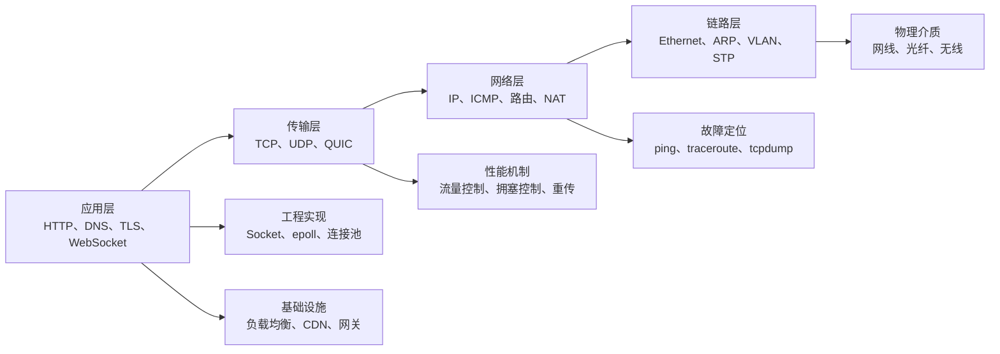

## 第一部分：分层模型

### 1. 计算机网络总览

计算机网络可以从八个关键词建立整体认识：

| 关键词 | 核心含义 |
| --- | --- |
| 分层 | 每一层暴露稳定接口，把复杂问题拆开处理 |
| 封装 | 数据向下传递时逐层增加控制信息，接收端反向解封装 |
| 寻址 | MAC、IP、端口分别定位链路节点、主机与进程 |
| 复用 | 多个应用共享主机和链路，通过协议号、端口等字段区分 |
| 可靠性 | TCP 通过序号、确认、重传和窗口等机制提供可靠字节流 |
| 拥塞控制 | 发送方根据网络承载能力调整速率，避免持续过载 |
| 安全 | TLS 提供身份认证、机密性与完整性保护 |
| 可观测性 | 通过指标、日志、链路追踪和抓包把“猜测”变成“证据” |

一次请求在发送端逐层向下封装，在网络中逐跳转发，再在接收端逐层向上解封装：


> **核心判断**：应用通常关心“发给哪个服务”，传输层关心“交给哪个进程”，网络层关心“送到哪台主机”，链路层关心“这一跳交给哪个接口”。

---

### 2. 网络模型与基础概念

#### 1. OSI 七层模型

OSI 是用于理解职责边界的参考模型，不代表所有协议都能被严格放进单一层级。

| 层级 | 名称 | 主要职责 | 常见协议或对象 |
| ---: | --- | --- | --- |
| 7 | 应用层 | 定义应用交互语义 | HTTP、DNS、SMTP、SSH |
| 6 | 表示层 | 编码、序列化、压缩、加密表示 | JSON、ASN.1、字符编码 |
| 5 | 会话层 | 会话管理、检查点、恢复语义 | RPC 会话、部分中间件会话机制 |
| 4 | 传输层 | 进程到进程通信 | TCP、UDP |
| 3 | 网络层 | 跨网络寻址和路由 | IPv4、IPv6、ICMP |
| 2 | 数据链路层 | 同一链路上的帧传输 | Ethernet、Wi-Fi、VLAN、STP |
| 1 | 物理层 | 比特的物理传输 | 双绞线、光纤、无线电 |

> **边界说明**：TLS 位于应用协议与传输协议之间，ARP/NDP 也横跨链路寻址与网络寻址的边界。分层模型用于分析问题，不必机械归类。

#### 2. TCP/IP 四层模型

工程实现通常按 TCP/IP 四层模型理解：

| TCP/IP 层级 | 对应 OSI | 典型协议 |
| --- | --- | --- |
| 应用层 | 应用层、表示层、会话层 | HTTP、DNS、TLS、SMTP、SSH |
| 传输层 | 传输层 | TCP、UDP、QUIC 所依托的 UDP |
| 网际层 | 网络层 | IPv4、IPv6、ICMP、路由协议承载 |
| 网络接口层 | 数据链路层、物理层 | Ethernet、Wi-Fi、ARP、VLAN |

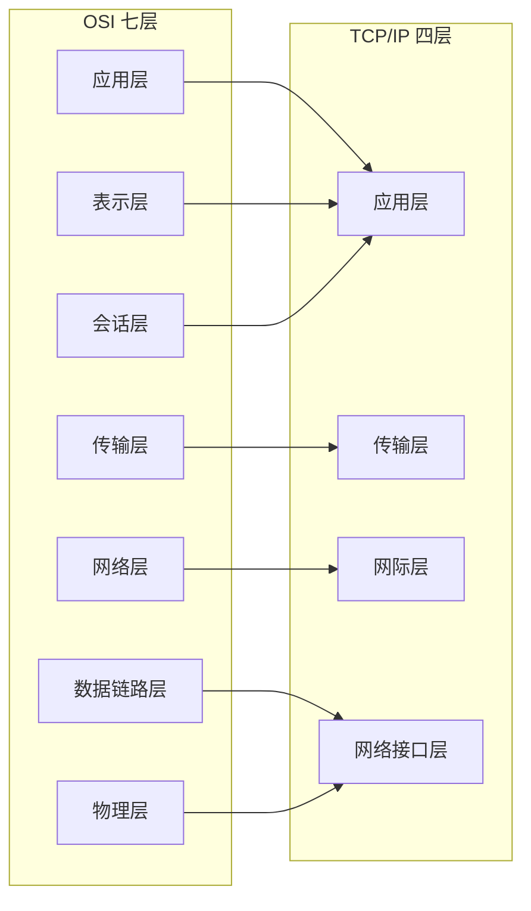

> OSI 更适合描述理论职责，TCP/IP 更贴近实际协议栈。
> 定位故障时，先判断问题属于名称解析、连接、加密、应用协议还是链路与路由，再选择对应证据。

#### 3. 数据封装与解封装

以 HTTP over TCP over IPv4 over Ethernet 为例：

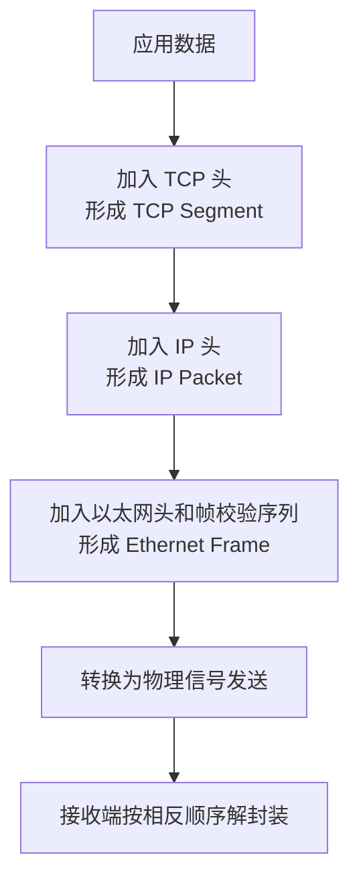

三类地址分别解决不同范围的定位问题：

| 地址 | 所属层次 | 解决的问题 |
| --- | --- | --- |
| MAC 地址 | 链路层 | 当前二层链路中把帧交给哪个接口 |
| IP 地址 | 网络层 | 跨网络把包送到哪台主机或接口 |
| 端口号 | 传输层 | 把数据交给主机上的哪个进程或套接字 |

> **关键点**：端到端通信过程中，IP 地址通常保持不变；每经过一个路由器，二层帧会被拆掉并重新封装，因此源、目标 MAC 会随每一跳变化。NAT、隧道和代理会让这个结论出现例外。


## 第二部分：链路层与局域网

> 交换、ARP、VLAN、STP、MTU 等局域网内的关键机制。

### 3. 交换机、路由器、网关、防火墙

#### 1. 交换机

二层交换机根据目标 MAC 地址转发以太网帧，并通过观察源 MAC 自动学习端口映射。

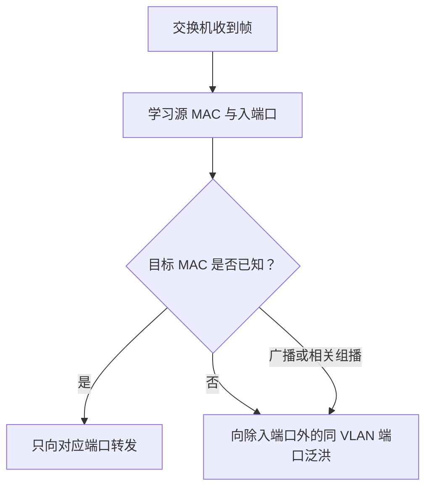

交换机的核心特征：

- 每个端口通常形成独立冲突域。
- 同一 VLAN 仍属于同一广播域。
- MAC 地址表会老化；链路变化时可能重新学习。
- VLAN 可以把一台物理交换机划成多个逻辑二层网络。

#### 2. 路由器

路由器工作在三层，根据目标 IP 查询路由表并选择下一跳。典型转发过程中会：

1. 拆除收到的二层头。
2. 检查目标 IP 并执行最长前缀匹配。
3. 将 TTL 或 Hop Limit 减 1。
4. 为出口链路重新封装新的二层头。
5. 从指定接口发送。

源、目标 IP 通常不变；发生 NAT、隧道封装或代理转发时可能变化。

#### 3. 网关

**默认网关是本机访问非直连网段时使用的下一跳路由器**。例如：

```text
本机：192.168.1.100/24
默认网关：192.168.1.1
```

- 访问 `192.168.1.200`：目标在直连网段，本机直接解析目标的链路层地址。
- 访问 `8.8.8.8`：目标不在直连网段，本机解析默认网关的链路层地址，把帧交给网关。

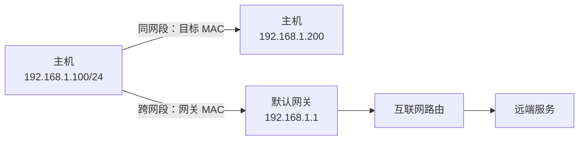

#### 4. 防火墙

防火墙的判定层次和状态能力不同：

| 类型 | 常见判定依据 | 适用场景 |
| --- | --- | --- |
| 无状态包过滤 | IP、端口、协议、方向 | 基础 ACL(Access Control List，访问控制列表)、简单边界控制 |
| 状态防火墙 | 五元组与连接状态 | 允许已建立连接的返回流量 |
| Web 应用防火墙 | URL、Header、参数、请求体特征 | HTTP 攻击与业务规则防护 |
| 多层安全网关 | 应用、身份、内容、行为 | 统一策略、审计与威胁检测 |

> NAT、VLAN 和防火墙不是同一个概念。NAT 修改地址，VLAN 划分二层广播域，防火墙执行访问控制；三者可以部署在同一设备上，但职责不同。

---

### 4. MAC 地址、IP 地址与 ARP

#### 1. MAC 地址与 IP 地址

| 对比项 | MAC 地址 | IP 地址 |
| --- | --- | --- |
| 主要层次 | 数据链路层 | 网络层 |
| 作用范围 | 当前二层链路 | 可跨越多个网络 |
| 核心作用 | 把帧交给本链路上的下一跳接口 | 标识网络位置并参与路由 |
| 常见长度 | 48 位 | IPv4 为 32 位，IPv6 为 128 位 |
| 变化规律 | 逐跳重新封装 | 端到端通常保持不变 |

为什么有 IP 还需要 MAC？

> IP 负责决定“包应去往哪个网络位置”，链路层地址负责完成“当前这一跳如何实际交付”。

跨网段通信的第一跳通常是：

```text
IP 头：
  源 IP = 客户端 IP
  目标 IP = 服务器 IP

以太网头：
  源 MAC = 客户端网卡 MAC
  目标 MAC = 默认网关 MAC
```

下一台路由器会拆除该以太网头，再根据自己的出口链路重新封装。

#### 2. ARP 协议

ARP 用于 IPv4 网络中把同一链路上的 IPv4 地址解析为 MAC 地址。IPv6 不使用 ARP，而使用邻居发现协议 NDP。

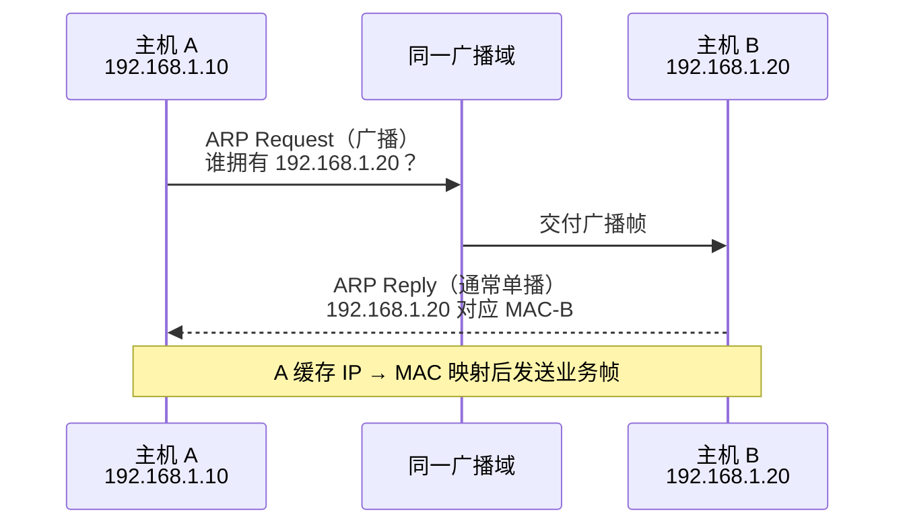

访问跨网段目标时，本机不是解析远端服务器的 MAC，而是解析下一跳网关的 MAC。

#### 3. ARP 缓存

ARP 结果会进入邻居表，并在一定时间后老化。Linux 常用命令：

```bash
ip neigh show
arp -a
```

常见状态包括
- `REACHABLE`: 最近已经确认邻居可达
- `STALE`: MAC 映射仍存在，但较长时间没有确认邻居是否还在线
- `DELAY`: 已经使用了一个 STALE 条目，等待上层协议提供可达性证明
- `PROBE`: 正在主动发送单播 ARP 请求验证邻居
- `FAILED`: 地址解析或可达性探测失败
 
邻居表异常可能表现为同网段偶发不通、网关解析失败或 MAC 地址频繁变化。

#### 4. ARP 欺骗

ARP 本身缺少身份认证，攻击者可以发送伪造映射，把网关 IP 指向攻击者的 MAC，进而实施流量劫持或拒绝服务。

防护措施包括：

- 交换机启用 DHCP Snooping 与 Dynamic ARP Inspection。
- 关键设备使用静态绑定或端口安全策略。
- 对管理网络和业务网络进行 VLAN 与访问控制隔离。
- 使用 TLS 保护上层通信，降低链路被监听和篡改后的影响。
- 监控邻居表变化、重复地址和异常 gratuitous ARP。

> **边界说明**：HTTPS 无法阻止 ARP 欺骗本身，但证书校验与加密可以显著降低攻击者读取或篡改应用数据的能力。

---

### 5. MTU、MSS 与 IP 分片

#### 1. MTU

MTU（Maximum Transmission Unit）表示某条链路一次可承载的最大**三层**数据包大小。常见以太网 MTU 为：

```text
1500 字节
```

这里的 1500 字节通常指以太网帧**负载中的 IP 包大小**，不包含以太网头、FCS、前导码等链路开销。隧道、VPN、容器网络和云网络会增加额外封装，因此有效 MTU 可能更小。

#### 2. MSS

MSS（Maximum Segment Size）是 TCP 单个报文段中可承载的最大应用数据量。双方通常在握手时通过 TCP 选项通告 MSS。

在 IPv4 + TCP 且都没有额外选项时：

```text
MSS = 1500 - 20 字节 IPv4 头 - 20 字节 TCP 头
    = 1460 字节
```

IPv6 基础头为 40 字节，因此同样 MTU 下的典型 MSS 更小。

握手中通告的 MSS 通常按接口或路径 MTU 减去固定 IP/TCP 头计算；TCP 选项不会直接改变对端已经通告的 MSS，但发送端仍必须按实际头长调整本段数据量，避免最终 IP 包超过路径 MTU。

隧道封装、PPPoE、VPN 或中间设备执行 MSS Clamping 时，抓包中看到的 MSS 可能进一步减小。

#### 3. IP 分片与路径 MTU

- IPv4 路由器在允许分片时可以对过大的包进行分片；如果设置 DF 位，则不能分片。
- IPv6 路由器不会在转发过程中分片，过大时返回 ICMPv6 Packet Too Big，由源主机调整。
- 路径 MTU 发现依赖 ICMP/ICMPv6 反馈；如果中间设备错误丢弃这些报文，可能形成 PMTU 黑洞。

> PMTU 黑洞（Path MTU Black Hole）指的是：
> 路径中某一段链路的 MTU 比发送方预期的小，过大的 IP 包被中间设备丢弃；但用于通知发送方“包太大”的 ICMP 报文也被防火墙或设备丢弃，导致发送方不知道应该减小包长，只能不断重发同样大小的包。

分片的代价：

- 任一分片丢失都会影响原始数据报的重组。
- 增加接收端缓存与重组负担。
- NAT、防火墙和隧道设备对分片的处理可能不一致。
- 抓包和故障定位更复杂。

因此应尽量在源端控制报文大小，让 TCP 通过 MSS 避免 IP 分片。

#### 4. 典型现象与排查

MTU 问题常见现象：

- 小包正常，大包失败。
- `ping` 小载荷成功，文件传输或大响应卡住。
- TCP 建连成功，但 TLS 握手、上传或特定网页加载异常。
- VPN、PPPoE、GRE、VXLAN 或容器网络中更容易出现。

Linux 示例：

```bash
# 1472 = 1500 - 20 字节 IPv4 头 - 8 字节 ICMP 头
ping -M do -s 1472 example.com

# 自动探测路径 MTU
tracepath example.com
```

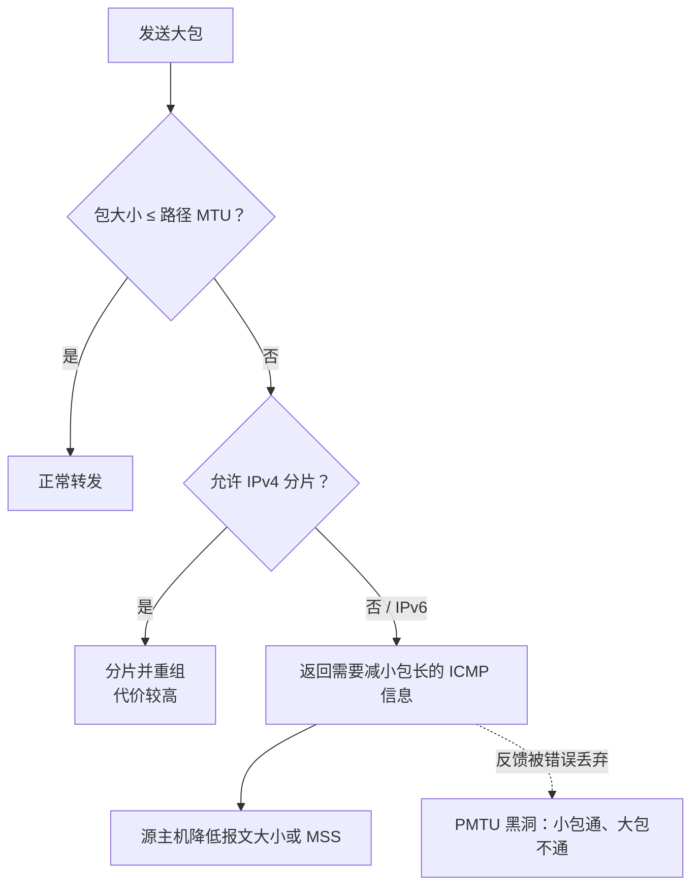

---

### 6. VLAN 与 STP

#### 1. VLAN

VLAN（Virtual LAN）在同一物理交换网络上划分多个逻辑二层广播域。

```text
VLAN 10：研发
VLAN 20：测试
VLAN 30：财务
```

不同 VLAN 默认不能直接进行二层通信，需要通过三层交换机、路由器或防火墙转发。

#### 2. Access 与 Trunk

| 端口类型 | 常见用途 | 帧的 VLAN 标记 |
| --- | --- | --- |
| Access | 连接普通终端 | 终端侧通常不带 802.1Q 标签，交换机按端口归属 VLAN |
| Trunk | 连接交换机、路由器、虚拟化宿主机 | 可承载多个 VLAN，使用 802.1Q 标签区分 |

Trunk 还涉及允许 VLAN 列表、Native VLAN/PVID 等配置。两端配置不一致可能导致部分 VLAN 不通、VLAN 泄漏或生成树异常。

#### 3. VLAN 能否替代防火墙

不能。VLAN 解决广播域划分和基础隔离，防火墙负责基于源、目标、端口、连接状态或应用内容执行策略。

> **正确思路**：先用 VLAN 划分安全域，再通过三层 ACL、防火墙或零信任策略控制域间访问。

#### 4. 二层环路与 STP

二层帧没有类似 IP TTL 的通用逐跳生存时间。存在环路时，广播帧和未知单播可能持续复制，造成：

- 广播风暴。
- MAC 地址表在多个端口间震荡。
- 链路带宽被占满。
- 交换机 CPU 升高，局域网整体不可用。

STP（Spanning Tree Protocol）通过选举根桥、计算无环路径并阻塞冗余端口，让物理冗余拓扑在逻辑上形成一棵树。链路故障后，备用路径可重新进入转发状态。

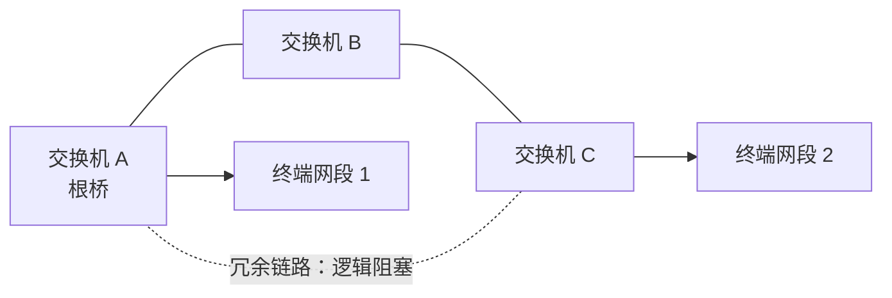

现代网络常使用 RSTP/MSTP 缩短收敛时间。即使启用生成树，也应避免随意桥接网络，并对边缘端口启用 BPDU Guard 等保护。


## 第三部分：IP、子网与路由

> IPv4/IPv6 寻址、CIDR、路由转发、NAT、动态路由与 Anycast。

---

### 7. IPv4、CIDR 与子网

#### 1. IPv4 地址与前缀

IPv4 地址长度为 32 位，通常写成点分十进制：

```text
192.168.1.10
```

CIDR 使用前缀长度表示网络部分，例如：

```text
192.168.1.10/24
```

`/24` 表示前 24 位属于网络前缀，剩余 8 位用于主机地址。对应掩码为 `255.255.255.0`。

判断两个地址是否处于同一子网，本质上是分别与子网掩码做按位与，然后比较网络地址。

#### 2. 常见 CIDR

| CIDR | 子网掩码 | 地址总数 | 常规可用主机数 |
| --- | --- | ---: | ---: |
| /16 | 255.255.0.0 | 65,536 | 65,534 |
| /24 | 255.255.255.0 | 256 | 254 |
| /25 | 255.255.255.128 | 128 | 126 |
| /26 | 255.255.255.192 | 64 | 62 |
| /27 | 255.255.255.224 | 32 | 30 |
| /28 | 255.255.255.240 | 16 | 14 |
| /30 | 255.255.255.252 | 4 | 2 |
| /31 | 255.255.255.254 | 2 | 点到点链路可使用两端地址 |
| /32 | 255.255.255.255 | 1 | 单主机路由 |

常见公式：

```text
地址总数 = 2^(32 - 前缀长度)
常规可用主机数 = 地址总数 - 2
```

减 2 是因为传统广播子网保留网络地址和广播地址。`/31` 点到点链路与 `/32` 主机路由是常见例外。

#### 3. 子网计算示例

给定：

```text
192.168.10.37/27
```

`/27` 剩余 5 位，块大小为：

```text
2^5 = 32
```

最后一个八位组的边界为：

```text
0、32、64、96、128、160、192、224
```

`37` 落在 `32~63`：

```text
网络地址：192.168.10.32
广播地址：192.168.10.63
可用范围：192.168.10.33 ~ 192.168.10.62
常规可用主机数：30
```

快速方法：先计算块大小，再找到不大于目标值的最大块边界。

#### 4. 子网规划示例

需求：

```text
地址块：10.0.0.0/16
至少 30 个子网
每个子网至少 1000 台主机
```

满足 1000 台主机至少需要 10 个主机位：

```text
2^9 - 2 = 510
2^10 - 2 = 1022
```

因此子网前缀为：

```text
32 - 10 = /22
```

从 `/16` 划分到 `/22`，借用 6 位：

```text
子网数 = 2^6 = 64
每个子网常规可用地址 = 1022
```

`/22` 的第三个八位组步长为 4，例如：

```text
10.0.0.0/22
10.0.4.0/22
10.0.8.0/22
...
```

#### 5. 工程中的地址规划原则

- 为业务增长、容灾和基础设施预留空间，避免地址段过度切碎。
- 按环境、地域、业务或安全域规划，保证路由可聚合。
- 容器与 Kubernetes 网络要额外考虑 Pod CIDR、Service CIDR 和节点网段不重叠。
- 云上还要检查 VPC 对等连接、专线、VPN 与本地数据中心的网段冲突。
- 文档中同时记录地址块、用途、路由边界、负责人和变更历史。


#### 6. DHCP：主机如何获得 IPv4 配置

主机接入网络后，通常需要获得四类信息：

```text
本机 IPv4 地址与前缀
默认网关
DNS 服务器
租约期限与其他选项
```

DHCP 的经典 DORA 流程如下：
> DORA 即 DHCPDISCOVER -> DHCPOFFER -> DHCPREQUEST -> DHCPACK

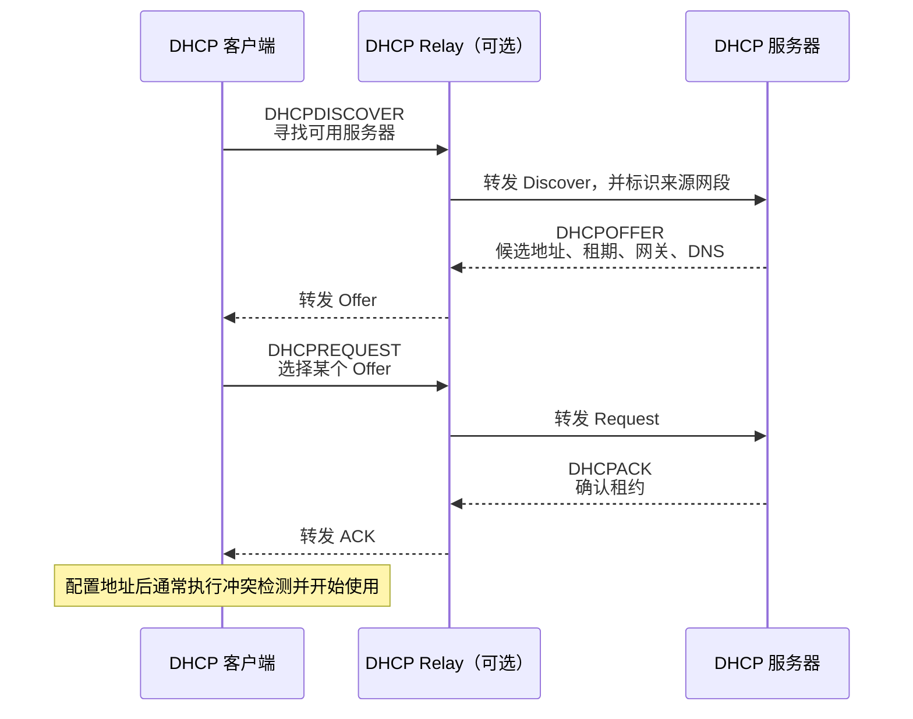

需要注意：

- 客户端最初没有可用地址，报文常以广播方式发送；跨网段部署时由 DHCP Relay 转发。
- DORA 是典型首次获取流程。续租时可能直接向原服务器单播 `DHCPREQUEST`，并不总是完整走四步。
- DHCP 服务器分配地址不代表链路一定可用；错误 VLAN、网关、ACL 或地址冲突仍会导致联网失败。
- 未获得 DHCP 地址时，部分系统可能自动使用 `169.254.0.0/16` 链路本地地址，它只能解决同链路通信，不能替代默认路由。

> IETF/IANA 规定 169.254.0.0/16 专门用于 IPv4 链路本地地址。

```text
127.0.0.0/8       约定用于回环
10.0.0.0/8        约定用于私有网络
192.168.0.0/16    约定用于私有网络
169.254.0.0/16    约定用于链路本地通信
```

常用证据：

```bash
# 查看地址、租约相关信息与默认路由
ip addr show
ip route show

# 抓取 DHCPv4 报文
sudo tcpdump -nn -i any 'udp port 67 or udp port 68'
```

> DHCP 不负责后续逐包转发。它只是把地址、网关、DNS 等配置交给主机；真正的数据转发仍由邻居解析、路由表和链路层完成。

---

### 8. IP 包、TTL、ICMP 与路由


IPv4 Header

```text
  0                   1                   2                   3
  0 1 2 3 4 5 6 7 8 9 0 1 2 3 4 5 6 7 8 9 0 1 2 3 4 5 6 7 8 9 0 1
 +-------+-------+-----------+---+-------------------------------+
 |Version|  IHL  |   DSCP    |ECN|         Total Length          |
 | 4 bit | 4 bit |   6 bit   |2b |           16 bit              |
 +-------+-------+-----------+---+---+---------------------------+
 |      Identification           |Flg|       Fragment Offset     |
 |       16 bit                  |3b |        13 bit             |
 +---------------+---------------+-------------------------------+
 |       TTL     |   Protocol    |        Header Checksum        |
 |      8 bit    |    8 bit      |             16 bit            |
 +---------------------------------------------------------------+
 |                         Source Address                        |
 |                            32 bit                             |
 +---------------------------------------------------------------+
 |                       Destination Address                     |
 |                            32 bit                             |
 +---------------------------------------------------------------+
 |                 Options（可选，0～40 字节）      |    Padding    |
 +---------------------------------------------------------------+
 |                            Payload                            |
 |                    TCP / UDP / ICMP 等数据                     |
 +---------------------------------------------------------------+
 ```


IPv6 Base Header
```text
  0                   1                   2                   3
  0 1 2 3 4 5 6 7 8 9 0 1 2 3 4 5 6 7 8 9 0 1 2 3 4 5 6 7 8 9 0 1
 +-------+---------------+---------------------------------------+
 |Version| Traffic Class |            Flow Label                 |
 | 4 bit |     8 bit     |              20 bit                   |
 +-------+---------------+-------+-------------+-----------------+
 |          Payload Length       | Next Header |    Hop Limit    |
 |              16 bit           |    8 bit    |      8 bit      |
 +-------------------------------+-------------+-----------------+
 |                                                               |
 |                         Source Address                        |
 |                                                               |
 |                            128 bit                            |
 |                                                               |
 +---------------------------------------------------------------+
 |                                                               |
 |                       Destination Address                     |
 |                                                               |
 |                            128 bit                            |
 |                                                               |
 +---------------------------------------------------------------+
 |                Extension Headers（可选，可能有多个）             |
 +---------------------------------------------------------------+
 |                            Payload                            |
 |                    TCP / UDP / ICMPv6 等数据                   |
 +---------------------------------------------------------------+
```

IPv6 把 IPv4 头部中的可选功能拆成独立扩展头。Next Header 字段将它们串联起来。

```text
+---------------------+
| IPv6 Base Header    |
| Next Header = 0     |
+----------+----------+
           |
           v
+---------------------+
| Hop-by-Hop Options  |
| Next Header = 43    |
+----------+----------+
           |
           v
+---------------------+
| Routing Header      |
| Next Header = 44    |
+----------+----------+
           |
           v
+---------------------+
| Fragment Header     |
| Next Header = 6     |
+----------+----------+
           |
           v
+---------------------+
| TCP Header          |
+---------------------+
| Application Data    |
+---------------------+
```

#### 1. IPv4 头部中的关键字段

| 字段 | 作用 |
| --- | --- |
| Source Address | 源 IPv4 地址 |
| Destination Address | 目标 IPv4 地址 |
| TTL | 每经过一个三层转发节点通常减 1，防止路由环路 |
| Protocol | 指明上层协议，如 ICMP=1、TCP=6、UDP=17 |
| Total Length | 整个 IPv4 数据报长度 |
| Identification / Flags / Fragment Offset | IPv4 分片与重组 |
| Header Checksum | 只校验 IPv4 头部 |

IPv6 使用 Hop Limit 承担与 TTL 类似的功能，但 IPv6 基础头没有头部校验和，也不允许路由器在转发途中分片。

#### 2. TTL 与路由环路

TTL 初始值由发送端设置。每经过一台路由器，TTL 减 1；减到 0 时，路由器丢弃数据包，并通常返回 ICMP Time Exceeded。

TTL 的意义不是精确表示“秒”，而是限制最多经过的三层跳数。

#### 3. ICMP

ICMP 用于报告网络控制和错误信息，常见类型包括：

- Echo Request / Echo Reply：`ping`。
- Destination Unreachable：目标、网络、端口或协议不可达。
- Time Exceeded：TTL 归零。
- Fragmentation Needed / Packet Too Big：路径 MTU 发现。
- Redirect：提示更合适的下一跳，实际环境中通常谨慎使用。

ICMP 不是“可有可无”的协议。完全屏蔽 ICMP 可能破坏路径 MTU 发现和正常故障反馈。

#### 4. ping

**`ping` 通过向目标主机发送 `ICMP Echo Request` 并等待其返回 `ICMP Echo Reply`，根据响应是否到达及往返时间判断网络可达性、延迟和丢包情况。**

`ping` 常用来观察：

- 名称是否能解析为地址。
- ICMP Echo 是否可达。
- 往返时延与波动。
- 是否出现丢包。

但 `ping` 失败不能直接证明应用服务失败，因为目标或中间设备可能过滤 ICMP；反过来，`ping` 成功也不能证明目标 TCP 端口、TLS 或应用逻辑正常。

#### 5. traceroute

**`traceroute` 通过发送 TTL 逐步递增的探测包，使沿途路由器在 TTL 归零时返回 `ICMP Time Exceeded`，从而依次推测到达目标所经过的路由节点及其往返时延。**

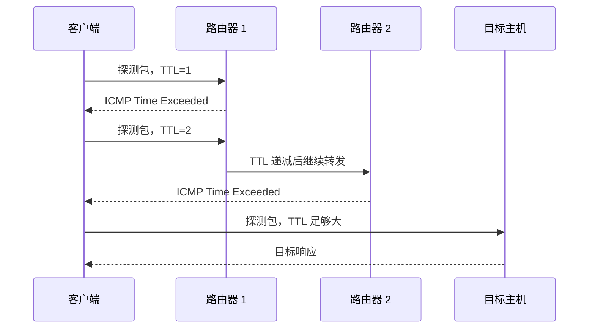

注意：

- 不同实现可能使用 UDP、ICMP 或 TCP 探测。
- 路由器可能限速或不回复控制报文。
- 去程和回程可能不对称。
- 某一跳显示 `*`，表示该次探测在超时时间内没有收到这一跳返回的响应，常见原因是路由器不回复或限速 ICMP、报文丢失、防火墙过滤等；如果后续跳仍能显示，说明路径通常没有中断，只是这一跳“保持沉默”。

---

### 9. 路由转发

#### 1. 路由转发流程

路由器或三层转发设备收到一个数据包后，典型处理步骤是：

1. 校验链路层帧并拆除入站二层头。
2. 检查目标 IP、包头合法性以及 ACL、策略路由等本机规则。
3. 在选定的转发表中对目标地址执行最长前缀匹配。
4. 若存在多个等价下一跳，再按 ECMP 哈希或设备策略选择具体出口。
5. TTL/Hop Limit 减 1；IPv4 重新计算头部校验和。
6. 解析下一跳的链路层地址。
7. 根据出口链路重新封装二层帧并发送。

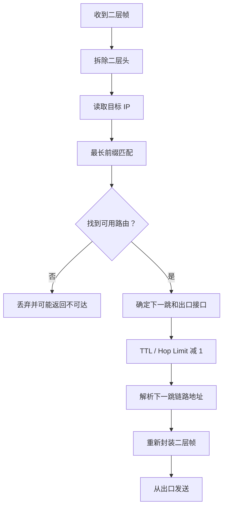

#### 2. 最长前缀匹配

路由表：

```text
10.0.0.0/8       → 下一跳 A
10.1.0.0/16      → 下一跳 B
10.1.2.0/24      → 下一跳 C
0.0.0.0/0        → 默认路由
```

目标 `10.1.2.3` 同时匹配前三条，但 `/24` 最具体，因此选择下一跳 C。

> **关键点**：需要区分控制平面和数据平面。控制平面负责建立和维护网络的转发规则。数据平面负责处理真正到达设备的每一个数据包。
> 
> OSPF、BGP、静态路由等先依据管理距离、度量与策略决定哪些路由安装进 FIB（实际转发表中）；
> 
> 真正转发数据包时，设备在已安装的 FIB 中执行最长前缀匹配。若最具体前缀对应多个等价下一跳，再执行 ECMP (Equal-Cost Multi-Path) 选择。
> 
> Linux 的策略路由还可能先通过 `ip rule` 选择不同路由表。

#### 3. 默认路由与直连路由

默认路由：

```text
0.0.0.0/0
```

表示没有更具体的 IPv4 路由时使用该条目。IPv6 默认路由为 `::/0`。

直连路由由接口地址和前缀自动产生，表示目标就在本接口连接的网络中。常用查看命令：

```bash
ip route show
ip -6 route show
ip route get 10.1.2.3
```

`ip route get` 可以直接显示内核对某个目标的实际选路结果，包括出口接口、源地址与下一跳。

---

### 10. 静态路由、动态路由、OSPF、BGP

#### 1. 静态路由

静态路由由管理员或自动化系统显式配置。

优点：

- 行为确定、可控。
- 不需要交换动态路由信息。
- 适合小规模网络、默认出口、黑洞路由和固定专线。

缺点：

- 拓扑变化后不会自动收敛。
- 大规模维护成本高。
- 容易出现遗漏、环路或不一致配置。

#### 2. 动态路由

动态路由协议让网络设备交换可达性信息，并在链路或拓扑变化后重新计算路径。

需要关注：

- **收敛速度**：故障发生后多久恢复稳定转发。
- **可扩展性**：路由条目、邻居数和更新开销。
- **策略能力**：是否能按业务、成本、地域和安全要求选路。
- **故障域**：错误路由会传播到多大范围。
- **防环机制**：如何避免持续路由环路。

#### 3. OSPF

OSPF（Open Shortest Path First）是典型的**链路状态内部网关协议**，主要用于一个自治系统内部。它不直接交换完整路由表，而是交换链路状态信息，使同一区域内的路由器形成一致的网络拓扑视图，再独立计算到各目标网络的最优路径。

##### 3.1 OSPF 的工作流程

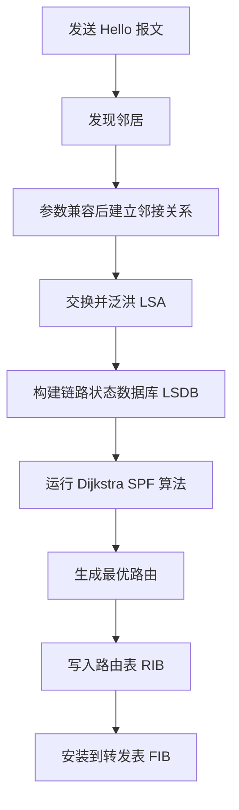

核心过程如下：

1. **邻居发现**
   路由器周期性发送 Hello 报文，发现同一链路上的其他 OSPF 路由器。

2. **建立邻接关系**
   邻居双方的 Area ID、Hello/Dead 定时器、认证方式、网络类型等关键参数兼容后，才会进一步同步链路状态信息。

3. **泛洪 LSA**
   路由器通过 LSA（Link-State Advertisement，链路状态通告）描述自身接口、邻居、链路状态和网络前缀，并在区域内可靠泛洪。

4. **构建 LSDB**
   同一区域内的路由器原则上形成一致的 LSDB（Link-State Database，链路状态数据库），其中保存该区域的拓扑信息。

5. **运行 SPF 算法**
   每台路由器分别以自己为根，运行 Dijkstra 最短路径算法，生成最短路径树。

6. **安装路由**
   计算得到的最优路径先进入路由表，之后将可用于转发的结果安装到 FIB，由数据平面实际转发报文。

##### 3.2 邻居与邻接关系

“发现邻居”和“建立完整邻接关系”并不完全相同。

在点到点链路中，两台 OSPF 路由器通常会直接建立完整邻接关系；在以太网等广播网络中，如果所有路由器都两两建立邻接关系，邻接数量和 LSA 交换量会迅速增加，因此 OSPF 会选举：

* **DR（Designated Router）**：指定路由器。
* **BDR（Backup Designated Router）**：备份指定路由器。

其他路由器主要与 DR、BDR 建立完整邻接关系，以减少广播网络中的协议开销。

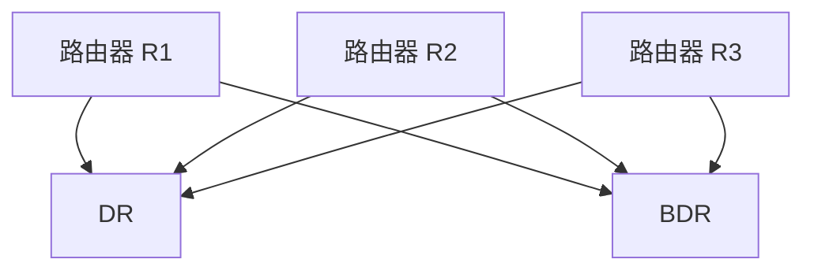

##### 3.3 OSPF Cost

OSPF 主要根据路径总 Cost 选路：

```text
路径总 Cost = 沿途各出接口 Cost 之和
```

例如：

```text
路径 A：10 + 10 + 10 = 30
路径 B：20 + 5       = 25
```

OSPF 会优先选择路径 B。

接口 Cost 通常可按以下方式计算：

```text
Cost = Reference Bandwidth / Interface Bandwidth
```

但需要注意：

* Reference Bandwidth 可以统一配置。
* 接口 Cost 也可以手工指定。
* 如果参考带宽设置过小，多条高速链路可能得到相同 Cost。
* 同一 OSPF 域内应统一参考带宽配置，否则不同路由器可能产生不一致判断。

如果存在多条总 Cost 相同的路径，OSPF 可以将多个下一跳同时安装到 FIB，形成 ECMP 等价多路径转发。

##### 3.4 OSPF 区域

OSPF 使用 Area 划分大型网络，以限制链路状态信息传播范围和 SPF 计算规模。


其中：

* **Area 0** 是骨干区域。
* 非骨干区域原则上应通过 ABR 与 Area 0 相连。
* ABR（Area Border Router）连接不同区域。
* 同一区域内的路由器维护该区域的 LSDB。
* 不同区域的 LSDB 内容不完全相同。
* 区域边界可以进行路由汇总，减少路由表规模。

区域划分的主要作用包括：

* 限制 LSA 泛洪范围。
* 减少每台路由器保存的拓扑信息。
* 降低拓扑变化引起的 SPF 计算压力。
* 缩小故障和路由震荡的影响范围。
* 支持路由汇总。

##### 3.5 OSPF 收敛

链路发生故障时，OSPF 的典型处理过程为：

```text
链路状态变化
→ 生成新的 LSA
→ 在区域内泛洪
→ 各路由器更新 LSDB
→ 重新运行 SPF
→ 更新 RIB 和 FIB
→ 流量切换到新路径
```

从拓扑变化发生到所有相关设备形成稳定转发表的过程称为**收敛**。

#### 4. BGP

BGP（Border Gateway Protocol）是互联网自治系统之间交换 IP 前缀可达性信息的核心协议，也是典型的**路径向量协议**。

BGP 不以物理距离最短为唯一目标，而是根据组织的业务关系、成本、安全和流量工程策略选择路径。

##### 4.1 eBGP 与 iBGP

BGP 可以分为两种使用方式：

| 类型   | 使用范围     | 主要作用            |
| ---- | -------- | --------------- |
| eBGP | 不同自治系统之间 | 交换跨 AS 的可达性信息   |
| iBGP | 同一自治系统内部 | 在 AS 内传播 BGP 路由 |

例如：

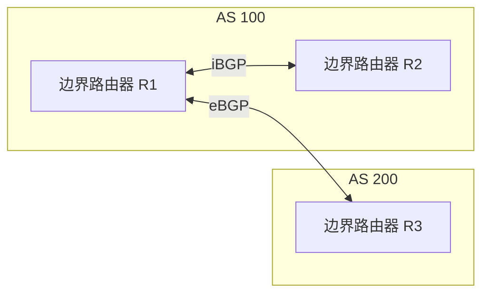

BGP 基于 TCP 建立邻居关系：

```text
TCP 端口：179
```

常见 BGP 消息包括：

| 消息              | 作用               |
| --------------- | ---------------- |
| `OPEN`          | 建立 BGP 会话并交换基本参数 |
| `UPDATE`        | 发布新路由或撤销旧路由      |
| `KEEPALIVE`     | 维持邻居会话           |
| `NOTIFICATION`  | 报告错误并终止会话        |
| `ROUTE-REFRESH` | 请求邻居重新发送路由信息     |

##### 4.2 BGP 交换的内容

OSPF 传播区域内部的链路状态，能够构建拓扑图；BGP 不构建完整互联网拓扑，而是交换：

```text
IP 前缀 + 路径属性
```

例如：

```text
前缀：203.0.113.0/24
AS_PATH：64501 64502 64503
NEXT_HOP：192.0.2.1
Community：64501:100
```

BGP 为一个前缀维护多条候选路径，再依据本地策略和路径属性选择最佳路径。

##### 4.3 常见 BGP 路径属性

###### AS_PATH

`AS_PATH` 记录路由传播过程中经过的自治系统序列。

例如：

```text
AS_PATH = 64501 64502 64503
```

主要作用：

* 防止自治系统级别的路由环路。
* 参与路径选择。
* 支持通过 AS_PATH Prepending 调整入站流量。

如果某个 AS 收到路由时，发现 `AS_PATH` 中已经包含自己的 AS 号，通常会拒绝该路由：

```text
本地 AS：64502
收到 AS_PATH：64501 64502 64503
→ 发现自身 AS
→ 拒绝该路由
```

AS_PATH 通常越短越优，但本地策略的优先级可能高于 AS_PATH 长度。

###### LOCAL_PREF

`LOCAL_PREF` 用于控制本自治系统的**出口选择**：

```text
数值越高，通常越优先。
```

例如：

```text
出口 A：LOCAL_PREF = 200
出口 B：LOCAL_PREF = 100
```

本 AS 通常优先从出口 A 发送流量。

LOCAL_PREF 一般只在本 AS 内传播，不通告给 eBGP 邻居。

###### MED

`MED` 用于向相邻自治系统表达：

> 进入我的 AS 时，更希望使用哪个入口。

一般情况下：

```text
数值越低，越优先。
```

但 MED 只是建议：

* 邻居可以忽略。
* 通常只在来自同一相邻 AS 的路径之间比较。
* 它对入站流量的控制力弱于对方的 LOCAL_PREF。

###### NEXT_HOP

`NEXT_HOP` 表示到达该前缀时应先转发到哪个下一跳。

例如：

```text
203.0.113.0/24 → NEXT_HOP 192.0.2.1
```

NEXT_HOP 必须能够通过直连路由、静态路由或 IGP 路由到达。若下一跳不可达，BGP 路由通常不能正常安装进 FIB。

该过程称为：

```text
下一跳可达性检查
或
递归路由查询
```

###### Community

`Community` 是附加在路由上的策略标签，例如：

```text
64500:100
64500:200
```

Community 本身不会自动修改路由行为，必须配合策略使用，例如：

```text
匹配 Community 64500:100
→ 设置 LOCAL_PREF 为 200

匹配 Community 64500:200
→ 不向某类邻居通告
```

它适合对大量路由批量执行统一策略。

##### 4.4 BGP 选路

BGP 选路顺序因厂商和实现而异，但通常会综合考虑：

```text
本地管理员策略
→ 更高的 LOCAL_PREF
→ 是否为本地产生的路由
→ 更短的 AS_PATH
→ 更优的 ORIGIN
→ 更低的 MED
→ eBGP 路由优于 iBGP 路由
→ 到 NEXT_HOP 的 IGP Cost 更低
→ 其他条件打破平局
```

部分设备还提供厂商私有属性，例如 Cisco 的 Weight，其优先级可能高于标准 BGP 属性。

需要注意：

> BGP 的最佳路径不一定是物理距离最短、跳数最少或时延最低的路径，而是最符合本地路由策略的路径。

##### 4.5 iBGP 防环与 Route Reflector

iBGP 有一条重要的默认规则：

> 从一个 iBGP 邻居学到的路由，不再通告给其他 iBGP 邻居。

这条规则用于防止 AS 内部的 BGP 路由环路，但会带来全互联要求。

如果一个 AS 内有 `n` 台 iBGP 路由器，传统全互联所需会话数约为：

```text
n × (n - 1) / 2
```

规模较大时，会话数量迅速增长，因此通常使用 Route Reflector：

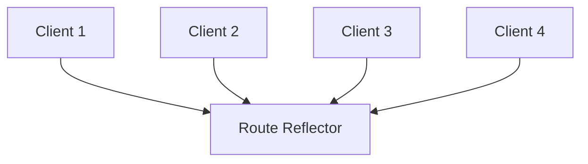

Route Reflector 可以把从一个客户端学到的路由反射给其他客户端，从而降低 iBGP 全互联的复杂度。

##### 4.6 BGP 策略与流量工程

BGP 常通过以下手段控制流量：

| 手段                 | 主要用途              |
| ------------------ | ----------------- |
| 提高 LOCAL_PREF      | 控制本 AS 出站流量优先走某出口 |
| AS_PATH Prepending | 降低某入口对外部 AS 的吸引力  |
| 调整 MED             | 建议邻居从某入口进入本 AS    |
| Community          | 批量应用路由策略          |
| 前缀过滤               | 限制允许接收或发布的路由      |
| 路由聚合               | 减少路由条目规模          |
| 更具体前缀              | 通过最长前缀匹配吸引特定流量    |

BGP 路由配置错误可能影响较大范围，因此通常需要：

* 严格执行前缀过滤。
* 限制可接收路由数量。
* 验证首个 AS。
* 使用 RPKI 辅助验证前缀起源。
* 对路由策略进行审计和变更控制。

---

#### 5. OSPF 与 BGP 对比

| 对比项    | OSPF               | BGP                      |
| ------ | ------------------ | ------------------------ |
| 协议类型   | 链路状态协议             | 路径向量协议                   |
| 主要范围   | 一个 AS 内部           | AS 之间，也可用于 AS 内部         |
| 承载方式   | 直接运行在 IP 上，协议号 89  | 基于 TCP 179               |
| 交换内容   | 链路状态和区域拓扑          | IP 前缀和路径属性               |
| 拓扑认知   | 构建区域内 LSDB         | 不构建完整互联网拓扑               |
| 核心算法   | Dijkstra SPF       | 基于属性与策略的最佳路径选择           |
| 主要选路依据 | 路径总 Cost           | LOCAL_PREF、AS_PATH、MED 等 |
| 防环方式   | LSA 序列号、LSDB 与 SPF | AS_PATH、iBGP 传播规则        |
| 扩展机制   | Area、路由汇总          | Route Reflector、策略、路由聚合  |
| 收敛特点   | 一般较快               | 更强调稳定性和策略，通常更谨慎          |
| 典型场景   | 企业网、园区网、内部骨干       | 互联网、多运营商出口、云网络           |


可以将二者的职责概括为：

> OSPF 主要解决自治系统内部如何高效到达各网络，BGP 主要解决不同自治系统之间如何按照策略交换和选择可达路径。


#### 6. 常见故障

- 邻居无法建立：接口、认证、区域、AS、定时器或 ACL 不一致。
- 路由存在但未进入转发表：下一跳不可达、优先级较低或策略过滤。
- 路由震荡：链路反复变化、策略不稳定或设备资源不足。
- 黑洞：路由宣告存在，但实际转发路径或回程路径缺失。
- 非对称路由：去程和回程不同，可能影响状态防火墙、NAT 与故障定位。

---

### 11. NAT

#### 1. NAT 的作用

NAT（Network Address Translation）在转发过程中修改 IP 地址，常伴随端口转换。最常见的是 NAPT/PAT：多台内网主机通过不同源端口共享一个或少量公网 IP。

NAT 常用于：

- 缓解 IPv4 公网地址不足。
- 让私网主机共享公网出口。
- 把公网地址和端口映射到内网服务。
- 在网络迁移、地址重叠或多出口场景中做地址转换。

常见 IPv4 私网地址：

```text
10.0.0.0/8
172.16.0.0/12
192.168.0.0/16
```

这些地址不会在公共互联网中被正常路由。

#### 2. SNAT

SNAT 修改源地址，典型场景是内网访问公网：

```text
转换前：192.168.1.100:53000 → 203.0.113.20:443
转换后：198.51.100.10:62001 → 203.0.113.20:443
```

NAT 设备维护连接映射，返回流量根据该映射还原为内网地址和端口。

#### 3. DNAT

DNAT 修改目标地址，典型场景是公网端口映射：

```text
198.51.100.10:443 → 192.168.1.10:8443
```

DNAT 常与反向 SNAT、状态跟踪和防火墙规则配合使用，确保请求和返回流量经过同一转换设备。

#### 4. NAT 转换流程

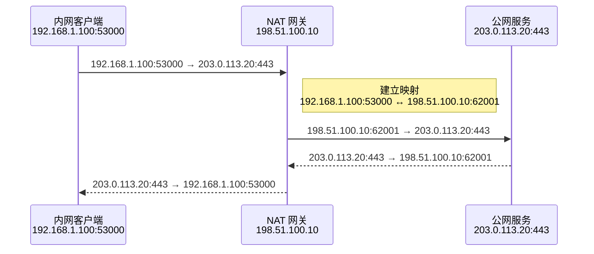

#### 5. NAT 的影响

NAT 引入了状态和中间设备依赖：

- 外部主机通常无法直接主动连接内网客户端。
- P2P、VoIP、实时通信需要 NAT 穿透。
- 长时间空闲的映射可能被回收，导致连接被中间设备静默丢弃。
- 多层 NAT 会增加定位难度。
- 端口数量有限，高并发出口可能发生 SNAT 端口耗尽。
- 某些协议在应用载荷中携带地址，需要额外代理或协议适配。

常见穿透组件：

- STUN：发现公网映射。
- TURN：无法直连时通过中继转发。
- ICE：组合候选地址并选择可用路径。

> NAT 不是安全机制，也不能替代防火墙。它可能降低直接可达性，但真正的访问控制仍应由防火墙和身份策略完成。


#### 6. SNAT 端口耗尽

多个内网连接共享公网地址时，NAT 设备需要为连接分配公网源端口。高并发访问同一目标时，可用映射空间会受到以下因素约束：

```text
公网源 IP 数量
× 可用源端口范围
× NAT 是否允许跨不同目标复用端口
× 连接状态保留时间
```

不能简单断言“一台公网 IP 最多只有 65535 条连接”，因为 NAT 实现可能在不同目标四元组之间复用同一源端口；但对同一目标 IP、目标端口的大量并发连接，可用端口确实更容易成为硬约束。

常见现象：

- 新连接偶发超时或返回 `EADDRNOTAVAIL`。
- NAT 网关连接跟踪表或端口利用率接近上限。
- 已建立连接正常，新建连接失败。
- 扩大应用线程数无效，错误只在访问特定下游时集中出现。

缓解顺序：

1. 复用长连接、HTTP/2 或连接池。
2. 控制重试和并发，缩短无意义的空闲连接保留时间。
3. 增加公网源 IP 或拆分出口。
4. 检查连接跟踪容量与超时参数。
5. 在应用侧记录实际远端地址、源地址与连接创建错误。

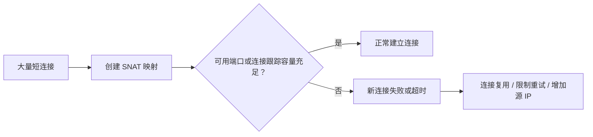

---

### 12. IPv6

#### 1. IPv4 与 IPv6

| 对比项 | IPv4 | IPv6 |
| --- | --- | --- |
| 地址长度 | 32 位 | 128 位 |
| 表示方式 | 点分十进制 | 冒号分隔十六进制 |
| 示例 | `192.168.1.1` | `2001:db8::1` |
| 广播 | 支持广播 | 不使用广播，主要使用组播与任播 |
| 自动配置 | DHCP、静态配置等 | SLAAC、DHCPv6、静态配置 |
| 邻居解析 | ARP | NDP |
| 路由器分片 | 可发生 | 不允许，源端负责 |
| 基础头校验和 | 有 | 无 |

IPv6 地址可以压缩连续的零，但一个地址中 `::` 只能出现一次。

#### 2. 常见 IPv6 地址类型

- 全球单播地址：通常为 `2000::/3` 范围，可在公网路由。
- 链路本地地址：`fe80::/10`，只在当前链路使用，接口通常自动生成。
- 唯一本地地址：`fc00::/7`，常见为 `fd00::/8`，用途类似私有地址但语义不同。
- 组播地址：`ff00::/8`。
- 回环地址：`::1`。
- 未指定地址：`::`。

IPv6 没有 IPv4 那种广播地址。

#### 3. IPv6 下是否需要 NAT

从地址数量和端到端模型看，IPv6 不需要因为地址不足而依赖 NAT。安全隔离应由状态防火墙、路由策略和身份控制完成。

NAT66 等方案存在，但通常不应把“隐藏地址”当作主要安全理由。地址可见不等于端口可访问，防火墙仍然可以默认拒绝入站连接。

#### 4. 双栈与迁移

IPv6 推广通常经历双栈或转换阶段：

- 双栈：主机同时配置 IPv4 和 IPv6。
- NAT64/DNS64：IPv6 客户端访问 IPv4 服务。
- 464XLAT、DS-Lite、MAP-T 等：运营商网络中的过渡机制。
- 隧道：在不支持 IPv6 的网络上封装 IPv6，但会增加 MTU 和复杂度。

推广难点：

- 旧设备、应用和监控体系兼容性不足。
- 双栈意味着两套地址、路由、防火墙和排障路径。
- DNS、负载均衡、日志与访问控制需要同时理解 A/AAAA。
- 部分网络对 IPv6 的质量、策略或可观测性仍不一致。

> **排障提醒**：域名同时返回 A 和 AAAA 时，客户端可能优先尝试 IPv6。出现“部分用户慢、过一会儿又成功”时，应检查 IPv6 路径，而不是只验证 IPv4。


#### 5. NDP、RA 与 SLAAC

IPv6 不使用 ARP。邻居发现协议 NDP 基于 ICMPv6，承担多项职责：

| 机制 | 作用 |
| --- | --- |
| Router Solicitation（RS） | 主机主动询问链路上的路由器 |
| Router Advertisement（RA） | 路由器通告前缀、默认路由和标志位 |
| Neighbor Solicitation（NS） | 查询邻居链路层地址、执行可达性检测 |
| Neighbor Advertisement（NA） | 回应邻居查询 |
| Duplicate Address Detection（DAD） | 地址启用前检测是否重复 |

```mermaid
sequenceDiagram
    participant H as IPv6 主机
    participant R as 路由器
    participant N as 同链路邻居

    H->>R: RS：请求路由信息
    R-->>H: RA：前缀、默认路由、配置标志
    Note over H: 通过 SLAAC 生成地址或结合 DHCPv6 获取其他配置
    H->>N: NS：谁拥有目标 IPv6 地址？
    N-->>H: NA：返回链路层地址
    Note over H: 使用 NS/NA 进行邻居可达性检测
```

关键边界：

- 默认网关通常来自 RA，而不是 DHCPv6。
- SLAAC 可以自动生成地址；DHCPv6 可补充地址或 DNS 等配置，具体取决于 RA 标志和网络策略。
- ICMPv6 是 IPv6 正常运行的基础。粗暴屏蔽 ICMPv6 会破坏邻居发现、路径 MTU 和错误反馈。
- IPv6 地址可用不代表 IPv6 路径可用，应分别验证地址、默认路由、NDP 和公网连通性。

常用命令：

```bash
ip -6 addr show
ip -6 route show
ip -6 neigh show
rdisc6 <网卡名>        # 需要安装对应工具
sudo tcpdump -nn -i any 'icmp6'
```

---

### 13. Anycast

#### 1. 单播、广播、组播与任播

| 类型 | 含义 |
| --- | --- |
| Unicast | 一个源与一个目标地址通信 |
| Broadcast | 一个源发送到同一 IPv4 广播域内的所有节点 |
| Multicast | 一个源发送到加入某个组播组的多个接收者 |
| Anycast | 多个节点宣告同一个地址，路由系统把流量送往其中一个可达节点 |

Anycast 中的“最近”通常指 BGP 策略和路由度量意义上的最优路径，不一定是地理距离最短。

#### 2. Anycast 工作方式

```mermaid
flowchart LR
    U1["亚洲用户"] --> R["互联网路由系统"]
    U2["欧洲用户"] --> R
    U3["北美用户"] --> R

    R -->|相同 Anycast IP| A["亚洲节点"]
    R -->|相同 Anycast IP| E["欧洲节点"]
    R -->|相同 Anycast IP| N["北美节点"]
```

多个节点对外宣告相同前缀。当某个节点撤销路由或路径变差时，后续流量会转向其他节点。

#### 3. 常见场景

- DNS 根服务器与公共递归解析器。
- CDN 和边缘接入。
- 全球四层入口。
- DDoS 流量分散与清洗。
- 无状态或弱状态的全球服务。

#### 4. 优势与限制

优势：

- 用户通常进入网络路径更优的节点。
- 单一 IP 可对应多个地域。
- 节点故障可通过路由撤销绕行。
- 大流量可分散到多个清洗和接入点。

限制：

- 路由收敛并非瞬时。
- 路径可能因运营商策略变化而切换。
- 长连接在路由变化后可能落到不同节点。
- 强状态服务需要会话复制、连接固定或上层重建。
- 故障定位要同时分析 BGP、地域、运营商和节点健康。

> **设计原则**：Anycast 更适合把用户导向入口节点；业务状态应尽量放在可复制的后端系统中，不要只依赖入口节点本地状态。


## 第四部分：传输层核心机制

> TCP、UDP、QUIC，以及连接、可靠性、流量控制和拥塞控制。

---

### 14. TCP 与 UDP

#### 1. TCP 与 UDP 的核心区别

| 对比项 | TCP | UDP |
| --- | --- | --- |
| 通信抽象 | 面向连接的可靠字节流 | 无连接的数据报 |
| 可靠性 | 通过确认、重传等机制提供 | 协议本身不保证到达 |
| 顺序 | 按字节序列有序交付 | 不保证顺序 |
| 消息边界 | 不保留应用写入边界 | 保留数据报边界 |
| 流量控制 | 有，基于接收窗口 | 无 |
| 拥塞控制 | 有，算法依实现而异 | 协议本身无，应用应负责 |
| 头部 | 基础头通常 20 字节 | 8 字节 |
| 建连 | 需要握手 | 发送前无需握手 |
| 典型用途 | HTTP/1.1、HTTP/2、SSH、数据库、RPC | DNS、音视频、游戏、QUIC 承载 |

TCP 的“可靠”不代表永不失败。连接仍可能因超时、主机崩溃、网络分区、RST 或应用关闭而中断；应用必须处理错误、重试与幂等。

UDP 的“不可靠”不代表低质量。它只是把可靠性、顺序、拥塞控制和重传策略交给应用层。QUIC 就是在 UDP 之上实现这些能力。

#### 2. 如何选择

优先选择 TCP 的场景：

- 数据必须完整、有序到达。
- 协议天然是连续字节流。
- 希望复用成熟的内核拥塞控制与重传机制。
- 对中间网络兼容性要求高。

优先考虑 UDP 或基于 UDP 的协议：

- 消息有天然边界。
- 旧数据过期后不值得重传。
- 需要多流、连接迁移或应用自定义可靠性。
- 可接受丢失，或应用能选择性恢复。

表达示例：

> TCP 提供可靠、有序的字节流，适合完整性优先的场景；UDP 提供轻量的数据报传输，适合实时性优先或希望自行控制可靠性的场景。选择的关键不是“谁更快”，而是应用需要什么语义。

---

### 15. TCP 三次握手

#### 1. 三次握手过程

TCP 建立连接时，双方需要同步初始序列号并确认双向路径可用。

```mermaid
sequenceDiagram
    participant C as 客户端
    participant S as 服务端

    Note over C: CLOSED
    Note over S: LISTEN
    C->>S: SYN，seq=x
    Note over S: SYN_RCVD
    S-->>C: SYN + ACK，seq=y，ack=x+1
    Note over C: ESTABLISHED
    C->>S: ACK，ack=y+1
    Note over S: ESTABLISHED
    Note over C,S: 第三个报文可以携带应用数据
```

SYN 和 FIN 都会占用一个序列号。握手中双方还可以协商 MSS、窗口扩大、SACK、时间戳等 TCP 选项。

#### 2. 三次握手确认了什么

更准确地说，三次握手完成了三件事：

1. **同步初始序列号**：客户端和服务端分别选择自己的 ISN，后续字节以此编号。
2. **确认双向可达性**：客户端收到服务端的 SYN+ACK，服务端收到客户端对自己 SYN 的确认。
3. **协商连接参数**：例如 MSS、SACK Permitted、Window Scale 等。

“确认双方能发能收”是便于理解的概括，但核心协议目的仍是序列号同步和双方对连接状态达成一致。

#### 3. 为什么不能只用两次

如果只有“客户端 SYN → 服务端 SYN+ACK”两次报文，服务端无法知道自己的 SYN 和初始序列号是否被客户端接收并确认。

第三个 ACK 的作用是：

- 让服务端确认客户端接受了服务端的初始序列号。
- 降低延迟或重复的旧 SYN 让服务端误认为连接已经完整建立的风险。
- 使双方对同一连接状态达成一致。

服务端在 `SYN_RCVD` 阶段已经可能占用一定资源，因此三次握手本身不能彻底解决 SYN Flood；SYN Cookies、队列调优和边界防护用于缓解该问题。

#### 4. 常见异常

| 现象 | 可能原因 | 抓包特征 |
| --- | --- | --- |
| SYN 重传，无 SYN+ACK | 路由、防火墙丢弃、服务端未响应 | 多个相同 SYN |
| 立即收到 RST | 目标端口未监听或策略主动拒绝 | SYN 后返回 RST/ACK |
| 收到 SYN+ACK，但服务端仍无连接 | 客户端最终 ACK 丢失或回程异常 | 服务端重复 SYN+ACK |
| 建连慢 | 丢包、重传、DNS 多地址尝试、队列拥塞 | 握手间隔明显增大 |
| 大量 `SYN_RECV` | 攻击、回程故障、队列压力 | 半连接长期未完成 |

Linux 观察方式：

```bash
ss -ant state syn-sent
ss -ant state syn-recv
tcpdump -nn -i any 'tcp[tcpflags] & (tcp-syn|tcp-fin|tcp-rst) != 0'
```

#### 5. 同时打开与 TCP Fast Open

- **同时打开**：双方几乎同时发送 SYN，TCP 也能建立连接，但普通客户端—服务端模式中较少见。
- **TCP Fast Open**：在满足条件时允许 SYN 中携带数据，以减少往返等待；需要客户端、服务端和网络路径共同支持，并应考虑重放与兼容性。


#### 6. `ESTABLISHED` 与 `accept()` 不是同一件事

三次握手由内核 TCP 协议栈完成。连接完成握手后可以进入 Accept 队列，此时内核状态已经是 `ESTABLISHED`，但应用可能尚未调用 `accept()` 取得连接 fd。

因此：

```text
TCP 握手成功
≠ 应用已经 accept
≠ 应用已经读取请求
≠ 业务已经处理完成
```

当客户端 `connect()` 成功但服务端事件循环阻塞、Accept 队列积压时，客户端可能在首次发送或等待响应阶段才暴露问题。定位时要同时查看握手、Accept 队列、应用 accept 速率和处理线程。

---

### 16. TCP 四次挥手

#### 1. 四次挥手过程

TCP 是全双工字节流，两个发送方向可以独立关闭。主动关闭方先关闭自己的发送方向，被动关闭方仍可继续发送剩余数据。

```mermaid
sequenceDiagram
    participant A as 主动关闭方
    participant B as 被动关闭方

    Note over A,B: 双方最初均为 ESTABLISHED

    A->>B: FIN，seq=u
    Note left of A: 进入 FIN_WAIT_1
    Note right of B: 收到 FIN<br/>进入 CLOSE_WAIT

    B-->>A: ACK，ack=u+1
    Note left of A: 收到 ACK<br/>进入 FIN_WAIT_2
    Note right of B: 应用仍可发送剩余数据

    Note right of B: 应用处理完成并调用 close()
    B-->>A: FIN，seq=v
    Note right of B: 进入 LAST_ACK

    A->>B: ACK，ack=v+1
    Note left of A: 进入 TIME_WAIT
    Note right of B: 收到最终 ACK<br/>进入 CLOSED

    Note left of A: 等待 2MSL 后<br/>进入 CLOSED
```

典型状态变化：

```text
主动关闭方：ESTABLISHED → FIN_WAIT_1 → FIN_WAIT_2 → TIME_WAIT → CLOSED
被动关闭方：ESTABLISHED → CLOSE_WAIT → LAST_ACK → CLOSED
```

#### 2. 为什么通常是四个报文

收到对方 FIN 后，TCP 内核可以立即返回 ACK，但本端应用可能还有数据没有发送完，不能立刻发送自己的 FIN。因此 ACK 和 FIN 通常分开发送。

如果被动关闭方恰好也已准备关闭，ACK 与 FIN 可以合并，抓包中可能只看到三个报文。因此“四次”是典型过程，不是绝对固定数量。

#### 3. 半关闭

一方发送 FIN 只表示：

```text
我不再发送新的数据。
```

它仍然可以接收对方发送的数据。这种状态称为半关闭。应用可以通过 `shutdown(fd, SHUT_WR)` 关闭发送方向，而保留接收方向。

#### 4. CLOSE_WAIT

`CLOSE_WAIT` 出现在收到对方 FIN 的一侧，含义是：

```text
内核已经确认对方关闭发送方向，但本端应用还没有关闭自己的发送方向。
```

少量、短暂的 `CLOSE_WAIT` 正常。大量、长期存在通常表明应用未及时 `close` 或 `shutdown`，常见原因：

- 读取到 EOF 后没有释放连接。
- 异常路径遗漏资源清理。
- 连接池借出后未归还。
- 线程阻塞，无法执行关闭逻辑。
- 文件描述符泄漏。

排查时应同时查看连接数、进程 fd 数量、调用栈和应用日志，而不是只修改内核参数。

#### 5. 其他关闭路径

- 应用异常退出时，内核通常会关闭其套接字。
- 使用带未读数据的异常关闭、`SO_LINGER` 特定配置或协议错误时，可能发送 RST 而不是正常 FIN。
- 双方同时关闭时，两侧都可能经历 `CLOSING` 和 `TIME_WAIT`。


#### 6. FIN 与 RST 的区别

| 维度 | FIN | RST |
| --- | --- | --- |
| 语义 | 有序关闭一个发送方向 | 立即中止连接 |
| 已发送数据 | 对端可继续读取已经按序到达的数据 | 未读取或在途数据可能直接丢弃 |
| 应用现象 | `read` 最终返回 0 | `ECONNRESET`、写失败或协议错误 |
| 常见来源 | 正常 `shutdown/close` | 无监听端口、异常关闭、协议错误、中间设备清理 |

还要注意：`close(fd)` 只是释放当前文件描述符引用。若同一个 socket 仍被其他线程、进程或复制后的 fd 引用，内核不会立刻发送 FIN；只有最后一个引用被释放且没有特殊 linger 行为时，连接才进入正常关闭流程。

---

### 17. TIME_WAIT

#### 1. TIME_WAIT 的位置

`TIME_WAIT` 通常出现在发送最后一个 ACK 的一方，也就是典型流程中的主动关闭方。双方同时关闭时，两侧都可能进入该状态。

#### 2. 为什么需要 TIME_WAIT

**作用一：处理最后 ACK 丢失**

如果最后一个 ACK 丢失，对端会重传 FIN。处于 `TIME_WAIT` 的一方仍保留连接上下文，可以再次回复 ACK。

**作用二：隔离旧连接中的延迟报文**

TCP 连接通常用四元组标识：

```text
源 IP、源端口、目标 IP、目标端口
```

如果立即复用同一四元组，旧连接中延迟到达的报文可能与新连接混淆。等待一段时间可降低这种风险。

#### 3. 为什么常说 2MSL

MSL 是报文段在网络中的理论最大生存时间。概念上等待 2MSL，可以覆盖：

1. 最后 ACK 在一个方向上的最长存活时间。
2. 对端重传 FIN 返回的最长存活时间。

实际操作系统使用的 `TIME_WAIT` 定时器是实现细节，不一定直接暴露为可配置的“MSL”，不同系统也可能不同。

#### 4. 大量 TIME_WAIT 是否异常

不一定。高并发短连接、主动关闭频繁的客户端或代理出现大量 `TIME_WAIT` 很常见。

真正要判断的是是否造成资源压力：

- 临时端口耗尽。
- 同一目标的连接创建失败。
- 内核连接跟踪或套接字表压力。
- 文件描述符、CPU 或 NAT 端口资源不足。
- 连接建立延迟与错误率升高。

#### 5. 优化顺序

优先采用应用和架构层手段：

1. 使用 HTTP keep-alive、连接池或多路复用。
2. 避免每个小请求都新建连接。
3. 检查谁主动关闭连接，调整连接生命周期。
4. 合理扩大临时端口范围并检查 NAT 端口容量。
5. 使用多个源 IP 或分散目标连接，仅在确有容量瓶颈时考虑。
6. 最后才评估内核复用参数，并理解其安全边界。

Linux 观察示例：

```bash
ss -ant state time-wait | wc -l
ss -s
cat /proc/sys/net/ipv4/ip_local_port_range
```

> **注意**：不要为了让状态数量“看起来更少”而盲目缩短定时器或使用过时参数。应先确认是否真的发生端口耗尽或连接失败。


#### 6. 临时端口为什么会耗尽

客户端主动连接时，内核通常从临时端口范围选择源端口。对同一网络命名空间而言，新连接必须能形成不冲突的连接标识。高频访问同一目标时，可用端口、`TIME_WAIT`、NAT 映射与源 IP 数量会共同限制连接创建能力。

常见错误：

```text
EADDRNOTAVAIL
Cannot assign requested address
connect() 偶发失败
```

验证：

```bash
cat /proc/sys/net/ipv4/ip_local_port_range
ss -s
ss -ant state time-wait | wc -l
```

估算时不要只看端口范围总数，还要考虑保留端口、连接目标、连接持续时间、NAT 映射和多进程是否共享同一源地址。最有效的治理通常是连接复用，而不是单纯扩大线程数。

---

### 18. TCP 可靠传输

TCP 的可靠性不是由单一机制提供，而是序列号、确认、重传、校验、窗口和拥塞控制共同作用的结果。

#### 1. 序列号

TCP 对**字节流**编号，而不是简单对“包”编号。

```text
seq = 1000
本段携带 500 字节
下一段起始 seq = 1500
```

序列号用于：

- 确定数据在字节流中的位置。
- 检测重复与缺失。
- 对乱序数据进行重排。
- 指定重传范围。

SYN 和 FIN 各自消耗一个序列号。

#### 2. ACK 与累计确认

ACK 表示接收方下一步期望的字节序号。例如：

```text
ACK = 1500
```

含义是 `1500` 之前的连续字节都已收到，下一字节应从 `1500` 开始。

TCP 默认使用累计确认。若中间一段缺失，后面的数据即使已到达，ACK 仍可能停留在缺口位置。

#### 3. 超时重传

发送方根据测得的 RTT 估算重传超时 RTO。某段数据在 RTO 内未被确认时会重传。

RTO 过短会造成不必要的重复传输，过长则会延迟恢复，因此实现通常会平滑 RTT 样本并考虑波动。

#### 4. 快速重传与 SACK

连续收到重复 ACK 表明接收方反复报告同一个缺口。传统算法通常在收到三个重复 ACK 后快速重传缺失段，不必等待 RTO。

SACK（Selective Acknowledgment）允许接收方告诉发送方“哪些非连续区间已经收到”，帮助发送方只重传真正缺失的数据。

```text
已收到：1、2、4、5、6
缺失：3
累计 ACK：仍期望 3
SACK：可额外告知 4~6 已到达
```

#### 5. 校验和

TCP 校验和覆盖 TCP 头、数据和 IP 伪首部，用于检测传输中的比特错误。它不是密码学完整性保护，不能抵御恶意篡改；TLS 等协议负责更强的完整性与认证。

#### 6. 乱序重排与去重

接收方可以暂存乱序到达的数据，等缺口补齐后再按序交给应用。重复数据会依据序列号被识别并丢弃。

#### 7. 滑动窗口

滑动窗口允许多个字节段处于“已发送但未确认”状态，提高带宽利用率。窗口过小会使高带宽、高 RTT 链路无法跑满。

#### 8. 可靠性的边界

TCP 只能保证：

```text
在连接仍有效且未报告错误的前提下，
已被应用读取的字节按序、无重复地交付。
```

它不能保证：

- 对端应用已经完成业务处理。
- 数据已经写入数据库或持久化存储。
- 连接断开前最后一次 `write` 一定被对端应用消费。
- 重试不会导致业务重复。

因此应用协议仍需使用请求 ID、幂等键、事务或确认消息保证业务语义。


#### 9. TCP ACK、应用响应与业务提交

需要区分三层确认：

```mermaid
sequenceDiagram
    participant C as 客户端应用
    participant TK as 服务端 TCP 内核
    participant A as 服务端应用
    participant D as 数据库或下游

    C->>TK: 发送请求字节
    TK-->>C: TCP ACK<br/>字节已进入对端协议栈接收范围
    TK->>A: 应用 read() 取得请求
    A->>D: 执行业务并提交
    D-->>A: 提交成功
    A-->>C: 返回应用层成功响应
```

- TCP ACK 只表示传输层确认了字节序列，不表示服务端应用已经读取。
- 应用返回成功也不一定代表所有异步副作用已经完成，取决于接口契约。
- 客户端超时无法确定服务端是否已经执行成功，因此重试必须结合幂等键、请求 ID 或状态查询。

> **核心边界**：TCP 提供字节流可靠性；业务系统负责“这次操作是否只执行一次、是否已经持久化、失败后如何恢复”。

---

### 19. TCP 滑动窗口与流量控制

#### 1. 为什么需要滑动窗口

如果每发送一个小段都等待 ACK：

```text
发送一段 → 等待一个 RTT → 再发送下一段
```

在高延迟链路上吞吐量会非常低。滑动窗口允许发送方连续发送一批尚未确认的数据。

```mermaid
flowchart LR
    A["已确认数据"] --> B["已发送，等待确认"]
    B --> C["窗口内可继续发送"]
    C --> D["窗口外暂不可发送"]
```

随着 ACK 到达，窗口向前滑动，新的字节进入可发送范围。

#### 2. 接收窗口 rwnd

接收方通过 TCP Window 字段通告可用接收缓冲区，称为 `rwnd`。它用于防止发送方速度超过接收方处理和缓存能力。

接收方应用读取缓慢时，缓冲区逐渐占满，`rwnd` 会缩小；应用继续读取后，窗口重新扩大。

TCP 头基础窗口字段只有 16 位。窗口扩大选项（Window Scale）在握手阶段协商，用于支持更大的窗口。

#### 3. 发送窗口

发送方允许保持在途、尚未确认的数据量通常受以下因素共同限制：

```text
可用发送窗口 ≈ min(rwnd, cwnd) - 已发送未确认数据
```

- `rwnd`：接收方能承受多少。
- `cwnd`：网络当前被估计能承受多少。
- 应用、套接字缓冲区和发送调度也会影响实际发送量。

#### 4. 零窗口与探测

接收缓冲区满时，接收方可以通告零窗口。发送方暂停正常数据发送，但会周期性发送窗口探测，以避免窗口更新报文丢失后双方永久等待。

零窗口持续过久通常说明：

- 接收端应用处理太慢或阻塞。
- 下游写入卡住，导致上游读不动。
- 接收缓冲区配置与负载不匹配。

抓包中可关注 `ZeroWindow`、`Window Full`、窗口更新和探测报文。

#### 5. 带宽时延积

要充分利用一条链路，窗口至少应能覆盖带宽时延积：

```text
BDP = 带宽 × RTT
```

例如，1 Gbit/s、RTT 80 ms：

```text
BDP = 1,000,000,000 bit/s × 0.08 s
    = 80,000,000 bit
    ≈ 10 MB
```

如果有效窗口远小于 10 MB，即使链路带宽很高也难以跑满。

---

### 20. TCP 拥塞控制

拥塞控制解决的是网络承载能力问题，流量控制解决的是接收方处理能力问题。两者都限制发送速率，但观察对象不同。

核心变量：

```text
cwnd：拥塞窗口，发送方对网络容量的估计
ssthresh：慢启动阈值
```

#### 1. 慢启动

连接开始或严重拥塞后，发送方从相对较小的 `cwnd` 开始探测容量。每收到确认，窗口增加；在理想条件下，一个 RTT 内大约翻倍，因此是指数增长。

现代实现的初始窗口通常不再简单等于 1 MSS，所以 `1 → 2 → 4 → 8` 只是概念示意。

#### 2. 拥塞避免

当 `cwnd` 达到 `ssthresh` 后，进入更保守的增长阶段。经典 Reno 模型中大致表现为每个 RTT 增加约 1 MSS，即加性增大。

#### 3. 丢包反馈

传统 TCP 常把丢包视为拥塞信号：

- RTO 超时：通常认为拥塞较重，显著缩小窗口。
- 重复 ACK / 快速重传：说明仍有部分数据通过，可进入快速恢复。
- ECN：网络设备显式标记拥塞，端点无需等到丢包才减速。

不同算法对这些信号的处理不同。

#### 4. 快速恢复

在经典 Reno 中，快速重传后不会像超时那样完全回到初始状态，而是降低窗口后继续传输。CUBIC、BBR 等算法使用不同的容量估计和窗口调整方式。

```mermaid
stateDiagram-v2
    [*] --> 慢启动
    慢启动 --> 拥塞避免: cwnd 达到 ssthresh
    慢启动 --> 严重退让: RTO 超时
    拥塞避免 --> 快速恢复: 重复 ACK / 快速重传
    快速恢复 --> 拥塞避免: 缺失数据被确认
    拥塞避免 --> 严重退让: RTO 超时
    严重退让 --> 慢启动: 重新探测容量
```

该图是经典机制的概念模型，具体状态和参数随算法与操作系统实现变化。

#### 5. rwnd 与 cwnd

| 变量 | 反映对象 | 谁通告或维护 |
| --- | --- | --- |
| `rwnd` | 接收方缓冲与处理能力 | 接收方通告 |
| `cwnd` | 网络路径的拥塞程度 | 发送方维护 |

实际在途数据受 `min(rwnd, cwnd)` 约束。

#### 6. 常见算法

- Reno/NewReno：以丢包为主要拥塞信号，便于理解经典机制。
- CUBIC：以三次函数增长窗口，适合高带宽、长 RTT 路径。
- BBR：尝试估计瓶颈带宽与最小 RTT，控制在途数据量，不只依赖丢包。
- DCTCP：在数据中心环境结合 ECN，对浅缓冲和低延迟进行优化。

> 没有一种算法在所有网络中都最好。公平性、吞吐量、时延、突发性和中间设备行为都需要权衡。

##### 经典TCP Reno 拥塞窗口 `cwnd` 随传输轮次变化图

横轴通常是传输轮次或 RTT，纵轴是 `cwnd`（以 MSS 为单位）。

```mermaid
xychart-beta
    title "TCP Reno 拥塞窗口变化示意"
    x-axis "传输轮次（RTT）" [1, 2, 3, 4, 5, 6, 7, 8, 9, 10, 11, 12, 13, 14, 15, 16, 17, 18, 19, 20, 21, 22, 23, 24]
    y-axis "cwnd（MSS）" 0 --> 24
    line [1, 2, 4, 8, 16, 17, 18, 19, 20, 21, 22, 11, 12, 13, 14, 15, 16, 1, 2, 4, 8, 9, 10, 11]
```

图中的变化过程是：

```text
轮次 1～5：
1 → 2 → 4 → 8 → 16
慢启动，cwnd 每个 RTT 近似翻倍

轮次 5～11：
16 → 17 → 18 → ... → 22
拥塞避免，cwnd 每个 RTT 约增加 1 MSS

轮次 12：
收到三个重复 ACK
22 → 11
执行快速重传和快速恢复，窗口大约减半

轮次 12～17：
11 → 12 → 13 → ... → 16
重新进入拥塞避免，继续线性增长

轮次 18：
发生 RTO 超时
16 → 1
认为拥塞较严重，将 cwnd 降到较小值，重新慢启动

轮次 18～21：
1 → 2 → 4 → 8
慢启动

达到新的 ssthresh 后：
8 → 9 → 10 → 11
重新进入拥塞避免
```

 **三个重复 ACK 表示网络仍在传输数据，所以窗口通常减半；RTO 表示恢复信号更弱，因此窗口会大幅下降并重新探测网络容量。**

| 拥塞信号     | `ssthresh`   | `cwnd` 后续变化 | 进入阶段        |
| -------- | ------------ | ----------- | ----------- |
| 三个重复 ACK | 约为当前在途数据量的一半 | 大约减半        | 快速恢复后进入拥塞避免 |
| RTO 超时   | 约为当前在途数据量的一半 | 降到较小值       | 慢启动         |


---

### 21. TCP 粘包和拆包

#### 1. TCP 是字节流

TCP 向应用提供连续字节流，不保留每次 `send` 或 `write` 的调用边界。

发送端：

```text
write("hello")
write("world")
```

接收端可能看到：

```text
read() → "helloworld"
```

也可能看到：

```text
read() → "hel"
read() → "lowor"
read() → "ld"
```

这不是 TCP 异常，而是应用协议没有自行定义消息边界。

#### 2. 为什么会出现合并与拆分

一次应用写入经过协议栈后，可能因为以下因素被拆分或合并：

- MSS 与 MTU。
- 套接字缓冲区。
- Nagle 算法。
- 调度时机。
- TCP 分段卸载与接收合并。
- 接收方每次提供的缓冲区大小。
- 网络重传与乱序重组。

因此不能假设“一次写对应一次读”。

#### 3. 常见消息 framing 方案

##### 方案一：定长消息

```text
[固定 128 字节]
```

实现简单，但字段扩展不灵活，可能浪费空间。

##### 方案二：分隔符

```text
message-1

message-2

```

适合文本协议。需要处理转义、最大行长和恶意超长输入。

##### 方案三：长度前缀

```text
[4 字节长度][消息体]
```

这是二进制协议和 RPC 中的常见方式。

```mermaid
flowchart LR
    A["接收缓冲区"] --> B{"至少有完整头部？"}
    B -- "否" --> A
    B -- "是" --> C["解析消息长度 N"]
    C --> D{"N 是否在合法范围？"}
    D -- "否" --> E["拒绝并关闭或报错"]
    D -- "是" --> F{"缓冲区至少有 N 字节？"}
    F -- "否" --> A
    F -- "是" --> G["取出完整消息并处理"]
    G --> B
```

##### 方案四：自描述编码

HTTP/1.1 可通过 `Content-Length`、`Transfer-Encoding: chunked` 或连接关闭确定消息体边界；HTTP/2、HTTP/3 使用帧结构。

#### 4. UDP 的边界

UDP 保留数据报边界：一次 `sendto` 产生一个数据报，接收方一次 `recvfrom` 读取一个数据报。如果接收缓冲区过小，超出部分通常会被截断，而不是留给下一次读取。

#### 5. 安全要求

实现长度前缀协议时必须：

- 设置最大消息长度。
- 检查整数溢出和负数转换。
- 限制单连接缓存。
- 对不完整消息设置超时。
- 在解析失败时明确关闭或丢弃策略。
- 防止攻击者用超大长度字段耗尽内存。

---

### 22. Nagle 算法与延迟 ACK

#### 1. Nagle 算法

Nagle 算法用于减少大量小 TCP 报文。简化理解：

- 如果当前没有未确认数据，小块数据可以立即发送。
- 如果已有未确认的小数据，后续小数据倾向于暂存。
- 当累计到一个 MSS，或之前的数据被确认后，再继续发送。

它可以提高链路利用率，但可能增加交互延迟。

#### 2. 延迟 ACK

接收方不一定为每个数据段立即发送独立 ACK，可能短暂等待：

- 看是否很快收到第二个段。
- 看是否有反向业务数据可与 ACK 一起发送。
- 减少纯 ACK 报文数量。

具体延迟时间和策略由实现决定，不能假设固定值。

#### 3. 二者叠加

典型问题：

```text
发送方：Nagle 等待之前小段的 ACK
接收方：延迟 ACK 等待更多数据或定时器
```

二者相互等待时，小请求可能出现明显额外时延，尤其是“请求很小、响应依赖完整请求”的交互协议。

#### 4. TCP_NODELAY

设置 `TCP_NODELAY` 可以关闭 Nagle，常用于：

- 低延迟 RPC。
- 交互式终端。
- 实时游戏控制消息。
- 高频小请求。

但关闭后可能产生更多小包。更完整的优化顺序是：

1. 应用尽量批量写入完整消息。
2. 避免大量碎片化 `write`。
3. 评估 `TCP_NODELAY`。
4. 用抓包和延迟分布验证，而不是仅凭经验开关。

#### 5. 相关机制

- `TCP_CORK`：Linux 上可暂时阻止发送零散数据，适合先写头再写体的场景；使用不当会增加延迟。
- `MSG_MORE`：提示内核后续还有数据，便于合并发送。
- Delayed ACK、Quick ACK 等行为可能因内核、连接状态和流量模式变化。

> **关键点**：小包延迟问题应同时检查应用写入方式、Nagle、延迟 ACK、调度和下游处理，不能只归因于某一个开关。

---

### 23. UDP 的价值

UDP 提供轻量、无连接、保留消息边界的数据报传输。它不内置可靠性，但这恰好让应用可以按业务价值决定哪些数据值得等待、重传或丢弃。

#### 1. DNS

传统 DNS 查询通常优先使用 UDP，因为请求和响应较小，且无需先建立连接。以下情况可能使用 TCP：

- 响应被截断，客户端回退到 TCP。
- 区域传送 AXFR/IXFR。
- DNS over TCP、DoT 或 DoH。
- 解析器或策略要求使用面向连接的传输。

EDNS(0) 可以扩大 UDP 载荷，但包过大仍可能受到分片和路径 MTU 影响。

#### 2. 实时音视频

实时媒体更关心“及时到达”而不是“所有旧数据最终到达”。过期音视频帧即使重传成功也可能已经失去播放价值。

应用常结合：

- 序列号与时间戳。
- 抖动缓冲。
- 前向纠错。
- 选择性重传。
- 自适应码率。
- 拥塞控制。

#### 3. 游戏与实时状态

位置、视角等状态更新频繁，新状态通常可以覆盖旧状态。关键事件如登录、交易和结算仍需要可靠确认，实际协议常混合使用可靠与不可靠通道。

#### 4. QUIC

QUIC 以 UDP 数据报为承载，在用户态实现：

- 可靠传输。
- 拥塞控制。
- TLS 1.3 加密。
- 多路复用。
- 连接迁移。

因此“基于 UDP”不等于“QUIC 不可靠”。

#### 5. 自定义可靠传输的责任

应用选择 UDP 后，需要自己考虑：

- 丢包检测与重传。
- 顺序和去重。
- 流量与拥塞控制。
- 路径 MTU。
- NAT 映射保活。
- 安全、认证与防重放。
- 放大攻击与源地址伪造。
- 消息大小和分片策略。

> **选择原则**：只有当业务确实需要自定义时延与可靠性权衡，或采用成熟的 UDP 上层协议时，才应承担这些复杂度。


#### 6. UDP 校验和与报文大小

- UDP 校验和在 IPv6 中必须使用；在 IPv4 中字段为 0 可以表示未启用校验，但现代实现通常仍会计算。
- UDP 保留报文边界，但大数据报仍可能触发 IP 分片；任一分片丢失都会使整个数据报无法重组。
- 应用不能把“UDP 最大长度约 64 KiB”当作推荐负载。真实互联网路径应尽量使用明显小于路径 MTU 的数据报，或使用应用层分片、分块与恢复机制。
- 使用网卡校验和卸载时，本机抓包可能显示“校验和错误”，但报文在真正发出前才由网卡补齐，需要结合抓包位置判断。

---

### 24. QUIC 和 HTTP/3

#### 1. QUIC 与 HTTP/3

QUIC 是运行在 UDP 之上的加密传输协议。HTTP/3 把 HTTP 语义映射到 QUIC 流上。

传统组合：

```text
HTTP/2
  ↓
TLS
  ↓
TCP
  ↓
IP
```

HTTP/3 组合：

```text
HTTP/3
  ↓
QUIC（集成 TLS 1.3、可靠传输、拥塞控制、多流）
  ↓
UDP
  ↓
IP
```

#### 2. 降低建连等待

QUIC 把传输握手与 TLS 1.3 密钥协商结合：

- 首次完整握手通常可在 1 RTT 后发送受保护的应用数据。
- 恢复连接时可以使用 0-RTT 提前数据。
- 0-RTT 存在重放风险，只适合可安全重复的操作，服务端也可以拒绝。

这里的 RTT 数量是协议层概念，实际耗时还受 DNS、丢包、服务器处理与地址验证影响。

#### 3. 多路复用与队头阻塞

HTTP/2 的多个流共享一条 TCP 字节流。某个 TCP 段丢失时，TCP 必须先补齐字节缺口，后续所有流的数据都暂时不能交给 HTTP/2。

QUIC 为不同流维护独立的可靠、有序交付状态：

```mermaid
flowchart LR
    subgraph H2["HTTP/2 over TCP"]
        T["单一 TCP 字节流"]
        A1["流 A"]
        B1["流 B"]
        C1["流 C"]
        A1 --> T
        B1 --> T
        C1 --> T
        T -. "一个 TCP 缺口可阻塞全部流" .-> X["等待重传"]
    end

    subgraph H3["HTTP/3 over QUIC"]
        Q["QUIC 连接"]
        A2["流 A"]
        B2["流 B"]
        C2["流 C"]
        Q --> A2
        Q --> B2
        Q --> C2
        A2 -. "A 丢包主要阻塞 A" .-> Y["A 等待重传"]
    end
```

QUIC 消除了跨流的传输层队头阻塞，但同一个流内部仍然要求有序交付。

#### 4. 连接迁移

TCP 连接通常与四元组绑定。移动设备从 Wi-Fi 切换到蜂窝网络后，源 IP 变化，原 TCP 连接往往无法继续。

QUIC 使用 Connection ID 标识连接，路径变化后可以验证新路径并延续会话。连接迁移仍需服务端、负载均衡和网络策略正确支持。

#### 5. 用户态实现

QUIC 主要在用户态实现，优势包括：

- 协议升级不依赖操作系统内核发布周期。
- 拥塞控制和丢包恢复更易迭代。
- 加密边界统一，减少中间设备修改传输头的空间。

代价包括：

- 用户态加密与包处理可能增加 CPU 消耗。
- UDP 可能被限速、屏蔽或错误处理。
- 抓包默认只能看到加密后的 QUIC 包。
- 实现复杂，版本、连接 ID 和负载均衡需要额外设计。

#### 6. HTTP/3 相关机制

- QPACK：HTTP/3 的头部压缩机制，避免把 HTTP/2 的 HPACK 队头问题直接带入 QUIC。
- Alt-Svc：服务端可通过响应头告诉客户端可用的 HTTP/3 端点。
- 版本协商：客户端与服务端协商可用 QUIC 版本。
- 地址验证与 Retry：服务端可验证客户端源地址，降低反射放大风险。

> **回退设计**：生产环境通常同时支持 HTTP/2 与 HTTP/3。UDP 路径不可用时，客户端应能回退到 TCP。


## 第五部分：应用层协议

> DNS、HTTP、TLS、缓存、身份状态、跨域与实时通信。

---

### 25. DNS

#### 1. DNS 的作用

DNS 把名称映射为资源记录。最常见的是：

```text
www.example.com → IPv4 / IPv6 地址
```

但 DNS 不只解析 IP，还承担邮件路由、服务发现、域名验证和反向解析等职责。

#### 2. 常见解析链路

实际顺序受浏览器、操作系统、NSS 配置、代理和企业策略影响。一个常见流程是：

```mermaid
sequenceDiagram
    participant B as 浏览器或应用
    participant O as 操作系统解析器（本机 DNS 客户端）
    participant R as 递归解析器（上游递归 DNS 服务器）
    participant Root as 根服务器
    participant TLD as 顶级域服务器
    participant A as 权威 DNS

    B->>B: 检查应用缓存、Service Worker 等
    B->>O: 请求解析 www.example.com
    O->>O: 检查 hosts、系统缓存与配置
    O->>R: 递归查询
    R->>R: 检查递归缓存
    alt 缓存未命中
        R->>Root: 询问 www.example.com
        Root-->>R: 返回 .com 服务器线索
        R->>TLD: 询问 example.com
        TLD-->>R: 返回权威服务器线索
        R->>A: 询问 www.example.com
        A-->>R: 返回 A / AAAA / CNAME 等记录
    end
    R-->>O: 返回解析结果与 TTL
    O-->>B: 返回地址
```

客户端通常只向递归解析器发起递归查询；递归解析器再对根、TLD 与权威服务器执行迭代查询。

#### 3. 递归与迭代

- **递归查询**：请求方要求对方给出最终答案或错误。
- **迭代查询**：对方可以返回更接近答案的服务器线索，由请求方继续查询。

公共 DNS、运营商 DNS、企业 DNS 和本机运行的解析器都可能充当递归解析器。

#### 4. 常见记录类型

| 类型 | 作用 |
| --- | --- |
| A | 名称映射到 IPv4 地址 |
| AAAA | 名称映射到 IPv6 地址 |
| CNAME | 名称别名指向另一个名称 |
| MX | 邮件交换服务器与优先级 |
| NS | 指定区域的权威 DNS 服务器 |
| TXT | SPF、DKIM、域名验证与任意文本 |
| SRV | 服务名称映射到主机、端口、优先级和权重 |
| PTR | 反向解析，地址映射到名称 |
| CAA | 指定允许为域名签发证书的 CA |
| SOA | 区域起始授权信息与序列号 |

CNAME 会增加额外解析步骤，并且在传统 DNS 语义下通常不能与同名的其他记录并存。根域别名常由提供商使用 ALIAS/ANAME 等非标准或托管能力实现。

#### 5. 缓存与 TTL

TTL 决定记录可缓存的时间。缓存层可能包括：

- 浏览器或应用。
- 操作系统。
- 本地代理。
- 递归解析器。
- CDN 或企业 DNS 系统。

优点：

- 降低查询延迟。
- 减少权威服务器压力。
- 提升故障时的局部可用性。

代价：

- 地址变更不会瞬时传播。
- 不同解析器可能在一段时间内返回不同结果。
- 负缓存会让不存在记录的错误持续一段时间。

切换 IP 前常先降低 TTL，等待旧 TTL 逐步过期，再实施变更；切换后恢复正常 TTL。

#### 6. UDP、TCP 与 EDNS

传统 DNS 默认优先使用 UDP 53。DNS 服务器准备返回的完整 DNS 报文，**超过了客户端声明自己能够通过 UDP 接收的最大报文大小，并设置 TC 位时**，客户端通常回退到 TCP。EDNS(0) 允许通告更大的 UDP 缓冲区并承载扩展信息。

过大的 UDP DNS 响应可能产生 IP 分片，增加丢包与安全风险。现代服务需要合理设置响应大小并支持 TCP。

#### 7. DoH、DoT 与 DNSSEC

| 机制 | 主要目标 |
| --- | --- |
| DoH | 通过 HTTPS 加密客户端到递归解析器的查询 |
| DoT | 通过 TLS 加密客户端到递归解析器的查询 |
| DNSSEC | 用数字签名验证 DNS 数据的来源和完整性 |

DoH/DoT 保护传输隐私，不能阻止所选递归解析器看到查询。DNSSEC 不加密查询，它用于验证记录未被伪造。

#### 8. 常用命令

```bash
# 查看常规解析
dig example.com

# 指定递归解析器
dig @1.1.1.1 example.com

# 查询 IPv6
dig AAAA example.com

# 跟踪从根开始的委派链
dig +trace example.com

# 查看权威、TTL 和完整响应
dig +noall +answer example.com

# 反向解析
dig -x 203.0.113.10
```

排查时要比较：

- 不同解析器的结果。
- A 与 AAAA。
- TTL 和权威服务器。
- CNAME 链。
- 是否返回 `NXDOMAIN`、`SERVFAIL` 或超时。
- 客户端实际连接的地址，而不是只看某次 `dig` 输出。


#### 9. NXDOMAIN、NODATA 与 SERVFAIL

| 结果 | 含义 | 常见方向 |
| --- | --- | --- |
| `NXDOMAIN` | 查询的名称不存在 | 名称拼写、委派、负缓存 |
| `NOERROR` + 无目标记录 | 名称存在，但该类型记录不存在，常称 NODATA | 只配置 A 未配置 AAAA，或记录类型错误 |
| `SERVFAIL` | 解析器无法给出可信结果 | DNSSEC 验证、权威超时、委派错误、上游故障 |
| 超时 | 未收到可用响应 | 网络、UDP 分片、防火墙、解析器故障 |

不存在的结果也可能被负缓存。刚刚创建记录后仍持续返回 `NXDOMAIN`，不能只盯着新记录 TTL，还要考虑之前否定响应的缓存期限。

#### 10. Split-horizon DNS 与搜索域

企业网络常让同一域名在内外网返回不同地址，称为 Split-horizon DNS。排障时应记录实际使用的递归解析器和网络环境。

Linux 解析短名称时还可能受 `/etc/resolv.conf` 中的 `search` 与 `ndots` 影响。例如应用查询 `api`，解析器可能依次尝试多个后缀，造成额外等待或意外命中。验证时同时比较：

```bash
getent ahosts api
getent ahosts api.example.com
dig api.example.com
resolvectl status
```

`dig` 直接查询 DNS，不一定完全复现应用通过 NSS、hosts、mDNS 或本地缓存执行的解析路径；需要复现应用行为时，`getent` 往往更接近系统调用结果。

---

### 26. 浏览器输入 URL 到页面展示

这是串联网络知识的核心综合题。建议按“浏览器决策 → 名称解析 → 建立安全连接 → 请求经过基础设施 → 服务端处理 → 浏览器渲染”六个阶段说明。

#### 1. 完整主线

```mermaid
flowchart TD
    A["输入 URL"] --> B["解析 scheme、host、port、path"]
    B --> C["检查 HSTS、代理、缓存、Service Worker"]
    C --> D["DNS 解析 A / AAAA"]
    D --> E{"选择传输协议"}
    E -- "HTTP/1.1 或 HTTP/2" --> F["建立 TCP 连接"]
    E -- "HTTP/3" --> G["建立 QUIC 连接"]
    F --> H{"是否 HTTPS？"}
    H -- "是" --> I["TLS 握手<br/>证书校验、ALPN、密钥协商"]
    H -- "否" --> J["直接发送 HTTP"]
    I --> J
    G --> J
    J --> K["CDN / WAF / 负载均衡 / 网关"]
    K --> L["应用服务与下游依赖"]
    L --> M["返回 HTTP 响应"]
    M --> N["解析 HTML，发现子资源"]
    N --> O["加载 CSS、JS、图片、字体"]
    O --> P["构建 DOM 与 CSSOM"]
    P --> Q["样式计算、布局、绘制、合成"]
    Q --> R["页面可交互"]
```

#### 2. URL 与本地策略

浏览器先解析：

```text
scheme://host:port/path?query#fragment
```

需要注意：

- `fragment` 通常不会发送给服务器。
- 浏览器可能根据 HSTS 把 HTTP 升级为 HTTPS。
- 代理、PAC、VPN、企业安全软件可能改变实际网络路径。
- Service Worker 可以拦截请求并返回缓存结果。
- 浏览器可能复用已有连接，而不是每次重新握手。

- 域名同时返回 IPv6 和 IPv4 时，现代客户端通常不会机械地等待一种地址完全超时后再试另一种，而会采用类似 Happy Eyeballs 的错峰竞速策略。

#### 3. DNS

浏览器或系统把主机名解析为一个或多个 A/AAAA 地址。多地址时，客户端可能并行或错峰尝试 IPv6/IPv4，以减少某条路径失败造成的等待。

DNS 阶段常见问题：

- 记录错误或未生效。
- CNAME 链过长。
- 递归解析器超时。
- IPv6 记录存在但路径不可用。
- 不同地区解析到不同 CDN 节点。

#### 4. 建立连接

- HTTP/1.1、HTTP/2 通常基于 TCP。
- HTTPS over TCP 在 TCP 握手后进行 TLS 握手。
- HTTP/3 基于 QUIC，传输与 TLS 1.3 协商结合。
- ALPN 用于协商 `http/1.1`、`h2` 或 `h3` 等应用协议。
- TLS 证书校验包括域名、有效期、签名链和策略。

#### 5. 中间基础设施

请求可能经过：

```text
客户端
→ 运营商与互联网
→ CDN / Anycast
→ DDoS 清洗 / WAF
→ 四层负载均衡
→ 七层网关或反向代理
→ 应用服务
→ 数据库、缓存、消息队列、第三方服务
```

每一层都可能增加重试、排队、超时和错误转换，因此故障定位必须关联请求 ID、时间戳和各层耗时。

#### 6. HTTP 请求与响应

请求包含方法、路径、Header 和可选消息体。服务端返回状态码、Header 和消息体。

浏览器会处理：

- 重定向。
- Cookie。
- 缓存指令。
- 内容编码。
- CSP、CORS、HSTS 等安全策略。
- 流式响应和压缩。

#### 7. 页面渲染

HTML 解析生成 DOM；CSS 解析生成 CSSOM；二者结合形成用于绘制的结构。随后执行样式计算、布局、绘制与合成。

关键影响：

- 同步脚本可能阻塞 HTML 解析。
- CSS 会影响首次渲染。
- 图片和字体可能造成布局变化。
- JS 可能继续发起 Fetch/XHR/WebSocket 请求。
- 浏览器连接复用、优先级和缓存会影响子资源加载顺序。

#### 8. 如何组织说明

先给出 20 秒主线：

> URL 解析后，客户端先完成名称解析，再建立 TCP+TLS 或 QUIC 连接，发送 HTTP 请求。请求经过 CDN、负载均衡和网关到达应用，应用访问下游后返回响应。浏览器随后解析 HTML、加载子资源并完成布局、绘制与合成。

再根据追问展开 DNS、TCP、TLS、HTTP、CDN 或渲染细节。

---

### 27. HTTP 版本

#### 0.一个故事 - 小明的 Web 服务升级史

小明维护着一个在线商城。最初商城很简单，首页只有一份 HTML 和几张图片。后来业务不断增长，页面逐渐变成：

```text
1 个 HTML
3 个 CSS
8 个 JavaScript
30 张商品图片
5 个接口请求
```

用户打开一次首页，浏览器可能需要请求几十个资源。随着访问量增加，小明遇到的问题也越来越多，而 HTTP 的版本升级，正是在不断解决这些问题。

```mermaid
flowchart LR
    A["HTTP/1.0<br/>一个请求常对应一个连接"] --> B["HTTP/1.1<br/>持久连接与缓存"]
    B --> C["HTTP/2<br/>二进制分帧与多路复用"]
    C --> D["HTTP/3<br/>QUIC、多流与连接迁移"]
```

---

##### 第一阶段：HTTP/1.0——每取一件商品，都重新排一次队

商城刚上线时使用 HTTP/1.0。

浏览器请求首页：

```http
GET /index.html HTTP/1.0
```

服务器返回 HTML 后，通常关闭 TCP 连接。浏览器解析 HTML，又发现页面需要一张图片：

```html

```

于是浏览器不得不重新建立 TCP 连接，再请求图片。

```mermaid
sequenceDiagram
    participant B as 浏览器
    participant S as 小明的服务器

    B->>S: TCP 三次握手
    B->>S: GET /index.html
    S-->>B: HTML 响应
    S-->>B: 关闭连接

    B->>S: TCP 三次握手
    B->>S: GET /style.css
    S-->>B: CSS 响应
    S-->>B: 关闭连接

    B->>S: TCP 三次握手
    B->>S: GET /product.jpg
    S-->>B: 图片响应
    S-->>B: 关闭连接
```

页面只有几个资源时，这种方式还能工作。但当页面增加到几十个资源后，问题出现了。

###### 问题一：重复建立 TCP 连接

每个资源都可能经历：

```text
TCP 三次握手
→ 发送 HTTP 请求
→ 接收 HTTP 响应
→ 关闭 TCP 连接
```

大量时间消耗在连接建立和关闭上，而不是传输真正的业务数据。

###### 问题二：TCP 慢启动反复发生

每条新连接刚开始都不了解网络容量，需要从较小的拥塞窗口开始发送。

连接刚把速度提升起来，资源已经传输完并关闭；请求下一个资源时，又要重新慢启动。

###### 问题三：服务器连接压力增大

大量短连接会增加：

* TCP 状态维护；
* 文件描述符使用；
* 握手报文数量；
* CPU 和内核协议栈开销；
* `TIME_WAIT` 数量。

小明发现，服务器真正处理商品数据的时间并不长，大量资源却消耗在重复建连上。

> HTTP/1.0 的主要问题不是不能传输网页，而是网页资源增多以后，重复建立连接的成本过高。

HTTP/1.0 后期也出现了非标准的 `keep-alive` 扩展，但持久连接直到 HTTP/1.1 才成为标准化的默认行为。


##### 第二阶段：HTTP/1.1——同一个快递员可以连续送货

小明将服务升级到 HTTP/1.1。

HTTP/1.1 默认使用持久连接。一个 TCP 连接完成一次请求后不会立即关闭，可以继续请求后面的资源。

```mermaid
sequenceDiagram
    participant B as 浏览器
    participant S as 小明的服务器

    B->>S: TCP 三次握手
    B->>S: GET /index.html
    S-->>B: HTML

    B->>S: GET /style.css
    S-->>B: CSS

    B->>S: GET /app.js
    S-->>B: JavaScript

    B->>S: GET /product.jpg
    S-->>B: 图片

    Note over B,S: 多个请求复用同一条 TCP 连接
```

这相当于以前每取一件商品都要重新找一个快递员，现在一个快递员可以连续配送多个包裹。

###### 改进一：持久连接

HTTP/1.1 默认复用连接，减少：

* TCP 握手；
* TCP 挥手；
* 慢启动次数；
* 服务器连接创建成本。

常见请求头为：

```http
Connection: keep-alive
```

在 HTTP/1.1 中，持久连接默认开启；只有明确发送下面的头部时，才表示完成本次响应后关闭：

```http
Connection: close
```

###### 改进二：Host 头

小明后来在同一台服务器上部署了多个网站：

```text
shop.example.com
static.example.com
admin.example.com
```

这些域名可能解析到同一个 IP。服务器只看目标 IP，无法判断客户端要访问哪个网站。

HTTP/1.1 要求客户端携带：

```http
Host: shop.example.com
```

这样一台服务器或一个 IP 就可以承载多个虚拟主机。

###### 改进三：分块传输

有些页面由服务器动态生成，服务器在开始响应时还不知道最终长度。

HTTP/1.1 支持：

```http
Transfer-Encoding: chunked
```

服务器可以一边生成，一边按块发送，不必等全部内容生成完再计算 `Content-Length`。

###### 改进四：缓存和范围请求更完善

浏览器可以通过 `Cache-Control`、`ETag` 等机制复用本地资源；下载大文件时，也可以使用 Range 请求只获取部分内容。

这些能力进一步减少了重复传输。

##### HTTP/1.1 的新问题：一条车道仍然只能按顺序通过

小明原以为持久连接已经解决了问题，但商品首页继续变复杂后，新的瓶颈出现了。

在同一条 HTTP/1.1 连接上，传统做法通常是：

```text
发送请求 A
等待响应 A
发送请求 B
等待响应 B
发送请求 C
等待响应 C
```

如果请求 A 是一张处理很慢的大图片，即使请求 B 和 C 很快，也要等待 A。

```text
请求 A：慢查询，耗时 2 秒
请求 B：静态 CSS，耗时 5 毫秒
请求 C：小图标，耗时 3 毫秒
```

实际表现可能是：

```text
A 先请求
→ B、C 等待
→ A 返回
→ B 返回
→ C 返回
```

这就是 HTTP/1.1 层面的**队头阻塞**。

###### 流水线为什么没有普及

HTTP/1.1 理论上支持流水线，可以连续发送多个请求：

```text
请求 A
请求 B
请求 C
```

不必收到 A 的响应后再发送 B。

但服务器仍必须按照请求顺序返回响应：

```text
响应 A
响应 B
响应 C
```

只要 A 处理得很慢，B 和 C 即使已经准备好，也不能先返回。

此外，代理服务器、中间设备和部分实现对流水线支持不一致，因此浏览器很少真正启用它。

###### 浏览器的临时解决方案：多开几条连接

浏览器通常为同一个域名建立多条 TCP 连接：

```text
连接 1：HTML、CSS
连接 2：JavaScript
连接 3：图片 A
连接 4：图片 B
连接 5：接口请求
连接 6：其他资源
```

这样一条连接被慢请求占用时，其他连接还能工作。

但这只是绕开问题，并没有真正解决问题，还会带来：

* 更多 TCP 连接；
* 更多 TLS 握手；
* 更多慢启动；
* 更多内存和文件描述符；
* 多条连接之间争抢带宽。

小明需要一种方案：

> 在一条连接上同时处理多个请求和响应，而且彼此不必严格排队。


##### 第三阶段：HTTP/2——一辆货车同时划分多个货舱

HTTP/2 保留了 HTTP 的核心语义：

```text
GET、POST 等方法
状态码
Header
URL
请求体与响应体
```

它主要改变的是数据在连接中的传输方式。

###### 改进一：二进制分帧

HTTP/1.1 的报文主要是文本形式。HTTP/2 将请求和响应拆成二进制帧：

```text
HEADERS 帧
DATA 帧
SETTINGS 帧
WINDOW_UPDATE 帧
RST_STREAM 帧
GOAWAY 帧
```

每个帧都带有 `Stream ID`，表示它属于哪一条逻辑流。

```text
Stream 1：HTML
Stream 3：CSS
Stream 5：JavaScript
Stream 7：图片
```

###### 改进二：多路复用

多个请求和响应可以交错使用同一条 TCP 连接。

```mermaid
sequenceDiagram
    participant B as 浏览器
    participant S as 小明的服务器

    B->>S: Stream 1：请求 HTML
    B->>S: Stream 3：请求 CSS
    B->>S: Stream 5：请求图片
    B->>S: Stream 7：请求接口

    S-->>B: Stream 3：CSS 数据
    S-->>B: Stream 1：部分 HTML
    S-->>B: Stream 7：接口数据
    S-->>B: Stream 5：部分图片
    S-->>B: Stream 1：剩余 HTML
```

服务器不必先完整返回 Stream 1，才能处理 Stream 3。

可以把 HTTP/2 想象成：

```text
一条 TCP 连接 = 一条高速公路
HTTP/2 Stream = 公路上的多条逻辑车道
Frame = 每辆车携带的小批数据
```

这使浏览器通常不再需要为同一个域名建立大量并行 TCP 连接。

###### 改进三：HPACK 头部压缩

HTTP 请求经常重复携带：

```http
Host: shop.example.com
User-Agent: ...
Accept: ...
Cookie: ...
Authorization: ...
```

HTTP/2 使用 HPACK 对 Header 进行压缩，并维护动态表，减少重复字段的传输。

对于大量小请求，这可以明显降低头部开销。

###### 改进四：流量控制和请求优先级

HTTP/2 可以分别控制连接和各个 Stream 的流量，防止某一个流无限占用缓冲区。

它也定义了流优先级机制，让客户端表达：

```text
HTML 和 CSS 更重要
首屏图片其次
页面底部图片可以稍后传输
```

不过优先级的实际效果取决于客户端、服务器和中间设备的实现。

###### Server Push

HTTP/2 还设计了服务端推送：

```text
客户端请求 HTML
服务器判断接下来一定需要 CSS
服务器主动推送 CSS
```

但服务器很难准确判断客户端缓存中是否已经有该资源，错误推送可能浪费带宽。因此浏览器中的 Server Push 实际使用有限，现代部署更常使用预加载提示等机制。

##### HTTP/2 的剩余问题：逻辑上多车道，底层仍是一条 TCP 字节流

小明上线 HTTP/2 后，稳定网络中的页面加载速度明显提升。

但移动网络用户仍然反馈：

```text
网络稍微丢一个包，整个页面的多个资源都会短暂停顿。
```

原因在于：

> HTTP/2 的多个流虽然在 HTTP 层彼此独立，但底层仍共享一条 TCP 有序字节流。

假设 TCP 字节流中的一个报文段丢失：

```text
TCP 数据段 1：包含 Stream 1 数据
TCP 数据段 2：丢失
TCP 数据段 3：包含 Stream 3 数据
TCP 数据段 4：包含 Stream 5 数据
```

虽然数据段 3 和 4 已经到达，但 TCP 必须保证按字节顺序交付。

因此在数据段 2 重传成功前，TCP 不能把后面的字节交给 HTTP/2：

```mermaid
flowchart LR
    A["TCP 段 1<br/>已到达"] --> B["TCP 段 2<br/>丢失"]
    B --> C["TCP 段 3<br/>已到达"]
    C --> D["TCP 段 4<br/>已到达"]

    B -. "等待重传" .-> E["后续字节暂不能交付"]
    C -.-> E
    D -.-> E
```

这叫 **TCP 层队头阻塞**。

HTTP/2 解决了 HTTP/1.1 的应用层队头阻塞，却无法绕过 TCP 的有序字节流语义。

###### 另一个问题：切换网络后连接失效

用户从 Wi-Fi 切换到蜂窝网络时，源 IP 往往发生变化。

TCP 连接通常由四元组标识：

```text
源 IP
源端口
目标 IP
目标端口
```

源 IP 变化后，原来的 TCP 连接通常无法继续，只能重新：

```text
建立 TCP 连接
→ 完成 TLS 握手
→ 重新发送请求
```

对移动设备而言，这会造成可感知的卡顿。

##### 第四阶段：HTTP/3——不再把所有货物绑在同一条 TCP 字节链上

为了解决这些问题，小明开始部署 HTTP/3。

HTTP/3 不再基于 TCP，而是基于 QUIC：

```text
HTTP/3
  ↓
QUIC
  ↓
UDP
  ↓
IP
```

需要注意：

> QUIC 使用 UDP 作为承载，不代表 QUIC 不可靠。可靠传输、重传、拥塞控制和流量控制由 QUIC 自己实现。

---

##### 改进一：多个流在传输层彼此独立

QUIC 原生支持多个 Stream。每条 Stream 独立维护自己的序号和有序交付状态。

假设图片流中的一个 QUIC 包丢失：

```text
Stream 1：HTML
Stream 3：CSS
Stream 5：大图片，发生丢包
Stream 7：接口响应
```

结果通常是：

```text
Stream 5 等待重传
Stream 1、3、7 可以继续交付
```

```mermaid
flowchart LR
    Q["一条 QUIC 连接"] --> S1["Stream 1<br/>HTML 正常"]
    Q --> S3["Stream 3<br/>CSS 正常"]
    Q --> S5["Stream 5<br/>图片发生丢包"]
    Q --> S7["Stream 7<br/>接口正常"]

    S5 -. "只阻塞本流" .-> R["等待重传"]
```

HTTP/3 消除了不同流之间的传输层队头阻塞。

但要注意：

> 同一条 Stream 内部仍然要求有序交付，因此某个流自身发生丢包时，该流后续数据仍需等待。

##### 改进二：传输握手与 TLS 1.3 集成

传统 HTTPS over TCP 通常需要：

```text
TCP 握手
→ TLS 握手
→ HTTP 请求
```

QUIC 将传输连接建立与 TLS 1.3 协商结合。

首次连接通常可以较快开始传输应用数据；恢复已有会话时，还可以使用 0-RTT 提前数据。

```text
首次连接：通常 1-RTT 建立受保护通信
恢复连接：特定情况下可以发送 0-RTT 数据
```

但 0-RTT 数据存在重放风险，因此更适合：

```text
GET 静态资源
查询类请求
可安全重复的操作
```

不应直接用于缺少额外保护的支付、创建订单等非幂等操作。

##### 改进三：连接迁移

QUIC 使用 Connection ID 标识连接，不完全依赖 IP 和端口四元组。

用户从 Wi-Fi 切换到蜂窝网络时：

```text
源 IP 发生变化
但 Connection ID 保持不变
```

QUIC 可以验证新路径，并在条件允许时继续使用原连接。

```mermaid
sequenceDiagram
    participant C as 手机
    participant S as 小明的服务器

    C->>S: Wi-Fi 路径上的 QUIC 连接
    Note over C: 切换到蜂窝网络<br/>源 IP 改变
    C->>S: 携带相同 Connection ID
    S-->>C: 验证新路径
    Note over C,S: 连接继续，无需完整重建会话
```

这对移动网络、弱网和网络切换场景非常重要。

##### 改进四：协议在用户态实现

TCP 的核心实现通常位于操作系统内核。升级 TCP 行为往往依赖操作系统更新。

QUIC 主要在用户态实现，小明使用的浏览器和服务端软件可以更快更新：

* 丢包检测；
* 拥塞控制；
* 连接迁移；
* 多路径支持；
* 新协议版本。

但代价也很明显：

* 用户态加密和包处理可能增加 CPU 开销；
* UDP 可能被部分网络屏蔽或限速；
* 抓包和分析比 TCP 更复杂；
* 负载均衡需要理解 Connection ID；
* 服务端实现复杂度更高。

因此小明没有彻底关闭 HTTP/2，而是同时提供：

```text
HTTP/3 优先
HTTP/2 回退
HTTP/1.1 兼容
```

当用户所在网络无法正常传输 UDP 时，客户端仍可以回退到 TCP。

---

##### 小明最终明白了什么

HTTP 的版本演进，并不是不断推翻原来的业务语义。

下面这些概念始终存在：

```text
URL
请求方法
状态码
Header
请求体
响应体
缓存
认证
```

主要变化发生在：

> 如何更高效、更并发、更可靠地把 HTTP 请求和响应传输过去。

| 版本       | 主要解决的问题          | 核心方案                          | 仍然存在的问题          |
| -------- | ---------------- | ----------------------------- | ---------------- |
| HTTP/1.0 | 完成基本请求—响应        | 文本协议、一次请求一次响应                 | 默认短连接，重复握手       |
| HTTP/1.1 | 减少重复建连，完善 Web 能力 | 持久连接、Host、缓存、分块传输             | 应用层队头阻塞，常需多连接    |
| HTTP/2   | 在一条连接中并发传输多个请求   | 二进制分帧、多路复用、HPACK              | TCP 丢包会阻塞所有流     |
| HTTP/3   | 降低跨流阻塞和移动网络重连成本  | QUIC、多流、TLS 1.3、Connection ID | UDP 兼容性、实现和观测复杂度 |

最终，小明把整个发展过程总结成四句话：

```text
HTTP/1.0：
每个资源常常重新建立一条连接。

HTTP/1.1：
连接可以复用，但请求响应仍容易排队。

HTTP/2：
多个请求可以在同一连接中并发，但仍受 TCP 队头阻塞影响。

HTTP/3：
把多路复用下沉到 QUIC，不同流之间不再因单个丢包相互阻塞，
并能更好适应移动网络切换。
```

最核心的演进主线是：

**HTTP/1.1 解决连接复用，HTTP/2 解决应用层并发，HTTP/3 进一步解决 TCP 层跨流阻塞和连接迁移问题。**


#### 1. HTTP/1.0

HTTP/1.0 的典型特点：

- 一次请求对应一次响应。
- 默认不要求持久连接，常见实现每次请求后关闭。
- 可以通过非标准或扩展的 `Connection: keep-alive` 复用连接。
- 每个 TCP 连接同一时刻通常处理一个请求—响应。

频繁建连会增加 TCP 和 TLS 握手成本。

#### 2. HTTP/1.1

主要改进：

- 默认持久连接。
- `Host` 头支持同一 IP 承载多个虚拟主机。
- 支持分块传输编码。
- 缓存控制更完善。
- 支持 Range、条件请求等机制。
- 理论上支持流水线，但浏览器实践中很少启用。

限制：

- 一个连接上的响应必须按请求顺序返回，容易产生应用层队头阻塞。
- 浏览器通常通过建立多个并行 TCP 连接缓解，但会增加连接和拥塞控制开销。

#### 3. HTTP/2

HTTP/2 保持 HTTP 方法、状态码和 Header 语义，改变了报文的传输格式：

- 二进制帧。
- 一个连接上的多路复用。
- HPACK 头部压缩。
- 流优先级与流量控制。
- 服务端推送曾被支持，但浏览器中的实际使用已很少。

```mermaid
flowchart LR
    subgraph H1["HTTP/1.1"]
        C1["连接 1：请求 A → 响应 A"]
        C2["连接 2：请求 B → 响应 B"]
        C3["连接 3：请求 C → 响应 C"]
    end

    subgraph H2["HTTP/2"]
        T["一个 TCP 连接"]
        A["流 A"] --> T
        B["流 B"] --> T
        C["流 C"] --> T
    end
```

HTTP/2 解决了 HTTP 层的串行问题，但底层仍是一条 TCP 字节流。TCP 丢包会暂时阻塞所有流的数据交付。

#### 4. HTTP/3

HTTP/3 把 HTTP 映射到 QUIC：

- 基于 UDP 承载。
- QUIC 集成 TLS 1.3。
- 多个流在传输层相互独立。
- 使用 QPACK 压缩 Header。
- 支持 Connection ID 与连接迁移。
- UDP 不可用时通常回退到 HTTP/2 或 HTTP/1.1。

#### 5. 对比

| 特性 | HTTP/1.1 | HTTP/2 | HTTP/3 |
| --- | --- | --- | --- |
| 传输 | TCP | TCP | QUIC/UDP |
| 报文格式 | 文本起始行 + Header | 二进制帧 | QUIC 流上的二进制帧 |
| 多路复用 | 无真正并行复用 | 有 | 有 |
| 头部压缩 | 无专用压缩 | HPACK | QPACK |
| 跨流队头阻塞 | 应用层明显 | TCP 丢包会影响全部流 | 主要限于单个流 |
| TLS | 可选 | 实际部署通常配合 TLS | 必须使用 QUIC 集成的 TLS 1.3 |
| 连接迁移 | 无 | 无 | 支持 |

> **核心结论**：HTTP 版本升级主要是在不改变上层语义的前提下，减少连接、压缩头部、提高并发和降低丢包影响。


#### 6. HTTP 方法的安全性与幂等性

| 方法 | 安全方法 | 按语义幂等 | 典型含义 |
| --- | --- | --- | --- |
| GET | 是 | 是 | 读取资源 |
| HEAD | 是 | 是 | 只读取响应元数据 |
| PUT | 否 | 是 | 用完整表示创建或替换目标资源 |
| DELETE | 否 | 是 | 删除目标资源 |
| POST | 否 | 通常否 | 创建子资源、触发动作 |
| PATCH | 否 | 不保证 | 部分更新 |

- **安全**表示按协议语义不应改变服务端资源状态，不代表没有日志、计费或缓存填充等附带行为。
- **幂等**表示重复执行多次的预期状态效果与执行一次相同，不要求每次响应码或响应体完全相同。
- 方法语义只是起点。实际接口若把 GET 写成“删除数据”，客户端和代理无法替服务端修复设计。

#### 7. 重试为什么必须结合幂等

```mermaid
flowchart TD
    A[请求失败或超时] --> B{能确定服务端未执行吗？}
    B -- 能 --> C[可按策略重试]
    B -- 不能 --> D{操作天然幂等或带幂等键？}
    D -- 是 --> E[在总超时预算内重试]
    D -- 否 --> F[先查询状态或返回不确定结果]
```

对支付、下单、扣库存等操作，客户端超时可能发生在服务端已经提交之后。常见做法是携带稳定的 `Idempotency-Key` 或业务请求号，服务端保存请求结果并对重复请求返回同一业务结果。

#### 8. HTTP/2 的流量控制与连接管理

HTTP/2 不只提供多路复用，还存在两级流量控制：

```text
单个 Stream 窗口
整个 Connection 窗口
```

某个流不读取数据可能耗尽该流窗口；整个连接的接收推进不足也会阻塞其他流发送。`GOAWAY` 用于通知对端停止创建新流，并告知最后处理的流编号。客户端收到 `GOAWAY` 后，需要根据流是否可能已被处理、方法是否幂等以及上层请求 ID 决定是否迁移到新连接重试。

---

### 28. HTTP 无状态、Cookie、Session、Token、JWT

#### 1. HTTP 无状态

HTTP 无状态表示协议本身不会自动记住前一次请求的业务上下文。每个请求应包含足够信息，让服务器能够独立理解。

无状态不等于系统没有状态。登录身份、购物车、限流计数和交易进度都可以由 Cookie、Session、Token、数据库或缓存保存。

#### 2. Cookie

Cookie 是浏览器按域、路径和策略保存的小段数据。服务端设置：

```http
Set-Cookie: session_id=abc123; Path=/; Secure; HttpOnly; SameSite=Lax
```

后续符合条件的请求自动携带：

```http
Cookie: session_id=abc123
```

重要属性：

| 属性 | 作用 |
| --- | --- |
| `Secure` | 只通过安全连接发送 |
| `HttpOnly` | 阻止前端脚本直接读取，降低部分 XSS 窃取风险 |
| `SameSite` | 控制跨站请求携带行为，帮助降低 CSRF 风险 |
| `Domain` | 控制可接收 Cookie 的域范围 |
| `Path` | 控制路径范围 |
| `Max-Age` / `Expires` | 控制持久化时间 |

Cookie 大小和数量有限，每次请求自动携带也会增加流量，不应存放大对象。

#### 3. Session

典型流程：

```mermaid
sequenceDiagram
    participant B as 浏览器
    participant S as 应用服务
    participant R as Session 存储

    B->>S: 登录凭证
    S->>R: 创建 session_id → 用户状态
    S-->>B: Set-Cookie: session_id=...
    B->>S: Cookie: session_id=...
    S->>R: 查询会话
    R-->>S: 用户身份与状态
    S-->>B: 业务响应
```

优点：

- 服务端可主动失效。
- 敏感状态不必放到客户端。
- 权限变化可以快速生效。

代价：

- 需要会话存储。
- 多实例环境要共享或路由到同一会话。
- 存储故障会影响登录状态。
- 需要处理过期、续期与并发登录策略。

#### 4. Token

Token 是客户端每次请求携带的凭证，常见形式：

```http
Authorization: Bearer <access-token>
```

Token 可以是随机字符串，也可以是自包含结构。服务端仍需验证签发者、受众、过期时间、权限范围和吊销状态。

#### 5. JWT

JWT 常见结构：

```text
Base64URL(Header).Base64URL(Payload).Base64URL(Signature)
```

关键认识：

- Header 和 Payload 只是编码，默认不是加密。
- 签名用于检测篡改和验证签发方。
- 验证时必须限制允许的算法，不能盲目信任 Header 中声明。
- 应检查 `exp`、`nbf`、`iss`、`aud` 等声明。
- 不应在 Payload 中放密码、密钥或不希望客户端看到的信息。

优点：

- 可以减少每次请求查询会话存储。
- 适合跨服务传递经过签名的声明。
- 易与 OAuth 2.0 / OpenID Connect 体系结合。

代价：

- 过期前主动吊销较困难。
- Token 体积通常大于随机 Session ID。
- 权限变化可能无法立即反映。
- 密钥轮换、算法配置和时钟偏差需要治理。

常见设计：

```text
短生命周期 Access Token
+ 更长生命周期、可撤销的 Refresh Token
+ 服务端风险控制或吊销列表
```

#### 6. Session 与 JWT 的选择

| 维度 | Session | 自包含 JWT |
| --- | --- | --- |
| 状态位置 | 服务端 | 主要在客户端凭证中 |
| 主动吊销 | 容易 | 需要短过期、版本号或吊销表 |
| 单次验证 | 常需查存储 | 可本地验签 |
| 凭证大小 | 通常较小 | 通常较大 |
| 权限实时性 | 较高 | 可能滞后到过期 |
| 分布式复杂度 | 会话存储与一致性 | 密钥分发与声明治理 |

> **选择原则**：不要为了“无状态”而默认使用 JWT。身份体系需要综合考虑吊销、权限变化、密钥管理、客户端安全和审计。


#### 7. OAuth 2.0、OpenID Connect 与 JWT 不是同一概念

| 概念 | 定位 |
| --- | --- |
| OAuth 2.0 | 授权框架，解决客户端如何代表资源所有者访问受保护资源 |
| OpenID Connect | 构建在 OAuth 2.0 之上的身份认证层 |
| JWT | 一种可签名或加密的令牌/声明表示格式 |

OAuth Access Token 可以是 JWT，也可以只是不可读的随机字符串；使用 JWT 也不等于系统采用 OAuth。设计身份系统时，应先明确参与方、信任边界、授权范围和吊销需求，再决定令牌格式。

---

### 29. HTTP 状态码

HTTP 状态码表达服务器对当前请求的处理结果。不能只看数字，还要结合方法、响应头、响应体和中间代理。


#### 0. 1xx：处理中与协议切换

| 状态码 | 含义 | 典型用途 |
| ---: | --- | --- |
| 100 | Continue | 客户端可继续发送较大的请求体 |
| 101 | Switching Protocols | HTTP/1.1 协议升级，例如 WebSocket |
| 103 | Early Hints | 提前提示可预加载的资源，最终响应随后到达 |

1xx 通常是中间响应，不是本次请求的最终业务结果。代理和客户端对部分 1xx 的支持可能不同。

#### 1. 2xx：成功

| 状态码 | 含义 | 典型场景 |
| ---: | --- | --- |
| 200 | OK | 请求成功，通常带响应体 |
| 201 | Created | 资源创建成功，常配合 `Location` |
| 202 | Accepted | 已接收，但异步处理尚未完成 |
| 204 | No Content | 成功且没有响应体 |
| 206 | Partial Content | Range 请求返回部分内容 |

`204` 响应不能包含消息体；`206` 常见于视频拖动、断点续传和大文件下载。

#### 2. 3xx：重定向与缓存

| 状态码 | 语义 | 方法处理 |
| ---: | --- | --- |
| 301 | 永久重定向 | 历史客户端可能把 POST 改为 GET |
| 302 | 临时重定向 | 历史客户端可能把 POST 改为 GET |
| 303 | See Other | 明确要求后续使用 GET |
| 304 | Not Modified | 条件请求命中，无响应体 |
| 307 | 临时重定向 | 保留原方法和请求体 |
| 308 | 永久重定向 | 保留原方法和请求体 |

对 API 来说，需保留方法时优先理解 307/308 的语义差异。

#### 3. 4xx：请求侧或权限问题

| 状态码 | 含义 | 常见场景 |
| ---: | --- | --- |
| 400 | Bad Request | 语法错误、参数格式非法 |
| 401 | Unauthorized | 缺少或无效的认证凭证 |
| 403 | Forbidden | 服务器理解请求但拒绝授权 |
| 404 | Not Found | 资源或路由不存在，也可用于隐藏资源存在性 |
| 405 | Method Not Allowed | 资源存在但不支持该方法 |
| 408 | Request Timeout | 服务器等待请求超时 |
| 409 | Conflict | 版本冲突、重复创建、状态冲突 |
| 412 | Precondition Failed | ETag 等前置条件失败 |
| 413 | Content Too Large | 请求体超过限制 |
| 415 | Unsupported Media Type | 不支持请求体媒体类型 |
| 422 | Unprocessable Content | 语法正确但业务校验失败 |
| 429 | Too Many Requests | 限流，常配合 `Retry-After` |

`401` 通常应返回 `WWW-Authenticate` 说明认证方案。`403` 不一定表示“已经登录”，而是服务器拒绝执行当前请求。

#### 4. 5xx：服务端或上游问题

| 状态码 | 含义 | 常见场景 |
| ---: | --- | --- |
| 500 | Internal Server Error | 未处理异常或通用内部错误 |
| 501 | Not Implemented | 不支持请求方法或能力 |
| 502 | Bad Gateway | 代理收到上游无效响应、连接失败或被重置 |
| 503 | Service Unavailable | 维护、过载、熔断或没有可用实例 |
| 504 | Gateway Timeout | 代理等待上游响应超时 |
| 507 | Insufficient Storage | 存储资源不足 |

重点区分：

```text
502：上游连接或响应本身异常。
504：上游在规定时间内没有完成响应。
```

#### 5. 相关但非标准或代理侧状态

- `499`：部分代理使用，表示客户端在服务器返回前关闭连接。
- `444`：部分 Nginx 配置使用，直接关闭而不返回标准响应。
- gRPC 常通过 HTTP/2 返回 200，再用 `grpc-status` 表达 RPC 结果。

#### 6. 使用状态码的原则

- 不要所有错误都返回 200。
- 不要用 500 表达可预期的业务校验失败。
- 错误响应应包含稳定错误码、可读消息和请求追踪 ID。
- 不应把内部堆栈、SQL、密钥或敏感路径直接暴露给客户端。
- 网关与应用应明确谁负责重试、错误转换和超时。

---

### 30. HTTP 缓存

HTTP 缓存的核心问题有两个：

1. **当前缓存是否仍然新鲜，可以直接使用？**
2. **如果不新鲜，能否低成本向源站验证？**

```mermaid
flowchart TD
    A["请求资源"] --> B{"本地或共享缓存中存在副本？"}
    B -- "否" --> C["向服务器请求完整资源"]
    B -- "是" --> D{"副本仍新鲜？"}
    D -- "是" --> E["直接使用缓存<br/>不访问源站"]
    D -- "否" --> F{"有 ETag 或 Last-Modified？"}
    F -- "否" --> C
    F -- "是" --> G["发送条件请求"]
    G --> H{"服务器返回 304？"}
    H -- "是" --> I["复用本地响应体<br/>更新缓存元数据"]
    H -- "否" --> J["使用新响应并替换缓存"]
```

#### 1. 强缓存

缓存副本仍在新鲜期内时，可直接使用而不向源站验证。

常见响应头：

```http
Cache-Control: public, max-age=3600
Expires: Wed, 21 Oct 2026 07:28:00 GMT
```

`Cache-Control` 通常优先于 `Expires`。

常见指令：

| 指令 | 含义 |
| --- | --- |
| `max-age=N` | 对浏览器等缓存，新鲜期为 N 秒 |
| `s-maxage=N` | 对共享缓存优先使用的有效期 |
| `public` | 允许共享缓存存储 |
| `private` | 只允许私有缓存存储 |
| `no-cache` | 可以存储，但每次使用前必须重新验证 |
| `no-store` | 不应存储请求或响应 |
| `must-revalidate` | 过期后必须验证，不能随意使用陈旧副本 |
| `immutable` | 新鲜期内资源不会变化，避免无意义刷新验证 |
| `stale-while-revalidate=N` | 可在后台更新时短暂提供陈旧副本 |
| `stale-if-error=N` | 源站失败时允许短暂使用陈旧副本 |

> **易错点**：`no-cache` 不是“不缓存”，而是“使用前必须验证”；真正禁止存储的是 `no-store`。

#### 2. 协商缓存

##### Last-Modified / If-Modified-Since

服务器：

```http
Last-Modified: Tue, 23 Jun 2026 10:00:00 GMT
```

客户端：

```http
If-Modified-Since: Tue, 23 Jun 2026 10:00:00 GMT
```

限制：

- 时间精度有限。
- 修改时间变化不一定代表内容变化。
- 分布式文件系统或构建流程可能产生不稳定时间戳。

##### ETag / If-None-Match

服务器：

```http
ETag: "abc123"
```

客户端：

```http
If-None-Match: "abc123"
```

ETag 是资源版本标识，不要求一定是内容哈希。强 ETag 表示字节级一致，弱 ETag 以 `W/` 开头，表示语义等价但字节可能不同。

当 `If-None-Match` 与 `If-Modified-Since` 同时存在时，通常优先验证 ETag。

#### 3. Vary 与缓存键

```http
Vary: Accept-Encoding, Accept-Language
```

`Vary` 告诉缓存：这些请求头不同，应视为不同缓存变体。

如果遗漏，可能把 gzip 响应返回给不支持 gzip 的客户端，或把某语言、某用户内容错误共享。反过来，`Vary` 维度过多会显著降低命中率。

#### 4. 静态资源最佳实践

带内容哈希的不可变资源：

```text
app.a8f3c1.js
style.91bc2.css
```

可设置：

```http
Cache-Control: public, max-age=31536000, immutable
```

HTML 通常使用较短缓存或协商验证，确保能够及时引用新版本资源。

#### 5. API 缓存注意点

- 只缓存适合共享的数据。
- 认证响应默认要谨慎，防止用户数据串缓存。
- 明确缓存键是否包含查询参数、Header、Cookie 和租户。
- 写操作后需要版本化、失效或接受短暂不一致。
- CDN 与浏览器缓存策略可能不同，应分别验证。

---

### 31. HTTPS 与 TLS

#### 1. HTTPS 解决什么问题

HTTPS 是 HTTP 通过 TLS 提供安全传输的组合。TLS 主要提供：

| 安全目标 | 含义 |
| --- | --- |
| 身份认证 | 客户端验证正在连接的服务身份 |
| 机密性 | 中间节点不能直接读取明文 |
| 完整性 | 数据被篡改时能够被检测 |
| 前向保密 | 使用临时密钥交换时，长期私钥泄漏不应解密过去会话 |

TLS 保护传输过程，不会自动修复 XSS、SQL 注入、弱口令、终端中毒或服务端数据泄漏。

#### 2. TLS 1.3 完整握手


```mermaid
sequenceDiagram
    participant C as 客户端
    participant S as 服务端

    Note over C,S: TCP 场景下，TLS 握手开始前<br/>通常已完成 TCP 三次握手

    C->>S: ClientHello
    Note right of C: 支持的 TLS 版本<br/>Client Random<br/>密码套件列表<br/>Key Share<br/>SNI<br/>ALPN<br/>签名算法<br/>支持的扩展

    Note over C: 保存客户端临时私钥

    S-->>C: ServerHello
    Note left of S: 选择 TLS 1.3<br/>选择密码套件<br/>Server Random<br/>返回服务端 Key Share

    Note over C,S: 双方根据 ECDHE 共享秘密<br/>派生握手阶段密钥
    Note over C,S: 从 ServerHello 之后<br/>大部分握手消息开始加密

    S-->>C: EncryptedExtensions
    Note left of S: 返回加密后的扩展结果<br/>例如 ALPN 协商结果

    opt 服务端要求客户端证书
        S-->>C: CertificateRequest
    end

    S-->>C: Certificate
    Note left of S: 发送服务端证书链

    S-->>C: CertificateVerify
    Note left of S: 使用证书私钥<br/>对握手上下文签名<br/>证明持有对应私钥

    S-->>C: Finished
    Note left of S: 对此前握手消息进行完整性校验

    Note over C: 验证服务端证书链
    Note over C: 检查域名、有效期、用途和信任链
    Note over C: 验证 CertificateVerify 签名
    Note over C: 验证服务端 Finished
    Note over C: 派生应用阶段密钥

    opt 服务端请求了客户端证书
        C->>S: Certificate
        Note right of C: 发送客户端证书链
        C->>S: CertificateVerify
        Note right of C: 客户端证明持有对应私钥
    end

    C->>S: Finished
    Note right of C: 证明客户端看到的握手过程<br/>未被篡改

    Note over S: 验证客户端 Finished
    Note over C,S: 双方握手完成<br/>使用应用流量密钥发送 AEAD 加密数据

    C->>S: 加密的应用数据
    S-->>C: 加密的应用数据

    opt 服务端签发会话恢复凭据
        S-->>C: NewSessionTicket
        Note left of S: 客户端保存 Ticket<br/>后续可用于 PSK 会话恢复
    end
```

##### 1. `ClientHello`

客户端告诉服务端：

```text
我支持哪些 TLS 版本
我支持哪些密码套件
我支持哪些签名算法
我的临时密钥份额是什么
我要访问哪个域名
我希望使用 HTTP/1.1、HTTP/2 等哪个应用协议
```

其中：

* `SNI`：表明访问的域名，服务端据此选择证书。
* `ALPN`：协商上层协议，例如 `h2` 或 `http/1.1`。
* `Key Share`：客户端提供 ECDHE 临时公钥。
* `Client Random`：参与密钥派生，避免不同连接使用相同密钥。


##### 2. `ServerHello`

服务端确认：

```text
使用 TLS 1.3
选择某个密码套件
返回服务端临时公钥
```

双方此时都拥有：

```text
自己的临时私钥
对方的临时公钥
```

通过 ECDHE 可以独立计算出相同的共享秘密：

```text
客户端私钥 + 服务端公钥
服务端私钥 + 客户端公钥
```

虽然计算方式不同，但结果相同。

之后，双方通过 HKDF 从共享秘密中派生：

```text
客户端握手流量密钥
服务端握手流量密钥
客户端应用流量密钥
服务端应用流量密钥
```

##### 3. `EncryptedExtensions`

服务端返回已经协商好的扩展信息，例如：

```text
ALPN 选择 h2
是否接受某些扩展能力
```

TLS 1.3 中，从 `ServerHello` 之后，大多数握手内容都已加密。


##### 4. `Certificate`

服务端发送自己的证书链：

```text
站点证书
中间 CA 证书
可能还有其他中间证书
```

根证书通常不会由服务端发送，因为客户端本地信任库中已经保存了根 CA。

##### 5. `CertificateVerify`

证书只能说明：

```text
某个公钥属于这个域名或组织
```

但服务端还必须证明：

```text
我确实持有该证书对应的私钥
```

因此服务端使用证书私钥，对当前握手上下文进行数字签名。客户端用证书中的公钥验证签名。

这一步防止攻击者只拿到公开证书后冒充服务端。

##### 6. 服务端 `Finished`

`Finished` 中包含基于握手密钥计算的校验值，用于证明：

* 服务端拥有正确的握手密钥；
* 服务端看到的握手内容与客户端一致；
* 前面的握手消息没有被篡改。

客户端验证成功后，才认为服务端身份和握手过程可信。

##### 7. 客户端验证证书

客户端通常检查：

```text
证书链能否连接到受信任根 CA
证书是否在有效期内
访问域名是否匹配 SAN
证书用途是否允许服务器认证
签名算法和密钥强度是否符合要求
CertificateVerify 是否正确
Finished 是否正确
```

任何关键验证失败，都应终止握手。

##### 8. 客户端 `Finished`

客户端也发送自己的 `Finished`，让服务端确认：

```text
客户端派生出了相同的密钥
客户端看到的握手内容没有被篡改
```

服务端验证成功后，完整握手结束。

##### 密钥大致分成两组

```text
握手流量密钥：
用于保护后续 TLS 握手消息

应用流量密钥：
用于保护 HTTP 等应用数据
```

而且两个方向使用不同密钥：

```text
客户端 → 服务端：客户端写密钥
服务端 → 客户端：服务端写密钥
```

这样即使某个方向的状态出现问题，也不会直接复用另一方向的密钥和序列号。

##### `NewSessionTicket` 的作用

握手完成后，服务端可以发送：

```text
NewSessionTicket
```

客户端保存后，下次连接时可以使用 PSK 恢复会话，减少握手开销。

恢复连接可能支持：

```text
1-RTT 会话恢复
0-RTT 提前数据
```

但 0-RTT 存在重放风险，因此只适合可安全重复的请求。

##### TLS 1.3 主线可以浓缩为

```text
ClientHello：
客户端提出版本、算法和临时公钥。

ServerHello：
服务端选择参数并返回临时公钥。

ECDHE + HKDF：
双方派生握手密钥。

Certificate + CertificateVerify：
服务端提供证书并证明持有私钥。

双方 Finished：
确认握手内容完整且双方拥有相同密钥。

应用数据：
使用应用流量密钥进行 AEAD 加密传输。
```

需要注意，抓包中有时还能看到一个兼容性的 `ChangeCipherSpec`，它通常是为了兼容旧中间设备，并不是 TLS 1.3 密钥切换逻辑中的必要握手步骤。

在 TCP 之上，完整流程还包括之前的 TCP 三次握手。HTTP/3 中，QUIC 把传输握手与 TLS 1.3 协商结合。

#### 3. 为什么混合使用非对称与对称密码

- 非对称签名用于证明服务端持有证书对应的私钥。
- 临时密钥交换用于协商共享秘密。
- 对称 AEAD 算法用于高效加密大量应用数据并校验完整性。

TLS 1.3 中，证书私钥通常用于签名，而不是直接“加密会话密钥”。会话密钥由密钥交换结果派生。

#### 4. 证书链

典型信任链：

```text
站点证书
  ↓ 由中间 CA 签发
中间 CA 证书
  ↓ 由根 CA 签发
根 CA 证书
  ↓ 预置在操作系统或浏览器信任库
```

客户端通常检查：

- 证书签名链是否能构建到受信任根。
- 访问域名是否匹配 SAN。
- 当前时间是否处于有效期内。
- Key Usage / Extended Key Usage 是否允许服务器认证。
- 签名算法与密钥强度是否符合策略。
- 证书吊销信息、OCSP Stapling 或浏览器自身风险机制。
- 中间证书是否完整。

现代证书的域名匹配主要看 Subject Alternative Name，而不是依赖 Common Name。

#### 5. 中间人攻击为什么通常会被发现

攻击者可以拦截流量，但若无法获得受信任 CA 签发且匹配目标域名的证书，也无法用目标私钥完成合法签名。客户端证书验证失败时应终止连接。

仍可能成功的情况包括：

- 用户或组织在终端安装了受信任的代理根证书。
- 用户忽略证书警告。
- 终端或浏览器被控制。
- CA、DNS、私钥或供应链遭到攻击。
- 应用错误关闭证书校验。

#### 6. TLS 1.2 与 TLS 1.3

| 项目 | TLS 1.2 | TLS 1.3 |
| --- | --- | --- |
| 完整握手 | 通常需要 2 RTT 才能开始应用数据 | 通常 1 RTT |
| 会话恢复 | Session ID / Ticket 等 | PSK 恢复，支持 0-RTT |
| 密钥交换 | 允许多种旧组合 | 强制使用前向保密的现代方案 |
| 密码套件 | 把认证、交换、加密、MAC 组合在一起 | 结构简化，只描述 AEAD 与哈希 |
| 旧算法 | 仍可能配置 RSA key exchange、CBC 等 | 移除大量旧算法 |
| 握手加密 | 较多握手内容明文 | ServerHello 后多数握手内容加密 |

0-RTT 提前数据可能被重放，不应用于支付、创建订单等非幂等操作，除非应用有额外防重放设计。

#### 7. SNI 与 ALPN

- SNI：客户端在握手中表明目标主机名，让同一 IP 能选择正确证书。
- ALPN：协商应用协议，如 `http/1.1`、`h2`。
- 传统 SNI 暴露在 ClientHello 中；ECH 旨在加密更多 ClientHello 信息，但部署依赖客户端、DNS 和服务端支持。

#### 8. 会话恢复

会话恢复减少重复握手成本：

- TLS 1.2 Session ID / Session Ticket。
- TLS 1.3 PSK 与 Ticket。
- 连接池、HTTP/2/3 多路复用也能减少握手频率。


#### 9. TLS 终止不一定等于端到端加密

生产链路常见两段或多段 TLS：

```mermaid
flowchart LR
    C[客户端] -->|TLS 连接 1| E[CDN / 负载均衡]
    E -->|明文 HTTP 或 TLS 连接 2| G[网关 / 应用]
    G -->|TLS 或专网协议| D[下游服务]
```

客户端证书校验只验证它直接建立的 TLS 连接。若 TLS 在 CDN 或负载均衡终止，代理到源站是否加密、验证哪个证书、是否校验 SNI，需要单独配置与审计。

双向 TLS（mTLS）在服务端证书之外还要求客户端提供证书，常用于服务间身份认证。mTLS 能证明持有私钥的通信端身份，但仍需要授权策略决定该身份允许访问哪些资源。

#### 10. 常用排查命令

```bash
curl -v https://example.com/

openssl s_client   -connect example.com:443   -servername example.com   -alpn h2,http/1.1   -showcerts
```

重点观察：

- DNS 与实际连接 IP。
- TLS 版本、密码套件、ALPN。
- 证书链与主机名。
- 握手在哪一步失败。
- 是否因系统时间错误、SNI 缺失或中间证书不全失败。

---

### 32. CORS 与跨域

#### 1. 同源策略

浏览器中的“源”由三部分组成：

```text
scheme（协议） + host（主机） + port（端口）
```

例如 `https://a.example.com:443` 与下面地址都不同源：

```text
http://a.example.com:443       # scheme 不同
https://b.example.com:443      # host 不同
https://a.example.com:8443     # port 不同
```

同源策略主要限制脚本读取不同源的数据。它并不禁止所有跨源请求：图片、表单、导航等仍可能把请求发出去。

#### 2. CORS 的作用

CORS 是浏览器与服务器约定的跨源读取机制。服务器通过响应头声明哪些源、方法和 Header 可以访问资源，浏览器负责执行。

> **边界说明**：CORS 不是服务端访问控制。非浏览器客户端不会替你执行 CORS，服务端仍必须做认证、授权、输入校验和速率限制。

#### 3. 简单请求

满足特定条件的 GET、HEAD 或 POST 请求可以不预检，浏览器直接发送，然后检查响应头。

常见关键头：

```http
Origin: https://frontend.example
```

服务端响应：

```http
Access-Control-Allow-Origin: https://frontend.example
Vary: Origin
```

简单请求只允许有限的请求 Header 和媒体类型。`application/json` 通常会触发预检。

即使没有预检，跨源写操作也可能已经到达服务器；浏览器只是在响应不满足 CORS 时阻止脚本读取结果。

#### 4. 预检请求

复杂跨源请求先发送 OPTIONS：

```mermaid
sequenceDiagram
    participant B as 浏览器
    participant A as API 服务

    B->>A: OPTIONS /api/user<br/>Origin: https://frontend.example<br/>Access-Control-Request-Method: DELETE<br/>Access-Control-Request-Headers: Authorization
    A-->>B: 204<br/>Access-Control-Allow-Origin<br/>Access-Control-Allow-Methods<br/>Access-Control-Allow-Headers<br/>Access-Control-Max-Age
    Note over B: 浏览器验证预检响应
    B->>A: DELETE /api/user<br/>Origin + Authorization
    A-->>B: 业务响应 + CORS 响应头
    Note over B: 只有响应头满足策略，脚本才能读取
```

常见响应头：

```http
Access-Control-Allow-Origin: https://frontend.example
Access-Control-Allow-Methods: GET, POST, DELETE
Access-Control-Allow-Headers: Authorization, Content-Type
Access-Control-Max-Age: 600
```

预检缓存可以减少 OPTIONS 请求，但不同浏览器有自己的上限。

#### 5. 携带凭证

前端：

```js
fetch("https://api.example.com/user", {
  credentials: "include"
});
```

服务端：

```http
Access-Control-Allow-Credentials: true
Access-Control-Allow-Origin: https://frontend.example
```

携带凭证时不能使用：

```http
Access-Control-Allow-Origin: *
```

服务器应根据允许列表返回具体 Origin，并设置 `Vary: Origin`，避免共享缓存混淆不同源。

#### 6. Cookie 与 SameSite

跨站 Cookie 还受到 `SameSite` 控制：

- `Strict`：最严格，跨站请求通常不携带。
- `Lax`：部分顶级导航可携带。
- `None`：允许跨站，但必须同时设置 `Secure`。

“跨源”和“跨站”不是完全同一概念。SameSite 的站点边界通常基于可注册域和 scheme，CORS 使用完整源。

#### 7. CORS 与 CSRF

| 对比项 | CORS | CSRF |
| --- | --- | --- |
| 核心问题 | 脚本是否能读取跨源响应 | 攻击者借用户凭证发起操作 |
| 谁执行 | 浏览器 | 服务端需要防护 |
| 是否一定阻止请求发出 | 不一定 | 攻击请求往往已经发送 |
| 主要防护 | 正确 CORS 白名单 | CSRF Token、SameSite、Origin/Referer 校验 |
| 是否替代认证授权 | 不能 | 不能 |

#### 8. 常见错误

- 服务器只在成功响应上加 CORS 头，错误响应缺失，前端看到模糊“网络错误”。
- OPTIONS 被网关、认证中间件或 WAF 拒绝。
- 允许 `*` 的同时开启凭证。
- 动态反射任意 Origin，形成无效白名单。
- 忘记 `Vary: Origin`，导致 CDN 缓存串响应。
- 预检允许 Header 与实际请求不一致。
- 重定向链中的某一跳缺少正确 CORS 头。

---

### 33. WebSocket、SSE、长轮询

#### 1. 长轮询

客户端发起 HTTP 请求，服务端在有数据或超时时才返回；客户端收到响应后立即再次请求。

优点：

- 兼容普通 HTTP 基础设施。
- 实现和权限模型相对直接。
- 适合低频事件和旧环境。

代价：

- 每轮都要携带 HTTP Header。
- 超时与重连增加请求数量。
- 大量挂起请求会占用连接与服务端状态。
- 消息顺序、重复和断线恢复需要应用处理。

#### 2. SSE

SSE（Server-Sent Events）通过一个长期 HTTP 响应持续向浏览器推送文本事件，媒体类型为：

```http
Content-Type: text/event-stream
```

特点：

- 服务端到客户端单向推送。
- 浏览器 `EventSource` 原生支持。
- 支持事件 ID、事件类型和自动重连。
- 可通过 `Last-Event-ID` 辅助断线续传。
- 基于 HTTP，容易穿过多数代理。

适合：

- 通知。
- 日志与监控流。
- 任务进度。
- AI 文本流式输出。
- 价格和状态更新。

注意代理缓冲、空闲超时和心跳，避免中间设备把流式响应缓存到结束才发送。

#### 3. WebSocket

WebSocket 提供全双工消息通道。传统建立过程通过 HTTP/1.1 Upgrade：

```http
GET /chat HTTP/1.1
Upgrade: websocket
Connection: Upgrade
Sec-WebSocket-Key: ...
Sec-WebSocket-Version: 13
```

服务端返回 `101 Switching Protocols` 后进入 WebSocket 帧传输。

特点：

- 双向、低开销、长连接。
- 支持文本帧与二进制帧。
- 应用需要定义鉴权、心跳、重连、消息确认和背压。
- 负载均衡、网关和防火墙必须支持连接升级与长时间保持。

#### 4. 选择对比

| 方案 | 方向 | 延迟 | 协议复杂度 | 典型用途 |
| --- | --- | --- | --- | --- |
| 短轮询 | 客户端定期拉取 | 取决于轮询间隔 | 低 | 低频状态 |
| 长轮询 | 主要服务端推送 | 中等 | 中 | 兼容性优先 |
| SSE | 服务端 → 客户端 | 低 | 较低 | 文本流、通知、进度 |
| WebSocket | 双向 | 低 | 较高 | 聊天、协同、游戏控制 |
| WebTransport | 多流/数据报 | 低 | 较高 | 基于 HTTP/3 的新型实时场景 |

#### 5. 长连接工程问题

无论使用 SSE 还是 WebSocket，都要设计：

- 心跳与空闲超时。
- 断线重连和指数退避。
- 消息 ID、去重和断点续传。
- 慢客户端背压与发送队列上限。
- 单机连接数与文件描述符。
- 滚动发布时的优雅下线。
- 负载均衡会话路由与跨节点消息分发。
- 认证过期后的刷新或重新握手。


#### 6. TCP Keepalive、协议 Ping/Pong 与业务心跳

| 机制 | 所在层次 | 能证明什么 | 典型局限 |
| --- | --- | --- | --- |
| TCP Keepalive | 传输层 | 连接路径与对端协议栈大概率仍可达 | 默认周期可能很长，不理解业务状态 |
| WebSocket Ping/Pong | 应用协议控制帧 | 对端 WebSocket 实现仍在处理控制帧 | 不代表业务线程、数据库正常 |
| 业务心跳 | 应用层 | 可携带会话、版本、负载或业务状态 | 需要自行设计超时、抖动与限频 |

心跳间隔应小于中间设备空闲超时，并加入随机抖动，避免大量连接在同一时刻集中发送。服务端必须限制慢客户端发送队列，否则即使心跳正常，也可能因背压失控而耗尽内存。

## 第六部分：网络编程与 I/O

> Socket 生命周期、I/O 多路复用、监听队列与高并发服务端模型。

---

### 34. Socket 编程

Socket 是操作系统提供的通信端点抽象。一个 TCP 连接可由四元组区分，但在内核中还包含协议、命名空间、状态和其他上下文。

#### 1. TCP 服务端基本流程

```mermaid
flowchart TD
    A["socket()"] --> B["设置套接字选项"]
    B --> C["bind()"]
    C --> D["listen()"]
    D --> E["accept()"]
    E --> F["read / recv"]
    F --> G["处理协议与业务"]
    G --> H["write / send"]
    H --> I{"连接是否继续？"}
    I -- "是" --> F
    I -- "否" --> J["shutdown / close"]
```

常见调用：

| 调用 | 作用 |
| --- | --- |
| `socket` | 创建套接字 |
| `setsockopt` | 设置复用、缓冲、超时、低延迟等选项 |
| `bind` | 绑定本地地址与端口 |
| `listen` | 把套接字转为监听状态 |
| `accept` | 取得一个已建立连接的新套接字 |
| `recv/read` | 接收字节 |
| `send/write` | 发送字节 |
| `shutdown` | 关闭一个或两个方向 |
| `close` | 释放文件描述符引用 |

监听套接字只负责接受连接；每次 `accept` 返回的连接套接字才用于具体客户端通信。

#### 2. TCP 客户端流程

```text
socket()
  → 可选 bind()
  → connect()
  → send()/recv()
  → shutdown()/close()
```

阻塞 `connect` 会等待成功或失败；非阻塞 `connect` 常返回 `EINPROGRESS`，之后通过可写事件和 `SO_ERROR` 判断结果。

#### 3. bind 地址

##### `127.0.0.1`

只绑定 IPv4 回环地址，通常只能由本机访问。

##### `0.0.0.0`

绑定所有本地 IPv4 地址。它表示“任意本地地址”，不是一个可供远端直接连接的实际目标地址。

##### 具体接口地址

只接受发往该地址的连接。地址变更或接口不存在时可能导致绑定失败或服务不可达。

##### IPv6

```text
::1   IPv6 回环
::    任意本地 IPv6 地址
```

`IPV6_V6ONLY` 决定 IPv6 监听是否同时接受 IPv4 映射地址，默认行为因系统而异。

#### 4. 常见套接字选项

- `SO_REUSEADDR`：允许在符合规则时复用本地地址，常用于服务快速重启；不同系统语义有差异。
- `SO_REUSEPORT`：多个套接字绑定同一地址端口，由内核分发流量，常用于多进程扩展。
- `TCP_NODELAY`：关闭 Nagle。
- `SO_KEEPALIVE`：启用 TCP 保活探测，不等于应用层健康检查。
- `SO_RCVBUF` / `SO_SNDBUF`：接收与发送缓冲区。
- `SO_RCVTIMEO` / `SO_SNDTIMEO`：部分阻塞 I/O 超时语义。
- `SO_LINGER`：控制 `close` 行为，使用不当可能导致 RST 或阻塞。

#### 5. 阻塞与非阻塞

阻塞 I/O：

- 调用可能等待数据、缓冲区或连接完成。
- 编程模型直观，常与每连接线程、协程或运行时调度结合。

非阻塞 I/O：

- 无法立即完成时返回 `EAGAIN/EWOULDBLOCK`。
- 通常配合 select/poll/epoll/kqueue。
- 必须处理部分读、部分写和状态机。

#### 6. 必须处理的边界

- `read` 返回 0：对端正常关闭发送方向。
- `read/write` 被信号中断：处理 `EINTR`。
- `write` 只写入部分数据：保留未发送部分。
- 非阻塞返回 `EAGAIN`：等待下一次就绪。
- `SIGPIPE`：向已关闭连接写入时可能触发，应配置或处理。
- 网络字节序：多字节整数使用大端转换。
- 资源清理：所有异常路径都应关闭 fd。
- 协议解析：不得假设一次读取就是一条完整消息。


#### 7. `send()` 成功不等于数据已经到达对端

阻塞或非阻塞 `send/write` 成功，通常只表示内核接受了相应字节进入本机发送缓冲区；数据可能仍未发出、尚未被确认，甚至随后因连接错误而丢失。需要业务级成功语义时，必须等待应用层响应。

#### 8. 超时要分阶段

```text
DNS 超时
连接超时
TLS 握手超时
请求写入超时
等待首字节超时
响应读取超时
业务总截止时间
```

`SO_RCVTIMEO/SO_SNDTIMEO` 主要影响部分阻塞系统调用，并不自动覆盖 DNS、`epoll_wait`、整个请求生命周期或所有语言运行时。工程上应以总 Deadline 为边界，再给各阶段分配预算。

#### 9. `shutdown()` 与 `close()`

- `shutdown(fd, SHUT_WR)`：发送 FIN，保留接收方向。
- `shutdown(fd, SHUT_RD)`：禁止后续读取，具体对已缓冲数据的表现需看系统语义。
- `close(fd)`：释放当前 fd 引用；最后一个引用释放后才真正关闭 socket。
- 多线程共享 fd 时，一方 `close` 与另一方正在执行的系统调用可能产生平台相关竞态，应通过明确的所有权和事件循环串行化连接生命周期。

---

### 35. select、poll、epoll

#### 1. select

`select` 使用位图集合表示关注的文件描述符。

典型代价：

- 每次调用需要准备和传递整个 fd 集合。
- 内核检查集合后，应用还要遍历找到就绪 fd。
- `FD_SETSIZE` 可能限制可表示的 fd 数量。
- 连接数很大而活跃连接很少时，重复扫描成本明显。

它适合小规模、跨平台或教学场景。

#### 2. poll

`poll` 使用 `pollfd` 数组，没有 `fd_set` 那种位图范围限制，但仍需：

- 每次传入全部关注项。
- 内核线性检查。
- 返回后应用遍历数组。

复杂度与实际复制成本仍随关注 fd 数量增长。

#### 3. epoll

Linux `epoll` 把“注册关注”和“等待就绪”分开：

```text
epoll_create1()
epoll_ctl(ADD / MOD / DEL)
epoll_wait()
```

内核维护关注集合，并把就绪事件放入就绪队列。`epoll_wait` 返回当前就绪项，不必每轮重新传递全部 fd。

```mermaid
flowchart LR
    A["应用通过 epoll_ctl 注册 fd 与事件"] --> B["内核关注集合"]
    C["网卡 / 协议栈状态变化"] --> D["就绪队列"]
    B --> D
    D --> E["epoll_wait 返回就绪事件"]
    E --> F["应用执行非阻塞 read / write"]
    F --> G["解析协议、执行业务、更新关注事件"]
    G --> E
```

优势最明显的场景是“连接很多、同时活跃的连接相对少”。如果所有连接都持续忙碌，真正瓶颈可能转向业务处理、内存带宽或系统调用。

#### 4. 水平触发 LT

只要当前状态仍满足条件，就会继续报告。例如接收缓冲区还有数据时，下一次 `epoll_wait` 仍会返回可读。

优点：

- 容错性较高。
- 不容易因一次未读完而永久丢失通知。
- 适合默认选择。

代价：

- 若应用迟迟不处理，可能重复收到相同事件。

#### 5. 边缘触发 ET

通常只在状态从“未就绪”变为“就绪”时通知。应用必须配合非阻塞 I/O，把数据读到 `EAGAIN`，或把可写数据发送到 `EAGAIN`。

典型读取循环：

```c
for (;;) {
    ssize_t n = read(fd, buf, sizeof(buf));
    if (n > 0) {
        // 消费数据
    } else if (n == 0) {
        // 对端关闭
        close(fd);
        break;
    } else if (errno == EAGAIN || errno == EWOULDBLOCK) {
        break;
    } else if (errno == EINTR) {
        continue;
    } else {
        close(fd);
        break;
    }
}
```

ET 可以减少重复通知，但并不保证所有工作负载都更快。它提高了状态机和错误处理要求。

#### 6. EPOLLONESHOT

多线程同时处理同一个 fd 时，可以使用 `EPOLLONESHOT` 让事件触发一次后暂时禁用，处理完成再 `MOD` 重新激活，避免并发读写同一连接。

#### 7. 就绪模型与完成模型

`epoll` 是**就绪通知**：内核告诉应用“现在读写大概率不会阻塞”，应用仍要自己调用 `read/write`。

完成模型则是应用提交异步操作，内核完成后返回结果。Linux `io_uring` 可以提供更接近异步提交/完成的接口，但具体网络操作、内核版本和使用方式会影响语义与收益。

#### 8. 常见误区

- `epoll` 不是所有场景固定 O(1) 且无限扩展。
- 可读不代表一定能读到完整应用消息。
- 可写通常长期成立，不应始终关注 `EPOLLOUT`，否则会产生忙循环。
- 事件循环不能执行长时间阻塞业务，否则所有连接都受影响。
- 高并发还受 fd 上限、内存、端口、队列、锁竞争、GC 和下游能力限制。


#### 9. 惊群、`EPOLLEXCLUSIVE` 与 `SO_REUSEPORT`

多个线程或进程同时等待同一个监听 socket 时，新连接到达可能唤醒多个等待者，只有一个真正取得连接，其余白白被唤醒，这类现象称为惊群。

常见处理方式：

- 单独 acceptor 接受连接，再分发给工作线程。
- Linux 监听事件使用 `EPOLLEXCLUSIVE`，降低同一 epoll 目标上的无效唤醒。
- 使用 `SO_REUSEPORT` 为每个工作线程或进程建立独立监听 socket，由内核分流。

三种方式的负载分配、连接亲和、故障隔离和可观测性不同，应通过压测验证，而不是只比较系统调用次数。

#### 10. `EPOLLERR`、`EPOLLHUP` 与竞态

- 错误或挂断事件即使没有显式注册，也可能被 `epoll_wait` 返回。
- 收到 `EPOLLHUP` 不代表缓冲区一定没有剩余数据，应先完成可读数据处理，再决定关闭。
- 就绪事件只是当前状态的提示；事件返回后到实际读写之间，状态可能变化，因此非阻塞 I/O 仍必须处理 `EAGAIN`。
- fd 被关闭并快速复用时，错误的连接对象管理可能把旧事件关联到新业务对象。事件循环应使用代际标识、连接对象生命周期或其他方式防止 fd 复用错误。

---

### 36. listen backlog、半连接队列、全连接队列

#### 1. 两类等待队列

服务端监听 TCP 端口后，内核需要保存尚未被应用取走的连接状态。常见 Linux 语境中可区分：

- **SYN 队列**：收到 SYN 并回复 SYN+ACK，等待最终 ACK。
- **Accept 队列**：三次握手完成，等待应用调用 `accept`。

```mermaid
flowchart LR
    A["客户端 SYN"] --> B["SYN 队列<br/>SYN_RECV"]
    B -->|最终 ACK| C["Accept 队列<br/>连接已建立"]
    C -->|"accept()"| D["应用获得连接 fd"]
```

不同操作系统和内核版本的内部实现与命名可能不同，不能把概念图当作固定源码结构。

#### 2. backlog

`listen(fd, backlog)` 主要表达应用允许的待接受连接队列规模，但最终上限受操作系统参数限制。

Linux 中常关注：

```text
net.core.somaxconn
net.ipv4.tcp_max_syn_backlog
```

- `somaxconn` 限制 accept 队列相关上限。
- `tcp_max_syn_backlog` 影响未完成握手队列。
- SYN Cookies 启用时，队列满后的行为会变化。

因此“backlog 就是半连接队列长度”或“只等于全连接队列长度”都过于绝对，应结合具体系统。

#### 3. 队列满的现象

SYN 队列压力大时可能出现：

- SYN+ACK 重传。
- 新连接建立超时。
- `SYN_RECV` 数量升高。
- 内核统计出现 listen drops 或 SYN 相关丢弃。

Accept 队列满时可能出现：

- 握手最终 ACK 被忽略或连接被重置，行为依实现和配置而异。
- 客户端 `connect` 慢或成功后首次读写失败。
- 应用来不及 `accept`。
- `ListenOverflows`、`ListenDrops` 增长。

#### 4. SYN Flood

攻击者发送大量 SYN，却不完成握手，试图消耗队列和计算资源。

防护手段：

- SYN Cookies。
- 合理增大队列并提高应用接受能力。
- 边界限速、ACL、DDoS 清洗。
- SYN Proxy 或四层负载均衡。
- 识别异常源、地理和协议分布。
- 保护 CPU、连接跟踪表和出口带宽，而不仅是单个参数。

#### 5. 排查方法

```bash
ss -lnt
ss -ant state syn-recv
ss -s

# 内核 TCP 统计
netstat -s | grep -i -E 'listen|SYN'

# Linux 扩展统计
nstat -az | grep -E 'Listen|Syncookies|TCPReqQ'
```

还应查看：

- 应用 accept 速率。
- 事件循环是否阻塞。
- 工作线程、连接上限和 fd 上限。
- 负载均衡健康检查和连接复用。
- 是否在发布、GC、CPU 饱和时发生突增。


#### 6. 如何阅读监听 socket 的队列

在 Linux 上查看监听 socket：

```bash
ss -lnt
```

对 LISTEN 行，`Recv-Q` 通常表示当前等待应用 `accept` 的已完成连接数量，`Send-Q` 通常显示该监听 socket 的队列上限。不同工具与内核版本的展示细节可能不同，应结合 `ListenOverflows`、`ListenDrops` 和抓包交叉验证。

> **判断原则**：只看到 `SYN_RECV` 高，不代表 Accept 队列满；只看到 Accept 队列高，也不代表遭受 SYN Flood。两类队列、应用 accept 速率和握手重传必须分开观察。


## 第七部分：故障诊断与安全


### 37. 常见网络错误

网络错误信息通常反映失败发生在哪个阶段，但同一错误可能有多种根因。应结合抓包、系统调用返回值和服务端日志判断。

#### 1. Connection timed out

连接超时通常表示在规定时间内没有完成握手或操作。

TCP `connect` 超时常见原因：

- SYN 被防火墙静默丢弃。
- 目标或回程路由不可达，但没有及时 ICMP 反馈。
- 服务端、负载均衡或安全组无响应。
- 丢包严重，SYN 多次重传后放弃。
- 地址解析到不可用的 IPv4/IPv6 地址。

抓包通常看到多个 SYN，没有 SYN+ACK 或 RST。

#### 2. Connection refused

通常表示目标主机或中间设备明确拒绝连接。TCP 常见表现是收到 RST。

可能原因：

- 目标端口没有进程监听。
- 服务只监听回环地址或另一地址族。
- 端口配置错误。
- 防火墙使用 REJECT 而非 DROP。
- 请求到达错误实例或健康检查尚未完成。

与超时相比，“拒绝”往往更快返回。

#### 3. Connection reset by peer

表示连接被对端或中间设备用 RST 异常终止。

可能原因：

- 对端进程崩溃或强制关闭。
- 应用协议不符合预期，服务端主动重置。
- 向已关闭或无效连接继续发送。
- 代理、NAT、防火墙清理了空闲连接。
- 服务重启、负载均衡摘除或超时策略。
- 接收缓冲区仍有未读数据时使用特定关闭方式。

抓包需要确认 RST 来自哪里，源 IP 也可能被中间设备伪装成对端地址。

#### 4. Broken pipe

本端向已经关闭的连接写数据时，系统调用可能返回 `EPIPE`，并触发 `SIGPIPE`。

常见流程：

```text
对端关闭
→ 本端尚未感知或未处理 EOF
→ 本端继续 write
→ 收到 RST / 返回 EPIPE
```

程序应忽略或捕获 `SIGPIPE`，并正确处理写入错误。

#### 5. No route to host / Network is unreachable

表示本机路由或邻居解析无法找到可用路径，或者收到某类不可达反馈。

检查：

```bash
ip addr
ip route
ip route get <目标IP>
ip neigh
```

还要确认：

- 默认网关是否可达。
- VPN、策略路由和网络命名空间。
- 防火墙是否返回 ICMP Administratively Prohibited。
- IPv4/IPv6 是否走了不同路径。

#### 6. Hostname resolution errors

常见错误包括：

- `Name or service not known`：本地解析失败或名称不存在。
- `Temporary failure in name resolution`：解析器临时不可用。
- `NXDOMAIN`：权威上确认名称不存在。
- `SERVFAIL`：解析服务器处理失败，可能与 DNSSEC、委派或上游超时有关。

#### 7. TLS 与 HTTP 层错误

- `certificate verify failed`：证书链、域名、时间或信任库问题。
- `handshake failure`：版本、密码套件、SNI、客户端证书或策略不兼容。
- `empty reply from server`：连接建立后未收到有效 HTTP 响应。
- 502/504：网关与上游之间失败，不能只看客户端到网关的链路。

#### 8. 快速映射表

| 现象 | 优先检查阶段 |
| --- | --- |
| 解析失败 | DNS、hosts、解析器 |
| 连接立即拒绝 | 监听端口、防火墙 REJECT |
| 连接长时间超时 | 路由、防火墙 DROP、回程 |
| TLS 报警 | 证书、SNI、协议版本、时间 |
| HTTP 4xx | 请求、认证、权限、限流 |
| HTTP 502 | 网关到上游连接或响应 |
| HTTP 504 | 上游处理或网络超时 |
| 写入 Broken pipe | 连接生命周期与对端关闭 |

---

### 38. 网络排障命令

工具不是命令清单，而是用来验证假设。建议始终记录：

```text
时间、客户端位置、域名、解析 IP、协议、端口、请求 ID、结果与耗时
```

#### 1. 名称解析：dig / nslookup / resolvectl

```bash
dig example.com
dig A example.com
dig AAAA example.com
dig @8.8.8.8 example.com
dig +trace example.com
dig +tcp example.com
dig -x 203.0.113.10
```

systemd-resolved 环境：

```bash
resolvectl status
resolvectl query example.com
```

关注：

- A/AAAA/CNAME。
- TTL。
- 权威服务器。
- 响应码。
- 不同递归解析器结果是否一致。
- UDP 与 TCP 查询是否都正常。

#### 2. 路径与可达性：ping / traceroute / tracepath / mtr

```bash
ping example.com
traceroute example.com
tracepath example.com
mtr -rwzc 100 example.com
```

解释结果时注意：

- 中间路由器可能不回复或限速 ICMP。
- 某一跳丢包不等于端到端丢包。
- 去回程不对称。
- `tracepath` 可辅助发现路径 MTU。
- `mtr` 要看最后一跳和连续多跳趋势，不要只看单个中间节点。

#### 3. 端口检查：nc / telnet

```bash
nc -vz -w 3 example.com 443
telnet example.com 80
```

它们只能证明某个 TCP 端口是否能建立连接，不能证明 TLS、HTTP 或业务正确。

UDP 检测结果更难解释，因为无响应不一定代表端口不可达。

#### 4. HTTP/HTTPS：curl

```bash
curl -v https://example.com/
curl -I https://example.com/
curl -L https://example.com/
curl --http2 https://example.com/
curl --http3 https://example.com/
curl --resolve example.com:443:203.0.113.10 https://example.com/
```

拆分耗时：

```bash
curl -sS -o /dev/null   -w 'dns=%{time_namelookup}
connect=%{time_connect}
tls=%{time_appconnect}
first_byte=%{time_starttransfer}
total=%{time_total}
remote_ip=%{remote_ip}
http=%{http_code}
'   https://example.com/
```

这些字段可粗略区分：

```text
DNS 时间
TCP 建连时间
TLS 时间
等待首字节时间
完整请求时间
```

`--resolve` 可以绕过 DNS，把指定域名直接连接到某个 IP，同时保留正确 Host 与 TLS SNI。

#### 5. TLS：openssl s_client

```bash
openssl s_client   -connect example.com:443   -servername example.com   -alpn h2,http/1.1   -showcerts
```

关注：

- 证书链。
- 主机名和有效期。
- 协商的 TLS 版本、密码套件与 ALPN。
- 是否需要客户端证书。
- 服务端是否返回完整中间证书。

#### 6. 本机地址、邻居与路由：ip

```bash
ip addr show
ip link show
ip neigh show
ip route show
ip -6 route show
ip route get 203.0.113.10
```

`ip route get` 通常比只看整张路由表更直接，因为它展示内核对具体目标的选路结果。

#### 7. 连接与监听：ss

```bash
ss -lntp
ss -lntup
ss -ant
ss -s
ss -ti dst 203.0.113.10
ss -ant state syn-recv
ss -ant state time-wait
ss -ant state close-wait
```

`ss -ti` 可查看部分 TCP 内部信息，如 RTT、拥塞窗口、重传、拥塞算法等。

#### 8. 进程与端口：lsof / fuser

```bash
lsof -nP -iTCP:8080 -sTCP:LISTEN
fuser -v 8080/tcp
```

容器或网络命名空间环境中，要确认命令执行位置与服务所在命名空间一致。

#### 9. 抓包：tcpdump

```bash
# 指定主机和端口
tcpdump -nn -i any host 203.0.113.10 and tcp port 443

# 只看 TCP 握手与关闭标志
tcpdump -nn -i any   'tcp[tcpflags] & (tcp-syn|tcp-fin|tcp-rst) != 0'

# 写入文件供 Wireshark 分析
tcpdump -nn -s 0 -i eth0 -w capture.pcap port 443
```

抓包应回答：

- SYN 是否发出，SYN+ACK 是否回来。
- 重传发生在哪一侧、哪个序号范围。
- RST 或 FIN 由谁发出。
- 零窗口、重复 ACK、SACK 和窗口变化。
- TLS 握手在哪一阶段停止。
- DNS 查询发给谁、返回什么。
- 是否存在 MTU、分片或 ICMP 错误。

HTTPS 业务内容默认加密，但连接、时序、包长和 TLS 握手元数据仍可观察。若要解密测试环境流量，应使用合法的会话密钥日志并严格保护敏感数据。


Wireshark 常用显示过滤器：

```text
tcp.flags.syn == 1
tcp.analysis.retransmission
tcp.analysis.duplicate_ack
tcp.window_size_value == 0
icmp.type == 3
icmpv6.type == 2
tls.alert_message
http.response.code >= 500
```

系统调用层还可以使用：

```bash
strace -f -tt -e trace=network,read,write,close -p <pid>
```

`strace` 适合确认应用究竟卡在 `connect`、`accept`、`read`、`write` 还是关闭路径，但生产环境会增加开销，应缩小时间和进程范围。

#### 10. 防火墙与连接跟踪

```bash
iptables -L -n -v
iptables -t nat -L -n -v
nft list ruleset

conntrack -L
conntrack -S
```

需要同时检查：

- INPUT、OUTPUT、FORWARD。
- NAT 表。
- 云安全组、网络 ACL。
- Kubernetes NetworkPolicy。
- 负载均衡和 WAF 策略。
- 连接跟踪表是否接近上限。

#### 11. 网卡与链路：ethtool

```bash
ethtool eth0
ethtool -S eth0
ip -s link show eth0
```

关注：

- 速率、双工和链路状态。
- RX/TX errors、drops。
- 网卡队列与驱动统计。
- CRC、overrun、carrier 等物理或驱动异常。

#### 12. 报文与系统统计：nstat / netstat -s

```bash
nstat -az
netstat -s
```

可观察：

- TCP 重传。
- 监听队列溢出。
- SYN Cookies。
- ICMP 错误。
- 分片与重组。
- UDP 接收错误。


#### 13. 最小证据矩阵

| 阶段 | 最小验证 | 成功证据 | 失败时下一步 |
| --- | --- | --- | --- |
| 名称解析 | `getent ahosts` / `dig` | 返回预期 A/AAAA | 比较递归解析器、权威和缓存 |
| 本机选路 | `ip route get` | 出口、源地址、下一跳合理 | 检查策略路由、VPN、命名空间 |
| TCP 建连 | `nc` / `tcpdump` | SYN → SYN+ACK → ACK | 区分 DROP、RST、回程问题 |
| TLS | `openssl s_client` | 证书验证、版本、ALPN 成功 | 检查 SNI、证书链、时钟 |
| HTTP | `curl -v` | 状态码、Header、响应体符合预期 | 检查重定向、Host、网关 |
| 服务端 | 日志、指标、追踪 | 请求 ID 可贯穿各层 | 定位排队、线程池、DB 与下游 |

#### 14. 推荐排查顺序

```mermaid
flowchart TD
    A["复现并记录时间、客户端、请求 ID"] --> B{"DNS 是否正确？"}
    B -- "否" --> B1["检查记录、缓存、解析器、A/AAAA"]
    B -- "是" --> C{"目标 IP 与路由是否正确？"}
    C -- "否" --> C1["检查路由、网关、VPN、策略路由"]
    C -- "是" --> D{"TCP/QUIC 是否建立？"}
    D -- "否" --> D1["检查 SYN、端口、防火墙、回程、队列"]
    D -- "是" --> E{"TLS 是否成功？"}
    E -- "否" --> E1["检查证书、SNI、ALPN、版本、时间"]
    E -- "是" --> F{"HTTP 是否正常？"}
    F -- "否" --> F1["检查状态码、重定向、Header、网关"]
    F -- "是" --> G{"服务端耗时是否异常？"}
    G -- "是" --> G1["指标、日志、追踪、线程池、DB、下游"]
    G -- "否" --> H["检查客户端渲染、缓存和业务逻辑"]
```

> **原则**：先用轻量命令确定失败层次，再在最小范围内抓包。不要一开始就抓取全网卡、全端口的大文件。

---

### 39. 网络安全

#### 1. 中间人攻击

攻击者位于通信双方之间，可能监听、篡改、阻断或伪造流量。常见入口：

- ARP 欺骗。
- 恶意 Wi-Fi 热点。
- DNS 劫持或路由劫持。
- 代理根证书被恶意安装。
- TLS 证书私钥泄漏。
- 终端或供应链被控制。

TLS 的作用：

- 证书验证降低服务冒充风险。
- 加密保护机密性。
- AEAD 检测传输篡改。
- 临时密钥交换提供前向保密。

TLS 不阻止攻击者断网，也不保护已被控制的客户端和服务端。

#### 2. SYN Flood

```mermaid
sequenceDiagram
    participant A as 攻击流量
    participant S as 服务端

    loop 大量源地址或伪造源地址
        A->>S: SYN
        S-->>A: SYN + ACK
        Note over S: 保持未完成握手状态
    end
    Note over S: 队列、CPU、连接跟踪或带宽受压
```

防护层次：

- 边界 ACL、速率限制与反源地址伪造。
- SYN Cookies、SYN Proxy。
- 四层负载均衡与 DDoS 清洗。
- 调整队列和中断处理能力。
- 监控 `SYN_RECV`、SYN+ACK 重传和 listen drops。
- 容量冗余与多地域入口。

#### 3. DDoS 类型

##### 三层与四层

- UDP Flood。
- SYN Flood。
- ICMP Flood。
- DNS/NTP/CLDAP 等反射放大。
- 分片与连接跟踪耗尽。

攻击目标通常是带宽、包处理能力、状态表或 CPU。

##### 七层

- HTTP Flood。
- 慢速请求。
- 高频动态查询。
- 登录、搜索、导出等高成本接口滥用。
- 缓存穿透和热点资源攻击。

七层攻击流量可能看似合法，需要结合身份、行为、成本与业务语义识别。

#### 4. 分层防护

```text
运营商 / 高防清洗
  → Anycast / CDN
  → 四层限速与连接保护
  → WAF / Bot 管理
  → 网关限流、熔断、配额
  → 应用鉴权、成本控制
  → 缓存、队列、降级
```

有效防护包括：

- 缩小攻击面，只开放必要端口。
- 限制单 IP、用户、Token、设备和租户配额。
- 对高成本接口设置并发与预算。
- 使用缓存、预计算和异步化。
- 验证码、挑战和风险评分。
- 自动扩容与硬性上限同时存在。
- 保护数据库、第三方接口等脆弱下游。
- 建立攻击期间的降级与封禁操作手册。

#### 5. DNS 安全

- DNSSEC 验证记录真实性和完整性。
- DoH/DoT 保护客户端到递归解析器的传输。
- 限制开放递归，避免成为放大器。
- 启用响应速率限制。
- 监控域名劫持、NS/DS 变更和证书签发。
- 关键域名使用注册锁、多因素认证和变更审计。

#### 6. 网络分段与零信任

传统“内网可信”模型风险较高。更稳健的做法：

- 按业务和敏感度划分安全域。
- 默认拒绝，按最小权限开放。
- 服务间使用强身份和双向 TLS。
- 对东西向流量保留审计。
- 管理面与业务面分离。
- 对临时调试通道设置到期时间。

#### 7. 常见误区

- 只依赖 NAT 隐藏地址。
- 认为 HTTPS 等于整个系统安全。
- 只部署 WAF，不限制高成本业务请求。
- 遇到攻击只扩容，导致成本被攻击者放大。
- 只按源 IP 限流，忽略代理、NAT 和机器人分布。
- 封禁后不保留证据和复盘，导致重复发生。

---

## 第八部分：基础设施与性能

> 负载均衡、CDN、延迟、带宽、吞吐量与容量估算。

---

### 40. 负载均衡

#### 1. 四层负载均衡

四层负载均衡根据传输层连接信息转发流量，通常关注：

```text
源 IP、源端口、目标 IP、目标端口、协议
```

特点：

- 不需要解析完整 HTTP。
- 包处理路径短，吞吐量高。
- 可承载 TCP、UDP 和其他四层协议。
- TLS 可以在后端终止，也可以由四层设备透传。
- 常见实现包括 LVS、云 NLB、HAProxy TCP 模式、Envoy TCP Proxy。

四层转发方式可能是 NAT、DR、TUN、DSR 或代理连接，各自对返回路径、源地址保留和网络拓扑有不同要求。

#### 2. 七层负载均衡

七层代理理解应用协议，可以按以下维度路由：

- Host。
- URL 路径。
- HTTP 方法。
- Header、Cookie。
- 用户、租户、版本。
- gRPC Service/Method。
- 部分请求体或元数据。

能力包括：

- TLS 终止。
- 鉴权和限流。
- 重写、重定向。
- 灰度与 A/B。
- 重试、熔断和超时。
- 压缩、缓存、观测。

代价是协议解析、内存、连接管理和 CPU 开销更高，也增加了配置复杂度。

#### 3. 典型架构

```mermaid
flowchart LR
    U["客户端"] --> DNS["DNS / Anycast"]
    DNS --> L4["四层负载均衡"]
    L4 --> L7A["七层网关 A"]
    L4 --> L7B["七层网关 B"]

    L7A --> S1["服务实例 1"]
    L7A --> S2["服务实例 2"]
    L7B --> S2
    L7B --> S3["服务实例 3"]

    L7A --> H["健康检查与服务发现"]
    L7B --> H
```

#### 4. 调度算法

| 算法 | 适用特点 | 风险 |
| --- | --- | --- |
| 轮询 | 实例能力接近、请求成本接近 | 不感知当前负载 |
| 加权轮询 | 实例规格不同 | 权重需要维护 |
| 最少连接 | 长连接或请求时长差异 | 连接数不等于实际计算成本 |
| 最短响应时间 | 可结合健康与时延 | 指标波动可能引起抖动 |
| 随机 / Power of Two Choices | 大规模实例，简单高效 | 需要合理采样 |
| 一致性哈希 | 缓存、分片、会话亲和 | 节点变化仍会迁移部分键 |
| 源 IP 哈希 | 粗粒度会话保持 | NAT 后大量用户可能集中 |


#### 5. 长连接为什么会让负载不均

四层负载均衡通常在连接建立时选择后端。HTTP/2、gRPC、WebSocket 等长连接可能持续承载大量请求，新实例上线后只能接收新连接，旧连接不会自动迁移，因此“连接数均匀”也不代表“请求量均匀”。

常见治理：

- 客户端定期刷新连接或设置合理最大连接寿命。
- 代理按请求而不是只按连接执行七层分发。
- gRPC 使用客户端负载均衡或 xDS 等服务发现机制。
- 发布时执行连接排空，并限制单连接最大并发流。
- 同时观察连接数、请求数、活跃流和 CPU，而不是只看单一指标。

#### 6. 健康检查

健康检查应分层：

- L4：端口能否建立连接。
- L7：关键接口是否能正确返回。
- 就绪检查：实例是否已加载配置、连接池和缓存。
- 存活检查：进程是否需要重启。
- 深度依赖检查：谨慎使用，避免一个下游故障摘除所有实例。

检查太宽松会把故障实例留在流量池；太严格会在下游抖动时造成全量摘除和雪崩。

#### 7. 重试、超时与熔断

代理重试可以提高瞬时故障成功率，但也可能放大负载。

设计原则：

- 只重试幂等或有幂等键的请求。
- 区分连接失败、首字节前失败和响应中断。
- 设置总超时预算，而不是每层独立使用同样长的超时。
- 使用指数退避和抖动。
- 限制重试次数和重试预算。
- 防止客户端、网关、服务 SDK 同时重试形成重试风暴。

#### 8. 源地址与 Header

七层代理常添加：

```http
X-Forwarded-For: <client>, <proxy1>, <proxy2>
X-Forwarded-Proto: https
X-Forwarded-Host: example.com
Forwarded: for=...;proto=https;host=...
```

四层代理可使用 PROXY protocol 传递原始连接信息。

应用只能信任来自受控代理的这些 Header，不能直接相信外部客户端伪造的 `X-Forwarded-For`。

#### 9. 会话状态

优先让应用无状态，把会话放入共享存储。若必须会话亲和：

- 明确 Cookie/IP/一致性哈希的路由键。
- 评估实例故障后的会话丢失。
- 避免亲和导致热点。
- 滚动发布时做好连接排空和迁移。

#### 10. 组件定位

| 组件 | 典型定位 |
| --- | --- |
| LVS / IPVS | 高性能四层转发 |
| Nginx | HTTP 反向代理、静态资源、七层路由 |
| HAProxy | 成熟的四层与七层负载均衡 |
| Envoy | 云原生代理、动态配置、服务网格数据面 |
| 云 NLB | 托管四层入口 |
| 云 ALB/API Gateway | 托管七层入口与 API 能力 |

---

### 41. CDN

#### 1. CDN 的目标

CDN（Content Delivery Network）把可缓存内容放到离用户网络路径更近的边缘节点，以降低延迟、减少源站带宽并吸收流量峰值。

典型流程：

```mermaid
sequenceDiagram
    participant U as 用户
    participant D as DNS / Anycast 调度
    participant E as CDN 边缘节点
    participant O as 源站

    U->>D: 解析 static.example.com
    D-->>U: 返回合适的边缘地址
    U->>E: 请求资源
    alt 边缘缓存命中
        E-->>U: 直接返回
    else 缓存未命中或过期
        E->>O: 回源请求
        O-->>E: 返回资源与缓存策略
        E->>E: 存储缓存副本
        E-->>U: 返回资源
    end
```

#### 2. 调度方式

CDN 可能结合：

- 权威 DNS 智能解析。
- Anycast。
- HTTP 重定向。
- 实时网络质量与节点健康。
- 运营商、地域、成本和容量策略。

“最近节点”通常是网络策略和质量意义上的合适节点，不一定是物理距离最近。

#### 3. 缓存键

缓存键决定哪些请求共享同一副本，常见维度：

```text
scheme + host + path + 选定查询参数 + 选定 Header
```

设计不当会导致：

- 查询参数过多，命中率下降。
- 忽略关键参数，返回错误内容。
- 把含 Cookie 的个性化响应误缓存。
- 忽略 `Accept-Encoding` 或语言，变体串用。
- 大小写、尾斜杠、排序不同造成重复对象。

应明确哪些参数参与缓存，哪些参数只是追踪标记并可忽略。

#### 4. 命中与回源

常见状态：

- HIT：边缘直接命中。
- MISS：未命中，需要回源。
- EXPIRED/STALE：副本过期。
- REVALIDATED：向源站验证后继续使用。
- BYPASS：规则要求绕过缓存。

回源优化：

- Origin Shield：增加一层汇聚缓存，减少多个边缘同时打源站。
- 请求合并：同一对象并发 MISS 时只允许一个回源。
- 负缓存：短暂缓存 404 等结果，防止反复打源。
- stale-if-error：源站故障时短暂提供陈旧副本。
- 预热：活动前主动把热点对象推到边缘。

#### 5. 适合缓存的内容

- 带版本号的 JS、CSS、图片、字体。
- 视频与下载文件。
- 静态 HTML。
- 公开、变化不频繁的 API。
- 可按路径、租户或地区安全分离的派生内容。

不宜直接共享缓存：

- 用户私有数据。
- 权限敏感响应。
- 高频变化且不能接受陈旧的数据。
- 未正确设置缓存键的个性化页面。

#### 6. 命中率低的原因

- URL 带随机参数或时间戳。
- 缓存 TTL 太短。
- `Cache-Control: private/no-store`。
- Cookie 导致默认绕过。
- `Vary` 维度过多。
- 对象太大或节点容量不足。
- 资源频繁刷新、主动 purge。
- Range、压缩或格式变体造成对象碎片化。
- 热点分布过于分散。
- 缓存规则未覆盖状态码或路径。

命中率之外还要看**字节命中率**：大文件 MISS 对回源带宽影响更大。

#### 7. 缓存失效与版本化

主动刷新方式：

- 按 URL purge。
- 按目录或标签失效。
- 软刷新，让下一请求重新验证。
- 预热新版本。

更稳健的静态资源发布方式是内容哈希文件名：

```text
app.a8f3c1.js
image.73b9.webp
```

新内容产生新 URL，旧内容长期缓存，避免大规模 purge 的传播延迟。

#### 8. 动态图片与视频

图片服务常通过查询参数或路径指定：

```text
尺寸、裁剪、格式、质量、水印
```

需要把这些参数标准化并纳入缓存键，避免相同变换产生多个 URL。可以使用签名 URL 防止任意尺寸组合造成计算和缓存滥用。

视频与大文件应支持：

- Range 请求。
- 分片或分段格式。
- 断点续传。
- 多级缓存。
- 热点保护。
- 合理的回源带宽限制。

#### 9. 安全与源站保护

- 源站只允许 CDN 回源地址或使用双向认证。
- 使用 Origin Access Control、签名 Header 或专用回源域名。
- 用户访问域名与回源域名分离。
- 防盗链使用签名 URL/Token，Referer 只能作为辅助。
- 防止缓存投毒、Host Header 注入和缓存键混淆。
- 限制可回源方法和请求体大小。

#### 10. 可观测指标

- 请求命中率与字节命中率。
- 回源请求数、带宽和错误率。
- 边缘首字节时间。
- 各地域、运营商的延迟和 4xx/5xx。
- 热点 URL 与长尾对象。
- purge 传播时间。
- 源站连接数与回源队列。
- TLS、HTTP/2、HTTP/3 使用比例。

---

### 42. 延迟、带宽、吞吐量、QPS、RT、并发

#### 1. 延迟

延迟是操作完成所需的时间。一次网络请求的总耗时可粗略拆分为：

```text
名称解析
+ 排队
+ 建连
+ TLS
+ 请求传输
+ 服务端处理
+ 下游调用
+ 响应传输
+ 客户端处理
```

常见指标：

- 平均值：容易受大量快速请求掩盖。
- P50：中位体验。
- P95/P99/P999：尾延迟。
- 最大值：容易受单个异常影响，但对超时与容量仍有参考价值。

分布式系统中，一个页面或请求会调用多个下游，尾延迟会被放大。

#### 2. 带宽

带宽表示链路理论或配置上的传输能力，例如：

```text
100 Mbit/s
1 Gbit/s
```

带宽高不代表 RTT 低。它更像“管道宽度”，RTT 更像“往返距离与排队时间”。

注意单位：

```text
8 bit = 1 byte
1 Gbit/s 理论上约等于 125 MB/s
```

还要扣除以太网、IP、TCP/TLS、应用协议和重传开销。

#### 3. 吞吐量

吞吐量是实际完成的传输或业务量：

- 网络吞吐：bit/s、byte/s。
- 请求吞吐：QPS/RPS。
- 消息吞吐：messages/s。
- 事务吞吐：TPS。

吞吐受制于最慢环节：

- 链路带宽。
- RTT 与窗口。
- 丢包和拥塞控制。
- CPU、加密和内存复制。
- 磁盘、数据库、下游。
- 队列与并发上限。

#### 4. 带宽时延积 BDP

```text
BDP = 带宽 × RTT
```

它表示为了把链路“填满”需要保持多少未确认数据在途。

示例：

```text
带宽 = 100 Mbit/s
RTT = 100 ms
BDP = 10 Mbit ≈ 1.25 MB
```

TCP 有效窗口小于该值时，单连接难以跑满链路。

#### 5. QPS、RT 与并发

Little's Law 的稳定系统近似：

```text
系统内平均并发数 L = 到达率 λ × 平均停留时间 W
```

用于请求系统：

```text
并发数 ≈ QPS × 平均响应时间（秒）
```

例如：

```text
QPS = 1000
平均 RT = 0.2 s
并发 ≈ 200
```

必须统一单位，并满足观察窗口相对稳定。若队列持续增长，系统并不处于稳态，公式不能说明容量足够。

#### 6. 排队效应

当利用率接近 100% 时，少量流量增长或服务时间波动会让排队延迟急剧上升。

```mermaid
flowchart LR
    A["到达流量"] --> B["等待队列"]
    B --> C["工作线程 / CPU / 连接池"]
    C --> D["下游资源"]
    D --> E["响应"]

    F["利用率升高"] -.-> B
    G["慢请求或抖动"] -.-> B
    H["重试增加"] -.-> A
```

因此容量设计通常要保留余量，不能长期以平均 100% 使用率运行。

#### 7. 超时预算

端到端超时应逐层分配：

```text
客户端总超时
> 网关超时
> 服务端下游调用总预算
> 单个依赖超时
```

如果下游超时比上游更长，上游已经放弃后，下游仍可能继续消耗资源，形成“幽灵请求”。

设计原则：

- 使用截止时间 Deadline 而不只是独立超时。
- 把剩余预算传给下游。
- 连接超时与读取超时分开。
- 重试必须占用同一个总预算。
- 为排队、处理和网络留出余量。

#### 8. 吞吐与延迟的权衡

提高批量大小可以提升吞吐，但增加单条等待时间；增加并发可以隐藏 I/O 等待，但过高会增加排队、上下文切换和下游压力。

典型权衡：

| 手段 | 可能收益 | 可能代价 |
| --- | --- | --- |
| 批处理 | 降低每条固定开销 | 增加等待与内存 |
| 压缩 | 降低带宽 | 增加 CPU 和首字节时间 |
| 连接池 | 减少握手 | 连接陈旧、池耗尽 |
| 缓存 | 降低下游负载 | 一致性与失效复杂 |
| 并发 | 提高资源利用 | 排队、热点、雪崩 |
| 重试 | 提升瞬时成功率 | 放大流量与尾延迟 |

#### 9. 容量估算示例

假设：

```text
峰值 QPS：5000
平均 RT：120 ms
P99 RT：600 ms
每请求响应：20 KB
```

平均在途请求：

```text
5000 × 0.12 = 600
```

按平均响应体估算出口业务数据：

```text
5000 × 20 KB = 100 MB/s ≈ 800 Mbit/s
```

还需加上协议开销、重传、峰值波动、静态资源和安全余量。线程、连接池和队列不能只按平均并发 600 配置，还要结合 P99、突发和下游并发限制。

## 第九部分：综合场景与系统设计

> 把协议机制落到真实故障定位和全球化服务设计中。

---

### 43. 网站无法访问：分层排查

排查“网站打不开”时，先把模糊现象转换成可测量的失败阶段。目标不是一次列出所有可能性，而是不断缩小故障域。

#### 1. 明确现象

先记录：

- 哪个域名、URL、协议和端口。
- 首次发生时间与持续时间。
- 所有用户还是部分用户。
- 地域、运营商、办公网、家庭网或移动网是否相关。
- 浏览器错误、系统调用错误或 HTTP 状态码。
- 首页、静态资源还是某个 API。
- 稳定失败还是偶发。
- 最近是否发布、切流、换证书、改 DNS 或防火墙。

最好获得一个可复现请求和一个请求追踪 ID。

#### 2. 分层决策树

```mermaid
flowchart TD
    A["用户报告无法访问"] --> B{"域名能解析吗？"}
    B -- "否" --> B1["检查域名、DNS、缓存、委派、A/AAAA"]
    B -- "是" --> C{"解析地址符合预期吗？"}
    C -- "否" --> C1["检查旧记录、污染、分地域调度、hosts"]
    C -- "是" --> D{"端口能建立连接吗？"}
    D -- "否：超时" --> D1["路由、防火墙 DROP、安全组、回程、服务无响应"]
    D -- "否：拒绝" --> D2["无监听、错误端口、防火墙 REJECT"]
    D -- "是" --> E{"TLS 握手成功吗？"}
    E -- "否" --> E1["证书、SNI、ALPN、版本、系统时间"]
    E -- "是" --> F{"HTTP 返回什么？"}
    F -- "3xx 异常" --> F1["重定向循环、协议或域名配置"]
    F -- "4xx" --> F2["认证、权限、WAF、限流、路径"]
    F -- "502/504/5xx" --> F3["网关、上游、应用与下游依赖"]
    F -- "200 但页面异常" --> G["静态资源、JS、CORS、缓存、浏览器控制台"]
```

#### 3. 客户端最小验证

```bash
dig A example.com
dig AAAA example.com

curl -v --connect-timeout 3 --max-time 10 https://example.com/

curl -sS -o /dev/null   -w 'ip=%{remote_ip} dns=%{time_namelookup} connect=%{time_connect} tls=%{time_appconnect} ttfb=%{time_starttransfer} total=%{time_total} code=%{http_code}
'   https://example.com/
```

有多个地址时，逐个验证：

```bash
curl --resolve example.com:443:203.0.113.10 https://example.com/
```

这样可以区分 DNS 调度问题与某个具体节点问题。

#### 4. DNS 层

检查：

- 域名是否过期、被暂停或 NS 配置错误。
- 权威记录是否正确。
- A/AAAA/CNAME 是否形成错误链或循环。
- TTL 是否导致旧地址仍被缓存。
- 不同地区和解析器返回是否一致。
- DNSSEC 是否验证失败。
- CDN 调度是否把用户导向故障节点。

证据：

```bash
dig +trace example.com
dig @<权威DNS> example.com
dig @<用户递归DNS> example.com
```

#### 5. 路由与传输层

检查：

- 本机是否有正确默认路由。
- VPN、代理、策略路由是否改变路径。
- 安全组、网络 ACL、防火墙是否放行。
- 服务是否监听目标地址与端口。
- SYN 是否发出、SYN+ACK/RST 是否返回。
- 负载均衡是否有可用后端。
- IPv6 路径是否异常。
- 是否出现 MTU 黑洞或高重传。

证据：

```bash
ip route get <IP>
nc -vz -w 3 <IP> 443
traceroute <IP>
tcpdump -nn -i any host <IP> and port 443
```

#### 6. TLS 层

检查：

- 证书是否过期、域名是否匹配。
- 中间证书是否完整。
- SNI 对应的虚拟主机是否正确。
- 客户端与服务器是否有共同 TLS 版本和算法。
- 是否要求客户端证书。
- 系统时间是否错误。
- ALPN 和 HTTP 版本协商是否异常。

```bash
openssl s_client -connect <IP>:443 -servername example.com -showcerts
```

#### 7. HTTP 与网关

检查：

- 状态码与响应体。
- Host、路径和路由规则。
- 重定向是否循环。
- WAF、鉴权或限流是否拦截。
- CDN 是否缓存错误响应。
- 网关是否能连接上游。
- 请求体、Header 是否超过限制。
- 代理超时与重试设置。

日志应至少包含：

```text
时间
请求 ID
客户端地址
Host 与 URI
状态码
总耗时
上游地址
连接耗时
首字节耗时
上游总耗时
```

#### 8. 应用与下游

检查：

- 实例存活、就绪和端口监听。
- CPU、内存、GC、磁盘、文件描述符。
- 线程池、协程池、连接池和队列。
- 数据库慢查询与锁。
- 缓存、消息队列、第三方 API。
- 配置、密钥、证书和服务发现。
- 最近发布与流量切换。
- 单个机房、实例、版本或租户是否集中失败。

#### 9. 浏览器侧

如果 HTTP 200 但页面“打不开”：

- 打开开发者工具 Network 和 Console。
- 检查 JS 异常。
- 检查 CSS、图片、字体是否 404/403。
- 检查 CORS、CSP、Mixed Content。
- 检查 Service Worker 和浏览器缓存。
- 检查前端配置是否指向错误 API。
- 使用无痕窗口或禁用扩展进行对比。

#### 10. 监控关联

把同一时间线上的信号对齐：

```text
用户错误率
→ CDN / LB 5xx
→ 网关上游耗时
→ 应用 P99
→ 线程池或连接池
→ 数据库 / 下游
→ 发布与配置变更
```

只有时间相关性还不够，最好用 trace ID、实例 ID 和具体上游地址证明因果链。

---

### 44. 偶发 502 / 504：定位方法

#### 1. 先区分含义

```text
502 Bad Gateway
= 网关与上游建立连接或读取响应时，得到了无效结果。

504 Gateway Timeout
= 网关在设定时间内没有等到上游完成所需阶段。
```

实际定义会受到代理实现影响，但这个区分足以指导第一轮定位。

#### 2. 502 常见根因

- 上游端口未监听，连接被拒绝。
- 上游进程崩溃、重启或被 OOM Kill。
- 上游主动或异常发送 RST。
- HTTP 与 HTTPS、HTTP/1.1 与 h2 等协议配置不匹配。
- 上游返回非法 HTTP 起始行或 Header。
- 响应 Header 超过代理缓冲限制。
- 服务发现返回过期地址。
- 容器已终止但仍在流量池。
- TLS 到上游的证书、SNI 或握手失败。
- 连接池复用了已被中间设备清理的陈旧连接。

#### 3. 504 常见根因

- 上游业务处理慢。
- 数据库慢查询、锁等待或连接池耗尽。
- 下游 RPC 超时或重试。
- 工作线程/协程池和队列饱和。
- CPU、GC、磁盘 I/O 或网络重传异常。
- 网关读取超时小于正常业务耗时。
- 请求在上游队列中长时间等待。
- 上游已经无处理能力，但健康检查仍通过。
- 超时预算层层叠加，内部调用超过外层截止时间。

#### 4. 时间线模型

```mermaid
flowchart LR
    A["流量或慢请求增加"] --> B["线程池 / 连接池占满"]
    B --> C["请求排队"]
    C --> D["P95 / P99 上升"]
    D --> E["网关读取超时"]
    E --> F["504 增长"]
    F --> G["客户端与网关重试"]
    G --> A
```

另一个典型 502 链路：

```mermaid
flowchart LR
    A["实例发布或崩溃"] --> B["已有连接被重置"]
    B --> C["网关读取到 RST / EOF / 非法响应"]
    C --> D["返回 502"]
```

#### 5. 网关日志要看什么

以常见反向代理字段为例：

- 请求总耗时。
- 上游地址。
- 上游连接耗时。
- 上游返回首字节耗时。
- 上游完整响应耗时。
- 上游状态码。
- 重试过哪些实例。
- 错误原因：refused、reset、timeout、invalid header。
- 请求体大小、响应体大小。
- 请求 ID 与 trace ID。

Nginx 常见变量：

```text
$request_time
$upstream_addr
$upstream_connect_time
$upstream_header_time
$upstream_response_time
$upstream_status
```

多个上游重试时，变量可能包含逗号分隔的多组值，不能只看最后一个数字。

#### 6. 502 排查步骤

1. 按时间和请求 ID 找到网关 error log。
2. 确认具体 upstream IP、端口和错误文字。
3. 从网关所在网络直接 `curl` 或 `nc` 上游。
4. 检查上游进程、监听、重启、OOM 和发布事件。
5. 抓取网关—上游链路，确认 RST、FIN 或 TLS 告警。
6. 检查服务发现与健康检查是否存在时间窗口。
7. 检查代理复用陈旧连接和空闲超时不一致。
8. 检查响应 Header 与协议合法性。

示例：

```bash
ss -lntp
curl -v http://<upstream-ip>:<port>/health
journalctl -u <service> --since '10 minutes ago'
tcpdump -nn -i any host <upstream-ip> and port <port>
```

#### 7. 504 排查步骤

1. 判断超时发生在连接、首字节还是响应读取阶段。
2. 对齐网关总耗时与上游耗时。
3. 用链路追踪定位最慢 span。
4. 查看应用排队时间与处理时间是否分开。
5. 查看线程池、连接池、队列、CPU、GC 和磁盘。
6. 检查数据库慢查询、锁和下游重试。
7. 验证超时层级和剩余预算传播。
8. 检查客户端或网关重试是否放大流量。
9. 只在确认业务正常耗时确实较长后，才调整超时。

#### 8. 偶发问题的关键

偶发问题需要保存足够维度：

```text
请求 ID
时间戳
客户端地域
网关实例
上游实例
应用版本
连接是否复用
重试次数
各阶段耗时
数据库或下游 trace
```

聚合统计还应按以下维度切分：

- 单一实例。
- 单一机房或可用区。
- 特定版本。
- 特定 URL、租户、请求体大小。
- 新连接与复用连接。
- IPv4 与 IPv6。
- HTTP/2 与 HTTP/3。

#### 9. 相关的 499

部分代理使用 499 表示客户端先关闭连接。常见原因：

- 客户端超时比网关短。
- 用户取消请求。
- 上游太慢，客户端已放弃。
- 中间代理提前关闭。

499 增多可能与 504 同源：服务端变慢，只是不同超时顺序产生不同状态。

#### 10. 修复原则

- 修复根因，不把“调大 timeout”当成默认方案。
- 限制重试，使用重试预算和抖动。
- 对高成本请求实施并发隔离。
- 使用优雅下线和连接排空。
- 健康检查区分存活与就绪。
- 为下游设置更短超时并传播 Deadline。
- 通过熔断、降级和缓存保护核心路径。

---

### 45. 系统设计：全球图片服务

全球图片服务需要同时解决上传、存储、处理、分发、安全、成本和可观测性。下载路径应尽量边缘命中，上传路径应避免让大文件经过不必要的应用服务器。

#### 1. 总体架构

```mermaid
flowchart TB
    U["全球用户"] --> G["GeoDNS / Anycast"]
    G --> CDN["CDN 边缘节点"]
    CDN -->|缓存命中| U
    CDN -->|缓存未命中| Shield["Origin Shield / 区域缓存"]
    Shield --> GW["图片读取网关"]
    GW --> OBJ["多地域对象存储"]
    GW --> META["元数据数据库"]

    U --> API["鉴权与上传 API"]
    API --> SIGN["生成预签名上传凭证"]
    SIGN --> U
    U -->|直传| INGEST["就近上传入口 / 对象存储"]
    INGEST --> QUEUE["事件队列"]
    QUEUE --> WORKER["图片处理集群"]
    WORKER --> OBJ
    WORKER --> META

    ADMIN["运营与风控"] --> META
    OBS["日志、指标、追踪、审计"] --- CDN
    OBS --- GW
    OBS --- WORKER
```

#### 2. 下载路径

推荐流程：

```text
用户请求不可变图片 URL
→ DNS/Anycast 到附近 CDN
→ 边缘命中直接返回
→ 未命中到 Origin Shield
→ 再未命中读取对象存储或图片处理服务
→ 回填多级缓存
```

目标是让大部分下载不进入应用和数据库。

#### 3. 上传路径

推荐使用预签名直传：

1. 客户端向业务 API 申请上传。
2. API 校验身份、文件类型、配额和业务权限。
3. 返回短期有效的预签名 URL、对象键和限制条件。
4. 客户端直接上传到就近对象存储。
5. 存储事件进入队列。
6. 异步完成病毒扫描、格式验证、元数据提取和派生图生成。
7. 更新元数据状态，通知业务系统。

优势：

- 大文件不经过业务服务器。
- 降低应用带宽和内存。
- 更容易分片、断点续传和就近接入。
- 上传失败可独立重试。

#### 4. 对象键与版本

不要直接覆盖同一可缓存 URL。推荐使用：

```text
/images/{tenant}/{content-hash}/{transform-spec}.{format}
```

或：

```text
/images/{image-id}/v5/width-800.webp
```

内容变化产生新版本 URL，旧 CDN 缓存自然过期。元数据记录“当前版本”指向新对象。

#### 5. 图片处理

常见能力：

- 缩放与裁剪。
- 旋转与方向纠正。
- WebP/AVIF/JPEG/PNG 转换。
- 质量压缩。
- 水印。
- 颜色空间与元数据清理。
- 缩略图。
- 动图与多帧处理。
- 内容审核与病毒扫描。

两种模式：

| 模式 | 优点 | 风险 |
| --- | --- | --- |
| 上传时预生成 | 首次访问快，成本可预测 | 可能生成大量没人使用的尺寸 |
| 首次请求按需生成 | 只生成实际需要的变体 | 冷启动慢，易被恶意参数打爆 |
| 混合模式 | 热门尺寸预生成，长尾按需 | 规则与缓存管理更复杂 |

按需处理必须：

- 只允许白名单尺寸和质量。
- 对变换参数规范化。
- 使用签名 URL。
- 请求合并，防止同一变体并发生成。
- 设置 CPU、内存、像素和解码时间上限。
- 缓存失败结果一小段时间，防止反复攻击。

#### 6. 存储与一致性

对象存储保存原图和派生图，元数据数据库保存：

- 所属用户/租户。
- 对象键与版本。
- 尺寸、格式、哈希。
- 处理状态。
- 权限与生命周期。
- 审核状态。
- 引用计数与删除状态。

要明确：

- 上传成功与处理完成是两个状态。
- 数据库记录成功但对象未落盘如何补偿。
- 对象存在但元数据写入失败如何回收。
- 删除是立即删除还是进入延迟回收。
- 多地域复制是同步还是异步。
- 用户删除请求如何传播到缓存、备份和派生图。

可使用事件驱动、幂等任务和定期对账保证最终一致。

#### 7. CDN 缓存策略

不可变公开图片：

```http
Cache-Control: public, max-age=31536000, immutable
```

私有图片：

- 短期签名 URL。
- CDN Signed Cookie/URL。
- 边缘鉴权。
- 缓存键中避免包含每次都变化的签名部分，或使用 CDN 支持的忽略签名参数能力。
- 严禁把不同用户权限结果串缓存。

#### 8. 防盗链与访问控制

安全等级从弱到强：

1. Referer 检查：容易缺失或伪造，只能辅助。
2. 随机不可猜 URL：降低枚举，但不是强授权。
3. 短期签名 URL：绑定路径、过期时间和可选客户端条件。
4. CDN 边缘鉴权：减少请求到源站。
5. 私有对象存储：源站只允许 CDN 或受控身份读取。
6. 租户与对象级授权：由业务身份系统决定。

#### 9. 大文件与上传优化

- Multipart Upload。
- 断点续传。
- 客户端并行上传分片。
- 分片哈希与最终校验。
- 就近上传和跨地域复制。
- 限制文件大小、像素数和压缩炸弹。
- 上传速率与配额。
- 失败分片自动清理。

#### 10. 多地域与容灾

- 对象存储跨区域复制。
- 元数据数据库主从、全局数据库或区域分片。
- CDN 多源站与健康切换。
- Origin Shield 分地域。
- 控制面与数据面分离。
- 区域故障时允许只读降级。
- 定期执行恢复演练，而不只验证复制状态。

需要明确 RPO 与 RTO：

```text
RPO：最多允许丢失多少时间范围的数据
RTO：故障后多久恢复服务
```

#### 11. 热点与缓存击穿

热点图片可能在缓存过期时瞬间打满源站。防护：

- 较长 TTL 与版本化 URL。
- stale-while-revalidate。
- 请求合并。
- Origin Shield。
- 预热。
- 单对象回源并发限制。
- 源站隔离与熔断。
- 对不存在对象做短期负缓存。

#### 12. 成本模型

主要成本：

```text
对象存储容量
+ 写入/读取请求
+ 跨区域复制
+ CDN 下行
+ CDN 回源
+ 图片处理 CPU
+ 元数据数据库
+ 日志与监控
```

优化顺序：

- 提高字节命中率。
- 选择合适格式和质量。
- 删除无引用派生图。
- 生命周期转低频或归档存储。
- 限制无限尺寸变换。
- 减少跨区域回源。
- 对原图与派生图分别制定生命周期。

#### 13. 可观测性

核心指标：

- CDN 请求命中率、字节命中率。
- 首字节时间与完整下载时间。
- 各地域、运营商、协议版本的成功率。
- 回源 QPS、带宽和连接数。
- 图片处理队列长度、耗时、失败率。
- 热点对象和高成本变换。
- 上传成功率、分片重试和校验失败。
- 对象存储 4xx/5xx。
- 元数据不一致和对账差异。
- 单租户流量、存储和成本。

日志中应包含：

```text
request_id
image_id / object_key
tenant_id
transform_spec
edge_region
origin_region
cache_status
bytes
latency
source_status
```

#### 14. 容量估算示例

假设：

```text
日活用户：1,000 万
人均每日查看图片：100 张
平均图片：120 KB
CDN 字节命中率：95%
```

每日下行原始业务量：

```text
10,000,000 × 100 × 120 KB
≈ 120 TB/日
```

源站承担约 5%：

```text
≈ 6 TB/日
```

这仍未包括协议开销、区域差异、热点峰值和上传。架构重点应放在提高命中率、压缩体积和源站保护，而不是单纯扩容应用服务器。

#### 15. 设计回答主线

可以按下面顺序组织：

> 先分离上传与下载路径；下载以 CDN 和不可变 URL 为核心，上传使用预签名直传和异步处理；原图与派生图放对象存储，元数据独立管理；通过多级缓存、请求合并和 Origin Shield 防止回源冲击；最后补充权限、签名 URL、多地域容灾、可观测性和成本模型。


## 第十部分：深入追问

### 46. 常见深入追问

#### 1. 为什么 HTTP/2 之后还需要 HTTP/3

HTTP/2 在 HTTP 层实现多路复用，但所有流仍共享同一 TCP 字节流。TCP 中任一缺口都会阻止后续字节交付，因此一个 TCP 包丢失可能暂时影响全部 HTTP/2 流。

HTTP/3 把多流放到 QUIC 传输层中，不同流独立维护有序交付。某个流丢包主要阻塞该流，而不是所有流。HTTP/3 还提供更紧凑的握手、连接迁移和用户态迭代能力。

#### 2. TCP 丢包一定会重传吗

只要连接仍在正常恢复范围内，影响可靠字节流的缺失数据最终需要重传。触发方式包括：

- RTO 超时。
- 重复 ACK 触发快速重传。
- SACK 辅助选择性重传。
- RACK/TLP 等更现代的丢包检测与尾部探测机制。

但连接可能在重传成功前因达到重试上限、超时、RST 或主机故障而失败。TCP 可靠不等于无限重试。

#### 3. 大量 CLOSE_WAIT 说明什么

说明对端已经关闭发送方向，本端内核也确认了 FIN，但本端应用仍未关闭套接字。

重点检查：

- EOF 后是否执行关闭。
- 异常路径是否遗漏清理。
- 连接池归还逻辑。
- 线程是否卡住。
- fd 数量是否持续增长。
- 某个版本或接口是否集中出现。

这通常是应用生命周期问题，而不是通过缩短内核定时器解决。

#### 4. 大量 SYN_RECV 说明什么

服务端收到 SYN 并回复 SYN+ACK，但仍在等待最终 ACK。可能原因：

- SYN Flood。
- 客户端或回程网络异常。
- SYN+ACK 被丢弃。
- 服务端队列压力。
- 负载均衡、NAT 或防火墙状态不一致。
- 源地址伪造。

需要结合 SYN+ACK 重传、listen drops、来源分布与抓包判断。

#### 5. 为什么同一域名在不同地区解析到不同 IP

权威 DNS 或 CDN 可以依据：

- 递归解析器位置。
- EDNS Client Subnet。
- 用户运营商。
- 节点健康与容量。
- 网络质量。
- 成本与合规策略。

返回不同边缘或入口地址。DNS 看到的通常是递归解析器位置，不一定精确等于最终用户位置。

#### 6. HTTPS 一定安全吗

HTTPS 只保护传输通道。仍可能存在：

- 终端被控制。
- 用户安装恶意根证书。
- 服务端私钥泄漏。
- CA 或供应链问题。
- XSS、CSRF、注入、越权。
- Token 被恶意脚本或日志泄漏。
- 弱密码与账号接管。
- 服务端数据库泄漏。
- 流量分析和可用性攻击。

正确说法是：HTTPS 是现代 Web 的必要基础，但不是完整安全方案。

#### 7. gRPC 为什么常基于 HTTP/2

HTTP/2 提供：

- 一个连接上的多路复用。
- 二进制帧。
- 长连接。
- 双向流。
- Header 压缩。
- 流量控制。

gRPC 再结合 protobuf、IDL 和代码生成，适合服务间强类型 RPC。

需要注意：

- gRPC 超时和取消应向下游传播。
- HTTP/2 多路复用可能让单连接故障影响多个 RPC。
- 负载均衡不能只按 TCP 连接分配，否则长连接会造成实例不均。
- 浏览器通常需要 gRPC-Web 或代理适配。
- 错误语义主要看 `grpc-status`，不只看 HTTP 状态码。

#### 8. 零拷贝是什么

“零拷贝”通常是减少用户态与内核态之间的数据复制和上下文切换，并不意味着物理上绝对没有任何复制。

传统文件发送可能经过：

```text
磁盘
→ 内核页缓存
→ 用户缓冲区
→ 内核 Socket 缓冲区
→ 网卡
```

常见技术：

- `sendfile`：内核把文件页缓存数据送到套接字路径。
- `mmap`：把文件映射到进程地址空间，减少一次显式读拷贝。
- `splice`：在内核管道与 fd 之间移动数据。
- DMA：设备直接与内存传输。
- `MSG_ZEROCOPY`：部分 Linux 发送路径减少应用数据复制，需要处理完成通知。

优势：

- 降低 CPU 复制成本。
- 减少用户态/内核态切换。
- 提高大文件和日志传输效率。

限制：

- 小数据不一定受益。
- TLS、压缩、修改内容时可能需要额外处理。
- 页固定、完成通知和内存生命周期增加复杂度。
- 不同内核、文件系统和网卡能力不同。

#### 9. Reactor 与 Proactor

**Reactor：就绪通知**

```text
epoll 通知 fd 可读
→ 应用调用 read
→ 处理数据
→ 应用调用 write
```

内核告诉应用“可以做”，应用执行实际 I/O。

**Proactor：完成通知**

```text
应用提交异步读取
→ 内核或运行时完成读取
→ 通知应用结果已完成
```

内核告诉应用“已经做完”。

实际框架可能混合两种模式。例如底层用 epoll 检测就绪，上层协程运行时提供看起来像异步完成的接口。

#### 10. 为什么 ping 通但端口不通

`ping` 主要验证 ICMP Echo，端口服务使用 TCP 或 UDP。可能情况：

- ICMP 允许，但目标端口未监听。
- 安全组只放行 ICMP。
- 服务只绑定回环地址。
- L4 负载均衡或防火墙拒绝该端口。
- 应用协议端口配置错误。
- TCP 回程路径受状态设备影响。

应继续用 `nc`、`curl` 和抓包验证目标端口。

#### 11. 为什么端口能连但 HTTPS 失败

TCP 建连只证明三次握手成功。HTTPS 还需要：

- 正确 SNI。
- 证书链和域名验证。
- 共同支持的 TLS 版本与算法。
- ALPN。
- 可能的客户端证书。
- 正确的 HTTP 虚拟主机。

所以应使用 `curl -v` 或 `openssl s_client` 检查 TLS 阶段。

#### 12. 连接池为什么会出现陈旧连接

连接空闲期间，服务端、负载均衡、NAT 或防火墙可能清理状态，但客户端连接池仍认为连接可用。下次复用时会收到 RST、EOF 或超时。

缓解方式：

- 连接池最大空闲时间小于中间设备超时。
- 借出前轻量检测，谨慎评估额外开销。
- 对首次写失败安全重试，但只针对幂等操作。
- 使用 TCP keepalive 或应用层心跳。
- 对齐客户端、代理和服务端的空闲超时。

#### 13. 为什么增加线程后吞吐量反而下降

可能原因：

- CPU 上下文切换和缓存失效。
- 锁竞争。
- 下游连接池不变，线程只是在排队。
- 内存和 GC 压力上升。
- 队列过长，超时和重试增加。
- 网络或磁盘已是瓶颈。
- 每个线程占用栈和 fd 等资源。

并发应围绕瓶颈资源配置，不是越大越好。

#### 14. 为什么一次请求会出现多次重试

重试可能同时发生在：

```text
客户端 SDK
→ 浏览器或移动网络库
→ CDN
→ 网关
→ 服务网格
→ 应用客户端
→ 数据库驱动
```

如果每层都重试 3 次，最坏请求数会倍增。需要明确唯一或有限的重试责任、总预算、幂等性和可观测字段。

#### 15. NAT 会不会提升安全性

NAT 会让内网地址不直接暴露，并阻止没有映射的直接入站连接，但这只是转换行为带来的副作用，不是完整安全策略。

它不能替代：

- 防火墙。
- 身份认证。
- 最小权限。
- 入侵检测。
- 出站控制。
- 应用安全。

IPv6 不依赖 NAT，同样可以通过状态防火墙实现默认拒绝入站。


#### 16. TCP Keepalive 能否替代业务心跳

不能完全替代。TCP Keepalive 主要检测长期空闲连接的传输层可达性，默认周期往往较长，也不能证明业务线程、依赖服务或登录会话正常。业务心跳可以携带状态并使用更短的截止时间，但会增加应用协议复杂度。两者可以组合使用。

#### 17. 为什么 `connect()` 成功后第一次请求仍可能失败

可能原因包括：

- 服务端握手完成后尚未及时 `accept` 或处理。
- 连接池复用了已被 NAT、代理或服务端清理的陈旧连接。
- 服务端刚完成健康检查后立即过载、重启或下线。
- TLS/HTTP 虚拟主机配置错误，TCP 层成功但上层失败。
- 请求体超过限制，服务端读取后主动 RST。
- 四层路径正常，但七层路由没有可用上游。

因此建连成功只能证明某一时刻的传输层握手成功，不代表后续应用交换必然成功。

#### 18. HTTP 幂等是否等于请求可以无限重试

不等于。即使方法按语义幂等，重试仍受以下约束：

- 总 Deadline 和重试预算。
- 服务端是否真正按幂等语义实现。
- 请求是否携带可重复读取的 body。
- 中间层是否已经部分执行副作用。
- 重试是否会放大流量、破坏公平性或触发限流。

幂等解决重复执行的状态效果，不能消除拥塞、超时和资源消耗。

#### 19. DNS 返回多个 IP 后客户端如何选择

客户端可能结合地址族优先级、历史可达性、连接竞速、失败缓存和应用策略选择，并不保证严格按 DNS 返回顺序连接。浏览器还可能复用既有 HTTP/2/3 连接。因此排查“DNS 明明返回了正确 IP”时，应确认客户端最终连接的 `remote_ip`，而不是只看解析结果。

---

### 47. 核心主题表达模板

技术交流中，先给结论，再讲过程和原因，最后补充异常与证据。推荐统一结构：

```text
一句话定义
→ 核心过程
→ 为什么这样设计
→ 常见异常或边界
→ 如何验证
```

#### 1. TCP 三次握手

**精简版：**

> TCP 建连通过 SYN、SYN+ACK、ACK 三个报文同步双方初始序列号，并确认双方都接受了这次连接。第三个 ACK 让服务端知道客户端已经收到并确认了服务端的 SYN。握手还会协商 MSS、窗口扩大和 SACK 等选项。

**展开方向：**

- 状态变化：`SYN_SENT`、`SYN_RECV`、`ESTABLISHED`。
- 为什么不是两次。
- SYN Flood 与 SYN Cookies。
- 抓包中 SYN 重传、RST 和握手耗时。

#### 2. TIME_WAIT

**精简版：**

> `TIME_WAIT` 通常出现在发送最后 ACK 的一方。它一方面用于处理对端因最后 ACK 丢失而重传的 FIN，另一方面降低旧连接延迟报文污染相同四元组新连接的风险。大量 `TIME_WAIT` 在高并发短连接中不一定异常，应先判断是否导致临时端口或内核资源耗尽。

**展开方向：**

- 2MSL 的概念。
- 主动关闭方与同时关闭。
- keep-alive、连接池和端口范围。
- 为什么不应盲目缩短定时器。

#### 3. TCP 如何提供可靠传输

**精简版：**

> TCP 对字节流编号，使用累计 ACK 确认连续数据，通过 RTO、快速重传和 SACK 恢复丢失数据，并通过校验和、乱序重排和去重保证有序、无重复交付。滑动窗口提高吞吐，`rwnd` 控制接收方压力，`cwnd` 控制网络拥塞。

**展开方向：**

- ACK 表示“下一个期望字节”。
- SACK 与重复 ACK。
- TCP 可靠与业务幂等的边界。
- RTT、RTO、窗口与 BDP。

#### 4. HTTPS/TLS

**精简版：**

> HTTPS 使用 TLS 保护 HTTP。客户端验证证书链和域名，双方通过密钥交换派生会话密钥，随后用对称 AEAD 加密应用数据并校验完整性。TLS 保护传输通道，但不能替代应用鉴权和漏洞防护。

**展开方向：**

- TLS 1.3 1-RTT。
- 证书链、SAN、SNI、ALPN。
- 会话恢复与 0-RTT 重放风险。
- `openssl s_client` 的验证方法。

#### 5. 输入 URL 到页面显示

**精简版：**

> 浏览器先解析 URL 与本地策略，再通过 DNS 获取地址，建立 TCP+TLS 或 QUIC 连接并发送 HTTP 请求。请求可能经过 CDN、WAF、负载均衡和网关到达应用，应用访问下游后返回响应。浏览器随后解析 HTML、加载子资源，完成样式计算、布局、绘制与合成。

**展开方向：**

- 连接复用与 HTTP 版本。
- CDN 命中与回源。
- TLS 证书校验。
- DOM、CSSOM、脚本阻塞和资源优先级。
- 各阶段如何用 `curl -w` 分解耗时。

#### 6. DNS 解析

**精简版：**

> 客户端通常把递归查询交给本地或公共递归解析器。解析器若缓存未命中，会从根、顶级域和权威 DNS 逐级获取答案，并按 TTL 缓存。需要区分递归查询与解析器对权威体系的迭代查询。

**展开方向：**

- A、AAAA、CNAME。
- TTL 与变更传播。
- UDP、TCP 与 EDNS。
- DoH/DoT 与 DNSSEC 的区别。
- IPv6 路径问题。

#### 7. HTTP 缓存

**精简版：**

> 缓存先判断副本是否新鲜；新鲜时直接使用，过期后可通过 ETag 或 Last-Modified 发起条件请求。`no-cache` 表示使用前验证，`no-store` 才是不存储。静态资源通常使用内容哈希 URL 配合长期强缓存。

**展开方向：**

- 304。
- `Vary` 与缓存键。
- 浏览器缓存与 CDN 共享缓存。
- 用户数据串缓存风险。
- stale-while-revalidate。

#### 8. 502 与 504

**精简版：**

> 502 通常表示网关连接上游失败、连接被重置或收到非法响应；504 表示网关在超时前没有等到上游完成。定位时先看具体 upstream、连接耗时、首字节耗时和总耗时，再关联上游实例、线程池、数据库和发布事件。

**展开方向：**

- refused、reset、invalid header。
- 连接超时、首字节超时、读取超时。
- 重试风暴。
- 499 与超时层级。
- 网关日志字段。

#### 9. epoll

**精简版：**

> `epoll` 把 fd 注册与等待事件分开，内核维护关注集合和就绪队列，适合大量连接、少量活跃的场景。LT 会在状态持续就绪时重复通知；ET 通常只在状态变化时通知，必须使用非阻塞 I/O 并处理到 `EAGAIN`。

**展开方向：**

- `epoll_ctl`、`epoll_wait`。
- 可读不等于完整消息。
- EPOLLOUT 忙循环。
- `EPOLLONESHOT`。
- Reactor 与完成模型。

#### 10. 负载均衡

**精简版：**

> 四层负载均衡按连接信息转发，协议通用且性能高；七层代理理解 HTTP，可按域名、路径和 Header 路由，并执行 TLS 终止、限流、重试和灰度。设计时重点处理健康检查、源地址、会话状态、超时和重试放大。


#### 11. HTTP 幂等与重试

**精简版：**

> 幂等表示同一操作重复执行后的预期资源状态与执行一次相同，不表示没有副作用，也不表示可以无限重试。GET、HEAD、PUT、DELETE 按协议语义幂等，POST 通常不是。对于下单、支付等操作，应使用幂等键和总超时预算处理“不知道服务端是否已经成功”的情况。

#### 12. TCP Keepalive 与业务心跳

**精简版：**

> TCP Keepalive 检测传输层空闲连接是否仍可达，业务心跳验证应用会话或服务状态。前者不理解业务，默认周期也可能很长；后者更灵活，但需要自行设计频率、超时、抖动与背压。两者不能简单互相替代。

#### 13. 表达质量检查

回答完成后自问：

- 是否先给了明确结论。
- 是否区分概念模型与实现细节。
- 是否说明了关键例外。
- 是否把协议机制与实际故障联系起来。
- 是否能给出至少一个验证命令。
- 是否避免了“绝对不会”“一定是”这类过度结论。

### 48. MindMap

```mermaid
flowchart LR
    ROOT["计算机网络核心能力"]

    ROOT --> APP["应用层"]
    ROOT --> TRANS["传输层"]
    ROOT --> NET["网络层"]
    ROOT --> LINK["链路层"]
    ROOT --> OS["工程实现"]
    ROOT --> INFRA["基础设施"]
    ROOT --> OPS["故障定位"]

    APP --> APP1["DNS"]
    APP --> APP2["HTTP/1.1、HTTP/2、HTTP/3"]
    APP --> APP3["TLS / HTTPS"]
    APP --> APP4["缓存、Cookie、CORS、幂等"]
    APP --> APP5["WebSocket、SSE"]

    TRANS --> T1["TCP 连接与状态"]
    TRANS --> T2["序列号、ACK、重传"]
    TRANS --> T3["流量控制与拥塞控制"]
    TRANS --> T4["UDP 与 QUIC"]

    NET --> N1["IPv4 / IPv6、DHCP / SLAAC"]
    NET --> N2["CIDR 与子网"]
    NET --> N3["路由、TTL、ICMP"]
    NET --> N4["NAT、OSPF、BGP、Anycast"]

    LINK --> L1["MAC、ARP / NDP"]
    LINK --> L2["Ethernet、VLAN、STP"]
    LINK --> L3["MTU、MSS、路径 MTU"]

    OS --> O1["Socket 生命周期"]
    OS --> O2["select / poll / epoll"]
    OS --> O3["backlog、连接队列与心跳"]
    OS --> O4["零拷贝与事件模型"]

    INFRA --> I1["负载均衡与网关"]
    INFRA --> I2["CDN 与缓存"]
    INFRA --> I3["防火墙与 DDoS"]
    INFRA --> I4["多地域与容量"]

    OPS --> P1["dig / curl / openssl"]
    OPS --> P2["ss / ip / ethtool"]
    OPS --> P3["tcpdump / Wireshark"]
    OPS --> P4["指标、日志、追踪"]
```

## 附录 A：高频误区纠正

| 常见表述 | 更严谨的说法 |
| --- | --- |
| 三次握手只是确认双方能发能收 | 更核心的目标是同步双方初始序列号，并让双方确认对方接受了本次连接；“能发能收”只是直观概括 |
| TCP ACK 表示服务端处理成功 | ACK 只确认字节序列进入对端 TCP 接收范围，业务处理与持久化需要应用层确认 |
| UDP 一定比 TCP 快 | UDP 头部和握手更轻，但真实性能取决于可靠性、拥塞控制、实现、丢包与业务语义 |
| ping 不通就是主机宕机 | ICMP 可能被过滤；还要验证目标端口、路由、TLS 和应用协议 |
| IP 地址端到端一定不变 | NAT、代理、隧道和服务网格可能改变或重新建立连接 |
| MAC 地址永久固定且全球唯一 | MAC 可以被软件修改、虚拟化或随机化；交换机只按当前观察到的地址学习 |
| IPv6 完全不会分片 | IPv6 路由器不在转发途中分片，但源主机仍可使用 Fragment 扩展头分片 |
| DNS 只使用 UDP | DNS 还会使用 TCP，DoT 使用 TLS，DoH 使用 HTTPS；大响应、区域传送等也可能使用 TCP |
| `no-cache` 表示不缓存 | `no-cache` 允许存储，但使用前必须验证；`no-store` 才表示不应存储 |
| HTTP/2 完全解决队头阻塞 | 它解决 HTTP/1.1 的应用层串行问题，但仍受单条 TCP 字节流丢包影响 |
| JWT 默认是加密数据 | JWT 常见 JWS 只签名不加密，Payload 可被读取；是否加密取决于是否使用 JWE |
| NAT 就是防火墙 | NAT 改写地址，防火墙执行访问控制；两者职责不同 |
| ET 一定比 LT 快 | ET 可能减少重复通知，但增加状态机复杂度；性能取决于负载、实现与批处理方式 |
| backlog 就是半连接队列长度 | Linux 中 `listen(backlog)` 主要影响待 accept 队列，并受 `somaxconn` 等参数限制；SYN 队列另有约束 |
| TIME_WAIT 越少越好 | 它是正常协议状态；只有造成端口或资源压力时才需要治理，优先连接复用 |
| TLS 用非对称加密传输全部数据 | 非对称签名和密钥交换用于认证与协商，批量数据主要由对称 AEAD 加密 |
| 502 就是上游宕机，504 就是上游慢 | 502 还可能是 RST、协议错误、TLS 失败；504 需要区分连接、首字节和读取阶段超时 |
| `connect()` 成功表示服务可用 | 只证明传输层握手成功；应用可能尚未 accept、TLS 可能失败、上游可能不可用 |

---

## 附录 B：抓包现象与证据映射

### 1. TCP 建连与关闭

| 抓包现象 | 初步判断 | 还需验证 |
| --- | --- | --- |
| SYN 周期性重传，没有任何响应 | 路径丢弃、目标无响应或回程缺失 | 双端抓包、路由、防火墙 DROP、安全组 |
| SYN 后立即 RST/ACK | 目标端口无监听或设备主动拒绝 | 服务监听地址、端口、REJECT 规则 |
| SYN+ACK 重传，最终 ACK 不到 | 客户端或回程异常 | 客户端抓包、NAT/防火墙状态 |
| 建连后立即 RST | 协议不匹配、应用异常关闭、陈旧连接 | RST 发送方、应用日志、代理空闲超时 |
| FIN → ACK，长时间无后续 FIN | 被动方应用未关闭发送方向 | `CLOSE_WAIT`、线程栈、资源清理 |
| 最后 ACK 后大量 TIME_WAIT | 主动关闭频繁 | 临时端口、连接池与请求模型 |

### 2. 传输性能

| 抓包现象 | 可能含义 | 重点指标 |
| --- | --- | --- |
| Duplicate ACK + SACK + Retransmission | 中间报文丢失或明显乱序 | 丢包位置、RTT、重传率 |
| RTO 后重传 | ACK 长时间未到，恢复较慢 | RTO、路径丢包、拥塞 |
| Zero Window | 接收端缓冲区已满 | 接收应用读取速度、下游阻塞 |
| Window Update 很慢 | 接收方消费缓慢 | 应用队列、GC、线程阻塞 |
| 小包成功，大包无响应 | PMTU 黑洞或分片问题 | ICMP Packet Too Big、DF、隧道 MTU |

### 3. TLS 与 HTTP

```mermaid
flowchart TD
    A[TCP 已建立] --> B{看到 ServerHello？}
    B -- 否 --> C[检查 SNI、版本、算法、服务端 TLS 配置]
    B -- 是 --> D{证书与 Finished 完成？}
    D -- 否 --> E[检查证书链、主机名、客户端证书、TLS Alert]
    D -- 是 --> F{看到 HTTP 响应？}
    F -- 否 --> G[检查 Host、协议协商、应用处理与超时]
    F -- 是 --> H[按状态码、响应头和上游日志继续定位]
```

常用过滤器：

```text
tcp.analysis.retransmission
tcp.analysis.duplicate_ack
tcp.window_size_value == 0
tls.alert_message
http.response.code >= 400
quic
```

### 4. 证据使用原则

1. 单端抓包只能证明该端看到了什么，无法直接证明中间哪台设备丢包。
2. 网卡卸载可能让本机抓包中的分段、合并和校验和看起来与线上实际报文不同。
3. 加密流量仍可分析握手、方向、时序、包长、重传和连接关闭，但不能凭包长猜测敏感业务内容。
4. 抓包时间必须与日志、指标、发布事件和请求 ID 对齐。
5. 先缩小主机、端口和时间窗口，再抓取完整 payload；生产环境注意隐私与密钥保护。