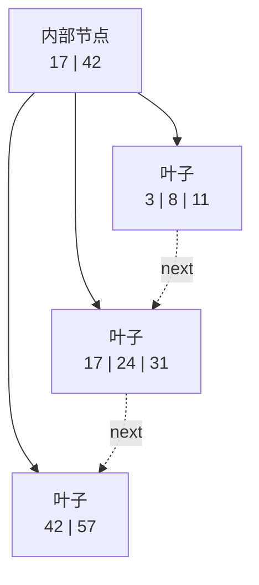

# 算法与数据结构 C/C++

# 1. 算法分析与 C/C++ 基础

先建立复杂度、递归成本和均摊分析的统一语言，再进入具体结构。

## 1.1 Big O 描述什么

渐进复杂度描述输入规模增大时，资源消耗的增长趋势。分析时至少要区分：

- **最坏复杂度**：所有合法输入中的最大开销；
- **平均复杂度**：依赖输入分布，不能凭直觉声称；
- **期望复杂度**：通常还包含随机算法或哈希函数的随机性；
- **均摊复杂度**：一串操作的总成本除以操作次数；
- **空间复杂度**：额外空间还是包含输入本身，要明确口径。

常见增长速度：

```text
O(1)
< O(log n)
< O(n)
< O(n log n)
< O(n^2)
< O(2^n)
< O(n!)
```

常数并非永远不重要。两个算法同为 `O(n)`，连续扫描和随机指针追逐在真实 CPU 上可能相差很大；缓存局部性、分支预测、向量化和内存分配不会完整体现在 Big O 中。

## 1.2 循环如何计算

顺序执行通常相加，嵌套执行通常相乘：

```cpp
for (std::size_t i = 0; i < n; ++i) {        // n 次
    for (std::size_t j = 0; j < n; ++j) {    // 每次 n 次
        consume(i, j);                        // O(1)
    }
}
// O(n^2)
```

变量按倍数增长通常是对数级：

```cpp
for (std::size_t x = 1; x < n; x *= 2) {
    consume(x);
}
// O(log n)
```

不要见到两层循环就直接断定为 `O(n^2)`：

```cpp
for (std::size_t i = 0; i < n; ++i) {
    for (std::size_t j = i; j > 0; j /= 2) {
        consume(i, j);
    }
}
// O(n log n)
```

## 1.3 递归复杂度

递归需要同时考虑：

- 子问题数量；
- 子问题规模；
- 每层额外工作；
- 递归深度造成的栈空间。

归并排序的递推式：

```text
T(n) = 2T(n / 2) + O(n)
     = O(n log n)
```

二分查找：

```text
T(n) = T(n / 2) + O(1)
     = O(log n)
```

朴素 Fibonacci：

```text
T(n) = T(n - 1) + T(n - 2) + O(1)
     = O(phi^n)，常粗略写作 O(2^n)
```

## 1.4 均摊分析

`std::vector::push_back` 通常是均摊 `O(1)`。扩容那一次需要移动或拷贝已有元素，是 `O(n)`；但容量按常数倍增长时，连续插入 `n` 个元素的总搬迁量仍是 `O(n)`。

三种常见均摊证明方法：

- 聚合分析：直接计算整串操作总成本；
- 记账法：便宜操作预存“余额”支付未来昂贵操作；
- 势能法：用数据结构状态的势能变化分摊成本。

## 1.5 复杂度分析模板

不要只说一个结果：

> 每个顶点只入队一次，每条有向边只检查一次，因此时间复杂度是 `O(V + E)`；邻接表占 `O(V + E)`，队列和访问数组占 `O(V)`。如果输入改为邻接矩阵，即使边很少也需要扫描 `V^2` 个位置。

---

# 2. 数组、基础字符串、矩阵与链表

从连续内存和线性扫描开始，逐步扩展到矩阵原地变换与链表指针操作。

## 2.1 为什么数组重要

数组元素连续，具有：

- `O(1)` 随机访问；
- 良好的空间局部性；
- 中间插入、删除通常需要搬移 `O(n)` 个元素；
- 固定数组必须显式管理容量；
- `std::vector` 自动管理动态连续存储，但扩容会使迭代器、引用和指针失效。

C 接口传入数组后通常只剩指针，长度不会自动保留：

```c
long long sum_array(const int *data, size_t size) {
    long long sum = 0;
    for (size_t i = 0; i < size; ++i) {
        sum += data[i];
    }
    return sum;
}
```

长度必须作为参数传入，并且只有在 `size > 0` 时才允许解引用 `data`。

## 2.2 双指针

双指针不是单一算法，而是利用单调性减少重复扫描。

常见形态：

- 两端向中间：有序数组两数和、回文判断；
- 快慢指针：链表环、原地去重；
- 同向窗口：满足约束的最长或最短连续区间；
- 归并指针：合并两个有序序列。

有序数组两数和：

```cpp
#include <optional>
#include <utility>
#include <vector>

std::optional<std::pair<std::size_t, std::size_t>>
two_sum_sorted(const std::vector<int>& values, long long target) {
    if (values.size() < 2) {
        return std::nullopt;
    }

    std::size_t left = 0;
    std::size_t right = values.size() - 1;
    while (left < right) {
        const long long sum =
            static_cast<long long>(values[left]) + values[right];
        if (sum == target) {
            return std::pair{left, right};
        }
        if (sum < target) {
            ++left;
        } else {
            --right;
        }
    }
    return std::nullopt;
}
```

关键不变量：答案若仍存在，就一定在闭区间 `[left, right]` 中。数组有序才能根据和的大小安全排除一端。

## 2.3 滑动窗口

适合连续子数组或子串，并且左右边界能单调前进的问题。

最长无重复字节子串：

```cpp
#include <algorithm>
#include <array>
#include <string_view>

std::size_t longest_unique_substring(std::string_view text) {
    std::array<std::size_t, 256> next_allowed{};
    std::size_t left = 0;
    std::size_t best = 0;

    for (std::size_t right = 0; right < text.size(); ++right) {
        const auto byte = static_cast<unsigned char>(text[right]);
        left = std::max(left, next_allowed[byte]);
        best = std::max(best, right - left + 1);
        next_allowed[byte] = right + 1;
    }
    return best;
}
```

这里处理的是字节，不是 Unicode 字符。UTF-8 中一个用户可见字符可能占多个字节；如果题目按 Unicode code point 或 grapheme cluster 定义，就必须先明确编码语义。

## 2.4 前缀和

前缀和把多次区间求和从每次 `O(n)` 降为预处理 `O(n)`、查询 `O(1)`。

定义半开区间前缀：

```text
prefix[0] = 0
prefix[i + 1] = prefix[i] + values[i]
sum([left, right)) = prefix[right] - prefix[left]
```

```cpp
#include <stdexcept>
#include <vector>

class PrefixSum {
public:
    explicit PrefixSum(const std::vector<int>& values)
        : prefix_(values.size() + 1, 0) {
        for (std::size_t i = 0; i < values.size(); ++i) {
            prefix_[i + 1] = prefix_[i] + values[i];
        }
    }

    long long query(std::size_t left, std::size_t right) const {
        if (left > right || right >= prefix_.size()) {
            throw std::out_of_range("invalid half-open range");
        }
        return prefix_[right] - prefix_[left];
    }

private:
    std::vector<long long> prefix_;
};
```

二维前缀和常用于矩形区域查询；差分数组则反过来擅长批量区间加法。

## 2.5 数组状态的分解与维护

前面的双指针、滑动窗口和前缀和已经覆盖连续区间的基础操作。本章补充几类
常见但不能只靠一个遍历模板概括的状态维护方法。

## 2.6 前缀与后缀分解

如果位置 `i` 的答案由“左边所有元素”和“右边所有元素”共同决定，可以分别
维护前缀聚合与后缀聚合。以“除自身以外的乘积”为例：

$$
\mathrm{answer}[i]
=
\left(\prod_{j<i}\mathrm{value}[j]\right)
\left(\prod_{j>i}\mathrm{value}[j]\right)
$$

不需要除法，因此数组中有零时仍然成立：

```cpp
#include <cstddef>
#include <cstdint>
#include <vector>

std::vector<std::int64_t> product_except_self(
    const std::vector<std::int64_t>& values) {
    std::vector<std::int64_t> result(values.size(), 1);

    std::int64_t prefix = 1;
    for (std::size_t i = 0; i < values.size(); ++i) {
        result[i] = prefix;
        prefix *= values[i];
    }

    std::int64_t suffix = 1;
    for (std::size_t i = values.size(); i-- > 0;) {
        result[i] *= suffix;
        suffix *= values[i];
    }
    return result;
}
```

时间是 `O(n)`。除输出数组外只使用 `O(1)` 空间。乘积仍可能溢出，
“没有使用除法”并不等于数值一定安全。

## 2.7 连续子数组与 Kadane

最大连续子数组和：

```cpp
#include <algorithm>
#include <optional>
#include <vector>

std::optional<long long> max_subarray_sum(const std::vector<int>& values) {
    if (values.empty()) {
        return std::nullopt;
    }

    long long ending_here = values.front();
    long long best = ending_here;
    for (std::size_t i = 1; i < values.size(); ++i) {
        ending_here = std::max<long long>(values[i], ending_here + values[i]);
        best = std::max(best, ending_here);
    }
    return best;
}
```

状态含义比公式更重要：`ending_here` 是“必须以当前位置结尾”的最大和，`best` 是目前见过的全局最大和。

## 2.8 环形 Kadane

环形数组的最大连续和只有两种情况：

1. 最优区间不跨边界，就是普通 Kadane；
2. 最优区间跨边界，等于总和减去中间的最小连续和。

当所有元素都为负数时，最小连续和就是整个数组，不能返回空区间对应的零：

```cpp
#include <algorithm>
#include <cstdint>
#include <optional>
#include <vector>

std::optional<std::int64_t> maximum_circular_subarray_sum(
    const std::vector<std::int64_t>& values) {
    if (values.empty()) return std::nullopt;

    std::int64_t total = values.front();
    std::int64_t maximum_ending = values.front();
    std::int64_t maximum = values.front();
    std::int64_t minimum_ending = values.front();
    std::int64_t minimum = values.front();

    for (std::size_t i = 1; i < values.size(); ++i) {
        maximum_ending =
            std::max(values[i], maximum_ending + values[i]);
        maximum = std::max(maximum, maximum_ending);

        minimum_ending =
            std::min(values[i], minimum_ending + values[i]);
        minimum = std::min(minimum, minimum_ending);
        total += values[i];
    }

    if (maximum < 0) return maximum;
    return std::max(maximum, total - minimum);
}
```

## 2.9 原地旋转与有序数组压缩

数组右旋 `shift` 个位置可以通过三次反转完成：

```text
[A B]              原数组分成两段
reverse(A B)        整体反转
reverse(B) reverse(A)
```

```cpp
#include <algorithm>
#include <cstddef>
#include <vector>

void rotate_right(std::vector<int>& values, std::size_t shift) {
    if (values.empty()) return;
    shift %= values.size();
    if (shift == 0) return;

    std::reverse(values.begin(), values.end());
    std::reverse(values.begin(),
                 values.begin() + static_cast<std::ptrdiff_t>(shift));
    std::reverse(values.begin() + static_cast<std::ptrdiff_t>(shift),
                 values.end());
}

// 有序数组中每个值最多保留 max_copies 份，返回新长度。
std::size_t compact_sorted(std::vector<int>& values,
                           std::size_t max_copies) {
    if (max_copies == 0) {
        values.clear();
        return 0;
    }

    std::size_t write = 0;
    for (int value : values) {
        if (write < max_copies ||
            value != values[write - max_copies]) {
            values[write++] = value;
        }
    }
    values.resize(write);
    return write;
}
```

`compact_sorted` 的不变量是 `[0, write)` 始终是已经满足重复次数限制的答案。
写指针不会超过读指针，所以不会覆盖尚未读取的数据。

## 2.10 矩阵边界与原地变换

矩阵问题首先要明确：

- 是否保证每行长度相同；
- 坐标是 `(row, column)`，不要交换行列上界；
- 是否允许原地修改；
- 遍历一层边界后，单行或单列是否会被重复访问。

螺旋遍历可维护四个半开边界 `[top, bottom)`、`[left, right)`。每走完一条
边就立即收缩，并在访问对边前重新判断区间是否为空：

```cpp
#include <cstddef>
#include <limits>
#include <stdexcept>
#include <vector>

std::vector<int> spiral_order(
    const std::vector<std::vector<int>>& matrix) {
    std::vector<int> result;
    if (matrix.empty()) return result;

    const std::size_t columns = matrix.front().size();
    for (const auto& row : matrix) {
        if (row.size() != columns) {
            throw std::invalid_argument("matrix must be rectangular");
        }
    }
    if (columns == 0) return result;

    if (matrix.size() >
        std::numeric_limits<std::size_t>::max() / columns) {
        throw std::length_error("matrix element count overflows");
    }
    result.reserve(matrix.size() * columns);
    std::size_t top = 0;
    std::size_t bottom = matrix.size();
    std::size_t left = 0;
    std::size_t right = columns;

    while (top < bottom && left < right) {
        for (std::size_t column = left; column < right; ++column) {
            result.push_back(matrix[top][column]);
        }
        ++top;
        if (top >= bottom) break;

        for (std::size_t row = top; row < bottom; ++row) {
            result.push_back(matrix[row][right - 1]);
        }
        --right;
        if (left >= right) break;

        for (std::size_t column = right; column > left; --column) {
            result.push_back(matrix[bottom - 1][column - 1]);
        }
        --bottom;
        if (top >= bottom) break;

        for (std::size_t row = bottom; row > top; --row) {
            result.push_back(matrix[row - 1][left]);
        }
        ++left;
    }
    return result;
}
```

方阵顺时针旋转可以先沿主对角线转置，再反转每一行：

```cpp
#include <algorithm>
#include <cstddef>
#include <stdexcept>
#include <vector>

void rotate_square_clockwise(std::vector<std::vector<int>>& matrix) {
    const std::size_t size = matrix.size();
    for (const auto& row : matrix) {
        if (row.size() != size) {
            throw std::invalid_argument("rotation requires a square matrix");
        }
    }

    for (std::size_t row = 0; row < size; ++row) {
        for (std::size_t column = row + 1; column < size; ++column) {
            std::swap(matrix[row][column], matrix[column][row]);
        }
    }
    for (auto& row : matrix) std::reverse(row.begin(), row.end());
}
```

另外两种常见原地标记方式：

- 将整行整列清零：用第一行、第一列保存标记，并另外记录它们自身是否含零；
- 同步更新细胞状态：用一个整数的低位保存旧状态、高位保存新状态，第一遍只
  写高位，第二遍统一右移。这样邻居读取到的始终是同一轮旧状态。

## 2.11 链表基础与节点定义

链表的随机访问是 `O(n)`，但已知节点位置时插入、删除可以是 `O(1)`。真实机器上，节点分散分配会带来缓存不命中和分配开销，所以链表并不天然比 `vector` 快。

```cpp
struct ListNode {
    int value{};
    ListNode* next{};
};
```

## 2.12 反转单链表

```cpp
ListNode* reverse_list(ListNode* head) {
    ListNode* previous = nullptr;
    while (head != nullptr) {
        ListNode* next = head->next;
        head->next = previous;
        previous = head;
        head = next;
    }
    return previous;
}
```

循环不变量：`previous` 始终指向已经反转完成的前缀，`head` 指向尚未处理的后缀。

这段代码只重连指针，不分配和释放节点；节点所有权仍由调用者负责。

## 2.13 快慢指针判环

```cpp
bool has_cycle(const ListNode* head) {
    const ListNode* slow = head;
    const ListNode* fast = head;
    while (fast != nullptr && fast->next != nullptr) {
        slow = slow->next;
        fast = fast->next->next;
        if (slow == fast) {
            return true;
        }
    }
    return false;
}
```

如果存在环，快指针相对慢指针每轮多走一步，最终会在环内相遇。继续推导还可以在 `O(1)` 空间找到环入口。

## 2.14 合并两个有序链表

```cpp
ListNode* merge_sorted_lists(ListNode* a, ListNode* b) {
    ListNode dummy;
    ListNode* tail = &dummy;

    while (a != nullptr && b != nullptr) {
        ListNode*& chosen = (a->value <= b->value) ? a : b;
        tail->next = chosen;
        chosen = chosen->next;
        tail = tail->next;
    }
    tail->next = (a != nullptr) ? a : b;
    return dummy.next;
}
```

哑节点可以统一处理头节点，减少“第一次插入”的特殊分支。

## 2.15 常见链表问题

- 删除倒数第 `k` 个节点：前后指针保持 `k` 个节点距离；
- 相交链表：两个指针分别走 `A + B` 和 `B + A`；
- 回文链表：找中点、反转后半段、比较，必要时恢复结构；
- K 路合并：最小堆保存每条链表当前头，复杂度 `O(N log k)`；
- LRU：哈希表负责 `O(1)` 定位，双向链表负责 `O(1)` 调整新旧顺序。

## 2.16 链表哨兵与分组反转

链表删除、分段和旋转常使用栈上哨兵节点，使“修改头节点”和“修改中间节点”
走同一套逻辑。分组反转时，先找到本组末尾；不足一组就保持原样：

```cpp
#include <cstddef>
#include <stdexcept>

// 使用“链表基础与节点定义”一节中的 ListNode。
ListNode* reverse_in_groups(ListNode* head, std::size_t group_size) {
    if (group_size == 0) {
        throw std::invalid_argument("group size must be positive");
    }

    ListNode dummy{0, head};
    ListNode* group_before = &dummy;

    while (true) {
        ListNode* group_last = group_before;
        for (std::size_t i = 0; i < group_size; ++i) {
            group_last = group_last->next;
            if (group_last == nullptr) return dummy.next;
        }

        ListNode* group_after = group_last->next;
        ListNode* previous = group_after;
        ListNode* current = group_before->next;
        while (current != group_after) {
            ListNode* next = current->next;
            current->next = previous;
            previous = current;
            current = next;
        }

        ListNode* new_group_last = group_before->next;
        group_before->next = group_last;
        group_before = new_group_last;
    }
}
```

带随机指针的链表可以用哈希表建立“旧节点到新节点”的映射；也可以把复制节点
暂时织入原链表每个节点之后，第二遍设置随机指针，第三遍拆成两条链。织入方法
使用 `O(1)` 额外映射空间，但修改了输入，且拆链步骤必须在异常策略上格外谨慎。

---

# 3. 栈、队列与哈希表

先理解容器语义，再学习单调结构、辅助栈和哈希表的不变量。

## 3.1 基本语义

- 栈：后进先出，适合括号匹配、表达式求值、DFS、函数调用；
- 队列：先进先出，适合 BFS、生产消费、分层处理；
- 双端队列：两端插入删除，适合滑动窗口最大值和 0-1 BFS；
- 优先队列：每次取最高优先级元素，通常由堆实现。

不要用 `std::vector::erase(begin())` 模拟队列，因为每次会移动后续元素。使用 `std::queue` 或 `std::deque`。

## 3.2 单调栈

“每个位置右侧第一个更大元素”：

```cpp
#include <stack>
#include <vector>

std::vector<int> next_greater_value(const std::vector<int>& values) {
    std::vector<int> answer(values.size(), -1);
    std::stack<std::size_t> indices;

    for (std::size_t i = 0; i < values.size(); ++i) {
        while (!indices.empty() && values[indices.top()] < values[i]) {
            answer[indices.top()] = values[i];
            indices.pop();
        }
        indices.push(i);
    }
    return answer;
}
```

每个下标最多入栈、出栈各一次，因此总复杂度是 `O(n)`，不是 while 嵌套看起来的 `O(n^2)`。

单调栈常见题：柱状图最大矩形、每日温度、接雨水、贡献法计算子数组最值。

## 3.3 单调队列

固定窗口最大值维护一个下标双端队列：

- 队首始终是当前窗口最大值下标；
- 新元素进入前，从队尾删除所有不可能再成为最大值的元素；
- 队首越过左边界时弹出。

同样因为每个元素最多进出一次，总复杂度是 `O(n)`。

## 3.4 Min Stack

普通栈只能在 `O(1)` 时间读取栈顶；如果每次查询最小值都扫描整个栈，单次查询
就需要 `O(n)`。Min Stack 的目的，是在保持后进先出语义的同时，让插入、删除、
读取栈顶和查询当前最小值都保持 `O(1)`。它适合栈内容不断变化、又需要频繁查询
当前最小值的在线过程，代价是额外的 `O(n)` 辅助空间。

为每个栈元素同时保存“到这里为止的最小值”，就能让 `push`、`pop`、`top`
和 `minimum` 都是 `O(1)`：

```cpp
#include <algorithm>
#include <optional>
#include <utility>
#include <vector>

class MinStack {
    // first 是值，second 是包含当前元素时的栈最小值。
    std::vector<std::pair<int, int>> values_;

public:
    void push(int value) {
        const int current_minimum = values_.empty()
            ? value
            : std::min(value, values_.back().second);
        values_.emplace_back(value, current_minimum);
    }

    bool pop() {
        if (values_.empty()) return false;
        values_.pop_back();
        return true;
    }

    std::optional<int> top() const {
        if (values_.empty()) return std::nullopt;
        return values_.back().first;
    }

    std::optional<int> minimum() const {
        if (values_.empty()) return std::nullopt;
        return values_.back().second;
    }
};
```

另一种实现是单独维护最小值栈；只有新值不大于当前最小值时才压入，弹出相等
最小值时同步弹出。相等判断不能遗漏，否则重复最小值会使两个栈失去同步。

## 3.5 哈希表

### 3.5.1 基本原理

哈希表把键映射到桶。平均查找、插入和删除通常是 `O(1)`，但最坏可以退化为 `O(n)`。必须理解：

- 哈希函数应尽量均匀；
- 冲突可用链式结构或开放寻址解决；
- 负载因子过高会增加冲突；
- rehash 是昂贵操作，并可能使迭代器失效；
- 哈希表通常不保证遍历顺序；
- 对抗性输入可能构造大量冲突。

### 3.5.2 何时使用

- 两数和、计数、去重；
- 记录节点是否访问；
- 建立值到位置、ID 到对象的索引；
- 缓存和记忆化搜索。

如果需要有序遍历、范围查询或稳定的最坏 `O(log n)`，考虑树结构；如果键是小范围整数，数组或位图通常更快。

### 3.5.3 自定义键

相等关系与哈希必须一致：如果 `a == b`，则必须有 `hash(a) == hash(b)`。

```cpp
#include <cstddef>
#include <functional>
#include <unordered_map>

struct Point {
    int x{};
    int y{};

    bool operator==(const Point& other) const noexcept {
        return x == other.x && y == other.y;
    }
};

struct PointHash {
    std::size_t operator()(const Point& p) const noexcept {
        const std::size_t h1 = std::hash<int>{}(p.x);
        const std::size_t h2 = std::hash<int>{}(p.y);
        return h1 ^ (h2 + 0x9e3779b9U + (h1 << 6U) + (h1 >> 2U));
    }
};

using PointTable = std::unordered_map<Point, int, PointHash>;
```

### 3.5.4 常见错误

- 在遍历过程中触发 rehash，却继续使用旧迭代器；
- 用 `operator[]` 做纯查询，意外插入默认值；
- 认为平均 `O(1)` 就没有常数和缓存代价；
- 对浮点数直接做精确相等和哈希；
- 自定义比较与哈希不一致。

---

# 4. 排序、二分与堆

从排序和优先队列过渡到依赖单调性的边界搜索与分割问题。

## 4.1 常见排序比较

| 算法 | 平均时间 | 最坏时间 | 额外空间 | 稳定 | 备注 |
|---|---:|---:|---:|---|---|
| 插入排序 | `O(n^2)` | `O(n^2)` | `O(1)` | 是 | 小规模或近乎有序时很好 |
| 归并排序 | `O(n log n)` | `O(n log n)` | `O(n)` | 是 | 顺序访问，适合外排序 |
| 快速排序 | `O(n log n)` | `O(n^2)` | 平均 `O(log n)` 栈 | 否 | 缓存友好，需良好 pivot |
| 堆排序 | `O(n log n)` | `O(n log n)` | `O(1)` | 否 | 最坏有保证，局部性较差 |
| 计数排序 | `O(n + k)` | `O(n + k)` | `O(k)` | 可实现为稳定 | 键范围 `k` 不能太大 |

基于比较的通用排序在决策树模型下有 `Omega(n log n)` 下界。计数、基数排序利用了键的额外结构，因此不受该比较下界约束。

## 4.2 归并排序

使用半开区间 `[first, last)` 能减少边界错误：

```cpp
#include <algorithm>
#include <vector>

void merge_sort_impl(std::vector<int>& values,
                     std::vector<int>& buffer,
                     std::size_t first,
                     std::size_t last) {
    if (last - first <= 1) {
        return;
    }

    const std::size_t middle = first + (last - first) / 2;
    merge_sort_impl(values, buffer, first, middle);
    merge_sort_impl(values, buffer, middle, last);

    std::size_t i = first;
    std::size_t j = middle;
    std::size_t out = first;
    while (i < middle && j < last) {
        if (values[i] <= values[j]) {
            buffer[out++] = values[i++];
        } else {
            buffer[out++] = values[j++];
        }
    }
    while (i < middle) buffer[out++] = values[i++];
    while (j < last) buffer[out++] = values[j++];
    std::copy(buffer.begin() + static_cast<std::ptrdiff_t>(first),
              buffer.begin() + static_cast<std::ptrdiff_t>(last),
              values.begin() + static_cast<std::ptrdiff_t>(first));
}

void merge_sort(std::vector<int>& values) {
    std::vector<int> buffer(values.size());
    merge_sort_impl(values, buffer, 0, values.size());
}
```

合并时相等元素优先取左侧，才能保持稳定性。

## 4.3 三路快速排序

三路划分对大量重复元素更稳健：

```cpp
#include <algorithm>
#include <functional>
#include <random>
#include <vector>

void quick_sort(std::vector<int>& values) {
    if (values.size() < 2) return;

    std::mt19937 engine(std::random_device{}());
    std::function<void(std::ptrdiff_t, std::ptrdiff_t)> sort_range =
        [&](std::ptrdiff_t left, std::ptrdiff_t right) {
            if (left >= right) return;

            std::uniform_int_distribution<std::ptrdiff_t> choose(left, right);
            const int pivot = values[static_cast<std::size_t>(choose(engine))];
            std::ptrdiff_t less = left;
            std::ptrdiff_t current = left;
            std::ptrdiff_t greater = right;

            while (current <= greater) {
                int& value = values[static_cast<std::size_t>(current)];
                if (value < pivot) {
                    std::swap(values[static_cast<std::size_t>(less++)], value);
                    ++current;
                } else if (value > pivot) {
                    std::swap(value, values[static_cast<std::size_t>(greater--)]);
                } else {
                    ++current;
                }
            }
            sort_range(left, less - 1);
            sort_range(greater + 1, right);
        };

    sort_range(0, static_cast<std::ptrdiff_t>(values.size()) - 1);
}
```

生产代码通常应优先使用 `std::sort`。标准库实现会综合处理小数组、递归深度和最坏情况；手写实现用于理解划分不变量，而不是替代标准库。

## 4.4 堆与优先队列

二叉堆通常存储在数组中。以零开始下标：

```text
parent(i) = (i - 1) / 2      // i > 0
left(i)   = 2 * i + 1
right(i)  = 2 * i + 2
```

- 读取堆顶 `O(1)`；
- 插入 `O(log n)`；
- 删除堆顶 `O(log n)`；
- 从数组自底向上建堆是 `O(n)`，不是 `O(n log n)`。

若把数组元素逐个插入空堆，需要执行 `n` 次上浮，总复杂度是
`O(n log n)`。一次性建堆则从最后一个非叶节点开始向前执行下沉：靠近叶子的
节点虽然多，却至多下沉一两层；可能下沉很多层的节点非常少。总工作量可由
`n/2 * 1 + n/4 * 2 + n/8 * 3 + ...` 上界，因此是 `O(n)`。标准库中的
`std::make_heap` 就适合已有完整数组的场景。

`std::priority_queue` 默认是最大堆：

```cpp
#include <functional>
#include <queue>
#include <vector>

std::priority_queue<int, std::vector<int>, std::greater<int>> min_heap;
```

堆适合动态地反复获取极值，不适合查任意元素。

## 4.5 Top K 的选择

| 场景 | 常见方案 | 复杂度 |
|---|---|---|
| 一次找第 `k` 小 | Quickselect / `std::nth_element` | 平均 `O(n)` |
| 海量流中保留最大 K 个 | 大小为 K 的最小堆 | `O(n log k)` |
| K 接近 n 且需要整体有序 | 排序 | `O(n log n)` |
| 小范围整数 | 计数或桶 | `O(n + range)` |

Quickselect 沿用快速排序的划分操作：选择一个枢轴，把较小、相等和较大的元素
分到不同区间。枢轴位置确定后，只继续处理第 `k` 个位置所在的一侧，另一侧可以
直接丢弃，因此不必完成整个数组的排序。随机选择枢轴时平均复杂度是 `O(n)`；
如果每次都选到极端枢轴，最坏复杂度会退化到 `O(n^2)`。

Quickselect 只保证目标元素处于排序后应在的位置，并不保证两侧各自有序。
`std::nth_element(first, first + k, last)` 通常是更稳妥的现成实现。若要求最坏
线性时间，可以使用 median-of-medians 选择枢轴，但常数较大。

## 4.6 二分查找的本质

二分查找的本质不是“找一个值”，而是在具有单调性的搜索空间中寻找边界。

## 4.7 `lower_bound` 的不变量

寻找第一个不小于 `target` 的位置：

```cpp
#include <vector>

std::size_t lower_bound_index(const std::vector<int>& values, int target) {
    std::size_t first = 0;
    std::size_t last = values.size();

    while (first < last) {
        const std::size_t middle = first + (last - first) / 2;
        if (values[middle] < target) {
            first = middle + 1;
        } else {
            last = middle;
        }
    }
    return first;
}
```

循环维持：

- `[0, first)` 中的元素都小于 `target`；
- `[last, n)` 中的元素都不小于 `target`；
- 未判定区域是 `[first, last)`。

返回值可能等于 `values.size()`，调用者不能直接解引用。

## 4.8 常见边界变体

- 第一个 `>= target`：`lower_bound`；
- 第一个 `> target`：`upper_bound`；
- 最后一个 `< target`：`lower_bound - 1`，但要检查是否存在；
- 最后一个 `<= target`：`upper_bound - 1`；
- 旋转数组：根据一侧是否有序排除区间；
- 二维矩阵：先确认能否按行展开为一维有序序列。

## 4.9 二维矩阵中的搜索

二维矩阵不能看到“有序”就直接按一维二分，必须先区分具体保证：

- 若每行有序，且上一行末尾不大于下一行开头，矩阵按行展开后整体有序。可把
  虚拟下标 `index` 映射为 `(index / columns, index % columns)`，时间复杂度为
  `O(log(rows * columns))`，无需真的复制成一维数组；
- 若只保证每行有序，可对每行分别二分，并先用该行首尾值剪枝，复杂度为
  `O(rows log columns)`；
- 若每行和每列都递增，但行与行之间不满足整体顺序，则不能直接展开。从右上角
  开始，目标较小就左移，目标较大就下移，每次排除一行或一列，复杂度为
  `O(rows + columns)`。

在行列递增矩阵中寻找第 `k` 小元素时，还可以对值域二分，并用阶梯扫描统计
不大于候选值的元素数量，复杂度为 `O((rows + columns) log value_range)`。重复
元素要按“不大于”计数；同时注意空矩阵、非矩形输入以及计算
`rows * columns` 时的整数溢出。

## 4.10 旋转有序数组

旋转不是任意打乱，而是把有序数组从某个位置切成两段后交换顺序，例如：

```text
[0, 1, 2, 4, 5, 6, 7]  ->  [4, 5, 6, 7, 0, 1, 2]
```

数组整体不再有序，但仍由两个有序区间组成。对于元素互异的数组，二分区间中
至少有一半有序；循环始终保持不变量：目标若存在，就一定在 `[first, last)` 中。
找到中点后：

- 若 `values[first] <= values[middle]`，左半边有序；只有目标落在
  `[values[first], values[middle])` 时才保留左半边；
- 否则右半边有序；只有目标落在
  `(values[middle], values[last - 1]]` 时才保留右半边。

由此每轮都能排除至少一半区间，时间复杂度为 `O(log n)`：

```cpp
#include <cstddef>
#include <optional>
#include <vector>

std::optional<std::size_t> find_in_rotated_sorted(
    const std::vector<int>& values,
    int target) {
    std::size_t first = 0;
    std::size_t last = values.size();

    while (first < last) {
        const std::size_t middle = first + (last - first) / 2;
        if (values[middle] == target) return middle;

        if (values[first] <= values[middle]) {
            // [first, middle] 有序。
            if (values[first] <= target && target < values[middle]) {
                last = middle;
            } else {
                first = middle + 1;
            }
        } else {
            // [middle, last) 有序。
            if (values[middle] < target &&
                target <= values[last - 1]) {
                first = middle + 1;
            } else {
                last = middle;
            }
        }
    }
    return std::nullopt;
}
```

该实现也能自然处理空数组、单元素数组和完全没有旋转的数组，但要求元素互异。
若允许重复，并且 `values[first] == values[middle]` 且
`values[middle] == values[last - 1]`，端点已无法说明旋转点在哪一侧。此时只能
在确认中点不是目标后，把左右边界各收缩一步；连续重复值可能使每轮只能排除
常数个元素，最坏复杂度会退化到 `O(n)`。

## 4.11 对答案二分

如果存在单调谓词：

```text
false false false true true true
```

就可以找第一个 `true`。典型问题包括最小容量、最大可行距离、最短完成时间。

```cpp
#include <cstdint>
#include <functional>

std::int64_t first_feasible(std::int64_t low,
                            std::int64_t high,
                            const std::function<bool(std::int64_t)>& feasible) {
    // 约定答案存在于闭区间 [low, high]。
    while (low < high) {
        const std::int64_t middle = low + (high - low) / 2;
        if (feasible(middle)) {
            high = middle;
        } else {
            low = middle + 1;
        }
    }
    return low;
}
```

使用时必须解释为什么 `feasible(x)` 单调，以及上下界为什么覆盖答案。

## 4.12 两个有序数组的二分分割

在较短数组中选择分割位置 `i`，另一个数组的位置 `j` 由左半元素总数唯一确定。
合法分割满足：

```text
left_a <= right_b
left_b <= right_a
```

```cpp
#include <algorithm>
#include <cstddef>
#include <cstdint>
#include <limits>
#include <optional>
#include <stdexcept>
#include <vector>

std::optional<double> median_of_two_sorted(
    const std::vector<int>& first,
    const std::vector<int>& second) {
    if (first.size() > second.size()) {
        return median_of_two_sorted(second, first);
    }
    if (first.empty() && second.empty()) return std::nullopt;
    if (second.size() >
        std::numeric_limits<std::size_t>::max() - first.size()) {
        throw std::length_error("combined size overflows");
    }

    const std::size_t total = first.size() + second.size();
    const std::size_t left_count = total / 2 + total % 2;
    std::size_t low = 0;
    std::size_t high = first.size();

    while (low <= high) {
        const std::size_t cut_first = low + (high - low) / 2;
        const std::size_t cut_second = left_count - cut_first;

        const std::int64_t left_first = cut_first == 0
            ? std::numeric_limits<std::int64_t>::lowest()
            : first[cut_first - 1];
        const std::int64_t right_first = cut_first == first.size()
            ? std::numeric_limits<std::int64_t>::max()
            : first[cut_first];
        const std::int64_t left_second = cut_second == 0
            ? std::numeric_limits<std::int64_t>::lowest()
            : second[cut_second - 1];
        const std::int64_t right_second = cut_second == second.size()
            ? std::numeric_limits<std::int64_t>::max()
            : second[cut_second];

        if (left_first <= right_second &&
            left_second <= right_first) {
            const std::int64_t left_maximum =
                std::max(left_first, left_second);
            if ((total & 1U) != 0) {
                return static_cast<double>(left_maximum);
            }

            const std::int64_t right_minimum =
                std::min(right_first, right_second);
            return static_cast<double>(
                left_maximum + right_minimum
            ) / 2.0;
        }

        if (left_first > right_second) {
            if (cut_first == 0) break;
            high = cut_first - 1;
        } else {
            low = cut_first + 1;
        }
    }
    throw std::invalid_argument("inputs must be sorted");
}
```

时间复杂度是 `O(log(min(m, n)))`。代码假设输入各自升序；若接口不能信任
调用者，应先验证排序，但验证本身需要线性时间。

---

# 5. 二叉树、BST 与 Trie

从遍历和递归返回值开始，再进入有序树、路径状态和前缀索引。

## 5.1 二叉树遍历

```cpp
struct TreeNode {
    int value{};
    TreeNode* left{};
    TreeNode* right{};
};
```

递归前序遍历很直观，但深度很大时可能栈溢出。迭代版本：

```cpp
#include <stack>
#include <vector>

std::vector<int> preorder(const TreeNode* root) {
    std::vector<int> order;
    if (root == nullptr) return order;

    std::stack<const TreeNode*> pending;
    pending.push(root);
    while (!pending.empty()) {
        const TreeNode* node = pending.top();
        pending.pop();
        order.push_back(node->value);
        if (node->right != nullptr) pending.push(node->right);
        if (node->left != nullptr) pending.push(node->left);
    }
    return order;
}
```

因为栈是后进先出，要先压右子树，再压左子树。

层序遍历使用队列；如果需要分层，在每轮开始记录当前队列长度。

## 5.2 后序递归返回什么

许多二叉树问题需要先得到左右子树信息，再计算当前节点。关键是区分：

- 递归返回给父节点的状态；
- 整棵树范围内维护的答案。

例如树高可以向父节点继续延伸，而直径可能完全位于某个子树中。下面把两者都
放进返回值，直径按边数计算：

```cpp
#include <algorithm>
#include <cstddef>

struct TreeShape {
    std::size_t height;
    std::size_t diameter;
};

TreeShape summarize_tree(const TreeNode* root) {
    if (root == nullptr) return {0, 0};

    const TreeShape left = summarize_tree(root->left);
    const TreeShape right = summarize_tree(root->right);
    const std::size_t through_root = left.height + right.height;

    return {
        1 + std::max(left.height, right.height),
        std::max({left.diameter, right.diameter, through_root})
    };
}
```

最大路径和使用相同结构，但返回给父节点的只能是“从当前节点向下的一条路径”；
全局答案则允许左右路径在当前节点汇合。负贡献应截断为零：

```cpp
#include <algorithm>
#include <cstdint>
#include <limits>
#include <optional>

namespace tree_path_detail {

std::int64_t maximum_downward_path(
    const TreeNode* node,
    std::int64_t& best) {
    if (node == nullptr) return 0;

    const std::int64_t left = std::max<std::int64_t>(
        0, maximum_downward_path(node->left, best)
    );
    const std::int64_t right = std::max<std::int64_t>(
        0, maximum_downward_path(node->right, best)
    );
    const std::int64_t value = node->value;
    best = std::max(best, value + left + right);
    return value + std::max(left, right);
}

}  // namespace tree_path_detail

std::optional<std::int64_t> maximum_tree_path_sum(
    const TreeNode* root) {
    if (root == nullptr) return std::nullopt;
    std::int64_t best = std::numeric_limits<std::int64_t>::lowest();
    tree_path_detail::maximum_downward_path(root, best);
    return best;
}
```

节点值与路径长度仍可能使 64 位加法溢出，接口应根据输入约束决定是否使用更宽
类型。极深退化树还可能耗尽调用栈。

## 5.3 最近公共祖先

普通二叉树没有父指针时，可后序搜索两个目标。下面用两位 Mask 表示子树中
找到了哪些目标，并且只有两个目标都真实存在时才返回祖先：

```cpp
#include <cstdint>

namespace lca_detail {

struct SearchResult {
    const TreeNode* ancestor;
    std::uint8_t found_mask;
};

SearchResult search(const TreeNode* node,
                    const TreeNode* first,
                    const TreeNode* second) {
    if (node == nullptr) return {nullptr, 0};

    const SearchResult left = search(node->left, first, second);
    const SearchResult right = search(node->right, first, second);

    std::uint8_t mask =
        static_cast<std::uint8_t>(left.found_mask | right.found_mask);
    if (node == first) mask = static_cast<std::uint8_t>(mask | 1U);
    if (node == second) mask = static_cast<std::uint8_t>(mask | 2U);

    const TreeNode* ancestor =
        left.ancestor != nullptr ? left.ancestor : right.ancestor;
    if (ancestor == nullptr && mask == 3U) ancestor = node;
    return {ancestor, mask};
}

}  // namespace lca_detail

const TreeNode* lowest_common_ancestor(const TreeNode* root,
                                       const TreeNode* first,
                                       const TreeNode* second) {
    if (first == nullptr || second == nullptr) return nullptr;
    const auto result = lca_detail::search(root, first, second);
    return result.found_mask == 3U ? result.ancestor : nullptr;
}
```

如果是 BST，可以利用键的有序性：两个键都小于当前节点就向左，都大于就向右，
第一次发生分叉或命中目标的节点就是最近公共祖先。该优化依赖 BST 不变量，
不能用于普通二叉树。

## 5.4 路径前缀和

统计“任意祖先到后代”的目标路径时，不能只从根开始。DFS 维护当前根路径的
前缀和频率；若当前和是 `sum`，此前出现过 `sum - target`，两者之间就是一条
目标路径：

```cpp
#include <cstddef>
#include <cstdint>
#include <unordered_map>

namespace tree_prefix_detail {

std::int64_t count(const TreeNode* node,
                   std::int64_t target,
                   std::int64_t prefix,
                   std::unordered_map<std::int64_t, std::size_t>& frequency) {
    if (node == nullptr) return 0;

    prefix += node->value;
    std::int64_t result = 0;
    if (const auto found = frequency.find(prefix - target);
        found != frequency.end()) {
        result += static_cast<std::int64_t>(found->second);
    }

    ++frequency[prefix];
    result += count(node->left, target, prefix, frequency);
    result += count(node->right, target, prefix, frequency);

    auto current = frequency.find(prefix);
    if (--current->second == 0) frequency.erase(current);
    return result;
}

}  // namespace tree_prefix_detail

std::int64_t count_downward_paths(const TreeNode* root,
                                  std::int64_t target) {
    std::unordered_map<std::int64_t, std::size_t> frequency;
    frequency.emplace(0, 1);
    return tree_prefix_detail::count(root, target, 0, frequency);
}
```

回溯离开节点时必须撤销当前前缀，否则兄弟子树会错误地把彼此的路径拼接起来。

## 5.5 层序聚合

BFS 队列中每轮开始时的元素数量就是当前层宽度。右视图、层平均值、最大层和
与锯齿顺序都只是“如何聚合这一层”的差异：

```cpp
#include <cstddef>
#include <queue>
#include <vector>

std::vector<std::vector<int>> level_order(const TreeNode* root) {
    std::vector<std::vector<int>> levels;
    if (root == nullptr) return levels;

    std::queue<const TreeNode*> pending;
    pending.push(root);

    while (!pending.empty()) {
        const std::size_t width = pending.size();
        auto& level = levels.emplace_back();
        level.reserve(width);

        for (std::size_t i = 0; i < width; ++i) {
            const TreeNode* node = pending.front();
            pending.pop();
            level.push_back(node->value);
            if (node->left != nullptr) pending.push(node->left);
            if (node->right != nullptr) pending.push(node->right);
        }
    }
    return levels;
}
```

锯齿遍历不必每层真的反转队列，可以按层号决定写入结果数组的下标。计算平均值
时先把层和提升到足够宽的类型。

## 5.6 二叉搜索树

BST 满足左子树键小于当前键、右子树键大于当前键，重复键策略必须另行约定。

- 平均查找 `O(log n)`；
- 极端退化为链表时是 `O(n)`；
- AVL、红黑树等平衡树保证高度为 `O(log n)`；
- 中序遍历按键有序。

验证 BST 时不要只比较父子节点；应向下传递整个允许范围，并注意 `INT_MIN/INT_MAX` 边界。

## 5.7 BST 的范围、中序与迭代器

验证 BST 必须把所有祖先形成的开区间向下传递，不能只比较父子：

```cpp
#include <optional>

bool is_strict_bst(const TreeNode* node,
                   std::optional<int> lower,
                   std::optional<int> upper) {
    if (node == nullptr) return true;
    if (lower && node->value <= *lower) return false;
    if (upper && node->value >= *upper) return false;

    return is_strict_bst(node->left, lower, node->value) &&
           is_strict_bst(node->right, node->value, upper);
}
```

第 `k` 小元素和 BST Iterator 都使用“延迟中序遍历”：栈中保存尚未访问的
左链；弹出一个节点后，再把它右孩子的整条左链压栈。每个节点只进出栈一次，
单次 `next` 均摊 `O(1)`，空间 `O(h)`。

根据前序与中序重建树时：

1. 前序第一个元素是当前根；
2. 用哈希表在中序序列中定位根；
3. 中序左段长度决定前序左右子树的分界；
4. 递归函数传索引区间，避免反复复制子数组；
5. 如果键可重复，仅靠前序与中序不能唯一确定树，必须增加约定。

## 5.8 Trie

Trie 按字符边组织前缀。查询复杂度取决于键长度 `L`，通常写作 `O(L)`，但空间可能很大。

子节点表示方式需要根据字符集选择：

- 固定小字符集：数组，查询快但可能浪费空间；
- 大字符集：哈希表或有序映射；
- 压缩 Trie / Radix Tree：合并单分支路径。

应用包括前缀查询、自动补全、路由表和字符串集合匹配。

## 5.9 Trie 与通配符搜索

下面的字典只接受小写 ASCII 字母，`.` 匹配任意一个字符。普通字符沿唯一边
下降；通配符需要尝试当前节点的所有孩子：

```cpp
#include <array>
#include <cstddef>
#include <memory>
#include <stdexcept>
#include <string_view>

class WordDictionary {
    struct Node {
        std::array<std::unique_ptr<Node>, 26> children;
        bool terminal{false};
    };

    Node root_;

    static std::size_t character_index(char character) {
        if (character < 'a' || character > 'z') {
            throw std::invalid_argument(
                "dictionary accepts lowercase ASCII letters"
            );
        }
        return static_cast<std::size_t>(character - 'a');
    }

    static bool matches(const Node& node,
                        std::string_view pattern,
                        std::size_t position) {
        if (position == pattern.size()) return node.terminal;

        const char character = pattern[position];
        if (character == '.') {
            for (const auto& child : node.children) {
                if (child != nullptr &&
                    matches(*child, pattern, position + 1)) {
                    return true;
                }
            }
            return false;
        }

        const auto index = character_index(character);
        return node.children[index] != nullptr &&
               matches(*node.children[index], pattern, position + 1);
    }

public:
    void add(std::string_view word) {
        Node* node = &root_;
        for (char character : word) {
            const auto index = character_index(character);
            if (node->children[index] == nullptr) {
                node->children[index] = std::make_unique<Node>();
            }
            node = node->children[index].get();
        }
        node->terminal = true;
    }

    bool contains(std::string_view word) const {
        const Node* node = &root_;
        for (char character : word) {
            const auto index = character_index(character);
            if (node->children[index] == nullptr) return false;
            node = node->children[index].get();
        }
        return node->terminal;
    }

    bool has_prefix(std::string_view prefix) const {
        const Node* node = &root_;
        for (char character : prefix) {
            const auto index = character_index(character);
            if (node->children[index] == nullptr) return false;
            node = node->children[index].get();
        }
        return true;
    }

    bool matches(std::string_view pattern) const {
        return matches(root_, pattern, 0);
    }
};
```

若需要返回每个前缀下字典序最小的若干候选，可以先对词表排序，再在每个 Trie
节点缓存固定数量的最小编号；也可以不建 Trie，直接对已排序词表的前缀范围做
两次二分。

---

# 6. AVL、红黑树、跳表与 B+ Tree

这一章建立在 BST 之上，依次比较严格平衡、宽松平衡、随机分层与外存索引。

## 6.1 AVL Tree

AVL Tree 是严格维护高度平衡的二叉搜索树。对任意节点，定义平衡因子：

$$
\mathrm{BF}(x)
=
\mathrm{height}(x_{\mathrm{left}})
-
\mathrm{height}(x_{\mathrm{right}})
$$

AVL 要求每个节点都满足：

$$
|\mathrm{BF}(x)|\le 1
$$

插入或删除仍然先按 BST 规则完成，再从修改位置向根方向更新高度。
一旦某个节点的平衡因子变成 `2` 或 `-2`，就通过旋转恢复平衡。

### 四种失衡

| 类型 | 插入方向 | 修复方式 |
|---|---|---|
| LL | 左孩子的左子树 | 对失衡节点右旋 |
| RR | 右孩子的右子树 | 对失衡节点左旋 |
| LR | 左孩子的右子树 | 先左旋左孩子，再右旋失衡节点 |
| RL | 右孩子的左子树 | 先右旋右孩子，再左旋失衡节点 |

下面用四组最小插入序列分别画出失衡位置和修复过程。括号中的平衡因子
属于最先失衡的节点。

#### LL：右旋失衡节点

依次插入 `30、20、10`。新节点落在 `30` 的左孩子的左子树，使
`BF(30) = +2`；对 `30` 做一次右旋：

```text
       30 (+2)                     20
       /                          /  \
     20          --右旋 30-->   10   30
     /
   10
```

#### RR：左旋失衡节点

依次插入 `10、20、30`。新节点落在 `10` 的右孩子的右子树，使
`BF(10) = -2`；对 `10` 做一次左旋：

```text
   10 (-2)                         20
      \                           /  \
       20       --左旋 10-->     10   30
         \
          30
```

#### LR：先左旋左孩子，再右旋失衡节点

依次插入 `30、10、20`。不能直接右旋 `30`，否则中间键 `20` 不能成为
局部根。先对左孩子 `10` 左旋，把 LR 变成 LL；再对 `30` 右旋：

```text
       30 (+2)              30                         20
       /                    /                         /  \
     10      --左旋 10--> 20       --右旋 30-->     10   30
       \                  /
        20              10
```

#### RL：先右旋右孩子，再左旋失衡节点

依次插入 `10、30、20`。先对右孩子 `30` 右旋，把 RL 变成 RR；再对
`10` 左旋：

```text
   10 (-2)              10                             20
      \                   \                            /  \
       30  --右旋 30-->   20        --左旋 10-->      10   30
       /                    \
     20                      30
```

判断类型时应看“失衡节点”和“较高孩子”的平衡因子，不必保存完整插入
路径。删除后的临界情况也可能出现 `BF(child) == 0`：若失衡节点左高就
右旋，右高就左旋。一次单旋后高度仍可能继续下降，因此删除需要继续向根
检查；插入修复第一个失衡祖先后，整棵子树通常已恢复到插入前的高度。

一次右旋的结构变化如下。旋转只改变局部连接关系，不改变中序遍历顺序：

```text
        y                 x
       / \               / \
      x   C    ---->     A   y
     / \                   / \
    A   B                 B   C
```

### 完整 C++ 实现

下面的版本使用 `std::unique_ptr` 管理所有权，集合不保存重复键，并同时
实现查询、插入和删除：

```cpp
#include <algorithm>
#include <memory>

class AvlTree {
    struct Node {
        explicit Node(int value) : key(value) {}

        int key;
        int height{1};
        std::unique_ptr<Node> left;
        std::unique_ptr<Node> right;
    };

    std::unique_ptr<Node> root_;

    static int height(const std::unique_ptr<Node>& node) {
        return node == nullptr ? 0 : node->height;
    }

    static void update_height(Node& node) {
        node.height = 1 + std::max(height(node.left), height(node.right));
    }

    static int balance_factor(const std::unique_ptr<Node>& node) {
        return node == nullptr ? 0 : height(node->left) - height(node->right);
    }

    static std::unique_ptr<Node> rotate_right(std::unique_ptr<Node> root) {
        auto new_root = std::move(root->left);
        root->left = std::move(new_root->right);

        update_height(*root);
        new_root->right = std::move(root);
        update_height(*new_root);
        return new_root;
    }

    static std::unique_ptr<Node> rotate_left(std::unique_ptr<Node> root) {
        auto new_root = std::move(root->right);
        root->right = std::move(new_root->left);

        update_height(*root);
        new_root->left = std::move(root);
        update_height(*new_root);
        return new_root;
    }

    static std::unique_ptr<Node> rebalance(std::unique_ptr<Node> root) {
        update_height(*root);
        const int factor = balance_factor(root);

        if (factor > 1) {
            if (balance_factor(root->left) < 0) {  // LR
                root->left = rotate_left(std::move(root->left));
            }
            return rotate_right(std::move(root));  // LL 或 LR
        }

        if (factor < -1) {
            if (balance_factor(root->right) > 0) {  // RL
                root->right = rotate_right(std::move(root->right));
            }
            return rotate_left(std::move(root));    // RR 或 RL
        }

        return root;
    }

    static std::unique_ptr<Node> insert(std::unique_ptr<Node> root, int key) {
        if (root == nullptr) return std::make_unique<Node>(key);

        if (key < root->key) {
            root->left = insert(std::move(root->left), key);
        } else if (key > root->key) {
            root->right = insert(std::move(root->right), key);
        } else {
            return root;  // 集合语义：忽略重复键
        }
        return rebalance(std::move(root));
    }

    static const Node* minimum(const Node* root) {
        while (root->left != nullptr) root = root->left.get();
        return root;
    }

    static std::unique_ptr<Node> erase(std::unique_ptr<Node> root, int key) {
        if (root == nullptr) return nullptr;

        if (key < root->key) {
            root->left = erase(std::move(root->left), key);
        } else if (key > root->key) {
            root->right = erase(std::move(root->right), key);
        } else {
            if (root->left == nullptr) return std::move(root->right);
            if (root->right == nullptr) return std::move(root->left);

            const Node* successor = minimum(root->right.get());
            root->key = successor->key;
            root->right = erase(std::move(root->right), successor->key);
        }
        return rebalance(std::move(root));
    }

public:
    bool contains(int key) const {
        const Node* current = root_.get();
        while (current != nullptr) {
            if (key == current->key) return true;
            current = key < current->key
                ? current->left.get()
                : current->right.get();
        }
        return false;
    }

    void insert(int key) {
        root_ = insert(std::move(root_), key);
    }

    void erase(int key) {
        root_ = erase(std::move(root_), key);
    }
};
```

删除比插入更容易漏错：删除一个节点后，祖先可能连续失衡，因此递归返回时
每一层都要执行 `update_height` 和 `rebalance`，不能只修复最靠近删除点的
一个节点。

AVL 的树高始终是 `O(log n)`，因此查询、插入和删除最坏都是 `O(log n)`；
每个节点只额外保存一个高度或平衡因子。

## 6.2 Red-Black Tree

红黑树不要求左右子树高度最多相差 1，而是通过颜色约束保证从根到叶子的
最长路径不会超过最短路径的两倍。常用定义包含五条性质：

1. 每个节点是红色或黑色；
2. 根节点是黑色；
3. 所有空叶子使用黑色 `NIL` 节点表示；
4. 红色节点的两个孩子都是黑色，不能出现连续红节点；
5. 从任意节点到其后代 `NIL` 的所有路径包含相同数量的黑色节点。

旋转负责改变局部结构，重新着色负责恢复黑高和红色约束。两者都不改变
BST 的中序顺序。

### 插入修复

新节点先按 BST 规则插入并染成红色。这样不会改变已有路径的黑高，
唯一可能破坏的是“红节点不能有红孩子”。设当前节点为 `z`：

- 父节点是黑色：无需处理；
- 父节点和叔叔都是红色：父、叔变黑，祖父变红，再从祖父继续向上检查；
- 父节点是红色、叔叔是黑色，且形成三角形：先旋转父节点转成直线；
- 形成直线：父节点变黑、祖父变红，再旋转祖父。

左右方向完全镜像。最后把根节点设为黑色。

### 删除与 Double Black

删除红节点不会改变黑高。删除黑节点时，替代它的节点所在路径会少一个
黑色，可将这种暂时的不平衡理解为替代节点携带了一层 **Double Black**。

设 `x` 是 Double Black 节点，`w` 是它的兄弟：

1. `w` 为红：交换父亲与兄弟的颜色并旋转父亲，转化为黑兄弟情况；
2. `w` 为黑且两个孩子都黑：将 `w` 染红，把 Double Black 上移到父亲；
3. `w` 为黑、近侄子红、远侄子黑：旋转并重新着色 `w`，转化为下一种情况；
4. `w` 为黑且远侄子红：以父亲为轴旋转并重新着色，消除 Double Black。

“近”和“远”是相对 `x` 而言；`x` 在左边时，兄弟的左孩子是近侄子，
右孩子是远侄子，另一方向完全镜像。

### 完整 C++ 实现

使用一个共享的黑色 `NIL` 哨兵可以避免在修复逻辑中反复判断空指针，
并允许删除修复从空孩子继续访问父节点：

```cpp
class RedBlackTree {
    enum class Color { Red, Black };

    struct Node {
        int key;
        Color color;
        Node* parent;
        Node* left;
        Node* right;
    };

    Node* nil_;
    Node* root_;

    void rotate_left(Node* x) {
        Node* y = x->right;
        x->right = y->left;
        if (y->left != nil_) y->left->parent = x;

        y->parent = x->parent;
        if (x->parent == nil_) {
            root_ = y;
        } else if (x == x->parent->left) {
            x->parent->left = y;
        } else {
            x->parent->right = y;
        }

        y->left = x;
        x->parent = y;
    }

    void rotate_right(Node* y) {
        Node* x = y->left;
        y->left = x->right;
        if (x->right != nil_) x->right->parent = y;

        x->parent = y->parent;
        if (y->parent == nil_) {
            root_ = x;
        } else if (y == y->parent->left) {
            y->parent->left = x;
        } else {
            y->parent->right = x;
        }

        x->right = y;
        y->parent = x;
    }

    void insert_fix(Node* z) {
        while (z->parent->color == Color::Red) {
            if (z->parent == z->parent->parent->left) {
                Node* uncle = z->parent->parent->right;
                if (uncle->color == Color::Red) {
                    z->parent->color = Color::Black;
                    uncle->color = Color::Black;
                    z->parent->parent->color = Color::Red;
                    z = z->parent->parent;
                } else {
                    if (z == z->parent->right) {
                        z = z->parent;
                        rotate_left(z);
                    }
                    z->parent->color = Color::Black;
                    z->parent->parent->color = Color::Red;
                    rotate_right(z->parent->parent);
                }
            } else {
                Node* uncle = z->parent->parent->left;
                if (uncle->color == Color::Red) {
                    z->parent->color = Color::Black;
                    uncle->color = Color::Black;
                    z->parent->parent->color = Color::Red;
                    z = z->parent->parent;
                } else {
                    if (z == z->parent->left) {
                        z = z->parent;
                        rotate_right(z);
                    }
                    z->parent->color = Color::Black;
                    z->parent->parent->color = Color::Red;
                    rotate_left(z->parent->parent);
                }
            }
        }
        root_->color = Color::Black;
    }

    void transplant(Node* old_root, Node* new_root) {
        if (old_root->parent == nil_) {
            root_ = new_root;
        } else if (old_root == old_root->parent->left) {
            old_root->parent->left = new_root;
        } else {
            old_root->parent->right = new_root;
        }
        // new_root 可能是 NIL；删除修复仍需要通过它找到父节点。
        new_root->parent = old_root->parent;
    }

    Node* minimum(Node* node) const {
        while (node->left != nil_) node = node->left;
        return node;
    }

    Node* find_node(int key) const {
        Node* current = root_;
        while (current != nil_ && current->key != key) {
            current = key < current->key ? current->left : current->right;
        }
        return current;
    }

    void erase_fix(Node* x) {
        while (x != root_ && x->color == Color::Black) {
            if (x == x->parent->left) {
                Node* sibling = x->parent->right;

                if (sibling->color == Color::Red) {
                    sibling->color = Color::Black;
                    x->parent->color = Color::Red;
                    rotate_left(x->parent);
                    sibling = x->parent->right;
                }

                if (sibling->left->color == Color::Black &&
                    sibling->right->color == Color::Black) {
                    sibling->color = Color::Red;
                    x = x->parent;
                } else {
                    if (sibling->right->color == Color::Black) {
                        sibling->left->color = Color::Black;
                        sibling->color = Color::Red;
                        rotate_right(sibling);
                        sibling = x->parent->right;
                    }

                    sibling->color = x->parent->color;
                    x->parent->color = Color::Black;
                    sibling->right->color = Color::Black;
                    rotate_left(x->parent);
                    x = root_;
                }
            } else {
                Node* sibling = x->parent->left;

                if (sibling->color == Color::Red) {
                    sibling->color = Color::Black;
                    x->parent->color = Color::Red;
                    rotate_right(x->parent);
                    sibling = x->parent->left;
                }

                if (sibling->right->color == Color::Black &&
                    sibling->left->color == Color::Black) {
                    sibling->color = Color::Red;
                    x = x->parent;
                } else {
                    if (sibling->left->color == Color::Black) {
                        sibling->right->color = Color::Black;
                        sibling->color = Color::Red;
                        rotate_left(sibling);
                        sibling = x->parent->left;
                    }

                    sibling->color = x->parent->color;
                    x->parent->color = Color::Black;
                    sibling->left->color = Color::Black;
                    rotate_right(x->parent);
                    x = root_;
                }
            }
        }
        x->color = Color::Black;
    }

    void destroy(Node* node) {
        if (node == nil_) return;
        destroy(node->left);
        destroy(node->right);
        delete node;
    }

public:
    RedBlackTree() {
        nil_ = new Node{0, Color::Black, nullptr, nullptr, nullptr};
        nil_->parent = nil_;
        nil_->left = nil_;
        nil_->right = nil_;
        root_ = nil_;
    }

    ~RedBlackTree() {
        destroy(root_);
        delete nil_;
    }

    RedBlackTree(const RedBlackTree&) = delete;
    RedBlackTree& operator=(const RedBlackTree&) = delete;

    bool contains(int key) const {
        return find_node(key) != nil_;
    }

    bool insert(int key) {
        Node* parent = nil_;
        Node* current = root_;
        while (current != nil_) {
            parent = current;
            if (key < current->key) {
                current = current->left;
            } else if (key > current->key) {
                current = current->right;
            } else {
                return false;  // 集合语义：不插入重复键
            }
        }

        Node* node = new Node{key, Color::Red, parent, nil_, nil_};
        if (parent == nil_) {
            root_ = node;
        } else if (key < parent->key) {
            parent->left = node;
        } else {
            parent->right = node;
        }
        insert_fix(node);
        return true;
    }

    bool erase(int key) {
        Node* target = find_node(key);
        if (target == nil_) return false;

        Node* moved = target;
        Color removed_color = moved->color;
        Node* replacement = nil_;

        if (target->left == nil_) {
            replacement = target->right;
            transplant(target, target->right);
        } else if (target->right == nil_) {
            replacement = target->left;
            transplant(target, target->left);
        } else {
            moved = minimum(target->right);
            removed_color = moved->color;
            replacement = moved->right;

            if (moved->parent == target) {
                replacement->parent = moved;
            } else {
                transplant(moved, moved->right);
                moved->right = target->right;
                moved->right->parent = moved;
            }

            transplant(target, moved);
            moved->left = target->left;
            moved->left->parent = moved;
            moved->color = target->color;
        }

        delete target;
        if (removed_color == Color::Black) erase_fix(replacement);
        nil_->parent = nil_;
        return true;
    }
};
```

红黑树的高度不超过 $2\log_2(n+1)$，因此查询、插入和删除最坏都是
`O(log n)`。与 AVL 相比，它允许更宽松的平衡，更新时通常旋转更少；
AVL 查询路径往往更短，但删除可能沿祖先连续调整。

| 对比 | AVL | 红黑树 |
|---|---|---|
| 平衡条件 | 左右高度差最多 1 | 通过颜色和黑高约束 |
| 查询 | 通常稍快 | 稳定为 `O(log n)` |
| 插入、删除 | 可能进行更多平衡调整 | 通常调整较少 |
| 常见用途 | 查询密集的内存索引 | `std::map`、`std::set` 的常见实现 |

C++ 标准只规定 `std::map` 和 `std::set` 的行为与复杂度，并未强制底层必须
使用红黑树；红黑树只是主流标准库的常见选择。

## 6.3 Skip List

Skip List 在有序链表上增加多层稀疏“快捷通道”。最底层包含全部键；每个
节点以概率 `p` 晋升到上一层，因此越高层节点越少：

```text
level 4: head --------------------------> 31
level 3: head ----------> 12 -----------> 31
level 2: head ---> 7 ---> 12 ---> 20 ---> 31
level 1: head -> 3 -> 7 -> 12 -> 18 -> 20 -> 25 -> 31
```

查询从当前最高层出发：只要右侧键仍小于目标就向右，否则下降一层。到第
`1` 层后，当前位置就是目标的前驱。插入和删除先保存每一层的前驱，再统一
修改指针。随机层高只影响性能，不影响有序性和查询正确性。

下面实现集合语义，不保存重复键。`max_level` 限制极端情况下的空间，默认
`p = 0.5`：

```cpp
#include <cstdint>
#include <optional>
#include <random>
#include <stdexcept>
#include <vector>

class SkipList {
    struct Node {
        Node(int value, int levels)
            : key(value), next(static_cast<std::size_t>(levels), nullptr) {}

        int key;
        std::vector<Node*> next;
    };

    static int check_max_level(int value) {
        if (value < 1) throw std::invalid_argument("max_level must be positive");
        return value;
    }

    static double check_probability(double value) {
        if (!(value > 0.0 && value < 1.0)) {
            throw std::invalid_argument("probability must be in (0, 1)");
        }
        return value;
    }

    int max_level_;
    int current_level_{1};
    double probability_;
    std::mt19937 random_;
    std::bernoulli_distribution promote_;
    Node* head_;

    int random_level() {
        int level = 1;
        while (level < max_level_ && promote_(random_)) ++level;
        return level;
    }

public:
    explicit SkipList(int max_level = 24,
                      double probability = 0.5,
                      std::uint32_t seed = std::random_device{}())
        : max_level_(check_max_level(max_level)),
          probability_(check_probability(probability)),
          random_(seed),
          promote_(probability_),
          head_(new Node(0, max_level_)) {}

    ~SkipList() {
        Node* node = head_->next[0];
        while (node != nullptr) {
            Node* next = node->next[0];
            delete node;
            node = next;
        }
        delete head_;
    }

    SkipList(const SkipList&) = delete;
    SkipList& operator=(const SkipList&) = delete;
    SkipList(SkipList&&) = delete;
    SkipList& operator=(SkipList&&) = delete;

    bool contains(int key) const {
        const Node* current = head_;
        for (int level = current_level_ - 1; level >= 0; --level) {
            while (current->next[static_cast<std::size_t>(level)] != nullptr &&
                   current->next[static_cast<std::size_t>(level)]->key < key) {
                current = current->next[static_cast<std::size_t>(level)];
            }
        }
        current = current->next[0];
        return current != nullptr && current->key == key;
    }

    bool insert(int key) {
        std::vector<Node*> update(static_cast<std::size_t>(max_level_), head_);
        Node* current = head_;
        for (int level = current_level_ - 1; level >= 0; --level) {
            while (current->next[static_cast<std::size_t>(level)] != nullptr &&
                   current->next[static_cast<std::size_t>(level)]->key < key) {
                current = current->next[static_cast<std::size_t>(level)];
            }
            update[static_cast<std::size_t>(level)] = current;
        }

        current = current->next[0];
        if (current != nullptr && current->key == key) return false;

        const int level_count = random_level();
        if (level_count > current_level_) {
            for (int level = current_level_; level < level_count; ++level) {
                update[static_cast<std::size_t>(level)] = head_;
            }
            current_level_ = level_count;
        }

        Node* inserted = new Node(key, level_count);
        for (int level = 0; level < level_count; ++level) {
            const auto index = static_cast<std::size_t>(level);
            inserted->next[index] = update[index]->next[index];
            update[index]->next[index] = inserted;
        }
        return true;
    }

    bool erase(int key) {
        std::vector<Node*> update(static_cast<std::size_t>(max_level_), head_);
        Node* current = head_;
        for (int level = current_level_ - 1; level >= 0; --level) {
            while (current->next[static_cast<std::size_t>(level)] != nullptr &&
                   current->next[static_cast<std::size_t>(level)]->key < key) {
                current = current->next[static_cast<std::size_t>(level)];
            }
            update[static_cast<std::size_t>(level)] = current;
        }

        Node* target = current->next[0];
        if (target == nullptr || target->key != key) return false;

        for (int level = 0; level < current_level_; ++level) {
            const auto index = static_cast<std::size_t>(level);
            if (update[index]->next[index] != target) break;
            update[index]->next[index] = target->next[index];
        }
        delete target;

        while (current_level_ > 1 &&
               head_->next[static_cast<std::size_t>(current_level_ - 1)] == nullptr) {
            --current_level_;
        }
        return true;
    }

    std::optional<int> lower_bound(int key) const {
        const Node* current = head_;
        for (int level = current_level_ - 1; level >= 0; --level) {
            while (current->next[static_cast<std::size_t>(level)] != nullptr &&
                   current->next[static_cast<std::size_t>(level)]->key < key) {
                current = current->next[static_cast<std::size_t>(level)];
            }
        }
        current = current->next[0];
        if (current == nullptr) return std::nullopt;
        return current->key;
    }
};
```

当各层独立以概率 `p` 晋升时，节点期望层数为 `1 / (1 - p)`；`p = 0.5`
时平均每个节点约保存两个前向指针。查询、插入和删除的期望时间为
`O(log n)`，空间期望为 `O(n)`，但最坏时间仍是 `O(n)`。工程实现中还要关注
随机源、节点分配开销、重复键策略和并发内存回收；“指针修改较局部”并不自动
意味着线程安全。

| 对比 | 平衡搜索树 | Skip List |
|---|---|---|
| 平衡方式 | 旋转并维护确定性约束 | 随机层高 |
| 时间保证 | AVL、红黑树最坏 `O(log n)` | 期望 `O(log n)`，最坏 `O(n)` |
| 范围遍历 | 中序后继或迭代器 | 直接沿第 1 层前进 |
| 实现特征 | 指针关系和旋转较复杂 | 搜索路径统一，层指针较多 |

## 6.4 B+ Tree

AVL 和红黑树通常按“一个节点一个键”组织，适合内存中的有序集合。数据库
索引和文件系统更关心一次存储访问能带回多少信息，因此常用扇出很高的
B+ Tree：一个节点对应一页，在一页中保存许多键和指针，以降低树高。

### 结构与查找不变量

- 内部节点只保存分隔键和子指针；若有 `m` 个分隔键，就有 `m + 1` 个孩子；
- 完整记录（下面示例中的键值对）只保存在叶子；
- 所有叶子位于同一深度；
- 叶子按键有序，并通过 `next` 串成链表，适合顺序扫描；
- 约定内部键 `keys[i]` 等于右侧孩子 `children[i + 1]` 的最小键。



查找内部节点时使用 `upper_bound`：键小于第一个分隔键时进入最左孩子；
键等于某个分隔键时进入它右边的孩子。到达叶子后再用 `lower_bound`
判断键是否存在。单点查询沿树下降，范围查询只下降一次，随后沿叶链向右走。

### 插入与分裂

插入先定位叶子并保持键有序。如果节点超过容量上限：

1. 叶子分成左右两半，修复 `next` 链，并把右叶的第一个键**复制**到父节点；
2. 父节点插入新的分隔键和右孩子；若父节点也溢出，就继续向上分裂；
3. 内部节点分裂时，把中间分隔键**提升**到父节点，它不留在左右内部节点中；
4. 根溢出时创建新根，树高增加一层。

“叶子分裂复制键、内部节点分裂提升键”是容易混淆的区别。下面是一个内存版
键值映射，`MaxKeys` 表示每个节点正常状态下最多保存多少个键。它实现覆盖式
插入、单点查询和半开区间扫描，集中展示下降、叶链和递归分裂：

```cpp
#include <algorithm>
#include <cstddef>
#include <memory>
#include <optional>
#include <utility>
#include <vector>

template <std::size_t MaxKeys = 4>
class BPlusTree {
    static_assert(MaxKeys >= 3);

    struct Node {
        explicit Node(bool is_leaf) : leaf(is_leaf) {}

        bool leaf;
        std::vector<int> keys;
        std::vector<int> values;                   // 仅叶子使用
        std::vector<std::unique_ptr<Node>> children; // 仅内部节点使用
        Node* next{nullptr};                       // 非拥有的叶链指针
    };

    struct Split {
        int separator;
        std::unique_ptr<Node> right;
    };

    std::unique_ptr<Node> root_{std::make_unique<Node>(true)};

    const Node* find_leaf(int key) const {
        const Node* node = root_.get();
        while (!node->leaf) {
            const auto it = std::upper_bound(node->keys.begin(),
                                             node->keys.end(), key);
            const auto index = static_cast<std::size_t>(it - node->keys.begin());
            node = node->children[index].get();
        }
        return node;
    }

    std::optional<Split> insert_recursive(Node* node, int key, int value) {
        if (node->leaf) {
            const auto it = std::lower_bound(node->keys.begin(),
                                             node->keys.end(), key);
            const auto index = static_cast<std::size_t>(it - node->keys.begin());

            if (it != node->keys.end() && *it == key) {
                node->values[index] = value;
                return std::nullopt;
            }

            node->keys.insert(node->keys.begin() +
                                  static_cast<std::ptrdiff_t>(index),
                              key);
            node->values.insert(node->values.begin() +
                                    static_cast<std::ptrdiff_t>(index),
                                value);
            if (node->keys.size() <= MaxKeys) return std::nullopt;

            const std::size_t middle = (node->keys.size() + 1) / 2;
            auto right = std::make_unique<Node>(true);
            right->keys.assign(node->keys.begin() +
                                   static_cast<std::ptrdiff_t>(middle),
                               node->keys.end());
            right->values.assign(node->values.begin() +
                                     static_cast<std::ptrdiff_t>(middle),
                                 node->values.end());
            node->keys.resize(middle);
            node->values.resize(middle);

            right->next = node->next;
            node->next = right.get();
            return Split{right->keys.front(), std::move(right)};
        }

        const auto child_it = std::upper_bound(node->keys.begin(),
                                               node->keys.end(), key);
        const auto child_index =
            static_cast<std::size_t>(child_it - node->keys.begin());
        auto child_split =
            insert_recursive(node->children[child_index].get(), key, value);
        if (!child_split) return std::nullopt;

        node->keys.insert(node->keys.begin() +
                              static_cast<std::ptrdiff_t>(child_index),
                          child_split->separator);
        node->children.insert(node->children.begin() +
                                  static_cast<std::ptrdiff_t>(child_index + 1),
                              std::move(child_split->right));
        if (node->keys.size() <= MaxKeys) return std::nullopt;

        const std::size_t middle = node->keys.size() / 2;
        const int promoted = node->keys[middle];
        auto right = std::make_unique<Node>(false);
        right->keys.assign(node->keys.begin() +
                               static_cast<std::ptrdiff_t>(middle + 1),
                           node->keys.end());
        for (std::size_t i = middle + 1; i < node->children.size(); ++i) {
            right->children.push_back(std::move(node->children[i]));
        }

        node->keys.resize(middle);
        node->children.resize(middle + 1);
        return Split{promoted, std::move(right)};
    }

public:
    std::optional<int> find(int key) const {
        const Node* leaf = find_leaf(key);
        const auto it = std::lower_bound(leaf->keys.begin(),
                                         leaf->keys.end(), key);
        if (it == leaf->keys.end() || *it != key) return std::nullopt;
        const auto index = static_cast<std::size_t>(it - leaf->keys.begin());
        return leaf->values[index];
    }

    // 返回所有 first <= key < last 的键值对。
    std::vector<std::pair<int, int>> range(int first, int last) const {
        std::vector<std::pair<int, int>> result;
        if (first >= last) return result;

        const Node* leaf = find_leaf(first);
        std::size_t index = static_cast<std::size_t>(
            std::lower_bound(leaf->keys.begin(), leaf->keys.end(), first) -
            leaf->keys.begin());

        while (leaf != nullptr) {
            for (; index < leaf->keys.size(); ++index) {
                if (leaf->keys[index] >= last) return result;
                result.emplace_back(leaf->keys[index], leaf->values[index]);
            }
            leaf = leaf->next;
            index = 0;
        }
        return result;
    }

    void insert(int key, int value) {
        auto split = insert_recursive(root_.get(), key, value);
        if (!split) return;

        auto new_root = std::make_unique<Node>(false);
        new_root->keys.push_back(split->separator);
        new_root->children.push_back(std::move(root_));
        new_root->children.push_back(std::move(split->right));
        root_ = std::move(new_root);
    }
};
```

### 删除与工程实现

删除比插入更容易遗漏边界，基本流程是：

1. 从叶子删除键；若删除了叶子的最小键，更新祖先中对应的分隔键；
2. 节点低于最小占用率时，优先向相邻兄弟借一个键；
3. 无法借用时与兄弟合并，并从父节点删除一个分隔键和子指针；
4. 父节点下溢时递归修复；根只剩一个孩子时，用该孩子替换根。

内部节点借用或合并时，父节点的分隔键也要下移或被兄弟的新边界替换；不能
照搬叶子的处理。上面的短实现有意不包含删除，若接口暴露删除操作，就必须把
占用率、分隔键更新和根收缩一起实现，不能只从叶子擦除。

设平均扇出为 `M`，查询、插入和删除是 `O(log_M n)` 层存储访问，范围扫描为
`O(log_M n + k)`（输出 `k` 条记录）。真实存储引擎还需要处理固定页布局、
变长键、页分裂的原子性、WAL、并发锁存，以及删除后的页回收；这些都不是上面
内存示例所覆盖的能力。

| 对比 | B-Tree | B+ Tree |
|---|---|---|
| 记录位置 | 内部节点和叶子都可保存 | 只保存在叶子 |
| 内部节点扇出 | 较低 | 因只放分隔键，通常更高 |
| 范围扫描 | 可能反复回到树结构 | 沿叶链顺序扫描 |
| 分隔键 | 通常只出现一次 | 可同时出现在内部节点和叶子 |

---

# 7. 递归、回溯与分治

先明确递归状态和恢复规则，再处理组合、排列、剪枝、棋盘搜索与分治合并。

回溯代码外形相似，但“下一层选择什么”取决于结果是否考虑顺序、元素能否重复
使用以及输入是否包含重复值。先明确状态，才能正确设计去重规则。

## 7.1 递归的四个问题

写递归前先明确：

1. 函数参数代表什么状态；
2. 终止条件是什么；
3. 当前层有哪些选择；
4. 返回上一层前需要恢复什么状态。

递归代码短，但递归深度受线程栈限制。树高、图深或输入长度可达几十万时，应优先考虑显式栈。

## 7.2 回溯模板

```text
search(state):
    if state 是完整答案:
        记录答案
        return

    for choice in 当前可选集合:
        if choice 不合法:
            continue
        应用 choice
        search(next_state)
        撤销 choice
```

含重复元素的全排列：

```cpp
#include <algorithm>
#include <vector>

void collect_permutations(const std::vector<int>& values,
                          std::vector<bool>& used,
                          std::vector<int>& current,
                          std::vector<std::vector<int>>& result) {
    if (current.size() == values.size()) {
        result.push_back(current);
        return;
    }

    for (std::size_t i = 0; i < values.size(); ++i) {
        if (used[i]) continue;
        if (i > 0 && values[i] == values[i - 1] && !used[i - 1]) continue;

        used[i] = true;
        current.push_back(values[i]);
        collect_permutations(values, used, current, result);
        current.pop_back();
        used[i] = false;
    }
}

std::vector<std::vector<int>> unique_permutations(std::vector<int> values) {
    std::sort(values.begin(), values.end());
    std::vector<std::vector<int>> result;
    std::vector<int> current;
    std::vector<bool> used(values.size(), false);
    collect_permutations(values, used, current, result);
    return result;
}
```

去重条件表示：同一搜索层中，相同值只选择最靠前的尚未使用副本。排序是该判断成立的前提。

## 7.3 组合：下一层只向后选择

从 `1..n` 选择 `k` 个数时，组合不区分顺序。递归状态只需保存下一个允许选择
的最小值：

```cpp
#include <cstddef>
#include <vector>

namespace combination_detail {

void search(int next,
            int last,
            std::size_t target_size,
            std::vector<int>& current,
            std::vector<std::vector<int>>& result) {
    if (current.size() == target_size) {
        result.push_back(current);
        return;
    }

    const std::size_t still_needed = target_size - current.size();
    for (int value = next; value <= last; ++value) {
        const auto remaining_values =
            static_cast<std::size_t>(last - value + 1);
        if (remaining_values < still_needed) break;

        current.push_back(value);
        search(value + 1, last, target_size, current, result);
        current.pop_back();
    }
}

}  // namespace combination_detail

std::vector<std::vector<int>> combinations(int n, std::size_t k) {
    std::vector<std::vector<int>> result;
    if (n < 0 || k > static_cast<std::size_t>(n)) return result;

    std::vector<int> current;
    combination_detail::search(1, n, k, current, result);
    return result;
}
```

`remaining_values < still_needed` 时不可能填满答案，可以立即停止循环。

## 7.4 排列：每层选择一个尚未使用的位置

排列区分顺序，因此下一层仍可选择任意未使用元素。输入含重复值时，先排序；
同一递归层中，相等且前一个尚未使用的值必须跳过：

```cpp
#include <algorithm>
#include <cstddef>
#include <vector>

namespace permutation_detail {

void search(const std::vector<int>& values,
            std::vector<bool>& used,
            std::vector<int>& current,
            std::vector<std::vector<int>>& result) {
    if (current.size() == values.size()) {
        result.push_back(current);
        return;
    }

    for (std::size_t i = 0; i < values.size(); ++i) {
        if (used[i]) continue;
        if (i > 0 && values[i] == values[i - 1] && !used[i - 1]) {
            continue;
        }

        used[i] = true;
        current.push_back(values[i]);
        search(values, used, current, result);
        current.pop_back();
        used[i] = false;
    }
}

}  // namespace permutation_detail

std::vector<std::vector<int>> unique_permutations(
    std::vector<int> values) {
    std::sort(values.begin(), values.end());
    std::vector<bool> used(values.size(), false);
    std::vector<int> current;
    std::vector<std::vector<int>> result;
    permutation_detail::search(values, used, current, result);
    return result;
}
```

这个去重条件只跳过“同层的等价选择”。若前一个相等元素已经在当前路径中，
当前元素仍然可以使用。

## 7.5 可重复选择与目标和

若每个候选可以重复选择，递归调用时仍传当前下标；若每个位置最多使用一次，
下一层从 `i + 1` 开始。所有候选为正数时，当前和超过目标即可剪枝；若允许
负数，这种单调剪枝不成立，还必须避免无限重复。

对于目标和问题，需要先区分输出：

- 是否输出全部组合、方案数量或一个可行方案；
- 相同数值来自不同位置时是否视为不同；
- 组合是否考虑顺序；
- 输入是否有零或负数；
- 结果规模本身是否可能指数增长。

这些定义会直接改变状态与复杂度，不能只替换模板中的一行条件。

## 7.6 合法前缀生成

生成结构化序列时，不必先枚举全部字符串再验证。以成对括号为例，任意前缀都
必须满足 `closed <= opened <= pairs`：

```cpp
#include <cstddef>
#include <limits>
#include <stdexcept>
#include <string>
#include <vector>

namespace parentheses_detail {

void generate(std::size_t pairs,
              std::size_t opened,
              std::size_t closed,
              std::string& current,
              std::vector<std::string>& result) {
    if (closed == pairs) {
        result.push_back(current);
        return;
    }

    if (opened < pairs) {
        current.push_back('(');
        generate(pairs, opened + 1, closed, current, result);
        current.pop_back();
    }
    if (closed < opened) {
        current.push_back(')');
        generate(pairs, opened, closed + 1, current, result);
        current.pop_back();
    }
}

}  // namespace parentheses_detail

std::vector<std::string> balanced_parentheses(std::size_t pairs) {
    if (pairs > std::numeric_limits<std::size_t>::max() / 2) {
        throw std::length_error("parenthesis count overflows");
    }
    std::string current;
    current.reserve(pairs * 2);
    std::vector<std::string> result;
    parentheses_detail::generate(pairs, 0, 0, current, result);
    return result;
}
```

这类“只生成合法前缀”的思路也适用于带约束的序列、分割和表达式构造。

## 7.7 剪枝

有效剪枝必须保证不会删除可能产生更优答案的分支：

- 可行性剪枝：已经违反硬约束；
- 上下界剪枝：即使后续达到理论最好也不可能超过当前答案；
- 对称性剪枝：不同选择会产生等价状态；
- 记忆化：相同状态无需重复搜索；
- 排序后提前停止：剩余候选具有单调性。

分析时要说明剪枝为什么安全，而不是只说“这样更快”。

## 7.8 位集合加速 N Queens

逐行放置皇后时，只需维护已经占用的列和两组对角线。最低位提取
`bit = available & -available` 每次选择一个可用列：

```cpp
#include <cstddef>
#include <cstdint>
#include <stdexcept>

namespace queens_detail {

std::uint64_t count(std::uint64_t all,
                    std::uint64_t columns,
                    std::uint64_t diagonal_left,
                    std::uint64_t diagonal_right) {
    if (columns == all) return 1;

    std::uint64_t available =
        all & ~(columns | diagonal_left | diagonal_right);
    std::uint64_t result = 0;
    while (available != 0) {
        const std::uint64_t bit = available & (~available + 1);
        available ^= bit;
        result += count(
            all,
            columns | bit,
            ((diagonal_left | bit) << 1U) & all,
            (diagonal_right | bit) >> 1U
        );
    }
    return result;
}

}  // namespace queens_detail

std::uint64_t count_n_queens(std::size_t size) {
    if (size > 63) {
        throw std::invalid_argument("board is too wide for uint64_t mask");
    }
    if (size == 0) return 1;
    const std::uint64_t all = (std::uint64_t{1} << size) - 1;
    return queens_detail::count(all, 0, 0, 0);
}
```

位集合降低了状态检查常数，但搜索空间仍可能很大。返回方案数量还可能超过
64 位，应根据规模设置上限。

## 7.9 棋盘单词搜索

从每个格子开始匹配字符串时，递归状态包括当前位置、字符串下标和当前路径已经
使用的格子。进入格子后标记，离开前撤销：

```text
越界或字符不匹配：失败
已经匹配全部字符：成功
标记当前格
递归四个方向
撤销标记
```

如果同时搜索许多单词，应把单词集合建成 Trie。DFS 只沿 Trie 中存在的字符边
继续；某个 Trie 子树已经没有待找单词时还可剪掉该边。这样共享相同前缀的单词
不必重复扫描棋盘。

## 7.10 分治与 K 路归并

分治的共同结构是：

```text
把输入划分成规模更小的子问题
递归求解子问题
在线性或更低成本内合并结果
```

归并排序、从有序数组构造平衡 BST、四叉树构建都属于这一模型。合并 `k` 条
有序链表时，把每条非空链表的头放入最小堆；每次弹出最小节点，并把它的后继
压入。若总节点数为 `N`，堆中最多 `k` 个元素，时间 `O(N log k)`、额外空间
`O(k)`。

---

# 8. 贪心与区间

围绕可证明的局部选择，覆盖投票抵消、区间排序和前沿推进。

贪心算法每一步做局部选择，并希望得到全局最优。写出代码之前应能提供以下一种证明：

- 交换论证：任意最优解都能替换为贪心选择而不变差；
- 领先法：贪心解在每个前缀上都不落后；
- 切分性质：某个局部选择必然存在于某个最优解中；
- 反证法：假设第一次偏离贪心选择能更优，推出矛盾。

## 8.1 Boyer–Moore 多数投票

若某个值出现次数超过数组长度的一半，可以把不同值两两抵消。维护
`candidate` 和 `balance`：

- `balance == 0` 时选择当前值作为新候选；
- 当前值等于候选就增加票数，否则减少票数；
- 真正的多数元素不可能被全部抵消。

如果输入不保证多数元素存在，还必须进行第二遍验证：

```cpp
#include <cstddef>
#include <optional>
#include <vector>

std::optional<int> majority_element(const std::vector<int>& values) {
    if (values.empty()) return std::nullopt;

    int candidate = 0;
    std::size_t balance = 0;
    for (int value : values) {
        if (balance == 0) candidate = value;
        if (value == candidate) {
            ++balance;
        } else {
            --balance;
        }
    }

    std::size_t count = 0;
    for (int value : values) {
        if (value == candidate) ++count;
    }
    if (count <= values.size() / 2) return std::nullopt;
    return candidate;
}
```

该算法时间 `O(n)`、额外空间 `O(1)`。阈值若不是严格超过一半，需要改用
不同的候选数量和消除规则。

## 8.2 最大不重叠区间数

按结束位置从小到大选择：

```cpp
#include <algorithm>
#include <limits>
#include <optional>
#include <utility>
#include <vector>

std::optional<std::size_t> max_non_overlapping_intervals(
    std::vector<std::pair<int, int>> intervals) {
    for (const auto& [start, finish] : intervals) {
        if (start > finish) return std::nullopt;
    }

    std::sort(intervals.begin(), intervals.end(),
              [](const auto& a, const auto& b) {
                  if (a.second != b.second) return a.second < b.second;
                  return a.first < b.first;
              });

    std::size_t selected = 0;
    int previous_end = std::numeric_limits<int>::min();
    for (const auto& [start, finish] : intervals) {
        if (start >= previous_end) {
            ++selected;
            previous_end = finish;
        }
    }
    return selected;
}
```

约定区间是半开还是闭区间会影响 `start >= previous_end` 是否允许端点相接，实现前要先明确。

交换论证：在所有可选区间中，结束最早的区间给后续留下最大空间；把任一最优解的第一个区间换成它，不会减少后续可选择区间数。

## 8.3 区间合并

把区间按起点排序后，答案末尾区间是唯一可能与下一个区间相交的区间。
下面统一使用闭区间，并拒绝反向边界：

```cpp
#include <algorithm>
#include <cstdint>
#include <stdexcept>
#include <vector>

struct ClosedInterval {
    std::int64_t first;
    std::int64_t last;
};

std::vector<ClosedInterval> merge_intervals(
    std::vector<ClosedInterval> intervals) {
    for (const auto& interval : intervals) {
        if (interval.first > interval.last) {
            throw std::invalid_argument("reversed interval");
        }
    }
    std::sort(intervals.begin(), intervals.end(),
              [](const ClosedInterval& left, const ClosedInterval& right) {
                  if (left.first != right.first) {
                      return left.first < right.first;
                  }
                  return left.last < right.last;
              });

    std::vector<ClosedInterval> result;
    for (const auto& interval : intervals) {
        if (result.empty() || result.back().last < interval.first) {
            result.push_back(interval);
        } else {
            result.back().last =
                std::max(result.back().last, interval.last);
        }
    }
    return result;
}
```

如果题目采用半开区间，相邻的 `[a, b)` 与 `[b, c)` 是否合并取决于业务
定义；不能机械地沿用闭区间的比较符号。

## 8.4 常见区间题

- 合并区间：按起点排序，维护当前合并区间；
- 区间交集：两个有序区间列表使用双指针；
- 最少会议室：按起点处理，并用最小堆维护最早结束时间；
- 扫描线：把起止事件排序，注意同坐标事件的先后规则；
- 区间覆盖：每一步选择能把已覆盖右端点扩展最远的区间。

## 8.5 贪心前沿与环形起点

有些序列问题不需要保存每个位置的最优值，只需维护“当前选择能覆盖到的最远
位置”。求到达末尾的最少跳跃次数时，`current_end` 是使用当前跳数能覆盖的
边界，`farthest` 是再跳一步能到达的最远位置：

```cpp
#include <algorithm>
#include <cstddef>
#include <optional>
#include <vector>

std::optional<std::size_t> minimum_jumps(
    const std::vector<std::size_t>& maximum_jump) {
    if (maximum_jump.size() <= 1) return 0;

    std::size_t steps = 0;
    std::size_t current_end = 0;
    std::size_t farthest = 0;

    for (std::size_t i = 0; i + 1 < maximum_jump.size(); ++i) {
        if (i > farthest) return std::nullopt;
        const std::size_t remaining = maximum_jump.size() - 1 - i;
        farthest = std::max(
            farthest,
            i + std::min(maximum_jump[i], remaining)
        );

        if (i == current_end) {
            if (farthest == current_end) return std::nullopt;
            ++steps;
            current_end = farthest;
            if (current_end + 1 >= maximum_jump.size()) break;
        }
    }
    return steps;
}
```

环形补给问题则维护从当前候选起点开始的余额。若扫描到位置 `i` 后余额为负，
说明从当前起点到 `i` 之间的任何位置都不能成为合法起点，于是把候选直接移到
`i + 1`：

```cpp
#include <cstddef>
#include <cstdint>
#include <optional>
#include <vector>

std::optional<std::size_t> circular_start(
    const std::vector<std::int64_t>& supply,
    const std::vector<std::int64_t>& cost) {
    if (supply.size() != cost.size() || supply.empty()) {
        return std::nullopt;
    }

    std::int64_t total = 0;
    std::int64_t current = 0;
    std::size_t candidate = 0;
    for (std::size_t i = 0; i < supply.size(); ++i) {
        const std::int64_t difference = supply[i] - cost[i];
        total += difference;
        current += difference;
        if (current < 0) {
            current = 0;
            candidate = i + 1;
        }
    }
    if (total < 0 || candidate == supply.size()) return std::nullopt;
    return candidate;
}
```

类似的局部不变量还包括：

- 可无限次进行相邻买卖时，累加所有正的相邻差值；
- 左右约束同时存在时，分别从左、右扫描，再逐位置取最大约束；
- 能否到达只需维护最远位置，求最少步数还要维护当前层边界。

## 8.6 贪心不成立的信号

- 局部选择会改变后续选择价值；
- 需要记录容量、余额、剩余次数等状态；
- 很难写出交换论证；
- 相似问题只改变一个约束后答案就不同。

例如 0/1 背包一般不能按单位价值贪心，而分数背包可以。

---

# 9. 图与网格算法

从图的表示和遍历出发，逐步进入网格状态、拓扑关系、连通性与最短路。

图是编译器 CFG、调用图、依赖图、计算图、任务调度和网络拓扑的共同抽象。

树和网格都可以看作图，但它们的输入结构提供了额外信息：二叉树天然具有父子
方向，网格邻居可以由坐标即时生成。利用这些结构能写出更小、更清晰的状态。

## 9.1 图的表示

| 表示 | 空间 | 判断任意边 | 遍历邻居 | 适用场景 |
|---|---:|---:|---:|---|
| 邻接矩阵 | `O(V^2)` | `O(1)` | `O(V)` | 稠密小图 |
| 邻接表 | `O(V + E)` | 通常与度数相关 | `O(deg(v))` | 稀疏图 |
| 边列表 | `O(E)` | `O(E)` | `O(E)` | Kruskal、批处理边 |

下面统一使用：

```cpp
using Graph = std::vector<std::vector<std::size_t>>;
```

构图时必须验证顶点编号；无向边要加入两个方向，但统计边数时不要误算。

## 9.2 BFS

BFS 按无权最短距离逐层扩展：

```cpp
#include <cstddef>
#include <limits>
#include <queue>
#include <vector>

using Graph = std::vector<std::vector<std::size_t>>;

std::vector<std::size_t> bfs_distance(const Graph& graph, std::size_t source) {
    const std::size_t unreachable = std::numeric_limits<std::size_t>::max();
    std::vector<std::size_t> distance(graph.size(), unreachable);
    if (source >= graph.size()) return distance;

    std::queue<std::size_t> pending;
    distance[source] = 0;
    pending.push(source);

    while (!pending.empty()) {
        const std::size_t node = pending.front();
        pending.pop();
        for (const std::size_t next : graph[node]) {
            if (next >= graph.size()) continue; // 生产代码应在构图时拒绝非法边
            if (distance[next] != unreachable) continue;
            distance[next] = distance[node] + 1;
            pending.push(next);
        }
    }
    return distance;
}
```

访问标记应在入队时设置，否则同一节点可能被多次入队。

## 9.3 DFS

DFS 适合可达性、连通分量、环检测、拓扑序和回溯。迭代版本避免深图栈溢出：

```cpp
#include <stack>

std::vector<std::size_t> dfs_preorder(const Graph& graph, std::size_t source) {
    std::vector<std::size_t> order;
    if (source >= graph.size()) return order;

    std::vector<bool> visited(graph.size(), false);
    std::stack<std::size_t> pending;
    pending.push(source);

    while (!pending.empty()) {
        const std::size_t node = pending.top();
        pending.pop();
        if (visited[node]) continue;
        visited[node] = true;
        order.push_back(node);

        for (auto it = graph[node].rbegin(); it != graph[node].rend(); ++it) {
            if (*it < graph.size() && !visited[*it]) pending.push(*it);
        }
    }
    return order;
}
```

有向图环检测常用三色标记：未访问、正在当前递归栈、已经完成。遇到指向“正在访问”节点的边就是 back edge。

## 9.4 网格连通分量

网格 DFS/BFS 不必显式构建邻接表。下面复制输入后把访问过的陆地原地清零，
统计四连通分量：

```cpp
#include <array>
#include <cstddef>
#include <queue>
#include <stdexcept>
#include <string>
#include <utility>
#include <vector>

std::size_t count_grid_components(std::vector<std::string> grid) {
    if (grid.empty()) return 0;
    const std::size_t columns = grid.front().size();
    for (const auto& row : grid) {
        if (row.size() != columns) {
            throw std::invalid_argument("grid must be rectangular");
        }
    }

    constexpr std::array<std::pair<int, int>, 4> directions{{
        {-1, 0}, {1, 0}, {0, -1}, {0, 1}
    }};
    std::size_t components = 0;

    for (std::size_t row = 0; row < grid.size(); ++row) {
        for (std::size_t column = 0; column < columns; ++column) {
            if (grid[row][column] != '1') continue;
            ++components;
            grid[row][column] = '0';

            std::queue<std::pair<std::size_t, std::size_t>> pending;
            pending.emplace(row, column);
            while (!pending.empty()) {
                const auto [current_row, current_column] = pending.front();
                pending.pop();

                for (const auto& [row_delta, column_delta] : directions) {
                    const auto next_row =
                        static_cast<std::ptrdiff_t>(current_row) + row_delta;
                    const auto next_column =
                        static_cast<std::ptrdiff_t>(current_column) +
                        column_delta;
                    if (next_row < 0 || next_column < 0 ||
                        next_row >= static_cast<std::ptrdiff_t>(grid.size()) ||
                        next_column >=
                            static_cast<std::ptrdiff_t>(columns)) {
                        continue;
                    }

                    const auto next_r = static_cast<std::size_t>(next_row);
                    const auto next_c = static_cast<std::size_t>(next_column);
                    if (grid[next_r][next_c] == '1') {
                        grid[next_r][next_c] = '0';
                        pending.emplace(next_r, next_c);
                    }
                }
            }
        }
    }
    return components;
}
```

入队时立刻标记，而不是出队时标记，否则同一个格子可能被多个邻居重复加入。

## 9.5 多源 BFS

若要计算每个格子到最近源点的无权距离，应把所有源点同时以距离零入队，再做
一次 BFS。分别从每个格子搜索会重复大量工作。

```cpp
#include <array>
#include <cstddef>
#include <limits>
#include <queue>
#include <stdexcept>
#include <utility>
#include <vector>

std::vector<std::vector<std::size_t>> nearest_source_distance(
    const std::vector<std::vector<bool>>& is_source) {
    if (is_source.empty()) return {};
    const std::size_t columns = is_source.front().size();
    for (const auto& row : is_source) {
        if (row.size() != columns) {
            throw std::invalid_argument("grid must be rectangular");
        }
    }

    const std::size_t unreachable =
        std::numeric_limits<std::size_t>::max();
    std::vector<std::vector<std::size_t>> distance(
        is_source.size(),
        std::vector<std::size_t>(columns, unreachable)
    );
    std::queue<std::pair<std::size_t, std::size_t>> pending;

    for (std::size_t row = 0; row < is_source.size(); ++row) {
        for (std::size_t column = 0; column < columns; ++column) {
            if (is_source[row][column]) {
                distance[row][column] = 0;
                pending.emplace(row, column);
            }
        }
    }

    constexpr std::array<std::pair<int, int>, 4> directions{{
        {-1, 0}, {1, 0}, {0, -1}, {0, 1}
    }};
    while (!pending.empty()) {
        const auto [row, column] = pending.front();
        pending.pop();

        for (const auto& [row_delta, column_delta] : directions) {
            const auto next_row =
                static_cast<std::ptrdiff_t>(row) + row_delta;
            const auto next_column =
                static_cast<std::ptrdiff_t>(column) + column_delta;
            if (next_row < 0 || next_column < 0 ||
                next_row >=
                    static_cast<std::ptrdiff_t>(is_source.size()) ||
                next_column >= static_cast<std::ptrdiff_t>(columns)) {
                continue;
            }

            const auto next_r = static_cast<std::size_t>(next_row);
            const auto next_c = static_cast<std::size_t>(next_column);
            if (distance[next_r][next_c] == unreachable) {
                distance[next_r][next_c] = distance[row][column] + 1;
                pending.emplace(next_r, next_c);
            }
        }
    }
    return distance;
}
```

若没有任何源点，所有距离保持 `unreachable`。从边界开始的 Flood Fill 也使用
同一模型：先把全部合法边界格入队，标记所有与边界连通的区域，最后处理未被
标记的内部区域。

## 9.6 BFS、DFS 与双向搜索

- 求最短步数且每步代价相同：BFS；
- 只需任意可行解或需要回溯路径：DFS；
- 起点和终点明确、状态分支多且近似可逆：双向 BFS；
- 状态带不同非负代价：Dijkstra；
- 有启发函数并要求高效找到路径：A*，启发函数的可采纳性决定最优性。

## 9.7 拓扑排序

Kahn 算法不断删除入度为零的节点：

```cpp
#include <optional>

std::optional<std::vector<std::size_t>> topological_sort(const Graph& graph) {
    std::vector<std::size_t> indegree(graph.size(), 0);
    for (const auto& edges : graph) {
        for (const std::size_t to : edges) {
            if (to >= graph.size()) return std::nullopt;
            ++indegree[to];
        }
    }

    std::queue<std::size_t> ready;
    for (std::size_t i = 0; i < graph.size(); ++i) {
        if (indegree[i] == 0) ready.push(i);
    }

    std::vector<std::size_t> order;
    while (!ready.empty()) {
        const std::size_t node = ready.front();
        ready.pop();
        order.push_back(node);
        for (const std::size_t next : graph[node]) {
            if (--indegree[next] == 0) ready.push(next);
        }
    }

    if (order.size() != graph.size()) return std::nullopt;
    return order;
}
```

只有 DAG 存在拓扑序；拓扑序可能不唯一。编译依赖、构建系统和指令调度都会用到这一思想。

## 9.8 并查集

并查集维护动态等价类，支持合并和连通性查询：

```cpp
#include <numeric>

class DisjointSet {
public:
    explicit DisjointSet(std::size_t size)
        : parent_(size), rank_(size, 0) {
        std::iota(parent_.begin(), parent_.end(), 0);
    }

    std::size_t find(std::size_t node) {
        if (parent_[node] != node) {
            parent_[node] = find(parent_[node]);
        }
        return parent_[node];
    }

    bool unite(std::size_t a, std::size_t b) {
        a = find(a);
        b = find(b);
        if (a == b) return false;

        if (rank_[a] < rank_[b]) std::swap(a, b);
        parent_[b] = a;
        if (rank_[a] == rank_[b]) ++rank_[a];
        return true;
    }

private:
    std::vector<std::size_t> parent_;
    std::vector<unsigned char> rank_;
};
```

路径压缩加按秩合并后，单次操作的均摊复杂度是 `O(alpha(n))`，逆 Ackermann 函数在实际规模下近似常数。

## 9.9 Dijkstra

适用于边权非负的单源最短路：

```cpp
#include <functional>
#include <limits>
#include <queue>
#include <stdexcept>
#include <utility>

using WeightedGraph =
    std::vector<std::vector<std::pair<std::size_t, long long>>>;

std::vector<long long> dijkstra(const WeightedGraph& graph, std::size_t source) {
    const long long infinity = std::numeric_limits<long long>::max();
    std::vector<long long> distance(graph.size(), infinity);
    if (source >= graph.size()) return distance;

    for (const auto& edges : graph) {
        for (const auto& [next, weight] : edges) {
            if (next >= graph.size()) {
                throw std::out_of_range("invalid graph edge");
            }
            if (weight < 0) {
                throw std::invalid_argument("Dijkstra requires non-negative edges");
            }
        }
    }

    using Item = std::pair<long long, std::size_t>;
    std::priority_queue<Item, std::vector<Item>, std::greater<Item>> pending;
    distance[source] = 0;
    pending.push({0, source});

    while (!pending.empty()) {
        const auto [current_distance, node] = pending.top();
        pending.pop();
        if (current_distance != distance[node]) continue;

        for (const auto& [next, weight] : graph[node]) {
            if (current_distance > infinity - weight) continue;
            const long long candidate = current_distance + weight;
            if (candidate < distance[next]) {
                distance[next] = candidate;
                pending.push({candidate, next});
            }
        }
    }
    return distance;
}
```

标准 `priority_queue` 不提供 decrease-key，常用做法是把新距离再次入堆，弹出时跳过旧条目。

## 9.10 图算法选择

| 问题 | 算法 | 关键前提 |
|---|---|---|
| 无权最短路 | BFS | 每条边代价相同 |
| 边权为 0 或 1 | 0-1 BFS | 用 deque |
| 非负权单源最短路 | Dijkstra | 不能有负权边 |
| 可有负权的单源最短路 | Bellman-Ford | 可检测可达负环 |
| DAG 最短/最长路 | 拓扑序 DP | 图必须是 DAG |
| 全源最短路 | Floyd-Warshall | `O(V^3)`，适合小而稠密的图 |
| 最小生成树 | Kruskal / Prim | 无向连通带权图 |
| 强连通分量 | Tarjan / Kosaraju | 有向图 |

最短路与最小生成树目标不同：最短路优化源点到各点的路径；最小生成树优化连接所有顶点的总边权。

---

# 10. 动态规划

按照状态维度和依赖关系组织，从线性状态逐步扩展到背包、网格、字符串和状态机。

动态规划适用于具有重叠子问题和最优子结构的问题。不要从“套公式”开始，而要依次定义：

1. **状态**：`dp[...]` 精确表示什么；
2. **转移**：最后一步或最后一个决策是什么；
3. **初值**：最小子问题的答案；
4. **遍历顺序**：计算当前状态时依赖是否已经就绪；
5. **答案位置**：哪个状态是最终答案；
6. **无效状态**：用什么值表示，是否会溢出。

动态规划最重要的不是二维数组，而是状态是否包含了决定未来所需的全部信息。
写转移前先回答：

```text
状态表示哪一段输入、哪个位置和哪些约束
最后一步有哪些互斥选择
当前状态依赖旧层还是本层
遍历方向是否会让同一元素被重复使用
无解、空输入与溢出如何表示
```

## 10.1 从递归到 DP

若搜索状态只由少量参数决定，可先写递归关系，再加记忆化：

```text
solve(state):
    if state 已缓存: return cache[state]
    answer = combine(solve(smaller_state), ...)
    cache[state] = answer
    return answer
```

自顶向下只访问实际需要的状态；自底向上没有递归开销，通常更容易压缩空间。

## 10.2 线性选择：相邻状态

不能同时选择相邻元素时，处理完当前位置后的最优值只有两种来源：

```text
不选当前值：previous
选择当前值：before_previous + current
```

```cpp
#include <algorithm>
#include <cstdint>
#include <vector>

std::int64_t maximum_non_adjacent_sum(
    const std::vector<std::int64_t>& values) {
    std::int64_t before_previous = 0;
    std::int64_t previous = 0;

    for (std::int64_t value : values) {
        const std::int64_t current =
            std::max(previous, before_previous + value);
        before_previous = previous;
        previous = current;
    }
    return previous;
}
```

这个定义允许什么都不选，因此全负数组返回零。如果必须至少选择一个元素，
初值与返回语义都要改变。类似的爬楼梯状态通常只依赖前一到两个位置，可以压缩
到常量空间；更复杂的铺砖问题可能需要额外状态表示末端是否有缺口。

## 10.3 0/1 背包

每件物品只能选一次。`dp[c]` 表示容量不超过 `c` 时的最大价值：

```cpp
#include <algorithm>
#include <stdexcept>
#include <vector>

long long zero_one_knapsack(const std::vector<int>& weight,
                            const std::vector<int>& value,
                            int capacity) {
    if (weight.size() != value.size() || capacity < 0) {
        throw std::invalid_argument("invalid knapsack input");
    }

    std::vector<long long> dp(static_cast<std::size_t>(capacity) + 1, 0);
    for (std::size_t item = 0; item < weight.size(); ++item) {
        if (weight[item] < 0) {
            throw std::invalid_argument("negative weight");
        }
        for (int c = capacity; c >= weight[item]; --c) {
            dp[static_cast<std::size_t>(c)] = std::max(
                dp[static_cast<std::size_t>(c)],
                dp[static_cast<std::size_t>(c - weight[item])] + value[item]);
        }
    }
    return dp.back();
}
```

容量必须倒序，避免当前物品在同一轮被重复使用。完全背包允许重复选择，容量通常正序。

## 10.4 完全背包与零钱状态

每种正整数面额可以重复使用时，容量从小到大更新。求最少数量：

```cpp
#include <algorithm>
#include <cstddef>
#include <limits>
#include <optional>
#include <stdexcept>
#include <vector>

std::optional<std::size_t> minimum_item_count(
    const std::vector<std::size_t>& denominations,
    std::size_t target) {
    if (target == std::numeric_limits<std::size_t>::max()) {
        throw std::length_error("target is too large");
    }
    std::vector<std::size_t> normalized = denominations;
    std::sort(normalized.begin(), normalized.end());
    if (!normalized.empty() && normalized.front() == 0) {
        throw std::invalid_argument("denomination must be positive");
    }
    normalized.erase(
        std::unique(normalized.begin(), normalized.end()),
        normalized.end()
    );

    const std::size_t unreachable = target + 1;
    std::vector<std::size_t> best(target + 1, unreachable);
    best[0] = 0;

    for (std::size_t value = 1; value <= target; ++value) {
        for (std::size_t denomination : normalized) {
            if (denomination <= value &&
                best[value - denomination] != unreachable) {
                best[value] = std::min(
                    best[value],
                    best[value - denomination] + 1
                );
            }
        }
    }
    if (best[target] == unreachable) return std::nullopt;
    return best[target];
}
```

统计不考虑顺序的组合数量时，应让面额循环在外、容量循环在内：

```cpp
#include <algorithm>
#include <cstddef>
#include <cstdint>
#include <limits>
#include <stdexcept>
#include <vector>

std::uint64_t count_unordered_sums(
    const std::vector<std::size_t>& denominations,
    std::size_t target) {
    if (target == std::numeric_limits<std::size_t>::max()) {
        throw std::length_error("target is too large");
    }
    std::vector<std::size_t> normalized = denominations;
    std::sort(normalized.begin(), normalized.end());
    if (!normalized.empty() && normalized.front() == 0) {
        throw std::invalid_argument("denomination must be positive");
    }
    normalized.erase(
        std::unique(normalized.begin(), normalized.end()),
        normalized.end()
    );

    std::vector<std::uint64_t> ways(target + 1, 0);
    ways[0] = 1;

    for (std::size_t denomination : normalized) {
        for (std::size_t value = denomination;
             value <= target;
             ++value) {
            ways[value] += ways[value - denomination];
        }
    }
    return ways[target];
}
```

若把两层循环交换，会统计不同排列顺序。方案数可能溢出 64 位，真实接口应使用
模数、饱和计数或大整数。

## 10.5 网格 DP

只能从上方或左方到达当前格时，一维数组 `best[column]` 在更新前表示上方，
更新后表示当前行左方：

```cpp
#include <algorithm>
#include <cstddef>
#include <cstdint>
#include <optional>
#include <stdexcept>
#include <vector>

std::optional<std::int64_t> minimum_grid_path_sum(
    const std::vector<std::vector<std::int64_t>>& grid) {
    if (grid.empty() || grid.front().empty()) return std::nullopt;
    const std::size_t columns = grid.front().size();
    for (const auto& row : grid) {
        if (row.size() != columns) {
            throw std::invalid_argument("grid must be rectangular");
        }
    }

    std::vector<std::int64_t> best(columns, 0);
    best[0] = grid[0][0];
    for (std::size_t column = 1; column < columns; ++column) {
        best[column] = best[column - 1] + grid[0][column];
    }

    for (std::size_t row = 1; row < grid.size(); ++row) {
        best[0] += grid[row][0];
        for (std::size_t column = 1; column < columns; ++column) {
            best[column] =
                std::min(best[column], best[column - 1]) +
                grid[row][column];
        }
    }
    return best.back();
}
```

有障碍时，把障碍格状态清零；三角形输入则只需保留相邻的两个父状态。进行空间
压缩时，必须根据依赖方向决定从左向右还是从右向左。

## 10.6 最大正方形

二值矩阵中，以 `(row, column)` 为右下角的全一正方形边长满足：

$$
dp[row][column]
=
1+\min\left(
dp[row-1][column],
dp[row][column-1],
dp[row-1][column-1]
\right)
$$

仅当当前格为一时使用该转移，否则为零。滚动数组更新时要额外保存左上角旧值。
最大边长平方就是面积。这里的状态表示“以当前格结尾”，而不是整个前缀的全局
答案，因此还需单独维护最大值。

## 10.7 最长递增子序列

`O(n^2)` DP 很直观：`dp[i]` 表示以 `i` 结尾的 LIS 长度。

更优的 `O(n log n)` 解法维护：`tails[len - 1]` 是长度为 `len` 的递增子序列所能取得的最小末尾值。

```cpp
#include <algorithm>
#include <vector>

std::size_t longest_increasing_subsequence(const std::vector<int>& values) {
    std::vector<int> tails;
    for (const int value : values) {
        auto position = std::lower_bound(tails.begin(), tails.end(), value);
        if (position == tails.end()) {
            tails.push_back(value);
        } else {
            *position = value;
        }
    }
    return tails.size();
}
```

`tails` 不一定是原数组中的一条真实子序列；它保存的是各长度最有潜力的末尾。若要求恢复具体路径，需要额外记录前驱。

严格递增用 `lower_bound`；允许相等的非递减序列通常用 `upper_bound`。

## 10.8 最长公共子序列

令 `dp[i][j]` 表示两个前缀的最长公共子序列长度：

$$
dp[i][j]
=
\begin{cases}
dp[i-1][j-1]+1, & a[i-1]=b[j-1] \\
\max(dp[i-1][j],dp[i][j-1]), & \text{otherwise}
\end{cases}
$$

只求长度时可滚动为两行：

```cpp
#include <algorithm>
#include <cstddef>
#include <string_view>
#include <vector>

std::size_t longest_common_subsequence(std::string_view first,
                                       std::string_view second) {
    if (second.size() > first.size()) std::swap(first, second);

    std::vector<std::size_t> previous(second.size() + 1, 0);
    std::vector<std::size_t> current(second.size() + 1, 0);

    for (char left : first) {
        current[0] = 0;
        for (std::size_t j = 1; j <= second.size(); ++j) {
            if (left == second[j - 1]) {
                current[j] = previous[j - 1] + 1;
            } else {
                current[j] = std::max(previous[j], current[j - 1]);
            }
        }
        previous.swap(current);
    }
    return previous.back();
}
```

若要恢复实际序列，需要保留完整决策信息，或者使用分治恢复算法；只有长度时
滚动数组才足够。

## 10.9 编辑距离

令 `dp[i][j]` 表示字符串 `a` 的前 `i` 个字符变为 `b` 的前 `j` 个字符的最少操作数。

```text
若 a[i - 1] == b[j - 1]:
    dp[i][j] = dp[i - 1][j - 1]
否则:
    dp[i][j] = 1 + min(
        dp[i - 1][j],      // 删除
        dp[i][j - 1],      // 插入
        dp[i - 1][j - 1]   // 替换
    )
```

时间 `O(mn)`，空间可以从 `O(mn)` 压缩到 `O(min(m,n))`。若要恢复具体编辑序列，通常保留完整表或前驱信息。

## 10.10 字符串分割

令 `reachable[end]` 表示半开前缀 `[0, end)` 能否被字典单词完整分割。
枚举最后一个单词的长度：

```cpp
#include <algorithm>
#include <cstddef>
#include <string>
#include <string_view>
#include <unordered_set>
#include <vector>

bool can_segment(std::string_view text,
                 const std::vector<std::string>& words) {
    std::unordered_set<std::string_view> dictionary;
    std::size_t maximum_length = 0;
    for (const std::string& word : words) {
        if (word.empty()) continue;
        dictionary.insert(word);
        maximum_length = std::max(maximum_length, word.size());
    }

    std::vector<bool> reachable(text.size() + 1, false);
    reachable[0] = true;

    for (std::size_t end = 1; end <= text.size(); ++end) {
        const std::size_t limit = std::min(maximum_length, end);
        for (std::size_t length = 1; length <= limit; ++length) {
            const std::size_t first = end - length;
            if (reachable[first] &&
                dictionary.find(text.substr(first, length)) !=
                    dictionary.end()) {
                reachable[end] = true;
                break;
            }
        }
    }
    return reachable.back();
}
```

字典中的 `string_view` 引用调用者传入的字符串，只在函数执行期间使用；不能
把这个集合保存到超过 `words` 生命周期的对象中。

## 10.11 回文区间

最长回文子串可以使用区间 DP，也可以从每个可能中心向两边扩展。中心包括字符
本身和相邻字符之间的缝隙，因此共有 `2n - 1` 个：

```cpp
#include <cstddef>
#include <string_view>
#include <utility>

std::pair<std::size_t, std::size_t> longest_palindrome_range(
    std::string_view text) {
    std::size_t best_first = 0;
    std::size_t best_last = 0;

    auto expand = [&](std::size_t left, std::size_t right) {
        while (left > 0 && right < text.size() &&
               text[left - 1] == text[right]) {
            --left;
            ++right;
        }
        if (right - left > best_last - best_first) {
            best_first = left;
            best_last = right;
        }
    };

    for (std::size_t center = 0; center < text.size(); ++center) {
        expand(center, center + 1);  // 奇数长度
        if (center + 1 < text.size()) {
            expand(center + 1, center + 1);  // 偶数长度
        }
    }
    return {best_first, best_last};
}
```

返回的是半开区间。该实现时间 `O(n^2)`、额外空间 `O(1)`；Manacher 可以降到
线性时间，但实现和边界更复杂。

## 10.12 字符串交错

判断两个字符串能否按各自顺序交错组成目标时，状态 `(i, j)` 已经隐含目标位置
`i + j`：

```text
dp[i][j] =
    dp[i-1][j] && first[i-1]  == target[i+j-1]
 or dp[i][j-1] && second[j-1] == target[i+j-1]
```

开始前先检查长度之和。压缩成一维后，`dp[j]` 更新前代表上一行，`dp[j-1]`
代表当前行左边。字符串 DP 最容易出错的是“字符下标”和“前缀长度”相差一位，
统一使用半开前缀可以减少偏移错误。

## 10.13 状态机 DP

每天结束时，持有和未持有资产是互斥状态。含固定手续费的无限次操作可写为：

```cpp
#include <algorithm>
#include <cstdint>
#include <optional>
#include <stdexcept>
#include <vector>

std::optional<std::int64_t> maximum_state_machine_gain(
    const std::vector<std::int64_t>& prices,
    std::int64_t fee) {
    if (prices.empty()) return std::nullopt;
    if (fee < 0) throw std::invalid_argument("fee must be non-negative");
    for (std::int64_t price : prices) {
        if (price < 0) {
            throw std::invalid_argument("price must be non-negative");
        }
    }

    std::int64_t cash = 0;
    std::int64_t holding = -prices.front();
    for (std::size_t day = 1; day < prices.size(); ++day) {
        const std::int64_t previous_cash = cash;
        cash = std::max(cash, holding + prices[day] - fee);
        holding = std::max(holding, previous_cash - prices[day]);
    }
    return cash;
}
```

必须使用 `previous_cash` 更新 `holding`，否则会混用同一天的新旧状态。若限制
操作次数，再增加维度 `transactions`; 若存在冷却期，还要保存更早一天的
`cash`。先画出合法状态转移，再决定循环顺序。

## 10.14 DAG 上的动态规划

DAG 按拓扑序处理后，每条依赖边都从已完成状态指向未完成状态，因此可以做：

- 最长路径；
- 最短路径，即使边权为负也可以；
- 路径计数；
- 构建关键路径；
- 指令或任务依赖上的最早开始时间。

这类问题是动态规划与图算法的交叉点，也是编译器调度的基础。

## 10.15 常见 DP 类型

| 类型 | 典型状态 |
|---|---|
| 线性 DP | 前 `i` 个元素的答案 |
| 背包 DP | 前 `i` 件物品、容量 `c` |
| 区间 DP | 区间 `[left, right]` 的答案 |
| 树形 DP | 以节点为根的子树状态 |
| 状态压缩 DP | `mask` 表示已选择集合 |
| 数位 DP | 数字前缀、上界约束、前导零等状态 |
| 概率 DP | 到达状态的概率或期望 |

状态数量乘以每个状态的转移成本，通常就是时间复杂度。

---

# 11. 字符串匹配与高级结构

先处理编码边界，再学习线性匹配、哈希匹配和更复杂的字符串索引。

## 11.1 字符串首先是编码问题

C/C++ 中常见对象含义不同：

- C 字符串：以 `\0` 结尾的字节序列；
- `std::string`：拥有一段字节，可包含内部 `\0`；
- `std::string_view`：不拥有数据，底层对象失效后会悬空；
- UTF-8：变长编码，`size()` 返回字节数而非用户可见字符数。

题目中的“字符”需要明确是 ASCII 字节、Unicode code point 还是用户可见 grapheme cluster。

## 11.2 KMP

朴素匹配在失配后重新移动起点，可能反复比较已经相等的字符，最坏时间为
`O(nm)`。KMP 的核心是提前分析 Pattern 自身的重复结构，失配后复用已经
匹配的前后缀，Text 指针始终只向前移动。

### Prefix Function 表示什么

`prefix[i]` 表示 `pattern[0..i]` 的最长相等真前缀与真后缀的长度。
“真前缀”不能等于整个字符串本身。

例如 Pattern 是 `ababaca`：

| `i` | 字符 | `pattern[0..i]` | `prefix[i]` | 最长公共前后缀 |
|---:|---|---|---:|---|
| 0 | a | a | 0 | 空 |
| 1 | b | ab | 0 | 空 |
| 2 | a | aba | 1 | a |
| 3 | b | abab | 2 | ab |
| 4 | a | ababa | 3 | aba |
| 5 | c | ababac | 0 | 空 |
| 6 | a | ababaca | 1 | a |

因此：

```text
pattern = a b a b a c a
prefix  = 0 0 1 2 3 0 1
```

### 为什么失配时跳到 `prefix[matched - 1]`

计算 `prefix[i]` 前，令：

```text
matched = prefix[i - 1]
```

这表示 `pattern[0..matched)` 已经等于 `pattern[0..i)` 的一个后缀。
如果 `pattern[i] != pattern[matched]`，长度为 `matched` 的候选不能继续扩展。
下一个仍可能成立的最长候选，只能是这个已匹配前缀自己的最长 Border：

```text
matched = prefix[matched - 1]
```

不能简单执行 `--matched`，因为中间长度未必是合法前后缀；Prefix Function
把所有可能候选组织成一条逐级缩短的跳转链。

以前面的 `ababaca` 为例，计算字符 `c` 时：

```text
matched = 3：比较 c 与 pattern[3] = b，失配
matched = prefix[2] = 1：比较 c 与 pattern[1] = b，失配
matched = prefix[0] = 0：比较 c 与 pattern[0] = a，失配
prefix[5] = 0
```

### 构造 Prefix Function

```cpp
#include <string_view>
#include <vector>

std::vector<std::size_t> prefix_function(std::string_view pattern) {
    std::vector<std::size_t> prefix(pattern.size(), 0);
    for (std::size_t i = 1; i < pattern.size(); ++i) {
        std::size_t matched = prefix[i - 1];
        while (matched > 0 && pattern[i] != pattern[matched]) {
            matched = prefix[matched - 1];
        }
        if (pattern[i] == pattern[matched]) ++matched;
        prefix[i] = matched;
    }
    return prefix;
}
```

循环不变量是：开始处理 `pattern[i]` 时，`matched` 表示
`pattern[0..i)` 当前已知的最长 Border 长度。`while` 沿 Border 链寻找
可扩展候选，匹配时把长度增加 1，最终得到 `prefix[i]`。

### 搜索第一个匹配位置

搜索 Text 时，`matched` 表示：在读取 `text[i]` 之前，Pattern 前
`matched` 个字符等于 `text[0..i)` 的某个后缀。

```cpp
std::size_t kmp_find(std::string_view text, std::string_view pattern) {
    if (pattern.empty()) return 0;

    const auto prefix = prefix_function(pattern);
    std::size_t matched = 0;

    for (std::size_t i = 0; i < text.size(); ++i) {
        while (matched > 0 && text[i] != pattern[matched]) {
            matched = prefix[matched - 1];
        }
        if (text[i] == pattern[matched]) ++matched;
        if (matched == pattern.size()) {
            return i + 1 - pattern.size();
        }
    }
    return std::string_view::npos;
}
```

例如 Text 是 `abababaca`，Pattern 是 `ababaca`。读到 Text 的第 6 个字符
`b` 时，已经匹配 `ababa`，但 Pattern 下一个字符是 `c`：

```text
matched = 5：b != pattern[5]，回退到 prefix[4] = 3
matched = 3：b == pattern[3]，当前字符无需重读，matched 变为 4
```

最终匹配从 Text 下标 2 开始。KMP 回退的是 Pattern 状态，不是 Text 下标。

### 查找全部匹配并保留重叠结果

找到完整匹配后不能总是把 `matched` 清零。例如在 `aaaa` 中查找 `aa`，
正确起点是 `0、1、2`。完整匹配本身也可能拥有 Border，应继续跳到
`prefix[matched - 1]`：

```cpp
std::vector<std::size_t> kmp_find_all(std::string_view text,
                                      std::string_view pattern) {
    std::vector<std::size_t> positions;
    if (pattern.empty()) {
        // 明确定义：空 Pattern 匹配 Text 的每个边界。
        positions.reserve(text.size() + 1);
        for (std::size_t i = 0; i <= text.size(); ++i) {
            positions.push_back(i);
        }
        return positions;
    }

    const auto prefix = prefix_function(pattern);
    std::size_t matched = 0;

    for (std::size_t i = 0; i < text.size(); ++i) {
        while (matched > 0 && text[i] != pattern[matched]) {
            matched = prefix[matched - 1];
        }
        if (text[i] == pattern[matched]) ++matched;

        if (matched == pattern.size()) {
            positions.push_back(i + 1 - pattern.size());
            matched = prefix[matched - 1];
        }
    }
    return positions;
}
```

### 复杂度为什么是线性

设 Text 长度为 `n`，Pattern 长度为 `m`：

- 构造 Prefix Function 时，`i` 只前进，`matched` 每次回退都会严格减小；
- 搜索时，Text 下标 `i` 从不回退，`matched` 的增加总次数不超过扫描次数；
- 所有 `while` 回退的总次数被此前的增加次数所限制。

因此构造是 `O(m)`，搜索是 `O(n)`，额外空间是 `O(m)`。

不同资料中的 `next`、`failure`、`lps` 可能采用不同下标和哨兵定义，
例如 `next[0] = -1`。不要混用不同版本的构造和搜索代码；这里统一使用
“最长公共真前后缀长度”的 Prefix Function 定义。

当前实现按字节比较 `std::string_view`。UTF-8 的一个 Unicode Code Point
可能占多个字节；如果任务要求按 Code Point 或 Grapheme Cluster 匹配，
需要先明确解码和规范化策略。

## 11.3 Rolling Hash

Rolling Hash 可以在 `O(1)` 时间比较子串哈希，常用于 Rabin-Karp、重复子串和字符串二分答案。

但哈希相等不代表字符串必然相等：

- 使用两个独立模数或 64 位自然溢出只能降低碰撞概率；
- 安全或严格正确场景要在哈希相等后比较原字符串；
- 模乘可能溢出，语言和整数类型必须明确。

## 11.4 进阶字符串结构

- Trie：前缀匹配；
- Aho-Corasick：多模式匹配；
- Z Algorithm：每个后缀与整个字符串的最长公共前缀；
- Manacher：线性求最长回文子串；
- 后缀数组：后缀排序、LCP 与子串问题；
- 后缀自动机：子串集合、出现次数与最长公共子串。

基础学习先掌握 KMP 和 Trie。只有内容涉及文本处理、编译器 lexer、存储引擎或算法竞赛时，再深入后几项。

---

# 12. 位运算与状态压缩

从单个位操作开始，扩展到子集枚举、位图、压缩状态和按位数位状态。

## 12.1 基本操作

```text
x & (1 << bit)       测试 bit
x | (1 << bit)       设置 bit
x & ~(1 << bit)      清除 bit
x ^ (1 << bit)       翻转 bit
x & (x - 1)          清除最低的一个 1
x & -x               取最低的一个 1（需明确补码和类型）
```

C/C++ 中建议对位运算使用无符号类型：

```cpp
#include <cstdint>

bool is_power_of_two(std::uint64_t value) {
    return value != 0 && (value & (value - 1)) == 0;
}
```

需要注意：

- 移位量不能大于等于类型位宽；
- 负有符号数右移的结果具有语言版本和实现语义背景，不能随意假设；
- 有符号左移溢出可能是未定义行为；
- `1 << bit` 中 `1` 是 `int`，处理 64 位掩码应写 `std::uint64_t{1} << bit`。

## 12.2 枚举子集

枚举 `mask` 的所有非空子集：

```cpp
#include <cstdint>

void visit_subsets(std::uint64_t mask) {
    for (std::uint64_t subset = mask; subset != 0;
         subset = (subset - 1) & mask) {
        consume(subset);
    }
}
```

子集数量是 `2^k`，其中 `k` 是 `mask` 中 1 的数量。代码短不代表复杂度低。

## 12.3 位图与 BitSet

如果 universe 是紧凑整数范围，位图通常比哈希集合更节省空间并具有更好的局部性：

```text
word = index / 64
bit  = index % 64
```

集合的交、并、差可以按 64 位 word 批量完成，并可使用 `popcount` 统计元素数。编译器中的活跃变量、可达定义和 dominance 集合经常使用位集合；更深入的实现见专业篇。

## 12.4 状态压缩 DP

当元素数量 `n` 较小，`mask` 可以表示一个子集。例如旅行商朴素状态：

```text
dp[mask][last]
= 访问集合为 mask，最后位于 last 的最小成本
```

状态数约 `O(2^n n)`，转移通常为 `O(n)`，因此整体 `O(2^n n^2)`。这只能处理较小 `n`，必须根据输入约束判断是否可行。

## 12.5 位 DP 与有限状态计数

`0..n` 中每个整数的置位数满足：

$$
\mathrm{bits}[i]
=
\mathrm{bits}[i \gg 1]
+
(i \mathbin{\&} 1)
$$

```cpp
#include <cstddef>
#include <cstdint>
#include <cstring>
#include <limits>
#include <stdexcept>
#include <vector>

std::vector<std::uint8_t> bit_counts(std::size_t limit) {
    if (limit == std::numeric_limits<std::size_t>::max()) {
        throw std::length_error("limit is too large");
    }
    std::vector<std::uint8_t> result(limit + 1, 0);
    for (std::size_t value = 1; value <= limit; ++value) {
        result[value] = static_cast<std::uint8_t>(
            result[value >> 1U] + (value & 1U)
        );
    }
    return result;
}

std::int32_t unique_when_others_appear_three_times(
    const std::vector<std::int32_t>& values) {
    std::uint32_t seen_once = 0;
    std::uint32_t seen_twice = 0;

    for (std::int32_t value : values) {
        std::uint32_t bits;
        std::memcpy(&bits, &value, sizeof(bits));
        seen_once = (seen_once ^ bits) & ~seen_twice;
        seen_twice = (seen_twice ^ bits) & ~seen_once;
    }
    std::int32_t result;
    std::memcpy(&result, &seen_once, sizeof(result));
    return result;
}

std::uint32_t range_bitwise_and(std::uint32_t first,
                                std::uint32_t last) {
    if (first > last) {
        throw std::invalid_argument("reversed integer range");
    }

    unsigned removed_bits = 0;
    while (first < last) {
        first >>= 1U;
        last >>= 1U;
        ++removed_bits;
    }
    return static_cast<std::uint32_t>(
        static_cast<std::uint64_t>(first) << removed_bits
    );
}
```

第二个函数把每一位出现次数看成模 `3` 状态机。区间按位与则不断删除左右端点
不相同的低位，最后只保留公共二进制前缀。

---

# 13. Fenwick Tree、Sparse Table 与 Segment Tree

按单点更新、静态查询、通用区间更新的顺序比较三类区间结构。

这三类结构都用于区间查询，但适用条件不同：Fenwick Tree 和 Segment Tree
可以维护更新；Sparse Table 用额外预处理换取静态区间的快速查询。

## 13.1 Fenwick Tree

Fenwick Tree 支持：

- 单点增加：`O(log n)`；
- 前缀和：`O(log n)`；
- 区间和：两个前缀和相减；
- 空间：`O(n)`。

```cpp
#include <stdexcept>
#include <vector>

class FenwickTree {
public:
    explicit FenwickTree(std::size_t size) : tree_(size + 1, 0) {}

    void add(std::size_t index, long long delta) {
        if (index >= size()) throw std::out_of_range("Fenwick index");
        for (std::size_t i = index + 1; i < tree_.size(); i += lowbit(i)) {
            tree_[i] += delta;
        }
    }

    long long prefix_sum(std::size_t end) const {
        // 返回半开区间 [0, end) 的和，end 允许等于 size()。
        if (end > size()) throw std::out_of_range("Fenwick prefix");
        long long result = 0;
        for (std::size_t i = end; i > 0; i -= lowbit(i)) {
            result += tree_[i];
        }
        return result;
    }

    long long range_sum(std::size_t first, std::size_t last) const {
        if (first > last || last > size()) {
            throw std::out_of_range("Fenwick range");
        }
        return prefix_sum(last) - prefix_sum(first);
    }

    std::size_t size() const noexcept { return tree_.size() - 1; }

private:
    static std::size_t lowbit(std::size_t value) noexcept {
        return value & (~value + 1);
    }

    std::vector<long long> tree_;
};
```

内部使用一开始下标，`lowbit(i)` 表示节点负责的区间长度。

## 13.2 Sparse Table

Sparse Table 适合数组构造后不再改变、但需要进行大量区间查询的情况。它把
所有长度为 `2^k` 的区间结果预先保存下来，不需要维护树节点或递归下降。

### 表中每个元素表示什么

对半开区间定义：

$$
\mathrm{table}[k][i]
=
\operatorname{op}\bigl(\mathrm{values}[i..i+2^k)\bigr)
$$

也就是说，`table[k][i]` 保存从 `i` 开始、长度为 `2^k` 的区间结果。
第 `0` 层就是原数组。更高层由两个相邻的半长区间合并：

$$
\mathrm{table}[k][i]
=
\operatorname{op}\left(
\mathrm{table}[k-1][i],
\mathrm{table}[k-1][i+2^{k-1}]
\right)
$$

例如长度为 `8` 的数组会保存：

```text
k = 0：长度 1    [0,1) [1,2) [2,3) ... [7,8)
k = 1：长度 2    [0,2) [1,3) [2,4) ... [6,8)
k = 2：长度 4    [0,4) [1,5) [2,6) ... [4,8)
k = 3：长度 8    [0,8)
```

第 `k` 层有 `n - 2^k + 1` 个有效起点。每个表项由上一层两个表项合并，
因此预处理时间和空间都是 `O(n log n)`。

### 为什么 RMQ 可以 `O(1)` 查询

查询非空区间 `[first, last)`，令：

```text
length = last - first
k      = floor(log2(length))
block  = 2^k
```

分别取区间开头和结尾的两个长度为 `block` 的块：

```text
查询 [2, 9)，length = 7，block = 4

原区间：  2   3   4   5   6   7   8
左块：   [2   3   4   5]
右块：               [5   6   7   8]
                       ↑ 允许重叠
```

因为 `block <= length < 2 * block`，两个块一定覆盖整个查询区间。对于
`min`、`max`、`gcd` 这类满足结合律和幂等律的运算：

$$
\operatorname{op}(x,x)=x
$$

重叠元素计算两次不会改变结果，所以只需合并两个表项，查询为 `O(1)`。
`floor(log2(length))` 也预先保存在数组中，避免每次查询重新计算。

### 完整 C++ 实现

下面的泛型版本要求 `Operation` 满足结合律和幂等律。构造空表是合法的，
但查询必须是位于数组内的非空半开区间：

```cpp
#include <algorithm>
#include <cstddef>
#include <stdexcept>
#include <utility>
#include <vector>

template <typename T, typename Operation>
class SparseTable {
    std::size_t size_;
    std::vector<std::size_t> logarithm_;
    std::vector<std::vector<T>> table_;
    Operation operation_;

public:
    explicit SparseTable(std::vector<T> values,
                         Operation operation = Operation{})
        : size_(values.size()),
          logarithm_(size_ + 1, 0),
          table_(),
          operation_(std::move(operation)) {
        for (std::size_t length = 2; length <= size_; ++length) {
            logarithm_[length] = logarithm_[length / 2] + 1;
        }
        if (values.empty()) return;

        const std::size_t levels = logarithm_[size_] + 1;
        table_.resize(levels);
        table_[0] = std::move(values);

        for (std::size_t level = 1; level < levels; ++level) {
            const std::size_t length = std::size_t{1} << level;
            const std::size_t half = length / 2;
            const std::size_t count = size_ - length + 1;
            auto& row = table_[level];
            row.reserve(count);

            for (std::size_t first = 0; first < count; ++first) {
                row.push_back(operation_(
                    table_[level - 1][first],
                    table_[level - 1][first + half]
                ));
            }
        }
    }

    std::size_t size() const noexcept { return size_; }

    T query(std::size_t first, std::size_t last) const {
        if (first >= last || last > size_) {
            throw std::out_of_range(
                "SparseTable query must be a non-empty valid range"
            );
        }

        const std::size_t length = last - first;
        const std::size_t level = logarithm_[length];
        const std::size_t block = std::size_t{1} << level;
        return operation_(
            table_[level][first],
            table_[level][last - block]
        );
    }
};

struct Minimum {
    int operator()(int left, int right) const noexcept {
        return std::min(left, right);
    }
};

// SparseTable<int, Minimum> rmq(
//     std::vector<int>{5, 2, 7, 1, 3, 6}
// );
// rmq.query(1, 5) == 1，对应原数组区间 [1, 5)。
```

使用 `Maximum` 或调用 `std::gcd` 的操作对象，就能得到 Range Maximum
或 Range GCD。若既要最小值又要最小值的位置，表项可改成
`{value, index}`，并在相等时明确选择左边还是右边，保证合并规则一致。

### 为什么不能直接查询区间和

加法满足结合律，但不满足幂等律：

$$
x+x\ne x
$$

上例的左右块都包含下标 `5`，把两块相加会重复计算该元素。因此普通
Sparse Table 的双块查询不能用于区间和。静态区间和直接使用 Prefix Sum；
如果只要求结合律，可以把区间拆成 `O(log n)` 个互不重叠的二次幂块，或者
使用能以 `O(1)` 查询任意结合运算的 Disjoint Sparse Table。

Sparse Table 也不支持廉价更新：修改一个元素会影响多个层中的许多表项，
通常需要重新构建。存在在线更新时，应选择 Fenwick Tree 或 Segment Tree。

## 13.3 Segment Tree

Segment Tree 更通用：

- 区间查询、单点更新 `O(log n)`；
- 配合 lazy propagation 支持区间更新；
- 聚合运算需要满足结合律，例如 sum、min、max、gcd；
- 节点合并规则与单位元共同构成 monoid 结构。

### 节点表示什么

下面统一使用半开区间 `[first, last)`。根节点维护 `[0, n)`，每个非叶节点
在中点拆成两个孩子：

```text
node 维护 [left, right)
mid = left + (right - left) / 2

left child  = 2 * node      维护 [left, mid)
right child = 2 * node + 1  维护 [mid, right)
```

若节点维护区间和，则始终保持不变量：

$$
\mathrm{tree}[node]
=
\mathrm{tree}[2\times node]
+
\mathrm{tree}[2\times node+1]
$$

叶节点对应一个原始元素。数组形式通常分配约 `4 * n` 个位置，避免显式
保存节点指针和每个节点的区间边界。

### Lazy Propagation

如果每次给区间 `[query_left, query_right)` 的所有元素加上 `delta`，逐个
修改会退化为 `O(n)`。Lazy Propagation 在查询区间完整覆盖当前节点时：

1. 直接更新当前节点保存的区间和；
2. 记录一个“整个区间仍需向孩子下发”的 Lazy Tag；
3. 暂时不递归到孩子；
4. 以后确实需要访问孩子时再执行 `push`。

对长度为 `length` 的区间整体加 `delta`：

$$
\mathrm{tree}[node]
\mathrel{+}=
\mathrm{delta}\times\mathrm{length}
$$

Lazy Tag 的关键不变量是：当前节点的聚合值已经包含这次更新，只是孩子节点
还没有包含。查询完整覆盖当前节点时可以直接返回，无需下发 Tag。

### 区间加、区间和的完整实现

```cpp
#include <cstddef>
#include <cstdint>
#include <stdexcept>
#include <vector>

class RangeAddRangeSumTree {
    using Value = std::int64_t;

    std::size_t size_{};
    std::vector<Value> tree_;
    std::vector<Value> lazy_;

    void pull(std::size_t node) {
        tree_[node] = tree_[node * 2] + tree_[node * 2 + 1];
    }

    void apply(std::size_t node,
               std::size_t left,
               std::size_t right,
               Value delta) {
        const Value length = static_cast<Value>(right - left);
        tree_[node] += delta * length;
        lazy_[node] += delta;
    }

    void push(std::size_t node, std::size_t left, std::size_t right) {
        if (lazy_[node] == 0 || right - left == 1) return;

        const std::size_t middle = left + (right - left) / 2;
        apply(node * 2, left, middle, lazy_[node]);
        apply(node * 2 + 1, middle, right, lazy_[node]);
        lazy_[node] = 0;
    }

    void build(std::size_t node,
               std::size_t left,
               std::size_t right,
               const std::vector<Value>& values) {
        if (right - left == 1) {
            tree_[node] = values[left];
            return;
        }

        const std::size_t middle = left + (right - left) / 2;
        build(node * 2, left, middle, values);
        build(node * 2 + 1, middle, right, values);
        pull(node);
    }

    void range_add(std::size_t node,
                   std::size_t left,
                   std::size_t right,
                   std::size_t query_left,
                   std::size_t query_right,
                   Value delta) {
        if (query_left <= left && right <= query_right) {
            apply(node, left, right, delta);
            return;
        }

        push(node, left, right);
        const std::size_t middle = left + (right - left) / 2;
        if (query_left < middle) {
            range_add(node * 2, left, middle,
                      query_left, query_right, delta);
        }
        if (middle < query_right) {
            range_add(node * 2 + 1, middle, right,
                      query_left, query_right, delta);
        }
        pull(node);
    }

    Value range_sum(std::size_t node,
                    std::size_t left,
                    std::size_t right,
                    std::size_t query_left,
                    std::size_t query_right) {
        if (query_left <= left && right <= query_right) {
            return tree_[node];
        }

        push(node, left, right);
        const std::size_t middle = left + (right - left) / 2;
        Value result = 0;
        if (query_left < middle) {
            result += range_sum(node * 2, left, middle,
                                query_left, query_right);
        }
        if (middle < query_right) {
            result += range_sum(node * 2 + 1, middle, right,
                                query_left, query_right);
        }
        return result;
    }

    void validate_range(std::size_t first, std::size_t last) const {
        if (first > last || last > size_) {
            throw std::out_of_range("segment tree range");
        }
    }

public:
    explicit RangeAddRangeSumTree(const std::vector<Value>& values)
        : size_(values.size()),
          tree_(values.empty() ? 1 : values.size() * 4, 0),
          lazy_(values.empty() ? 1 : values.size() * 4, 0) {
        if (!values.empty()) build(1, 0, size_, values);
    }

    std::size_t size() const noexcept { return size_; }

    void add(std::size_t first, std::size_t last, Value delta) {
        validate_range(first, last);
        if (first == last) return;
        range_add(1, 0, size_, first, last, delta);
    }

    Value sum(std::size_t first, std::size_t last) {
        validate_range(first, last);
        if (first == last) return 0;
        return range_sum(1, 0, size_, first, last);
    }
};
```

接口约定：

- `add(first, last, delta)` 给 `[first, last)` 中每个元素增加 `delta`；
- `sum(first, last)` 返回 `[first, last)` 的元素和；
- 空区间合法，更新无效果，区间和为 0；
- 非法边界抛出 `std::out_of_range`；
- 查询中的 `push` 会改变 Tag 的存放位置，但不会改变逻辑数组的值。

复杂度：

| 操作 | 时间 | 额外空间 |
|---|---:|---:|
| 建树 | `O(n)` | `O(n)` |
| 区间加 | `O(log n)` | 递归栈 `O(log n)` |
| 区间和 | `O(log n)` | 递归栈 `O(log n)` |

把区间和改成 `min` 或 `max` 时，合并函数、单位元和 Lazy Tag 的作用方式
也要一起修改。例如“区间赋值”和“区间增加”同时存在时，两个 Tag 有先后顺序，
不能简单相加。`delta * length` 也可能溢出，即使单个输入能放入 64 位整数，
仍需根据约束判断是否需要更宽类型。

## 13.4 区间结构的选择

| 需求 | 更直接的选择 |
|---|---|
| 静态区间和 | Prefix Sum |
| 静态 `min`、`max`、`gcd`，查询很多 | Sparse Table |
| 单点增加、前缀和、区间和 | Fenwick Tree |
| 区间查询的聚合规则更复杂 | Segment Tree |
| 区间更新并查询区间聚合值 | Lazy Segment Tree |

| 结构 | 预处理/建树 | 查询 | 更新 | 空间 |
|---|---:|---:|---:|---:|
| Prefix Sum | `O(n)` | `O(1)` | 通常重建 | `O(n)` |
| Sparse Table | `O(n log n)` | `O(1)` | 通常重建 | `O(n log n)` |
| Fenwick Tree | `O(n)` 或 `O(n log n)` | `O(log n)` | `O(log n)` | `O(n)` |
| Segment Tree | `O(n)` | `O(log n)` | `O(log n)` | `O(n)` |

如果数据静态不更新，Prefix Sum 或 Sparse Table 通常更简单；如果只需要
可逆的前缀聚合信息，Fenwick Tree 常数更小；当聚合规则或更新方式更复杂时，
Segment Tree 更容易扩展。

---

# 14. 数论、组合数学与整数几何

从整数运算和组合数开始，再进入模逆元、批量预处理与精确几何判断。

组合数表示从 `n` 个不同元素中选择 `k` 个元素的方案数：

$$
\binom{n}{k}
=
\frac{n!}{k!(n-k)!}
$$

边界和对称性：

$$
\binom{n}{k}=0\quad(k<0\text{ 或 }k>n)
$$

$$
\binom{n}{0}=\binom{n}{n}=1,
\qquad
\binom{n}{k}=\binom{n}{n-k}
$$

选择算法前要先确认：答案需要精确整数还是对 `mod` 取模、查询次数、
`n` 和 `k` 的范围，以及 `mod` 是否为质数。

## 14.1 普通快速幂

普通浮点幂与模幂的指数拆分相同，但负指数需要先取倒数。不能直接对
`INT64_MIN` 取负：

```cpp
#include <cstdint>
#include <stdexcept>

double integer_power(double base, std::int64_t exponent) {
    if (base == 0.0 && exponent < 0) {
        throw std::domain_error("zero cannot have a negative exponent");
    }

    std::uint64_t magnitude;
    if (exponent < 0) {
        base = 1.0 / base;
        magnitude =
            static_cast<std::uint64_t>(-(exponent + 1)) + 1;
    } else {
        magnitude = static_cast<std::uint64_t>(exponent);
    }

    double result = 1.0;
    while (magnitude > 0) {
        if ((magnitude & 1U) != 0) result *= base;
        magnitude >>= 1U;
        if (magnitude > 0) base *= base;
    }
    return result;
}
```

浮点结果可能上溢到无穷或下溢到零，这是浮点语义的一部分；需要报错时应显式
检查 `std::isfinite`。

## 14.2 单次计算精确组合数

直接计算三个阶乘会很快溢出，并且产生远大于最终答案的中间值。利用对称性，
只计算较短的一侧：

$$
\binom{n}{k}
=
\prod_{i=1}^{k}
\frac{n-k+i}{i},
\qquad
k\leftarrow\min(k,n-k)
$$

下面先用 `gcd` 约分，再检查 64 位乘法是否溢出：

```cpp
#include <algorithm>
#include <cstdint>
#include <limits>
#include <numeric>
#include <stdexcept>

std::uint64_t binomial_exact(std::uint64_t n, std::uint64_t k) {
    if (k > n) return 0;
    k = std::min(k, n - k);

    std::uint64_t result = 1;
    for (std::uint64_t i = 1; i <= k; ++i) {
        std::uint64_t numerator = n - k + i;
        std::uint64_t denominator = i;

        std::uint64_t common = std::gcd(numerator, denominator);
        numerator /= common;
        denominator /= common;

        common = std::gcd(result, denominator);
        result /= common;
        denominator /= common;

        // 组合数递推保证剩余分母可以被约掉。
        if (denominator != 1) {
            throw std::logic_error("binomial cancellation failed");
        }
        if (numerator != 0 &&
            result > std::numeric_limits<std::uint64_t>::max() / numerator) {
            throw std::overflow_error("binomial result does not fit uint64_t");
        }
        result *= numerator;
    }
    return result;
}
```

时间复杂度是 `O(k log n)`，额外空间 `O(1)`。即使已经约分，最终组合数
本身仍可能超过 64 位；需要任意精度结果时应使用 Big Integer。

## 14.3 Pascal 递推：不使用除法

Pascal 恒等式为：

$$
\binom{n}{k}
=
\binom{n-1}{k-1}
+
\binom{n-1}{k}
$$

它只使用加法，因此对质数和合数模数都成立。使用一维数组时必须让 `j`
从大到小更新，否则本轮刚写入的值会污染仍应来自上一轮的状态。

```cpp
#include <algorithm>
#include <cstddef>
#include <cstdint>
#include <stdexcept>
#include <vector>

std::uint64_t add_mod(std::uint64_t a,
                      std::uint64_t b,
                      std::uint64_t mod) {
    if (mod == 0) throw std::invalid_argument("mod must be positive");
    a %= mod;
    b %= mod;
    // 等价于 (a + b) % mod，但避免 a + b 溢出。
    return a >= mod - b ? a - (mod - b) : a + b;
}

std::uint64_t binomial_pascal_mod(std::size_t n,
                                  std::size_t k,
                                  std::uint64_t mod) {
    if (mod == 0) throw std::invalid_argument("mod must be positive");
    if (k > n) return 0;
    k = std::min(k, n - k);

    std::vector<std::uint64_t> dp(k + 1, 0);
    dp[0] = 1 % mod;

    for (std::size_t i = 1; i <= n; ++i) {
        const std::size_t upper = std::min(i, k);
        for (std::size_t j = upper; j > 0; --j) {
            dp[j] = add_mod(dp[j], dp[j - 1], mod);
        }
    }
    return dp[k];
}
```

时间复杂度 `O(nk)`，空间 `O(k)`。它适合 `n、k` 较小或模数为合数的场景，
不适合非常大的 `n`。

## 14.4 模逆元是什么

整数 `a` 在模 `m` 下的逆元是满足下式的 `x`：

$$
a\times x\equiv 1\pmod m
$$

记作 $a^{-1}$。逆元存在的充要条件是：

$$
\gcd(a,m)=1
$$

例如：

```text
3 在模 11 下的逆元是 4，因为 3 × 4 ≡ 1 (mod 11)
2 在模 4 下没有逆元，因为 gcd(2, 4) = 2
```

模运算中的“除以 `b`”实际表示乘以它的逆元：

$$
\frac{a}{b}\bmod m
=
a\times b^{-1}\bmod m
$$

不能先执行普通整数除法，也不能在逆元不存在时强行套公式。

## 14.5 扩展欧几里得求逆元

扩展欧几里得算法在计算 `gcd(a, b)` 的同时求出 Bézout 系数：

$$
a x+b y=\gcd(a,b)
$$

当 `gcd(a, m) = 1` 时：

$$
a x+m y=1
\quad\Longrightarrow\quad
a x\equiv1\pmod m
$$

所以 `x` 就是 `a` 在模 `m` 下的逆元。

```cpp
#include <cstdint>
#include <optional>
#include <stdexcept>

struct ExtendedGcdResult {
    std::int64_t gcd;
    std::int64_t x;
    std::int64_t y;
};

ExtendedGcdResult extended_gcd(std::int64_t a, std::int64_t b) {
    // 此实现约定 a >= 0、b >= 0。
    if (b == 0) return {a, 1, 0};

    const auto next = extended_gcd(b, a % b);
    return {
        next.gcd,
        next.y,
        next.x - (a / b) * next.y
    };
}

std::optional<std::int64_t> inverse_mod(std::int64_t value,
                                        std::int64_t mod) {
    if (mod <= 1) throw std::invalid_argument("mod must be greater than 1");

    value %= mod;
    if (value < 0) value += mod;

    const auto result = extended_gcd(value, mod);
    if (result.gcd != 1) return std::nullopt;

    std::int64_t inverse = result.x % mod;
    if (inverse < 0) inverse += mod;
    return inverse;
}
```

时间复杂度是 `O(log m)`。对于接近整数类型极限的输入，Bézout 系数的
中间计算也要考虑溢出，必要时使用更宽整数或大整数实现。

## 14.6 快速幂与 Fermat 逆元

二进制快速幂根据指数的二进制位计算：

```text
result = 1
指数当前位为 1：result *= base
base *= base
指数右移一位
```

下面的 `multiply_mod` 在 GCC/Clang 提供 `unsigned __int128` 时使用宽乘法，
其他实现回退到不会溢出的倍增算法：

```cpp
#include <cstdint>
#include <stdexcept>

std::uint64_t multiply_mod(std::uint64_t a,
                           std::uint64_t b,
                           std::uint64_t mod) {
    if (mod == 0) throw std::invalid_argument("mod must be positive");
    a %= mod;
    b %= mod;

#if defined(__SIZEOF_INT128__)
    using Wide = unsigned __int128;
    return static_cast<std::uint64_t>(
        static_cast<Wide>(a) * static_cast<Wide>(b) % mod
    );
#else
    std::uint64_t result = 0;
    while (b > 0) {
        if ((b & 1U) != 0) result = add_mod(result, a, mod);
        b >>= 1U;
        if (b > 0) a = add_mod(a, a, mod);
    }
    return result;
#endif
}

std::uint64_t power_mod(std::uint64_t base,
                        std::uint64_t exponent,
                        std::uint64_t mod) {
    if (mod == 0) throw std::invalid_argument("mod must be positive");
    std::uint64_t result = 1 % mod;
    base %= mod;

    while (exponent > 0) {
        if ((exponent & 1U) != 0) {
            result = multiply_mod(result, base, mod);
        }
        exponent >>= 1U;
        if (exponent > 0) base = multiply_mod(base, base, mod);
    }
    return result;
}
```

当 `p` 是质数且 `a` 不是 `p` 的倍数时，Fermat 小定理给出：

$$
a^{p-1}\equiv1\pmod p
$$

因此：

$$
a^{-1}\equiv a^{p-2}\pmod p
$$

```cpp
std::uint64_t inverse_mod_prime(std::uint64_t value,
                                std::uint64_t prime) {
    if (prime < 2 || value % prime == 0) {
        throw std::invalid_argument("inverse does not exist");
    }
    // 调用者必须保证 prime 确实是质数。
    return power_mod(value, prime - 2, prime);
}
```

扩展欧几里得适用于任意模数，只要两数互质；Fermat 方法只适用于质数模。

## 14.7 质数模下批量计算组合数

当需要大量查询 $\binom{n}{k}\bmod p$，并且 `p` 是质数、预处理上界
`limit < p` 时，可以预处理阶乘和逆阶乘：

$$
\binom{n}{k}
\equiv
n!\times(k!)^{-1}\times((n-k)!)^{-1}
\pmod p
$$

只需用快速幂求一次 `limit!` 的逆元，再倒序推出其余逆阶乘：

```cpp
#include <cstddef>
#include <cstdint>
#include <stdexcept>
#include <vector>

class BinomialModPrime {
    std::uint64_t prime_;
    std::vector<std::uint64_t> factorial_;
    std::vector<std::uint64_t> inverse_factorial_;

public:
    BinomialModPrime(std::size_t limit, std::uint64_t prime)
        : prime_(prime),
          factorial_(limit + 1, 1),
          inverse_factorial_(limit + 1, 1) {
        if (prime_ < 2 || limit >= prime_) {
            throw std::invalid_argument("require a prime modulus and limit < prime");
        }
        // 接口约定：调用者保证 prime_ 是质数。
        for (std::size_t i = 1; i <= limit; ++i) {
            factorial_[i] = multiply_mod(
                factorial_[i - 1], static_cast<std::uint64_t>(i), prime_);
        }

        inverse_factorial_[limit] = power_mod(
            factorial_[limit], prime_ - 2, prime_);
        for (std::size_t i = limit; i > 0; --i) {
            inverse_factorial_[i - 1] = multiply_mod(
                inverse_factorial_[i], static_cast<std::uint64_t>(i), prime_);
        }
    }

    std::uint64_t choose(std::size_t n, std::size_t k) const {
        if (n >= factorial_.size()) {
            throw std::out_of_range("n exceeds precomputed limit");
        }
        if (k > n) return 0;

        const auto first = multiply_mod(
            factorial_[n], inverse_factorial_[k], prime_);
        return multiply_mod(first, inverse_factorial_[n - k], prime_);
    }
};
```

在通常把机器字乘法视为 `O(1)` 的复杂度模型下：

- 预处理：`O(limit + log p)`；
- 单次查询：`O(1)`；
- 空间：`O(limit)`。

如果平台没有宽整数而使用上面的倍增回退，单次模乘还会多一个
`O(log p)` 因子。

还可以在线性时间预处理 `1..limit` 的所有逆元：

$$
\mathrm{inv}[1]=1
$$

$$
\mathrm{inv}[i]
=
\bigl(
p-
\lfloor p/i \rfloor
\cdot \mathrm{inv}[p\bmod i]
\bmod p
\bigr)
\bmod p
$$

其中 `inv[1]` 是基例，递推从 `i = 2` 开始；它要求 `p` 为质数且
`2 \le i < p`。因为 `p mod i < i`，计算 `inv[i]` 时依赖项已经求出。

## 14.8 常见失效条件

### `n >= p`

若预处理范围包含 `p`，则 `p! \equiv 0 \pmod p`，它没有逆元，普通的
阶乘/逆阶乘公式会失效。对于较小质数 `p`，可以使用 Lucas 定理：

$$
\binom{n}{k}
\equiv
\prod_i
\binom{n_i}{k_i}
\pmod p
$$

其中 $n_i、k_i$ 是 `n、k` 的 `p` 进制数位。

### 模数是合数

合数模下，`k!` 或 `(n-k)!` 可能与模数不互质，因此逆元不存在。
可根据规模选择：

- Pascal 递推，只使用加法；
- 分解质因数，分别维护每个质因子的指数；
- 对质数幂计算后使用 Chinese Remainder Theorem 合并。

### 负数取模

C/C++ 中负数 `%` 的结果可能为负。将值规范到 `[0, mod)`：

```cpp
value %= mod;
if (value < 0) value += mod;
```

### 先除后取模

下面的写法通常错误：

```cpp
answer = factorial[n] / factorial[k] % mod;
```

整数除法已经丢失模意义；正确做法是确认逆元存在后进行模乘。

## 14.9 整数平方根与阶乘尾零

计算 `floor(sqrt(value))` 时用除法比较 `middle <= value / middle`，避免
`middle * middle` 溢出：

```cpp
#include <algorithm>
#include <cstdint>

std::uint64_t integer_square_root(std::uint64_t value) {
    if (value < 2) return value;

    std::uint64_t low = 1;
    std::uint64_t high = value / 2 + 1;
    std::uint64_t answer = 1;

    while (low <= high) {
        const std::uint64_t middle = low + (high - low) / 2;
        if (middle <= value / middle) {
            answer = middle;
            low = middle + 1;
        } else {
            high = middle - 1;
        }
    }
    return answer;
}

std::uint64_t factorial_trailing_zeroes(std::uint64_t n) {
    std::uint64_t result = 0;
    while (n > 0) {
        n /= 5;
        result += n;
    }
    return result;
}
```

阶乘末尾的零由因子 `10 = 2 * 5` 产生，因子 `2` 总是更多，所以只需统计
`5、25、125...` 提供了多少个因子 `5`。

## 14.10 整数几何与共线

浮点斜率不能可靠地作为哈希键。对方向 `(dx, dy)`：

1. 用 `gcd(abs(dx), abs(dy))` 约分；
2. 统一符号，例如保证 `dx > 0`，竖直方向统一为 `(0, 1)`；
3. 重合点单独计数；
4. 以每个点为锚点统计相同规范方向。

这样可在 `O(n^2)` 期望时间内求经过最多点的直线。只判断三个整数点是否共线
时，可比较叉积：

$$
(x_2-x_1)(y_3-y_1)
=
(y_2-y_1)(x_3-x_1)
$$

坐标相减和乘法应先提升到足够宽的类型；即使每个坐标能放入 32 位，叉积也
通常需要至少 64 位。

---

# 15. 复合数据结构、流式算法与解析

组合多个容器维护定位、顺序、极值和未闭合上下文，重点关注唯一事实来源。

一些接口要求多个操作同时达到常数或对数复杂度。关键不是发明新容器，而是让
不同容器分别维护定位、顺序和极值，并明确哪一份数据是事实来源。

## 15.1 数组与哈希表组合的随机集合

动态数组支持 `O(1)` 随机下标，哈希表支持期望 `O(1)` 定位。删除数组中间
元素时，把末尾元素搬到空位并更新它在哈希表中的下标：

```cpp
#include <cstddef>
#include <cstdint>
#include <optional>
#include <random>
#include <unordered_map>
#include <vector>

class RandomizedSet {
    std::vector<int> values_;
    std::unordered_map<int, std::size_t> index_;
    std::mt19937 random_;

public:
    explicit RandomizedSet(
        std::uint32_t seed = std::random_device{}())
        : random_(seed) {}

    bool insert(int value) {
        if (index_.find(value) != index_.end()) return false;
        values_.push_back(value);
        try {
            index_.emplace(value, values_.size() - 1);
        } catch (...) {
            values_.pop_back();
            throw;
        }
        return true;
    }

    bool erase(int value) {
        const auto found = index_.find(value);
        if (found == index_.end()) return false;

        const std::size_t removed_index = found->second;
        const int last_value = values_.back();
        values_[removed_index] = last_value;
        index_[last_value] = removed_index;

        values_.pop_back();
        index_.erase(found);
        return true;
    }

    std::optional<int> random_value() {
        if (values_.empty()) return std::nullopt;
        std::uniform_int_distribution<std::size_t> distribution(
            0, values_.size() - 1
        );
        return values_[distribution(random_)];
    }

    std::size_t size() const noexcept { return values_.size(); }
};
```

这里的 `O(1)` 是哈希表意义下的期望复杂度。均匀随机来自对连续下标的均匀
抽样，而不是对哈希桶抽样。

## 15.2 LRU Cache：哈希表与双向链表

LRU 同时需要：

- 哈希表：按键期望 `O(1)` 找到节点；
- 双向链表：`O(1)` 把节点移动到最新位置；
- 链表头表示最近使用，链表尾表示最久未使用；
- 哈希表保存链表迭代器，链表是键值数据的事实来源。

```cpp
#include <cstddef>
#include <list>
#include <optional>
#include <stdexcept>
#include <unordered_map>
#include <utility>

class LruCache {
    using Entry = std::pair<int, int>;
    using Iterator = std::list<Entry>::iterator;

    std::size_t capacity_;
    std::list<Entry> entries_;  // front: newest, back: oldest
    std::unordered_map<int, Iterator> index_;

    void mark_recent(Iterator entry) {
        entries_.splice(entries_.begin(), entries_, entry);
    }

public:
    explicit LruCache(std::size_t capacity) : capacity_(capacity) {
        if (capacity == 0) {
            throw std::invalid_argument("LRU capacity must be positive");
        }
    }

    std::optional<int> get(int key) {
        const auto found = index_.find(key);
        if (found == index_.end()) return std::nullopt;
        mark_recent(found->second);
        return found->second->second;
    }

    void put(int key, int value) {
        if (const auto found = index_.find(key); found != index_.end()) {
            found->second->second = value;
            mark_recent(found->second);
            return;
        }

        entries_.emplace_front(key, value);
        try {
            index_.emplace(key, entries_.begin());
        } catch (...) {
            entries_.pop_front();
            throw;
        }

        if (entries_.size() > capacity_) {
            const int removed_key = entries_.back().first;
            index_.erase(removed_key);
            entries_.pop_back();
        }
    }

    std::size_t size() const noexcept { return entries_.size(); }
};
```

`std::list::splice` 移动节点时不会使该节点迭代器失效。若改用 `vector`，
中间移动和迭代器失效都会破坏复杂度或正确性。

## 15.3 单调时间窗口队列

如果时间戳保证非递减，只需把新时间压入队尾，并从队首删除已经离开窗口的
时间。每个时间戳只入队、出队一次：

```cpp
#include <cstddef>
#include <cstdint>
#include <deque>
#include <stdexcept>

class TimeWindowCounter {
    std::deque<std::int64_t> timestamps_;

public:
    std::size_t record(std::int64_t timestamp,
                       std::int64_t window_width) {
        if (window_width < 0) {
            throw std::invalid_argument("window width must be non-negative");
        }
        if (!timestamps_.empty() && timestamp < timestamps_.back()) {
            throw std::invalid_argument("timestamps must be non-decreasing");
        }

        timestamps_.push_back(timestamp);
        while (!timestamps_.empty()) {
            const auto elapsed =
                static_cast<std::uint64_t>(timestamp) -
                static_cast<std::uint64_t>(timestamps_.front());
            if (elapsed <= static_cast<std::uint64_t>(window_width)) break;
            timestamps_.pop_front();
        }
        return timestamps_.size();
    }
};
```

差值在无符号域计算，避免跨越有符号整数两端时发生溢出。若时间戳乱序，普通
队列不再足够，需要有序容器或离线排序。

## 15.4 双堆维护数据流中位数

用最大堆 `lower` 保存较小的一半，用最小堆 `upper` 保存较大的一半，并维护：

```text
lower 中每个值 <= upper 中每个值
lower.size() == upper.size()
或 lower.size() == upper.size() + 1
```

```cpp
#include <cstddef>
#include <cstdint>
#include <functional>
#include <optional>
#include <queue>
#include <vector>

class MedianStream {
    std::priority_queue<int> lower_;
    std::priority_queue<int, std::vector<int>, std::greater<int>> upper_;

public:
    void add(int value) {
        if (lower_.empty() || value <= lower_.top()) {
            lower_.push(value);
        } else {
            upper_.push(value);
        }

        if (lower_.size() > upper_.size() + 1) {
            upper_.push(lower_.top());
            lower_.pop();
        } else if (upper_.size() > lower_.size()) {
            lower_.push(upper_.top());
            upper_.pop();
        }
    }

    std::optional<double> median() const {
        if (lower_.empty()) return std::nullopt;
        if (lower_.size() != upper_.size()) {
            return static_cast<double>(lower_.top());
        }
        const std::int64_t sum =
            static_cast<std::int64_t>(lower_.top()) + upper_.top();
        return static_cast<double>(sum) / 2.0;
    }

    std::size_t size() const noexcept {
        return lower_.size() + upper_.size();
    }
};
```

插入是 `O(log n)`，读取中位数是 `O(1)`。先提升到 64 位再相加，避免两个
`int` 堆顶直接相加溢出。

## 15.5 表达式与嵌套结构解析

栈解析的核心不是某个固定表达式，而是“延迟处理尚未闭合的上下文”：

- 括号匹配：栈保存尚未闭合的左括号；
- 逆波兰表达式：数字入栈，运算符弹出右、左操作数，再压回结果；
- 路径规范化：按分隔符切片，普通目录入栈，`..` 弹栈，`.` 忽略；
- 嵌套重复编码：遇到左括号时保存外层字符串和次数，右括号时合并；
- 中缀表达式：操作数栈与运算符栈，或使用递归下降按优先级分层。

逆波兰表达式中弹栈顺序尤其重要：

```text
right = pop()
left  = pop()
push(left operator right)
```

减法和除法不可交换。解析数字时还要区分负号与减法运算符，并检查除零、非法
Token、操作数不足、结束后栈中不止一个值以及算术溢出。

---

# 16. 正确性、测试与实现流程

最后统一处理语言边界、非法输入、测试集合和从约束到复杂度的实现检查。

算法思路正确，不代表实现正确。系统代码尤其需要关注语言边界。

这些算法代码通常很短，但依赖严格的输入前提。排序、单调性、位宽和数值范围
只要有一项不成立，模板就可能给出看似合理的错误结果。

## 16.1 整数溢出

```cpp
int middle = (left + right) / 2; // left + right 可能溢出
int safe_middle = left + (right - left) / 2;
```

但第二种写法也要求 `right - left` 合法。求和、距离、边权和、面积通常应提升到 `std::int64_t` 或更宽类型后再计算。

有符号整数溢出在 C/C++ 中是未定义行为；无符号整数按模 `2^N` 回绕，但这不等于业务逻辑正确。

## 16.2 有符号与无符号混用

```cpp
for (std::size_t i = values.size() - 1; i >= 0; --i) {
    // 错误：i 永远不会小于 0，空数组还会先下溢。
}
```

反向遍历可以写：

```cpp
for (std::size_t i = values.size(); i-- > 0;) {
    consume(values[i]);
}
```

或者在确认长度可表示后使用有符号索引。

## 16.3 边界与区间约定

推荐统一使用半开区间 `[first, last)`：

- 长度是 `last - first`；
- 空区间满足 `first == last`；
- 相邻区间 `[a, b)` 与 `[b, c)` 无重叠；
- 与 STL 迭代器约定一致。

若题目使用闭区间，应在变量名或注释中明确，不要在同一函数混用。

## 16.4 生命周期与失效

- `vector` 扩容后旧指针、引用和迭代器可能失效；
- 容器擦除后不能继续解引用被擦除迭代器；
- `string_view`、`span` 不拥有数据；
- 递归或容器中保存裸节点指针时，要明确谁释放节点；
- 返回局部数组或局部对象地址会悬空。

## 16.5 比较器必须满足严格弱序

错误写法：

```cpp
[](int a, int b) { return a <= b; }
```

相等时也返回 true，违反非自反性，传给 `std::sort` 会导致未定义行为。应写 `a < b`，复合键使用清晰的字典序。

C 的 `qsort` 比较器也不能用 `return a - b`，因为减法可能溢出：

```c
int compare_int(const void *lhs, const void *rhs) {
    const int a = *(const int *)lhs;
    const int b = *(const int *)rhs;
    return (a > b) - (a < b);
}
```

## 16.6 深递归与内存上限

- 链状图上的递归 DFS 深度可能达到 `V`；
- 大型二维 DP 的空间可能先于时间成为瓶颈；
- `vector<vector<T>>` 不是一块完整二维连续内存；
- `n * m` 在分配前就可能发生整数溢出；
- 输入规模来自外部时必须设置资源上限。

## 16.7 不要把非法输入静默当成正常答案

示例代码有时用空容器或 `0` 表示非法输入，只为突出算法。真实接口应选择明确策略：

- 构造时维持不变量；
- 返回 `std::optional` / `std::expected`；
- 抛出有语义的异常；
- 返回错误码；
- 对内部不可能条件使用断言。

策略应与项目的异常、ABI 和实时性要求一致。

## 16.8 先澄清约束

至少确认：

- 输入规模多大；
- 是否有序、是否允许重复；
- 是否允许修改输入；
- 空输入如何定义；
- 数值范围和溢出风险；
- 要返回一个答案、全部答案还是数量；
- 是一次查询还是大量在线查询；
- 时间和内存哪个更受限；
- 是否存在并发、流式或外存约束。

约束决定算法。`n <= 20` 可能允许状态压缩，`n <= 10^5` 常要求 `O(n log n)`，`n` 达到十亿则通常不能逐元素处理。

## 16.9 从直接解法开始

推荐表达顺序：

```text
直接解法是什么
→ 重复工作在哪里
→ 用什么信息避免重复
→ 为什么新数据结构能维护该信息
→ 新复杂度与额外空间是什么
```

这样即使没有推到最优解，也能展示分析过程；直接跳到背诵模板反而容易在追问中失去解释能力。

## 16.10 写代码前先说不变量

示例：二分查找。

> 我维护半开区间 `[first, last)`。它左边全部不满足条件，右边全部满足条件；循环每次至少缩小一个元素，结束时 `first == last`，就是第一个满足条件的位置。

不变量能同时帮助证明正确性和避免边界错误。

## 16.11 主动测试

通用测试集：

- 空输入；
- 单元素；
- 两个元素；
- 全部相同；
- 已有序、逆序；
- 答案在开头或结尾；
- 没有答案；
- 多个合法答案；
- 负数、零、整数极值；
- 极深结构和最大规模。

图算法还要测试：孤立点、自环、重边、不连通、环、非法顶点编号。字符串要测试空模式和编码边界。

## 16.12 复杂度和工程追问

完成后继续检查：

- 最坏、平均还是均摊复杂度；
- 额外空间是否包含输出；
- 输入规模放大十倍会怎样；
- 缓存局部性如何；
- 能否并行；
- 若内存不足能否流式或外排；
- 若数据并发修改，算法假设是否仍成立；
- 是否存在 UB、栈溢出和迭代器失效。
