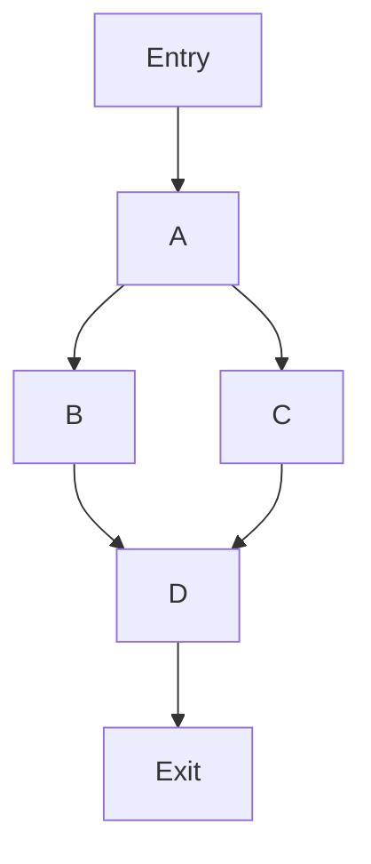
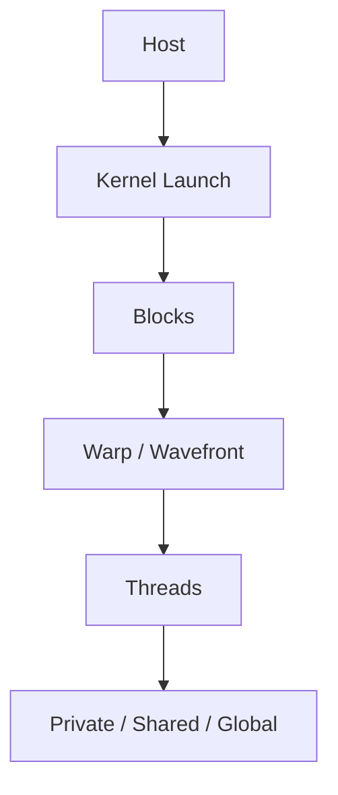
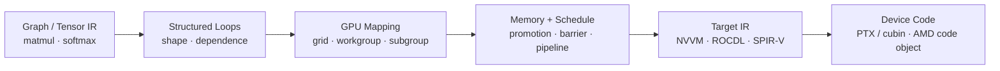

# 编译器与高性能系统中的算法

# 1. 编译器问题如何映射为算法

| 编译器问题 | 常见抽象 | 典型算法或数据结构 |
|---|---|---|
| CFG 可达性、死块删除 | 有向图 | DFS、BFS、RPO |
| 循环与递归调用关系 | 有向图中的环 | SCC、Dominator、Natural Loop |
| 活跃变量、到达定值 | 集合方程 | BitSet、Worklist、Fixed Point |
| SSA 构造 | 支配树上的定义传播 | Dominance Frontier、栈式重命名 |
| 常量传播 | 值格与可执行边 | Lattice、SCCP、Worklist |
| 寄存器分配 | 区间或冲突图 | Linear Scan、Graph Coloring |
| 指令调度 | 带延迟和资源的 DAG | Topological Sort、List Scheduling |
| 模式匹配 | 树或 DAG | Tree DP、Rewrite、E-graph |
| 张量布局 | 多维索引映射 | Affine Map、Stride、整数约束 |
| 算子融合 | 依赖图与成本权衡 | DAG Partition、Cost Model |
| Buffer 复用 | 生命周期冲突 | Interval Allocation、Coloring |
| GPU Kernel 映射 | 层次化并行索引空间 | Tiling、Grid/Workgroup Mapping、Predication |
| GPU Memory Promotion | 跨存储层的数据复用 | Cooperative Copy、Barrier、Double Buffering |
| 矩阵指令选择 | Tile、Layout 与数据类型约束 | MMA Matching、Layout Conversion、Fallback |
| 并行归约 | 结合运算 | Tree Reduction、Scan |
| 自动调优 | 离散搜索空间 | 枚举、剪枝、贝叶斯或学习模型 |

分析这类问题的第一步，是把“编译器术语”还原成算法问题。例如：

> “求 LiveIn/LiveOut”不是背公式，而是在有限格上求一组单调方程的最小不动点；BitSet 是状态表示，worklist 是求解策略，RPO 或 loop-aware order 是收敛优化。

## 1.1 三层正确性

编译器算法需要同时区分：

1. **算法正确性**：图遍历、集合方程或调度算法本身是否正确；
2. **变换合法性**：是否保持源程序在语言与 IR 语义下允许观察到的行为；
3. **变换收益**：合法不代表更快，还要考虑代码大小、寄存器压力、缓存和目标硬件。

例如把循环不变量移出循环：

- 操作数是否在新位置可用；
- 指令是否可能 trap；
- 内存访问是否与循环中的 store alias；
- 移动是否改变 poison、异常、volatile 或 atomic 语义；
- hoist 后是否增加寄存器压力并造成 spill。

---

# 2. CFG、遍历顺序与可达性

## 2.1 CFG 表示

Control-Flow Graph 中：

- 节点是 Basic Block；
- 边表示可能的控制转移；
- 入口块通常唯一；
- return、unreachable 等块可能没有后继；
- CFG 可以有环，也可能包含从入口不可达的块。

```cpp
#include <cstddef>
#include <optional>
#include <utility>
#include <vector>

using BlockId = std::size_t;

struct ControlFlowGraph {
    std::vector<std::vector<BlockId>> successors;
    std::vector<std::vector<BlockId>> predecessors;
};

std::optional<ControlFlowGraph>
build_cfg(std::vector<std::vector<BlockId>> successors) {
    ControlFlowGraph cfg;
    cfg.successors = std::move(successors);
    cfg.predecessors.resize(cfg.successors.size());

    for (BlockId from = 0; from < cfg.successors.size(); ++from) {
        for (const BlockId to : cfg.successors[from]) {
            if (to >= cfg.successors.size()) return std::nullopt;
            cfg.predecessors[to].push_back(from);
        }
    }
    return cfg;
}
```

生产实现可能还要处理：

- 重边是否保留；
- 异常边、间接跳转和未知调用；
- CFG 修改后的 analysis invalidation；
- Block 对象地址稳定性；
- 并发读取与 Pass 修改的所有权边界。

## 2.2 可达性

从入口做 DFS 或 BFS 即可标记可达块。删除不可达块前还要同步修正：

- predecessor/successor 列表；
- PHI incoming edge；
- dominator、loop、frequency 等分析；
- 调试信息和 block address 引用。

仅仅从容器里擦除节点远远不够。

## 2.3 DFS 的三种顺序

- Preorder：第一次进入节点时记录；
- Postorder：所有后继处理完成后记录；
- Reverse Postorder，RPO：把 postorder 反转。

```cpp
#include <algorithm>
#include <stdexcept>

void dfs_postorder(const ControlFlowGraph& cfg,
                   BlockId block,
                   std::vector<bool>& visited,
                   std::vector<BlockId>& order) {
    visited[block] = true;
    for (const BlockId next : cfg.successors[block]) {
        if (!visited[next]) dfs_postorder(cfg, next, visited, order);
    }
    order.push_back(block);
}

std::vector<BlockId> reverse_postorder(const ControlFlowGraph& cfg,
                                       BlockId entry) {
    if (entry >= cfg.successors.size()) {
        throw std::out_of_range("invalid CFG entry");
    }
    std::vector<bool> visited(cfg.successors.size(), false);
    std::vector<BlockId> order;
    dfs_postorder(cfg, entry, visited, order);
    std::reverse(order.begin(), order.end());
    return order;
}
```

示例使用递归便于表达；恶意或极深 CFG 应改成显式栈。

## 2.4 RPO 为什么有用

在无环图中，RPO 是一种拓扑序。带环 CFG 中它不是严格拓扑序，但通常会让信息沿前向边快速传播，因此前向数据流分析用 RPO 往往比任意顺序更快收敛。

反向数据流分析常考虑 postorder。遍历顺序影响收敛速度，不改变有限单调数据流问题的最终 fixed point。

## 2.5 边分类

相对于 DFS 树可区分：

- Tree edge：第一次发现节点；
- Back edge：指向当前 DFS 祖先；
- Forward edge：指向后代但不是树边；
- Cross edge：其他已访问节点。

DFS back edge 可用于普通有向图环检测，但编译器中的 **natural loop back edge** 通常要求目标 header 支配来源 latch，条件更强。

---

# 3. 强连通分量与循环

## 3.1 SCC 的意义

Strongly Connected Component 中任意两点互相可达。把每个 SCC 收缩为一个节点后得到 condensation DAG。

应用：

- 调用图递归分量；
- 循环与不可约控制流；
- 模块依赖循环；
- 分量级别的自底向上分析；
- 在环内部迭代、在分量之间拓扑传播。

## 3.2 Tarjan 算法

Tarjan 用一次 DFS 求 SCC：

- `index[v]`：首次访问次序；
- `lowlink[v]`：从 v 经 DFS 树边和允许的回边能到达的最小 index；
- 栈保存当前尚未归属 SCC 的节点；
- 若 `lowlink[v] == index[v]`，v 是一个 SCC 的根。

```cpp
#include <algorithm>
#include <stdexcept>

class TarjanScc {
public:
    explicit TarjanScc(const std::vector<std::vector<BlockId>>& graph)
        : graph_(graph),
          index_(graph.size(), -1),
          lowlink_(graph.size(), -1),
          on_stack_(graph.size(), false) {
        for (const auto& edges : graph_) {
            for (const BlockId to : edges) {
                if (to >= graph_.size()) {
                    throw std::out_of_range("invalid graph edge");
                }
            }
        }
    }

    std::vector<std::vector<BlockId>> run() {
        for (BlockId node = 0; node < graph_.size(); ++node) {
            if (index_[node] == -1) strong_connect(node);
        }
        return components_;
    }

private:
    void strong_connect(BlockId node) {
        index_[node] = next_index_;
        lowlink_[node] = next_index_;
        ++next_index_;
        stack_.push_back(node);
        on_stack_[node] = true;

        for (const BlockId next : graph_[node]) {
            if (index_[next] == -1) {
                strong_connect(next);
                lowlink_[node] = std::min(lowlink_[node], lowlink_[next]);
            } else if (on_stack_[next]) {
                lowlink_[node] = std::min(lowlink_[node], index_[next]);
            }
        }

        if (lowlink_[node] != index_[node]) return;

        std::vector<BlockId> component;
        while (true) {
            const BlockId current = stack_.back();
            stack_.pop_back();
            on_stack_[current] = false;
            component.push_back(current);
            if (current == node) break;
        }
        components_.push_back(std::move(component));
    }

    const std::vector<std::vector<BlockId>>& graph_;
    std::vector<int> index_;
    std::vector<int> lowlink_;
    std::vector<bool> on_stack_;
    std::vector<BlockId> stack_;
    std::vector<std::vector<BlockId>> components_;
    int next_index_ = 0;
};
```

时间复杂度 `O(V + E)`，额外空间 `O(V)`，但递归 DFS 仍有栈深风险。

## 3.3 Natural Loop

若 CFG 边 `latch -> header` 中，`header` 支配 `latch`，这是一条 back edge。该边对应 natural loop：

1. 把 `header` 和 `latch` 放入集合；
2. 从 `latch` 沿 predecessor 反向遍历；
3. 直到所有能在不越过 header 的情况下到达 latch 的节点都加入。

Natural loop 有单一 header。若一个强连通区域有多个外部入口，它是不可约控制流，不能简单当作单 header 自然循环处理。

## 3.4 循环树并非天然存在于任意 SCC

结构化程序常形成嵌套循环，但任意 CFG 中循环可能重叠或不可约。编译器 LoopInfo 一般依赖 dominance 定义 natural loop，再组织 loop forest。

讨论时不要把以下概念混为一谈：

- DFS 发现 back edge；
- SCC 表示互相可达区域；
- natural loop 依赖“header 支配 latch”；
- loop nesting forest 依赖特定循环定义。

---

# 4. 支配关系与 Dominance Frontier

## 4.1 定义

在入口可达 CFG 中，如果从入口到 B 的每条路径都经过 A，则 A **dominate** B。

性质：

- 每个可达节点支配自身；
- 入口支配所有可达节点；
- 除入口外，每个可达节点有唯一 immediate dominator；
- immediate dominator 关系构成 dominator tree。

不可达块的 dominance 语义必须由具体 API 约定，分析前通常先限定入口可达子图。

## 4.2 集合方程

教学用迭代算法：

```text
Dom(entry) = {entry}
Dom(b) = {b} union intersection(Dom(p) for p in predecessors(b))
```

初始化除入口外的可达节点为“所有可达节点”，反复应用方程直到不再变化。



在该图中：

```text
Dom(D) = {Entry, A, D}
```

B 和 C 都不支配 D，因为存在绕过它们的另一条路径。

## 4.3 真实算法

集合迭代容易理解，但在大型 CFG 上成本高。常见实现路线：

- Cooper-Harvey-Kennedy：按 RPO 迭代 immediate dominator，工程实现简单；
- Lengauer-Tarjan：接近线性复杂度，适合大型图；
- CFG 增量更新：局部修改后避免完全重算，但实现与失效管理更复杂。

实际学习不必一开始就手写 Lengauer-Tarjan，但应能清楚解释集合方程、idom 和支配树用途。

## 4.4 Dominance Frontier

节点 A 的 dominance frontier 包含这样的节点 B：

- A 支配 B 的至少一个前驱；
- A 不严格支配 B。

直觉上，它是“A 的定义沿不同控制流路径传播后可能发生合流”的边界。

用 immediate dominator 计算的一种经典方法：

```text
for each block b with at least two predecessors:
    for each predecessor p of b:
        runner = p
        while runner != idom[b]:
            DF[runner].insert(b)
            runner = idom[runner]
```

## 4.5 用途

- SSA 中决定 PHI 候选位置；
- 控制依赖分析使用 post-dominance frontier；
- 判断代码移动位置；
- 构建 MemorySSA 等结构。

支配关系回答的是“所有从入口来的路径”；post-dominance 则反向回答“所有到出口的路径”。多出口 CFG 通常可引入虚拟统一出口以便分析。

---

# 5. 数据流分析与 Worklist

## 5.1 数据流问题的组成

一个经典数据流分析包含：

- Domain：每个程序点保存什么状态；
- Lattice：状态如何排序、合并；
- Transfer function：指令或基本块如何改变状态；
- Direction：前向还是后向；
- Meet：来自多条边的信息如何合并；
- Boundary condition：入口或出口初值；
- Fixed point：反复传播直到状态不再变化。

常见问题：

| 分析 | 方向 | 合并 | 直观含义 |
|---|---|---|---|
| Reaching Definitions | 前向 | Union | 可能到达此处的定义 |
| Available Expressions | 前向 | Intersection | 所有路径上都已计算且未失效 |
| Live Variables | 后向 | Union | 后续某条路径可能使用的值 |
| Very Busy Expressions | 后向 | Intersection | 所有路径上都会先被求值 |

Union 常对应 may analysis，intersection 常对应 must analysis，但仍应根据具体 domain 和偏序定义判断。

## 5.2 为什么会收敛

经典框架通常要求：

- 格高度有限，或使用 widening 等机制保证终止；
- transfer function 单调；
- 每次更新沿偏序单调前进。

在有限 BitSet domain 中，每个位通常只会从 0 变 1，或按对偶方向从 1 变 0，所以最终会到 fixed point。

如果 transfer 非单调、状态无限增长或浮点近似更新无终止条件，就不能仅凭“有 worklist”保证收敛。

## 5.3 通用 Worklist 思路

```text
初始化每个节点的 IN/OUT
把可能需要处理的节点放入 worklist

while worklist 非空:
    b = pop(worklist)
    old = state[b]
    merged = meet(state[p] for p in neighbors)
    state[b] = transfer(b, merged)
    if state[b] changed:
        把可能受影响的邻居加入 worklist
```

关键工程问题：

- 节点是否已在队列中，避免无限重复入队；
- FIFO、LIFO、RPO 或优先队列会影响收敛速度；
- 只在状态真正变化时传播；
- block transfer 是否按指令逐条计算；
- CFG 改变后分析结果是否全部失效；
- 稠密 BitSet 和稀疏集合怎样选择。

## 5.4 Must Analysis 的初始化

Intersection 分析不能把所有节点随意初始化为空集，否则可能永远得到过小结果。常见做法是：

- 边界节点按语义初始化；
- 其他节点初始化为 lattice top；
- 再通过 intersection 向下收敛。

具体的 top/bottom 含义取决于偏序定义，不能机械记忆“全 1 就是 top”。

## 5.5 MOP 与 MFP

- MOP，Meet Over all Paths：理论上枚举所有路径后合并；有环时路径无限；
- MFP，Maximum Fixed Point 或相应固定点解：通过数据流方程迭代获得；
- 对 distributive transfer function，经典框架下 MFP 与 MOP 可以一致；
- 仅单调但不 distributive 时，固定点结果可能比理想路径解更保守。

理解“保守”方向非常重要：优化不能因为分析过度乐观而改变语义，但可以因为分析保守而错过优化。

---

# 6. BitSet、活跃变量与到达定值

## 6.1 为什么编译器爱用 BitSet

若 universe 中对象可以编号为 `[0, N)`，BitSet 能把集合操作变为 word 级位运算：

```text
Union        A | B
Intersection A & B
Difference   A & ~B
Membership   word[index / 64] 的某一位
```

复杂度是 `O(N / word_bits)`，连续内存也利于缓存和 SIMD。

## 6.2 一个最小动态 BitSet

```cpp
#include <algorithm>
#include <cstdint>
#include <stdexcept>
#include <vector>

class DynamicBitSet {
public:
    explicit DynamicBitSet(std::size_t bit_count = 0, bool value = false)
        : bit_count_(bit_count),
          words_((bit_count + kWordBits - 1) / kWordBits,
                 value ? ~Word{0} : Word{0}) {
        clear_unused_high_bits();
    }

    std::size_t size() const noexcept { return bit_count_; }

    bool test(std::size_t bit) const {
        check_index(bit);
        return (words_[word_index(bit)] & bit_mask(bit)) != 0;
    }

    void set(std::size_t bit) {
        check_index(bit);
        words_[word_index(bit)] |= bit_mask(bit);
    }

    void reset(std::size_t bit) {
        check_index(bit);
        words_[word_index(bit)] &= ~bit_mask(bit);
    }

    bool union_with(const DynamicBitSet& other) {
        check_compatible(other);
        bool changed = false;
        for (std::size_t i = 0; i < words_.size(); ++i) {
            const Word merged = words_[i] | other.words_[i];
            changed |= merged != words_[i];
            words_[i] = merged;
        }
        return changed;
    }

    bool intersect_with(const DynamicBitSet& other) {
        check_compatible(other);
        bool changed = false;
        for (std::size_t i = 0; i < words_.size(); ++i) {
            const Word merged = words_[i] & other.words_[i];
            changed |= merged != words_[i];
            words_[i] = merged;
        }
        return changed;
    }

    void subtract(const DynamicBitSet& other) {
        check_compatible(other);
        for (std::size_t i = 0; i < words_.size(); ++i) {
            words_[i] &= ~other.words_[i];
        }
        clear_unused_high_bits();
    }

    std::size_t count() const noexcept {
        std::size_t result = 0;
        for (Word word : words_) {
            while (word != 0) {
                word &= word - 1;
                ++result;
            }
        }
        return result;
    }

    friend bool operator==(const DynamicBitSet& a, const DynamicBitSet& b) {
        return a.bit_count_ == b.bit_count_ && a.words_ == b.words_;
    }

    friend bool operator!=(const DynamicBitSet& a, const DynamicBitSet& b) {
        return !(a == b);
    }

private:
    using Word = std::uint64_t;
    static constexpr std::size_t kWordBits = 64;

    static std::size_t word_index(std::size_t bit) noexcept {
        return bit / kWordBits;
    }

    static Word bit_mask(std::size_t bit) noexcept {
        return Word{1} << (bit % kWordBits);
    }

    void check_index(std::size_t bit) const {
        if (bit >= bit_count_) throw std::out_of_range("bit index");
    }

    void check_compatible(const DynamicBitSet& other) const {
        if (bit_count_ != other.bit_count_) {
            throw std::invalid_argument("incompatible bitsets");
        }
    }

    void clear_unused_high_bits() noexcept {
        if (words_.empty() || bit_count_ % kWordBits == 0) return;
        const std::size_t used = bit_count_ % kWordBits;
        words_.back() &= (Word{1} << used) - 1;
    }

    std::size_t bit_count_{};
    std::vector<Word> words_;
};
```

生产级实现还会提供 find-first-set、迭代置位元素、SmallBitVector 优化、SIMD word 操作和分配器控制。

## 6.3 Dense 还是 Sparse

| 条件 | 更可能适合 |
|---|---|
| universe 小、集合较密、频繁交并 | Dense BitSet |
| universe 巨大、集合只有少数元素 | Sparse Set / sorted vector |
| 小集合很多 | SmallVector / inline storage |
| 集合密度动态变化 | Hybrid / adaptive representation |

不要只比较算法阶数。一个含百万位但只置三位的 BitSet，每次 union 都扫描全部 words，可能远慢于三个整数的有序数组。

## 6.4 活跃变量方程

对每个基本块 B：

```text
LiveOut[B] = Union(LiveIn[S] for S in successors(B))
LiveIn[B]  = Use[B] union (LiveOut[B] - Def[B])
```

其中：

- `Use[B]`：在块内首次定义前被使用的变量；
- `Def[B]`：块内定义的变量；
- 这是后向 may analysis；
- 通常从出口方向传播。

## 6.5 Worklist 实现

```cpp
#include <deque>

struct LivenessResult {
    std::vector<DynamicBitSet> live_in;
    std::vector<DynamicBitSet> live_out;
};

LivenessResult compute_liveness(const ControlFlowGraph& cfg,
                                 const std::vector<DynamicBitSet>& use,
                                 const std::vector<DynamicBitSet>& def,
                                 std::size_t value_count) {
    const std::size_t block_count = cfg.successors.size();
    if (use.size() != block_count || def.size() != block_count) {
        throw std::invalid_argument("liveness input size mismatch");
    }

    LivenessResult result{
        std::vector<DynamicBitSet>(block_count, DynamicBitSet(value_count)),
        std::vector<DynamicBitSet>(block_count, DynamicBitSet(value_count))};

    std::deque<BlockId> worklist;
    std::vector<bool> queued(block_count, true);
    for (BlockId block = 0; block < block_count; ++block) {
        worklist.push_back(block);
    }

    while (!worklist.empty()) {
        const BlockId block = worklist.front();
        worklist.pop_front();
        queued[block] = false;

        DynamicBitSet new_out(value_count);
        for (const BlockId successor : cfg.successors[block]) {
            new_out.union_with(result.live_in[successor]);
        }

        DynamicBitSet new_in = new_out;
        new_in.subtract(def[block]);
        new_in.union_with(use[block]);

        if (new_out == result.live_out[block] &&
            new_in == result.live_in[block]) {
            continue;
        }

        result.live_out[block] = std::move(new_out);
        result.live_in[block] = std::move(new_in);
        for (const BlockId predecessor : cfg.predecessors[block]) {
            if (!queued[predecessor]) {
                queued[predecessor] = true;
                worklist.push_back(predecessor);
            }
        }
    }
    return result;
}
```

这段代码按 block 粒度计算。真实寄存器分配还需要沿 block 内指令反向扫描，以获得每条指令位置的 kill、dead、live range 和 PHI edge use。

## 6.6 PHI 的边语义

SSA PHI 的输入使用发生在对应 predecessor edge 上，而不是普通地发生在 PHI 所在块开头。做 liveness 时若忽略这一点，会把值错误地认为在所有前驱上都活跃。

常见处理：

- 把 PHI operand 计入对应 predecessor 的 LiveOut；
- PHI result 在当前块入口定义；
- critical edge split 后边语义会更容易表达，但不能假设所有 IR 都已拆边。

## 6.7 到达定值

令每个定义有唯一编号：

```text
ReachIn[B]  = Union(ReachOut[P] for P in predecessors(B))
ReachOut[B] = Gen[B] union (ReachIn[B] - Kill[B])
```

这是前向 may analysis。`Kill[B]` 通常包含对同一变量的其他定义；SSA 中每个虚拟值只定义一次，很多 def-use 查询可以转为稀疏传播，不再需要传统 dense reaching-definitions。

---

# 7. SSA 与稀疏传播

## 7.1 SSA 解决什么

Static Single Assignment 要求每个 SSA value 只定义一次。控制流合并处使用 PHI 表达“值来自哪条前驱边”：

```llvm
entry:
  br i1 %cond, label %left, label %right

left:
  %x.left = add i32 %a, 1
  br label %merge

right:
  %x.right = sub i32 %a, 1
  br label %merge

merge:
  %x = phi i32 [ %x.left, %left ], [ %x.right, %right ]
```

优势：

- def-use 链明确；
- 常量传播、DCE、GVN 等可直接沿 use 传播；
- 每个 value 不需要传统“同名变量的多个 reaching definitions”；
- 仍需 MemorySSA 或 alias analysis 处理内存状态。

## 7.2 PHI 放置

Cytron 算法的核心是 iterated dominance frontier：

```text
worklist = 定义变量 v 的所有 block
has_phi = empty

while worklist 非空:
    x = pop(worklist)
    for y in DF[x]:
        if y 尚未为 v 放 PHI:
            在 y 放置 v 的 PHI
            if y 原本不定义 v:
                push y
```

为什么 PHI 自身也可能继续加入 worklist？因为 PHI 是一个新定义，它的值继续流向后续合流点。

## 7.3 Minimal、Pruned 与 Semi-pruned SSA

- Minimal SSA：只避免明显多余的 PHI，但可能在变量不活跃处放 PHI；
- Pruned SSA：结合 liveness，只在变量 live-in 的合流点放 PHI；
- Semi-pruned SSA：用较便宜的近似减少部分无用 PHI。

因此 dominance frontier 给出候选位置，liveness 决定很多候选是否真的需要。

## 7.4 重命名

沿 dominator tree 做 DFS，为每个源变量维护一个定义栈：

```text
rename(block):
    记录当前栈高度

    为 block 中的 PHI result 分配新版本并压栈
    按指令顺序:
        每个 use 替换为对应变量栈顶版本
        每个 def 分配新版本并压栈

    对每条 block -> successor 边:
        填写 successor PHI 中属于该边的 operand

    for child in dominator_tree_children(block):
        rename(child)

    恢复进入 block 前的栈高度
```

关键点：遍历的是 dominator tree，不是普通 CFG DFS。支配树保证当前栈顶是沿所有到达当前定义域路径都合法的最近定义。

## 7.5 从 SSA 退出

机器后端通常不能直接执行 PHI。PHI elimination 会在 predecessor edge 上插入 parallel copy，再把 parallel copy 顺序化。

若边是 critical edge：

```text
predecessor 有多个 successor
且 successor 有多个 predecessor
```

直接把 copy 放在任一端都可能在错误路径执行，通常需要 split critical edge 或使用目标后端能表达的边级操作。

Parallel copy 顺序化还要处理环：

```text
a <- b
b <- a
```

必须借助临时值，不能逐条直接覆盖。

## 7.6 稀疏条件常量传播 SCCP

SCCP 同时传播：

- 哪些 CFG edge 可执行；
- SSA value 的格状态。

简化值格：

```text
Unknown / Undef
      ↓
Constant(c)
      ↓
Overdefined
```

合并规则示例：

- Unknown 与 Constant(3) 合并为 Constant(3)；
- Constant(3) 与 Constant(3) 仍为 Constant(3)；
- Constant(3) 与 Constant(4) 合并为 Overdefined；
- Overdefined 与任何状态合并仍为 Overdefined。

如果分支条件成为常量，只标记实际分支边可执行；不可执行前驱不参与 PHI 合并。这比普通常量传播更精确。

LLVM 中还要严格区分 `undef`、poison、`freeze`、trap 和 UB。教学格里的 Unknown 不能不加说明地等同于 LLVM `undef`。

## 7.7 Worklist 的稀疏化

传统 dense 分析反复扫描 block 集合；SSA 上可以沿 def-use edge 只通知真正依赖该值的用户。常见两个队列：

- CFG worklist：新发现可执行的 block/edge；
- SSA worklist：值状态变化后需要重新求值的 user。

稀疏传播减少无关节点扫描，但维护 def-use、边可执行状态和删除指令时的失效也更复杂。

---

# 8. Live Interval 与寄存器分配

## 8.1 从 Liveness 到冲突

若两个虚拟寄存器在某程序点同时活跃，它们不能占用同一个物理寄存器。可以表示为：

- Interference Graph：节点是虚拟寄存器，边表示冲突；
- Live Interval：在线性化程序位置上的活跃范围；
- Live Range：可能由多个不连续 segment 组成，单一 `[start, end)` 只是近似。

真实后端还要考虑：

- register class / bank；
- fixed physical register；
- caller-saved / callee-saved；
- subregister 与 lane mask；
- early-clobber、tied operand；
- call clobber、inline asm；
- spill slot、rematerialization 和 debug value。

## 8.2 区间操作

半开区间 `[start, end)` 的合并：

```cpp
#include <algorithm>
#include <utility>
#include <vector>

using Segment = std::pair<std::size_t, std::size_t>;

std::vector<Segment> merge_segments(std::vector<Segment> segments) {
    segments.erase(
        std::remove_if(segments.begin(), segments.end(),
                       [](const Segment& segment) {
                           return segment.first >= segment.second;
                       }),
        segments.end());
    std::sort(segments.begin(), segments.end());

    std::vector<Segment> merged;
    for (const auto& [start, end] : segments) {
        if (merged.empty() || merged.back().second < start) {
            merged.push_back({start, end});
        } else {
            merged.back().second = std::max(merged.back().second, end);
        }
    }
    return merged;
}
```

这里把首尾相接的 `[a,b)` 与 `[b,c)` 合并，因为它们并集连续。判断寄存器冲突时，端点相接本身不重叠，但还要结合指令 use/def 发生在位置的前半还是后半等 slot index 语义。

## 8.3 Linear Scan

Linear Scan 按 interval 起点排序，维护当前活跃集合：

1. 过期 interval 释放寄存器；
2. 有空闲寄存器则分配；
3. 否则选择当前或某个 active interval spill；
4. 必要时切分 live range。

教学版实现：

```cpp
#include <algorithm>
#include <limits>
#include <numeric>

struct LiveInterval {
    std::size_t vreg{};
    std::size_t start{};
    std::size_t end{}; // 半开区间
    int physical_register = -1;
    bool spilled = false;
};

void linear_scan_allocate(std::vector<LiveInterval>& intervals,
                          int register_count) {
    if (register_count < 0) {
        throw std::invalid_argument("negative register count");
    }

    std::sort(intervals.begin(), intervals.end(),
              [](const LiveInterval& a, const LiveInterval& b) {
                  if (a.start != b.start) return a.start < b.start;
                  return a.end < b.end;
              });

    std::vector<int> free_registers(static_cast<std::size_t>(register_count));
    std::iota(free_registers.begin(), free_registers.end(), 0);
    std::vector<LiveInterval*> active;

    auto sort_active = [&] {
        std::sort(active.begin(), active.end(),
                  [](const LiveInterval* a, const LiveInterval* b) {
                      return a->end < b->end;
                  });
    };

    for (LiveInterval& current : intervals) {
        if (current.start >= current.end) continue;

        auto first_live = active.begin();
        while (first_live != active.end() &&
               (*first_live)->end <= current.start) {
            free_registers.push_back((*first_live)->physical_register);
            ++first_live;
        }
        active.erase(active.begin(), first_live);

        if (!free_registers.empty()) {
            current.physical_register = free_registers.back();
            free_registers.pop_back();
            active.push_back(&current);
            sort_active();
            continue;
        }

        if (active.empty()) {
            current.spilled = true;
            continue;
        }

        LiveInterval* spill_candidate = active.back();
        if (spill_candidate->end > current.end) {
            current.physical_register = spill_candidate->physical_register;
            spill_candidate->physical_register = -1;
            spill_candidate->spilled = true;
            active.back() = &current;
            sort_active();
        } else {
            current.spilled = true;
        }
    }
}
```

这个版本只处理单段 interval 和同质寄存器，目的是展示核心策略。真实分配器绝不能直接照搬。

## 8.4 为什么选择结束最晚者 spill

如果 active 中某 interval 结束得比 current 更晚，让 current 使用它的寄存器可以更早释放资源。这是局部启发式，不等于全局最优。

更真实的 spill cost 会考虑：

- use/def 频率与 block frequency；
- loop depth；
- reload 是否能被 fold；
- rematerialization 是否比 load 便宜；
- spill 对其他 register class 的影响；
- live range splitting 位置。

## 8.5 Graph Coloring

构建冲突图后，K 个物理寄存器对应 K-coloring：

1. Simplify：反复移除度数小于 K 的节点并压栈；
2. Coalesce：尝试合并 copy 两端，消除 move；
3. Freeze：放弃某些 coalesce 候选；
4. Spill：没有低度节点时选择潜在 spill；
5. Select：逆序弹栈并选择不与邻居冲突的颜色；
6. Rewrite：插入 spill/reload 后重新分析。

一般图着色是 NP-complete，所以工业分配器使用启发式。Coalescing 能减少 copy，却可能增加节点度数和 spill 风险。

## 8.6 SSA-based Allocation

SSA live range 在很多条件下具有 chordal graph 性质，可利用支配关系获得更高效着色。但 PHI、寄存器约束、SSA destruction、copy coalescing 和目标机器细节仍会使生产实现复杂。

---

# 9. 依赖 DAG 与指令调度

## 9.1 依赖类型

构建调度 DAG 时至少有：

- RAW，Read After Write：真实数据依赖；
- WAR，Write After Read：反依赖；
- WAW，Write After Write：输出依赖；
- Memory dependency：可能 alias 的 load/store；
- Control dependency；
- 隐式寄存器、flags、barrier、call 等目标约束。

寄存器重命名可以消除 WAR/WAW，但不能消除 RAW。Alias analysis 越保守，内存依赖边越多，可调度空间越小。

## 9.2 Critical Path

在 DAG 上，从节点到出口的最长延迟可作为调度优先级：

```text
height(node) = latency(node) + max(height(successor))
```

先调度关键路径上的节点通常有助于缩短总执行时间，但还要考虑资源端口和寄存器压力。

```cpp
#include <queue>

struct SchedulingDag {
    std::vector<std::vector<std::size_t>> successors;
    std::vector<int> latency;
};

std::optional<std::vector<int>> compute_critical_heights(
    const SchedulingDag& dag) {
    const std::size_t n = dag.successors.size();
    if (dag.latency.size() != n) return std::nullopt;

    std::vector<std::size_t> indegree(n, 0);
    for (const auto& edges : dag.successors) {
        for (const std::size_t to : edges) {
            if (to >= n) return std::nullopt;
            ++indegree[to];
        }
    }

    std::queue<std::size_t> ready;
    for (std::size_t node = 0; node < n; ++node) {
        if (indegree[node] == 0) ready.push(node);
    }

    std::vector<std::size_t> topo;
    while (!ready.empty()) {
        const std::size_t node = ready.front();
        ready.pop();
        topo.push_back(node);
        for (const std::size_t next : dag.successors[node]) {
            if (--indegree[next] == 0) ready.push(next);
        }
    }
    if (topo.size() != n) return std::nullopt;

    std::vector<int> height(n, 0);
    for (auto it = topo.rbegin(); it != topo.rend(); ++it) {
        int successor_height = 0;
        for (const std::size_t next : dag.successors[*it]) {
            successor_height = std::max(successor_height, height[next]);
        }
        height[*it] = dag.latency[*it] + successor_height;
    }
    return height;
}
```

## 9.3 List Scheduling

基本算法：

```text
计算每个节点未满足前驱数
ready = 所有前驱均已完成的节点

for each cycle:
    从 ready 中按优先级选节点
    检查功能单元、issue width、数据 ready time
    发射可用节点
    更新资源占用和后继
```

优先级可以综合：

- critical path height；
- block frequency；
- latency hiding；
- resource pressure；
- register pressure；
- load 提前量；
- 代码大小。

## 9.4 资源约束

仅有拓扑序还不够。若一周期只有两个 issue slot、一个 load port 和一个 vector ALU，就必须建模：

- 指令占用哪些资源；
- 资源占用多少周期；
- operand 何时 ready；
- 多条指令是否能同周期发射；
- target itinerary / scheduling model。

这是资源受限项目调度问题的一种形式，最优求解通常困难，工程上使用启发式。

## 9.5 Pre-RA 与 Post-RA

- Pre-RA：虚拟寄存器尚未映射，移动自由度大，但要估计寄存器压力；
- Post-RA：看到真实物理寄存器和 hazard，移动空间较小；
- 过度提前计算会延长 live range，引发 spill；
- 调度和寄存器分配具有天然耦合，不能孤立优化。

## 9.6 GPU 调度差异

GPU 通过大量 warp 切换隐藏 latency，但编译器仍需考虑：

- 每线程寄存器数影响 occupancy；
- memory pipeline 与 compute pipeline 平衡；
- barrier 限制跨区域移动；
- divergence 让同 warp 路径串行化；
- software pipelining 和 double buffering；
- Tensor Core 指令的数据布局和依赖距离。

---

# 10. 张量 Shape、Stride 与 Layout

## 10.1 多维下标如何变成地址

一个 rank 为 R 的张量可用：

```text
shape   = [d0, d1, ..., d(R-1)]
stride  = [s0, s1, ..., s(R-1)]
offset  = base + sum(index[i] * stride[i])
```

若 stride 以元素为单位，最后还要乘元素字节数；若 stride 已按字节定义，就不能重复乘。

行主序连续二维矩阵 `[M, N]`：

```text
stride = [N, 1]
offset(i, j) = i * N + j
```

转置 view 可以只交换 shape 和 stride，不立即搬移数据：

```text
shape  = [N, M]
stride = [1, N]
```

## 10.2 安全计算线性偏移

```cpp
#include <limits>
#include <optional>
#include <vector>

std::optional<std::size_t> linear_offset(
    const std::vector<std::size_t>& shape,
    const std::vector<std::size_t>& stride,
    const std::vector<std::size_t>& index) {
    if (shape.size() != stride.size() || shape.size() != index.size()) {
        return std::nullopt;
    }

    std::size_t offset = 0;
    for (std::size_t axis = 0; axis < shape.size(); ++axis) {
        if (index[axis] >= shape[axis]) return std::nullopt;
        if (index[axis] != 0 &&
            stride[axis] > std::numeric_limits<std::size_t>::max() / index[axis]) {
            return std::nullopt;
        }
        const std::size_t term = index[axis] * stride[axis];
        if (offset > std::numeric_limits<std::size_t>::max() - term) {
            return std::nullopt;
        }
        offset += term;
    }
    return offset;
}
```

函数返回相对于 storage 起点的元素偏移，实际地址还要结合 base pointer 和元素字节数。这里没有处理负 stride；某些 runtime 支持反向 view，需要有符号偏移并验证最终地址范围。

## 10.3 Contiguous 不是唯一 Layout

真实布局可能包含：

- padding；
- blocked / tiled layout；
- channels-last；
- vector lane packing；
- swizzle；
- GPU shared-memory bank-aware layout；
- 稀疏格式 CSR/CSC/BSR；
- quantized packed int4/int8。

因此“shape 相同”不代表可直接复用同一 kernel，“转置”也不一定需要物理 copy。

## 10.4 Broadcasting

广播轴可看作 stride 为 0：多个逻辑下标读取同一个物理元素。优化时要注意：

- 读广播通常安全；
- 写入 stride-0 view 可能让多个逻辑元素 alias；
- 并行写会产生 data race；
- inplace 变换必须证明别名和覆盖顺序合法。

## 10.5 Shape Inference

Shape inference 可能是：

- 静态整数传播；
- 符号表达式；
- 区间或整除约束；
- 运行时 guard；
- 无法证明时保留 dynamic dimension。

以矩阵乘法为例：

```text
A: [M, K]
B: [K, N]
C: [M, N]
```

若两个 K 是动态值，编译器只能证明符号相等、插入 runtime check，或生成通用 fallback。不能因测试输入相等就静态假设永远相等。

## 10.6 Affine Indexing

仿射表达式形如：

```text
c0 + c1*i1 + c2*i2 + ...
```

Loop interchange、tiling、fusion、dependence analysis 常利用仿射结构。出现数据相关下标 `A[B[i]]` 后，经典 affine 分析通常必须保守处理。

---

# 11. GEMM、Tiling 与 Roofline

## 11.1 GEMM 基础

```text
C[M,N] += A[M,K] * B[K,N]
```

浮点运算量通常约为：

```text
2 * M * N * K FLOPs
```

因为每个输出元素执行 K 次乘加，若把 multiply 和 add 各计一次就是 `2K`。

## 11.2 循环顺序影响局部性

行主序下，一个常见顺序：

```cpp
for (std::size_t i = 0; i < m; ++i) {
    for (std::size_t k = 0; k < k_size; ++k) {
        const float a = A[i * lda + k];
        for (std::size_t j = 0; j < n; ++j) {
            C[i * ldc + j] += a * B[k * ldb + j];
        }
    }
}
```

内层 j 连续访问 B 的一行和 C 的一行，比 `i-j-k` 中沿 k 跨行访问 B 更容易利用缓存和向量化。但最优顺序取决于 layout、尺寸和硬件。

## 11.3 Blocked GEMM

```cpp
#include <algorithm>
#include <cstddef>
#include <stdexcept>

void blocked_gemm_accumulate(const float* a,
                             const float* b,
                             float* c,
                             std::size_t m,
                             std::size_t n,
                             std::size_t k_size,
                             std::size_t lda,
                             std::size_t ldb,
                             std::size_t ldc,
                             std::size_t block_m,
                             std::size_t block_n,
                             std::size_t block_k) {
    const bool has_a = m != 0 && k_size != 0;
    const bool has_b = k_size != 0 && n != 0;
    const bool has_c = m != 0 && n != 0;
    if ((has_a && (a == nullptr || lda < k_size)) ||
        (has_b && (b == nullptr || ldb < n)) ||
        (has_c && (c == nullptr || ldc < n)) ||
        block_m == 0 || block_n == 0 || block_k == 0) {
        throw std::invalid_argument("invalid GEMM arguments");
    }

    for (std::size_t ii = 0; ii < m;) {
        const std::size_t i_end = ii + std::min(block_m, m - ii);
        for (std::size_t kk = 0; kk < k_size;) {
            const std::size_t k_end = kk + std::min(block_k, k_size - kk);
            for (std::size_t jj = 0; jj < n;) {
                const std::size_t j_end = jj + std::min(block_n, n - jj);
                for (std::size_t i = ii; i < i_end; ++i) {
                    for (std::size_t k = kk; k < k_end; ++k) {
                        const float a_value = a[i * lda + k];
                        for (std::size_t j = jj; j < j_end; ++j) {
                            c[i * ldc + j] += a_value * b[k * ldb + j];
                        }
                    }
                }
                jj = j_end;
            }
            kk = k_end;
        }
        ii = i_end;
    }
}
```

接口语义是累加到 C，调用者必须事先初始化 C，并保证三块存储的实际长度及地址乘加都可表示。生产接口可以接收显式 buffer 长度或安全 view，避免只凭裸指针和 leading dimension 推断边界。示例没有实现：

- micro-kernel 和 register tiling；
- SIMD intrinsics；
- packed panel；
- prefetch；
- 多线程与 NUMA；
- mixed precision 和数值补偿。

## 11.4 为什么 Tiling 有效

朴素循环会反复把 A、B、C 数据从低层内存搬入 cache。Tiling 让一个小块在更快层级中被重复使用，从而提高数据复用。

Tile 尺寸需要同时满足：

- 工作集能放入目标 cache/shared memory；
- 向量宽度和 Tensor Core tile 对齐；
- 寄存器使用不能过高；
- 边界 tile 正确处理；
- 线程块数量足以占满设备；
- padding 不引入过多无效计算。

## 11.5 Arithmetic Intensity

算术强度：

```text
Arithmetic Intensity = FLOPs / Bytes transferred
```

Roofline 的简化性能上界：

```text
Attainable Performance
= min(Peak Compute, Memory Bandwidth * Arithmetic Intensity)
```

- 低算术强度通常受带宽限制；
- 高算术强度可能受计算峰值限制；
- Tiling 通过复用减少慢速内存流量，提高有效算术强度；
- 实际性能还受指令吞吐、延迟、occupancy、同步和 launch overhead 影响。

## 11.6 合法性与收益

Loop interchange、fusion 和 tiling 先要满足 dependence legality。浮点 reduction 的重排还可能改变舍入结果：

- 严格 IEEE 语义下，不能随意重结合；
- `fast-math` 或显式允许近似时才有更大空间；
- 即使合法，tile 太小或太大也可能更慢。

---

# 12. GPU 并行原语

## 12.1 SIMT 执行模型

CUDA 风格层次：

```text
Grid
  → Thread Block / CTA
      → Warp
          → Thread
```

先把它当作一个“模型契约”理解：它描述了编译器在做并行划分时必须守住的语义边界。

1. Host 侧发起 `Kernel launch`，确定 grid/block 配置，调用是异步返回；
2. 进入 device 后按 `block` 划分执行实例；
3. block 里的线程继续按 `warp`/`subgroup` 参与锁步执行；
4. 同一 block 可通过 shared memory + barrier 进行合作；不同 block 一般不能依赖普通 barrier 做全局同步；
5. 线程、block 之外的可见性和同步规则由目标平台定义，不能跨后端硬编码。



因此编译器在降低时不能直接固定 `warp=32` 等硬件常量，常见的安全做法是：

- 先用抽象层级（grid/block/thread/subgroup）表达并行；
- 再在目标后端把子组大小、同步语义、线程上限与内存子系统映射到实参；
- 需要时把通用策略拆成多个版本（例如面向不同设备/shape 的 specialized kernel）。

warp size、资源限制和具体指令能力属于目标相关信息，不应与高层模型混为一谈。

### 12.1.1 识别常见误区

- 不是所有分支都能直接 predication；
- 共享/全局同步语义不可互相替代；
- 在有 side effect 的路径，控制流重排要带着可见性和异常语义一起判断。

### 12.1.2 SIMT 与 SIMD 的实质差别

很多人会把 SIMT 当作“warp = SIMD”，这里最关键的差别是：

- SIMD 通常是“位宽上的并行”：
  - 一条向量指令操纵固定 lane 数；
  - 每个 lane 更像一个数据槽，语义上更接近“按位并行”。
- SIMT 是“线程上的并行”：
  - 一组线程共享同一份指令流；
  - 每个线程有自己的 PC、寄存器视图和分支掩码；
  - 同一 warp 的控制流允许短时分叉，随后在收敛点归并。

因此，SIMT 可以表现得像 SIMD 的常见情况，但当出现分支、同步、异常、共享内存冲突或 atomic 时，行为就不再是“纯向量语义”。  
这也是编译器不能把 warp 全部当成固定宽度 SIMD lane 直接处理的原因之一。

### 12.1.3 warp 的执行状态：active mask、divergence 与 reconvergence

可以先用三个变量想象一条 warp 的执行：

- `active mask`：当前周期参与执行的线程集合；
- `divergence`：不同线程走不同控制流路径；
- `reconvergence`：分叉后再次汇合到同一后续点。

一个 if/else 在 warp 内可能按下面方式执行：

```text
Step 1：只跑 then 分支（active=掩码A）
Step 2：只跑 else 分支（active=掩码B）
Step 3：在 reconvergence point 处再次统一
```

这意味着：

- 逻辑分支不会“并行一次性完成全部路径”；
- 同一 warp 在高度分叉时会隐式变成串行段执行；
- 编译器常见优化是减少路径数量或让热点路径更一致。

对应可用的处理策略有：

- 合理组织 threadIdx 映射，让同一 warp 处理同质数据；
- 把 `if` 转成 `predication` + 无副作用表达式（并非万能）；
- 重排循环与数据布局，减少分支分裂；
- 在极端分叉场景把任务拆成更细粒度 kernel，换取更好 warp 一致性。

### 12.1.4 一个最小示例：分支分叉的可见执行

```cpp
__global__ void branch_split(float* dst, const float* x, int n) {
    int i = blockIdx.x * blockDim.x + threadIdx.x;
    if (i >= n) return; // 边界检查

    // 同一 warp 内若 if 条件不同，执行会分两段：
    // 先处理 activeA = (i % 2 == 0) 的线程
    // 再处理 activeB = (i % 2 != 0) 的线程
    float v = x[i];
    if ((i & 1) == 0) {
        dst[i] = v * v;
    } else {
        dst[i] = -v;
    }
}
```

如果这类条件在整个 kernel 中反复出现，编译器和编译器驱动都更希望看到更高的分支一致性（例如按偶数/奇数拆 launch、重新排列数据、或用更适合无分支表达的算子版本）。  
一旦这段代码里再叠一个 `atomic` 或有副作用写入，很多“看起来可重排”的优化就会失效，不能再随意消减分叉路径。

## 12.2 Reduction

归约把一组元素通过结合运算合成一个结果，例如 sum、max。树形归约把串行深度从 `O(n)` 降到 `O(log n)`，总工作仍为 `O(n)`。

教学版 CUDA kernel：

```cpp
// 要求 blockDim.x 是 2 的幂；每个 block 输出一个 partial sum。
__global__ void reduce_sum_blocks(const float* input,
                                  float* block_sums,
                                  std::size_t size) {
    extern __shared__ float scratch[];
    const unsigned int lane = threadIdx.x;
    const std::size_t first =
        static_cast<std::size_t>(blockIdx.x) * blockDim.x * 2 + lane;

    float value = 0.0F;
    if (first < size) value += input[first];
    if (first + blockDim.x < size) value += input[first + blockDim.x];
    scratch[lane] = value;
    __syncthreads();

    for (unsigned int stride = blockDim.x / 2; stride > 0; stride >>= 1) {
        if (lane < stride) {
            scratch[lane] += scratch[lane + stride];
        }
        __syncthreads();
    }

    if (lane == 0) block_sums[blockIdx.x] = scratch[0];
}
```

完整求和还要对 `block_sums` 再次归约。生产实现会使用 warp shuffle、更少同步、向量化 load，并针对数据类型和架构调优。

浮点加法不满足严格结合律，不同归约树可能产生不同低位结果。并行正确性要说明允许的数值误差，而不是只比较 bitwise equal。

## 12.3 Prefix Scan

Scan 输出所有前缀聚合：

```text
input:          [a, b, c, d]
exclusive scan: [e, a, a+b, a+b+c]
inclusive scan: [a, a+b, a+b+c, a+b+c+d]
```

Blelloch scan 包含：

1. upsweep/reduce：构建树形部分和；
2. 把根设为单位元；
3. downsweep：把前缀传播给子节点。

并行工作可做到 `O(n)`，深度 `O(log n)`。Scan 是 compaction、radix sort、stream compaction 和并行内存分配的基础。

## 12.4 Histogram

朴素 histogram 让大量线程 atomic 更新同一组桶，热点严重。优化思路：

- 每个 block 或 warp 私有直方图；
- shared memory 中局部累加；
- 最后合并全局结果；
- 根据桶数、分布和 shared memory 容量选策略。

私有化减少竞争但增加内存和合并成本。输入高度倾斜时热点仍需单独处理。

## 12.5 Softmax

稳定 softmax：

```text
m = max(x)
s = sum(exp(x_i - m))
y_i = exp(x_i - m) / s
```

核心原语是两次 reduction：max 和 sum。高性能实现会：

- 融合读取、max、exp、sum、normalize 的部分阶段；
- 使用在线更新合并局部 `(max, sum)`；
- 减少 global memory round trip；
- 处理长行、多 warp 协作和数值精度。

## 12.6 Coalescing、Bank Conflict 与 Divergence

### Global Memory Coalescing

同一 warp 的线程访问相邻、适当对齐的地址，通常能合并为更少内存事务。若线程跨大 stride 访问，带宽利用率会下降。

### Shared Memory Bank Conflict

若同一 warp 多线程在一次访问中映射到同一 bank 的不同地址，访问可能串行化。Padding 或 swizzle 可改变映射；广播同一地址在某些架构上是特殊高效情况，不能笼统视为冲突。

### Warp Divergence

同一 warp 线程走不同控制分支时，路径通常需要掩码串行执行。可以通过数据重排、predication 或重新划分工作降低 divergence，但也可能增加额外指令。

## 12.7 Occupancy 不是最终目标

Occupancy 受每 block 线程数、寄存器、shared memory 和硬件上限共同约束。更高 occupancy 能帮助隐藏 latency，但：

- 减少寄存器可能引入 spill；
- 更小 tile 会降低数据复用；
- 已有足够并行度时继续提高 occupancy 未必提升性能。

最终应看吞吐、延迟、带宽利用率和瓶颈，而不是只追一个 occupancy 数字。

---

# 13. GPU 编译：从循环到 Kernel

GPU 编译器的核心任务不是把一个函数换成 GPU 指令，而是逐步回答以下问题：

1. 哪些迭代可以并行；
2. 每层并行工作映射到哪个硬件层级；
3. 数据放在哪个 memory space，何时搬运和复用；
4. 哪些线程需要同步；
5. 是否使用向量指令、MMA 或库函数；
6. 资源用量是否允许足够多的 workgroup 同时驻留；
7. 动态 shape 和边界 tile 如何保持正确。

这些选择互相耦合：更大的 tile 可能增加数据复用，却也会消耗更多 shared memory 和寄存器；更深的软件流水可能隐藏访存延迟，却可能降低 occupancy。

## 13.1 从高层算子到设备代码

`matmul`、`softmax` 之类的高层算子没有直接规定线程数、内存层级或目标指令。一个典型的逐层降低过程是：



这不是所有系统都必须照搬的固定 Pass 列表，而是信息逐渐具体化的方向：高层保留 shape、layout 和算子语义，低层逐渐固定线程映射、地址空间、同步和目标指令。

MLIR 的 Operation/Region 结构、Dialect、ODS、Rewrite、Dialect Conversion 与
Bufferization 机制在[MLIR：多层中间表示与渐进式 Lowering](post.html?slug=mlir)中完整展开。

[MLIR GPU dialect][mlir-gpu] 提供 `gpu.module`、`gpu.func`、线程/块 ID、barrier 和 GPU address space 等中层抽象，再根据目标降低到不同后端。常见路径可以概括为：

| 目标 | 可能的中间路径 | 最终交给什么处理 |
|---|---|---|
| NVIDIA GPU | GPU/Vector → NVGPU → NVVM | LLVM NVPTX、PTX 工具链和驱动 |
| AMD GPU | GPU/AMDGPU → ROCDL/LLVM | LLVM [AMDGPU 后端][llvm-amdgpu]和对应运行时 |
| Khronos 生态 | 高层 IR → SPIR-V | Vulkan、OpenCL 等执行环境的驱动 |

[NVGPU dialect][mlir-nvgpu] 位于较高层 GPU/Vector IR 与 NVVM 之间，可表达异步拷贝、MMA 和部分 NVIDIA 特定布局；[NVVM dialect][mlir-nvvm] 与 [ROCDL dialect][mlir-rocdl] 则更接近 LLVM intrinsic 和目标后端。[SPIR-V][spirv-spec] 是面向图形着色器和计算 Kernel 的标准二进制中间语言。框架名字会演进，但“逐步降低并保留每层需要的语义”这一设计不会改变。

## 13.2 把循环映射到并行层级

矩阵乘法最初可以表示为三层循环：

```text
for m in [0, M)
  for n in [0, N)
    for k in [0, K)
      C[m, n] += A[m, k] * B[k, n]
```

GPU 映射通常先把输出空间分块，再继续划分每块内部的工作：

```text
Grid
└── Workgroup / Thread Block：负责一个 BM × BN 的 C tile
    └── Subgroup / Warp：负责一个 WM × WN 的子 tile
        └── Thread / Lane：持有若干 A、B fragment 和 C accumulator
```

不同生态的术语可以这样对齐：

| 通用层级 | CUDA | AMD/HIP | SPIR-V / MLIR GPU |
|---|---|---|---|
| 一次并行派发 | Grid / Kernel Launch | Grid / Kernel Launch | Dispatch / Grid |
| 可协作线程组 | Thread Block / CTA | Workgroup | Workgroup |
| 锁步或近似锁步的子组 | Warp | Wavefront | Subgroup |
| 单个逻辑执行实例 | Thread | Work-item / Thread | Invocation / Thread |

[CUDA Programming Guide][cuda-guide] 将 Kernel、thread block 和 device memory 放在异构 host/device 模型中定义；其他目标的准确 subgroup 大小和同步能力必须从目标信息取得，不能在通用 Pass 中把 warp 固定写成 32。

编译器需要建立从逻辑下标到硬件 ID 的映射，例如：

```text
block_m = block_id.y * BM
block_n = block_id.x * BN

local_m = thread_id.y * TM
local_n = thread_id.x * TN

global_m = block_m + local_m
global_n = block_n + local_n
```

一个合法映射至少满足：

- 不同 workgroup 写入的输出区域不发生未定义竞争；
- workgroup 内共享数据的生产者和消费者能用该层级支持的 barrier 同步；
- subgroup 操作的参与线程和 mask 定义明确；
- Grid 覆盖完整输出空间，边界线程不会越界；
- 线程数、维度和动态 shared memory 不超过目标限制。

映射不是简单的“并行化所有循环”。Reduction 轴通常需要线程协作或在每线程局部累加，带 loop-carried dependence 的轴则不能直接映射成互相独立的线程。

## 13.3 Address Space 与 Memory Promotion

不同平台名称不完全相同，但可先用目标无关的层次理解：

| 语义 | CUDA 常见称呼 | AMD 常见称呼 | SPIR-V Storage Class |
|---|---|---|---|
| 设备范围、容量较大的存储 | Global Memory | Global Memory | `CrossWorkgroup` |
| 一个 workgroup 内共享 | Shared Memory | LDS | `Workgroup` |
| 单线程私有值 | Register / Local Memory | VGPR / Scratch | `Private` / `Function` |
| 只读且执行期间不变 | Constant | Constant/只读全局区 | `UniformConstant` 等 |

“私有”是可见性语义，不保证最终一定保存在物理寄存器里。寄存器压力过高时，数组或临时值可能 spill 到更慢的存储。

Memory Promotion 把会被重复访问的 global-memory tile 暂存到 workgroup memory：


它不是把 `load` 换个地址空间就结束，而是一组保持依赖关系的变换：

1. 为 tile 分配 workgroup memory；
2. 让线程协作完成尽量连续、对齐的读取；
3. 对越界位置填充 reduction 的单位元或使用 mask；
4. 等待所有生产者完成；
5. 从 workgroup memory 读取并计算；
6. 下一轮覆盖同一缓冲区前，确认上一轮消费者已经完成。

Tile layout 还要兼顾 global-memory coalescing、shared-memory bank 映射和 MMA fragment 要求。为了减少 bank conflict 加入的 padding 或 swizzle 会改变地址公式，因此必须作为显式 layout 传播，不能只保存在某个 Pass 的局部假设中。

## 13.4 Barrier、Atomic 与 Convergent 语义

GPU 同步至少要分清三个概念：

| 机制 | 解决的问题 | 不自动提供什么 |
|---|---|---|
| Control barrier | 等待某个 scope 内的参与线程到达同步点 | 设备上所有 workgroup 的全局同步 |
| Memory barrier / fence | 约束指定 scope 和 memory space 的可见性与重排 | 多线程同时写同一位置的原子性 |
| Atomic operation | 对单个位置执行不可分割的读改写 | 任意其他内存访问的完整顺序 |

这张表区分的是语义，不代表每种 API 只承担一项职责。例如 CUDA `__syncthreads()` 同时包含 block 级控制同步和相应的内存可见性保证；编译器降低时仍要分别保留参与线程、scope 和 memory-order 约束。

下面的模式可能让部分线程跳过 block barrier：

```cpp
if (global_index < size) {
    shared[threadIdx.x] = input[global_index];
    __syncthreads();  // condition 在整个 block 内不一致时不安全
    consume(shared);
}
```

更稳妥的结构是让所有线程到达 barrier，只对访存和结果提交使用 predicate：

```cpp
const bool active = global_index < size;
shared[threadIdx.x] = active ? input[global_index] : 0.0F;
__syncthreads();

if (active) consume(shared);
```

实际合法性仍取决于后续是否还有 barrier、哪些线程读取哪些位置，以及所用 API 的精确定义。workgroup barrier 通常不能同步不同 workgroup；需要全设备依赖时，应使用 Kernel 边界、受约束的 cooperative launch，或把依赖交给运行时事件图表达。

编译器也不能把普通 CPU 优化规则直接套到 barrier 和 subgroup 操作上。它必须保留参与线程集合和动态同步实例。[LLVM convergent semantics][llvm-convergence] 正是为了约束这类可能在线程之间通信的操作，防止不合法的复制、推测执行或控制流移动。

## 13.5 MMA 与 Tensor Core Lowering

矩阵指令通常一次计算固定形状的乘加：

```text
D[m, n] = A[m, k] × B[k, n] + C[m, n]
```

这里用 MMA 统称矩阵乘加能力；具体目标可能提供 NVIDIA MMA/WGMMA、AMD MFMA/WMMA 或其他矩阵指令，它们支持的 shape、lane 分布和同步规则并不相同。

能否选成 MMA，不只取决于源码里出现了矩阵乘法。编译器需要同时匹配：

- A、B、Accumulator 和结果的数据类型；
- 指令支持的 `m × n × k` shape；
- 行主序、列主序、转置和 leading dimension；
- operand 在各 lane 中的 fragment 分布；
- 地址对齐和允许的 memory space；
- reduction K 是否满足分块要求；
- 尾块能否 padding、mask 或回退；
- mixed precision、舍入、饱和和 fast-math 语义。

一个常见层级是：

```text
Block Tile
  └── Subgroup / Warp MMA Tile
       └── 每个 Lane 持有分布式 A/B fragment 与部分 accumulator
```

Fragment 的寄存器布局通常是目标相关的，不应作为跨目标稳定 ABI。高层 IR 可以保留抽象 tile 和 layout，接近后端时再选择具体 MMA 形式；条件不满足时回退到向量 FMA、标量代码或经过验证的库 Kernel。强行使用矩阵指令可能因 layout conversion、padding 或低利用率而更慢。

## 13.6 Async Copy 与 Software Pipeline

普通 tiled Kernel 的每轮 K tile 可能按“读取完成后再计算”的顺序执行。双缓冲把下一 tile 的搬运和当前 tile 的计算重叠：

```text
Prologue:
    async_copy(tile 0 → buffer 0)

Steady State:
    wait(buffer current)
    async_copy(tile next → buffer next)
    compute(buffer current)
    release(buffer current)
    swap(current, next)

Epilogue:
    等待并消费剩余 stage
```

这和指令调度中的 software pipelining 是同一种思想：把不同迭代的 load、compute 和 store 交错，使延迟被其他工作覆盖。[CUDA pipelines][cuda-pipelines] 用有限 stage 协调 producer/consumer；MLIR NVGPU 也提供 async copy、group 和 wait 等操作，但其他目标可以采用不同指令与同步机制。

流水级数不是越深越好：

```text
workgroup memory ≈ stages × bytes_per_tile
```

更多 stage 会占用更多 shared memory，延长部分值的 live range，并可能增加寄存器压力、降低 resident workgroup 数量。编译器必须正确生成 prologue、steady state 和 epilogue，保证缓冲区在异步写完成前不被读取、在消费完成前不被覆盖。

## 13.7 尾块、Predicate 与动态 Shape

当 `M`、`N` 或 `K` 不是 tile 大小的整数倍时，最后一个 workgroup 只覆盖部分有效元素。常见策略包括：

- masked load：越界 lane 读取零或 reduction 单位元；
- masked store：只写有效输出；
- padding：调用前把维度补齐，换取更简单的 Kernel；
- loop remainder：主循环走完整 tile，尾部走单独路径；
- versioning：对常见对齐 shape 生成 fast path，其余走通用版本。

Predicate 必须覆盖地址计算和实际访存，不能先形成越界指针或执行越界 vector load，再指望结果不被使用。对于协作式 tile，inactive 线程通常仍要参与 barrier，只是不提交无效数据。

动态 shape 还会影响：

- Grid 和 workgroup 数量计算；
- shared-memory 大小；
- vector width 与对齐证明；
- MMA shape 可用性；
- autotuning cache key；
- 是否需要 runtime guard 和重新编译。

## 13.8 先判断可行，再比较收益

一个候选配置首先必须满足目标资源约束。Resident workgroup 数量的粗略上界可写成：

```text
resident_workgroups <= min(
    thread_budget / threads_per_workgroup,
    register_budget / registers_per_workgroup,
    workgroup_memory_budget / bytes_per_workgroup,
    architectural_workgroup_limit
)
```

真实硬件还存在分配粒度、subgroup 整数倍、保留资源和架构特定限制，不能把这个式子当作精确 occupancy 计算器。编译器或 autotuner 通常按以下顺序处理：

1. 删除线程数、地址空间、同步或指令 shape 不合法的候选；
2. 估计寄存器、workgroup memory 和驻留数量；
3. 结合 Roofline、指令吞吐和数据复用估计收益；
4. 对少量候选生成代码并在目标硬件测量。

这也解释了为什么上一章强调 occupancy 不是最终目标：降低 occupancy 的大 tile 可能因显著增加数据复用而更快，高 occupancy 的小 tile 也可能一直受内存带宽限制。

## 13.9 一个 GEMM 的完整变换清单

把前面的内容串起来，一个由编译器生成的 GEMM Kernel 可以依次经历：

| 阶段 | 主要决策 | 必须验证 |
|---|---|---|
| Shape 与 Layout 推导 | `M/N/K`、stride、transpose | 维度兼容、地址计算不溢出 |
| Tiling | `BM/BN/BK`、warp/thread tile | 依赖合法、边界策略存在 |
| 并行映射 | block、subgroup、lane 分工 | 无跨 block 未同步依赖 |
| Memory Promotion | A/B tile 进入 shared/LDS | 容量、alignment、barrier 正确 |
| Layout 变换 | padding、swizzle、fragment 分布 | coalescing、bank 与 MMA 约束 |
| Pipeline | stage 数、async copy、wait | buffer 生命周期和尾部 drain |
| 指令选择 | vector FMA、MMA 或库 Kernel | dtype、shape、数值语义匹配 |
| Target Lowering | NVVM、ROCDL 或 SPIR-V | address space、ABI、metadata 正确 |
| 验证与调优 | 差分测试、profile、搜索 | 正确性阈值和测量口径稳定 |

高质量 GPU 编译器并不是靠某一个神奇 Pass 获得性能，而是让这些选择在同一套依赖、布局、资源和数值语义约束下保持一致。

## 13.10 GPU 体系结构核心资源约束

编译器在选择 tile、fusion、线程分配时，先要从体系结构角度估计瓶颈：

- SM/CU 规模：最大活跃 warp 数、每个 SM 的 block 与线程上限；
- 寄存器文件：每线程上限和每块占用决定是否出现 spill；
- shared memory/LDS：决定协同读取与双缓冲深度；
- L1/L2/片外带宽：决定数据复用策略和访存合并收益；
- Tensor Core / MMA：决定 fragment 分发、对齐和指令 shape 可行集；
- 指令流水和 load/store 延迟：决定是否值得软件流水、预取、unroll；
- 同步单元：barrier scope 与 memory order 决定可跨哪些同步边界移动指令。

一个非常常见但容易忽略的事实是：同一 kernel 的最优点往往不是“某一项”单独最优，而是资源约束可行性与语义约束的交集。

典型估算中，线程块级并行度受三类上界限制：

- 线程总数；
- 寄存器总数；
- shared memory 总数。

它只是估算基线。真实硬件还会加上分配粒度、subgroup 对齐、指令束缚和保留资源。

## 13.11 AI Compiler 的 GPU 编译闭环

AI Compiler 常见流程可以看成两个循环叠加：

1. 图层循环：导入模型 → 图优化（消减、融合、布局变换）→ 算子分组；
2. 内核循环：为每组算子搜索参数（tile、并行映射、reduction 策略）→ 降低到 GPU IR → 代码生成与 profile。

在图层循环里，通常会涉及：

- 计算图规范化（shape / type / layout / alias）；
- 算子边界检查与依赖合法性；
- 融合收益估计；
- 是否调用成熟库 kernel（如高性能线性代数算子）或保持自定义 kernel。

在内核循环里，通常会涉及：

- 映射策略（grid/workgroup/subgroup 维度）；
- 记忆体层次（global/shared/register）移动；
- 同步与收敛策略（barrier、warp reduce、atomic）；
- 指令选择（FMA、向量化、MMA）；
- 编译时间预算（是否缓存结果、是否降级为通用 kernel）。

这类系统通常需要把静态模型与真实测量结合，因为很多收益（例如 occupancy、cache 命中、分支分布）无法仅靠离线公式准确预测。

AI 场景还常见：

- 动态 shape 导致版本数爆炸；
- 同一算子在不同输入分布下最优 kernel 不同；
- 编译时间和部署延迟也计入总耗时目标；
- 对数值语义误差与可复现性有训练/推理差异要求。

实践里常用策略是：先用静态成本模型做剪枝，再以少量测量填充关键候选，把误差较小但鲁棒性高的方案留存为默认 fallback。

## 13.12 从源码到部署的性能归因链条

一个 AI 编译配置是否值得，最终不是只看 kernel 级提速，而要看：

- compile time：是否触发额外编译和反复 JIT；
- launch time：kernel 数量、启动间隙、stream 依赖；
- runtime：访存/计算占比、同步开销、数值修正成本；
- memory transfer：host-device 传输是否成为瓶颈；
- cache 效果：是否能复用已测/已编译配置并快速回退到安全 fallback。

这条链条是把 `13.4～13.9` 的“算法正确/合法/收益”推向系统级验证的桥梁。

## 13.13 SM/CU 执行流水线

把 GPU 想成“并发发射 + 大量软硬件重排”的流水线，常见阶段可抽象为：

- Frontend/Fetch：取指令与控制流块；
- Decode：识别依赖、同步语义和副作用；
- Issue：按 warp 选择可发射的指令；
- Execute：执行 ALU、load/store、tensor 和专用指令；
- Commit/Writeback：更新可见状态，必要时触发同步与内存一致性约束。

对于 SIMT 架构，这条流水线更多是“warp 阶段流水”，而不是“单线程标量流水线”。同一个 block 的多个 warp 在不同周期被调度器交织执行，目的是：

- 隐藏 global memory 的长延迟；
- 在 divergence 时仍能利用其它 warp 不空转；
- 在 pipeline 有空转时填充可执行 work。

简化关系：

```text
host kernel launch
  -> warp 产生与 readiness 评估
     -> warp scheduler 选取可发射 warp
        -> warp issue 到执行端口（ALU/L1-LDS/L2/FP/INT）
           -> 执行完成后更新寄存器文件与依赖状态
```

这里有两个直接影响编译决策的点：

- Issue 受资源约束，warp 数越多不一定越快，关键是有无可持续的可发射工作；
- 不同 warp 的执行时序改变了 “同一 block 内 barrier 是否安全” 与 “原子/同步是否可重排” 的边界。

当编译器做 unroll、软件流水和指令合并时，它不只是减少指令数，还在改变各阶段压力分布。

## 13.14 内存层级可见性：L1/L2/Global 与 coalescing 的映射

在 GPU 上，访问一条全局地址时通常经历：

- L1（或等效的 per-SM cache）命中快速命中；
- L2 作为共享片上高速缓存承接命中与协调；
- 再回到 global memory（HBM/DRAM）形成真实带宽消耗。

coalescing 的价值可以直接看成“减少进入下一级层级的事务数”：

- 同一 warp 中连续且对齐地址 -> 更少 L1/L2 行请求；
- 跨大 stride 地址 -> 更多独立事务 -> 更快耗尽事务队列 -> 触发更重的内存阻塞；
- 一个 warp 同步向同一 cache line 的广播型读写，可能受益于线内合并；
- 反之，不同线程落在不同 line 且热点集中时，bank/replay 风险提高。

从编译器角度，它至少要做三件事：

- 以 index 变换让访存尽量连续；
- 用 shared/LDS 或寄存器临时缓存避免重复拉取；
- 通过 `numa/cache hint/eviction`（如果目标支持）约束临时生命周期。

cache coherence 在同机 GPU 上通常不是把所有 L1 都严格全局保持实时一致，而是通过 L2 与内存一致性协议确保最终可见性。对编译器而言：

- 依赖可见性敏感的数据用正确的 memory order 和 barrier；
- 原子语义不能用普通 reorder 消除；
- 对非原子共享数据不能假设跨线程立即互相可见，除非经过显式同步。

## 13.15 不同设备变体下的版本化策略

同一模型跑在不同 GPU 上，合理做法是保留多个变体而不是硬编码单一路径。变体维度通常包括：

- SM/CU 数量与每 SM 并发能力；
- warp size（subgroup 大小）；
- shared memory 上限与分配粒度；
- 寄存器上限与栈帧模型；
- 是否支持特定矩阵指令、异步拷贝和特定 barrier 语义；
- 是否偏向执行吞吐（推理）或稳定性（训练）策略。

一套可落地的策略如下：

1. 先编译一个保守通用内核（可覆盖最广设备）；
2. 按设备签名生成“专用候选”：
   - 设备家族；
   - 关键拓扑参数（SM/CU、warp、共享内存）；
   - 常见 shape 的 profile 片段；
3. 在每类设备上快速筛选：
   - 淘汰明显不合法或溢出高的版本；
   - 用少量代表性 workload 做轻量测量；
4. 把表现最稳/收益最高的版本登记为默认，同时保留 fallback 版本；
5. 缓存编译与执行结果，避免同一设备反复重建。

这样做的核心价值是：在保证正确性与部署可恢复性的前提下，让同一模型在不同设备上拿到更贴近“实际可达上限”的执行策略。

## 13.16 读者常见追问（GPU 与编译器交叉）

1. 为什么不是所有核都要做得尽量大？

每个核都追求“大”会导致寄存器和 shared memory 过量，从而降低 block 并发数，反而放大调度空转。先看是否能降低 `memory traffic` 与 synchronization 的总成本，再看吞吐是否明显上升。

2. 既然有很多 block，为什么还会有“看似空闲”的 SM？

因为部分 block 可能因为分支 divergence、边界条件、共享内存不足或 warp 不能达标而提前失去可执行 warp，实际可发射线程少于理论上限。编译器要同时平衡寄存器、共享内存和控制流。

3. 什么情况下不用 shared memory？

当 tile 数据重用很弱、tile 规模小、搬运开销与同步成本大于收益时，不宜搬到 shared/LDS。判断标准是 `global load reduction`、bank 冲突代价和 barrier 次数。

4. 为何同一个模型在不同 shape 下会走不同 kernel？

因为动态 shape 会触发不同并行映射和边界策略。AI 编译系统通常保留 fast path（常见 shape）+ fallback（通用路径），用 profile 决定默认路径。

5. occupancy 为什么不是唯一指标？

occupancy 高只说明可同时驻留更多 warp，不代表更少内存延迟，也不代表更高指令利用率。很多时候瓶颈来自访存、同步开销、数值规约路径，必须结合 Roofline、指令吞吐、同步边界一起判断。

6. barrier 一定比 atomic 更慢吗？

不一定。barrier 是块内同步机制，不同场景下成本可控；atomic 保证单地址原子性，但争用重时可能严重序列化。二者不是互斥，而是按语义和热点程度选型。

7. AI compiler 为什么会“回退”到库 kernel？

库 kernel 常年优化，参数验证和指令实现成熟。编译器在发现自定义路径收益不稳定、合法性证明困难或 autotune 成本高时，会回退到库实现，换取更稳健的吞吐与正确性。

---

# 14. Fusion、内存规划与 Buffer Reuse

## 14.1 为什么做算子融合

假设：

```text
T = relu(A + B)
Y = T * C
```

分开执行通常要把中间张量 T 写入显存，再读回来。融合后可能让 T 留在寄存器或 shared memory 中，减少：

- kernel launch；
- 全局内存读写；
- 中间 buffer 容量；
- producer/consumer 之间的同步。

## 14.2 Fusion 不是越多越好

过度融合可能导致：

- kernel 代码体积膨胀；
- 寄存器压力上升、occupancy 降低；
- shared memory 超限；
- producer 被不同 consumer 重复计算；
- 并行维度受限；
- 编译时间和 autotuning 空间爆炸；
- 动态 shape 需要大量版本化；
- 原本可调用高优化 library kernel 的算子被拆成较差自定义 kernel。

因此 fusion 同时是 legality 与 profitability 问题。

## 14.3 Fusion Legality

至少检查：

- 数据依赖方向是否被保持；
- 是否跨越有副作用操作；
- memory alias 是否安全；
- reduction 的并行和同步边界；
- layout 是否兼容；
- inplace 写是否覆盖后续仍需读取的值；
- device/stream/collective 边界；
- 浮点重排是否被语义允许。

## 14.4 张量生命周期

对按执行顺序线性化的算子图，可以估计每个中间 buffer：

```text
start = producer 完成位置
end   = 最后一个 consumer 完成位置之后
size  = shape * element_size（考虑 padding/alignment）
```

生命周期不重叠且布局、对齐、memory space 兼容的 buffer 可以复用同一存储。

这与 Linear Scan 寄存器分配非常相似：

- tensor 对应 virtual register；
- memory block 对应 physical register；
- tensor lifetime 对应 live interval；
- 容量不同使问题变成 variable-size allocation；
- dynamic shape 使 size 可能只能运行时确定。

## 14.5 Greedy Memory Planning

一种简单策略：

1. 按 buffer start 排序；
2. 释放所有 end 不晚于当前 start 的 block；
3. 从 free list 中找满足大小与对齐的最小 block；
4. 找不到就扩展 arena；
5. 必要时拆分或合并 free block。

目标可能是：

- 最小化 peak memory；
- 最小化碎片；
- 减少动态分配次数；
- 保持地址稳定；
- 避免不同 stream 的异步生命周期冲突。

这些目标并不总是一致。

## 14.6 In-place 与 Alias

`relu(x)` 看起来可以原地覆盖 x，但必须证明：

- x 没有其他尚未执行的 consumer；
- x 不是只读常量；
- 输出 shape/layout 与输入存储兼容；
- view alias 不会观察到意外修改；
- 自动微分反向过程不需要原始 x；
- 异步 kernel 已经完成对旧值的读取。

引用计数为 1 只是一个线索，不是完整的 alias 和时序证明。

## 14.7 静态与动态内存规划

- 完全静态 shape：编译期可给每个 buffer 固定 offset；
- 有上界的动态 shape：按上界预留，简单但可能浪费；
- 无界动态 shape：运行时 allocator 或分段计划；
- 多 stream：释放时间取决于 event，而非仅取决于 host 调用顺序；
- 跨设备：host、pinned、device、shared memory 属于不同 memory space。

---

# 15. CPU 缓存、SIMD 与数据布局

## 15.1 Big O 之外的成本

对相同的 `O(n)` 扫描，主要差异可能来自：

- cache miss；
- TLB miss；
- 分支预测失败；
- 指令级并行；
- SIMD lane 利用率；
- 内存带宽；
- NUMA remote access；
- 同步与 false sharing。

优化顺序应是：先测量瓶颈，再判断是算法、数据布局、指令还是并行问题。

## 15.2 AoS 与 SoA

```cpp
struct ParticleAoS {
    float x, y, z;
    float velocity_x, velocity_y, velocity_z;
};

struct ParticlesSoA {
    std::vector<float> x, y, z;
    std::vector<float> velocity_x, velocity_y, velocity_z;
};
```

如果 kernel 只更新所有 x，SoA 让相关数据连续，减少无用字段加载并利于 SIMD。如果每次总是处理同一粒子的全部字段，AoS 可能更自然。

AoSoA 按 SIMD 宽度分块，可以兼顾对象分组与向量化。

## 15.3 Cache Blocking

矩阵 tiling 是 cache blocking 的典型案例。类似思想也用于：

- 图分块；
- stencil；
- 图像卷积；
- 数据库 join；
- 编译器稠密 BitSet 批处理。

目标是让工作集在被驱逐前尽可能多次复用，而不是简单“循环层数越多越快”。

## 15.4 SIMD 的前提

自动向量化需要编译器证明：

- 循环迭代间无不安全依赖；
- 内存访问模式可向量化；
- alias 不阻止重排；
- trip count 和 remainder 可处理；
- 操作存在目标向量指令；
- 浮点语义允许所需重排。

C 中的 `restrict` 或 C++ 的别名分析信息可以帮助，但错误承诺无别名会导致未定义行为。

## 15.5 Alignment

对齐可能影响：

- 某些向量 load/store 是否需要额外处理；
- cache line 跨越次数；
- 原子操作支持；
- ABI 与对象布局。

不能为了对齐直接把任意指针向下取整后解引用；必须保证分配范围、对象生命周期和类型别名规则均合法。

## 15.6 False Sharing

不同线程写不同变量，如果变量落在同一 cache line，缓存一致性仍会让该行来回迁移。

缓解方式：

- 每线程私有累加，最后归约；
- 对热点写字段做 cache-line padding；
- 分块让线程处理不重叠区域；
- 降低共享写频率。

Padding 会增加内存占用和 cache footprint，只应对测量确认的热点使用。

## 15.7 NUMA

多 socket 系统中，访问本地 NUMA node 内存通常比远端更低延迟、更高带宽。需要考虑：

- first-touch placement；
- 线程绑核；
- 数据分片与线程归属；
- 跨 node work stealing；
- 内存带宽是否集中在一个 node。

只增加线程数可能让性能下降，因为瓶颈从计算变成远端访存或带宽竞争。

## 15.8 分支与 Branchless

Branchless 写法不是天然更快：

- 可预测分支成本很低；
- branchless 可能执行两条路径的无用工作；
- `cmov`、mask 或 predication 仍占用执行资源；
- GPU 上减少 divergence 的收益模式又不同。

应结合数据分布、目标机器和 profile 判断。

---

# 16. 搜索、Cost Model 与自动调优

## 16.1 为什么需要 Cost Model

同一个合法变换可能有很多参数：

```text
tile_m, tile_n, tile_k
vector_width
unroll_factor
threads_per_block
warps_per_block
pipeline_stages
layout / swizzle
fusion boundary
```

搜索空间是这些选择的笛卡尔积，很快组合爆炸。编译器需要：

- 静态规则过滤非法组合；
- 分析模型估计成本；
- profile 或硬件测量校准；
- autotuner 搜索剩余空间；
- cache 编译结果与测量结果。

## 16.2 Matrix Chain DP

矩阵连乘的结合顺序会改变运算量：

```text
A: p0 x p1
B: p1 x p2
C: p2 x p3
```

`(AB)C` 与 `A(BC)` 数学结果相同，但代价可能差很多。经典 DP：

```text
dp[i][j] = min over i <= k < j:
    dp[i][k] + dp[k+1][j] + p[i] * p[k+1] * p[j+1]
```

```cpp
#include <algorithm>
#include <limits>
#include <optional>
#include <vector>

std::optional<unsigned long long>
matrix_chain_cost(const std::vector<unsigned long long>& dimensions) {
    if (dimensions.size() < 2) return 0;
    const std::size_t matrix_count = dimensions.size() - 1;
    for (const auto dimension : dimensions) {
        if (dimension == 0) return std::nullopt;
    }

    using Cost = unsigned long long;
    const Cost infinity = std::numeric_limits<Cost>::max();
    std::vector<std::vector<Cost>> dp(
        matrix_count, std::vector<Cost>(matrix_count, 0));

    auto checked_multiply = [](Cost a, Cost b) -> std::optional<Cost> {
        if (a != 0 && b > std::numeric_limits<Cost>::max() / a) {
            return std::nullopt;
        }
        return a * b;
    };

    for (std::size_t length = 2; length <= matrix_count; ++length) {
        for (std::size_t first = 0; first + length <= matrix_count; ++first) {
            const std::size_t last = first + length - 1;
            dp[first][last] = infinity;
            for (std::size_t split = first; split < last; ++split) {
                auto product = checked_multiply(dimensions[first],
                                                dimensions[split + 1]);
                if (!product) continue;
                product = checked_multiply(*product, dimensions[last + 1]);
                if (!product || dp[first][split] == infinity ||
                    dp[split + 1][last] == infinity) {
                    continue;
                }
                if (dp[first][split] > infinity - dp[split + 1][last]) continue;
                const Cost partial = dp[first][split] + dp[split + 1][last];
                if (partial > infinity - *product) continue;
                dp[first][last] = std::min(dp[first][last], partial + *product);
            }
        }
    }

    if (dp[0][matrix_count - 1] == infinity) return std::nullopt;
    return dp[0][matrix_count - 1];
}
```

状态数是 `O(n^2)`，枚举区间长度、起点和分割点，因此时间复杂度是 `O(n^3)`，空间复杂度是 `O(n^2)`。若要恢复具体结合顺序，还需记录每个区间的最优 split。

真实 AI Compiler 不能只看 FLOPs：中间张量大小、layout conversion、并行度、library kernel、fusion 和数值语义都会改变最优顺序。

## 16.3 搜索策略

| 策略 | 优点 | 风险 |
|---|---|---|
| 穷举 | 简单、可找全局最好 | 组合爆炸 |
| Grid / Random Search | 易并行 | 可能浪费样本 |
| 贪心 | 编译快 | 容易局部最优 |
| Beam Search | 保留多个候选 | beam width 决定成本和质量 |
| 动态规划 | 子问题结构明确时精确 | 状态可能爆炸 |
| Bayesian Optimization | 少量昂贵测量时有效 | 高维离散约束较难 |
| Learned Cost Model | 推理快、可泛化 | 分布漂移和训练数据偏差 |

## 16.4 剪枝

静态剪枝示例：

- tile 超过 shared memory；
- 每 block 线程数超过硬件上限；
- vector width 不满足对齐或整除条件；
- 估计寄存器数导致 occupancy 太低；
- layout 与指令 shape 不兼容；
- reduction 需要的同步无法在当前层级表达。

剪枝规则必须保守：错误删除合法优质配置会永久限制搜索上限。

## 16.5 Cost Model 的误差

静态模型通常无法完整预测：

- cache 和 TLB 行为；
- 编译器后端生成的具体指令；
- 寄存器 spill；
- GPU occupancy 与 latency hiding；
- 动态 shape 分布；
- 其他进程或 kernel 干扰；
- thermal 和 frequency variation。

因此高质量系统通常结合静态分析与真实测量，并记录模型预测误差。

## 16.6 Rewrite 与 E-graph

局部 peephole rewrite 按固定顺序应用容易遇到 phase ordering：先做 A 可能错过 B，先做 B 又可能错过 A。

E-graph / equality saturation 的思路：

- 同时保存多个等价表达式；
- 反复应用等价规则直到饱和或达到预算；
- 用 cost model 从等价类中抽取最优表达式。

风险：

- e-graph 尺寸爆炸；
- 浮点、溢出、poison 语义下很多代数恒等式并不合法；
- extraction cost 需要反映目标硬件和共享子表达式；
- 必须设置节点数、时间和迭代预算。

---

# 17. 正确性验证与性能实验

## 17.1 先验证 Legality

每个优化 Pass 都应明确：

- 前置条件；
- 保持的语义；
- 修改哪些 IR；
- 保留或失效哪些 analyses；
- 遇到无法证明的情况如何保守退出。

“在测试样例上结果相同”不是语义证明。

## 17.2 常见语义陷阱

### Integer

- 有符号溢出；
- `nsw` / `nuw`；
- shift amount 范围；
- 除零和 `INT_MIN / -1`；
- trunc、extend 与位宽。

### Floating Point

- NaN、Infinity、signed zero；
- rounding mode；
- reassociation；
- contraction / FMA；
- fast-math flags。

### Memory

- alias；
- volatile；
- atomic ordering；
- data race；
- object lifetime；
- alignment；
- trap 与 observable side effect。

### Control Flow

- unreachable；
- exception edge；
- deoptimization / guard；
- PHI incoming edge；
- musttail、convergent、barrier 等特殊约束。

## 17.3 测试层次

- Unit test：单个算法和边界；
- IR regression：输入 IR 与期望 pattern；
- Verifier：每次关键变换后检查 IR 不变量；
- Differential test：优化前后在多组输入比较；
- Fuzzing：生成随机合法程序或图；
- Metamorphic test：利用已知等价变换构造关系；
- End-to-end：编译并运行真实 workload；
- Performance regression：固定硬件和统计口径跟踪。

LLVM 场景还应熟练最小复现、`FileCheck`、`llvm-lit`、`opt -verify-each` 和 pass pipeline 二分。详细工具背景可回到[LLVM 笔记的调试部分](post.html?slug=llvm_review#15-调试-llvm-pass)。

## 17.4 差分测试的边界

随机输入比较优化前后结果很有用，但要避免：

- 输入程序本身含 UB；
- 浮点结果要求错误的 bitwise equality；
- nondeterministic 并发程序；
- 只覆盖很小值域，错过溢出；
- reference implementation 与被测实现共享同一 bug。

## 17.5 Benchmark 方法

至少记录：

- 硬件、频率策略、驱动、编译器与 flags；
- 输入 shape、dtype、layout 和分布；
- warm-up 次数；
- 测量次数和 P50/P90/P99 或置信区间；
- 是否包含数据传输、分配、编译和 launch；
- CPU 绑核、NUMA、后台负载；
- GPU 同步位置；
- 正确性误差阈值。

只报告最快一次容易把噪声当成优化收益。

## 17.6 GPU 计时陷阱

Kernel launch 通常异步。Host 侧调用返回不代表 kernel 完成：

- 使用 GPU event 测设备时间；
- 或在明确位置同步；
- 不要把首次 JIT、cache warm-up 与稳定执行混在一起；
- 多 stream 时要明确 event 依赖；
- 端到端延迟和单 kernel 延迟都应按目标分别报告。

## 17.7 性能归因

发现变快或变慢后继续回答：

- 指令数变化？
- cache miss 或带宽变化？
- register spill？
- occupancy？
- launch 数量？
- fusion 是否减少中间内存流量？
- vector lane 利用率？
- 负载是否从 compute-bound 变为 memory-bound？

没有归因的 benchmark 很难指导下一次优化。

[mlir-gpu]: https://mlir.llvm.org/docs/Dialects/GPU/
[mlir-nvgpu]: https://mlir.llvm.org/docs/Dialects/NVGPU/
[mlir-nvvm]: https://mlir.llvm.org/docs/Dialects/NVVMDialect/
[mlir-rocdl]: https://mlir.llvm.org/docs/Dialects/ROCDLDialect/
[llvm-amdgpu]: https://llvm.org/docs/AMDGPUUsage.html
[spirv-spec]: https://registry.khronos.org/SPIR-V/specs/unified1/SPIRV.html
[llvm-convergence]: https://llvm.org/docs/ConvergentOperations.html
[cuda-guide]: https://docs.nvidia.com/cuda/cuda-programming-guide/
[cuda-pipelines]: https://docs.nvidia.com/cuda/cuda-programming-guide/04-special-topics/pipelines.html
