# 当前 C++ 后端开发常用技术栈全景指南


# 1. C++ 后端技术栈全景

C++ 后端开发并不等于“会写 C++ 和 Socket”。完整的生产系统通常覆盖以下层次：

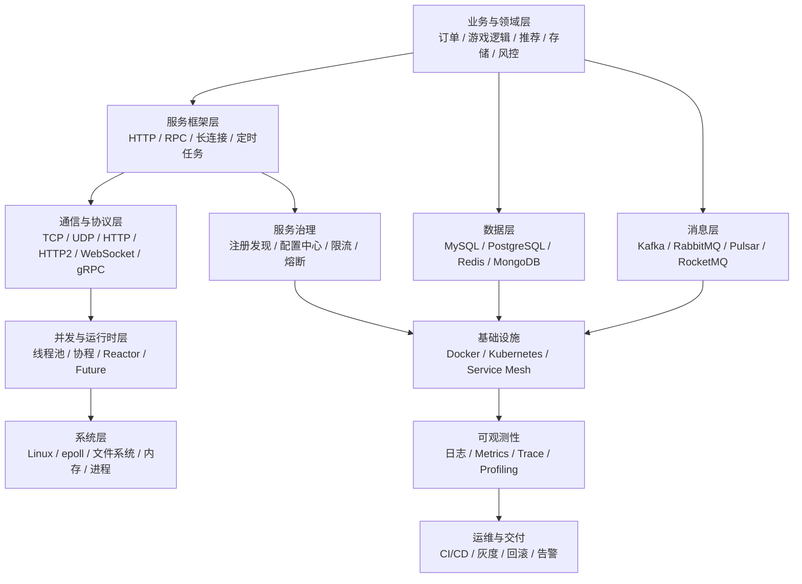

可以把它概括为六个核心能力：

| 能力 | 需要解决的问题 |
|---|---|
| 编程语言能力 | 正确管理对象生命周期、资源、并发和错误 |
| 系统能力 | 理解进程、线程、虚拟内存、文件与网络 I/O |
| 网络服务能力 | 实现连接管理、协议解析、请求调度和超时处理 |
| 分布式能力 | 处理服务发现、重试、幂等、一致性和故障 |
| 工程能力 | 构建、测试、发布、监控、定位和回滚 |
| 性能能力 | 找到 CPU、内存、锁、I/O 和网络瓶颈 |

---

# 2. C++ 后端主要应用场景

C++ 并不是所有后端业务的默认语言，但在以下场景中具有明显优势。

## 2.1 高性能基础设施

典型系统包括：

- 数据库、缓存、搜索引擎与存储引擎
- RPC 框架、代理、网关和负载均衡器
- 消息系统、流处理引擎
- 编译服务、模型推理服务
- 操作系统、中间件和云基础设施组件

这些系统通常重视：

- 可预测的延迟
- 内存布局和缓存局部性
- 高并发网络 I/O
- 对系统调用和硬件能力的直接控制
- 较低的运行时开销

## 2.2 游戏服务器与实时通信

常见特征：

- TCP、UDP、KCP、QUIC 或 WebSocket 长连接
- 网关服、登录服、逻辑服、场景服、匹配服
- 状态同步、帧同步、Tick 循环
- AOI、房间、战斗实例和跨服通信
- 对延迟、抖动、吞吐量和内存分配高度敏感

## 2.3 微服务中的性能敏感服务

一个大型系统可能同时使用 Java、Go、Python 和 C++。C++ 常被用于：

- 高 QPS 核心链路
- 算法与业务融合服务
- 多媒体处理
- 实时推荐与广告
- 高频风控
- 低延迟交易
- CPU 密集型计算

## 2.4 单体服务和传统行业系统

C++ 也常出现在：

- 通信设备后台
- 工业控制后台
- 金融柜台与行情系统
- 音视频服务
- 车联网与边缘计算
- 嵌入式设备管理平台

---

# 3. 语言与现代 C++ 基础

当前 ISO C++ 标准是 C++23，但生产项目的实际基线通常取决于编译器、三方库、操作系统和历史代码。新项目常见 C++17 或 C++20，部分项目开始使用 C++23 特性。[^cpp-standard]

## 3.1 必须掌握的语言主题

### 对象生命周期

需要理解：

- 自动存储期、静态存储期、动态存储期
- 构造、析构、拷贝、移动
- 临时对象与生命周期延长
- RAII
- Rule of Zero / Five
- `std::move` 只是类型转换，不直接执行移动
- 悬空引用、悬空指针和对象失效

```cpp
class File {
public:
    explicit File(const char* path)
        : fp_(std::fopen(path, "rb")) {
        if (!fp_) {
            throw std::runtime_error("open failed");
        }
    }

    ~File() {
        if (fp_) {
            std::fclose(fp_);
        }
    }

    File(const File&) = delete;
    File& operator=(const File&) = delete;

private:
    std::FILE* fp_;
};
```

RAII 的核心不是“智能指针”，而是把资源释放绑定到对象析构，使异常路径和早退路径同样安全。

## 3.2 智能指针

| 类型 | 含义 | 常见用途 |
|---|---|---|
| `std::unique_ptr` | 独占所有权 | 默认动态对象所有权模型 |
| `std::shared_ptr` | 共享所有权 | 确实存在共享生命周期时 |
| `std::weak_ptr` | 非拥有观察者 | 打破 `shared_ptr` 循环引用 |
| 裸指针 | 通常不表达所有权 | 观察、借用、与 C API 交互 |

工程原则：

- 默认使用值语义或 `unique_ptr`
- 不要为了“省事”到处使用 `shared_ptr`
- 明确区分 owning pointer 和 non-owning pointer
- 注意跨线程对象生命周期
- 注意异步回调捕获 `this` 的失效问题

## 3.3 STL 与常用容器

必须掌握：

- `vector`、`deque`、`list`
- `map`、`unordered_map`
- `set`、`unordered_set`
- `string`、`string_view`
- `span`
- `optional`、`variant`
- `function`
- 算法库与 ranges
- 迭代器失效规则
- 容器复杂度与内存特征

后端开发中尤其需要关注：

- `unordered_map` 的 rehash
- `vector` 扩容导致的引用和指针失效
- `string_view` 不拥有底层字符串
- `std::function` 可能发生类型擦除和堆分配
- 容器节点分配对性能和碎片的影响

## 3.4 错误处理

常见策略：

| 策略 | 适用场景 |
|---|---|
| 异常 | 构造失败、不可局部恢复错误、库接口 |
| 返回码 | 系统级接口、性能敏感路径、跨 ABI |
| `std::optional` | 只有“有值/无值”两种结果 |
| `std::expected` | 同时表达结果和结构化错误 |
| 状态对象 | RPC、数据库、协议解析等复杂错误 |

不要混淆：

- 业务失败
- 可重试错误
- 参数错误
- 资源不足
- 数据损坏
- 编程错误

这些错误通常需要不同处理策略。

## 3.5 模板与泛型编程

后端工程中常见用途：

- 序列化适配
- 容器和算法抽象
- 编译期注册
- 类型安全接口
- traits
- CRTP
- Concepts 与约束
- 零开销抽象

模板不应被用来制造无必要的复杂度。大型项目还要关注：

- 编译时间
- 二进制膨胀
- 错误信息可读性
- ABI 稳定性
- 显式实例化

## 3.6 ABI 与二进制兼容

C++ 后端经常涉及动态库和跨模块调用，需要理解：

- Name Mangling
- vtable
- RTTI
- exception ABI
- 标准库 ABI
- 编译器版本兼容
- Debug/Release 运行库差异
- `-fvisibility`
- PImpl
- C ABI 边界

跨团队公共 SDK 若要求稳定 ABI，通常会：

- 暴露 C API
- 使用 PImpl 隐藏实现
- 避免跨边界传递 STL 类型
- 固定编译器和运行库
- 使用 RPC 代替进程内 ABI

---

# 4. Linux 与系统编程

Linux 是 C++ 后端最常见的运行环境。需要掌握的不只是命令，而是内核向用户态暴露的基本抽象。

## 4.1 进程与线程

核心知识：

- `fork`、`exec`、`wait`
- 进程地址空间
- 线程共享资源
- 上下文切换
- 线程局部存储 TLS
- 守护进程
- 信号
- 进程退出与僵尸进程
- CPU affinity
- 调度策略

## 4.2 虚拟内存

需要理解：

- 虚拟地址与物理页
- 页表和 TLB
- 缺页异常
- `mmap`
- Copy-on-Write
- RSS、VSS、PSS
- 内存映射文件
- 大页与透明大页
- NUMA
- swap
- OOM Killer

服务内存上涨不一定等于泄漏，可能来自：

- allocator 缓存
- 碎片
- page cache
- mmap 区域
- 线程栈
- 对象缓存
- 内存池
- 尚未归还操作系统的空闲页

## 4.3 文件与 I/O

核心接口：

- `open`、`read`、`write`、`close`
- `pread`、`pwrite`
- `readv`、`writev`
- `sendfile`
- `mmap`
- `fsync`、`fdatasync`
- 文件锁
- 非阻塞 I/O
- direct I/O
- page cache

## 4.4 IPC

常见进程间通信方式：

| IPC | 特点 |
|---|---|
| Pipe | 简单、单机、父子进程常用 |
| Unix Domain Socket | 本机 RPC，保留 Socket 编程模型 |
| Shared Memory | 吞吐高，但同步和生命周期复杂 |
| Message Queue | 内核或中间件管理消息 |
| Signal | 轻量通知，不适合承载复杂数据 |
| TCP Loopback | 跨语言、隔离好，但开销相对更高 |

## 4.5 Linux 服务管理

工程中常用：

- systemd
- cgroup
- namespace
- ulimit
- core dump
- `/proc`
- `/sys`
- journald
- logrotate
- cron / systemd timer

---

# 5. 编译器、构建系统与依赖管理

## 5.1 编译器

主流选择：

- GCC
- Clang/LLVM
- MSVC
- Apple Clang

需要理解：

- 预处理、编译、汇编、链接
- 静态库与动态库
- 符号表与重定位
- ELF
- DWARF
- LTO
- PGO
- Debug/Release
- 优化等级
- `rpath`、`RUNPATH`
- `LD_LIBRARY_PATH`

典型编译选项：

```bash
-Wall -Wextra -Wpedantic
-Wconversion -Wshadow
-O2 -g
-fno-omit-frame-pointer
```

调试构建中常加入：

```bash
-fsanitize=address,undefined
```

## 5.2 CMake

CMake 是当前 C++ 工程中最常见的跨平台构建系统之一，可生成 Ninja、Makefile、Visual Studio 和 Xcode 工程。[^cmake]

推荐使用现代 Target 模式：

```cmake
cmake_minimum_required(VERSION 3.25)
project(order_service LANGUAGES CXX)

add_executable(order_service
    src/main.cpp
    src/order_service.cpp
)

target_compile_features(order_service PRIVATE cxx_std_20)

target_include_directories(order_service
    PRIVATE
        ${CMAKE_CURRENT_SOURCE_DIR}/include
)

target_link_libraries(order_service
    PRIVATE
        protobuf::libprotobuf
        gRPC::grpc++
)
```

避免：

- 全局 `include_directories`
- 全局 `link_directories`
- 大量修改全局编译参数
- 把依赖传递关系写成隐式状态
- 在源码目录内构建

## 5.3 Ninja 与 Make

- **Ninja**：执行构建图，追求快速增量构建
- **Make**：传统通用构建工具
- **CMake**：生成构建系统，不直接等同于编译器

常见组合：

```text
CMake + Ninja + GCC/Clang
```

## 5.4 Bazel

Bazel 常用于：

- 超大仓库
- 多语言 Monorepo
- 强调可重复构建
- 需要远程缓存和远程执行
- 生成代码较多的项目

Bazel 官方为 C++ 提供专门的规则和教程。[^bazel]

示例：

```python
cc_binary(
    name = "server",
    srcs = ["server.cc"],
    deps = [
        ":core",
        "@com_google_protobuf//:protobuf",
    ],
)
```

## 5.5 依赖管理

### Conan 2

Conan 是跨平台 C/C++ 包管理器，可与 CMake 等构建系统集成。[^conan]

适合：

- 自建企业二进制仓库
- 多编译器、多配置包管理
- 管理库版本、编译选项和 ABI 组合
- 发布内部 C++ SDK

### vcpkg

vcpkg 是 Microsoft 与社区维护的跨平台 C/C++ 包管理器。[^vcpkg]

适合：

- 快速获取开源依赖
- CMake 工程
- Windows/Linux/macOS 跨平台开发
- Manifest 模式管理依赖

### 其他方式

- Git submodule
- FetchContent
- CPM.cmake
- 系统包管理器：apt、dnf、yum
- 源码 vendoring
- 内部源码镜像

## 5.6 常见工程目录

```text
project/
├── CMakeLists.txt
├── cmake/
├── include/
│   └── project/
├── src/
├── proto/
├── tests/
├── benchmarks/
├── tools/
├── configs/
├── scripts/
├── third_party/
├── Dockerfile
└── README.md
```

---

# 6. 网络编程与 I/O 模型

## 6.1 TCP

必须掌握：

- 三次握手与四次挥手
- 全双工字节流
- 粘包与拆包
- 半关闭
- backlog
- 滑动窗口
- 拥塞控制
- 重传
- Nagle 算法
- `TIME_WAIT`
- `CLOSE_WAIT`
- Keepalive
- `SO_REUSEADDR`
- `SO_REUSEPORT`
- `TCP_NODELAY`

TCP 没有消息边界。应用层必须自行定义：

```text
固定长度
分隔符
长度字段 + Payload
TLV
自描述序列化格式
```

典型长度前缀协议：

```text
+----------------+---------------------+
| uint32 length  | payload             |
+----------------+---------------------+
```

## 6.2 UDP

特点：

- 无连接
- 保留报文边界
- 不保证可靠、顺序或不重复
- 延迟和协议控制空间较大

常用于：

- 游戏实时同步
- 音视频
- DNS
- QUIC 底层传输
- 监控数据
- 局域网广播

可靠 UDP 需要自行处理：

- 序列号
- ACK
- 重传
- 拥塞控制
- 分片
- 顺序
- 去重

## 6.3 HTTP

需要掌握：

- HTTP/1.1 Keep-Alive
- 请求行、Header、Body
- Chunked Encoding
- 状态码
- 幂等方法
- Cookie
- Cache-Control
- 代理语义
- HTTP/2 多路复用
- HTTP/3 与 QUIC
- TLS

## 6.4 WebSocket

适合：

- 浏览器长连接
- 即时消息
- 在线协作
- 推送
- 游戏大厅与轻量实时交互

WebSocket 建立在 HTTP Upgrade 之上，建立后使用帧协议进行双向通信。

## 6.5 I/O 多路复用

Linux 中常见：

- `select`
- `poll`
- `epoll`
- `io_uring`

高并发网络服务常使用 `epoll` 或封装它的网络库。

## 6.6 Reactor 模型

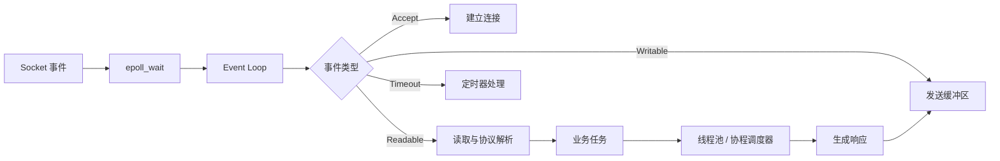

Reactor 的核心思想：

1. 一个或多个事件循环等待 I/O 就绪。
2. 事件到达后分派给对应处理器。
3. 耗时业务不得长时间阻塞 I/O 线程。
4. 写操作通常经发送缓冲区异步完成。

## 6.7 Proactor 与 io_uring

Reactor 通常处理“操作已就绪”；Proactor 更接近“操作已完成”。

`io_uring` 可以用于：

- 异步文件 I/O
- 网络 I/O
- 批量提交
- 减少部分系统调用和上下文切换

但是否采用 `io_uring` 应由压测和实际场景决定。它不是对 `epoll` 的无条件替代。

---

# 7. 网络库、HTTP 框架与 RPC 框架

## 7.1 Boost.Asio / Standalone Asio

Asio 提供跨平台网络与低层 I/O 抽象，并支持同步、异步和现代 C++ 异步模型。[^asio]

适合：

- 自研网络框架
- TCP/UDP 客户端与服务端
- 定时器
- TLS
- C++20 协程
- 跨平台 I/O

核心对象：

- `io_context`
- socket
- acceptor
- timer
- executor
- completion handler
- strand

## 7.2 muduo

muduo 是经典 Linux C++ 网络库，常用于学习：

- Reactor
- one loop per thread
- EventLoop
- Channel
- TcpConnection
- Buffer
- 线程池

它对理解服务端网络框架内部机制仍有价值，但新项目是否直接采用，需要评估维护状态、协议需求和团队经验。

## 7.3 libevent / libev / libuv

| 库 | 侧重点 |
|---|---|
| libevent | 事件通知、定时器、网络 |
| libev | 轻量事件循环 |
| libuv | 跨平台异步 I/O，Node.js 底层组件之一 |

C++ 项目通常会再封装一层 RAII、对象生命周期和回调模型。

## 7.4 Drogon

Drogon 是基于现代 C++ 的异步 HTTP 应用框架，支持 C++17/20、协程和跨平台开发。[^drogon]

适合：

- REST API
- 内部管理后台
- 中小型 HTTP 服务
- 希望减少手写网络基础设施的 C++ 项目

## 7.5 Crow、Oat++ 等轻量 HTTP 框架

常用于：

- 快速构建 REST API
- 内部工具
- 较轻量服务
- 原型与中小规模系统

选型时重点评估：

- 活跃度
- HTTP/2 支持
- TLS
- 异步模型
- 中间件
- 可观测性
- 依赖管理
- 线上案例
- 安全更新

## 7.6 gRPC

gRPC 是高性能跨语言 RPC 框架，通常使用 Protocol Buffers 作为 IDL 和消息格式，并提供同步、异步、流式 RPC 等模型。[^grpc]

```protobuf
syntax = "proto3";

package order;

service OrderService {
  rpc CreateOrder(CreateOrderRequest)
      returns (CreateOrderResponse);
}

message CreateOrderRequest {
  string user_id = 1;
  repeated string item_ids = 2;
}

message CreateOrderResponse {
  string order_id = 1;
}
```

适合：

- 多语言微服务
- 强接口契约
- 自动生成客户端与服务端桩
- HTTP/2
- Unary、Client Streaming、Server Streaming、Bidirectional Streaming

需要额外处理：

- Deadline
- Cancellation
- 重试
- 负载均衡
- 元数据
- 限流
- 链路追踪
- 版本兼容

## 7.7 Apache bRPC

bRPC 是面向高性能服务的工业级 C++ RPC 框架，常见于搜索、存储、机器学习、广告和推荐等场景。[^brpc]

特点通常包括：

- C++ 高性能 RPC
- 多协议支持
- 服务端与客户端能力
- 内置或可集成服务治理功能
- 与 bthread 等并发模型结合

## 7.8 tRPC-Cpp

tRPC-Cpp 是 tRPC 的 C++ 实现，强调高性能、模块化和可插拔设计。[^trpc]

适合：

- 企业内部微服务体系
- 需要框架统一接入日志、监控、配置、路由和插件
- C++ 与其他语言服务互通

## 7.9 Tars

Tars 是完整的微服务/RPC 体系，包含 IDL、通信、注册、配置、监控和管理能力，并支持多种语言。[^tars]

适合：

- 有统一服务治理平台的企业
- 大量内部 RPC 服务
- 希望框架和运维平台一体化的环境

## 7.10 框架选型对比

| 场景 | 可考虑方案 |
|---|---|
| 自研 TCP/UDP 长连接 | Asio、muduo、自研 Reactor |
| REST API | Drogon、Oat++、Crow |
| 标准跨语言 RPC | gRPC |
| 国内高性能基础设施 | bRPC |
| 企业统一微服务体系 | tRPC-Cpp、Tars、内部框架 |
| 游戏服长连接 | Asio、自研网络层、公司内部框架 |
| 边缘设备 | 轻量 HTTP/RPC、自定义二进制协议 |

---

# 8. 协议、序列化与接口定义

## 8.1 Protocol Buffers

特点：

- IDL 定义
- 自动生成代码
- 二进制格式
- 支持字段演进
- 多语言
- 与 gRPC 紧密结合

兼容性原则：

- 不复用已删除字段编号
- 新增字段优于修改字段类型
- 谨慎使用 required 语义
- 保留废弃字段号和名称
- 服务端和客户端允许滚动升级

## 8.2 JSON

优点：

- 可读
- 调试方便
- Web 生态成熟
- 与 REST API 结合自然

缺点：

- 文本体积较大
- 解析成本较高
- 类型表达有限
- Schema 约束需要额外机制

常见 C++ 库：

- nlohmann/json
- RapidJSON
- simdjson

## 8.3 FlatBuffers 与 Cap'n Proto

适用于：

- 对反序列化成本敏感
- 希望减少复制
- 游戏、实时系统、存储格式
- 跨进程高吞吐数据交换

但需要权衡：

- API 使用复杂度
- 数据演进
- 内存生命周期
- 对齐
- 生态成熟度

## 8.4 MessagePack、CBOR

适合：

- 需要比 JSON 紧凑
- 又希望保留动态数据模型
- 多语言通信
- IoT 和边缘设备

## 8.5 自定义二进制协议

常见结构：

```text
Magic | Version | Command | Sequence | Length | Payload | Checksum
```

需要设计：

- 字节序
- 对齐
- 长度校验
- 最大包长
- 版本升级
- 压缩
- 加密
- 鉴权
- 重放防护
- 错误码
- 流控

---

# 9. 并发编程与异步编程

## 9.1 线程基础

需要掌握：

- `std::thread`
- `std::jthread`
- mutex
- shared_mutex
- condition_variable
- atomic
- memory order
- future / promise
- thread_local
- latch / barrier / semaphore

## 9.2 数据竞争与竞态条件

- **数据竞争**：多个线程无同步访问同一内存，至少一个写，行为未定义。
- **竞态条件**：结果依赖时序，不一定构成语言层面的数据竞争。

## 9.3 内存模型

重点理解：

- happens-before
- sequenced-before
- synchronizes-with
- acquire / release
- relaxed
- sequential consistency
- false sharing
- cache coherence

不要在没有明确证明和基准测试时过度使用 lock-free。

## 9.4 线程池

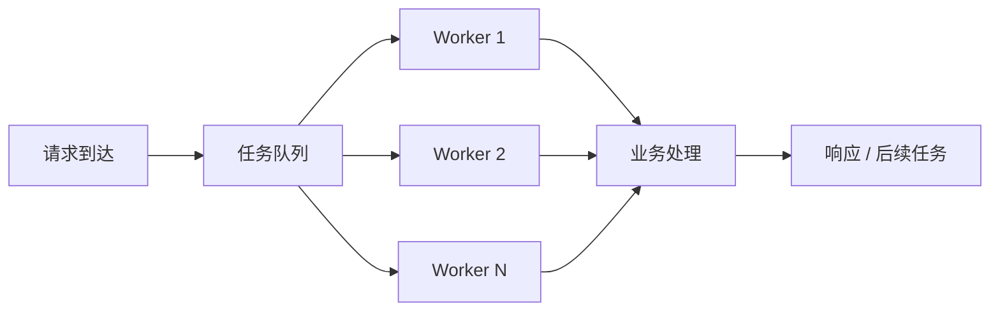

线程池需要处理：

- 队列是否有界
- 拒绝策略
- 优先级
- 任务取消
- 异常传播
- 优雅退出
- 线程数
- CPU 密集与 I/O 密集任务隔离
- 避免任务间死锁

## 9.5 协程

C++20 提供语言级协程机制，但标准本身主要提供底层构造，完整调度和 I/O 集成通常由库或框架实现。

协程的价值：

- 以顺序代码表达异步流程
- 减少回调嵌套
- 大量等待型任务可复用少量线程
- 便于表达 RPC、超时和异步数据库访问

```cpp
awaitable<void> handle_request(Socket socket) {
    auto request = co_await async_read_request(socket);
    auto result = co_await query_database(request);
    co_await async_write_response(socket, result);
}
```

协程不等于线程。协程仍然需要：

- executor
- scheduler
- event loop
- 生命周期管理
- cancellation
- backpressure

## 9.6 Actor 模型

Actor 通过消息传递而不是共享内存进行并发。

适合：

- 游戏实体
- 房间
- 用户会话
- 状态机
- 分区服务

需要考虑：

- Mailbox 堆积
- 消息顺序
- Actor 迁移
- 故障恢复
- 请求关联
- 超时

## 9.7 背压

当下游处理速度低于上游生产速度时，必须控制流量：

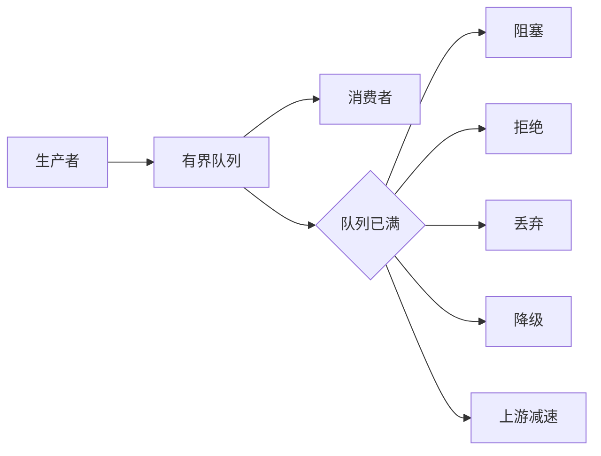

无界队列通常只是把延迟问题转化为内存问题。

---

# 10. 数据库与数据访问

## 10.1 MySQL

常见用途：

- 业务主库
- 交易数据
- 账户、订单、配置
- 中小规模关系数据

需要掌握：

- 索引
- B+ Tree
- 联合索引最左前缀
- 覆盖索引
- 事务
- 隔离级别
- MVCC
- 锁
- redo/undo/binlog
- 主从复制
- 慢查询
- 执行计划
- 分库分表

C++ 访问方式：

- MySQL Connector/C++
- MySQL C API
- ORM 或内部数据访问层

## 10.2 PostgreSQL

优势场景：

- 丰富 SQL 能力
- 复杂查询
- JSONB
- 扩展机制
- GIS
- 强事务和数据类型

C/C++ 常通过：

- libpq
- libpqxx
- ORM 或内部封装

## 10.3 SQLite

适合：

- 单机嵌入式数据
- 本地缓存
- 工具和客户端
- 小型边缘服务
- 测试

不适合直接作为高并发分布式主数据库。

## 10.4 MongoDB

适合：

- 文档模型
- Schema 变化较多
- 数据天然以聚合文档访问
- 内容和配置类数据

仍需认真设计：

- 索引
- 文档大小
- 一致性
- 事务边界
- 分片键

## 10.5 数据库连接池

连接池通常维护：

- 最小/最大连接数
- 空闲连接
- 获取超时
- 连接健康检查
- 失效重连
- 事务绑定
- 连接生命周期

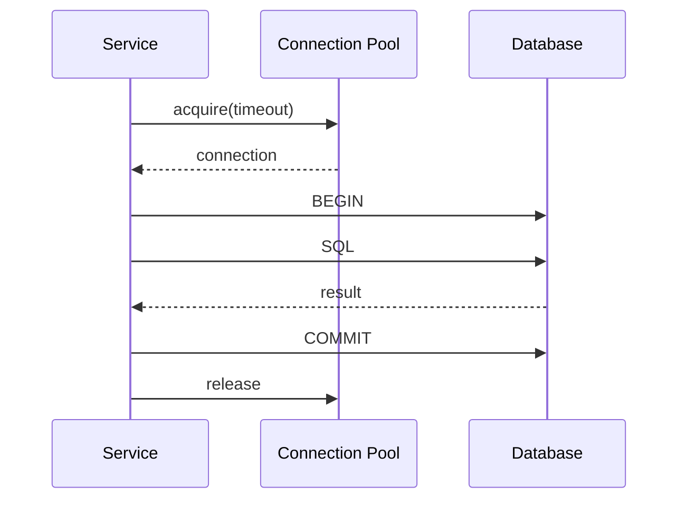

## 10.6 ORM 与手写 SQL

ORM 优点：

- 减少模板代码
- 类型映射
- 快速开发

风险：

- 隐式查询
- N+1
- 复杂 SQL 难表达
- 性能不可控
- 数据库特性利用不足

高性能 C++ 服务中常见方式是：

- 轻量数据访问层
- 显式 SQL
- 预编译语句
- 批量操作
- 统一事务封装

---

# 11. 缓存系统

## 11.1 Redis

常见用途：

- 热点缓存
- Session
- 分布式锁
- 限流
- 排行榜
- 发布订阅
- 延迟队列
- 去重
- 计数器

C++ 常用客户端：

- hiredis
- redis-plus-plus
- 企业内部 Redis Client

## 11.2 缓存模式

### Cache Aside

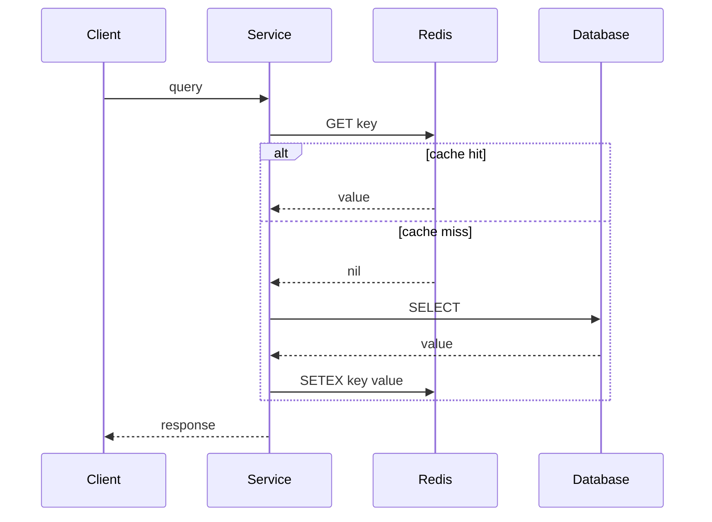

### 常见问题

- 缓存穿透
- 缓存击穿
- 缓存雪崩
- 热 Key
- 大 Key
- 数据不一致
- 过期策略
- 内存淘汰
- 分布式锁误用

## 11.3 本地缓存

可使用：

- LRU
- LFU
- TinyLFU
- 分片 Hash Map
- 读写锁
- RCU 风格结构
- 不可变快照

本地缓存延迟低，但需要解决多实例一致性和容量限制。

---

# 12. 消息队列与事件驱动

## 12.1 Kafka

适合：

- 高吞吐日志流
- 事件总线
- 数据管道
- 异步解耦
- 流处理
- 行为埋点

C/C++ 常使用 librdkafka。

需要理解：

- Topic
- Partition
- Offset
- Consumer Group
- 副本
- ISR
- 顺序只在分区内保证
- At-most-once / At-least-once / Exactly-once 语义边界

## 12.2 RabbitMQ

适合：

- 路由灵活
- 业务消息
- Work Queue
- 发布订阅
- 延迟和重试体系

重点概念：

- Exchange
- Queue
- Binding
- Routing Key
- ACK
- Dead Letter
- Prefetch

## 12.3 RocketMQ 与 Pulsar

常见于：

- 大规模业务消息
- 延迟消息
- 事务消息
- 多租户消息系统
- 云原生消息场景

## 12.4 消息可靠性

生产者侧：

- 发送确认
- 重试
- 本地消息表
- Outbox Pattern
- 幂等键

消费者侧：

- 手动 ACK
- 重试次数
- 死信队列
- 去重
- 幂等处理
- 顺序消费
- 消费进度

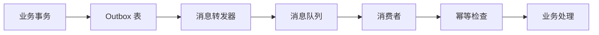

“消息队列不丢消息”不能只由 MQ 产品保证，还取决于生产、存储、确认和消费的完整链路。

---

# 13. 服务治理与分布式系统

## 13.1 服务注册与发现

常见组件：

- etcd
- Consul
- ZooKeeper
- Nacos
- Kubernetes Service
- 企业内部名字服务

基本流程：

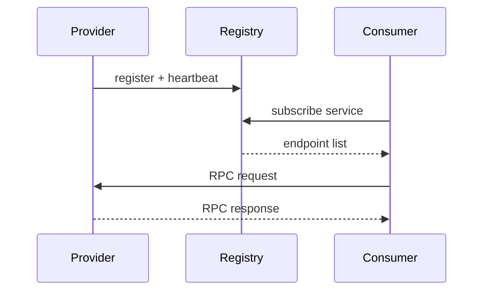

## 13.2 配置中心

需要支持：

- 配置版本
- 灰度发布
- 动态更新
- 回滚
- 环境隔离
- 权限
- 审计
- 敏感配置加密
- 本地兜底

不要在配置回调线程中直接执行耗时操作。

## 13.3 负载均衡

常见策略：

- Round Robin
- Random
- Weighted Round Robin
- Least Connections
- Consistent Hash
- P2C
- Locality-aware
- 根据实时延迟和错误率

客户端负载均衡适合 RPC；服务端负载均衡常通过代理或网关实现。

## 13.4 超时

所有跨进程调用都应有超时。

超时需要分层：

```text
总请求 Deadline
├── RPC A Timeout
├── RPC B Timeout
└── Database Timeout
```

子调用超时总和不能无约束地超过上层 Deadline。

## 13.5 重试

只对满足条件的错误重试：

- 连接失败
- 明确的临时不可用
- 超时且操作幂等
- 服务端返回可重试状态

重试必须配合：

- 最大次数
- 指数退避
- 抖动
- Deadline
- 熔断
- 重试预算

否则会形成重试风暴。

## 13.6 幂等

常见方法：

- 幂等键
- 唯一索引
- 请求序列号
- 状态机约束
- 去重表
- Compare-And-Swap
- 业务版本号

## 13.7 限流

算法：

- 固定窗口
- 滑动窗口
- 漏桶
- 令牌桶
- 并发数限制
- 自适应限流

限流维度：

- 用户
- IP
- 接口
- 服务
- 租户
- 机房
- 全局

## 13.8 熔断与降级

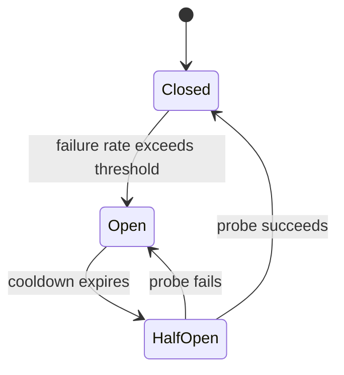

降级方式：

- 返回缓存
- 返回默认值
- 关闭非核心功能
- 降低数据精度
- 异步处理
- 拒绝低优先级请求

## 13.9 一致性与共识

需要理解：

- CAP 的实际含义
- 线性一致性
- 最终一致性
- Read-your-writes
- Quorum
- Leader/Follower
- Raft
- Paxos 基本思想
- 脑裂
- 租约
- Fencing Token

业务开发通常不需要自己实现 Raft，但必须理解中间件的一致性边界。

---

# 14. 网关、代理与负载均衡

常见组件：

- Nginx
- Envoy
- HAProxy
- API Gateway
- Ingress Controller
- 自研接入层

职责：

- TLS 终止
- 路由
- 负载均衡
- 限流
- 鉴权
- 协议转换
- 灰度
- 访问日志
- 防护
- 长连接管理

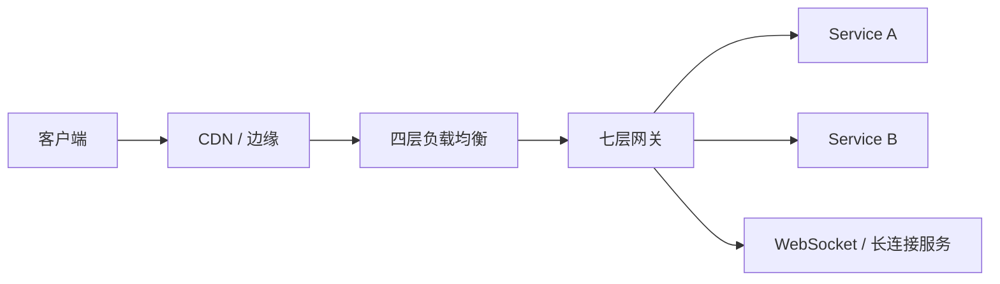

四层代理关注 TCP/UDP；七层代理理解 HTTP、gRPC 等应用协议。

---

# 15. 日志、指标与链路追踪

现代后端可观测性通常由 Logs、Metrics 和 Traces 共同组成。

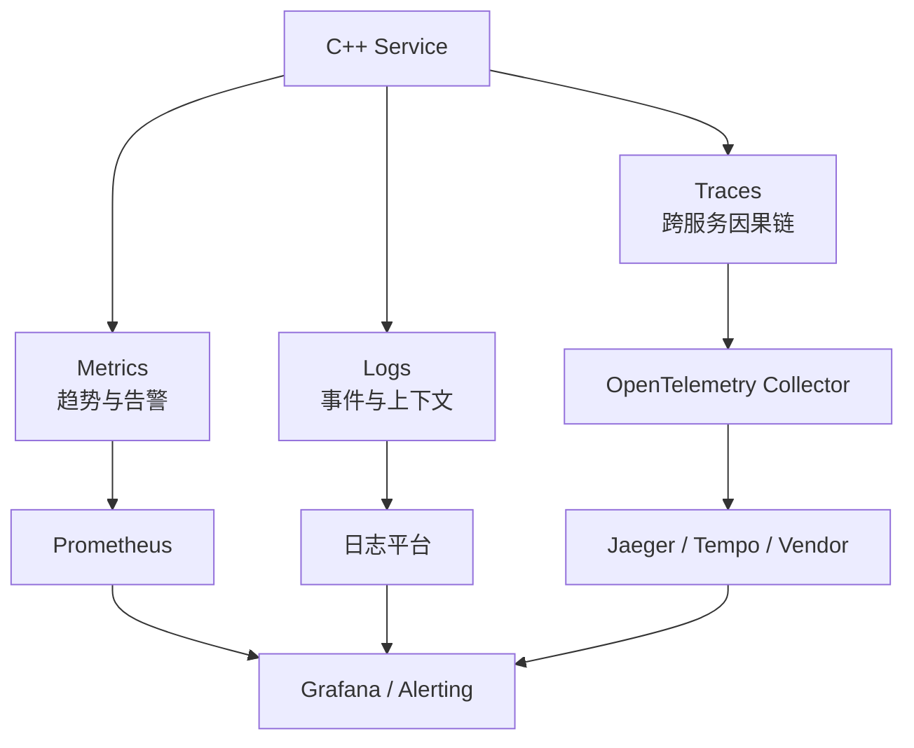

OpenTelemetry C++ 可生成并导出 traces、metrics 和 logs。[^otel] Prometheus 适合记录数值时间序列和监控动态服务架构。[^prometheus]

## 15.1 日志

常用库：

- spdlog
- glog
- Boost.Log
- 自研日志库

日志字段建议：

```json
{
  "timestamp": "2026-07-14T10:00:00.123Z",
  "level": "ERROR",
  "service": "order-service",
  "trace_id": "abc",
  "request_id": "req-123",
  "user_id": "u-42",
  "error_code": "DB_TIMEOUT",
  "message": "query timeout",
  "cost_ms": 120
}
```

注意：

- 异步日志队列必须有容量上限
- 高并发路径不要构造无用日志字符串
- 不记录密码、Token 和敏感个人数据
- 日志采样要保留错误和关键链路
- 日志级别应可动态调整

## 15.2 Metrics

四类黄金信号：

- Latency
- Traffic
- Errors
- Saturation

服务常见指标：

- QPS
- P50/P95/P99/P999
- Error Rate
- Active Connections
- Queue Length
- Thread Pool Utilization
- CPU
- RSS
- Allocation Rate
- Cache Hit Rate
- DB Pool Usage
- RPC Timeout Rate

不要使用高基数 Label，例如直接把 `user_id` 作为 Prometheus 标签。

## 15.3 Trace

一个 Trace 由多个 Span 组成。

应传递：

- trace id
- span id
- parent span
- baggage
- deadline
- request id

Trace 可用于定位：

- 哪个下游耗时
- 重试发生在哪里
- 数据库查询是否过慢
- 队列等待时间
- 跨机房延迟

## 15.4 Profiling

持续剖析可关注：

- CPU Profile
- Heap Profile
- Allocation Profile
- Lock Contention
- Off-CPU
- Wall Time

---

# 16. 测试、静态分析与代码质量

## 16.1 GoogleTest / GoogleMock

GoogleTest 是常用 C++ 测试框架，GoogleMock 用于替换外部依赖和验证交互。[^gtest]

```cpp
TEST(OrderServiceTest, RejectsEmptyUserId) {
    FakeRepository repo;
    OrderService service(repo);

    auto result = service.CreateOrder({.user_id = ""});

    EXPECT_FALSE(result.has_value());
}
```

测试类型：

- 单元测试
- 组件测试
- 集成测试
- 接口测试
- 端到端测试
- 回归测试
- 性能测试
- 混沌测试

## 16.2 Benchmark

常见工具：

- Google Benchmark
- 自研压测工具
- wrk
- wrk2
- hey
- ghz
- vegeta
- iperf
- redis-benchmark

性能测试必须明确：

- 并发模型
- 请求分布
- 预热
- CPU 绑定
- 数据集
- 网络拓扑
- 延迟统计方法
- 失败率
- 环境噪声

## 16.3 Sanitizers

常用：

| 工具 | 目标 |
|---|---|
| ASan | 越界、Use-after-free 等内存错误 |
| UBSan | 未定义行为 |
| TSan | 数据竞争 |
| MSan | 未初始化内存读取 |
| LSan | 泄漏 |

AddressSanitizer 由编译器插桩和运行时组成，可检测堆、栈和全局对象越界及 Use-after-free 等问题。[^asan]

## 16.4 静态分析

常用：

- clang-tidy
- Clang Static Analyzer
- cppcheck
- Coverity
- SonarQube
- PVS-Studio

检查内容：

- 空指针
- 未初始化
- 生命周期
- API 误用
- 锁问题
- 越界
- 资源泄漏
- 风格和现代化建议

## 16.5 格式与规范

常见工具：

- clang-format
- clang-tidy
- include-what-you-use
- pre-commit

规范应覆盖：

- 命名
- 所有权
- 错误处理
- 并发模型
- 日志
- 接口兼容
- 禁用特性
- 代码审查要求

---

# 17. 调试、性能分析与故障定位

## 17.1 调试器

常用：

- GDB
- LLDB
- Visual Studio Debugger

应掌握：

- breakpoint
- watchpoint
- backtrace
- core dump
- 多线程切换
- 条件断点
- 反汇编
- 寄存器
- 内存检查
- pretty printer
- attach 到进程

## 17.2 Core Dump

典型流程：

```bash
ulimit -c unlimited
gdb ./server core
(gdb) bt
(gdb) thread apply all bt
```

线上二进制必须保留与构建对应的：

- Build ID
- Debug symbols
- Source revision
- Compiler flags
- 依赖版本

## 17.3 perf

Linux `perf` 可使用硬件性能计数器、tracepoint、kprobe 和 uprobe 进行性能分析。[^perf]

常用命令：

```bash
perf stat ./server
perf record -g -p <pid>
perf report
```

## 17.4 火焰图

火焰图用于展示采样栈聚合结果。

- 宽度表示采样占比
- 垂直方向表示调用栈
- 顶部宽函数通常是热点
- 需要同时分析 on-CPU 和 off-CPU

## 17.5 内存工具

常见：

- heaptrack
- Valgrind
- Massif
- gperftools
- jemalloc profiling
- tcmalloc profiling
- ASan/LSan
- `/proc/<pid>/smaps`

## 17.6 eBPF

常用于：

- 系统级动态追踪
- 网络观测
- 调度延迟
- 文件 I/O
- syscall
- off-CPU 分析
- 低侵入线上诊断

工具生态：

- bpftrace
- BCC
- libbpf
- Pixie
- Parca Agent
- 企业内部 eBPF 平台

## 17.7 常见性能瓶颈分类

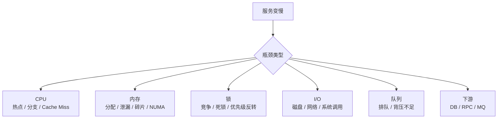

性能优化顺序：

1. 先测量。
2. 找到主导瓶颈。
3. 建立可复现基准。
4. 修改一个变量。
5. 比较吞吐、尾延迟、CPU、内存和错误率。
6. 防止性能回归。

---

# 18. 安全技术栈

## 18.1 TLS

常见库：

- OpenSSL
- BoringSSL
- LibreSSL

需要理解：

- 证书链
- CA
- SNI
- ALPN
- TLS 终止
- mTLS
- 证书轮换
- 私钥保护
- Cipher Suite
- 会话复用

## 18.2 身份认证

常见机制：

- Session
- JWT
- OAuth 2.0
- OpenID Connect
- API Key
- HMAC 签名
- mTLS
- 内部服务身份

注意 JWT：

- 验证签名
- 验证 `exp`、`nbf`、`iss`、`aud`
- 处理密钥轮换
- 不在 Payload 放敏感明文
- 不把“可解码”误认为“已认证”

## 18.3 输入安全

必须防御：

- SQL Injection
- Command Injection
- Path Traversal
- SSRF
- 反序列化漏洞
- 整数溢出
- 缓冲区越界
- 压缩炸弹
- 超大请求
- 正则表达式 DoS
- 协议解析歧义

协议解析器必须验证：

- 长度
- 偏移
- 版本
- 枚举范围
- 嵌套深度
- 元素数量
- 总资源消耗

## 18.4 Secret 管理

不要把密钥放在：

- Git 仓库
- Docker 镜像层
- 日志
- 命令行参数
- Core Dump
- 明文配置

可使用：

- Kubernetes Secret
- Vault
- 云 KMS
- 企业密钥平台
- 短期凭证

## 18.5 供应链安全

关注：

- 依赖版本锁定
- SBOM
- 漏洞扫描
- 制品签名
- 可重复构建
- 私有镜像仓库
- 最小基础镜像
- 编译器和工具链可信来源

---

# 19. 容器、部署与云原生

## 19.1 Docker

容器镜像包含运行容器所需的文件、二进制、库和配置。[^docker]

典型多阶段构建：

```dockerfile
FROM ubuntu:24.04 AS builder

RUN apt-get update && apt-get install -y \
    build-essential cmake ninja-build

WORKDIR /src
COPY . .
RUN cmake -S . -B build -G Ninja -DCMAKE_BUILD_TYPE=Release \
    && cmake --build build

FROM ubuntu:24.04

RUN useradd -r app
COPY --from=builder /src/build/server /usr/local/bin/server

USER app
ENTRYPOINT ["/usr/local/bin/server"]
```

注意：

- 多阶段构建
- 固定基础镜像版本
- 非 root 用户
- 不复制编译缓存和密钥
- 最小化运行时依赖
- 设置健康检查
- 正确处理 SIGTERM
- 容器内写入临时目录而非镜像层

## 19.2 Kubernetes

Kubernetes 用于管理容器化工作负载和服务，支持声明式配置与自动化。[^kubernetes]

C++ 服务常涉及：

- Deployment
- StatefulSet
- Service
- ConfigMap
- Secret
- Ingress
- HPA
- PDB
- Job / CronJob
- Readiness Probe
- Liveness Probe
- Startup Probe

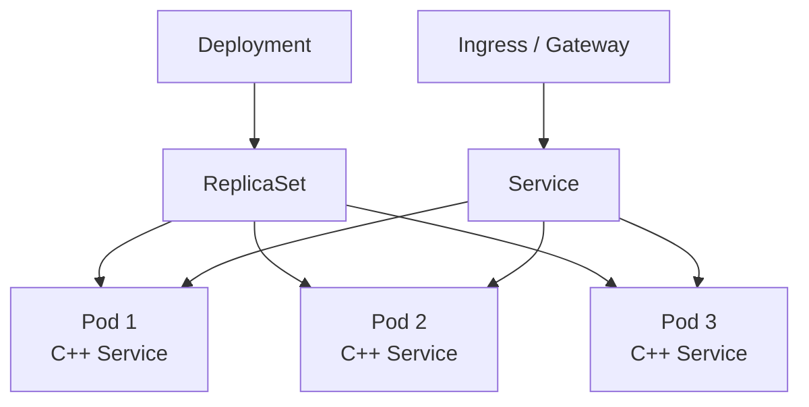

## 19.3 健康检查

- **Liveness**：进程是否需要重启
- **Readiness**：是否可以接收流量
- **Startup**：慢启动期间避免被错误重启

不要把所有下游依赖都放进 Liveness。否则下游故障会导致大规模重启风暴。

## 19.4 优雅关闭

典型流程：

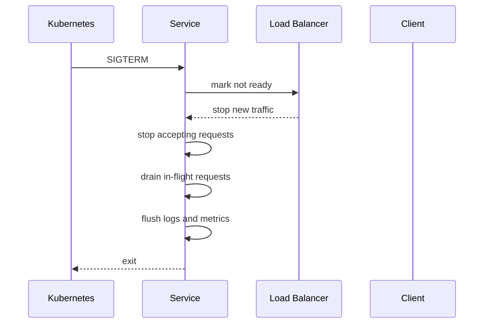

## 19.5 Service Mesh

常见：

- Istio
- Envoy
- Linkerd

可提供：

- mTLS
- 路由
- 重试
- 熔断
- 流量镜像
- 可观测性

但 Mesh 会增加：

- 资源开销
- 网络路径复杂度
- 故障面
- 调试成本

---

# 20. CI/CD 与工程协作

## 20.1 版本控制

Git 必须掌握：

- branch
- merge
- rebase
- cherry-pick
- reset
- revert
- bisect
- tag
- submodule
- conflict resolution

## 20.2 CI 流水线


常见平台：

- GitHub Actions
- GitLab CI
- Jenkins
- Buildkite
- Azure DevOps
- 企业内部流水线

## 20.3 制品管理

常见：

- Docker Registry
- Harbor
- Artifactory
- Nexus
- Conan Remote
- 内部二进制仓库

制品应关联：

- Git Commit
- Build ID
- 编译器
- 依赖锁文件
- 构建参数
- 测试结果
- SBOM

## 20.4 发布策略

- Rolling Update
- Blue-Green
- Canary
- 灰度
- A/B
- Feature Flag

发布必须有：

- 指标基线
- 自动停止条件
- 回滚路径
- 配置兼容
- 数据库迁移策略
- 新旧协议兼容

---

# 21. 常见后端架构形态

## 21.1 单体服务

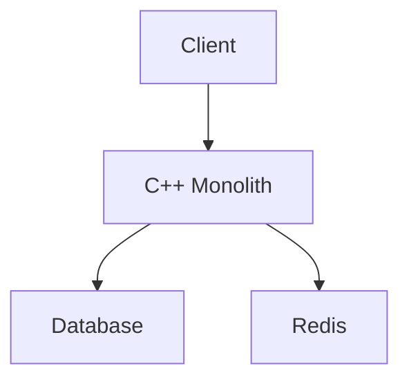

优点：

- 部署简单
- 调试容易
- 本地调用成本低
- 事务边界清晰

风险：

- 模块耦合
- 发布影响面大
- 扩容粒度粗
- 团队协作冲突

## 21.2 微服务

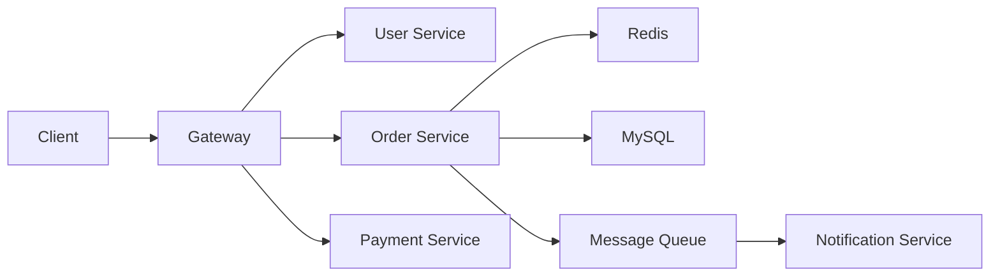

微服务不是为了“技术先进”，而是为了组织边界、独立发布和独立扩缩容。它会引入：

- 网络失败
- 分布式事务
- 版本兼容
- 服务治理
- 可观测性
- 运维成本

## 21.3 分层架构

```text
Transport Layer
    ↓
Application Service
    ↓
Domain Logic
    ↓
Repository / Infrastructure
```

适合业务系统，但不能机械套用。性能敏感路径可能需要减少抽象层和对象复制。

## 21.4 事件驱动架构

服务不直接同步调用所有后续系统，而是发布事件。

优点：

- 解耦
- 削峰
- 异步扩展
- 容易接入新消费者

风险：

- 最终一致性
- 重复消费
- 事件顺序
- 调试困难
- Schema 演进

## 21.5 CQRS

Command 与 Query 分离：

- 写模型处理状态变更
- 读模型针对查询优化
- 通过事件同步

适合读写模式差异大、审计要求高的系统，不适合简单 CRUD 项目强行使用。

## 21.6 游戏服务器架构

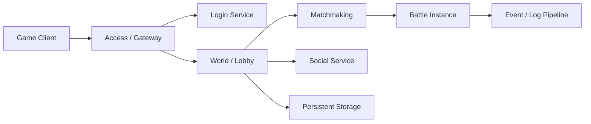

关键技术：

- 长连接与连接迁移
- Session
- 协议路由
- Tick
- 定时器
- 状态机
- AOI
- 房间与实例调度
- 断线重连
- 消息顺序
- 反作弊
- 热更新与配置发布

---

# 22. 典型技术栈组合

## 22.1 通用 Linux 微服务

```text
C++20
GCC / Clang
CMake + Ninja
Conan 2 或 vcpkg
gRPC + Protocol Buffers
MySQL / PostgreSQL
Redis
Kafka
spdlog
OpenTelemetry + Prometheus + Grafana
GoogleTest + Sanitizers
Docker + Kubernetes
```

适合：

- 高性能内部服务
- 多语言微服务
- 推荐、搜索、风控、基础平台

## 22.2 高性能自研网络服务

```text
C++20
Linux
epoll / io_uring
Boost.Asio 或自研 Reactor
自定义二进制协议 / Protobuf
线程池或协程调度器
jemalloc / tcmalloc
perf + eBPF + FlameGraph
```

适合：

- 网关
- 代理
- 长连接
- 实时通信
- 游戏后台
- 存储节点

## 22.3 C++ REST API

```text
C++20
Drogon / Oat++
CMake
JSON
PostgreSQL
Redis
JWT / OAuth2 接入
OpenTelemetry
Docker
```

适合：

- 中小规模 HTTP 服务
- 管理后台
- BFF 中的性能敏感组件
- 内部工具

## 22.4 国内企业 RPC 体系

```text
C++17/20
bRPC / tRPC-Cpp / Tars / 内部 RPC 框架
Protobuf 或企业 IDL
etcd / Nacos / 内部名字服务
内部配置中心
Prometheus / 内部监控
Kubernetes 或自研部署平台
```

## 22.5 游戏服务器

```text
C++17/20
Linux
Asio / 内部网络框架
TCP + UDP/KCP/QUIC
Protobuf / FlatBuffers / 自定义协议
Redis
MySQL
Kafka / 内部消息总线
Actor / 协程 / Tick 驱动
Docker / 物理机 / Kubernetes 混合部署
```

---

# 23. 技术选型原则

## 23.1 不要从框架名称开始

正确顺序：


## 23.2 关键问题

### 流量

- 平均 QPS 和峰值 QPS
- 长连接数量
- 请求大小
- 读写比例
- 流量是否突发
- 是否需要跨机房

### 延迟

- 平均延迟
- P99/P999
- 抖动
- 超时预算
- 是否允许异步

### 数据

- 强一致还是最终一致
- 事务边界
- 数据规模
- 热点
- 访问模式
- 是否需要历史回溯

### 团队

- 是否有成熟框架
- 是否有运维平台
- 是否能维护自研网络层
- 是否有 C++ 线上排障能力
- 是否要求跨语言

## 23.3 选型常见误区

- 因为性能高而选择 C++，但没有性能目标
- 为简单 CRUD 自研 RPC 和网络框架
- 把微服务当作默认架构
- 使用无界队列掩盖下游变慢
- 把重试当作可靠性保证
- 在没有测量前做底层优化
- 为了“现代 C++”过度模板化
- 不考虑协议和数据的向后兼容
- 只看平均延迟，不看尾延迟
- 只关注代码，不建设监控和发布体系

---

# 24. 学习路线

## 24.1 第一阶段：语言与 Linux 基础

目标：

- 能写正确、可维护的现代 C++
- 能在 Linux 上编译、调试和运行服务

学习内容：

1. C++ 对象模型、RAII、智能指针
2. STL、模板和异常
3. Linux 进程、线程、文件和虚拟内存
4. GCC/Clang、CMake、GDB
5. Git
6. GoogleTest
7. Sanitizer

## 24.2 第二阶段：网络与并发

目标：

- 能实现可靠的 TCP 服务
- 理解高并发网络框架

学习内容：

1. TCP/IP
2. Socket
3. 非阻塞 I/O
4. epoll
5. Reactor
6. 线程池
7. 定时器
8. 协程
9. 协议解析
10. 背压与连接管理

建议项目：

- 长度前缀 Echo Server
- HTTP/1.1 Server
- Chat Server
- 简单 RPC
- 带超时和线程池的网关

## 24.3 第三阶段：存储与分布式

目标：

- 能构建完整业务服务
- 理解服务间故障和一致性

学习内容：

1. MySQL/PostgreSQL
2. Redis
3. Kafka
4. gRPC/Protobuf
5. 服务发现
6. 超时、重试、幂等
7. 限流、熔断、降级
8. 分布式锁
9. 一致性与 Raft 基础

## 24.4 第四阶段：工程化与生产能力

目标：

- 能把服务安全发布到生产环境
- 能定位线上问题

学习内容：

1. Docker
2. Kubernetes
3. CI/CD
4. 日志、Metrics、Trace
5. perf、火焰图、eBPF
6. 压测
7. 灰度和回滚
8. 安全
9. 容量规划
10. 故障演练

## 24.5 推荐路线图


---

# 25. 面试与实际工作能力映射

| 面试知识点 | 实际工作中的对应问题 |
|---|---|
| 智能指针 | 异步对象生命周期、资源释放 |
| 虚函数和对象模型 | 接口设计、ABI、性能 |
| STL 失效规则 | 崩溃、悬空引用 |
| TCP 粘包 | 协议 framing |
| TIME_WAIT | 连接管理和端口耗尽 |
| epoll LT/ET | 事件循环正确性 |
| 线程同步 | 数据竞争、锁竞争 |
| MySQL 索引 | 慢查询 |
| Redis 缓存 | 热点、穿透和一致性 |
| 消息队列 | 异步解耦与可靠投递 |
| 一致性 | 多副本和分布式状态 |
| perf | CPU 热点定位 |
| Core Dump | 线上崩溃分析 |
| Docker/K8s | 服务交付和扩缩容 |
| 限流熔断 | 故障隔离 |
| 幂等 | 重试和重复消息 |
| 监控指标 | 发现和定位线上异常 |

真正成熟的 C++ 后端工程师应能完成完整闭环：

```mermaid
flowchart LR
    A["设计"] --> B["实现"]
    B --> C["测试"]
    C --> D["压测"]
    D --> E["部署"]
    E --> F["监控"]
    F --> G["定位"]
    G --> H["优化"]
    H --> A
```

---

# 26. 参考资料

本文以官方文档和项目主页作为技术状态参考。

[^cpp-standard]: [Standard C++：The Standard](https://isocpp.org/std/the-standard)
[^cmake]: [CMake 官方文档](https://cmake.org/cmake/help/latest/)
[^bazel]: [Bazel：C++ and Bazel](https://bazel.build/docs/bazel-and-cpp)
[^conan]: [Conan 2 官方文档](https://docs.conan.io/)
[^vcpkg]: [vcpkg 官方概览](https://learn.microsoft.com/en-us/vcpkg/get_started/overview)
[^asio]: [Boost.Asio 官方文档](https://www.boost.org/libs/asio)
[^grpc]: [gRPC C++ 官方文档](https://grpc.io/docs/languages/cpp/)
[^brpc]: [Apache bRPC 官方网站](https://brpc.apache.org/)
[^trpc]: [tRPC-Cpp 官方仓库](https://github.com/trpc-group/trpc-cpp)
[^tars]: [Tars 官方文档](https://tarscloud.github.io/TarsDocs_en/)
[^drogon]: [Drogon 官方文档](https://drogonframework.github.io/drogon-docs/)
[^otel]: [OpenTelemetry C++ 官方文档](https://opentelemetry.io/docs/languages/cpp/)
[^prometheus]: [Prometheus 官方概览](https://prometheus.io/docs/introduction/overview/)
[^gtest]: [GoogleTest 官方文档](https://google.github.io/googletest/)
[^asan]: [Clang AddressSanitizer 官方文档](https://clang.llvm.org/docs/AddressSanitizer.html)
[^perf]: [Linux perf 文档](https://perfwiki.github.io/main/)
[^docker]: [Docker：What is an image?](https://docs.docker.com/get-started/docker-concepts/the-basics/what-is-an-image/)
[^kubernetes]: [Kubernetes 官方概览](https://kubernetes.io/docs/concepts/overview/)

---

## 总结

C++ 后端技术栈可以按以下主线理解：

```text
现代 C++
  → Linux 系统编程
  → 网络与并发
  → HTTP / RPC / 序列化
  → 数据库 / 缓存 / 消息队列
  → 分布式服务治理
  → 测试与性能分析
  → 容器与云原生
  → 可观测性和生产运维
```

对大多数岗位而言，优先级最高的不是同时掌握所有框架，而是建立以下能力：

1. 能正确管理内存、资源和并发。
2. 能解释一次网络请求从连接建立到响应返回的完整路径。
3. 能设计超时、重试、幂等、限流和故障隔离。
4. 能使用数据库、缓存和消息队列完成真实业务。
5. 能通过日志、指标、Trace、Core Dump 和 Profile 定位问题。
6. 能将服务构建、测试、容器化并安全发布。
