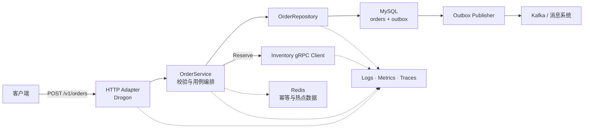
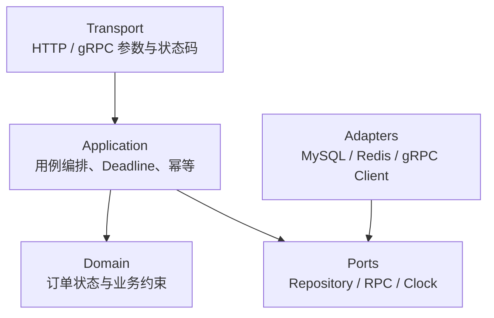
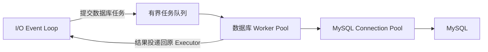
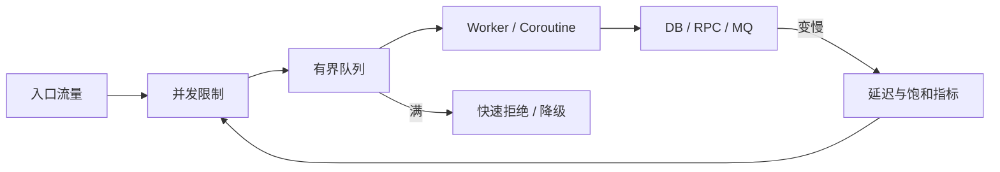
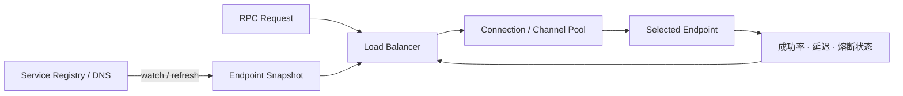
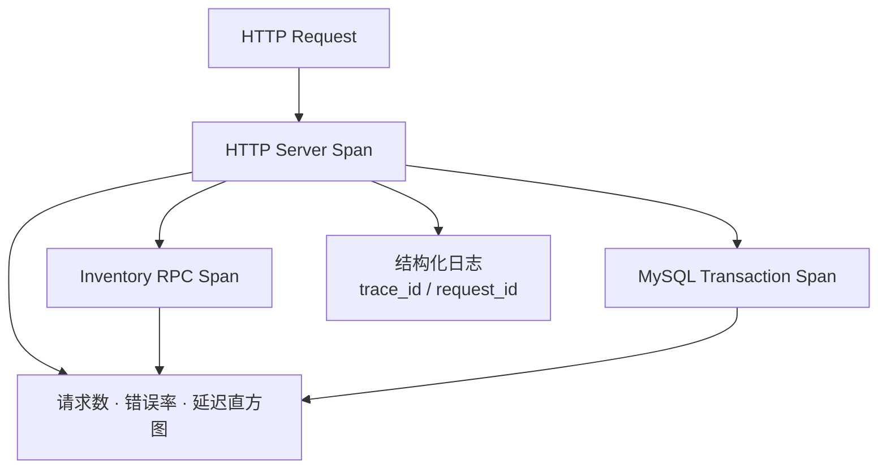
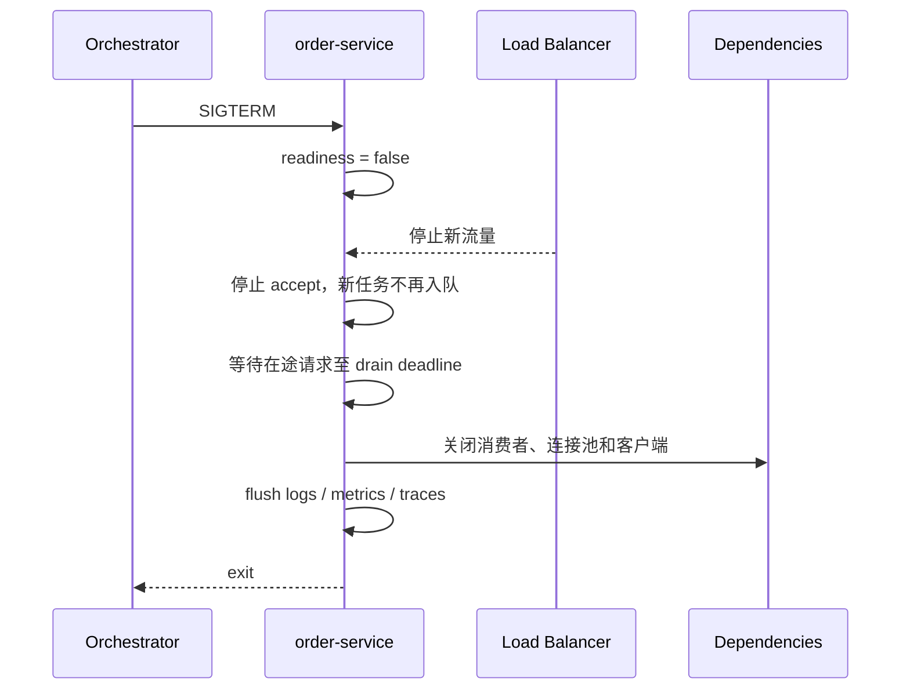
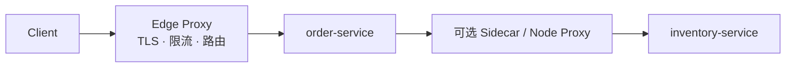

# C++ 后端服务开发：从工程骨架到上线

一个可上线的 C++ 服务不只是 Socket、线程池和若干中间件名称。它必须把构建、依赖、接口、并发、数据一致性、超时、观测、测试和发布连成一条可验证的路径。

本文用一个 `order-service` 贯穿这些环节：先把它当作一个接收 HTTP 请求的普通 C++ 网络程序，再逐步加入库存调用、数据持久化、异步消息和运行观测。示例采用 C++23、CMake、Ninja、Drogon、gRPC、Protocol Buffers、GoogleTest 和 OpenTelemetry；换用公司内部框架时，边界和排错方法仍然成立。



语言、内核和数据库原理不在这里重复展开。需要补齐细节时可直接转到：

- [C++ 语言与工程基础](post.html?slug=cpp_review)
- [Linux 系统基础](post.html?slug=os_review)
- [计算机网络](post.html?slug=Network)
- [数据库与缓存](post.html?slug=database)
- [NebulaIM 后端实现](post.html?slug=nebula)

# 阅读起点：把陌生概念放进一次请求

先不用记框架名称。对熟悉 C++、操作系统和计算机网络的读者，一个后端服务仍然是监听端口、收发字节、调度任务和管理资源的进程。框架只是在这些能力上增加 HTTP 解析、路由、序列化和生命周期管理。

例如客户端发送：

```bash
curl -X POST http://127.0.0.1:8080/v1/orders \
  -H 'Content-Type: application/json' \
  -H 'Idempotency-Key: request-7f2' \
  -d '{"user_id":"user-1","sku_ids":["sku-8"]}'
```

服务返回：

```json
{
  "order_id": "order-1001",
  "status": "confirmed"
}
```

这次请求在服务内部依次经过：

```text
HTTP Handler
    ↓ 解析 JSON、校验参数
OrderService
    ├── InventoryClient ──gRPC──> 库存服务
    └── OrderRepository ────────> MySQL
                                      ├── orders
                                      └── outbox_events
```

下面的概念都能在这条路径中找到具体位置。

## HTTP Handler 与 Drogon

Handler 是某个路由对应的请求处理函数。Drogon 是 C++ Web 框架，它在事件循环、Socket 和 HTTP 协议之上提供路由、请求对象与响应对象：

```cpp
drogon::app().registerHandler(
    "/health",
    [](const drogon::HttpRequestPtr&,
       std::function<void(const drogon::HttpResponsePtr&)>&& reply) {
        auto response = drogon::HttpResponse::newHttpResponse();
        response->setBody("ok");
        reply(response);
    });
```

可以把它理解为已经实现了以下通用工作的网络程序骨架：

```text
epoll / 事件循环
        ↓
TCP 连接与缓冲区管理
        ↓
HTTP 报文解析
        ↓
按 Method + Path 查找 Handler
        ↓
业务处理并生成 HTTP 响应
```

Handler 只应处理协议边界，例如读取 Header、解析 JSON、校验字段并把业务错误转换成 HTTP 状态码。它不应直接拼 SQL 或实现库存规则。

## OrderService、Domain、Repository 与 Adapter

`OrderService` 是应用服务，负责按照业务顺序编排一次“创建订单”操作。Domain 是不依赖网络和数据库的业务类型与规则，例如 `Order`、`Money`、订单状态转换。它们都不是第三方框架。

Repository 是持久化接口。它隐藏 SQL 和数据库驱动，使业务层只表达“保存订单”或“按幂等键查询”：

```cpp
class OrderRepository {
public:
    virtual ~OrderRepository() = default;
    virtual Result<Order> Save(const Order& order) = 0;
    virtual Result<std::optional<Order>> FindByIdempotencyKey(
        std::string_view key) = 0;
};
```

同一个接口可以有不同实现：

```text
OrderRepository
├── InMemoryOrderRepository   先保存在容器中，便于学习和单元测试
└── MysqlOrderRepository      使用 SQL 写入 MySQL
```

Adapter 是翻译层。比如业务层只认识 `InventoryClient::Reserve()`，`GrpcInventoryClient` 则负责把 C++ 业务类型转换成 Protobuf 消息、发起 RPC，再把 gRPC 状态码转换成业务错误：

```text
业务类型                    外部协议类型
ProductId / Reservation
           │
           ▼
GrpcInventoryClient
           │
           ▼
Protobuf Request / Response / gRPC Status
```

Repository 主要隔离数据保存方式，Adapter 是更通用的外部系统适配方式。二者的共同目的不是增加目录，而是避免业务逻辑依赖 MySQL、Drogon 或 gRPC 的具体 API。

## gRPC、Protobuf 与远程调用

gRPC 根据 Protobuf 中定义的服务和消息生成 C++ Stub。调用 Stub 的写法接近函数调用，但它本质上仍然经过序列化、HTTP/2 和网络传输：

```proto
service InventoryService {
  rpc Reserve(ReserveRequest) returns (ReserveResponse);
}
```

```text
订单服务                                        库存服务
Reserve(request) ── 序列化 / HTTP/2 / 网络 ──> Reserve(...)
```

因此 RPC 可能遇到连接失败、响应超时、服务端崩溃，甚至“服务端已经完成操作，但响应在网络中丢失”。不能因为代码看起来像本地函数，就忽略 Deadline、取消、幂等和重试条件。

## Deadline、重试、幂等与背压

这四项用来约束网络和下游服务的不确定性。

- **Deadline**：这次操作最晚必须在什么时候结束。它比单层 Timeout 多表达了一个关键约束：请求经过多层服务时只能继续使用剩余时间，不能在每一层重新获得完整超时。
- **重试**：暂时性失败后再次尝试。只有确认操作未执行，或操作已经具备幂等性时才能自动重试；参数错误、权限错误和持续过载不应重试。
- **幂等**：同一个业务请求重复到达，最终效果仍和执行一次相同。创建订单时用 `Idempotency-Key` 加数据库唯一约束，重复请求返回第一次创建的订单，而不是再创建一份。
- **背压**：处理能力不足时限制上游继续提交任务。连接数、在途请求、线程池队列和连接池都必须有上限；容量耗尽时应等待到 Deadline 或快速拒绝，不能用无界队列把过载拖成高延迟和 OOM。

它们之间存在直接关系：


重试不是越多越可靠。没有 Deadline 的重试可能无限拖延，没有幂等的重试可能重复扣款，没有背压的重试可能进一步压垮下游。

## 连接池、Redis 与 Outbox

`MySqlPool` 表示 MySQL 连接池。建立数据库连接涉及 TCP 连接和认证，服务通常复用一组已经建立的连接：

```text
请求任务 ──借用──> 连接池：连接 1 | 连接 2 | 连接 3 ──> MySQL
                    <────────归还────────────
```

连接池限制数据库会话数量；数据库 Worker 线程池则隔离同步数据库调用，二者不是同一个池。连接在事务期间不能归还，获取连接也必须有等待上限。

Redis 是内存数据存储，在本例中可以保存有过期时间的缓存、幂等处理状态或限流计数。订单的权威状态仍在 MySQL；缓存失效后应该能够从权威数据重建。

Outbox 解决“业务数据写成功，但消息发送失败”的双写问题。以下做法存在不一致窗口：

```text
写入 orders 成功
        ↓
进程在发送消息前崩溃
        ↓
订单存在，但其他服务永远收不到事件
```

Outbox 把订单和待发布事件放进同一个本地事务：

```sql
BEGIN;
INSERT INTO orders (...);
INSERT INTO outbox_events (...);
COMMIT;
```

后台 Publisher 再读取 `outbox_events` 并发送到 Kafka 或其他消息系统。它保证业务数据与“需要发送事件”同时提交，但不自动保证消息只出现一次；发布和消费端仍需用事件 ID 处理重复消息。

## `Task`、`Reservation`、`Telemetry` 与 Composition Root

这些名字用于表达示例结构，不属于 C++ 标准库，也不是必须采用的框架类型：

| 名称 | 在示例中的含义 |
|---|---|
| `Task<T>` | 尚未完成、以后产生 `T` 的异步操作；可以映射到 Asio `awaitable<T>`、框架协程或内部 Future |
| `Reservation` | 库存预留结果，包含预留 ID、商品、数量和过期时间等业务信息，而不是一个含义模糊的 `bool` |
| `Telemetry` | 日志、Metrics 和 Trace 的统一初始化与关闭封装 |
| `MySqlPool` | 管理 MySQL 连接借出、归还、上限和健康状态的连接池封装 |

Telemetry 的三类数据分别回答不同问题：

```text
Logs      某次具体请求发生了什么
Metrics   错误率、吞吐和延迟是否正在变化
Traces    一次请求在哪个服务或数据库步骤耗时
```

Composition Root 通常就是 `main()` 附近负责创建并连接这些对象的位置：

```cpp
MySqlPool mysql(database_config);
MysqlOrderRepository orders(mysql);
GrpcInventoryClient inventory(inventory_config);
OrderService service(orders, inventory);
```

业务代码通过构造参数获得依赖，而不是从全局单例中寻找数据库和 RPC 客户端。这样测试可以换成内存 Repository 或 Fake Client，对象的创建与销毁顺序也集中可见。

可以先用下面的分类记住它们之间的区别：

| 类别 | 内容 |
|---|---|
| 具体工具 | Drogon、gRPC、Protobuf、MySQL、Redis、Kafka、OpenTelemetry |
| 代码边界 | Handler、OrderService、Domain、Repository、Adapter、Composition Root |
| 可靠性机制 | Deadline、取消、重试、幂等、背压、Outbox |
| 示例类型 | `Task`、`Reservation`、`Telemetry`、`MySqlPool` |

# 1. 先确定服务边界

## 1.1 请求从哪里来，到哪里结束

`POST /v1/orders` 的同步路径只做创建订单必须完成的工作：

1. 解析和验证请求。
2. 检查幂等键。
3. 调用库存服务预留库存。
4. 在一个本地事务内写订单和 Outbox 事件。
5. 返回订单 ID。

通知、统计和搜索索引更新不应延长同步路径，由 Outbox 事件异步驱动。先画清边界，才能决定哪些失败返回给客户端，哪些任务可以重试，哪些状态必须放进同一事务。

## 1.2 分层不是为了增加目录



依赖方向由外向内：领域对象不知道 Drogon、gRPC 或 MySQL。HTTP Controller 只负责协议转换；`OrderService` 负责用例；Repository 负责持久化细节。这样单元测试可以替换外部依赖，迁移框架也不会迫使业务对象一起重写。

不要为每个结构体机械创建五层包装。判断一个边界是否有价值，只看它是否隔离了变化：协议会变、数据库会变、业务规则也会变，但变化速度不同。

## 1.3 目录从依赖方向表达结构

```text
order-service/
├── CMakeLists.txt
├── CMakePresets.json
├── vcpkg.json
├── app/
│   └── main.cpp
├── include/order/
│   ├── domain/
│   ├── application/
│   └── ports/
├── src/
│   ├── domain/
│   └── application/
├── adapters/
│   ├── http/
│   ├── grpc/
│   ├── mysql/
│   ├── redis/
│   └── messaging/
├── proto/
├── migrations/
├── tests/
│   ├── unit/
│   └── integration/
├── benchmarks/
├── configs/
├── deploy/
└── cmake/
```

生成的 Protobuf 文件放在构建目录，不手工修改，也不和源文件混在一起。部署清单、迁移脚本和配置 Schema 都属于服务的一部分，应与代码一同审查。

# 2. 建立可重复的构建

## 2.1 CMake 只围绕 Target 传递属性

顶层 `CMakeLists.txt` 先建立少量明确的 Target：

```cmake
cmake_minimum_required(VERSION 3.25)
project(order_service VERSION 0.1.0 LANGUAGES CXX)

option(ORDER_ENABLE_SANITIZERS "Enable ASan and UBSan" OFF)

find_package(Threads REQUIRED)
find_package(Drogon CONFIG REQUIRED)
find_package(Protobuf CONFIG REQUIRED)
find_package(gRPC CONFIG REQUIRED)
find_package(spdlog CONFIG REQUIRED)

add_subdirectory(proto)

add_library(order_options INTERFACE)
target_compile_features(order_options INTERFACE cxx_std_23)

add_library(order_warnings INTERFACE)
target_compile_options(order_warnings INTERFACE
    $<$<CXX_COMPILER_ID:GNU,Clang>:
        -Wall;-Wextra;-Wpedantic;-Wconversion;-Wshadow>
)

if(ORDER_ENABLE_SANITIZERS AND CMAKE_CXX_COMPILER_ID MATCHES "Clang|GNU")
    target_compile_options(order_options INTERFACE
        -fsanitize=address,undefined -fno-omit-frame-pointer)
    target_link_options(order_options INTERFACE
        -fsanitize=address,undefined -fno-omit-frame-pointer)
endif()

add_library(order_core
    src/domain/order.cpp
    src/application/order_service.cpp
)
target_include_directories(order_core PUBLIC include)
target_link_libraries(order_core
    PUBLIC order_options
    PRIVATE order_warnings Threads::Threads
)

add_executable(order_server
    app/main.cpp
    adapters/http/order_controller.cpp
    adapters/grpc/grpc_inventory_client.cpp
    adapters/mysql/mysql_order_repository.cpp
)
target_link_libraries(order_server PRIVATE
    order_core
    order_warnings
    inventory_proto
    Drogon::Drogon
    spdlog::spdlog
)

install(TARGETS order_server RUNTIME DESTINATION bin)

include(CTest)
if(BUILD_TESTING)
    add_subdirectory(tests)
endif()
```

`PUBLIC`、`PRIVATE` 和 `INTERFACE` 描述传播关系：例如调用者需要看到 `order_core` 的公开头文件，所以 include 目录是 `PUBLIC`；Drogon 只被最终服务使用，所以是 `PRIVATE`。不要用全局 `include_directories()`、`link_directories()` 或一串全局 flags 隐藏依赖。

## 2.2 用 Preset 固化开发、测试和发布配置

[CMake Presets][cmake-presets] 可以提交到仓库，个人路径放进不提交的 `CMakeUserPresets.json`：

```json
{
  "version": 6,
  "cmakeMinimumRequired": {
    "major": 3,
    "minor": 25,
    "patch": 0
  },
  "configurePresets": [
    {
      "name": "dev",
      "generator": "Ninja",
      "binaryDir": "${sourceDir}/build/${presetName}",
      "toolchainFile": "$env{VCPKG_ROOT}/scripts/buildsystems/vcpkg.cmake",
      "cacheVariables": {
        "CMAKE_BUILD_TYPE": "Debug",
        "CMAKE_EXPORT_COMPILE_COMMANDS": true,
        "ORDER_ENABLE_SANITIZERS": true
      }
    },
    {
      "name": "release",
      "inherits": "dev",
      "cacheVariables": {
        "CMAKE_BUILD_TYPE": "RelWithDebInfo",
        "ORDER_ENABLE_SANITIZERS": false
      }
    }
  ],
  "buildPresets": [
    { "name": "dev", "configurePreset": "dev" },
    { "name": "release", "configurePreset": "release" }
  ],
  "testPresets": [
    {
      "name": "dev",
      "configurePreset": "dev",
      "output": { "outputOnFailure": true }
    }
  ]
}
```

日常命令收敛为：

```bash
cmake --preset dev
cmake --build --preset dev
ctest --preset dev
./build/dev/order_server --config configs/dev.yaml
```

CI 使用同一套 Preset，避免“开发机的 Release”和“流水线的 Release”实际采用不同选项。

## 2.3 依赖管理选择一种主路径

### vcpkg Manifest

[vcpkg Manifest][vcpkg] 模式把直接依赖写进项目根目录：

```json
{
  "name": "order-service",
  "version-string": "0.1.0",
  "dependencies": [
    "drogon",
    "grpc",
    "protobuf",
    "spdlog",
    "gtest"
  ]
}
```

配置 CMake 时，vcpkg 根据 manifest 恢复依赖；需要严格复现时再固定 registry baseline 和版本约束。不要把开发机全局安装的包当成项目依赖声明。

### Conan 2

[Conan 2][conan] 与 CMake 的常见组合是 `CMakeDeps + CMakeToolchain`：

```ini
[requires]
fmt/<locked-version>
spdlog/<locked-version>
protobuf/<locked-version>
grpc/<locked-version>

[generators]
CMakeDeps
CMakeToolchain
```

```bash
conan profile detect
conan install . --output-folder=build/conan --build=missing \
  --settings=build_type=Debug
cmake -S . -B build/dev -G Ninja \
  -DCMAKE_TOOLCHAIN_FILE=build/conan/conan_toolchain.cmake \
  -DCMAKE_BUILD_TYPE=Debug
```

企业环境还应保存 profile、remote、recipe revision 和 lockfile，明确编译器、标准库、架构、Debug/Release 以及静态/动态链接组合。C++ 包是否兼容不能只由版本号判断，ABI 配置同样属于包 ID。

### 什么时候用 Bazel

[Bazel][bazel] 更适合多语言 Monorepo、远程缓存和远程执行已成为基础设施的场景。单个中小型 C++ 服务若没有对应平台支持，CMake 加包管理器通常更容易调试。不要在同一项目里同时让 CMake、手写 Makefile 和 shell 脚本分别维护三套依赖图。

## 2.4 配置在监听端口前完成校验

YAML、TOML 或 JSON 只是输入格式，业务代码应接收不可变的强类型配置：

```cpp
struct ServerConfig {
    std::string listen_address;
    std::uint16_t port;
    std::size_t io_threads;
    std::size_t max_in_flight;
};

struct DatabaseConfig {
    std::string dsn;
    std::size_t pool_size;
    std::chrono::milliseconds acquire_timeout;
};

struct InventoryConfig {
    std::string target;
    std::chrono::milliseconds timeout;
};

struct TelemetryConfig {
    std::string otlp_endpoint;
    double trace_sample_ratio;
};

struct AppConfig {
    ServerConfig server;
    DatabaseConfig database;
    InventoryConfig inventory;
    TelemetryConfig telemetry;
    std::chrono::milliseconds request_timeout;
};

Result<AppConfig> LoadAndValidateConfig(
    std::filesystem::path file,
    const Environment& environment);
```

加载时一次性检查端口范围、线程数、池大小、Deadline 关系和必填项。启动日志输出去除 Secret 后的生效配置及配置版本，失败就退出，不要带着半有效配置接流量。

静态配置适合文件和环境变量；需要动态更新的限流、开关和路由可由配置中心推送为新的不可变快照，再原子替换。回调线程只做解析和发布，不在其中执行耗时任务。

## 2.5 `main` 只负责组装和生命周期

```cpp
int main(int argc, char** argv) {
    auto config = LoadAndValidateConfig(config_path(argc, argv), process_env());
    if (!config) {
        print_startup_error(config.error());
        return 2;
    }

    Telemetry telemetry(config->telemetry);
    MySqlPool mysql(config->database);
    MysqlOrderRepository repository(mysql);
    GrpcInventoryClient inventory(config->inventory);
    OrderService orders(repository, inventory);

    register_health_routes();
    register_order_routes(orders);
    install_shutdown_handler();

    drogon::app()
        .addListener(config->server.listen_address, config->server.port)
        .setThreadNum(config->server.io_threads)
        .run();
    return 0;
}
```

这处是 Composition Root：依赖在这里创建，业务代码不通过全局单例偷偷寻找数据库、Logger 或配置。对象按依赖逆序析构；如果框架关闭需要异步 drain，就在退出 `run()` 前显式完成，而不是依赖静态对象析构顺序。

# 3. 用类型固定业务和错误边界

## 3.1 金额、标识和状态不要退化成任意字符串

```cpp
#include <cstdint>
#include <expected>
#include <string>
#include <vector>

struct UserId {
    std::string value;
};

struct Money {
    std::int64_t cents{};
};

enum class OrderStatus {
    Pending,
    Confirmed,
    Cancelled,
};

struct CreateOrderCommand {
    UserId user_id;
    std::vector<std::string> sku_ids;
    std::string idempotency_key;
};

enum class ErrorCode {
    InvalidArgument,
    Conflict,
    DeadlineExceeded,
    Unavailable,
    Internal,
};

struct Error {
    ErrorCode code;
    std::string message;
    bool retryable{};
};

template <class T>
using Result = std::expected<T, Error>;
```

金额使用最小货币单位，避免浮点误差；错误类型同时服务于 HTTP、gRPC、日志和重试判断。业务失败不应在最外层才通过字符串匹配识别。

## 3.2 端口接口只表达应用真正需要的能力

```cpp
class OrderRepository {
public:
    virtual ~OrderRepository() = default;

    virtual Result<Order> CreateWithOutbox(
        const CreateOrderCommand& command,
        const Reservation& reservation) = 0;

    virtual Result<std::optional<Order>> FindByIdempotencyKey(
        std::string_view key) = 0;
};

class InventoryClient {
public:
    virtual ~InventoryClient() = default;

    virtual Task<Result<Reservation>> Reserve(
        const std::vector<std::string>& sku_ids,
        Deadline deadline) = 0;
};
```

接口没有暴露 SQL、gRPC Stub 或连接池。`Task<T>` 表示项目采用的异步任务类型，可以映射到 Asio `awaitable`、框架协程或内部 Future。领域层仍保持普通值类型。

## 3.3 异步代码首先是生命周期设计

一次异步操作发起后，以下对象必须活到完成回调：

- Socket 和连接状态。
- 读写缓冲区。
- Handler 捕获的数据。
- 取消源、计时器和请求上下文。

会话对象通常由 `shared_ptr` 在未完成操作之间保持生命期；不参与共享所有权的依赖仍优先用值或 `unique_ptr`。捕获裸 `this` 前必须能证明对象不会先析构，`string_view` 和 `span` 也不能跨越底层存储的生命期。

# 4. 理解事件循环，再选择 HTTP 框架

## 4.1 Asio 的执行模型

[Boost.Asio][asio] 不是 Web 框架。它提供 I/O 对象、异步操作、Executor、计时器和组合操作；底层在 Linux 上可使用 epoll 等机制。其 C++20 协程接口由 `awaitable`、`use_awaitable` 和 `co_spawn` 等组件构成。[协程说明][asio-coroutines]


`io_context::run()` 执行就绪 Handler，不等于“一个连接一个线程”。多个线程可以共同运行同一个 `io_context`；`strand` 保证经它调度的 Handler 不并发执行，但不会自动保护绕过 strand 的访问。

## 4.2 一个协程 Echo 会话

```cpp
#include <array>
#include <boost/asio.hpp>

namespace asio = boost::asio;
using asio::ip::tcp;

asio::awaitable<void> session(tcp::socket socket) {
    std::array<char, 4096> buffer{};

    for (;;) {
        boost::system::error_code ec;
        const auto n = co_await socket.async_read_some(
            asio::buffer(buffer),
            asio::redirect_error(asio::use_awaitable, ec));

        if (ec == asio::error::eof) {
            co_return;
        }
        if (ec) {
            throw boost::system::system_error(ec);
        }

        co_await asio::async_write(
            socket,
            asio::buffer(buffer.data(), n),
            asio::use_awaitable);
    }
}

asio::awaitable<void> listen(std::uint16_t port) {
    auto executor = co_await asio::this_coro::executor;
    tcp::acceptor acceptor(executor, {tcp::v4(), port});

    for (;;) {
        auto socket = co_await acceptor.async_accept(asio::use_awaitable);
        asio::co_spawn(
            executor,
            session(std::move(socket)),
            [](std::exception_ptr error) {
                if (!error) return;
                try {
                    std::rethrow_exception(error);
                } catch (const std::exception& e) {
                    log_connection_error(e.what());
                }
            });
    }
}
```

这段代码展示了 `awaitable`、`use_awaitable` 和 `co_spawn` 的关系，但离生产协议还有距离：缺少包长限制、读写 Deadline、TLS、半关闭处理、背压、优雅退出和观测。不要把一个 Echo Demo 直接扩写成公共 HTTP 服务器。

## 4.3 低层网络库和应用框架的边界

| 层次 | 代表方案 | 已提供 | 仍需自己负责 |
|---|---|---|---|
| I/O 原语 | Asio、libevent、libuv | Socket、事件循环、Timer | HTTP 语义、路由、鉴权、业务结构 |
| 协议库 | Boost.Beast | HTTP/1、WebSocket 读写 | 服务生命周期、中间件、限流、观测 |
| HTTP 框架 | Drogon、Oat++、Crow | 路由、请求响应、中间件等 | 领域边界、可靠性和生产配置 |
| RPC 框架 | gRPC、bRPC、tRPC-Cpp、Tars | IDL、Stub、服务调用模型 | 业务幂等、Deadline 预算、数据一致性 |

如果需求只是 REST、鉴权和数据库访问，优先使用维护活跃的 HTTP 框架；只有协议、延迟或连接模型确实特殊时，才从 Asio/Beast 组装自己的服务层。

## 4.4 用 Drogon 接入 HTTP

[Drogon][drogon] 提供异步 HTTP、Controller、中间件和 WebSocket 等应用框架能力。下面的 Handler 只做四件事：限制输入、转换命令、调用应用服务、映射结果。

```cpp
using drogon::HttpRequestPtr;
using drogon::HttpResponse;
using drogon::HttpResponsePtr;

void register_order_routes(OrderService& service) {
    drogon::app().registerHandler(
        "/v1/orders",
        [&service](const HttpRequestPtr& request,
                   std::function<void(const HttpResponsePtr&)>&& done) {
            const auto json = request->getJsonObject();
            if (!json || !json->isMember("user_id") ||
                !json->isMember("sku_ids")) {
                done(error_response(400, "invalid_request"));
                return;
            }

            CreateOrderCommand command = parse_create_order(*json);
            command.idempotency_key =
                request->getHeader("Idempotency-Key");

            service.CreateAsync(
                std::move(command),
                request_deadline(request),
                [done = std::move(done)](Result<Order> result) mutable {
                    if (!result) {
                        done(map_error_to_http(result.error()));
                        return;
                    }
                    done(order_response(*result));
                });
        },
        {drogon::Post});
}
```

路由层还应统一处理：

- Body、Header、数组长度和嵌套深度限制。
- Request ID、Trace Context 和身份信息注入。
- 错误码到 HTTP 状态码的稳定映射。
- JSON Content-Type、字符编码和错误响应 Schema。
- 访问日志、延迟指标和异常兜底。

Drogon Controller 可能被多个 I/O 线程并发调用。Controller 成员若可变，要么不可变初始化后只读，要么显式同步；更好的做法是把请求状态放在请求上下文中。

# 5. 用 Protobuf 和 gRPC 定义内部接口

## 5.1 先写可演进的契约

[Protocol Buffers][protobuf] 用 IDL 同时定义消息和服务输入输出；生成代码属于构建产物，不是手写模型。

```protobuf
syntax = "proto3";

package inventory.v1;

service InventoryService {
  rpc Reserve(ReserveRequest) returns (ReserveResponse);
}

message ReserveRequest {
  string order_id = 1;
  repeated string sku_ids = 2;
}

message ReserveResponse {
  string reservation_id = 1;
  ReservationStatus status = 2;
}

enum ReservationStatus {
  RESERVATION_STATUS_UNSPECIFIED = 0;
  RESERVATION_STATUS_ACCEPTED = 1;
  RESERVATION_STATUS_REJECTED = 2;
}
```

删除字段时保留编号和名称；不要把原字段换成语义不同的新字段，也不要依赖未知枚举一定不会出现。新增字段应有合理默认语义，使新旧实例能够滚动升级。

## 5.2 把代码生成纳入构建图

把生成规则放入 `proto/CMakeLists.txt`，顶层通过 `add_subdirectory(proto)` 引入：

```cmake
set(PROTO_DIR "${CMAKE_CURRENT_SOURCE_DIR}")
set(GENERATED_DIR "${CMAKE_CURRENT_BINARY_DIR}/generated")
set(INVENTORY_PROTO "${PROTO_DIR}/inventory.proto")

file(MAKE_DIRECTORY "${GENERATED_DIR}")

add_custom_command(
    OUTPUT
        "${GENERATED_DIR}/inventory.pb.cc"
        "${GENERATED_DIR}/inventory.pb.h"
        "${GENERATED_DIR}/inventory.grpc.pb.cc"
        "${GENERATED_DIR}/inventory.grpc.pb.h"
    COMMAND protobuf::protoc
    ARGS
        "--proto_path=${PROTO_DIR}"
        "--cpp_out=${GENERATED_DIR}"
        "--grpc_out=${GENERATED_DIR}"
        "--plugin=protoc-gen-grpc=$<TARGET_FILE:gRPC::grpc_cpp_plugin>"
        "${INVENTORY_PROTO}"
    DEPENDS "${INVENTORY_PROTO}"
    VERBATIM
)

add_library(inventory_proto
    "${GENERATED_DIR}/inventory.pb.cc"
    "${GENERATED_DIR}/inventory.grpc.pb.cc"
)
target_include_directories(inventory_proto PUBLIC "${GENERATED_DIR}")
target_link_libraries(inventory_proto PUBLIC
    protobuf::libprotobuf
    gRPC::grpc++
)
```

`.proto` 改动会触发重新生成。生成器版本和运行库版本要成组固定，否则 CI 与开发机可能产生不同接口。

## 5.3 客户端必须设置 Deadline

```cpp
Result<Reservation> GrpcInventoryClient::ReserveBlocking(
    const ReserveCommand& command,
    std::chrono::milliseconds budget) {
    inventory::v1::ReserveRequest request;
    request.set_order_id(command.order_id);
    for (const auto& sku : command.sku_ids) {
        request.add_sku_ids(sku);
    }

    inventory::v1::ReserveResponse response;
    grpc::ClientContext context;
    context.set_deadline(std::chrono::system_clock::now() + budget);

    const grpc::Status status = stub_->Reserve(&context, request, &response);
    if (!status.ok()) {
        return std::unexpected(map_grpc_error(status));
    }
    return to_domain(response);
}
```

这是同步 API，会阻塞调用线程；不要在 Drogon/Asio I/O 线程里直接调用。可将它放入有界阻塞线程池，或采用 gRPC Callback API。[gRPC C++ 官方实践][grpc-best-practices]倾向 Callback API；无论选择哪种 API，都要处理 Deadline、取消、状态码、Channel 复用和优雅关闭。

服务端方法可能并发执行，因此实现类中的共享状态必须线程安全。流式 RPC 还需遵守同一方向最多一个 read 和一个 write 在途等 API 约束，并把流控映射到应用背压。

## 5.4 协议选择看访问方式

| 格式 | 合适场景 | 主要代价 |
|---|---|---|
| JSON | 公共 HTTP API、调试接口 | 体积和解析成本较高，Schema 需额外约束 |
| Protobuf | 跨语言 RPC、持久消息 | 需要 IDL 与代码生成，字段演进要守规则 |
| FlatBuffers / Cap'n Proto | 反序列化和复制成本敏感 | API、对齐和生命周期更复杂 |
| MessagePack / CBOR | 动态模型且希望比 JSON 紧凑 | 契约约束和工具生态因项目而异 |
| 自定义二进制协议 | 特殊设备、极致协议控制 | 安全审计、演进和工具全部自行承担 |

自定义协议至少需要 Magic、版本、消息类型、序列号、长度、Payload 和校验策略；任何长度都必须在分配内存前校验。

# 6. 数据访问：把阻塞和事务边界画出来

## 6.1 不要让同步数据库调用阻塞 I/O 线程



连接池和线程池不是同一个概念：连接池限制数据库会话数量，线程池隔离阻塞调用。队列必须有界；池满时等待到 Deadline 或尽快拒绝，不能持续堆积请求。

若客户端提供真正异步且能与现有 Executor 协作的接口，可省去一部分阻塞线程；“函数返回 Future”不代表底层没有偷偷创建线程。

## 6.2 连接池必须定义失败语义

连接池至少需要：

- `max_connections` 和获取超时。
- 借出前或失败后的健康检查。
- 连接最大寿命，避免永久保留失效连接。
- 事务期间连接固定，不能在语句之间归还。
- 服务停止时拒绝新借用，并等待或取消在途任务。
- 指标：使用中、空闲、等待者、获取耗时、创建失败。

池大小不是越大越好。它受数据库最大连接数、服务副本数、单查询耗时和目标并发共同约束：每个 Pod 100 条连接、100 个 Pod 就可能把数据库推到 10000 条连接。

## 6.3 用 RAII 固定事务结束路径

```cpp
class Transaction {
public:
    explicit Transaction(DbConnection& connection)
        : connection_(connection) {
        connection_.Execute("BEGIN");
    }

    ~Transaction() noexcept {
        if (!finished_) {
            connection_.RollbackNoThrow();
        }
    }

    void Commit() {
        connection_.Execute("COMMIT");
        finished_ = true;
    }

    Transaction(const Transaction&) = delete;
    Transaction& operator=(const Transaction&) = delete;

private:
    DbConnection& connection_;
    bool finished_{};
};
```

真实实现还要处理连接已断开、提交结果不确定和回滚失败。所有值通过参数绑定进入预编译语句，不拼接 SQL。隔离级别、索引和锁的细节放在[数据库专题](post.html?slug=database)中，这里只关心服务能否正确表达事务边界。

## 6.4 订单和 Outbox 必须同事务写入

```sql
BEGIN;

INSERT INTO orders(id, user_id, status, idempotency_key)
VALUES (?, ?, 'confirmed', ?);

INSERT INTO outbox_events(id, aggregate_id, event_type, payload)
VALUES (?, ?, 'order.created', ?);

COMMIT;
```

后台 Publisher 使用 `SELECT ... FOR UPDATE SKIP LOCKED` 或适合当前数据库的抢占方式读取待发布事件，成功发布后更新状态。消息系统通常提供至少一次链路，因此消费者仍须幂等；Outbox 解决的是“业务已提交但消息没发出”，不是自动提供全局 Exactly Once。

## 6.5 Redis 和消息客户端放在适当边界

| 组件 | 常见 C/C++ 客户端 | 服务内的职责 |
|---|---|---|
| MySQL | MySQL Connector/C++、C API、内部封装 | Repository、事务和预编译语句 |
| PostgreSQL | libpq、libpqxx | Repository、事务和 COPY/扩展能力 |
| Redis | hiredis、redis-plus-plus、Boost.Redis | 缓存、幂等状态、限流原语 |
| Kafka | librdkafka | Outbox 发布、事件消费 |
| RabbitMQ | rabbitmq-c 等 | 队列、确认、路由与消费 |

客户端选择要检查线程安全规则、连接复用、异步模型、TLS、集群拓扑、取消、维护状态和指标接口。不要让 Repository 返回客户端库对象，也不要把 Redis 锁包装成“天然正确的分布式互斥”。

## 6.6 缓存只能优化读取，不能偷偷改变事实来源

Cache Aside 的读取顺序是：查缓存，未命中后查数据库，再用有限 TTL 写回。更新顺序通常是先提交数据库，再删除缓存；如果先删缓存而事务随后失败，其他请求可能把旧值重新填回。对刚写完必须立刻读到新值的路径，可直接读主库、携带版本，或在响应中返回完整资源。

缓存实现还要固定：

- Key 包含业务命名空间和 Schema 版本。
- TTL 带抖动，避免同一时刻集中失效。
- 空结果只短暂缓存，防止穿透又避免掩盖新数据。
- 热点重建使用 singleflight、租约或旧值兜底，不能让所有请求同时访问数据库。
- Value 大小、连接池、命中率、错误率和延迟都有上限与指标。

缓存故障时是否降级到数据库取决于数据库容量；“缓存挂了就全部回源”可能直接造成级联故障。

## 6.7 消费者以业务提交为确认边界

消息消费者按有界批次拉取，在业务事务成功后才提交 Offset/ACK。处理失败时区分可重试错误、永久业务错误和坏消息；重试超过预算后进入死信或人工处理通道，同时保留原始消息、错误和处理版本。

消费者至少使用事件 ID 或业务唯一键保证幂等。重平衡和进程退出时停止拉取新消息，等待当前批次完成，再提交已完成进度；否则会扩大重复消费或延迟分区移交。

# 7. 把 Deadline、重试、幂等和背压连起来

## 7.1 一个请求只有一个总预算

```text
HTTP 总 Deadline：800 ms
├── 排队与解析：50 ms
├── 库存 RPC：200 ms
├── 数据库获取连接与事务：350 ms
└── 序列化与安全余量：200 ms
```

下游调用使用“剩余时间”而不是每层重新获得完整超时。内部统一采用单调时钟记录 Deadline，跨协议时再转换为框架要求的格式。

```cpp
struct RequestContext {
    std::string request_id;
    std::string trace_id;
    std::chrono::steady_clock::time_point deadline;
    std::stop_token stop;

    [[nodiscard]] std::chrono::milliseconds remaining() const {
        const auto now = std::chrono::steady_clock::now();
        if (now >= deadline) return std::chrono::milliseconds{0};
        return std::chrono::duration_cast<std::chrono::milliseconds>(deadline - now);
    }
};
```

超时不是取消的同义词。调用方超时返回后，应尽可能把取消传播到 RPC、数据库任务和排队任务；如果底层无法取消，就必须确保迟到结果不会再次提交业务状态。

## 7.2 重试只针对可证明安全的失败

| 问题 | 是否自动重试 |
|---|---|
| 建连失败且操作未发送 | 通常可以，仍受总 Deadline 限制 |
| 明确返回临时不可用 | 可有限重试，使用指数退避和抖动 |
| 写请求超时，服务端是否提交未知 | 不能盲重试，先依赖幂等键查询结果 |
| 参数非法或权限不足 | 不重试 |
| 下游持续过载 | 重试通常会恶化故障，应限流或熔断 |

重试次数不是可靠性指标。真正需要的是重试预算、最大并发、退避、抖动、熔断和可观测的最终结果。

## 7.3 幂等键必须落到唯一约束

客户端为创建请求提供 `Idempotency-Key`，数据库建立唯一索引：

```sql
CREATE UNIQUE INDEX uk_orders_idempotency
ON orders(idempotency_key);
```

重复请求若参数相同，返回第一次创建的资源；若相同键对应不同参数，返回冲突。只在进程内 Hash Map 记录请求无法覆盖重启、多副本和并发竞争。

## 7.4 背压从入口一直传到下游



控制点包括连接数、在途请求、每租户配额、线程池队列、数据库连接和流式 RPC 窗口。无界队列会把短暂过载变成高延迟和 OOM。

## 7.5 服务发现、负载均衡和熔断在调用端汇合

一次 RPC 不应在请求路径里同步查询注册中心。Resolver 监听 Kubernetes Service/DNS、etcd、Consul、Nacos 或内部名字服务，把更新发布为不可变 Endpoint 快照；负载均衡器从快照中选节点，连接池复用 Channel，健康与熔断逻辑再根据实时结果调整可选集合。



更新失败时保留最近一次有效快照并设置过期边界；空列表、节点下线和跨机房回退都要有明确策略。若 Envoy/Service Mesh 已负责发现和负载均衡，应用客户端不要再叠加一套相互竞争的节点剔除与重试逻辑。

# 8. 可观测性必须围绕一次请求组织

## 8.1 统一关联字段

日志、指标和 Trace 至少围绕以下上下文：

```json
{
  "timestamp": "2026-08-07T01:00:00.123Z",
  "level": "ERROR",
  "service": "order-service",
  "request_id": "req-7f2",
  "trace_id": "4bf92f3577b34da6a3ce929d0e0e4736",
  "route": "POST /v1/orders",
  "error_code": "inventory_unavailable",
  "latency_ms": 237,
  "message": "inventory reservation failed"
}
```

日志中不写密码、Token、完整支付信息或无界请求体。异步日志队列同样需要容量和溢出策略；发生严重错误时不能因为队列已满而悄悄丢掉所有证据。

## 8.2 指标回答趋势，日志回答事件，Trace 回答因果链



核心指标包括：

| 层次 | 指标 |
|---|---|
| 入口 | QPS、在途请求、响应码、请求大小、P50/P95/P99 |
| Executor | 活跃线程、队列长度、排队耗时、拒绝数 |
| RPC | 下游状态码、Deadline、重试次数、连接状态 |
| 数据库 | 池使用率、获取耗时、查询耗时、事务回滚 |
| 进程 | CPU、RSS、分配速率、FD、线程数、事件循环延迟 |

[Prometheus][prometheus] Label 不放 `user_id`、订单 ID 或原始 URL 这类高基数字段。路由模板 `POST /v1/orders` 可以作为 Label，具体订单号只进入受控日志或 Span 属性。

[OpenTelemetry C++][otel] 可统一生成 traces、metrics 和 logs，并通过 Collector 输出到后端。SDK 初始化、采样率、Exporter 队列和关闭时 flush 都应显式配置；不要在业务代码里绑定某个观测厂商的数据结构。

## 8.3 健康检查分清三种语义

- **Liveness**：进程是否陷入无法自行恢复的状态。
- **Readiness**：是否愿意接收新流量，例如尚未加载配置或正在排空。
- **Startup**：慢启动阶段是否仍在正常初始化。

下游数据库短暂故障通常不应让 Liveness 失败，否则所有副本可能同时重启。Readiness 是否依赖下游，要根据服务能否降级处理决定。

# 9. 测试从纯业务一直覆盖到协议边界

## 9.1 单元测试不启动网络和数据库

```cpp
class FakeOrderRepository final : public OrderRepository {
public:
    Result<Order> CreateWithOutbox(
        const CreateOrderCommand& command,
        const Reservation&) override {
        created = command;
        return Order{.id = "order-1", .status = OrderStatus::Confirmed};
    }

    std::optional<CreateOrderCommand> created;
};

TEST(OrderServiceTest, RejectsEmptySkuListBeforeCallingDependencies) {
    FakeOrderRepository repository;
    FakeInventoryClient inventory;
    OrderService service(repository, inventory);

    CreateOrderCommand command{
        .user_id = UserId{"user-1"},
        .sku_ids = {},
        .idempotency_key = "idem-1",
    };

    const auto result = service.CreateForTest(command);

    ASSERT_FALSE(result.has_value());
    EXPECT_EQ(result.error().code, ErrorCode::InvalidArgument);
    EXPECT_FALSE(repository.created.has_value());
}
```

Mock 适合验证“是否调用一次取消接口”等交互；业务结果测试优先使用小型 Fake，减少测试与调用顺序耦合。

## 9.2 让 CTest 自动发现 GoogleTest

[GoogleTest][gtest] 通过 CMake 的 `gtest_discover_tests()` 接入 CTest：

```cmake
find_package(GTest CONFIG REQUIRED)

add_executable(order_unit_tests
    unit/order_service_test.cpp
)
target_link_libraries(order_unit_tests PRIVATE
    order_core
    order_warnings
    GTest::gtest_main
)

include(GoogleTest)
gtest_discover_tests(order_unit_tests)
```

测试二进制也链接 warnings 和 sanitizer 选项。CTest 统一执行后，IDE、本地和 CI 不需要维护三套测试命令。

## 9.3 集成测试验证真正边界

集成测试启动与生产主版本一致的 MySQL、Redis 和消息组件，执行真实 migration，然后验证：

- 参数绑定和字符集。
- 唯一约束下的并发幂等。
- 事务回滚和连接失效恢复。
- Outbox 抢占与重复发布。
- Proto 新旧版本互通。
- SIGTERM 期间在途请求行为。

测试数据每例隔离，失败时保留容器日志和服务日志。不要用 SQLite 替代 MySQL 来验证锁、隔离级别或方言相关逻辑。

## 9.4 静态分析、Sanitizer 和 Fuzz 各自发现不同问题

| 工具 | 主要目标 | 运行位置 |
|---|---|---|
| clang-format | 稳定格式，减少无意义 diff | 提交前和 CI |
| [clang-tidy][clang-tidy] | API 误用、生命周期、现代化和规则检查 | 增量检查与定期全量 |
| ASan + UBSan | 越界、Use-after-free、未定义行为 | 单元和集成测试 |
| TSan | 数据竞争 | 单独构建；不要与 ASan 混跑 |
| [libFuzzer][libfuzzer] | 协议解析、JSON 转换、压缩与解码 | 持续语料库回归 |
| llvm-cov / gcov | 未覆盖路径 | 辅助判断，不把覆盖率当质量本身 |

[AddressSanitizer][asan] 构建同时在编译和链接阶段加入 `-fsanitize=address`，并保留 `-fno-omit-frame-pointer` 以改善栈信息。Sanitizer 二进制不是生产发布物，但它应运行真实的集成路径。

## 9.5 基准分成微基准和服务压测

[Google Benchmark][benchmark] 适合序列化、路由匹配、内存池等进程内热点；`wrk`、`ghz` 或自研工具用于端到端 HTTP/RPC 压测。结果至少记录：

- 机器、CPU 频率策略、编译器和完整 flags。
- 数据集、预热、连接模型和并发数。
- 吞吐、错误率、P50/P95/P99/P999。
- CPU、RSS、分配速率、上下文切换和下游饱和度。

只报告平均延迟会掩盖排队、锁竞争和周期性暂停。

# 10. 故障定位按证据逐层收窄

## 10.1 四种构建各有用途

| 构建 | 用途 |
|---|---|
| Debug | 本地单步、断言、快速修改 |
| ASan/UBSan | 内存与未定义行为检查 |
| TSan | 并发竞态检查 |
| RelWithDebInfo | 接近生产优化，同时保留符号用于 perf/core |

发布制品记录 Git Commit、Build ID、编译器、依赖 lock、CMake cache 摘要和 SBOM。调试符号可拆分保存，但必须能按 Build ID 找回。

## 10.2 Crash 先保护现场

```bash
ulimit -c unlimited
gdb ./order_server core.order_server
```

```gdb
info threads
thread apply all bt full
frame 3
info locals
x/32gx address
```

检查二进制和 core 是否匹配，随后查看崩溃线程、其他线程是否死锁、对象生命期和最近日志。没有符号的地址列表通常不足以定位模板化 C++ 代码。

## 10.3 慢请求先判断在 CPU 上还是在等待

```bash
perf stat -p <pid>
perf record -F 99 -g -p <pid> -- sleep 30
perf report
```

- 高 CPU：看热点函数、分支失误、Cache Miss、分配和序列化。
- 低 CPU 高延迟：看 off-CPU、锁、futex、磁盘、网络和下游 Span。
- RSS 增长：区分真实存活对象、allocator cache、碎片、线程栈和 mmap。
- 周期性尖峰：对照定时任务、日志 flush、连接重建和后台 compaction。

`perf`、eBPF、调度、内存和 I/O 的底层机制在 [Linux 系统专题](post.html?slug=os_review) 中展开。这里的关键是先用指标和 Trace 选择工具，而不是看到“服务慢”就直接生成 CPU 火焰图。

## 10.4 常见现象的第一组证据

| 现象 | 第一组证据 |
|---|---|
| P99 上升但 QPS 不变 | 队列长度、下游延迟、锁等待、事件循环延迟 |
| CPU 满且吞吐不升 | perf stat、热点栈、分配速率、上下文切换 |
| 内存缓慢上涨 | heap profile、smaps、存活对象、池和缓存容量 |
| 连接数上涨 | 状态分布、超时、半关闭、FD 限制、客户端重连 |
| 数据库连接池耗尽 | 获取耗时、慢 SQL、事务时长、池大小与副本数 |
| 发布后错误率上升 | 按版本切分指标、配置 diff、依赖和 Schema 兼容 |

# 11. 安全是协议和资源边界的一部分

## 11.1 入口限制比事后过滤可靠

每个外部入口都设置：

- 最大 Header、Body、消息和数组长度。
- 读取、处理、写回和空闲超时。
- Content-Type 与编码校验。
- 认证、授权和租户边界。
- 参数化 SQL 与路径规范化。
- 解压后大小、嵌套深度和总资源预算。

协议解析器适合用 libFuzzer 持续测试。一个长度字段在校验前参与 `resize()`，就可能把普通非法包变成内存拒绝服务。

## 11.2 TLS 和身份放在哪一层

公网 HTTP 常在 Envoy、Nginx 或云负载均衡器终止 TLS；服务到服务可使用 mTLS。即使入口网关完成认证，服务仍需验证可信的身份上下文，不能接受客户端自行伪造的内部 Header。

证书和密钥来自 Secret/KMS/Vault 类系统，不写入 Git、镜像层、日志、命令行或 core。密钥轮换必须在不中断服务的情况下演练。

## 11.3 编译与供应链加固

根据平台支持评估 PIE、RELRO、栈保护和 `_FORTIFY_SOURCE`。依赖要固定来源与版本，生成 SBOM、执行漏洞扫描并保留制品签名。镜像中只复制运行所需文件，服务使用非 root 用户和最小权限。

# 12. 优雅关闭和容器部署

## 12.1 关闭顺序与启动顺序相反



信号处理器本身只发出停止通知，复杂关闭逻辑回到正常线程执行。超过 drain deadline 后取消剩余请求；不能让 Pod 永远停在 Terminating。

## 12.2 多阶段镜像保留运行依赖

```dockerfile
# 替换为团队固定工具链、vcpkg baseline 和包缓存的 Builder 镜像。
FROM registry.example/cpp-builder@sha256:<pinned-digest> AS builder

WORKDIR /src
COPY . .
RUN cmake --preset release \
    && cmake --build --preset release \
    && cmake --install build/release --prefix /stage

FROM ubuntu:24.04

RUN useradd --system --uid 10001 app
COPY --from=builder /stage/bin/order_server /usr/local/bin/

USER 10001
ENTRYPOINT ["/usr/local/bin/order_server"]
```

[Docker 多阶段构建][docker]让编译工具链停留在 Builder 阶段。运行镜像仍需包含动态库、CA、时区等真实依赖；若希望极小镜像，先用 `ldd`、集成测试和 TLS 测试验证，而不是直接删除所有系统文件。

## 12.3 Kubernetes 资源与探针

[Kubernetes][kubernetes] 通过探针和终止宽限期参与服务生命周期：

```yaml
apiVersion: apps/v1
kind: Deployment
metadata:
  name: order-service
spec:
  replicas: 3
  selector:
    matchLabels:
      app: order-service
  template:
    metadata:
      labels:
        app: order-service
    spec:
      terminationGracePeriodSeconds: 30
      containers:
        - name: order-service
          image: registry.example/order-service:sha-<commit>
          ports:
            - name: http
              containerPort: 8080
          readinessProbe:
            httpGet:
              path: /health/ready
              port: http
          livenessProbe:
            httpGet:
              path: /health/live
              port: http
          resources:
            requests:
              cpu: "500m"
              memory: "512Mi"
            limits:
              memory: "1Gi"
```

CPU limit 会影响线程池和延迟，内存 limit 会改变 OOM 行为。线程数不要只取宿主机 `hardware_concurrency()`；容器配额、任务类型、事件循环和阻塞池应分别配置并用压测验证。

## 12.4 CI 把同一制品推进到生产


构建一次制品，后续环境只改变外部配置。数据库迁移先验证向后兼容：旧代码能读取新 Schema，新代码也能在滚动期间处理旧数据。

# 13. 框架和工具怎么选

## 13.1 Asio、Beast、muduo、libevent 和 libuv

### Boost.Asio / Standalone Asio

适合需要自定义 TCP/UDP、Timer、TLS、串口或特殊连接协议的服务。它的核心价值是统一异步操作和 Executor，而不是提供完整服务治理。采用前要先设计对象生命期、取消、Buffer 所有权和错误传播。

### Boost.Beast

[Boost.Beast][beast] 建立在 Asio 上，提供 HTTP/1 和 WebSocket 协议组件。适合代理、网关或需要细粒度协议控制的组件；它不会自动提供 Controller、鉴权、配置中心和数据库层。若只是普通 REST API，应用框架通常更省维护成本。

### muduo

其 EventLoop、Channel、TcpConnection 和 one-loop-per-thread 设计很适合理解经典 Linux Reactor。新项目直接采用前需检查维护状态、C++ 标准、TLS/HTTP 需求、依赖和线上支持，不应只因其结构清晰就把它视为完整平台。

### libevent / libuv

libevent 提供事件通知、网络和定时器；libuv 提供跨平台事件循环、网络、文件和进程能力。C++ 项目通常需要再建立 RAII、类型安全、生命周期和协程适配层。已有成熟 C++ Asio 体系时，重复引入另一套事件循环会增加集成成本。

## 13.2 Drogon、Oat++ 和 Crow

### Drogon

适合需要异步 HTTP、Controller、中间件、WebSocket、数据库接入和插件机制的 C++ 服务。它减少协议层样板代码，但 Controller 并发安全、阻塞调用隔离、请求限制和观测仍由应用负责。

### Oat++

[Oat++][oatpp] 强调类型化 API、对象映射和组件化，适合希望接口结构更显式的 REST 服务。选型时要验证异步路径、数据库适配、代码生成、部署体积和团队对其抽象的接受程度。

### Crow

[Crow][crow] 接口轻量，适合内部工具、小型 API 和原型。进入长期生产链路前，应核对 TLS、HTTP 版本、中间件、限流、观测、安全更新和维护活跃度，而不是只比较 Hello World 吞吐。

## 13.3 gRPC、bRPC、tRPC-Cpp 和 Tars

| 框架 | 主要优势 | 采用前重点确认 |
|---|---|---|
| [gRPC][grpc] | 跨语言 IDL、代码生成、Unary 与三种 Streaming、HTTP/2 生态 | Callback/Async 模型、Deadline、负载均衡、代理兼容 |
| [Apache bRPC][brpc] | C++ 高性能服务、多协议与 bthread 生态 | 与现有线程模型、治理平台和协议的结合 |
| [tRPC-Cpp][trpc] | 插件化、企业微服务能力整合 | 配置、名字服务、监控插件是否与现有平台匹配 |
| [TarsCpp][tars] | IDL、RPC、注册、配置、监控和管理体系 | 是否采用完整 Tars 平台，跨团队运维成本 |

标准跨语言服务优先考虑 gRPC；已有公司级 bRPC/tRPC/Tars 平台时，统一治理能力往往比单项基准更重要。不要在同一个调用链叠加两套重试、两套负载均衡和两套 Trace 注入。

## 13.4 Nginx、HAProxy、Envoy 与 Gateway

代理位于服务进程之外，适合统一处理 TLS、路由、负载均衡和入口保护，但不能替代应用自身的 Deadline、幂等和授权判断。

| 方案 | 更合适的位置 | 主要特点 |
|---|---|---|
| [Nginx][nginx] | HTTP 反向代理、静态资源、TLS 入口 | 配置和模块生态成熟，也可代理 TCP/UDP |
| [HAProxy][haproxy] | 四层/七层负载均衡 | 健康检查、运行时管理和代理能力集中 |
| [Envoy][envoy] | 边缘网关、gRPC 代理、Service Mesh 数据面 | HTTP/L7 Filter、动态 xDS、细粒度观测与治理 |
| [Kubernetes Gateway API][gateway-api] | 集群内声明监听器与路由 | 它是 API 模型，真正转发仍由具体 Controller/Data Plane 实现 |



接入代理时逐项确认责任归属：

- 只能有明确的一层负责自动重试，且必须受总 Deadline 和幂等约束。
- 代理与应用的 Body、Header、连接和空闲超时不能互相矛盾。
- 正确传递 `traceparent`、客户端地址和原始协议，但只信任来自受控代理的内部 Header。
- 应用进入 drain 后，代理停止新流量；长连接和 gRPC Stream 另设最大排空时间。
- Mesh 增加一跳、资源和排错层次，只有统一 mTLS、治理与观测收益足以覆盖这些成本时才采用。

## 13.5 序列化、日志和观测工具

| 需求 | 常用方案 | 判断点 |
|---|---|---|
| 结构化日志 | spdlog、glog、Boost.Log | 异步队列、格式化成本、轮转、崩溃路径 |
| 指标 | Prometheus client、框架内建 Metrics | 直方图、Label 基数、拉取或推送模型 |
| 链路追踪 | OpenTelemetry C++ | SDK 初始化、采样、Exporter、Context 传播 |
| JSON | nlohmann/json、RapidJSON、simdjson | 易用性、DOM/SAX、输入可信度、分配成本 |
| Protobuf | protobuf runtime | Schema 演进、生成器版本、Arena 使用 |

工具库不应该直接渗透领域对象。比如 Logger 和 Tracer 可在应用边界注入，业务状态不保存某个 Exporter 的 Handle。

## 13.6 构建和分析工具各解决什么

| 工具 | 负责 | 不负责 |
|---|---|---|
| GCC / Clang | 编译、优化、Sanitizer 插桩 | 项目依赖图和包解析 |
| CMake | 描述 Target 并生成构建系统 | 下载所有依赖、替代编译器 |
| Ninja / Make | 执行构建图 | 决定业务目录结构 |
| Conan / vcpkg | 解析和构建依赖 | 自动保证 ABI 策略正确 |
| clang-tidy | 静态规则和部分语义检查 | 代替运行测试和审查 |
| GoogleTest | 测试组织与断言 | 自动产生有价值的测试用例 |
| Google Benchmark | 进程内微基准 | 代替端到端容量测试 |
| perf / eBPF | 运行时采样和系统观测 | 在没有复现场景时直接给出根因 |

# 14. 三种常见落地方式

## 14.1 普通 HTTP/RPC 业务服务

```text
C++23 + CMake + Ninja + vcpkg/Conan
Drogon 对外 HTTP
gRPC + Protobuf 对内调用
MySQL + Redis + Kafka
spdlog + OpenTelemetry + Prometheus
GoogleTest + Sanitizers
Docker + Kubernetes
```

重点是清晰边界、开发效率、接口兼容和运维能力，不必自研 Reactor。

## 14.2 高性能代理或长连接服务

```text
C++20/23 + Asio/Beast 或成熟内部网络框架
自定义连接状态机 + 有界 Buffer
协议 Fuzz + 长连接压测
jemalloc/tcmalloc 按证据评估
perf + off-CPU + eBPF
物理机或容器均以延迟和容量数据决定
```

重点转向连接生命周期、包解析、背压、内存复用、事件循环延迟和灰度兼容。`io_uring` 是否替代部分 epoll/线程池路径必须由目标内核、操作类型和基准决定。

## 14.3 游戏或即时通信服务

```text
Gateway / Session / Logic / Storage 分层
TCP、WebSocket、UDP/KCP/QUIC 按链路选择
Actor、协程或 Tick 驱动状态
Protobuf / FlatBuffers / 自定义协议
断线重连、消息序号、幂等和状态恢复
```

连接、会话和业务实体的所有权模型比“用了哪个网络库”更关键。可结合 [NebulaIM](post.html?slug=nebula) 查看一个具体后端的模块和数据流。

# 15. 完成标准

一个服务达到可交付状态时，至少可以回答并验证这些问题：

- 新机器能否只按文档和 lockfile 完成构建？
- I/O 线程里是否存在阻塞数据库、DNS 或文件操作？
- 每个外部调用是否有 Deadline，取消能传播到哪里？
- 队列、连接池和请求 Body 是否有上限？
- 写请求超时后，客户端重试是否会重复创建数据？
- 订单与事件是否在同一事务中提交？
- 日志、指标和 Trace 能否通过同一 request/trace ID 关联？
- ASan、UBSan、TSan、静态分析和集成测试分别在哪里运行？
- 发布二进制、调试符号、Build ID 和配置是否能准确对应？
- SIGTERM 到来后，服务如何停止接流量并排空在途请求？
- 新旧协议和数据库 Schema 能否完成滚动升级？
- 发生 P99 上升、内存增长或 core dump 时，第一组证据在哪里？

技术选型从请求路径和失败模型开始：先定义延迟、吞吐、一致性、可恢复性和团队维护边界，再选择框架。框架能减少样板代码，不能替代这些设计。

[cmake-presets]: https://cmake.org/cmake/help/latest/manual/cmake-presets.7.html
[conan]: https://docs.conan.io/2/
[vcpkg]: https://learn.microsoft.com/vcpkg/
[bazel]: https://bazel.build/start/cpp
[asio]: https://www.boost.org/doc/libs/latest/doc/html/boost_asio.html
[asio-coroutines]: https://www.boost.org/doc/libs/latest/doc/html/boost_asio/overview/composition/cpp20_coroutines.html
[beast]: https://www.boost.org/doc/libs/latest/libs/beast/doc/html/index.html
[drogon]: https://github.com/drogonframework/drogon/wiki
[oatpp]: https://oatpp.io/docs/start/
[crow]: https://crowcpp.org/master/
[grpc]: https://grpc.io/docs/languages/cpp/
[grpc-best-practices]: https://grpc.io/docs/languages/cpp/best_practices/
[protobuf]: https://protobuf.dev/programming-guides/proto3/
[brpc]: https://github.com/apache/brpc
[trpc]: https://github.com/trpc-group/trpc-cpp
[tars]: https://github.com/TarsCloud/TarsCpp
[gtest]: https://google.github.io/googletest/
[benchmark]: https://github.com/google/benchmark
[clang-tidy]: https://clang.llvm.org/extra/clang-tidy/
[asan]: https://clang.llvm.org/docs/AddressSanitizer.html
[libfuzzer]: https://llvm.org/docs/LibFuzzer.html
[otel]: https://opentelemetry.io/docs/languages/cpp/
[prometheus]: https://prometheus.io/docs/introduction/overview/
[docker]: https://docs.docker.com/build/building/multi-stage/
[kubernetes]: https://kubernetes.io/docs/concepts/workloads/pods/pod-lifecycle/
[nginx]: https://nginx.org/en/docs/
[haproxy]: https://www.haproxy.com/documentation/haproxy-configuration-tutorials/
[envoy]: https://www.envoyproxy.io/docs/envoy/latest/intro/what_is_envoy
[gateway-api]: https://kubernetes.io/docs/concepts/services-networking/gateway/
