# C++ 怎么这么难

> **适用范围**：以 C++17/C++20 为主，补充部分 C++23 能力；语言规则以 ISO C++ 语义为准，虚表、对象布局、ABI、容器增长策略等实现细节以“典型实现”描述，不把某个编译器的实现当作标准保证。
>
> **阅读约定**：
>
> - “通常”“可能”“典型实现”表示标准未强制规定，具体行为依赖编译器、标准库、ABI 或平台。
> - `O(1)`、`O(log n)` 等复杂度要区分最坏、平均与均摊复杂度。
> - “线程安全”必须说明保护的是对象、控制块还是业务数据；“无锁”也不等于一定更快。
> - 代码示例优先展示语义与边界，生产代码仍需补充错误处理、日志、取消、超时与资源上限。

## 内容导航

### 语言与对象模型

- [1. C++ 核心问题](#1-c-核心问题)
- [2. const、constexpr、consteval、constinit](#2-constconstexprconstevalconstinit)
- [3. 指针、引用和值语义](#3-指针引用和值语义)
- [4. 左值、右值、移动语义](#4-左值右值移动语义)
- [5. 对象生命周期与特殊成员函数](#5-对象生命周期与特殊成员函数)
- [6. Rule of Three / Five / Zero](#6-rule-of-three-five-zero)
- [7. RAII](#7-raii)
- [8. 智能指针](#8-智能指针)
- [9. new/delete 与 malloc/free](#9-newdelete-与-mallocfree)
- [10. 虚函数、虚表、多态](#10-虚函数虚表多态)
- [11. 构造析构中的虚函数行为](#11-构造析构中的虚函数行为)
- [12. 重载、重写、隐藏](#12-重载重写隐藏)
- [13. 对象模型与内存布局](#13-对象模型与内存布局)

### 容器、算法与泛型

- [14. STL 容器：vector、deque、list](#14-stl-容器vectordequelist)
- [15. map 与 unordered_map](#15-map-与-unordered_map)
- [16. 迭代器失效](#16-迭代器失效)
- [17. STL 算法与 lambda](#17-stl-算法与-lambda)
- [18. 模板基础](#18-模板基础)
- [19. 完美转发、万能引用、引用折叠](#19-完美转发万能引用引用折叠)
- [20. SFINAE、type traits、concepts](#20-sfinaetype-traitsconcepts)

### 异常与并发

- [21. 异常安全与 noexcept](#21-异常安全与-noexcept)
- [22. 并发基础：thread、mutex、lock](#22-并发基础threadmutexlock)
- [23. condition_variable](#23-condition_variable)
- [24. atomic 与内存模型](#24-atomic-与内存模型)

### 现代库、构建与性能

- [25. C++17/20 常见特性](#25-c1720-常见特性)
- [26. optional、variant、any、string_view、span](#26-optionalvariantanystring_viewspan)
- [27. 编译、链接、ODR、inline](#27-编译链接odrinline)
- [28. static、extern、头文件设计](#28-staticextern头文件设计)
- [29. ABI 与动态库二进制兼容](#29-abi-与动态库二进制兼容)
- [30. 性能优化](#30-性能优化)
- [31. undefined behavior](#31-undefined-behavior)
- [32. 返回局部对象](#32-返回局部对象)
- [33. vector<bool>](#33-vectorbool)

### 典型手写实现

- [34. 高频手写：简化 unique_ptr](#34-高频手写简化-unique_ptr)
- [35. 高频手写：线程安全队列](#35-高频手写线程安全队列)
- [36. 高频手写：有停止机制的生产者消费者队列](#36-高频手写有停止机制的生产者消费者队列)
- [37. 高频手写：LRU Cache](#37-高频手写lru-cache)

### 生命周期、并发进阶与工程化

- [38. 存储期、初始化顺序与对象生命周期](#38-存储期初始化顺序与对象生命周期)
- [39. 成员函数限定、类型转换与类型安全](#39-成员函数限定类型转换与类型安全)
- [40. 线程生命周期、任务与异步结果](#40-线程生命周期任务与异步结果)
- [41. 并发进阶：读写锁、原子等待与缓存竞争](#41-并发进阶读写锁原子等待与缓存竞争)
- [42. 分配器、内存资源与 pmr](#42-分配器内存资源与-pmr)
- [43. 可调用对象、std::function 与类型擦除](#43-可调用对象stdfunction-与类型擦除)
- [44. Ranges、expected 与现代接口设计](#44-rangesexpected-与现代接口设计)
- [45. 库、符号、诊断与工程验证](#45-库符号诊断与工程验证)

### 核心问题凝练表达

- [46. 一段话回答](#46-一段话回答)

# 1. C++ 核心问题

1. 对象什么时候构造、什么时候析构。
2. 资源由谁拥有，什么时候释放。
3. 拷贝、移动、引用、指针之间的语义差异。
4. STL 容器的底层结构和迭代器失效规则。
5. 模板、SFINAE、concepts 等泛型机制。
6. 并发中的数据竞争、死锁、条件变量、内存序。
7. 编译链接、ODR、ABI、动态库兼容。
8. 性能优化中的缓存、分配、拷贝、锁竞争。

---

# 2. const、constexpr、consteval、constinit

## 2.1 const

`const` 表示对象初始化后不能通过该名字修改。

```cpp
const int x = 10;
// x = 20; // error
```

但注意：

```cpp
int a = 10;
const int* p = &a; // 不能通过 p 修改 a
a = 20;            // 但 a 本身仍然能被修改
```

`const` 不是一定代表编译期常量。

```cpp
int f();

const int a = 10;  // 编译期常量
const int b = f(); // 运行期常量
```

`a` 可以用于要求编译期常量的场景，`b` 不行。

---

## 2.2 constexpr

`constexpr` 表示这个变量或函数可以参与编译期求值。

```cpp
constexpr int x = 10;
int arr[x]; // OK
```

函数也可以是 `constexpr`：

```cpp
constexpr int square(int x) {
    return x * x;
}

constexpr int y = square(5); // 编译期计算
```

但 `constexpr` 函数不一定每次都在编译期执行。

```cpp
int n;
std::cin >> n;
int r = square(n); // 运行期执行
```

重点：

> constexpr 表示“允许编译期求值”，不是“强制编译期求值”。

---

## 2.3 consteval

`consteval` 是 C++20 引入的，表示函数必须在编译期执行。

```cpp
consteval int square(int x) {
    return x * x;
}

constexpr int a = square(5); // OK

int n = 5;
// int b = square(n); // error，n 不是编译期常量
```


> constexpr 是可以编译期执行，consteval 是必须编译期执行。

---

## 2.4 constinit

`constinit` 是 C++20 引入的，用于具有**静态存储期或线程存储期**的变量，要求它完成静态初始化，而不是依赖运行期动态初始化。

```cpp
constinit int x = 10; // 命名空间作用域，OK

int f();
// constinit int y = f(); // error：初始化器不能保证静态初始化
```

它常用于全局变量、命名空间作用域变量、`static` 数据成员或 `thread_local` 变量，能够减少跨翻译单元动态初始化顺序带来的风险。

```cpp
constinit static int counter = 0;
```

需要注意：

1. `constinit` 只约束初始化阶段，不表示对象不可修改。
2. 静态初始化包括零初始化和常量初始化；“静态初始化”不应简单等同于“对象一定被当作编译期常量使用”。
3. 它不能修复对象之间真实存在的运行期初始化依赖，设计上仍应减少可变全局状态。

```cpp
constinit int x = 10;
x = 20; // OK
```

---

## 2.5 总结

| 关键字 | 核心含义 | 是否不可修改 | 对编译期/初始化的要求 |
| --- | --- | ---: | --- |
| `const` | 通过该访问路径不可修改对象 | 是（针对该访问路径） | 不要求编译期求值 |
| `constexpr` 变量 | 对象可用于常量表达式 | 是 | 初始化器必须是常量表达式 |
| `constexpr` 函数 | 函数具备参与常量求值的能力 | 不直接相关 | 调用不一定发生在编译期 |
| `consteval` | 声明立即函数 | 不直接相关 | 需要产生常量表达式的调用必须在常量求值中完成 |
| `constinit` | 保证静态/线程存储期变量静态初始化 | 否 | 禁止依赖动态初始化 |

---

# 3. 指针、引用和值语义

## 3.1 指针和引用的区别

引用是对象的别名：

```cpp
int x = 10;
int& r = x;
r = 20; // 修改 x
```

指针是保存地址的对象：

```cpp
int x = 10;
int* p = &x;
*p = 20; // 修改 x
```

| 维度           | 指针                               | 引用                             |
| -------------- | ---------------------------------- | -------------------------------- |
| 是否可为空     | 可以为 nullptr                     | 正常情况下不为空                 |
| 是否必须初始化 | 不必须                             | 必须                             |
| 是否可重新绑定 | 可以                               | 不可以                           |
| 是否占空间     | 指针对象通常占空间                 | 实现上可能占空间，但语义上是别名 |
| 传参语义       | 指针本身按值传递                   | 直接绑定实参                     |
| 常见用途       | 可选对象、数组、动态资源、底层结构 | 参数传递、返回别名、重载操作符   |

---

## 3.2 引用不等于“永远安全”

下面代码错误：

```cpp
int& getRef() {
    int x = 10;
    return x;
}
```

`x` 是局部变量，函数返回后生命周期结束。返回它的引用会产生悬垂引用。

```cpp
int* getPtr() {
    int x = 20;
    return &x;
}
```

同理，返回局部变量地址会产生悬垂指针。

正确方式：

```cpp
int getValue() {
    int x = 10;
    return x; // 返回值安全
}
```

或者返回静态对象引用，但要注意线程安全和全局状态问题：

```cpp
int& getStaticRef() {
    static int x = 10;
    return x;
}
```

---

## 3.3 const 指针组合

```cpp
int x = 0;

int* p1 = &x;                    // 指向 int 的指针
const int* p2 = &x;              // 不能通过 p2 修改 x
int* const p3 = &x;              // p3 不能重新指向别处
const int* const p4 = &x;        // 指针和经该指针访问的值都不可修改
```

`const int*` 不表示目标对象本身一定是 `const`。如果目标原本是可修改对象，仍可通过其他非 `const` 访问路径修改它。

记忆方式：

> const 修饰它左边的东西；如果左边没有东西，就修饰右边的东西。

```cpp
const int* p;
// const 修饰 int

int* const p = &x;
// const 修饰 p
```

---

# 4. 左值、右值、移动语义

## 4.1 值类别

C++ 表达式有值类别。常见的有：

1. lvalue，左值。
2. prvalue，纯右值。
3. xvalue，将亡值。
4. glvalue，广义左值。
5. rvalue，右值，包括 prvalue 和 xvalue。


| 类别 | 核心语义 | 例子 |
| --- | --- | --- |
| 左值 `lvalue` | 有身份，通常表示一个可持续存在的对象或函数 | 变量名、返回左值引用的表达式 |
| 纯右值 `prvalue` | 用于初始化对象或计算值；C++17 起按需进行临时对象实质化 | `42`、`x + 1`、`T{}` |
| 将亡值 `xvalue` | 有身份，但资源可以被复用 | `std::move(x)`、返回右值引用的表达式 |
| 广义左值 `glvalue` | `lvalue + xvalue`，共同特点是有身份 | 左值与将亡值 |
| 右值 `rvalue` | `prvalue + xvalue` | 临时值、`std::move` 结果 |

“左值一定能直接取地址”只适合作为入门近似：位域不能直接取地址，类型还可能重载 `operator&`。更本质的区分是表达式是否具有身份，以及其资源能否被复用。

---

## 4.2 变量名永远是左值表达式

```cpp
int&& rr = 10;
```

`rr` 的类型是右值引用，但表达式 `rr` 是左值。

```cpp
void f(int&& x) {
    g(x);            // x 是左值
    g(std::move(x)); // x 被转成右值
}
```

高频点：

> 右值引用变量本身是一个有名字的变量，所以表达式是左值。

---

## 4.3 std::move 的本质

`std::move` 不移动任何东西。

它只是一个类型转换：

```cpp
template <class T>
constexpr std::remove_reference_t<T>&& move(T&& t) noexcept;
```

本质可以近似理解为：

```cpp
static_cast<std::remove_reference_t<T>&&>(t)
```

这里必须先移除 `T` 的引用。如果直接写成 `static_cast<T&&>(t)`，当 `T` 被推导为左值引用时会发生引用折叠，无法实现 `std::move` 的无条件右值转换语义。

例子：

```cpp
std::string s = "hello";
std::string t = std::move(s);
```

真正移动发生在 `std::string` 的移动构造函数里，不是发生在 `std::move` 里。


> std::move 只是把表达式转换成右值，让移动构造或移动赋值有机会被调用。

---

## 4.4 移动后的对象还能用吗？

可以析构，可以赋新值，可以调用没有前置条件的函数，但不要假设它原来的值。

```cpp
std::string s = "hello";
std::string t = std::move(s);

s = "world"; // OK
```

对于标准库中明确满足相应要求的类型，移动后的源对象通常处于：

> valid but unspecified state  
> 有效但值未指定的状态。

这意味着对象的不变量仍成立，可以安全析构、重新赋值，也可以调用不依赖特定值的操作；但不能假设它一定为空。对于用户自定义类型，移动后状态由该类型自己的契约决定，移动操作必须保证源对象至少可以安全析构。

---

## 4.5 从 `const` 对象“移动”通常仍是拷贝

`std::move` 会保留 `const`：

```cpp
const std::string source = "hello";
std::string target = std::move(source);
```

`std::move(source)` 的类型是 `const std::string&&`。常见移动构造函数接受 `std::string&&`，不能绑定到 `const` 右值，因此这里通常调用拷贝构造。

移动的本质是允许修改源对象并接管其资源；`const` 对象不能被修改，所以“对 const 使用 move”通常无法获得资源转移效果。

---

# 5. 对象生命周期与特殊成员函数

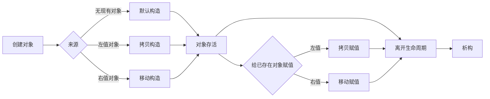


## 5.1 六大特殊成员函数

C++ 中常说的特殊成员函数包括：

```cpp
class A {
public:
    A();                         // 默认构造
    ~A();                        // 析构
    A(const A&);                 // 拷贝构造
    A& operator=(const A&);      // 拷贝赋值
    A(A&&) noexcept;             // 移动构造
    A& operator=(A&&) noexcept;  // 移动赋值
};
```

它们分别对应：

| 函数     | 场景                     |
| -------- | ------------------------ |
| 默认构造 | 创建对象                 |
| 析构函数 | 销毁对象                 |
| 拷贝构造 | 用已有对象初始化新对象   |
| 拷贝赋值 | 已存在对象之间赋值       |
| 移动构造 | 用右值初始化新对象       |
| 移动赋值 | 已存在对象从右值接管资源 |

---

## 5.2 初始化不是赋值

高频易错点：

```cpp
A b = a;
```

这是拷贝构造，不是拷贝赋值。

```cpp
A b;
b = a;
```

这才是拷贝赋值。

类似：

```cpp
A c = std::move(a);
```

这是移动构造，不是移动赋值。

```cpp
A c;
c = std::move(a);
```

这才是移动赋值。

---

## 5.3 拷贝省略

C++17 之后，某些场景强制拷贝省略：

```cpp
T make() {
    return T{};
}

T x = make();
```

这里通常不会发生移动或拷贝，直接在目标对象位置构造。

NRVO：

```cpp
T make() {
    T t;
    return t;
}
```

这叫 Named Return Value Optimization。编译器通常会优化掉拷贝/移动，但不是所有情况下强制。

---

## 5.4 隐式生成、删除与抑制规则

特殊成员函数是否由编译器隐式生成，不能只靠“六个函数都会自动出现”来理解。

关键规则可以概括为：

1. 只要声明了任意构造函数，编译器通常就不会再隐式生成默认构造函数；需要时应显式写 `A() = default;`。
2. 用户声明了拷贝构造、拷贝赋值或析构函数时，隐式移动构造和移动赋值通常不会生成。
3. 用户声明了移动构造或移动赋值后，隐式拷贝操作会被定义为删除。
4. 即使函数被声明或隐式生成，如果某个成员或基类不能执行对应操作，该函数也可能被定义为删除。
5. `= default` 表示请求编译器生成默认语义；`= delete` 表示明确禁止该操作。

```cpp
class FileHandle {
public:
    FileHandle() = default;

    FileHandle(const FileHandle&) = delete;
    FileHandle& operator=(const FileHandle&) = delete;

    FileHandle(FileHandle&&) noexcept = default;
    FileHandle& operator=(FileHandle&&) noexcept = default;
};
```

设计类时应明确回答：它是否可默认构造、可拷贝、可移动，以及这些操作的所有权语义是什么。

---

# 6. Rule of Three / Five / Zero

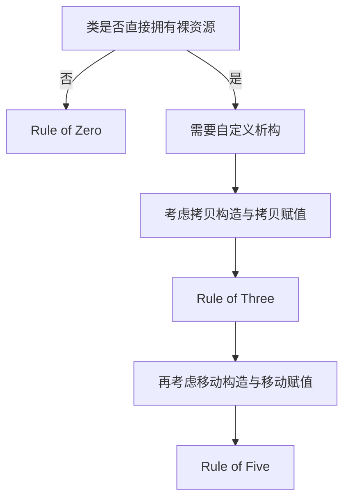


## 6.1 Rule of Three

如果一个类需要自己写以下任意一个：

1. 析构函数
2. 拷贝构造
3. 拷贝赋值

通常就需要同时考虑另外两个。

原因是：类大概率管理了资源。

错误例子：

```cpp
class Buffer {
public:
    Buffer(size_t n) : data_(new char[n]) {}
    ~Buffer() { delete[] data_; }

private:
    char* data_;
};
```

默认拷贝构造会浅拷贝指针：

```cpp
Buffer a(1024);
Buffer b = a; // a.data_ 和 b.data_ 指向同一块内存
```

最终会 double delete。

---

## 6.2 Rule of Five

C++11 加入移动语义后，如果类管理资源，通常要考虑五个函数：

```cpp
class Buffer {
public:
    Buffer(size_t n)
        : size_(n), data_(new char[n]) {}

    ~Buffer() {
        delete[] data_;
    }

    Buffer(const Buffer& other)
        : size_(other.size_), data_(new char[other.size_]) {
        std::copy(other.data_, other.data_ + size_, data_);
    }

    Buffer& operator=(const Buffer& other) {
        if (this == &other) {
            return *this;
        }

        char* new_data = new char[other.size_];
        std::copy(other.data_, other.data_ + other.size_, new_data);

        delete[] data_;
        data_ = new_data;
        size_ = other.size_;

        return *this;
    }

    Buffer(Buffer&& other) noexcept
        : size_(other.size_), data_(other.data_) {
        other.size_ = 0;
        other.data_ = nullptr;
    }

    Buffer& operator=(Buffer&& other) noexcept {
        if (this == &other) {
            return *this;
        }

        delete[] data_;

        size_ = other.size_;
        data_ = other.data_;

        other.size_ = 0;
        other.data_ = nullptr;

        return *this;
    }

private:
    size_t size_{0};
    char* data_{nullptr};
};
```

关键点：

1. 拷贝构造要深拷贝。
2. 拷贝赋值要处理自赋值。
3. 移动构造要偷资源，并把源对象置空。
4. 移动赋值要先释放自己的旧资源，再接管新资源。
5. 移动操作通常要 `noexcept`。

---

## 6.3 Rule of Zero

现代 C++ 更推荐 Rule of Zero：

> 类本身不直接管理裸资源，而是交给标准库类型管理。

比如：

```cpp
class Buffer {
public:
    explicit Buffer(size_t n) : data_(n) {}

private:
    std::vector<char> data_;
};
```

这样不需要手写析构、拷贝、移动。


> 如果业务类只是组合标准库资源管理类型，就尽量不要手写特殊成员函数，让编译器生成正确版本。

此外，自定义拷贝赋值要关注异常安全。常见方式是先构造新资源，成功后再替换旧状态，或者使用 copy-and-swap。移动赋值中的自移动虽然很少见，但实现应保持对象可析构且不泄漏。

---

# 7. RAII

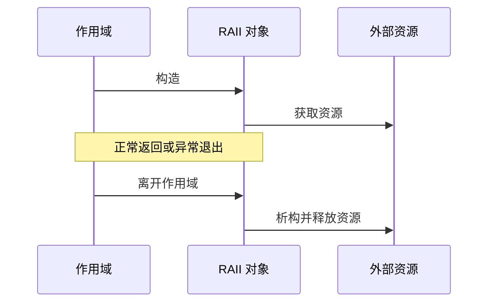


## 7.1 RAII 是什么

RAII：Resource Acquisition Is Initialization。

中文常翻译为：

> 资源获取即初始化。

核心思想：

1. 在构造函数中获取资源。
2. 在析构函数中释放资源。
3. 利用对象生命周期自动管理资源。

例子：

```cpp
#include <cstdio>
#include <stdexcept>
#include <utility>

class File {
public:
    explicit File(const char* path)
        : fp_(std::fopen(path, "r")) {
        if (fp_ == nullptr) {
            throw std::runtime_error("open file failed");
        }
    }

    ~File() noexcept {
        if (fp_ != nullptr) {
            // fclose 的失败应通过显式 close() 或日志处理；
            // 析构函数不能通过异常报告失败。
            std::fclose(fp_);
        }
    }

    File(const File&) = delete;
    File& operator=(const File&) = delete;

    File(File&& other) noexcept
        : fp_(std::exchange(other.fp_, nullptr)) {}

    File& operator=(File&& other) noexcept {
        if (this != &other) {
            if (fp_ != nullptr) {
                std::fclose(fp_);
            }
            fp_ = std::exchange(other.fp_, nullptr);
        }
        return *this;
    }

    std::FILE* get() const noexcept {
        return fp_;
    }

private:
    std::FILE* fp_{nullptr};
};
```

对于需要检查关闭错误的资源，可以提供显式 `close()` 返回错误，再让析构函数承担兜底释放职责。

---

## 7.2 RAII 管什么资源

不只是内存。

RAII 可以管理：

1. 堆内存。
2. 文件句柄。
3. socket。
4. mutex。
5. 数据库连接。
6. 线程。
7. GPU 资源。
8. 临时目录。
9. 日志上下文。
10. 事务回滚。

---

# 8. 智能指针

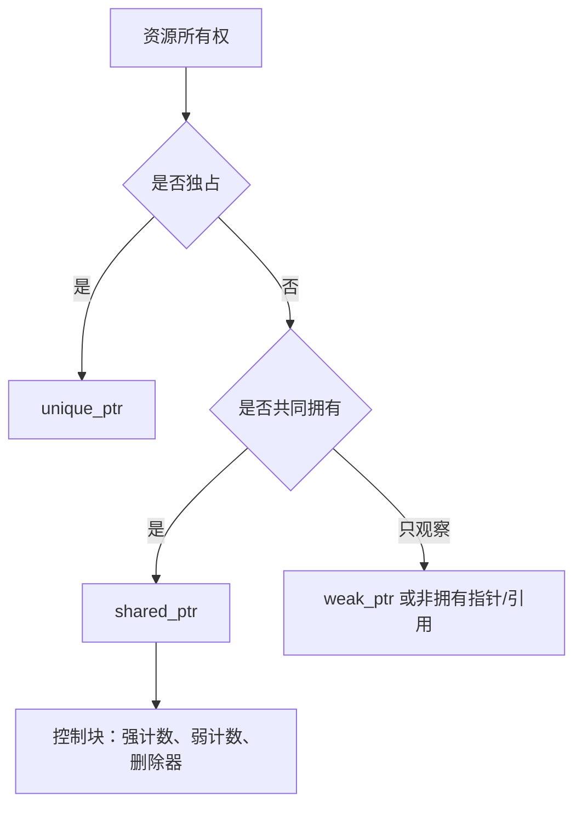


## 8.1 unique_ptr

`std::unique_ptr<T>` 表示独占所有权。

```cpp
std::unique_ptr<int> p = std::make_unique<int>(10);
```

特点：

1. 不能拷贝。
2. 可以移动。
3. 析构时调用删除器释放资源。
4. 使用无状态删除器时通常没有额外运行期所有权开销；有状态删除器可能增大对象尺寸。
5. `unique_ptr<T[]>` 用于数组，`unique_ptr<T, Deleter>` 可管理文件、句柄等非 `delete` 资源。

```cpp
std::unique_ptr<int> p1 = std::make_unique<int>(10);
// auto p2 = p1; // error

auto p2 = std::move(p1); // OK
```

适用场景：

1. 独占资源。
2. 工厂函数返回对象。
3. 多态对象所有权转移。

```cpp
std::unique_ptr<Base> create() {
    return std::make_unique<Derived>();
}
```

---

## 8.2 shared_ptr

`std::shared_ptr<T>` 表示共享所有权。

它内部通常包含：

1. 指向对象的指针。
2. 指向控制块的指针。

控制块通常包含：

1. 强引用计数。
2. 弱引用计数。
3. deleter。
4. allocator。
5. 可能的类型擦除信息。

```cpp
auto p1 = std::make_shared<int>(10);
auto p2 = p1; // 引用计数 +1
```

当最后一个拥有对象的 `shared_ptr` 被销毁，对象被释放；当强引用和弱引用相关状态都不再需要时，控制块才释放。

线程安全边界需要特别区分：

1. 多个不同的 `shared_ptr` 对象共享同一控制块时，引用计数更新是线程安全的。
2. 同一个 `shared_ptr` 变量被多个线程同时读写，仍需要同步，或使用相应的原子接口。
3. `shared_ptr` 不会自动保证它所指向业务对象的成员访问线程安全。

---

## 8.3 weak_ptr

`std::weak_ptr<T>` 表示弱引用，不增加强引用计数。

主要用途：

1. 打破 shared_ptr 循环引用。
2. 缓存对象但不拥有对象。
3. 观察对象是否还活着。

```cpp
std::weak_ptr<int> wp;

{
    auto sp = std::make_shared<int>(10);
    wp = sp;
}

if (auto sp = wp.lock()) {
    // 对象还活着
} else {
    // 对象已销毁
}
```

---

## 8.4 shared_ptr 循环引用

错误例子：

```cpp
struct Node {
    std::shared_ptr<Node> next;
    std::shared_ptr<Node> prev;
};
```

```cpp
auto a = std::make_shared<Node>();
auto b = std::make_shared<Node>();

a->next = b;
b->prev = a;
```

`a` 和 `b` 互相持有，引用计数永远不为 0。

修复：

```cpp
struct Node {
    std::shared_ptr<Node> next;
    std::weak_ptr<Node> prev;
};
```

一般规则：

> 拥有关系用 shared_ptr，非拥有观察关系用 weak_ptr。

---

## 8.5 make_shared 和 shared_ptr(new T)

推荐：

```cpp
auto p = std::make_shared<T>();
```

不推荐：

```cpp
std::shared_ptr<T> p(new T);
```

原因：

1. `make_shared` 通常把对象和控制块合并为一次分配。
2. `shared_ptr(new T)` 通常需要分别分配对象和控制块。
3. `make_shared` 写法更紧凑，能避免裸指针在复杂表达式中短暂暴露。
4. 合并分配通常有更好的局部性和更低的分配器开销。

但如果需要自定义删除器、必须控制对象和控制块的分配方式，或者对象很大且弱引用可能长期存活，直接构造 `shared_ptr` 或使用 `allocate_shared` 可能更合适。

但 `make_shared` 也有注意点：

如果存在 `weak_ptr`，即使对象已销毁，控制块还在。如果对象和控制块一次分配，整块内存可能要等 weak_ptr 全部销毁后才释放。

---

## 8.6 shared_ptr 不能从同一个裸指针构造两次

严重错误：

```cpp
int* raw = new int(10);

std::shared_ptr<int> p1(raw);
std::shared_ptr<int> p2(raw);
```

这里会产生两个控制块。

结果：

1. p1 认为自己拥有 raw。
2. p2 也认为自己拥有 raw。
3. 最后会 delete 两次。
4. 产生未定义行为。

正确：

```cpp
auto p1 = std::make_shared<int>(10);
auto p2 = p1;
```

---

## 8.7 enable_shared_from_this

错误例子：

```cpp
class A {
public:
    std::shared_ptr<A> getPtr() {
        return std::shared_ptr<A>(this);
    }
};
```

这会创建新的控制块，非常危险。

正确写法：

```cpp
class A : public std::enable_shared_from_this<A> {
public:
    std::shared_ptr<A> getPtr() {
        return shared_from_this();
    }
};
```

使用注意：

```cpp
auto p = std::make_shared<A>();
auto q = p->getPtr(); // OK
```

不能在对象还没有被 `shared_ptr` 管理时调用：

```cpp
A a;
// a.getPtr(); // error，可能抛 std::bad_weak_ptr
```

也不要在构造函数中调用 `shared_from_this()`，因为此时 shared_ptr 控制块还没有完全建立。

---

# 9. new/delete 与 malloc/free

## 9.1 区别

需要区分 **new 表达式** 与 **`operator new` 分配函数**：

1. new 表达式先调用合适的 `operator new` 获取原始存储，再在其中构造对象。
2. delete 表达式先调用析构函数，再调用匹配的 `operator delete` 释放存储。
3. `malloc/free` 只管理原始字节，不建立或结束 C++ 对象的构造/析构语义。

| 项目 | new/delete 表达式 | `malloc/free` |
| --- | --- | --- |
| 所属体系 | C++ 语言表达式 | C 标准库函数 |
| 构造函数 | new 表达式调用 | 不调用 |
| 析构函数 | delete 表达式调用 | 不调用 |
| 返回类型 | 返回相应类型指针 | 返回 `void*` |
| 默认失败行为 | 通常抛 `std::bad_alloc`；`std::nothrow` 版本返回空指针 | 返回 `nullptr` |
| 定制方式 | 可替换全局分配函数，也可定义类专属 `operator new/delete` | 可更换分配器，但不是 C++ 运算符重载 |

---

## 9.2 数组必须 delete[]

错误：

```cpp
int* p = new int[10];
delete p; // wrong
```

正确：

```cpp
delete[] p;
```

因为 `new[]` 和 `delete[]` 必须配对。

---

## 9.3 malloc 不构造对象

错误：

```cpp
A* p = static_cast<A*>(std::malloc(sizeof(A)));
std::free(p);
```

这不会调用构造和析构。

如果确实要在已分配内存上构造对象，要使用 placement new：

```cpp
void* mem = std::malloc(sizeof(A));
A* p = new (mem) A();

p->~A();
std::free(mem);
```

---

# 10. 虚函数、虚表、多态

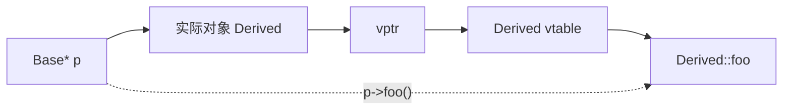


## 10.1 虚函数实现原理

典型实现：

1. 含虚函数的类有虚表 vtable。
2. 对象中有虚指针 vptr。
3. vptr 指向该对象实际类型对应的虚表。
4. 调用虚函数时，通过 vptr 找到虚表，再找到函数地址。

```cpp
Base* p = new Derived();
p->foo(); // 动态绑定，调用 Derived::foo
```

---

## 10.2 为什么基类析构函数要 virtual

错误：

```cpp
class Base {
public:
    ~Base() {}
};

class Derived : public Base {
public:
    ~Derived() {}
};

Base* p = new Derived();
delete p; // UB
```

如果通过基类指针删除派生类对象，而基类析构函数不是 virtual，会产生未定义行为。

正确：

```cpp
class Base {
public:
    virtual ~Base() = default;
};
```


> 如果类允许通过基类指针销毁派生对象，基类析构函数必须是 `virtual`。另一种设计是把基类析构函数设为 `protected` 且非虚，从接口层禁止通过基类指针执行 `delete`。

---

## 10.3 构造函数不能是 virtual

原因：

1. 构造对象时，对象还没有完全形成。
2. 虚函数依赖对象的动态类型。
3. 构造函数负责建立对象，包括 vptr。
4. 所以构造函数不能虚。

---

## 10.4 析构函数可以 virtual

析构函数可以是虚函数，而且多态基类通常必须是虚析构。

```cpp
class Base {
public:
    virtual ~Base() = default;
};
```

---

# 11. 构造析构中的虚函数行为


高频陷阱：

```cpp
class Base {
public:
    Base() { foo(); }
    virtual ~Base() { foo(); }

    virtual void foo() {
        std::cout << "Base::foo\n";
    }
};

class Derived : public Base {
public:
    void foo() override {
        std::cout << "Derived::foo\n";
    }
};

Derived d;
```

输出：

```text
Base::foo
Base::foo
```

原因：

1. 构造 Base 部分时，Derived 部分还没构造完成。
2. 析构 Base 部分时，Derived 部分已经析构完成。
3. 所以在 Base 构造/析构中调用虚函数，不会动态派发到 Derived。

结论：

> 构造和析构函数中调用虚函数，调用的是当前正在构造或析构的类版本，不会调用派生类版本。

---

## 11.1 避免在构造和析构阶段依赖虚分派

构造和析构期间的虚调用不会进入“尚未构造”或“已经析构”的派生部分。如果在构造或析构期间的虚调用最终分派到纯虚函数，行为未定义；即使纯虚函数在类外提供了函数体，也不应依赖这种调用路径。

更稳妥的设计包括：

1. 构造完成后再调用虚函数。
2. 使用工厂函数执行“两阶段初始化”。
3. 将基类构造所需行为通过普通参数、策略对象或非虚辅助函数传入。

---

## 11.2 对象切片与 RTTI

```cpp
struct Base {
    virtual ~Base() = default;
    virtual void run() const {}
};

struct Derived : Base {
    int extra = 42;
    void run() const override {}
};

void consume(Base value); // 按值接收会切片

Derived d;
consume(d); // 只复制 Base 子对象，Derived 部分丢失
```

需要保留多态时，应使用引用或指针：

```cpp
void consume(const Base& value);
```

`dynamic_cast` 用于多态层级中的运行期安全向下转换：

```cpp
if (auto* derived = dynamic_cast<Derived*>(base_ptr)) {
    use(*derived);
}
```

对指针转换失败返回 `nullptr`；对引用转换失败抛出 `std::bad_cast`。如果程序能够通过虚函数接口完成工作，通常应优先使用多态接口而不是频繁向下转换。

---

# 12. 重载、重写、隐藏

## 12.1 overload

重载发生在同一作用域，函数名相同，参数不同。

```cpp
void f(int);
void f(double);
```

---

## 12.2 override

重写发生在继承体系中：

```cpp
class Base {
public:
    virtual void f(int);
};

class Derived : public Base {
public:
    void f(int) override;
};
```

推荐永远写 `override`，让编译器帮你检查。

---

## 12.3 name hiding

派生类中声明同名函数，会隐藏基类所有同名函数。

```cpp
class Base {
public:
    virtual void foo(int);
};

class Derived : public Base {
public:
    void foo(double);
};
```

此时：

```cpp
Derived d;
d.foo(1); // 调用 Derived::foo(double)
```

`Base::foo(int)` 被隐藏了。

修复：

```cpp
class Derived : public Base {
public:
    using Base::foo;

    void foo(double);
};
```

---

# 13. 对象模型与内存布局

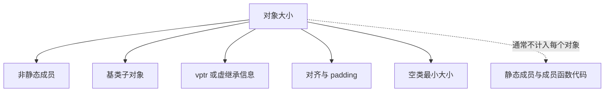


## 13.1 类对象大小由什么决定

C++ 标准规定对象语义和若干布局约束，但不会统一规定普通类、虚表和虚继承的具体内存布局。下面内容描述主流 ABI 的典型实现。

影响因素：

1. 非静态数据成员。
2. 基类子对象。
3. 虚函数带来的 vptr。
4. 虚继承带来的额外指针或偏移信息。
5. 内存对齐和 padding。
6. 空类大小。
7. `[[no_unique_address]]`。
8. 编译器 ABI。

不影响每个对象大小的通常有：

1. 静态成员变量。
2. 普通成员函数。
3. 静态成员函数。
4. 非虚函数代码。

---

## 13.2 空类大小

```cpp
struct A {};
```

空类大小通常是 1。

原因：

> C++ 要求不同对象有不同地址，所以空对象也必须占至少 1 字节。

```cpp
A a1, a2;
assert(&a1 != &a2);
```

---

## 13.3 空基类优化 EBO

```cpp
struct Empty {};

struct X : Empty {
    int value;
};
```

`sizeof(X)` 通常是 4，不是 5 或 8。

因为编译器可以对空基类做 Empty Base Optimization。

---

## 13.4 对齐示例

```cpp
struct S {
    char a;
    int b;
    char c;
};
```

在 64 位系统常见布局：

```text
a: 1
padding: 3
b: 4
c: 1
tail padding: 3
total: 12
```

优化：

```cpp
struct S {
    int b;
    char a;
    char c;
};
```

布局：

```text
b: 4
a: 1
c: 1
tail padding: 2
total: 8
```

---

# 14. STL 容器：vector、deque、list

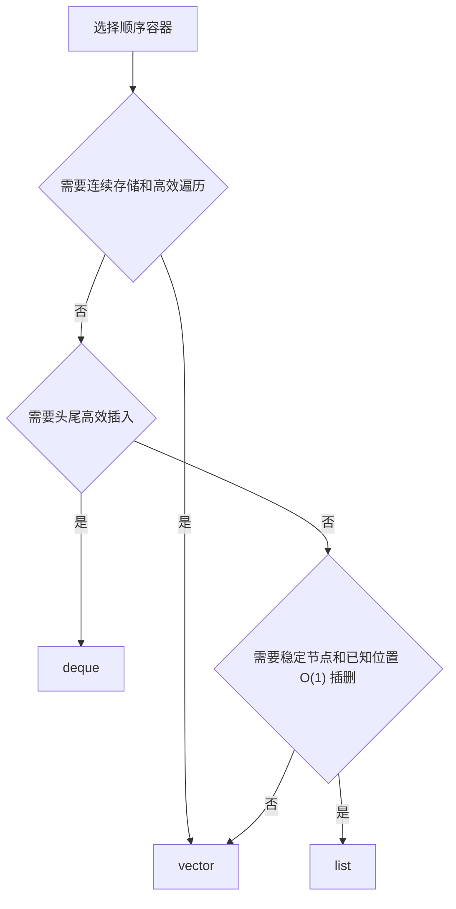


## 14.1 vector

底层：连续动态数组。

优点：

1. 随机访问 O(1)。
2. 尾部插入均摊 O(1)。
3. 缓存友好。
4. 内存开销小。

缺点：

1. 中间插入删除 O(n)。
2. 扩容会搬迁元素。
3. 扩容导致迭代器、指针、引用失效。

---

## 14.2 list

底层：双向链表。

优点：

1. 已知位置插入删除 O(1)。
2. 插入删除通常不影响其他元素迭代器。

缺点：

1. 不支持随机访问。
2. 每个节点额外存前后指针。
3. 缓存不友好。
4. 实际遍历性能通常差。

---

## 14.3 deque

底层：分段连续数组。

优点：

1. 支持随机访问。
2. 头尾插入删除 O(1)。
3. 比 vector 更适合双端队列。

缺点：

1. 不完全连续。
2. 中间插入删除代价高。
3. 迭代器结构更复杂。
4. 缓存局部性通常不如 vector。

---

## 14.4 vector 扩容

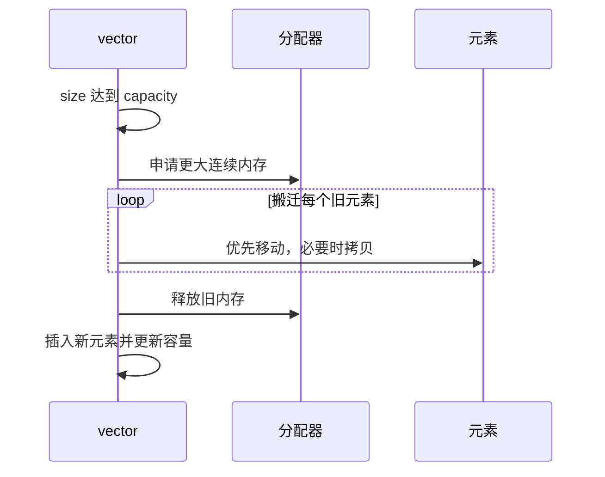


当 size 达到 capacity，再插入元素时：

1. 分配更大内存。
2. 将旧元素移动或拷贝到新内存。
3. 析构旧元素。
4. 释放旧内存。
5. 插入新元素。

为什么通常按几何级数增长？

因为几何增长可以保证尾插的均摊复杂度为 O(1)。增长因子由标准库实现决定，标准并不要求必须翻倍。

如果容量每次只增加一个元素，连续执行 `push_back` 会反复搬迁已有元素，总成本可能退化为 O(n²)。

---

## 14.5 vector 扩容时移动还是拷贝

如果类型的移动构造是 `noexcept`，vector 通常优先移动。

```cpp
struct A {
    A(A&&) noexcept;
};
```

如果移动构造可能抛异常，而拷贝构造可用，vector 可能选择拷贝，以保证异常安全。

因此：

> 移动构造函数应该在语义上确实不会抛出异常时标记为 `noexcept`。

---

## 14.6 `reserve` 与 `resize`

```cpp
std::vector<int> values;

values.reserve(100); // capacity 至少为 100，size 仍为 0
values.resize(100);  // size 变为 100，实际构造 100 个元素
```

- `reserve()` 只调整容量，不创建可访问元素。
- `resize()` 改变元素数量，可能构造或销毁元素。
- 执行 `reserve()` 发生重新分配时，已有迭代器、指针和引用会失效。
- `shrink_to_fit()` 只是非强制请求，标准库可以不缩容。

不要在只预留空间后直接使用 `operator[]` 写入尚不存在的元素。

---

# 15. map 与 unordered_map

## 15.1 map

`std::map` 通常基于红黑树。

特点：

1. key 有序。
2. 查找 O(log n)。
3. 插入 O(log n)。
4. 删除 O(log n)。
5. 迭代器稳定性好。
6. 支持范围查询。

适合：

1. 需要按 key 有序遍历。
2. 需要 lower_bound / upper_bound。
3. 对最坏复杂度敏感。

---

## 15.2 unordered_map

`std::unordered_map` 基于哈希表。

特点：

1. key 无序。
2. 平均查找 O(1)。
3. 最坏查找 O(n)。
4. rehash 会导致迭代器失效。
5. 需要 hash 和相等比较。

适合：

1. 高频查找。
2. 不要求顺序。
3. key 哈希质量较好。

---

## 15.3 自定义 key

```cpp
struct Point {
    int x;
    int y;

    bool operator==(const Point& other) const {
        return x == other.x && y == other.y;
    }
};

struct PointHash {
    std::size_t operator()(const Point& p) const {
        std::size_t h1 = std::hash<int>{}(p.x);
        std::size_t h2 = std::hash<int>{}(p.y);
        return h1 ^ (h2 << 1);
    }
};

std::unordered_map<Point, int, PointHash> mp;
```

需要：

1. hash 函数。
2. 相等比较。

---

# 16. 迭代器失效

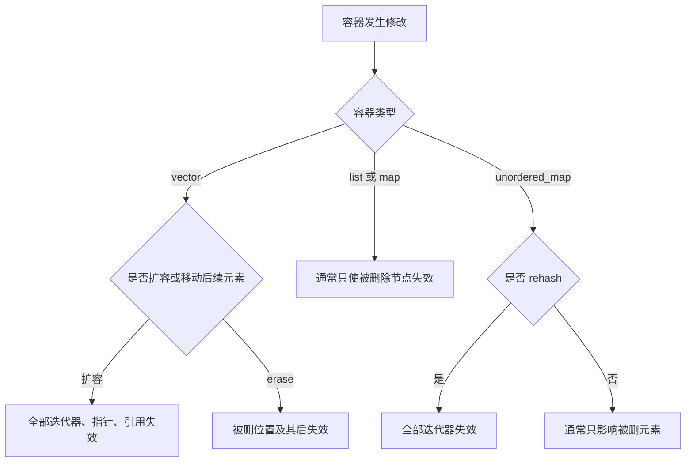


## 16.1 vector

`push_back`：

1. 如果不扩容，end 迭代器失效。
2. 如果扩容，所有迭代器、引用、指针失效。

`erase`：

1. 被删元素及其之后的迭代器失效。
2. 返回下一个有效迭代器。

正确删除：

```cpp
for (auto it = v.begin(); it != v.end(); ) {
    if (*it == 3) {
        it = v.erase(it);
    } else {
        ++it;
    }
}
```

---

## 16.2 list

插入删除不会影响其他元素的迭代器。

删除元素本身的迭代器失效。

---

## 16.3 map

插入通常不影响已有迭代器。

删除只影响被删元素的迭代器。

---

## 16.4 unordered_map

插入可能触发 rehash。

1. rehash 会使所有迭代器失效。
2. rehash 不会使指向已有元素的引用和指针失效；这是标准容器语义，不只是实现习惯。
3. 删除只使指向被删除元素的迭代器、引用和指针失效。
4. 可以使用 `reserve()` 和 `max_load_factor()` 提前控制 rehash 风险。

需要区分：**迭代器失效不等于元素对象搬迁或引用必然失效。**

---

## 16.5 deque

`deque` 的失效规则比 `vector` 和 `list` 更复杂：

1. 在头部或尾部插入通常会使所有迭代器失效，但不会使指向既有元素的引用和指针失效。
2. 在中间插入会使所有迭代器、引用和指针失效。
3. 在头部或尾部删除时，通常只有被删除元素的引用和迭代器失效，但过去的 `end()` 也可能变化。
4. 在中间删除会使相关迭代器、引用和指针广泛失效。

> 对 `deque` 不要用一句“和 vector 类似”概括。长期保存迭代器之前，应按具体操作查标准库契约；修改后优先使用操作返回的新迭代器。

---

# 17. STL 算法与 lambda

## 17.1 remove 不是真删除

```cpp
std::remove(v.begin(), v.end(), 3);
```

`remove` 只是把不删除的元素往前移动，返回新的逻辑末尾。

正确：

```cpp
v.erase(std::remove(v.begin(), v.end(), 3), v.end());
```

这叫 erase-remove idiom。

C++20 可以：

```cpp
std::erase(v, 3);
```

---

## 17.2 lambda 捕获

```cpp
[=]     // 默认按值捕获被使用的局部自动变量
[&]     // 默认按引用捕获被使用的局部自动变量
[x]     // 按值捕获 x
[&x]    // 按引用捕获 x
[this]  // 捕获 this 指针，不会复制整个对象
[*this] // C++17，按值捕获当前对象副本
```

在成员函数中，`[=]` 隐式捕获 `this` 容易造成误解；C++20 已弃用通过 `[=]` 隐式捕获 `this` 的写法。异步回调中应明确写 `[this]`、`[*this]`，或捕获 `weak_ptr`，让生命周期意图可见。

危险例子：

```cpp
std::function<int()> makeFunc() {
    int x = 10;
    return [&]() {
        return x;
    };
}
```

返回后 x 已销毁，lambda 中引用悬垂。

正确：

```cpp
std::function<int()> makeFunc() {
    int x = 10;
    return [x]() {
        return x;
    };
}
```

按值捕获的成员在 lambda 默认生成的 `operator() const` 中不可修改。需要修改捕获副本时使用 `mutable`：

```cpp
auto counter = [value = 0]() mutable {
    return ++value;
};
```

`mutable` 只允许修改 lambda 自己保存的副本，不会修改原始局部变量。

---

## 17.3 捕获 this 的风险

```cpp
class A {
public:
    std::function<void()> f() {
        return [this] {
            use();
        };
    }

    void use() {}
};
```

如果 lambda 执行时对象已销毁，`this` 悬垂。

可改为：

```cpp
class A : public std::enable_shared_from_this<A> {
public:
    std::function<void()> f() {
        std::weak_ptr<A> wp = shared_from_this();

        return [wp] {
            if (auto sp = wp.lock()) {
                sp->use();
            }
        };
    }

    void use() {}
};
```

---

# 18. 模板基础

## 18.1 模板什么时候实例化

模板不是普通函数。模板本身是生成代码的蓝图。

```cpp
template <typename T>
T add(T a, T b) {
    return a + b;
}
```

当使用时：

```cpp
add<int>(1, 2);
add<double>(1.0, 2.0);
```

编译器为不同类型实例化不同版本。

---

## 18.2 为什么模板通常放头文件

因为编译器实例化模板时需要看到完整定义。

如果只有声明：

```cpp
template <typename T>
T add(T a, T b);
```

调用处无法实例化实现。

所以模板通常写在头文件里。

例外：显式实例化。

```cpp
template int add<int>(int, int);
```

---

## 18.3 模板特化

通用模板：

```cpp
template <typename T>
struct TypeName {
    static constexpr const char* value = "unknown";
};
```

全特化：

```cpp
template <>
struct TypeName<int> {
    static constexpr const char* value = "int";
};
```

偏特化：

```cpp
template <typename T>
struct TypeName<T*> {
    static constexpr const char* value = "pointer";
};
```

函数模板不能偏特化，只能重载或全特化。

---

# 19. 完美转发、万能引用、引用折叠

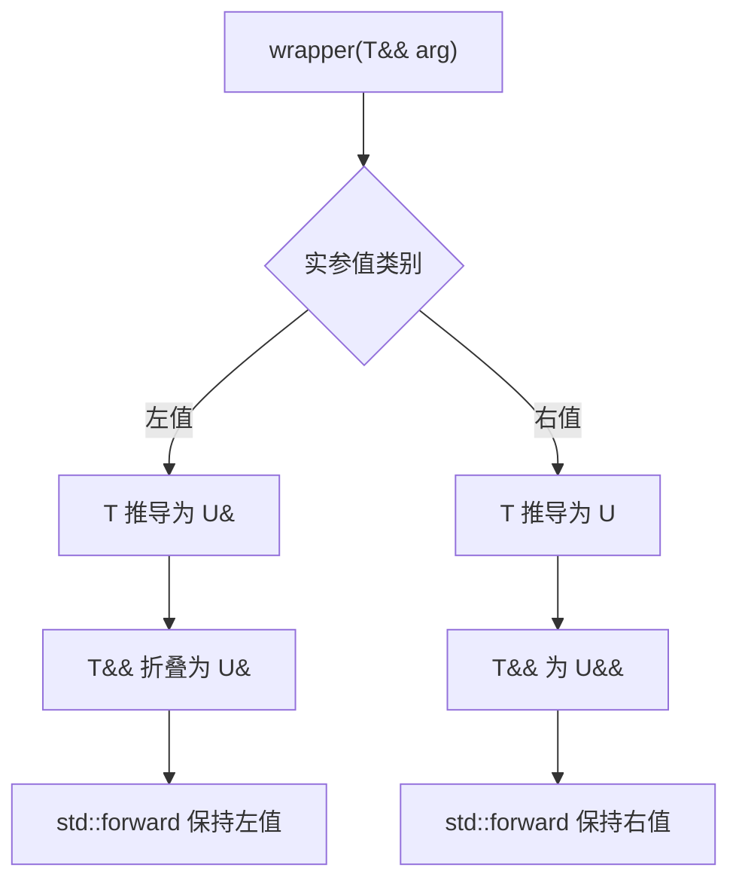


## 19.1 万能引用 / 转发引用

```cpp
template <typename T>
void f(T&& x);
```

这里 `T&&` 在模板参数推导场景下是 forwarding reference。

如果传左值：

```cpp
int a = 10;
f(a);
```

T 推导为 `int&`，`T&&` 折叠为 `int&`。

如果传右值：

```cpp
f(10);
```

T 推导为 `int`，`T&&` 是 `int&&`。

---

## 19.2 引用折叠规则

核心规则：

```text
&  + &  -> &
&  + && -> &
&& + &  -> &
&& + && -> &&
```

只要有一个是左值引用，结果就是左值引用。

---

## 19.3 std::forward 与 std::move

`std::move(x)`：

> 无条件把 x 转为右值。

`std::forward<T>(x)`：

> 有条件转发，保留原始实参的左值/右值属性。

错误包装：

```cpp
template <typename T>
void wrapper(T&& arg) {
    process(arg); // arg 有名字，是左值
}
```

正确：

```cpp
template <typename T>
void wrapper(T&& arg) {
    process(std::forward<T>(arg));
}
```

---

## 19.4 emplace_back 是否一定更快

```cpp
v.push_back(T(args...));
v.emplace_back(args...);
```

`emplace_back` 可以在容器内部直接构造对象，避免临时对象。

但不一定更快：

1. 如果传入的本来就是 T 对象，push_back(std::move(obj)) 很清晰。
2. 编译器可能消除临时对象。
3. emplace_back 可能调用意外的构造函数。
4. 可读性有时不如 push_back。

建议：

```cpp
v.emplace_back(arg1, arg2);    // 需要原地构造
v.push_back(std::move(obj));   // 已经有对象
```

---

# 20. SFINAE、type traits、concepts


## 20.1 SFINAE 是什么

SFINAE：Substitution Failure Is Not An Error。

意思是：

> 在模板参数替换的“立即上下文”中发生失败时，不把它作为整个程序的硬错误，而是把对应模板从候选集中移除。

函数体实例化中的错误、访问控制错误以及替换完成后才触发的某些错误，不一定属于 SFINAE。

例子：

```cpp
template <typename T>
auto has_size_impl(int) -> decltype(std::declval<T>().size(), std::true_type{});

template <typename T>
std::false_type has_size_impl(...);

template <typename T>
using has_size = decltype(has_size_impl<T>(0));
```

意图：

1. 优先匹配第一个函数。
2. 如果 `T` 有 `.size()`，第一个函数合法，返回 true_type。
3. 如果 `T` 没有 `.size()`，替换失败，不报错，选择第二个函数，返回 false_type。

---

## 20.2 enable_if

```cpp
template <typename T>
std::enable_if_t<std::is_integral_v<T>, void>
print(T x) {
    std::cout << "integer\n";
}
```

只有当 `T` 是整数类型时，这个模板才参与重载决议。

---

## 20.3 if constexpr

C++17 更推荐：

```cpp
template <typename T>
void print(const T& x) {
    if constexpr (std::is_integral_v<T>) {
        std::cout << "integer\n";
    } else {
        std::cout << "other\n";
    }
}
```

`if constexpr` 不选择的分支会被丢弃，不会针对当前模板实参实例化其中的依赖代码。但分支仍必须能够被解析，完全不依赖模板参数的语法或语义错误仍可能直接报错。

---

## 20.4 concepts

C++20 concepts：

```cpp
template <typename T>
concept HasSize = requires(T t) {
    t.size();
};

template <HasSize T>
void print_size(const T& t) {
    std::cout << t.size() << '\n';
}
```

优势：

1. 语义清楚。
2. 错误信息更好。
3. 约束直接写在接口上。
4. 替代复杂 SFINAE。


> concepts 是对模板参数能力的显式约束，使泛型代码更可读、更容易诊断错误。

---

# 21. 异常安全与 noexcept

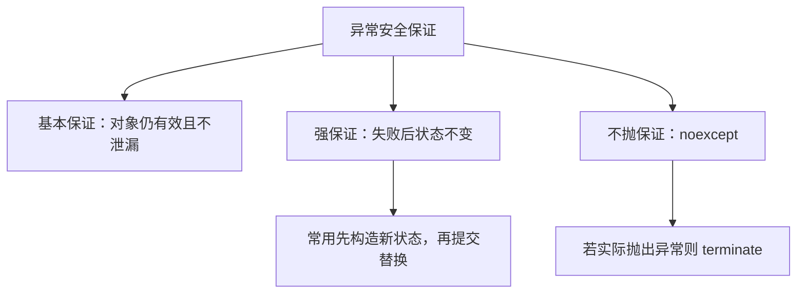


## 21.1 C++ 异常 vs 错误码

异常优点：

1. 错误处理和正常逻辑分离。
2. 可以跨多层调用传播错误。
3. 构造函数失败只能靠异常自然表达。
4. 配合 RAII 可以自动清理资源。

异常缺点：

1. 控制流不直观。
2. ABI 和性能模型更复杂。
3. 不适合某些实时系统。
4. 析构中处理不当会导致 terminate。

错误码优点：

1. 控制流明确。
2. ABI 简单。
3. 常用于系统编程和 C 接口。

错误码缺点：

1. 容易忘记检查。
2. 错误处理代码侵入主逻辑。
3. 构造函数表达失败不自然。

---

## 21.2 异常安全保证

### 基本保证

异常发生后，对象仍然保持有效状态，不泄漏资源，但值可能改变。

### 强保证

异常发生后，程序状态不变，就像操作没发生。

### 不抛保证

函数承诺不抛异常。

```cpp
void f() noexcept;
```

---

## 21.3 析构函数为什么不应该抛异常

如果异常传播过程中发生栈展开，局部对象会析构。

如果析构函数又抛异常，就会同时存在两个未处理异常，程序调用 `std::terminate()`。

所以析构函数应尽量 `noexcept`。

```cpp
~A() noexcept {
    try {
        cleanup();
    } catch (...) {
        // 记录日志，不能继续抛
    }
}
```

---

## 21.4 noexcept 的作用

`noexcept` 表示函数承诺异常不会逃出该函数。

作用：

1. 文档化接口契约，并参与函数类型和泛型约束。
2. 让标准库能够使用 `std::move_if_noexcept` 等策略选择移动或拷贝。
3. 在部分场景中为编译器提供更明确的控制流信息，但不能简单理解为“加上就一定更快”。
4. 如果异常逃出 `noexcept` 函数，程序调用 `std::terminate()`。

---

## 21.5 移动构造为什么要 noexcept

vector 扩容时需要搬迁元素。

如果移动构造可能抛异常，vector 为了提供强异常安全保证，可能选择拷贝而不是移动。

```cpp
struct A {
    A(A&&) noexcept;
};
```

建议：

> 资源接管型移动构造一般不会抛异常，应标记 noexcept。

---

# 22. 并发基础：thread、mutex、lock

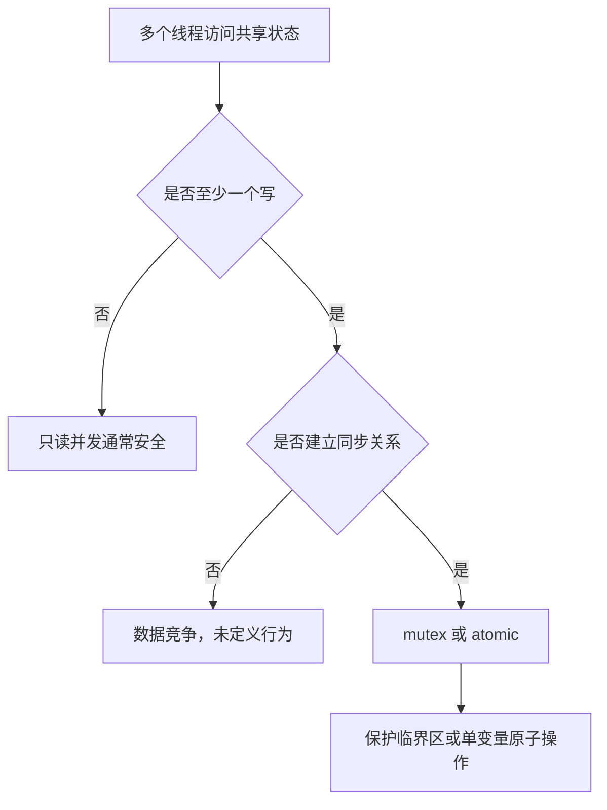


## 22.1 数据竞争

多个线程同时访问同一内存位置，至少一个是写，并且没有同步，就发生数据竞争。

数据竞争是未定义行为。

错误：

```cpp
int counter = 0;

void f() {
    ++counter;
}
```

多个线程同时执行会数据竞争。

修复：

```cpp
std::mutex m;
int counter = 0;

void f() {
    std::lock_guard<std::mutex> lock(m);
    ++counter;
}
```

或者：

```cpp
std::atomic<int> counter{0};

void f() {
    ++counter;
}
```

---

## 22.2 mutex 手动 lock/unlock 的问题

错误：

```cpp
m.lock();
doSomething();
m.unlock();
```

如果 `doSomething()` 抛异常，unlock 不会执行。

正确：

```cpp
std::lock_guard<std::mutex> lock(m);
doSomething();
```

RAII 保证离开作用域自动解锁。

---

## 22.3 lock_guard、unique_lock、scoped_lock

| 类型        | 特点                                                             |
| ----------- | ---------------------------------------------------------------- |
| lock_guard  | 最简单，构造加锁，析构解锁，不能手动 unlock                      |
| unique_lock | 更灵活，可延迟加锁、手动 unlock、移动，condition_variable 需要它 |
| scoped_lock | C++17，可一次锁多个 mutex，避免死锁                              |

例子：

```cpp
std::lock_guard<std::mutex> lock(m);
```

```cpp
std::unique_lock<std::mutex> lock(m);
lock.unlock();
lock.lock();
```

```cpp
std::scoped_lock lock(m1, m2);
```

---

## 22.4 死锁

典型死锁：

```cpp
// thread 1
lock(m1);
lock(m2);

// thread 2
lock(m2);
lock(m1);
```

避免方式：

1. 固定全局加锁顺序。
2. 使用 `std::scoped_lock(m1, m2)` 或 `std::lock` 一次协调多把锁。
3. 减少锁粒度和持锁时间。
4. 不在持锁时调用未知外部代码、阻塞 I/O 或用户回调。
5. 使用 `try_lock` 做非阻塞尝试；需要超时时应使用 `std::timed_mutex`、`std::unique_lock::try_lock_for` 等具备计时能力的接口。
6. 用 RAII 管理锁。

---

# 23. condition_variable

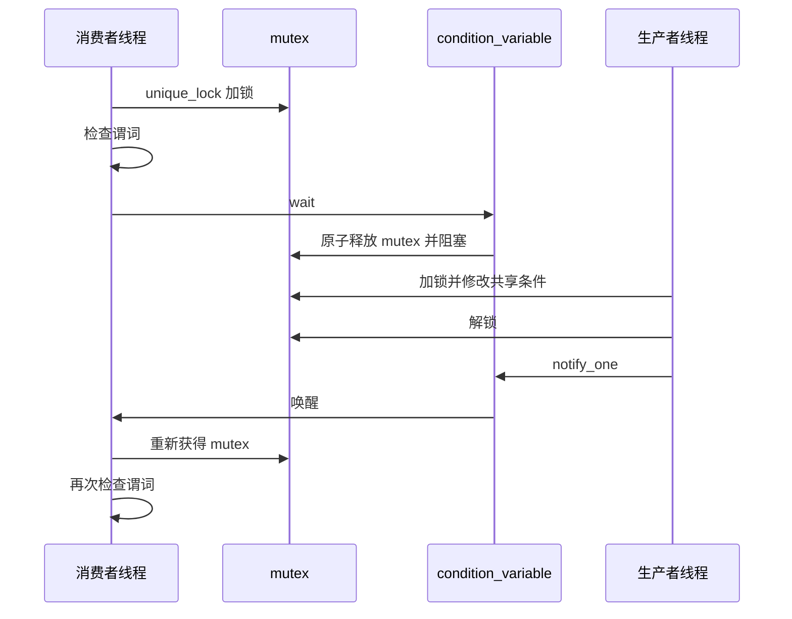


## 23.1 wait 为什么要配合谓词

条件变量本身不保存“事件”，真正的条件必须保存在受互斥锁保护的共享状态中。需要谓词的原因包括：

1. 可能发生虚假唤醒。
2. 通知发生时如果没有等待者，通知不会被条件变量记住；但只要谓词状态被正确保存，后来的线程会直接观察到条件已经成立。
3. 多个消费者被唤醒后，条件可能已经被其他线程消耗。
4. 线程从等待中返回前还要重新获得互斥锁，此时共享状态可能再次变化。

错误：

```cpp
cv.wait(lock);
if (ready) {
    consume();
}
```

正确：

```cpp
cv.wait(lock, [] {
    return ready;
});
consume();
```

等价于：

```cpp
while (!ready) {
    cv.wait(lock);
}
```

---

## 23.2 producer/consumer 正确写法

```cpp
std::mutex m;
std::condition_variable cv;
bool ready = false;

void consumer() {
    std::unique_lock<std::mutex> lock(m);
    cv.wait(lock, [] {
        return ready;
    });
    consume();
}

void producer() {
    {
        std::lock_guard<std::mutex> lock(m);
        ready = true;
    }
    cv.notify_one();
}
```

关键点：

1. 修改共享变量 ready 要加锁。
2. wait 要用谓词。
3. notify 可以在解锁后调用，减少被唤醒线程再次阻塞的概率。

---

# 24. atomic 与内存模型

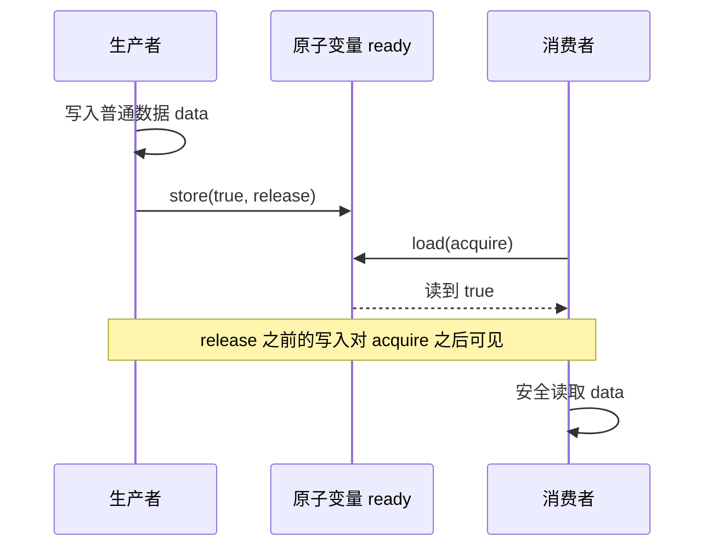


## 24.1 atomic 和 mutex 的区别

`std::atomic<T>`：

1. 对该原子对象提供不可分割的原子操作和明确的内存序语义。
2. 接口不要求调用者显式使用互斥锁，但实现内部不一定无锁；可用 `is_lock_free()` 查询。
3. 适合计数器、状态标志、引用计数和经过严格论证的无锁结构。
4. 不能自动维护多个独立变量之间的复合不变量。
5. 原子性只作用于相应原子对象，不会自动让周围普通变量线程安全。

主模板 `std::atomic<T>` 对 `T` 有相应的类型约束，普通用户自定义类型通常需要满足平凡可复制等要求。即使类型可用于 `atomic`，也不保证实现为硬件无锁。

`mutex`：

1. 保护临界区。
2. 可以保护多个变量之间的不变量。
3. 可能阻塞。
4. 使用更直观。

---

## 24.2 memory_order_relaxed

只保证原子性，不保证同步顺序。

```cpp
counter.fetch_add(1, std::memory_order_relaxed);
```

适合统计计数，不用于发布数据。

---

## 24.3 release/acquire

release 用于发布数据：

```cpp
data = 42;
ready.store(true, std::memory_order_release);
```

acquire 用于获取数据：

```cpp
while (!ready.load(std::memory_order_acquire)) {}
std::cout << data;
```

如果 acquire 读到了 release 写入的值，则 release 之前的写入对 acquire 之后可见。

所以下面代码一定输出 42：

```cpp
std::atomic<bool> ready{false};
int data = 0;

void producer() {
    data = 42;
    ready.store(true, std::memory_order_release);
}

void consumer() {
    while (!ready.load(std::memory_order_acquire)) {}
    std::cout << data << std::endl;
}
```

前提是没有其他数据竞争修改 data。

---

## 24.4 acq_rel

用于读改写操作，例如：

```cpp
flag.exchange(true, std::memory_order_acq_rel);
```

同时具有 acquire 和 release 语义。

---

## 24.5 seq_cst

最强内存序。

```cpp
x.store(1, std::memory_order_seq_cst);
```

默认 atomic 操作就是 seq_cst。

优点：

1. 最容易建立直观推理。
2. 所有 `seq_cst` 操作参与一个与相应 happens-before 关系一致的单一全序。

缺点：

1. 某些架构上可能需要更强的屏障或限制重排，成本可能更高。
2. 这个“单一全序”只针对 `seq_cst` 原子操作，不意味着所有普通内存访问都自动获得全局顺序。


> 除非非常理解内存模型，否则业务代码优先使用 mutex 或默认 seq_cst。relaxed/acquire/release 要有明确理由。

---

## 24.6 happens-before、synchronizes-with 与修改顺序

判断普通内存访问是否合法，核心不是“两个线程是否同时执行”，而是冲突访问之间是否存在 **happens-before** 关系。

常见建立方式：

1. 互斥锁的解锁与之后成功获得同一把锁之间建立同步。
2. 线程创建前的操作对新线程可见；线程结束前的操作在成功 `join()` 后对调用者可见。
3. acquire 操作读到对应 release 写入或其 release sequence 时，二者建立同步。
4. 同一原子对象的所有修改具有单独的 modification order。

没有 happens-before 的冲突普通访问会形成数据竞争，从而导致未定义行为。

---

## 24.7 compare_exchange、伪失败与 ABA

原子比较交换常用于无锁算法：

```cpp
T expected = old_value;
while (!value.compare_exchange_weak(
    expected,
    new_value,
    std::memory_order_acq_rel,
    std::memory_order_acquire)) {
    // 失败后 expected 会被更新为当前值
}
```

`compare_exchange_weak` 允许伪失败，适合循环；`compare_exchange_strong` 通常用于不希望伪失败的一次性判断。

CAS 能保证单次比较交换原子性，但不能自动解决 ABA 问题：值可能经历 `A -> B -> A`，CAS 只看到最终仍为 A。常见应对方式包括版本号、带标签指针或安全内存回收方案。

---

## 24.8 volatile 不是线程同步工具

C++ 中 `volatile` 主要用于表达某些需要观察实际读写的对象，例如内存映射 I/O。它不提供：

1. 原子性；
2. 线程间可见性保证；
3. happens-before；
4. 互斥或内存屏障语义。

线程同步应使用 `std::atomic`、互斥锁或其他并发原语，不能用 `volatile bool` 替代原子标志。

---

# 25. C++17/20 常见特性

## 25.1 auto 类型推导

`auto` 会丢掉顶层 const 和引用。

```cpp
const int x = 10;
auto a = x; // int，不是 const int

int& r = a;
auto b = r; // int，不是 int&
```

想保留引用：

```cpp
auto& c = r;
```

在类型推导语境中，`auto&&` 可以成为转发引用，并按照实参值类别发生引用折叠：

```cpp
auto&& d = expr;
```

需要精确保留表达式的类型和值类别时，可以使用 `decltype(auto)`：

```cpp
decltype(auto) result = (x); // x 为左值时推导为引用
```

---

## 25.2 decltype

```cpp
int x = 10;

decltype(x) a = 1;   // int
decltype((x)) b = x; // int&
```

规则：

1. `decltype(x)` 如果 x 是未加括号的变量名，得到声明类型。
2. `decltype((x))` 中 `(x)` 是左值表达式，得到 `T&`。

---

## 25.3 move-only 类型

只能移动，不能拷贝的类型。

例子：

```cpp
std::unique_ptr<int>
std::thread
std::mutex
std::fstream
```

原因：

它们表示独占资源，拷贝会导致所有权不清。

---

## 25.4 structured binding

```cpp
std::pair<int, std::string> p{1, "hello"};

auto [id, name] = p;
```

注意拷贝：

```cpp
auto [id, name] = p;   // 拷贝
auto& [rid, rname] = p; // 引用
```

---

## 25.5 if initializer

```cpp
if (auto it = mp.find(key); it != mp.end()) {
    use(it->second);
}
```

---

# 26. optional、variant、any、string_view、span

## 26.1 optional

表示“可能有值，也可能没有值”。

```cpp
std::optional<int> find_id(const std::string& name);
```

使用：

```cpp
auto id = find_id("Tom");
if (id) {
    std::cout << *id;
}
```

适合替代：

1. 特殊哨兵值，例如 `-1`。
2. 部分输出参数。
3. “可能没有结果”的值语义。

`optional<T>` 表示可选的 **T 对象**，不是拥有关系工具，也不能直接存放引用类型。若要表达可空观察关系，指针有时更自然。

---

## 26.2 variant

类型安全的 union。

```cpp
std::variant<int, std::string> v;

v = 10;
v = "hello";
```

访问：

```cpp
std::visit([](auto&& value) {
    std::cout << value;
}, v);
```

适合：

1. 一个值可能是有限几种类型之一。
2. 替代继承层级。
3. 表达状态机。

---

## 26.3 any

可以存任意类型。

```cpp
std::any a = 10;
a = std::string("hello");
```

访问：

```cpp
auto s = std::any_cast<std::string>(a);
```

适合：

1. 插件系统。
2. 异构属性表。
3. 类型不固定但运行期能处理。

缺点：

1. 类型安全较弱。
2. 运行时检查。
3. 滥用会降低可维护性。

---

## 26.4 string_view

非拥有字符串视图。

优点：

1. 不拷贝字符串。
2. 可表示字符串子串。
3. 函数参数更灵活。

```cpp
void print(std::string_view sv);
```

风险：

```cpp
std::string_view getName() {
    std::string s = "hello";
    return s; // dangling
}
```

正确：

```cpp
std::string getName() {
    return "hello";
}
```

或者确保底层字符序列生命周期更长。

还要注意：

1. `string_view` 不保证以 `\0` 结尾，不能无条件把 `data()` 传给要求 C 字符串的接口。
2. 对底层 `std::string` 执行扩容、销毁或改变相关内容后，已有视图可能悬垂或内容改变。
3. `substr()` 返回的仍是视图，不拥有字符。

---

## 26.5 span

`std::span<T>` 是连续内存的非拥有视图。

```cpp
void process(std::span<int> data) {
    for (int& x : data) {
        ++x;
    }
}
```

可以接受：

```cpp
int arr[3]{1, 2, 3};
std::vector<int> v{1, 2, 3};

process(arr);
process(v);
```

特点：

1. 不拥有数据。
2. 动态长度 `span` 通常保存指针和长度；静态长度可以把 extent 编入类型。
3. 比分离的裸指针和长度更容易保持参数一致，但 `operator[]` 本身并不提供自动边界检查。
4. 生命周期仍然由调用者保证，底层容器扩容后视图可能失效。
5. `std::span<T, N>` 从运行期容器构造时必须满足长度为 `N` 的前置条件；静态 extent 不代表编译器在所有来源上都能证明长度正确。

---

# 27. 编译、链接、ODR、inline


## 27.1 编译流程

大致流程：

1. 预处理：展开 include、宏。
2. 编译：词法、语法、语义分析，生成汇编或 IR。
3. 汇编：生成目标文件 `.o`。
4. 链接：解析符号，合并目标文件和库，生成可执行文件。


---

## 27.2 声明与定义

声明告诉编译器“有这个东西”。

定义真正分配实体或提供实现。

```cpp
extern int x; // 声明
int y;        // 定义

void f();     // 声明
void g() {}   // 定义

class A;      // 声明
class B {};   // 定义
```

---

## 27.3 ODR

ODR：One Definition Rule，单一定义规则。

核心规则应按实体类型区分：

1. 一个被 odr-use 的非 `inline`、非模板函数或具有外部链接的对象，整个程序通常只能有一个定义。
2. 类定义、模板、`inline` 函数和 `inline` 变量可以出现在多个翻译单元中，但必须满足 ODR 等价要求：通常要求相同 token 序列，并且相关名字查找结果保持一致。
3. `const` 命名空间作用域对象默认可能具有内部链接，不能只凭“头文件里写了 const”就判断是否重复定义。
4. ODR 违反有时会产生链接错误，也可能不要求诊断而直接形成未定义行为。

违反 ODR 可能导致：

1. 链接错误。
2. 未定义行为。
3. 不同翻译单元看到不同类布局。
4. 奇怪的运行期错误。

---

## 27.4 头文件定义全局变量的问题

错误：

```cpp
// config.h
int g_value = 10;
```

多个 cpp include 后，每个翻译单元都有一个定义，链接时重复定义。

解决：

方式一：头文件声明，cpp 定义。

```cpp
// config.h
extern int g_value;

// config.cpp
int g_value = 10;
```

方式二：C++17 inline variable。

```cpp
// config.h
inline int g_value = 10;
```

---

## 27.5 inline 的现代意义

`inline` 不只是建议编译器内联。

更重要的是：

> 允许函数或变量在多个翻译单元中具有满足 ODR 等价条件的定义；它并不保证编译器一定执行机器码层面的内联展开。

头文件中定义函数：

```cpp
inline int add(int a, int b) {
    return a + b;
}
```

C++17 inline variable：

```cpp
inline constexpr int max_size = 1024;
```

---

# 28. static、extern、头文件设计

## 28.1 函数内 static 局部变量

```cpp
int next_id() {
    static int id = 0;
    return ++id;
}
```

特点：

1. 生命周期贯穿程序。
2. 作用域在函数内。
3. 初始化一次。
4. C++11 起局部静态变量的**初始化过程**线程安全。

这不表示对象后续访问自动线程安全。例如多个线程同时执行 `return ++id;` 仍会产生数据竞争，应使用原子变量或锁。

---

## 28.2 全局 static

```cpp
static int g = 10;
```

含义：

> 内部链接，只在当前翻译单元可见。

---

## 28.3 static 函数

```cpp
static void helper() {}
```

同样是内部链接，只在当前 cpp 可见。

现代 C++ 更推荐匿名命名空间：

```cpp
namespace {
void helper() {}
}
```

---

## 28.4 类 static 成员

```cpp
class A {
public:
    static int count;
    static void f();
};
```

特点：

1. 属于类，不属于某个对象。
2. static 成员函数没有 this 指针。
3. static 成员函数不能直接访问非 static 成员。

定义：

```cpp
int A::count = 0;
```

C++17 可用 inline static：

```cpp
class A {
public:
    inline static int count = 0;
};
```

---

# 29. ABI 与动态库二进制兼容

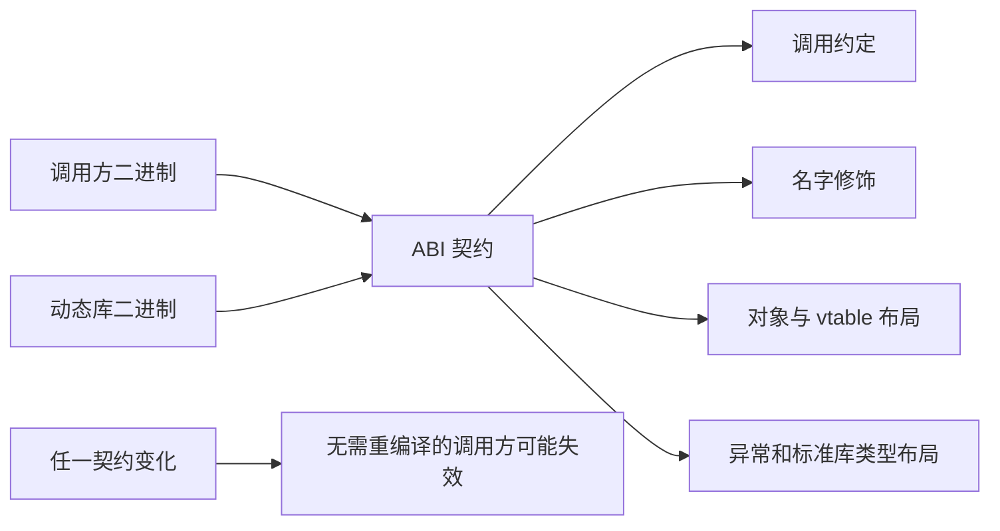


## 29.1 ABI 是什么

ABI：Application Binary Interface。

包括：

1. 函数调用约定。
2. 参数如何传递。
3. 返回值如何传递。
4. 名字修饰 name mangling。
5. 类对象布局。
6. vtable 布局。
7. 异常处理机制。
8. 标准库类型布局。

---

## 29.2 为什么 C++ ABI 更脆弱

C++ 比 C 更容易出 ABI 问题，因为 C++ 有：

1. 函数重载导致 name mangling。
2. 类布局可能变化。
3. 虚函数表顺序可能变化。
4. inline 函数编译进调用方。
5. 模板代码编译进调用方。
6. STL 类型跨库边界可能不兼容。
7. 不同编译器 ABI 不一致。

---

## 29.3 哪些修改会破坏 ABI

可能破坏 ABI 的修改：

1. 给类增加非静态成员。
2. 改变成员顺序。
3. 增加、删除、重排虚函数。
4. 改变基类。
5. 改变函数签名。
6. 改变 inline 函数实现但调用方不重新编译。
7. 改变模板定义但调用方不重新编译。

---

## 29.4 如何降低动态库 ABI 风险

常见策略：

1. 对外优先暴露 C ABI 或稳定的纯抽象接口，避免跨边界传递 STL 容器、异常和实现相关类布局。
2. 使用 Pimpl 隐藏私有成员，使实现变化不直接改变公开类大小。
3. 控制符号可见性，只导出明确的公共 API。
4. 对接口做版本管理，并保持创建与销毁发生在兼容的分配器边界。
5. 不让调用方依赖动态库内部的 `inline` 实现、模板布局和编译器私有 ABI。
6. 变更编译器、标准库、编译选项或运行库版本时重新验证二进制兼容性。

```cpp
class Widget {
public:
    Widget();
    ~Widget();

    Widget(Widget&&) noexcept;
    Widget& operator=(Widget&&) noexcept;

private:
    class Impl;
    std::unique_ptr<Impl> impl_;
};
```

Pimpl 能稳定公开对象的主要布局，但也会增加一次间接访问和独立分配，需要在 ABI 稳定性与性能之间取舍。

---

# 30. 性能优化

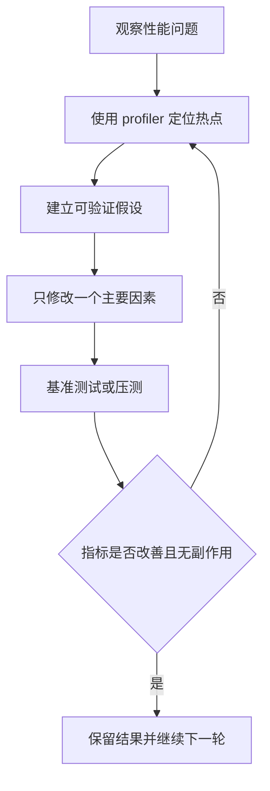


## 30.1 先测量再优化

不要凭感觉优化。

常见工具：

1. perf
2. gprof
3. Valgrind / callgrind
4. heaptrack
5. Linux perf top
6. VTune
7. Instruments
8. ASan/TSan/UBSan 辅助发现错误


> 性能优化第一步是定位瓶颈，先用 profiler 观察 CPU、内存、锁、I/O，再决定优化方向。

---

## 30.2 vector 为什么通常比 list 遍历快

虽然 list 插入删除 O(1)，但遍历时：

1. 节点分散在堆上。
2. 缓存不友好。
3. 每次访问都可能 cache miss。
4. 指针追踪影响 CPU 预取。

vector 连续存储，CPU cache 友好，遍历通常更快。

---

## 30.3 缓存局部性

CPU 访问内存不是只加载一个字节，而是加载一个 cache line。

连续内存更容易利用缓存。

```cpp
std::vector<int> v;
for (int x : v) {
    sum += x;
}
```

比链表遍历更容易命中缓存。

---

## 30.4 分支预测

CPU 会预测分支方向。

如果分支随机，预测失败会导致流水线清空。

```cpp
if (data[i] > threshold) {
    ++count;
}
```

如果数据分布随机，可能较慢。

---

## 30.5 虚函数性能

虚函数调用成本：

1. 多一次间接访问。
2. 可能阻碍内联。
3. 可能影响分支预测。

但不要过度优化。虚函数成本通常不是主要瓶颈，除非在极热路径、大量小对象上频繁调用。

去虚化：

如果编译器能知道实际类型，就可能优化为普通调用。

```cpp
Derived d;
d.foo(); // 容易去虚化
```

---

## 30.6 内存分配

频繁 new/delete 可能慢：

1. 分配器开销。
2. 锁竞争。
3. 内存碎片。
4. cache miss。

优化方式：

1. reserve。
2. 对象池。
3. arena allocator。
4. pmr。
5. 避免临时对象。
6. 批量分配。

---

## 30.7 常见代码优化

原代码：

```cpp
std::vector<std::string> v;

for (int i = 0; i < n; ++i) {
    std::string s = getString(i);
    v.push_back(s);
}
```

问题：

1. vector 可能多次扩容。
2. push_back(s) 会拷贝字符串。
3. 临时对象可以移动。

优化：

```cpp
std::vector<std::string> v;
v.reserve(n);

for (int i = 0; i < n; ++i) {
    v.push_back(getString(i));
}
```

`getString(i)` 已经返回 `std::string` 时，`push_back(getString(i))` 通常可以直接移动返回值。写成 `emplace_back(getString(i))` 一般不会额外消除这个 `std::string` 临时对象。

如果已经有变量且之后不再使用其原值：

```cpp
std::string s = getString(i);
v.push_back(std::move(s));
```

---

# 31. undefined behavior

## 31.1 什么是 UB

Undefined Behavior，未定义行为。

意思是：

> C++ 标准没有规定结果，程序可以表现为任何行为。

可能结果：

1. 看似正常。
2. 崩溃。
3. 输出奇怪值。
4. 被编译器优化成完全意想不到的代码。
5. 安全漏洞。

---

## 31.2 常见 UB

### 空指针解引用

```cpp
int* p = nullptr;
*p = 1; // UB
```

### 数组越界

```cpp
int arr[3]{1, 2, 3};
int x = arr[5]; // UB
```

### signed integer overflow

```cpp
int a = INT_MAX;
a = a + 1; // UB
```

### unsigned overflow

```cpp
unsigned int b = UINT_MAX;
b = b + 1; // OK，按模运算回绕
```

### 返回局部变量引用

```cpp
int& f() {
    int x = 10;
    return x; // 返回后引用悬垂，使用时产生 UB
}
```

### use-after-free

```cpp
int* value = new int(1);
delete value;
// std::cout << *value; // UB
```

### 不匹配的释放方式

```cpp
int* values = new int[10];
// delete values; // UB，应使用 delete[]
```

### 失效迭代器

```cpp
std::vector<int> values{1, 2, 3};
auto it = values.begin();
values.push_back(4); // 可能扩容
// use(*it);         // 若扩容，it 已失效
```

### 数据竞争

两个线程对同一内存位置进行无同步的冲突访问也是未定义行为。并发错误不能因为“测试多次没崩”就被视为正确。

---

## 31.3 `i = i++` 是不是 UB

需要区分语言版本：

1. C++11/C++14 及更早版本中，对 `i` 的修改缺少所需的顺序关系，行为未定义。
2. C++17 起，赋值运算符右侧会先于左侧写入完成，因此该表达式具有确定的顺序；若 `i` 初始为 1，后缀自增先产生旧值并把 `i` 改为 2，随后赋值又把旧值 1 写回，最终仍为 1。

即便在 C++17 之后已经有定义，这种代码仍然极难阅读，不应在工程中使用。

```cpp
++i;          // 明确递增
int old = i++; // 明确保留旧值
```

---

# 32. 返回局部对象

## 32.1 返回值安全

```cpp
T make1() {
    T t;
    return t;
}
```

安全。

可能触发 NRVO，或者移动。

---

## 32.2 返回临时对象安全

```cpp
T make2() {
    return T{};
}
```

安全。C++17 起通常强制拷贝省略。

---

## 32.3 返回局部对象右值引用危险

```cpp
T&& make3() {
    T t;
    return std::move(t);
}
```

严重错误。

`t` 是局部变量，函数结束后销毁。返回 `T&&` 是悬垂引用。

正确：

```cpp
T make3() {
    T t;
    return t;
}
```

不要返回局部对象的引用或右值引用。

---

# 33. vector<bool>

`std::vector<bool>` 是标准库对 bool 的特殊化。

它通常不是每个 bool 一个字节，而是按 bit 压缩存储。

问题：

1. `operator[]` 返回的不是 `bool&`，而是代理对象。
2. 不能获得真正的 bool 指针。
3. 和普通 vector<T> 行为不完全一致。
4. 多线程按 bit 修改可能影响同一个底层字节。
5. 泛型代码可能踩坑。

替代：

```cpp
std::vector<char>
std::vector<uint8_t>
std::bitset<N>
boost::dynamic_bitset
```

---

# 34. 高频手写：简化 unique_ptr

```cpp
template <typename T>
class UniquePtr {
public:
    explicit UniquePtr(T* ptr = nullptr) noexcept
        : ptr_(ptr) {}

    ~UniquePtr() {
        delete ptr_;
    }

    UniquePtr(const UniquePtr&) = delete;
    UniquePtr& operator=(const UniquePtr&) = delete;

    UniquePtr(UniquePtr&& other) noexcept
        : ptr_(other.ptr_) {
        other.ptr_ = nullptr;
    }

    UniquePtr& operator=(UniquePtr&& other) noexcept {
        if (this == &other) {
            return *this;
        }

        delete ptr_;
        ptr_ = other.ptr_;
        other.ptr_ = nullptr;

        return *this;
    }

    T& operator*() const {
        return *ptr_;
    }

    T* operator->() const noexcept {
        return ptr_;
    }

    T* get() const noexcept {
        return ptr_;
    }

    T* release() noexcept {
        T* old = ptr_;
        ptr_ = nullptr;
        return old;
    }

    void reset(T* ptr = nullptr) noexcept {
        if (ptr_ == ptr) {
            return;
        }

        delete ptr_;
        ptr_ = ptr;
    }

    explicit operator bool() const noexcept {
        return ptr_ != nullptr;
    }

private:
    T* ptr_{nullptr};
};
```

注意：

1. 移动构造后要把源对象置空。
2. 移动赋值前要释放自己的旧资源。
3. release 返回裸指针，并放弃所有权。
4. reset 删除旧对象并接管新对象。
5. operator-> 返回指针。
6. operator* 返回引用。

---

# 35. 高频手写：线程安全队列

```mermaid
sequenceDiagram
    participant P as 生产者
    participant Q as 线程安全队列
    participant CV as 条件变量
    participant C as 消费者
    C->>Q: wait_and_pop
    Q->>CV: 队列为空则等待
    P->>Q: push(value)
    Q->>Q: 加锁并入队
    Q->>CV: notify_one
    CV-->>C: 唤醒
    C->>Q: 加锁、出队并返回值
```


```cpp
#include <condition_variable>
#include <mutex>
#include <queue>
#include <utility>

template <typename T>
class ThreadSafeQueue {
public:
    ThreadSafeQueue() = default;

    ThreadSafeQueue(const ThreadSafeQueue&) = delete;
    ThreadSafeQueue& operator=(const ThreadSafeQueue&) = delete;

    void push(T value) {
        {
            std::lock_guard<std::mutex> lock(mutex_);
            queue_.push(std::move(value));
        }
        cv_.notify_one();
    }

    bool try_pop(T& value) {
        std::lock_guard<std::mutex> lock(mutex_);

        if (queue_.empty()) {
            return false;
        }

        value = std::move(queue_.front());
        queue_.pop();
        return true;
    }

    T wait_and_pop() {
        std::unique_lock<std::mutex> lock(mutex_);

        cv_.wait(lock, [this] {
            return !queue_.empty();
        });

        T value = std::move(queue_.front());
        queue_.pop();
        return value;
    }

    bool empty() const {
        std::lock_guard<std::mutex> lock(mutex_);
        return queue_.empty();
    }

private:
    mutable std::mutex mutex_;
    std::condition_variable cv_;
    std::queue<T> queue_;
};
```

注意：

1. `empty() const` 里 mutex 要是 mutable。
2. wait 必须用谓词。
3. push 先加锁修改队列，再 notify。
4. 不要返回引用，因为 pop 后元素不存在。
5. 如果要支持关闭，需要增加 closed_ 标志。

---

# 36. 高频手写：有停止机制的生产者消费者队列

```mermaid
flowchart TD
    O["队列 Open"] --> P{"生产者 push"}
    P -->|队列未满| I["入队并 notify not_empty"]
    P -->|队列已满| PW["等待 not_full"]
    O --> C{"消费者 pop"}
    C -->|队列非空| R["出队并 notify not_full"]
    C -->|队列为空| CW["等待 not_empty"]
    PW --> I
    CW --> R
    O --> X["close"]
    X --> N["设置 closed 并 notify_all"]
    N --> Z["等待者退出，后续 push 失败"]
```


```cpp
#include <condition_variable>
#include <cstddef>
#include <mutex>
#include <optional>
#include <queue>
#include <stdexcept>
#include <utility>

template <typename T>
class BlockingQueue {
public:
    explicit BlockingQueue(std::size_t capacity)
        : capacity_(capacity) {
        if (capacity_ == 0) {
            throw std::invalid_argument("capacity must be greater than zero");
        }
    }

    bool push(T value) {
        std::unique_lock<std::mutex> lock(mutex_);

        not_full_.wait(lock, [this] {
            return closed_ || queue_.size() < capacity_;
        });

        if (closed_) {
            return false;
        }

        queue_.push(std::move(value));
        lock.unlock();
        not_empty_.notify_one();
        return true;
    }

    std::optional<T> pop() {
        std::unique_lock<std::mutex> lock(mutex_);

        not_empty_.wait(lock, [this] {
            return closed_ || !queue_.empty();
        });

        // close 后仍然先排空已有元素。
        if (queue_.empty()) {
            return std::nullopt;
        }

        T value = std::move(queue_.front());
        queue_.pop();

        lock.unlock();
        not_full_.notify_one();
        return value;
    }

    void close() {
        {
            std::lock_guard<std::mutex> lock(mutex_);
            if (closed_) {
                return;
            }
            closed_ = true;
        }

        not_empty_.notify_all();
        not_full_.notify_all();
    }

private:
    std::size_t capacity_;
    bool closed_{false};

    std::mutex mutex_;
    std::condition_variable not_empty_;
    std::condition_variable not_full_;
    std::queue<T> queue_;
};
```

重点：

1. 队列满时生产者等待，队列空时消费者等待。
2. `wait` 必须带谓词。
3. `capacity == 0` 必须拒绝，否则生产者永远无法入队。
4. `close()` 要在锁内修改状态，再在锁外 `notify_all()`。
5. 关闭后不再接受新元素，但消费者应先排空已有元素。
6. `closed_` 和队列状态必须始终由同一把锁保护。

---

# 37. 高频手写：LRU Cache

```mermaid
flowchart LR
    K["key"] --> H["unordered_map"]
    H --> I["定位 list 迭代器"]
    I --> N["双向链表节点"]
    N --> M["splice 到链表头：最近使用"]
    T["链表尾：最久未使用"] --> E["容量满时淘汰"]
    E --> H
```


## 37.1 思路

要求 get/put 平均 O(1)。

使用：

1. `std::list<std::pair<int, int>>` 保存访问顺序。
2. `std::unordered_map<int, list::iterator>` 保存 key 到链表节点的映射。

链表头表示最近使用，链表尾表示最久未使用。

---

## 37.2 实现

```cpp
#include <cstddef>
#include <functional>
#include <list>
#include <optional>
#include <unordered_map>
#include <utility>

template <
    typename Key,
    typename Value,
    typename Hash = std::hash<Key>,
    typename KeyEqual = std::equal_to<Key>>
class LRUCache {
private:
    using Node = std::pair<Key, Value>;
    using List = std::list<Node>;
    using Iterator = typename List::iterator;

public:
    explicit LRUCache(std::size_t capacity)
        : capacity_(capacity) {}

    std::optional<std::reference_wrapper<const Value>>
    get(const Key& key) {
        auto it = map_.find(key);
        if (it == map_.end()) {
            return std::nullopt;
        }

        items_.splice(items_.begin(), items_, it->second);
        return std::cref(it->second->second);
    }

    template <typename K, typename V>
    void put(K&& key, V&& value) {
        auto it = map_.find(key);

        if (it != map_.end()) {
            it->second->second = std::forward<V>(value);
            items_.splice(items_.begin(), items_, it->second);
            return;
        }

        if (capacity_ == 0) {
            return;
        }

        if (items_.size() == capacity_) {
            map_.erase(items_.back().first);
            items_.pop_back();
        }

        items_.emplace_front(
            std::forward<K>(key),
            std::forward<V>(value));
        map_.emplace(items_.front().first, items_.begin());
    }

    std::size_t size() const noexcept {
        return items_.size();
    }

private:
    std::size_t capacity_;
    List items_;
    std::unordered_map<Key, Iterator, Hash, KeyEqual> map_;
};
```

关键点：

1. `list` 节点移动为 O(1)。
2. `unordered_map` 查找平均 O(1)，最坏 O(n)。
3. `splice` 不会复制或移动节点中的元素。
4. 哈希表保存链表迭代器，可以直接定位节点。
5. 用 `optional` 表达未命中，避免把 `-1` 与合法值混淆。
6. 返回引用包装器意味着调用者不能在缓存下一次修改后长期保存该引用；需要稳定快照时应返回值。
7. 该实现不是线程安全的，并发访问需要外部同步或分片设计。

---

# 38. 存储期、初始化顺序与对象生命周期

## 38.1 四类存储期

对象的“作用域”和“生命周期”不是同一概念。作用域决定名字在哪里可见，存储期决定对象存储大致存在多久。

| 存储期 | 常见对象 | 生命周期概述 |
| --- | --- | --- |
| 自动存储期 | 普通局部变量、函数参数 | 进入相应代码块时创建，离开时销毁 |
| 静态存储期 | 命名空间作用域变量、函数内 `static`、静态数据成员 | 通常贯穿整个程序 |
| 线程存储期 | `thread_local` 对象 | 每个线程拥有独立实例，生命周期通常随线程 |
| 动态存储期 | 通过 `new` 或分配器取得的对象 | 由程序显式控制，直到相应销毁和释放 |

动态分配得到的是存储；对象生命周期还需要通过构造开始，并通过析构或相应生命周期规则结束。对原始字节进行 `malloc` 并不自动构造非平凡 C++ 对象。

---

## 38.2 构造顺序

一个派生类对象的构造顺序是：

1. 虚基类，按继承图和标准规则处理；
2. 直接基类，按类声明中的继承顺序；
3. 非静态数据成员，按它们在类中的声明顺序；
4. 构造函数体。

析构顺序与构造顺序相反。

```cpp
class Example : public Base {
public:
    Example()
        : second_(2), first_(1) {}

private:
    int first_;
    int second_;
};
```

虽然初始化列表先写 `second_`，实际仍先初始化 `first_`。初始化列表最好按声明顺序书写，否则容易产生依赖错误和编译器警告。

---

## 38.3 静态初始化顺序

同一翻译单元内，具有有序动态初始化的对象通常按定义顺序初始化；跨翻译单元的动态初始化顺序通常不应依赖。

危险示例：

```cpp
// a.cpp
extern std::string b;
std::string a = b + "a";

// b.cpp
std::string b = "b";
```

`a` 初始化时 `b` 是否已经完成动态初始化可能存在问题。

常见解决方案：

1. 使用编译期可初始化对象：`constexpr`、`constinit`。
2. 使用“首次使用时构造”的函数内静态对象。

```cpp
Config& config() {
    static Config instance;
    return instance;
}
```

3. 避免跨翻译单元可变全局状态。
4. 显式构建依赖关系，由 `main()` 或依赖注入容器控制初始化。

函数内静态对象从 C++11 起初始化过程线程安全，但初始化完成后的对象访问是否线程安全仍由对象本身决定。

---

## 38.4 临时对象与生命周期延长

临时对象通常在包含它的完整表达式结束时销毁，但绑定到某些引用时可以延长生命周期：

```cpp
const std::string& ref = std::string("hello");
// 临时 string 的生命周期延长到 ref 的生命周期
```

需要注意，生命周期延长不是可传递的：

```cpp
const std::string& identity(const std::string& value) {
    return value;
}

const std::string& ref = identity(std::string("hello"));
// ref 悬垂：函数参数引用不会把临时对象生命周期继续延长到调用方
```

返回视图、迭代器、引用和指针时，都必须明确底层对象的生命周期是否覆盖使用期。

---

## 38.5 `explicit`、委托构造与继承构造

单参数构造函数如果允许隐式转换，可能产生意外匹配：

```cpp
class Meter {
public:
    explicit Meter(double value) : value_(value) {}

private:
    double value_;
};
```

除非确实需要隐式转换，单参数构造函数通常应标记 `explicit`。

委托构造可以复用同类构造逻辑：

```cpp
class Socket {
public:
    Socket() : Socket(default_port()) {}
    explicit Socket(int port) {
        open(port);
    }
};
```

`using Base::Base;` 可以继承基类构造函数，但不会自动解决派生类新增成员的初始化语义，使用时仍需审查接口是否合理。

---

## 38.6 花括号初始化与 `initializer_list` 优先级

花括号初始化可以阻止许多数值窄化：

```cpp
int value{3.5}; // error：窄化
```

但重载决议会优先考虑 `std::initializer_list` 构造函数：

```cpp
std::vector<int> first(10, 1); // 10 个元素，每个为 1
std::vector<int> second{10, 1}; // 两个元素：10 和 1
```

因此 `{}` 并不总是与 `()` 等价。设计和调用构造函数时，应明确是否存在 `initializer_list` 重载，以及初始化表达式想表达“元素列表”还是“构造参数”。

---

# 39. 成员函数限定、类型转换与类型安全

## 39.1 `const` 成员函数

```cpp
class Buffer {
public:
    std::size_t size() const noexcept {
        return size_;
    }

private:
    std::size_t size_{0};
};
```

成员函数末尾的 `const` 表示函数中的 `this` 近似为 `const Buffer*`，不能通过普通方式修改非 `mutable` 成员。

```cpp
class Cache {
public:
    int value() const {
        if (!cached_) {
            cached_value_ = compute();
            cached_ = true;
        }
        return cached_value_;
    }

private:
    mutable bool cached_{false};
    mutable int cached_value_{0};
};
```

`mutable` 适合不改变对象逻辑状态的缓存、统计或同步对象，但不能被用来掩盖本应属于可变业务状态的修改。

---

## 39.2 引用限定符

成员函数可以按对象值类别重载：

```cpp
class Text {
public:
    const std::string& data() const & {
        return data_;
    }

    std::string data() && {
        return std::move(data_);
    }

private:
    std::string data_;
};
```

这样左值对象返回引用，临时对象返回值，避免从即将销毁的对象中返回悬垂引用。

---

## 39.3 四种显式转换

### `static_cast`

用于标准允许的显式转换、数值转换、已知安全的继承方向转换等。

```cpp
double value = 3.5;
int truncated = static_cast<int>(value);
```

从基类指针向派生类指针的 `static_cast` 不做运行期检查，只有调用者能够证明实际类型时才安全。

### `dynamic_cast`

用于多态继承体系中的运行期检查。基类必须是多态类型。

```cpp
if (auto* derived = dynamic_cast<Derived*>(base)) {
    derived->run();
}
```

### `const_cast`

用于增加或移除 cv 限定。移除 `const` 后，只有原对象本来不是 `const` 时才允许修改：

```cpp
int value = 1;
const int* p = &value;
*const_cast<int*>(p) = 2; // 原对象可修改，合法

const int fixed = 1;
// *const_cast<int*>(&fixed) = 2; // 修改真正 const 对象，未定义行为
```

### `reinterpret_cast`

用于底层表示相关转换，例如整数与指针、不同指针类型之间的显式重解释。它不能绕过对齐、对象生命周期、严格别名和有效类型规则。

> `reinterpret_cast` 只是允许表达转换意图，不表示转换后的访问一定合法。

---

## 39.4 严格别名、对齐与对象表示

编译器通常假设不相关类型的指针不会指向同一对象。通过错误类型访问对象可能违反严格别名规则：

```cpp
float f = 1.0F;
// int bits = *reinterpret_cast<int*>(&f); // 不应这样读取表示
```

C++20 可使用 `std::bit_cast`：

```cpp
#include <bit>
#include <cstdint>

static_assert(sizeof(float) == sizeof(std::uint32_t));
std::uint32_t bits = std::bit_cast<std::uint32_t>(f);
```

`std::bit_cast` 要求源类型和目标类型大小相同，并满足相应的平凡可复制约束。上例还显式验证了平台上的 `float` 与 `uint32_t` 大小一致。

使用 placement new、自定义 arena 或协议解析时，还要保证：

1. 地址满足目标类型对齐要求；
2. 对象生命周期已经开始；
3. 访问类型符合语言规则；
4. 必要时使用 `std::launder` 处理特定复用存储场景。

---

# 40. 线程生命周期、任务与异步结果

## 40.1 `std::thread`

```cpp
std::thread worker([] {
    do_work();
});
worker.join();
```

`std::thread` 对象销毁时如果仍然 `joinable()`，程序会调用 `std::terminate()`。因此必须明确选择：

1. `join()`：等待线程结束；
2. `detach()`：与线程失去关联，让线程独立运行。

`detach()` 往往使生命周期、错误传播和程序退出管理变得困难，通常应优先使用结构化的 join 方案。

```cpp
class JoiningThread {
public:
    explicit JoiningThread(std::thread thread)
        : thread_(std::move(thread)) {}

    ~JoiningThread() noexcept {
        if (!thread_.joinable()) {
            return;
        }

        // 该简化封装要求对象不能在其所管理的线程内部销毁。
        if (thread_.get_id() == std::this_thread::get_id()) {
            std::terminate();
        }

        try {
            thread_.join();
        } catch (...) {
            // 析构函数不能让异常逃出。
            std::terminate();
        }
    }

private:
    std::thread thread_;
};
```

这个封装只用于说明 RAII join。生产代码通常应直接使用 `std::jthread`，或者明确设计线程所有权、取消与自销毁约束。

---

## 40.2 `std::jthread` 与停止请求

C++20 的 `std::jthread` 析构时会请求停止并自动 join：

```cpp
std::jthread worker([](std::stop_token token) {
    while (!token.stop_requested()) {
        do_one_unit();
    }
});
```

停止令牌是协作式取消，不会强制终止线程。任务必须主动检查停止状态，并确保阻塞操作具备超时、可取消或唤醒机制。

---

## 40.3 `promise` 与 `future`

`std::promise<T>` 用于设置结果，`std::future<T>` 用于取得结果或异常：

```cpp
std::promise<int> promise;
std::future<int> future = promise.get_future();

std::thread worker([p = std::move(promise)]() mutable {
    try {
        p.set_value(compute());
    } catch (...) {
        p.set_exception(std::current_exception());
    }
});

int result = future.get();
worker.join();
```

`future::get()` 通常只能调用一次，并会重新抛出生产者保存的异常。

---

## 40.4 `std::async`

```cpp
auto future = std::async(std::launch::async, compute);
int result = future.get();
```

不指定策略时，允许实现选择异步执行或延迟执行：

```cpp
auto future = std::async(compute);
```

如果代码依赖并行执行，应明确使用 `std::launch::async`。还要注意，从 `std::async(std::launch::async, ...)` 获得的临时 future 在某些场景下析构会等待任务完成，因此不能把它简单当作“发出后完全不管”的接口。

---

## 40.5 `packaged_task`

`std::packaged_task` 把可调用对象包装为一个可执行任务，并把结果连接到 future：

```cpp
std::packaged_task<int(int)> task([](int value) {
    return value * value;
});

std::future<int> future = task.get_future();

std::thread worker(std::move(task), 5);
worker.join();

std::cout << future.get();
```

关键区别：

1. `std::async` 同时负责提交和执行策略。
2. `packaged_task` 只包装任务与结果通道，何时、在哪个线程执行由调用方决定。
3. `get_future()` 每个共享状态只能成功取得一次；通常在任务移交给线程池之前取得，便于管理结果。
4. 任务执行后仍可再调用 `get_future()` 吗，取决于是否已经取过 future；“执行顺序”本身不是唯一限制，但工程上应先建立结果句柄。

---

## 40.6 线程池设计要点

一个基础线程池通常包含：

1. 固定或可调数量的工作线程；
2. 有界任务队列；
3. 条件变量或原子等待；
4. 停止与排空策略；
5. 任务异常传播；
6. 背压和拒绝策略。

需要明确关闭语义：

- 停止接收新任务；
- 是否执行完已入队任务；
- 等待工作线程结束；
- 如何取消未开始任务；
- 如何防止任务中再次提交导致关停死锁。

线程池不是“把任务放进去就天然高性能”。任务粒度太小会放大排队和同步成本，任务长时间阻塞会耗尽工作线程，CPU 密集任务还应考虑核心数、NUMA 和线程亲和性。

---

# 41. 并发进阶：读写锁、原子等待与缓存竞争

## 41.1 `shared_mutex`

读多写少时可以使用共享互斥量：

```cpp
#include <shared_mutex>

std::shared_mutex mutex;
Data data;

Data read_copy() {
    std::shared_lock lock(mutex);
    return data;
}

void update(Data value) {
    std::unique_lock lock(mutex);
    data = std::move(value);
}
```

共享锁允许多个读者并发，独占锁阻止其他读写者。它不保证一定比普通 mutex 快：

1. 读操作很短时，管理共享状态的成本可能更高；
2. 写入频繁时竞争会加剧；
3. 公平策略由实现决定，可能出现读者或写者饥饿。

---

## 41.2 C++20 原子等待

C++20 为原子对象提供 `wait/notify_one/notify_all`：

```cpp
std::atomic<bool> ready{false};

void consumer() {
    ready.wait(false);
    consume();
}

void producer() {
    produce();
    ready.store(true, std::memory_order_release);
    ready.notify_one();
}
```

等待方仍要正确选择内存序，并考虑值可能在等待前已经改变。原子等待适合单个状态字，不适合替代复杂谓词和多个变量组成的不变量。

---

## 41.3 伪共享

两个线程即使更新不同变量，只要变量落在同一缓存行，也可能反复争夺缓存行所有权：

```cpp
struct Counters {
    std::atomic<std::uint64_t> first{0};
    std::atomic<std::uint64_t> second{0};
};
```

可以使用硬件干扰大小提示进行布局：

```cpp
#include <atomic>
#include <cstdint>
#include <new>

struct alignas(std::hardware_destructive_interference_size) Counter {
    std::atomic<std::uint64_t> value{0};
};
```

该常量的可用性和具体数值依实现而定。对齐会增加内存占用，必须通过 profiling 验证收益。

---

## 41.4 无锁、锁自由与等待自由

这些术语不能混用：

- **无锁算法（lock-free）**：系统整体持续有线程取得进展，但某个线程可能长期失败。
- **等待自由（wait-free）**：每个线程都能在有限步骤内完成操作。
- **无阻塞式设计**：有时只是泛称，不等于满足标准意义上的 lock-free。

即使原子类型 `is_lock_free()` 为真，整个数据结构也不一定是 lock-free。安全内存回收、ABA、重试风暴和缓存行竞争往往才是无锁结构的难点。

---

# 42. 分配器、内存资源与 `pmr`

## 42.1 为什么需要自定义分配策略

频繁的小对象分配可能带来：

1. 分配器元数据和锁开销；
2. 内存碎片；
3. 缓存局部性差；
4. 生命周期批量释放困难；
5. 跨线程分配与释放成本。

但自定义分配器会增加复杂性。只有 profiling 表明分配确实是瓶颈时，才应引入对象池、arena 或专用内存资源。

---

## 42.2 arena 的基本思想

arena 从较大的内存块中线性分配对象，最后统一释放：

```text
大块内存
├── Object A
├── Object B
├── Object C
└── remaining
```

优点：

- 分配通常只是移动指针；
- 局部性好；
- 批量释放快。

限制：

- 单个对象通常不能独立回收；
- 析构顺序需要显式设计；
- 长短生命周期对象混用会造成浪费；
- 不能让对象逃逸到 arena 生命周期之外。

---

## 42.3 `std::pmr`

C++17 的多态内存资源把容器类型和运行期分配策略解耦：

```cpp
#include <array>
#include <memory_resource>
#include <vector>

std::array<std::byte, 4096> buffer;

std::pmr::monotonic_buffer_resource resource(
    buffer.data(),
    buffer.size());

std::pmr::vector<int> values(&resource);
values.reserve(100);
```

常见资源：

- `monotonic_buffer_resource`：只增长，整体释放；
- `unsynchronized_pool_resource`：单线程池；
- `synchronized_pool_resource`：带同步的池；
- `new_delete_resource()`：使用普通 new/delete。

必须保证 memory resource 的生命周期覆盖使用它的所有容器和对象。容器被移动或跨模块传递时，也要关注 allocator propagation 语义。

---

# 43. 可调用对象、`std::function` 与类型擦除

## 43.1 可调用对象

C++ 中可调用对象包括：

1. 普通函数；
2. 函数指针；
3. lambda；
4. 重载了 `operator()` 的函数对象；
5. 成员函数指针；
6. `std::bind` 或其他适配器结果。

泛型接口通常优先使用模板接收可调用对象：

```cpp
template <typename F>
void invoke_twice(F&& function) {
    std::invoke(function);
    std::invoke(function);
}
```

这样更容易内联，但会为不同类型实例化不同代码。

---

## 43.2 `std::function`

`std::function<R(Args...)>` 是拥有型类型擦除包装器：

```cpp
std::function<int(int)> function = [](int value) {
    return value * 2;
};
```

优点：

- 能用统一类型保存不同可调用对象；
- 适合回调注册、任务队列和运行期多态。

成本可能包括：

- 间接调用；
- 类型擦除管理；
- 超过小对象缓冲容量时的动态分配；
- 难以内联。

小对象优化不是标准必须采用的具体布局，不应假设所有 lambda 都不会分配。

---

## 43.3 move-only 回调

`std::function` 在 C++23 之前通常要求目标可复制，因此不能直接保存捕获 `unique_ptr` 的 move-only lambda。

```cpp
auto task = [ptr = std::make_unique<int>(1)]() mutable {
    ++*ptr;
};
```

可以选择：

1. 让任务队列自身模板化；
2. 自定义 move-only function wrapper；
3. 在支持相应标准库时使用 `std::move_only_function`；
4. 改变所有权设计。

---

## 43.4 回调生命周期

异步回调最常见的错误不是类型，而是捕获对象已经销毁：

```cpp
register_callback([this] {
    use_member();
});
```

需要设计取消注册、弱引用或所有权绑定机制。仅仅把 `this` 换成 `shared_ptr` 也可能延长对象生命周期并形成循环引用，因此应根据拥有关系选择强捕获或弱捕获。

---

# 44. Ranges、`expected` 与现代接口设计

## 44.1 Ranges

C++20 Ranges 把范围和算法组合得更自然：

```cpp
#include <algorithm>
#include <ranges>
#include <vector>

std::vector<int> values{1, 2, 3, 4, 5};

auto even_squares =
    values
    | std::views::filter([](int value) {
          return value % 2 == 0;
      })
    | std::views::transform([](int value) {
          return value * value;
      });

for (int value : even_squares) {
    use(value);
}
```

view 通常是惰性、轻量的适配器，很多 view 非拥有，但标准库也存在能够拥有底层范围的 view。必须根据具体 view 类型判断所有权。对于非拥有 view，底层范围销毁、容器扩容或引用失效后，view 也可能失效；不能把 view 自动理解为复制后的独立结果。

---

## 44.2 `std::expected`

当失败是正常业务分支、调用方应显式处理错误时，C++23 的 `std::expected<T, E>` 可以表达“值或错误”：

```cpp
std::expected<Config, ParseError>
parse_config(std::string_view text);
```

与异常相比：

- 错误是函数类型的一部分；
- 调用路径更显式；
- 不会自动跨层传播；
- 适合高频、可恢复错误。

异常更适合无法在本层合理处理、需要跨多层传播的失败。两者不是绝对替代关系，应根据错误频率、接口边界和项目约定选择。

---

## 44.3 API 所有权表达

参数和返回值应直接表达所有权：

| 接口形式 | 常见语义 |
| --- | --- |
| `T` | 值传递，接收独立值或准备消费值 |
| `const T&` | 必须存在的只读借用 |
| `T&` | 必须存在的可修改借用 |
| `T*` | 可空或需要指针语义的非拥有访问 |
| `std::unique_ptr<T>` | 独占所有权转移 |
| `std::shared_ptr<T>` | 共享所有权 |
| `std::string_view` / `std::span` | 非拥有连续数据视图 |

不要仅因为“避免拷贝”就把所有参数改成引用。小型标量按值传递更自然；需要在函数内保存数据时，视图参数尤其要谨慎。

---

# 45. 库、符号、诊断与工程验证

## 45.1 静态库与动态库

静态库通常在链接期把所需目标代码合入最终程序；动态库通常在装载期或运行期由动态链接器映射和解析。

```text
source -> object files
             ├── static library (.a/.lib)
             └── shared library (.so/.dll/.dylib)
```

动态链接的优势：

- 多进程可共享只读代码页；
- 库可以独立更新；
- 可执行文件较小。

风险：

- 装载和符号解析更复杂；
- ABI 必须兼容；
- 运行期依赖和搜索路径可能出错；
- 符号可见性和版本冲突需要管理。

---

## 45.2 GOT、PLT 与位置无关代码

在 ELF 平台的典型实现中：

- GOT 保存需要间接访问的地址；
- PLT 为外部函数调用提供跳转入口；
- PIC/PIE 使代码能够在不同装载地址运行；
- lazy binding 可能把部分符号解析推迟到首次调用。

这些是 ABI 和工具链实现细节，不是 ISO C++ 语言规则。调试动态链接问题时可使用：

```bash
readelf -h -S -s -r app
objdump -d -C app
nm -C library.a
ldd app
```

---

## 45.3 编译警告与静态分析

建议在项目中启用严格警告，并把新代码警告视为需要处理的问题：

```bash
-Wall -Wextra -Wpedantic -Wconversion -Wshadow
```

不同编译器选项不同，不能机械地把所有警告都提升为错误而不维护基线。

常用静态分析：

- clang-tidy；
- Clang Static Analyzer；
- cppcheck；
- 编译器数据流分析；
- 项目定制 lint。

---

## 45.4 Sanitizer

### AddressSanitizer

检测：

- 越界；
- use-after-free；
- double free；
- 部分栈生命周期错误。

```bash
-fsanitize=address -fno-omit-frame-pointer
```

### UndefinedBehaviorSanitizer

检测部分未定义行为：

```bash
-fsanitize=undefined
```

### ThreadSanitizer

检测数据竞争：

```bash
-fsanitize=thread
```

TSan 与 ASan 通常不能在同一个构建中同时启用，应分别运行。

Sanitizer 不是形式证明，也不能覆盖所有执行路径。应结合单元测试、集成测试、模糊测试和代码审查。

---

## 45.5 基准测试原则

可靠的微基准需要：

1. 使用优化后的发布构建；
2. 防止编译器把待测逻辑完全消除；
3. 预热缓存和运行时；
4. 多次重复并报告分布，而不是只看单次结果；
5. 固定输入、CPU 频率和并发环境；
6. 区分吞吐、延迟、中位数和尾延迟；
7. 使用真实工作负载验证微基准结论；
8. 同时检查正确性，避免“通过引入 UB 获得性能”。

性能结论必须附带平台、编译器、编译选项、数据规模和测量方法。

---

# 46. 一段话回答


## 46.1 解释 RAII


> RAII 是 C++ 资源管理的核心思想，全称是 Resource Acquisition Is Initialization。它把资源的获取和对象初始化绑定，把资源释放和对象析构绑定。这样当对象离开作用域时，无论正常返回还是异常退出，析构函数都会自动执行，从而释放资源。比如 unique_ptr 管理堆内存，lock_guard 管理 mutex，fstream 管理文件句柄。现代 C++ 中我们尽量避免裸指针拥有资源，而是使用 RAII 类型和标准库容器，这样能减少内存泄漏、异常路径泄漏和手动释放错误。

---

## 46.2 解释移动语义


> 移动语义的目标是避免不必要的深拷贝。对于拥有资源的对象，比如 string、vector、unique_ptr，如果源对象是右值或者即将不用，可以通过移动构造或移动赋值把内部资源直接转移给目标对象。std::move 本身不移动，它只是把表达式转换成右值，真正的移动发生在类型的移动构造或移动赋值中。移动后源对象仍然有效，但值未指定。对于资源管理类，移动操作一般只是交换指针或接管句柄，所以应尽量标记 noexcept，以便 STL 容器扩容时优先使用移动。

---

## 46.3 解释 shared_ptr 控制块


> shared_ptr 不只是保存一个裸指针，它还关联一个控制块。控制块里通常有强引用计数、弱引用计数、删除器、分配器等信息。多个 shared_ptr 共享同一个控制块，强引用计数为 0 时对象被销毁，弱引用计数为 0 时控制块释放。不能用同一个裸指针构造多个 shared_ptr，因为那会产生多个控制块，最终 double delete。正确做法是用 make_shared 或从已有 shared_ptr 拷贝。

---

## 46.4 解释 condition_variable


> condition_variable 用于线程间等待某个条件成立。它必须配合 mutex 使用，因为条件本身通常是共享状态。wait 时要使用 while 或谓词，因为可能发生虚假唤醒，也可能多个消费者被唤醒后条件又不成立。典型写法是 unique_lock 加锁，然后 cv.wait(lock, predicate)。生产者修改共享状态时也要加锁，修改后 notify_one 或 notify_all。

---

## 46.5 解释 unordered_map 最坏复杂度


> unordered_map 平均查找是 O(1)，但最坏是 O(n)。因为它基于哈希表，如果大量 key 发生哈希冲突，元素落入同一个桶中，查找就退化为遍历桶内元素。实际性能依赖 hash 函数质量、负载因子和 rehash 策略。如果需要有序遍历或稳定的最坏复杂度，可以选择 map。

## 46.6 怎么理解现代 C++？

> 我理解现代 C++ 的核心是用类型系统和对象生命周期来管理复杂性。资源管理上尽量使用 RAII，把资源释放放到析构函数中，避免手动 new/delete。所有权表达上，独占资源用 unique_ptr，共享资源用 shared_ptr，非拥有观察用 weak_ptr 或裸指针/引用。对象设计上尽量遵守 Rule of Zero，让标准库容器和智能指针处理拷贝移动和析构。性能上理解值语义和移动语义，避免不必要拷贝，使用 reserve、emplace、string_view/span 等减少分配。并发上避免数据竞争，用 mutex、condition_variable、atomic 等工具表达同步关系。泛型编程上使用模板、type traits 和 concepts 写出类型安全、可复用的代码。整体目标是写出资源安全、异常安全、并发安全、性能可控的代码。

## 46.7 C++ 如何避免资源泄漏？

> C++ 主要通过 RAII 管理资源。RAII 的思想是把资源的生命周期绑定到对象生命周期上，在构造函数中获取资源，在析构函数中释放资源。这样对象离开作用域时，无论是正常返回还是异常退出，析构函数都会执行，从而保证资源被释放。比如内存用 unique_ptr/shared_ptr，锁用 lock_guard/unique_lock，文件句柄可以封装成类。现代 C++ 推荐避免裸指针拥有资源，优先使用标准库容器和智能指针，尽量遵守 Rule of Zero。