# C++ 怎么这么难

> **适用范围**：以 C++17/C++20 为主，补充部分 C++23 能力；语言规则以 ISO C++ 语义为准，虚表、对象布局、ABI、容器增长策略等实现细节以“典型实现”描述，不把某个编译器的实现当作标准保证。
>
> **阅读约定**：
>
> - “通常”“可能”“典型实现”表示标准未强制规定，具体行为依赖编译器、标准库、ABI 或平台。
> - `O(1)`、`O(log n)` 等复杂度要区分最坏、平均与均摊复杂度。
> - “线程安全”必须说明保护的是对象、控制块还是业务数据；“无锁”也不等于一定更快。
> - 代码示例优先展示语义与边界，生产代码仍需补充错误处理、日志、取消、超时与资源上限。

## 内容导航

### 语言与对象模型

- [1. C++ 核心问题](#1-c-核心问题)
- [2. const、constexpr、consteval、constinit](#2-constconstexprconstevalconstinit)
- [3. 指针、引用和值语义](#3-指针引用和值语义)
- [4. 左值、右值、移动语义](#4-左值右值移动语义)
- [5. 对象生命周期与特殊成员函数](#5-对象生命周期与特殊成员函数)
- [6. Rule of Three / Five / Zero](#6-rule-of-three-five-zero)
- [7. RAII](#7-raii)
- [8. 智能指针](#8-智能指针)
- [9. new/delete 与 malloc/free](#9-newdelete-与-mallocfree)
- [10. 继承与对象内存布局](#10-继承与对象内存布局)
- [11. 虚函数、虚表、RTTI 与运行期多态](#11-虚函数虚表rtti-与运行期多态)
- [12. 构造、析构与多态生命周期](#12-构造析构与多态生命周期)
- [13. 重载决议、重写与名字查找](#13-重载决议重写与名字查找)

### 容器、算法与泛型

- [14. STL 容器：结构、复杂度与失效规则](#14-stl-容器结构复杂度与失效规则)
- [15. STL 算法、迭代器与 lambda](#15-stl-算法迭代器与-lambda)
- [16. 模板基础](#16-模板基础)
- [17. 完美转发、万能引用、引用折叠](#17-完美转发万能引用引用折叠)
- [18. SFINAE、type traits、concepts](#18-sfinaetype-traitsconcepts)

### 异常与并发

- [19. 异常传播、异常安全与 noexcept](#19-异常传播异常安全与-noexcept)
- [20. 并发基础：thread、mutex、lock](#20-并发基础threadmutexlock)
- [21. condition_variable](#21-condition_variable)
- [22. atomic 与内存模型](#22-atomic-与内存模型)

### 现代库、构建与性能

- [23. C++17/20 常见特性](#23-c1720-常见特性)
- [24. optional、variant、any、string_view、span](#24-optionalvariantanystring_viewspan)
- [25. 编译、链接、ODR、inline](#25-编译链接odrinline)
- [26. static、extern、头文件设计](#26-staticextern头文件设计)
- [27. ABI 与动态库二进制兼容](#27-abi-与动态库二进制兼容)
- [28. 性能优化](#28-性能优化)
- [29. undefined behavior](#29-undefined-behavior)
- [30. 返回局部对象](#30-返回局部对象)
- [31. vector<bool>](#31-vectorbool)

### 典型手写实现

- [32. 手写实现：简化 unique_ptr](#32-手写实现简化-unique_ptr)
- [33. 手写实现：线程安全队列](#33-手写实现线程安全队列)
- [34. 手写实现：有停止机制的生产者消费者队列](#34-手写实现有停止机制的生产者消费者队列)
- [35. 手写实现：LRU Cache](#35-手写实现lru-cache)

### 生命周期、并发进阶与工程化

- [36. 初始化、存储期、求值顺序与对象生命周期](#36-初始化存储期求值顺序与对象生命周期)
- [37. 成员函数限定、类型转换与类型安全](#37-成员函数限定类型转换与类型安全)
- [38. 线程生命周期、任务与异步结果](#38-线程生命周期任务与异步结果)
- [39. 并发进阶：读写锁、原子等待与缓存竞争](#39-并发进阶读写锁原子等待与缓存竞争)
- [40. 分配器、内存资源与 pmr](#40-分配器内存资源与-pmr)
- [41. 可调用对象、std::function 与类型擦除](#41-可调用对象stdfunction-与类型擦除)
- [42. Ranges、expected 与现代接口设计](#42-rangesexpected-与现代接口设计)
- [43. 库、符号、诊断与工程验证](#43-库符号诊断与工程验证)
- [44. C++20 协程机制](#44-c20-协程机制)

# 1. C++ 核心问题

1. 对象什么时候构造、什么时候析构。
2. 资源由谁拥有，什么时候释放。
3. 拷贝、移动、引用、指针之间的语义差异。
4. STL 容器的底层结构和迭代器失效规则。
5. 模板、SFINAE、concepts 等泛型机制。
6. 并发中的数据竞争、死锁、条件变量、内存序。
7. 编译链接、ODR、ABI、动态库兼容。
8. 性能优化中的缓存、分配、拷贝、锁竞争。

---

# 2. const、constexpr、consteval、constinit

## 2.1 const

`const` 表示对象初始化后不能通过该名字修改。

```cpp
const int x = 10;
// x = 20; // error
```

但注意：

```cpp
int a = 10;
const int* p = &a; // 不能通过 p 修改 a
a = 20;            // 但 a 本身仍然能被修改
```

`const` 不是一定代表编译期常量。

```cpp
int f();

const int a = 10;  // 编译期常量
const int b = f(); // 运行期常量
```

`a` 可以用于要求编译期常量的场景，`b` 不行。

---

## 2.2 constexpr

`constexpr` 用于变量和函数时，约束不同。

用于对象变量时，初始化器必须满足常量表达式规则，否则程序无法通过编译；对象还隐含 `const`：

```cpp
constexpr int x = 10;
int arr[x]; // OK

int read();
// constexpr int y = read(); // error：初始化器不是常量表达式
```

这表示编译器必须在翻译期间验证并完成 `x` 的常量初始化，不表示 `x` 一定不占运行期存储。程序对它取地址时，仍可能需要一个实际对象：

```cpp
constexpr int x = 10;
const int* address = &x;
```

用于函数时，`constexpr` 表示该函数在参数和实际执行路径都满足常量表达式规则时，可以用于常量求值：

```cpp
constexpr int square(int x) {
    return x * x;
}

constexpr int a = square(5);      // 必须常量求值
static_assert(square(6) == 36);   // 必须常量求值
```

普通运行期上下文不强制常量求值。即使实参是字面量，编译器的常量折叠也只是优化，不是这里的语言要求：

```cpp
int evaluate(int n) {
    int b = square(5); // 不强制；编译器可能常量折叠成 25
    int c = square(n); // n 不是常量表达式，走运行期求值路径
    return b + c;
}
```

决定一次调用是否**必须**常量求值的是使用位置：`constexpr` 变量初始化、`static_assert`、非类型模板实参和数组边界等常量表达式上下文会强制检查；普通表达式不会。

> `constexpr` 变量的初始化器必须是常量表达式；`constexpr` 函数只是具备常量求值能力，每次调用是否必须常量求值取决于上下文。

---

## 2.3 consteval

`consteval` 是 C++20 引入的，表示函数必须在编译期执行。

```cpp
consteval int square(int x) {
    return x * x;
}

constexpr int a = square(5); // OK

int n = 5;
// int b = square(n); // error，n 不是编译期常量
```


> constexpr 是可以编译期执行，consteval 是必须编译期执行。

---

## 2.4 constinit

`constinit` 是 C++20 引入的，用于具有**静态存储期或线程存储期**的变量，要求它完成静态初始化，而不是依赖运行期动态初始化。

```cpp
constinit int x = 10; // 命名空间作用域，OK

int f();
// constinit int y = f(); // error：初始化器不能保证静态初始化
```

它常用于全局变量、命名空间作用域变量、`static` 数据成员或 `thread_local` 变量，能够减少跨翻译单元动态初始化顺序带来的风险。

```cpp
constinit static int counter = 0;
```

需要注意：

1. `constinit` 只约束初始化阶段，不表示对象不可修改。
2. 静态初始化包括零初始化和常量初始化；“静态初始化”不应简单等同于“对象一定被当作编译期常量使用”。
3. 它不能修复对象之间真实存在的运行期初始化依赖，设计上仍应减少可变全局状态。

```cpp
constinit int x = 10;
x = 20; // OK
```

---

## 2.5 总结

| 关键字 | 核心含义 | 是否不可修改 | 对编译期/初始化的要求 |
| --- | --- | ---: | --- |
| `const` | 通过该访问路径不可修改对象 | 是（针对该访问路径） | 不要求编译期求值 |
| `constexpr` 变量 | 对象可用于常量表达式 | 是 | 初始化器必须是常量表达式 |
| `constexpr` 函数 | 函数具备参与常量求值的能力 | 不直接相关 | 调用不一定发生在编译期 |
| `consteval` | 声明立即函数 | 不直接相关 | 需要产生常量表达式的调用必须在常量求值中完成 |
| `constinit` | 保证静态/线程存储期变量静态初始化 | 否 | 禁止依赖动态初始化 |

---

# 3. 指针、引用和值语义

## 3.1 指针和引用的区别

引用是对象的别名：

```cpp
int x = 10;
int& r = x;
r = 20; // 修改 x
```

指针是保存地址的对象：

```cpp
int x = 10;
int* p = &x;
*p = 20; // 修改 x
```

| 维度           | 指针                               | 引用                             |
| -------------- | ---------------------------------- | -------------------------------- |
| 是否可为空     | 可以为 nullptr                     | 正常情况下不为空                 |
| 是否必须初始化 | 不必须                             | 必须                             |
| 是否可重新绑定 | 可以                               | 不可以                           |
| 是否占空间     | 指针对象通常占空间                 | 实现上可能占空间，但语义上是别名 |
| 传参语义       | 指针本身按值传递                   | 直接绑定实参                     |
| 常见用途       | 可选对象、数组、动态资源、底层结构 | 参数传递、返回别名、重载操作符   |

---

## 3.2 引用不等于“永远安全”

下面代码错误：

```cpp
int& getRef() {
    int x = 10;
    return x;
}
```

`x` 是局部变量，函数返回后生命周期结束。返回它的引用会产生悬垂引用。

```cpp
int* getPtr() {
    int x = 20;
    return &x;
}
```

同理，返回局部变量地址会产生悬垂指针。

正确方式：

```cpp
int getValue() {
    int x = 10;
    return x; // 返回值安全
}
```

或者返回静态对象引用，但要注意线程安全和全局状态问题：

```cpp
int& getStaticRef() {
    static int x = 10;
    return x;
}
```

---

## 3.3 const 指针组合

```cpp
int x = 0;

int* p1 = &x;                    // 指向 int 的指针
const int* p2 = &x;              // 不能通过 p2 修改 x
int* const p3 = &x;              // p3 不能重新指向别处
const int* const p4 = &x;        // 指针和经该指针访问的值都不可修改
```

`const int*` 不表示目标对象本身一定是 `const`。如果目标原本是可修改对象，仍可通过其他非 `const` 访问路径修改它。

记忆方式：

> const 修饰它左边的东西；如果左边没有东西，就修饰右边的东西。

```cpp
const int* p;
// const 修饰 int

int* const p = &x;
// const 修饰 p
```

---

# 4. 左值、右值、移动语义

## 4.1 值类别

C++ 表达式有值类别。常见的有：

1. lvalue，左值。
2. prvalue，纯右值。
3. xvalue，将亡值。
4. glvalue，广义左值。
5. rvalue，右值，包括 prvalue 和 xvalue。


| 类别 | 核心语义 | 例子 |
| --- | --- | --- |
| 左值 `lvalue` | 有身份，通常表示一个可持续存在的对象或函数 | 变量名、返回左值引用的表达式 |
| 纯右值 `prvalue` | 用于初始化对象或计算值；C++17 起按需进行临时对象实质化 | `42`、`x + 1`、`T{}` |
| 将亡值 `xvalue` | 有身份，但资源可以被复用 | `std::move(x)`、返回右值引用的表达式 |
| 广义左值 `glvalue` | `lvalue + xvalue`，共同特点是有身份 | 左值与将亡值 |
| 右值 `rvalue` | `prvalue + xvalue` | 临时值、`std::move` 结果 |

“左值一定能直接取地址”只适合作为入门近似：位域不能直接取地址，类型还可能重载 `operator&`。更本质的区分是表达式是否具有身份，以及其资源能否被复用。

`decltype((表达式))` 可以在编译期观察值类别：结果为 `T&` 表示左值，为 `T&&` 表示将亡值，为非引用 `T` 表示纯右值。

```cpp
#include <type_traits>
#include <utility>

int value = 0;

static_assert(std::is_same_v<decltype((value)), int&>);             // lvalue
static_assert(std::is_same_v<decltype((std::move(value))), int&&>); // xvalue
static_assert(std::is_same_v<decltype((value + 1)), int>);          // prvalue
```

这里的双层括号有意义：`decltype(value)` 对无括号名字使用特殊规则，得到变量声明时的类型 `int`；`decltype((value))` 才按表达式的值类别得到 `int&`。`std::move` 本身不移动数据，它只生成一个将亡值表达式。

---

## 4.2 从编译器角度理解值类别与引用

左值、纯右值和将亡值是**表达式在前端语义分析阶段的属性**，不是对象在内存里携带的运行期标签。同一个 `int` 对象可以被不同值类别的表达式指代：`value` 是左值表达式，`static_cast<int&&>(value)` 是指向同一对象的将亡值表达式。

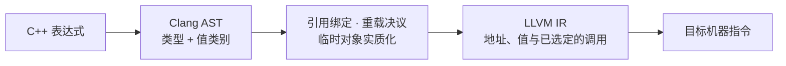
```mermaid
flowchart LR
    SOURCE["C++ 表达式"] --> AST["Clang AST<br/>类型 + 值类别"]
    AST --> SEMANTIC["引用绑定 · 重载决议<br/>临时对象实质化"]
    SEMANTIC --> IR["LLVM IR<br/>地址、值与已选定的调用"]
    IR --> MACHINE["目标机器指令"]
```

### 前端先根据值类别完成引用绑定

以下两个重载的参数类型不同：

```cpp
void take(int&);  // 左值引用
void take(int&&); // 右值引用

void test(int& value) {
    take(value);
    take(static_cast<int&&>(value));
    take(42);
}
```

非模板引用绑定的基本方向如下，实际规则还会检查 `const`、`volatile`、继承转换和用户定义转换：

| 形参 | 可以直接绑定的典型表达式 |
| --- | --- |
| `T&` | 类型兼容的左值 |
| `const T&` | 左值、将亡值和纯右值 |
| `T&&` | 类型兼容的将亡值和纯右值 |
| `const T&&` | 类型兼容的右值；绑定后只能通过该引用进行 `const` 访问，因此很少用于资源转移 |

对示例执行下面的命令可以查看 Clang AST：

```bash
clang++ -std=c++20 -Xclang -ast-dump -fsyntax-only value.cpp
```

删去节点地址和无关包装后，三个实参的核心节点是：

```text
take(value)
`- DeclRefExpr 'int' lvalue

take(static_cast<int&&>(value))
`- CXXStaticCastExpr 'int' xvalue <NoOp>
   `- DeclRefExpr 'int' lvalue

take(42)
`- MaterializeTemporaryExpr 'int' xvalue
   `- IntegerLiteral 'int' 42
```

前端据此完成三件事：

1. `value` 是 lvalue，选择 `take(int&)`。
2. `static_cast<int&&>` 只把表达式改为 xvalue，选择 `take(int&&)`；AST 中的 `<NoOp>` 表明它没有修改对象或搬运数据。
3. `42` 原本是 prvalue。右值引用需要绑定到有身份、有地址的对象，因此 C++17 的临时对象实质化转换产生一个临时 `int`，再让引用绑定到表示该临时对象的 xvalue。

### 进入 LLVM IR 后通常只剩地址

用 `-O0 -S -emit-llvm` 编译上例，忽略调试属性和为形参生成的冗余装载后，核心 IR 类似：

```llvm
define void @_Z4testRi(ptr %value) {
    %temporary = alloca i32

    call void @_Z4takeRi(ptr %value)
    call void @_Z4takeOi(ptr %value)

    store i32 42, ptr %temporary
    call void @_Z4takeOi(ptr %temporary)
    ret void
}

declare void @_Z4takeRi(ptr)
declare void @_Z4takeOi(ptr)
```

在 Itanium C++ ABI 的修饰名中，`Ri` 表示 `int&`，`Oi` 表示 `int&&`。两个函数在 LLVM IR 层都接收 `ptr`，但前端已经选择了不同的目标符号。前两次调用甚至传入同一个 `%value` 地址：右值转换没有移动任何数据，只改变了允许匹配的接口。

prvalue `42` 起初没有对象身份；引用绑定使前端在语义上将它实质化为临时对象。未优化 IR 因而分配临时存储、写入 42，再把地址交给右值引用形参。优化器以后可以消除这块存储，但不能改变临时对象的可观察生命周期。

C++ 标准没有规定引用必须实现成指针，也没有规定引用变量必须单独占用存储；上面的 `ptr` 是该目标 ABI 和这段代码的降低结果。关键分界是：值类别与引用绑定由 C++ 前端处理，LLVM 后端通常看不到名为 lvalue 或 xvalue 的运行期类型。

### 右值引用变量的名字仍是左值表达式

引用类型描述“初始化时允许绑定什么”，变量名的值类别描述“此后怎样使用这个表达式”。任何有名字的变量都能被反复定位，因此名字表达式是左值，即使变量的声明类型是右值引用：

```cpp
void relay(int&& value) {
    take(value);                     // value 是左值表达式，选择 take(int&)
    take(static_cast<int&&>(value)); // xvalue，选择 take(int&&)
}
```

`std::move(value)` 的核心语义就是这里的 `static_cast<int&&>`：显式恢复右值类别，让后续重载有机会复用资源；真正的数据转移仍由被选中的移动构造、移动赋值或其他 `T&&` 接口完成。

### 引用绑定还决定临时对象生命周期

当引用直接绑定到临时对象时，前端不仅检查类型和值类别，还要安排临时对象的析构位置：

```cpp
struct Widget {};

void lifetime() {
    const Widget& left = Widget{};
    Widget&& right = Widget{};

    // 两个临时 Widget 都存活到各自引用的作用域结束。
}
```

Clang AST 会为两次初始化生成 `MaterializeTemporaryExpr`，并记录临时对象分别由变量 `left` 和 `right` 延长生命周期。右值引用也能延长直接绑定临时对象的生命周期，并非只有 `const T&` 可以。

这种延长取决于绑定上下文：临时对象绑定到函数的引用形参时，只存活到包含该调用的完整表达式结束；从函数返回一个指向局部对象的引用，也不会延长局部对象的生命周期。

---

## 4.3 std::move 的本质

`std::move` 不移动任何东西。

它只是一个类型转换：

```cpp
template <class T>
constexpr std::remove_reference_t<T>&& move(T&& t) noexcept;
```

本质可以近似理解为：

```cpp
static_cast<std::remove_reference_t<T>&&>(t)
```

这里必须先移除 `T` 的引用。如果直接写成 `static_cast<T&&>(t)`，当 `T` 被推导为左值引用时会发生引用折叠，无法实现 `std::move` 的无条件右值转换语义。

例子：

```cpp
std::string s = "hello";
std::string t = std::move(s);
```

真正移动发生在 `std::string` 的移动构造函数里，不是发生在 `std::move` 里。


> std::move 只是把表达式转换成右值，让移动构造或移动赋值有机会被调用。

---

## 4.4 移动后的对象还能用吗？

可以析构，可以赋新值，可以调用没有前置条件的函数，但不要假设它原来的值。

```cpp
std::string s = "hello";
std::string t = std::move(s);

s = "world"; // OK
```

对于标准库中明确满足相应要求的类型，移动后的源对象通常处于：

> valid but unspecified state  
> 有效但值未指定的状态。

这意味着对象的不变量仍成立，可以安全析构、重新赋值，也可以调用不依赖特定值的操作；但不能假设它一定为空。对于用户自定义类型，移动后状态由该类型自己的契约决定，移动操作必须保证源对象至少可以安全析构。

---

## 4.5 从 `const` 对象“移动”通常仍是拷贝

`std::move` 会保留 `const`：

```cpp
const std::string source = "hello";
std::string target = std::move(source);
```

`std::move(source)` 的类型是 `const std::string&&`。常见移动构造函数接受 `std::string&&`，不能绑定到 `const` 右值，因此这里通常调用拷贝构造。

移动的本质是允许修改源对象并接管其资源；`const` 对象不能被修改，所以“对 const 使用 move”通常无法获得资源转移效果。

---

## 4.6 `std::exchange` 与 `std::swap`

`std::exchange` 在 `<utility>` 中定义，用一个新值替换对象，同时返回对象被替换前的旧值。其核心逻辑可以近似理解为：

```cpp
template <class T, class U = T>
constexpr T exchange(T& object, U&& new_value) {
    T old_value = std::move(object);
    object = std::forward<U>(new_value);
    return old_value;
}
```

例如：

```cpp
#include <utility>

int state = 1;
int old_state = std::exchange(state, 2);

// old_state == 1
// state == 2
```

它和 `std::swap` 的数据流不同：

```cpp
int left = 1;
int right = 2;

int old_left = std::exchange(left, right);
// old_left == 1，left == 2，right == 2

left = 1;
right = 2;
std::swap(left, right);
// left == 2，right == 1
```

| 操作 | 结果 | 典型用途 |
| --- | --- | --- |
| `std::exchange(object, new_value)` | 返回 `object` 的旧值，并用第二个实参替换它；第二个实参不会接收旧值 | 取走资源并把源对象重置为明确状态 |
| `std::swap(left, right)` | `left` 与 `right` 双向互换，不返回旧值 | 交换两个仍需继续使用的对象 |

当 `new_value` 是左值时，通常由它拷贝赋值给 `object`，自身保持不变；当它是右值时，可能由它移动赋值，因而进入移动后状态。`exchange` 允许两个实参类型不同，只要旧值能构造为 `T`，并且 `T&` 能接受新值；普通 `swap` 则围绕两个对象的双向交换设计。

因此，移动构造中常用 `std::exchange` 一次完成“接管旧资源”和“清空源对象”：

```cpp
#include <cstdio>
#include <utility>

class File {
public:
    File(File&& other) noexcept
        : fp_(std::exchange(other.fp_, nullptr)) {}

private:
    std::FILE* fp_ = nullptr;
};
```

这里返回的旧指针进入新对象的 `fp_`，同时 `other.fp_` 被设为 `nullptr`。如果改用 `std::swap(fp_, other.fp_)`，必须先确保 `fp_` 已经处于合适的初始状态，而且表达的重点变成了双方互换，不如 `exchange` 直接。

`std::exchange` 只是普通的非原子工具函数；后文的 `std::atomic<T>::exchange()` 是不可分割的原子读改写操作，还涉及内存序，两者不要混淆。

---

# 5. 对象生命周期与特殊成员函数

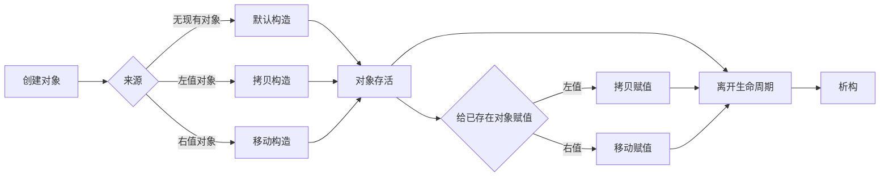
```mermaid
flowchart LR
    A["创建对象"] --> B{"来源"}
    B -->|无现有对象| C["默认构造"]
    B -->|左值对象| D["拷贝构造"]
    B -->|右值对象| E["移动构造"]
    C --> F["对象存活"]
    D --> F
    E --> F
    F --> G{"给已存在对象赋值"}
    G -->|左值| H["拷贝赋值"]
    G -->|右值| I["移动赋值"]
    F --> J["离开生命周期"]
    H --> J
    I --> J
    J --> K["析构"]
```


## 5.1 六大特殊成员函数

C++ 中常说的特殊成员函数包括：

```cpp
class A {
public:
    A();                         // 默认构造
    ~A();                        // 析构
    A(const A&);                 // 拷贝构造
    A& operator=(const A&);      // 拷贝赋值
    A(A&&) noexcept;             // 移动构造
    A& operator=(A&&) noexcept;  // 移动赋值
};
```

它们分别对应：

| 函数     | 场景                     |
| -------- | ------------------------ |
| 默认构造 | 创建对象                 |
| 析构函数 | 销毁对象                 |
| 拷贝构造 | 用已有对象初始化新对象   |
| 拷贝赋值 | 已存在对象之间赋值       |
| 移动构造 | 用右值初始化新对象       |
| 移动赋值 | 已存在对象从右值接管资源 |

---

## 5.2 初始化不是赋值

高频易错点：

```cpp
A b = a;
```

这是拷贝构造，不是拷贝赋值。

```cpp
A b;
b = a;
```

这才是拷贝赋值。

类似：

```cpp
A c = std::move(a);
```

这是移动构造，不是移动赋值。

```cpp
A c;
c = std::move(a);
```

这才是移动赋值。

---

## 5.3 拷贝省略

C++17 之后，某些场景强制拷贝省略：

```cpp
T make() {
    return T{};
}

T x = make();
```

这里通常不会发生移动或拷贝，直接在目标对象位置构造。

NRVO：

```cpp
T make() {
    T t;
    return t;
}
```

这叫 Named Return Value Optimization。编译器通常会优化掉拷贝/移动，但不是所有情况下强制。

---

## 5.4 隐式生成、删除与抑制规则

特殊成员函数是否由编译器隐式生成，不能只靠“六个函数都会自动出现”来理解。

关键规则可以概括为：

1. 只要声明了任意构造函数，编译器通常就不会再隐式生成默认构造函数；需要时应显式写 `A() = default;`。
2. 用户声明了拷贝构造、拷贝赋值或析构函数时，隐式移动构造和移动赋值通常不会生成。
3. 用户声明了移动构造或移动赋值后，隐式拷贝操作会被定义为删除。
4. 即使函数被声明或隐式生成，如果某个成员或基类不能执行对应操作，该函数也可能被定义为删除。
5. `= default` 表示请求编译器生成默认语义；`= delete` 表示明确禁止该操作。

```cpp
class FileHandle {
public:
    FileHandle() = default;

    FileHandle(const FileHandle&) = delete;
    FileHandle& operator=(const FileHandle&) = delete;

    FileHandle(FileHandle&&) noexcept = default;
    FileHandle& operator=(FileHandle&&) noexcept = default;
};
```

设计类时应明确回答：它是否可默认构造、可拷贝、可移动，以及这些操作的所有权语义是什么。

---

# 6. Rule of Three / Five / Zero

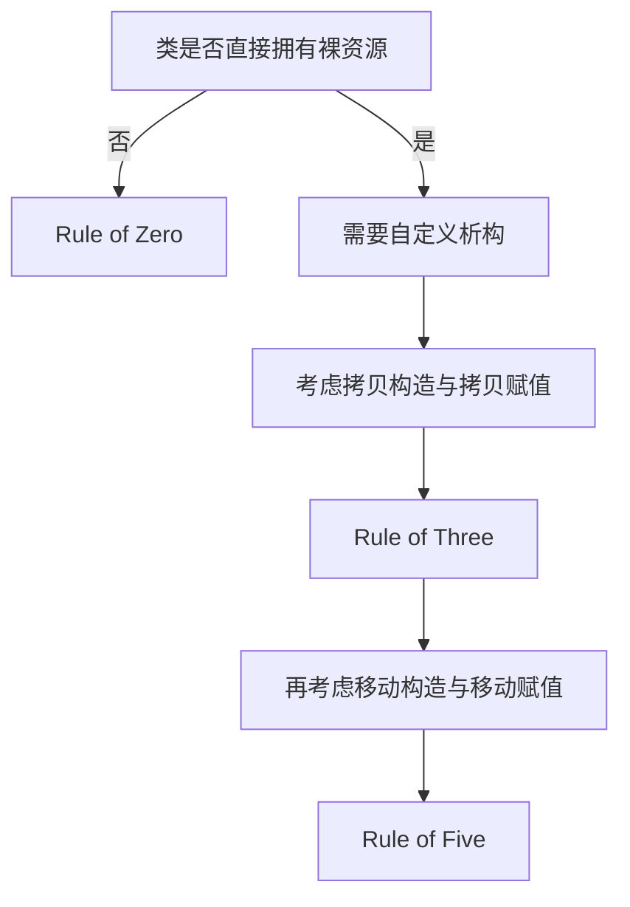
```mermaid
flowchart TD
    A["类是否直接拥有裸资源"] -->|否| B["Rule of Zero"]
    A -->|是| C["需要自定义析构"]
    C --> D["考虑拷贝构造与拷贝赋值"]
    D --> E["Rule of Three"]
    E --> F["再考虑移动构造与移动赋值"]
    F --> G["Rule of Five"]
```


## 6.1 Rule of Three

如果一个类需要自己写以下任意一个：

1. 析构函数
2. 拷贝构造
3. 拷贝赋值

通常就需要同时考虑另外两个。

原因是：类大概率管理了资源。

错误例子：

```cpp
class Buffer {
public:
    Buffer(size_t n) : data_(new char[n]) {}
    ~Buffer() { delete[] data_; }

private:
    char* data_;
};
```

默认拷贝构造会浅拷贝指针：

```cpp
Buffer a(1024);
Buffer b = a; // a.data_ 和 b.data_ 指向同一块内存
```

最终会 double delete。

---

## 6.2 Rule of Five

C++11 加入移动语义后，如果类管理资源，通常要考虑五个函数：

```cpp
class Buffer {
public:
    Buffer(size_t n)
        : size_(n), data_(new char[n]) {}

    ~Buffer() {
        delete[] data_;
    }

    Buffer(const Buffer& other)
        : size_(other.size_), data_(new char[other.size_]) {
        std::copy(other.data_, other.data_ + size_, data_);
    }

    Buffer& operator=(const Buffer& other) {
        if (this == &other) {
            return *this;
        }

        char* new_data = new char[other.size_];
        std::copy(other.data_, other.data_ + other.size_, new_data);

        delete[] data_;
        data_ = new_data;
        size_ = other.size_;

        return *this;
    }

    Buffer(Buffer&& other) noexcept
        : size_(other.size_), data_(other.data_) {
        other.size_ = 0;
        other.data_ = nullptr;
    }

    Buffer& operator=(Buffer&& other) noexcept {
        if (this == &other) {
            return *this;
        }

        delete[] data_;

        size_ = other.size_;
        data_ = other.data_;

        other.size_ = 0;
        other.data_ = nullptr;

        return *this;
    }

private:
    size_t size_{0};
    char* data_{nullptr};
};
```

关键点：

1. 拷贝构造要深拷贝。
2. 拷贝赋值要处理自赋值。
3. 移动构造要偷资源，并把源对象置空。
4. 移动赋值要先释放自己的旧资源，再接管新资源。
5. 移动操作通常要 `noexcept`。

---

## 6.3 Rule of Zero

现代 C++ 更推荐 Rule of Zero：

> 类本身不直接管理裸资源，而是交给标准库类型管理。

比如：

```cpp
class Buffer {
public:
    explicit Buffer(size_t n) : data_(n) {}

private:
    std::vector<char> data_;
};
```

这样不需要手写析构、拷贝、移动。


> 如果业务类只是组合标准库资源管理类型，就尽量不要手写特殊成员函数，让编译器生成正确版本。

此外，自定义拷贝赋值要关注异常安全。常见方式是先构造新资源，成功后再替换旧状态，或者使用 copy-and-swap。移动赋值中的自移动虽然很少见，但实现应保持对象可析构且不泄漏。

---

# 7. RAII

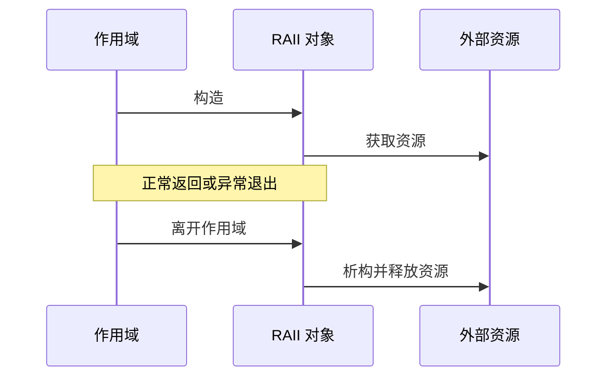
```mermaid
sequenceDiagram
    participant Scope as 作用域
    participant Obj as RAII 对象
    participant Res as 外部资源
    Scope->>Obj: 构造
    Obj->>Res: 获取资源
    Note over Scope,Obj: 正常返回或异常退出
    Scope->>Obj: 离开作用域
    Obj->>Res: 析构并释放资源
```


## 7.1 RAII 是什么

RAII：Resource Acquisition Is Initialization。

中文常翻译为：

> 资源获取即初始化。

核心思想：

1. 在构造函数中获取资源。
2. 在析构函数中释放资源。
3. 利用对象生命周期自动管理资源。

例子：

```cpp
#include <cstdio>
#include <stdexcept>
#include <utility>

class File {
public:
    explicit File(const char* path)
        : fp_(std::fopen(path, "r")) {
        if (fp_ == nullptr) {
            throw std::runtime_error("open file failed");
        }
    }

    ~File() noexcept {
        if (fp_ != nullptr) {
            // fclose 的失败应通过显式 close() 或日志处理；
            // 析构函数不能通过异常报告失败。
            std::fclose(fp_);
        }
    }

    File(const File&) = delete;
    File& operator=(const File&) = delete;

    File(File&& other) noexcept
        : fp_(std::exchange(other.fp_, nullptr)) {}

    File& operator=(File&& other) noexcept {
        if (this != &other) {
            if (fp_ != nullptr) {
                std::fclose(fp_);
            }
            fp_ = std::exchange(other.fp_, nullptr);
        }
        return *this;
    }

    std::FILE* get() const noexcept {
        return fp_;
    }

private:
    std::FILE* fp_{nullptr};
};
```

对于需要检查关闭错误的资源，可以提供显式 `close()` 返回错误，再让析构函数承担兜底释放职责。

---

## 7.2 RAII 管什么资源

不只是内存。

RAII 可以管理：

1. 堆内存。
2. 文件句柄。
3. socket。
4. mutex。
5. 数据库连接。
6. 线程。
7. GPU 资源。
8. 临时目录。
9. 日志上下文。
10. 事务回滚。

---

# 8. 智能指针

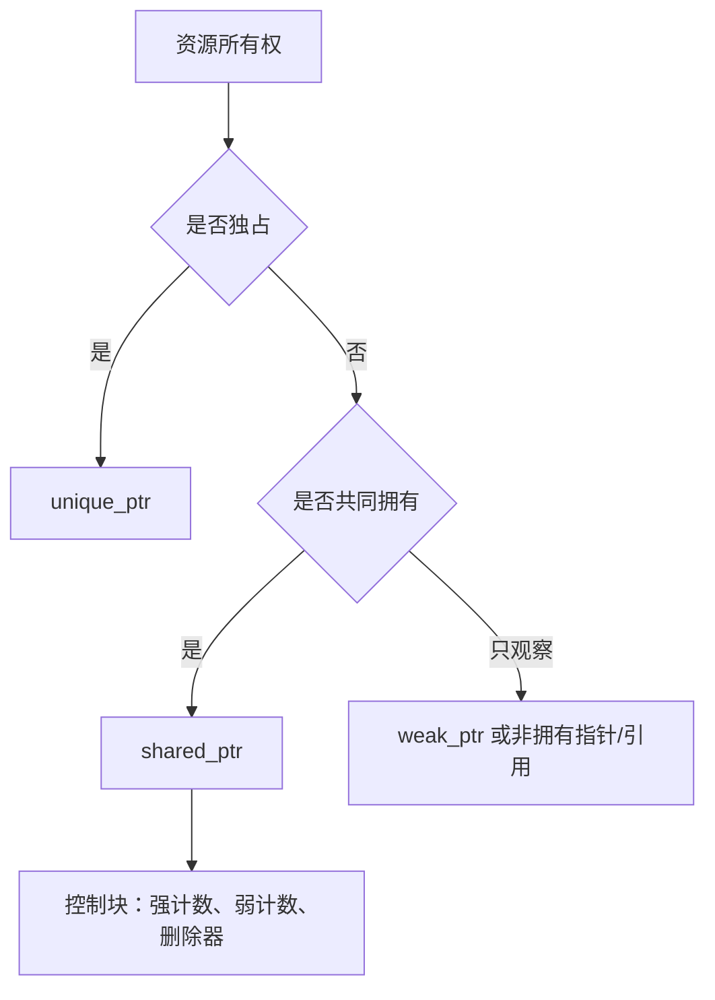
```mermaid
flowchart TD
    A["资源所有权"] --> B{"是否独占"}
    B -->|是| C["unique_ptr"]
    B -->|否| D{"是否共同拥有"}
    D -->|是| E["shared_ptr"]
    D -->|只观察| F["weak_ptr 或非拥有指针/引用"]
    E --> G["控制块：强计数、弱计数、删除器"]
```


## 8.1 unique_ptr

`std::unique_ptr<T>` 表示独占所有权。

```cpp
std::unique_ptr<int> p = std::make_unique<int>(10);
```

特点：

1. 不能拷贝。
2. 可以移动。
3. 析构时调用删除器释放资源。
4. 使用无状态删除器时通常没有额外运行期所有权开销；有状态删除器可能增大对象尺寸。
5. `unique_ptr<T[]>` 用于数组，`unique_ptr<T, Deleter>` 可管理文件、句柄等非 `delete` 资源。

### 用 `fclose` 管理 `FILE*`

`FILE*` 由 `std::fopen` 创建，必须交给 `std::fclose`，不能使用 `delete`：

```cpp
#include <cerrno>
#include <cstdio>
#include <memory>
#include <system_error>

struct FileCloser {
    void operator()(std::FILE* file) const noexcept {
        std::fclose(file);
    }
};

using File = std::unique_ptr<std::FILE, FileCloser>;

File open_file(const char* path) {
    std::FILE* raw = std::fopen(path, "rb");
    if (raw == nullptr) {
        throw std::system_error(errno, std::generic_category(), path);
    }
    return File(raw);
}

void read_header() {
    auto file = open_file("config.bin");

    unsigned char header[16];
    const std::size_t bytes =
        std::fread(header, 1, sizeof header, file.get());
    (void)bytes;

    // 正常返回或异常展开时，file 的析构函数都会调用 fclose。
}
```

`FileCloser` 是无状态类型，典型实现可以利用空基类优化，使 `File` 的大小与一个普通指针相同。`unique_ptr` 只会为非空指针调用删除器，所以 `FileCloser` 接收到的是有效的非空 `FILE*`；`fopen` 失败时则在建立所有权之前抛出异常。

### 管理 POSIX 文件描述符

POSIX 文件描述符是整数，空值用 `-1` 表示，不能直接当作 `unique_ptr` 默认要求的 `T*`。删除器可以通过嵌套的 `pointer` 类型改变 `unique_ptr` 实际保存的句柄类型：

```cpp
#include <cerrno>
#include <fcntl.h>
#include <memory>
#include <system_error>
#include <unistd.h>

struct FileDescriptor {
    int value = -1;

    FileDescriptor() noexcept = default;
    FileDescriptor(std::nullptr_t) noexcept {}
    explicit FileDescriptor(int descriptor) noexcept : value(descriptor) {}

    explicit operator bool() const noexcept {
        return value != -1;
    }

    friend bool operator==(FileDescriptor left,
                           FileDescriptor right) noexcept {
        return left.value == right.value;
    }

    friend bool operator!=(FileDescriptor left,
                           FileDescriptor right) noexcept {
        return !(left == right);
    }

    friend bool operator==(FileDescriptor descriptor,
                           std::nullptr_t) noexcept {
        return descriptor.value == -1;
    }

    friend bool operator!=(FileDescriptor descriptor,
                           std::nullptr_t) noexcept {
        return !(descriptor == nullptr);
    }

    friend bool operator==(std::nullptr_t,
                           FileDescriptor descriptor) noexcept {
        return descriptor == nullptr;
    }

    friend bool operator!=(std::nullptr_t,
                           FileDescriptor descriptor) noexcept {
        return descriptor != nullptr;
    }
};

struct FileDescriptorCloser {
    using pointer = FileDescriptor;

    void operator()(FileDescriptor descriptor) const noexcept {
        ::close(descriptor.value);
    }
};

struct FileDescriptorTag;
using UniqueFileDescriptor =
    std::unique_ptr<FileDescriptorTag, FileDescriptorCloser>;

UniqueFileDescriptor open_file_descriptor(const char* path) {
    int descriptor = ::open(path, O_RDONLY | O_CLOEXEC);
    if (descriptor == -1) {
        throw std::system_error(errno, std::generic_category(), path);
    }
    return UniqueFileDescriptor(FileDescriptor(descriptor));
}

void read_header() {
    auto descriptor = open_file_descriptor("config.bin");

    unsigned char header[16];
    const ssize_t bytes =
        ::read(descriptor.get().value, header, sizeof header);
    (void)bytes;

    // 离开作用域时自动调用 close。
}
```

`FileDescriptorCloser::pointer` 让 `UniqueFileDescriptor` 保存 `FileDescriptor`，而不是 `FileDescriptorTag*`。包装类型把 `-1` 映射为 `nullptr` 语义并提供比较操作，从而满足 `unique_ptr` 对可空指针类型的要求；`FileDescriptorTag` 只提供资源类别，不会被创建或解引用。

```cpp
std::unique_ptr<int> p1 = std::make_unique<int>(10);
// auto p2 = p1; // error

auto p2 = std::move(p1); // OK
```

适用场景：

1. 独占资源。
2. 工厂函数返回对象。
3. 多态对象所有权转移。

```cpp
std::unique_ptr<Base> create() {
    return std::make_unique<Derived>();
}
```

---

## 8.2 shared_ptr

`std::shared_ptr<T>` 表示共享所有权。

它内部通常包含：

1. 指向对象的指针。
2. 指向控制块的指针。

控制块通常包含：

1. 强引用计数。
2. 弱引用计数。
3. deleter。
4. allocator。
5. 可能的类型擦除信息。

```cpp
auto p1 = std::make_shared<int>(10);
auto p2 = p1; // 引用计数 +1
```

当最后一个拥有对象的 `shared_ptr` 被销毁，对象被释放；当强引用和弱引用相关状态都不再需要时，控制块才释放。

线程安全边界需要特别区分：

1. 多个不同的 `shared_ptr` 对象共享同一控制块时，引用计数更新是线程安全的。
2. 同一个 `shared_ptr` 变量被多个线程同时读写，仍需要同步，或使用相应的原子接口。
3. `shared_ptr` 不会自动保证它所指向业务对象的成员访问线程安全。

---

## 8.3 weak_ptr

`std::weak_ptr<T>` 表示弱引用，不增加强引用计数。

主要用途：

1. 打破 shared_ptr 循环引用。
2. 缓存对象但不拥有对象。
3. 观察对象是否还活着。

```cpp
std::weak_ptr<int> wp;

{
    auto sp = std::make_shared<int>(10);
    wp = sp;
}

if (auto sp = wp.lock()) {
    // 对象还活着
} else {
    // 对象已销毁
}
```

---

## 8.4 shared_ptr 循环引用

错误例子：

```cpp
struct Node {
    std::shared_ptr<Node> next;
    std::shared_ptr<Node> prev;
};
```

```cpp
auto a = std::make_shared<Node>();
auto b = std::make_shared<Node>();

a->next = b;
b->prev = a;
```

`a` 和 `b` 互相持有，引用计数永远不为 0。

修复：

```cpp
struct Node {
    std::shared_ptr<Node> next;
    std::weak_ptr<Node> prev;
};
```

一般规则：

> 拥有关系用 shared_ptr，非拥有观察关系用 weak_ptr。

---

## 8.5 `make_shared`、`allocate_shared` 与直接构造

普通对象通常优先使用：

```cpp
auto p = std::make_shared<T>();
```

它通常把 `T` 对象和控制块放进同一次内存分配中，而下面的直接构造通常分别分配对象和控制块：

```cpp
std::shared_ptr<T> p(new T);
```

合并分配减少一次分配并改善局部性，也避免裸指针在复杂表达式中短暂暴露。不过两种布局的释放时机不同：

1. 最后一个 `shared_ptr` 消失时，`T` 的析构函数立即执行。
2. 控制块要等最后一个相关 `weak_ptr` 也消失后才释放。
3. 合并分配时，对象所在的整块内存也会随控制块保留；对象很大且弱引用长期存在时，分开分配可能更合适。

### `allocate_shared` 是什么

`std::allocate_shared<T>(allocator, args...)` 与 `make_shared<T>(args...)` 具有相同的共享所有权语义，区别是由调用者提供 allocator。典型实现会用该 allocator 的重绑定类型为“控制块 + `T` 对象”取得一块内存，再在其中构造 `T`：

```cpp
#include <array>
#include <cstddef>
#include <memory>
#include <memory_resource>

struct Task {
    Task(int task_id, double task_cost)
        : id(task_id), cost(task_cost) {}

    int id;
    double cost;
};

void build_task() {
    std::array<std::byte, 1024> storage{};
    std::pmr::monotonic_buffer_resource resource(
        storage.data(),
        storage.size(),
        std::pmr::null_memory_resource());

    {
        std::pmr::polymorphic_allocator<Task> allocator(&resource);
        auto task = std::allocate_shared<Task>(allocator, 7, 1.5);
        std::weak_ptr<Task> observer = task;

        // Task 和控制块使用 resource 提供的存储。
        // observer、task 都在 resource 销毁前离开作用域。
        (void)observer;
    }
}
```

这里的 `polymorphic_allocator` 把分配请求转发给 `monotonic_buffer_resource`，初始缓冲区不足时因上游被设为 `null_memory_resource()` 而抛出 `std::bad_alloc`。`allocate_shared` 会把 allocator 状态保存在控制块需要的实现状态中，以便最后释放控制块；因此 allocator 所引用的 `memory_resource` 必须活到最后一个相关 `shared_ptr` 和 `weak_ptr` 销毁之后。

该 allocator 只控制 `Task` 与控制块使用的存储，不会自动改变 `Task` 成员内部的分配器。例如普通 `std::string` 成员仍使用自己的 allocator；若这些内部动态分配也要来自同一资源，需要让成员本身使用相应的 allocator-aware 类型，例如 `std::pmr::string`，并正确传入资源。

三个接口的边界如下：

| 创建方式 | 对象存储 | 控制块存储 | 自定义删除器 |
| --- | --- | --- | --- |
| `make_shared<T>(args...)` | 通常与控制块合并 | 实现选择的默认分配机制 | 不支持传入 |
| `allocate_shared<T>(alloc, args...)` | 通常与控制块合并 | 调用者提供的 allocator | 不支持传入 |
| `shared_ptr<T>(raw, deleter, alloc)` | 由 `raw` 的来源决定 | `alloc` 只负责控制块 | 支持 |

最后一种形式中的 allocator 不会替 `raw` 分配或释放对象；对象由传入的 deleter 处理。需要管理 `FILE*`、句柄等采用特殊释放函数的资源时，应使用自定义删除器，而不是 `allocate_shared`。

---

## 8.6 shared_ptr 不能从同一个裸指针构造两次

严重错误：

```cpp
int* raw = new int(10);

std::shared_ptr<int> p1(raw);
std::shared_ptr<int> p2(raw);
```

这里会产生两个控制块。

结果：

1. p1 认为自己拥有 raw。
2. p2 也认为自己拥有 raw。
3. 最后会 delete 两次。
4. 产生未定义行为。

正确：

```cpp
auto p1 = std::make_shared<int>(10);
auto p2 = p1;
```

---

## 8.7 enable_shared_from_this

错误例子：

```cpp
class A {
public:
    std::shared_ptr<A> getPtr() {
        return std::shared_ptr<A>(this);
    }
};
```

这会创建新的控制块，非常危险。

正确写法：

```cpp
class A : public std::enable_shared_from_this<A> {
public:
    std::shared_ptr<A> getPtr() {
        return shared_from_this();
    }
};
```

使用注意：

```cpp
auto p = std::make_shared<A>();
auto q = p->getPtr(); // OK
```

不能在对象还没有被 `shared_ptr` 管理时调用：

```cpp
A a;
// a.getPtr(); // error，可能抛 std::bad_weak_ptr
```

也不要在构造函数中调用 `shared_from_this()`，因为此时 shared_ptr 控制块还没有完全建立。

---

## 8.8 自定义删除器与别名构造

`shared_ptr` 的删除器保存在控制块中，因此不同资源可以沿用同一套共享所有权机制：

```cpp
auto file = std::shared_ptr<std::FILE>(
    std::fopen("config.txt", "r"),
    [](std::FILE* fp) {
        if (fp != nullptr) {
            std::fclose(fp);
        }
    });
```

自定义删除器是 `shared_ptr` 运行期状态的一部分，不会像 `unique_ptr<T, Deleter>` 那样直接成为指针对象的模板参数。这使不同删除器的 `shared_ptr<T>` 仍然具有相同类型，但控制块会保存相应的删除逻辑。

别名构造函数允许“拥有一个对象，但暴露它的某个子对象”：

```cpp
struct Packet {
    int header;
    std::vector<std::byte> payload;
};

auto packet = std::make_shared<Packet>();
std::shared_ptr<std::vector<std::byte>> payload(packet, &packet->payload);
```

此时需要区分两个指针：

1. `payload.get()` 指向 `packet->payload`；
2. 控制块仍然拥有整个 `Packet`；
3. 只要 `payload` 还存在，整个 `Packet` 就不会析构；
4. `get()` 相同不代表共享控制块，`get()` 不同也不代表所有权无关。

别名构造适合返回对象内部视图，但如果子对象指针被继续当成独立所有权交给别处，就会让接口含义变得混乱。

---

## 8.9 `atomic<shared_ptr>` 与线程安全边界

C++20 提供 `std::atomic<std::shared_ptr<T>>`，可原子地发布和替换一个共享所有权快照：

```cpp
std::atomic<std::shared_ptr<const Config>> current;

void publish(Config next) {
    current.store(
        std::make_shared<const Config>(std::move(next)),
        std::memory_order_release);
}

std::shared_ptr<const Config> snapshot() {
    return current.load(std::memory_order_acquire);
}
```

它保证的是 `shared_ptr` 这个句柄的原子读写，以及相应控制块状态的正确维护，不会让 `Config` 的可变成员自动变成线程安全。发布不可变快照通常比让多个线程共同修改同一个对象更容易推理。

普通 `shared_ptr` 已经允许多个线程操作各自的句柄副本；只有多个线程需要并发读写**同一个句柄变量**时，才需要锁或原子接口。

---

# 9. new/delete 与 malloc/free

## 9.1 区别

需要区分 **new 表达式** 与 **`operator new` 分配函数**：

1. new 表达式先选择合适的 `operator new` 获取原始存储，再在其中构造对象。
2. 普通 delete 表达式先调用析构函数，再调用为本次删除选出的 `operator delete` 释放存储。
3. `malloc/free` 只管理原始字节，不建立或结束 C++ 对象的构造/析构语义。

| 项目 | new/delete 表达式 | `malloc/free` |
| --- | --- | --- |
| 所属体系 | C++ 语言表达式 | C 标准库函数 |
| 构造函数 | new 表达式调用 | 不调用 |
| 析构函数 | delete 表达式调用 | 不调用 |
| 返回类型 | 返回相应类型指针 | 返回 `void*` |
| 默认失败行为 | 通常抛 `std::bad_alloc`；`std::nothrow` 版本返回空指针 | 返回 `nullptr` |
| 定制方式 | 可替换全局分配函数，也可定义类专属 `operator new/delete` | 可更换分配器，但不是 C++ 运算符重载 |

---

## 9.2 `operator new` 与 `operator delete`

以下是最常见全局分配函数的概念签名；实际声明由 `<new>` 提供，默认定义由 C++ 运行库提供：

```cpp
#include <new>

void* operator new(std::size_t bytes);
void operator delete(void* memory) noexcept;
```

`operator new` 接收所需字节数并返回满足要求的原始存储，不知道稍后要调用哪个构造函数；普通 `operator delete` 接收原始存储地址并释放它，也不会主动调用析构函数。普通 throwing `operator new` 分配失败时应抛出 `std::bad_alloc`。

对一个普通、非数组对象，下面的 new 表达式：

```cpp
Widget* widget = new Widget(1, 2);
```

可以概念化为：

```cpp
void* memory = ::operator new(sizeof(Widget));

try {
    Widget* widget = ::new (memory) Widget(1, 2);
    // new 表达式的结果是 widget
} catch (...) {
    ::operator delete(memory);
    throw;
}
```

其中 `::new (memory) Widget(1, 2)` 是 placement new：它只在已有存储中构造对象。以上代码用于说明阶段划分，不是 new 表达式的完整标准实现；实际编译器还要处理类专属分配函数、对齐、数组、构造失败匹配和 ABI 信息。

在不考虑虚析构、类专属释放函数和 C++20 destroying delete 的简化场景中，对应的 delete 表达式可以概念化为：

```cpp
if (widget != nullptr) {
    widget->~Widget();
    ::operator delete(widget);
}
```

因此，直接调用 `::operator delete(widget)` 会跳过析构；只显式调用 `widget->~Widget()` 又不会释放存储。普通代码应使用完整的 `new/delete` 表达式或智能指针，而不是手动拆开这两个阶段。

C++20 的 destroying delete 是高级定制例外：若类提供类似 `static void operator delete(Trace*, std::destroying_delete_t) noexcept` 的释放函数，delete 表达式会把“调用析构并释放存储”的责任交给该函数。它没有改变普通 `operator delete(void*)` 只负责存储的含义。

### 类专属分配函数

类可以定义自己的分配与释放函数。new 表达式创建该类对象时会优先进行类作用域查找：

```cpp
#include <cstddef>
#include <cstdio>
#include <cstdlib>
#include <new>

class Trace {
public:
    explicit Trace(int value) : value_(value) {
        std::fprintf(stderr, "construct %d\n", value_);
    }

    ~Trace() {
        std::fprintf(stderr, "destroy %d\n", value_);
    }

    static void* operator new(std::size_t bytes) {
        if (void* memory = std::malloc(bytes)) {
            std::fprintf(stderr, "allocate %zu bytes\n", bytes);
            return memory;
        }
        throw std::bad_alloc();
    }

    static void operator delete(void* memory) noexcept {
        std::fprintf(stderr, "deallocate\n");
        std::free(memory);
    }

private:
    int value_;
};

int main() {
    Trace* trace = new Trace(7);
    delete trace;
}
```

典型输出顺序是：

```text
allocate 4 bytes
construct 7
destroy 7
deallocate
```

具体字节数由目标 ABI 的 `sizeof(Trace)` 决定。`Trace::operator new` 和 `Trace::operator delete` 只负责 `Trace` 对象自身的存储；构造和析构仍由 new/delete 表达式插入。写成 `::new Trace(7)` 可以显式绕过类专属查找，要求使用全局分配函数。

### 构造函数抛出时谁释放存储

如果分配成功但构造函数抛出异常，对象没有完成构造，不能对它调用完整对象的析构函数；new 表达式会调用与本次分配形式匹配的 `operator delete` 回收存储：

```cpp
#include <cstddef>
#include <cstdio>
#include <new>

class Failing {
public:
    Failing() {
        throw 42;
    }

    static void* operator new(std::size_t bytes) {
        return ::operator new(bytes);
    }

    static void operator delete(void* memory) noexcept {
        std::fprintf(stderr, "constructor failed: release storage\n");
        ::operator delete(memory);
    }
};

int main() {
    try {
        Failing* value = new Failing;
        (void)value;
    } catch (int) {
    }
}
```

这里会执行 `Failing::operator delete`，不会执行 `Failing::~Failing()`；已经构造完成的成员和基类子对象则会按构造回退规则自动析构。所谓“匹配”还包括分配函数的额外参数：对齐 new、数组 new 或自定义 placement new 都需要相应的释放形式，编译器不能随意改用一个签名不匹配的函数。

---

## 9.3 数组必须 delete[]

数组表达式使用对应的数组分配函数：

```cpp
#include <cstddef>

void* operator new[](std::size_t bytes);
void operator delete[](void* memory) noexcept;
```

错误：

```cpp
int* p = new int[10];
delete p; // wrong
```

正确：

```cpp
delete[] p;
```

因为 `new[]` 和 `delete[]` 必须配对。

`new T[n]` 会构造 `n` 个元素；若中途某个构造函数抛出异常，已经完成构造的元素会按相反顺序析构，再释放数组存储。`delete[]` 同样要按相反顺序析构全部元素，然后调用数组释放函数。实现可能在分配块中保存元素数量等额外信息，通常称为 array cookie，但具体布局不是 C++ 标准接口。

---

## 9.4 malloc 不构造对象

错误：

```cpp
A* p = static_cast<A*>(std::malloc(sizeof(A)));
std::free(p);
```

这不会调用构造和析构。

如果确实要在已分配内存上构造对象，要使用 placement new：

```cpp
void* mem = std::malloc(sizeof(A));
A* p = new (mem) A();

p->~A();
std::free(mem);
```

placement new 只构造对象，不负责释放底层存储。显式析构也只结束对象生命周期，不会自动调用 `free` 或 `operator delete`。

---

## 9.5 分配失败、对齐与匹配的释放函数

普通 throwing `new` 分配失败时通常抛出 `std::bad_alloc`。全局分配函数可以借助 `std::set_new_handler` 安装失败处理器：

```cpp
void on_allocation_failure() {
    release_emergency_cache();
    std::set_new_handler(nullptr);
}

std::set_new_handler(on_allocation_failure);
```

处理器返回后，分配函数可以再次尝试；处理器也可以抛出异常或终止程序。它不是普通业务内存不足处理方案，因为进程接近耗尽内存时，日志、异常对象和恢复操作本身也可能需要分配。

若类型的 `alignof(T)` 大于实现的默认 new 对齐值 `__STDCPP_DEFAULT_NEW_ALIGNMENT__`，它就是过度对齐类型。`std::align_val_t` 是 `<new>` 定义的强类型对齐值，new 表达式用它把 `alignof(T)` 传给对齐版本的分配函数，并在删除时选择对应的释放函数：

```cpp
#include <cstddef>
#include <new>

void* operator new(std::size_t bytes, std::align_val_t alignment);
void operator delete(void* memory, std::align_val_t alignment) noexcept;
```

例如下面的 `CacheLine` 在默认 new 对齐小于 64 的实现上属于过度对齐类型：

```cpp
#include <cstddef>

struct alignas(64) CacheLine {
    std::byte data[64];
};

auto* line = new CacheLine;
delete line;
```

这里的分配调用可理解为额外传入 `std::align_val_t{alignof(CacheLine)}`。编译器负责让对应的对齐分配和释放函数匹配。自行定义类专属 `operator new/delete` 时，需要同时考虑普通、数组、对齐和可能的 sized delete 形式，不要把来自一种分配接口的指针交给另一种释放接口。

还有一个容易遗漏的异常路径：

```cpp
Widget* p = new Widget(args...);
```

如果原始存储已经分配成功，但 `Widget` 构造函数抛出异常，new 表达式会自动调用与本次分配匹配的 `operator delete`。对象没有构造完成，因此调用者既拿不到 `p`，也不应手动释放它。

---

# 10. 继承与对象内存布局

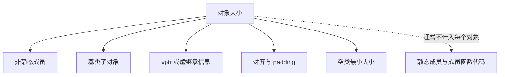
```mermaid
flowchart TD
    A["对象大小"] --> B["非静态成员"]
    A --> C["基类子对象"]
    A --> D["vptr 或虚继承信息"]
    A --> E["对齐与 padding"]
    A --> F["空类最小大小"]
    A -. "通常不计入每个对象" .-> G["静态成员与成员函数代码"]
```


## 10.1 类对象大小由什么决定

C++ 标准规定对象语义和若干布局约束，但不会统一规定普通类、虚表和虚继承的具体内存布局。下面内容描述主流 ABI 的典型实现。

影响因素：

1. 非静态数据成员。
2. 基类子对象。
3. 虚函数带来的 vptr。
4. 虚继承带来的额外指针或偏移信息。
5. 内存对齐和 padding。
6. 空类大小。
7. `[[no_unique_address]]`。
8. 编译器 ABI。

不影响每个对象大小的通常有：

1. 静态成员变量。
2. 普通成员函数。
3. 静态成员函数。
4. 非虚函数代码。

下面的程序可以直接观察目标 ABI 的对齐和 padding：

```cpp
#include <cstddef>
#include <iostream>

struct Layout {
    char tag;
    int value;

    static int object_count;
    void touch() {}
};

int main() {
    std::cout << "sizeof=" << sizeof(Layout)
              << ", alignof=" << alignof(Layout)
              << ", value offset=" << offsetof(Layout, value)
              << '\n';
}
```

一种常见输出是 `sizeof=8, alignof=4, value offset=4`：`tag` 后面插入了 3 字节 padding，使 `value` 满足对齐要求。具体数字不是标准保证，应在目标编译器和 ABI 上实测。删除静态成员或普通成员函数通常不会改变结果，因为它们不存放在每个 `Layout` 对象里。

---

## 10.2 空类大小

```cpp
struct A {};
```

空类大小通常是 1。

原因：

> C++ 要求不同对象有不同地址，所以空对象也必须占至少 1 字节。

```cpp
A a1, a2;
assert(&a1 != &a2);
```

---

## 10.3 空基类优化 EBO

```cpp
struct Empty {};

struct X : Empty {
    int value;
};
```

`sizeof(X)` 通常是 4，不是 5 或 8。

因为编译器可以对空基类做 Empty Base Optimization。

---

## 10.4 对齐示例

```cpp
struct S {
    char a;
    int b;
    char c;
};
```

在 64 位系统常见布局：

```text
a: 1
padding: 3
b: 4
c: 1
tail padding: 3
total: 12
```

优化：

```cpp
struct S {
    int b;
    char a;
    char c;
};
```

布局：

```text
b: 4
a: 1
c: 1
tail padding: 2
total: 8
```

---

## 10.5 成员访问与继承方式

成员自身的 `public/protected/private` 和继承列表中的访问说明符解决的是两个不同问题：

1. 成员访问说明符决定基类成员在基类接口中的可见性；
2. 继承方式决定基类的公开、保护成员进入派生类后具有怎样的访问级别，以及外部能否把派生类隐式转换为基类。

| 继承方式 | 基类 public 成员在派生类中 | 基类 protected 成员在派生类中 | 外部的 Derived → Base 转换 |
| --- | --- | --- | --- |
| `public` | public | protected | 允许 |
| `protected` | protected | protected | 通常不允许 |
| `private` | private | private | 通常不允许 |

基类的 private 成员始终不能被派生类直接访问，但它仍然存在于基类子对象中，可以通过基类提供的成员函数操作。

```cpp
class Engine {
public:
    void start();

protected:
    int rpm_ = 0;

private:
    int secret_ = 0;
};

class Car : public Engine {
public:
    void idle() {
        rpm_ = 800;     // OK
        // secret_ = 1; // error
    }
};
```

连续使用 private 继承时，访问权限按继承链逐层检查。假设 `B` private 继承 `A`，`C` 又 private 继承 `B`：第一次 private 继承已经使 `A` 的 public、protected 成员成为 `B` 的 private 成员，因此 `C` 不能直接访问它们；第二次 private 继承并不会删除这些成员，`C` 对象中仍然包含 `A` 基类子对象。

```cpp
struct A {
    void foo() {} // public
};

struct B : private A {};

struct C : private B {
    void test() {
        // foo(); // error：foo 在 B 中已经是 private
    }
};

C object;
// object.foo();               // error
// A* base = &object;          // error：继承路径不可访问
```

这不是“彻底无法使用”：中间类可以通过 `using` 调整访问级别，或者用 public/protected 成员函数包装基类能力。后续派生类若还要向外公开，需要在自己这一层再次开放：

```cpp
struct B : private A {
protected:
    using A::foo; // 向 B 的派生类开放
};

struct C : private B {
public:
    using B::foo; // 再向 C 的调用者开放
};

C object;
object.foo(); // OK
```

public 继承通常表达 is-a 和可替换关系；private 继承更接近“借用基类实现”。如果不需要覆盖虚函数、访问 protected 成员或利用 EBO，组合通常比 private 继承更直接。

---

## 10.6 多继承、菱形继承与虚继承

普通菱形继承会包含两份共同基类子对象：

```text
             Device
             /    \
        Input      Output
             \    /
           SmartDevice
```

```cpp
struct Device {
    int id = 0;
};

struct Input : Device {};
struct Output : Device {};
struct SmartDevice : Input, Output {};

SmartDevice d;
// d.id = 1; // error：不知道是 Input::Device::id 还是 Output::Device::id
d.Input::id = 1;
d.Output::id = 2;
```

如果语义上整个最派生对象只应有一份 `Device`，两条路径都要虚继承它：

```cpp
struct Input : virtual Device {};
struct Output : virtual Device {};
struct SmartDevice : Input, Output {};

SmartDevice d;
d.id = 1; // 只有一个共享的 Device 虚基类子对象
```

典型 ABI 会在对象或虚表中保存到虚基类的动态偏移，因此虚继承可以解决重复基类子对象问题，但会增加布局和访问成本。它不是“让虚函数生效”的继承方式，和动态多态是两个独立概念。

虚基类由**最派生类**负责构造：

```cpp
struct Device {
    explicit Device(int id);
};

struct Input : virtual Device {
    Input() : Device(1) {} // 单独构造 Input 时使用
};

struct SmartDevice : Input {
    SmartDevice() : Device(42), Input() {}
};
```

构造 `SmartDevice` 时，`Input` 初始化列表里的 `Device(1)` 不负责这份虚基类，最终使用最派生类给出的 `Device(42)`。完整对象的构造顺序是：虚基类、直接基类、按声明顺序排列的成员、构造函数体；析构顺序相反。初始化列表的书写顺序不能改变这个规则。

---

## 10.7 多继承中的指针调整与 thunk

多继承对象中的不同基类子对象可能位于不同偏移：

```cpp
struct Left {
    virtual ~Left() = default;
    virtual void run();
};

struct Right {
    virtual ~Right() = default;
    virtual void stop();
};

struct Both : Left, Right {
    void run() override;
    void stop() override;
};

Both object;
Left* left = &object;
Right* right = &object;
```

`left` 和 `right` 转换成 `void*` 后的数值不一定相同，因为它们分别指向两个基类子对象。编译器在派生类与基类之间转换时会调整地址；通过 `Right*` 调用 `Both::stop()` 时，典型 ABI 还可能使用一小段 thunk 代码，把收到的 `this` 调整到 `Both` 对象所需的位置后再进入真正函数。

这些偏移、vptr 数量和 thunk 形式属于 ABI 实现细节。源码只能依赖转换后的语义，不能通过手工加减地址模拟它们。需要跨层级安全转换时，使用语言提供的隐式派生到基类转换、`static_cast` 或多态场景中的 `dynamic_cast`。

---

# 11. 虚函数、虚表、RTTI 与运行期多态

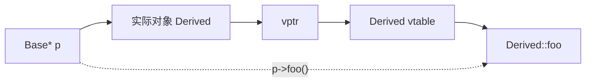
```mermaid
flowchart LR
    P["Base* p"] --> O["实际对象 Derived"]
    O --> V["vptr"]
    V --> T["Derived vtable"]
    T --> F["Derived::foo"]
    P -. "p->foo()" .-> F
```


## 11.1 虚函数分派原理

C++ 标准规定动态分派的行为，不规定对象里必须有 vptr，也不规定 vtable 的布局。下面使用 Linux 上常见的 Itanium C++ ABI 说明 Clang/LLVM 的典型实现：

1. Clang 按 ABI 为多态类生成 vtable，重写函数占据与基类虚函数相同的逻辑槽位。
2. 对象中的 vptr 指向其当前动态类型的 vtable address point。
3. 构造函数负责写入 vptr；构造、析构进入不同子对象阶段时，vptr 也会随之改变。
4. 虚调用从对象读取 vptr，再从固定槽位读取函数地址，最后执行间接调用。

```cpp
struct Base {
    virtual int value() const;
};

struct Derived final : Base {
    int value() const override;
};

int Base::value() const { return 1; }
int Derived::value() const { return 2; }

int dispatch(const Base& object) {
    return object.value();
}

int known_type() {
    Derived object;
    return dispatch(object);
}
```

可以生成未优化和优化后的 LLVM IR：

```bash
clang++ -std=c++20 -O0 -S -emit-llvm virtual.cpp -o virtual-O0.ll
clang++ -std=c++20 -O2 -S -emit-llvm virtual.cpp -o virtual-O2.ll
```

### vtable 与 vptr 是怎样生成的

上例在 x86-64 Itanium ABI 下会产生类似的 vtable 全局常量。下面删去了链接属性，并给符号补上注释：

```llvm
@_ZTV7Derived = constant [3 x ptr] [
    ptr null,                       ; offset-to-top = 0
    ptr @_ZTI7Derived,              ; Derived 的 RTTI/typeinfo
    ptr @_ZNK7Derived5valueEv       ; Derived::value() const
]
```

第一项是 offset-to-top：从当前基类子对象中保存 vptr 的位置，回到最派生完整对象（整个 `Derived` 或 `Both` 对象）起始地址的有符号字节偏移：

```text
最派生完整对象起始地址 = 当前 vptr 所在地址 + offset-to-top
```

上例只有单继承，`Derived` 的主 vptr 位于完整对象起始位置，因此 offset-to-top 为 0。这里的 `ptr null` 不是“空的虚函数地址”：Itanium ABI 将 offset-to-top 定义为 `ptrdiff_t`，而这份 LLVM IR 为了把等宽表项放进 `ptr` 数组，用全零的 `ptr null` 表示数值 0。非零负偏移则可能用 `ptr inttoptr (...)` 编码，下面的多继承示例会展示具体数值。

第二项 `_ZTI7Derived` 指向 `Derived` 的 RTTI/typeinfo，第三项保存 `Derived::value()` 的函数地址。`_ZTV7Derived` 是整个 vtable 的起始符号，但对象中的 vptr 不一定保存这个起始地址；这里它指向第 3 项形成的 address point，因此相对 vptr 的“虚函数槽位 0”就是 `Derived::value()`：

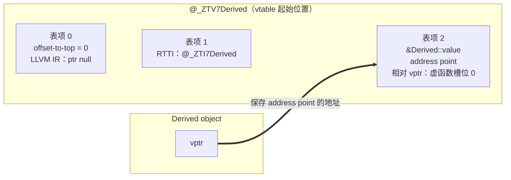
```mermaid
flowchart LR
    subgraph OBJECT["Derived object"]
        VPTR["vptr"]
    end

    subgraph VTABLE["@_ZTV7Derived（vtable 起始位置）"]
        direction TB
        OFFSET["表项 0<br/>offset-to-top = 0<br/>LLVM IR：ptr null"]
        RTTI["表项 1<br/>RTTI：@_ZTI7Derived"]
        TARGET["表项 2<br/>&Derived::value<br/>address point<br/>相对 vptr：虚函数槽位 0"]
        OFFSET ~~~ RTTI
        RTTI ~~~ TARGET
    end

    VPTR ==>|"保存 address point 的地址"| TARGET
```

Clang 在构造函数中写入 vptr 的核心操作可简化为：

```llvm
%address_point = getelementptr [3 x ptr], ptr @_ZTV7Derived, i64 0, i64 2
store ptr %address_point, ptr %this
```

构造 `Derived` 时，`Base` 构造函数先把 vptr 写成 `Base` 的 address point，随后 `Derived` 构造函数再写成 `Derived` 的 address point。这也解释了为什么基类构造函数中的虚调用只会到达基类版本：当时派生类对应的 vptr 尚未建立。层级中存在实际析构过程时，vptr 通常按相反方向切换。

#### 多继承中的 offset-to-top

主 vptr 的 offset-to-top 通常为 0；多继承中的次要基类子对象可能位于非零偏移。下面假设某个 x86-64 Itanium ABI 布局将 `Right` 子对象放在 `Both` 起始地址之后 8 字节：

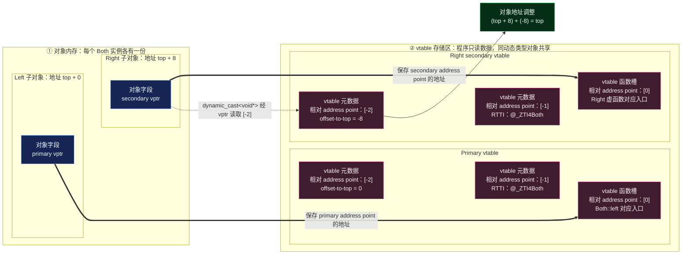
```mermaid
flowchart LR
    subgraph OBJECT_MEMORY["① 对象内存：每个 Both 实例各有一份"]
        direction TB
        subgraph LEFT_SUBOBJECT["Left 子对象：地址 top + 0"]
            LEFT_VPTR["对象字段<br/>primary vptr"]
        end
        subgraph RIGHT_SUBOBJECT["Right 子对象：地址 top + 8"]
            RIGHT_VPTR["对象字段<br/>secondary vptr"]
        end
        LEFT_VPTR ~~~ RIGHT_VPTR
    end

    subgraph VTABLE_MEMORY["② vtable 存储区：程序只读数据，同动态类型对象共享"]
        direction TB
        subgraph PRIMARY_VTABLE["Primary vtable"]
            direction TB
            PRIMARY_OFFSET["vtable 元数据<br/>相对 address point：[-2]<br/>offset-to-top = 0"]
            PRIMARY_RTTI["vtable 元数据<br/>相对 address point：[-1]<br/>RTTI：@_ZTI4Both"]
            PRIMARY_SLOT["vtable 函数槽<br/>相对 address point：[0]<br/>Both::left 对应入口"]
            PRIMARY_OFFSET ~~~ PRIMARY_RTTI
            PRIMARY_RTTI ~~~ PRIMARY_SLOT
        end

        subgraph SECONDARY_VTABLE["Right secondary vtable"]
            direction TB
            SECONDARY_OFFSET["vtable 元数据<br/>相对 address point：[-2]<br/>offset-to-top = -8"]
            SECONDARY_RTTI["vtable 元数据<br/>相对 address point：[-1]<br/>RTTI：@_ZTI4Both"]
            SECONDARY_SLOT["vtable 函数槽<br/>相对 address point：[0]<br/>Right 虚函数对应入口"]
            SECONDARY_OFFSET ~~~ SECONDARY_RTTI
            SECONDARY_RTTI ~~~ SECONDARY_SLOT
        end
    end

    LEFT_VPTR ==>|"保存 primary address point 的地址"| PRIMARY_SLOT
    RIGHT_VPTR ==>|"保存 secondary address point 的地址"| SECONDARY_SLOT
    RIGHT_VPTR -. "dynamic_cast&lt;void*&gt; 经 vptr 读取 [-2]" .-> SECONDARY_OFFSET
    SECONDARY_OFFSET --> CALC["对象地址调整<br/>(top + 8) + (-8) = top"]

    classDef objectField fill:#172554,stroke:#60a5fa,color:#eff6ff;
    classDef tableEntry fill:#3f1d2e,stroke:#f472b6,color:#fdf2f8;
    classDef calculation fill:#052e16,stroke:#4ade80,color:#f0fdf4;
    class LEFT_VPTR,RIGHT_VPTR objectField;
    class PRIMARY_OFFSET,PRIMARY_RTTI,PRIMARY_SLOT,SECONDARY_OFFSET,SECONDARY_RTTI,SECONDARY_SLOT tableEntry;
    class CALC calculation;
```

图中区域 ① 才是每个 `Both` 实例实际占用的对象内存，其中只画出了两个基类子对象各自的 vptr 字段，其他数据成员与填充均被省略。区域 ② 是编译器生成的 vtable group，通常位于程序的只读静态数据中并由相同动态类型的对象共享；offset-to-top、RTTI 和虚函数入口都在这里，不是 `Both` 对象的数据成员。

| 图中内容 | 位于哪里 | 是否由每个对象单独保存 |
| --- | --- | --- |
| `primary vptr`、`secondary vptr` | `Both` 对象内的 `Left`、`Right` 基类子对象 | 是 |
| offset-to-top、RTTI 指针 | primary/secondary vtable 的 address point 之前 | 否，同动态类型对象共享 |
| 虚函数入口 | primary/secondary vtable 的函数槽 | 否，同动态类型对象共享 |

所以对象中并没有嵌入整张 vtable：对象只保存一个或多个 vptr，每个 vptr 再指向共享 vtable 中与该基类子对象对应的 address point。

两个 vptr 保存的都是各自 address point 的地址，即图中的 `[0]` 函数槽位置，而不是 vtable group 的起始地址。运行时可以从 address point 使用负索引访问前面的元数据：`[-1]` 是 RTTI，`[-2]` 是 offset-to-top。

这里的 `-8` 调整的是**对象地址**，不是 vtable 地址：从 `Right*` 执行 `dynamic_cast<void*>` 时，运行时先加载 secondary vptr，再从 address point 的 `[-2]` 读取 `-8`，最后计算 `(top + 8) + (-8)`，得到完整 `Both` 对象的起始地址。该次级 vtable 表项在 LLVM IR 中可能编码为 `ptr inttoptr (i64 -8 to ptr)`。`+8` 和 `-8` 都是这个具体 ABI 布局的结果，不是 C++ 标准规定的固定值。

在 x86-64 上，Clang 对该转换生成的核心 IR 如下，省略了空指针分支：

```llvm
%vptr = load ptr, ptr %right
%offset_slot = getelementptr i8, ptr %vptr, i64 -16
%offset_to_top = load i64, ptr %offset_slot
%top = getelementptr i8, ptr %right, i64 %offset_to_top
```

两个负数属于不同的坐标系：

| 数值 | 作用对象 | 含义 |
| ---: | --- | --- |
| `-16` | vtable 地址 | 从 address point 向前跨过两个 8 字节表项，找到 offset-to-top 元数据 |
| 加载得到的 `-8` | 对象地址 | 从 `Right` 子对象地址回到 `Both` 完整对象起始地址 |

因此，`%offset_slot` 使用 `-16` 查表，`%top` 才使用表中加载出的 `-8` 调整 `%right`；两者不能互换。

## 11.2 RTTI/typeinfo 保存什么

RTTI（Run-Time Type Information）是 C++ 的运行期类型识别机制，`std::type_info` 是标准库提供的查询接口；`_ZTI7Derived` 则是 Itanium ABI 为 `Derived` 生成的 typeinfo 全局对象。各个 `Derived` 实例不会复制这份信息：就类型识别而言，每个多态对象通过自身的 vptr 间接找到通常由链接器合并为一份的 typeinfo。

Itanium ABI 使用不同的运行时描述类型表示不同继承结构：

| ABI 描述类型 | 适用结构 | 主要内容 |
| --- | --- | --- |
| `__class_type_info` | 没有基类的类 | 类型身份和实现定义的类型名称 |
| `__si_class_type_info` | 单个 public、非虚基类 | 直接基类的 typeinfo 指针 |
| `__vmi_class_type_info` | 多继承、虚继承等复杂层级 | 层级标志、基类数量，以及每个基类的 typeinfo、偏移和 public/virtual 标记 |

具体到上面的 `Derived : Base`，`_ZTI7Derived` 通常是一个 `__si_class_type_info` 对象：它包含 typeinfo 元对象自己的运行时描述类 vptr、指向修饰类型名 `_ZTS7Derived` 的指针，以及指向直接基类 `_ZTI4Base` 的 typeinfo 指针。这里的“typeinfo 自己的 vptr”属于 ABI 运行库实现，不是每个 `Derived` 实例中的 vptr。

这些数据足以描述“当前动态类型是谁、目标基类是否存在唯一且可访问的路径、目标子对象位于什么偏移”，但不包含成员变量名称、成员函数列表或源码结构，因此 RTTI 不是反射系统。

RTTI 主要服务于：

1. `typeid(expression)` 返回表示静态类型或动态类型的 `std::type_info`。
2. `dynamic_cast` 检查向下转换和横向转换是否合法，并把指针调整到目标基类子对象。
3. `dynamic_cast<void*>` 结合 vtable 中的 offset-to-top 找到最派生对象的起始地址。
4. 典型 C++ ABI 在异常匹配中也会复用 typeinfo 来比较抛出类型与捕获类型。

普通虚函数分派不读取 RTTI：它只按固定槽位从 vtable 取得函数地址。关闭 RTTI 后，虚函数仍能工作；需要运行期类型识别的 `typeid`、向下或横向 `dynamic_cast` 则不能照常使用。

## 11.3 虚调用怎样变成 LLVM IR

`dispatch()` 在 `-O0` 下的核心 IR 可以化简为：

```llvm
define i32 @dispatch(ptr %object) {
    %vptr = load ptr, ptr %object
    %slot = getelementptr ptr, ptr %vptr, i64 0
    %callee = load ptr, ptr %slot
    %result = call i32 %callee(ptr %object)
    ret i32 %result
}
```

四条指令分别完成：

1. 从 `Base` 子对象的起始位置读取 vptr。
2. 根据编译期确定的槽位编号定位表项。
3. 读取该表项保存的函数地址。
4. 间接调用函数，并把 `%object` 作为隐藏的 `this` 参数传入。

`Base::value()` 与 `Derived::value()` 使用同一个槽位编号。`dispatch()` 不需要判断对象是什么类型；`Derived` 构造时写入的 vptr 已经让槽位 0 指向 `Derived::value()`。

LLVM IR 没有专门的“虚函数调用”指令。Clang 前端负责依据 C++ ABI 生成 vtable、vptr 写入和槽位访问，LLVM 优化器看到的是全局常量、指针加载和普通的间接 `call`，目标后端再把它降低为相应架构的间接调用指令。

## 11.4 去虚化发生在哪里

`dispatch(const Base&)` 面向未知调用者时仍需保留间接调用；但 `known_type()` 中的对象明确是 `final` 的 `Derived`。在 `-O2` 下，优化器可以内联 `dispatch()`、证明目标函数，再内联 `Derived::value()` 并常量折叠：

```llvm
define i32 @known_type() {
    ret i32 2
}
```

这种变换称为去虚化。`final`、可见的具体对象类型、内联和 LTO 都可能增加去虚化机会，但源码语义不能依赖某次编译一定完成该优化。

---

## 11.5 对象切片

```cpp
struct Base {
    virtual ~Base() = default;
    virtual void run() const {}
};

struct Derived : Base {
    int extra = 42;
    void run() const override {}
};

void consume(Base value); // 按值接收会切片

Derived d;
consume(d); // 只复制 Base 子对象，Derived 部分丢失
```

需要保留多态时，应使用引用或指针：

```cpp
void consume(const Base& value);
```

切片后的新对象就是独立的 `Base`，RTTI 无法恢复已经丢失的 `Derived::extra`。引用或指针仍指向原来的完整对象，因此可以观察动态类型。

## 11.6 `typeid` 与 `std::type_info`

```cpp
#include <cstddef>
#include <typeinfo>

Derived derived;
Base& reference = derived;
Base sliced = derived;

const std::type_info& dynamic_info = typeid(reference);
bool reference_is_derived = (dynamic_info == typeid(Derived)); // true
bool sliced_is_base = (typeid(sliced) == typeid(Base));         // true

std::size_t hash = dynamic_info.hash_code();
const char* name = dynamic_info.name(); // 内容由实现决定，可能是修饰后的名称
```

`typeid(reference)` 的表达式是多态类型的左值，因此查询对象的动态类型 `Derived`；`sliced` 本身已经是 `Base` 对象，所以结果是 `Base`。对非多态表达式，`typeid` 只反映编译期静态类型。`name()` 的格式和 `hash_code()` 的具体值都不应持久化，也不能作为跨编译器、跨进程协议；需要把类型作为关联容器的键时，可以使用 `std::type_index` 包装 `std::type_info`。

若 `base_ptr == nullptr`，表达式 `typeid(*base_ptr)` 在 `Base` 为多态类型时会抛出 `std::bad_typeid`，而不是实际解引用空指针。

## 11.7 `dynamic_cast` 如何检查和调整指针

向下转换从基类接口恢复更具体的派生类型：

```cpp
if (auto* derived = dynamic_cast<Derived*>(base_ptr)) {
    use(*derived);
}
```

RTTI 还支持多继承中的横向转换：

```cpp
struct Drawable {
    virtual ~Drawable() = default;
};

struct Serializable {
    virtual ~Serializable() = default;
};

struct Asset final : Drawable, Serializable {};

Asset asset;
Drawable* drawable = &asset;

Serializable* serializable = dynamic_cast<Serializable*>(drawable);
void* complete_object = dynamic_cast<void*>(drawable);

// serializable 指向 asset 内部的 Serializable 子对象，地址可能经过调整。
// complete_object 指向最派生的 Asset 对象起始位置。
```

运行库会根据源对象的 typeinfo 查找目标类型，确认存在唯一的 public 继承路径，再计算目标子对象地址。对指针转换失败返回 `nullptr`；对引用转换失败抛出 `std::bad_cast`。普通的派生类到基类转换通常可由编译器静态完成，不需要这次运行期搜索。

如果工作可以直接通过虚函数接口完成，通常不需要先判断具体类型；频繁向下转换往往意味着基类接口没有表达完整行为。

---

## 11.8 抽象类、纯虚析构、`final` 与协变返回

含有未被实现的纯虚函数的类是抽象类，不能直接创建对象：

```cpp
struct Pass {
    virtual ~Pass() = default;
    virtual void run() = 0;
};

struct DcePass final : Pass {
    void run() override;
};
```

`= 0` 表示该虚函数在这个类中是纯虚的，但纯虚函数仍可以在类外提供定义。纯虚析构函数尤其需要定义，因为销毁派生对象时最终仍会执行基类析构：

```cpp
struct Interface {
    virtual ~Interface() = 0;
};

inline Interface::~Interface() = default;
```

`final` 用在类上表示禁止继续派生，用在虚函数上表示禁止后续类再次重写。它既能表达设计约束，也可能让编译器在已知动态类型时更容易去虚化，但不能承诺一定消除虚调用。

重写函数通常必须保持返回类型一致，协变返回是一个受限例外：基类返回类指针或引用时，派生类可以返回更具体的派生类指针或引用。

```cpp
struct Node {
    virtual Node* clone() const = 0;
};

struct Expr : Node {
    Expr* clone() const override; // 协变返回
};
```

值类型返回不适用协变规则。参数类型也不能用“更具体的类型”来实现重写；改变参数只会形成隐藏或新的重载。

---

# 12. 构造、析构与多态生命周期

## 12.1 构造和析构阶段的虚分派

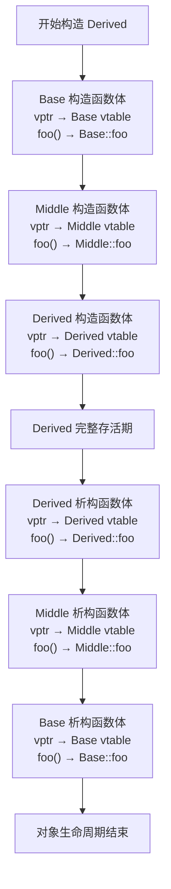
```mermaid
flowchart TD
    A["开始构造 Derived"] --> B["Base 构造函数体<br/>vptr → Base vtable<br/>foo() → Base::foo"]
    B --> C["Middle 构造函数体<br/>vptr → Middle vtable<br/>foo() → Middle::foo"]
    C --> D["Derived 构造函数体<br/>vptr → Derived vtable<br/>foo() → Derived::foo"]
    D --> E["Derived 完整存活期"]
    E --> F["Derived 析构函数体<br/>vptr → Derived vtable<br/>foo() → Derived::foo"]
    F --> G["Middle 析构函数体<br/>vptr → Middle vtable<br/>foo() → Middle::foo"]
    G --> H["Base 析构函数体<br/>vptr → Base vtable<br/>foo() → Base::foo"]
    H --> I["对象生命周期结束"]
```

```cpp
#include <iostream>

class Base {
public:
    Base() { foo(); }
    virtual ~Base() { foo(); }

    virtual void foo() {
        std::cout << "Base::foo\n";
    }
};

class Middle : public Base {
public:
    Middle() { foo(); }
    ~Middle() override { foo(); }

    void foo() override {
        std::cout << "Middle::foo\n";
    }
};

class Derived : public Middle {
public:
    Derived() { foo(); }
    ~Derived() override { foo(); }

    void foo() override {
        std::cout << "Derived::foo\n";
    }
};

int main() {
    Derived object;
}
```

输出：

```text
Base::foo
Middle::foo
Derived::foo
Derived::foo
Middle::foo
Base::foo
```

构造从基类向最派生类推进。执行 `Base` 构造函数体时，`Middle` 和 `Derived` 部分尚未建立，虚调用到达 `Base::foo()`；进入 `Middle` 构造函数体后，当前阶段的 vptr 指向 `Middle` 的 vtable，因此调用 `Middle::foo()`；进入 `Derived` 构造函数体后才调用 `Derived::foo()`。

析构按相反顺序收缩动态类型。首先执行 `Derived` 析构函数体并调用 `Derived::foo()`，随后进入 `Middle` 析构阶段并调用 `Middle::foo()`，最后进入 `Base` 析构阶段并调用 `Base::foo()`。这不是关闭了虚分派，而是虚分派的有效动态类型被限制为当前仍处于生命周期内的那一层。

结论：

> 构造和析构函数中的虚调用只会分派到当前正在构造或析构的类，或者它已经完成构造且尚未开始析构的基类，不会越过当前生命周期边界调用更派生的版本。

---

## 12.2 避免在构造和析构阶段依赖虚分派

构造和析构期间的虚调用不会进入“尚未构造”或“已经析构”的派生部分。如果在构造或析构期间的虚调用最终分派到纯虚函数，行为未定义；即使纯虚函数在类外提供了函数体，也不应依赖这种调用路径。

更稳妥的设计包括：

1. 构造完成后再调用虚函数。
2. 使用工厂函数执行“两阶段初始化”。
3. 将基类构造所需行为通过普通参数、策略对象或非虚辅助函数传入。

---

## 12.3 构造函数为什么不能是 virtual

原因：

1. 构造对象时，对象还没有完全形成。
2. 虚函数依赖对象的动态类型。
3. 构造函数负责建立对象，包括 vptr。
4. 所以构造函数不能虚。

---

## 12.4 多态基类的虚析构

错误：

```cpp
class Base {
public:
    ~Base() {}
};

class Derived : public Base {
public:
    ~Derived() {}
};

Base* p = new Derived();
delete p; // UB
```

如果通过基类指针删除派生类对象，而基类析构函数不是 virtual，会产生未定义行为。

正确：

```cpp
class Base {
public:
    virtual ~Base() = default;
};
```


> 如果类允许通过基类指针销毁派生对象，基类析构函数必须是 `virtual`。另一种设计是把基类析构函数设为 `protected` 且非虚，从接口层禁止通过基类指针执行 `delete`。

---

# 13. 重载决议、重写与名字查找

## 13.1 overload

重载发生在同一作用域，函数名相同，参数不同。

```cpp
void f(int);
void f(double);
```

---

## 13.2 override

重写发生在继承体系中：

```cpp
class Base {
public:
    virtual void f(int);
};

class Derived : public Base {
public:
    void f(int) override;
};
```

推荐永远写 `override`，让编译器帮你检查。

---

## 13.3 name hiding

派生类中声明同名函数，会隐藏基类所有同名函数。

```cpp
class Base {
public:
    virtual void foo(int);
};

class Derived : public Base {
public:
    void foo(double);
};
```

此时：

```cpp
Derived d;
d.foo(1); // 调用 Derived::foo(double)
```

`Base::foo(int)` 被隐藏了。

修复：

```cpp
class Derived : public Base {
public:
    using Base::foo;

    void foo(double);
};
```

---

## 13.4 重载决议怎样选出一个函数

重载决议不是“看到最像的参数就调用”，而是按阶段完成：

1. 名字查找形成候选函数集合；
2. 根据参数个数、默认参数、约束等筛出可行函数；
3. 为每个实参计算隐式转换序列；
4. 比较所有参数的转换质量，选出唯一的最佳可行函数；
5. 最后再检查被选函数是否已删除、是否可访问，以及调用本身是否满足其他语义限制。

常见标准转换等级可以简化为：

```text
精确匹配  >  提升  >  一般转换
```

不同大类之间通常是：

```text
标准转换  >  用户定义转换  >  省略号 ...
```

```cpp
void pick(int);
void pick(long);
void pick(double);

short value = 1;
pick(value); // short -> int 是整型提升，选择 pick(int)
```

不能只看“最终都能变成目标类型”。例如从类类型转换到另一个类型时，一条用户定义转换序列最多包含一次用户定义转换；否则转换链可能无限递归，也无法稳定排序。

如果两个候选对不同参数各有优势，通常没有唯一最佳函数：

```cpp
void mix(int, double);
void mix(double, int);

// mix(1, 1); // 两个候选各在一个参数上更好，调用有歧义
```

当转换质量相同时，还会继续比较非模板与模板、模板偏序、约束强弱等规则。不能把“非模板一定胜过模板”当成无条件规则：只有候选在前面的比较中无法分出胜负时，后续规则才参与决胜。

被删除函数仍会参加重载决议：

```cpp
void consume(int) = delete;
void consume(double);

// consume(1); // 最佳匹配是已删除的 consume(int)，因此编译失败
```

这类设计可以显式禁止某些参数类型，而不是让它们悄悄转换到另一个重载。

---

## 13.5 隐式转换、转换构造函数与 `explicit`

只要构造函数能用一个实参调用，它就可能定义从实参类型到类类型的隐式转换；这也包括其余参数都有默认值的多参数构造函数。

```cpp
class Meter {
public:
    explicit Meter(double value) : value_(value) {}

private:
    double value_;
};

Meter a(1.5);      // 直接初始化，OK
Meter b{1.5};      // 直接列表初始化，OK
// Meter c = 1.5;  // copy-initialization 不考虑 explicit 构造函数
```

转换运算符定义从类类型到其他类型的转换：

```cpp
class FileHandle {
public:
    explicit operator bool() const noexcept {
        return fd_ >= 0;
    }

private:
    int fd_ = -1;
};

if (handle) { // contextual conversion to bool，允许使用 explicit operator bool
    // handle 有效
}
```

`explicit` 的目的不是禁止显式转换，而是防止转换在参数传递、返回值、赋值和重载决议中悄悄发生。C++20 的 `explicit(condition)` 还能让模板构造函数根据类型条件决定是否允许隐式转换。

---

## 13.6 运算符重载、友元与 ADL

运算符重载允许用户类型沿用表达式语法，但不能：

1. 创造新的运算符；
2. 改变运算符优先级和结合性；
3. 改变内建运算符的操作数个数；
4. 让重载后的 `&&`、`||` 获得内建版本的短路求值语义。

对称的二元运算通常适合写成非成员函数，让左右操作数都能参加转换：

```cpp
class Vec2 {
public:
    Vec2(double x, double y) : x_(x), y_(y) {}

    Vec2& operator+=(const Vec2& rhs) {
        x_ += rhs.x_;
        y_ += rhs.y_;
        return *this;
    }

    friend Vec2 operator+(Vec2 lhs, const Vec2& rhs) {
        lhs += rhs;
        return lhs;
    }

    friend bool operator==(const Vec2&, const Vec2&) = default;

private:
    double x_;
    double y_;
};
```

这里的 friend 函数在类内定义，但不是成员函数。普通的非限定名字查找不一定找到它；当实参含有 `Vec2` 时，ADL（argument-dependent lookup）会到 `Vec2` 所在的关联作用域查找，因此 `a + b` 能找到该函数。这种写法常称为 hidden friend：运算符只在相关类型参与调用时进入候选集，可以减少无关重载污染。

友元也可以只在类内声明，再像普通非成员函数一样在类外定义：

```cpp
#include <iostream>

class Box {
public:
    explicit Box(int value) : value_(value) {}

private:
    int value_;

    friend void inspect(const Box&); // 类内声明友元并授予访问权限
};

void inspect(const Box& box) {       // 类外定义，不再写 friend
    std::cout << box.value_ << '\n'; // 可以访问私有成员
}
```

`friend` 只写在类定义内部的友元声明中，用于授予访问权限；类外的 `inspect` 仍是普通的命名空间作用域非成员函数。类外定义时再次写 `friend` 是语法错误。类内的友元声明也不是成员函数声明，不需要写 `Box::inspect`。

如果友元声明是该函数的首次声明，函数属于包围这个类的命名空间，但在出现匹配的命名空间作用域声明前，普通名字查找通常看不到它，仍可能由 ADL 找到。需要在 ADL 之外提前使用时，可以先提供命名空间作用域声明：

```cpp
class Box;
void inspect(const Box&);

class Box {
    friend void inspect(const Box&);
};
```

友元只授予访问权限，不建立继承关系，也不具有传递性。应优先通过公开接口实现运算符，只有确实需要访问内部表示时才使用 friend。

---

## 13.7 `nullptr`、`NULL` 与重载

`nullptr` 的类型是 `std::nullptr_t`，可以转换为任意对象指针或成员指针，但不会像整数 `0` 一样参加普通整型重载：

```cpp
void open(int flags);
void open(const char* path);

open(0);        // 选择 open(int)
open(nullptr);  // 选择 open(const char*)
```

`NULL` 在不同实现中可能只是整数常量宏，因此它在重载场景中不能稳定表达“空指针”。现代 C++ 接口应使用 `nullptr`；如果多个不同指针类型重载同时可行，传入 `nullptr` 仍可能产生歧义，需要显式转换为目标指针类型。

---

# 14. STL 容器：结构、复杂度与失效规则

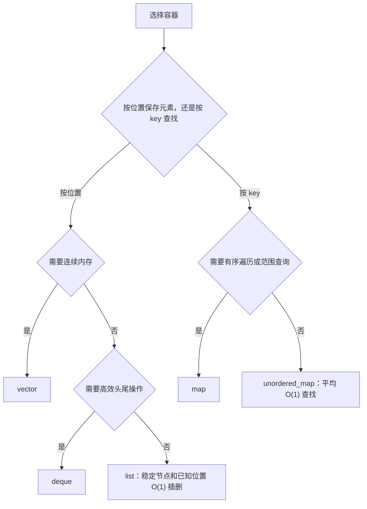
```mermaid
flowchart TD
    A["选择容器"] --> B{"按位置保存元素，还是按 key 查找"}
    B -->|按位置| C{"需要连续内存"}
    C -->|是| V["vector"]
    C -->|否| D{"需要高效头尾操作"}
    D -->|是| Q["deque"]
    D -->|否| L["list：稳定节点和已知位置 O(1) 插删"]
    B -->|按 key| K{"需要有序遍历或范围查询"}
    K -->|是| M["map"]
    K -->|否| U["unordered_map：平均 O(1) 查找"]
```

容器的失效规则来自底层存储方式：连续数组可能整体换地址，分段数组还依赖 block 控制表，链表和树通常只重新连接节点，哈希表则可能更换 buckets。下面把结构、复杂度和失效规则放在一起说明。

## 14.1 vector

### 存储结构与复杂度

底层：连续动态数组。

优点：

1. 随机访问 O(1)。
2. 尾部插入均摊 O(1)。
3. 缓存友好。
4. 内存开销小。

缺点：

1. 中间插入删除 O(n)。
2. 扩容会搬迁元素。
3. 扩容导致迭代器、指针、引用失效。

### 扩容流程

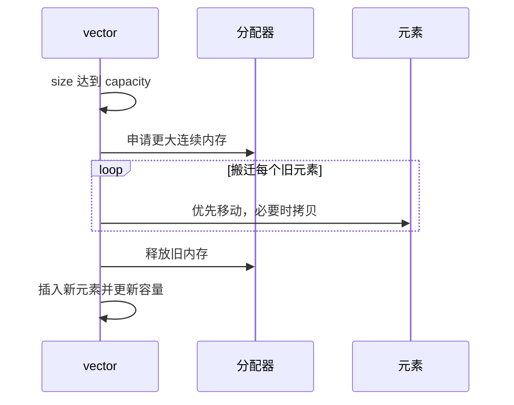
```mermaid
sequenceDiagram
    participant V as vector
    participant A as 分配器
    participant E as 元素
    V->>V: size 达到 capacity
    V->>A: 申请更大连续内存
    loop 搬迁每个旧元素
        V->>E: 优先移动，必要时拷贝
    end
    V->>A: 释放旧内存
    V->>V: 插入新元素并更新容量
```


当 size 达到 capacity，再插入元素时：

1. 分配更大内存。
2. 将旧元素移动或拷贝到新内存。
3. 析构旧元素。
4. 释放旧内存。
5. 插入新元素。

为什么通常按几何级数增长？

因为几何增长可以保证尾插的均摊复杂度为 O(1)。增长因子由标准库实现决定，标准并不要求必须翻倍。

如果容量每次只增加一个元素，连续执行 `push_back` 会反复搬迁已有元素，总成本可能退化为 O(n²)。

---

### 扩容时移动还是拷贝

如果类型的移动构造是 `noexcept`，vector 通常优先移动。

```cpp
struct A {
    A(A&&) noexcept;
};
```

如果移动构造可能抛异常，而拷贝构造可用，vector 可能选择拷贝，以保证异常安全。

因此：

> 移动构造函数应该在语义上确实不会抛出异常时标记为 `noexcept`。

---

### `reserve`、`resize` 与 `shrink_to_fit`

```cpp
std::vector<int> values;

values.reserve(100); // capacity 至少为 100，size 仍为 0
values.resize(100);  // size 变为 100，实际构造 100 个元素
```

- `reserve()` 只调整容量，不创建可访问元素。
- `resize()` 改变元素数量，可能构造或销毁元素。
- 执行 `reserve()` 发生重新分配时，已有迭代器、指针和引用会失效。
- `shrink_to_fit()` 只是非强制请求，标准库可以不缩容。

不要在只预留空间后直接使用 `operator[]` 写入尚不存在的元素。


### 迭代器、引用与指针何时失效

`vector` 把元素连续存放，迭代器通常可以理解为依赖元素地址的位置描述。扩容会申请另一段连续内存并搬迁全部元素，因此旧地址全部失效；未扩容的中间插入或删除会移动操作位置之后的元素，因此只有操作位置之前的迭代器、引用和指针能够保持有效。

`push_back`：

1. 如果不扩容，end 迭代器失效。
2. 如果扩容，所有迭代器、引用、指针失效。

`erase`：

1. 被删元素及其之后的迭代器失效。
2. 返回下一个有效迭代器。

正确删除：

```cpp
for (auto it = v.begin(); it != v.end(); ) {
    if (*it == 3) {
        it = v.erase(it);
    } else {
        ++it;
    }
}
```


---

## 14.2 deque

### 存储结构与复杂度

底层：分段连续数组。

优点：

1. 支持随机访问。
2. 头尾插入删除 O(1)。
3. 比 vector 更适合双端队列。

缺点：

1. 不完全连续。
2. 中间插入删除代价高。
3. 迭代器结构更复杂。
4. 缓存局部性通常不如 vector。


### 分段结构为什么使失效规则更复杂

`deque` 通常不是一段连续内存，而是由多个固定大小的 block 组成，再用一张内部控制表保存各个 block 的地址。这里的控制表有时也被实现称为 map，但它不是 `std::map`：

```text
内部控制表
+---------+     +------------------+
| block * | --> | element element  |
+---------+     +------------------+
| block * | --> | element element  |
+---------+     +------------------+
| block * | --> | element element  |
+---------+     +------------------+
```

典型的 deque 迭代器不仅记录元素位置，还要记录当前 block 及其在控制表中的位置。理解这两层结构后，失效规则就比较直观：

1. 在头部或尾部插入时，可以在边缘 block 的空位构造元素，或者增加一个新 block，不需要搬迁已有元素；但控制表可能扩容。无论本次是否真的扩容，标准都规定所有迭代器失效，而指向已有元素的引用和指针仍然有效。
2. 在中间插入时，为了腾出位置，实现通常把靠近插入点一侧的元素向头部或尾部移动。元素位置发生变化，因此所有迭代器、引用和指针都失效。
3. 删除第一个但不是最后一个元素时，只使指向被删除元素的迭代器、引用和指针失效；删除最后一个元素时，它们失效之外，旧的 `end()` 也失效。
4. 在中间删除时，实现通常把元素向较近的一端移动来填补空洞。标准规定此时旧的 `end()` 以及指向所有元素的迭代器、引用和指针都失效。

简化来看，头尾操作主要调整 block 边界或控制表，所以未被删除的原有元素地址可以保持不变；中间操作需要移动元素，所以影响范围更大。具体 block 大小、控制表增长策略和迭代器字段属于标准库实现细节，不能依赖。

> 对 `deque` 不要用一句“和 vector 类似”概括。长期保存迭代器之前，应按具体操作查标准库契约；修改后优先使用操作返回的新迭代器。


---

## 14.3 list

### 存储结构与复杂度

底层：双向链表。

优点：

1. 已知位置插入删除 O(1)。
2. 插入删除通常不影响其他元素迭代器。

缺点：

1. 不支持随机访问。
2. 每个节点额外存前后指针。
3. 缓存不友好。
4. 实际遍历性能通常差。


### 为什么节点结构能保持迭代器稳定

`list` 的每个元素位于独立节点中，节点通常包含前驱指针、元素和后继指针。迭代器定位的是节点，而不是“从连续内存起点算出的下标”。

插入只需要创建新节点并修改相邻节点的链接，已有节点地址不变，因此不会使指向其他元素的迭代器、引用和指针失效。删除会销毁目标节点，所以只使指向被删除元素的迭代器、引用和指针失效。


---

## 14.4 map

### 存储结构与复杂度

`std::map` 通常基于红黑树。

特点：

1. key 有序。
2. 查找 O(log n)。
3. 插入 O(log n)。
4. 删除 O(log n)。
5. 迭代器稳定性好。
6. 支持范围查询。

适合：

1. 需要按 key 有序遍历。
2. 需要 lower_bound / upper_bound。
3. 对最坏复杂度敏感。


### 为什么树旋转通常不使迭代器失效

`map` 通常把每个键值对存放在独立的红黑树节点中。插入后的重新着色和旋转改变的是父子链接与颜色，不需要搬迁已有键值对对象，因此插入不会使已有迭代器、引用和指针失效。

删除会销毁对应节点，所以只使指向被删除元素的迭代器、引用和指针失效。树在删除后的再平衡同样只是重新连接仍然存活的节点。


---

## 14.5 unordered_map（Hash Map）

### Bucket、负载因子与 rehash

`std::unordered_map` 基于哈希表。

特点：

1. key 无序。
2. 平均查找 O(1)。
3. 最坏查找 O(n)。
4. rehash 会导致迭代器失效。
5. 需要 hash 和相等比较。

哈希表内部维护一组 bucket，通常根据 key 的哈希值选择 bucket；发生哈希冲突的元素会落入同一个 bucket。负载因子描述 bucket 的拥挤程度：

```text
load_factor = size / bucket_count
```

一次插入如果会使负载因子超过 `max_load_factor()`，容器会自动 rehash；调用 `rehash()` 或 `reserve()` 也可以主动触发。rehash 的目的不是消除所有冲突，而是增加 bucket 数量、降低平均每个 bucket 中的元素数量，避免冲突持续增多而使查找逐渐接近线性扫描。

rehash 的简化流程是：

1. 准备数量更多的新 buckets。
2. 根据新的 bucket 数量，重新计算每个已有元素应归属的 bucket。
3. 把元素重新挂接到对应 bucket，替换旧的 bucket 组织结构。

因此 rehash 需要遍历已有元素，并会改变迭代器遍历所依赖的 bucket 位置。已有元素对象本身不必被搬走，所以 rehash 会使迭代器失效，但不会使指向已有元素的引用和指针失效。未触发 rehash 的插入不会使已有元素的迭代器、引用和指针失效；删除只使指向被删除元素的迭代器、引用和指针失效。

可以在已知大致元素数量时调用 `reserve(expected_size)`，提前准备足够的 buckets，减少插入过程中的重复 rehash。需要区分：**迭代器失效不等于元素对象搬迁或引用必然失效。**

适合：

1. 高频查找。
2. 不要求顺序。
3. key 哈希质量较好。


### 自定义 key

```cpp
struct Point {
    int x;
    int y;

    bool operator==(const Point& other) const {
        return x == other.x && y == other.y;
    }
};

struct PointHash {
    std::size_t operator()(const Point& p) const {
        std::size_t h1 = std::hash<int>{}(p.x);
        std::size_t h2 = std::hash<int>{}(p.y);
        return h1 ^ (h2 << 1);
    }
};

std::unordered_map<Point, int, PointHash> mp;
```

需要：

1. hash 函数。
2. 相等比较。

两者必须满足：如果两个 key 被相等比较判定为相等，它们的哈希值也必须相同；否则查找可能进入不同 bucket，无法找到逻辑上相等的 key。


---

## 14.6 失效规则速查

| 容器与操作 | 旧迭代器 | 旧引用和指针 |
| --- | --- | --- |
| `vector` 发生重新分配 | 全部失效 | 全部失效 |
| `vector` 未重新分配地插入或删除 | 操作位置及其后失效 | 操作位置及其后失效 |
| `deque` 在头尾插入 | 全部失效 | 指向原有元素的仍有效 |
| `deque` 在中间插入或删除 | 全部失效 | 全部失效 |
| `list`、`map` 插入 | 原有迭代器仍有效 | 仍有效 |
| `list`、`map` 删除 | 仅指向被删元素的失效 | 仅指向被删元素的失效 |
| `unordered_map` 插入且未 rehash | 原有迭代器仍有效 | 仍有效 |
| `unordered_map` rehash | 全部失效 | 指向原有元素的仍有效 |
| `unordered_map` 删除 | 仅指向被删元素的失效 | 仅指向被删元素的失效 |

`end()` 也是迭代器。例如 `vector::push_back()` 即使没有扩容，旧的 `end()` 也会失效；`deque` 删除最后一个元素时，旧的 `end()` 同样失效。实际代码应先依据具体操作判断，再决定能否长期保存迭代器、引用或指针。

---

# 15. STL 算法、迭代器与 lambda

## 15.1 remove 不是真删除

```cpp
std::remove(v.begin(), v.end(), 3);
```

`remove` 只是把不删除的元素往前移动，返回新的逻辑末尾。

正确：

```cpp
v.erase(std::remove(v.begin(), v.end(), 3), v.end());
```

这叫 erase-remove idiom。

C++20 可以：

```cpp
std::erase(v, 3);
```

---

## 15.2 lambda 捕获

```cpp
[=]     // 默认按值捕获被使用的局部自动变量
[&]     // 默认按引用捕获被使用的局部自动变量
[x]     // 按值捕获 x
[&x]    // 按引用捕获 x
[this]  // 捕获 this 指针，不会复制整个对象
[*this] // C++17，按值捕获当前对象副本
```

在成员函数中，`[=]` 隐式捕获 `this` 容易造成误解；C++20 已弃用通过 `[=]` 隐式捕获 `this` 的写法。异步回调中应明确写 `[this]`、`[*this]`，或捕获 `weak_ptr`，让生命周期意图可见。

危险例子：

```cpp
std::function<int()> makeFunc() {
    int x = 10;
    return [&]() {
        return x;
    };
}
```

返回后 x 已销毁，lambda 中引用悬垂。

正确：

```cpp
std::function<int()> makeFunc() {
    int x = 10;
    return [x]() {
        return x;
    };
}
```

按值捕获的成员在 lambda 默认生成的 `operator() const` 中不可修改。需要修改捕获副本时使用 `mutable`：

```cpp
auto counter = [value = 0]() mutable {
    return ++value;
};
```

`mutable` 只允许修改 lambda 自己保存的副本，不会修改原始局部变量。

---

## 15.3 捕获 this 的风险

```cpp
class A {
public:
    std::function<void()> f() {
        return [this] {
            use();
        };
    }

    void use() {}
};
```

如果 lambda 执行时对象已销毁，`this` 悬垂。

可改为：

```cpp
class A : public std::enable_shared_from_this<A> {
public:
    std::function<void()> f() {
        std::weak_ptr<A> wp = shared_from_this();

        return [wp] {
            if (auto sp = wp.lock()) {
                sp->use();
            }
        };
    }

    void use() {}
};
```

---

## 15.4 迭代器分类决定能做什么

迭代器不是统一能力的“泛化指针”。算法会根据迭代器类别约束可用操作和复杂度：

| 类别 | 关键能力 | 典型来源 |
| --- | --- | --- |
| input | 单向读取，通常只保证单遍 | 输入流迭代器 |
| output | 单向写入，通常只保证单遍 | 输出流、插入迭代器 |
| forward | 单向读写并支持多遍遍历 | `forward_list` |
| bidirectional | 还可以执行 `--it` | `list`、`set`、`map` |
| random access | 支持 `it + n`、距离和下标式跳转 | `deque` |
| contiguous | 随机访问且元素在内存中连续 | `vector`、`array`、`span` |

C++20 用 iterator concepts 更精确地表达这些能力。类别越强，能使用的算法通常越多，但不能根据接口长得像指针就假定底层连续。

```cpp
std::vector<int> values{3, 1, 2};
std::sort(values.begin(), values.end()); // 需要随机访问迭代器

std::list<int> nodes{3, 1, 2};
// std::sort(nodes.begin(), nodes.end()); // error
nodes.sort();                            // list 自己利用节点结构排序
```

复杂度也由类别决定：对随机访问迭代器，`std::distance(first, last)` 可以通过相减在常数时间完成；对链表迭代器则必须逐个前进，是线性时间。`std::advance` 同理。

还要区分迭代器与哨兵。Ranges 允许结束位置使用不同类型的 sentinel，从而表达“读到终止符”“读满固定长度”等不必预先计算同型尾迭代器的范围。

---

## 15.5 泛型 lambda、初始化捕获与递归

泛型 lambda 的 `auto` 参数会让闭包类型的调用运算符成为函数模板：

```cpp
auto add = [](const auto& lhs, const auto& rhs) {
    return lhs + rhs;
};

auto i = add(1, 2);
auto s = add(std::string("a"), std::string("b"));
```

初始化捕获可以移动资源，或创建一个与外部变量不同名、不同类型的闭包成员：

```cpp
auto resource = std::make_unique<Resource>();
auto task = [resource = std::move(resource)]() mutable {
    resource->run();
};
```

此时闭包也会成为 move-only 类型，不能存入要求可拷贝目标的旧式 `std::function`；可以使用支持 move-only callable 的接口，或重新设计所有权。

lambda 在初始化完成前还不能直接按变量名引用自己。C++14 起可以把自身作为显式参数传递，实现不依赖 `std::function` 的递归：

```cpp
auto factorial = [](auto&& self, int n) -> int {
    return n <= 1 ? 1 : n * self(self, n - 1);
};

int result = factorial(factorial, 5);
```

无捕获 lambda 可以转换为兼容的普通函数指针；有捕获 lambda 必须携带闭包状态，不能直接完成这种转换。

---

## 15.6 并行算法执行策略

C++17 的部分标准算法接受执行策略：

```cpp
std::for_each(std::execution::par,
              values.begin(), values.end(),
              [](Item& item) {
                  item.process();
              });
```

执行策略表达允许的执行方式，而不是强制一定创建多少线程：

1. `seq` 按顺序执行；
2. `par` 允许多个线程并行；
3. `par_unseq` 还允许交错和向量化执行；
4. C++20 的 `unseq` 允许在当前线程中采用非排序的向量化执行。

回调必须满足对应策略的并发要求。尤其在 `par_unseq`/`unseq` 下，不能执行依赖互斥锁、分配器内部全局状态等不适合向量化交错执行的操作。并行版本还可能因为任务规模太小、内存带宽饱和或调度开销而更慢，使用前仍要测量。

---

# 16. 模板基础

## 16.1 模板什么时候实例化

模板不是普通函数。模板本身是生成代码的蓝图。

```cpp
template <typename T>
T add(T a, T b) {
    return a + b;
}
```

当使用时：

```cpp
add<int>(1, 2);
add<double>(1.0, 2.0);
```

编译器为不同类型实例化不同版本。

---

## 16.2 为什么模板通常放头文件

因为编译器实例化模板时需要看到完整定义。

如果只有声明：

```cpp
template <typename T>
T add(T a, T b);
```

调用处无法实例化实现。

所以模板通常写在头文件里。

例外：显式实例化。

```cpp
template int add<int>(int, int);
```

---

## 16.3 模板特化

通用模板：

```cpp
template <typename T>
struct TypeName {
    static constexpr const char* value = "unknown";
};
```

全特化：

```cpp
template <>
struct TypeName<int> {
    static constexpr const char* value = "int";
};
```

偏特化：

```cpp
template <typename T>
struct TypeName<T*> {
    static constexpr const char* value = "pointer";
};
```

函数模板不能偏特化，只能重载或全特化。

---

## 16.4 两阶段名字查找与 dependent name

模板定义中的名字分为不依赖模板参数的名字和 dependent name：

1. 非依赖名字通常在模板定义处查找并绑定；
2. 依赖名字要等模板实参确定后，在实例化相关规则下继续查找；
3. 因为解析模板定义时类型还未知，编译器有时需要 `typename` 或 `template` 帮助消除语法歧义。

```cpp
void helper(long);

template <typename T>
void call(T value) {
    helper(0);     // 非依赖调用，在模板定义处完成普通查找
    process(value); // 依赖调用，实例化时还会考虑相应的 ADL 候选
}

void helper(int); // 不会回过头改变模板中 helper(0) 的绑定
```

依赖限定名默认不一定被当作类型：

```cpp
template <typename T>
void consume(T& object) {
    typename T::value_type value{};
    object.template convert<int>(value);
}
```

这里：

1. `typename` 告诉解析器 `T::value_type` 是类型；
2. `template` 告诉解析器 dependent object 后面的 `convert` 是模板，`<` 不是小于号；
3. 两个关键字解决的是解析问题，不会让一个原本不存在的成员变合法。

依赖基类成员也不会自动进入普通的非限定查找：

```cpp
template <typename T>
struct Derived : T {
    void run() {
        this->start(); // this 使查找依赖于模板参数
        // start();    // 可能在模板定义处找不到
    }
};
```

这也是不同编译器对不规范模板代码给出不同诊断时应优先检查的地方。

---

## 16.5 模板参数推导与非推导上下文

模板参数推导从函数形参类型和实参类型建立匹配，不会为了“猜出 T”而任意执行用户定义转换：

```cpp
template <typename T>
void same(T lhs, T rhs);

same(1, 2);      // T = int
// same(1, 2.0); // 无法把 T 同时推导为 int 和 double
same<double>(1, 2.0); // 显式给出 T 后，1 可以转换为 double
```

按值形参推导时会忽略实参的顶层 `const` 和引用；引用形参则会保留更多 cv 和值类别信息。这与 `auto` 推导相似，但转发引用还要应用第 19 章的特殊规则。

有些位置属于 non-deduced context，不参与推导，可用于让一个参数只负责校验和转换：

```cpp
template <typename T>
void append(std::vector<T>& out, std::type_identity_t<T> value) {
    out.push_back(std::move(value));
}

std::vector<long> out;
append(out, 1); // T 由第一个参数确定为 long，第二个参数再执行 int -> long
```

裸花括号列表本身没有普通表达式类型，因此通用 `T` 往往无法从 `{1, 2, 3}` 推导；形参明确为 `std::initializer_list<T>` 或目标类型已由其他位置确定时才有相应规则。

---

## 16.6 可变参数模板与折叠表达式

参数包可以表示任意数量的类型或值，`sizeof...` 返回包中元素个数：

```cpp
template <typename... Args>
void log_values(Args&&... args) {
    std::cout << "count=" << sizeof...(Args) << ': ';
    ((std::cout << std::forward<Args>(args) << ' '), ...);
    std::cout << '\n';
}
```

`args...` 是包展开；外层 `(..., ...)` 是 C++17 fold expression。折叠可以是一元或二元、左折叠或右折叠：

```cpp
template <typename... T>
auto sum(T... values) {
    return (values + ... + 0); // 带初始值的右折叠
}
```

选择方向时要考虑运算符是否满足结合律。浮点加法、字符串拼接和减法在不同结合方向下可能产生不同结果。空参数包也只有在运算符具有标准定义的空包单位元，或代码显式提供初始值时才一定合法。

---

## 16.7 CTAD 与 deduction guide

C++17 的 class template argument deduction 允许从构造实参推导类模板参数：

```cpp
template <typename T>
struct Box {
    explicit Box(T value) : value(std::move(value)) {}
    T value;
};

Box box{42}; // 推导为 Box<int>
```

编译器会根据构造函数等信息形成隐式 deduction guides。默认规则不能表达预期关系时，可以提供显式推导指引：

```cpp
template <typename T>
struct Range {
    template <typename It>
    Range(It first, It last);
};

template <typename It>
Range(It, It) -> Range<typename std::iterator_traits<It>::value_type>;
```

deduction guide 只参与类型推导，不是构造函数，也不负责实际初始化。推导成功后仍要为得到的具体类类型选择可行构造函数。

---

## 16.8 函数模板偏序

函数模板不能偏特化，但多个重载模板之间可以比较谁更特殊：

```cpp
template <typename T>
void inspect(T);

template <typename T>
void inspect(T*);

int value = 0;
inspect(&value); // 选择 T* 版本
```

类模板不能重载，因此需要用偏特化描述 `T*` 等一类类型；函数模板本身可以重载，所以上面的 `inspect(T*)` 已经承担了同样职责。C++ 不允许再写函数模板偏特化，以免“先比较重载还是先选择偏特化”形成两套相互竞争的规则：

```cpp
template <typename T>
void inspect<T*>(T*); // error：函数模板不能偏特化
```

函数模板可以全特化某个确定组合：

```cpp
template <>
void inspect<int>(int); // inspect(T) 在 T = int 时的全特化
```

全特化不是独立重载，不会直接加入候选集。编译器先通过重载决议选中某个主模板，再查看该主模板是否有适用的全特化；要描述“所有指针”或其他一组参数类型，应使用重载、Concepts 或 `requires`。

比较的核心不是“源码看起来更长”，而是一个模板能够接受的参数集合是否比另一个更窄。加入 Concepts 后，还要结合约束的偏序；不能仅凭 requires 表达式在逻辑上似乎更严格，就假定编译器能推导出这种包含关系。

---

## 16.9 CRTP 与静态多态

CRTP（Curiously Recurring Template Pattern，奇异递归模板模式）的基本形式是：派生类把自己的类型作为模板参数传给基类。

```cpp
template <typename Derived>
class Base {};

class Derived : public Base<Derived> {};
```

它看起来像递归，但不会无限继承：`Base<Derived>` 只是一个普通的模板实例。基类拿到 `Derived` 这个类型后，可以在编译期调用派生类约定的接口，从而实现静态多态。

### 最小实现

```cpp
#include <iostream>

template <typename Derived>
class Drawable {
    // 只有约定的 Derived 可以调用基类构造函数，避免类型参数写错。
    friend Derived;
    Drawable() = default;

    const Derived& derived() const noexcept {
        return static_cast<const Derived&>(*this);
    }

protected:
    ~Drawable() = default;

public:
    void draw() const {
        derived().draw_impl();
    }
};

class Circle final : public Drawable<Circle> {
public:
    void draw_impl() const {
        std::cout << "Circle\n";
    }
};

class Square final : public Drawable<Square> {
public:
    void draw_impl() const {
        std::cout << "Square\n";
    }
};

int main() {
    Circle circle;
    Square square;
    circle.draw(); // Drawable<Circle>::draw -> Circle::draw_impl
    square.draw(); // Drawable<Square>::draw -> Square::draw_impl
}
```

调用过程是：

1. `Circle` 继承 `Drawable<Circle>`。
2. `draw()` 中的 `this` 原本指向 `Drawable<Circle>` 基类子对象。
3. `static_cast<const Circle&>(*this)` 恢复具体派生类型。
4. 编译器据此直接选择 `Circle::draw_impl()`，不经过虚表。

这里没有 `virtual`、vptr 或运行期动态派发，编译器通常也更容易内联调用。不过“没有虚调用”不等于必然更快：每个 `Derived` 都会实例化一份模板代码，可能增加编译时间和代码体积，虚函数在已知动态类型时也可能被去虚化。

### 和虚函数的边界

| 对比项 | 虚函数多态 | CRTP 静态多态 |
| --- | --- | --- |
| 选择具体实现 | 运行期 | 编译期 |
| 公共基类类型 | `Base` | 每个 `Base<Derived>` 都是不同类型 |
| 异构对象集合 | 可通过 `Base*` / `Base&` 统一保存 | 不能直接统一保存，需 `variant`、类型擦除或额外共同基类 |
| 调用方式 | 间接虚调用，可能被去虚化 | 直接调用，通常容易内联 |
| 主要代价 | vptr、虚表和间接分派 | 模板实例化、编译时间和潜在代码膨胀 |

如果需要在运行期从插件、配置或输入中选择不同实现，虚函数或类型擦除通常更合适。CRTP 更适合调用方在编译期已经知道具体类型的场景，例如提供统一外观、复用一组操作、构建 Mixin，或者让链式接口返回准确的派生类型。

### `static_cast` 的安全前提

CRTP 的向下转换没有运行期检查。下面的类型参数虽然语法上可以写出，但对象实际不是 `Circle`：

```cpp
// 如果 Drawable 的构造函数没有访问限制，这种错误层级可能被构造出来。
class Wrong : public Drawable<Circle> {};
```

此时在 `Wrong` 对象上调用 `draw()`，把基类子对象当作 `Circle` 使用会破坏类型前提。上例用私有基类构造函数和 `friend Derived` 阻止普通代码构造这种错误层级，并把具体派生类声明为 `final`，明确表达“模板参数就是最终对象类型”。CRTP 依赖的是结构约定，不能把 `static_cast` 当成带检查的 `dynamic_cast`。

### 用 Concepts 改善接口诊断

如果 `Derived` 忘记提供 `draw_impl()`，普通 CRTP 往往要等到 `draw()` 实例化时才产生较长的模板错误。C++20 可以把要求写到成员函数上：

```cpp
#include <concepts>

template <typename Derived>
class Drawable {
public:
    void draw() const
        requires requires(const Derived& value) {
            { value.draw_impl() } -> std::same_as<void>;
        }
    {
        static_cast<const Derived&>(*this).draw_impl();
    }
};
```

不要急着在 `Drawable<Derived>` 类模板本身实例化时检查 `Derived` 的全部成员：写出 `class Circle : public Drawable<Circle>` 时，`Circle` 仍是不完整类型。把依赖派生类完整定义的检查和访问延迟到成员函数被使用时，才能符合 CRTP 的实例化顺序。

CRTP、Mixin、策略类和 Concepts 容易混在一起：CRTP 描述“派生类把自身类型交给基类”的结构；Mixin 强调通过继承注入可复用能力；策略类通常把行为类型作为参数组合进宿主；Concepts 负责声明类型必须满足什么条件。它们可以组合使用，但不是同一个概念。

---

# 17. 完美转发、万能引用、引用折叠

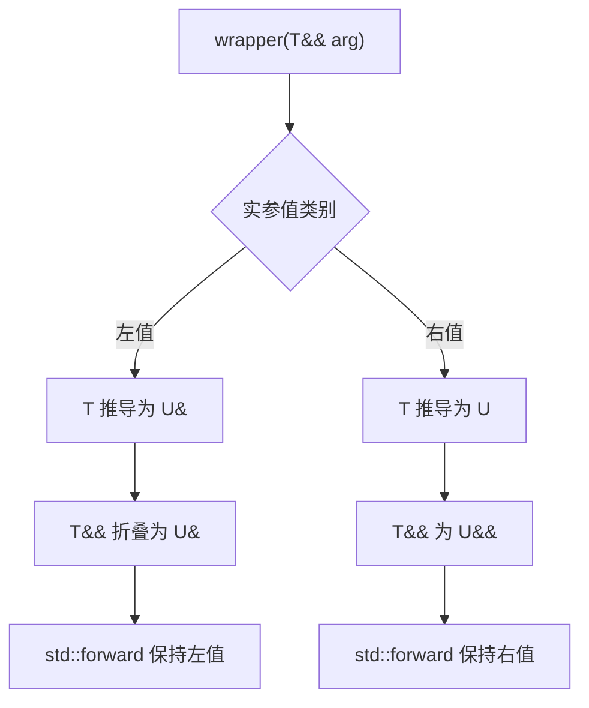
```mermaid
flowchart TD
    A["wrapper(T&& arg)"] --> B{"实参值类别"}
    B -->|左值| C["T 推导为 U&"]
    C --> D["T&& 折叠为 U&"]
    B -->|右值| E["T 推导为 U"]
    E --> F["T&& 为 U&&"]
    D --> G["std::forward 保持左值"]
    F --> H["std::forward 保持右值"]
```


## 17.1 万能引用 / 转发引用

```cpp
template <typename T>
void f(T&& x);
```

这里 `T&&` 在模板参数推导场景下是 forwarding reference。

如果传左值：

```cpp
int a = 10;
f(a);
```

T 推导为 `int&`，`T&&` 折叠为 `int&`。

如果传右值：

```cpp
f(10);
```

T 推导为 `int`，`T&&` 是 `int&&`。

---

## 17.2 引用折叠规则

核心规则：

```text
&  + &  -> &
&  + && -> &
&& + &  -> &
&& + && -> &&
```

只要有一个是左值引用，结果就是左值引用。

---

## 17.3 std::forward 与 std::move

`std::move(x)`：

> 无条件把 x 转为右值。

`std::forward<T>(x)`：

> 有条件转发，保留原始实参的左值/右值属性。

错误包装：

```cpp
template <typename T>
void wrapper(T&& arg) {
    process(arg); // arg 有名字，是左值
}
```

正确：

```cpp
template <typename T>
void wrapper(T&& arg) {
    process(std::forward<T>(arg));
}
```

---

## 17.4 emplace_back 是否一定更快

```cpp
v.push_back(T(args...));
v.emplace_back(args...);
```

`emplace_back` 可以在容器内部直接构造对象，避免临时对象。

但不一定更快：

1. 如果传入的本来就是 T 对象，push_back(std::move(obj)) 很清晰。
2. 编译器可能消除临时对象。
3. emplace_back 可能调用意外的构造函数。
4. 可读性有时不如 push_back。

建议：

```cpp
v.emplace_back(arg1, arg2);    // 需要原地构造
v.push_back(std::move(obj));   // 已经有对象
```

---

# 18. SFINAE、type traits、concepts


```mermaid
flowchart LR
    A["模板能力约束"] --> B["SFINAE"]
    B --> C["enable_if / type traits"]
    C --> D["if constexpr"]
    D --> E["C++20 concepts"]
    E --> F["接口更清楚，错误诊断更直接"]
```

## 18.1 本章用到的标准库工具

Type traits 是 `<type_traits>` 中的一组编译期类型查询和类型变换工具。查询通常得到布尔常量，变换通常产生一个新类型；它们本身不会自动筛选重载，需要交给 SFINAE、`if constexpr` 或 Concept 使用。

标准库常用 `_v` 和 `_t` 后缀提供简写：

```cpp
std::is_integral_v<T>       // std::is_integral<T>::value
std::remove_cvref_t<T>      // typename std::remove_cvref<T>::type
```

本章出现的工具如下：

| API | 头文件 | 目的 |
| --- | --- | --- |
| `std::true_type`、`std::false_type` | `<type_traits>` | 用类型表示编译期的 true/false，并提供静态成员 `value` |
| `std::is_integral_v<T>` | `<type_traits>` | 判断 `T` 是否为整数类型 |
| `std::enable_if_t<B, T>` | `<type_traits>` | `B` 为 true 时产生类型 `T`；为 false 时没有 `type`，可触发 SFINAE |
| `std::remove_cvref_t<T>` | `<type_traits>` | 同时移除引用以及顶层 `const`/`volatile` |
| `std::declval<T>()` | `<utility>` | 在不构造对象的情况下组成一个 `T` 类型表达式，只能用于 `decltype` 等不求值上下文 |
| `std::same_as<T, U>` | `<concepts>` | 约束两个类型完全相同 |
| `std::convertible_to<From, To>` | `<concepts>` | 约束 `From` 能以符合要求的方式转换为 `To` |

`decltype`、`if constexpr` 和 `requires` 是语言机制，不是标准库 API。四者的分工可以简化为：trait 回答“类型具有什么性质”，SFINAE 从候选集中移除替换失败的模板，`if constexpr` 在已经选中的模板体内选择实现，而 Concept 直接约束模板接口。

---


## 18.2 SFINAE 是什么

SFINAE：Substitution Failure Is Not An Error。

意思是：

> 在模板参数替换的“立即上下文”中发生失败时，不把它作为整个程序的硬错误，而是把对应模板从候选集中移除。

函数体实例化中的错误、访问控制错误以及替换完成后才触发的某些错误，不一定属于 SFINAE。

例子：

```cpp
template <typename T>
auto has_size_impl(int)
    -> decltype(std::declval<const T&>().size(), std::true_type{});

template <typename T>
std::false_type has_size_impl(...);

template <typename T>
using has_size = decltype(has_size_impl<T>(0));
```

意图：

1. 优先匹配第一个函数。
2. 如果 `T` 有 `.size()`，第一个函数合法，返回 true_type。
3. 如果 `T` 没有 `.size()`，替换失败，不报错，选择第二个函数，返回 false_type。

这里不会真的调用 `declval` 或 `size()`：`decltype` 是不求值上下文。逗号表达式先要求左侧的 `.size()` 合法，再把整个返回类型确定为右侧的 `std::true_type`。

---

## 18.3 enable_if

```cpp
template <typename T>
std::enable_if_t<std::is_integral_v<T>, void>
print(T x) {
    std::cout << "integer\n";
}
```

只有当 `T` 是整数类型时，这个模板才参与重载决议。

这里 `std::is_integral_v<T>` 提供布尔条件；条件为 true 时 `std::enable_if_t<..., void>` 得到返回类型 `void`，条件为 false 时该类型不存在，于是函数模板在替换阶段退出候选集。

---

## 18.4 if constexpr

C++17 更推荐：

```cpp
template <typename T>
void print(const T& x) {
    if constexpr (std::is_integral_v<T>) {
        std::cout << "integer\n";
    } else {
        std::cout << "other\n";
    }
}
```

`if constexpr` 不选择的分支会被丢弃，不会针对当前模板实参实例化其中的依赖代码。但分支仍必须能够被解析，完全不依赖模板参数的语法或语义错误仍可能直接报错。

---

## 18.5 concepts

C++20 concepts：

```cpp
template <typename T>
concept HasSize = requires(T t) {
    t.size();
};

template <HasSize T>
void print_size(const T& t) {
    std::cout << t.size() << '\n';
}
```

优势：

1. 语义清楚。
2. 错误信息更好。
3. 约束直接写在接口上。
4. 替代复杂 SFINAE。


> concepts 是对模板参数能力的显式约束，使泛型代码更可读、更容易诊断错误。

---

## 18.6 `requires` 表达式的四类要求

`requires` 不只检查“某个表达式能否编译”，还可以表达类型、返回类型和额外布尔约束：

```cpp
template <typename T>
concept Sequence = requires(T value, const T const_value) {
    typename T::value_type;                       // type requirement
    value.clear();                                // simple requirement
    { const_value.size() } -> std::convertible_to<std::size_t>;
                                                   // compound requirement
    requires std::same_as<                        // nested requirement
        std::remove_cvref_t<decltype(*value.begin())>,
        typename T::value_type>;
};
```

`std::convertible_to<std::size_t>` 允许 `size()` 的结果转换为 `std::size_t`；`*value.begin()` 通常得到引用，所以先用 `std::remove_cvref_t` 去掉 cv/ref，再用 `std::same_as` 检查它是否正好是 `value_type`。

requires expression 在约束替换过程中得到 false 时，通常使候选不满足约束，而不是像函数体内的普通错误那样立即终止整个编译。但不依赖模板参数、对所有可能实参都无效的代码仍可能使程序本身不合法。

---

## 18.7 约束包含关系与受约束重载

当两个重载的普通转换质量相同，编译器可以通过 constraint subsumption 选择约束更强的版本：

```cpp
template <typename T>
concept Decrementable = requires(T value) {
    --value;
};

template <typename T>
concept Dereferenceable = requires(T value) {
    *value;
};

template <typename T>
concept ReverseCursor = Decrementable<T> && Dereferenceable<T>;

template <Decrementable T>
void walk(T);

template <ReverseCursor T>
void walk(T); // 对 ReverseCursor 更受约束
```

`ReverseCursor` 显式复用了 `Decrementable`，编译器能从规范化后的原子约束看出包含关系。如果在两个地方分别复制一段看似相同的 requires 表达式，它们不一定被视为同一个原子约束，可能导致重载歧义。

因此应把有语义名字的基础能力提取为小 concept，再组合出更强 concept；这同时改善接口文档、诊断信息和重载排序。

---

# 19. 异常传播、异常安全与 noexcept

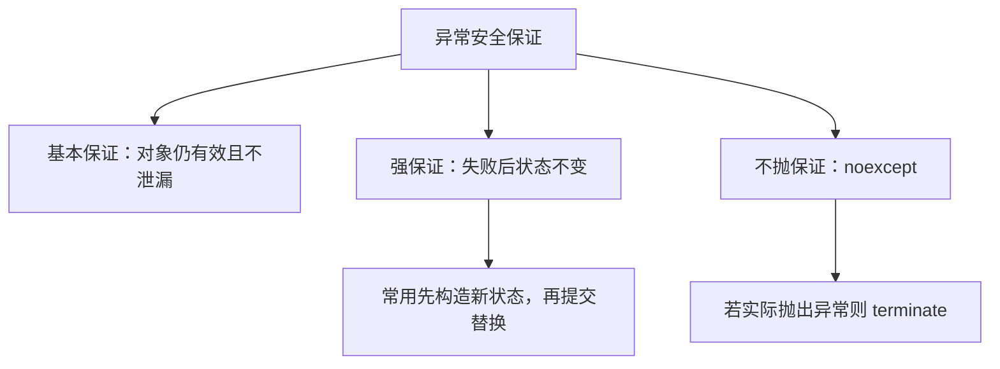
```mermaid
flowchart TD
    A["异常安全保证"] --> B["基本保证：对象仍有效且不泄漏"]
    A --> C["强保证：失败后状态不变"]
    A --> D["不抛保证：noexcept"]
    D --> E["若实际抛出异常则 terminate"]
    C --> F["常用先构造新状态，再提交替换"]
```


## 19.1 C++ 异常 vs 错误码

异常优点：

1. 错误处理和正常逻辑分离。
2. 可以跨多层调用传播错误。
3. 构造函数失败只能靠异常自然表达。
4. 配合 RAII 可以自动清理资源。

异常缺点：

1. 控制流不直观。
2. ABI 和性能模型更复杂。
3. 不适合某些实时系统。
4. 析构中处理不当会导致 terminate。

错误码优点：

1. 控制流明确。
2. ABI 简单。
3. 常用于系统编程和 C 接口。

错误码缺点：

1. 容易忘记检查。
2. 错误处理代码侵入主逻辑。
3. 构造函数表达失败不自然。

---

## 19.2 异常安全保证

### 基本保证

异常发生后，对象仍然保持有效状态，不泄漏资源，但值可能改变。

### 强保证

异常发生后，程序状态不变，就像操作没发生。

### 不抛保证

函数承诺不抛异常。

```cpp
void f() noexcept;
```

---

## 19.3 析构函数为什么不应该抛异常

如果异常传播过程中发生栈展开，局部对象会析构。

如果析构函数又抛异常，就会同时存在两个未处理异常，程序调用 `std::terminate()`。

所以析构函数应尽量 `noexcept`。

```cpp
~A() noexcept {
    try {
        cleanup();
    } catch (...) {
        // 记录日志，不能继续抛
    }
}
```

---

## 19.4 noexcept 的作用

`noexcept` 表示函数承诺异常不会逃出该函数。

作用：

1. 文档化接口契约，并参与函数类型和泛型约束。
2. 让标准库能够使用 `std::move_if_noexcept` 等策略选择移动或拷贝。
3. 在部分场景中为编译器提供更明确的控制流信息，但不能简单理解为“加上就一定更快”。
4. 如果异常逃出 `noexcept` 函数，程序调用 `std::terminate()`。

---

## 19.5 移动构造为什么要 noexcept

vector 扩容时需要搬迁元素。

如果移动构造可能抛异常，vector 为了提供强异常安全保证，可能选择拷贝而不是移动。

```cpp
struct A {
    A(A&&) noexcept;
};
```

建议：

> 资源接管型移动构造一般不会抛异常，应标记 noexcept。

---

## 19.6 异常对象、匹配与重抛

`throw expression` 会用表达式初始化一个独立的异常对象。处理器按类型匹配它；派生类型处理器应写在基类处理器之前，否则前面的基类引用会先捕获所有派生异常。

```cpp
try {
    run();
} catch (const ParseError& error) {
    report(error);
} catch (const std::exception& error) {
    report(error);
} catch (...) {
    report_unknown_error();
}
```

通常按 `const&` 捕获：

1. 避免再复制异常对象；
2. 保留派生类型的动态多态，避免按值捕获导致切片；
3. 不意外修改正在处理的异常。

在处理器中继续传播当前异常时要使用空的 `throw;`：

```cpp
try {
    run();
} catch (const std::exception& error) {
    log(error.what());
    throw; // 重抛原异常对象
}
```

`throw error;` 会根据表达式的静态类型创建新的异常对象，可能切掉派生部分，并重置传播起点。只有确实要转换异常类型并补充上下文时，才构造一个新异常；需要保留底层原因时可以使用 `std::throw_with_nested` 等机制。

---

## 19.7 栈展开与构造失败

找到匹配处理器的过程中会发生 stack unwinding：从抛出点到处理器之间已经完整构造的自动对象按相反顺序析构。这正是 RAII 能在异常路径释放锁、文件和内存的基础。

```cpp
void update() {
    std::lock_guard<std::mutex> lock(mutex);
    Buffer temporary;
    apply(temporary); // 即使抛异常，temporary 和 lock 都会正确析构
}
```

如果构造函数抛出异常：

1. 这个最外层对象没有构造完成，因此不会调用它自己的析构函数；
2. 已经构造完成的基类和成员会按逆序析构；
3. 尚未开始构造的成员什么也不做；
4. 构造函数体中已经完成的局部对象同样按栈展开规则析构。

因此资源应直接放进 RAII 成员，而不是先存入裸句柄、等构造函数最后再手动登记。后者在中途抛异常时容易泄漏。

析构函数如果在没有其他活动异常时抛出，理论上仍可被外层捕获；但如果它在栈展开期间又让异常逃出，就会调用 `std::terminate()`。工程上通常直接把析构函数设计为不抛。

---

## 19.8 function-try-block

普通函数的 function-try-block 可以覆盖整个函数体；构造函数的版本还能捕获成员初始化列表中抛出的异常：

```cpp
Worker::Worker(Config config)
try : connection_(open_connection(config)), cache_(load_cache()) {
    start();
} catch (const std::exception& error) {
    log_construction_failure(error.what());
    throw;
}
```

进入构造函数处理器时，已完成的基类和成员已经被销毁。此时读取这个对象的非静态成员或基类状态是不安全的，处理器应只使用独立日志设施、构造参数副本或异常本身。构造函数或析构函数的 function-try-block 处理器不能通过正常返回把一个未完成构造或析构的对象交给调用者。

function-try-block 主要用于异常翻译和诊断，不应代替成员自身清晰的异常安全契约。

---

## 19.9 异常边界

异常只能穿越双方共同遵守的 C++ ABI 和运行时约定。以下位置应建立明确边界并在边界内捕获：

1. `extern "C"` 导出的 C 接口；
2. 由 C 库调用的函数指针回调；
3. 线程入口和任务执行器顶层；
4. 插件、动态库或使用不同编译器选项构建的模块边界；
5. 标记为 `noexcept` 的回调接口。

边界层通常把异常转换为错误码、状态对象或宿主框架规定的失败协议。不能让异常直接穿越不理解 C++ 展开表和异常对象 ABI 的代码。

---

# 20. 并发基础：thread、mutex、lock

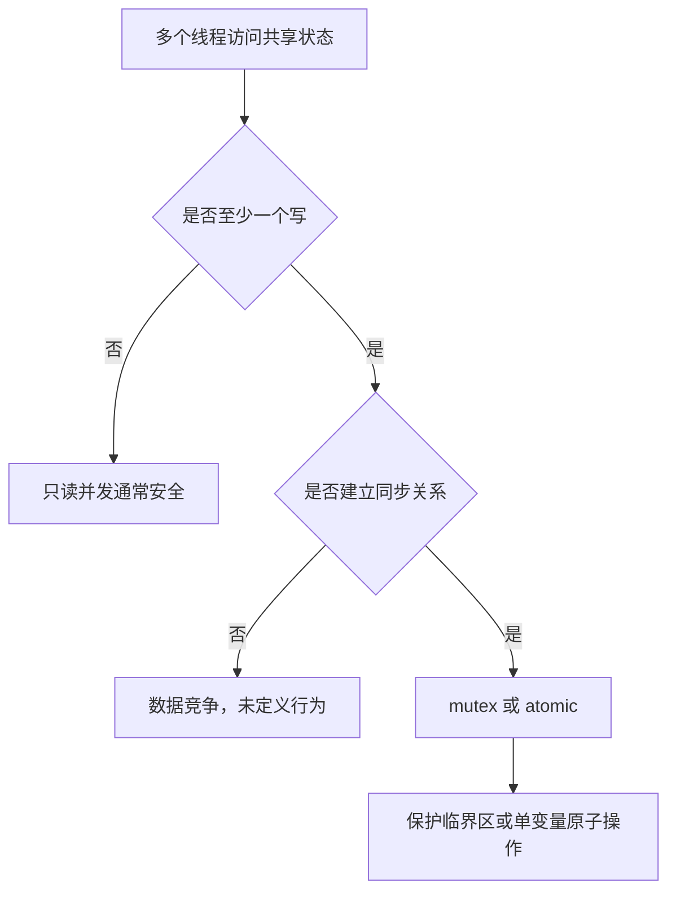
```mermaid
flowchart TD
    A["多个线程访问共享状态"] --> B{"是否至少一个写"}
    B -->|否| C["只读并发通常安全"]
    B -->|是| D{"是否建立同步关系"}
    D -->|否| E["数据竞争，未定义行为"]
    D -->|是| F["mutex 或 atomic"]
    F --> G["保护临界区或单变量原子操作"]
```


## 20.1 数据竞争

多个线程同时访问同一内存位置，至少一个是写，并且没有同步，就发生数据竞争。

数据竞争是未定义行为。

错误：

```cpp
int counter = 0;

void f() {
    ++counter;
}
```

多个线程同时执行会数据竞争。

修复：

```cpp
std::mutex m;
int counter = 0;

void f() {
    std::lock_guard<std::mutex> lock(m);
    ++counter;
}
```

或者：

```cpp
std::atomic<int> counter{0};

void f() {
    ++counter;
}
```

---

## 20.2 mutex 手动 lock/unlock 的问题

错误：

```cpp
m.lock();
doSomething();
m.unlock();
```

如果 `doSomething()` 抛异常，unlock 不会执行。

正确：

```cpp
std::lock_guard<std::mutex> lock(m);
doSomething();
```

RAII 保证离开作用域自动解锁。

---

## 20.3 lock_guard、unique_lock、scoped_lock

| 类型        | 特点                                                             |
| ----------- | ---------------------------------------------------------------- |
| lock_guard  | 最简单，构造加锁，析构解锁，不能手动 unlock                      |
| unique_lock | 更灵活，可延迟加锁、手动 unlock、移动，condition_variable 需要它 |
| scoped_lock | C++17，可一次锁多个 mutex，避免死锁                              |

例子：

```cpp
std::lock_guard<std::mutex> lock(m);
```

```cpp
std::unique_lock<std::mutex> lock(m);
lock.unlock();
lock.lock();
```

```cpp
std::scoped_lock lock(m1, m2);
```

---

## 20.4 死锁

典型死锁：

```cpp
// thread 1
lock(m1);
lock(m2);

// thread 2
lock(m2);
lock(m1);
```

避免方式：

1. 固定全局加锁顺序。
2. 使用 `std::scoped_lock(m1, m2)` 或 `std::lock` 一次协调多把锁。
3. 减少锁粒度和持锁时间。
4. 不在持锁时调用未知外部代码、阻塞 I/O 或用户回调。
5. 使用 `try_lock` 做非阻塞尝试；需要超时时应使用 `std::timed_mutex`、`std::unique_lock::try_lock_for` 等具备计时能力的接口。
6. 用 RAII 管理锁。

---

# 21. condition_variable

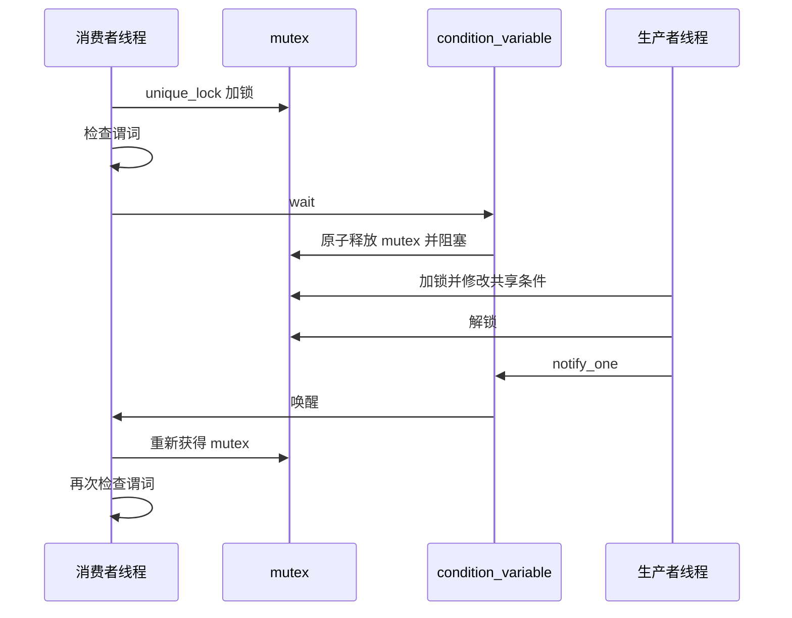
```mermaid
sequenceDiagram
    participant C as 消费者线程
    participant M as mutex
    participant CV as condition_variable
    participant P as 生产者线程
    C->>M: unique_lock 加锁
    C->>C: 检查谓词
    C->>CV: wait
    CV->>M: 原子释放 mutex 并阻塞
    P->>M: 加锁并修改共享条件
    P->>M: 解锁
    P->>CV: notify_one
    CV->>C: 唤醒
    C->>M: 重新获得 mutex
    C->>C: 再次检查谓词
```


## 21.1 wait 为什么要配合谓词

条件变量本身不保存“事件”，真正的条件必须保存在受互斥锁保护的共享状态中。需要谓词的原因包括：

1. 可能发生虚假唤醒。
2. 通知发生时如果没有等待者，通知不会被条件变量记住；但只要谓词状态被正确保存，后来的线程会直接观察到条件已经成立。
3. 多个消费者被唤醒后，条件可能已经被其他线程消耗。
4. 线程从等待中返回前还要重新获得互斥锁，此时共享状态可能再次变化。

错误：

```cpp
cv.wait(lock);
if (ready) {
    consume();
}
```

正确：

```cpp
cv.wait(lock, [] {
    return ready;
});
consume();
```

等价于：

```cpp
while (!ready) {
    cv.wait(lock);
}
```

---

## 21.2 producer/consumer 正确写法

```cpp
std::mutex m;
std::condition_variable cv;
bool ready = false;

void consumer() {
    std::unique_lock<std::mutex> lock(m);
    cv.wait(lock, [] {
        return ready;
    });
    consume();
}

void producer() {
    {
        std::lock_guard<std::mutex> lock(m);
        ready = true;
    }
    cv.notify_one();
}
```

关键点：

1. 修改共享变量 ready 要加锁。
2. wait 要用谓词。
3. notify 可以在解锁后调用，减少被唤醒线程再次阻塞的概率。

---

# 22. atomic 与内存模型

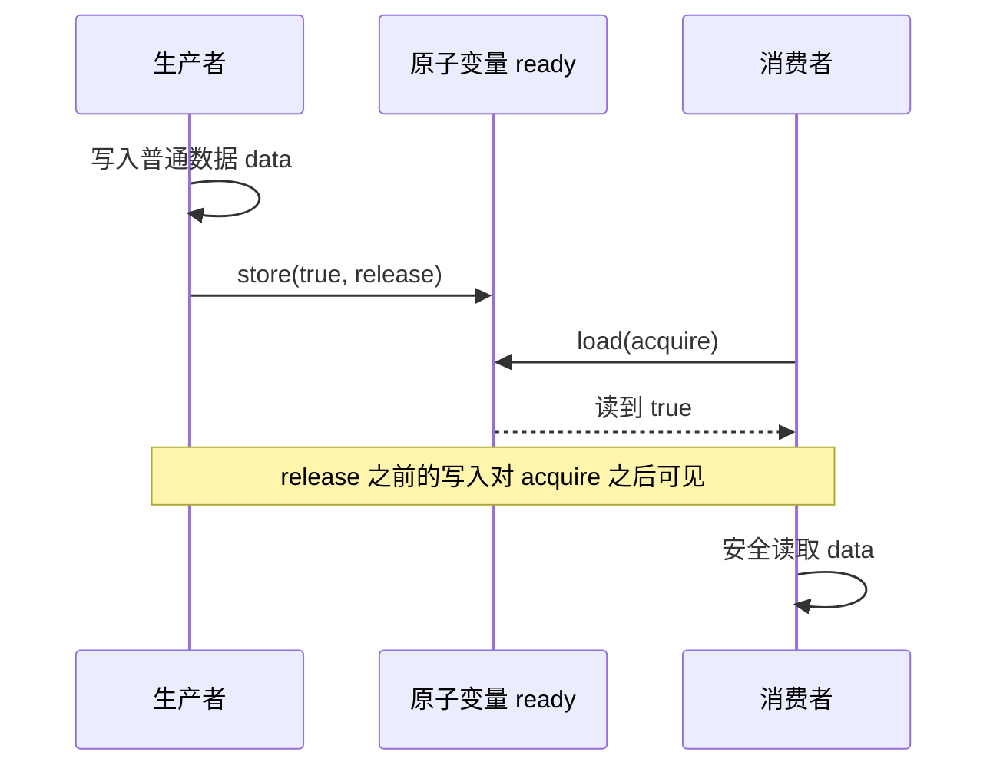
```mermaid
sequenceDiagram
    participant P as 生产者
    participant A as 原子变量 ready
    participant C as 消费者
    P->>P: 写入普通数据 data
    P->>A: store(true, release)
    C->>A: load(acquire)
    A-->>C: 读到 true
    Note over P,C: release 之前的写入对 acquire 之后可见
    C->>C: 安全读取 data
```


## 22.1 atomic 和 mutex 的区别

`std::atomic<T>`：

1. 对该原子对象提供不可分割的原子操作和明确的内存序语义。
2. 接口不要求调用者显式使用互斥锁，但实现内部不一定无锁；可用 `is_lock_free()` 查询。
3. 适合计数器、状态标志、引用计数和经过严格论证的无锁结构。
4. 不能自动维护多个独立变量之间的复合不变量。
5. 原子性只作用于相应原子对象，不会自动让周围普通变量线程安全。

主模板 `std::atomic<T>` 对 `T` 有相应的类型约束，普通用户自定义类型通常需要满足平凡可复制等要求。即使类型可用于 `atomic`，也不保证实现为硬件无锁。

`mutex`：

1. 保护临界区。
2. 可以保护多个变量之间的不变量。
3. 可能阻塞。
4. 使用更直观。

两个变量分别是原子的，不代表它们组成的业务不变量也是原子的：

```cpp
#include <atomic>

std::atomic<int> left{50};
std::atomic<int> right{50};

void transfer_bad() {
    left.fetch_sub(10);  // 观察线程可能恰好在两步之间运行
    right.fetch_add(10);
}

int total_bad() {
    return left.load() + right.load(); // 可能暂时读到 90，而不是 100
}
```

即使使用默认的 `seq_cst`，上面仍有两个独立操作；更强内存序不能把它们合成事务。要维护 `left + right == 100`，应把相关状态放进同一个临界区：

```cpp
#include <mutex>

struct Accounts {
    int left = 50;
    int right = 50;
    std::mutex mutex;

    void transfer() {
        std::lock_guard lock(mutex);
        left -= 10;
        right += 10;
    }

    int total() {
        std::lock_guard lock(mutex);
        return left + right;
    }
};
```

如果确实要无锁地维护复合状态，通常需要把状态编码进一个可原子更新的值，并用 CAS 循环修改；这比把每个字段简单换成 `atomic` 要严格得多。

---

## 22.2 memory_order_relaxed

只保证原子性，不保证同步顺序。

```cpp
counter.fetch_add(1, std::memory_order_relaxed);
```

适合统计计数，不用于发布数据。

---

## 22.3 release/acquire

release 用于发布数据：

```cpp
data = 42;
ready.store(true, std::memory_order_release);
```

acquire 用于获取数据：

```cpp
while (!ready.load(std::memory_order_acquire)) {}
std::cout << data;
```

如果 acquire 读到了 release 写入的值，则 release 之前的写入对 acquire 之后可见。

所以下面代码一定输出 42：

```cpp
std::atomic<bool> ready{false};
int data = 0;

void producer() {
    data = 42;
    ready.store(true, std::memory_order_release);
}

void consumer() {
    while (!ready.load(std::memory_order_acquire)) {}
    std::cout << data << std::endl;
}
```

前提是没有其他数据竞争修改 data。

---

## 22.4 acq_rel

用于读改写操作，例如：

```cpp
flag.exchange(true, std::memory_order_acq_rel);
```

同时具有 acquire 和 release 语义。

---

## 22.5 seq_cst

最强内存序。

```cpp
x.store(1, std::memory_order_seq_cst);
```

默认 atomic 操作就是 seq_cst。

优点：

1. 最容易建立直观推理。
2. 所有 `seq_cst` 操作参与一个与相应 happens-before 关系一致的单一全序。

缺点：

1. 某些架构上可能需要更强的屏障或限制重排，成本可能更高。
2. 这个“单一全序”只针对 `seq_cst` 原子操作，不意味着所有普通内存访问都自动获得全局顺序。


> 除非非常理解内存模型，否则业务代码优先使用 mutex 或默认 seq_cst。relaxed/acquire/release 要有明确理由。

---

## 22.6 happens-before、synchronizes-with 与修改顺序

判断普通内存访问是否合法，核心不是“两个线程是否同时执行”，而是冲突访问之间是否存在 **happens-before** 关系。

常见建立方式：

1. 互斥锁的解锁与之后成功获得同一把锁之间建立同步。
2. 线程创建前的操作对新线程可见；线程结束前的操作在成功 `join()` 后对调用者可见。
3. acquire 操作读到对应 release 写入或其 release sequence 时，二者建立同步。
4. 同一原子对象的所有修改具有单独的 modification order。

没有 happens-before 的冲突普通访问会形成数据竞争，从而导致未定义行为。

---

## 22.7 compare_exchange、伪失败与 ABA

原子比较交换常用于无锁算法：

```cpp
T expected = old_value;
while (!value.compare_exchange_weak(
    expected,
    new_value,
    std::memory_order_acq_rel,
    std::memory_order_acquire)) {
    // 失败后 expected 会被更新为当前值
}
```

`compare_exchange_weak` 允许伪失败，适合循环；`compare_exchange_strong` 通常用于不希望伪失败的一次性判断。

CAS 能保证单次比较交换原子性，但不能自动解决 ABA 问题：值可能经历 `A -> B -> A`，CAS 只看到最终仍为 A。常见应对方式包括版本号、带标签指针或安全内存回收方案。

---

## 22.8 volatile 不是线程同步工具

C++ 中 `volatile` 主要用于表达某些需要观察实际读写的对象，例如内存映射 I/O。它不提供：

1. 原子性；
2. 线程间可见性保证；
3. happens-before；
4. 互斥或内存屏障语义。

线程同步应使用 `std::atomic`、互斥锁或其他并发原语，不能用 `volatile bool` 替代原子标志。

---

## 22.9 原子操作与 fence

带 acquire/release 的原子读写既操作值，又携带排序语义；fence 只建立排序约束，不保存业务值：

```cpp
int payload = 0;
std::atomic<bool> ready{false};

// producer
payload = 42;
std::atomic_thread_fence(std::memory_order_release);
ready.store(true, std::memory_order_relaxed);

// consumer
if (ready.load(std::memory_order_relaxed)) {
    std::atomic_thread_fence(std::memory_order_acquire);
    use(payload);
}
```

只有当 consumer 的原子读取确实观察到与 release fence 关联的写入，并满足标准规定的先后关系时，这组 fence 才能发布 `payload`。把任意两个 fence 放在线程两端不会自动建立同步。

这个例子通常直接写成 `ready.store(..., release)` 与 `ready.load(..., acquire)` 更清楚。fence 主要用于一个排序点需要协调多次原子操作、实现底层并发原语或映射特定硬件协议的场景。

`std::atomic_signal_fence` 只约束编译器相对于同线程信号处理的重排，不要求生成跨核心硬件屏障；不要把它当成 `atomic_thread_fence` 的廉价替代品。

---

## 22.10 `atomic_ref`

C++20 的 `std::atomic_ref<T>` 给一个已经存在的对象提供原子访问视图，而不改变该对象的声明类型：

```cpp
struct Counters {
    alignas(std::atomic_ref<std::uint64_t>::required_alignment)
    std::uint64_t completed = 0;
};

Counters counters;

void finish_one() {
    std::atomic_ref<std::uint64_t> completed(counters.completed);
    completed.fetch_add(1, std::memory_order_relaxed);
}
```

使用时必须满足：

1. 被引用对象的类型和对齐满足 `atomic_ref` 要求；
2. 对象生命周期覆盖所有 atomic view；
3. 存在指向该对象的 `atomic_ref` 期间，并发访问不能绕过原子接口直接读写原对象；
4. 原子性不等于无锁，仍要检查目标平台能力；
5. 它只保护被包装的单个对象，不会让所在结构体的整体不变量原子化。

它适合在不能修改数据布局、共享内存格式或外部结构声明时增加原子访问，但也更容易把同一地址的原子与非原子访问混在一起。能直接把成员声明为 `std::atomic<T>` 时，后者通常更容易审查。

---

# 23. C++17/20 常见特性

## 23.1 auto 类型推导

`auto` 会丢掉顶层 const 和引用。

```cpp
const int x = 10;
auto a = x; // int，不是 const int

int& r = a;
auto b = r; // int，不是 int&
```

想保留引用：

```cpp
auto& c = r;
```

在类型推导语境中，`auto&&` 可以成为转发引用，并按照实参值类别发生引用折叠：

```cpp
auto&& d = expr;
```

需要精确保留表达式的类型和值类别时，可以使用 `decltype(auto)`：

```cpp
decltype(auto) result = (x); // x 为左值时推导为引用
```

---

## 23.2 decltype

```cpp
int x = 10;

decltype(x) a = 1;   // int
decltype((x)) b = x; // int&
```

规则：

1. `decltype(x)` 如果 x 是未加括号的变量名，得到声明类型。
2. `decltype((x))` 中 `(x)` 是左值表达式，得到 `T&`。

---

## 23.3 move-only 类型

只能移动，不能拷贝的类型。

例子：

```cpp
std::unique_ptr<int>
std::thread
std::mutex
std::fstream
```

原因：

它们表示独占资源，拷贝会导致所有权不清。

---

## 23.4 structured binding

```cpp
std::pair<int, std::string> p{1, "hello"};

auto [id, name] = p;
```

注意拷贝：

```cpp
auto [id, name] = p;   // 拷贝
auto& [rid, rname] = p; // 引用
```

---

## 23.5 if initializer

```cpp
if (auto it = mp.find(key); it != mp.end()) {
    use(it->second);
}
```

---

## 23.6 `enum class`

传统未限定枚举会把枚举名注入外层作用域，并且通常可以隐式转换为整数：

```cpp
enum Color { red, green };
int value = red; // 允许隐式转换
```

限定枚举把名字留在枚举作用域内，也不会隐式转成整数：

```cpp
enum class Color : std::uint8_t {
    red,
    green,
};

Color color = Color::red;
auto raw = static_cast<std::uint8_t>(color);
```

显式底层类型可以稳定存储宽度，但序列化协议仍应定义每个枚举值的编码和未知值策略，不能只依赖编译器布局。C++23 可用 `std::to_underlying(color)` 代替显式转换。

`enum class` 不会自动获得位运算。如果它表达标志集合，应显式定义类型安全的 `operator|`、`operator&` 等操作，并说明哪些组合有效。

---

## 23.7 三路比较 `operator<=>`

C++20 的三路比较可以集中定义相等和排序关系：

```cpp
struct Version {
    int major;
    int minor;
    int patch;

    auto operator<=>(const Version&) const = default;
};
```

默认三路比较按基类和成员的声明顺序逐项比较，并可合成 `<`、`<=`、`>`、`>=`；在满足默认规则时也会得到相应的 `==`。返回类别取决于成员能够提供的比较强度：

1. `std::strong_ordering`：相等对象可完全互换，例如整数；
2. `std::weak_ordering`：等价但不要求完全相同，例如忽略大小写的字符串视图；
3. `std::partial_ordering`：某些值不可比较，例如含 NaN 的浮点数。

```cpp
double nan = std::numeric_limits<double>::quiet_NaN();
auto order = nan <=> 1.0; // unordered
```

不能看到 `<=>` 就假设一定得到全序。把含浮点成员的默认比较结果用于有序容器键之前，要先定义 NaN、正负零等边界的业务语义。

---

# 24. optional、variant、any、string_view、span

## 24.1 optional

表示“可能有值，也可能没有值”。

```cpp
std::optional<int> find_id(const std::string& name);
```

使用：

```cpp
auto id = find_id("Tom");
if (id) {
    std::cout << *id;
}
```

适合替代：

1. 特殊哨兵值，例如 `-1`。
2. 部分输出参数。
3. “可能没有结果”的值语义。

`optional<T>` 表示可选的 **T 对象**，不是拥有关系工具，也不能直接存放引用类型。若要表达可空观察关系，指针有时更自然。

---

## 24.2 variant

类型安全的 union。

```cpp
std::variant<int, std::string> v;

v = 10;
v = "hello";
```

访问：

```cpp
std::visit([](auto&& value) {
    std::cout << value;
}, v);
```

适合：

1. 一个值可能是有限几种类型之一。
2. 替代继承层级。
3. 表达状态机。

---

## 24.3 any

可以存任意类型。

```cpp
std::any a = 10;
a = std::string("hello");
```

访问：

```cpp
auto s = std::any_cast<std::string>(a);
```

适合：

1. 插件系统。
2. 异构属性表。
3. 类型不固定但运行期能处理。

缺点：

1. 类型安全较弱。
2. 运行时检查。
3. 滥用会降低可维护性。

---

## 24.4 `std::string` 的存储与失效规则

`std::string` 拥有字符序列，并保证字符连续存储。`size()` 表示保存的字符数量，不依赖第一个 `\0` 的位置：

```cpp
std::string value{"ab\0cd", 5};

assert(value.size() == 5);
assert(std::strlen(value.c_str()) == 2); // C 接口把中间的 \0 当作结束
```

因此把 `string` 传给只接受 C 字符串的接口时，既要考虑结尾零字符，也要确认协议是否允许内嵌零字符。

和 `vector` 类似，需要区分长度与容量：

```cpp
std::string text = "hello";
text.reserve(1024); // 只预留容量，不改变 size
text.resize(10);    // 改变 size，新字符进行值初始化
```

`reserve` 可以减少已知增长过程中的重复分配。`shrink_to_fit` 只是非强制请求，不能依赖它一定释放内存。可能触发重新分配的操作会使已有指针、引用、迭代器和 `string_view` 失效。

许多实现使用 SSO（Small String Optimization），把短字符串直接放在 `string` 对象内部，避免堆分配：

```text
短字符串：string 对象内部缓冲区保存字符
长字符串：string 对象保存指针、长度和容量
```

SSO 是实现策略，不是标准接口契约：

1. 内部容量阈值依赖标准库、ABI 和字符类型；
2. 不能通过字符串长度断言“这次一定不分配”；
3. 移动短字符串可能仍要复制其内部字符；
4. 不要把对象内部布局写入文件或跨动态库 ABI 暴露。

`c_str()` 和 `data()` 返回的指针只在相应失效规则允许的期间有效。C++17 起非常量 `string::data()` 返回可写字符指针，但只能在现有 `[0, size())` 范围内修改字符；改变长度仍应调用 `resize`、`append` 等成员函数。

---

## 24.5 string_view

非拥有字符串视图。

优点：

1. 不拷贝字符串。
2. 可表示字符串子串。
3. 函数参数更灵活。

```cpp
void print(std::string_view sv);
```

风险：

```cpp
std::string_view getName() {
    std::string s = "hello";
    return s; // dangling
}
```

正确：

```cpp
std::string getName() {
    return "hello";
}
```

或者确保底层字符序列生命周期更长。

还要注意：

1. `string_view` 不保证以 `\0` 结尾，不能无条件把 `data()` 传给要求 C 字符串的接口。
2. 对底层 `std::string` 执行扩容、销毁或改变相关内容后，已有视图可能悬垂或内容改变。
3. `substr()` 返回的仍是视图，不拥有字符。

---

## 24.6 span

`std::span<T>` 是连续内存的非拥有视图。

```cpp
void process(std::span<int> data) {
    for (int& x : data) {
        ++x;
    }
}
```

可以接受：

```cpp
int arr[3]{1, 2, 3};
std::vector<int> v{1, 2, 3};

process(arr);
process(v);
```

特点：

1. 不拥有数据。
2. 动态长度 `span` 通常保存指针和长度；静态长度可以把 extent 编入类型。
3. 比分离的裸指针和长度更容易保持参数一致，但 `operator[]` 本身并不提供自动边界检查。
4. 生命周期仍然由调用者保证，底层容器扩容后视图可能失效。
5. `std::span<T, N>` 从运行期容器构造时必须满足长度为 `N` 的前置条件；静态 extent 不代表编译器在所有来源上都能证明长度正确。

---

# 25. 编译、链接、ODR、inline


```mermaid
flowchart LR
    A["源文件 .cpp"] --> B["预处理 .i"]
    B --> C["编译生成汇编 .s 或 IR"]
    C --> D["汇编生成目标文件 .o"]
    D --> E["链接器解析符号与重定位"]
    E --> F["可执行文件或动态库"]
```


## 25.1 编译流程

大致流程：

1. 预处理：展开 include、宏。
2. 编译：词法、语法、语义分析，生成汇编或 IR。
3. 汇编：生成目标文件 `.o`。
4. 链接：解析符号，合并目标文件和库，生成可执行文件。


```mermaid
flowchart LR
    A[".cpp"] --> B[".i"] --> C[".s 或 IR"] --> D[".o"] --> E["executable / library"]
```

---

## 25.2 声明与定义

声明告诉编译器“有这个东西”。

定义真正分配实体或提供实现。

```cpp
extern int x; // 声明
int y;        // 定义

void f();     // 声明
void g() {}   // 定义

class A;      // 声明
class B {};   // 定义
```

---

## 25.3 ODR

ODR：One Definition Rule，单一定义规则。

核心规则应按实体类型区分：

1. 一个被 odr-use 的非 `inline`、非模板函数或具有外部链接的对象，整个程序通常只能有一个定义。
2. 类定义、模板、`inline` 函数和 `inline` 变量可以出现在多个翻译单元中，但必须满足 ODR 等价要求：通常要求相同 token 序列，并且相关名字查找结果保持一致。
3. `const` 命名空间作用域对象默认可能具有内部链接，不能只凭“头文件里写了 const”就判断是否重复定义。
4. ODR 违反有时会产生链接错误，也可能不要求诊断而直接形成未定义行为。

违反 ODR 可能导致：

1. 链接错误。
2. 未定义行为。
3. 不同翻译单元看到不同类布局。
4. 奇怪的运行期错误。

ODR 违反不一定表现为“重复定义”。下面的内联函数被两个翻译单元看到，但预处理后的定义不同：

```cpp
// queue_config.h
inline int queue_capacity() {
#ifdef SMALL_QUEUE
    return 64;
#else
    return 256;
#endif
}

// producer.cpp：使用 -DSMALL_QUEUE 编译
#include "queue_config.h"
int producer_capacity() { return queue_capacity(); }

// consumer.cpp：没有 -DSMALL_QUEUE
#include "queue_config.h"
int consumer_capacity() { return queue_capacity(); }
```

链接器可能不会报错，但两个翻译单元对同一个外部链接内联函数给出了不等价定义，程序违反 ODR。最终观察到 64、256 或被各自内联后的不同结果都不能作为可靠行为。会改变头文件内类或内联函数定义的配置宏，必须在所有翻译单元中保持一致。

---

## 25.4 头文件定义全局变量的问题

错误：

```cpp
// config.h
int g_value = 10;
```

多个 cpp include 后，每个翻译单元都有一个定义，链接时重复定义。

解决：

方式一：头文件声明，cpp 定义。

```cpp
// config.h
extern int g_value;

// config.cpp
int g_value = 10;
```

方式二：C++17 inline variable。

```cpp
// config.h
inline int g_value = 10;
```

---

## 25.5 inline 的现代意义

`inline` 不只是建议编译器内联。

更重要的是：

> 允许函数或变量在多个翻译单元中具有满足 ODR 等价条件的定义；它并不保证编译器一定执行机器码层面的内联展开。

头文件中定义函数：

```cpp
inline int add(int a, int b) {
    return a + b;
}
```

C++17 inline variable：

```cpp
inline constexpr int max_size = 1024;
```

---

# 26. static、extern、头文件设计

## 26.1 函数内 static 局部变量

```cpp
int next_id() {
    static int id = 0;
    return ++id;
}
```

特点：

1. 生命周期贯穿程序。
2. 作用域在函数内。
3. 初始化一次。
4. C++11 起局部静态变量的**初始化过程**线程安全。

这不表示对象后续访问自动线程安全。例如多个线程同时执行 `return ++id;` 仍会产生数据竞争，应使用原子变量或锁。

---

## 26.2 全局 static

```cpp
static int g = 10;
```

含义：

> 内部链接，只在当前翻译单元可见。

---

## 26.3 static 函数

```cpp
static void helper() {}
```

同样是内部链接，只在当前 cpp 可见。

现代 C++ 更推荐匿名命名空间：

```cpp
namespace {
void helper() {}
}
```

---

## 26.4 类 static 成员

```cpp
class A {
public:
    static int count;
    static void f();
};
```

特点：

1. 属于类，不属于某个对象。
2. static 成员函数没有 this 指针。
3. static 成员函数不能直接访问非 static 成员。

定义：

```cpp
int A::count = 0;
```

C++17 可用 inline static：

```cpp
class A {
public:
    inline static int count = 0;
};
```

---

# 27. ABI 与动态库二进制兼容

```mermaid
flowchart LR
    A["调用方二进制"] --> B["ABI 契约"]
    C["动态库二进制"] --> B
    B --> D["调用约定"]
    B --> E["名字修饰"]
    B --> F["对象与 vtable 布局"]
    B --> G["异常和标准库类型布局"]
    H["任一契约变化"] --> I["无需重编译的调用方可能失效"]
```


## 27.1 ABI 是什么

ABI：Application Binary Interface。

包括：

1. 函数调用约定。
2. 参数如何传递。
3. 返回值如何传递。
4. 名字修饰 name mangling。
5. 类对象布局。
6. vtable 布局。
7. 异常处理机制。
8. 标准库类型布局。

---

## 27.2 为什么 C++ ABI 更脆弱

C++ 比 C 更容易出 ABI 问题，因为 C++ 有：

1. 函数重载导致 name mangling。
2. 类布局可能变化。
3. 虚函数表顺序可能变化。
4. inline 函数编译进调用方。
5. 模板代码编译进调用方。
6. STL 类型跨库边界可能不兼容。
7. 不同编译器 ABI 不一致。

---

## 27.3 哪些修改会破坏 ABI

可能破坏 ABI 的修改：

1. 给类增加非静态成员。
2. 改变成员顺序。
3. 增加、删除、重排虚函数。
4. 改变基类。
5. 改变函数签名。
6. 改变 inline 函数实现但调用方不重新编译。
7. 改变模板定义但调用方不重新编译。

---

## 27.4 如何降低动态库 ABI 风险

常见策略：

1. 对外优先暴露 C ABI 或稳定的纯抽象接口，避免跨边界传递 STL 容器、异常和实现相关类布局。
2. 使用 Pimpl 隐藏私有成员，使实现变化不直接改变公开类大小。
3. 控制符号可见性，只导出明确的公共 API。
4. 对接口做版本管理，并保持创建与销毁发生在兼容的分配器边界。
5. 不让调用方依赖动态库内部的 `inline` 实现、模板布局和编译器私有 ABI。
6. 变更编译器、标准库、编译选项或运行库版本时重新验证二进制兼容性。

```cpp
class Widget {
public:
    Widget();
    ~Widget();

    Widget(Widget&&) noexcept;
    Widget& operator=(Widget&&) noexcept;

private:
    class Impl;
    std::unique_ptr<Impl> impl_;
};
```

Pimpl 能稳定公开对象的主要布局，但也会增加一次间接访问和独立分配，需要在 ABI 稳定性与性能之间取舍。

---

# 28. 性能优化

```mermaid
flowchart TD
    A["观察性能问题"] --> B["使用 profiler 定位热点"]
    B --> C["建立可验证假设"]
    C --> D["只修改一个主要因素"]
    D --> E["基准测试或压测"]
    E --> F{"指标是否改善且无副作用"}
    F -->|否| B
    F -->|是| G["保留结果并继续下一轮"]
```


## 28.1 先测量再优化

不要凭感觉优化。

常见工具：

1. perf
2. gprof
3. Valgrind / callgrind
4. heaptrack
5. Linux perf top
6. VTune
7. Instruments
8. ASan/TSan/UBSan 辅助发现错误


> 性能优化第一步是定位瓶颈，先用 profiler 观察 CPU、内存、锁、I/O，再决定优化方向。

---

## 28.2 vector 为什么通常比 list 遍历快

虽然 list 插入删除 O(1)，但遍历时：

1. 节点分散在堆上。
2. 缓存不友好。
3. 每次访问都可能 cache miss。
4. 指针追踪影响 CPU 预取。

vector 连续存储，CPU cache 友好，遍历通常更快。

---

## 28.3 缓存局部性

CPU 访问内存不是只加载一个字节，而是加载一个 cache line。

连续内存更容易利用缓存。

```cpp
std::vector<int> v;
for (int x : v) {
    sum += x;
}
```

比链表遍历更容易命中缓存。

---

## 28.4 分支预测

CPU 会预测分支方向。

如果分支随机，预测失败会导致流水线清空。

```cpp
if (data[i] > threshold) {
    ++count;
}
```

如果数据分布随机，可能较慢。

---

## 28.5 虚函数性能

虚函数调用成本：

1. 多一次间接访问。
2. 可能阻碍内联。
3. 可能影响分支预测。

但不要过度优化。虚函数成本通常不是主要瓶颈，除非在极热路径、大量小对象上频繁调用。

去虚化：

如果编译器能知道实际类型，就可能优化为普通调用。

```cpp
Derived d;
d.foo(); // 容易去虚化
```

---

## 28.6 内存分配

频繁 new/delete 可能慢：

1. 分配器开销。
2. 锁竞争。
3. 内存碎片。
4. cache miss。

优化方式：

1. reserve。
2. 对象池。
3. arena allocator。
4. pmr。
5. 避免临时对象。
6. 批量分配。

---

## 28.7 常见代码优化

原代码：

```cpp
std::vector<std::string> v;

for (int i = 0; i < n; ++i) {
    std::string s = getString(i);
    v.push_back(s);
}
```

问题：

1. vector 可能多次扩容。
2. push_back(s) 会拷贝字符串。
3. 临时对象可以移动。

优化：

```cpp
std::vector<std::string> v;
v.reserve(n);

for (int i = 0; i < n; ++i) {
    v.push_back(getString(i));
}
```

`getString(i)` 已经返回 `std::string` 时，`push_back(getString(i))` 通常可以直接移动返回值。写成 `emplace_back(getString(i))` 一般不会额外消除这个 `std::string` 临时对象。

如果已经有变量且之后不再使用其原值：

```cpp
std::string s = getString(i);
v.push_back(std::move(s));
```

---

# 29. undefined behavior

## 29.1 什么是 UB

Undefined Behavior，未定义行为。

意思是：

> C++ 标准没有规定结果，程序可以表现为任何行为。

可能结果：

1. 看似正常。
2. 崩溃。
3. 输出奇怪值。
4. 被编译器优化成完全意想不到的代码。
5. 安全漏洞。

---

## 29.2 常见 UB

### 空指针解引用

```cpp
int* p = nullptr;
*p = 1; // UB
```

### 数组越界

```cpp
int arr[3]{1, 2, 3};
int x = arr[5]; // UB
```

### signed integer overflow

```cpp
int a = INT_MAX;
a = a + 1; // UB
```

### unsigned overflow

```cpp
unsigned int b = UINT_MAX;
b = b + 1; // OK，按模运算回绕
```

### 返回局部变量引用

```cpp
int& f() {
    int x = 10;
    return x; // 返回后引用悬垂，使用时产生 UB
}
```

### use-after-free

```cpp
int* value = new int(1);
delete value;
// std::cout << *value; // UB
```

### 不匹配的释放方式

```cpp
int* values = new int[10];
// delete values; // UB，应使用 delete[]
```

### 失效迭代器

```cpp
std::vector<int> values{1, 2, 3};
auto it = values.begin();
values.push_back(4); // 可能扩容
// use(*it);         // 若扩容，it 已失效
```

### 数据竞争

两个线程对同一内存位置进行无同步的冲突访问也是未定义行为。并发错误不能因为“测试多次没崩”就被视为正确。

---

## 29.3 `i = i++` 是不是 UB

需要区分语言版本：

1. C++11/C++14 及更早版本中，对 `i` 的修改缺少所需的顺序关系，行为未定义。
2. C++17 起，赋值运算符右侧会先于左侧写入完成，因此该表达式具有确定的顺序；若 `i` 初始为 1，后缀自增先产生旧值并把 `i` 改为 2，随后赋值又把旧值 1 写回，最终仍为 1。

即便在 C++17 之后已经有定义，这种代码仍然极难阅读，不应在工程中使用。

```cpp
++i;          // 明确递增
int old = i++; // 明确保留旧值
```

---

# 30. 返回局部对象

## 30.1 返回值安全

```cpp
T make1() {
    T t;
    return t;
}
```

安全。

可能触发 NRVO，或者移动。

---

## 30.2 返回临时对象安全

```cpp
T make2() {
    return T{};
}
```

安全。对于这里的 `return T{}`，C++17 起保证拷贝省略（guaranteed copy elision）。

---

## 30.3 返回局部对象右值引用危险

```cpp
T&& make3() {
    T t;
    return std::move(t);
}
```

严重错误。

`t` 是局部变量，函数结束后销毁。返回 `T&&` 是悬垂引用。

正确：

```cpp
T make3() {
    T t;
    return t;
}
```

不要返回局部对象的引用或右值引用。

---

# 31. `vector<bool>`

`std::vector<bool>` 是标准库对 bool 的特殊化。

它通常不是每个 bool 一个字节，而是按 bit 压缩存储。

问题：

1. `operator[]` 返回的不是 `bool&`，而是代理对象。
2. 不能获得真正的 bool 指针。
3. 和普通 vector<T> 行为不完全一致。
4. 多线程按 bit 修改可能影响同一个底层字节。
5. 泛型代码可能踩坑。

替代：

```cpp
std::vector<char>
std::vector<uint8_t>
std::bitset<N>
boost::dynamic_bitset
```

---

# 32. 手写实现：简化 unique_ptr

```cpp
template <typename T>
class UniquePtr {
public:
    explicit UniquePtr(T* ptr = nullptr) noexcept
        : ptr_(ptr) {}

    ~UniquePtr() {
        delete ptr_;
    }

    UniquePtr(const UniquePtr&) = delete;
    UniquePtr& operator=(const UniquePtr&) = delete;

    UniquePtr(UniquePtr&& other) noexcept
        : ptr_(other.ptr_) {
        other.ptr_ = nullptr;
    }

    UniquePtr& operator=(UniquePtr&& other) noexcept {
        if (this == &other) {
            return *this;
        }

        delete ptr_;
        ptr_ = other.ptr_;
        other.ptr_ = nullptr;

        return *this;
    }

    T& operator*() const {
        return *ptr_;
    }

    T* operator->() const noexcept {
        return ptr_;
    }

    T* get() const noexcept {
        return ptr_;
    }

    T* release() noexcept {
        T* old = ptr_;
        ptr_ = nullptr;
        return old;
    }

    void reset(T* ptr = nullptr) noexcept {
        if (ptr_ == ptr) {
            return;
        }

        delete ptr_;
        ptr_ = ptr;
    }

    explicit operator bool() const noexcept {
        return ptr_ != nullptr;
    }

private:
    T* ptr_{nullptr};
};
```

注意：

1. 移动构造后要把源对象置空。
2. 移动赋值前要释放自己的旧资源。
3. release 返回裸指针，并放弃所有权。
4. reset 删除旧对象并接管新对象。
5. operator-> 返回指针。
6. operator* 返回引用。

---

# 33. 手写实现：线程安全队列

```mermaid
sequenceDiagram
    participant P as 生产者
    participant Q as 线程安全队列
    participant CV as 条件变量
    participant C as 消费者
    C->>Q: wait_and_pop
    Q->>CV: 队列为空则等待
    P->>Q: push(value)
    Q->>Q: 加锁并入队
    Q->>CV: notify_one
    CV-->>C: 唤醒
    C->>Q: 加锁、出队并返回值
```


```cpp
#include <condition_variable>
#include <mutex>
#include <queue>
#include <utility>

template <typename T>
class ThreadSafeQueue {
public:
    ThreadSafeQueue() = default;

    ThreadSafeQueue(const ThreadSafeQueue&) = delete;
    ThreadSafeQueue& operator=(const ThreadSafeQueue&) = delete;

    void push(T value) {
        {
            std::lock_guard<std::mutex> lock(mutex_);
            queue_.push(std::move(value));
        }
        cv_.notify_one();
    }

    bool try_pop(T& value) {
        std::lock_guard<std::mutex> lock(mutex_);

        if (queue_.empty()) {
            return false;
        }

        value = std::move(queue_.front());
        queue_.pop();
        return true;
    }

    T wait_and_pop() {
        std::unique_lock<std::mutex> lock(mutex_);

        cv_.wait(lock, [this] {
            return !queue_.empty();
        });

        T value = std::move(queue_.front());
        queue_.pop();
        return value;
    }

    bool empty() const {
        std::lock_guard<std::mutex> lock(mutex_);
        return queue_.empty();
    }

private:
    mutable std::mutex mutex_;
    std::condition_variable cv_;
    std::queue<T> queue_;
};
```

注意：

1. `empty() const` 里 mutex 要是 mutable。
2. wait 必须用谓词。
3. push 先加锁修改队列，再 notify。
4. 不要返回引用，因为 pop 后元素不存在。
5. 如果要支持关闭，需要增加 closed_ 标志。

---

# 34. 手写实现：有停止机制的生产者消费者队列

```mermaid
flowchart TD
    O["队列 Open"] --> P{"生产者 push"}
    P -->|队列未满| I["入队并 notify not_empty"]
    P -->|队列已满| PW["等待 not_full"]
    O --> C{"消费者 pop"}
    C -->|队列非空| R["出队并 notify not_full"]
    C -->|队列为空| CW["等待 not_empty"]
    PW --> I
    CW --> R
    O --> X["close"]
    X --> N["设置 closed 并 notify_all"]
    N --> Z["等待者退出，后续 push 失败"]
```


```cpp
#include <condition_variable>
#include <cstddef>
#include <mutex>
#include <optional>
#include <queue>
#include <stdexcept>
#include <utility>

template <typename T>
class BlockingQueue {
public:
    explicit BlockingQueue(std::size_t capacity)
        : capacity_(capacity) {
        if (capacity_ == 0) {
            throw std::invalid_argument("capacity must be greater than zero");
        }
    }

    bool push(T value) {
        std::unique_lock<std::mutex> lock(mutex_);

        not_full_.wait(lock, [this] {
            return closed_ || queue_.size() < capacity_;
        });

        if (closed_) {
            return false;
        }

        queue_.push(std::move(value));
        lock.unlock();
        not_empty_.notify_one();
        return true;
    }

    std::optional<T> pop() {
        std::unique_lock<std::mutex> lock(mutex_);

        not_empty_.wait(lock, [this] {
            return closed_ || !queue_.empty();
        });

        // close 后仍然先排空已有元素。
        if (queue_.empty()) {
            return std::nullopt;
        }

        T value = std::move(queue_.front());
        queue_.pop();

        lock.unlock();
        not_full_.notify_one();
        return value;
    }

    void close() {
        {
            std::lock_guard<std::mutex> lock(mutex_);
            if (closed_) {
                return;
            }
            closed_ = true;
        }

        not_empty_.notify_all();
        not_full_.notify_all();
    }

private:
    std::size_t capacity_;
    bool closed_{false};

    std::mutex mutex_;
    std::condition_variable not_empty_;
    std::condition_variable not_full_;
    std::queue<T> queue_;
};
```

重点：

1. 队列满时生产者等待，队列空时消费者等待。
2. `wait` 必须带谓词。
3. `capacity == 0` 必须拒绝，否则生产者永远无法入队。
4. `close()` 要在锁内修改状态，再在锁外 `notify_all()`。
5. 关闭后不再接受新元素，但消费者应先排空已有元素。
6. `closed_` 和队列状态必须始终由同一把锁保护。

---

# 35. 手写实现：LRU Cache

```mermaid
flowchart LR
    K["key"] --> H["unordered_map"]
    H --> I["定位 list 迭代器"]
    I --> N["双向链表节点"]
    N --> M["splice 到链表头：最近使用"]
    T["链表尾：最久未使用"] --> E["容量满时淘汰"]
    E --> H
```


## 35.1 思路

要求 get/put 平均 O(1)。

使用：

1. `std::list<std::pair<int, int>>` 保存访问顺序。
2. `std::unordered_map<int, list::iterator>` 保存 key 到链表节点的映射。

链表头表示最近使用，链表尾表示最久未使用。

---

## 35.2 实现

```cpp
#include <cstddef>
#include <functional>
#include <list>
#include <optional>
#include <unordered_map>
#include <utility>

template <
    typename Key,
    typename Value,
    typename Hash = std::hash<Key>,
    typename KeyEqual = std::equal_to<Key>>
class LRUCache {
private:
    using Node = std::pair<Key, Value>;
    using List = std::list<Node>;
    using Iterator = typename List::iterator;

public:
    explicit LRUCache(std::size_t capacity)
        : capacity_(capacity) {}

    std::optional<std::reference_wrapper<const Value>>
    get(const Key& key) {
        auto it = map_.find(key);
        if (it == map_.end()) {
            return std::nullopt;
        }

        items_.splice(items_.begin(), items_, it->second);
        return std::cref(it->second->second);
    }

    template <typename K, typename V>
    void put(K&& key, V&& value) {
        auto it = map_.find(key);

        if (it != map_.end()) {
            it->second->second = std::forward<V>(value);
            items_.splice(items_.begin(), items_, it->second);
            return;
        }

        if (capacity_ == 0) {
            return;
        }

        if (items_.size() == capacity_) {
            map_.erase(items_.back().first);
            items_.pop_back();
        }

        items_.emplace_front(
            std::forward<K>(key),
            std::forward<V>(value));
        map_.emplace(items_.front().first, items_.begin());
    }

    std::size_t size() const noexcept {
        return items_.size();
    }

private:
    std::size_t capacity_;
    List items_;
    std::unordered_map<Key, Iterator, Hash, KeyEqual> map_;
};
```

关键点：

1. `list` 节点移动为 O(1)。
2. `unordered_map` 查找平均 O(1)，最坏 O(n)。
3. `splice` 不会复制或移动节点中的元素。
4. 哈希表保存链表迭代器，可以直接定位节点。
5. 用 `optional` 表达未命中，避免把 `-1` 与合法值混淆。
6. 返回引用包装器意味着调用者不能在缓存下一次修改后长期保存该引用；需要稳定快照时应返回值。
7. 该实现不是线程安全的，并发访问需要外部同步或分片设计。

---

# 36. 初始化、存储期、求值顺序与对象生命周期

## 36.1 初始化形式先分清

初始化不是一种单一动作。相似的标点可能进入不同规则，最终决定是否清零、是否允许 `explicit` 构造函数、是否检查窄化以及怎样进行重载决议。

| 形式 | 示例 | 核心含义 |
| --- | --- | --- |
| 默认初始化 | `T object;` | 类类型调用默认构造；自动存储期的基础类型可能保持未初始化 |
| 值初始化 | `T object{};`、`T()` | 类类型按值初始化规则构造；基础类型得到零值 |
| 直接初始化 | `T object(args);` | 直接选择构造函数，可以考虑 `explicit` 构造函数 |
| 拷贝初始化 | `T object = value;` | 通过隐式转换序列初始化，不考虑 `explicit` 构造函数 |
| 列表初始化 | `T object{args};` | 使用列表规则，禁止许多窄化，并优先考虑 `initializer_list` |
| 聚合初始化 | `Aggregate{members...}` | 按聚合元素顺序初始化，不调用用户自定义的聚合构造逻辑 |

```cpp
int first;       // 默认初始化，值不确定，读取前必须先写入
int second{};    // 值初始化，得到 0
int third = 3;   // 拷贝初始化
int fourth(4);   // 直接初始化
int fifth{5};    // 直接列表初始化
```

零初始化通常不是源代码中独立写出的语法阶段。例如静态存储期对象在其他初始化之前会先零初始化；某些值初始化也会先执行零初始化，再进行默认初始化。不能看到 `{}` 就机械断言“整块对象先 memset 为零”，类构造函数和对象模型规则仍然生效。

简单聚合可以按成员顺序初始化：

```cpp
struct Point {
    int x;
    int y;
};

Point p{1, 2};
```

“什么类仍是 aggregate”的精确定义在不同语言版本中有调整。只要加入构造函数、虚函数、私有成员或复杂继承，就应由 `std::is_aggregate_v<T>` 或编译器按目标标准判断，不要依赖一条跨版本口诀。

---

## 36.2 四类存储期

对象的“作用域”和“生命周期”不是同一概念。作用域决定名字在哪里可见，存储期决定对象存储大致存在多久。

| 存储期 | 常见对象 | 生命周期概述 |
| --- | --- | --- |
| 自动存储期 | 普通局部变量、函数参数 | 进入相应代码块时创建，离开时销毁 |
| 静态存储期 | 命名空间作用域变量、函数内 `static`、静态数据成员 | 通常贯穿整个程序 |
| 线程存储期 | `thread_local` 对象 | 每个线程拥有独立实例，生命周期通常随线程 |
| 动态存储期 | 通过 `new` 或分配器取得的对象 | 由程序显式控制，直到相应销毁和释放 |

动态分配得到的是存储；对象生命周期还需要通过构造开始，并通过析构或相应生命周期规则结束。对原始字节进行 `malloc` 并不自动构造非平凡 C++ 对象。

---

## 36.3 构造顺序

一个派生类对象的构造顺序是：

1. 虚基类，按继承图和标准规则处理；
2. 直接基类，按类声明中的继承顺序；
3. 非静态数据成员，按它们在类中的声明顺序；
4. 构造函数体。

析构顺序与构造顺序相反。

```cpp
class Example : public Base {
public:
    Example()
        : second_(2), first_(1) {}

private:
    int first_;
    int second_;
};
```

虽然初始化列表先写 `second_`，实际仍先初始化 `first_`。初始化列表最好按声明顺序书写，否则容易产生依赖错误和编译器警告。

---

## 36.4 静态初始化顺序

同一翻译单元内，具有有序动态初始化的对象通常按定义顺序初始化；跨翻译单元的动态初始化顺序通常不应依赖。

危险示例：

```cpp
// a.cpp
extern std::string b;
std::string a = b + "a";

// b.cpp
std::string b = "b";
```

`a` 初始化时 `b` 是否已经完成动态初始化可能存在问题。

常见解决方案：

1. 使用编译期可初始化对象：`constexpr`、`constinit`。
2. 使用“首次使用时构造”的函数内静态对象。

```cpp
Config& config() {
    static Config instance;
    return instance;
}
```

3. 避免跨翻译单元可变全局状态。
4. 显式构建依赖关系，由 `main()` 或依赖注入容器控制初始化。

函数内静态对象从 C++11 起初始化过程线程安全，但初始化完成后的对象访问是否线程安全仍由对象本身决定。

---

## 36.5 临时对象与生命周期延长

临时对象通常在包含它的完整表达式结束时销毁，但绑定到某些引用时可以延长生命周期：

```cpp
const std::string& ref = std::string("hello");
// 临时 string 的生命周期延长到 ref 的生命周期
```

需要注意，生命周期延长不是可传递的：

```cpp
const std::string& identity(const std::string& value) {
    return value;
}

const std::string& ref = identity(std::string("hello"));
// ref 悬垂：函数参数引用不会把临时对象生命周期继续延长到调用方
```

返回视图、迭代器、引用和指针时，都必须明确底层对象的生命周期是否覆盖使用期。

---

## 36.6 `explicit`、委托构造与继承构造

单参数构造函数如果允许隐式转换，可能产生意外匹配：

```cpp
class Meter {
public:
    explicit Meter(double value) : value_(value) {}

private:
    double value_;
};
```

除非确实需要隐式转换，单参数构造函数通常应标记 `explicit`。

委托构造可以复用同类构造逻辑：

```cpp
class Socket {
public:
    Socket() : Socket(default_port()) {}
    explicit Socket(int port) {
        open(port);
    }
};
```

`using Base::Base;` 可以继承基类构造函数，但不会自动解决派生类新增成员的初始化语义，使用时仍需审查接口是否合理。

---

## 36.7 花括号初始化与 `initializer_list`

花括号初始化可以阻止许多数值窄化：

```cpp
int value{3.5}; // error：窄化
```

但重载决议会优先考虑 `std::initializer_list` 构造函数：

```cpp
std::vector<int> first(10, 1); // 10 个元素，每个为 1
std::vector<int> second{10, 1}; // 两个元素：10 和 1
```

因此 `{}` 并不总是与 `()` 等价。设计和调用构造函数时，应明确是否存在 `initializer_list` 重载，以及初始化表达式想表达“元素列表”还是“构造参数”。

`initializer_list` 保存的是一段编译器生成的只读数组视图，不拥有可以任意移动出来的独立元素：

```cpp
std::initializer_list<int> make_values() {
    return {1, 2, 3}; // 错误设计：返回后底层临时数组已经失效
}
```

这也是 `std::vector<std::unique_ptr<T>>` 不能直接通过普通 initializer-list 拷贝构造一组 `unique_ptr` 的原因之一：列表元素是 const，不能从中移动。需要 move-only 元素时应逐个 `emplace_back`，或从可移动范围构造。

C++20 允许对聚合使用指定初始化，但标号顺序仍必须与成员声明顺序一致：

```cpp
struct Options {
    int threads = 1;
    bool tracing = false;
};

Options options{.threads = 8, .tracing = true};
// Options bad{.tracing = true, .threads = 8}; // error：顺序颠倒
```

---

## 36.8 most vexing parse

C++ 语法在一段文本既可能是声明又可能是表达式时，会优先按声明解释：

```cpp
Widget object(); // 声明一个返回 Widget 的函数，不是默认构造对象
Widget value{};  // 明确构造对象
```

带迭代器的局部变量也可能触发相同问题：

```cpp
std::vector<int> values(
    std::istream_iterator<int>(input),
    std::istream_iterator<int>()); // 可能被解析为函数声明
```

可以使用花括号、先保存迭代器变量，或给其中一个表达式增加不会被解释成声明的结构：

```cpp
auto first = std::istream_iterator<int>(input);
auto last = std::istream_iterator<int>();
std::vector<int> values(first, last);
```

花括号不是无条件修复手段，因为类如果有 `initializer_list` 构造函数，改用 `{}` 可能改变重载含义。应先确认目标构造函数集合。

---

## 36.9 求值顺序与 sequenced-before

运算符的优先级和结合性决定表达式如何分组，不等于子表达式按什么时间顺序求值：

```cpp
int result = f() + g() * h();
```

这里乘法先分组，但不能据此断言 `g()` 一定在 `f()` 前执行。只有语言明确建立 sequenced-before 的位置才能依赖顺序。

常见具有明确短路或顺序关系的运算包括：

1. `lhs && rhs` 和 `lhs || rhs`：先求值左侧，并可能跳过右侧；
2. `condition ? yes : no`：先求值条件，再只求值一个分支；
3. 内建逗号运算符：先左后右；
4. 完整表达式结束后，才进入下一个完整表达式；
5. C++17 起，赋值运算符右侧先于左侧的最终写入相关求值。

函数实参在进入函数体前都会完成求值，但彼此的先后次序通常未指定：

```cpp
consume(make_left(), make_right());
```

不能依赖 `make_left()` 一定先执行。C++17 起不同参数的初始化不会彼此交错，但具体谁先仍可变化。多个参数如果读写同一状态，即使不再构成旧版本中的未定义行为，也可能得到不同结果：

```cpp
int index = 0;
record(index++, index++); // C++17 起结果顺序仍未指定，不应这样写
```

清晰写法是把带副作用的步骤拆开：

```cpp
int first = index++;
int second = index++;
record(first, second);
```

并发内存序中的 happens-before 是跨线程关系；本节的 sequenced-before 主要描述单线程求值。两者可以组合建立完整的线程间可见性，但不是同一个概念。

---

# 37. 成员函数限定、类型转换与类型安全

## 37.1 `const` 成员函数

```cpp
class Buffer {
public:
    std::size_t size() const noexcept {
        return size_;
    }

private:
    std::size_t size_{0};
};
```

成员函数末尾的 `const` 表示函数中的 `this` 近似为 `const Buffer*`，不能通过普通方式修改非 `mutable` 成员。

```cpp
class Cache {
public:
    int value() const {
        if (!cached_) {
            cached_value_ = compute();
            cached_ = true;
        }
        return cached_value_;
    }

private:
    mutable bool cached_{false};
    mutable int cached_value_{0};
};
```

`mutable` 适合不改变对象逻辑状态的缓存、统计或同步对象，但不能被用来掩盖本应属于可变业务状态的修改。

---

## 37.2 引用限定符

成员函数可以按对象值类别重载：

```cpp
class Text {
public:
    const std::string& data() const & {
        return data_;
    }

    std::string data() && {
        return std::move(data_);
    }

private:
    std::string data_;
};
```

这样左值对象返回引用，临时对象返回值，避免从即将销毁的对象中返回悬垂引用。

---

## 37.3 四种显式转换

### `static_cast`

用于标准允许的显式转换、数值转换、已知安全的继承方向转换等。

```cpp
double value = 3.5;
int truncated = static_cast<int>(value);
```

从基类指针向派生类指针的 `static_cast` 不做运行期检查，只有调用者能够证明实际类型时才安全。

### `dynamic_cast`

用于多态继承体系中的运行期检查。基类必须是多态类型。

```cpp
if (auto* derived = dynamic_cast<Derived*>(base)) {
    derived->run();
}
```

### `const_cast`

用于增加或移除 cv 限定。移除 `const` 后，只有原对象本来不是 `const` 时才允许修改：

```cpp
int value = 1;
const int* p = &value;
*const_cast<int*>(p) = 2; // 原对象可修改，合法

const int fixed = 1;
// *const_cast<int*>(&fixed) = 2; // 修改真正 const 对象，未定义行为
```

### `reinterpret_cast`

用于底层表示相关转换，例如整数与指针、不同指针类型之间的显式重解释。它不能绕过对齐、对象生命周期、严格别名和有效类型规则。

> `reinterpret_cast` 只是允许表达转换意图，不表示转换后的访问一定合法。

---

## 37.4 严格别名、对齐与对象表示

编译器通常假设不相关类型的指针不会指向同一对象。通过错误类型访问对象可能违反严格别名规则：

```cpp
float f = 1.0F;
// int bits = *reinterpret_cast<int*>(&f); // 不应这样读取表示
```

C++20 可使用 `std::bit_cast`：

```cpp
#include <bit>
#include <cstdint>

static_assert(sizeof(float) == sizeof(std::uint32_t));
std::uint32_t bits = std::bit_cast<std::uint32_t>(f);
```

`std::bit_cast` 要求源类型和目标类型大小相同，并满足相应的平凡可复制约束。上例还显式验证了平台上的 `float` 与 `uint32_t` 大小一致。

使用 placement new、自定义 arena 或协议解析时，还要保证：

1. 地址满足目标类型对齐要求；
2. 对象生命周期已经开始；
3. 访问类型符合语言规则；
4. 必要时使用 `std::launder` 处理特定复用存储场景。

---

## 37.5 trivial、standard-layout 与 aggregate

旧资料常把“POD”当成可以随意按字节处理的类型。现代 C++ 更适合拆开讨论不同性质：

| 性质 | 主要回答的问题 |
| --- | --- |
| trivially destructible | 析构是否不需要执行用户逻辑 |
| trivially copyable | 是否允许按标准规定通过字节复制保存和恢复值 |
| standard-layout | 是否满足适合与其他语言或固定布局规则衔接的一组布局限制 |
| aggregate | 是否可以按聚合元素直接初始化 |
| literal type | 对象是否具备进入常量表达式相关场景的类型条件 |

这些集合彼此相关但不等价。一个类型可平凡复制，不代表可以用 `memcmp` 判断对象相等，因为 padding byte 可能具有不同值，浮点和指针表示也有额外语义。

对 trivially copyable 类型，可以把对象表示复制到 `char`、`unsigned char` 或 `std::byte` 数组中，并在满足标准条件时复制回来：

```cpp
static_assert(std::is_trivially_copyable_v<Header>);

std::array<std::byte, sizeof(Header)> bytes;
Header source = make_header();
std::memcpy(bytes.data(), &source, sizeof source);

Header restored;
std::memcpy(&restored, bytes.data(), sizeof restored);
```

这不等于得到稳定的序列化格式。padding、端序、类型宽度和 ABI 都可能变化；跨进程或跨平台协议仍应逐字段编码。

`offsetof` 只应对满足相应 standard-layout 条件的类型使用。需要编译期确认时，可以组合 `std::is_trivially_copyable_v`、`std::is_standard_layout_v`、`std::is_aggregate_v` 等 type traits，而不是根据“没有虚函数”自行猜测。

---

## 37.6 原始存储、对象生命周期与 `std::launder`

一段对齐且足够大的字节区域只是存储，不一定已经存在目标类型对象。C++20 可以用 `std::construct_at` 和 `std::destroy_at` 清楚表达生命周期：

```cpp
alignas(Widget) std::byte storage[sizeof(Widget)];

auto* location = reinterpret_cast<Widget*>(storage);
Widget* widget = std::construct_at(location, 42);
widget->run();
std::destroy_at(widget);
```

底层字节数组仍然存在，但 `Widget` 的生命周期只覆盖 construct/destroy 之间。再次在同一地址构造对象时，要重新审查旧指针、引用和 const 对象是否仍能表示新对象：

```cpp
Widget* next = std::construct_at(location, 7);
```

在满足 transparently replaceable 等条件的普通同类型完整对象复用中，旧名字和指针通常可以自动指代新对象；const 完整对象、基类子对象、带 `[[no_unique_address]]` 的成员等情况更复杂。`std::launder` 只为标准规定的这些特殊场景取得可用指针，不会修复：

1. 地址未对齐；
2. 对象根本没有构造；
3. 数组越界；
4. 违反别名规则；
5. 已经结束生命周期的资源仍被并发访问。

C++23 的 `std::start_lifetime_as` 为部分隐式生命周期类型提供了更直接的底层接口，但它同样受类型、对齐和存储范围约束。

---

## 37.7 union 的活跃成员

union 的成员共享存储，同一时刻通常只有一个成员处于活跃生命周期：

```cpp
union Number {
    int integer;
    double real;

    Number() : integer(0) {}
};

Number value;
value.integer = 42;
// double x = value.real; // 读取非活跃成员，通常不是合法的 C++ type punning
```

对含非平凡成员的 union，切换活跃成员还需要显式结束旧对象并构造新对象，异常安全和特殊成员函数也要自行处理。`std::variant` 把标签、构造析构和异常状态封装在一起，通常比手写 tagged union 安全。

某些 standard-layout union/结构存在“共同初始序列”的受限读取例外，但它不是通用的二进制重解释工具。读取对象表示应优先使用 `std::bit_cast` 或 `memcpy`。

---

## 37.8 数组退化、数组引用与多维数组

内建数组在多数表达式中会退化为指向首元素的指针，长度信息随之丢失：

```cpp
void inspect(int* values); // 不知道调用方数组长度

int values[4]{1, 2, 3, 4};
inspect(values);
```

`sizeof(array)`、`decltype(array)`、取数组地址等上下文不会执行这种退化。模板也可以通过数组引用保留长度：

```cpp
template <typename T, std::size_t N>
constexpr std::size_t count_of(T (&)[N]) noexcept {
    return N;
}

static_assert(count_of(values) == 4);
```

接口更常直接使用 `std::span<T>`，同时传递首地址和长度。字符串字面量的数组长度还包含结尾 `\0`，这一点与 `std::string_view` 的逻辑长度不同。

二维内建数组退化后得到的是“指向一行数组的指针”，不是 `int**`：

```cpp
int matrix[3][4]{};
int (*row)[4] = matrix;
// int** wrong = matrix; // error
```

`int**` 指向的是指针，通常表示若干独立分配的行；`int[3][4]` 则是连续的 12 个整数。两者布局和寻址公式不同，不能通过强制转换互换。

---

## 37.9 端序与协议表示

对象的内存表示不等于网络或文件格式。C++20 的 `std::endian` 可以描述平台原生端序，C++23 的 `std::byteswap` 可以辅助整数换序，但协议仍应明确字段宽度和目标字节序：

```cpp
std::uint32_t value = read_u32_be(bytes); // 协议函数明确“大端 32 位”
```

不要直接把结构体 `reinterpret_cast` 成字节流发送：成员 padding、尾部 padding、对齐、端序和 ABI 都可能改变。稳定协议应逐字段编码，并在读取前验证长度和数值范围。

---

# 38. 线程生命周期、任务与异步结果

## 38.1 `std::thread`

```cpp
std::thread worker([] {
    do_work();
});
worker.join();
```

`std::thread` 对象销毁时如果仍然 `joinable()`，程序会调用 `std::terminate()`。因此必须明确选择：

1. `join()`：等待线程结束；
2. `detach()`：与线程失去关联，让线程独立运行。

`detach()` 往往使生命周期、错误传播和程序退出管理变得困难，通常应优先使用结构化的 join 方案。

```cpp
class JoiningThread {
public:
    explicit JoiningThread(std::thread thread)
        : thread_(std::move(thread)) {}

    ~JoiningThread() noexcept {
        if (!thread_.joinable()) {
            return;
        }

        // 该简化封装要求对象不能在其所管理的线程内部销毁。
        if (thread_.get_id() == std::this_thread::get_id()) {
            std::terminate();
        }

        try {
            thread_.join();
        } catch (...) {
            // 析构函数不能让异常逃出。
            std::terminate();
        }
    }

private:
    std::thread thread_;
};
```

这个封装只用于说明 RAII join。生产代码通常应直接使用 `std::jthread`，或者明确设计线程所有权、取消与自销毁约束。

---

## 38.2 `std::jthread` 与停止请求

C++20 的 `std::jthread` 析构时会请求停止并自动 join：

```cpp
std::jthread worker([](std::stop_token token) {
    while (!token.stop_requested()) {
        do_one_unit();
    }
});
```

停止令牌是协作式取消，不会强制终止线程。任务必须主动检查停止状态，并确保阻塞操作具备超时、可取消或唤醒机制。

---

## 38.3 `promise` 与 `future`

`std::promise<T>` 用于设置结果，`std::future<T>` 用于取得结果或异常：

```cpp
std::promise<int> promise;
std::future<int> future = promise.get_future();

std::thread worker([p = std::move(promise)]() mutable {
    try {
        p.set_value(compute());
    } catch (...) {
        p.set_exception(std::current_exception());
    }
});

int result = future.get();
worker.join();
```

`future::get()` 通常只能调用一次，并会重新抛出生产者保存的异常。

---

## 38.4 `std::async`

```cpp
auto future = std::async(std::launch::async, compute);
int result = future.get();
```

不指定策略时，允许实现选择异步执行或延迟执行：

```cpp
auto future = std::async(compute);
```

如果代码依赖并行执行，应明确使用 `std::launch::async`。还要注意，从 `std::async(std::launch::async, ...)` 获得的临时 future 在某些场景下析构会等待任务完成，因此不能把它简单当作“发出后完全不管”的接口。

---

## 38.5 `packaged_task`

`std::packaged_task` 把可调用对象包装为一个可执行任务，并把结果连接到 future：

```cpp
std::packaged_task<int(int)> task([](int value) {
    return value * value;
});

std::future<int> future = task.get_future();

std::thread worker(std::move(task), 5);
worker.join();

std::cout << future.get();
```

关键区别：

1. `std::async` 同时负责提交和执行策略。
2. `packaged_task` 只包装任务与结果通道，何时、在哪个线程执行由调用方决定。
3. `get_future()` 每个共享状态只能成功取得一次；通常在任务移交给线程池之前取得，便于管理结果。
4. 任务执行后仍可再调用 `get_future()` 吗，取决于是否已经取过 future；“执行顺序”本身不是唯一限制，但工程上应先建立结果句柄。

---

## 38.6 线程池设计要点

一个基础线程池通常包含：

1. 固定或可调数量的工作线程；
2. 有界任务队列；
3. 条件变量或原子等待；
4. 停止与排空策略；
5. 任务异常传播；
6. 背压和拒绝策略。

需要明确关闭语义：

- 停止接收新任务；
- 是否执行完已入队任务；
- 等待工作线程结束；
- 如何取消未开始任务；
- 如何防止任务中再次提交导致关停死锁。

线程池不是“把任务放进去就天然高性能”。任务粒度太小会放大排队和同步成本，任务长时间阻塞会耗尽工作线程，CPU 密集任务还应考虑核心数、NUMA 和线程亲和性。

下面的 worker loop 展示一种“停止接收，但排空已入队任务”的核心状态机：

```cpp
#include <condition_variable>
#include <functional>
#include <mutex>
#include <queue>
#include <utility>

std::mutex queue_mutex;
std::condition_variable queue_cv;
std::queue<std::function<void()>> tasks;
bool stopping = false;

void report_task_failure();

void worker_loop() {
    for (;;) {
        std::function<void()> task;
        {
            std::unique_lock lock(queue_mutex);
            queue_cv.wait(lock, [] {
                return stopping || !tasks.empty();
            });

            if (stopping && tasks.empty()) {
                return;
            }

            task = std::move(tasks.front());
            tasks.pop();
        } // 执行任务前释放队列锁

        try {
            task();
        } catch (...) {
            report_task_failure(); // 不能让异常逃出线程入口
        }
    }
}
```

关停线程应先在 `queue_mutex` 保护下设置 `stopping = true`，再 `notify_all()`，最后逐个 `join()`。提交函数也必须在同一把锁下检查 `stopping` 并拒绝新任务，否则可能在 worker 已退出后留下永远无人执行的任务。这里的队列仍是无界的；生产实现还要增加容量谓词、背压和提交失败协议。

---

# 39. 并发进阶：读写锁、原子等待与缓存竞争

## 39.1 `shared_mutex`

读多写少时可以使用共享互斥量：

```cpp
#include <shared_mutex>

std::shared_mutex mutex;
Data data;

Data read_copy() {
    std::shared_lock lock(mutex);
    return data;
}

void update(Data value) {
    std::unique_lock lock(mutex);
    data = std::move(value);
}
```

共享锁允许多个读者并发，独占锁阻止其他读写者。它不保证一定比普通 mutex 快：

1. 读操作很短时，管理共享状态的成本可能更高；
2. 写入频繁时竞争会加剧；
3. 公平策略由实现决定，可能出现读者或写者饥饿。

---

## 39.2 C++20 原子等待

C++20 为原子对象提供 `wait/notify_one/notify_all`：

```cpp
std::atomic<bool> ready{false};

void consumer() {
    ready.wait(false);
    consume();
}

void producer() {
    produce();
    ready.store(true, std::memory_order_release);
    ready.notify_one();
}
```

等待方仍要正确选择内存序，并考虑值可能在等待前已经改变。原子等待适合单个状态字，不适合替代复杂谓词和多个变量组成的不变量。

---

## 39.3 伪共享

两个线程即使更新不同变量，只要变量落在同一缓存行，也可能反复争夺缓存行所有权：

```cpp
struct Counters {
    std::atomic<std::uint64_t> first{0};
    std::atomic<std::uint64_t> second{0};
};
```

可以使用硬件干扰大小提示进行布局：

```cpp
#include <atomic>
#include <cstdint>
#include <new>

struct alignas(std::hardware_destructive_interference_size) Counter {
    std::atomic<std::uint64_t> value{0};
};
```

该常量的可用性和具体数值依实现而定。对齐会增加内存占用，必须通过 profiling 验证收益。

---

## 39.4 无锁、锁自由与等待自由

这些术语不能混用：

- **无锁算法（lock-free）**：系统整体持续有线程取得进展，但某个线程可能长期失败。
- **等待自由（wait-free）**：每个线程都能在有限步骤内完成操作。
- **无阻塞式设计**：有时只是泛称，不等于满足标准意义上的 lock-free。

即使原子类型 `is_lock_free()` 为真，整个数据结构也不一定是 lock-free。安全内存回收、ABA、重试风暴和缓存行竞争往往才是无锁结构的难点。

---

# 40. 分配器、内存资源与 `pmr`

## 40.1 为什么需要自定义分配策略

频繁的小对象分配可能带来：

1. 分配器元数据和锁开销；
2. 内存碎片；
3. 缓存局部性差；
4. 生命周期批量释放困难；
5. 跨线程分配与释放成本。

但自定义分配器会增加复杂性。只有 profiling 表明分配确实是瓶颈时，才应引入对象池、arena 或专用内存资源。

---

## 40.2 arena 的基本思想

arena 从较大的内存块中线性分配对象，最后统一释放：

```text
大块内存
├── Object A
├── Object B
├── Object C
└── remaining
```

优点：

- 分配通常只是移动指针；
- 局部性好；
- 批量释放快。

限制：

- 单个对象通常不能独立回收；
- 析构顺序需要显式设计；
- 长短生命周期对象混用会造成浪费；
- 不能让对象逃逸到 arena 生命周期之外。

下面是一个只允许平凡析构类型的最小线性 arena。它展示了真正的分配步骤：对齐当前指针、返回内存，再推进 offset。

```cpp
#include <cstddef>
#include <memory>
#include <new>
#include <type_traits>
#include <utility>
#include <vector>

class LinearArena {
public:
    explicit LinearArena(std::size_t bytes) : storage_(bytes) {}

    void* allocate(std::size_t bytes, std::size_t alignment) {
        void* cursor = storage_.data() + offset_;
        std::size_t space = storage_.size() - offset_;

        if (std::align(alignment, bytes, cursor, space) == nullptr) {
            throw std::bad_alloc();
        }

        auto* aligned = static_cast<std::byte*>(cursor);
        offset_ = static_cast<std::size_t>(aligned - storage_.data()) + bytes;
        return aligned;
    }

    template <typename T, typename... Args>
    T* create(Args&&... args) {
        static_assert(std::is_trivially_destructible_v<T>,
                      "this minimal arena does not run destructors");
        void* memory = allocate(sizeof(T), alignof(T));
        return ::new (memory) T(std::forward<Args>(args)...);
    }

    void reset() noexcept {
        offset_ = 0;
    }

private:
    std::vector<std::byte> storage_;
    std::size_t offset_ = 0;
};

struct Point {
    Point(int x_value, int y_value) : x(x_value), y(y_value) {}

    int x;
    int y;
};

int main() {
    LinearArena arena(1024);
    Point* point = arena.create<Point>(1, 2);
    point->x += point->y;
    arena.reset(); // 从这里开始不得再访问 point，后续分配可能覆盖原位置
}
```

`reset()` 只是回卷指针，不会逐个析构对象。若要容纳 `std::string` 等非平凡类型，就必须登记析构回调并按逆序执行，或者由调用者在 reset 前显式销毁。还要处理构造函数抛出后的 offset 回滚、过度对齐、扩容策略和线程安全；因此这个例子用于解释机制，不是通用分配器。

---

## 40.3 `std::pmr`

C++17 的多态内存资源把容器类型和运行期分配策略解耦：

```cpp
#include <array>
#include <memory_resource>
#include <vector>

std::array<std::byte, 4096> buffer;

std::pmr::monotonic_buffer_resource resource(
    buffer.data(),
    buffer.size());

std::pmr::vector<int> values(&resource);
values.reserve(100);
```

常见资源：

- `monotonic_buffer_resource`：只增长，整体释放；
- `unsynchronized_pool_resource`：单线程池；
- `synchronized_pool_resource`：带同步的池；
- `new_delete_resource()`：使用普通 new/delete。

必须保证 memory resource 的生命周期覆盖使用它的所有容器和对象。容器被移动或跨模块传递时，也要关注 allocator propagation 语义。

---

# 41. 可调用对象、`std::function` 与类型擦除

## 41.1 可调用对象

C++ 中可调用对象包括：

1. 普通函数；
2. 函数指针；
3. lambda；
4. 重载了 `operator()` 的函数对象；
5. 成员函数指针；
6. `std::bind` 或其他适配器结果。

泛型接口通常优先使用模板接收可调用对象：

```cpp
template <typename F>
void invoke_twice(F&& function) {
    std::invoke(function);
    std::invoke(function);
}
```

这样更容易内联，但会为不同类型实例化不同代码。

---

## 41.2 函数指针、成员指针与 `std::invoke`

普通函数指针只保存兼容函数的入口：

```cpp
using Compare = bool (*)(int, int);

bool less_than(int lhs, int rhs) {
    return lhs < rhs;
}

Compare compare = &less_than;
bool result = compare(1, 2);
```

成员指针还绑定了所属类类型，需要一个对象才能访问：

```cpp
struct Worker {
    int id = 0;
    int run(int value) const { return id + value; }
};

int Worker::* data_member = &Worker::id;
int (Worker::*member_function)(int) const = &Worker::run;

Worker worker{7};
int id = worker.*data_member;
int answer = (worker.*member_function)(5);
```

成员函数指针不应被假设成一个普通代码地址；在多继承和虚函数场景中，它的表示可能还需要编码调整信息。`std::invoke` 可以统一调用普通函数、函数对象和成员指针：

```cpp
std::invoke(member_function, worker, 5);
std::invoke(data_member, &worker);
```

`std::bind` 也能适配参数，但默认会衰减并复制绑定值，引用需要 `std::ref` 明确包装，占位符和嵌套 bind 还会降低可读性。多数新代码用 lambda 能更清楚地表达捕获方式、参数类型和所有权。

---

## 41.3 `std::function`

`std::function<R(Args...)>` 是拥有型类型擦除包装器：

```cpp
std::function<int(int)> function = [](int value) {
    return value * 2;
};
```

优点：

- 能用统一类型保存不同可调用对象；
- 适合回调注册、任务队列和运行期多态。

成本可能包括：

- 间接调用；
- 类型擦除管理；
- 超过小对象缓冲容量时的动态分配；
- 难以内联。

小对象优化不是标准必须采用的具体布局，不应假设所有 lambda 都不会分配。

---

## 41.4 move-only 回调

`std::function` 自身是可复制的，因此它保存的目标也必须满足相应的可复制要求，不能直接保存捕获 `unique_ptr` 的 move-only lambda。C++23 另外提供了 `std::move_only_function`，并没有改变 `std::function` 自身的复制语义。

```cpp
auto task = [ptr = std::make_unique<int>(1)]() mutable {
    ++*ptr;
};
```

可以选择：

1. 让任务队列自身模板化；
2. 自定义 move-only function wrapper；
3. 在支持相应标准库时使用 `std::move_only_function`；
4. 改变所有权设计。

---

## 41.5 回调生命周期

异步回调最常见的错误不是类型，而是捕获对象已经销毁：

```cpp
register_callback([this] {
    use_member();
});
```

需要设计取消注册、弱引用或所有权绑定机制。仅仅把 `this` 换成 `shared_ptr` 也可能延长对象生命周期并形成循环引用，因此应根据拥有关系选择强捕获或弱捕获。

---

# 42. Ranges、`expected` 与现代接口设计

## 42.1 Ranges

C++20 Ranges 把范围和算法组合得更自然：

```cpp
#include <algorithm>
#include <ranges>
#include <vector>

std::vector<int> values{1, 2, 3, 4, 5};

auto even_squares =
    values
    | std::views::filter([](int value) {
          return value % 2 == 0;
      })
    | std::views::transform([](int value) {
          return value * value;
      });

for (int value : even_squares) {
    use(value);
}
```

view 通常是惰性、轻量的适配器，很多 view 非拥有，但标准库也存在能够拥有底层范围的 view。必须根据具体 view 类型判断所有权。对于非拥有 view，底层范围销毁、容器扩容或引用失效后，view 也可能失效；不能把 view 自动理解为复制后的独立结果。

Ranges 算法会用 borrowed range 规则阻止一部分明显的悬垂返回值：

```cpp
auto found = std::ranges::find(std::vector<int>{1, 2, 3}, 2);
// found 的结果类型是 std::ranges::dangling，不能解引用
```

临时 `vector` 在调用结束后销毁，因此算法不能安全返回其中的迭代器。`std::span`、`std::string_view` 等非拥有视图可以是 borrowed range，因为销毁视图对象本身不会销毁其指向的数据；这仍不保证底层数据还活着。

projection 可以把“先取字段，再比较”的步骤直接交给算法：

```cpp
struct User {
    int id;
    std::string name;
};

std::ranges::sort(users, std::ranges::less{}, &User::id);
```

这比在每个调用点重复编写比较 lambda 更容易保持排序字段一致。view pipeline 默认只是描述计算；需要独立结果时要显式复制到容器，C++23 可以在支持的标准库中使用 `std::ranges::to`。

---

## 42.2 `std::expected`

当失败是正常业务分支、调用方应显式处理错误时，C++23 的 `std::expected<T, E>` 可以表达“值或错误”：

```cpp
std::expected<Config, ParseError>
parse_config(std::string_view text);
```

与异常相比：

- 错误是函数类型的一部分；
- 调用路径更显式；
- 不会自动跨层传播；
- 适合高频、可恢复错误。

异常更适合无法在本层合理处理、需要跨多层传播的失败。两者不是绝对替代关系，应根据错误频率、接口边界和项目约定选择。

---

## 42.3 API 所有权表达

参数和返回值应直接表达所有权：

| 接口形式 | 常见语义 |
| --- | --- |
| `T` | 值传递，接收独立值或准备消费值 |
| `const T&` | 必须存在的只读借用 |
| `T&` | 必须存在的可修改借用 |
| `T*` | 可空或需要指针语义的非拥有访问 |
| `std::unique_ptr<T>` | 独占所有权转移 |
| `std::shared_ptr<T>` | 共享所有权 |
| `std::string_view` / `std::span` | 非拥有连续数据视图 |

不要仅因为“避免拷贝”就把所有参数改成引用。小型标量按值传递更自然；需要在函数内保存数据时，视图参数尤其要谨慎。

非拥有视图适合作为“只在本次调用期间读取”的参数，却不应在没有生命周期约束时直接保存：

```cpp
#include <iostream>
#include <string>
#include <string_view>

class BadRegistry {
public:
    explicit BadRegistry(std::string_view name) : name_(name) {}
    std::string_view name() const { return name_; }

private:
    std::string_view name_; // 不拥有字符数据
};

BadRegistry make_registry() {
    std::string local = "worker";
    return BadRegistry(local); // 返回后 local 销毁，内部 view 悬空
}

int main() {
    auto registry = make_registry();
    std::cout << registry.name(); // 读取已经失效的字符数据，未定义行为
}
```

如果对象需要长期保存名称，就应在边界建立所有权：

```cpp
#include <string>
#include <string_view>
#include <utility>

class Registry {
public:
    explicit Registry(std::string name) : name_(std::move(name)) {}
    std::string_view name() const { return name_; }

private:
    std::string name_;
};
```

`std::span`、迭代器和普通指针具有同类风险：复制视图不会延长底层对象生命周期。API 文档必须说明借用能持续多久；需要跨线程、异步保存或延迟执行时，通常应复制数据或传递明确的共享所有权。

---

# 43. 库、符号、诊断与工程验证

## 43.1 静态库与动态库

静态库通常在链接期把所需目标代码合入最终程序；动态库通常在装载期或运行期由动态链接器映射和解析。

```text
source -> object files
             ├── static library (.a/.lib)
             └── shared library (.so/.dll/.dylib)
```

动态链接的优势：

- 多进程可共享只读代码页；
- 库可以独立更新；
- 可执行文件较小。

风险：

- 装载和符号解析更复杂；
- ABI 必须兼容；
- 运行期依赖和搜索路径可能出错；
- 符号可见性和版本冲突需要管理。

---

## 43.2 GOT、PLT 与位置无关代码

在 ELF 平台的典型实现中：

- GOT 保存需要间接访问的地址；
- PLT 为外部函数调用提供跳转入口；
- PIC/PIE 使代码能够在不同装载地址运行；
- lazy binding 可能把部分符号解析推迟到首次调用。

这些是 ABI 和工具链实现细节，不是 ISO C++ 语言规则。调试动态链接问题时可使用：

```bash
readelf -h -S -s -r app
objdump -d -C app
nm -C library.a
ldd app
```

---

## 43.3 编译警告与静态分析

建议在项目中启用严格警告，并把新代码警告视为需要处理的问题：

```bash
-Wall -Wextra -Wpedantic -Wconversion -Wshadow
```

不同编译器选项不同，不能机械地把所有警告都提升为错误而不维护基线。

常用静态分析：

- clang-tidy；
- Clang Static Analyzer；
- cppcheck；
- 编译器数据流分析；
- 项目定制 lint。

---

## 43.4 Sanitizer

### AddressSanitizer

检测：

- 越界；
- use-after-free；
- double free；
- 部分栈生命周期错误。

```bash
-fsanitize=address -fno-omit-frame-pointer
```

### UndefinedBehaviorSanitizer

检测部分未定义行为：

```bash
-fsanitize=undefined
```

### ThreadSanitizer

检测数据竞争：

```bash
-fsanitize=thread
```

TSan 与 ASan 通常不能在同一个构建中同时启用，应分别运行。

Sanitizer 不是形式证明，也不能覆盖所有执行路径。应结合单元测试、集成测试、模糊测试和代码审查。

---

## 43.5 基准测试原则

可靠的微基准需要：

1. 使用优化后的发布构建；
2. 防止编译器把待测逻辑完全消除；
3. 预热缓存和运行时；
4. 多次重复并报告分布，而不是只看单次结果；
5. 固定输入、CPU 频率和并发环境；
6. 区分吞吐、延迟、中位数和尾延迟；
7. 使用真实工作负载验证微基准结论；
8. 同时检查正确性，避免“通过引入 UB 获得性能”。

性能结论必须附带平台、编译器、编译选项、数据规模和测量方法。

---

## 43.6 C 与 C++ ABI 边界

`extern "C"` 为名字声明 C language linkage。在常见工具链上，它会采用与 C 接口匹配的符号命名和调用约定，从而避免 C++ 重载产生的 name mangling：

```cpp
extern "C" int plugin_init(const char* config);
```

它不会把函数体变成 C，也不会让 C 理解类、模板、异常、引用或 STL 容器。对同时被 C 和 C++ 包含的头文件，常见写法是：

```c
#ifdef __cplusplus
extern "C" {
#endif

struct engine_handle;

struct engine_handle* engine_create(const char* config);
int engine_run(struct engine_handle* handle);
void engine_destroy(struct engine_handle* handle);

#ifdef __cplusplus
}
#endif
```

实现内部可以使用 C++，边界只暴露不透明句柄、固定宽度整数、字节缓冲区和明确的错误协议：

```cpp
extern "C" int engine_run(engine_handle* handle) noexcept {
    try {
        if (handle == nullptr) {
            return invalid_argument;
        }
        handle->impl.run();
        return success;
    } catch (const std::exception& error) {
        save_last_error(error.what());
        return internal_error;
    } catch (...) {
        save_last_error("unknown error");
        return internal_error;
    }
}
```

设计边界时还要明确：

1. 谁分配、谁释放，最好由同一模块提供成对 create/destroy；
2. 缓冲区长度、字符编码、对齐和生命周期；
3. 结构体版本和大小字段，便于向后扩展；
4. 回调在哪个线程执行、能否重入以及怎样注销；
5. 异常绝不能逃到 C 调用方；
6. 不把 `std::string`、`std::vector`、虚函数类等实现相关布局直接暴露给边界另一侧。

即使两边都是 C++，只要编译器、标准库、编译选项或运行库不同，也应把边界视为潜在 ABI 边界。

---

## 43.7 头文件、宏与 C++20 Modules

传统头文件通过文本包含工作，同一份声明会在每个翻译单元重新预处理和解析。头文件至少需要 include guard：

```cpp
#ifndef PROJECT_MATH_VECTOR_H
#define PROJECT_MATH_VECTOR_H

struct Vector;

#endif
```

`#pragma once` 被主流编译器广泛支持，但不是 ISO C++ 语言标准的一部分。无论采用哪种方式，都只能防止单个翻译单元内重复包含；跨翻译单元定义仍要遵守 ODR。

宏在预处理阶段进行 token 替换，没有作用域和类型检查：

```cpp
#define SQUARE(x) x * x

int value = SQUARE(1 + 2); // 展开成 1 + 2 * 1 + 2
```

即使补齐括号，`SQUARE(i++)` 仍会重复求值。常量、内联函数、模板、`constexpr` 和 enum 通常能提供更安全的替代；宏主要保留给条件编译、平台探测和确实需要生成 token 的场景。

C++20 Modules 用语言级导入替代接口的文本复制：

```cpp
// math.cppm：模块接口单元
export module math;

export int add(int lhs, int rhs);
```

```cpp
// math.cpp：模块实现单元
module math;

int add(int lhs, int rhs) {
    return lhs + rhs;
}
```

```cpp
// app.cpp
import math;

int result = add(1, 2);
```

模块的主要收益是：

1. 接口只解析成模块产物一次，减少大型头文件的重复解析；
2. 非 export 声明不会成为模块公开接口；
3. 导入方的宏通常不会渗入模块接口并改变其含义；
4. 名字依赖关系比 include 的文本顺序更明确。

需要包含传统配置头时，可把它放进 global module fragment：

```cpp
module;
#include "legacy_config.h"

export module bridge;
export int configured_value();
```

Modules 不会自动提供稳定 ABI，也不是动态库打包格式。构建系统仍需先生成编译器相关的 BMI/PCM 等模块产物，再编译依赖者和链接目标文件；这些产物通常不能跨编译器版本随意复用。模块分区、header unit 和第三方库迁移能力还依赖具体工具链，应先在目标编译器与构建系统上验证。

---

# 44. C++20 协程机制

有栈协程与无栈协程的调度模型在 [Linux 系统专题](post.html?slug=os_review) 中介绍。本章只讨论 C++20 的语言机制：编译器如何把一个函数改写为可暂停状态机，以及返回对象如何拥有这段状态。

C++ 协程不是线程、调度器或异步 I/O 库。函数体中出现 `co_await`、`co_yield` 或 `co_return` 时，它成为协程；标准规定转换协议，何时恢复以及在哪个线程恢复由库和调度器决定。

```text
调用协程函数
    |
    v
创建 coroutine frame
    |-- 参数副本
    |-- 跨挂起点存活的局部变量
    |-- promise 对象
    `-- 恢复位置与状态
    |
    v
返回 task/generator 等拥有型对象
```

## 44.1 `promise_type` 与 coroutine frame

返回类型通过 `promise_type` 定义协程与调用者之间的协议。准确地说，编译器从 `std::coroutine_traits<返回类型, 参数类型...>::promise_type` 取得 promise 类型；普通返回类型通常直接提供嵌套的 `promise_type`。一个典型 promise 需要回答：

| 成员 | 作用 |
| --- | --- |
| `get_return_object()` | 创建返回给调用者的 task/generator |
| `initial_suspend()` | 函数刚创建后是否立即挂起 |
| `final_suspend()` | 执行结束时如何挂起和移交控制 |
| `return_value()` / `return_void()` | 接收 `co_return` 的结果 |
| `yield_value()` | 接收 `co_yield` 的值 |
| `unhandled_exception()` | 保存或转换未捕获异常 |

协程帧通常需要动态存储，但标准允许编译器在生命周期严格嵌套且大小可知等条件下把分配消除。不能把“协程一定进行一次堆分配”当作语言保证，也不能假设优化器一定能消除它。

传值参数会复制或移动进协程帧；引用参数仍然只是引用：

```cpp
Task use_later(const std::string& text) {
    co_await schedule();
    consume(text); // 调用方的 string 可能早已销毁
}
```

只要协程可能在调用表达式结束后恢复，就必须重新检查引用、指针、`this` 和 view 的生命周期。需要独立数据时应按值传入或显式建立共享所有权。

---

## 44.2 `co_await` 的 awaiter 协议

一个 awaiter 提供三个核心操作：

```cpp
struct ScheduleAwaiter {
    Scheduler& scheduler;

    bool await_ready() const noexcept {
        return false; // false 表示需要走挂起流程
    }

    void await_suspend(std::coroutine_handle<> continuation) {
        scheduler.enqueue(continuation);
    }

    void await_resume() const noexcept {
        // 恢复后向协程表达式返回结果；这里返回 void
    }
};
```

执行 `co_await expression` 时，promise 可以先通过 `await_transform` 改写普通表达式；随后语言按规则查找成员或非成员 `operator co_await`，没有相应运算符时就把表达式本身作为 awaiter。之后可以简化理解为：

1. 从 expression 得到 awaiter；
2. 调用 `await_ready()`，若为 true 就不挂起；
3. 否则保存协程状态，并把当前 coroutine handle 传给 `await_suspend()`；
4. 将来有人调用 handle 的 `resume()`；
5. 恢复后调用 `await_resume()`，其返回值就是整个 `co_await` 表达式的结果。

`await_suspend` 返回 `void` 表示已经安排挂起；返回 `bool` 可以决定最终是否保持挂起；返回另一个 `coroutine_handle` 可以把控制直接转交给另一个协程，常用于 symmetric transfer。

一旦 `await_suspend` 把 handle 发布给其他线程，协程可能立即恢复，甚至在 `await_suspend` 返回前执行完并销毁相关状态。因此发布之后不能再无同步访问可能属于协程帧的成员。这类竞争是协程异步原语实现中最隐蔽的生命周期问题之一。

---

## 44.3 一个最小 generator

下面的 generator 使用 `co_yield` 逐个产生值。它采用 lazy start：创建 generator 时先挂起，每次 `next()` 才恢复到下一个产出点。

```cpp
#include <coroutine>
#include <exception>
#include <optional>
#include <type_traits>
#include <utility>

template <typename T>
class Generator {
public:
    struct promise_type;
    using handle_type = std::coroutine_handle<promise_type>;

    struct promise_type {
        std::optional<T> current;
        std::exception_ptr error;

        Generator get_return_object() noexcept {
            return Generator(handle_type::from_promise(*this));
        }

        std::suspend_always initial_suspend() const noexcept {
            return {};
        }

        std::suspend_always final_suspend() const noexcept {
            return {};
        }

        std::suspend_always yield_value(T value) noexcept(
            std::is_nothrow_move_constructible_v<T>) {
            current.emplace(std::move(value));
            return {};
        }

        void return_void() const noexcept {}

        void unhandled_exception() noexcept {
            error = std::current_exception();
        }
    };

    explicit Generator(handle_type handle) noexcept : handle_(handle) {}

    Generator(const Generator&) = delete;
    Generator& operator=(const Generator&) = delete;

    Generator(Generator&& other) noexcept
        : handle_(std::exchange(other.handle_, {})) {}

    Generator& operator=(Generator&& other) noexcept {
        if (this != &other) {
            if (handle_) {
                handle_.destroy();
            }
            handle_ = std::exchange(other.handle_, {});
        }
        return *this;
    }

    ~Generator() {
        if (handle_) {
            handle_.destroy();
        }
    }

    bool next() {
        if (!handle_ || handle_.done()) {
            return false;
        }

        handle_.resume();

        if (handle_.promise().error) {
            std::rethrow_exception(handle_.promise().error);
        }

        return !handle_.done();
    }

    const T& value() const {
        return *handle_.promise().current;
    }

private:
    handle_type handle_{};
};

Generator<int> count_to(int limit) {
    for (int value = 1; value <= limit; ++value) {
        co_yield value;
    }
}

auto numbers = count_to(3);
while (numbers.next()) {
    use(numbers.value());
}
```

这里有几个关键所有权决定：

1. `Generator` 独占 coroutine handle，因此只能移动；
2. `final_suspend()` 返回 `suspend_always`，让帧在结束点保留，最后由 `Generator` 析构时 `destroy()`；
3. 如果这里改成自动销毁帧，却仍保留 handle，析构时会二次销毁；
4. 未捕获异常先存入 promise，再由 `next()` 在调用者一侧重抛；
5. `value()` 只在最近一次成功 `next()` 后、下一次恢复前有效。

完整库还要定义空 generator 上调用 `value()` 的契约、迭代器接口、引用产出、取消和分配失败策略。

---

## 44.4 task、continuation 与异常

异步 task 通常不是让调用方主动循环 `resume()`，而是记录等待它的 continuation：

```text
caller co_await task
        |
        v
task promise 保存 caller handle
        |
        v
异步操作完成，恢复 task
        |
        v
task final_suspend 把控制转回 caller
```

task 的 `operator co_await` 会提供 awaiter；awaiter 在 `await_suspend` 中把调用方 handle 存入被等待 task 的 promise。task 到达 `final_suspend` 后，再恢复 continuation。使用 handle 返回值做 symmetric transfer 可以减少递归式 `resume()` 造成的额外栈增长。

异常不会自动跳过挂起边界传播到另一个协程。被等待 task 通常在 `unhandled_exception()` 中保存 `std::exception_ptr`，调用方恢复并执行 `await_resume()` 时再重抛。这样异常出现在 `co_await task` 这一逻辑调用点。

下面是 `final_suspend()` 中把控制权交还 continuation 的关键部分：

```cpp
#include <coroutine>

struct FinalAwaiter {
    bool await_ready() const noexcept {
        return false;
    }

    template <typename Promise>
    std::coroutine_handle<> await_suspend(
        std::coroutine_handle<Promise> current) const noexcept {
        auto continuation = current.promise().continuation;
        return continuation ? continuation : std::noop_coroutine();
    }

    void await_resume() const noexcept {}
};

struct PromiseExcerpt {
    std::coroutine_handle<> continuation;

    FinalAwaiter final_suspend() const noexcept {
        return {};
    }
};
```

`await_suspend` 返回另一个 handle 时，运行时可以直接恢复它，这就是 symmetric transfer。当前 task 的帧仍停在最终挂起点，不能在这里自行销毁；拥有 task 的对象应在确认不再访问 promise 后调用 `destroy()`。如果 promise 保存了异常，等待该 task 的 awaiter 会在 `await_resume()` 中检查并重抛。

---

## 44.5 销毁、取消与恢复线程

销毁一个处于挂起状态的 handle 会销毁协程帧中的 promise、参数副本和仍存活的局部对象，但不会自动取消已经提交给内核、事件循环或设备队列的外部操作。安全取消需要协议配合：

1. 请求停止外部操作或标记结果不再需要；
2. 确保完成回调不会恢复已经销毁的 handle；
3. 等待或引用计数保护仍在飞行中的回调；
4. 最后销毁 coroutine frame。

`resume()` 在调用它的线程中继续执行协程。I/O 完成线程、线程池和 UI 线程之间的切换都是 awaiter/调度器的行为，不由 `co_await` 关键字自动决定。共享状态仍要遵守普通 C++ 数据竞争和内存序规则。

不要对已经完成、正在运行或已被销毁的 coroutine handle 再次 `resume()`。裸 handle 只是非拥有控制句柄；生产接口应把它封装进具有明确所有权、完成状态和取消协议的 task/generator 类型。
