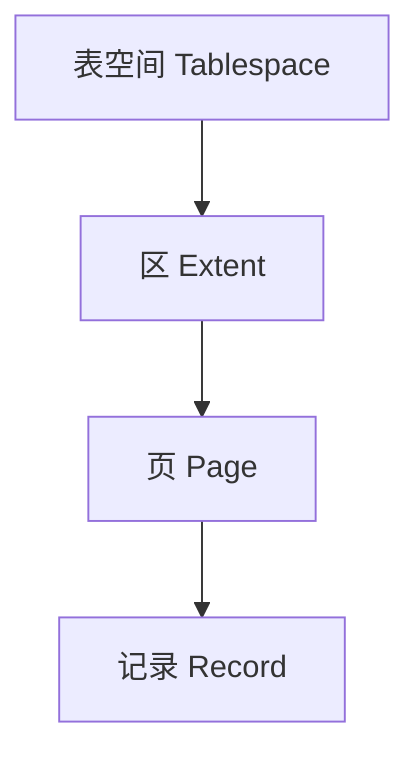
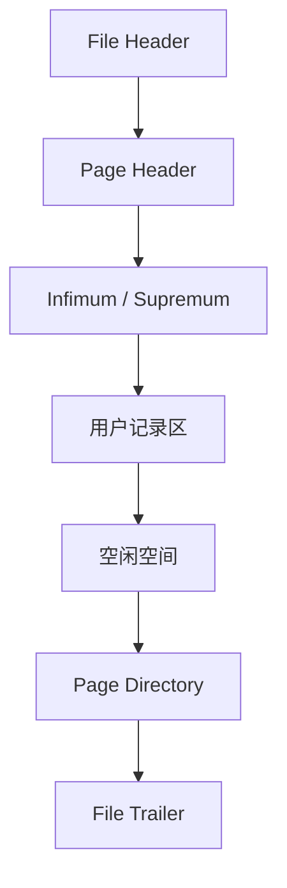
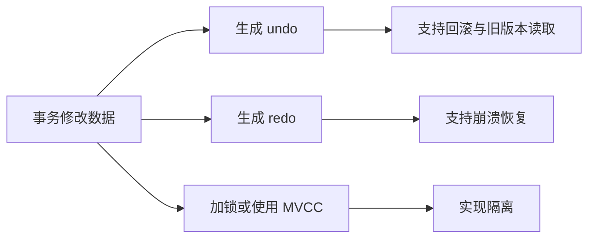
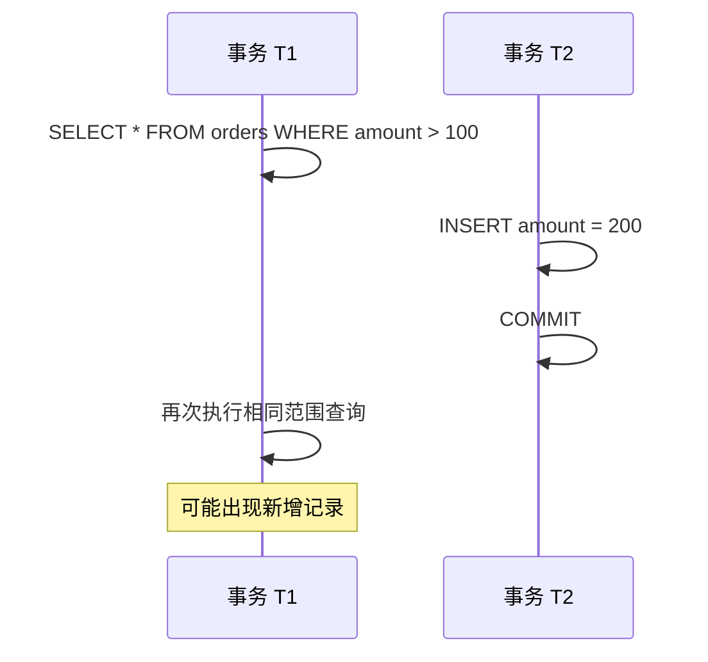
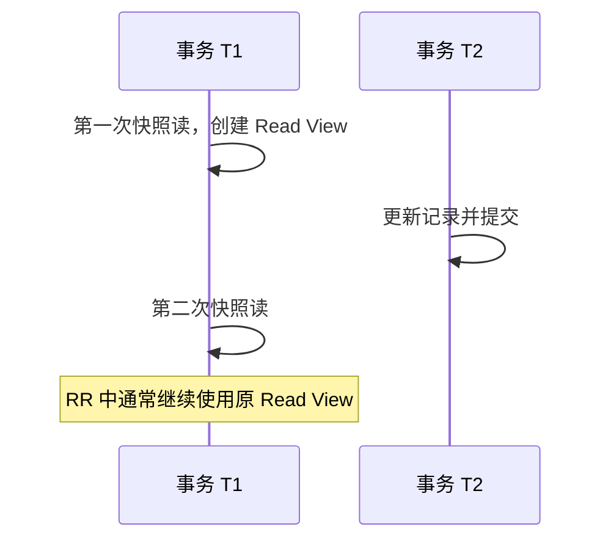
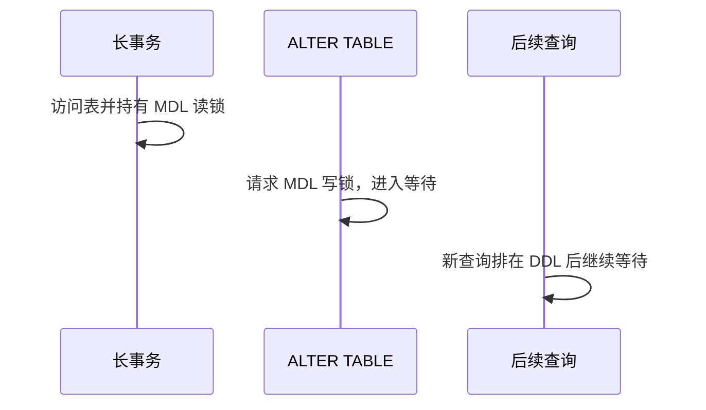
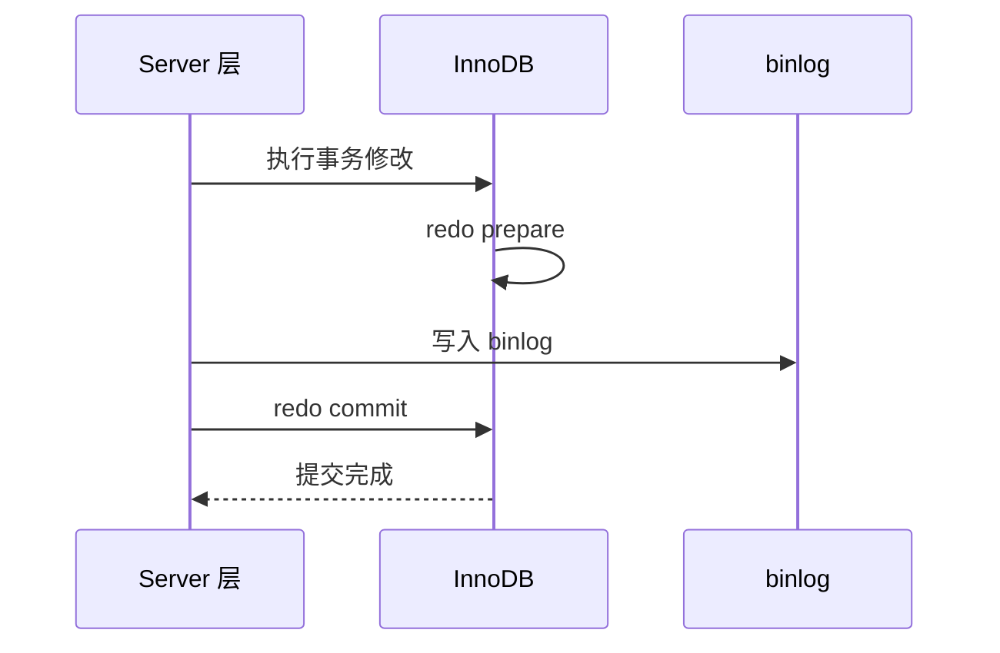
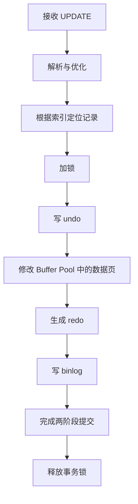
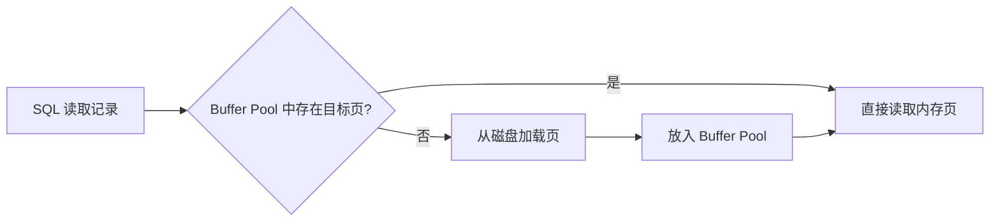
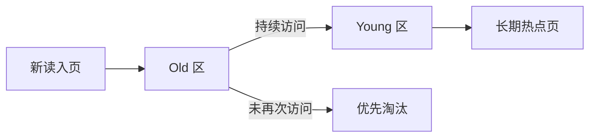

# 数据库

# 1. Mindmap


# 2. SQL 基础与关系模型

## 2.1 SQL 的基本组成

SQL 常用语句可以分为四类：

| 类型 | 代表语句 | 作用 |
|---|---|---|
| DDL | `CREATE`、`ALTER`、`DROP` | 定义数据库对象 |
| DML | `INSERT`、`UPDATE`、`DELETE` | 修改数据 |
| DQL | `SELECT` | 查询数据 |
| TCL | `COMMIT`、`ROLLBACK` | 控制事务 |

## 2.2 JOIN

假设有两张表：

```sql
CREATE TABLE users (
    id BIGINT PRIMARY KEY,
    name VARCHAR(64) NOT NULL
);

CREATE TABLE orders (
    id BIGINT PRIMARY KEY,
    user_id BIGINT NOT NULL,
    amount DECIMAL(12, 2) NOT NULL,
    created_at DATETIME NOT NULL,
    INDEX idx_user_id(user_id)
);
```

查询存在订单的用户：

```sql
SELECT u.id, u.name, o.id AS order_id
FROM users AS u
INNER JOIN orders AS o ON o.user_id = u.id;
```

查询所有用户，包括没有订单的用户：

```sql
SELECT u.id, u.name, o.id AS order_id
FROM users AS u
LEFT JOIN orders AS o ON o.user_id = u.id;
```

注意：对于 `LEFT JOIN`，右表过滤条件放在 `ON` 和 `WHERE` 中含义可能不同。

- ON 条件决定右表中的哪些记录可以参与匹配。
- WHERE 条件在连接完成后，对最终结果再次过滤。

### 第一种写法
```sql
-- 保留没有订单的用户
SELECT u.id, o.id
FROM users u
LEFT JOIN orders o
    ON o.user_id = u.id
   AND o.amount > 100;
```

以 users 为主表，**为每个用户查找金额大于 100 的订单**。如果某个用户没有金额大于 100 的订单，仍然保留该用户，只是订单字段为 NULL。

需要注意，保留的不只是“完全没有订单的用户”，还包括：
- 没有任何订单的用户；
- 有订单，但所有订单金额都不大于 100 的用户；
- 有订单，但订单金额为 NULL 的用户。

```sql
-- WHERE 会过滤掉右表为 NULL 的记录，效果接近 INNER JOIN
SELECT u.id, o.id
FROM users u
LEFT JOIN orders o ON o.user_id = u.id
WHERE o.amount > 100;
```

### 第二种写法

只保留存在大额订单的用户
它先进行普通的左连接：
```sql
LEFT JOIN orders o ON o.user_id = u.id
```
此时，没有订单的用户，其右表字段都是 NULL。

然后执行：
```sql
WHERE o.amount > 100
```
对于没有匹配订单的用户，判断相当于：
```sql
NULL > 100
```
结果不是 TRUE，而是 UNKNOWN，因此被 WHERE 过滤掉。

这种写法最终只保留金额大于 100 的订单记录

## 2.3 GROUP BY 与 HAVING

查询订单总金额大于 1000 的用户：

```sql
SELECT user_id, SUM(amount) AS total_amount
FROM orders
GROUP BY user_id
HAVING SUM(amount) > 1000;
```

`WHERE` 在分组前过滤行，`HAVING` 在分组后过滤组。


## 2.4 EXISTS 与 IN

```sql
SELECT *
FROM users u
WHERE EXISTS (
    SELECT 1
    FROM orders o
    WHERE o.user_id = u.id
);
```

`EXISTS` 表达“是否至少存在一条匹配记录”。现代优化器经常能将 `EXISTS` 和 `IN` 改写为相似的半连接计划，因此不能机械地断言某一种写法永远更快，应结合执行计划判断。

## 2.5 窗口函数

窗口函数用于：

> 在保留每一行明细数据的同时，基于这一行所属的一组数据进行排名、累计、比较或统计。

窗口函数和 GROUP BY 最大的区别是：

- GROUP BY 会把多行压缩成一行；
- 窗口函数不会减少结果行数，而是在每一行旁边增加计算结果。

查询每个用户金额最高的订单：

```sql
WITH ranked_orders AS (
    SELECT
        id,
        user_id,
        amount,
        ROW_NUMBER() OVER (
            PARTITION BY user_id
            ORDER BY amount DESC, id ASC
        ) AS rn
    FROM orders
)
SELECT id, user_id, amount
FROM ranked_orders
WHERE rn = 1;
```

常见窗口函数：

- `ROW_NUMBER()`：连续编号，不并列。
- `RANK()`：并列后跳号。
- `DENSE_RANK()`：并列后不跳号。
- `SUM() OVER(...)`：累计统计。
- `LAG()`、`LEAD()`：读取前后行。

## 2.6 NULL 的语义

`NULL` 表示未知或缺失，不等于空字符串，也不等于 0。

```sql
-- 错误
WHERE deleted_at = NULL

-- 正确
WHERE deleted_at IS NULL
```

SQL 使用三值逻辑：`TRUE`、`FALSE`、`UNKNOWN`。任何与 `NULL` 的普通比较通常都会得到 `UNKNOWN`。

---

# 3. 表结构设计

## 3.1 主键设计原则

主键应尽量满足：

- 唯一。
- 非空。
- 稳定，不随业务变化。
- 尽量短。
- 写入顺序尽量有序。

InnoDB 的二级索引叶子节点会保存主键值，因此主键过长会放大所有二级索引的空间占用。

## 3.2 自增 ID、UUID 与雪花 ID

| 方案 | 优点 | 局限 |
|---|---|---|
| 自增 ID | 短、顺序写、索引紧凑 | 多节点协调困难，可能暴露数据规模 |
| UUID | 本地生成、全局唯一 | 16 字节，随机写入，索引膨胀 |
| 雪花 ID | 趋势递增、分布式生成 | 依赖时钟和节点编号管理 |
| 号段模式 | 有序、吞吐高 | 需要号段服务与容灾 |

UUID 若直接使用字符串存储，空间和比较开销更大。更合理的选择通常是：

- 使用 `BINARY(16)` 保存 UUID；
- 使用时间有序 UUID；
- 或采用趋势递增的分布式 ID。

## 3.3 金额字段

金额通常使用 `DECIMAL`，不使用 `FLOAT` 或 `DOUBLE`。

```sql
amount DECIMAL(12, 2) NOT NULL
```

浮点数采用二进制近似表示，部分十进制小数无法精确保存。

## 3.4 CHAR 与 VARCHAR

- `CHAR(n)`：固定长度，适合长度固定的数据。
- `VARCHAR(n)`：变长，适合长度差异明显的文本。

不能简单地说 `CHAR` 一定更快。实际选择还受到字符集、行格式、页布局和访问模式影响。

## 3.5 范式与反范式

第三范式强调：非主属性只依赖候选键，不依赖其他非主属性。

范式化的优点：

- 减少冗余。
- 降低更新异常。
- 提高数据一致性。

反范式化的优点：

- 减少 JOIN。
- 降低查询链路复杂度。
- 更适合高频读取和报表场景。

反范式不是随意复制数据，而是用额外一致性维护成本换取查询效率。

## 3.6 逻辑删除

常见设计：

```sql
deleted_at DATETIME NULL
```

逻辑删除带来的问题：

- 所有查询都需要附加过滤条件。
- 唯一约束可能与已删除数据冲突。
- 表数据持续膨胀。
- 统计和归档更复杂。

可以通过归档表、定期清理、联合唯一索引或状态机设计减轻这些问题。

---

# 4. InnoDB 存储结构

InnoDB 以页为基本磁盘管理单位，常见默认页大小为 16KB。



## 4.1 页内结构

一个数据页可抽象为：



页目录保存槽信息，可以先二分定位到记录分组，再在组内顺序查找。

## 4.2 行格式

常见行格式包括 `COMPACT`、`DYNAMIC` 等。行记录通常包含：

- 变长字段长度信息。
- NULL 位图。
- 记录头信息。
- 隐藏系统字段。
- 用户字段。

InnoDB 可能维护以下隐藏字段：

- 事务 ID。
- 回滚指针。
- 在缺少合适主键时生成的隐藏行 ID。

## 4.3 页分裂

当目标页没有足够空间容纳新记录时，B+ 树可能执行页分裂：


随机主键会使写入散落到不同页，增加页分裂、缓存抖动和随机 I/O。

---

# 5. B+ 树索引原理

## 5.1 为什么使用 B+ 树

数据库索引需要适应外存访问。评价重点不是单次 CPU 比较次数，而是磁盘页访问次数。

B+ 树的优势：

1. 每个内部节点可以容纳大量分支，树高低。
2. 非叶子节点只保存键和子页指针，分支因子大。
3. 叶子节点按键有序并形成链表，适合范围扫描。
4. 查询路径稳定，从根节点到叶子节点。

```mermaid
flowchart TB
    R[根节点: 20 | 50] --> N1[内部节点: 5 | 10]
    R --> N2[内部节点: 30 | 40]
    R --> N3[内部节点: 60 | 80]
    N1 --> L1[叶子: 1 3 5]
    N1 --> L2[叶子: 7 9 10]
    N2 --> L3[叶子: 21 25 30]
    N2 --> L4[叶子: 35 40 45]
    N3 --> L5[叶子: 51 60 70]
    N3 --> L6[叶子: 80 90 99]
    L1 -.双向链表.-> L2
    L2 -.-> L3
    L3 -.-> L4
    L4 -.-> L5
    L5 -.-> L6
```

## 5.2 为什么不用红黑树

红黑树每个节点通常只有两个子节点。即使树高是对数级，面对海量记录时高度仍明显高于 B+ 树，会产生更多随机页访问。

## 5.3 为什么不用 Hash 作为通用索引

Hash 索引适合等值查询，但不适合：

- 范围查询。
- 前缀匹配。
- 按索引顺序排序。
- 最左前缀组合查询。

因此 Hash 更适合作为特定场景的辅助结构，而不是通用磁盘索引。

---

# 6. 聚簇索引、二级索引与回表

## 6.1 聚簇索引

InnoDB 的聚簇索引叶子节点保存完整行数据。通常选择顺序为：

1. 显式主键。
2. 第一个非空唯一索引。
3. 内部生成的隐藏行 ID。

## 6.2 二级索引

二级索引叶子节点通常保存：

```text
二级索引列 + 主键值
```

查询过程：


第二次访问聚簇索引的过程称为回表。

## 6.3 覆盖索引

如果查询所需列全部能从二级索引中获得，就不需要回表。

```sql
CREATE INDEX idx_user_time_amount
ON orders(user_id, created_at, amount);

SELECT created_at, amount
FROM orders
WHERE user_id = 1001
ORDER BY created_at DESC
LIMIT 20;
```

若执行计划显示 `Using index`，通常表示使用了覆盖索引。

## 6.4 主键长度的放大效应

假设一张表有 5 个二级索引：

```text
主键增加 8 字节
→ 每条二级索引记录都增加约 8 字节
→ 全部二级索引共同放大空间占用
→ 单页可容纳记录减少
→ B+ 树可能变高
→ 缓存命中率下降
```

---

# 7. 联合索引与最左前缀

假设存在联合索引：

```sql
INDEX idx_abc(a, b, c)
```

其排序方式不是分别对三列独立排序，而是：

```text
先按 a 排序；
a 相同，再按 b 排序；
a、b 都相同，再按 c 排序。
```

## 7.1 可以有效利用索引前缀的条件

```sql
WHERE a = 1
WHERE a = 1 AND b = 2
WHERE a = 1 AND b = 2 AND c = 3
WHERE a = 1 AND b BETWEEN 2 AND 9
```

## 7.2 无法直接定位最左边界的条件

```sql
WHERE b = 2
WHERE c = 3
WHERE b = 2 AND c = 3
```

原因是索引整体首先按 `a` 排序，缺少 `a` 时，`b` 的值散布在多个 `a` 分组中。

## 7.3 范围条件后的列

```sql
WHERE a = 1 AND b > 10 AND c = 3
```

通常可以使用 `a` 和 `b` 确定扫描范围，但 `c` 难以继续缩小 B+ 树的连续扫描区间。

更准确的结论是：

- `c` 往往不能继续用于构造索引边界。
- `c` 仍可能由 Index Condition Pushdown 在存储引擎层过滤。
- `c` 仍可能作为覆盖列避免回表。

## 7.4 索引列顺序

联合索引设计需要同时考虑：

- 查询过滤条件。
- 等值条件与范围条件。
- 字段选择性。
- 排序与分组。
- 覆盖查询。
- 写入成本。

不能机械使用“选择性最高的列必须放最前”。如果某列是高频等值前缀，或者需要支持排序，它可能更适合放在前部。

## 7.5 ORDER BY 利用索引

```sql
INDEX idx_user_time(user_id, created_at)

SELECT *
FROM orders
WHERE user_id = 1001
ORDER BY created_at DESC;
```

在固定 `user_id` 后，`created_at` 在索引中保持有序，优化器可能直接按索引顺序扫描，避免额外排序。

---

# 8. 索引失效与索引设计

“索引失效”不是一个严格的单一状态。更准确的说法是：优化器认为某个索引无法降低成本，或者只能使用其中一部分能力。

## 8.1 对索引列做函数或表达式

```sql
-- 不利于普通索引定位
WHERE DATE(created_at) = '2026-07-23'

-- 改写为范围
WHERE created_at >= '2026-07-23 00:00:00'
  AND created_at <  '2026-07-24 00:00:00'
```

也可以根据数据库能力建立函数索引或生成列索引。

## 8.2 隐式类型转换

```sql
phone VARCHAR(20)

-- 传入数值可能触发类型转换
WHERE phone = 13800138000
```

字段类型与参数类型应保持一致。

## 8.3 前导模糊匹配

```sql
LIKE '%abc'
```

普通 B+ 树难以确定起始位置。以下写法可使用前缀索引：

```sql
LIKE 'abc%'
```

全文检索需求应考虑倒排索引，而不是依赖前导模糊查询。

## 8.4 低选择性字段

例如性别、布尔状态。低选择性索引并非绝对无用：

- 若某个值占比极低，仍可能有效。
- 与其他字段组成联合索引可能有效。
- 覆盖索引仍可能降低回表成本。

## 8.5 返回比例过高

即使存在索引，若查询需要返回表中大部分数据，优化器可能选择全表扫描，因为大量回表的随机访问成本可能高于顺序扫描。

## 8.6 过多索引的代价

每个索引都会增加：

- 插入、更新、删除成本。
- 占用空间。
- Buffer Pool 压力。
- 统计信息维护成本。
- 优化器选择复杂度。

索引设计的目标不是“尽可能多”，而是为关键访问路径建立最小而充分的索引集合。

---

# 9. 事务与 ACID

事务是一组不可分割的数据库操作。

```sql
START TRANSACTION;

UPDATE accounts
SET balance = balance - 100
WHERE id = 1;

UPDATE accounts
SET balance = balance + 100
WHERE id = 2;

COMMIT;
```

## 9.1 原子性 Atomicity

事务中的操作要么全部成功，要么全部回滚。主要依赖 undo 信息和事务状态管理。

## 9.2 一致性 Consistency

事务前后数据满足业务约束和完整性约束。一致性是事务机制、约束设计和应用逻辑共同实现的结果。

## 9.3 隔离性 Isolation

并发事务之间应表现为某种受控的可见关系，主要由 MVCC 和锁实现。

## 9.4 持久性 Durability

事务提交后，即使发生故障，修改也应能够恢复。主要依赖 redo 日志、刷盘策略和恢复流程。



## 9.5 事务边界

事务应尽量短。以下做法会放大风险：

- 在事务中调用远程服务。
- 在事务中等待用户输入。
- 一次更新大量记录。
- 长时间持有热点行锁。
- 事务开启后执行无关计算。

长事务会导致：

- 锁持有时间增加。
- undo 版本链增长。
- 清理延迟。
- 主从复制压力增加。
- 故障恢复时间变长。

---

# 10. 隔离级别与并发现象

## 10.1 脏读

事务 A 读取到事务 B 尚未提交的数据，随后事务 B 回滚。

## 10.2 不可重复读

同一事务内，两次读取同一行得到不同结果，原因通常是其他事务提交了更新。

## 10.3 幻读

同一事务内，以相同条件执行范围查询，结果集合中的行数发生变化。



## 10.4 四种隔离级别

| 隔离级别 | 脏读 | 不可重复读 | 幻读 | 并发能力 |
|---|---:|---:|---:|---:|
| Read Uncommitted | 可能 | 可能 | 可能 | 高 |
| Read Committed | 避免 | 可能 | 可能 | 较高 |
| Repeatable Read | 避免 | 避免 | 需结合具体读类型分析 | 较高 |
| Serializable | 避免 | 避免 | 避免 | 低 |

## 10.5 快照读与当前读

快照读：

```sql
SELECT * FROM orders WHERE id = 1;
```

普通一致性读取通常通过 MVCC 读取可见版本。

当前读：

```sql
SELECT * FROM orders WHERE id = 1 FOR UPDATE;
UPDATE orders SET amount = 100 WHERE id = 1;
DELETE FROM orders WHERE id = 1;
```

当前读需要读取较新的可锁定版本，并通过锁保护后续修改。

不能笼统地说“RR 完全依靠 MVCC 解决幻读”。对于当前读和范围修改，还需要记录锁、间隙锁与 Next-Key Lock。

---

# 11. MVCC 与 Read View

MVCC 的目标是在很多读写场景下减少互斥等待，让读取者看到符合隔离规则的历史版本。

## 11.1 版本链

当记录被更新时，旧值相关信息进入 undo，当前记录保存指向历史版本的回滚指针。


读取时，如果当前版本不可见，就沿版本链查找更旧版本。

## 11.2 Read View

可以将 Read View 抽象为以下信息：

- 当前活跃事务 ID 集合。
- 活跃事务中的最小 ID。
- 创建视图时即将分配的下一个事务 ID。
- 当前事务自身 ID。

简化可见性判断：

1. 版本由当前事务生成，通常可见。
2. 版本事务 ID 小于最小活跃事务 ID，通常可见。
3. 版本事务 ID 大于等于视图上界，通常不可见。
4. 版本事务 ID 位于区间内时，检查其是否仍在活跃事务集合中。

## 11.3 RC 与 RR 的差异

- RC：通常每次一致性读生成新的 Read View。
- RR：通常事务第一次一致性读生成 Read View，后续复用。



## 11.4 MVCC 的边界

MVCC 不能解决所有并发问题：

- 多个事务同时修改同一行仍需要锁。
- 当前读需要锁。
- 唯一约束冲突需要等待或报错。
- 写偏差等业务一致性问题仍需额外约束。

---

# 12. 锁机制

## 12.1 共享锁与排他锁

- 共享锁 S：允许多个事务并发读取受锁记录。
- 排他锁 X：用于修改，和其他 S/X 锁冲突。

## 12.2 记录锁

锁定索引中的具体记录。

```sql
SELECT *
FROM orders
WHERE id = 100
FOR UPDATE;
```

若通过唯一索引精确定位，通常主要锁定对应索引记录。

## 12.3 间隙锁

锁定索引记录之间的区间，不锁定现有记录本身，主要用于阻止其他事务在区间内插入。

## 12.4 Next-Key Lock

Next-Key Lock 可视为：

```text
记录锁 + 前方间隙锁
```

例如索引中有值 `10、20、30`，对 `20` 的 Next-Key Lock 可以抽象为锁定 `(10, 20]`。

```mermaid
flowchart LR
    A[10] --> B[(10,20] 被锁定]
    B --> C[20]
    C --> D[(20,30]]
    D --> E[30]
```

实际加锁范围会受到：

- 隔离级别。
- 唯一索引或普通索引。
- 等值或范围条件。
- 查询是否命中记录。
- 优化器选择的访问路径。

影响，因此不能只根据 SQL 表面条件武断判断锁范围。

## 12.5 意向锁

意向锁是表级锁，用来表达事务准备在表内某些行上持有共享锁或排他锁。

- IS：意向共享锁。
- IX：意向排他锁。

它们用于快速判断表级锁与行级锁是否冲突，避免逐行检查。

## 12.6 元数据锁 MDL

执行查询时会持有元数据锁，防止表结构被并发修改。长事务可能导致 DDL 长时间等待。

典型链路：



这会形成明显的请求堆积。

## 12.7 乐观锁与悲观锁

悲观锁：

```sql
SELECT * FROM inventory
WHERE sku_id = 1
FOR UPDATE;
```

乐观锁：

```sql
UPDATE inventory
SET stock = stock - 1,
    version = version + 1
WHERE sku_id = 1
  AND version = 8
  AND stock > 0;
```

若受影响行数为 0，说明版本冲突或库存不足。

---

# 13. 死锁分析与治理

## 13.1 死锁示例

事务 T1：

```sql
UPDATE accounts SET balance = balance - 10 WHERE id = 1;
UPDATE accounts SET balance = balance + 10 WHERE id = 2;
```

事务 T2：

```sql
UPDATE accounts SET balance = balance - 20 WHERE id = 2;
UPDATE accounts SET balance = balance + 20 WHERE id = 1;
```


数据库检测到循环等待后，会回滚其中一个事务。

## 13.2 四个必要条件

死锁通常包含：

1. 互斥。
2. 持有并等待。
3. 不可抢占。
4. 循环等待。

## 13.3 排查方法

```sql
SHOW ENGINE INNODB STATUS;
```

还应结合：

- `performance_schema` 锁等待表。
- 事务开始时间。
- 当前执行 SQL。
- 访问索引。
- 受影响行数。
- 应用调用链。

## 13.4 治理策略

- 统一资源访问顺序。
- 缩短事务。
- 使用正确索引，减少扫描和锁定范围。
- 将批量操作拆分为小批次。
- 避免在事务中访问远程服务。
- 为死锁失败设置有限次数重试。
- 重试必须建立在幂等基础上。

注意：死锁不一定意味着系统设计完全错误。在高并发事务系统中，数据库能够检测并打破少量死锁是正常机制，关键是控制频率和影响范围。

---

# 14. redo、undo、binlog 与提交过程

## 14.1 三类日志

| 日志 | 所属层次 | 主要作用 |
|---|---|---|
| redo log | InnoDB | 崩溃恢复、WAL |
| undo log | InnoDB | 回滚、MVCC |
| binlog | Server 层 | 复制、审计、时间点恢复 |

## 14.2 WAL

WAL：Write-Ahead Logging，先写日志，再异步写数据页。


日志通常是顺序写，而随机修改的数据页可以延后批量刷盘，从而提高吞吐。

## 14.3 undo 的作用

- 事务回滚。
- 为 MVCC 提供历史版本。

undo 并不等于完整保存每次修改前的整行副本，其内部采用能重建旧版本的记录形式。

## 14.4 binlog 格式

- Statement：记录 SQL 语句。
- Row：记录行变更。
- Mixed：混合模式。

Row 格式通常更利于复制一致性和变更订阅，但日志量可能更大。

## 14.5 两阶段提交

redo 和 binlog 分属不同层次，需要协调状态。

简化过程：



如果缺少协调，可能出现：

- redo 已提交但 binlog 缺失。
- binlog 已存在但 redo 未提交。

这会导致主库恢复状态与复制状态不一致。

## 14.6 一条 UPDATE 的简化链路



## 14.7 checkpoint 与脏页刷盘

checkpoint 用于推进可恢复边界，并控制 redo 空间循环使用。

脏页刷盘常见触发因素：

- 后台刷脏。
- redo 空间压力。
- Buffer Pool 淘汰。
- 正常关闭。
- 检查点推进。

## 14.8 doublewrite

页写入可能发生部分写，导致一个数据页只有部分内容落盘。doublewrite 通过先写入连续缓冲区域，再写入最终位置，为页损坏恢复提供副本。

---

# 15. Buffer Pool 与数据页

## 15.1 为什么需要 Buffer Pool

磁盘访问远慢于内存。Buffer Pool 缓存：

- 数据页。
- 索引页。
- undo 页。
- 自适应哈希相关结构。
- 其他内部页。



## 15.2 脏页

内存页被修改后，与磁盘页不一致，称为脏页。事务提交并不要求所有数据页立即刷盘，持久性主要由 redo 保证。

## 15.3 LRU 改进

简单 LRU 容易被全表扫描污染。InnoDB 通常使用改进 LRU，将链表划分为新生区和旧生区，降低一次性大扫描对热点页的挤出。



## 15.4 命中率不是唯一指标

Buffer Pool 命中率高不代表系统一定健康，还要观察：

- 脏页比例。
- 刷脏速度。
- 页读取速率。
- 等待 I/O。
- 大查询造成的缓存抖动。
- redo 压力。
- 锁等待与 CPU 使用率。

---

# 16. SQL 执行链路与 EXPLAIN

## 16.1 查询执行链路


优化器主要决定：

- 访问哪张表先。
- 选择哪个索引。
- 使用何种 JOIN 算法。
- 是否排序或使用临时表。
- 估算每一步行数和成本。

## 16.2 EXPLAIN 重点字段

| 字段 | 含义 |
|---|---|
| `type` | 访问方式 |
| `possible_keys` | 可能使用的索引 |
| `key` | 实际选择的索引 |
| `key_len` | 使用的索引长度 |
| `ref` | 与索引比较的值 |
| `rows` | 预计扫描行数 |
| `filtered` | 过滤后保留比例估计 |
| `Extra` | 额外执行信息 |

## 16.3 常见访问类型

大致从更精确到更宽泛：

```text
const
→ eq_ref
→ ref
→ range
→ index
→ ALL
```

不能只看 `type` 判断好坏，还要结合：

- 实际扫描行数。
- 返回行数。
- 回表次数。
- 排序和临时表。
- 单次执行频率。
- 数据分布。

## 16.4 Extra

- `Using index`：覆盖索引。
- `Using index condition`：索引下推。
- `Using where`：Server 层仍需过滤。
- `Using filesort`：需要额外排序过程，不一定真的写文件。
- `Using temporary`：使用临时表完成中间结果。

## 16.5 EXPLAIN ANALYZE

`EXPLAIN` 主要给出估算，`EXPLAIN ANALYZE` 会实际执行并返回真实耗时、循环次数和行数。

重点比较：

```text
估算 rows 与实际 rows 是否严重偏离
```

严重偏离可能来自：

- 统计信息过旧。
- 数据倾斜。
- 列之间存在相关性。
- 参数分布差异。

## 16.6 慢查询分析顺序

```mermaid
flowchart TD
    A[确认接口耗时] --> B[确认数据库耗时占比]
    B --> C[获取完整 SQL 与参数]
    C --> D[查看慢日志与监控]
    D --> E[执行 EXPLAIN ANALYZE]
    E --> F{主要瓶颈}
    F -->|扫描过多| G[索引或查询改写]
    F -->|锁等待| H[事务与并发治理]
    F -->|排序/临时表| I[索引顺序或结果集缩减]
    F -->|I/O| J[缓存、数据量与存储分析]
    F -->|连接等待| K[连接池与数据库容量分析]
```

---

# 17. 常见 SQL 优化场景

## 17.1 深分页

传统分页：

```sql
SELECT *
FROM orders
ORDER BY id
LIMIT 1000000, 20;
```

数据库仍需要跳过前面大量记录。

游标分页：

```sql
SELECT *
FROM orders
WHERE id > 1000000
ORDER BY id
LIMIT 20;
```

优点：

- 扫描量稳定。
- 适合按有序唯一键向后翻页。

局限：

- 不适合任意跳页。
- 排序键需要稳定。
- 复合排序要使用复合游标。

## 17.2 延迟关联

```sql
SELECT o.*
FROM orders o
JOIN (
    SELECT id
    FROM orders
    ORDER BY id
    LIMIT 1000000, 20
) x ON x.id = o.id;
```

先在较窄索引上定位主键，再回表获取完整行，可能降低大偏移下的扫描成本。

## 17.3 COUNT

```sql
SELECT COUNT(*) FROM orders WHERE user_id = 1001;
```

优化方向：

- 为过滤条件建立合适索引。
- 避免对超大范围做高频精确统计。
- 对允许误差的场景使用预聚合或近似统计。
- 对固定维度维护汇总表。

不要简单将 `COUNT(*)` 改成 `COUNT(1)` 并期待本质提升，现代数据库通常能做相似优化。

## 17.4 批量插入

```sql
INSERT INTO logs(user_id, action)
VALUES
(1, 'login'),
(2, 'logout'),
(3, 'purchase');
```

相比逐条提交，批量插入可以减少：

- 网络往返。
- 事务提交次数。
- 日志刷盘次数。

批次不能无限增大，应考虑：

- 单事务日志量。
- 锁持有时间。
- 复制延迟。
- 失败重试成本。

## 17.5 大批量更新与删除

不建议一次处理数百万行：

```sql
DELETE FROM logs WHERE created_at < '2025-01-01';
```

更稳妥的方式是按主键或时间分批：

```sql
DELETE FROM logs
WHERE created_at < '2025-01-01'
ORDER BY id
LIMIT 5000;
```

重复执行并监控：

- 单批耗时。
- 锁等待。
- undo 与 redo 增长。
- 主从延迟。
- 磁盘空间。

## 17.6 N+1 查询

错误模式：

```text
查询 100 个用户
→ 对每个用户再查询一次订单
→ 共执行 101 次 SQL
```

可选方案：

- JOIN。
- 批量 `IN` 查询。
- 数据加载器模式。
- 预聚合。

## 17.7 热点行更新

```sql
UPDATE counters
SET value = value + 1
WHERE id = 1;
```

所有请求竞争同一行锁。可采用：

- 分片计数器。
- Redis 原子计数，异步落库。
- 消息队列聚合。
- 本地累加后批量写入。

## 17.8 避免 SELECT *

选择必要列可以：

- 降低网络传输。
- 提高覆盖索引概率。
- 减少内存复制。
- 降低表结构变更带来的耦合。

---

# 18. 主从复制、读写分离与高可用

## 18.1 复制链路

```mermaid
flowchart LR
    A[主库事务提交] --> B[写入 binlog]
    B --> C[从库 I/O 线程拉取]
    C --> D[写入 relay log]
    D --> E[从库 SQL/Applier 线程重放]
    E --> F[从库数据更新]
```

## 18.2 异步复制

主库提交不等待从库确认。

优点：

- 延迟低。
- 主库吞吐高。

风险：

- 主库故障时，尚未复制的数据可能丢失。

## 18.3 半同步复制

主库提交时等待至少一个从库确认收到日志，但通常不等于从库已经完成执行。

它缩小数据丢失窗口，但会增加提交延迟。

## 18.4 主从延迟原因

- 主库并发写入高，从库重放能力不足。
- 大事务。
- 缺少索引导致从库执行慢。
- 从库同时承担大量查询。
- 网络抖动。
- 磁盘 I/O 或 CPU 饱和。
- 单线程或并行复制配置不合理。

## 18.5 写后立即读

请求刚写入主库，随后读从库，可能读不到最新数据。

解决方式：

- 写后一定时间内读主库。
- 通过会话标记实现读主。
- 等待从库追平指定日志位置。
- 对强一致路径固定走主库。
- 对最终一致路径允许短暂旧值。

## 18.6 故障切换

```mermaid
flowchart TD
    A[检测主库不可用] --> B[确认故障与隔离旧主]
    B --> C[选择数据最新的从库]
    C --> D[提升为新主库]
    D --> E[其余从库重新指向新主]
    E --> F[更新服务路由]
    F --> G[验证读写与数据完整性]
```

关键指标：

- RPO：允许丢失多少数据。
- RTO：允许多长时间恢复服务。

## 18.7 脑裂

网络分区可能使旧主和新主同时接受写入。治理措施：

- Fencing Token。
- 外部仲裁。
- 强制隔离旧主。
- 单写入点租约。
- 切换前确认旧主不可写。

---

# 19. 分库分表与全局 ID

## 19.1 为什么拆分

单库单表可能受到：

- 存储容量。
- 单机 I/O。
- 写入吞吐。
- 索引规模。
- DDL 时间。
- 备份恢复时间。

限制。

## 19.2 垂直拆分

按业务域拆分：

```mermaid
flowchart LR
    A[单体数据库] --> B[用户库]
    A --> C[订单库]
    A --> D[支付库]
    A --> E[库存库]
```

优点是边界清晰，局限是跨域事务和查询更复杂。

## 19.3 水平拆分

将同一张逻辑表按分片键分布到多个物理表或库。

```text
shard = hash(user_id) % N
```

## 19.4 分片键选择

分片键应考虑：

- 数据分布均匀。
- 高频查询能携带分片键。
- 事务尽量落在单分片。
- 避免热点。
- 扩容成本可控。

按用户 ID 分片适合用户中心型访问；按时间分片适合日志和归档，但最新分片可能成为写热点。

## 19.5 跨分片问题

分片后会增加：

- 跨分片 JOIN。
- 全局排序。
- 聚合统计。
- 唯一约束。
- 事务协调。
- 分页归并。
- 扩容迁移。

## 19.6 全局 ID

雪花算法一般将 64 位整数划分为：

```mermaid
flowchart LR
    A[符号位] --> B[时间戳]
    B --> C[节点 ID]
    C --> D[序列号]
```

需要处理：

- 时钟回拨。
- 节点 ID 冲突。
- 同毫秒序列耗尽。
- 时间戳溢出。

## 19.7 扩容与数据迁移

直接从 `N` 取模扩容到 `2N` 会导致大量数据重新映射。常见方案：

- 一致性哈希。
- 路由表。
- 虚拟分片。
- 预分片。
- 双写与增量迁移。

简化迁移流程：

```mermaid
flowchart TD
    A[创建新分片] --> B[全量复制历史数据]
    B --> C[开启增量同步]
    C --> D[校验数据]
    D --> E[灰度切读]
    E --> F[切写]
    F --> G[停止旧分片同步]
    G --> H[下线旧路由]
```

---

# 20. Redis 数据结构与内部实现

## 20.1 String

用途：

- 缓存对象。
- 计数器。
- 限流。
- 分布式锁基础实现。

```text
SET key value EX 60 NX
INCR counter
```

Redis 字符串使用 SDS，而不是直接使用 C 字符串。SDS 保存长度和容量，支持二进制安全与高效追加。

## 20.2 Hash

适合保存对象字段：

```text
HSET user:1001 name Alice age 20
HGET user:1001 name
```

优点是可以局部更新字段，但大量小 Hash 与大 Hash 都需要关注内存布局和操作复杂度。

## 20.3 List

适合：

- 简单队列。
- 时间线。
- 有序消息列表。

但可靠消息场景通常更适合 Stream 或专用消息系统，因为 List 缺少完善的消费确认、消费组和消息追踪能力。

## 20.4 Set

用途：

- 去重。
- 标签集合。
- 共同好友。
- 随机抽样。

```text
SINTER user:1:follows user:2:follows
```

## 20.5 ZSet

每个成员带一个分值，可按分值排序。

用途：

- 排行榜。
- 延时任务。
- 带权重集合。

```text
ZADD leaderboard 9800 user:1
ZREVRANGE leaderboard 0 9 WITHSCORES
```

典型实现使用字典和跳表：

- 字典负责按成员快速查找分值。
- 跳表负责按分值有序遍历和范围查询。

```mermaid
flowchart LR
    A[成员查询] --> B[哈希表 O(1) 平均]
    C[排名/范围查询] --> D[跳表 O(log N)]
```

## 20.6 Bitmap

用于大量布尔状态：

- 签到。
- 在线状态。
- 功能开关。

注意 Bitmap 按最大偏移量占用空间，用户 ID 极度稀疏时可能浪费内存。

## 20.7 HyperLogLog

用于近似基数统计，例如独立访客数。优点是空间固定且很小，代价是存在误差，不能枚举原始元素。

## 20.8 Stream

Stream 支持：

- 消息 ID。
- 消费组。
- 待确认列表。
- 消息确认。
- 消费者故障转移。

适合轻量消息流，但仍需评估持久化、积压、重放和跨机房能力。

---

# 21. 缓存穿透、击穿、雪崩与热点问题

## 21.1 缓存穿透

请求的数据在缓存和数据库中都不存在，大量请求持续打到数据库。

解决方案：

- 缓存空值。
- 布隆过滤器。
- 参数校验。
- 限流。

```mermaid
flowchart LR
    A[请求 key] --> B{布隆过滤器判断可能存在?}
    B -- 否 --> C[直接返回不存在]
    B -- 是 --> D[查询缓存]
    D --> E{命中?}
    E -- 否 --> F[查询数据库]
```

布隆过滤器可能误判存在，但不会误判不存在。

## 21.2 缓存击穿

某个热点 Key 失效时，大量并发请求同时查询数据库。

解决方案：

- 互斥重建。
- 逻辑过期。
- 热点永不过期并由后台刷新。
- 请求合并。

```mermaid
flowchart TD
    A[热点 Key 未命中] --> B{是否获得重建锁?}
    B -- 是 --> C[查询数据库并重建缓存]
    B -- 否 --> D[短暂等待或返回旧值]
    C --> E[释放锁]
```

## 21.3 缓存雪崩

大量 Key 在相近时间失效，或缓存集群整体不可用。

解决方案：

- 过期时间加随机抖动。
- 多级缓存。
- 集群高可用。
- 限流与熔断。
- 预热。
- 核心数据降级。

## 21.4 Big Key

Big Key 可能造成：

- 单次请求阻塞时间长。
- 网络传输大。
- 删除阻塞。
- 主从复制压力。
- 集群迁移困难。

治理：

- 拆分 Key。
- 控制集合大小。
- 使用渐进式删除。
- 限制单次读取数量。
- 建立内存扫描与告警。

## 21.5 Hot Key

Hot Key 的问题是访问集中在单个节点或单个分片。

治理：

- 本地缓存。
- Key 复制。
- 热点拆分。
- 请求合并。
- 读写分离。
- 业务降级。

---

# 22. Redis 与 MySQL 一致性

## 22.1 Cache Aside

典型读取流程：

```mermaid
flowchart LR
    A[读取请求] --> B{缓存命中?}
    B -- 是 --> C[返回缓存]
    B -- 否 --> D[查询数据库]
    D --> E[写入缓存]
    E --> F[返回结果]
```

典型写入流程：

```text
更新数据库
→ 删除缓存
```

## 22.2 为什么通常删除缓存而不是直接更新缓存

直接更新缓存的问题：

- 缓存结构可能是多个表聚合结果。
- 更新代价高。
- 并发更新可能乱序覆盖。
- 某些数据更新后不会被读取，产生无效工作。

删除缓存让下一次读取基于数据库重建，逻辑通常更简单。

## 22.3 为什么一般先更新数据库，再删除缓存

若先删除缓存，再更新数据库：

```mermaid
sequenceDiagram
    participant W as 写请求
    participant R as 读请求
    participant C as 缓存
    participant DB as 数据库

    W->>C: 删除缓存
    R->>C: 缓存未命中
    R->>DB: 读取旧值
    R->>C: 写入旧值
    W->>DB: 更新新值
    Note over C,DB: 缓存旧值可能长期存在
```

先更新数据库，再删除缓存仍然存在极小窗口，但通常更容易控制。

## 22.4 删除缓存失败

可选治理方案：

- 重试队列。
- 事务消息。
- 订阅 binlog/CDC 后删除缓存。
- 定期校验。
- 缩短 TTL 作为最终兜底。

## 22.5 延迟双删

流程：

```text
更新数据库
→ 删除缓存
→ 等待一段时间
→ 再次删除缓存
```

它可以缩小部分并发窗口，但存在明显局限：

- 延迟时间难以准确确定。
- 进程崩溃会丢失第二次删除。
- 无法自然处理复杂依赖。
- 延迟会增加系统复杂度。

更稳健的方案通常是可靠消息或 CDC 驱动的缓存失效。

## 22.6 强一致与最终一致

不是所有数据都需要强一致：

- 账户余额、库存扣减：更强调强约束。
- 商品详情、用户画像：通常可接受短暂旧值。
- 排行榜、计数：可能允许异步聚合。

一致性设计应先明确业务容忍度，而不是追求所有链路零延迟同步。

---

# 23. Redis 持久化与高可用

## 23.1 RDB

RDB 在某个时点生成数据快照。

优点：

- 文件紧凑。
- 恢复速度快。
- 适合备份。

局限：

- 两次快照之间的数据可能丢失。
- 生成快照会产生额外 CPU、内存和 I/O 压力。

## 23.2 AOF

AOF 记录写命令，并按策略刷盘。

常见刷盘策略：

- 每条命令刷盘。
- 每秒刷盘。
- 由操作系统决定。

AOF 重写会将历史命令压缩为能够重建当前状态的最小命令集合。

## 23.3 混合持久化

AOF 重写文件前半部分使用快照格式，后半部分追加增量命令，兼顾恢复速度与数据完整性。

## 23.4 主从复制

```mermaid
flowchart LR
    A[主节点] --> B[复制积压缓冲区]
    B --> C[从节点 1]
    B --> D[从节点 2]
```

从节点可用于：

- 读扩展。
- 故障切换候选。
- 备份。

但复制是异步过程，仍可能存在延迟和数据丢失窗口。

## 23.5 Sentinel

Sentinel 提供：

- 监控。
- 主观下线判断。
- 客观下线协商。
- 自动故障转移。
- 服务发现。

Sentinel 不是数据分片方案。

## 23.6 Redis Cluster

Redis Cluster 将键空间划分为 16384 个槽。

```text
slot = CRC16(key) mod 16384
```

节点负责若干槽，扩容时迁移槽，而不是重新计算所有键的节点位置。

Hash Tag 可以让多个 Key 落入同一槽：

```text
order:{1001}:detail
order:{1001}:items
```

花括号中的内容用于槽计算。

## 23.7 过期删除与内存淘汰

过期键通常通过：

- 惰性删除。
- 定期抽样删除。

共同清理。

内存达到上限时，根据策略执行淘汰，例如：

- LRU 类。
- LFU 类。
- 随机淘汰。
- 按 TTL 淘汰。
- 禁止写入。

淘汰策略应结合数据访问模式选择。

---

# 24. 连接池、超时、重试与幂等

## 24.1 为什么需要连接池

建立数据库连接通常涉及：

- TCP 连接。
- TLS。
- 认证。
- 会话初始化。

每次请求都新建连接成本高，连接池复用长连接。

```mermaid
flowchart LR
    A[请求线程] --> B[连接池]
    B --> C[空闲连接]
    B --> D[正在使用的连接]
    D --> E[数据库]
    D -->|归还| C
```

## 24.2 连接池大小

连接数不是越多越好。过多连接会导致：

- 数据库线程调度开销。
- 内存占用增加。
- 锁竞争加剧。
- 上下文切换增加。
- 故障时请求洪峰放大。

连接池大小应结合：

- 数据库可承受并发。
- 查询平均耗时。
- 请求吞吐。
- 应用实例数量。
- 慢查询比例。

## 24.3 超时层次

常见超时：

- 获取连接超时。
- 建连超时。
- 查询超时。
- 事务超时。
- Socket 读写超时。
- 整体请求超时。

外层超时应大于内层超时，并保留清理与返回错误的时间预算。

## 24.4 重试风险

数据库操作超时不等于操作一定失败。可能出现：

```text
数据库已提交
→ 响应在网络中丢失
→ 客户端认为失败并重试
→ 发生重复写
```

因此写操作重试必须有幂等保障。

## 24.5 幂等设计

常见方案：

- 业务唯一键。
- 幂等 Token。
- 去重表。
- 状态机条件更新。
- 唯一索引。

例如支付请求：

```sql
INSERT INTO payment_requests(request_id, order_id, status)
VALUES (?, ?, 'INIT');
```

对 `request_id` 建立唯一索引，重复请求由数据库约束拦截。

## 24.6 RAII 管理事务

在 C++ 中可以使用 RAII 绑定事务生命周期：

```cpp
class Transaction {
public:
    explicit Transaction(Connection& conn) : conn_(conn), committed_(false) {
        conn_.begin();
    }

    void commit() {
        conn_.commit();
        committed_ = true;
    }

    ~Transaction() {
        if (!committed_) {
            try {
                conn_.rollback();
            } catch (...) {
                // 析构函数中不能抛出异常，可记录日志。
            }
        }
    }

private:
    Connection& conn_;
    bool committed_;
};
```

## 24.7 不要阻塞事件循环

同步数据库客户端会阻塞调用线程。基于事件循环的服务通常需要：

```mermaid
flowchart LR
    A[EventLoop] -->|提交数据库任务| B[数据库线程池]
    B --> C[同步执行 SQL]
    C -->|完成回调| A
```

否则一个慢查询可能阻塞同一事件循环上的全部连接。

---

# 25. MongoDB、Elasticsearch 与向量数据库

## 25.1 MongoDB

MongoDB 使用文档模型，适合：

- 半结构化数据。
- 字段变化频繁的对象。
- 聚合根整体读写。
- JSON 友好的数据访问。

设计时需要在嵌入和引用之间权衡：

- 嵌入：读取方便，但文档可能膨胀。
- 引用：结构清晰，但需要多次查询或聚合。

仍需理解：

- 索引。
- 副本集。
- 分片。
- 写关注。
- 读关注。
- 事务边界。

## 25.2 Elasticsearch

Elasticsearch 的核心是倒排索引：

```mermaid
flowchart LR
    A[文档 1: 数据库系统] --> C[分词]
    B[文档 2: 分布式数据库] --> C
    C --> D[数据库 -> 文档 1, 文档 2]
    C --> E[系统 -> 文档 1]
    C --> F[分布式 -> 文档 2]
```

适合：

- 全文检索。
- 多字段搜索。
- 聚合分析。
- 日志检索。

不适合作为所有业务事实的唯一存储。常见架构是关系数据库保存权威数据，Elasticsearch 保存可重建的搜索索引。

需要关注：

- 分片和副本。
- Refresh 与近实时。
- 深分页。
- Mapping。
- 分词器。
- 数据同步。

## 25.3 向量数据库

向量数据库用于近似相似度搜索：

```text
文本/图片/音频
→ Embedding 模型
→ 高维向量
→ ANN 索引
→ Top-K 相似结果
```

常见索引思想：

- HNSW：图搜索。
- IVF：聚类后局部搜索。
- PQ：向量压缩。

工程上还需要处理：

- 元数据过滤。
- 权限控制。
- 文档版本。
- 向量重建。
- 召回率与延迟。
- 向量数据和关系数据的一致性。

---

# 26. 综合场景分析

## 26.1 场景一：订单查询突然变慢

现象：

```sql
SELECT *
FROM orders
WHERE user_id = ?
ORDER BY created_at DESC
LIMIT 20;
```

分析流程：

```mermaid
flowchart TD
    A[获取慢 SQL 与参数] --> B[检查索引]
    B --> C[EXPLAIN ANALYZE]
    C --> D{是否使用 user_id, created_at 联合索引?}
    D -- 否 --> E[建立联合索引]
    D -- 是 --> F{扫描行数是否异常?}
    F -- 是 --> G[检查统计信息与数据倾斜]
    F -- 否 --> H{是否存在锁等待?}
    H -- 是 --> I[定位长事务和热点更新]
    H -- 否 --> J[检查连接池、I/O 与缓存]
```

推荐索引：

```sql
CREATE INDEX idx_user_created
ON orders(user_id, created_at DESC);
```

若只返回少量列，可进一步设计覆盖索引。

## 26.2 场景二：库存被扣成负数

错误写法：

```text
先 SELECT stock
应用判断 stock > 0
再 UPDATE stock = stock - 1
```

两个并发请求可能同时看到库存充足。

原子条件更新：

```sql
UPDATE inventory
SET stock = stock - 1
WHERE sku_id = ?
  AND stock > 0;
```

根据受影响行数判断是否成功。

## 26.3 场景三：缓存旧值长期存在

可能原因：

- 更新数据库后删除缓存失败。
- 并发读在删除窗口内回填旧值。
- 缓存没有 TTL。
- 消息重试链路失效。

治理组合：

```text
数据库事务提交
→ 写入可靠事件
→ CDC 或消息消费者删除缓存
→ 失败重试
→ TTL 最终兜底
→ 定期一致性校验
```

## 26.4 场景四：主从延迟导致用户看不到新订单

可将请求分为：

- 强一致读：写后查询订单、账户余额，走主库。
- 最终一致读：历史列表、统计报表，走从库。

也可在写入后为当前会话设置短期“读主”标记。

## 26.5 场景五：删除历史数据导致服务抖动

原因可能包括：

- 单事务删除过多。
- 大量 undo/redo。
- 长时间持锁。
- Buffer Pool 污染。
- 主从延迟。

治理：

```text
按主键小批删除
→ 每批提交
→ 控制执行速率
→ 观察复制延迟
→ 低峰执行
→ 必要时采用分区删除或归档表
```

## 26.6 场景六：排行榜读写压力过大

可使用 Redis ZSet：

```text
ZINCRBY leaderboard 10 user:1001
ZREVRANGE leaderboard 0 99 WITHSCORES
```

若需要持久权威数据：

```mermaid
flowchart LR
    A[行为事件] --> B[消息队列]
    B --> C[更新 Redis 排行榜]
    B --> D[异步写入数据库明细]
    D --> E[定期校准排行榜]
```

需要明确排行榜允许的延迟和纠偏方式。

---

# 27. 易错结论与修正

## 27.1 “建了索引就一定会使用”

错误。优化器依据成本选择访问路径。数据量小、返回比例高、统计信息偏差时都可能选择全表扫描。

## 27.2 “范围查询后的列完全失效”

不准确。后续列可能不能继续构造索引边界，但仍可参与索引下推、覆盖查询或排序判断。

## 27.3 “MVCC 不需要锁”

错误。MVCC 主要优化一致性读；写写冲突、当前读、唯一约束仍依赖锁。

## 27.4 “RR 下绝对不会有幻读”

不严谨。需要区分快照读和当前读，并结合查询条件、索引和锁范围分析。

## 27.5 “事务提交时数据页必须刷盘”

错误。通常只需按策略确保 redo 持久化，脏页可稍后刷盘。

## 27.6 “Redis 快，所以可以替代数据库”

错误。Redis 与关系数据库在数据模型、持久性、事务能力、查询方式和容量成本上不同，通常是协同关系。

## 27.7 “缓存和数据库可以做到完全零窗口一致”

对于普通双写链路，严格零窗口非常困难。需要根据业务选择强一致、最终一致或补偿机制。

## 27.8 “连接池越大，吞吐越高”

错误。超过数据库处理能力后，只会增加排队、内存和上下文切换。

## 27.9 “死锁只能通过加大锁等待时间解决”

错误。锁等待时间只影响等待多久，不能消除循环等待。应治理访问顺序、事务范围和索引。

## 27.10 “分库分表后性能一定更好”

错误。拆分会引入路由、跨分片查询、事务和迁移成本。应在单库优化和容量评估后再实施。

---

# 28. 学习检查清单

## 28.1 SQL 与表设计

- 能解释 `WHERE`、`GROUP BY`、`HAVING` 的执行阶段。
- 能正确使用 JOIN、子查询、窗口函数。
- 能设计主键、唯一键、金额、时间和状态字段。
- 能说明范式化和反范式化的权衡。

## 28.2 索引

- 能画出 B+ 树结构并解释低树高原因。
- 能解释聚簇索引和二级索引。
- 能解释回表与覆盖索引。
- 能根据查询设计联合索引。
- 能分析范围条件、排序和索引下推。
- 能识别隐式转换、函数、前导模糊等问题。

## 28.3 事务与锁

- 能解释 ACID 的实现机制。
- 能区分脏读、不可重复读和幻读。
- 能解释 RC 与 RR 的 Read View 差异。
- 能区分快照读和当前读。
- 能解释记录锁、间隙锁、Next-Key Lock、意向锁和 MDL。
- 能构造死锁并给出治理方案。

## 28.4 日志与恢复

- 能区分 redo、undo、binlog。
- 能解释 WAL、checkpoint、doublewrite。
- 能说明两阶段提交的目的。
- 能描述一条 UPDATE 的完整执行过程。

## 28.5 性能分析

- 能使用 `EXPLAIN` 和 `EXPLAIN ANALYZE`。
- 能分析扫描行数、回表、排序、临时表和锁等待。
- 能处理深分页、大批量删除、N+1、热点行等问题。
- 能结合连接池、I/O、CPU、日志和复制观察系统瓶颈。

## 28.6 高可用与分布式

- 能解释主从复制和主从延迟。
- 能设计写后读一致性策略。
- 能说明 RPO、RTO 和脑裂治理。
- 能选择分片键并说明跨分片代价。
- 能比较自增 ID、UUID、雪花 ID 和号段模式。

## 28.7 Redis

- 能说明常见数据结构和内部实现。
- 能区分缓存穿透、击穿和雪崩。
- 能分析 Big Key 与 Hot Key。
- 能设计 Cache Aside 和可靠失效流程。
- 能说明 RDB、AOF、Sentinel 和 Cluster。

---

# 结语

数据库系统的核心不是记忆孤立定义，而是建立因果链：

```text
数据如何组织
→ 索引如何定位
→ 查询如何执行
→ 并发如何隔离
→ 修改如何恢复
→ 多节点如何复制
→ 缓存如何协同
→ 故障如何治理
```

遇到具体问题时，可以始终按以下顺序分析：

```mermaid
flowchart LR
    A[现象] --> B[访问路径]
    B --> C[数据规模与分布]
    C --> D[事务与锁]
    D --> E[日志与存储]
    E --> F[复制与缓存]
    F --> G[监控验证]
```

能够从 SQL 一直解释到底层页、锁、日志和分布式链路，才算真正建立了完整的数据库知识体系。
