# 数据库

# 1. Mindmap


# 2. SQL 与关系模型：从 CRUD 到组合查询

本章假设已经会写最基本的 `SELECT`、`INSERT`、`UPDATE` 和 `DELETE`，目标是把
单条语句扩展成可读、可验证的多表查询和数据修改。示例以 MySQL 8.0 / InnoDB
为主；关系模型、连接、聚合和窗口函数等核心概念也适用于多数关系数据库。

## 2.1 SQL 的基本组成

SQL 常用语句通常可以分为五类：

| 类型 | 代表语句 | 作用 |
|---|---|---|
| DDL | `CREATE`、`ALTER`、`DROP` | 定义数据库对象 |
| DML | `INSERT`、`UPDATE`、`DELETE` | 修改数据 |
| DQL | `SELECT` | 查询数据 |
| TCL | `COMMIT`、`ROLLBACK` | 控制事务 |
| DCL | `GRANT`、`REVOKE` | 控制访问权限 |

一张关系表可以先理解为：

- 一行代表一个实体或一条事实；
- 一列代表一个有固定含义和类型的属性；
- 主键唯一标识一行；
- 外键表达表之间的引用关系；
- `NOT NULL`、`UNIQUE`、`CHECK` 等约束负责阻止非法状态进入数据库。

纯关系模型以集合为基础，但 SQL 查询默认更接近 **bag / multiset** 语义：结果可以
包含重复行。结果也没有天然顺序；只有写出 `ORDER BY`，返回顺序才具有明确含义。

## 2.2 贯穿本章的示例表

用户和订单是一对多关系：一个用户可以有多张订单，一张订单只属于一个用户。

```sql
CREATE TABLE users (
    id         BIGINT PRIMARY KEY,
    email      VARCHAR(128) NOT NULL UNIQUE,
    name       VARCHAR(64) NOT NULL,
    manager_id BIGINT NULL,
    created_at DATETIME NOT NULL
);

CREATE TABLE orders (
    id         BIGINT PRIMARY KEY,
    user_id    BIGINT NOT NULL,
    status     VARCHAR(16) NOT NULL,
    amount     DECIMAL(12, 2) NOT NULL,
    created_at DATETIME NOT NULL,
    CONSTRAINT fk_orders_user
        FOREIGN KEY (user_id) REFERENCES users(id),
    INDEX idx_orders_user_created(user_id, created_at)
);
```

后续示例可以用下面的数据理解：

```text
users
id | name  | manager_id
1  | Alice | NULL
2  | Bob   | 1
3  | Carol | 1
4  | David | 2

orders
id  | user_id | status  | amount
101 | 1       | paid    | 120.00
102 | 1       | pending |  80.00
103 | 2       | paid    | 200.00
```

Alice 有两张订单，Bob 有一张，Carol 和 David 没有订单。这个“一对多”关系解释了
为什么连接后 Alice 会出现两行：JOIN 匹配的是行组合，不是把右表压缩成一个对象。

## 2.3 SELECT 的组成与逻辑执行顺序

一个完整查询通常可以写成：

```sql
SELECT [DISTINCT] expression_list
FROM table_source
[JOIN other_table ON join_condition]
[WHERE row_condition]
[GROUP BY group_expression]
[HAVING group_condition]
[ORDER BY sort_expression]
[LIMIT row_count OFFSET skipped_rows];
```

书写顺序不是概念上的求值顺序。理解下面的顺序，可以解释很多“为什么别名不能在
这里用”或“为什么先过滤再聚合”的问题：


这是用于理解语义的逻辑模型，不代表优化器一定按此物理顺序执行。`SELECT` 中定义的
别名通常可以用于 `ORDER BY`，却不能直接用于同一层的 `WHERE`，因为逻辑上
`WHERE` 更早发生：

```sql
SELECT amount * 0.9 AS discounted_amount
FROM orders
WHERE amount * 0.9 >= 100
ORDER BY discounted_amount DESC;
```

## 2.4 WHERE：组合过滤条件

常见条件包括：

| 写法 | 含义 | 容易忽略的边界 |
|---|---|---|
| `a = b`、`a <> b` | 相等、不等 | 与 `NULL` 比较不能这样写 |
| `amount BETWEEN 100 AND 200` | 闭区间 | 两端都包含 |
| `status IN ('paid', 'shipped')` | 属于给定集合 | `NOT IN` 遇到 `NULL` 有陷阱 |
| `name LIKE 'Ali%'` | 前缀匹配 | `%` 匹配任意长度，`_` 匹配单个字符 |
| `created_at IS NULL` | 判断空值 | 不能写成 `= NULL` |

`AND` 的优先级高于 `OR`，复杂条件应使用括号明确意图：

```sql
SELECT id, user_id, status, amount
FROM orders
WHERE status = 'paid'
  AND (amount >= 100 OR created_at >= '2026-01-01');
```

时间范围通常使用左闭右开区间，避免一天最后一秒、小数秒精度和月份天数问题：

```sql
WHERE created_at >= '2026-08-01'
  AND created_at <  '2026-09-01'
```

应用程序传入的值应使用占位符和参数绑定，不要用字符串拼接构造 SQL：

```sql
SELECT id, name
FROM users
WHERE email = ?;
```

参数绑定既能降低 SQL 注入风险，也能避免引号和转义规则被业务代码重复实现。

## 2.5 ORDER BY、LIMIT 与 DISTINCT

只写 `LIMIT` 而不写 `ORDER BY`，得到的是数据库当前执行计划碰巧先返回的若干行，
不是稳定的“前几条”。排序字段可能重复时，应增加唯一键作为最终排序条件：

```sql
SELECT id, user_id, amount, created_at
FROM orders
ORDER BY created_at DESC, id DESC
LIMIT 20 OFFSET 40;
```

`OFFSET 40` 表示先跳过 40 行。偏移很大时数据库仍可能扫描并丢弃大量记录，深分页
的索引写法在第 17 章继续说明。

`DISTINCT` 针对整个投影结果去重，而不是只对紧邻它的第一列去重：

```sql
SELECT DISTINCT user_id, status
FROM orders;
```

这条语句返回不同的 `(user_id, status)` 组合。如果只是因为 JOIN 后出现重复就盲目
加 `DISTINCT`，往往会掩盖连接条件或数据关系问题，并额外引入去重成本。

## 2.6 表达式、CASE 与 COALESCE

`SELECT` 不只能返回原始列，也可以计算新列：

```sql
SELECT
    id,
    amount,
    amount * 0.1 AS estimated_tax,
    CASE
        WHEN amount >= 1000 THEN 'large'
        WHEN amount >= 100  THEN 'medium'
        ELSE 'small'
    END AS amount_level
FROM orders;
```

`CASE` 也可用于条件更新和条件聚合。`COALESCE(a, b, c)` 返回从左到右第一个
非 `NULL` 的值：

```sql
SELECT id, COALESCE(manager_id, 0) AS manager_or_root
FROM users;
```

把 `NULL` 显示为默认值只是结果层转换，不代表数据库中存储的值发生了改变。

## 2.7 JOIN：理解匹配和结果行数

JOIN 的核心问题不是“从另一张表取字段”，而是：左边每一行能与右边多少行匹配。

### INNER JOIN

只保留两边能够匹配的组合。Alice 有两张订单，因此会产生两行：

```sql
SELECT u.id, u.name, o.id AS order_id, o.amount
FROM users AS u
INNER JOIN orders AS o ON o.user_id = u.id;
```

### LEFT JOIN

保留全部左表行。右表没有匹配项时，右表投影列补成 `NULL`：

```sql
SELECT u.id, u.name, o.id AS order_id, o.amount
FROM users AS u
LEFT JOIN orders AS o ON o.user_id = u.id;
```

如果只想判断用户是否存在订单，而不需要展开每张订单，`EXISTS` 往往比 JOIN 后再
`DISTINCT` 更直接。

### ON 与 WHERE 的位置会改变 LEFT JOIN 语义

过滤条件放在 `ON` 中，表示“哪些右表行可以参与匹配”。没有大额订单的用户仍保留：

```sql
SELECT u.id, u.name, o.id AS order_id
FROM users AS u
LEFT JOIN orders AS o
    ON o.user_id = u.id
   AND o.amount > 100;
```

过滤条件放在 `WHERE` 中，是连接完成后再过滤。没有匹配订单的用户，其
`o.amount > 100` 结果为 `UNKNOWN`，因此会被移除，效果接近 INNER JOIN：

```sql
SELECT u.id, u.name, o.id AS order_id
FROM users AS u
LEFT JOIN orders AS o ON o.user_id = u.id
WHERE o.amount > 100;
```

### 自连接

同一张表也可以使用不同别名连接。下面查询用户及其直属管理者：

```sql
SELECT
    employee.id,
    employee.name,
    manager.name AS manager_name
FROM users AS employee
LEFT JOIN users AS manager ON manager.id = employee.manager_id;
```

连接条件遗漏或过宽会形成笛卡尔积，使结果行数接近两表行数乘积。分析 JOIN 时应先
写清楚关系是一对一、一对多还是多对多，再估算每一步最多产生多少行。

## 2.8 聚合、GROUP BY 与 HAVING

聚合函数把多行计算成一个值：

| 函数 | 作用 | NULL 行为 |
|---|---|---|
| `COUNT(*)` | 统计结果行数 | 包含列值为 `NULL` 的行 |
| `COUNT(column)` | 统计该列非空值数量 | 忽略 `NULL` |
| `SUM`、`AVG` | 求和、平均 | 忽略 `NULL` |
| `MIN`、`MAX` | 最小值、最大值 | 忽略 `NULL` |

按用户统计已支付订单的数量和总金额：

```sql
SELECT
    user_id,
    COUNT(*) AS order_count,
    SUM(amount) AS total_amount
FROM orders
WHERE status = 'paid'
GROUP BY user_id
HAVING SUM(amount) >= 100;
```

- `WHERE` 在分组前过滤订单行；
- `GROUP BY` 把相同 `user_id` 的行放进同一组；
- 聚合函数对每组计算；
- `HAVING` 在聚合后过滤整组。

在启用 `ONLY_FULL_GROUP_BY` 的 MySQL 中，普通选择列必须属于分组键，或者能由分组键
函数依赖地确定。下面的写法含义不完整，因为同组可能存在多个不同 `status`：

```sql
-- 不要依赖数据库随意挑选某一行的 status
SELECT user_id, status, SUM(amount)
FROM orders
GROUP BY user_id;
```

条件聚合可以在一次分组中计算多个指标：

```sql
SELECT
    user_id,
    COUNT(*) AS all_orders,
    SUM(CASE WHEN status = 'paid' THEN 1 ELSE 0 END) AS paid_orders,
    SUM(CASE WHEN status = 'paid' THEN amount ELSE 0 END) AS paid_amount
FROM orders
GROUP BY user_id;
```

## 2.9 子查询、EXISTS 与 IN

子查询可以返回一个值、一列值或一张临时结果表。

标量子查询返回至多一个值，例如查询金额高于整体平均值的订单：

```sql
SELECT id, user_id, amount
FROM orders
WHERE amount > (SELECT AVG(amount) FROM orders);
```

如果标量子查询实际返回多行，数据库会报错，不能假设它会自动选择第一行。

相关子查询会引用外层当前行。`EXISTS` 只关心是否至少存在一条匹配记录：

```sql
SELECT u.id, u.name
FROM users AS u
WHERE EXISTS (
    SELECT 1
    FROM orders AS o
    WHERE o.user_id = u.id
      AND o.status = 'paid'
);
```

`IN` 更适合表达“值属于一个集合”：

```sql
SELECT id, name
FROM users
WHERE id IN (
    SELECT user_id
    FROM orders
    WHERE status = 'paid'
);
```

现代优化器经常能把 `EXISTS` 和 `IN` 改写成相似的半连接计划，因此不能断言某一种
永远更快。先选能准确表达语义的写法，再用执行计划检查。表达“不存在”时，若子查询
结果可能包含 `NULL`，优先使用 `NOT EXISTS`，具体原因见第 2.14 节。

## 2.10 UNION 与 UNION ALL

集合操作纵向拼接多个查询。各分支必须返回相同列数，对应列类型应当兼容：

```sql
SELECT id, name, 'employee' AS source
FROM users
WHERE manager_id IS NOT NULL

UNION ALL

SELECT id, name, 'root' AS source
FROM users
WHERE manager_id IS NULL
ORDER BY id;
```

- `UNION ALL` 保留重复行，通常更直接、成本更低；
- `UNION` 会对最终结果去重；
- 最终列名由第一个查询决定；
- 对合并结果排序时，把 `ORDER BY` 放在最后。

如果业务语义不要求去重，应优先考虑 `UNION ALL`，不要无意中为排序、Hash 或临时表
去重付出成本。

## 2.11 CTE：给复杂查询命名

Common Table Expression 使用 `WITH` 为一个查询步骤命名，使后续逻辑更接近从上到下
阅读：

```sql
WITH user_totals AS (
    SELECT
        user_id,
        COUNT(*) AS order_count,
        SUM(amount) AS total_amount
    FROM orders
    WHERE status = 'paid'
    GROUP BY user_id
)
SELECT u.id, u.name, t.order_count, t.total_amount
FROM users AS u
JOIN user_totals AS t ON t.user_id = u.id
WHERE t.total_amount >= 100;
```

CTE 的作用域只覆盖紧随其后的一条语句。它主要改善表达和复用，并不保证一定物化，
也不保证一定比等价子查询更快；是否合并或物化由数据库和执行计划决定。

递归 CTE 可以处理树和图式层级。下面从 Alice 开始向下展开组织关系，并用深度上限
防止异常数据无限递归：

```sql
WITH RECURSIVE organization AS (
    SELECT id, name, manager_id, 0 AS depth
    FROM users
    WHERE id = 1

    UNION ALL

    SELECT u.id, u.name, u.manager_id, o.depth + 1
    FROM users AS u
    JOIN organization AS o ON u.manager_id = o.id
    WHERE o.depth < 20
)
SELECT id, name, manager_id, depth
FROM organization
ORDER BY depth, id;
```

真实图结构还要考虑环检测；单纯限制深度只能阻止无限执行，不能修正错误关系。

## 2.12 窗口函数

窗口函数在保留明细行的同时，基于这一行所属的一组数据进行排名、累计、比较或统计：

```text
function(...) OVER (
    PARTITION BY 分组边界
    ORDER BY 窗口内顺序
    ROWS BETWEEN 窗口起点 AND 窗口终点
)
```

它和 `GROUP BY` 的根本区别是：

- `GROUP BY` 把多行压缩成每组一行；
- 窗口函数不减少明细行数，而是在每一行旁增加计算结果。

查询每个用户金额最高的订单：

```sql
WITH ranked_orders AS (
    SELECT
        id,
        user_id,
        amount,
        ROW_NUMBER() OVER (
            PARTITION BY user_id
            ORDER BY amount DESC, id ASC
        ) AS rn
    FROM orders
)
SELECT id, user_id, amount
FROM ranked_orders
WHERE rn = 1;
```

窗口函数结果不能直接用于同一层的 `WHERE`，因为窗口计算逻辑上晚于 `WHERE`；这里
用 CTE 包一层后再过滤。

计算每个用户按时间排序的累计金额：

```sql
SELECT
    id,
    user_id,
    amount,
    SUM(amount) OVER (
        PARTITION BY user_id
        ORDER BY created_at, id
        ROWS BETWEEN UNBOUNDED PRECEDING AND CURRENT ROW
    ) AS running_amount
FROM orders;
```

显式写出 `ROWS` frame 可以避免重复排序值下默认 `RANGE` frame 把多行一起纳入的
意外。常见窗口函数还有：

- `ROW_NUMBER()`：连续编号，不并列；
- `RANK()`：并列后跳号；
- `DENSE_RANK()`：并列后不跳号；
- `LAG()`、`LEAD()`：读取窗口顺序中的前一行或后一行；
- `SUM()`、`AVG()`、`COUNT()` 加 `OVER(...)`：窗口聚合。

## 2.13 更安全地修改数据

即使已经会写 `INSERT`、`UPDATE` 和 `DELETE`，仍要把约束、影响行数和事务边界纳入
语句设计。

`INSERT` 应明确列名；批量写入能减少往返，但单批不能无限增大：

```sql
INSERT INTO users(id, email, name, manager_id, created_at)
VALUES
    (1, 'alice@example.com', 'Alice', NULL, NOW()),
    (2, 'bob@example.com',   'Bob',   1,    NOW());
```

也可以把查询结果写入另一张结构兼容的表：

```sql
INSERT INTO archived_orders(id, user_id, status, amount, created_at)
SELECT id, user_id, status, amount, created_at
FROM orders
WHERE created_at < '2025-01-01';
```

执行大范围 `UPDATE` 或 `DELETE` 前，先用完全相同的条件做 `SELECT`，核对主键集合和
预计行数，再在明确事务边界内修改：

```sql
SELECT id, status
FROM orders
WHERE status = 'pending'
  AND created_at < '2026-01-01'
ORDER BY id;

UPDATE orders
SET status = 'expired'
WHERE status = 'pending'
  AND created_at < '2026-01-01';
```

生产代码还应检查实际影响行数。需要防止并发覆盖时，可以把版本条件放进更新：

```sql
UPDATE inventory
SET stock = stock - 1,
    version = version + 1
WHERE product_id = ?
  AND stock > 0
  AND version = ?;
```

影响行数为 `1` 才表示本次条件更新成功；为 `0` 时可能是库存不足或版本已变化，应由
业务决定重读、重试还是失败。事务、锁和幂等分别在第 9、12、24 章展开。

`DELETE`、`TRUNCATE TABLE` 和 `DROP TABLE` 不是同一级操作：

| 操作 | 主要含义 |
|---|---|
| `DELETE ... WHERE ...` | 删除满足条件的行，可逐批执行 |
| `TRUNCATE TABLE` | 快速清空整张表；在 MySQL 中属于 DDL，并会隐式提交 |
| `DROP TABLE` | 删除表对象、数据和相关定义 |

不要把 `TRUNCATE` 当成可以随意回滚的无条件 `DELETE`。大批量修改还会影响锁、日志、
复制和缓存，具体治理见第 17.5 节。

## 2.14 NULL 与三值逻辑

`NULL` 表示未知或缺失，不等于空字符串，也不等于数字 `0`：

```sql
-- 错误：结果为 UNKNOWN
WHERE manager_id = NULL

-- 正确
WHERE manager_id IS NULL
WHERE manager_id IS NOT NULL
```

SQL 条件存在 `TRUE`、`FALSE`、`UNKNOWN` 三种结果，`WHERE` 只保留 `TRUE`。普通比较
只要一侧是 `NULL`，通常就会得到 `UNKNOWN`。

`NOT IN` 尤其容易被 `NULL` 影响。下面的判断不是 `TRUE`：

```sql
-- 相当于 id <> 1 AND id <> NULL，其中后半部分为 UNKNOWN
WHERE id NOT IN (1, NULL)
```

如果子查询列可能为空，使用相关的 `NOT EXISTS` 更可靠：

```sql
SELECT u.id, u.name
FROM users AS u
WHERE NOT EXISTS (
    SELECT 1
    FROM orders AS o
    WHERE o.user_id = u.id
);
```

还要记住：

- `COUNT(*)` 统计行，`COUNT(column)` 忽略该列的 `NULL`；
- `SUM`、`AVG`、`MIN`、`MAX` 通常忽略 `NULL`，全部为空时结果仍可能为 `NULL`；
- `LEFT JOIN` 会为未匹配的右表列制造 `NULL`；
- `COALESCE` 可以为读取结果提供默认值，但不改变原始数据；
- 唯一约束如何处理多个 `NULL` 存在数据库差异，不能把 `NULL` 当成普通值推理。

## 2.15 视图、临时表与数据库内逻辑

视图为一条查询提供稳定名称和权限边界：

```sql
CREATE VIEW paid_orders AS
SELECT id, user_id, amount, created_at
FROM orders
WHERE status = 'paid';
```

普通 MySQL View 不等于预先计算并保存结果的物化视图。查询视图时仍需分析其底层 SQL；
多层嵌套视图可能隐藏 JOIN、过滤和权限依赖，使执行计划更难定位。修改底层字段前还要
检查所有依赖视图。

临时表适合保存需要重复访问、需要单独建立索引或分阶段核对的中间结果：

```sql
CREATE TEMPORARY TABLE active_user_ids (
    id BIGINT PRIMARY KEY
);

INSERT INTO active_user_ids(id)
SELECT id
FROM users
WHERE created_at >= '2026-01-01';
```

临时表通常属于当前会话。使用连接池时，同一个物理连接可能服务多个请求，因此应明确
清理时机，不能假设业务请求结束就一定关闭数据库会话。数据量较小时，CTE 或派生表可能
更简单；数据量大时要关注临时空间、索引和事务生命周期。

存储过程和触发器可以把逻辑放到数据附近，但也会形成隐藏写入路径和部署依赖：

- 触发器失败可能使原语句失败，额外写入也会增加锁、日志和复制成本；
- 存储过程减少网络往返，但版本管理、测试和跨数据库迁移更复杂；
- 不应同时在应用、触发器和异步任务中维护同一条规则，却没有明确唯一责任方；
- View、过程和函数还要确认 `DEFINER`、调用者权限及对象所有者变化的影响。

应用账号应遵循最小权限，只授予运行所需的库、表和操作权限。迁移账号、只读账号和
应用写账号应分离，避免应用进程拥有 `DROP`、全局管理或任意授权能力。

## 2.16 从 CRUD 过渡到复杂 SQL 的检查顺序

写完一条查询后，可以按下面的顺序检查：

1. 每张表的别名和连接关系是否清楚；
2. 一对多连接最多会把一行展开成多少行；
3. 条件应放在 `ON`、`WHERE` 还是 `HAVING`；
4. 是否正确处理 `NULL` 和空结果；
5. 聚合后每个非聚合列是否具有唯一含义；
6. 排序是否包含稳定的唯一键；
7. 是否真的需要 `DISTINCT` 或 `UNION` 去重；
8. 子查询和 CTE 返回的是单值、一列还是多列结果；
9. 修改语句是否核对了目标主键集合和影响行数；
10. 所有外部输入是否通过参数绑定传入。

语义正确之后，再使用索引和执行计划优化性能。不要为了“看起来能用索引”而先改写
语句，结果却改变了连接、空值或聚合语义。

---

# 3. 表结构设计

## 3.1 主键设计原则

主键应尽量满足：

- 唯一。
- 非空。
- 稳定，不随业务变化。
- 尽量短。
- 写入顺序尽量有序。

InnoDB 的二级索引叶子节点会保存主键值，因此主键过长会放大所有二级索引的空间占用。

## 3.2 自增 ID、UUID 与雪花 ID

| 方案 | 优点 | 局限 |
|---|---|---|
| 自增 ID | 短、顺序写、索引紧凑 | 多节点协调困难，可能暴露数据规模 |
| UUID | 本地生成、全局唯一 | 16 字节，随机写入，索引膨胀 |
| 雪花 ID | 趋势递增、分布式生成 | 依赖时钟和节点编号管理 |
| 号段模式 | 有序、吞吐高 | 需要号段服务与容灾 |

UUID 若直接使用字符串存储，空间和比较开销更大。更合理的选择通常是：

- 使用 `BINARY(16)` 保存 UUID；
- 使用时间有序 UUID；
- 或采用趋势递增的分布式 ID。

## 3.3 金额字段

金额通常使用 `DECIMAL`，不使用 `FLOAT` 或 `DOUBLE`。

```sql
amount DECIMAL(12, 2) NOT NULL
```

浮点数采用二进制近似表示，部分十进制小数无法精确保存。

## 3.4 CHAR 与 VARCHAR

- `CHAR(n)`：固定长度，适合长度固定的数据。
- `VARCHAR(n)`：变长，适合长度差异明显的文本。

不能简单地说 `CHAR` 一定更快。实际选择还受到字符集、行格式、页布局和访问模式影响。

## 3.5 范式与反范式

常见范式可以按“依赖关系逐步收紧”理解：

| 范式 | 主要约束 | 主要避免的问题 |
|---|---|---|
| 1NF | 每个属性在当前数据模型中是不可再分的单值 | 一列保存重复组或多个独立值 |
| 2NF | 在 1NF 基础上，非主属性完全依赖整个候选键 | 组合键表中的部分依赖 |
| 3NF | 在 2NF 基础上，避免非主属性之间的传递依赖 | 同一事实被多行重复保存 |
| BCNF | 每个非平凡函数依赖的决定因素都是超键 | 候选键交叠时仍可能出现的异常 |

第三范式（3NF）的形式化条件是：对关系中每个非平凡函数依赖 $X \to A$，$X$ 必须是超键，或者 $A$ 必须是主属性（属于某个候选键）。直观上，它要求避免非主属性通过其他非主属性传递依赖候选键。

范式化的优点：

- 减少冗余。
- 降低更新异常。
- 提高数据一致性。

反范式化的优点：

- 减少 JOIN。
- 降低查询链路复杂度。
- 更适合高频读取和报表场景。

反范式不是随意复制数据，而是用额外一致性维护成本换取查询效率。

## 3.6 逻辑删除

常见设计：

```sql
deleted_at DATETIME NULL
```

逻辑删除带来的问题：

- 所有查询都需要附加过滤条件。
- 唯一约束可能与已删除数据冲突。
- 表数据持续膨胀。
- 统计和归档更复杂。

可以通过归档表、定期清理、联合唯一索引或状态机设计减轻这些问题。

## 3.7 时间、字符集与复杂字段

字段类型不仅影响空间，还会影响比较语义、索引顺序和跨服务数据交换。

### DATETIME 与 TIMESTAMP

- `DATETIME` 保存日历日期和时间本身，不随会话时区自动换算，适合生日、预约时间等业务时间；
- `TIMESTAMP` 在 MySQL 中会结合会话时区进行存取转换，适合记录创建、修改等时间点；
- `TIMESTAMP` 的可表示范围通常比 `DATETIME` 小，选择前应确认数据跨度；
- 分布式系统应明确统一时区，并在接口中携带时区或使用 UTC 时间点，不能只传一个含义不明的字符串。

无论选择哪一种，都应统一小数秒精度。例如同一个链路不要混用 `DATETIME`、
`DATETIME(3)` 和 `DATETIME(6)`，否则排序、去重和增量同步边界可能出现偏差。

### 字符集与排序规则

`utf8mb4` 决定字符如何编码，Collation 决定字符如何比较和排序。是否区分大小写、重音，
以及字符串的排序结果，主要由 Collation 决定：

```text
字符集：能保存哪些字符，以及如何编码
排序规则：字符是否相等，以及按什么顺序排列
```

字符串连接或比较时若两列的字符集、Collation 不兼容，可能发生隐式转换，影响结果或
索引使用。账号标识、业务代码等需要精确匹配的字段，应先明确是否允许大小写折叠，
不能直接沿用自然语言文本的排序规则。

### JSON、TEXT 与 ENUM

- `JSON` 适合结构可变但仍需局部读取的附加属性；高频过滤字段应提升为普通列，或建立生成列、函数索引；
- `TEXT`、`BLOB` 适合较大内容，但放入高频主表会增加行访问、排序和临时结果成本；
- `ENUM` 能约束小型稳定集合，但频繁扩展枚举值会带来 DDL 和跨语言映射成本；
- 不能因为 JSON 灵活，就放弃主键、唯一约束和稳定字段的关系建模。

## 3.8 候选键、外键与约束边界

- 超键：能够唯一确定一行的任意属性集合；
- 候选键：不包含多余属性的最小超键；
- 主键：被选作主要标识的候选键；
- 备用键：没有被选作主键的其他候选键，通常通过 `UNIQUE` 实现。

数据库约束应保存“任何写入路径都必须成立”的规则。例如订单号唯一、金额非负：

```sql
CREATE TABLE payments (
    id             BIGINT PRIMARY KEY,
    payment_no     VARCHAR(64) NOT NULL UNIQUE,
    order_id       BIGINT NOT NULL,
    amount         DECIMAL(12, 2) NOT NULL,
    status         VARCHAR(16) NOT NULL,
    CONSTRAINT chk_payment_amount CHECK (amount >= 0),
    CONSTRAINT fk_payment_order
        FOREIGN KEY (order_id) REFERENCES orders(id)
);
```

约束语法能被解析不代表当前数据库版本一定会强制执行全部约束，升级自早期 MySQL 8.0
版本时尤其应确认 `CHECK` 的实际行为，并用非法样例验证约束确实生效。

外键的 `RESTRICT`、`CASCADE`、`SET NULL` 表达的是被引用行修改或删除后的动作。
级联删除可能一次扩散到大量记录；由应用维护关系则更灵活，但必须补上重试、并发和
数据校验机制。是否使用外键应基于写入路径和运维能力决定，不能把“不使用外键”等同于
“不维护引用完整性”。

## 3.9 在线表结构变更

MySQL 8.0 的 `ALTER TABLE` 可能使用不同算法：

| 算法 | 核心行为 | 需要关注的边界 |
|---|---|---|
| `INSTANT` | 主要修改数据字典，不重写既有表数据 | 仍会短暂获取元数据锁，并非所有操作都支持 |
| `INPLACE` | 通常不复制整张表，但某些操作仍会重建表或索引 | 可能消耗大量 I/O、临时空间并造成复制延迟 |
| `COPY` | 建新表并复制全部记录后切换 | 时间和空间成本高，并发 DML 受限 |

如果必须禁止数据库静默退化到更重的算法，可以显式指定期望：

```sql
ALTER TABLE orders
    ADD INDEX idx_status_created(status, created_at),
    ALGORITHM=INPLACE,
    LOCK=NONE;
```

不支持时让语句失败，通常比在高峰期意外复制大表更安全。`LOCK=NONE` 表示期望允许
并发 DML，不代表整个过程从不获取 MDL；准备和最终切换阶段仍可能等待排他元数据锁。

一次兼容性较好的字段变更可以拆成：

```text
确认算法、空间、耗时和复制影响
→ 先部署同时兼容新旧结构的代码
→ 执行 DDL
→ 按主键小批回填历史数据
→ 校验空值、数量和业务聚合
→ 切换读取逻辑
→ 稳定后再收紧约束或删除旧字段
```

执行前还应检查长事务、MDL 等待、磁盘余量、回滚成本和从库延迟。大表变更工具虽然
可以通过影子表和增量同步降低阻塞，但仍需处理触发器冲突、额外写放大、切表锁和失败清理。

---

# 4. InnoDB 存储结构

InnoDB 以页为基本磁盘管理单位，常见默认页大小为 16KB。

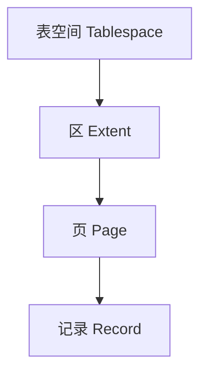

## 4.1 页内结构

一个数据页可抽象为：

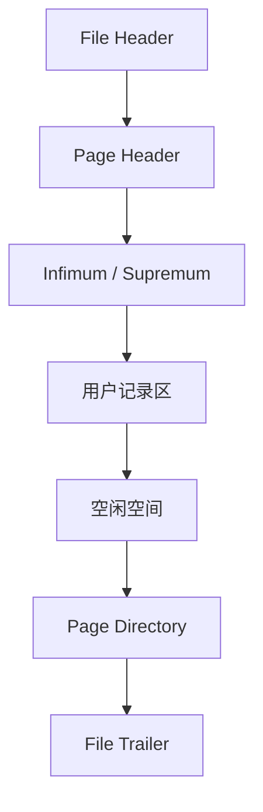

页目录保存槽信息，可以先二分定位到记录分组，再在组内顺序查找。

## 4.2 行格式

常见行格式包括 `COMPACT`、`DYNAMIC` 等。行记录通常包含：

- 变长字段长度信息。
- NULL 位图。
- 记录头信息。
- 隐藏系统字段。
- 用户字段。

InnoDB 可能维护以下隐藏字段：

- 事务 ID。
- 回滚指针。
- 在缺少合适主键时生成的隐藏行 ID。

## 4.3 页分裂

当目标页没有足够空间容纳新记录时，B+ 树可能执行页分裂：


随机主键会使写入散落到不同页，增加页分裂、缓存抖动和随机 I/O。

---

# 5. B+ 树索引原理

## 5.1 为什么使用 B+ 树

数据库索引需要适应外存访问。评价重点不是单次 CPU 比较次数，而是磁盘页访问次数。

B+ 树的优势：

1. 每个内部节点可以容纳大量分支，树高低。
2. 非叶子节点只保存键和子页指针，分支因子大。
3. 叶子节点按键有序并形成链表，适合范围扫描。
4. 查询路径稳定，从根节点到叶子节点。

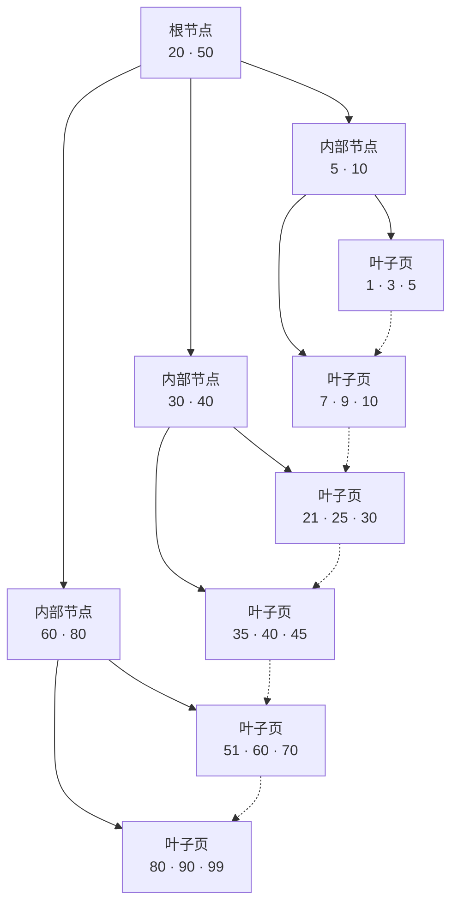

虚线表示叶子页之间的顺序链接；范围查询定位起点后，可以沿叶子页继续扫描。

## 5.2 为什么不用红黑树

红黑树每个节点通常只有两个子节点。即使树高是对数级，面对海量记录时高度仍明显高于 B+ 树，会产生更多随机页访问。

## 5.3 为什么不用 Hash 作为通用索引

Hash 索引适合等值查询，但不适合：

- 范围查询。
- 前缀匹配。
- 按索引顺序排序。
- 最左前缀组合查询。

因此 Hash 更适合作为特定场景的辅助结构，而不是通用磁盘索引。

## 5.4 B+ 树与 LSM Tree

B+ 树倾向于原地维护有序页，适合点查、范围查询和需要稳定读取延迟的场景。LSM Tree
则先把写入变成内存和顺序 I/O，再异步整理磁盘文件：

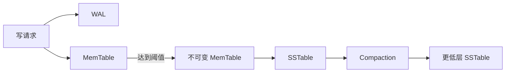

读取时可能需要查询内存表和多个 SSTable，因此通常配合索引、缓存和 Bloom Filter
减少无效磁盘访问。Compaction 会合并文件并清理旧版本，同时带来额外 I/O。

| 维度 | B+ 树 | LSM Tree |
|---|---|---|
| 写入路径 | 修改有序页，可能页分裂 | WAL 加内存写，后台顺序落盘 |
| 点查 | 路径稳定 | 可能查多个层级，依赖过滤器与缓存 |
| 范围扫描 | 天然有序 | 需要归并多个有序文件 |
| 后台工作 | 刷脏、页维护 | Flush、Compaction |
| 典型代价 | 随机写、页分裂 | 读放大、写放大、空间放大 |

LSM Tree 不是“写入永远更快”：当 Compaction 追不上写入时，延迟、空间和写放大都会
上升。选择存储引擎时要结合读写比例、范围扫描、数据保留周期和尾延迟要求。

## 5.5 行存、列存与工作负载

行式存储把一行的多个字段放得较近，读取或修改完整记录更自然；列式存储把同一列的
值放得较近，适合只读取少量列的大规模扫描，并更容易压缩和向量化执行。

| 工作负载 | 典型特征 | 常见存储选择 |
|---|---|---|
| OLTP | 短事务、点查、小范围更新、高并发 | 行存、B+ 树索引 |
| OLAP | 大范围扫描、聚合、少量列、批处理 | 列存、分区、向量化执行 |
| HTAP | 同时服务事务与分析 | 行列副本、增量同步或混合引擎 |

“列存压缩率高”不代表它适合频繁更新单行；“行存点查快”也不代表它适合扫描几十亿行
做聚合。数据布局必须和访问模式一起判断。

---

# 6. 聚簇索引、二级索引与回表

## 6.1 聚簇索引

InnoDB 的聚簇索引叶子节点保存完整行数据。通常选择顺序为：

1. 显式主键。
2. 第一个非空唯一索引。
3. 内部生成的隐藏行 ID。

## 6.2 二级索引

二级索引叶子节点通常保存：

```text
二级索引列 + 主键值
```

查询过程：


第二次访问聚簇索引的过程称为回表。

## 6.3 覆盖索引

如果查询所需列全部能从二级索引中获得，就不需要回表。

```sql
CREATE INDEX idx_user_time_amount
ON orders(user_id, created_at, amount);

SELECT created_at, amount
FROM orders
WHERE user_id = 1001
ORDER BY created_at DESC
LIMIT 20;
```

若执行计划显示 `Using index`，通常表示使用了覆盖索引。

## 6.4 主键长度的放大效应

假设一张表有 5 个二级索引：

```text
主键增加 8 字节
→ 每条二级索引记录都增加约 8 字节
→ 全部二级索引共同放大空间占用
→ 单页可容纳记录减少
→ B+ 树可能变高
→ 缓存命中率下降
```

---

# 7. 联合索引与最左前缀

假设存在联合索引：

```sql
INDEX idx_abc(a, b, c)
```

其排序方式不是分别对三列独立排序，而是：

```text
先按 a 排序；
a 相同，再按 b 排序；
a、b 都相同，再按 c 排序。
```

## 7.1 可以有效利用索引前缀的条件

```sql
WHERE a = 1
WHERE a = 1 AND b = 2
WHERE a = 1 AND b = 2 AND c = 3
WHERE a = 1 AND b BETWEEN 2 AND 9
```

## 7.2 无法直接定位最左边界的条件

```sql
WHERE b = 2
WHERE c = 3
WHERE b = 2 AND c = 3
```

原因是索引整体首先按 `a` 排序，缺少 `a` 时，`b` 的值散布在多个 `a` 分组中。

## 7.3 范围条件后的列

```sql
WHERE a = 1 AND b > 10 AND c = 3
```

通常可以使用 `a` 和 `b` 确定扫描范围，但 `c` 难以继续缩小 B+ 树的连续扫描区间。

更准确的结论是：

- `c` 往往不能继续用于构造索引边界。
- `c` 仍可能由 Index Condition Pushdown 在存储引擎层过滤。
- `c` 仍可能作为覆盖列避免回表。

## 7.4 索引列顺序

联合索引设计需要同时考虑：

- 查询过滤条件。
- 等值条件与范围条件。
- 字段选择性。
- 排序与分组。
- 覆盖查询。
- 写入成本。

不能机械使用“选择性最高的列必须放最前”。如果某列是高频等值前缀，或者需要支持排序，它可能更适合放在前部。

## 7.5 ORDER BY 利用索引

```sql
INDEX idx_user_time(user_id, created_at)

SELECT *
FROM orders
WHERE user_id = 1001
ORDER BY created_at DESC;
```

在固定 `user_id` 后，`created_at` 在索引中保持有序，优化器可能直接按索引顺序扫描，避免额外排序。

---

# 8. 索引失效与索引设计

“索引失效”不是一个严格的单一状态。更准确的说法是：优化器认为某个索引无法降低成本，或者只能使用其中一部分能力。

## 8.1 对索引列做函数或表达式

```sql
-- 不利于普通索引定位
WHERE DATE(created_at) = '2026-07-23'

-- 改写为范围
WHERE created_at >= '2026-07-23 00:00:00'
  AND created_at <  '2026-07-24 00:00:00'
```

也可以根据数据库能力建立函数索引或生成列索引。

## 8.2 隐式类型转换

```sql
phone VARCHAR(20)

-- 传入数值可能触发类型转换
WHERE phone = 13800138000
```

字段类型与参数类型应保持一致。

## 8.3 前导模糊匹配

```sql
LIKE '%abc'
```

普通 B+ 树难以确定起始位置。以下写法可使用前缀索引：

```sql
LIKE 'abc%'
```

全文检索需求应考虑倒排索引，而不是依赖前导模糊查询。

## 8.4 低选择性字段

例如性别、布尔状态。低选择性索引并非绝对无用：

- 若某个值占比极低，仍可能有效。
- 与其他字段组成联合索引可能有效。
- 覆盖索引仍可能降低回表成本。

## 8.5 返回比例过高

即使存在索引，若查询需要返回表中大部分数据，优化器可能选择全表扫描，因为大量回表的随机访问成本可能高于顺序扫描。

## 8.6 过多索引的代价

每个索引都会增加：

- 插入、更新、删除成本。
- 占用空间。
- Buffer Pool 压力。
- 统计信息维护成本。
- 优化器选择复杂度。

索引设计的目标不是“尽可能多”，而是为关键访问路径建立最小而充分的索引集合。

---

# 9. 事务与 ACID

事务是一组不可分割的数据库操作。

```sql
START TRANSACTION;

UPDATE accounts
SET balance = balance - 100
WHERE id = 1;

UPDATE accounts
SET balance = balance + 100
WHERE id = 2;

COMMIT;
```

## 9.1 原子性 Atomicity

事务中的操作要么全部成功，要么全部回滚。主要依赖 undo 信息和事务状态管理。

## 9.2 一致性 Consistency

事务前后数据满足业务约束和完整性约束。一致性是事务机制、约束设计和应用逻辑共同实现的结果。

## 9.3 隔离性 Isolation

并发事务之间应表现为某种受控的可见关系，主要由 MVCC 和锁实现。

## 9.4 持久性 Durability

事务提交后，即使发生故障，修改也应能够恢复。主要依赖 redo 日志、刷盘策略和恢复流程。

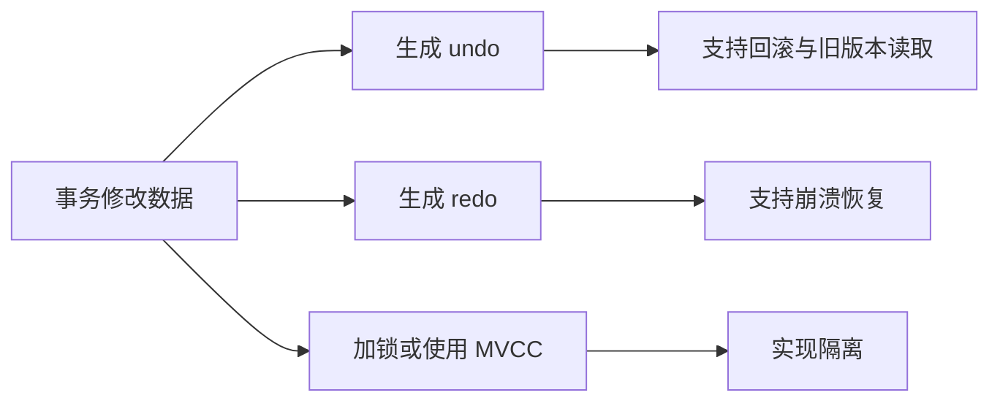

## 9.5 事务边界

事务应尽量短。以下做法会放大风险：

- 在事务中调用远程服务。
- 在事务中等待用户输入。
- 一次更新大量记录。
- 长时间持有热点行锁。
- 事务开启后执行无关计算。

长事务会导致：

- 锁持有时间增加。
- undo 版本链增长。
- 清理延迟。
- 主从复制压力增加。
- 故障恢复时间变长。

---

# 10. 隔离级别与并发现象

## 10.1 脏读

事务 A 读取到事务 B 尚未提交的数据，随后事务 B 回滚。

## 10.2 不可重复读

同一事务内，两次读取同一行得到不同结果，原因通常是其他事务提交了更新。

## 10.3 幻读

同一事务内，以相同条件执行范围查询，结果集合中的行数发生变化。

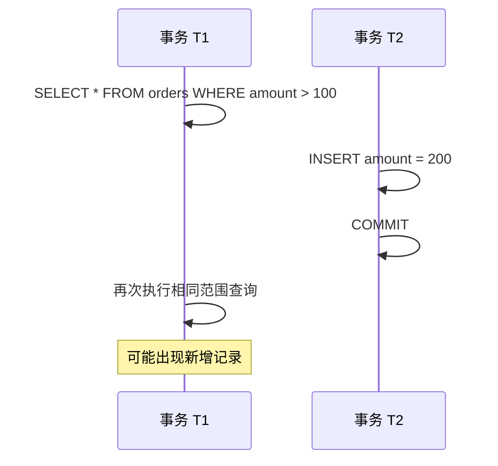

## 10.4 四种隔离级别

| 隔离级别 | 脏读 | 不可重复读 | 幻读 | 并发能力 |
|---|---:|---:|---:|---:|
| Read Uncommitted | 可能 | 可能 | 可能 | 高 |
| Read Committed | 避免 | 可能 | 可能 | 较高 |
| Repeatable Read | 避免 | 避免 | 需结合具体读类型分析 | 较高 |
| Serializable | 避免 | 避免 | 避免 | 低 |

## 10.5 快照读与当前读

快照读：

```sql
SELECT * FROM orders WHERE id = 1;
```

普通一致性读取通常通过 MVCC 读取可见版本。

当前读：

```sql
SELECT * FROM orders WHERE id = 1 FOR UPDATE;
UPDATE orders SET amount = 100 WHERE id = 1;
DELETE FROM orders WHERE id = 1;
```

当前读需要读取较新的可锁定版本，并通过锁保护后续修改。

不能笼统地说“RR 完全依靠 MVCC 解决幻读”。对于当前读和范围修改，还需要记录锁、间隙锁与 Next-Key Lock。

## 10.6 丢失更新

丢失更新常出现在“先读到应用，再根据旧值写回”的流程中：

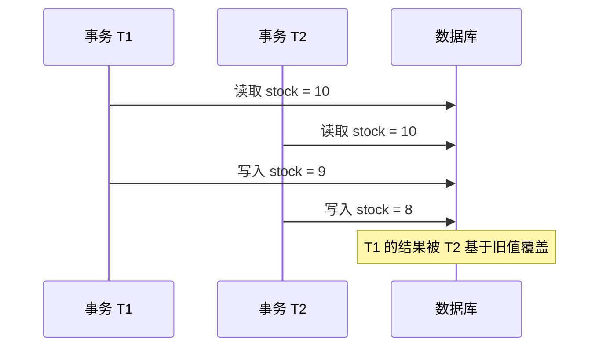

隔离级别不能自动理解应用中的“这个新值是由哪个旧值计算出来的”。常见处理方式：

1. 尽量改成数据库内的原子表达式：

   ```sql
   UPDATE inventory
   SET stock = stock - 1
   WHERE sku_id = ?
     AND stock > 0;
   ```

2. 使用版本号做 Compare-And-Swap，并检查影响行数；
3. 在读取时使用 `SELECT ... FOR UPDATE`，让读和后续写处于同一短事务；
4. 对不可交换的业务操作增加唯一键、状态机或幂等记录。

## 10.7 写偏差

写偏差发生在两个事务读取同一组条件，却分别修改不同的行，因此没有直接的写写冲突。
例如规则要求“至少一名值班人员在线”：

```text
T1 看到 Alice、Bob 都在线，令 Alice 离线
T2 也看到 Alice、Bob 都在线，令 Bob 离线
两个事务修改不同记录，都能提交
最终没有任何人在线，跨行约束被破坏
```

单纯给各自修改的行加锁不足以保护这个集合约束。可以根据数据模型选择：

- 把约束收敛到一条可加锁的汇总记录；
- 锁定参与判断的完整记录集合，并确保查询走可预测的索引范围；
- 使用数据库能够表达的唯一约束、检查约束或条件写入；
- 提高隔离强度，并对序列化失败或死锁进行有限、幂等的重试。

## 10.8 锁定读取、NOWAIT 与 SKIP LOCKED

普通 `FOR UPDATE` 在锁冲突时等待。支持相应语法时，还可以明确等待策略：

```sql
-- 无法立即获得锁就报错，适合快速失败
SELECT *
FROM inventory
WHERE sku_id = ?
FOR UPDATE NOWAIT;

-- 跳过已被锁定的任务，适合多个消费者领取队列任务
SELECT id
FROM jobs
WHERE status = 'ready'
ORDER BY id
LIMIT 10
FOR UPDATE SKIP LOCKED;
```

`SKIP LOCKED` 返回的是可领取记录，不是完整一致的查询结果，不应拿它做余额、库存总量
或审计统计。无论选择等待、快速失败还是跳过，都必须设置事务超时并设计重试边界。

---

# 11. MVCC 与 Read View

MVCC 的目标是在很多读写场景下减少互斥等待，让读取者看到符合隔离规则的历史版本。

## 11.1 版本链

当记录被更新时，旧值相关信息进入 undo，当前记录保存指向历史版本的回滚指针。

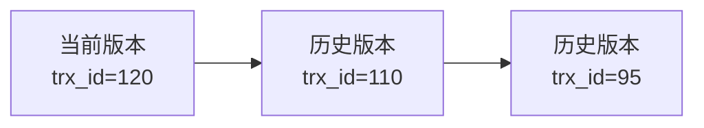

读取时，如果当前版本不可见，就沿版本链查找更旧版本。

## 11.2 Read View

可以将 Read View 抽象为以下信息：

- 当前活跃事务 ID 集合。
- 活跃事务中的最小 ID。
- 创建视图时即将分配的下一个事务 ID。
- 当前事务自身 ID。

简化可见性判断：

1. 版本由当前事务生成，通常可见。
2. 版本事务 ID 小于最小活跃事务 ID，通常可见。
3. 版本事务 ID 大于等于视图上界，通常不可见。
4. 版本事务 ID 位于区间内时，检查其是否仍在活跃事务集合中。

## 11.3 RC 与 RR 的差异

- RC：通常每次一致性读生成新的 Read View。
- RR：通常事务第一次一致性读生成 Read View，后续复用。

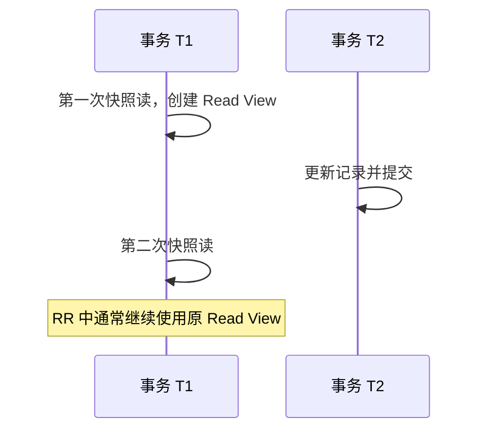

## 11.4 MVCC 的边界

MVCC 不能解决所有并发问题：

- 多个事务同时修改同一行仍需要锁。
- 当前读需要锁。
- 唯一约束冲突需要等待或报错。
- 写偏差等业务一致性问题仍需额外约束。

---

# 12. 锁机制

## 12.1 共享锁与排他锁

- 共享锁 S：允许多个事务并发读取受锁记录。
- 排他锁 X：用于修改，和其他 S/X 锁冲突。

## 12.2 记录锁

锁定索引中的具体记录。

```sql
SELECT *
FROM orders
WHERE id = 100
FOR UPDATE;
```

若通过唯一索引精确定位，通常主要锁定对应索引记录。

## 12.3 间隙锁

锁定索引记录之间的区间，不锁定现有记录本身，主要用于阻止其他事务在区间内插入。

## 12.4 Next-Key Lock

Next-Key Lock 可视为：

```text
记录锁 + 前方间隙锁
```

例如索引中有值 `10、20、30`，对 `20` 的 Next-Key Lock 可以抽象为锁定 `(10, 20]`。

```mermaid
flowchart LR
    A[10] --> B[(10,20] 被锁定]
    B --> C[20]
    C --> D[(20,30]]
    D --> E[30]
```

实际加锁范围会受到：

- 隔离级别。
- 唯一索引或普通索引。
- 等值或范围条件。
- 查询是否命中记录。
- 优化器选择的访问路径。

影响，因此不能只根据 SQL 表面条件武断判断锁范围。

## 12.5 意向锁

意向锁是表级锁，用来表达事务准备在表内某些行上持有共享锁或排他锁。

- IS：意向共享锁。
- IX：意向排他锁。

它们用于快速判断表级锁与行级锁是否冲突，避免逐行检查。

## 12.6 元数据锁 MDL

执行查询时会持有元数据锁，防止表结构被并发修改。长事务可能导致 DDL 长时间等待。

典型链路：

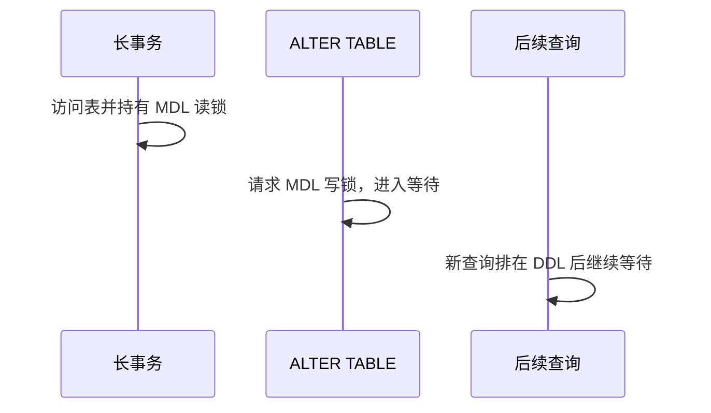

这会形成明显的请求堆积。

## 12.7 乐观锁与悲观锁

悲观锁：

```sql
SELECT * FROM inventory
WHERE sku_id = 1
FOR UPDATE;
```

乐观锁：

```sql
UPDATE inventory
SET stock = stock - 1,
    version = version + 1
WHERE sku_id = 1
  AND version = 8
  AND stock > 0;
```

若受影响行数为 0，说明版本冲突或库存不足。

---

# 13. 死锁分析与治理

## 13.1 死锁示例

事务 T1：

```sql
UPDATE accounts SET balance = balance - 10 WHERE id = 1;
UPDATE accounts SET balance = balance + 10 WHERE id = 2;
```

事务 T2：

```sql
UPDATE accounts SET balance = balance - 20 WHERE id = 2;
UPDATE accounts SET balance = balance + 20 WHERE id = 1;
```


数据库检测到循环等待后，会回滚其中一个事务。

## 13.2 四个必要条件

死锁通常包含：

1. 互斥。
2. 持有并等待。
3. 不可抢占。
4. 循环等待。

## 13.3 排查方法

```sql
SHOW ENGINE INNODB STATUS;
```

还应结合：

- `performance_schema` 锁等待表。
- 事务开始时间。
- 当前执行 SQL。
- 访问索引。
- 受影响行数。
- 应用调用链。

## 13.4 治理策略

- 统一资源访问顺序。
- 缩短事务。
- 使用正确索引，减少扫描和锁定范围。
- 将批量操作拆分为小批次。
- 避免在事务中访问远程服务。
- 为死锁失败设置有限次数重试。
- 重试必须建立在幂等基础上。

注意：死锁不一定意味着系统设计完全错误。在高并发事务系统中，数据库能够检测并打破少量死锁是正常机制，关键是控制频率和影响范围。

---

# 14. redo、undo、binlog 与提交过程

## 14.1 三类日志

| 日志 | 所属层次 | 主要作用 |
|---|---|---|
| redo log | InnoDB | 崩溃恢复、WAL |
| undo log | InnoDB | 回滚、MVCC |
| binlog | Server 层 | 复制、审计、时间点恢复 |

## 14.2 WAL

WAL：Write-Ahead Logging，先写日志，再异步写数据页。


日志通常是顺序写，而随机修改的数据页可以延后批量刷盘，从而提高吞吐。

## 14.3 undo 的作用

- 事务回滚。
- 为 MVCC 提供历史版本。

undo 并不等于完整保存每次修改前的整行副本，其内部采用能重建旧版本的记录形式。

## 14.4 binlog 格式

- Statement：记录 SQL 语句。
- Row：记录行变更。
- Mixed：混合模式。

Row 格式通常更利于复制一致性和变更订阅，但日志量可能更大。

## 14.5 两阶段提交

redo 和 binlog 分属不同层次，需要协调状态。

简化过程：

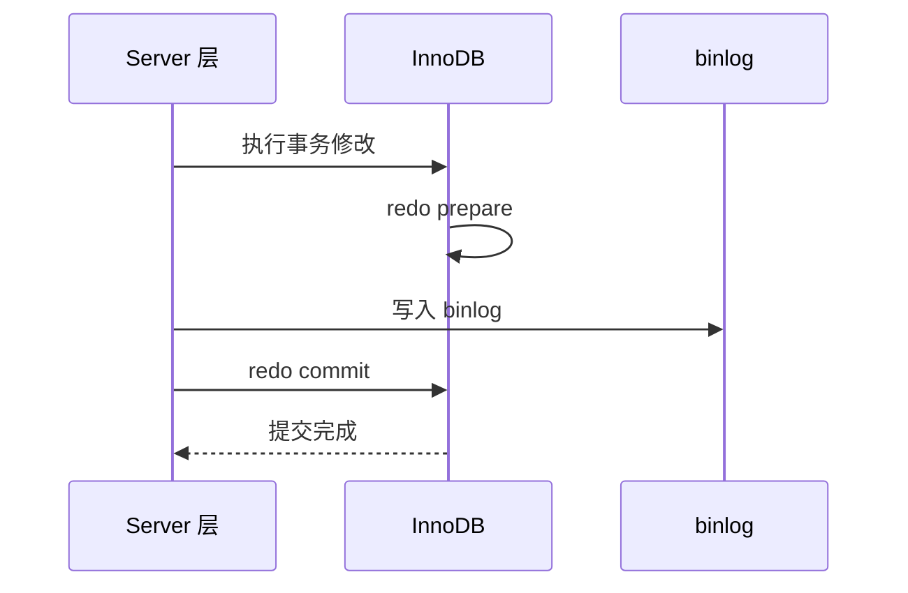

如果缺少协调，可能出现：

- redo 已提交但 binlog 缺失。
- binlog 已存在但 redo 未提交。

这会导致主库恢复状态与复制状态不一致。

## 14.6 一条 UPDATE 的简化链路

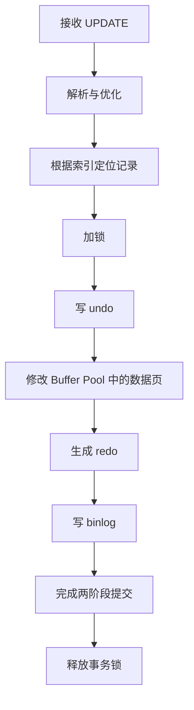

## 14.7 checkpoint 与脏页刷盘

checkpoint 用于推进可恢复边界，并控制 redo 空间循环使用。

脏页刷盘常见触发因素：

- 后台刷脏。
- redo 空间压力。
- Buffer Pool 淘汰。
- 正常关闭。
- 检查点推进。

## 14.8 doublewrite

页写入可能发生部分写，导致一个数据页只有部分内容落盘。doublewrite 通过先写入连续缓冲区域，再写入最终位置，为页损坏恢复提供副本。

## 14.9 刷盘策略与组提交

事务返回成功时究竟持久化到了哪一层，取决于数据库和操作系统的刷盘策略。MySQL 中
经常一起检查：

- `innodb_flush_log_at_trx_commit`：控制 InnoDB redo 在事务提交时写入和刷盘的策略；
- `sync_binlog`：控制 binlog 多久同步到持久化存储；
- 存储设备是否正确兑现 `fsync`、缓存刷新和写入顺序语义。

常见的强持久配置是 `innodb_flush_log_at_trx_commit = 1` 与 `sync_binlog = 1`。
降低刷盘频率可以减少同步 I/O，但进程或机器故障时可能扩大数据丢失窗口。不能只看变量
名称判断风险，还要结合虚拟化层、磁盘写缓存、文件系统和复制策略验证。

组提交会把多个并发事务的一部分日志刷盘工作合并，分摊昂贵的同步 I/O：

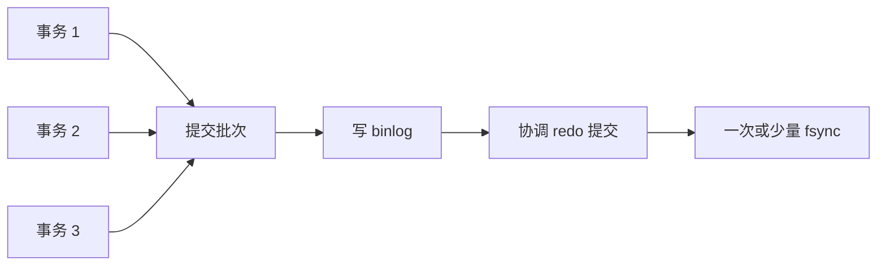

组提交提高吞吐，但不意味着所有事务共用一个原子结果；每个事务仍有自己的提交状态。
分析提交延迟时，应区分日志生成、等待批次、写系统调用和真正的设备同步耗时。

## 14.10 备份、PITR 与恢复演练

崩溃恢复、主从复制和备份解决的是不同问题：

| 机制 | 主要解决的问题 | 不能替代的能力 |
|---|---|---|
| redo 崩溃恢复 | 实例异常退出后恢复已提交事务 | 无法恢复被误删且日志已覆盖的数据 |
| 主从复制 | 高可用和读取扩展 | 错误删除也可能迅速复制到所有节点 |
| 备份 | 保存独立历史副本 | 单独一份旧备份无法恢复到任意时间点 |

逻辑备份保存可重放的 SQL 或逻辑记录，迁移和局部恢复方便，但大数据量恢复通常较慢。
物理备份复制数据文件和相关元数据，吞吐高、恢复快，但与引擎和版本关系更紧密。
全量备份保存一个完整基线，增量备份只保存之后的变化。

时间点恢复（PITR）的基本链路是：

```mermaid
flowchart LR
    A[恢复完整备份] --> B[定位备份对应的 binlog 或 GTID]
    B --> C[按顺序重放后续日志]
    C --> D[在目标时间或错误事件前停止]
    D --> E[校验数据并切换服务]
```

一份可用的备份策略还必须回答：

- 备份是否来自一致性快照，是否包含表结构、账号和必要配置；
- binlog 保留时间是否覆盖最长发现窗口；
- 备份是否加密、异地保存并限制访问；
- 恢复到隔离环境需要多久，是否满足 RPO 和 RTO；
- 是否实际执行过恢复、校验和应用启动，而不只是看到“备份任务成功”。

只有恢复演练成功的备份，才是经过验证的恢复能力。

---

# 15. Buffer Pool 与数据页

## 15.1 为什么需要 Buffer Pool

磁盘访问远慢于内存。Buffer Pool 缓存：

- 数据页。
- 索引页。
- undo 页。
- 自适应哈希相关结构。
- 其他内部页。

```mermaid
flowchart LR
    A[SQL 读取记录] --> B{Buffer Pool 中存在目标页?}
    B -- 是 --> C[直接读取内存页]
    B -- 否 --> D[从磁盘加载页]
    D --> E[放入 Buffer Pool]
    E --> C
```

## 15.2 脏页

内存页被修改后，与磁盘页不一致，称为脏页。事务提交并不要求所有数据页立即刷盘，持久性主要由 redo 保证。

## 15.3 LRU 改进

简单 LRU 容易被全表扫描污染。InnoDB 通常使用改进 LRU，将链表划分为新生区和旧生区，降低一次性大扫描对热点页的挤出。

```mermaid
flowchart LR
    A[新读入页] --> B[Old 区]
    B -->|持续访问| C[Young 区]
    C --> D[长期热点页]
    B -->|未再次访问| E[优先淘汰]
```

## 15.4 命中率不是唯一指标

Buffer Pool 命中率高不代表系统一定健康，还要观察：

- 脏页比例。
- 刷脏速度。
- 页读取速率。
- 等待 I/O。
- 大查询造成的缓存抖动。
- redo 压力。
- 锁等待与 CPU 使用率。

---

# 16. SQL 执行链路与 EXPLAIN

## 16.1 查询执行链路

```mermaid
flowchart LR
    A[客户端] --> B[连接与权限检查]
    B --> C[词法/语法解析]
    C --> D[预处理]
    D --> E[优化器]
    E --> F[执行器]
    F --> G[存储引擎]
    G --> H[返回结果]
```

优化器主要决定：

- 访问哪张表先。
- 选择哪个索引。
- 使用何种 JOIN 算法。
- 是否排序或使用临时表。
- 估算每一步行数和成本。

## 16.2 查询改写与 JOIN 顺序

优化器接收到的是声明式 SQL。它可以在不改变语义的前提下做等价变换，例如：

- 常量折叠和不可能条件消除；
- 将过滤条件尽量下推到更早的扫描节点；
- 删除没有被上层使用的投影列；
- 把部分 `IN`、`EXISTS` 子查询转换为半连接；
- 重新安排可交换的 INNER JOIN 顺序。

条件下推越早，中间结果通常越小。但外连接、聚合、窗口函数、`NULL` 三值逻辑和有
副作用的表达式会限制改写，不能把所有 `WHERE` 条件机械地移入子查询或 `ON`。

三个表连接时，下面两棵执行树的中间结果可能相差很大：

```mermaid
flowchart TB
    A1[先连接大表 A 与 B] --> M1[巨大中间结果]
    M1 --> R1[再连接高选择性表 C]
    A2[先用 C 过滤 B] --> M2[较小中间结果]
    M2 --> R2[再连接 A]
```

优化器根据估算行数、索引、连接条件和排序需求选择顺序。INNER JOIN 在关系代数上
通常可以重排，LEFT JOIN 等外连接则不能随意交换，因为交换后保留哪一侧的语义会改变。

## 16.3 常见 JOIN 执行算法

### Index Nested Loop Join

外层每得到一行，就利用连接键查询内层索引：

```text
for each outer_row:
    probe inner_index by outer_row.join_key
```

它适合外层结果较小、内层连接键有高效索引的场景。若外层返回 `N` 行，就可能触发
约 `N` 次内层索引探测；外层估算错误或随机回表很多时，代价会迅速放大。Batched Key
Access 会尝试批量组织部分内层查找以改善访问局部性，但是否采用取决于版本、配置和成本。

### Hash Join

通常选择一侧建立内存 Hash 表，再扫描另一侧进行探测：

```mermaid
flowchart LR
    A[构建侧输入] --> H[内存 Hash 表]
    B[探测侧输入] --> P[按连接键探测]
    H --> P
    P --> O[输出匹配行]
```

Hash Join 适合没有可用连接索引的大批量连接，尤其是等值连接。构建侧过大时会增加
内存压力，必要时还可能分区或落盘。MySQL 8.0 的执行计划应以实际 `EXPLAIN` 输出为准，
不能仅凭 SQL 写法断言一定使用 Hash Join。

### Sort-Merge Join

通用数据库系统还可能先按连接键排序两侧，再像归并排序一样线性推进。输入本身有序、
需要范围连接或后续仍需该顺序时可能有优势；否则排序成本可能很高。它是重要的通用
执行算法，但不应假设 MySQL 8.0 会把普通连接计划展示为 Sort-Merge Join。

选择算法时应同时比较：输入行数、索引探测次数、内存预算、是否需要排序、中间结果大小
以及数据是否倾斜，而不是只背诵理论复杂度。

## 16.4 基数估计、统计信息与成本

基数估计回答“每一步大约会产生多少行”。这个数字会影响 JOIN 顺序、访问索引、Hash
表构建侧以及是否排序。常见信息来源包括：

- 表和索引的行数、不同值数量等统计信息；
- 索引前缀的基数；
- 列值分布直方图；
- 条件选择率和算子成本模型。

估算容易在以下场景偏离真实值：

- 数据高度倾斜，例如绝大多数订单都是同一状态；
- 多列强相关，但优化器按相互独立近似；
- 统计信息陈旧或采样没有捕获少数热点值；
- 同一条参数化 SQL 的不同参数命中完全不同的数据规模；
- 多层过滤和 JOIN 的误差逐层放大。

执行计划中的 `cost` 是用于比较候选计划的估算单位，不等于毫秒。发现估算行数与实际
行数明显不一致时，可以按下面的顺序处理：

```text
确认真实参数与数据分布
→ 对比 EXPLAIN 和 EXPLAIN ANALYZE
→ 检查索引基数与统计信息更新时间
→ 必要时更新统计信息或为合适列建立直方图
→ 重新评估索引和 SQL 结构
→ 最后才考虑 Hint 或强制索引
```

Hint 能暂时固定选择，却可能在数据规模变化后成为负担。根因如果是统计信息、数据倾斜
或相关列建模，优先修复根因并建立执行计划回归监控。

## 16.5 EXPLAIN 重点字段

| 字段 | 含义 |
|---|---|
| `type` | 访问方式 |
| `possible_keys` | 可能使用的索引 |
| `key` | 实际选择的索引 |
| `key_len` | 使用的索引长度 |
| `ref` | 与索引比较的值 |
| `rows` | 预计扫描行数 |
| `filtered` | 过滤后保留比例估计 |
| `Extra` | 额外执行信息 |

## 16.6 常见访问类型

大致从更精确到更宽泛：

```text
const
→ eq_ref
→ ref
→ range
→ index
→ ALL
```

不能只看 `type` 判断好坏，还要结合：

- 实际扫描行数。
- 返回行数。
- 回表次数。
- 排序和临时表。
- 单次执行频率。
- 数据分布。

## 16.7 Extra

- `Using index`：覆盖索引。
- `Using index condition`：索引下推。
- `Using where`：Server 层仍需过滤。
- `Using filesort`：需要额外排序过程，不一定真的写文件。
- `Using temporary`：使用临时表完成中间结果。

## 16.8 EXPLAIN ANALYZE

`EXPLAIN` 主要给出估算，`EXPLAIN ANALYZE` 会实际执行并返回真实耗时、循环次数和行数。

重点比较：

```text
估算 rows 与实际 rows 是否严重偏离
```

严重偏离可能来自：

- 统计信息过旧。
- 数据倾斜。
- 列之间存在相关性。
- 参数分布差异。

## 16.9 慢查询分析顺序

```mermaid
flowchart TD
    A[确认接口耗时] --> B[确认数据库耗时占比]
    B --> C[获取完整 SQL 与参数]
    C --> D[查看慢日志与监控]
    D --> E[执行 EXPLAIN ANALYZE]
    E --> F{主要瓶颈}
    F -->|扫描过多| G[索引或查询改写]
    F -->|锁等待| H[事务与并发治理]
    F -->|排序/临时表| I[索引顺序或结果集缩减]
    F -->|I/O| J[缓存、数据量与存储分析]
    F -->|连接等待| K[连接池与数据库容量分析]
```

---

# 17. 常见 SQL 优化场景

## 17.1 深分页

传统分页：

```sql
SELECT *
FROM orders
ORDER BY id
LIMIT 1000000, 20;
```

数据库仍需要跳过前面大量记录。

游标分页：

```sql
SELECT *
FROM orders
WHERE id > 1000000
ORDER BY id
LIMIT 20;
```

优点：

- 扫描量稳定。
- 适合按有序唯一键向后翻页。

局限：

- 不适合任意跳页。
- 排序键需要稳定。
- 复合排序要使用复合游标。

## 17.2 延迟关联

```sql
SELECT o.*
FROM orders o
JOIN (
    SELECT id
    FROM orders
    ORDER BY id
    LIMIT 1000000, 20
) x ON x.id = o.id;
```

先在较窄索引上定位主键，再回表获取完整行，可能降低大偏移下的扫描成本。

## 17.3 COUNT

```sql
SELECT COUNT(*) FROM orders WHERE user_id = 1001;
```

优化方向：

- 为过滤条件建立合适索引。
- 避免对超大范围做高频精确统计。
- 对允许误差的场景使用预聚合或近似统计。
- 对固定维度维护汇总表。

不要简单将 `COUNT(*)` 改成 `COUNT(1)` 并期待本质提升，现代数据库通常能做相似优化。

## 17.4 批量插入

```sql
INSERT INTO logs(user_id, action)
VALUES
(1, 'login'),
(2, 'logout'),
(3, 'purchase');
```

相比逐条提交，批量插入可以减少：

- 网络往返。
- 事务提交次数。
- 日志刷盘次数。

批次不能无限增大，应考虑：

- 单事务日志量。
- 锁持有时间。
- 复制延迟。
- 失败重试成本。

## 17.5 大批量更新与删除

不建议一次处理数百万行：

```sql
DELETE FROM logs WHERE created_at < '2025-01-01';
```

更稳妥的方式是按主键或时间分批：

```sql
DELETE FROM logs
WHERE created_at < '2025-01-01'
ORDER BY id
LIMIT 5000;
```

重复执行并监控：

- 单批耗时。
- 锁等待。
- undo 与 redo 增长。
- 主从延迟。
- 磁盘空间。

## 17.6 N+1 查询

错误模式：

```text
查询 100 个用户
→ 对每个用户再查询一次订单
→ 共执行 101 次 SQL
```

可选方案：

- JOIN。
- 批量 `IN` 查询。
- 数据加载器模式。
- 预聚合。

## 17.7 热点行更新

```sql
UPDATE counters
SET value = value + 1
WHERE id = 1;
```

所有请求竞争同一行锁。可采用：

- 分片计数器。
- Redis 原子计数，异步落库。
- 消息队列聚合。
- 本地累加后批量写入。

## 17.8 避免 SELECT *

选择必要列可以：

- 降低网络传输。
- 提高覆盖索引概率。
- 减少内存复制。
- 降低表结构变更带来的耦合。

---

# 18. 主从复制、读写分离与高可用

## 18.1 复制链路

```mermaid
flowchart LR
    A[主库事务提交] --> B[写入 binlog]
    B --> C[从库 I/O 线程拉取]
    C --> D[写入 relay log]
    D --> E[从库 SQL/Applier 线程重放]
    E --> F[从库数据更新]
```

## 18.2 异步复制

主库提交不等待从库确认。

优点：

- 延迟低。
- 主库吞吐高。

风险：

- 主库故障时，尚未复制的数据可能丢失。

## 18.3 半同步复制

主库提交时等待至少一个从库确认收到日志，但通常不等于从库已经完成执行。

它缩小数据丢失窗口，但会增加提交延迟。

## 18.4 主从延迟原因

- 主库并发写入高，从库重放能力不足。
- 大事务。
- 缺少索引导致从库执行慢。
- 从库同时承担大量查询。
- 网络抖动。
- 磁盘 I/O 或 CPU 饱和。
- 单线程或并行复制配置不合理。

## 18.5 写后立即读

请求刚写入主库，随后读从库，可能读不到最新数据。

解决方式：

- 写后一定时间内读主库。
- 通过会话标记实现读主。
- 等待从库追平指定日志位置。
- 对强一致路径固定走主库。
- 对最终一致路径允许短暂旧值。

## 18.6 故障切换

```mermaid
flowchart TD
    A[检测主库不可用] --> B[确认故障与隔离旧主]
    B --> C[选择数据最新的从库]
    C --> D[提升为新主库]
    D --> E[其余从库重新指向新主]
    E --> F[更新服务路由]
    F --> G[验证读写与数据完整性]
```

关键指标：

- RPO：允许丢失多少数据。
- RTO：允许多长时间恢复服务。

## 18.7 脑裂

网络分区可能使旧主和新主同时接受写入。治理措施：

- Fencing Token。
- 外部仲裁。
- 强制隔离旧主。
- 单写入点租约。
- 切换前确认旧主不可写。

## 18.8 GTID 与自动定位

传统复制使用 binlog 文件名和偏移量描述位置。GTID 为每个已提交复制事务分配全局事务
标识，可以抽象为：

```text
source_uuid:transaction_sequence
```

实例维护自己已经执行的 GTID 集合。建立复制或故障切换时，可以比较集合并自动请求
缺少的事务，不必手工换算不同服务器上的 binlog 文件位置。已经执行过的 GTID 不应再次
执行，这也让重复传输和重新连接更容易处理。

GTID 简化的是事务定位，不会自动解决：

- 旧主仍接受写入造成的分叉；
- 管理员在从库直接写入形成的额外事务；
- 业务层重复请求；
- 逻辑数据损坏已经复制到全部节点。

切换前仍要比较 GTID 集合、确认候选节点已经应用目标事务，并隔离旧主。切换后还要
检查是否存在只出现在旧主或某个从库上的事务集合。

## 18.9 并行复制与延迟分解

复制延迟至少可以拆成两个阶段：

```mermaid
flowchart LR
    A[主库已提交] --> B[日志尚未传到从库]
    B --> C[日志已进入 relay log]
    C --> D[等待 Applier]
    D --> E[事务正在执行]
    E --> F[从库已应用]
```

网络接收很快但应用落后时，单纯扩容网络没有作用。并行复制可以让互不冲突的事务由
多个 worker 重放，但仍受以下因素限制：

- 一个超大事务本身难以拆开并行；
- 大量事务更新同一热点行或同一依赖链；
- 从库缺少索引、磁盘或 CPU 资源；
- 为保持提交顺序而产生的等待；
- DDL 阻塞后续事务；
- 从库上的分析查询与复制线程争夺资源。

不要只依赖一个“延迟秒数”。还应观察 relay log 积压、接收与执行 GTID 集合差异、
各 worker 状态、最后错误、大事务大小和从库资源利用率。

## 18.10 复制错误、数据校验与延迟副本

复制因重复键、缺失行或 DDL 不一致而停止时，直接跳过错误可能让数据分歧继续扩大。
应先保存现场并判断：

1. 出错事务原本应该执行，还是从库已存在等价结果；
2. 差异只涉及单行，还是已经扩散到关联表；
3. 修复后 GTID、约束和业务聚合是否一致；
4. 是否需要从可信备份重新构建从库。

数据校验可以分层进行：

- 比较库表结构、分区和索引定义；
- 按主键范围计算行数与校验摘要；
- 比较金额、库存、状态数量等业务聚合；
- 对差异块回查明细，而不是直接全表逐行跨网络比较。

延迟副本会故意晚于主库一段时间，可为误删除提供额外发现窗口。但它不是备份：磁盘
损坏、账号误操作或延迟时间之外的问题仍可能影响它，而且启用恢复前必须及时停止重放。

---

# 19. 分区、分库分表与分布式一致性

## 19.1 为什么拆分

单库单表可能受到：

- 存储容量。
- 单机 I/O。
- 写入吞吐。
- 索引规模。
- DDL 时间。
- 备份恢复时间。

限制。

## 19.2 分区表与分库分表的区别

分区表仍是一个数据库实例中的一张逻辑表，只是存储被划分为多个分区。分库分表则把
数据路由到多个独立物理表或数据库节点。

| 维度 | 分区表 | 分库分表 |
|---|---|---|
| SQL 入口 | 通常仍访问一张逻辑表 | 应用或中间件负责路由 |
| 事务 | 仍在单实例事务范围内 | 跨分片事务需要额外协调 |
| 计算资源 | 主要受单实例资源限制 | 可以横向扩展到多个节点 |
| 运维重点 | 分区裁剪、分区生命周期 | 路由、扩容、跨分片查询与一致性 |

时间序列表可以按日期做 RANGE 分区：

```sql
CREATE TABLE event_log (
    id         BIGINT NOT NULL,
    created_at DATETIME NOT NULL,
    payload    JSON NOT NULL,
    PRIMARY KEY (id, created_at)
)
PARTITION BY RANGE COLUMNS(created_at) (
    PARTITION p_before  VALUES LESS THAN ('2026-01-01'),
    PARTITION p2026q1 VALUES LESS THAN ('2026-04-01'),
    PARTITION p2026q2 VALUES LESS THAN ('2026-07-01'),
    PARTITION p2026q3 VALUES LESS THAN ('2026-10-01'),
    PARTITION p2026q4 VALUES LESS THAN ('2027-01-01'),
    PARTITION pmax    VALUES LESS THAN (MAXVALUE)
);
```

查询条件能约束分区键时，优化器可以执行分区裁剪，只扫描相关分区：

```sql
SELECT id, created_at, payload
FROM event_log
WHERE created_at >= '2026-04-01'
  AND created_at <  '2026-07-01';
```

分区不是索引的替代品。进入某个分区后，仍需要合适索引定位记录；缺少分区键的查询
可能扫描很多分区。分区过多还会增加元数据、优化和文件管理成本。

MySQL 8.0 还存在需要在建表前确认的限制，例如所有唯一键通常必须包含分区表达式涉及的
列，用户定义分区的 InnoDB 表不能使用外键。分区设计必须按实际版本验证，不能把其他
数据库的分区能力直接套用过来。

## 19.3 垂直拆分

按业务域拆分：

```mermaid
flowchart LR
    A[单体数据库] --> B[用户库]
    A --> C[订单库]
    A --> D[支付库]
    A --> E[库存库]
```

优点是边界清晰，局限是跨域事务和查询更复杂。

## 19.4 水平拆分

将同一张逻辑表按分片键分布到多个物理表或库。

```text
shard = hash(user_id) % N
```

## 19.5 分片键选择

分片键应考虑：

- 数据分布均匀。
- 高频查询能携带分片键。
- 事务尽量落在单分片。
- 避免热点。
- 扩容成本可控。

按用户 ID 分片适合用户中心型访问；按时间分片适合日志和归档，但最新分片可能成为写热点。

## 19.6 跨分片问题

分片后会增加：

- 跨分片 JOIN。
- 全局排序。
- 聚合统计。
- 唯一约束。
- 事务协调。
- 分页归并。
- 扩容迁移。

## 19.7 全局 ID

雪花算法一般将 64 位整数划分为：

```mermaid
flowchart LR
    A[符号位] --> B[时间戳]
    B --> C[节点 ID]
    C --> D[序列号]
```

需要处理：

- 时钟回拨。
- 节点 ID 冲突。
- 同毫秒序列耗尽。
- 时间戳溢出。

## 19.8 扩容与数据迁移

直接从 `N` 取模扩容到 `2N` 会导致大量数据重新映射。常见方案：

- 一致性哈希。
- 路由表。
- 虚拟分片。
- 预分片。
- 双写与增量迁移。

简化迁移流程：

```mermaid
flowchart TD
    A[创建新分片] --> B[全量复制历史数据]
    B --> C[开启增量同步]
    C --> D[校验数据]
    D --> E[灰度切读]
    E --> F[切写]
    F --> G[停止旧分片同步]
    G --> H[下线旧路由]
```

## 19.9 分布式事务模式

第 14.5 节中的两阶段提交用于协调同一个 MySQL 实例内的 redo 与 binlog。跨数据库、
消息系统或远程服务的事务是另一类问题，需要在一致性、可用性和复杂度之间选择。

### XA / 两阶段提交

协调者先要求每个参与者进入 `PREPARED`，全部成功后再统一提交：

```mermaid
sequenceDiagram
    participant C as 协调者
    participant A as 数据库 A
    participant B as 数据库 B

    C->>A: Prepare
    C->>B: Prepare
    A-->>C: Prepared
    B-->>C: Prepared
    C->>A: Commit
    C->>B: Commit
```

它能提供较强原子性，但准备后的参与者需要保留锁和资源。协调者故障、网络分区或参与者
长时间不可达时，事务可能阻塞，因此不适合长业务流程。

### TCC

- Try：检查并预留资源，例如冻结余额；
- Confirm：确认成功并消耗预留资源；
- Cancel：释放预留资源。

Confirm 和 Cancel 都可能被重复调用，必须幂等；还要处理空回滚、悬挂和部分参与者
超时。TCC 控制力强，但会侵入业务模型。

### Saga

Saga 把长流程拆成多个本地事务，每一步成功后触发下一步，失败时按相反方向执行补偿。
补偿是新的业务操作，不是数据库回滚：退款不能让已经发送的邮件消失，取消订单也可能
需要处理已经发出的物流请求。因此必须明确定义不可逆步骤、补偿失败重试和人工介入路径。

| 模式 | 一致性特征 | 主要代价 | 更适合的场景 |
|---|---|---|---|
| XA / 2PC | 较强原子性 | 锁持有、协调和阻塞风险 | 参与者少、事务短且都支持协议 |
| TCC | 业务资源预留 | 业务侵入和状态分支多 | 余额、库存等可冻结资源 |
| Saga | 最终一致 | 补偿设计复杂 | 跨服务长流程 |

## 19.10 Transactional Outbox 与可靠事件

“提交数据库后再发消息”存在进程崩溃窗口；“先发消息再提交数据库”又可能让消费者看到
尚未成立的业务状态。Outbox 把业务修改和待发送事件写进同一个本地事务：

```sql
START TRANSACTION;

UPDATE orders
SET status = 'paid'
WHERE id = ?
  AND status = 'pending';

INSERT INTO outbox_events(event_id, aggregate_id, event_type, payload)
VALUES (?, ?, 'OrderPaid', ?);

COMMIT;
```

随后由轮询发布器或 CDC 读取 Outbox 并发送消息：

```mermaid
flowchart LR
    A[本地事务] --> B[业务表]
    A --> C[Outbox 表]
    C --> D[轮询或 CDC]
    D --> E[消息系统]
    E --> F[幂等消费者]
```

发布器可能在“消息已经发送、Outbox 尚未标记完成”时崩溃，因此消息仍可能重复。
消费者应以 `event_id` 或业务唯一键去重，并把去重记录与业务修改放在同一个本地事务。
还要明确同一聚合根的事件顺序、重试退避、死信处理、积压监控和数据对账。

工程上通常追求“至少一次投递 + 幂等消费 + 可校验结果”，不要把某个组件宣称的
Exactly Once 直接推导成跨数据库、消息系统和外部副作用的端到端恰好一次。

---

# 20. Redis 数据结构与内部实现

## 20.1 String

用途：

- 缓存对象。
- 计数器。
- 限流。
- 分布式锁基础实现。

```text
SET key value EX 60 NX
INCR counter
```

Redis 字符串使用 SDS，而不是直接使用 C 字符串。SDS 保存长度和容量，支持二进制安全与高效追加。

## 20.2 Hash

适合保存对象字段：

```text
HSET user:1001 name Alice age 20
HGET user:1001 name
```

优点是可以局部更新字段，但大量小 Hash 与大 Hash 都需要关注内存布局和操作复杂度。

## 20.3 List

适合：

- 简单队列。
- 时间线。
- 有序消息列表。

但可靠消息场景通常更适合 Stream 或专用消息系统，因为 List 缺少完善的消费确认、消费组和消息追踪能力。

## 20.4 Set

用途：

- 去重。
- 标签集合。
- 共同好友。
- 随机抽样。

```text
SINTER user:1:follows user:2:follows
```

## 20.5 ZSet

每个成员带一个分值，可按分值排序。

用途：

- 排行榜。
- 延时任务。
- 带权重集合。

```text
ZADD leaderboard 9800 user:1
ZREVRANGE leaderboard 0 9 WITHSCORES
```

典型实现使用字典和跳表：

- 字典负责按成员快速查找分值。
- 跳表负责按分值有序遍历和范围查询。

```mermaid
flowchart LR
    A[成员查询] --> B[哈希表 O(1) 平均]
    C[排名/范围查询] --> D[跳表 O(log N)]
```

## 20.6 Bitmap

用于大量布尔状态：

- 签到。
- 在线状态。
- 功能开关。

注意 Bitmap 按最大偏移量占用空间，用户 ID 极度稀疏时可能浪费内存。

## 20.7 HyperLogLog

用于近似基数统计，例如独立访客数。优点是空间固定且很小，代价是存在误差，不能枚举原始元素。

## 20.8 Stream

Stream 支持：

- 消息 ID。
- 消费组。
- 待确认列表。
- 消息确认。
- 消费者故障转移。

适合轻量消息流，但仍需评估持久化、积压、重放和跨机房能力。

## 20.9 执行模型与渐进式 rehash

Redis 常被简化成“单线程数据库”，更准确的理解是：核心命令通常由事件循环按顺序执行，
但网络 I/O、持久化、释放内存和其他后台工作可以由额外线程或进程承担，具体能力取决于
版本和配置。

```mermaid
flowchart LR
    A[Socket 事件] --> B[读取与解析命令]
    B --> C[主执行路径]
    C --> D[修改内存数据]
    D --> E[生成响应]
    C -.-> F[持久化或后台任务]
```

顺序执行让单条命令天然避免与其他命令交错，但也意味着一个耗时很长的命令会拖慢同一
实例上的其他请求。复杂度为 $O(N)$ 的命令是否危险，取决于真实的 `N`、元素大小、返回
数据量和执行频率，不能只看渐进复杂度。

Redis 的字典扩容通常使用两张 Hash 表渐进式 rehash：

```text
ht[0]：旧表，尚有未迁移 bucket
ht[1]：新表，接收新位置
普通读写或定时任务顺带迁移少量 bucket
迁移完成后释放旧表
```

渐进迁移把一次大搬迁拆散，但扩容期间可能同时持有两张表，增加临时内存占用。
List、Hash、Set、ZSet 等对象也可能根据元素数量和大小使用紧凑编码或通用结构；结构
转换的具体阈值会随版本和配置变化，设计时应关注量级与操作复杂度，而不是死记常量。

## 20.10 原子性、事务、Lua 与 Pipeline

这些机制解决的问题不同：

| 机制 | 是否避免命令交错 | 主要目的 | 关键边界 |
|---|---:|---|---|
| 单条命令 | 是 | 原子读写一个操作 | 故障切换和持久性是另一层问题 |
| `MULTI/EXEC` | 执行阶段不被其他客户端命令插入 | 批量顺序执行 | 不提供传统数据库式自动回滚 |
| `WATCH` | 通过版本变化决定是否执行 | 乐观并发控制 | 冲突后由客户端重读并重试 |
| Lua 脚本 | 脚本执行期间不与其他命令交错 | 组合读、判断和写 | 长脚本会阻塞主执行路径 |
| Pipeline | 否 | 减少网络往返 | 不是事务，也不保证整批原子性 |

使用 `WATCH` 实现余额条件更新的抽象流程：

```text
WATCH balance_key
→ 读取并计算新值
→ MULTI
→ 写入新值
→ EXEC
→ 若监视期间 key 已变化，EXEC 失败并重新读取
```

如果逻辑能够完全在 Redis 内完成，Lua 往往比客户端“读—判断—写”更可靠。但脚本应
保持短小、执行时间有界，并避免扫描大集合。Pipeline 应限制单批命令数和返回数据量，
否则会把 RTT 优化变成客户端缓冲、服务端输出缓冲和网络突发压力。

在 Redis Cluster 中，多 Key 原子操作通常要求相关 Key 位于同一槽，可通过 Hash Tag
显式控制。跨槽事务不能依靠普通 `MULTI/EXEC` 自动协调。

## 20.11 分布式锁与 Fencing Token

单实例锁的基本获取方式是同时设置唯一所有者令牌和过期时间：

```text
SET lock:order:1001 random-owner-token NX PX 30000
```

释放时必须原子地“比较令牌再删除”，不能直接 `DEL`，否则持有者暂停超过租约后，可能
误删另一个客户端新获得的锁：

```lua
if redis.call('GET', KEYS[1]) == ARGV[1] then
    return redis.call('DEL', KEYS[1])
end
return 0
```

还要处理：

- 任务执行时间超过租约，需要受控续期或主动失败；
- 客户端长时间暂停后恢复，可能继续执行过期持有者的操作；
- 主从异步复制下，主节点写入锁后立即故障，新主可能没有这把锁；
- 解锁、续期超时的结果未知，不能盲目假设操作没有发生。

租约只能说明“某段时间内协调服务认为谁持有锁”，不能撤销已经开始执行的旧客户端。
对写存储、调用设备等需要严格排除旧持有者的操作，应使用单调递增的 Fencing Token：

```text
持有者 A 获得 token 41
持有者 A 暂停，租约过期
持有者 B 获得 token 42 并完成写入
持有者 A 恢复后携带 token 41
下游拒绝小于已见最大值 42 的请求
```

如果唯一约束、条件更新或单数据库事务已经能保证正确性，应优先使用这些更靠近数据的
机制。分布式锁适合协调，不能替代幂等、状态机和下游约束。

---

# 21. 缓存穿透、击穿、雪崩与热点问题

## 21.1 缓存穿透

请求的数据在缓存和数据库中都不存在，大量请求持续打到数据库。

解决方案：

- 缓存空值。
- 布隆过滤器。
- 参数校验。
- 限流。

```mermaid
flowchart LR
    A[请求 key] --> B{布隆过滤器判断可能存在?}
    B -- 否 --> C[直接返回不存在]
    B -- 是 --> D[查询缓存]
    D --> E{命中?}
    E -- 否 --> F[查询数据库]
```

布隆过滤器可能误判存在，但不会误判不存在。

## 21.2 缓存击穿

某个热点 Key 失效时，大量并发请求同时查询数据库。

解决方案：

- 互斥重建。
- 逻辑过期。
- 热点永不过期并由后台刷新。
- 请求合并。

```mermaid
flowchart TD
    A[热点 Key 未命中] --> B{是否获得重建锁?}
    B -- 是 --> C[查询数据库并重建缓存]
    B -- 否 --> D[短暂等待或返回旧值]
    C --> E[释放锁]
```

## 21.3 缓存雪崩

大量 Key 在相近时间失效，或缓存集群整体不可用。

解决方案：

- 过期时间加随机抖动。
- 多级缓存。
- 集群高可用。
- 限流与熔断。
- 预热。
- 核心数据降级。

## 21.4 Big Key

Big Key 可能造成：

- 单次请求阻塞时间长。
- 网络传输大。
- 删除阻塞。
- 主从复制压力。
- 集群迁移困难。

治理：

- 拆分 Key。
- 控制集合大小。
- 使用渐进式删除。
- 限制单次读取数量。
- 建立内存扫描与告警。

## 21.5 Hot Key

Hot Key 的问题是访问集中在单个节点或单个分片。

治理：

- 本地缓存。
- Key 复制。
- 热点拆分。
- 请求合并。
- 读写分离。
- 业务降级。

---

# 22. Redis 与 MySQL 一致性

## 22.1 Cache Aside

典型读取流程：

```mermaid
flowchart LR
    A[读取请求] --> B{缓存命中?}
    B -- 是 --> C[返回缓存]
    B -- 否 --> D[查询数据库]
    D --> E[写入缓存]
    E --> F[返回结果]
```

典型写入流程：

```text
更新数据库
→ 删除缓存
```

## 22.2 为什么通常删除缓存而不是直接更新缓存

直接更新缓存的问题：

- 缓存结构可能是多个表聚合结果。
- 更新代价高。
- 并发更新可能乱序覆盖。
- 某些数据更新后不会被读取，产生无效工作。

删除缓存让下一次读取基于数据库重建，逻辑通常更简单。

## 22.3 为什么一般先更新数据库，再删除缓存

若先删除缓存，再更新数据库：

```mermaid
sequenceDiagram
    participant W as 写请求
    participant R as 读请求
    participant C as 缓存
    participant DB as 数据库

    W->>C: 删除缓存
    R->>C: 缓存未命中
    R->>DB: 读取旧值
    R->>C: 写入旧值
    W->>DB: 更新新值
    Note over C,DB: 缓存旧值可能长期存在
```

先更新数据库，再删除缓存仍然存在极小窗口，但通常更容易控制。

## 22.4 删除缓存失败

可选治理方案：

- 重试队列。
- 事务消息。
- 订阅 binlog/CDC 后删除缓存。
- 定期校验。
- 缩短 TTL 作为最终兜底。

## 22.5 延迟双删

流程：

```text
更新数据库
→ 删除缓存
→ 等待一段时间
→ 再次删除缓存
```

它可以缩小部分并发窗口，但存在明显局限：

- 延迟时间难以准确确定。
- 进程崩溃会丢失第二次删除。
- 无法自然处理复杂依赖。
- 延迟会增加系统复杂度。

更稳健的方案通常是可靠消息或 CDC 驱动的缓存失效。

## 22.6 强一致与最终一致

不是所有数据都需要强一致：

- 账户余额、库存扣减：更强调强约束。
- 商品详情、用户画像：通常可接受短暂旧值。
- 排行榜、计数：可能允许异步聚合。

一致性设计应先明确业务容忍度，而不是追求所有链路零延迟同步。

---

# 23. Redis 持久化与高可用

## 23.1 RDB

RDB 在某个时点生成数据快照。

优点：

- 文件紧凑。
- 恢复速度快。
- 适合备份。

局限：

- 两次快照之间的数据可能丢失。
- 生成快照会产生额外 CPU、内存和 I/O 压力。

## 23.2 AOF

AOF 记录写命令，并按策略刷盘。

常见刷盘策略：

- 每条命令刷盘。
- 每秒刷盘。
- 由操作系统决定。

AOF 重写会将历史命令压缩为能够重建当前状态的最小命令集合。

## 23.3 混合持久化

AOF 重写文件前半部分使用快照格式，后半部分追加增量命令，兼顾恢复速度与数据完整性。

## 23.4 主从复制

```mermaid
flowchart LR
    A[主节点] --> B[复制积压缓冲区]
    B --> C[从节点 1]
    B --> D[从节点 2]
```

从节点可用于：

- 读扩展。
- 故障切换候选。
- 备份。

但复制是异步过程，仍可能存在延迟和数据丢失窗口。

## 23.5 Sentinel

Sentinel 提供：

- 监控。
- 主观下线判断。
- 客观下线协商。
- 自动故障转移。
- 服务发现。

Sentinel 不是数据分片方案。

## 23.6 Redis Cluster

Redis Cluster 将键空间划分为 16384 个槽。

```text
slot = CRC16(key) mod 16384
```

节点负责若干槽，扩容时迁移槽，而不是重新计算所有键的节点位置。

Hash Tag 可以让多个 Key 落入同一槽：

```text
order:{1001}:detail
order:{1001}:items
```

花括号中的内容用于槽计算。

## 23.7 过期删除与内存淘汰

过期键通常通过：

- 惰性删除。
- 定期抽样删除。

共同清理。

内存达到上限时，根据策略执行淘汰，例如：

- LRU 类。
- LFU 类。
- 随机淘汰。
- 按 TTL 淘汰。
- 禁止写入。

淘汰策略应结合数据访问模式选择。

## 23.8 内存碎片、后台释放与 fork 抖动

Redis 统计的逻辑数据量和进程 RSS 不一定相同。内存分配器碎片、已经释放但尚未归还
操作系统的页、复制缓冲区和客户端输出缓冲区，都可能让 RSS 明显高于数据集大小。

删除 Big Key 时，直接同步释放大量对象也可能阻塞主执行路径。可根据版本和场景采用
异步释放能力，但异步只把工作移到后台，不能消除 CPU 与内存回收成本。

生成 RDB 或执行 AOF 重写通常需要创建子进程。父子进程初始共享内存页，写入会触发
Copy-On-Write：

```text
数据集很大 + 后台保存期间写入频繁
→ 大量共享页被复制
→ RSS 突增
→ 内存压力、延迟甚至 OOM
```

容量规划应预留 fork 和 Copy-On-Write 峰值，并监控：

- `used_memory` 与进程 RSS 的差值；
- 内存碎片率；
- fork 耗时；
- RDB/AOF 后台任务状态；
- 客户端缓冲区、复制积压和 Key 大小分布。

---

# 24. 连接池、超时、重试与幂等

## 24.1 为什么需要连接池

建立数据库连接通常涉及：

- TCP 连接。
- TLS。
- 认证。
- 会话初始化。

每次请求都新建连接成本高，连接池复用长连接。

```mermaid
flowchart LR
    A[请求线程] --> B[连接池]
    B --> C[空闲连接]
    B --> D[正在使用的连接]
    D --> E[数据库]
    D -->|归还| C
```

## 24.2 连接池大小

连接数不是越多越好。过多连接会导致：

- 数据库线程调度开销。
- 内存占用增加。
- 锁竞争加剧。
- 上下文切换增加。
- 故障时请求洪峰放大。

连接池大小应结合：

- 数据库可承受并发。
- 查询平均耗时。
- 请求吞吐。
- 应用实例数量。
- 慢查询比例。

## 24.3 超时层次

常见超时：

- 获取连接超时。
- 建连超时。
- 查询超时。
- 事务超时。
- Socket 读写超时。
- 整体请求超时。

外层超时应大于内层超时，并保留清理与返回错误的时间预算。

## 24.4 重试风险

数据库操作超时不等于操作一定失败。可能出现：

```text
数据库已提交
→ 响应在网络中丢失
→ 客户端认为失败并重试
→ 发生重复写
```

因此写操作重试必须有幂等保障。

## 24.5 幂等设计

常见方案：

- 业务唯一键。
- 幂等 Token。
- 去重表。
- 状态机条件更新。
- 唯一索引。

例如支付请求：

```sql
INSERT INTO payment_requests(request_id, order_id, status)
VALUES (?, ?, 'INIT');
```

对 `request_id` 建立唯一索引，重复请求由数据库约束拦截。

## 24.6 RAII 管理事务

在 C++ 中可以使用 RAII 绑定事务生命周期：

```cpp
class Transaction {
public:
    explicit Transaction(Connection& conn) : conn_(conn), committed_(false) {
        conn_.begin();
    }

    void commit() {
        conn_.commit();
        committed_ = true;
    }

    ~Transaction() {
        if (!committed_) {
            try {
                conn_.rollback();
            } catch (...) {
                // 析构函数中不能抛出异常，可记录日志。
            }
        }
    }

private:
    Connection& conn_;
    bool committed_;
};
```

## 24.7 不要阻塞事件循环

同步数据库客户端会阻塞调用线程。基于事件循环的服务通常需要：

```mermaid
flowchart LR
    A[EventLoop] -->|提交数据库任务| B[数据库线程池]
    B --> C[同步执行 SQL]
    C -->|完成回调| A
```

否则一个慢查询可能阻塞同一事件循环上的全部连接。

---

# 25. MongoDB、Elasticsearch 与向量数据库

## 25.1 MongoDB

MongoDB 使用文档模型，适合：

- 半结构化数据。
- 字段变化频繁的对象。
- 聚合根整体读写。
- JSON 友好的数据访问。

设计时需要在嵌入和引用之间权衡：

- 嵌入：读取方便，但文档可能膨胀。
- 引用：结构清晰，但需要多次查询或聚合。

仍需理解：

- 索引。
- 副本集。
- 分片。
- 写关注。
- 读关注。
- 事务边界。

## 25.2 Elasticsearch

Elasticsearch 的核心是倒排索引：

```mermaid
flowchart LR
    A[文档 1: 数据库系统] --> C[分词]
    B[文档 2: 分布式数据库] --> C
    C --> D[数据库 -> 文档 1, 文档 2]
    C --> E[系统 -> 文档 1]
    C --> F[分布式 -> 文档 2]
```

适合：

- 全文检索。
- 多字段搜索。
- 聚合分析。
- 日志检索。

不适合作为所有业务事实的唯一存储。常见架构是关系数据库保存权威数据，Elasticsearch 保存可重建的搜索索引。

需要关注：

- 分片和副本。
- Refresh 与近实时。
- 深分页。
- Mapping。
- 分词器。
- 数据同步。

## 25.3 向量数据库

向量数据库用于近似相似度搜索：

```text
文本/图片/音频
→ Embedding 模型
→ 高维向量
→ ANN 索引
→ Top-K 相似结果
```

常见索引思想：

- HNSW：图搜索。
- IVF：聚类后局部搜索。
- PQ：向量压缩。

工程上还需要处理：

- 元数据过滤。
- 权限控制。
- 文档版本。
- 向量重建。
- 召回率与延迟。
- 向量数据和关系数据的一致性。

---

# 26. 综合场景分析

## 26.1 场景一：订单查询突然变慢

现象：

```sql
SELECT *
FROM orders
WHERE user_id = ?
ORDER BY created_at DESC
LIMIT 20;
```

分析流程：

```mermaid
flowchart TD
    A[获取慢 SQL 与参数] --> B[检查索引]
    B --> C[EXPLAIN ANALYZE]
    C --> D{是否使用 user_id, created_at 联合索引?}
    D -- 否 --> E[建立联合索引]
    D -- 是 --> F{扫描行数是否异常?}
    F -- 是 --> G[检查统计信息与数据倾斜]
    F -- 否 --> H{是否存在锁等待?}
    H -- 是 --> I[定位长事务和热点更新]
    H -- 否 --> J[检查连接池、I/O 与缓存]
```

推荐索引：

```sql
CREATE INDEX idx_user_created
ON orders(user_id, created_at DESC);
```

若只返回少量列，可进一步设计覆盖索引。

## 26.2 场景二：库存被扣成负数

错误写法：

```text
先 SELECT stock
应用判断 stock > 0
再 UPDATE stock = stock - 1
```

两个并发请求可能同时看到库存充足。

原子条件更新：

```sql
UPDATE inventory
SET stock = stock - 1
WHERE sku_id = ?
  AND stock > 0;
```

根据受影响行数判断是否成功。

## 26.3 场景三：缓存旧值长期存在

可能原因：

- 更新数据库后删除缓存失败。
- 并发读在删除窗口内回填旧值。
- 缓存没有 TTL。
- 消息重试链路失效。

治理组合：

```text
数据库事务提交
→ 写入可靠事件
→ CDC 或消息消费者删除缓存
→ 失败重试
→ TTL 最终兜底
→ 定期一致性校验
```

## 26.4 场景四：主从延迟导致用户看不到新订单

可将请求分为：

- 强一致读：写后查询订单、账户余额，走主库。
- 最终一致读：历史列表、统计报表，走从库。

也可在写入后为当前会话设置短期“读主”标记。

## 26.5 场景五：删除历史数据导致服务抖动

原因可能包括：

- 单事务删除过多。
- 大量 undo/redo。
- 长时间持锁。
- Buffer Pool 污染。
- 主从延迟。

治理：

```text
按主键小批删除
→ 每批提交
→ 控制执行速率
→ 观察复制延迟
→ 低峰执行
→ 必要时采用分区删除或归档表
```

## 26.6 场景六：排行榜读写压力过大

可使用 Redis ZSet：

```text
ZINCRBY leaderboard 10 user:1001
ZREVRANGE leaderboard 0 99 WITHSCORES
```

若需要持久权威数据：

```mermaid
flowchart LR
    A[行为事件] --> B[消息队列]
    B --> C[更新 Redis 排行榜]
    B --> D[异步写入数据库明细]
    D --> E[定期校准排行榜]
```

需要明确排行榜允许的延迟和纠偏方式。

---

# 27. 易错结论与修正

## 27.1 “建了索引就一定会使用”

错误。优化器依据成本选择访问路径。数据量小、返回比例高、统计信息偏差时都可能选择全表扫描。

## 27.2 “范围查询后的列完全失效”

不准确。后续列可能不能继续构造索引边界，但仍可参与索引下推、覆盖查询或排序判断。

## 27.3 “MVCC 不需要锁”

错误。MVCC 主要优化一致性读；写写冲突、当前读、唯一约束仍依赖锁。

## 27.4 “RR 下绝对不会有幻读”

不严谨。需要区分快照读和当前读，并结合查询条件、索引和锁范围分析。

## 27.5 “事务提交时数据页必须刷盘”

错误。通常只需按策略确保 redo 持久化，脏页可稍后刷盘。

## 27.6 “Redis 快，所以可以替代数据库”

错误。Redis 与关系数据库在数据模型、持久性、事务能力、查询方式和容量成本上不同，通常是协同关系。

## 27.7 “缓存和数据库可以做到完全零窗口一致”

对于普通双写链路，严格零窗口非常困难。需要根据业务选择强一致、最终一致或补偿机制。

## 27.8 “连接池越大，吞吐越高”

错误。超过数据库处理能力后，只会增加排队、内存和上下文切换。

## 27.9 “死锁只能通过加大锁等待时间解决”

错误。锁等待时间只影响等待多久，不能消除循环等待。应治理访问顺序、事务范围和索引。

## 27.10 “分库分表后性能一定更好”

错误。拆分会引入路由、跨分片查询、事务和迁移成本。应在单库优化和容量评估后再实施。

## 27.11 “Online DDL 全程不会阻塞业务”

错误。即使使用 `INSTANT` 或 `INPLACE`，准备或切换阶段仍可能获取排他 MDL；长事务、
资源竞争和复制延迟也会放大影响。必须预先确认实际算法并观察等待链路。

## 27.12 “有从库就不需要备份”

错误。误删除、错误 DDL 和逻辑损坏会被复制；主从也可能同时受权限泄漏或存储故障影响。
需要独立备份、binlog 保留和定期恢复演练。

## 27.13 “分区越多，查询越快”

错误。只有条件能够触发分区裁剪时，才可能减少扫描范围；分区内仍需要索引。过多分区
反而增加元数据、优化、文件管理和维护成本。

## 27.14 “Pipeline 等同于 Redis 事务”

错误。Pipeline 的目标是减少网络往返，命令仍可能和其他客户端命令交错；`MULTI/EXEC`
解决的是批量执行期间不被插入，但也不提供关系数据库式自动回滚。

## 27.15 “Redis 锁设置了过期时间就绝对安全”

错误。客户端暂停、续期失败、异步复制和故障切换都可能产生旧持有者。应使用唯一所有者
令牌原子解锁；下游需要严格排除旧请求时，还要验证单调递增的 Fencing Token。

## 27.16 “消息系统承诺 Exactly Once，业务就不会重复”

错误。数据库提交、消息投递、消费者写入和外部副作用跨越多个系统。工程上仍要使用
业务唯一键、Outbox、幂等消费、重试记录和结果对账建立端到端保证。

## 27.17 “Hash Join 一定比 Nested Loop 快”

错误。小外表配合高选择性内层索引时，Index Nested Loop 可能更合适；Hash Join 还会
受到构建侧大小、内存、倾斜和落盘影响。最终应比较真实执行计划和运行数据。

---

# 28. 学习检查清单

## 28.1 SQL 与表设计

- 能解释 `FROM/JOIN`、`WHERE`、聚合、窗口、排序和分页的逻辑阶段。
- 能为复杂条件正确添加括号，并使用左闭右开的时间范围。
- 能解释一对多 JOIN 为什么扩展结果行，以及 `ON` 与 `WHERE` 的语义差异。
- 能区分 `COUNT(*)`、`COUNT(column)`、`WHERE` 和 `HAVING`。
- 能正确使用子查询、`EXISTS`、`UNION ALL`、CTE 和窗口函数。
- 能说明 View、临时表、存储过程和触发器的作用域与维护边界。
- 能解释 `NULL`、三值逻辑与 `NOT IN` 的风险。
- 能在修改数据前核对目标集合，并检查实际影响行数。
- 能设计主键、唯一键、金额、时间和状态字段。
- 能区分候选键、主键、唯一约束、检查约束和外键职责。
- 能说明 `DATETIME`、`TIMESTAMP`、字符集、Collation 和 JSON 字段的边界。
- 能说明范式化和反范式化的权衡。
- 能评估 Online DDL 算法、MDL、回填和兼容性发布顺序。

## 28.2 索引

- 能画出 B+ 树结构并解释低树高原因。
- 能解释聚簇索引和二级索引。
- 能解释回表与覆盖索引。
- 能根据查询设计联合索引。
- 能分析范围条件、排序和索引下推。
- 能识别隐式转换、函数、前导模糊等问题。
- 能比较 B+ 树与 LSM Tree 的读写、空间和后台整理代价。
- 能根据 OLTP、OLAP 的访问模式解释行存与列存选择。

## 28.3 事务与锁

- 能解释 ACID 的实现机制。
- 能区分脏读、不可重复读和幻读。
- 能解释 RC 与 RR 的 Read View 差异。
- 能区分快照读和当前读。
- 能解释记录锁、间隙锁、Next-Key Lock、意向锁和 MDL。
- 能构造死锁并给出治理方案。
- 能识别丢失更新和写偏差，并选择原子更新、约束、锁或序列化策略。
- 能说明 `NOWAIT`、`SKIP LOCKED` 的适用范围和一致性边界。

## 28.4 日志与恢复

- 能区分 redo、undo、binlog。
- 能解释 WAL、checkpoint、doublewrite。
- 能说明两阶段提交的目的。
- 能描述一条 UPDATE 的完整执行过程。
- 能解释 redo 与 binlog 刷盘策略、组提交和持久性窗口。
- 能设计完整备份、增量日志、PITR 和恢复演练流程。

## 28.5 性能分析

- 能使用 `EXPLAIN` 和 `EXPLAIN ANALYZE`。
- 能比较 Index Nested Loop、Hash Join 和 Sort-Merge Join 的适用条件。
- 能从基数估计、统计信息、直方图和数据倾斜解释计划选择。
- 能分析扫描行数、回表、排序、临时表和锁等待。
- 能处理深分页、大批量删除、N+1、热点行等问题。
- 能结合连接池、I/O、CPU、日志和复制观察系统瓶颈。

## 28.6 高可用与分布式

- 能解释主从复制和主从延迟。
- 能使用 GTID 集合分析复制位置，并拆分接收延迟与应用延迟。
- 能设计写后读一致性策略。
- 能说明 RPO、RTO 和脑裂治理。
- 能区分分区表与分库分表，并判断分区裁剪是否生效。
- 能选择分片键并说明跨分片代价。
- 能比较自增 ID、UUID、雪花 ID 和号段模式。
- 能比较 XA、TCC、Saga 与 Outbox，并设计幂等消费和数据对账。

## 28.7 Redis

- 能说明常见数据结构和内部实现。
- 能解释事件循环、渐进式 rehash 和长命令阻塞。
- 能区分单命令原子性、`MULTI/EXEC`、`WATCH`、Lua 和 Pipeline。
- 能区分缓存穿透、击穿和雪崩。
- 能分析 Big Key 与 Hot Key。
- 能设计带唯一令牌、原子解锁和 Fencing Token 的锁协议。
- 能设计 Cache Aside 和可靠失效流程。
- 能说明 RDB、AOF、Sentinel 和 Cluster。
- 能分析内存碎片、fork、Copy-On-Write 和后台持久化抖动。

---

# 结语

数据库系统的核心不是记忆孤立定义，而是建立因果链：

```text
数据如何组织
→ 索引如何定位
→ 查询如何执行
→ 并发如何隔离
→ 修改如何恢复
→ 多节点如何复制
→ 缓存如何协同
→ 故障如何治理
```

遇到具体问题时，可以始终按以下顺序分析：

```mermaid
flowchart LR
    A[现象] --> B[访问路径]
    B --> C[数据规模与分布]
    C --> D[事务与锁]
    D --> E[日志与存储]
    E --> F[复制与缓存]
    F --> G[监控验证]
```

能够从 SQL 一直解释到底层页、锁、日志和分布式链路，才算真正建立了完整的数据库知识体系。
