# 大模型之火

# 1. MindMap

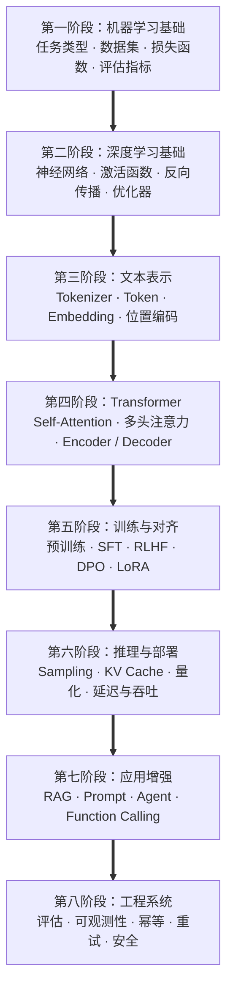


# 2. 机器学习基础

## 2.1 什么是机器学习

机器学习的目标是：

> 从数据中学习一个函数，使它能够对未见过的输入做出合理预测。

可以写成：

$$
\hat{y}=f_{\theta}(x)
$$

其中：

- $x$：输入特征；
- $y$：真实目标；
- $\hat{y}$：模型预测；
- $f_{\theta}$：由参数 $\theta$ 决定的模型。

训练过程本质上是在寻找一组参数，使预测结果尽可能接近真实结果。

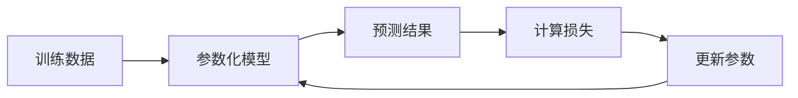

---

## 2.2 监督学习、无监督学习与自监督学习

### 监督学习

监督学习的数据包含明确标签：

```text
输入 x + 标签 y
→ 学习 x 到 y 的映射
```

常见任务：

- 分类：预测离散类别；
- 回归：预测连续数值；
- 排序：预测对象之间的相对顺序。

示例：

```text
邮件内容 → 是否为垃圾邮件
房屋特征 → 房屋价格
用户与商品 → 点击概率
```

### 无监督学习

无监督学习没有人工标签，目标是发现数据中的结构。

常见任务：

- 聚类；
- 降维；
- 异常检测；
- 密度估计。

### 自监督学习

自监督学习从原始数据本身构造训练目标。

例如语言模型的下一个 Token 预测：

```text
输入：机器学习正在改变
目标：软件
```

标签“软件”直接来自原始文本，不需要人工逐条标注。

大模型预训练主要属于自监督学习。

---

## 2.3 分类、回归、聚类与排序

| 任务 | 输出形式 | 示例 |
|---|---|---|
| 分类 | 离散类别 | 正常/异常、正面/负面 |
| 回归 | 连续数值 | 价格、时长、需求量 |
| 聚类 | 样本分组 | 用户分群、文档聚类 |
| 排序 | 相对顺序 | 搜索结果排序、候选重排 |
| 生成 | 序列 | 文本、代码、结构化结果 |

分类与回归属于典型监督学习；聚类通常属于无监督学习；文本生成则通常使用深度学习序列模型。

---

## 2.4 特征、标签、样本与参数

### 样本

一条完整训练记录。

### 特征

模型用于预测的信息。例如预测房价时：

```text
面积、楼层、位置、房龄
```

### 标签

模型要预测的真实结果。例如：

```text
实际成交价
```

### 参数

模型在训练过程中学习的数值。

### 超参数

训练前人为指定的配置，例如：

- 学习率；
- Batch Size；
- 模型层数；
- 正则化系数；
- 树的深度；
- LoRA Rank。

参数由训练数据学习，超参数由实验和验证集选择。

---

## 2.5 训练集、验证集与测试集

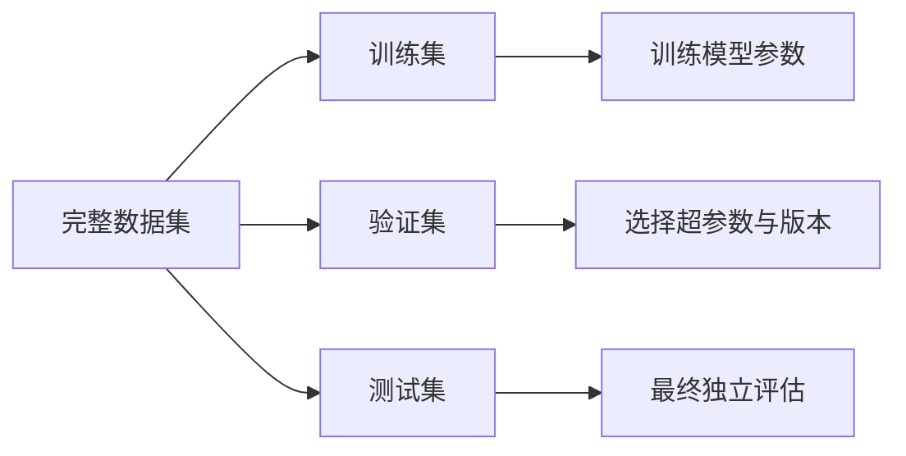

### 训练集

用于计算梯度和更新模型参数。

### 验证集

用于：

- 调整超参数；
- 选择模型版本；
- Early Stopping；
- 比较不同方案。

### 测试集

只用于最终评估，不应参与调参。

常见错误是反复根据测试集修改模型，这会让测试集逐渐变成“隐形验证集”，导致最终指标失真。

---

## 2.6 数据预处理

常见预处理包括：

- 缺失值处理；
- 异常值检测；
- 数值归一化；
- 类别特征编码；
- 文本清洗；
- 样本去重；
- 数据切分；
- 时间顺序保护。

### 标准化

$$
z=\frac{x-\mu}{\sigma}
$$

其中：

- $\mu$：均值；
- $\sigma$：标准差。

标准化后的特征通常均值接近 0、标准差接近 1。

### 归一化

将数值缩放到固定区间，例如 $[0,1]$：

$$
x'=\frac{x-x_{\min}}{x_{\max}-x_{\min}}
$$

注意：

> 均值、方差、最大值和最小值只能从训练集统计，再应用到验证集和测试集。

否则会产生数据泄漏。

---

## 2.7 损失函数

损失函数用于衡量模型预测与真实目标之间的差距。

训练目标通常写为：

$$
\theta^{*}
=
\arg\min_{\theta}
\mathcal{L}(\theta)
$$

### 均方误差

MSE（Mean Squared Error，均方误差）常用于回归：

$$
\mathrm{MSE}
=
\frac{1}{N}
\sum_{i=1}^{N}
\left(y_i-\hat{y}_i\right)^2
$$

误差被平方后，大误差受到更强惩罚。

### 二元交叉熵

用于二分类：

$$
\mathcal{L}
=
-\frac{1}{N}
\sum_{i=1}^{N}
\left[
y_i\log p_i
+
(1-y_i)\log(1-p_i)
\right]
$$

其中 $p_i$ 是样本属于正类的预测概率。

### 多分类交叉熵

$$
\mathcal{L}
=
-\sum_{c=1}^{C}
y_c\log p_c
$$

$p_c$ 是模型预测当前样本属于第 $c$ 类的概率。 $y_c$ 表示真实标签在第 $c$ 个类别上的取值。 真实类别对应的预测概率越低，损失越大。

---

## 2.8 梯度下降

梯度表示损失函数增长最快的方向，因此参数需要沿梯度反方向更新：

$$
\theta
\leftarrow
\theta
-
\eta\nabla_{\theta}\mathcal{L}
$$

其中：

- $\eta$：学习率；
- $\nabla_{\theta}\mathcal{L}$：损失对参数的梯度。


学习率太大可能导致震荡或发散；太小则会导致收敛缓慢。

---

## 2.9 Batch、Step 与 Epoch

### Batch

一次前向和反向传播使用的一组样本。

### Step

完成一次参数更新。

### Epoch

完整遍历一次训练集。

例如：

```text
训练集：10,000 条
Batch Size：100
每个 Epoch：100 个 Step
```

如果使用梯度累积，多个 Micro Batch 才完成一次参数更新：

$$
\mathrm{Global\ Batch}
=
\mathrm{Micro\ Batch}
\times
\mathrm{Accumulation\ Steps}
\times
\mathrm{Data\ Parallel\ Size}
$$

---

## 2.10 过拟合与欠拟合

### 欠拟合

表现为：

- 训练集效果差；
- 验证集效果也差；
- 模型没有学到足够规律。

可能原因：

- 模型过于简单；
- 特征不足；
- 训练轮数不足；
- 学习率设置不合理。

### 过拟合

表现为：

- 训练集效果很好；
- 验证集明显变差；
- 模型记住了训练数据细节。

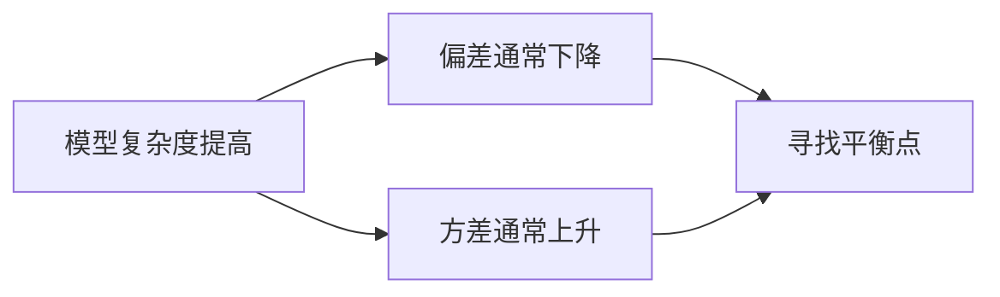

### 常见缓解方法

- 增加高质量数据；
- 数据增强；
- L1、L2 正则化；
- Dropout；
- Early Stopping；
- 降低模型容量；
- 清理重复样本。

---

## 2.11 L1 与 L2 正则化

### L1 正则化

$$
\mathcal{L}'
=
\mathcal{L}
+
\lambda\sum_i|w_i|
$$

特点：

- 倾向让部分权重变为 0；
- 可以形成稀疏模型；
- 可辅助特征选择。

### L2 正则化

$$
\mathcal{L}'
=
\mathcal{L}
+
\lambda\sum_i w_i^2
$$

特点：

- 抑制权重过大；
- 通常让参数分布更平滑；
- 常用于缓解过拟合。

---

## 2.12 混淆矩阵

二分类结果可以写为：

| 实际\预测 | 正类 | 负类 |
|---|---:|---:|
| 正类 | TP | FN |
| 负类 | FP | TN |

- TP：True Positive，真正例；
- FP：False Positive，假正例；
- FN：False Negative，假负例；
- TN：True Negative，真负例。

> 第一个 T/F 表示模型预测是否正确；第二个 P/N 表示模型预测成了正类还是负类。

---

## 2.13 Accuracy、Precision、Recall 与 F1

### Accuracy

$$
\mathrm{Accuracy}
=
\frac{TP+TN}{TP+TN+FP+FN}
$$

表示全部样本中预测正确的比例。

### Precision

$$
\mathrm{Precision}
=
\frac{TP}{TP+FP}
$$

表示：

> 被预测为正类的样本中，有多少是真的正类。

适合误报代价高的场景。

### Recall

$$
\mathrm{Recall}
=
\frac{TP}{TP+FN}
$$

表示：

> 所有真实正类中，有多少被模型发现。

适合漏报代价高的场景。

### F1 Score

$$
F1
=
\frac{2PR}{P+R}
$$

F1 是 Precision 和 Recall 的调和平均。

---

## 2.14 类别不平衡

假设 10,000 个样本中只有 10 个正类。

如果模型全部预测为负类：

```text
Accuracy = 99.9%
Recall = 0
```

所以类别不平衡时，Accuracy 可能具有误导性。

更应关注：

- Precision；
- Recall；
- F1；
- PR-AUC；
- 分类别指标；
- 业务错误成本。

PR-AUC 是 Area Under the Precision-Recall Curve，即精确率—召回率曲线下面积。

---

## 2.15 ROC 与 AUC

ROC（Receiver Operating Characteristic）曲线用于描述：

> **当分类阈值不断变化时，模型的真正率（TPR）与假正率（FPR）如何变化。**

其中：

- 横轴：FPR（False Positive Rate，假正率）；
- 纵轴：TPR（True Positive Rate，真正率）。

公式分别为：

$$
\mathrm{TPR}
=
\frac{TP}{TP+FN}
$$

$$
\mathrm{FPR}
=
\frac{FP}{FP+TN}
$$

---

### 为什么会形成一条曲线

很多二分类模型输出的不是“最终类别”，而是一个属于正类的概率分数，例如：

```text
样本 A：0.95
样本 B：0.80
样本 C：0.62
样本 D：0.40
样本 E：0.15
```

当我们设置不同阈值时，预测结果会变化：

* 阈值很高：只有分数特别高的样本才会被判为正类；
* 阈值降低：更多样本会被判为正类；
* 因此，TPR 和 FPR 会同时发生变化。

把不同阈值下得到的 $(FPR, TPR)$ 点连起来，就得到 ROC 曲线。

---

### 一个简单例子

假设某个二分类模型在不同阈值下得到如下结果：

|  阈值 |  TPR |  FPR |
| --: | ---: | ---: |
| 0.9 | 0.20 | 0.00 |
| 0.7 | 0.50 | 0.10 |
| 0.5 | 0.75 | 0.20 |
| 0.3 | 0.90 | 0.40 |
| 0.1 | 1.00 | 1.00 |

这些点可以画成 ROC 曲线。

```mermaid
xychart-beta
    title "ROC 曲线示意图"
    x-axis "FPR" [0.0, 0.1, 0.2, 0.4, 1.0]
    y-axis "TPR" 0 --> 1
    line [0.20, 0.50, 0.75, 0.90, 1.00]
```

从直观上看：

* 曲线越靠近**左上角**，表示模型越好；
* 如果曲线接近对角线，说明模型区分正负样本的能力较弱。

---

### 对角线代表什么

随机猜测的分类器，其 ROC 曲线大致接近对角线：

$$
TPR = FPR
$$

这意味着：

> 模型把正样本判为正类的能力，并不比随机猜测强多少。

因此：

* **优于对角线**：说明模型有一定区分能力；
* **越远离对角线并靠近左上角**：说明模型越好。

---

### AUC 是什么

AUC（Area Under the Curve，ROC 曲线下面积）用于衡量模型整体排序能力。

取值范围通常在：

$$
0 \le AUC \le 1
$$

一般可以这样理解：

* AUC = 1：模型排序完全正确；
* AUC = 0.5：模型接近随机猜测；
* AUC 越大：模型整体上越倾向于给正样本更高分。

AUC 的一个常见直观解释是：

> 随机取一个正样本和一个负样本，模型把正样本打分高于负样本的概率。

---

### 如何理解 AUC 高

AUC 高，说明模型的**整体排序能力较强**，也就是：

* 正样本整体得分更高；
* 负样本整体得分更低；
* 通过调整阈值，通常更容易找到一个较合适的分类点。

但要注意：

> **AUC 高，不代表某个固定阈值下的 Precision、Recall 或业务效果一定好。**

因为实际系统通常最终还要选一个具体阈值，这时还需要结合：

* Precision（精确率）；
* Recall（召回率）；
* F1；
* 概率校准；
* 误报与漏报的业务成本。

例如：

* 医疗筛查中，通常更关注 Recall；
* 风控拦截中，往往要平衡 Recall 与误报率；
* 推荐或排序系统中，AUC 更常用于衡量整体排序质量。

### 总结

- ROC：看不同阈值下，TPR 和 FPR 如何变化；
- AUC：看这条 ROC 曲线下面积有多大，用于衡量模型整体排序能力。


## 2.16 Macro 与 Micro

### Macro

分别计算每个类别的指标，再取平均。

特点：

- 每个类别权重相同；
- 更关注少数类别。

### Micro

先汇总所有类别的 TP、FP、FN，再统一计算。

特点：

- 样本多的类别影响更大；
- 更接近整体样本表现。

---

## 2.17 常见机器学习算法

| 算法 | 主要任务 | 核心特点 |
|---|---|---|
| 线性回归 | 回归 | 简单、可解释、线性关系 |
| 逻辑回归 | 分类 | 输出概率、线性决策边界 |
| 决策树 | 分类/回归 | 可解释、能表达非线性规则 |
| 随机森林 | 分类/回归 | 多棵树集成、鲁棒性较强 |
| GBDT | 分类/回归 | 逐步拟合前一轮误差 |
| XGBoost | 分类/回归 | 工程化梯度提升树 |
| SVM | 分类/回归 | 最大间隔、支持核函数 |
| KNN | 分类/回归 | 根据邻近样本预测 |
| K-Means | 聚类 | 根据中心点进行分组 |
| PCA | 降维 | 保留最大方差方向 |

缩写说明：

- GBDT：Gradient Boosting Decision Tree，梯度提升决策树；
- XGBoost：eXtreme Gradient Boosting，极端梯度提升；
- SVM：Support Vector Machine，支持向量机；
- KNN：K-Nearest Neighbors，K 近邻；
- PCA：Principal Component Analysis，主成分分析。

---

## 2.18 数据泄漏

数据泄漏是指训练或评估过程中使用了本不应提前知道的信息。

常见情况：

- 使用测试集调参；
- 标准化时使用全量数据统计量；
- 时间序列随机切分，使未来数据进入训练集；
- 特征直接包含标签信息；
- 同一用户的高度相似样本同时出现在训练集和测试集；
- 重复文档跨数据集分布。

数据泄漏会让离线指标异常高，但实际效果明显下降。

---

# 3. 深度学习基础

## 3.1 神经元与线性变换

一个最基本的神经元可以写为：

$$
z=\mathbf{w}^{\mathsf T}\mathbf{x}+b
$$

再经过激活函数：

$$
y=\sigma(z)
$$

其中：

- $\mathbf{x}$：输入向量；
- $\mathbf{w}$：权重；
- $b$：偏置；
- $\sigma$：激活函数。

多层神经网络通过重复执行“线性变换 + 非线性激活”来表达复杂函数。

---

## 3.2 为什么需要激活函数

如果每一层都只有线性变换，那么多层线性变换仍然等价于一层线性变换：

$$
W_2(W_1x)=W'x
$$

加入非线性激活后，网络才能表示复杂的非线性关系。

常见激活函数：

### ReLU

Rectified Linear Unit，修正线性单元：

$$
\mathrm{ReLU}(x)=\max(0,x)
$$

优点是计算简单，但负半轴梯度为 0。

### GELU

Gaussian Error Linear Unit，高斯误差线性单元。

它不像 ReLU 那样硬截断负值，而是进行平滑门控，常见于 Transformer。

### SiLU

Sigmoid Linear Unit，也常称 Swish：

$$
\mathrm{SiLU}(x)=x\cdot\mathrm{sigmoid}(x)
$$

---

## 3.3 前向传播与反向传播

### 前向传播

输入依次通过网络各层，得到预测结果并计算损失。

### 反向传播

利用链式法则，从损失出发向前计算每个参数的梯度。

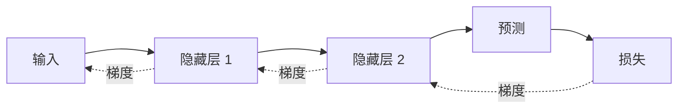

反向传播负责算梯度，优化器负责根据梯度更新参数。

---

## 3.4 优化器

### SGD

SGD（Stochastic Gradient Descent，随机梯度下降）：

$$
\theta
\leftarrow
\theta-\eta g
$$

### Momentum

动量方法累计历史梯度方向，减小震荡。

### Adam

Adam（Adaptive Moment Estimation，自适应矩估计）同时维护梯度的一阶矩和二阶矩，对不同参数使用自适应步长。

理解重点：

- 梯度决定方向；
- 学习率控制更新幅度；
- 优化器决定如何利用当前和历史梯度。

---

## 3.5 学习率、Warmup 与调度器

Warmup 表示训练初期从较小学习率逐步升高。

作用：

- 避免早期梯度不稳定导致剧烈更新；
- 提高大模型训练稳定性。

Warmup 后通常继续使用：

- 线性衰减；
- 余弦衰减；
- 分段衰减；
- 常数学习率。

---

## 3.6 梯度爆炸、梯度消失与梯度裁剪

### 梯度爆炸

梯度数值过大，导致参数更新失控。

### 梯度消失

梯度在深层传播时不断缩小，前层参数难以学习。

### 梯度裁剪

限制梯度范数：

$$
g
\leftarrow
g\cdot
\min
\left(
1,
\frac{c}{\|g\|}
\right)
$$

梯度裁剪主要缓解梯度爆炸，不能从根本上解决所有训练不稳定问题。

---

## 3.7 Dropout

Dropout 在训练时随机将部分神经元输出置零。

作用：

- 减少神经元之间的过度依赖；
- 缓解过拟合；
- 提高泛化能力。

推理时通常关闭 Dropout，并使用完整网络。

---

## 3.8 Normalization

Normalization 表示归一化层。

> **BatchNorm 横向看一批样本的同一个特征；LayerNorm 纵向看一个样本内部的所有特征。**

## BatchNorm 与 LayerNorm

Normalization（归一化）层的主要作用是控制中间激活值的数值分布，使训练过程更加稳定。

需要注意，BatchNorm 和 LayerNorm 并不是简单把输入缩放到固定区间，而是先对指定维度计算均值和方差，再进行标准化，并通过可训练参数恢复模型所需的表达能力。

### BatchNorm

BatchNorm（Batch Normalization，批归一化）主要对一个 Batch 中的同一特征进行归一化。

假设一个 Batch 中有 $B$ 个样本，每个样本有 $D$ 个特征：

$$
X\in\mathbb{R}^{B\times D}
$$

对于第 $d$ 个特征，BatchNorm 会收集所有样本在该特征上的值：

$$
x_{1d},x_{2d},\ldots,x_{Bd}
$$

然后计算该特征在当前 Batch 中的均值和方差：

$$
\mu_d
=
\frac{1}{B}
\sum_{b=1}^{B}x_{bd}
$$

$$
\sigma_d^2
=
\frac{1}{B}
\sum_{b=1}^{B}
\left(x_{bd}-\mu_d\right)^2
$$

再对每个样本的该特征进行标准化：

$$
\hat{x}_{bd}
=
\frac{x_{bd}-\mu_d}
{\sqrt{\sigma_d^2+\epsilon}}
$$

最后进行可训练的缩放和平移：

$$
y_{bd}
=
\gamma_d\hat{x}_{bd}+\beta_d
$$

其中：

- $\gamma_d$ 是第 $d$ 个特征的可训练缩放参数；
- $\beta_d$ 是第 $d$ 个特征的可训练平移参数；
- $\epsilon$ 是防止分母为 0 的较小常数。

#### 直观例子

假设一个 Batch 有 3 个样本，每个样本有 4 个特征：

```text
样本 1：[1,  10, 100, 1000]
样本 2：[2,  20, 200, 2000]
样本 3：[3,  30, 300, 3000]
````

BatchNorm 会按列计算：

```text
特征 1：1、2、3
特征 2：10、20、30
特征 3：100、200、300
特征 4：1000、2000、3000
```

也就是说，它比较的是：

> 不同样本在同一个特征上的数值分布。

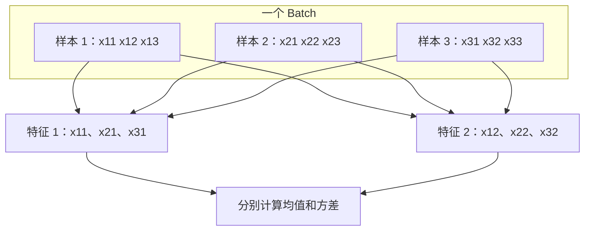

#### 训练与推理的差异

训练时，BatchNorm 使用当前 Batch 的均值和方差。

但推理时可能只有一个样本，或者不同请求不能组成稳定的 Batch，因此不能继续依赖当前 Batch 的统计量。

BatchNorm 会在训练过程中维护移动平均：

```text
running_mean
running_variance
```

推理阶段使用这些历史统计量。

因此 BatchNorm 在训练和推理阶段的行为不同：

| 阶段 | 使用的统计量           |
| -- | ---------------- |
| 训练 | 当前 Batch 的均值和方差  |
| 推理 | 训练期间累计的移动均值和移动方差 |

#### BatchNorm 的特点

优点：

* 可以稳定中间激活值；
* 通常允许使用更大学习率；
* 能加快部分网络的收敛；
* Batch 统计量带来的噪声有时具有一定正则化作用。

限制：

* 效果依赖 Batch Size；
* Batch 太小时，均值和方差估计可能不稳定；
* 训练和推理行为不同；
* 分布式训练时可能需要同步不同设备上的统计量；
* 对变长序列和自回归生成不够自然。

BatchNorm 常见于卷积神经网络等视觉模型。

### LayerNorm

LayerNorm（Layer Normalization，层归一化）主要对单个样本内部的特征维度进行归一化。

仍假设输入为：

$$
X\in\mathbb{R}^{B\times D}
$$

对于第 $b$ 个样本，LayerNorm 会收集该样本的全部特征：

$$
x_{b1},x_{b2},\ldots,x_{bD}
$$

计算该样本内部的均值和方差：

$$
\mu_b
=

\frac{1}{D}
\sum_{d=1}^{D}x_{bd}
$$

$$
\sigma_b^2
=

\frac{1}{D}
\sum_{d=1}^{D}
\left(x_{bd}-\mu_b\right)^2
$$

然后进行标准化：

$$
\hat{x}_{bd}
=

\frac{x_{bd}-\mu_b}
{\sqrt{\sigma_b^2+\epsilon}}
$$

最后同样使用可训练参数缩放和平移：

$$
y_{bd}
=

\gamma_d\hat{x}_{bd}+\beta_d
$$

#### 直观例子

还是下面 3 个样本：

```text
样本 1：[1,  10, 100, 1000]
样本 2：[2,  20, 200, 2000]
样本 3：[3,  30, 300, 3000]
```

LayerNorm 会按行计算：

```text
样本 1：对 1、10、100、1000 计算均值和方差
样本 2：对 2、20、200、2000 计算均值和方差
样本 3：对 3、30、300、3000 计算均值和方差
```

它比较的是：

> 同一个样本内部不同隐藏特征的数值分布。

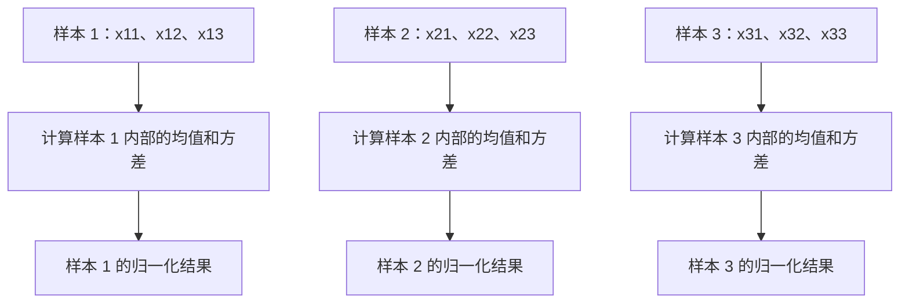

#### Transformer 中的 LayerNorm

Transformer 的隐藏状态通常可以写为：

$$
X\in\mathbb{R}^{B\times L\times D}
$$

其中：

* $B$：Batch Size；
* $L$：序列长度；
* $D$：隐藏维度。

LayerNorm 通常针对每个样本的每个 Token，独立地在隐藏维度 $D$ 上进行归一化。

也就是说，对于：

```text
第 b 个样本
第 l 个 Token
```

会对它对应的隐藏向量：

$$
X_{b,l,:}
\in\mathbb{R}^{D}
$$

计算均值和方差。

例如某个 Token 的隐藏向量为：

```text
[0.4, -1.2, 0.8, 2.1, ...]
```

LayerNorm 就在这个向量内部进行归一化，而不会使用其他样本或其他 Token 的数值。

#### LayerNorm 的特点

* 不依赖 Batch 中的其他样本；
* Batch Size 为 1 时仍然可以正常工作；
* 训练和推理阶段使用相同的计算方式；
* 不需要维护 running mean 和 running variance；
* 适合变长序列；
* 适合自回归生成；
* 常用于 Transformer 和大语言模型。


### BatchNorm 与 LayerNorm 的核心区别

假设输入矩阵为：

$$
X\in\mathbb{R}^{B\times D}
$$

可以将二者理解为：

```text
BatchNorm：沿 Batch 方向计算同一个特征的统计量
LayerNorm：沿 Feature 方向计算同一个样本的统计量
```

### 为什么 Transformer 更常使用 LayerNorm

Transformer 经常面对：

* 不同长度的文本；
* 动态 Batch；
* Batch Size 较小；
* 单请求生成；
* 自回归逐 Token 解码；
* 训练和推理序列分布不同。

如果使用 BatchNorm，一个 Token 的输出会受到同一 Batch 中其他样本的影响，并且推理时还要处理 Batch 统计量与训练统计量的差异。

LayerNorm 只依赖当前 Token 自己的隐藏向量，因此：

* 不受同一 Batch 中其他样本影响；
* 单样本推理也能正常工作；
* 变长序列处理更自然；
* 训练和推理逻辑一致。

所以 Transformer 通常使用 LayerNorm 或 RMSNorm，而不是 BatchNorm。

### RMSNorm

RMSNorm 的更完整名称通常写作：

> **Root Mean Square Layer Normalization，均方根层归一化**

它可以看作 LayerNorm 的简化形式。

LayerNorm 会执行两步：

```text
减去均值
→ 除以标准差
```
RMSNorm 不减去均值，只根据向量的均方根调整整体尺度：
```text
计算均方根
→ 用均方根缩放输入
```

# 4. 文本如何进入模型

## 4.1 Token 与 Tokenizer

模型不会直接处理完整单词或句子，而是处理 Token。

Tokenizer 是分词器，负责：

```text
原始文本
→ Token 序列
→ Token ID 序列
```

例如：

```text
"unbelievable"
→ ["un", "believ", "able"]
→ [1287, 9321, 415]
```

Token 可能是：

- 单个字符；
- 完整单词；
- 子词；
- 标点；
- 特殊符号。

Token 数量直接影响：

- 上下文长度；
- 调用成本；
- Prefill 计算量；
- KV Cache 占用。

---

## 4.2 特殊 Token

常见特殊 Token：

- BOS：Beginning of Sequence，序列开始；
- EOS：End of Sequence，序列结束；
- PAD：Padding，补齐；
- UNK：Unknown，未知 Token；
- SEP：Separator，分隔；
- MASK：Mask，掩码。

不同模型不一定同时使用这些 Token。

---

## 4.3 Embedding

Token ID 只是离散编号，需要映射为连续向量：

$$
\mathrm{EmbeddingLookup}(id)
\rightarrow
\mathbf{x}\in\mathbb{R}^{d_{\mathrm{model}}}
$$

Embedding 矩阵：

$$
E\in\mathbb{R}^{V\times d_{\mathrm{model}}}
$$

其中：

- $V$：词表大小；
- $d_{\mathrm{model}}$：隐藏维度。

每个 Token ID 对应矩阵中的一行。

Embedding 不是一个固定的“词义字典”。它会在训练中更新，使模型能够利用向量表达语义、语法和上下文规律。

---

## 4.4 静态表示与上下文表示

静态 Embedding 中，同一个词通常只有一个固定向量。

上下文模型中，同一个词在不同句子里的最终隐藏表示不同。

例如：

```text
苹果很好吃。
苹果发布了新产品。
```

“苹果”的初始 Token Embedding 可能相同，但经过多层 Attention 后，上下文表示会明显不同。

---

## 4.5 位置编码

Self-Attention 本身对输入顺序不敏感。

例如：

```text
猫吃鱼
鱼吃猫
```

如果没有位置信息，模型难以区分词序变化。

### 绝对位置编码

为每个绝对位置提供位置向量。

### 相对位置编码

重点表达两个 Token 的相对距离。

### RoPE

RoPE（Rotary Position Embedding，旋转位置编码）对 Query 和 Key 做与位置相关的旋转，使注意力分数包含相对位置信息。

---

# 5. Transformer 核心机制

## 5.1 Self-Attention

Self-Attention 允许每个位置根据内容动态聚合其他位置的信息。

输入矩阵：

$$
X\in\mathbb{R}^{n\times d_{\mathrm{model}}}
$$

通过线性投影得到：

$$
Q=XW_Q,\qquad
K=XW_K,\qquad
V=XW_V
$$

注意力计算：

$$
\mathrm{Attention}(Q,K,V)
=
\mathrm{softmax}
\left(
\frac{QK^{\mathsf T}}{\sqrt{d_k}}
\right)V
$$

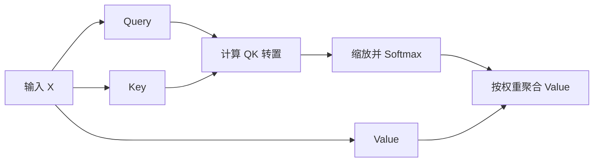

---

## 5.2 Query、Key 与 Value

可以把它们直观理解为：

- Query：当前位置想寻找什么；
- Key：每个位置提供什么匹配线索；
- Value：匹配成功后真正取出的信息。

例如句子：

```text
小明把书放在桌上，因为它很重。
```

处理“它”时，模型可以通过 Query 与其他位置的 Key 计算相关性，再聚合对应 Value。

---

## 5.3 为什么除以 $\sqrt{d_k}$

当 $d_k$ 增大时，点积数值通常也会变大。

过大的分数进入 Softmax 后，概率分布会过于尖锐，使梯度变小、训练不稳定。

因此使用：

$$
\frac{QK^{\mathsf T}}{\sqrt{d_k}}
$$

控制数值尺度。

---

## 5.4 Softmax

Softmax 将任意实数转换为概率分布：

$$
\mathrm{softmax}(z_i)
=
\frac{e^{z_i}}
{\sum_j e^{z_j}}
$$

满足：

$$
0\lt p_i\lt 1,
\qquad
\sum_i p_i=1
$$

在 Attention 中，Softmax 将相似度分数转换为注意力权重。

---

## 5.5 Multi-Head Attention

MHA（Multi-Head Attention，多头注意力）使用多组投影，让不同注意力头在不同表示子空间中建模关系。

第 $i$ 个头：

$$
\mathrm{head}_i
=
\mathrm{Attention}
\left(
QW_i^Q,
KW_i^K,
VW_i^V
\right)
$$

所有头的输出先拼接，再进行线性融合：

$$
\mathrm{MHA}(Q,K,V)
=
\mathrm{Concat}
\left(
\mathrm{head}_1,\ldots,\mathrm{head}_h
\right)W^O
$$

不同头可能关注：

- 语法依赖；
- 指代关系；
- 局部邻接关系；
- 长距离关系；
- 实体与属性关系。

但实际训练中，一些头也可能功能相似或存在冗余。

---

## 5.6 多头注意力的维度

假设：

```text
模型隐藏维度 d_model = 512
注意力头数 h = 8
每头维度 d_head = 64
```

每个头输出：

$$
\mathrm{head}_i
\in
\mathbb{R}^{n\times64}
$$

8 个头拼接后：

$$
\mathrm{Concat}
\in
\mathbb{R}^{n\times512}
$$

再乘 $W^O$，输出仍保持模型隐藏维度。

---

## 5.7 双向注意力与因果注意力

### 双向注意力

每个位置可以读取输入序列中的全部位置。

适合：

- 文本理解；
- 分类；
- 语义表示；
- Token 标注。

### 因果注意力

当前位置只能读取自己和之前的位置，不能读取未来位置。

```text
位置 0：可读取 0
位置 1：可读取 0、1
位置 2：可读取 0、1、2
位置 3：可读取 0、1、2、3
```

注意力分数加入因果 Mask：

$$
A_{ij}
=
\mathrm{softmax}_{j}
\left(
\frac{q_i k_j^{\mathsf T}}{\sqrt{d_k}}
+
M_{ij}
\right)
$$

其中：

$$
M_{ij}=0\quad(j\le i),
\qquad
M_{ij}=-\infty\quad(j>i)
$$

未来位置经过 Softmax 后权重为 0。

---

## 5.8 残差连接

残差连接：

$$
Y=X+F(X)
$$

作用：

- 为梯度提供更直接的传播路径；
- 保留原始表示；
- 让网络更容易学习增量变化；
- 支持更深的网络结构。

---

## 5.9 Feed Forward Network

FFN（Feed Forward Network，前馈神经网络）：

$$
\mathrm{FFN}(x)
=
W_2\sigma(W_1x+b_1)+b_2
$$

Attention 负责 Token 之间的信息交互；FFN 对每个 Token 的表示进行非线性变换。

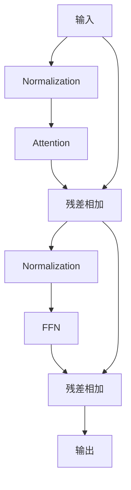

---

## 5.10 Pre-Norm 与 Post-Norm

### Pre-Norm

$$
Y=X+F(\mathrm{LN}(X))
$$

### Post-Norm

$$
Y=\mathrm{LN}(X+F(X))
$$

Pre-Norm 通常更有利于深层网络训练稳定，但具体实现还会使用 RMSNorm 等变体。

---

# 6. Encoder、Decoder 与 Decoder-only

## 6.1 名字分别代表什么

- Encoder：编码器，把输入转成内部语义表示；
- Decoder：解码器，根据内部表示逐步生成输出；
- Encoder-Decoder：先编码输入，再解码输出；
- Decoder-only：没有独立 Encoder，统一根据前文预测后文。

这里的“编码”不是字符编码或文件压缩，而是把 Token 序列转换成上下文隐藏向量。

---

## 6.2 Encoder

Encoder 通常使用双向 Self-Attention。

一个典型 Encoder 层：

```text
双向 Self-Attention
→ 残差连接与归一化
→ FFN
→ 残差连接与归一化
```


Encoder 适合：

- 分类；
- 检索；
- 表示学习；
- Token 标注。

---

## 6.3 Decoder

经典 Encoder-Decoder Transformer 中，一个 Decoder 层通常包含：

```text
因果 Self-Attention
→ Cross-Attention
→ FFN
```

Cross-Attention 是交叉注意力：

- Query 来自 Decoder；
- Key 和 Value 来自 Encoder。

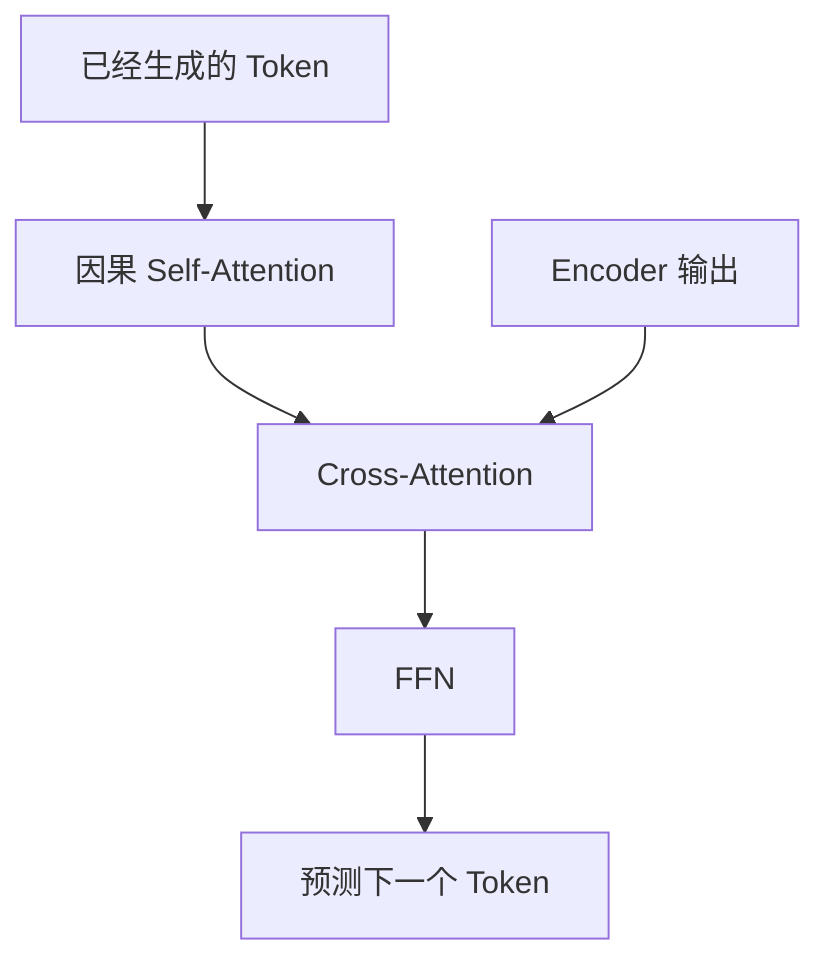

---

## 6.4 Encoder-Decoder

Encoder-Decoder 将输入和输出分开处理。


例如翻译：

```text
输入：我喜欢机器学习
输出：I like machine learning
```

Decoder 每一步同时使用：

- Encoder 对完整输入的表示；
- 已经生成的输出前缀。

---

## 6.5 Decoder-only

Decoder-only 没有独立 Encoder，也通常没有 Cross-Attention。

一个典型层：

```text
因果 Self-Attention
→ 残差连接与归一化
→ FFN
→ 残差连接与归一化
```

它把任务说明、输入内容和回答放入同一个序列：

```text
用户输入 + 已生成回答
```

模型始终执行：

> 根据前面的 Token，预测下一个 Token。

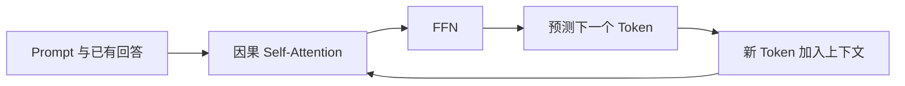

Decoder-only 没有独立 Encoder，但仍然能够处理和理解 Prompt，因为回答 Token 可以读取前面的完整输入。

---

## 6.6 三种架构对比

| 架构 | 注意力方式 | 是否独立处理输入 | 主要用途 |
|---|---|---:|---|
| Encoder-only | 双向注意力 | 是 | 分类、检索、表示学习 |
| Encoder-Decoder | Encoder 双向，Decoder 因果 | 是 | 翻译、摘要、序列转换 |
| Decoder-only | 因果注意力 | 否 | 对话、续写、通用生成 |

注意力来源对比：

| 注意力类型 | Query 来源 | Key 来源 | Value 来源 |
|---|---|---|---|
| Encoder Self-Attention | Encoder | Encoder | Encoder |
| Decoder Self-Attention | Decoder | Decoder | Decoder |
| Cross-Attention | Decoder | Encoder | Encoder |

---

# 7. 大模型训练与对齐

## 7.1 整体训练链路


---

## 7.2 预训练

Decoder-only 模型通常采用 Next Token Prediction，即下一个 Token 预测。

概率分解：

$$
P(x_1,\ldots,x_T)
=
\prod_{t=1}^{T}
P(x_t\mid x_{1:t-1})
$$

Token 级交叉熵损失：

$$
\mathcal{L}
=
-\sum_{t=1}^{T}
\log P\left(x_t\mid x_{1:t-1}\right)
$$

预训练让模型学习：

- 语言结构；
- 词语关系；
- 常识与知识模式；
- 推理和生成能力；
- 代码与格式规律。

---

## 7.3 SFT

SFT（Supervised Fine-Tuning，监督微调）使用指令—回答数据训练模型遵循任务。

典型数据：

```json
{
  "instruction": "解释传输控制协议的三次握手",
  "input": "",
  "response": "三次握手包括……"
}
```

SFT 主要用于：

- 指令遵循；
- 对话格式；
- 特定任务；
- 输出风格；
- 拒答行为；
- 结构化输出。

预训练学习“语言和世界规律”，SFT 学习“如何按要求完成任务”。

---

## 7.4 偏好数据

同一输入对应两个回答：

```text
chosen：更符合目标偏好的回答
rejected：较差回答
```

偏好可能涉及：

- 正确性；
- 清晰度；
- 安全性；
- 格式；
- 风格；
- 是否遵循约束。

---

## 7.5 RLHF

RLHF（Reinforcement Learning from Human Feedback，基于人类反馈的强化学习）典型流程：

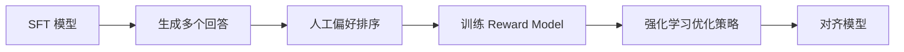

Reward Model 是奖励模型，用于给回答打分：

$$
r_{\phi}(x,y)
$$

PPO（Proximal Policy Optimization，近端策略优化）可用于根据奖励模型更新策略。

KL Divergence 是 Kullback-Leibler Divergence，KL 散度，用于限制新模型与参考模型偏离过大。

---

## 7.6 DPO

DPO（Direct Preference Optimization，直接偏好优化）直接利用 chosen/rejected 偏好对优化模型。

特点：

- 不显式训练独立奖励模型；
- 不执行传统 PPO 式强化学习流程；
- 仍然需要偏好数据；
- 通常流程更简单。

| 维度 | RLHF | DPO |
|---|---|---|
| 显式奖励模型 | 通常需要 | 不需要 |
| 强化学习式更新 | 通常需要 | 不需要 |
| 数据 | 偏好对 | 偏好对 |
| 工程复杂度 | 较高 | 较低 |

---

## 7.7 全参数微调与 PEFT

全参数微调更新模型全部参数。

优点：

- 调整空间大。

缺点：

- 训练成本高；
- 显存需求大；
- 每个任务需要保存完整模型；
- 可能破坏原有能力。

PEFT（Parameter-Efficient Fine-Tuning，参数高效微调）只训练少量参数。

---

## 7.8 LoRA

LoRA（Low-Rank Adaptation，低秩适配）冻结原始权重，只训练低秩增量矩阵。

$$
\Delta W=BA
$$

其中：

$$
A\in\mathbb{R}^{r\times d_{\mathrm{in}}},
\qquad
B\in\mathbb{R}^{d_{\mathrm{out}}\times r}
$$

最终：

$$
W'=W+\alpha BA
$$

Rank $r$ 越大，适配容量通常越强，但参数量、显存和过拟合风险也会提高。

---

## 7.9 QLoRA

QLoRA（Quantized Low-Rank Adaptation，量化低秩适配）将：

```text
量化后的基础模型
+
可训练的 LoRA 适配器
```

组合起来，降低微调基础模型时的显存需求。

QLoRA 的重点是量化基础权重，并保留适合训练的适配器和计算路径。

---

## 7.10 混合精度训练

- FP32：32 位浮点数；
- FP16：16 位浮点数；
- BF16：Brain Floating Point 16，16 位脑浮点数。

BF16 与 FP32 的指数范围接近，因此通常比 FP16 更不容易发生溢出。

混合精度训练常见做法：

- 大部分矩阵计算使用低精度；
- 关键累积和状态使用更高精度；
- FP16 场景可使用 Loss Scaling 防止下溢。

---

## 7.11 并行训练

### 数据并行

每个设备保存完整模型，处理不同数据，再同步梯度。

### 张量并行

将同一层的大矩阵拆到多个设备。

### 流水线并行

将不同模型层放到不同设备。

### 专家并行

将 MoE 的不同 Expert 分布到不同设备。

---

# 8. 推理过程与部署

## 8.1 自回归生成

生成过程：

```text
输入：今天的天气
→ 预测：很

输入：今天的天气很
→ 预测：好

输入：今天的天气很好
→ 预测：。
```

每个新 Token 都加入上下文，继续预测后续 Token。

---

## 8.2 Prefill 与 Decode

### Prefill

一次性处理整个 Prompt。

特点：

- 输入 Token 可以并行计算；
- 长 Prompt 计算量较大；
- 主要影响首 Token 延迟。

### Decode

每次生成一个 Token。

特点：

- 自回归串行；
- 每一步读取历史 KV Cache；
- 更容易受到显存带宽和调度影响。

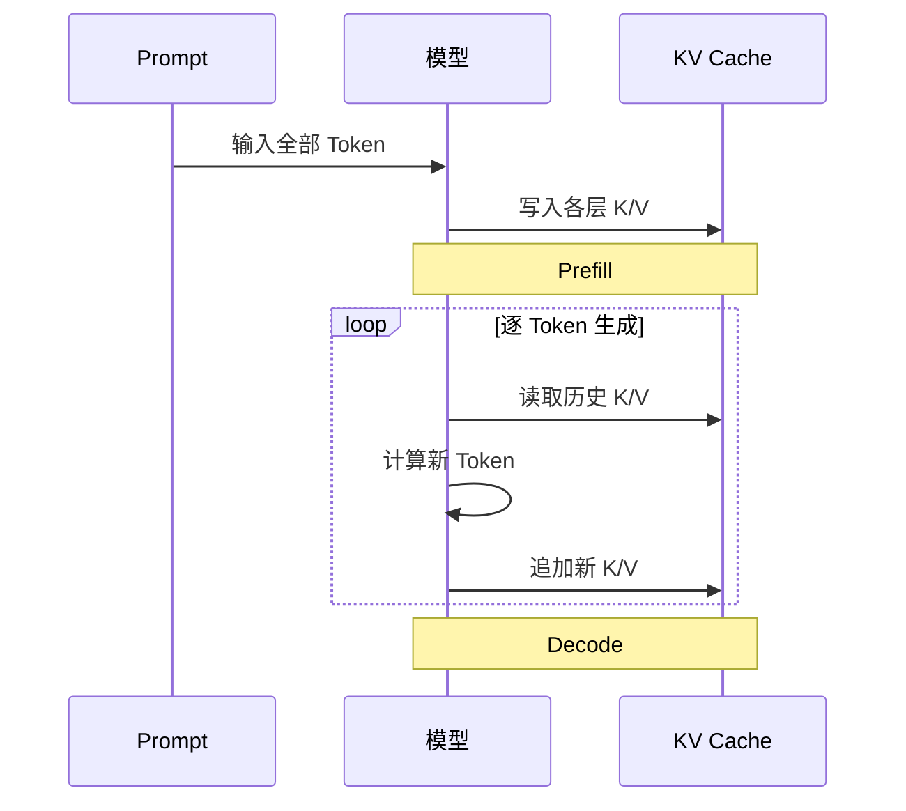

---

## 8.3 KV Cache

KV Cache（Key-Value Cache，键值缓存）保存历史 Token 在每一层产生的 Key 和 Value。

没有 KV Cache：

```text
每一步都重新计算全部历史 Token
```

有 KV Cache：

```text
历史 K/V 直接复用
每一步只计算新 Token
```

其显存占用大致与以下因素成正比：

$$
\mathrm{Batch\ Size}
\times
\mathrm{Sequence\ Length}
\times
\mathrm{Layer\ Count}
\times
\mathrm{KV\ Head\ Count}
\times
\mathrm{Head\ Dimension}
$$

---

## 8.4 MHA、MQA 与 GQA

- MHA：Multi-Head Attention，多头注意力；
- MQA：Multi-Query Attention，多查询注意力；
- GQA：Grouped-Query Attention，分组查询注意力。

### MHA

每个 Query Head 都有独立 K/V Head。

优点：表达能力强。  
缺点：KV Cache 较大。

### MQA

所有 Query Head 共享一组 K/V。

优点：KV Cache 小、解码快。  
缺点：可能损失部分表达能力。

### GQA

多个 Query Head 分组共享 K/V，在 MHA 与 MQA 之间折中。

```text
MHA：每头独立 K/V
GQA：每组共享 K/V
MQA：所有头共享 K/V
```

---

## 8.5 Greedy Search

每一步选择概率最大的 Token：

$$
x_t
=
\arg\max_x
P(x\mid x_{1:t-1})
$$

优点：

- 确定性强；
- 速度快；
- 易复现。

缺点：

- 容易陷入局部最优；
- 输出可能保守或重复。

---

## 8.6 Beam Search

Beam Search 每一步保留多个候选序列。

```text
Beam Width = 3
→ 每一步保留总分最高的 3 条路径
```

适合受约束生成和序列转换，但计算量高于 Greedy Search。

---

## 8.7 Temperature

Temperature 作用于 Logits：

$$
P_i
=
\frac{\exp(z_i/T)}
{\sum_j\exp(z_j/T)}
$$

- $T\lt1$：分布更尖锐，结果更确定；
- $T\gt1$：分布更平坦，结果更随机。

Temperature 不会增加模型知识，只改变采样随机性。

---

## 8.8 Top-k 与 Top-p

### Top-k

只保留概率最高的 K 个 Token。

### Top-p

Top-p 又称 Nucleus Sampling，核心采样。

按概率从高到低排序，选择累计概率达到 $p$ 的最小候选集合。

| 维度 | Top-k | Top-p |
|---|---|---|
| 候选规模 | 固定 | 动态 |
| 控制方式 | 数量 | 累计概率 |
| 分布尖锐时 | 仍保留 K 个 | 可能只保留少量 |
| 分布平坦时 | 仍保留 K 个 | 可能保留更多 |

---

## 8.9 重复惩罚、最大长度与停止条件

### 重复惩罚

降低已生成 Token 再次出现的概率。

惩罚过强可能破坏：

- 专有名词；
- 代码变量名；
- 固定格式；
- 长文本连贯性。

### 最大生成长度

限制输出 Token 数量，防止成本和延迟失控。

### Stop Token

生成指定 Token 或字符串时停止。

---

## 8.10 量化

量化将权重或激活转换为更低精度表示。

常见形式：

- FP16；
- INT8；
- INT4；
- 混合精度。

优点：

- 降低显存；
- 提高吞吐；
- 降低部署成本。

代价：

- 可能损失精度；
- 不同层敏感程度不同；
- 需要校准；
- 依赖硬件支持。

---

## 8.11 延迟、吞吐与并发

### 延迟

单个请求从提交到完成所需时间。

### 吞吐

单位时间内处理的请求数或 Token 数。

### 并发

同时处于处理状态的请求数量。

常用指标：

- TTFT：Time to First Token，首 Token 延迟；
- TPOT：Time per Output Token，平均每个输出 Token 的时间；
- Tokens/s：每秒 Token 数；
- Requests/s：每秒请求数；
- P50、P95、P99：不同百分位延迟。

更大 Batch 往往提升吞吐，但可能增加排队时间和单请求延迟。

---

## 8.12 Dense 与 MoE

Dense 表示稠密模型，每个 Token 都经过相同主要参数。

MoE（Mixture of Experts，混合专家模型）包含多个 Expert，由 Router 为每个 Token 选择少量专家。

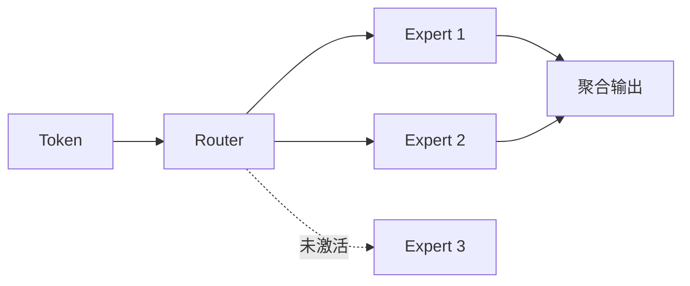

特点：

- 总参数量可以很大；
- 每个 Token 通常只激活少量专家；
- 需要负载均衡；
- 分布式通信更复杂。

---

## 8.13 FlashAttention

FlashAttention 不改变 Attention 的数学定义，主要优化实现方式。

核心思路：

- 分块计算；
- 减少中间矩阵写回高带宽显存；
- 降低显存占用；
- 提高实际运行效率。

它属于 I/O-aware，即面向数据读写开销的优化。

---

## 8.14 MLA

MLA（Multi-Head Latent Attention，多头潜在注意力）通过低维潜在表示压缩 Key/Value 信息，主要目标是降低 KV Cache 和推理带宽压力。

不要将 MLA 与 LoRA 混淆：

- MLA：模型架构和推理优化；
- LoRA：参数高效微调方法。

---

# 9. RAG：检索增强生成

## 9.1 RAG 解决什么问题

RAG（Retrieval-Augmented Generation，检索增强生成）在生成前检索外部知识。

它适合解决：

- 模型知识过时；
- 私有知识无法直接访问；
- 精确条款和编号记忆不可靠；
- 需要引用来源；
- 知识频繁更新。

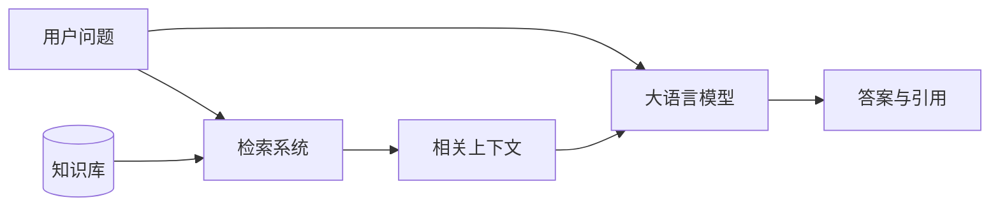

RAG 不直接修改模型参数，而是在推理阶段注入证据。

---

## 9.2 完整链路

```mermaid
flowchart TB
    subgraph Offline[离线建库]
        D1[文档采集] --> D2[清洗与解析]
        D2 --> D3[Chunk 切分]
        D3 --> D4[Embedding]
        D4 --> D5[建立索引]
        D5 --> DB[(向量索引与倒排索引)]
    end

    subgraph Online[在线查询]
        Q1[用户 Query] --> Q2[Query 改写]
        Q2 --> Q3[多路召回]
        DB --> Q3
        Q3 --> Q4[Rerank]
        Q4 --> Q5[上下文组装]
        Q5 --> Q6[LLM 生成]
        Q6 --> Q7[引用与评估]
    end
```

---

## 9.3 文档清洗与元数据

知识库不仅应保存正文，还应保存：

- 标题；
- 来源；
- 更新时间；
- 文档类型；
- 章节路径；
- 权限标签；
- 租户标识；
- 版本信息。

推荐结构：

```json
{
  "chunk_id": "doc-1024-section-3-chunk-2",
  "document_id": "doc-1024",
  "title": "退款规则",
  "content": "……",
  "source": "knowledge_base/refund_policy.md",
  "updated_at": "2026-07-01",
  "permission_tags": ["support", "finance"],
  "section_path": ["售后规则", "退款", "部分退款"]
}
```

---

## 9.4 Chunk 切分

Chunk 是检索的基本单元。

### 太小

- 语义不完整；
- 上下文缺失；
- 标题与正文分离。

### 太大

- 混合多个主题；
- 检索不精确；
- 上下文噪声增加；
- Token 成本变高。

### Overlap

Chunk Overlap 表示相邻文本块保留重叠内容。

```text
Chunk 1：A B C D E
Chunk 2：D E F G H
```

它能减少语义被切断的问题，但过大也会造成重复召回和索引膨胀。

---

## 9.5 Embedding 与相似度

Embedding 模型将文本映射为固定维度向量：

$$
f(\mathrm{text})
\rightarrow
\mathbf{v}\in\mathbb{R}^{d}
$$

### 余弦相似度

$$
\cos(\theta)
=
\frac{\mathbf{x}\cdot\mathbf{y}}
{\|\mathbf{x}\|\|\mathbf{y}\|}
$$

### 点积

$$
\mathbf{x}\cdot\mathbf{y}
=
\sum_{i=1}^{d}x_i y_i
$$

### 欧氏距离

$$
d(\mathbf{x},\mathbf{y})
=
\sqrt{
\sum_{i=1}^{d}
(x_i-y_i)^2
}
$$

距离函数必须与 Embedding 模型的训练方式保持一致。

---

## 9.6 BM25 与向量检索

BM25 通常指 Okapi BM25，是关键词相关性排序方法。

擅长：

- 错误码；
- 产品编号；
- 专有名词；
- 罕见词；
- 精确字段。

向量检索擅长：

- 同义表达；
- 语义匹配；
- 不同措辞之间的关联。

Hybrid Search 是混合检索，将 BM25 与向量检索结合。

---

## 9.7 Hybrid Search 与 RRF

RRF（Reciprocal Rank Fusion，倒数排名融合）可以融合多路检索排名：

$$
\mathrm{RRFScore}(d)
=
\sum_{r\in R}
\frac{1}{k+\mathrm{rank}_{r}(d)}
$$

它主要利用排名位置，而不要求不同检索器的原始分数具有相同尺度。

---

## 9.8 ANN 与 Rerank

ANN（Approximate Nearest Neighbor，近似最近邻）用于快速从大规模向量库召回候选。

Rerank 是重排：

```text
全库
→ 快速召回 Top 50
→ 精确重排 Top 10
→ 选择 Top 5 进入上下文
```

Cross-Encoder 会联合编码 Query 和候选文档，通常精度更高，但计算成本也更高。

---

## 9.9 Top-k 不是越大越好

Top-k 太小：

- 可能漏掉正确证据。

Top-k 太大：

- 噪声增加；
- Rerank 成本上升；
- 上下文更长；
- 模型更容易被无关材料干扰。

Top-k 应通过评测确定。

---

## 9.10 Query Rewrite 与 HyDE

Query Rewrite 是查询改写，用于：

- 补全省略信息；
- 消除指代；
- 增加同义词；
- 生成多个检索表达；
- 提取结构化过滤条件。

HyDE（Hypothetical Document Embeddings，假设文档嵌入）：

```text
用户问题
→ 生成假设性答案
→ 对答案做 Embedding
→ 检索真实文档
```

HyDE 可能提高召回，也可能因假设答案偏离主题而引入错误。

---

## 9.11 多跳检索与 GraphRAG

多跳检索通过中间事实继续检索：

```text
问题
→ 找到实体 A
→ 根据实体 A 检索关系 B
→ 获得最终证据
```

GraphRAG 是 Graph-based Retrieval-Augmented Generation，基于图结构的检索增强生成。

它适合：

- 多实体关系；
- 长依赖链；
- 图谱查询；
- 全局主题总结。

但图谱构建、实体消歧和更新维护成本较高。

---

## 9.12 上下文组装

检索结果进入模型前，需要：

- 去重；
- 排序；
- 合并相邻 Chunk；
- 保留标题和来源；
- 控制总 Token；
- 处理文档版本冲突；
- 避免重复内容挤占窗口。

推荐格式：

```text
[材料 1]
标题：……
来源：……
更新时间：……
正文：……

[材料 2]
标题：……
来源：……
更新时间：……
正文：……
```

---

## 9.13 RAG 错误归因

```mermaid
flowchart TB
    A[最终答案错误] --> B{正确证据是否被召回}
    B -- 否 --> C[检索错误]
    B -- 是 --> D{正确证据是否进入最终上下文}
    D -- 否 --> E[排序、截断或组装错误]
    D -- 是 --> F{答案是否忠实于证据}
    F -- 否 --> G[生成错误]
    F -- 是 --> H[规则或评测问题]
```

错误归因必须区分：

- 检索错误；
- 重排错误；
- 上下文截断；
- 生成错误；
- 业务规则错误。

只修改 Prompt 无法修复索引错误；只更换 Embedding 也无法修复模型不遵循证据的问题。

---

## 9.14 检索评估指标

### Recall@K

$$
\mathrm{Recall@K}
=
\frac{\text{前 K 个结果中命中的相关文档数}}
{\text{全部相关文档数}}
$$

### MRR

MRR（Mean Reciprocal Rank，平均倒数排名）：

$$
\mathrm{MRR}
=
\frac{1}{N}
\sum_{i=1}^{N}
\frac{1}{\mathrm{rank}_i}
$$

### nDCG

nDCG（normalized Discounted Cumulative Gain，归一化折损累计增益）同时考虑相关度等级和排名位置。

### 生成侧指标

- 正确性；
- 忠实度；
- 完整性；
- 引用准确率；
- 引用覆盖率；
- 拒答合理性；
- 格式合规率；
- 延迟和成本。

---

## 9.15 RAG 与微调如何选择

| 需求 | RAG | 微调 |
|---|---:|---:|
| 知识频繁更新 | 更适合 | 不适合单独承担 |
| 私有知识问答 | 更适合 | 有限 |
| 改变回答风格 | 有限 | 更适合 |
| 学习固定格式 | 可以 | 更适合 |
| 提供引用 | 更适合 | 不擅长 |
| 改变行为习惯 | 有限 | 更适合 |

常见组合：

```text
微调负责行为与格式
RAG 负责知识与证据
```

---

# 10. Prompt 设计

## 10.1 Prompt 的本质

高质量 Prompt 不是单纯“写得长”，而是把任务表达为明确、可验证的规则。

一个稳定 Prompt 通常包含：

```text
角色
任务
输入定义
业务规则
处理步骤
约束条件
输出格式
异常处理
示例
验收标准
```

---

## 10.2 角色与任务

角色用于限制工作视角：

```text
你是订单计费规则解析器。
```

任务必须明确输入和输出：

```text
读取自然语言订单，识别商品、规格、数量和加料，
计算总金额，并输出合法 JSON。
```

角色不能替代具体业务规则。

---

## 10.3 输入定义与边界

需要明确：

- 输入字段；
- 缺失字段；
- 同义表达；
- 数字格式；
- 时间格式；
- 单位；
- 非法值；
- 多对象分隔方式。

---

## 10.4 输出格式

JSON（JavaScript Object Notation，JavaScript 对象表示法）适合结构化结果。

```json
{
  "items": [],
  "discount": 0,
  "total": 0,
  "errors": []
}
```

同时明确：

```text
只能输出合法 JSON。
不得输出 Markdown 代码块。
不得添加额外解释。
```

模型输出仍必须通过真正的 JSON 解析器和 Schema 校验。

---

## 10.5 异常处理

Prompt 中应定义：

- 未知商品；
- 未知规格；
- 缺少字段；
- 冲突输入；
- 空输入；
- 非法金额；
- 无法确定的信息。

推荐原则：

```text
能确定的字段正常返回；
无法确定的字段进入 errors；
不得自行创造不存在的数据。
```

---

## 10.6 正例与反例

正例说明正确输出，反例说明禁止行为。

反例尤其适合表达：

- 不允许猜测；
- 不允许自动纠正未知值；
- 不允许添加额外字段；
- 不允许输出自然语言解释。

---

## 10.7 Prompt 测试

测试集应覆盖：

- 正常输入；
- 空输入；
- 多对象；
- 缺省字段；
- 非法字段；
- 边界金额；
- 时间边界；
- 超长输入；
- 注入式输入；
- 输出格式异常。

```mermaid
flowchart LR
    P[Prompt] --> T[测试集]
    T --> R[模型输出]
    R --> V[自动校验]
    V --> F{是否通过}
    F -- 否 --> M[最小修改]
    M --> P
    F -- 是 --> D[版本发布]
```

---

# 11. Agent 与工具调用

## 11.1 Agent 是什么

Agent 是围绕目标进行规划、调用工具、观察结果并继续行动的智能体。

普通调用：

```text
输入 → 模型 → 输出
```

Agent：

```text
目标
→ 规划
→ 工具调用
→ 观察结果
→ 更新状态
→ 继续执行
```

```mermaid
flowchart LR
    U[用户目标] --> P[Planner]
    P --> T[选择工具]
    T --> E[Executor]
    E --> O[Observation]
    O --> M[状态与记忆]
    M --> P
    P --> A[最终结果]
```

---

## 11.2 Function Calling

Function Calling 是函数调用机制。

模型负责：

- 选择工具；
- 生成结构化参数。

应用程序负责：

- 参数校验；
- 权限检查；
- 真正执行函数；
- 返回结果。

示例：

```json
{
  "name": "get_order",
  "arguments": {
    "order_id": "ORD-1024"
  }
}
```

模型输出工具调用意图，不代表工具已经执行。

---

## 11.3 Tool Schema

Tool Schema 描述：

- 工具名称；
- 功能；
- 参数类型；
- 必填字段；
- 枚举范围；
- 数值约束；
- 是否允许额外字段。

高风险工具必须使用严格 Schema 和额外确认。

---

## 11.4 Planner 与 Executor

### Planner

负责：

- 拆解目标；
- 选择步骤；
- 决定调用哪个工具；
- 判断任务是否完成。

### Executor

负责：

- 执行工具；
- 校验参数；
- 记录结果；
- 返回错误。

分离规划和执行可以加强权限控制、审计和故障处理。

---

## 11.5 ReAct

ReAct 是 Reasoning and Acting，推理与行动。

基本循环：

```text
观察
→ 判断下一步
→ 调用工具
→ 获取新观察
→ 继续
```

工程系统中应记录简短、可审计的决策说明，而不是依赖不可控的长篇内部推理。

---

## 11.6 记忆

### 短期记忆

当前任务中的：

- 对话上下文；
- 工具返回结果；
- 当前步骤；
- 临时变量。

### 长期记忆

跨会话保存的：

- 稳定偏好；
- 历史配置；
- 长期任务状态。

长期记忆必须支持：

- 用户授权；
- 编辑和删除；
- 过期策略；
- 隐私保护；
- 错误纠正；
- 租户隔离。

---

## 11.7 超时、重试与熔断

### 超时

每个工具必须设置超时。

### 重试

只对临时错误重试，例如：

- 网络瞬时故障；
- HTTP 429；
- 部分 HTTP 5xx。

不要对参数错误、权限不足和业务拒绝盲目重试。

### 指数退避

$$
t_n
=
\min
\left(
t_{\max},
t_0\cdot2^n
\right)
+
\mathrm{jitter}
$$

### 熔断

下游持续失败时暂时停止调用，防止故障扩散。

---

## 11.8 幂等

幂等表示同一操作执行一次或多次，最终效果一致。

高风险工具包括：

- 扣款；
- 退款；
- 创建订单；
- 发放权益；
- 发送通知；
- 删除资源。

常见实现：

```text
幂等键
+
数据库唯一约束
+
事务
+
状态检查
```

```mermaid
sequenceDiagram
    participant C as 调用方
    participant S as 服务
    participant DB as 数据库

    C->>S: 请求，Idempotency-Key=abc
    S->>DB: 查询 abc
    alt 已处理
        DB-->>S: 历史结果
        S-->>C: 返回相同结果
    else 未处理
        S->>DB: 事务内写入业务数据和 abc
        DB-->>S: 提交成功
        S-->>C: 返回结果
    end
```

---

## 11.9 人工确认

以下情况应增加人工确认：

- 高金额操作；
- 删除和覆盖数据；
- 权限提升；
- 无法撤销的操作；
- 工具结果冲突；
- 置信度不足；
- 合规风险。

推荐流程：

```text
模型提出计划
→ 展示关键参数
→ 用户确认
→ 执行工具
```

---

## 11.10 MCP

MCP（Model Context Protocol，模型上下文协议）用于标准化模型应用与外部工具、资源和上下文之间的连接方式。

它主要涉及：

- 工具发现；
- 参数描述；
- 资源读取；
- 上下文提供；
- 客户端与服务端交互。

MCP 不是训练算法，也不等同于 Agent。

---

# 12. AI Coding 与工程调试

## 12.1 正确定位

AI Coding 适合参与：

- 需求澄清；
- 代码定位；
- Bug 分析；
- 测试生成；
- 小范围修改；
- 代码审查；
- 文档补全。

可靠流程：

```text
建立 Baseline
→ 找到失败用例
→ 明确业务不变量
→ 定位最小修改点
→ 运行测试
→ 检查回归
```

---

## 12.2 Baseline

Baseline 是修改前可复现的功能、测试和性能状态。

应记录：

- 当前通过和失败的测试；
- 失败日志；
- 关键输入输出；
- 当前代码版本；
- 性能指标；
- 数据库状态。

---

## 12.3 先复述需求

在修改前，应先明确：

- 业务规则；
- 状态；
- 不变量；
- 边界条件；
- 歧义；
- 不能改变的行为。

这可以减少模型误解需求后大范围修改代码。

---

## 12.4 业务不变量

订阅和计费系统常见不变量：

```text
同一账期不能重复扣费
退款不能超过实付金额
取消后不能继续续费
重复事件不能产生重复副作用
状态只能沿合法路径迁移
金额必须使用固定精度
时间边界必须统一
```

```mermaid
stateDiagram-v2
    [*] --> Trial
    Trial --> Active: 扣费成功
    Trial --> Cancelled: 试用期取消
    Active --> PastDue: 扣费失败
    PastDue --> Active: 补扣成功
    PastDue --> Cancelled: 超时关闭
    Active --> Cancelled: 用户取消
    Cancelled --> [*]
```

---

## 12.5 金额处理

不建议直接使用二进制浮点数表示货币。

推荐：

- 使用最小货币单位整数；
- 使用 Decimal；
- 明确舍入规则；
- 明确税费和折扣顺序；
- 明确汇率精度。

必须说明：

- 每项先舍入还是总额最后舍入；
- 四舍五入还是银行家舍入；
- 退款精度；
- 货币单位。

---

## 12.6 时间处理

常见问题：

- 时区混用；
- 夏令时；
- 闰年；
- 月末日期；
- 自然月与固定天数混淆；
- 左闭右开区间；
- 数据库和应用时区不同。

推荐：

```text
存储统一使用 UTC
展示时转换为业务时区
周期使用日历语义
区间统一为 [start, end)
```

---

## 12.7 消息重复消费

消息系统通常提供“至少一次”投递，因此消费者必须处理重复消息。

安全流程：

```text
读取消息
→ 检查事件 ID
→ 执行业务事务
→ 写入已处理记录
→ 提交事务
→ 确认消息
```

必须考虑：

- 业务成功但 ACK 失败；
- 多消费者并发；
- 事件乱序；
- 消息重放；
- 死信队列。

ACK 是 Acknowledgement，确认应答。

---

## 12.8 最小修改原则

推荐要求：

```text
只修改与失败测试直接相关的函数。
不重构无关模块。
不修改公共接口。
保持已有通过用例行为不变。
说明每一处修改对应的失败原因。
```

整体重写容易扩大回归范围和审查成本。

---

## 12.9 测试策略

### 单元测试

验证单个函数和规则。

### 集成测试

验证数据库、缓存、消息队列和外部接口协作。

### 回归测试

确保已有行为没有被破坏。

### 性质测试

验证始终成立的不变量。

### 故障注入

模拟：

- 超时；
- 网络断开；
- 数据库死锁；
- 重复消息；
- 服务重启；
- 部分成功。

---

# 13. 评估、可观测性与问题定位

## 13.1 分层排查

```mermaid
flowchart TB
    A[结果异常] --> B[输入层]
    B --> C[Prompt 层]
    C --> D[检索层]
    D --> E[模型层]
    E --> F[工具层]
    F --> G[业务层]
    G --> H[系统层]
```

### 输入层

- 输入是否缺失；
- 文本是否被截断；
- 编码是否正确；
- 是否混入无关上下文。

### Prompt 层

- 规则是否冲突；
- 格式是否明确；
- 是否缺少异常处理；
- 示例是否误导。

### 检索层

- 正确文档是否召回；
- Chunk 是否合理；
- 索引是否更新；
- 过滤条件是否错误。

### 模型层

- 模型是否适合任务；
- 上下文是否超限；
- 采样是否过于随机；
- 是否出现格式漂移。

### 工具层

- 参数是否正确；
- 返回值是否校验；
- 是否安全重试；
- 权限是否正确。

### 业务层

- 金额；
- 时间；
- 状态机；
- 幂等；
- 并发竞争。

### 系统层

- 线程池；
- 限流；
- 缓存；
- 队列积压；
- 日志和指标。

---

## 13.2 检索正确但回答错误

检查顺序：

1. 正确证据是否进入最终 Prompt；
2. 是否被 Token 截断；
3. 是否被低质量材料覆盖；
4. Prompt 是否明确要求依据证据；
5. 是否存在版本冲突；
6. 是否需要规则引擎或计算工具；
7. Temperature 是否过高。

---

## 13.3 输出格式不稳定

改进方式：

- 使用 JSON Schema；
- 明确只能输出 JSON；
- 降低 Temperature；
- 提供正反例；
- 解析和校验输出；
- 失败后进行格式修复；
- 将自然语言生成与业务执行分离。

---

## 13.4 延迟过高

排查：

```text
排队
→ Prompt 长度
→ RAG 检索
→ Rerank
→ Prefill
→ Decode
→ 工具调用
→ 后处理
```

常见优化：

- 减少无效上下文；
- 缓存 Embedding；
- 并行多路召回；
- 减少 Rerank 候选；
- 使用更短 Prompt；
- 流式输出；
- 量化；
- 合理批处理；
- 减少无效重试。

---

## 13.5 Agent 评估

Agent 不仅要评估最终文本，还要评估执行过程：

- 任务完成率；
- 工具选择正确率；
- 参数正确率；
- 平均调用次数；
- 无效调用率；
- 重试次数；
- 总延迟；
- 总成本；
- 状态恢复能力；
- 权限违规率；
- 人工介入率。

---

# 14. 高频易错结论

### 1. Accuracy 高就说明分类效果好

错误。类别不平衡时，Accuracy 可能严重误导。

### 2. 测试集可以反复用于调参

错误。测试集应保留用于最终独立评估。

### 3. 多层线性网络一定比单层线性网络表达能力强

错误。如果没有非线性激活，多层线性变换仍等价于一次线性变换。

### 4. Attention 天然知道 Token 顺序

错误。需要位置编码。

### 5. 多头注意力只是复制同一个注意力

错误。不同头使用不同投影矩阵。

### 6. Decoder-only 可以看到未来 Token

错误。它使用因果 Mask。

### 7. KV Cache 主要用于训练

错误。它主要优化自回归推理解码。

### 8. Temperature 越高，模型知识越丰富

错误。它只改变采样分布。

### 9. Top-k 与 Top-p 完全相同

错误。Top-k 固定候选数，Top-p 使用动态累计概率集合。

### 10. MoE 每个 Token 都经过所有 Expert

通常错误。常见 MoE 只激活少量专家。

### 11. DPO 不需要偏好数据

错误。DPO 仍需要 chosen/rejected 偏好对。

### 12. LoRA 会更新全部原始参数

错误。LoRA 通常冻结原始权重，只训练低秩增量。

### 13. RAG 可以彻底消除幻觉

错误。模型仍可能忽略或误读证据。

### 14. 召回数量越多越好

错误。更多候选也会引入噪声和成本。

### 15. Embedding 模型负责生成回答

错误。Embedding 模型主要输出向量。

### 16. Rerank 应直接处理整个知识库

通常错误。Rerank 通常只处理初次召回候选集。

### 17. BM25 不适合错误码和产品编号

错误。精确关键词正是 BM25 的优势场景。

### 18. 重试一定提高可靠性

错误。对非幂等操作盲目重试可能放大故障。

### 19. 货币可以直接使用 float

不推荐。应使用最小货币单位整数或 Decimal。

### 20. 模型选择了工具，就可以直接执行高风险操作

错误。仍需参数校验、权限控制、幂等和人工确认。

---

# 15. 综合练习

## 15.1 机器学习

### 问题 1

训练集和验证集效果都差，属于过拟合还是欠拟合？

**答案：**

通常属于欠拟合。应检查模型容量、特征、训练轮数和学习率。

### 问题 2

正类比例只有 0.1%，为什么不能只看 Accuracy？

**答案：**

模型全部预测为负类也能得到很高 Accuracy，但 Recall 为 0。

### 问题 3

标准化参数应该从哪里计算？

**答案：**

只从训练集计算，再应用到验证集和测试集。

---

## 15.2 Transformer

### 问题 1

为什么 Attention 要除以 $\sqrt{d_k}$？

**答案：**

控制点积数值尺度，避免 Softmax 过于尖锐和梯度不稳定。

### 问题 2

Cross-Attention 的 Q、K、V 分别来自哪里？

**答案：**

Query 来自 Decoder；Key 和 Value 来自 Encoder。

### 问题 3

为什么 GQA 可以降低 KV Cache？

**答案：**

多个 Query Head 共享较少的 K/V Head，缓存的 K/V 数量减少。

---

## 15.3 训练与推理

### 问题 1

预训练与 SFT 的核心差异是什么？

**答案：**

预训练学习通用语言和知识规律；SFT 学习指令遵循、任务形式和输出行为。

### 问题 2

DPO 为什么仍需要参考模型？

**答案：**

参考模型为相对概率提供基准，并限制新模型过度偏离原始策略。

### 问题 3

LoRA Rank 越大是否一定越好？

**答案：**

不一定。Rank 越大容量和成本越高，也可能增加过拟合风险。

---

## 15.4 RAG

### 问题 1

用户输入包含精确错误码，但向量检索经常漏召回，应优先增加什么？

**答案：**

增加 BM25 或精确字段检索，并与向量检索组合。

### 问题 2

正确文档已进入 Top 3，但最终回答错误，应如何定位？

**答案：**

检查文档是否进入最终上下文、是否被截断、是否存在冲突材料，以及模型是否忠实于证据。

### 问题 3

Chunk 变大后召回率提高，但回答准确率下降，可能是什么原因？

**答案：**

大 Chunk 混合多个主题，向量表达不够精确，并向生成阶段引入更多噪声。

---

## 15.5 Agent 与工程系统

### 问题 1

工具调用超时后能否直接重试退款操作？

**答案：**

不能直接重试。应先使用幂等键或查询原操作状态，避免重复退款。

### 问题 2

为什么模型输出的 JSON 仍然需要解析器校验？

**答案：**

模型可能输出非法 JSON、缺失字段、错误类型或额外内容。

### 问题 3

消息重复投递时如何避免重复发放权益？

**答案：**

使用唯一事件 ID、数据库唯一约束，并在同一事务中写入业务结果和消费记录。

---

# 16. 缩写与术语速查表

## 16.1 机器学习与深度学习

| 缩写 | 英文全称 | 中文含义 |
|---|---|---|
| MSE | Mean Squared Error | 均方误差 |
| SGD | Stochastic Gradient Descent | 随机梯度下降 |
| ReLU | Rectified Linear Unit | 修正线性单元 |
| GELU | Gaussian Error Linear Unit | 高斯误差线性单元 |
| SiLU | Sigmoid Linear Unit | Sigmoid 线性单元 |
| ROC | Receiver Operating Characteristic | 受试者工作特征曲线 |
| AUC | Area Under the Curve | 曲线下面积 |
| TPR | True Positive Rate | 真正率 |
| FPR | False Positive Rate | 假正率 |
| PCA | Principal Component Analysis | 主成分分析 |
| SVM | Support Vector Machine | 支持向量机 |
| KNN | K-Nearest Neighbors | K 近邻 |
| GBDT | Gradient Boosting Decision Tree | 梯度提升决策树 |

## 16.2 Transformer 与模型架构

| 缩写 | 英文全称 | 中文含义 |
|---|---|---|
| MHA | Multi-Head Attention | 多头注意力 |
| MQA | Multi-Query Attention | 多查询注意力 |
| GQA | Grouped-Query Attention | 分组查询注意力 |
| FFN | Feed Forward Network | 前馈神经网络 |
| RoPE | Rotary Position Embedding | 旋转位置编码 |
| KV Cache | Key-Value Cache | 键值缓存 |
| MoE | Mixture of Experts | 混合专家模型 |
| MLA | Multi-Head Latent Attention | 多头潜在注意力 |

## 16.3 训练与对齐

| 缩写 | 英文全称 | 中文含义 |
|---|---|---|
| SFT | Supervised Fine-Tuning | 监督微调 |
| RLHF | Reinforcement Learning from Human Feedback | 基于人类反馈的强化学习 |
| DPO | Direct Preference Optimization | 直接偏好优化 |
| PPO | Proximal Policy Optimization | 近端策略优化 |
| PEFT | Parameter-Efficient Fine-Tuning | 参数高效微调 |
| LoRA | Low-Rank Adaptation | 低秩适配 |
| QLoRA | Quantized Low-Rank Adaptation | 量化低秩适配 |
| FP16 | 16-bit Floating Point | 16 位浮点数 |
| BF16 | Brain Floating Point 16 | 16 位脑浮点数 |
| FP32 | 32-bit Floating Point | 32 位浮点数 |

## 16.4 RAG 与检索

| 缩写 | 英文全称 | 中文含义 |
|---|---|---|
| RAG | Retrieval-Augmented Generation | 检索增强生成 |
| LLM | Large Language Model | 大语言模型 |
| ANN | Approximate Nearest Neighbor | 近似最近邻 |
| RRF | Reciprocal Rank Fusion | 倒数排名融合 |
| HyDE | Hypothetical Document Embeddings | 假设文档嵌入 |
| MRR | Mean Reciprocal Rank | 平均倒数排名 |
| nDCG | normalized Discounted Cumulative Gain | 归一化折损累计增益 |

## 16.5 推理与系统工程

| 缩写 | 英文全称 | 中文含义 |
|---|---|---|
| TTFT | Time to First Token | 首 Token 延迟 |
| TPOT | Time per Output Token | 每个输出 Token 的时间 |
| JSON | JavaScript Object Notation | JavaScript 对象表示法 |
| HTTP | Hypertext Transfer Protocol | 超文本传输协议 |
| ACK | Acknowledgement | 确认应答 |
| UTC | Coordinated Universal Time | 协调世界时 |
| MCP | Model Context Protocol | 模型上下文协议 |
