# 大模型之火

# 1. MindMap

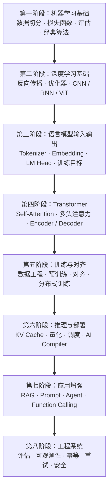
```mermaid
flowchart TB
    A["第一阶段：机器学习基础<br/>数据切分 · 损失函数 · 评估 · 经典算法"]
    B["第二阶段：深度学习基础<br/>反向传播 · 优化器 · CNN / RNN / ViT"]
    C["第三阶段：语言模型输入输出<br/>Tokenizer · Embedding · LM Head · 训练目标"]
    D["第四阶段：Transformer<br/>Self-Attention · 多头注意力 · Encoder / Decoder"]
    E["第五阶段：训练与对齐<br/>数据工程 · 预训练 · 对齐 · 分布式训练"]
    F["第六阶段：推理与部署<br/>KV Cache · 量化 · 调度 · AI Compiler"]
    G["第七阶段：应用增强<br/>RAG · Prompt · Agent · Function Calling"]
    H["第八阶段：工程系统<br/>评估 · 可观测性 · 幂等 · 重试 · 安全"]

    A ==> B ==> C ==> D ==> E ==> F ==> G ==> H
```


# 2. 机器学习基础

## 2.1 什么是机器学习

机器学习的目标是：

> 从数据中学习一个函数，使它能够对未见过的输入做出合理预测。

可以写成：

$$
\hat{y}=f_{\theta}(x)
$$

其中：

- $x$：输入特征；
- $y$：真实目标；
- $\hat{y}$：模型预测；
- $f_{\theta}$：由参数 $\theta$ 决定的模型。

训练过程本质上是在寻找一组参数，使预测结果尽可能接近真实结果。

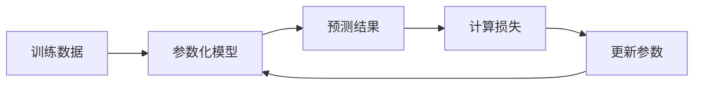
```mermaid
flowchart LR
    X[训练数据] --> M[参数化模型]
    M --> P[预测结果]
    P --> L[计算损失]
    L --> U[更新参数]
    U --> M
```

---

## 2.2 监督学习、无监督学习与自监督学习

### 监督学习

监督学习的数据包含明确标签：

```text
输入 x + 标签 y
→ 学习 x 到 y 的映射
```

常见任务：

- 分类：预测离散类别；
- 回归：预测连续数值；
- 排序：预测对象之间的相对顺序。

示例：

```text
邮件内容 → 是否为垃圾邮件
房屋特征 → 房屋价格
用户与商品 → 点击概率
```

### 无监督学习

无监督学习没有人工标签，目标是发现数据中的结构。

常见任务：

- 聚类；
- 降维；
- 异常检测；
- 密度估计。

### 自监督学习

自监督学习从原始数据本身构造训练目标。

例如语言模型的下一个 Token 预测：

```text
输入：机器学习正在改变
目标：软件
```

标签“软件”直接来自原始文本，不需要人工逐条标注。

大模型预训练主要属于自监督学习。

---

## 2.3 分类、回归、聚类与排序

| 任务 | 输出形式 | 示例 |
|---|---|---|
| 分类 | 离散类别 | 正常/异常、正面/负面 |
| 回归 | 连续数值 | 价格、时长、需求量 |
| 聚类 | 样本分组 | 用户分群、文档聚类 |
| 排序 | 相对顺序 | 搜索结果排序、候选重排 |
| 生成 | 序列 | 文本、代码、结构化结果 |

分类与回归属于典型监督学习；聚类通常属于无监督学习；文本生成则通常使用深度学习序列模型。

---

## 2.4 特征、标签、样本与参数

### 样本

一条完整训练记录。

### 特征

模型用于预测的信息。例如预测房价时：

```text
面积、楼层、位置、房龄
```

### 标签

模型要预测的真实结果。例如：

```text
实际成交价
```

### 参数

模型在训练过程中学习的数值。

### 超参数

训练前人为指定的配置，例如：

- 学习率；
- Batch Size；
- 模型层数；
- 正则化系数；
- 树的深度；
- LoRA Rank。

参数由训练数据学习，超参数由实验和验证集选择。

---

## 2.5 训练集、验证集与测试集

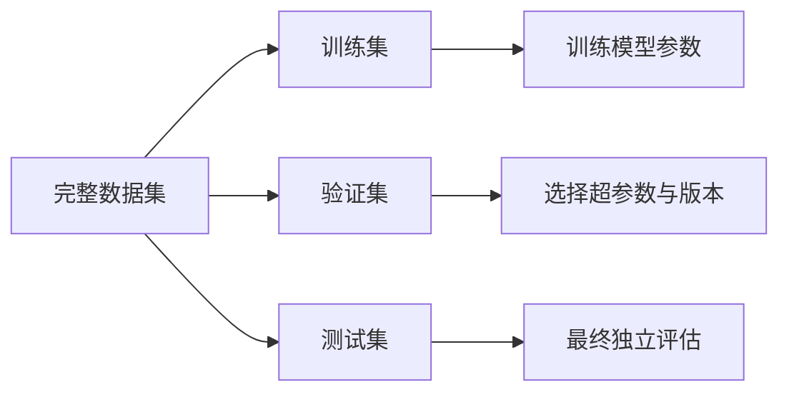
```mermaid
flowchart LR
    D[完整数据集] --> T[训练集]
    D --> V[验证集]
    D --> S[测试集]

    T --> M[训练模型参数]
    V --> H[选择超参数与版本]
    S --> E[最终独立评估]
```

### 训练集

用于计算梯度和更新模型参数。

### 验证集

用于：

- 调整超参数；
- 选择模型版本；
- Early Stopping；
- 比较不同方案。

### 测试集

只用于最终评估，不应参与调参。

常见错误是反复根据测试集修改模型，这会让测试集逐渐变成“隐形验证集”，导致最终指标失真。

### 交叉验证

交叉验证是在训练数据上反复改变训练子集与验证子集，观察模型在多个切分上的表现。数据较少时，一次随机切分可能碰巧很容易或很困难，多次切分能够估计结果对数据划分的敏感程度，也能帮助比较模型和超参数。最常见的 K 折交叉验证将数据分成 K 份，每次用一份验证、其余 K−1 份训练，最后汇总 K 次结果：

$$
\overline{m}=\frac{1}{K}\sum_{i=1}^{K}m_i
$$

除了均值，还应报告各折的标准差。类别不平衡时使用分层 K 折，让每一折保持近似类别比例；时间序列则必须按时间向前验证，不能随机打乱未来数据。

交叉验证不是额外的测试集。模型选择完成后，仍应使用从未参与训练与选择的测试集做一次最终评估。深度学习数据量很大、训练成本很高时，通常使用固定验证集而不是完整 K 折。

### Early Stopping

Early Stopping 根据验证集指标决定何时停止训练，并保留验证效果最好的参数。训练损失可能继续下降，而验证指标已经开始恶化；继续训练会浪费计算并加重过拟合。

实现时需要选择监控指标、改善方向和 `patience`。如果指标连续若干轮没有超过历史最佳值，就停止并恢复最佳 Checkpoint；指标的最小改善量通常称为 `min_delta`。它不是训练损失一上升就立即停止，也不是学习率调度器：调度器改变更新步长，Early Stopping 决定是否结束训练，二者可以同时使用。

---

## 2.6 数据预处理

常见预处理包括：

- 缺失值处理；
- 异常值检测；
- 数值归一化；
- 类别特征编码；
- 文本清洗；
- 样本去重；
- 数据切分；
- 时间顺序保护。

### 标准化

$$
z=\frac{x-\mu}{\sigma}
$$

其中：

- $\mu$：均值；
- $\sigma$：标准差。

标准化后的特征通常均值接近 0、标准差接近 1。

### 归一化

将数值缩放到固定区间，例如 $[0,1]$：

$$
x'=\frac{x-x_{\min}}{x_{\max}-x_{\min}}
$$

注意：

> 均值、方差、最大值和最小值只能从训练集统计，再应用到验证集和测试集。

否则会产生数据泄漏。

---

## 2.7 损失函数

损失函数用于衡量模型预测与真实目标之间的差距。

训练目标通常写为：

$$
\theta^{*}
=
\arg\min_{\theta}
\mathcal{L}(\theta)
$$

### 均方误差

MSE（Mean Squared Error，均方误差）常用于回归：

$$
\mathrm{MSE}
=
\frac{1}{N}
\sum_{i=1}^{N}
\left(y_i-\hat{y}_i\right)^2
$$

误差被平方后，大误差受到更强惩罚。

### 二元交叉熵

用于二分类：

$$
\mathcal{L}
=
-\frac{1}{N}
\sum_{i=1}^{N}
\left[
y_i\log p_i
+
(1-y_i)\log(1-p_i)
\right]
$$

其中 $p_i$ 是样本属于正类的预测概率。

### 多分类交叉熵

用于单标签多分类任务。对于第 \(i\) 个样本，其交叉熵损失为：

\[
\ell_i
=
-\sum_{c=1}^{C}
y_{i,c}\log p_{i,c}
\]

对 \(N\) 个样本取平均，得到：

\[
\mathcal L_{\mathrm{CE}}
=
-\frac{1}{N}
\sum_{i=1}^{N}
\sum_{c=1}^{C}
y_{i,c}\log p_{i,c}
\]

其中，\(C\) 是类别数量，\(y_{i,c}\) 表示第 \(i\) 个样本在第
\(c\) 个类别上的真实标签，\(p_{i,c}\) 表示模型预测第 \(i\) 个样本
属于第 \(c\) 类的概率。

对于 one-hot 标签，单个样本的损失可简化为：

\[
\ell_i=-\log p_{i,t_i}
\]

其中 \(t_i\) 是第 \(i\) 个样本的真实类别。模型分配给真实类别的
概率越低，损失越大。

---

## 2.8 梯度下降

梯度表示损失函数增长最快的方向，因此参数需要沿梯度反方向更新：

$$
\theta
\leftarrow
\theta
-
\eta\nabla_{\theta}\mathcal{L}
$$

其中：

- $\eta$：学习率；
- $\nabla_{\theta}\mathcal{L}$：损失对参数的梯度。


```mermaid
flowchart LR
    A[前向计算预测] --> B[计算损失]
    B --> C[反向计算梯度]
    C --> D[优化器更新参数]
    D --> A
```

学习率太大可能导致震荡或发散；太小则会导致收敛缓慢。

---

## 2.9 Batch、Step 与 Epoch

### Batch

一次训练迭代中送入模型的一组样本。单卡实际一次前向传播和反向传播所处理的一组样本，也称为 Micro Batch。

### Step

Step 在不同语境中含义可能不同：

- Micro Step：完成一个 Micro Batch 的前向传播和反向传播；
- Optimizer Step：优化器执行一次参数更新。

不使用梯度累积时，一个 Micro Step 通常对应一个 Optimizer Step；
使用梯度累积时，多个 Micro Step 才对应一个 Optimizer Step。

### Epoch

将整个训练集完整遍历一次。

若训练集包含 \(N\) 个样本，有效全局批量大小为
\(B_{\mathrm{global}}\)，则每个 Epoch 的参数更新次数约为：

\[
\text{Optimizer Steps per Epoch}
=
\left\lceil
\frac{N}{B_{\mathrm{global}}}
\right\rceil
\]

使用数据并行和梯度累积时：

\[
B_{\mathrm{global}}
=
B_{\mathrm{micro}}
\times
K_{\mathrm{acc}}
\times
D
\]

其中，\(B_{\mathrm{micro}}\) 是每个设备一次处理的样本数，
\(K_{\mathrm{acc}}\) 是梯度累积次数，\(D\) 是数据并行设备数。

---

## 2.10 过拟合与欠拟合

模型在未见数据上的误差可以直观拆成偏差、方差和不可约噪声。偏差是模型假设过强造成的系统性误差，偏差高时连训练规律也表达不了，常表现为欠拟合；方差是模型对训练样本变化的敏感程度，方差高时换一批样本结果就大幅波动，常表现为过拟合。

两种问题都可能让验证集变差，但处理方式相反，因此要同时比较训练误差、验证误差以及不同数据切分下的波动。模型更复杂通常降低偏差、提高方差，但这并非绝对单调，数据规模和正则化也会改变平衡点。

### 欠拟合

表现为：

- 训练集效果差；
- 验证集效果也差；
- 模型没有学到足够规律。

可能原因：

- 模型过于简单；
- 特征不足；
- 训练轮数不足；
- 学习率设置不合理。

### 过拟合

表现为：

- 训练集效果很好；
- 验证集明显变差；
- 模型记住了训练数据细节。

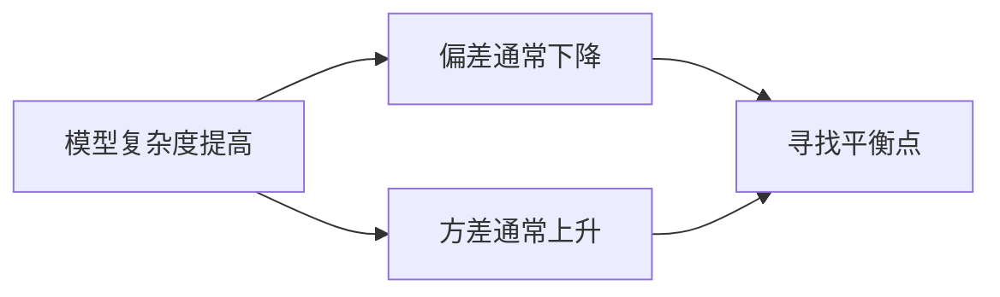
```mermaid
flowchart LR
    A[模型复杂度提高] --> B[偏差通常下降]
    A --> C[方差通常上升]
    B --> D[寻找平衡点]
    C --> D
```

### 常见缓解方法

- 增加高质量数据；
- 数据增强；
- L1、L2 正则化；
- Dropout；
- Early Stopping；
- 降低模型容量；
- 清理重复样本。

---

## 2.11 L1 与 L2 正则化

### L1 正则化

$$
\mathcal{L}'
=
\mathcal{L}
+
\lambda\sum_i|w_i|
$$

特点：

- 倾向让部分权重变为 0；
- 可以形成稀疏模型；
- 可辅助特征选择。

### L2 正则化

$$
\mathcal{L}'
=
\mathcal{L}
+
\lambda\sum_i w_i^2
$$

特点：

- 抑制权重过大；
- 通常让参数分布更平滑；
- 常用于缓解过拟合。

---

## 2.12 混淆矩阵

二分类结果可以写为：

| 实际\预测 | 正类 | 负类 |
|---|---:|---:|
| 正类 | TP | FN |
| 负类 | FP | TN |

- TP：True Positive，真正例；
- FP：False Positive，假正例；
- FN：False Negative，假负例；
- TN：True Negative，真负例。

> 第一个 T/F 表示模型预测是否正确；第二个 P/N 表示模型预测成了正类还是负类。

---

## 2.13 分类与回归评估指标

### Accuracy

$$
\mathrm{Accuracy}
=
\frac{TP+TN}{TP+TN+FP+FN}
$$

表示全部样本中预测正确的比例。

### Precision

$$
\mathrm{Precision}
=
\frac{TP}{TP+FP}
$$

表示：

> 被预测为正类的样本中，有多少是真的正类。

适合误报代价高的场景。

### Recall

$$
\mathrm{Recall}
=
\frac{TP}{TP+FN}
$$

表示：

> 所有真实正类中，有多少被模型发现。

适合漏报代价高的场景。

### F1 Score

$$
F1
=
\frac{2PR}{P+R}
$$

F1 是 Precision 和 Recall 的调和平均。

### 回归指标

回归任务不能使用分类混淆矩阵。常见指标分别回答不同问题。

#### MAE

MAE 是绝对误差的平均值：

$$
\mathrm{MAE}=\frac{1}{n}\sum_{i=1}^{n}|y_i-\hat y_i|
$$

它与目标值单位相同，容易解释，并且不像平方误差那样强烈放大少量异常点。每个样本按误差绝对值线性计分。MAE 更稳健不等于完全不受异常点影响，其零点处也不可导，训练时需要使用次梯度或平滑近似。

#### RMSE

RMSE 是均方误差开平方：

$$
\mathrm{RMSE}=\sqrt{\frac{1}{n}\sum_{i=1}^{n}(y_i-\hat y_i)^2}
$$

它保留原目标单位，同时通过先平方、求平均再开方，对大误差给予更高惩罚。RMSE 通常不小于 MAE，但两者数值不能脱离数据尺度跨任务比较。

#### $R^2$

$R^2$ 衡量模型相对“始终预测样本均值”减少了多少平方误差：

$$
R^2=1-\frac{\sum_i(y_i-\hat y_i)^2}{\sum_i(y_i-\bar y)^2}
$$

它通过比较模型残差与均值基线，提供无量纲的相对解释度。$R^2$ 可以小于 0，值高也不证明因果关系，更不能代替残差分析。

---

## 2.14 类别不平衡

假设 10,000 个样本中只有 10 个正类。

如果模型全部预测为负类：

```text
Accuracy = 99.9%
Recall = 0
```

所以类别不平衡时，Accuracy 可能具有误导性。

更应关注：

- Precision；
- Recall；
- F1；
- PR-AUC；
- 分类别指标；
- 业务错误成本。

PR-AUC 是 Area Under the Precision-Recall Curve，即精确率—召回率曲线下面积。它将在 ROC 之后结合阈值和概率校准统一解释。

---

## 2.15 ROC 与 AUC

ROC（Receiver Operating Characteristic）曲线用于描述：

> **当分类阈值不断变化时，模型的真正率（TPR）与假正率（FPR）如何变化。**

其中：

- 横轴：FPR（False Positive Rate，假正率）；
- 纵轴：TPR（True Positive Rate，真正率）。

公式分别为：

$$
\mathrm{TPR}
=
\frac{TP}{TP+FN}
$$

$$
\mathrm{FPR}
=
\frac{FP}{FP+TN}
$$

---

### 为什么会形成一条曲线

很多二分类模型输出的不是“最终类别”，而是一个属于正类的概率分数，例如：

```text
样本 A：0.95
样本 B：0.80
样本 C：0.62
样本 D：0.40
样本 E：0.15
```

当我们设置不同阈值时，预测结果会变化：

* 阈值很高：只有分数特别高的样本才会被判为正类；
* 阈值降低：更多样本会被判为正类；
* 因此，TPR 和 FPR 会同时发生变化。

把不同阈值下得到的 $(FPR, TPR)$ 点连起来，就得到 ROC 曲线。

---

### 一个简单例子

假设某个二分类模型在不同阈值下得到如下结果：

|  阈值 |  TPR |  FPR |
| --: | ---: | ---: |
| 0.9 | 0.20 | 0.00 |
| 0.7 | 0.50 | 0.10 |
| 0.5 | 0.75 | 0.20 |
| 0.3 | 0.90 | 0.40 |
| 0.1 | 1.00 | 1.00 |

这些点可以画成 ROC 曲线。

```mermaid
xychart-beta
    title "ROC 曲线示意图"
    x-axis "FPR" [0.0, 0.1, 0.2, 0.4, 1.0]
    y-axis "TPR" 0 --> 1
    line [0.20, 0.50, 0.75, 0.90, 1.00]
```

从直观上看：

* 曲线越靠近**左上角**，表示模型越好；
* 如果曲线接近对角线，说明模型区分正负样本的能力较弱。

---

### 对角线代表什么

随机猜测的分类器，其 ROC 曲线大致接近对角线：

$$
TPR = FPR
$$

这意味着：

> 模型把正样本判为正类的能力，并不比随机猜测强多少。

因此：

* **优于对角线**：说明模型有一定区分能力；
* **越远离对角线并靠近左上角**：说明模型越好。

---

### AUC 是什么

AUC（Area Under the Curve，ROC 曲线下面积）用于衡量模型整体排序能力。

取值范围通常在：

$$
0 \le AUC \le 1
$$

一般可以这样理解：

* AUC = 1：模型排序完全正确；
* AUC = 0.5：模型接近随机猜测；
* AUC 越大：模型整体上越倾向于给正样本更高分。

AUC 的一个常见直观解释是：

> 随机取一个正样本和一个负样本，模型把正样本打分高于负样本的概率。

---

### 如何理解 AUC 高

AUC 高，说明模型的**整体排序能力较强**，也就是：

* 正样本整体得分更高；
* 负样本整体得分更低；
* 通过调整阈值，通常更容易找到一个较合适的分类点。

但要注意：

> **AUC 高，不代表某个固定阈值下的 Precision、Recall 或业务效果一定好。**

因为实际系统通常最终还要选一个具体阈值，这时还需要结合：

* Precision（精确率）；
* Recall（召回率）；
* F1；
* 概率校准；
* 误报与漏报的业务成本。

例如：

* 医疗筛查中，通常更关注 Recall；
* 风控拦截中，往往要平衡 Recall 与误报率；
* 推荐或排序系统中，AUC 更常用于衡量整体排序质量。

### 总结

- ROC：看不同阈值下，TPR 和 FPR 如何变化；
- AUC：看这条 ROC 曲线下面积有多大，用于衡量模型整体排序能力。


## 2.16 PR 曲线、阈值与概率校准

### PR 曲线与 PR-AUC

PR 曲线以 Recall 为横轴、Precision 为纵轴，展示分类阈值变化时二者的取舍；PR-AUC 概括整条曲线的面积。正类非常少时，大量真负例会让 ROC 的 FPR 看起来很小，而 Precision 会直接暴露误报对正类结果的稀释，因此 PR 曲线往往更有辨别力。

构造曲线时，将预测分数从高到低依次作为阈值，每降低一次阈值就纳入更多正类预测，并重新计算 Precision 与 Recall。ROC-AUC、PR-AUC 都衡量排序而不是某个固定阈值的业务效果；不同数据集正类比例不同，PR-AUC 的基线也不同，不能直接横向比较。

### 阈值选择

阈值把连续分数转换为离散决策，例如 $p\ge 0.7$ 时拦截。即使模型的排序能力相同，阈值不同也会产生完全不同的误报、漏报与资源成本。

阈值应在验证集上根据 F1、目标 Recall、允许的 FPR，或显式成本函数选择，并在数据分布变化后重新评估。`0.5` 不是天然正确的阈值；阈值只改变决策点，不会修复排序能力差或概率不可信的问题。

### 概率校准

如果所有预测概率约为 0.8 的样本中，长期大约有 80% 真为正类，就称模型在这一范围内校准良好。风险定价、资源分配和多级决策需要这种可信概率，而不只是正确排序。

可靠性图把预测概率分桶，比较每桶平均置信度与真实正类比例；Brier Score 计算预测概率与 0/1 标签之间的均方误差；Expected Calibration Error 再对各桶的置信度—正确率差距做加权平均。分桶指标会受桶数与样本量影响，因此最好同时观察图和数值。

在独立校准集上，Platt Scaling 用逻辑回归映射原分数，Isotonic Regression 学习单调但非参数的映射，Temperature Scaling 则用一个标量缩放 Logits。它们只调整概率解释，不重新训练排序特征。校准好不代表分类准确率高，AUC 高也不代表概率已校准；这里的概率校准与 INT8 量化中的数值校准不是同一件事。


## 2.17 Macro 与 Micro

### Macro

分别计算每个类别的指标，再取平均。

特点：

- 每个类别权重相同；
- 更关注少数类别。

### Micro

先汇总所有类别的 TP、FP、FN，再统一计算。

特点：

- 样本多的类别影响更大；
- 更接近整体样本表现。

---

## 2.18 常见机器学习算法

机器学习算法可按照任务类型划分为：

* **监督学习**：训练数据包含标签，典型任务是分类和回归；
* **无监督学习**：训练数据没有标签，典型任务是聚类和降维。

| 算法      | 学习类型  | 主要任务  | 核心思想            |
| ------- | ----- | ----- | --------------- |
| 线性回归    | 监督学习  | 回归    | 用线性函数拟合连续目标值    |
| 逻辑回归    | 监督学习  | 分类    | 对线性模型输出进行概率映射   |
| 决策树     | 监督学习  | 分类、回归 | 通过特征条件递归划分样本    |
| 随机森林    | 监督学习  | 分类、回归 | 多棵随机决策树进行集成     |
| GBDT    | 监督学习  | 分类、回归 | 后一棵树逐步修正前面的误差   |
| XGBoost | 监督学习  | 分类、回归 | 带正则化和工程优化的梯度提升树 |
| SVM     | 监督学习  | 分类、回归 | 寻找最大间隔决策边界      |
| KNN     | 监督学习  | 分类、回归 | 根据距离最近的训练样本进行预测 |
| K-Means | 无监督学习 | 聚类    | 最小化样本到所属聚类中心的距离 |
| PCA     | 无监督学习 | 降维    | 寻找保留数据方差最多的投影方向 |

### 线性回归

线性回归使用特征的线性组合预测连续目标值：

$$
\hat y=\boldsymbol w^\mathrm T\boldsymbol x+b
$$

训练时通常最小化均方误差：

$$
\mathcal L_{\mathrm{MSE}}
=
\frac{1}{N}
\sum_{i=1}^{N}
(y_i-\hat y_i)^2
$$

线性回归结构简单、训练速度快，并且可以直接观察每个特征对应的权重，解释性较强。

它主要适合特征与目标值之间近似存在线性关系的场景。普通线性回归容易受到异常值、多重共线性和非线性关系的影响。

常见扩展包括：

* Ridge 回归：使用 $L_2$ 正则化，抑制参数过大；
* Lasso 回归：使用 $L_1$ 正则化，可以将部分参数压缩为 0；
* Elastic Net：同时使用 $L_1$ 和 $L_2$ 正则化。

Elastic Net 在特征选择能力与相关特征下的稳定性之间折中：$L_1$ 倾向产生稀疏权重，$L_2$ 倾向让一组相关特征共同保留。它不是把 Ridge 和 Lasso 两个模型的预测做集成，而是在同一个目标函数中同时加入两种惩罚，两个正则系数都应通过验证集选择。

---

### 逻辑回归

逻辑回归虽然名称中包含“回归”，但主要用于分类。

对于二分类，首先计算线性得分：

$$
z=\boldsymbol w^\mathrm T\boldsymbol x+b
$$

再通过 Sigmoid 函数转换为正类概率：

$$
p=\sigma(z)=\frac{1}{1+e^{-z}}
$$

通常使用二元交叉熵训练：

$$
\mathcal L
=
-\frac{1}{N}
\sum_{i=1}^{N}
\left[
y_i\log p_i+
(1-y_i)\log(1-p_i)
\right]
$$

逻辑回归具有以下特点：

* 输出可以解释为概率；
* 训练速度快，参数可解释；
* 在原始特征空间中形成线性决策边界；
* 对特征尺度和强相关特征比较敏感；
* 难以直接表达复杂的非线性关系。

多分类逻辑回归通常使用 Softmax 输出各类别概率。

---

### 决策树

决策树通过不断选择特征和划分条件，将样本递归地分到不同子节点。

例如：

```text
年龄 < 30？
├── 是：收入 < 8000？
│   ├── 是：类别 A
│   └── 否：类别 B
└── 否：类别 C
```

分类树常使用以下指标选择划分：

* 基尼不纯度；
* 信息熵；
* 信息增益。

基尼不纯度和信息熵都衡量节点中的类别混杂程度。设类别比例为 $p_k$：

$$
\mathrm{Gini}(D)=1-\sum_k p_k^2,
\qquad
H(D)=-\sum_k p_k\log_2 p_k
$$

节点全属于同一类别时二者都为 0。信息增益衡量划分前后的熵下降：

$$
\mathrm{Gain}(D,A)
=
H(D)-\sum_{v}\frac{|D_v|}{|D|}H(D_v)
$$

树需要在大量候选特征和阈值中选出能让子节点更“纯”的划分。做法是计算父节点不纯度减去各子节点的加权不纯度，并选择下降最多的候选。基尼系数、基尼不纯度不是同一个统计量；信息增益容易偏爱取值很多的离散特征，信息增益率会额外除以划分自身的信息量。

回归树通常选择能够最大程度降低均方误差的划分。

决策树的优点是：

* 规则容易理解和可视化；
* 可以表达非线性关系和特征交互；
* 通常不要求对特征进行标准化；
* 可以同时处理连续特征和离散特征。

主要问题是容易过拟合，对训练数据的小变化也可能比较敏感。

关键参数包括：

* `max_depth`：树的最大深度；
* `min_samples_split`：节点继续划分所需的最少样本数；
* `min_samples_leaf`：叶节点的最少样本数；
* `max_features`：每次划分考虑的特征数量。

---

### 随机森林

随机森林是多棵决策树构成的集成模型，采用 **Bagging** 思想，并行训练，多模型投票。

> Bagging 全称是 Bootstrap Aggregating，即“自助采样聚合”。

每棵树通常在以下两个方面引入随机性：

1. 从训练集中有放回地抽取一部分样本；
2. 每次节点划分时，只从随机选择的一部分特征中寻找最佳划分。

分类任务通过多数投票产生结果，回归任务通常对多棵树的输出取平均：

$$
\hat y
=
\frac{1}{T}
\sum_{t=1}^{T}
\hat y^{(t)}
$$

随机森林通过多棵差异化决策树的集成降低方差，因此通常比单棵决策树更加稳定，不容易过拟合。

它的主要特点是：

* 可以表达复杂的非线性关系；
* 一般不需要特征标准化；
* 对异常值和噪声具有一定鲁棒性；
* 多棵树可以并行训练；
* 模型体积较大，可解释性弱于单棵树。

关键参数包括树的数量、最大深度、每次划分使用的特征数和叶节点最小样本数。

---

### GBDT

GBDT 是 **Gradient Boosting Decision Tree，梯度提升决策树**。

> Boosting：串行训练，后一个模型修正前一个模型。

与随机森林独立训练多棵树不同，GBDT 中的树是按顺序训练的：

```text
第一棵树给出初步预测
        ↓
计算当前预测误差
        ↓
第二棵树拟合前一轮误差
        ↓
继续增加树，逐步修正预测
```

模型可以表示为多棵弱学习器的加法：

$$
F_M(x)
=
F_0(x)+
\sum_{m=1}^{M}
\eta f_m(x)
$$

其中：

* $f_m(x)$ 是第 $m$ 棵树；
* $\eta$ 是学习率；
* $M$ 是树的数量。

更准确地说，每一棵树拟合的是当前损失函数对预测结果的**负梯度**。在平方误差下，负梯度正好对应预测残差。

GBDT 通常具有较强的非线性拟合能力，但树与树之间存在依赖关系，难以像随机森林一样完全并行训练。

关键参数包括：

* `n_estimators`：树的数量；
* `learning_rate`：每棵树的贡献大小；
* `max_depth`：单棵树的最大深度；
* `subsample`：每棵树使用的样本比例。

一般来说，较小的学习率需要配合更多的树。

---

### XGBoost

XGBoost 是 **eXtreme Gradient Boosting，极端梯度提升**。它不是与 GBDT 完全不同的算法，而是对梯度提升树进行了数学和工程上的强化。

主要改进包括：

* 使用损失函数的一阶和二阶导数；
* 对叶节点权重和叶节点数量加入正则化；
* 支持样本采样和特征采样；
* 能够自动处理缺失值的默认分裂方向；
* 对数据存储、并行计算和分裂搜索进行了优化；
* 支持提前停止，避免训练过度。

其目标函数通常由训练损失和模型复杂度组成：

$$
\mathcal L
=
\sum_{i=1}^{N}
l(y_i,\hat y_i)
+
\sum_{t=1}^{T}
\Omega(f_t)
$$

其中，$\Omega(f_t)$ 用来惩罚过于复杂的树。

加入第 $t$ 棵树时，XGBoost 在当前预测附近对损失做二阶泰勒展开。对样本 $i$，记一阶导数为 $g_i$、二阶导数为 $h_i$；落入同一叶节点 $j$ 的样本集合为 $I_j$，则带 $L_2$ 正则的最优叶权重为：

$$
w_j^*=-\frac{\sum_{i\in I_j}g_i}{\sum_{i\in I_j}h_i+\lambda}
$$

候选分裂的 Gain 比较分裂前后左右子节点的近似目标下降，并扣除新增叶节点的复杂度惩罚。二阶信息让算法估计“沿这个方向走多远”而不只知道梯度方向，但它仍属于逐轮加树的 Boosting，不是一次训练所有树。

XGBoost 对结构化表格数据通常具有较强表现，但参数较多，调参不当时也可能过拟合。

常见参数包括：

* `learning_rate`；
* `n_estimators`；
* `max_depth`；
* `min_child_weight`；
* `subsample`；
* `colsample_bytree`；
* `reg_alpha` 和 `reg_lambda`。

---

### 随机森林、GBDT 与 XGBoost 的区别

| 对比项   | 随机森林    | GBDT     | XGBoost      |
| ----- | ------- | -------- | ------------ |
| 集成方式  | Bagging | Boosting | Boosting     |
| 树之间关系 | 相互独立    | 顺序依赖     | 顺序依赖         |
| 主要作用  | 降低方差    | 逐步降低偏差   | 提升精度并控制复杂度   |
| 并行能力  | 较强      | 较弱       | 对内部计算进行了并行优化 |
| 正则化   | 相对简单    | 相对简单     | 支持较完整的正则化    |
| 参数数量  | 较少      | 中等       | 较多           |
| 过拟合风险 | 相对较低    | 需要控制     | 需要仔细调参       |

可以简单记为：

```text
随机森林：多棵树分别训练，再综合结果
GBDT：后一棵树修正前面模型的错误
XGBoost：经过正则化和工程优化的梯度提升树
```

---

### SVM

SVM 是 **Support Vector Machine，支持向量机**。

在线性可分的二分类问题中，SVM 希望找到一个决策超平面：

$$
\boldsymbol w^\mathrm T\boldsymbol x+b=0
$$

它不仅要求正确分类，还希望该超平面与两侧最近样本之间的间隔最大。

距离决策边界最近、真正决定边界位置的样本称为**支持向量**。

当数据线性不可分时，可以使用核函数，将数据隐式映射到更高维空间。常见核函数包括：

* 线性核；
* 多项式核；
* RBF 高斯核。

软间隔 SVM 允许少量样本违反间隔，用 Hinge Loss 平衡大间隔与训练错误：

$$
\min_{w,b}
\frac{1}{2}\lVert w\rVert^2
+C\sum_i\max\left(0,1-y_i(w^Tx_i+b)\right)
$$

$C$ 越大，对违反间隔的惩罚越强，边界会更努力拟合训练样本；$C$ 较小则允许更多违反以换取更宽间隔。最大间隔不是要求所有点离边界都尽可能远，真正影响解的主要是支持向量。

Kernel Trick 不需要显式构造高维特征 $\phi(x)$，而是直接计算 $K(x_i,x_j)=\phi(x_i)^T\phi(x_j)$。RBF 的尺度参数决定单个样本影响范围，过大可能形成过于曲折的边界，过小则接近欠拟合。核函数不是任意相似度函数，还要满足相应的正定条件；核 SVM 也需要保存和比较大量样本，不能因为“隐式映射”就获得免费的大规模计算。

SVM 的特点是：

* 在中小规模、高维数据上效果较好；
* 能通过核函数表达非线性边界；
* 对特征尺度敏感，通常需要标准化；
* 对参数 $C$ 和核函数参数比较敏感；
* 训练复杂度较高，不适合特别大的样本集。

用于回归时称为 SVR，即 Support Vector Regression。

---

### KNN

KNN 是 **K-Nearest Neighbors，K 近邻算法**。

预测一个新样本时，算法首先在训练集中找到距离它最近的 $K$ 个样本。

分类任务通常使用多数投票：

$$
\hat y
=
\operatorname{mode}
{y_j\mid x_j\in N_K(x)}
$$

回归任务通常对邻居目标值取平均：

$$
\hat y
=
\frac{1}{K}
\sum_{x_j\in N_K(x)}
y_j
$$

KNN 在训练阶段几乎不进行参数学习，因此也被称为**惰性学习算法**。它的主要计算发生在预测阶段。

特点包括：

* 原理简单，不需要显式训练复杂模型；
* 可以表达非线性分类边界；
* 对特征尺度非常敏感，通常需要标准化；
* 预测时需要计算大量距离，速度可能较慢；
* 在高维空间中容易受到“维度灾难”影响；
* 对 $K$ 值和距离度量比较敏感。

$K$ 太小容易受噪声影响，$K$ 太大则可能使局部结构被过度平滑。

---

### K-Means

K-Means 是一种无监督聚类算法，需要预先指定聚类数量 $K$。

其目标是最小化每个样本到所属聚类中心的平方距离：

$$
\min
\sum_{k=1}^{K}
\sum_{x_i\in C_k}
\left\lVert
x_i-\boldsymbol\mu_k
\right\rVert_2^2
$$

算法通常迭代执行两个步骤：

```text
初始化 K 个聚类中心
        ↓
将每个样本分配给最近的中心
        ↓
重新计算每个簇的均值作为新中心
        ↓
重复直到中心基本不再变化
```

K-Means 的特点包括：

* 算法简单，计算速度较快；
* 适合近似球形、大小相近的簇；
* 对初始聚类中心比较敏感；
* 对异常值敏感；
* 需要提前指定 $K$；
* 对特征尺度敏感，通常需要标准化；
* 不适合形状复杂、密度差异很大的聚类结构。

K-Means++ 可以改善聚类中心的初始化，核心思想是已经选择了一个中心后，后续中心应优先从距离现有中心较远的样本中选择。

---

### PCA

PCA 是 **Principal Component Analysis，主成分分析**，属于无监督线性降维算法。

它寻找一组新的正交方向，使投影后的数据方差依次最大：

```text
原始特征
    ↓ 线性组合
第一主成分：保留方差最多
第二主成分：与第一主成分正交，保留剩余方差最多
第三主成分：继续保留剩余方差
```

设原始数据有 $d$ 个特征，可以选择前 $k$ 个主成分，将数据从 $d$ 维压缩到 $k$ 维。

PCA 通常先对每个特征减去均值，再通过协方差矩阵的特征值分解或对中心化数据进行奇异值分解实现。特征值越大，表示对应主成分保留的数据方差越多。

对协方差矩阵 $C$ 求 $Cq_i=\lambda_iq_i$，方向 $q_i$ 是主成分，特征值 $\lambda_i$ 是该方向上的方差。这种分解把相关的原始坐标旋转为相互正交、按方差排序的新坐标。

SVD 则直接分解中心化数据矩阵 $X$：

$$
X=U\Sigma V^T
$$

$V$ 的列给出主成分方向，奇异值平方与对应方差成正比。数值实现通常不必显式构造 $X^TX$，从而避免放大条件数。

PCA 是降维目标，特征值分解和 SVD 是实现它的线性代数工具；SVD 本身还能用于低秩近似、伪逆等许多其他任务。

PCA 的主要作用包括：

* 降低特征维度；
* 去除特征之间的线性冗余；
* 缓解多重共线性；
* 降低后续模型的计算成本；
* 将高维数据投影到二维或三维进行可视化。

需要注意：

* PCA 只考虑方差，不使用标签信息；
* 主成分是原始特征的线性组合，可解释性可能下降；
* 对特征尺度敏感，通常应先进行标准化；
* PCA 只能描述线性结构；
* 方差较小的方向不一定对分类任务不重要。

---

### 特征缩放要求

| 算法           | 通常是否需要标准化 | 原因                 |
| ------------ | --------- | ------------------ |
| 线性回归         | 视情况而定     | 正则化或特征量纲差异较大时建议标准化 |
| 逻辑回归         | 建议        | 有利于优化和正则化          |
| 决策树          | 通常不需要     | 按特征阈值划分，不依赖距离      |
| 随机森林         | 通常不需要     | 基学习器是决策树           |
| GBDT/XGBoost | 通常不需要     | 基学习器通常是决策树         |
| SVM          | 通常需要      | 间隔和核函数依赖特征尺度       |
| KNN          | 通常需要      | 直接使用样本距离           |
| K-Means      | 通常需要      | 直接使用样本到中心的距离       |
| PCA          | 通常需要      | 方差大小会受到量纲影响        |


---

## 2.19 数据泄漏

数据泄漏是指训练或评估过程中使用了本不应提前知道的信息。

常见情况：

- 使用测试集调参；
- 标准化时使用全量数据统计量；
- 时间序列随机切分，使未来数据进入训练集；
- 特征直接包含标签信息；
- 同一用户的高度相似样本同时出现在训练集和测试集；
- 重复文档跨数据集分布。

数据泄漏会让离线指标异常高，但实际效果明显下降。

---

# 3. 深度学习基础

## 3.1 神经元与线性变换

一个最基本的神经元可以写为：

$$
z=\mathbf{w}^{\mathsf T}\mathbf{x}+b
$$

再经过激活函数：

$$
y=\sigma(z)
$$

其中：

- $\mathbf{x}$：输入向量；
- $\mathbf{w}$：权重；
- $b$：偏置；
- $\sigma$：激活函数。

多层神经网络通过重复执行“线性变换 + 非线性激活”来表达复杂函数。

---

## 3.2 为什么需要激活函数

如果每一层都只有线性变换，那么多层线性变换仍然等价于一层线性变换：

$$
W_2(W_1x)=W'x
$$

加入非线性激活后，网络才能表示复杂的非线性关系。

常见激活函数：

### ReLU

Rectified Linear Unit，修正线性单元：

$$
\mathrm{ReLU}(x)=\max(0,x)
$$

优点是计算简单，但负半轴梯度为 0。

### GELU

Gaussian Error Linear Unit，高斯误差线性单元。

它不像 ReLU 那样硬截断负值，而是进行平滑门控，常见于 Transformer。

### SiLU

Sigmoid Linear Unit，也常称 Swish：

$$
\mathrm{SiLU}(x)=x\cdot\mathrm{sigmoid}(x)
$$

---

## 3.3 前向传播与反向传播

### 前向传播

输入依次通过网络各层，得到预测结果并计算损失。

### 反向传播

利用链式法则，从损失出发沿计算图反向传播，计算每个参数的梯度。

链式法则把复合函数的局部导数组合起来。例如 $z=wx$、$L=z^2$，则：

$$
\frac{\partial L}{\partial w}
=
\frac{\partial L}{\partial z}
\frac{\partial z}{\partial w}
=2z\cdot x
$$

神经网络由大量简单算子连接而成，直接推导整个函数不可扩展。前向过程保存必要中间值，反向过程从损失的梯度 1 出发，按计算图逆序累积每条路径的局部梯度。反向传播是求梯度的算法，梯度下降和 Adam 才是使用梯度更新参数的方法；自动微分也不等同于符号求导或数值差分。

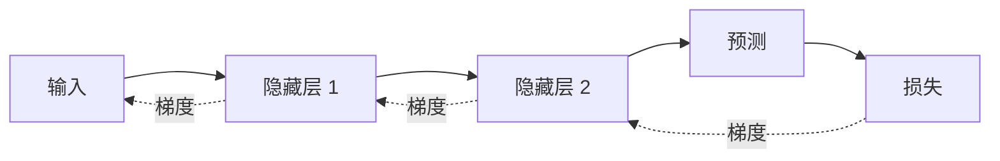
```mermaid
flowchart LR
    X[输入] --> H1[隐藏层 1]
    H1 --> H2[隐藏层 2]
    H2 --> Y[预测]
    Y --> L[损失]

    L -.梯度.-> H2
    H2 -.梯度.-> H1
    H1 -.梯度.-> X
```

反向传播负责算梯度，优化器负责根据梯度更新参数。

---

## 3.4 优化器

### SGD

SGD（Stochastic Gradient Descent，随机梯度下降）：

$$
\theta
\leftarrow
\theta-\eta g
$$

### Momentum

动量方法累计历史梯度方向，减小震荡。

### Adam

Adam（Adaptive Moment Estimation，自适应矩估计）同时维护梯度的一阶矩和二阶矩，对不同参数使用自适应步长。

一阶矩 $m_t$ 是梯度的指数滑动平均，近似稳定的更新方向；二阶矩 $v_t$ 是梯度平方的指数滑动平均，用来按参数缩放步长。不同参数的梯度尺度可能相差很大，稀疏或噪声梯度也会使普通 SGD 难以选择统一学习率。Adam 的更新为：

$$
\begin{aligned}
m_t&=\beta_1m_{t-1}+(1-\beta_1)g_t,\\
v_t&=\beta_2v_{t-1}+(1-\beta_2)g_t^2,\\
\hat m_t&=\frac{m_t}{1-\beta_1^t},\qquad
\hat v_t=\frac{v_t}{1-\beta_2^t},\\
\theta_t&=\theta_{t-1}-\eta\frac{\hat m_t}{\sqrt{\hat v_t}+\epsilon}
\end{aligned}
$$

偏置修正补偿了训练早期 $m_0=v_0=0$ 带来的低估。

Adam 的自适应步长不代表不需要学习率调度，也不保证一定比 SGD 泛化更好。

### AdamW 与 Weight Decay

AdamW 将 Weight Decay 从损失梯度中解耦，直接让参数按比例衰减：

$$
\theta_t
\leftarrow
(1-\eta\lambda)\theta_{t-1}
-\eta\frac{\hat m_t}{\sqrt{\hat v_t}+\epsilon}
$$

在 SGD 中，向损失添加 L2 正则与参数衰减可得到等价更新；Adam 会对梯度逐参数缩放，这种等价关系不再成立。AdamW 先由 Adam 计算优化方向，再独立衰减通常应正则化的权重，Bias 和归一化层的缩放参数常不做衰减。L2 正则描述损失函数中的惩罚项，Weight Decay 描述更新规则；对 Adam 而言，二者不能随意互换。

### 优化器状态为什么占显存

以混合精度 AdamW 为例，每个参数除了低精度模型权重，还可能对应 FP32 主权重、梯度、一阶矩和二阶矩。具体实现不同，但优化器状态经常比模型权重本身更占显存。这也是 ZeRO、FSDP 和优化器状态分片能够显著降低单卡显存的原因。

理解重点：

- 梯度决定方向；
- 学习率控制更新幅度；
- 优化器决定如何利用当前和历史梯度。

---

## 3.5 学习率、Warmup 与调度器

Warmup 表示训练初期从较小学习率逐步升高。

作用：

- 避免早期梯度不稳定导致剧烈更新；
- 提高大模型训练稳定性。

Warmup 后通常继续使用：

- 线性衰减；
- 余弦衰减；
- 分段衰减；
- 常数学习率。

---

## 3.6 梯度爆炸、梯度消失与梯度裁剪

### 梯度爆炸

梯度数值过大，导致参数更新失控。

### 梯度消失

梯度在深层传播时不断缩小，前层参数难以学习。

### 梯度裁剪

限制梯度范数：

$$
g
\leftarrow
g\cdot
\min
\left(
1,
\frac{c}{\|g\|}
\right)
$$

梯度裁剪主要缓解梯度爆炸，不能从根本上解决所有训练不稳定问题。

---

## 3.7 Dropout

Dropout 在训练时随机将部分神经元输出置零。

作用：

- 减少神经元之间的过度依赖；
- 缓解过拟合；
- 提高泛化能力。

推理时通常关闭 Dropout，并使用完整网络。

---

## 3.8 Normalization

Normalization 表示归一化层。

> **BatchNorm 横向看一批样本的同一个特征；LayerNorm 纵向看一个样本内部的所有特征。**

### BatchNorm 与 LayerNorm

Normalization（归一化）层的主要作用是控制中间激活值的数值分布，使训练过程更加稳定。

需要注意，BatchNorm 和 LayerNorm 并不是简单把输入缩放到固定区间，而是先对指定维度计算均值和方差，再进行标准化，并通过可训练参数恢复模型所需的表达能力。

#### BatchNorm

BatchNorm（Batch Normalization，批归一化）主要对一个 Batch 中的同一特征进行归一化。

假设一个 Batch 中有 $B$ 个样本，每个样本有 $D$ 个特征：

$$
X\in\mathbb{R}^{B\times D}
$$

对于第 $d$ 个特征，BatchNorm 会收集所有样本在该特征上的值：

$$
x_{1d},x_{2d},\ldots,x_{Bd}
$$

然后计算该特征在当前 Batch 中的均值和方差：

$$
\mu_d
=
\frac{1}{B}
\sum_{b=1}^{B}x_{bd}
$$

$$
\sigma_d^2
=
\frac{1}{B}
\sum_{b=1}^{B}
\left(x_{bd}-\mu_d\right)^2
$$

再对每个样本的该特征进行标准化：

$$
\hat{x}_{bd}
=
\frac{x_{bd}-\mu_d}
{\sqrt{\sigma_d^2+\epsilon}}
$$

最后进行可训练的缩放和平移：

$$
y_{bd}
=
\gamma_d\hat{x}_{bd}+\beta_d
$$

其中：

- $\gamma_d$ 是第 $d$ 个特征的可训练缩放参数；
- $\beta_d$ 是第 $d$ 个特征的可训练平移参数；
- $\epsilon$ 是防止分母为 0 的较小常数。

##### 直观例子

假设一个 Batch 有 3 个样本，每个样本有 4 个特征：

```text
样本 1：[1,  10, 100, 1000]
样本 2：[2,  20, 200, 2000]
样本 3：[3,  30, 300, 3000]
```

BatchNorm 会按列计算：

```text
特征 1：1、2、3
特征 2：10、20、30
特征 3：100、200、300
特征 4：1000、2000、3000
```

也就是说，它比较的是：

> 不同样本在同一个特征上的数值分布。

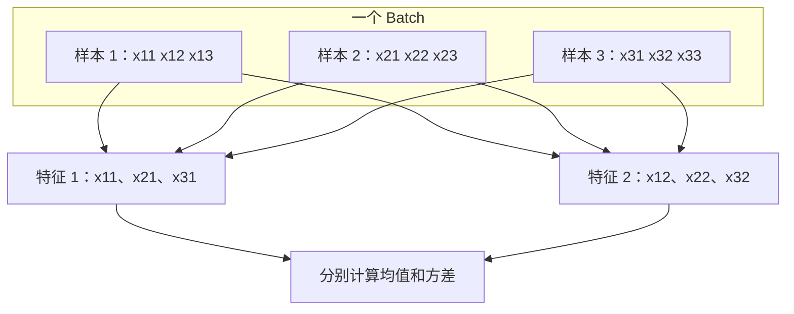
```mermaid
flowchart TB
    subgraph Batch["一个 Batch"]
        A1["样本 1：x11  x12  x13"]
        A2["样本 2：x21  x22  x23"]
        A3["样本 3：x31  x32  x33"]
    end

    A1 --> F1["特征 1：x11、x21、x31"]
    A2 --> F1
    A3 --> F1

    A1 --> F2["特征 2：x12、x22、x32"]
    A2 --> F2
    A3 --> F2

    F1 --> N1[分别计算均值和方差]
    F2 --> N1
```

##### 训练与推理的差异

训练时，BatchNorm 使用当前 Batch 的均值和方差。

但推理时可能只有一个样本，或者不同请求不能组成稳定的 Batch，因此不能继续依赖当前 Batch 的统计量。

BatchNorm 会在训练过程中维护移动平均：

```text
running_mean
running_variance
```

推理阶段使用这些历史统计量。

因此 BatchNorm 在训练和推理阶段的行为不同：

| 阶段 | 使用的统计量           |
| -- | ---------------- |
| 训练 | 当前 Batch 的均值和方差  |
| 推理 | 训练期间累计的移动均值和移动方差 |

##### BatchNorm 的特点

优点：

* 可以稳定中间激活值；
* 通常允许使用更大学习率；
* 能加快部分网络的收敛；
* Batch 统计量带来的噪声有时具有一定正则化作用。

限制：

* 效果依赖 Batch Size；
* Batch 太小时，均值和方差估计可能不稳定；
* 训练和推理行为不同；
* 分布式训练时可能需要同步不同设备上的统计量；
* 对变长序列和自回归生成不够自然。

BatchNorm 常见于卷积神经网络等视觉模型。

#### LayerNorm

LayerNorm（Layer Normalization，层归一化）主要对单个样本内部的特征维度进行归一化。

仍假设输入为：

$$
X\in\mathbb{R}^{B\times D}
$$

对于第 $b$ 个样本，LayerNorm 会收集该样本的全部特征：

$$
x_{b1},x_{b2},\ldots,x_{bD}
$$

计算该样本内部的均值和方差：

$$
\mu_b
=

\frac{1}{D}
\sum_{d=1}^{D}x_{bd}
$$

$$
\sigma_b^2
=

\frac{1}{D}
\sum_{d=1}^{D}
\left(x_{bd}-\mu_b\right)^2
$$

然后进行标准化：

$$
\hat{x}_{bd}
=

\frac{x_{bd}-\mu_b}
{\sqrt{\sigma_b^2+\epsilon}}
$$

最后同样使用可训练参数缩放和平移：

$$
y_{bd}
=

\gamma_d\hat{x}_{bd}+\beta_d
$$

##### 直观例子

还是下面 3 个样本：

```text
样本 1：[1,  10, 100, 1000]
样本 2：[2,  20, 200, 2000]
样本 3：[3,  30, 300, 3000]
```

LayerNorm 会按行计算：

```text
样本 1：对 1、10、100、1000 计算均值和方差
样本 2：对 2、20、200、2000 计算均值和方差
样本 3：对 3、30、300、3000 计算均值和方差
```

它比较的是：

> 同一个样本内部不同隐藏特征的数值分布。

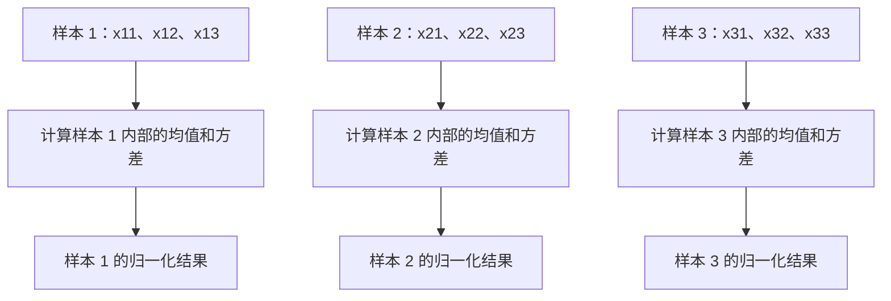
```mermaid
flowchart TB
    A1["样本 1：x11、x12、x13"] --> N1["计算样本 1 内部的均值和方差"]
    A2["样本 2：x21、x22、x23"] --> N2["计算样本 2 内部的均值和方差"]
    A3["样本 3：x31、x32、x33"] --> N3["计算样本 3 内部的均值和方差"]

    N1 --> O1[样本 1 的归一化结果]
    N2 --> O2[样本 2 的归一化结果]
    N3 --> O3[样本 3 的归一化结果]
```

##### Transformer 中的 LayerNorm

Transformer 的隐藏状态通常可以写为：

$$
X\in\mathbb{R}^{B\times L\times D}
$$

其中：

* $B$：Batch Size；
* $L$：序列长度；
* $D$：隐藏维度。

LayerNorm 通常针对每个样本的每个 Token，独立地在隐藏维度 $D$ 上进行归一化。

也就是说，对于：

```text
第 b 个样本
第 l 个 Token
```

会对它对应的隐藏向量：

$$
X_{b,l,:}
\in\mathbb{R}^{D}
$$

计算均值和方差。

例如某个 Token 的隐藏向量为：

```text
[0.4, -1.2, 0.8, 2.1, ...]
```

LayerNorm 就在这个向量内部进行归一化，而不会使用其他样本或其他 Token 的数值。

##### LayerNorm 的特点

* 不依赖 Batch 中的其他样本；
* Batch Size 为 1 时仍然可以正常工作；
* 训练和推理阶段使用相同的计算方式；
* 不需要维护 running mean 和 running variance；
* 适合变长序列；
* 适合自回归生成；
* 常用于 Transformer 和大语言模型。


#### BatchNorm 与 LayerNorm 的核心区别

假设输入矩阵为：

$$
X\in\mathbb{R}^{B\times D}
$$

可以将二者理解为：

```text
BatchNorm：沿 Batch 方向计算同一个特征的统计量
LayerNorm：沿 Feature 方向计算同一个样本的统计量
```

#### 为什么 Transformer 更常使用 LayerNorm

Transformer 经常面对：

* 不同长度的文本；
* 动态 Batch；
* Batch Size 较小；
* 单请求生成；
* 自回归逐 Token 解码；
* 训练和推理序列分布不同。

如果使用 BatchNorm，一个 Token 的输出会受到同一 Batch 中其他样本的影响，并且推理时还要处理 Batch 统计量与训练统计量的差异。

LayerNorm 只依赖当前 Token 自己的隐藏向量，因此：

* 不受同一 Batch 中其他样本影响；
* 单样本推理也能正常工作；
* 变长序列处理更自然；
* 训练和推理逻辑一致。

所以 Transformer 通常使用 LayerNorm 或 RMSNorm，而不是 BatchNorm。

#### RMSNorm

RMSNorm 的更完整名称通常写作：

> **Root Mean Square Layer Normalization，均方根层归一化**

它可以看作 LayerNorm 的简化形式。

LayerNorm 会执行两步：

```text
减去均值
→ 除以标准差
```
RMSNorm 不减去均值，只根据向量的均方根调整整体尺度：
```text
计算均方根
→ 用均方根缩放输入
```

## 3.9 CNN、RNN 与 ViT 如何衔接

卷积神经网络 CNN 使用可学习的局部卷积核在输入上滑动，同一组参数会在不同位置复用。它利用图像、音频和局部时序信号中“相邻位置关系更强”的先验，以较少参数提取边缘、纹理和逐层扩大的感受野。卷积的核心不是简单地把矩阵变小，而是局部连接、权重共享与多通道累加；池化或带步长卷积才负责常见的下采样。CNN 也没有被 Transformer 完全取代，在移动端视觉、检测网络的局部模块和高效混合架构中仍很常见。

循环神经网络 RNN 将上一步隐藏状态带到下一步：

$$
h_t=\phi(W_xx_t+W_hh_{t-1}+b)
$$

它适合表示变长序列，并且推理时只需维护递归状态，但时间步之间的依赖限制了训练并行，长距离反向传播还容易出现梯度消失或爆炸。LSTM 和 GRU 在递归状态上增加门控，让模型决定保留、写入或遗忘哪些信息，从而缓解长依赖问题。门控能改善梯度传播，却不能消除时间维度上的串行依赖；它们也不是 Attention 的另一种写法。

Vision Transformer（ViT）把图像切成固定大小的 Patch，将每个 Patch 线性投影为 Token，再加入位置表示并交给 Transformer。这样可以复用 Attention 的全局建模能力，也方便与文本 Token 组合成多模态模型。Patch Embedding 本质上常可由步长等于 Patch 大小的卷积实现，但 ViT 的核心交互发生在 Token 之间，不应把它理解为普通 CNN 换了名称。本文后面的视觉编码器属于这一思想的扩展；图像预处理、二维位置编码和视觉—文本对齐仍是独立问题。

# 4. 文本如何进入模型

## 4.1 Token 与 Tokenizer

模型不会直接处理完整单词或句子，而是处理 Token。

Tokenizer 是分词器，负责：

```text
原始文本
→ Token 序列
→ Token ID 序列
```

例如：

```text
"unbelievable"
→ ["un", "believ", "able"]
→ [1287, 9321, 415]
```

Token 可能是：

- 单个字符；
- 完整单词；
- 子词；
- 标点；
- 特殊符号。

Tokenizer 不只是按空格切词，它还要通过语料训练词表。常见流程是先做 Unicode 规范化和预切分，再统计候选片段，最后得到“文本片段到整数 ID”的稳定映射。词表太小会让一句话被切成很多 Token，增加序列长度；词表太大会扩大 Embedding 与 LM Head，并让低频 Token 难以充分训练。Tokenizer 一旦确定，随意改变词表或 ID 映射会让已有模型权重失去含义。

BPE（Byte Pair Encoding）从字符或字节等小单元开始，反复合并语料中最常出现的相邻片段。它用有限词表复用常见子词，既避免整词词表无法处理新词，也避免纯字符序列过长。推理时按训练得到的合并规则切分。需要注意，BPE 在不同实现中可能以字符、Unicode 片段或字节为基础，名称相同不代表词表兼容。

WordPiece 同样逐步构造子词词表，但候选合并通常根据对语言模型似然改善的评分选择，而不只是看相邻片段的绝对频次。它常使用类似 `##ing` 的标记表示非词首片段。WordPiece 与 BPE 都产生子词，却不能用一个模型的规则去解释另一个模型的 Token ID。

Unigram Language Model 从较大的候选词表出发，为片段建立概率模型，再逐步删除对语料似然影响较小的片段。一个字符串可能存在多种切法，算法通过动态规划选择代价更低的组合，训练时也可以对子词切分做采样。它与 BPE 的“从小到大合并”方向相反，但目标同样是用固定词表覆盖开放文本。

SentencePiece 是直接在原始文本上训练和执行分词的工具体系，可以使用 Unigram 或 BPE；它不是与二者并列的单一分词算法。它通常把空格显式编码进片段，从而能还原原文。Byte Fallback 则在普通词表无法覆盖字符时退回到 UTF-8 字节，保证任意输入都能编码；代价是罕见字符可能膨胀为多个 Token。`UNK` 表示未知项，而 Byte Fallback 是避免落入 `UNK` 的一种机制，二者不要混为一谈。

Token 数量直接影响：

- 上下文长度；
- 调用成本；
- Prefill 计算量；
- KV Cache 占用。

---

## 4.2 特殊 Token

常见特殊 Token：

- BOS：Beginning of Sequence，序列开始；
- EOS：End of Sequence，序列结束；
- PAD：Padding，补齐；
- UNK：Unknown，未知 Token；
- SEP：Separator，分隔；
- MASK：Mask，掩码。

不同模型不一定同时使用这些 Token。

---

## 4.3 Embedding

Token ID 只是离散编号，需要映射为连续向量：

$$
\mathrm{EmbeddingLookup}(id)
\rightarrow
\mathbf{x}\in\mathbb{R}^{d_{\mathrm{model}}}
$$

Embedding 矩阵：

$$
E\in\mathbb{R}^{V\times d_{\mathrm{model}}}
$$

其中：

- $V$：词表大小；
- $d_{\mathrm{model}}$：隐藏维度。

每个 Token ID 对应矩阵中的一行。

Embedding 不是一个固定的“词义字典”。它会在训练中更新，使模型能够利用向量表达语义、语法和上下文规律。

---

## 4.4 静态表示与上下文表示

静态 Embedding 中，同一个词通常只有一个固定向量。

上下文模型中，同一个词在不同句子里的最终隐藏表示不同。

例如：

```text
苹果很好吃。
苹果发布了新产品。
```

“苹果”的初始 Token Embedding 可能相同，但经过多层 Attention 后，上下文表示会明显不同。

---

## 4.5 位置编码

Self-Attention 本身对输入顺序不敏感。

例如：

```text
猫吃鱼
鱼吃猫
```

如果没有位置信息，模型难以区分词序变化。

### 绝对位置编码

为每个绝对位置提供位置向量。

### 相对位置编码

重点表达两个 Token 的相对距离。

### RoPE

RoPE（Rotary Position Embedding，旋转位置编码）不把位置向量直接加到 Token Embedding，而是把 Query 和 Key 的相邻维度两两配对，并按位置旋转。对位置 $m$ 的一对分量，可以写成：

$$
\begin{bmatrix}
x'_{2i}\\
x'_{2i+1}
\end{bmatrix}
=
\begin{bmatrix}
\cos(m\theta_i) & -\sin(m\theta_i)\\
\sin(m\theta_i) & \cos(m\theta_i)
\end{bmatrix}
\begin{bmatrix}
x_{2i}\\
x_{2i+1}
\end{bmatrix}
$$

这样做仍保留内容向量的长度，而位置 $m$ 的 Query 与位置 $n$ 的 Key 做点积时，旋转角度主要由 $m-n$ 决定，因此注意力分数自然携带相对距离。不同维度使用不同频率，低频维度变化慢、适合较长距离，高频维度变化快、适合区分邻近位置。

RoPE 能编码训练长度内的位置关系，却不自动保证任意长度外推。YaRN 等方法会重新缩放或插值不同频率，并配合注意力尺度调整，让模型在微调或部署时扩展上下文。它们调整的是位置表示，不会消除 Attention 的二次复杂度，也不等同于把配置文件中的最大长度直接改大。

---

# 5. Transformer 核心机制

## 5.1 Self-Attention

Self-Attention 允许每个位置根据内容动态聚合其他位置的信息。

输入矩阵：

$$
X\in\mathbb{R}^{n\times d_{\mathrm{model}}}
$$

通过线性投影得到：

$$
Q=XW_Q,\qquad
K=XW_K,\qquad
V=XW_V
$$

注意力计算：

$$
\mathrm{Attention}(Q,K,V)
=
\mathrm{softmax}
\left(
\frac{QK^{\mathsf T}}{\sqrt{d_k}}
\right)V
$$

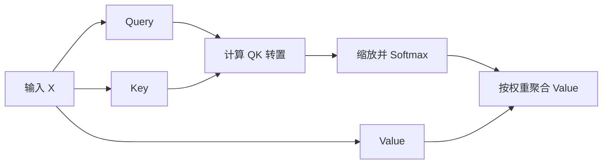
```mermaid
flowchart LR
    X[输入 X] --> Q[Query]
    X --> K[Key]
    X --> V[Value]
    Q --> S[计算 QK 转置]
    K --> S
    S --> P[缩放并 Softmax]
    P --> O[按权重聚合 Value]
    V --> O
```

$QK^{\mathsf T}$ 会产生 $n\times n$ 的分数矩阵。标准 Self-Attention 的主要计算量约为 $O(n^2d)$，显式保存分数或概率时中间内存约为 $O(n^2)$；序列长度翻倍时，这部分成本约增至四倍。这里的复杂度不能与整个 Transformer 层混为一谈：线性投影和 FFN 还包含约 $O(nd^2)$ 的计算，短序列、大隐藏维度时它们也可能占主导。FlashAttention 可以避免把完整分数矩阵写回 HBM，却没有改变标准 Attention 的二次计算关系。

---

## 5.2 Query、Key 与 Value

可以把它们直观理解为：

- Query：当前位置想寻找什么；
- Key：每个位置提供什么匹配线索；
- Value：匹配成功后真正取出的信息。

例如句子：

```text
小明把书放在桌上，因为它很重。
```

处理“它”时，模型可以通过 Query 与其他位置的 Key 计算相关性，再聚合对应 Value。

---

## 5.3 为什么除以 $\sqrt{d_k}$

当 $d_k$ 增大时，点积数值通常也会变大。

过大的分数进入 Softmax 后，概率分布会过于尖锐，使梯度变小、训练不稳定。

因此使用：

$$
\frac{QK^{\mathsf T}}{\sqrt{d_k}}
$$

控制数值尺度。

---

## 5.4 Softmax

Softmax 将任意实数转换为概率分布：

$$
\mathrm{softmax}(z_i)
=
\frac{e^{z_i}}
{\sum_j e^{z_j}}
$$

满足：

$$
0\lt p_i\lt 1,
\qquad
\sum_i p_i=1
$$

在 Attention 中，Softmax 将相似度分数转换为注意力权重。

---

## 5.5 Multi-Head Attention

MHA（Multi-Head Attention，多头注意力）使用多组投影，让不同注意力头在不同表示子空间中建模关系。

第 $i$ 个头：

$$
\mathrm{head}_i
=
\mathrm{Attention}
\left(
XW_i^Q,
XW_i^K,
XW_i^V
\right)
$$

所有头的输出先拼接，再进行线性融合：

$$
\mathrm{MHA}(Q,K,V)
=
\mathrm{Concat}
\left(
\mathrm{head}_1,\ldots,\mathrm{head}_h
\right)W^O
$$

不同头可能关注：

- 语法依赖；
- 指代关系；
- 局部邻接关系；
- 长距离关系；
- 实体与属性关系。

但实际训练中，一些头也可能功能相似或存在冗余。

---

## 5.6 多头注意力的维度

假设：

```text
模型隐藏维度 d_model = 512
注意力头数 h = 8
每头维度 d_head = 64
```

每个头输出：

$$
\mathrm{head}_i
\in
\mathbb{R}^{n\times64}
$$

8 个头拼接后：

$$
\mathrm{Concat}
\in
\mathbb{R}^{n\times512}
$$

再乘 $W^O$，输出仍保持模型隐藏维度。

---

## 5.7 双向注意力与因果注意力

### 双向注意力

每个位置可以读取输入序列中的全部位置。

适合：

- 文本理解；
- 分类；
- 语义表示；
- Token 标注。

### 因果注意力

当前位置只能读取自己和之前的位置，不能读取未来位置。

```text
位置 0：可读取 0
位置 1：可读取 0、1
位置 2：可读取 0、1、2
位置 3：可读取 0、1、2、3
```

注意力分数加入因果 Mask：

$$
A_{ij}
=
\mathrm{softmax}_{j}
\left(
\frac{q_i k_j^{\mathsf T}}{\sqrt{d_k}}
+
M_{ij}
\right)
$$

其中：

$$
M_{ij}=0\quad(j\le i),
\qquad
M_{ij}=-\infty\quad(j>i)
$$

未来位置经过 Softmax 后权重为 0。

Padding Mask 解决的是另一件事：Batch 内句子长度不同时，PAD 位置不应参与注意力或损失。因果 Mask 限制“能不能看未来”，Padding Mask 限制“这个位置是否是真实输入”，二者可以叠加。工程实现中的 Attention Mask 还需要按 Batch 和 Head 维度正确广播；它只是把无效分数设为极小值，并不会从张量中真正删除 Token、降低对应计算量。

---

## 5.8 残差连接

残差连接：

$$
Y=X+F(X)
$$

作用：

- 为梯度提供更直接的传播路径；
- 保留原始表示；
- 让网络更容易学习增量变化；
- 支持更深的网络结构。

---

## 5.9 Feed Forward Network

FFN（Feed Forward Network，前馈神经网络）：

$$
\mathrm{FFN}(x)
=
W_2\sigma(W_1x+b_1)+b_2
$$

Attention 负责 Token 之间的信息交互；FFN 对每个 Token 的表示进行非线性变换。

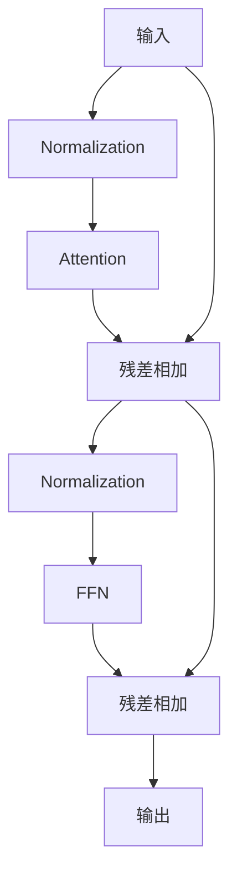
```mermaid
flowchart TB
    X[输入] --> N1[Normalization]
    N1 --> A[Attention]
    A --> R1[残差相加]
    X --> R1
    R1 --> N2[Normalization]
    N2 --> F[FFN]
    F --> R2[残差相加]
    R1 --> R2
    R2 --> Y[输出]
```

---

## 5.10 Pre-Norm 与 Post-Norm

### Pre-Norm

$$
Y=X+F(\mathrm{LN}(X))
$$

### Post-Norm

$$
Y=\mathrm{LN}(X+F(X))
$$

Pre-Norm 通常更有利于深层网络训练稳定，但具体实现还会使用 RMSNorm 等变体。

---

# 6. Encoder、Decoder 与 Decoder-only

## 6.1 名字分别代表什么

- Encoder：编码器，把输入转成内部语义表示；
- Decoder：解码器，根据内部表示逐步生成输出；
- Encoder-Decoder：先编码输入，再解码输出；
- Decoder-only：没有独立 Encoder，统一根据前文预测后文。

这里的“编码”不是字符编码或文件压缩，而是把 Token 序列转换成上下文隐藏向量。

---

## 6.2 Encoder

Encoder 通常使用双向 Self-Attention。

一个典型 Encoder 层：

```text
双向 Self-Attention
→ 残差连接与归一化
→ FFN
→ 残差连接与归一化
```


```mermaid
flowchart LR
    A[输入 Token 向量] --> B[双向 Self-Attention]
    B --> C[残差与归一化]
    C --> D[FFN]
    D --> E[残差与归一化]
    E --> F[上下文语义表示]
```

Encoder 适合：

- 分类；
- 检索；
- 表示学习；
- Token 标注。

---

## 6.3 Decoder

经典 Encoder-Decoder Transformer 中，一个 Decoder 层通常包含：

```text
因果 Self-Attention
→ Cross-Attention
→ FFN
```

Cross-Attention 是交叉注意力：

- Query 来自 Decoder；
- Key 和 Value 来自 Encoder。

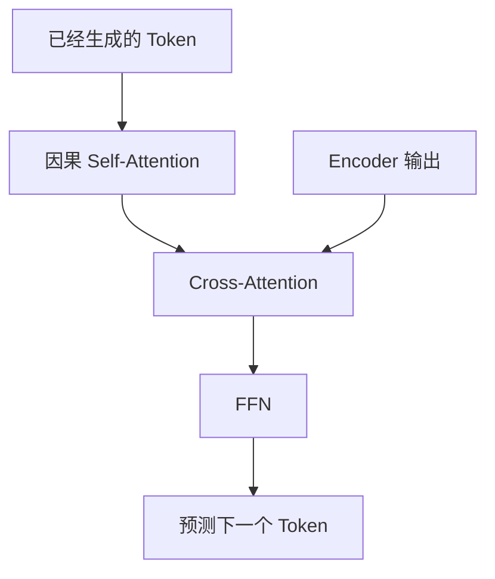
```mermaid
flowchart TB
    A[已经生成的 Token] --> B[因果 Self-Attention]
    B --> C[Cross-Attention]
    E[Encoder 输出] --> C
    C --> D[FFN]
    D --> F[预测下一个 Token]
```

---

## 6.4 Encoder-Decoder

Encoder-Decoder 将输入和输出分开处理。


```mermaid
flowchart LR
    A[输入序列] --> B[Encoder]
    B --> C[输入语义表示]
    C --> D[Decoder]
    D --> E[输出序列]
```

例如翻译：

```text
输入：我喜欢机器学习
输出：I like machine learning
```

Decoder 每一步同时使用：

- Encoder 对完整输入的表示；
- 已经生成的输出前缀。

---

## 6.5 Decoder-only

Decoder-only 没有独立 Encoder，也通常没有 Cross-Attention。

一个典型层：

```text
因果 Self-Attention
→ 残差连接与归一化
→ FFN
→ 残差连接与归一化
```

它把任务说明、输入内容和回答放入同一个序列：

```text
用户输入 + 已生成回答
```

模型始终执行：

> 根据前面的 Token，预测下一个 Token。

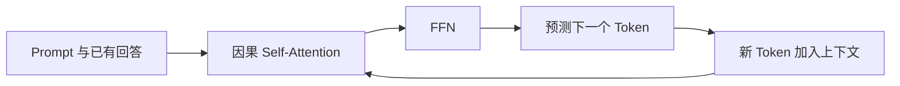
```mermaid
flowchart LR
    A[Prompt 与已有回答] --> B[因果 Self-Attention]
    B --> C[FFN]
    C --> D[预测下一个 Token]
    D --> E[新 Token 加入上下文]
    E --> B
```

Decoder-only 没有独立 Encoder，但仍然能够处理和理解 Prompt，因为回答 Token 可以读取前面的完整输入。

---

## 6.6 三种架构对比

| 架构 | 注意力方式 | 是否独立处理输入 | 主要用途 |
|---|---|---:|---|
| Encoder-only | 双向注意力 | 是 | 分类、检索、表示学习 |
| Encoder-Decoder | Encoder 双向，Decoder 因果 | 是 | 翻译、摘要、序列转换 |
| Decoder-only | 因果注意力 | 否 | 对话、续写、通用生成 |

注意力来源对比：

| 注意力类型 | Query 来源 | Key 来源 | Value 来源 |
|---|---|---|---|
| Encoder Self-Attention | Encoder | Encoder | Encoder |
| Decoder Self-Attention | Decoder | Decoder | Decoder |
| Cross-Attention | Decoder | Encoder | Encoder |

---

## 6.7 从隐藏状态到 Token 概率

Transformer 最后一层输出的是每个位置的隐藏向量，而不是词表概率。LM Head 是一个从隐藏维度到词表维度的线性映射。若 $h_t\in\mathbb{R}^{d}$、词表大小为 $V$，则：

$$
z_t=W_{\mathrm{lm}}h_t+b,
\qquad
z_t\in\mathbb{R}^{V}
$$

$z_t$ 中每个分量对应一个 Token 的未归一化分数，这组数称为 Logits。Logits 可以为任意实数，不能直接解释为概率；Softmax 才把它转换成总和为 1 的分布。许多模型会让 LM Head 权重与输入 Embedding 矩阵共享，称为 Weight Tying，用更少参数约束“读入 Token”和“预测 Token”使用同一表示空间，但并非所有模型都这样设计。

LM Head 与分类头容易混淆。二者都可能是线性层，但 LM Head 对序列中的位置预测整个词表，分类头通常把一个汇总表示映射到少量任务类别。

## 6.8 标签右移、Teacher Forcing 与 Loss Mask

训练下一个 Token 预测时，同一条序列同时提供输入和标签，但两者错开一位：

```text
输入：  [BOS]  我    喜欢   编译器
标签：   我    喜欢  编译器  [EOS]
```

模型在位置 $t$ 只能通过因果 Mask 读取真实前缀 $x_{1:t}$，再预测 $x_{t+1}$。训练时每个位置都使用数据中的真实前缀，这称为 Teacher Forcing；它让整条序列的损失能够并行计算。推理时没有未来真值，模型只能把自己刚生成的 Token 接回输入，因此错误可能沿序列累积。Teacher Forcing 是提供前缀的训练方式，不是让教师模型生成标签，也不等同于知识蒸馏。

并非序列中的每个位置都必须计入损失。PAD Token 只是对齐占位，应被屏蔽；SFT 中也常只监督回答区域，让系统提示和用户输入作为条件而不参与目标。Loss Mask 决定哪些位置计算交叉熵，Attention Mask 决定某个位置能读取哪些位置，二者作用不同。

## 6.9 Token Loss 与 Perplexity

对有效位置的平均负对数似然可以写为：

$$
\mathcal L_{\mathrm{token}}
=
-\frac{1}{N}\sum_{i=1}^{N}\log p(x_i\mid x_{<i})
$$

Perplexity（困惑度）是平均 Token Loss 的指数：

$$
\mathrm{PPL}=\exp(\mathcal L_{\mathrm{token}})
$$

它可以直观理解为模型在每一步面对的“有效候选规模”，越低通常说明模型对该数据分布预测得更好。困惑度适合比较相同 Tokenizer、相同预处理和相同评测语料上的语言模型，不适合跨词表直接比较，也不能单独衡量事实正确性、指令遵循、安全性或代码可执行性。

---

# 7. 大模型训练与对齐

## 7.1 整体训练链路


```mermaid
flowchart LR
    A[原始语料] --> B[预训练]
    B --> C[基础模型]
    C --> D[SFT]
    D --> E[指令模型]
    E --> F[偏好对齐]
    F --> G[部署与评估]
    G --> H[数据反馈]
    H --> D
```

---

## 7.2 预训练数据工程

大模型的数据管线把网页、书籍、论文、代码和授权数据转换成可追踪的 Token 序列。它不只是“数据越多越好”：重复、低质量和互相污染的数据会消耗相同计算，却可能让模型记忆模板、放大偏见或形成错误评测结果。

一条常见链路是：

```text
采集与许可检查
→ 格式解析和语言识别
→ 质量、安全与隐私过滤
→ 文档级、段落级和近似去重
→ 数据源混合与采样
→ Tokenize 和序列 Packing
→ 训练集与独立评测集
```

精确去重可以使用内容哈希。近似去重时，MinHash 把文档词项集合压成短签名，使签名相等的概率近似两集合的 Jaccard 相似度；局部敏感哈希再把相似签名更可能放进同一桶，避免对所有文档做两两比较。相似度模型还能发现语义相近的轻微改写。去重既减少反复学习同一内容，也降低训练材料泄漏到评测集的概率，但不能简单删掉所有相似文本：代码模板、引用与多语言平行语料可能具有合理重复。

数据混合为不同来源设置采样权重，避免体量最大的网页数据完全支配训练。高质量来源可以上采样，噪声来源可以降权，但反复上采样小数据集会增加记忆风险。合成数据能够补充稀缺任务、推理轨迹和格式样本，前提是经过验证与多样性控制；它不是天然高质量数据，持续用模型输出训练模型还可能收缩分布。

Packing 将多个短文档紧凑放入固定长度序列，提高有效 Token 比例。是否允许文档之间相互注意取决于 Mask 设计，不能把 Packing 与把多篇文章直接拼成一个逻辑文档混为一谈。数据版本、过滤规则、Tokenizer 和随机种子都应记录，否则训练结果难以复现。

## 7.3 Scaling Law 与计算分配

Scaling Law 是从一组训练实验拟合出的经验规律，用来描述模型参数量 $N$、训练 Token 数 $D$、计算量和损失之间的趋势。一个简化形式是：

$$
L(N,D)\approx L_{\infty}+AN^{-\alpha}+BD^{-\beta}
$$

它帮助回答固定计算预算下应训练更大的模型，还是让较小模型读取更多数据。稠密 Transformer 的训练计算量常粗略看作与 $ND$ 成正比，因此只扩大参数、不增加足够数据，会形成训练不足；只增加数据而模型容量过小，也会出现收益递减。

Scaling Law 是特定模型族、数据和训练设置上的统计外推，不是物理定律，也不能直接预测对齐、安全或某项具体能力。MoE 的总参数量、每 Token 激活参数量和实际通信成本也必须分开计算，不能只凭模型名称中的参数数字比较训练开销。

## 7.4 预训练

Decoder-only 模型通常采用 Next Token Prediction，即下一个 Token 预测。

概率分解：

$$
P(x_1,\ldots,x_T)
=
\prod_{t=1}^{T}
P(x_t\mid x_{1:t-1})
$$

Token 级交叉熵损失：

$$
\mathcal{L}
=
-\sum_{t=1}^{T}
\log P\left(x_t\mid x_{1:t-1}\right)
$$

预训练让模型学习：

- 语言结构；
- 词语关系；
- 常识与知识模式；
- 推理和生成能力；
- 代码与格式规律。

---

## 7.5 SFT

SFT（Supervised Fine-Tuning，监督微调）使用指令—回答数据训练模型遵循任务。

典型数据是`输入指令 / 对话上下文 -> 目标回答`：

```json
{
  "instruction": "解释传输控制协议的三次握手",
  "input": "",
  "response": "三次握手包括……"
}
```

SFT 主要用于：

- 指令遵循；
- 对话格式；
- 特定任务；
- 输出风格；
- 拒答行为；
- 结构化输出。

预训练学习“语言和世界规律”，SFT 学习“如何按要求完成任务”。SFT 描述的是训练数据和训练目标。

---

## 7.6 偏好数据

同一输入对应两个回答：

```text
chosen：更符合目标偏好的回答
rejected：较差回答
```

偏好可能涉及：

- 正确性；
- 清晰度；
- 安全性；
- 格式；
- 风格；
- 是否遵循约束。

---

## 7.7 RLHF

RLHF（Reinforcement Learning from Human Feedback，基于人类反馈的强化学习）典型流程：

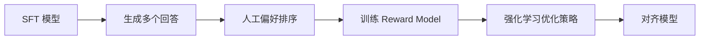
```mermaid
flowchart LR
    A[SFT 模型] --> B[生成多个回答]
    B --> C[人工偏好排序]
    C --> D[训练 Reward Model]
    D --> E[强化学习优化策略]
    E --> F[对齐模型]
```

Reward Model 是奖励模型，用于给回答打分：

$$
r_{\phi}(x,y)
$$

奖励模型通常从成对偏好学习相对分数。对于同一输入的 chosen 回答 $y_w$ 和 rejected 回答 $y_l$，一种常见损失为：

$$
\mathcal L_{\mathrm{RM}}
=
-\log\sigma\left(r_{\phi}(x,y_w)-r_{\phi}(x,y_l)\right)
$$

它要求 chosen 的分数高于 rejected，却不保证分数能跨问题直接比较，也不保证奖励模型在训练分布之外可靠。奖励模型若存在可利用的漏洞，策略可能学会获得高分而不是真的提高质量，这称为 Reward Hacking。

PPO（Proximal Policy Optimization，近端策略优化）可根据奖励模型更新生成策略。策略先采样回答，奖励模型给分，价值模型估计未来回报，再根据实际回报与估计值的差异计算 Advantage。PPO 使用新旧策略概率比的裁剪目标限制单次更新，避免策略一步偏离过远。

训练还常在奖励中加入相对参考模型的 KL 惩罚：

$$
D_{\mathrm{KL}}(p\parallel q)
=
\sum_i p_i\log\frac{p_i}{q_i}
$$

KL 散度衡量一个分布相对另一个分布的偏离，并不满足对称性，交换 $p$ 与 $q$ 会得到不同结果。它在这里用于抑制策略为了追逐奖励而远离原有语言能力；KL 系数太小可能导致漂移，太大又会阻碍学习。KL 不是距离度量，也不是奖励模型本身。

---

## 7.8 DPO

DPO（Direct Preference Optimization，直接偏好优化）直接利用 chosen/rejected 偏好对优化模型。

DPO 通常使用偏好对数据：

```text
x：问题或上下文
y_w：chosen，更偏好的回答
y_l：rejected，较差的回答
```

DPO 不先训练一个显式奖励模型，再使用强化学习优化策略。

它将偏好优化问题转化为一个可直接训练语言模型的分类式目标：

- 提高 chosen 相对于 rejected 的偏好优势，
- 同时通过参考模型限制策略偏移。

可直观理解为：

- 让模型相对更愿意生成 chosen，
- 相对更不愿意生成 rejected。

特点：

- 不显式训练独立奖励模型；
- 不执行传统 PPO 式强化学习流程；
- 仍然需要偏好数据；
- 通常流程更简单。

| 维度 | RLHF | DPO |
|---|---|---|
| 显式奖励模型 | 通常需要 | 不需要 |
| 强化学习式更新 | 通常需要 | 不需要 |
| 数据 | 偏好对 | 偏好对 |
| 工程复杂度 | 较高 | 较低 |

DPO 不是“只要有任意无监督文本就能训练”。

它通常需要能够表达相对偏好的样本：
- 同一个输入下，哪个回答更好？


DPO 也不是不需要基础模型。通常需要：
- 一个待优化的策略模型；
- 一个参考模型，通常由初始 SFT 模型冻结得到；
- 偏好对数据。

DPO 的常见目标可以写成：

$$
\mathcal L_{\mathrm{DPO}}
=
-\log\sigma\left(
\beta\left[
\log\frac{\pi_{\theta}(y_w\mid x)}{\pi_{\mathrm{ref}}(y_w\mid x)}
-
\log\frac{\pi_{\theta}(y_l\mid x)}{\pi_{\mathrm{ref}}(y_l\mid x)}
\right]
\right)
$$

它比较策略模型相对参考模型对 chosen 和 rejected 的偏好变化，$\beta$ 控制偏好优化与偏离参考策略之间的尺度。DPO 省去了在线 PPO 环路，却不等于没有对齐约束；数据中偏好冲突、长度偏差和标注噪声仍会直接影响结果。

---

## 7.9 其他后训练方法

Rejection Sampling 会针对同一输入生成多个候选，用规则、验证器或奖励模型排序，只保留较好的回答继续做监督训练。它实现简单，也能利用可验证任务，但需要额外采样计算，而且筛选器的偏差会被重新写入模型。它与 Beam Search 不同：Beam Search 是单次解码中的路径搜索，Rejection Sampling 是生成完整候选后的数据选择。

RLAIF（Reinforcement Learning from AI Feedback）用模型反馈替代或辅助人工偏好，可以扩大标注规模并统一规则，但评审模型的盲点、偏好和提示敏感性也会传递给被训练模型。它描述反馈来源，不限定必须使用 PPO、DPO 或哪一种优化器。

RLVR（Reinforcement Learning with Verifiable Rewards）利用单元测试、数学答案、约束检查器等可自动验证的信号训练策略。奖励更客观、可扩展，适合代码和形式化任务，却只覆盖能够可靠验证的部分；“最终答案通过”也不一定说明推理过程真实或稳健。

GRPO（Group Relative Policy Optimization）对同一输入采样一组回答，用组内相对奖励构造 Advantage，从而避免为每个状态单独训练传统价值模型。组内基线降低了奖励尺度差异，但仍需要足够多样的采样、稳定的奖励和策略约束。GRPO 是策略优化方法，RLVR 是奖励来源与任务形式，二者经常组合但不是同一个概念。

后训练还要关注灾难性遗忘：模型在新任务上变好，却丢失原有通用能力。混入通用数据、降低学习率、约束参数更新并持续做多能力回归评估，通常比只观察新任务损失更可靠。

---

## 7.10 全参数微调与 PEFT

全参数微调更新模型全部参数。

优点：

- 调整空间大。

缺点：

- 训练成本高；
- 显存需求大；
- 每个任务需要保存完整模型；
- 可能破坏原有能力。

PEFT（Parameter-Efficient Fine-Tuning，参数高效微调）只训练少量参数。

---

## 7.11 LoRA

LoRA（Low-Rank Adaptation，低秩适配）冻结原始权重，只训练低秩增量矩阵。LoRA 描述的是参数更新方式。可以使用 LoRA 方法执行 SFT。

$$
\Delta W=BA
$$

其中：

$$
A\in\mathbb{R}^{r\times d_{\mathrm{in}}},
\qquad
B\in\mathbb{R}^{d_{\mathrm{out}}\times r}
$$

最终：

$$
W'=W+\frac{\alpha}{r}BA
$$

其中 $\alpha$ 是缩放超参数，除以 $r$ 可以在改变 Rank 时保持更新尺度相对稳定。

Rank $r$ 越大，适配容量通常越强，但参数量、显存和过拟合风险也会提高。

---

## 7.12 QLoRA

QLoRA（Quantized Low-Rank Adaptation，量化低秩适配）将：

```text
量化后的基础模型
+
可训练的 LoRA 适配器
```

组合起来，降低微调基础模型时的显存需求。

QLoRA 的重点是量化基础权重，并保留适合训练的适配器和计算路径。

常见 QLoRA 会把冻结的基础权重按小块存成 4-bit NF4，前向计算时再解量化到 BF16/FP16，与全精度激活相乘；梯度只更新 LoRA 的低秩矩阵。NF4 针对近似正态分布的权重设计离散表示区间，Double Quantization 还可以继续量化各块的 Scale，Paged Optimizer 则在显存峰值时借助分页内存管理优化器状态。这些技术共同降低显存，但并非每个实现都必须同时启用。

QLoRA 不是直接用整数梯度训练全部 4-bit 基础参数。基础模型通常冻结，量化主要服务于存储和前向读取；计算仍会进入硬件支持的较高精度路径。它可以让微调装入更小显存，却不保证训练或推理一定更快，最终合并适配器时也要明确目标权重精度和量化格式。

---

## 7.13 混合精度训练

- FP32：32 位浮点数；
- FP16：16 位浮点数；
- BF16：Brain Floating Point 16，16 位脑浮点数。

BF16 与 FP32 的指数范围接近，因此通常比 FP16 更不容易发生溢出。

FP16 的指数位较少、有效精度相对较高，但很小的梯度可能下溢为 0。Loss Scaling 在反向前把损失乘以较大系数，使梯度落入可表示范围，更新前再除回原尺度；如果检测到 Inf/NaN，则跳过更新并调低 Scale。它改变的是数值表示，不应改变理论梯度，也不是把学习率放大。

BF16 保留与 FP32 相同数量的指数位，动态范围更大，但尾数更短。累加、归一化、Softmax 和优化器状态常保留更高精度，以避免大量舍入误差。混合精度描述不同算子和状态使用不同浮点类型，量化则通常还涉及 Scale、Zero Point 或低位编码，二者不能只按“位数更少”视为同一技术。

混合精度训练常见做法：

- 大部分矩阵计算使用低精度；
- 关键累积和状态使用更高精度；
- FP16 场景可使用 Loss Scaling 防止下溢。

---

## 7.14 并行训练

### 数据并行

数据并行让每个设备保存完整模型副本，分别处理不同 Mini-batch，再同步梯度。DDP（Distributed Data Parallel）通常在反向传播中把参数梯度分桶，并在梯度就绪时启动 AllReduce，使通信与其余反向计算重叠。

AllReduce 可以理解为先把各卡梯度求和或求平均，再让每张卡都得到结果；常见实现会分解为 ReduceScatter 与 AllGather。ReduceScatter 一边归约、一边让每卡只保留结果的一部分，AllGather 再交换各自分片并拼出完整结果。它们是集合通信操作，不是某个特定网络协议。

数据并行提高总 Batch 吞吐，却没有减少每卡保存完整模型与优化器状态的开销。梯度累积是在同一副本上分多次累加梯度，用来模拟更大的 Batch；它不会自动把模型分到多卡，也不能代替梯度同步。

### 张量并行

张量并行把同一层的大矩阵沿输入维或输出维切到多个设备，使单层也能容纳和并行计算。列切分与行切分会在层内不同位置触发 AllGather 或 AllReduce，因此每层都可能通信，通常要求设备之间具有高带宽、低延迟互连。

张量并行是模型并行的一种具体形式，不等于简单把不同层放到不同 GPU；后者属于流水线并行。并行度继续增大时，单卡计算变少但通信比例上升，不一定继续加速。

### 流水线并行

流水线并行把连续层划分为多个 Stage，并把一个全局 Batch 切成多个 Micro-batch 在 Stage 之间交错流动。它能分摊模型权重和激活，但流水线启动、排空和负载不均会产生 Bubble。增加 Micro-batch 数可以降低 Bubble 比例，也会改变激活内存和调度复杂度。

流水线并行中的 Micro-batch 是调度单位，数据并行中的每卡 Batch 是样本分片，两者可以组合但含义不同。

### 专家并行

专家并行把 MoE 的不同 Expert 分布到不同设备。Router 先决定每个 Token 去哪些 Expert，随后 All-to-All 把 Token 表示发送到持有目标 Expert 的设备，计算完成后再做一次反向交换。它能分摊大量专家参数，但性能可能受网络通信、负载倾斜和每卡 Token 数过少影响。

### 序列与上下文并行

序列并行把序列维上的归一化、Dropout 等计算和激活分片，常与张量并行组合，用于减少重复激活。上下文并行则进一步分摊长序列 Attention 所需的 Query、Key、Value 和通信。二者都沿序列相关维度切分，却不等同于普通数据并行：同一条样本的上下文已经跨设备分布，需要显式交换注意力所需信息。

实际训练常把数据、张量、流水线、专家和上下文并行组合成多维拓扑。选择并行方式时要同时核算显存、计算量、通信字节、通信频率和设备互连，不能只追求更高并行度。

## 7.15 训练显存、Checkpoint 与状态分片

训练显存主要来自模型参数、梯度、优化器状态和前向激活。设参数量为 $P$，仅权重就约占 $P\times b_w$ 字节；混合精度 AdamW 还可能为每个参数保存低精度权重、FP32 主权重、梯度以及 FP32 的一阶矩和二阶矩。按常见实现粗略估算可接近每参数 16 字节，但精确值会随精度、优化器和框架实现改变。

激活值取决于 Batch、序列长度、隐藏维度、层数和算子实现，长序列下可能超过参数内存。Activation Checkpointing 只保存部分层的输入，在反向传播时重新执行缺失的前向计算，以额外计算换显存。它与保存训练进度的模型 Checkpoint 不是同一件事：前者是单次迭代内的重计算策略，后者是用于恢复训练的持久化文件。

ZeRO 通过数据并行设备分片原本重复保存的训练状态：Stage 1 分片优化器状态，Stage 2 再分片梯度，Stage 3 进一步分片参数。需要某段参数计算时再临时聚合，反向后通过 ReduceScatter 保留分片。显存下降的代价是更多通信，CPU 或 NVMe Offload 还能继续降低 GPU 占用，但会引入更慢的数据搬运。

FSDP（Fully Sharded Data Parallel）同样把参数、梯度和优化器状态分片。计算某个模块前 AllGather 得到所需完整参数，计算后释放非本地分片，反向再 ReduceScatter 梯度。普通 DDP 在每卡保留完整模型，FSDP/ZeRO-3 则在时间上临时聚合、在稳定状态下保持分片；它们解决的是状态复制问题，不会自动减少激活内存，所以经常与 Activation Checkpointing 一起使用。

---

# 8. 推理过程与部署

## 8.1 自回归生成

生成过程：

```text
输入：今天的天气
→ 预测：很

输入：今天的天气很
→ 预测：好

输入：今天的天气很好
→ 预测：。
```

每个新 Token 都加入上下文，继续预测后续 Token。

---

## 8.2 Prefill 与 Decode

### Prefill

**一次性处理整个 Prompt。**

特点：

- 输入 Token 可以并行计算；
- 长 Prompt 计算量较大；
- 主要影响首 Token 延迟。

### Decode

每次生成一个 Token。

特点：

- 自回归串行；
- 每一步读取历史 KV Cache；
- 更容易受到显存带宽和调度影响。

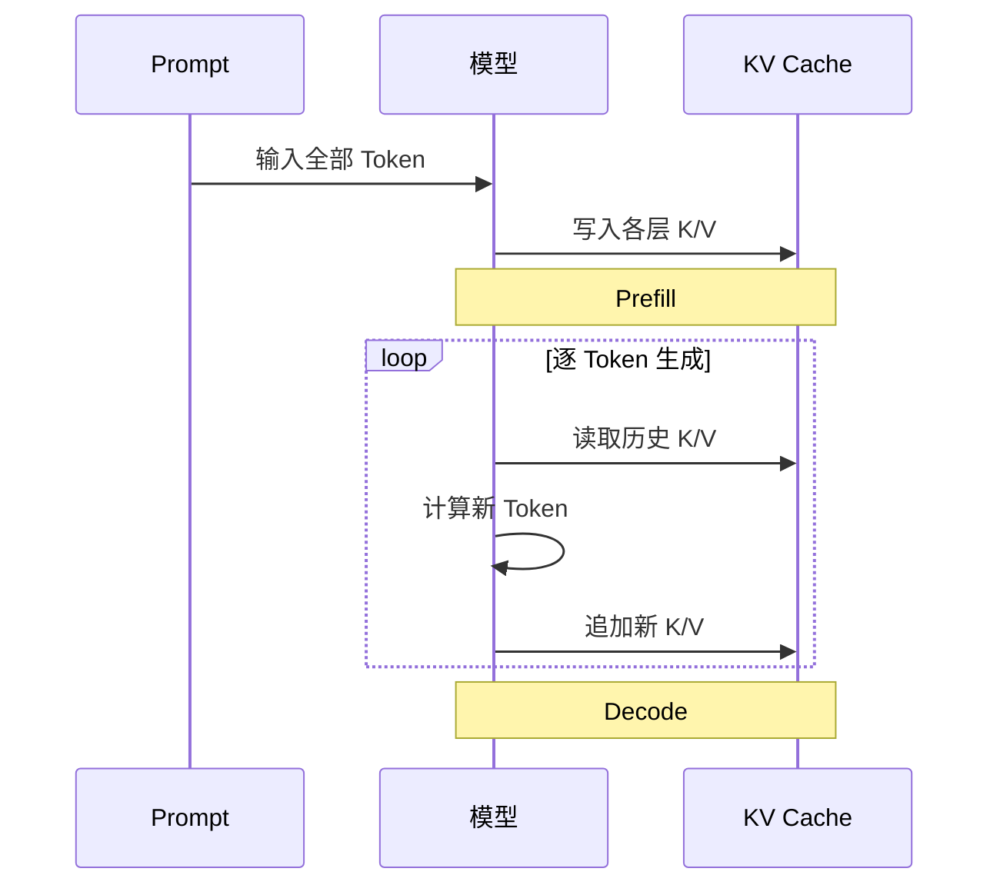
```mermaid
sequenceDiagram
    participant U as Prompt
    participant M as 模型
    participant C as KV Cache

    U->>M: 输入全部 Token
    M->>C: 写入各层 K/V
    Note over M,C: Prefill

    loop 逐 Token 生成
        M->>C: 读取历史 K/V
        M->>M: 计算新 Token
        M->>C: 追加新 K/V
    end
    Note over M,C: Decode
```

---

## 8.3 KV Cache

KV Cache（Key-Value Cache，键值缓存）保存历史 Token 在每一层产生的 Key 和 Value。

没有 KV Cache：

```text
每一步都重新计算全部历史 Token
```

有 KV Cache：

```text
历史 K/V 直接复用
每一步只计算新 Token
```

如果忽略对齐和框架元数据，未分片 KV Cache 的字节数可以粗略估算为：

$$
2BSL H_{\mathrm{kv}}d_{\mathrm{head}}b
$$

其中 2 表示 Key 和 Value，$B$ 是 Batch，$S$ 是已缓存序列长度，$L$ 是层数，$H_{\mathrm{kv}}$ 是 K/V Head 数，$d_{\mathrm{head}}$ 是每头维度，$b$ 是每个元素的字节数。张量并行、量化、块对齐和不同层结构会改变实际数值，因此这只是容量估算而不是运行时精确账单。

---

## 8.4 MHA、MQA 与 GQA

MHA、MQA 和 GQA 的主要区别是：

> 多个 Query Head 是否共享 Key Head 和 Value Head。

三种结构通常都保留多个 Query Head，区别在于 K/V Head 的数量。

- **MHA**：Multi-Head Attention，多头注意力；
- **MQA**：Multi-Query Attention，多查询注意力；
- **GQA**：Grouped-Query Attention，分组查询注意力。

### MHA

每个 Query Head 都使用独立的 K/V Head。

例如有 8 个 Query Head：

```text
Q0 → K0、V0
Q1 → K1、V1
...
Q7 → K7、V7
```

特点：

* 每个 Head 可以学习不同的 K/V 表示；
* 表达能力较强；
* 需要保存的 K/V 较多，KV Cache 较大。

### MQA

所有 Query Head 共享同一组 K/V：

```text
Q0 ─┐
Q1 ─┤
... ├──→ K0、V0
Q7 ─┘
```

需要注意，MQA 仍然有多个不同的 Query Head，只是它们查询同一组 K/V。

特点：

* KV Cache 最小；
* 读取历史 K/V 的内存开销更低；
* 自回归解码通常更快；
* K/V 表示的多样性下降，可能损失部分模型能力。

### GQA

将 Query Head 分成若干组，每组共享一组 K/V。

例如 8 个 Query Head、2 个 K/V Head：

```text
Q0～Q3 → K0、V0
Q4～Q7 → K1、V1
```

GQA 在 MHA 和 MQA 之间折中：

* 比 MHA 使用更少的 K/V Head，KV Cache 更小；
* 比 MQA 保留更多组 K/V，表达能力通常更强；
* 常用于兼顾模型质量和推理效率。

### 三者对比

| 结构  | Query Head |        K/V Head | KV Cache | 特点      |
| --- | ---------: | --------------: | -------: | ------- |
| MHA |         多个 | 与 Query Head 相同 |       最大 | 表达能力强   |
| GQA |         多个 |   少于 Query Head |       中等 | 质量与效率折中 |
| MQA |         多个 |             1 个 |       最小 | 解码效率优先  |

假设 Query Head 数量为 32：

```text
MHA：32 个 Query Head，32 个 K/V Head
GQA：32 个 Query Head，8 个 K/V Head
MQA：32 个 Query Head，1 个 K/V Head
```

KV Cache 的大小近似与 K/V Head 数量成正比。因此，从 32 个
K/V Head 减少到 8 个时，KV Cache 理论上约缩小为原来的四分之一。

MQA 和 GQA 的主要收益出现在自回归解码阶段：每生成一个新 Token，都需要读取历史 Token 的 K/V。K/V Head 越少，需要保存和读取的数据就越少，因此可以支持更长的上下文、更大的并发 Batch，并降低显存带宽压力。

可以简单记为：

- MHA：每个 Query Head 独享 K/V
- GQA：每组 Query Head 共享 K/V
- MQA：所有 Query Head 共享 K/V

## 8.5 Greedy Search

每一步选择概率最大的 Token：

$$
x_t
=
\arg\max_x
P(x\mid x_{1:t-1})
$$

优点：

- 确定性强；
- 速度快；
- 易复现。

缺点：

- 容易陷入局部最优；
- 输出可能保守或重复。

---

## 8.6 Beam Search

Beam Search 每一步保留多个候选序列。

```text
Beam Width = 3
→ 每一步保留总分最高的 3 条路径
```

适合受约束生成和序列转换，但计算量高于 Greedy Search。

---

## 8.7 Temperature

Temperature 作用于 Logits：

$$
P_i
=
\frac{\exp(z_i/T)}
{\sum_j\exp(z_j/T)}
$$

- $T\lt1$：分布更尖锐，结果更确定；
- $T\gt1$：分布更平坦，结果更随机。

Temperature 不会增加模型知识，只改变采样随机性。

公式要求 $T\gt0$。接口中的 `temperature = 0` 通常被特殊处理为 Greedy Search，而不是把 0 直接代入分母；极小正数只会逼近 Argmax，仍可能受数值误差和其他采样处理影响。

---

## 8.8 Top-k 与 Top-p

### Top-k

只保留概率最高的 K 个 Token。

### Top-p

Top-p 又称 Nucleus Sampling，核心采样。

按概率从高到低排序，选择累计概率达到 $p$ 的最小候选集合。

| 维度 | Top-k | Top-p |
|---|---|---|
| 候选规模 | 固定 | 动态 |
| 控制方式 | 数量 | 累计概率 |
| 分布尖锐时 | 仍保留 K 个 | 可能只保留少量 |
| 分布平坦时 | 仍保留 K 个 | 可能保留更多 |

---

## 8.9 重复惩罚、最大长度与停止条件

### 重复惩罚

降低已生成 Token 再次出现的概率。

惩罚过强可能破坏：

- 专有名词；
- 代码变量名；
- 固定格式；
- 长文本连贯性。

### 最大生成长度

限制输出 Token 数量，防止成本和延迟失控。

### Stop Token

生成指定 Token 或字符串时停止。

---

## 8.10 量化

量化用有限的整数或低位浮点集合近似原始实数。FP16、BF16 通常属于低精度浮点计算或类型转换；典型线性整数定点量化还需要 Scale 和 Zero Point，不能把二者简单视为同一种机制。

对一组浮点值 $x$，仿射量化可以写成：

$$
q=\operatorname{clip}\left(\operatorname{round}\left(\frac{x}{s}\right)+z, q_{\min},q_{\max}\right),
\qquad
\hat x=s(q-z)
$$

$s$ 决定整数一步代表多大的实数范围，$z$ 让实数 0 能映射到某个整数。对称量化通常令 $z=0$，计算简单；非对称量化可以更充分利用偏向一侧的数值范围，但需要处理 Zero Point。量化误差来自舍入和超出表示范围后的截断，因此范围太宽会浪费精度，太窄又会饱和异常值。

Scale 可以覆盖整个张量，也可以按输出通道、按若干权重组成的 Group，或按激活 Token 计算。Per-tensor 元数据少但容易被极端通道拖累；Per-channel、Per-group 更精细，却增加 Scale 数量和 Kernel 复杂度。`group size = 128` 表示每 128 个权重共享量化参数，不是把模型切成 128 个并行组。

PTQ（Post-Training Quantization）在训练完成后量化模型，成本低；其中激活量化通常要用代表性数据观察数值范围，这一步也叫 Calibration。QAT（Quantization-Aware Training）在训练中插入模拟量化误差，让模型适应最终精度，成本更高但可能恢复质量。这里的 Calibration 是选择数值范围和 Scale，与前文让分类概率可信的概率校准无关。

Weight-only 量化只压缩权重，计算时将权重解量化到较高精度与 FP16/BF16 激活相乘，常写作 W4A16；W8A8 则让权重和激活都使用 INT8，可能使用整数矩阵指令获得更高吞吐。KV Cache 也可单独量化来提高并发和上下文长度，但反复读取的误差可能影响长文本质量。

GPTQ 是利用校准样本和近似二阶信息逐步补偿权重量化误差的 PTQ 方法；AWQ 根据激活统计识别更重要的权重通道并保护其尺度；SmoothQuant 把难量化的激活幅值平滑迁移到权重一侧，以便执行 W8A8。它们解决的侧重点不同，不能只按“都是 INT4/INT8”互换模型文件。

量化通常能降低权重和 Cache 显存、减少内存带宽并提高吞吐，但是否加速取决于硬件是否有对应指令、Kernel 是否高效、解量化开销和 Batch 形状。模型文件更小不等于端到端延迟一定更低；输出层、归一化层或少数敏感通道也常保留更高精度。

---

## 8.11 延迟、吞吐与并发

### 延迟

单个请求从提交到完成所需时间。

### 吞吐

单位时间内处理的请求数或 Token 数。

### 并发

同时处于处理状态的请求数量。

常用指标：

- TTFT：Time to First Token，首 Token 延迟；
- TPOT：Time per Output Token，平均每个输出 Token 的时间；
- Tokens/s：每秒 Token 数；
- Requests/s：每秒请求数；
- P50、P95、P99：不同百分位延迟。

更大 Batch 往往提升吞吐，但可能增加排队时间和单请求延迟。

---

## 8.12 推理服务的批处理与调度

离线静态 Batch 会把一组请求绑在一起运行，短请求结束后，其位置可能一直空闲到最长请求完成。Continuous Batching 在每个 Decode 迭代边界移出已完成请求，并从等待队列补入新请求，使 GPU 上持续保持合适数量的活动序列。它提高的是多请求并发利用率，不会让单个自回归请求的未来 Token 突然全部并行生成。

传统 KV Cache 如果为每个请求预留最大连续空间，会产生内部浪费和外部碎片。Paged KV Cache 把逻辑 Token 序列映射到固定大小的非连续物理块，需要扩展时再分配新块；共享前缀还可以通过引用计数和 Copy-on-Write 复用已有块。它借用了虚拟内存分页的思想，但这些块由推理运行时管理，不是操作系统真的在交换 GPU 页面。

Prefix Cache 保存已经计算过的相同 Token 前缀对应的 KV 块。系统提示、固定模板或共享文档前缀再次出现时，可以跳过相应 Prefill。匹配必须包含 Token、模型、适配器以及影响位置和注意力的配置；Prefix Cache 复用精确计算结果，而 Semantic Cache 根据语义相似度直接复用答案或中间结果，正确性边界完全不同。

长 Prompt 的 Prefill 通常是计算密集型，Decode 更常受显存带宽限制。Chunked Prefill 把超长 Prompt 切成多个计算块，与其他请求的 Decode 交错调度，从而减少长请求阻塞整个队列，并让一次迭代的 Token 数更稳定。块太小会增加调度与 Kernel 开销，块太大又会加重 Decode 抖动，因此 TTFT、TPOT 和总吞吐之间需要权衡。

调度器还要做 Admission Control：根据可用 KV 块、最大上下文、优先级和服务等级决定接纳、排队、抢占或拒绝请求。没有背压时，请求到达速度持续超过服务速度，队列只会把过载隐藏成越来越高的 P99 延迟。吞吐测试必须给出输入长度、输出长度、并发、量化方式和延迟约束，单独报告峰值 Tokens/s 没有可比性。

Speculative Decoding 使用较小 Draft 模型或 MTP Head 一次提出多个候选 Token，再让 Target 模型通过一次前向并行验证。候选接受率高时，可以用一次昂贵的 Target 调用推进多个位置；按正确的接受与重采样规则实现时，仍能保持 Target 模型的目标分布。它不会减少 Target 权重占用，草稿模型太慢或候选经常被拒绝时也可能没有收益。

## 8.13 Dense 与 MoE

Dense 表示稠密模型，每个 Token 都经过相同主要参数。

MoE（Mixture of Experts，混合专家模型）包含多个 Expert，由 Router 为每个 Token 选择少量专家。

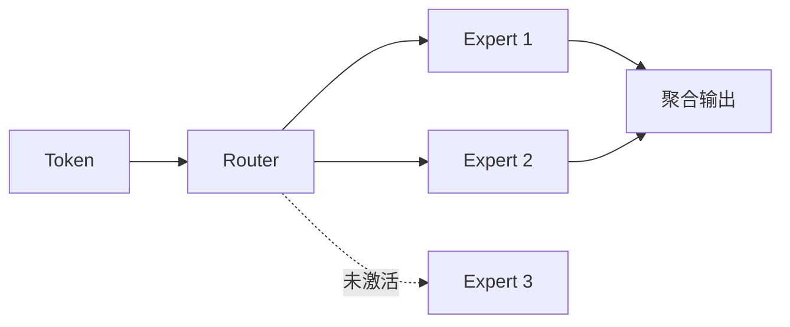
```mermaid
flowchart LR
    T[Token] --> R[Router]
    R --> E1[Expert 1]
    R --> E2[Expert 2]
    R -.未激活.-> E3[Expert 3]
    E1 --> O[聚合输出]
    E2 --> O
```

对 Token 隐藏向量 $h$，Router 先计算各专家的 Logits 和概率，再选择 Top-k：

$$
a=W_rh,
\qquad
p=\mathrm{softmax}(a),
\qquad
y=\sum_{e\in\operatorname{TopK}(p)}\tilde p_eE_e(h)
$$

$E_e$ 通常是独立 FFN，$\tilde p_e$ 是对已选专家重新归一化后的权重。稀疏路由让模型拥有很大的总参数容量，却只为每个 Token 激活少数专家。总参数量决定存储和分布式部署压力，激活参数量更接近单 Token 的矩阵计算量，二者不能混为一个“模型大小”。

如果 Router 总把 Token 发给少数专家，这些设备会拥塞，其余专家又学不到数据。训练通常加入负载均衡辅助损失，约束各专家接收的 Token 比例与平均路由概率。系统还会为每个 Expert 设置 Capacity；超出容量的 Token 可能被丢弃、转发到备选专家，或通过 Padding 扩大缓冲区。容量太小损害质量，太大又浪费显存和计算。

专家并行时，All-to-All 先按路由结果跨设备交换 Token，Expert 计算后再交换回来。MoE 因而可能减少每 Token 的算术量，却增加通信和不规则访存。Shared Expert 始终处理所有 Token，用于承载通用能力；Routed Expert 学习更专门的模式，两者也不能按同一种 Top-k 规则计数。

特点：

- 总参数量可以很大；
- 每个 Token 通常只激活少量专家；
- 需要负载均衡；
- 分布式通信更复杂。

---

## 8.14 FlashAttention

FlashAttention 不改变标准 Attention 的数学定义，属于精确而非近似的 Attention 算法；但分块会改变浮点运算顺序，因此结果允许存在舍入误差，不能承诺与朴素实现逐位一致。它主要优化 Attention 在 GPU 上的计算和数据读写方式。

传统 Attention 通常会生成并保存完整的注意力分数矩阵：

```text
Q、K
  ↓
计算完整的注意力分数矩阵
  ↓ 写入显存
Softmax
  ↓ 再从显存读取
与 V 相乘
```

当序列长度为 $N$ 时，注意力分数矩阵大小为 $N\times N$。
长序列下，这个矩阵会占用大量显存，并产生多次显存读写。

FlashAttention 的核心思路是：

* 将 Q、K、V 划分成较小的数据块；
* 将数据块加载到速度更快的片上存储中计算；
* 使用在线 Softmax，分块维护最大值和归一化结果；
* 直接累积最终输出，不保存完整的注意力分数矩阵；
* 将多个计算步骤融合到一个 GPU Kernel 中。

在线 Softmax 能在看不到整行分数时保持数值稳定。若已经处理部分分数，保存最大值 $m$ 和归一化和 $l=\sum_j e^{s_j-m}$；新块的最大值和归一化和为 $m_b,l_b$，合并时：

$$
m'=\max(m,m_b),
\qquad
l'=e^{m-m'}l+e^{m_b-m'}l_b
$$

输出累加器也按新的最大值同比例缩放，就能继续处理下一块而不保存完整概率矩阵。

简化过程如下：

```text
读取一小块 Q、K、V
        ↓
在片上存储中计算局部注意力
        ↓
在线更新 Softmax 和输出
        ↓
继续处理下一块
```

HBM（High Bandwidth Memory，高带宽显存）是 GPU 的大容量片外内存，带宽虽高，但访问延迟和能耗仍明显高于片上寄存器与共享内存。标准 Attention 往返读写 $N\times N$ 中间矩阵时，性能可能被数据搬运而不是浮点运算限制。I/O-aware 指算法同时核算存储层级和搬运次数，而不只是大 O 计算量。

因此，FlashAttention 可以：

* 避免保存大小为 $N\times N$ 的完整中间矩阵；
* 减少 GPU 高带宽显存 HBM 与片上存储之间的数据搬运；
* 降低 Attention 的显存占用；
* 提高长序列训练和推理的运行效率；
* 支持更长的上下文或更大的 Batch Size。

FlashAttention 属于 **I/O-aware** 优化：它不仅考虑计算次数，还重点
减少速度较慢的显存读写。

需要注意：

* FlashAttention 不属于稀疏 Attention 或近似 Attention；
* 它不会改变模型结构，数学结果等价但浮点结果不保证逐位相同；
* 它主要降低内存访问开销，不会改变标准 Attention 的
  $O(N^2)$ 理论计算复杂度；
* 序列越长，避免保存完整注意力矩阵带来的收益通常越明显。

可以简单理解为：

> 普通 Attention 先生成完整注意力矩阵再继续计算；
> FlashAttention 边分块计算、边完成 Softmax 和输出累积，不让完整矩阵落入显存。

其中最关键的一点不是单纯“分块”，而是：

$$
\boxed{\text{分块计算}+\text{在线 Softmax}+\text{减少 HBM 读写}}
$$

这样才能说明它为什么在保持标准 Attention 语义的同时，降低显存占用并提高速度。

---

## 8.15 MLA

MLA（Multi-Head Latent Attention，多头潜在注意力）通过低维潜在表示压缩 Key/Value 信息，主要目标是降低 KV Cache 和推理带宽压力。标准 MHA 会为每个历史 Token 缓存各头的完整 Key 和 Value；MLA 的典型做法是先把隐藏状态下投影为较小的潜在向量：

$$
c_t^{KV}=W_{DKV}h_t,
\qquad
k_t=W_{UK}c_t^{KV},
\qquad
v_t=W_{UV}c_t^{KV}
$$

部署时缓存 $c_t^{KV}$，并在计算中重建或把上投影矩阵吸收到后续矩阵乘法中，就能用较少缓存字节支持更多并发。位置编码相关的 Key 分量可能需要单独保留，以避免低秩压缩与 RoPE 耦合破坏计算。

MLA 的收益来自用额外投影和更复杂 Kernel 换取较小 KV Cache，实际速度取决于潜在维度、矩阵吸收方式和硬件实现。它不是无损压缩文件格式，也不等同于减少 K/V Head 数的 GQA：GQA 在多个 Query Head 之间共享 K/V Head，MLA 则压缩每个 Token 要缓存的表示。

不要将 MLA 与 LoRA 混淆：

- MLA：模型架构和推理优化；
- LoRA：参数高效微调方法。

---

## 8.16 模型如何进入 AI Compiler

训练框架中的模型由张量算子组成，例如 Linear、RMSNorm、Attention 和 Top-k；硬件真正执行的则是经过布局选择、分块和并行映射的 Kernel。Operator 描述“要计算什么”，Kernel 描述“在特定硬件上怎样计算”。一个 Operator 可以根据形状、数据类型和设备选择多个 Kernel，也可能与相邻 Operator 融合成一个 Kernel。

Eager Execution 每执行一条框架语句就立即调度对应运算，便于调试和动态控制流；Graph Execution 先捕获一段计算图，再跨算子分析和优化。图模式能做更多全局优化，但动态形状、数据依赖控制流和副作用会增加捕获与编译难度。编译不是简单把 Python 翻译成 CUDA，而是逐层降低抽象：

```text
模型与计算图
→ 高层张量 IR
→ 融合、常量折叠与形状推导
→ Tiling、Layout 和并行映射
→ 低层循环、向量或 GPU IR
→ 目标机器码与 Runtime 调度
```

IR（Intermediate Representation，中间表示）保存某一抽象层级的运算和类型；Lowering 把高层操作逐步转换为更接近硬件的操作。算子融合减少中间张量和 Kernel Launch，却可能增加寄存器压力、降低并行度，因此需要成本模型。Tiling 把大张量拆成适合寄存器、共享内存和缓存的块；Layout 决定逻辑索引如何映射到物理地址，错误布局会产生非合并访存或额外转置。

MLIR 如何用 Operation、Dialect、Rewrite、Bufferization 和 Dialect Conversion 承载这条
多层 Lowering 链路，见[MLIR：多层中间表示与渐进式 Lowering](post.html?slug=mlir)。

内存规划根据张量生命周期复用 Buffer，并在计算与通信之间安排拷贝。静态形状便于提前选 Tile 和分配内存，动态形状则可能需要 Shape Guard、多个编译版本或通用但较慢的回退 Kernel。推理引擎还负责请求调度、KV Cache 和分布式通信，AI Compiler 主要优化图与 Kernel；二者协作但不是同一层系统。

CFG、数据流、融合、布局、Tiling、GPU 映射和成本模型在[编译器与高性能系统算法](post.html?slug=compiler_algorithms)中继续展开。

---

## 8.17 Qwen3.5-397B-A17B：从公开配置读懂模型结构

Qwen3.5-397B-A17B 已经开放权重、Model Card、配置文件和推理实现，
适合用来把前面的多模态、Attention、MoE、KV Cache、RMSNorm 与
推测解码串联起来。

模型名称中的两组数字分别表示：

```text
397B：总参数量约 3970 亿
A17B：一次前向路径约激活 170 亿参数
```

它不是 17B Dense 模型，而是总参数量为 397B 的稀疏 MoE 模型。

### 模型总览

| 项目 | 公开配置 |
|---|---|
| 模型类型 | 带视觉编码器的 Causal Language Model |
| 模型类 | `Qwen3_5MoeForConditionalGeneration` |
| 参数量 | 397B 总参数，约 17B 激活参数 |
| 文本主干 | 60 层，隐藏维度 4096 |
| 词表 | 248,320 个 Token |
| 层排列 | 15 组 ×（3 层 Gated DeltaNet + 1 层 Gated Attention） |
| MoE | 512 个路由 Expert；每个 Token 选择 10 个，再加 1 个共享 Expert |
| 视觉编码器 | 27 层，隐藏维度 1152，16 个 Attention Head |
| 原生上下文 | 262,144 Token，可通过 YaRN 扩展到 1,010,000 Token |
| 其他结构 | RMSNorm、SiLU、Multi-Token Prediction |
| 权重许可 | Apache 2.0 |

### 整体数据流

官方 Model Card 将它定义为“带视觉编码器的因果语言模型”。图像或视频
先转换为视觉 Token，再与文本 Token 一起进入同一个语言模型主干：

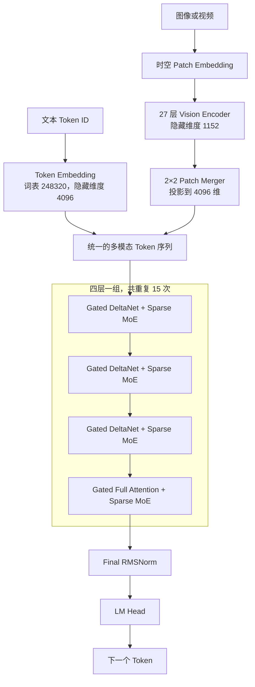
```mermaid
flowchart TB
    T[文本 Token ID] --> E[Token Embedding<br/>词表 248320，隐藏维度 4096]
    V[图像或视频] --> P[时空 Patch Embedding]
    P --> VE[27 层 Vision Encoder<br/>隐藏维度 1152]
    VE --> PM[2×2 Patch Merger<br/>投影到 4096 维]
    E --> F[统一的多模态 Token 序列]
    PM --> F

    subgraph R[四层一组，共重复 15 次]
        L1[Gated DeltaNet + Sparse MoE]
        L2[Gated DeltaNet + Sparse MoE]
        L3[Gated DeltaNet + Sparse MoE]
        L4[Gated Full Attention + Sparse MoE]
        L1 --> L2 --> L3 --> L4
    end

    F --> L1
    L4 --> N[Final RMSNorm]
    N --> H[LM Head]
    H --> O[下一个 Token]
```

这张图对应公开配置中的真实层排列：

$$
15\times(3\times\mathrm{GDN}+1\times\mathrm{FullAttention})
=60\text{ 层}
$$

每一层都先执行一种 Token Mixer，再进入 Sparse MoE，最后通过残差连接
继续向后传递。

### 混合注意力：45 层 GDN 与 15 层全注意力

60 层中，每 4 层的前三层使用 Gated DeltaNet，第四层使用带输出门控的
全注意力，因此共有：

- 45 层 Gated DeltaNet 线性注意力；
- 15 层 Gated Full Attention；
- 全注意力层间隔 `full_attention_interval = 4`。

Gated DeltaNet 的公开配置是：

| 配置 | 数值 |
|---|---:|
| Q/K Head 数 | 16 |
| V Head 数 | 64 |
| Head Dimension | 128 |
| 一维卷积 Kernel | 4 |

DeltaNet 可以把每个 Head 的状态理解为一个随 Token 更新的“快速权重”矩阵。忽略实现细节后，一种典型 Delta Rule 可以写成：

$$
S_t
=
\alpha_tS_{t-1}
+
\beta_t\left(v_t-S_{t-1}k_t\right)k_t^T,
\qquad
o_t=S_tq_t
$$

$S_{t-1}k_t$ 是当前状态对 Key 的已有预测，$v_t-S_{t-1}k_t$ 是需要写入的误差；$\beta_t$ 控制写入强度，门控 $\alpha_t$ 控制旧状态保留程度。一维卷积先混合相邻 Token，递归状态再汇总更长历史。实际实现还会做归一化、分头计算和并行扫描，公式用于理解机制而不是逐行复刻 Kernel。

它在增量解码时维护固定形状的卷积与递归状态，不需要像标准全注意力那样为所有历史 Token 保存完整 K/V，因此适合承担大部分长序列计算。代价是历史被压入有限状态，不能像全注意力那样随时显式访问每个旧 Token；混合架构周期性插入全注意力层，正是在状态效率与精确 Token 交互之间折中。

全注意力层使用 GQA：

| 配置 | 数值 |
|---|---:|
| Query Head 数 | 32 |
| Key/Value Head 数 | 2 |
| Head Dimension | 256 |
| RoPE Dimension | 64 |

这正好对应前面的 MHA、MQA 与 GQA：32 个 Query Head 共享 2 组 K/V，
明显减少全注意力层的 KV Cache。

Gated DeltaNet 与 FlashAttention 仍然不是同一个概念：

```text
Gated DeltaNet：改变 Attention 的计算结构和增量状态
FlashAttention：不改变全注意力的数学定义，优化 Kernel 与显存读写
```

### Sparse MoE：512 选 10，再加共享 Expert

每个 Decoder Layer 后面都有一个 Sparse MoE Block：

```mermaid
flowchart LR
    X[Token 隐藏状态] --> R[Router]
    R -->|Top-k = 10| E[从 512 个 Expert 中选择 10 个]
    X --> S[1 个共享 Expert]
    E --> W[按路由权重聚合]
    S --> W
    W --> Y[MoE 输出]
```

具体配置包括：

- 512 个 Routed Expert；
- 每个 Token 激活其中 10 个；
- 另有 1 个始终参与计算的 Shared Expert；
- Routed Expert 和 Shared Expert 的中间维度都是 1024；
- Router 对 Top-k 概率重新归一化后加权聚合 Expert 输出。

激活参数占总参数的比例约为：

$$
\frac{17\text{B}}{397\text{B}}
\approx 4.28\%
$$

模型的隐藏维度只有 4096，大量参数来自每层的 512 组 Expert 权重。
这说明 MoE 主要是在“专家数量”方向扩展容量，而不是让每个 Token 都
经过一个极宽的 Dense FFN。

不过，17B 激活参数只描述一次计算路径，不代表部署时只需装入 17B 权重：

- 512 个 Expert 的权重仍要存放在内存或分布式设备上；
- Expert Parallel 通常需要 All-to-All 通信；
- Router 负载不均会造成部分设备拥塞；
- 实际速度还取决于 Batch、序列长度、通信拓扑和推理 Kernel。

### 原生多模态与视觉编码器

视觉编码器的公开配置为：

| 配置 | 数值 |
|---|---:|
| Vision Block 数 | 27 |
| Hidden Size | 1152 |
| Intermediate Size | 4304 |
| Attention Head 数 | 16 |
| 空间 Patch Size | 16 × 16 |
| 时间 Patch Size | 2 |
| Spatial Merge Size | 2 × 2 |
| 输出维度 | 4096 |

图像和视频首先通过三维卷积形成时空 Patch。Vision Encoder 提取特征后，
Patch Merger 合并相邻的 $2\times2$ 空间 Patch，并投影到语言模型的
4096 维隐藏空间。这样视觉 Token 与文本 Token 可以在进入 60 层主干时
使用相同维度，实现 Early Fusion。

这与“先让独立视觉模型生成一段文字，再交给语言模型”不同：视觉信息
在模型内部仍以 Token 表示参与后续的 Attention、MoE 和自回归推理。

### RMSNorm、MTP 与推测解码

文本主干在每个 Token Mixer 和 MoE 前使用 RMSNorm，公开配置中的
$\epsilon=10^{-6}$。实现采用 Zero-Centered 参数化：可训练权重初始化为
0，实际缩放因子使用 $1+w$，从而让初始缩放仍然等于 1。

模型还包含一个 MTP Hidden Layer，并进行了 Multi-Token Prediction
训练。普通自回归模型每次只预测下一个 Token；MTP 额外学习更远位置的
候选 Token，可在 SGLang 或 vLLM 中用于推测解码：

```text
MTP 快速提出多个候选 Token
→ 主模型并行验证候选
→ 接受正确前缀
→ 从第一个不匹配处继续生成
```

MTP 的目标是减少逐 Token 串行解码次数，但实际加速比仍取决于候选接受率、
Batch Size、硬件和推理框架。

### 262K 原生上下文与 1M 扩展上下文

开放权重的原生上下文长度是 262,144 Token。Model Card 给出的
1,010,000 Token 是通过 YaRN 位置外推得到的扩展能力，两者不能混为一谈。

混合注意力也改变了长上下文缓存的构成：

- 15 个全注意力层需要保存随序列增长的 K/V；
- 45 个 Gated DeltaNet 层主要维护固定大小的递归与卷积状态；
- GQA 又将全注意力层的 K/V Head 从 32 个减少到 2 个；
- 上下文越长，Prefill、视觉 Token 和剩余 KV Cache 仍会产生显著开销。

静态 YaRN 会对所有长度使用同一个缩放因子，官方提示它可能影响短文本效果，
因此只有确实需要超长上下文时才应启用，并根据常用长度选择缩放倍数。

### 部署时应怎样理解 397B-A17B

官方权重使用 BF16，模型仓库总体接近 800 GB。即使每次只激活约 17B 参数，
完整权重、视觉编码器、运行时 Buffer、Expert 通信以及长上下文状态仍然决定
部署资源，因此该模型通常需要量化、Tensor Parallel、Expert Parallel 或
CPU/GPU 异构推理。

公开实现已经支持 Transformers、vLLM、SGLang 和 KTransformers，
但“框架能够加载”不代表任意硬件都能达到相同的吞吐和上下文长度。

这些名称所处层次并不完全相同。Transformers 主要提供模型定义、权重加载、训练与通用推理接口；vLLM 面向高吞吐服务，重点管理 Continuous Batching 和块式 KV Cache；SGLang 同时提供模型服务运行时与结构化生成的编程接口；KTransformers 侧重通过自定义算子和 CPU/GPU 异构执行降低超大模型的本地部署门槛。它们可以共享模型权重生态，但调度策略、支持的量化格式和 Kernel 覆盖范围并不天然兼容。

公开资料：

- [Qwen3.5-397B-A17B 官方 Model Card](https://huggingface.co/Qwen/Qwen3.5-397B-A17B)
- [Qwen3.5-397B-A17B 官方配置文件](https://huggingface.co/Qwen/Qwen3.5-397B-A17B/blob/main/config.json)
- [Qwen3.5 官方发布说明](https://qwen.ai/blog?id=qwen3.5)
- [Transformers 中的 Qwen3.5 MoE 实现](https://github.com/huggingface/transformers/blob/main/src/transformers/models/qwen3_5_moe/modeling_qwen3_5_moe.py)

---

# 9. RAG：检索增强生成

## 9.1 RAG 解决什么问题

RAG（Retrieval-Augmented Generation，检索增强生成）在生成前检索外部知识。

它适合解决：

- 模型知识过时；
- 私有知识无法直接访问；
- 精确条款和编号记忆不可靠；
- 需要引用来源；
- 知识频繁更新。

```mermaid
flowchart LR
    Q[用户问题] --> R[检索系统]
    K[(知识库)] --> R
    R --> C[相关上下文]
    Q --> L[大语言模型]
    C --> L
    L --> A[答案与引用]
```

RAG 不直接修改模型参数，而是在推理阶段注入证据。

---

## 9.2 完整链路

```mermaid
flowchart TB
    subgraph Offline[离线建库]
        D1[文档采集] --> D2[清洗与解析]
        D2 --> D3[Chunk 切分]
        D3 --> D4[Embedding]
        D4 --> D5[建立索引]
        D5 --> DB[(向量索引与倒排索引)]
    end

    subgraph Online[在线查询]
        Q1[用户 Query] --> Q2[Query 改写]
        Q2 --> Q3[多路召回]
        DB --> Q3
        Q3 --> Q4[Rerank]
        Q4 --> Q5[上下文组装]
        Q5 --> Q6[LLM 生成]
        Q6 --> Q7[引用与评估]
    end
```

---

## 9.3 文档清洗与元数据

知识库不仅应保存正文，还应保存：

- 标题；
- 来源；
- 更新时间；
- 文档类型；
- 章节路径；
- 权限标签；
- 租户标识；
- 版本信息。

推荐结构：

```json
{
  "chunk_id": "doc-1024-section-3-chunk-2",
  "document_id": "doc-1024",
  "title": "退款规则",
  "content": "……",
  "source": "knowledge_base/refund_policy.md",
  "updated_at": "2026-07-01",
  "permission_tags": ["support", "finance"],
  "section_path": ["售后规则", "退款", "部分退款"]
}
```

---

## 9.4 Chunk 切分

Chunk 是检索的基本单元。

### 太小

- 语义不完整；
- 上下文缺失；
- 标题与正文分离。

### 太大

- 混合多个主题；
- 检索不精确；
- 上下文噪声增加；
- Token 成本变高。

### Overlap

Chunk Overlap 表示相邻文本块保留重叠内容。

```text
Chunk 1：A B C D E
Chunk 2：D E F G H
```

它能减少语义被切断的问题，但过大也会造成重复召回和索引膨胀。

---

## 9.5 Embedding 与相似度

Embedding 模型将文本映射为固定维度向量：

$$
f(\mathrm{text})
\rightarrow
\mathbf{v}\in\mathbb{R}^{d}
$$

### 余弦相似度

$$
\cos(\theta)
=
\frac{\mathbf{x}\cdot\mathbf{y}}
{\|\mathbf{x}\|\|\mathbf{y}\|}
$$

### 点积

$$
\mathbf{x}\cdot\mathbf{y}
=
\sum_{i=1}^{d}x_i y_i
$$

### 欧氏距离

$$
d(\mathbf{x},\mathbf{y})
=
\sqrt{
\sum_{i=1}^{d}
(x_i-y_i)^2
}
$$

距离函数必须与 Embedding 模型的训练方式保持一致。

---

## 9.6 BM25 与向量检索

BM25 通常指 Okapi BM25，是关键词相关性排序方法。

对查询中的词 $q_i$，一个常见形式为：

$$
\operatorname{score}(D,Q)
=
\sum_{q_i\in Q}
\operatorname{IDF}(q_i)
\frac{f(q_i,D)(k_1+1)}
{f(q_i,D)+k_1\left(1-b+b\frac{|D|}{\operatorname{avgdl}}\right)}
$$

$f(q_i,D)$ 是词在文档中的频次，IDF 让少见词比常见词更有区分力，分式让词频收益逐渐饱和，并通过文档长度相对平均长度做归一化。$k_1$ 控制词频饱和速度，$b$ 控制长度归一化强度。BM25 需要倒排索引，因此能快速找到包含查询词的文档，而不必扫描每篇正文。

BM25 匹配的是分词后的词项，不等同于数据库中的精确等值过滤，也不天然理解同义词和语义。错误码和产品编号能否保留为完整词项取决于 Analyzer；如果分词规则把它拆坏，公式本身也无法补救。

擅长：

- 错误码；
- 产品编号；
- 专有名词；
- 罕见词；
- 精确字段。

向量检索擅长：

- 同义表达；
- 语义匹配；
- 不同措辞之间的关联。

Hybrid Search 是混合检索，将 BM25 与向量检索结合。

---

## 9.7 Hybrid Search 与 RRF

RRF（Reciprocal Rank Fusion，倒数排名融合）可以融合多路检索排名：

$$
\mathrm{RRFScore}(d)
=
\sum_{r\in R}
\frac{1}{k+\mathrm{rank}_{r}(d)}
$$

它主要利用排名位置，而不要求不同检索器的原始分数具有相同尺度。

公式中的 $k$ 是防止头部名次分数过大并控制不同排名位置差距的平滑常数，不是“最终返回 Top-k 条”的候选数量。RRF 忽略原始相似度尺度，适合融合 BM25 与向量检索；代价是它也丢弃了原始分数中可能有用的置信信息。

---

## 9.8 ANN 与 Rerank

ANN（Approximate Nearest Neighbor，近似最近邻）用于快速从大规模向量库召回候选。

精确最近邻需要把 Query 与全部 $N$ 个 $d$ 维向量比较，计算约为 $O(Nd)$。ANN 预先建立索引，只访问更可能接近 Query 的一部分候选，用少量召回损失换取更低延迟和内存访问。这里的“近似”是搜索过程可能漏掉真实最近邻，不是 Embedding 本身一定经过近似计算。

HNSW 构建多层邻接图，上层以长跳边快速靠近目标区域，底层再扩大候选做局部搜索；`efSearch` 越大通常召回越高、延迟也越大。IVF 先用粗粒度聚类把向量分到倒排桶，查询只扫描最近的若干桶；`nprobe` 决定访问多少桶。PQ 把向量维度分成若干子空间，每个子空间只保存码本编号，用压缩码近似距离。HNSW 主要减少遍历，IVF 缩小候选范围，PQ 主要压缩向量与计算，它们可以组合而不是三选一。

Rerank 是重排：

```text
全库
→ 快速召回 Top 50
→ 精确重排 Top 10
→ 选择 Top 5 进入上下文
```

Bi-Encoder 分别编码 Query 和文档，文档向量可以预计算并建立 ANN 索引，适合大规模召回；代价是二者在编码阶段无法进行逐 Token 交互。Cross-Encoder 把 Query 和候选文档一起输入模型，让 Attention 直接建模两者关系，通常排序更准确，但每个 Query—文档对都要单独前向，难以处理整个知识库。因此常见链路是 Bi-Encoder 召回几十条候选，再由 Cross-Encoder 重排。Cross-Encoder 输出的相关性分数不一定是已校准概率，也不能跨模型直接比较。

---

## 9.9 Top-k 不是越大越好

Top-k 太小：

- 可能漏掉正确证据。

Top-k 太大：

- 噪声增加；
- Rerank 成本上升；
- 上下文更长；
- 模型更容易被无关材料干扰。

Top-k 应通过评测确定。

---

## 9.10 Query Rewrite 与 HyDE

Query Rewrite 是查询改写，用于：

- 补全省略信息；
- 消除指代；
- 增加同义词；
- 生成多个检索表达；
- 提取结构化过滤条件。

HyDE（Hypothetical Document Embeddings，假设文档嵌入）：

```text
用户问题
→ 生成假设性答案
→ 对答案做 Embedding
→ 检索真实文档
```

HyDE 可能提高召回，也可能因假设答案偏离主题而引入错误。

---

## 9.11 多跳检索与 GraphRAG

多跳检索通过中间事实继续检索：

```text
问题
→ 找到实体 A
→ 根据实体 A 检索关系 B
→ 获得最终证据
```

GraphRAG 是 Graph-based Retrieval-Augmented Generation，基于图结构的检索增强生成。

典型流程会从文档中抽取实体、关系和出处，构建图，再按图社区生成多层摘要。查询局部事实时可以从相关实体沿边扩展证据；查询跨文档的全局主题时，可以检索社区摘要并逐层汇总。图结构让跨段关系显式化，却引入实体消歧、关系抽取、增量更新和来源追踪成本。

它适合：

- 多实体关系；
- 长依赖链；
- 图谱查询；
- 全局主题总结。

但图谱构建、实体消歧和更新维护成本较高。

GraphRAG 不是所有使用数据库图结构的 RAG，也不是向量检索的替代品。单文档精确问答通常仍可直接使用关键词与向量检索；只有问题确实依赖多实体、多跳或全局结构时，建图成本才可能值得。

---

## 9.12 上下文组装

检索结果进入模型前，需要：

- 去重；
- 排序；
- 合并相邻 Chunk；
- 保留标题和来源；
- 控制总 Token；
- 处理文档版本冲突；
- 避免重复内容挤占窗口。

推荐格式：

```text
[材料 1]
标题：……
来源：……
更新时间：……
正文：……

[材料 2]
标题：……
来源：……
更新时间：……
正文：……
```

---

## 9.13 RAG 错误归因

```mermaid
flowchart TB
    A[最终答案错误] --> B{正确证据是否被召回}
    B -- 否 --> C[检索错误]
    B -- 是 --> D{正确证据是否进入最终上下文}
    D -- 否 --> E[排序、截断或组装错误]
    D -- 是 --> F{答案是否忠实于证据}
    F -- 否 --> G[生成错误]
    F -- 是 --> H[规则或评测问题]
```

错误归因必须区分：

- 检索错误；
- 重排错误；
- 上下文截断；
- 生成错误；
- 业务规则错误。

只修改 Prompt 无法修复索引错误；只更换 Embedding 也无法修复模型不遵循证据的问题。

---

## 9.14 检索评估指标

### Recall@K

$$
\mathrm{Recall@K}
=
\frac{\text{前 K 个结果中命中的相关文档数}}
{\text{全部相关文档数}}
$$

### MRR

MRR（Mean Reciprocal Rank，平均倒数排名）：

$$
\mathrm{MRR}
=
\frac{1}{N}
\sum_{i=1}^{N}
\frac{1}{\mathrm{rank}_i}
$$

### nDCG

nDCG（normalized Discounted Cumulative Gain，归一化折损累计增益）同时考虑相关度等级和排名位置。

$$
\mathrm{DCG@K}
=
\sum_{i=1}^{K}
\frac{2^{\mathrm{rel}_i}-1}{\log_2(i+1)},
\qquad
\mathrm{nDCG@K}
=
\frac{\mathrm{DCG@K}}{\mathrm{IDCG@K}}
$$

$\mathrm{rel}_i$ 是第 $i$ 个结果的分级相关度，分母让靠后的相关结果贡献更小；IDCG 是把同一批相关结果按理想顺序排列后的最大 DCG，使指标归一化到 $[0,1]$。MRR 主要观察第一个相关结果的位置，Recall@K 观察是否召回，nDCG 则适合同时评价多条结果的顺序和不同相关等级。没有任何相关结果时需要约定 nDCG 为 0 或跳过该查询，并在评测报告中保持一致。

### 生成侧指标

- 正确性；
- 忠实度；
- 完整性；
- 引用准确率；
- 引用覆盖率；
- 拒答合理性；
- 格式合规率；
- 延迟和成本。

---

## 9.15 RAG 与微调如何选择

| 需求 | RAG | 微调 |
|---|---:|---:|
| 知识频繁更新 | 更适合 | 不适合单独承担 |
| 私有知识问答 | 更适合 | 有限 |
| 改变回答风格 | 有限 | 更适合 |
| 学习固定格式 | 可以 | 更适合 |
| 提供引用 | 更适合 | 不擅长 |
| 改变行为习惯 | 有限 | 更适合 |

常见组合：

```text
微调负责行为与格式
RAG 负责知识与证据
```

---

# 10. Prompt 设计

## 10.1 Prompt 的本质

高质量 Prompt 不是单纯“写得长”，而是把任务表达为明确、可验证的规则。

一个稳定 Prompt 通常包含：

```text
角色
任务
输入定义
业务规则
处理步骤
约束条件
输出格式
异常处理
示例
验收标准
```

---

## 10.2 角色与任务

角色用于限制工作视角：

```text
你是订单计费规则解析器。
```

任务必须明确输入和输出：

```text
读取自然语言订单，识别商品、规格、数量和加料，
计算总金额，并输出合法 JSON。
```

角色不能替代具体业务规则。

---

## 10.3 输入定义与边界

需要明确：

- 输入字段；
- 缺失字段；
- 同义表达；
- 数字格式；
- 时间格式；
- 单位；
- 非法值；
- 多对象分隔方式。

---

## 10.4 输出格式

JSON（JavaScript Object Notation，JavaScript 对象表示法）适合结构化结果。

```json
{
  "items": [],
  "discount": 0,
  "total": 0,
  "errors": []
}
```

同时明确：

```text
只能输出合法 JSON。
不得输出 Markdown 代码块。
不得添加额外解释。
```

模型输出仍必须通过真正的 JSON 解析器和 Schema 校验。

---

## 10.5 异常处理

Prompt 中应定义：

- 未知商品；
- 未知规格；
- 缺少字段；
- 冲突输入；
- 空输入；
- 非法金额；
- 无法确定的信息。

推荐原则：

```text
能确定的字段正常返回；
无法确定的字段进入 errors；
不得自行创造不存在的数据。
```

---

## 10.6 正例与反例

正例说明正确输出，反例说明禁止行为。

反例尤其适合表达：

- 不允许猜测；
- 不允许自动纠正未知值；
- 不允许添加额外字段；
- 不允许输出自然语言解释。

---

## 10.7 Prompt 测试

测试集应覆盖：

- 正常输入；
- 空输入；
- 多对象；
- 缺省字段；
- 非法字段；
- 边界金额；
- 时间边界；
- 超长输入；
- 注入式输入；
- 输出格式异常。

```mermaid
flowchart LR
    P[Prompt] --> T[测试集]
    T --> R[模型输出]
    R --> V[自动校验]
    V --> F{是否通过}
    F -- 否 --> M[最小修改]
    M --> P
    F -- 是 --> D[版本发布]
```

---

# 11. Agent 与工具调用

## 11.1 Agent 是什么

Agent 是围绕目标进行规划、调用工具、观察结果并继续行动的智能体。

普通调用：

```text
输入 → 模型 → 输出
```

Agent：

```text
目标
→ 规划
→ 工具调用
→ 观察结果
→ 更新状态
→ 继续执行
```

```mermaid
flowchart LR
    U[用户目标] --> P[Planner]
    P --> T[选择工具]
    T --> E[Executor]
    E --> O[Observation]
    O --> M[状态与记忆]
    M --> P
    P --> A[最终结果]
```

---

## 11.2 Function Calling

Function Calling 是函数调用机制。

模型负责：

- 选择工具；
- 生成结构化参数。

应用程序负责：

- 参数校验；
- 权限检查；
- 真正执行函数；
- 返回结果。

示例：

```json
{
  "name": "get_order",
  "arguments": {
    "order_id": "ORD-1024"
  }
}
```

模型输出工具调用意图，不代表工具已经执行。

---

## 11.3 Tool Schema

Tool Schema 描述：

- 工具名称；
- 功能；
- 参数类型；
- 必填字段；
- 枚举范围；
- 数值约束；
- 是否允许额外字段。

高风险工具必须使用严格 Schema 和额外确认。

---

## 11.4 Planner 与 Executor

### Planner

负责：

- 拆解目标；
- 选择步骤；
- 决定调用哪个工具；
- 判断任务是否完成。

### Executor

负责：

- 执行工具；
- 校验参数；
- 记录结果；
- 返回错误。

分离规划和执行可以加强权限控制、审计和故障处理。

---

## 11.5 ReAct

ReAct 是 Reasoning and Acting，推理与行动。

基本循环：

```text
观察
→ 判断下一步
→ 调用工具
→ 获取新观察
→ 继续
```

工程系统中应记录简短、可审计的决策说明，而不是依赖不可控的长篇内部推理。

---

## 11.6 记忆

### 短期记忆

当前任务中的：

- 对话上下文；
- 工具返回结果；
- 当前步骤；
- 临时变量。

### 长期记忆

跨会话保存的：

- 稳定偏好；
- 历史配置；
- 长期任务状态。

长期记忆必须支持：

- 用户授权；
- 编辑和删除；
- 过期策略；
- 隐私保护；
- 错误纠正；
- 租户隔离。

---

## 11.7 超时、重试与熔断

### 超时

每个工具必须设置超时。

### 重试

只对临时错误重试，例如：

- 网络瞬时故障；
- HTTP 429；
- 部分 HTTP 5xx。

不要对参数错误、权限不足和业务拒绝盲目重试。

### 指数退避

$$
t_n
=
\min
\left(
t_{\max},
t_0\cdot2^n
\right)
+
\mathrm{jitter}
$$

### 熔断

下游持续失败时暂时停止调用，防止故障扩散。

---

## 11.8 幂等

幂等表示同一操作执行一次或多次，最终效果一致。

高风险工具包括：

- 扣款；
- 退款；
- 创建订单；
- 发放权益；
- 发送通知；
- 删除资源。

常见实现：

```text
幂等键
+
数据库唯一约束
+
事务
+
状态检查
```

```mermaid
sequenceDiagram
    participant C as 调用方
    participant S as 服务
    participant DB as 数据库

    C->>S: 请求，Idempotency-Key=abc
    S->>DB: 查询 abc
    alt 已处理
        DB-->>S: 历史结果
        S-->>C: 返回相同结果
    else 未处理
        S->>DB: 事务内写入业务数据和 abc
        DB-->>S: 提交成功
        S-->>C: 返回结果
    end
```

---

## 11.9 人工确认

以下情况应增加人工确认：

- 高金额操作；
- 删除和覆盖数据；
- 权限提升；
- 无法撤销的操作；
- 工具结果冲突；
- 置信度不足；
- 合规风险。

推荐流程：

```text
模型提出计划
→ 展示关键参数
→ 用户确认
→ 执行工具
```

---

## 11.10 MCP

MCP（Model Context Protocol，模型上下文协议）用于标准化模型应用与外部工具、资源和上下文之间的连接方式。

Host 是用户直接使用的 AI 应用，负责模型、权限、界面和多个连接；Host 通常为每个 MCP Server 创建一个独立 MCP Client，由 Client 维护一对一会话。Server 是提供能力的程序，可以是通过标准输入输出连接的本地进程，也可以是通过 Streamable HTTP 连接的远程服务。这里的 Client 是 Host 内部的协议组件，不等同于整个桌面应用；Server 也不一定运行在远端机器。

```text
用户
  ↓
MCP Host
  ├── MCP Client A ↔ 文件系统 Server
  ├── MCP Client B ↔ 数据库 Server
  └── MCP Client C ↔ 远程业务 Server
```

协议的数据层基于 JSON-RPC 2.0。连接开始时双方协商协议版本与 Capabilities，随后只能使用已经声明支持的功能；通知用于工具列表变化、资源更新和进度等不要求响应的事件。传输层负责消息如何送达，常见方式是本地 `stdio` 与远程 Streamable HTTP。JSON-RPC 规定消息结构，却不自动提供业务权限、网络认证或沙箱隔离。

Server 主要暴露三类原语。Tools 是可调用动作，使用 JSON Schema 描述参数，可以查询数据库，也可能修改文件或发送请求；Resources 是由 URI 标识的上下文数据，例如文件、数据库 Schema 和文档；Prompts 是可带参数的可复用交互模板。Tools 负责执行，Resources 负责提供内容，Prompts 负责组织交互方式，不能因为它们都由 Server 暴露就当成同一种 Function Calling。

Client 还可以向 Server 提供 Sampling、Elicitation 和 Logging 等能力。Sampling 允许 Server 请求 Host 使用其模型生成内容，Elicitation 允许 Server 请求用户补充信息或确认，最终是否允许以及向模型发送哪些上下文仍应由 Host 控制。MCP 只标准化发现、读取、调用和返回结果的协议，不决定模型何时调用工具，也不负责规划与记忆，因此不等同于 Agent。

工具参数符合 Schema 只说明结构合法，不说明操作安全。Host 仍要实施最小权限、来源信任、超时与输出校验，并在删除、付款、发消息等高风险操作前展示真实参数和请求人工确认。远程连接还要正确处理身份认证与授权，不能把来自 MCP Server 的文本直接视为可信系统指令。

协议概念和当前能力以 [MCP 官方架构说明](https://modelcontextprotocol.io/docs/learn/architecture)为准。

---

# 12. AI Coding 与工程调试

## 12.1 正确定位

AI Coding 适合参与：

- 需求澄清；
- 代码定位；
- Bug 分析；
- 测试生成；
- 小范围修改；
- 代码审查；
- 文档补全。

可靠流程：

```text
建立 Baseline
→ 找到失败用例
→ 明确业务不变量
→ 定位最小修改点
→ 运行测试
→ 检查回归
```

---

## 12.2 Baseline

Baseline 是修改前可复现的功能、测试和性能状态。

应记录：

- 当前通过和失败的测试；
- 失败日志；
- 关键输入输出；
- 当前代码版本；
- 性能指标；
- 数据库状态。

---

## 12.3 先复述需求

在修改前，应先明确：

- 业务规则；
- 状态；
- 不变量；
- 边界条件；
- 歧义；
- 不能改变的行为。

这可以减少模型误解需求后大范围修改代码。

---

## 12.4 业务不变量

订阅和计费系统常见不变量：

```text
同一账期不能重复扣费
退款不能超过实付金额
取消后不能继续续费
重复事件不能产生重复副作用
状态只能沿合法路径迁移
金额必须使用固定精度
时间边界必须统一
```

```mermaid
stateDiagram-v2
    [*] --> Trial
    Trial --> Active: 扣费成功
    Trial --> Cancelled: 试用期取消
    Active --> PastDue: 扣费失败
    PastDue --> Active: 补扣成功
    PastDue --> Cancelled: 超时关闭
    Active --> Cancelled: 用户取消
    Cancelled --> [*]
```

---

## 12.5 金额处理

不建议直接使用二进制浮点数表示货币。

推荐：

- 使用最小货币单位整数；
- 使用 Decimal；
- 明确舍入规则；
- 明确税费和折扣顺序；
- 明确汇率精度。

必须说明：

- 每项先舍入还是总额最后舍入；
- 四舍五入还是银行家舍入；
- 退款精度；
- 货币单位。

---

## 12.6 时间处理

常见问题：

- 时区混用；
- 夏令时；
- 闰年；
- 月末日期；
- 自然月与固定天数混淆；
- 左闭右开区间；
- 数据库和应用时区不同。

推荐：

```text
存储统一使用 UTC
展示时转换为业务时区
周期使用日历语义
区间统一为 [start, end)
```

---

## 12.7 消息重复消费

消息系统通常提供“至少一次”投递，因此消费者必须处理重复消息。

安全流程：

```text
读取消息
→ 检查事件 ID
→ 执行业务事务
→ 写入已处理记录
→ 提交事务
→ 确认消息
```

必须考虑：

- 业务成功但 ACK 失败；
- 多消费者并发；
- 事件乱序；
- 消息重放；
- 死信队列。

ACK 是 Acknowledgement，确认应答。

---

## 12.8 最小修改原则

推荐要求：

```text
只修改与失败测试直接相关的函数。
不重构无关模块。
不修改公共接口。
保持已有通过用例行为不变。
说明每一处修改对应的失败原因。
```

整体重写容易扩大回归范围和审查成本。

---

## 12.9 测试策略

### 单元测试

验证单个函数和规则。

### 集成测试

验证数据库、缓存、消息队列和外部接口协作。

### 回归测试

确保已有行为没有被破坏。

### 性质测试

性质测试不只列举几个固定输入输出，而是定义对一类输入始终成立的不变量，再自动生成大量随机、边界和缩减后的输入。例如序列化再反序列化应得到等价对象，排序结果应有序且元素多重集合不变，重复处理同一幂等请求不应产生额外副作用。

它适合发现人没有想到的组合边界，但性质本身如果写错，生成再多用例也没有意义。性质测试不是模糊测试的同义词：二者都可生成输入，性质测试重点验证业务不变量，模糊测试通常更关注崩溃、越界和解析器安全。

### 故障注入

故障注入主动让依赖在受控位置失败，用来验证超时、重试、回滚、降级和恢复路径是否真的可用。它不是在代码中随机制造 Bug，而是对网络、存储、进程和资源施加可描述、可撤销的故障，并检查系统不变量。

常见注入包括：

- 超时；
- 网络断开；
- 数据库死锁；
- 重复消息；
- 服务重启；
- 部分成功。

实验应先在测试环境或小流量范围建立稳定基线，限定持续时间和爆炸半径，并准备自动终止条件。Chaos Engineering 将这类受控实验扩展到生产韧性验证，但“故意让系统坏掉”不是目标，验证可观测性和恢复假设才是目标。

---

# 13. 评估、可观测性与问题定位

## 13.1 先定义评测对象

评估不是在若干示例上“感觉回答不错”，而是先固定任务、输入分布、期望行为和失败成本。评测集应覆盖正常请求、边界条件、拒答、长上下文、工具失败和恶意输入，并记录数据版本、Prompt、模型、采样参数、知识库与代码版本。训练集或调参过程已经看过的样本不能继续充当独立评测依据，这类污染会让指标虚高。

离线评估可重复、成本可控，适合快速比较模型和回归检查，却无法完全模拟真实流量、用户反馈和系统负载。在线评估通过 A/B、灰度或 Shadow Traffic 观察真实任务完成率、延迟、成本和投诉等指标，但必须设置安全、错误率和资源预算 Guardrail。线上指标变好也不一定是模型本身变好，流量组成、缓存、检索索引和界面变化都可能造成混杂。

评测样本数量有限时，单个平均值会掩盖不确定性。可以按业务类别分层报告，并使用 Bootstrap 置信区间估计指标波动。两个版本的区间重叠不等于必然无差异，单次小幅领先也不等于稳定收益；最好在同一批样本上做配对比较并检查失败样本，而不是只看总分。

## 13.2 生成任务的指标

Perplexity 衡量下一个 Token 预测能力，适合相同 Tokenizer 和语料上的基础模型比较，却不能直接评价指令遵循。Exact Match 要求输出与标准答案完全相同，适合答案唯一且格式明确的任务；允许多种正确表述时，应先做规范化，或使用任务解析器、语义指标和人工规则。

BLEU 侧重候选与参考文本的 n-gram 精确匹配，常用于翻译；ROUGE 更侧重参考内容被覆盖的程度，常用于摘要；BERTScore 使用上下文向量匹配语义。它们能提供一致的自动统计，却可能惩罚语义正确的不同措辞，也无法可靠验证事实和代码行为，不能脱离任务直接选择“最高级”的指标。

代码生成常使用单元测试和 Pass@k。若一次为某题采样 $n$ 个程序，其中 $c$ 个通过测试，从中选 $k$ 个至少一个通过的估计为：

$$
\mathrm{pass@k}
=
1-\frac{\binom{n-c}{k}}{\binom{n}{k}}
$$

Pass@k 同时受采样数量和测试完备性影响；通过有限测试不证明程序对所有输入正确，也不能拿 Pass@1 与另一个系统的 Pass@10 直接比较。

LLM-as-a-Judge 使用模型按 Rubric 给回答打分，适合开放式质量、风格和成对偏好。Judge 可能偏爱更长文本、特定措辞、自身生成风格或列表中的固定位置，因此应随机交换候选顺序、隐藏模型身份、要求结构化理由，并用人工标注集校验一致性。模型裁判是可扩展的近似测量，不是绝对真值。

完整评估还应包含事实正确性、忠实度、鲁棒性、安全拒答、偏见、格式合规、延迟和成本。平均分可能掩盖严重但低频的权限越界或数据泄露；这类风险应设置单独 Guardrail，而不是与普通质量分数加权后相互抵消。

## 13.3 日志、指标与 Trace

可观测性让系统能够从外部信号推断内部发生了什么。日志记录离散事件及上下文，指标聚合可计算的时间序列，Trace 描述一次请求跨组件的因果路径；三者互补而不是互相替代。

一次请求应有稳定的 Request ID 或 Trace ID。入口、检索、Rerank、Prefill、Decode 和工具调用分别形成 Span，记录开始时间、结束时间、状态、依赖关系和必要属性。这样才能区分总延迟来自排队、模型、数据库还是外部工具，而不是只看到一个端到端数字。Trace 是一棵或一张调用关系，单个 Span 只是其中一次操作。

指标至少覆盖流量、错误、延迟和资源饱和度，并进一步记录 TTFT、TPOT、输入/输出 Token、KV Cache 利用率、Batch 大小、队列长度、检索命中、工具成功率和单位请求成本。P50 表示典型体验，P95/P99 暴露尾延迟；平均值不能代替分位数。标签中放入用户 ID、完整 Prompt 等高基数字段会让监控系统成本失控，应把可聚合标签与仅用于受控排查的上下文分开。

观测数据必须携带模型、Prompt、Tokenizer、量化、索引和数据版本，否则版本切换后的质量漂移无法归因。生产监控用于发现真实分布上的变化，固定评测集用于可重复比较；监控告警不能代替回归评测，评测通过也不能证明线上没有漂移。

Prompt、检索内容和工具返回可能包含个人信息、密钥与商业数据。日志应默认脱敏、限制保留时间和访问权限，不记录密钥，也不依赖收集模型隐藏推理过程来定位问题。可观测性越详细不等于可以越过数据边界。

## 13.4 分层排查

```mermaid
flowchart TB
    A[结果异常] --> B[输入层]
    B --> C[Prompt 层]
    C --> D[检索层]
    D --> E[模型层]
    E --> F[工具层]
    F --> G[业务层]
    G --> H[系统层]
```

### 输入层

- 输入是否缺失；
- 文本是否被截断；
- 编码是否正确；
- 是否混入无关上下文。

### Prompt 层

- 规则是否冲突；
- 格式是否明确；
- 是否缺少异常处理；
- 示例是否误导。

### 检索层

- 正确文档是否召回；
- Chunk 是否合理；
- 索引是否更新；
- 过滤条件是否错误。

### 模型层

- 模型是否适合任务；
- 上下文是否超限；
- 采样是否过于随机；
- 是否出现格式漂移。

### 工具层

- 参数是否正确；
- 返回值是否校验；
- 是否安全重试；
- 权限是否正确。

### 业务层

- 金额；
- 时间；
- 状态机；
- 幂等；
- 并发竞争。

### 系统层

- 线程池；
- 限流；
- 缓存；
- 队列积压；
- 日志和指标。

---

## 13.5 检索正确但回答错误

检查顺序：

1. 正确证据是否进入最终 Prompt；
2. 是否被 Token 截断；
3. 是否被低质量材料覆盖；
4. Prompt 是否明确要求依据证据；
5. 是否存在版本冲突；
6. 是否需要规则引擎或计算工具；
7. Temperature 是否过高。

---

## 13.6 输出格式不稳定

改进方式：

- 使用 JSON Schema；
- 明确只能输出 JSON；
- 降低 Temperature；
- 提供正反例；
- 解析和校验输出；
- 失败后进行格式修复；
- 将自然语言生成与业务执行分离。

---

## 13.7 延迟过高

排查：

```text
排队
→ Prompt 长度
→ RAG 检索
→ Rerank
→ Prefill
→ Decode
→ 工具调用
→ 后处理
```

常见优化：

- 减少无效上下文；
- 缓存 Embedding；
- 并行多路召回；
- 减少 Rerank 候选；
- 使用更短 Prompt；
- 流式输出；
- 量化；
- 合理批处理；
- 减少无效重试。

---

## 13.8 Agent 评估

Agent 不仅要评估最终文本，还要评估执行过程：

- 任务完成率；
- 工具选择正确率；
- 参数正确率；
- 平均调用次数；
- 无效调用率；
- 重试次数；
- 总延迟；
- 总成本；
- 状态恢复能力；
- 权限违规率；
- 人工介入率。

---

# 14. 常见易错结论

## 14.1 Accuracy 高就说明分类效果好

错误。类别不平衡时，Accuracy 可能严重误导。

## 14.2 测试集可以反复用于调参

错误。测试集应保留用于最终独立评估。

## 14.3 多层线性网络一定比单层线性网络表达能力强

错误。如果没有非线性激活，多层线性变换仍等价于一次线性变换。

## 14.4 Attention 天然知道 Token 顺序

错误。需要位置编码。

## 14.5 多头注意力只是复制同一个注意力

错误。不同头使用不同投影矩阵。

## 14.6 Decoder-only 可以看到未来 Token

错误。它使用因果 Mask。

## 14.7 KV Cache 主要用于训练

错误。它主要优化自回归推理解码。

## 14.8 Temperature 越高，模型知识越丰富

错误。它只改变采样分布。

## 14.9 Top-k 与 Top-p 完全相同

错误。Top-k 固定候选数，Top-p 使用动态累计概率集合。

## 14.10 MoE 每个 Token 都经过所有 Expert

通常错误。常见 MoE 只激活少量专家。

## 14.11 DPO 不需要偏好数据

错误。DPO 仍需要 chosen/rejected 偏好对。

## 14.12 LoRA 会更新全部原始参数

错误。LoRA 通常冻结原始权重，只训练低秩增量。

## 14.13 RAG 可以彻底消除幻觉

错误。模型仍可能忽略或误读证据。

## 14.14 召回数量越多越好

错误。更多候选也会引入噪声和成本。

## 14.15 Embedding 模型负责生成回答

错误。Embedding 模型主要输出向量。

## 14.16 Rerank 应直接处理整个知识库

通常错误。Rerank 通常只处理初次召回候选集。

## 14.17 BM25 不适合错误码和产品编号

错误。精确关键词正是 BM25 的优势场景。

## 14.18 重试一定提高可靠性

错误。对非幂等操作盲目重试可能放大故障。

## 14.19 货币可以直接使用 float

不推荐。应使用最小货币单位整数或 Decimal。

## 14.20 模型选择了工具，就可以直接执行高风险操作

错误。仍需参数校验、权限控制、幂等和人工确认。

# 15. 缩写与术语速查表

## 15.1 机器学习与深度学习

| 缩写 | 英文全称 | 中文含义 |
|---|---|---|
| MSE | Mean Squared Error | 均方误差 |
| SGD | Stochastic Gradient Descent | 随机梯度下降 |
| ReLU | Rectified Linear Unit | 修正线性单元 |
| GELU | Gaussian Error Linear Unit | 高斯误差线性单元 |
| SiLU | Sigmoid Linear Unit | Sigmoid 线性单元 |
| ROC | Receiver Operating Characteristic | 受试者工作特征曲线 |
| AUC | Area Under the Curve | 曲线下面积 |
| TPR | True Positive Rate | 真正率 |
| FPR | False Positive Rate | 假正率 |
| PCA | Principal Component Analysis | 主成分分析 |
| SVM | Support Vector Machine | 支持向量机 |
| KNN | K-Nearest Neighbors | K 近邻 |
| GBDT | Gradient Boosting Decision Tree | 梯度提升决策树 |
| MAE | Mean Absolute Error | 平均绝对误差 |
| RMSE | Root Mean Squared Error | 均方根误差 |
| CNN | Convolutional Neural Network | 卷积神经网络 |
| RNN | Recurrent Neural Network | 循环神经网络 |
| ViT | Vision Transformer | 视觉 Transformer |

## 15.2 Transformer 与模型架构

| 缩写 | 英文全称 | 中文含义 |
|---|---|---|
| MHA | Multi-Head Attention | 多头注意力 |
| MQA | Multi-Query Attention | 多查询注意力 |
| GQA | Grouped-Query Attention | 分组查询注意力 |
| FFN | Feed Forward Network | 前馈神经网络 |
| RoPE | Rotary Position Embedding | 旋转位置编码 |
| KV Cache | Key-Value Cache | 键值缓存 |
| MoE | Mixture of Experts | 混合专家模型 |
| MLA | Multi-Head Latent Attention | 多头潜在注意力 |
| GDN | Gated Delta Network | 门控 Delta 网络（线性注意力） |
| MTP | Multi-Token Prediction | 多 Token 预测 |
| BPE | Byte Pair Encoding | 字节对编码 |
| PPL | Perplexity | 困惑度 |
| LM Head | Language Model Head | 语言模型输出头 |

## 15.3 训练与对齐

| 缩写 | 英文全称 | 中文含义 |
|---|---|---|
| SFT | Supervised Fine-Tuning | 监督微调 |
| RLHF | Reinforcement Learning from Human Feedback | 基于人类反馈的强化学习 |
| DPO | Direct Preference Optimization | 直接偏好优化 |
| PPO | Proximal Policy Optimization | 近端策略优化 |
| RLAIF | Reinforcement Learning from AI Feedback | 基于 AI 反馈的强化学习 |
| RLVR | Reinforcement Learning with Verifiable Rewards | 可验证奖励强化学习 |
| GRPO | Group Relative Policy Optimization | 组相对策略优化 |
| PEFT | Parameter-Efficient Fine-Tuning | 参数高效微调 |
| LoRA | Low-Rank Adaptation | 低秩适配 |
| QLoRA | Quantized Low-Rank Adaptation | 量化低秩适配 |
| FP16 | 16-bit Floating Point | 16 位浮点数 |
| BF16 | Brain Floating Point 16 | 16 位脑浮点数 |
| FP32 | 32-bit Floating Point | 32 位浮点数 |
| DDP | Distributed Data Parallel | 分布式数据并行 |
| FSDP | Fully Sharded Data Parallel | 全分片数据并行 |
| ZeRO | Zero Redundancy Optimizer | 零冗余优化器 |
| PTQ | Post-Training Quantization | 训练后量化 |
| QAT | Quantization-Aware Training | 量化感知训练 |

## 15.4 RAG 与检索

| 缩写 | 英文全称 | 中文含义 |
|---|---|---|
| RAG | Retrieval-Augmented Generation | 检索增强生成 |
| LLM | Large Language Model | 大语言模型 |
| ANN | Approximate Nearest Neighbor | 近似最近邻 |
| BM25 | Best Matching 25 | Okapi BM25 关键词排序函数 |
| HNSW | Hierarchical Navigable Small World | 分层可导航小世界图索引 |
| IVF | Inverted File Index | 倒排文件向量索引 |
| PQ | Product Quantization | 乘积量化 |
| RRF | Reciprocal Rank Fusion | 倒数排名融合 |
| HyDE | Hypothetical Document Embeddings | 假设文档嵌入 |
| MRR | Mean Reciprocal Rank | 平均倒数排名 |
| nDCG | normalized Discounted Cumulative Gain | 归一化折损累计增益 |

## 15.5 推理与系统工程

| 缩写 | 英文全称 | 中文含义 |
|---|---|---|
| TTFT | Time to First Token | 首 Token 延迟 |
| TPOT | Time per Output Token | 每个输出 Token 的时间 |
| HBM | High Bandwidth Memory | 高带宽显存 |
| IR | Intermediate Representation | 中间表示 |
| JSON | JavaScript Object Notation | JavaScript 对象表示法 |
| HTTP | Hypertext Transfer Protocol | 超文本传输协议 |
| ACK | Acknowledgement | 确认应答 |
| UTC | Coordinated Universal Time | 协调世界时 |
| MCP | Model Context Protocol | 模型上下文协议 |
