# 0. JVM 复习总览

JVM 的知识大体可以分为八条主线：

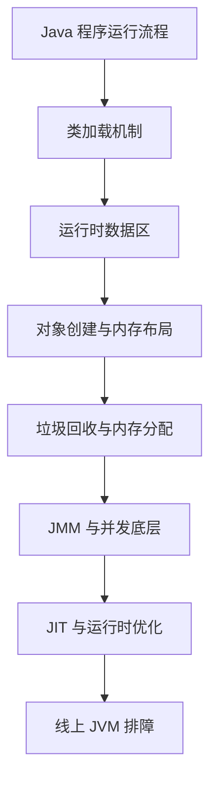

要能把它们串起来：

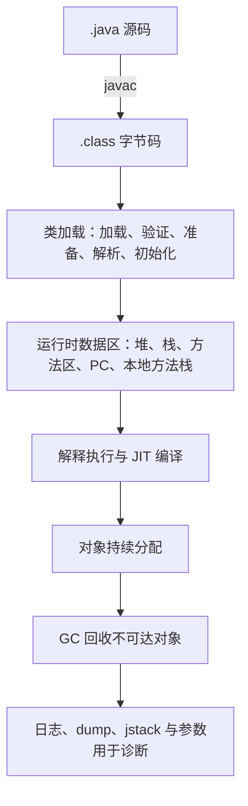


# 1. JVM、JRE、JDK 的关系

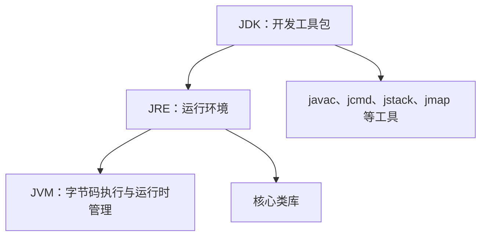


## 1.1 JVM 是什么

**JVM，Java Virtual Machine，Java 虚拟机**，是运行 Java 字节码的虚拟计算机。

它主要负责：

- 加载 class 文件
- 校验字节码安全性
- 执行字节码
- 管理内存
- 执行垃圾回收
- 进行运行时优化
- 提供线程、锁、异常、JNI 等运行机制

Java 的跨平台能力主要来自 JVM：

```text
同一份 .class 字节码
  ↓
不同平台上的 JVM
  ↓
Windows / Linux / macOS 等不同系统运行
```

也就是常说的**一次编译，到处运行**

但严格来说，是**一次编译成平台无关的字节码，由不同平台的 JVM 负责解释或编译成本地机器码**。


## 1.2 JRE 是什么

**JRE，Java Runtime Environment，Java 运行时环境**。

它包含：
- JVM
- Java 核心类库
- 运行 Java 程序所需的基础组件

JRE 用来运行 Java 程序，但不一定包含开发工具。


## 1.3 JDK 是什么

**JDK，Java Development Kit，Java 开发工具包**。

它包含：

- JRE
- javac
- java
- jdb
- jps
- jstack
- jmap
- jstat
- jcmd
- jconsole
- jvisualvm 等工具

开发、编译、运行、诊断 Java 程序通常都需要 JDK。


## 1.4 三者关系

JDK = JRE + 开发工具
JRE = JVM + 核心类库
JVM = 执行字节码、管理运行时的核心


> JVM 是 Java 程序运行的核心，负责加载和执行字节码、管理内存、垃圾回收和运行时优化。JRE 是运行环境，包含 JVM 和核心类库；JDK 是开发工具包，包含 JRE 以及 javac、jstack、jmap 等开发和诊断工具。


# 2. Java 程序运行流程

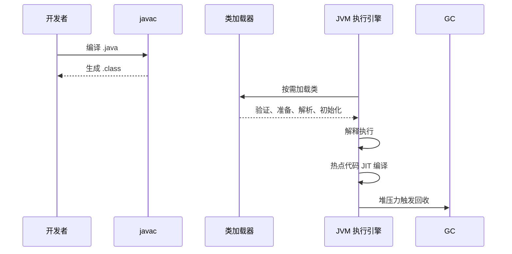


一个 Java 程序从源码到运行，大致经历：

1. 编写 .java 文件
2. javac 编译成 .class 字节码
3. JVM 启动
4. 类加载器加载 class
5. 字节码验证
6. 准备静态变量
7. 解析符号引用
8. 执行类初始化
9. 解释器执行字节码
10. 热点代码被 JIT 编译成本地机器码
11. 对象在堆上分配
12. GC 回收不可达对象


## 2.1 编译阶段

```java
public class Main {
    public static void main(String[] args) {
        System.out.println("hello");
    }
}
```

编译：

```bash
javac Main.java
```

生成：

```text
Main.class
```

`.class` 文件不是机器码，而是 JVM 能识别的字节码。


## 2.2 类加载阶段

JVM 不会一次性加载所有类，而是按需加载。

例如：

```java
A a = new A();
```

当 JVM 第一次主动使用 `A` 时，可能触发 `A` 的类加载和初始化。


## 2.3 执行阶段

JVM 执行字节码有两种方式：

- 解释执行：解释器逐条执行字节码
- 编译执行：JIT 把热点代码编译成本地机器码

所以 Java 是**编译型 + 解释型 + 运行时优化型**


# 3. JVM 运行时数据区

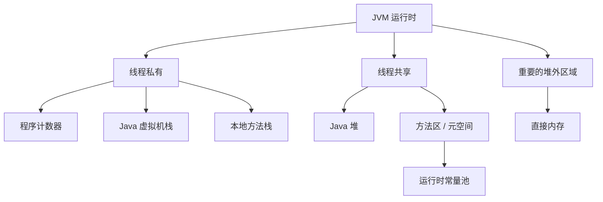


JVM 运行时数据区可以分为线程私有和线程共享。

- 线程私有：
  1. 程序计数器
  2. Java 虚拟机栈
  3. 本地方法栈

- 线程共享：
  1. Java 堆
  2. 方法区
  3. 运行时常量池

- 非 JVM 规范运行时数据区，但很重要：
  1. 直接内存


## 3.1 程序计数器

程序计数器可以理解为**当前线程正在执行的字节码行号指示器**

作用：
- 记录当前线程执行到哪条字节码
- 线程切换后恢复执行位置
- 支持分支、循环、跳转、异常处理等

特点：
- 线程私有
- 占用空间很小
- 是 JVM 规范中唯一一个没有规定 OutOfMemoryError 的区域

注意：

- 如果执行的是 Java 方法，程序计数器记录的是字节码指令地址。
- 如果执行的是 native 方法，程序计数器值可能为空或未定义。


## 3.2 Java 虚拟机栈

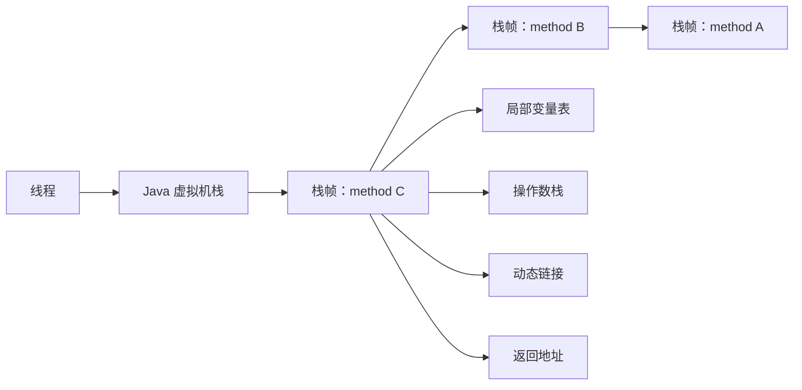


Java 虚拟机栈是线程私有的。

每个 Java 方法调用时，都会创建一个 **栈帧**。

一个栈帧通常包含：

1. 局部变量表
2. 操作数栈
3. 动态链接
4. 方法返回地址
5. 附加信息

方法调用过程：

- 调用方法 → 创建栈帧并入栈
- 方法执行 → 使用局部变量表和操作数栈
- 方法结束 → 栈帧出栈


### 3.2.1 局部变量表

存放：

- 基本数据类型
- 对象引用
- returnAddress 类型

例如：

```java
public int add(int a, int b) {
    int c = a + b;
    return c;
}
```

局部变量表中可能有：

```text
this
a
b
c
```

静态方法没有 `this`。


### 3.2.2 操作数栈

JVM 是基于栈的指令集架构。

例如：

```java
int c = a + b;
```

字节码执行时大致是：

1. 把 a 压入操作数栈
2. 把 b 压入操作数栈
3. 执行 iadd
4. 结果压回操作数栈
5. 存入局部变量 c


### 3.2.3 动态链接

每个栈帧都包含指向运行时常量池中该方法所属类的引用。

作用是支持：

- 方法调用
- 字段访问
- 动态绑定


### 3.2.4 方法返回地址

方法结束后，JVM 需要知道回到调用方的哪一条指令继续执行。

## 3.3 本地方法栈

本地方法栈服务于 native 方法。

例如 Java 调用 C/C++ 实现的底层方法：

```java
private native void start0();
```

常见场景：

- Thread.start()
- Object.hashCode()
- System.arraycopy()
- Unsafe 相关方法
- JNI 调用


## 3.4 Java 堆

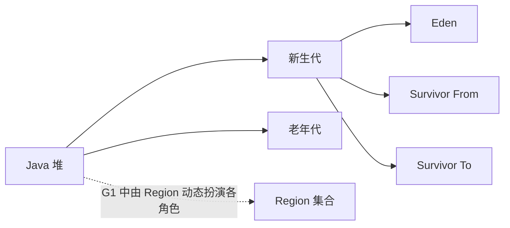


Java 堆是 JVM 管理的最大一块内存区域。

主要存放：

- 对象实例
- 数组
- 大部分运行时创建的数据

特点：

- 线程共享
- GC 主要管理区域
- 可能发生 OutOfMemoryError: Java heap space

常见分代结构：

```text
新生代 Young Generation
  ├── Eden
  ├── Survivor From
  └── Survivor To

老年代 Old Generation
```

不过不同 GC 的堆结构不完全一样。

例如 G1 使用 Region，不再是传统连续的新生代和老年代。


## 3.5 方法区

方法区是 JVM 规范中的概念。

主要存储：

- 类元信息
- 字段信息
- 方法信息
- 运行时常量池
- 静态变量
- JIT 编译后的代码相关信息

在 HotSpot 中：

- Java 8 之前：永久代 PermGen 是方法区的一种实现
- Java 8 之后：元空间 Metaspace 是方法区的一种实现

注意：

- 方法区是规范概念
- 永久代和元空间是 HotSpot 的具体实现


## 3.6 运行时常量池

运行时常量池是方法区的一部分。

`.class` 文件中有常量池，类加载后进入运行时常量池。

里面可能有：

- 字面量
- 符号引用
- 类和接口的全限定名
- 字段名称和描述符
- 方法名称和描述符
- 字符串常量


## 3.7 直接内存

直接内存不属于 Java 堆，但常用于 NIO。

例如：

```java
ByteBuffer buffer = ByteBuffer.allocateDirect(1024);
```

直接内存特点：

- 堆外内存
- 减少 Java 堆和 native 内存之间的数据复制
- 常用于 NIO、Netty、文件 IO
- 受 -XX:MaxDirectMemorySize 影响
- 也可能导致 OOM

常见异常：

```text
java.lang.OutOfMemoryError: Direct buffer memory
```


# 4. 对象创建过程

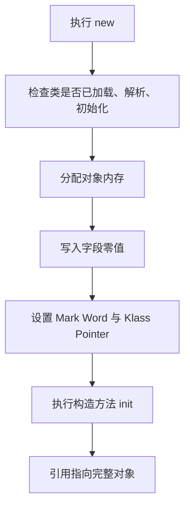


执行：

```java
User user = new User();
```

JVM 创建对象大致经历：

1. 类加载检查
2. 分配内存
3. 初始化零值
4. 设置对象头
5. 执行构造方法 <init>
6. 引用指向对象


## 4.1 类加载检查

JVM 遇到 `new` 指令时，会先检查：

1. 这个类是否已经加载
2. 是否已经解析
3. 是否已经初始化

如果没有，则先触发类加载。


## 4.2 分配内存

JVM 为对象分配内存主要有两种方式：
- 指针碰撞
- 空闲列表


### 4.2.1 指针碰撞

如果堆内存是规整的：

```text
已使用内存 | 空闲内存
          ↑
        指针
```

分配对象时，只需要把指针向空闲方向移动一段距离。简单高效，适用于带压缩整理能力的 GC。


### 4.2.2 空闲列表

如果堆内存不规整：

**已使用、空闲、已使用、空闲交错**


JVM 需要维护一个列表，记录哪些内存块可用。

适用于标记-清除这类可能产生碎片的算法。


## 4.3 并发分配问题

多个线程同时创建对象，可能竞争堆上的分配指针。

解决方式：

- CAS + 失败重试
- TLAB


## 4.4 TLAB

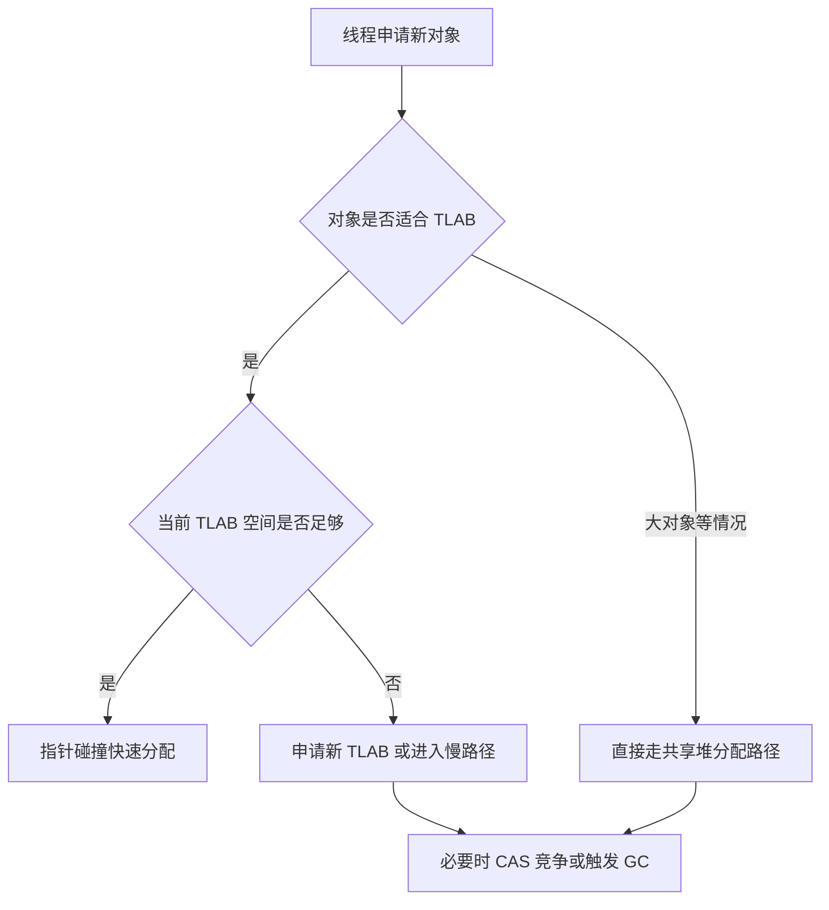


TLAB，全称**Thread Local Allocation Buffer**

即线程本地分配缓冲区。

每个线程在 Eden 区预先分一小块内存。

线程创建小对象时，优先在自己的 TLAB 中分配。

好处：

- 减少多线程分配对象时的同步竞争
- 提高对象分配速度


对象分配大致是：

- 对象较小且 TLAB 空间足够 → TLAB 分配
- TLAB 不够 → 重新申请 TLAB 或走慢路径
- 对象很大 → 可能直接在堆上分配，甚至进入老年代


# 5. 对象内存布局

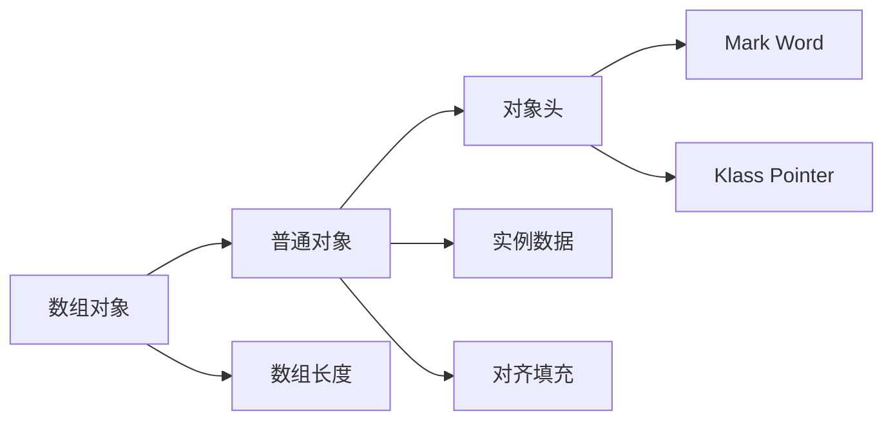


HotSpot 中，一个普通 Java 对象通常由三部分组成：

1. 对象头
2. 实例数据
3. 对齐填充

数组对象还会额外保存数组长度。


## 5.1 对象头

对象头主要包括：

- Mark Word
- Klass Pointer
- 数组长度，只有数组对象有


## 5.2 Mark Word

Mark Word 中可能存储：

1. 对象哈希码
2. GC 分代年龄
3. 锁状态标志
4. 偏向锁线程 ID，旧版本
5. 轻量级锁指针
6. 重量级锁 monitor 指针


Mark Word 是理解 synchronized 锁升级的重要基础。


## 5.3 Klass Pointer

Klass Pointer 指向类元数据。

JVM 通过它知道：


- 这个对象属于哪个类
- 有哪些字段
- 有哪些方法
- 如何进行动态分派


## 5.4 实例数据

实例数据就是对象真正保存的字段内容。

例如：

```java
class User {
    int age;
    long id;
    Object name;
}
```

对象中的实例数据包括：

```text
age
id
name 引用
```


## 5.5 对齐填充

HotSpot 通常要求对象大小按一定字节对齐，例如 8 字节对齐。

如果对象大小不是对齐倍数，会补齐一些无意义字节。


## 5.6 指针压缩

64 位 JVM 中，对象引用理论上是 8 字节。

但 HotSpot 可以使用指针压缩：

```bash
-XX:+UseCompressedOops
```

开启后，普通对象引用可能压缩成 4 字节。

好处：

- 减少内存占用
- 提高缓存命中率
- 降低 GC 扫描成本

原理可以简单理解为：

- 对象按 8 字节对齐
- 引用中不保存完整地址
- 而是保存压缩后的偏移量
- 使用时再解码成真实地址


# 6. 对象是否一定在堆上分配

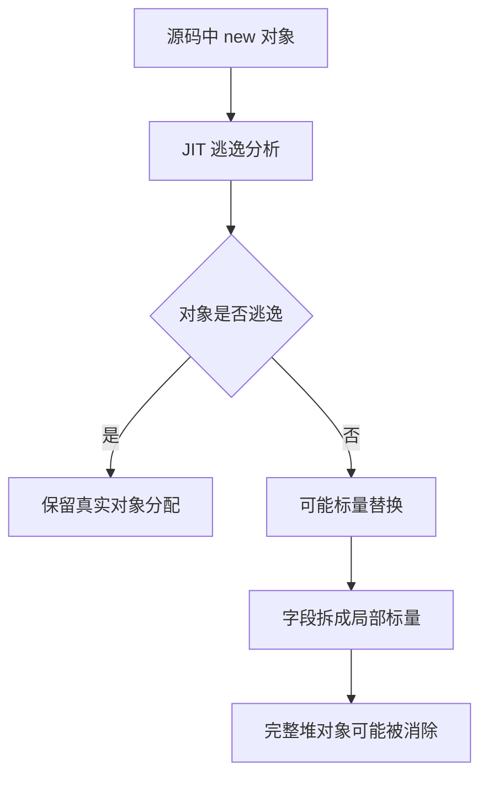


> 从 JVM 规范和语义上看，对象是堆上的概念；但 HotSpot JIT 经过逃逸分析后，可能进行标量替换、锁消除等优化，使对象不以完整对象形式真实分配到堆上。

例如：

```java
public int add() {
    Point p = new Point(1, 2);
    return p.x + p.y;
}
```

如果 `p` 没有逃出方法，JIT 可能把它拆成两个局部变量：

```text
int x = 1
int y = 2
```

这叫 **标量替换**。

所以表达要严谨： **不是说对象真的分配到了 Java 栈上，而是经过逃逸分析后，JIT 可能消除对象分配，用标量变量替代对象字段。**


# 7. 方法区、永久代、元空间

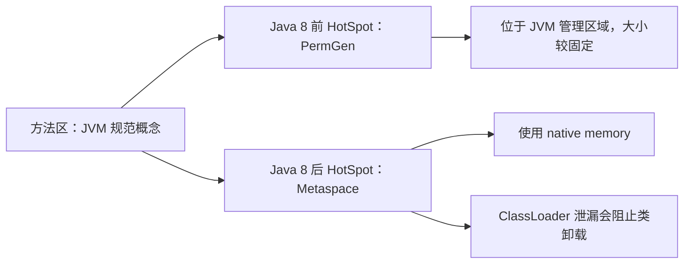


## 7.1 方法区

方法区是 JVM 规范概念。

存放：

- 类信息
- 字段信息
- 方法信息
- 常量池
- 静态变量
- JIT 编译代码相关数据


## 7.2 永久代

永久代是 HotSpot 在 Java 8 之前对方法区的实现。

缺点：
- 大小固定，不好调
- 容易出现 PermGen OOM
- 类元数据和 Java 堆管理耦合较重

常见异常：

```text
java.lang.OutOfMemoryError: PermGen space
```

## 7.3 元空间

Java 8 之后，HotSpot 用元空间替代永久代。

元空间使用的是本地内存 native memory

常见异常：

```text
java.lang.OutOfMemoryError: Metaspace
```

可配置：

```bash
-XX:MetaspaceSize
-XX:MaxMetaspaceSize
```

注意：

**MetaspaceSize 不是元空间初始大小的简单等价概念，更接近触发元空间 GC 的阈值。**


## 7.4 Metaspace OOM 常见原因

- 大量动态生成类
- CGLIB 动态代理
- JDK 动态代理
- 反射生成 accessor
- Groovy 动态脚本
- JSP 热编译
- 频繁热部署
- 自定义 ClassLoader 泄漏
- 线程上下文类加载器泄漏

排查思路：


- 查看 Metaspace 使用趋势
- jcmd VM.classloader_stats
- jmap -clstats
- jcmd GC.class_histogram
- 分析是否有大量 ClassLoader 无法回收
- 检查 ThreadLocal、静态变量、线程池是否持有类加载器

# 8. String 与字符串常量池

## 8.1 字符串常量池

字符串常量池保存字符串字面量或 intern 后的字符串引用。

例如：

```java
String a = "hello";
String b = "hello";
System.out.println(a == b); // true
```

`a` 和 `b` 指向同一个字符串常量池中的对象。


## 8.2 new String("abc") 创建几个对象

代码：

```java
String s = new String("abc");
```


如果常量池中还没有 "abc"：
- 一个是字符串常量池中的 "abc"
- 一个是堆上的 new String 对象
- 共两个对象

如果常量池中已经有 "abc"：
- 只创建堆上的 new String 对象
- 共一个对象

注意不要绝对化，因为类加载时机和常量池中是否已存在会影响答案。


## 8.3 intern 方法

`intern()` 的作用：

- 尝试把字符串放入字符串常量池，
- 并返回常量池中该字符串对应的引用。


例如：

```java
String a = new String("hello");
String b = a.intern();
String c = "hello";

System.out.println(b == c); // true
```


## 8.4 Java 6 和 Java 7 之后的差异

Java 6：

- 字符串常量池在永久代
- intern 可能复制字符串到永久代常量池


Java 7 之后：

- 字符串常量池移到 Java 堆中
- intern 更倾向于在常量池中保存堆中字符串对象的引用


# 9. 类加载机制

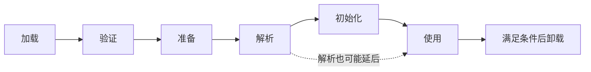


类加载过程：


1. 加载
2. 验证
3. 准备
4. 解析
5. 初始化
6. 使用
7. 卸载

其中：
- 加载、验证、准备、初始化、卸载顺序固定
- 解析可能在初始化之后发生，因为 Java 支持动态绑定


## 9.1 加载

加载阶段做三件事：

1. 通过类的全限定名获取二进制字节流
2. 将字节流转换成方法区中的运行时数据结构
3. 在堆中生成一个 java.lang.Class 对象，作为访问入口

类的来源可以是：

- 本地 class 文件
- jar 包
- 网络
- 动态代理生成
- 运行时编译生成
- 加密 class 解密后加载


## 9.2 验证

验证是为了保证字节码安全。

包括：

- 文件格式验证
- 元数据验证
- 字节码验证
- 符号引用验证

作用：

- 防止非法字节码破坏 JVM
- 保证类型安全
- 保证操作数栈和局部变量表使用正确


## 9.3 准备

准备阶段为类变量分配内存并设置默认初始值。

例如：

```java
public static int x = 10;
```

准备阶段：

```text
x = 0
```

初始化阶段才是：

```text
x = 10
```

但对于编译期常量：

```java
public static final int y = 20;
```

准备阶段可能直接赋值为 20。


## 9.4 解析

解析阶段把符号引用转换成直接引用。

例如：

```text
java/lang/String
```

转换成 JVM 可以直接定位的类、字段、方法引用。


## 9.5 初始化

初始化阶段执行类构造器：

```text
<clinit>()
```

`<clinit>()` 由以下内容合并生成：
- 静态变量赋值
- 静态代码块

例如：

```java
class A {
    static int x = 10;

    static {
        x = 20;
    }
}
```

初始化后：

```text
x = 20
```


## 9.6 类初始化触发条件

主动使用类时触发初始化。

常见情况：

- new 一个对象
- 访问类的静态变量
- 设置类的静态变量
- 调用类的静态方法
- 反射调用类
- 初始化子类前先初始化父类
- JVM 启动时包含 main 方法的主类
- MethodHandle 相关调用

不会触发初始化的常见情况：

```java
A[] arr = new A[10];       // 创建数组，不一定初始化 A
System.out.println(A.CONST); // 编译期常量可能不初始化 A
```


# 10. 双亲委派模型

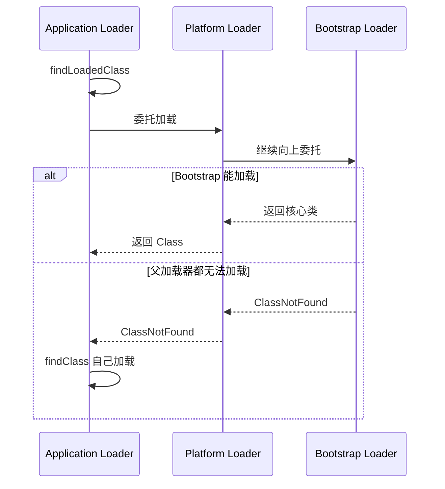


## 10.1 类加载器层级

Java 8 常见类加载器：

- Bootstrap ClassLoader
- Extension ClassLoader
- Application ClassLoader
- Custom ClassLoader

Java 9 模块化之后：

- Bootstrap ClassLoader
- Platform ClassLoader
- Application ClassLoader
- Custom ClassLoader

Extension ClassLoader 被 Platform ClassLoader 替代。

## 10.2 双亲委派过程

加载一个类时：

1. 当前 ClassLoader 先检查自己是否加载过
2. 没加载过，则委托父加载器加载
3. 父加载器继续向上委托
4. 最终到 Bootstrap ClassLoader
5. 父加载器无法加载时，子加载器才尝试自己加载

伪代码：

```java
protected Class<?> loadClass(String name, boolean resolve) {
    Class<?> c = findLoadedClass(name);

    if (c == null) {
        try {
            if (parent != null) {
                c = parent.loadClass(name, false);
            } else {
                c = findBootstrapClassOrNull(name);
            }
        } catch (ClassNotFoundException e) {
            c = findClass(name);
        }
    }

    if (resolve) {
        resolveClass(c);
    }

    return c;
}
```


## 10.3 为什么需要双亲委派

核心目的：

- 保证核心类库安全
- 保证类唯一性
- 避免重复加载

例如用户自己写一个：

```java
package java.lang;

public class String {
}
```

正常情况下不会替代 JDK 自带的 `java.lang.String`，因为会优先由 Bootstrap ClassLoader 加载核心类库。


## 10.4 双亲委派能否打破

可以。

典型场景：

- JDBC SPI
- JNDI
- Tomcat WebAppClassLoader
- OSGi
- 插件化系统
- 热部署
- 线程上下文类加载器

### JDBC 为什么是打破双亲委派的例子

JDBC 接口在 JDK 中：

```text
java.sql.Driver
DriverManager
```

数据库驱动由应用提供：

```text
mysql-connector-j.jar
postgresql.jar
```

父加载器加载的 `DriverManager` 需要反过来加载应用类路径中的数据库驱动。

这时需要：

```java
Thread.currentThread().getContextClassLoader()
```

也就是线程上下文类加载器。


# 11. 类相等与类卸载

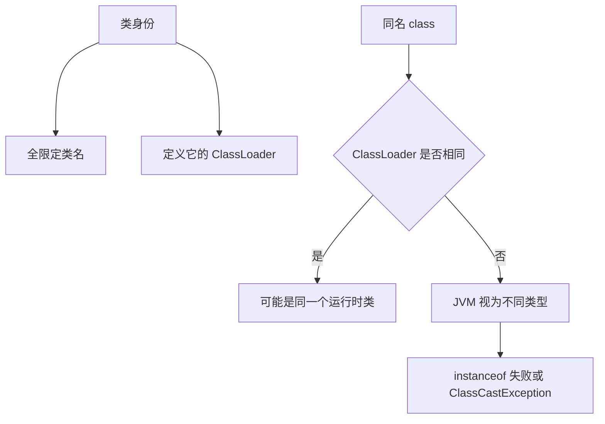


## 11.1 类相等

两个类是否相等，不只看类名。

还要看：
- 全限定类名
- 加载它的 ClassLoader

也就是说：
**同一个 .class 文件被两个不同 ClassLoader 加载在 JVM 看来是两个不同的类**

可能导致：

- ClassCastException
- instanceof 失败
- 反射类型不匹配


## 11.2 类卸载条件

一个类可以被卸载，通常需要同时满足：

- 该类所有实例都被回收
- 加载该类的 ClassLoader 可以被回收
- 该类对应的 Class 对象没有被引用

自定义 ClassLoader 泄漏会导致：

- 类无法卸载
- Metaspace 持续增长
- 最终 Metaspace OOM

常见引用链：

- ThreadLocal → value → 业务对象 → Class → ClassLoader
- 静态变量 → 对象 → ClassLoader
- 线程池线程 → contextClassLoader → WebAppClassLoader


# 12. 字节码与方法调用

## 12.1 常见字节码指令类别

- 加载和存储指令：iload、aload、istore、astore
- 运算指令：iadd、isub、imul、idiv
- 类型转换指令：i2l、i2d、checkcast
- 对象创建指令：new、newarray、anewarray
- 字段访问指令：getfield、putfield、getstatic、putstatic
- 方法调用指令：invokevirtual、invokestatic 等
- 控制转移指令：if、goto、tableswitch、lookupswitch
- 异常处理相关指令：athrow
- 同步指令：monitorenter、monitorexit


## 12.2 方法调用指令

### invokestatic

调用静态方法。

例如：

```java
Math.max(1, 2);
```

### invokespecial

调用特殊方法。

常见：

- 构造方法 `<init>`
- 私有方法
- 父类方法 `super.xxx()`


### invokevirtual

调用普通实例方法。

支持动态分派。

例如：

```java
animal.eat();
```

实际调用哪个 `eat()`，运行时根据对象真实类型决定。


### invokeinterface

调用接口方法。

例如：

```java
List<String> list = new ArrayList<>();
list.add("a");
```


### invokedynamic

Java 7 引入，主要用于支持动态语言。

Java 8 之后，Lambda 表达式也大量使用它。

例如：

```java
Runnable r = () -> System.out.println("hello");
```


# 13. 垃圾回收基础

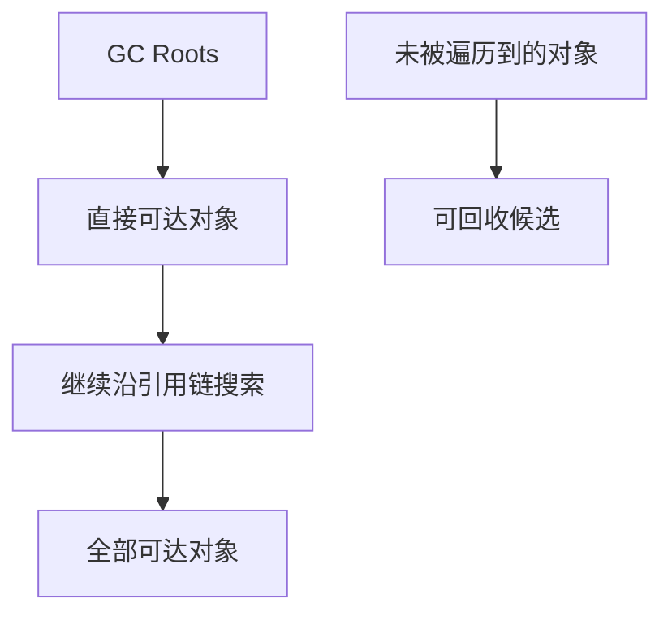


GC 要解决三个问题：

- 哪些对象可以回收
- 什么时候回收
- 如何回收


## 13.1 引用计数法

给对象维护一个引用计数器。

- 有引用指向它 → 计数 +1
- 引用失效 → 计数 -1
- 计数为 0 → 可以回收


优点：

- 实现简单
- 判断效率高

缺点：

- 无法解决循环引用

例如：

```java
class Node {
    Node next;
}

Node a = new Node();
Node b = new Node();
a.next = b;
b.next = a;

a = null;
b = null;
```

`a` 和 `b` 互相引用，但外部已经不可达。

引用计数法会误判它们还活着。


## 13.2 可达性分析

HotSpot 主流使用可达性分析。

从 GC Roots 出发，沿引用链向下搜索。

```text
GC Roots
  ↓
可达对象
  ↓
继续搜索
```

不可达对象就是可回收对象。


## 13.3 GC Roots 有哪些

常见 GC Roots：

- 虚拟机栈中引用的对象
- 本地方法栈 JNI 引用的对象
- 方法区中类静态属性引用的对象
- 方法区中常量引用的对象
- 被 synchronized 锁持有的对象
- 活跃线程对象
- 系统类加载器加载的类对象

举例：

```java
public class Demo {
    private static Object staticObj = new Object();

    public void test() {
        Object localObj = new Object();
    }
}
```

`staticObj` 可以通过静态变量作为根引用链的一部分。

`localObj` 可以通过当前线程栈帧中的局部变量表成为 GC Roots 可达对象。


# 14. Java 引用类型

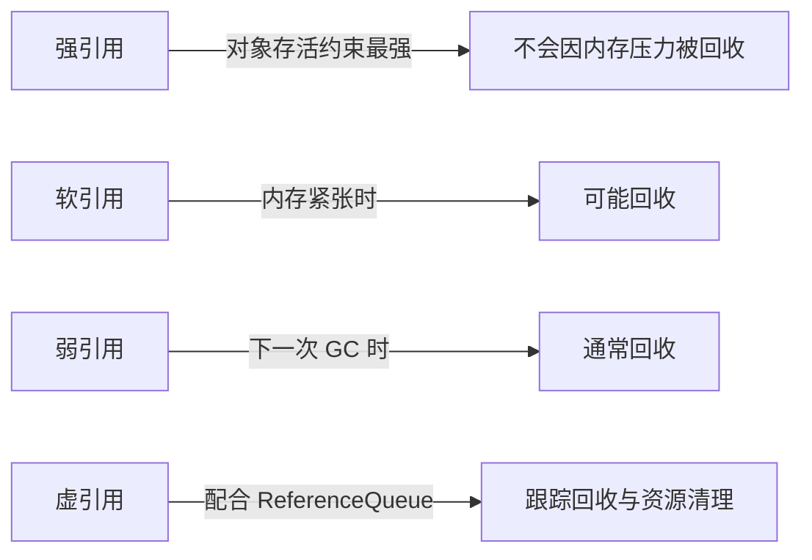


Java 中有四种引用强度：

- 强引用
- 软引用
- 弱引用
- 虚引用


## 14.1 强引用

普通对象引用就是强引用：

```java
Object obj = new Object();
```

只要强引用存在，对象不会被 GC 回收。


## 14.2 软引用

软引用：

```java
SoftReference<byte[]> ref = new SoftReference<>(new byte[1024]);
```

特点：

- 内存不足时才可能回收
- 适合做缓存，但现在实际工程中要谨慎使用


## 14.3 弱引用

弱引用：

```java
WeakReference<Object> ref = new WeakReference<>(new Object());
```

特点：

```text
只要发生 GC，弱引用对象通常就会被回收
```

典型场景：

```text
WeakHashMap
ThreadLocalMap 的 key
```


## 14.4 虚引用

虚引用：

```java
PhantomReference<Object> ref =
    new PhantomReference<>(obj, referenceQueue);
```

特点：

- 无法通过虚引用获取对象
- 主要用于跟踪对象被回收的时机
- 需要配合 ReferenceQueue 使用

常见场景：

- 堆外内存释放
- 资源清理
- Cleaner 机制


# 15. 垃圾回收算法

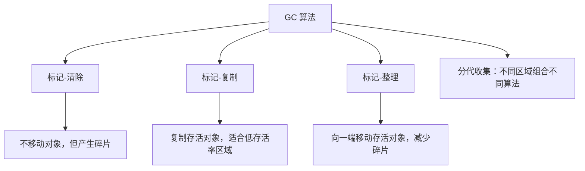


## 15.1 标记-清除

过程：

- 先标记存活对象
- 再清除未标记对象


简单，不需要移动对象


缺点产生内存碎片, 清除效率不稳定


## 15.2 标记-复制

过程：

1. 把内存分成两块
2. 每次只使用一块
3. GC 时把存活对象复制到另一块
4. 清空原区域

优点没有内存碎片, 分配简单, 适合存活率低的新生代


缺点浪费部分空间, 存活对象多时复制成本高

## 15.3 标记-整理

过程：

1. 标记存活对象
2. 把存活对象向一端移动
3. 清理边界外的内存


优点没有碎片,适合老年代

缺点移动对象成本较高, 可能需要更长停顿

## 15.4 分代收集

核心依据：

- 绝大多数对象朝生夕死
- 少数对象存活很久

也就是弱分代假说。

因此堆被分为：

- 新生代：对象死亡率高，适合复制算法
- 老年代：对象存活率高，适合标记-清除或标记-整理


# 16. 新生代与老年代

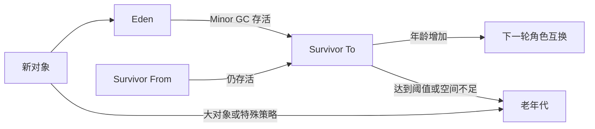


## 16.1 新生代结构

传统分代模型中，新生代包含：

- Eden
- Survivor From
- Survivor To

默认比例常见是：

```text
Eden : From : To = 8 : 1 : 1
```

参数和 GC 不同会改变这个比例。

## 16.2 对象分配流程

1. 大多数新对象分配在 Eden
2. Eden 满了触发 Minor GC
3. 存活对象复制到 Survivor
4. 对象年龄 +1
5. 达到年龄阈值后晋升老年代
6. 大对象可能直接进老年代
7. Survivor 放不下也可能提前晋升

## 16.3 为什么有两个 Survivor

两个 Survivor 区用于复制算法。

一次 Minor GC 后：

1. Eden 存活对象 + From 存活对象 → To
2. 然后清空 Eden 和 From
3. From 和 To 角色互换

好处：

1. 避免内存碎片
2. 让短命对象快速被回收
3. 让长期存活对象逐渐晋升

为什么不是一个 Survivor？

> 因为复制算法需要一个目标区域。如果只有一个 Survivor，既要保存上次存活对象，又要作为本次复制目标，会导致整理困难和碎片问题。

## 16.4 对象晋升老年代条件

常见情况：

- 年龄达到阈值
- 动态年龄判断
- Survivor 空间不足
- 大对象直接进入老年代
- 空间分配担保

### 年龄阈值

对象每经历一次 Minor GC 且仍存活，年龄加 1。

达到阈值后晋升老年代。

相关参数：

```bash
-XX:MaxTenuringThreshold
```

### 动态年龄判断

如果 Survivor 中相同年龄对象大小总和超过 Survivor 空间的一定比例，那么大于等于该年龄的对象可以直接晋升老年代。


### 大对象直接进老年代

大对象需要连续内存，放在新生代容易导致大量复制。

所以可能直接进入老年代。

常见大对象：

- 大数组
- 大字符串
- 大集合
- 大 byte[]

# 17. Minor GC、Major GC、Full GC

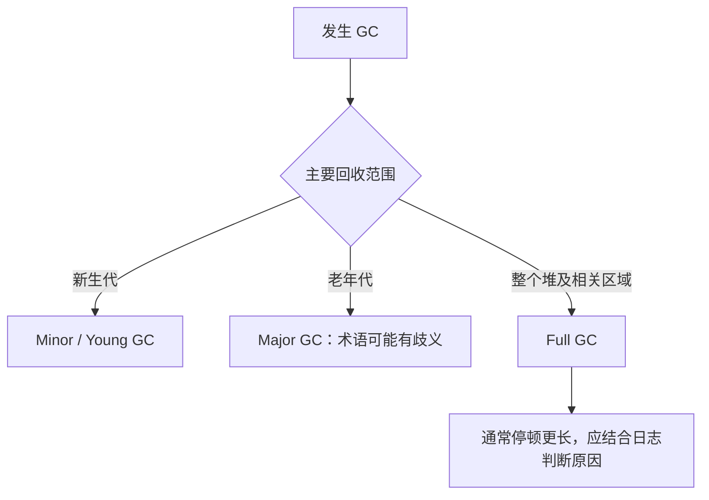


## 17.1 Minor GC

Minor GC 通常回收新生代。

触发原因：
- Eden 空间不足
- 新对象分配失败


特点：

- 频率高
- 速度相对快
- 停顿时间通常较短

## 17.2 Major GC

Major GC 这个词在不同资料中含义不完全一致。

有时指老年代 GC

有时被混用为Full GC

> Major GC 的说法存在歧义，我通常会结合具体 GC 日志判断它到底是老年代回收还是 Full GC。

## 17.3 Full GC

Full GC 通常回收整个 Java 堆和方法区相关数据。

可能包括：

- 新生代
- 老年代
- 元空间
- 直接触发类卸载

危险原因：

- 停顿时间长
- 影响接口 RT
- 可能导致服务雪崩
- 频繁 Full GC 往往说明内存分配或对象生命周期异常

## 17.4 常见 Full GC 触发原因

- 老年代空间不足
- 元空间不足
- 显式调用 System.gc()
- Minor GC 晋升失败
- 空间分配担保失败
- 大对象分配失败
- CMS Concurrent Mode Failure
- G1 Evacuation Failure
- 堆外内存压力间接触发


# 18. 常见垃圾收集器

```mermaid
flowchart LR
    A["GC 目标"] --> B{"优先考虑什么"}
    B -->|简单与小堆| C["Serial"]
    B -->|高吞吐| D["Parallel"]
    B -->|可控停顿与较大堆| E["G1"]
    B -->|超低延迟与大堆| F["ZGC / Shenandoah"]
    G["CMS"] --> H["历史低停顿方案，已退出主流"]
```


## 18.1 Serial GC

特点**单线程, Stop-The-World, 简单, 适合小堆、客户端场景**


参数：

```bash
-XX:+UseSerialGC
```

## 18.2 Parallel GC

特点：
- 多线程回收
- 关注吞吐量
- 适合后台任务、批处理

参数：

```bash
-XX:+UseParallelGC
```

目标尽可能让用户代码运行时间占比更高

## 18.3 CMS GC

CMS，全称 Concurrent Mark Sweep。

目标降低老年代 GC 停顿

过程：

- 初始标记 STW
- 并发标记
- 重新标记 STW
- 并发清除


优点：

- 并发回收
- 停顿比传统老年代收集器短

缺点：

- 产生内存碎片
- 对 CPU 资源敏感
- 产生浮动垃圾
- 可能 Concurrent Mode Failure

CMS 已经逐渐退出主流，新项目一般不再优先使用。


## 18.4 G1 GC

```mermaid
flowchart TD
    H["堆"] --> R["多个等大小 Region"]
    R --> E["Eden Region"]
    R --> S["Survivor Region"]
    R --> O["Old Region"]
    R --> U["Humongous Region"]
    X["Remembered Set"] --> C["避免回收单个 Region 时扫描整个堆"]
    P["预测回收收益与停顿"] --> CS["选择 Collection Set"]
    CS --> M["Young GC 或 Mixed GC"]
```


G1，全称 Garbage First。

核心思想：

- 把堆划分成多个大小相等的 Region
- 不再要求新生代、老年代物理连续
- 优先回收收益最高的 Region
- 尽量满足用户设置的停顿目标

参数：

```bash
-XX:+UseG1GC
-XX:MaxGCPauseMillis=200
```

G1 中 Region 可能属于：

- Eden
- Survivor
- Old
- Humongous
- Free


### G1 的重要概念

#### Region

堆被切成多个 Region，每个 Region 可以动态扮演 Eden、Survivor 或 Old。

#### Remembered Set

记录其他 Region 对当前 Region 的引用。

作用**避免每次回收一个 Region 时都扫描整个堆**

#### Collection Set

本次 GC 要回收的一组 Region。

#### Mixed GC

不仅回收新生代，也回收部分老年代 Region。

#### Humongous Object

大对象。

通常当对象大小超过 Region 的一定比例时，会被视为 Humongous Object。

问题：
- 需要连续 Region
- 容易造成空间浪费
- 回收不及时可能诱发 Full GC

#### Evacuation Failure

G1 复制存活对象时，找不到足够空间容纳这些对象。

可能导致性能急剧下降，甚至触发 Full GC。

## 18.5 ZGC

```mermaid
flowchart LR
    A["应用线程并发运行"] --> B["Load Barrier / Colored Pointer"]
    B --> C["并发标记"]
    C --> D["并发转移与重定位"]
    D --> E["访问时修正引用"]
    E --> F["尽量缩短 STW 阶段"]
```


ZGC 的目标：

- 超低停顿
- 支持大堆
- 多数 GC 工作并发执行


典型技术：

- Colored Pointer
- Load Barrier / Read Barrier
- 并发标记
- 并发转移
- 并发重定位


ZGC 与传统 GC 的一个重要区别是：**它可以在应用线程运行的同时移动对象，并通过屏障机制修正引用。**

JDK 21 引入了分代 ZGC，OpenJDK 的 JEP 439 说明分代 ZGC 将堆划分为 young generation 和 old generation，并允许两代独立收集，从而更好利用“多数对象朝生夕死”的规律。


## 18.6 Shenandoah

Shenandoah 目标也类似：

- 低延迟
- 大部分 GC 工作并发执行
- 并发压缩
- 减少 STW

与 ZGC 类似，它也依赖屏障机制实现并发移动对象。


# 19. Stop-The-World

```mermaid
sequenceDiagram
    participant App as 应用线程
    participant GC as GC 线程
    App->>App: 正常运行
    GC->>App: STW：初始标记
    Note over App,GC: 应用线程短暂停止
    GC->>GC: 并发标记
    App->>App: 与 GC 并发运行
    GC->>App: STW：重新标记或根处理
    Note over App,GC: 再次短暂停止
    GC->>GC: 继续并发清理或转移
    App->>App: 恢复运行
```


STW，Stop-The-World，指 JVM 暂停所有用户线程，只让 GC 线程或 JVM 内部线程工作。

为什么需要 STW？

- 为了获得一致的对象引用关系快照
- 为了安全地移动对象
- 为了处理根节点扫描
- 为了避免用户线程同时修改对象图导致回收错误

注意：

- 并发 GC 不等于完全没有 STW
- ZGC、Shenandoah、G1 也存在短暂停顿阶段
- 只是尽量把耗时工作并发化

常见 STW 阶段：

- 初始标记
- 重新标记
- 根扫描
- 对象转移的某些阶段
- Full GC


# 20. 三色标记与并发标记

```mermaid
flowchart LR
    W["白色：尚未访问"] -->|从 GC Roots 首次发现| G["灰色：对象已发现，引用未扫描完"]
    G -->|扫描完全部引用| B["黑色：对象及其引用已扫描"]
    B -->|并发修改被写屏障记录| G
    W -->|标记结束仍为白色| R["可回收候选"]
```


三色标记把对象分为：

- 白色：尚未访问，最终仍为白色则可回收
- 灰色：已访问，但它引用的对象还没全部扫描
- 黑色：已访问，且它引用的对象也扫描完成


## 20.1 漏标问题

并发标记时，用户线程还在运行，引用关系可能变化。

漏标发生的典型条件：

- 黑色对象新增对白色对象的引用
- 灰色对象删除对白色对象的引用
- GC 不知道这个变化
- 白色对象被误回收

误回收是严重错误，所以必须避免。


## 20.2 解决思路

### 增量更新

关注新增引用。

当黑色对象新增对白色对象的引用时，记录这个变化。

CMS 类似这种思路。


### 原始快照 SATB

SATB，全称 Snapshot At The Beginning。

关注删除前的旧引用。

即在引用被删除时，把旧引用记录下来，保证按照 GC 开始时的快照进行标记。

G1 并发标记使用 SATB 思想。


# 21. GC 日志怎么看

## 21.1 Java 8 常见参数

```bash
-XX:+PrintGCDetails
-XX:+PrintGCDateStamps
-XX:+PrintGCTimeStamps
-Xloggc:/path/gc.log
```


## 21.2 Java 9+ 统一日志

```bash
-Xlog:gc*:file=/path/gc.log:time,uptime,level,tags
```

或者简单写：

```bash
-Xlog:gc*
```


## 21.3 关注指标

看 GC 日志时重点关注：

- GC 类型：Minor GC、Young GC、Mixed GC、Full GC
- 触发原因：Allocation Failure、Metadata GC Threshold 等
- 回收前后堆变化
- 新生代变化
- 老年代变化
- 元空间变化
- GC 耗时
- STW 时间
- 用户线程停顿时间
- 晋升大小
- 晋升失败
- 分配失败
- Humongous Object
- Full GC 频率
- Full GC 后老年代是否下降


## 21.4 如何判断内存泄漏

重点看Full GC 后，老年代占用是否明显下降

如果每次 Full GC 后老年代仍然持续上升：很可能存在内存泄漏


如果 Full GC 后能下降，但随后又快速涨上去：

- 可能是对象分配速率太高
- 缓存太大
- 流量突增
- 批处理大对象
- 参数设置不合理


# 22. 内存泄漏与内存溢出

## 22.1 内存溢出

内存溢出是结果：

- 内存不够用了
- 无法继续分配对象
- 抛出 OOM


例如：

- Java heap space
- Metaspace
- Direct buffer memory
- unable to create new native thread
- GC overhead limit exceeded


## 22.2 内存泄漏

内存泄漏是原因之一：

- 对象已经不再被业务需要，
- 但仍然被引用链引用，
- 导致 GC 无法回收。

常见泄漏来源：

- 静态集合无限增长
- 本地缓存无淘汰
- ThreadLocal 未 remove
- 监听器未注销
- 连接未关闭
- ClassLoader 泄漏
- 线程池持有任务对象
- 队列堆积
- Map 的 key 设计错误

> 内存泄漏不一定马上 OOM，但长期运行会导致可用内存越来越少，最终可能 OOM。内存溢出是 JVM 无法继续分配内存的结果，可能由泄漏导致，也可能只是内存配置过小、瞬时流量过高、大对象过多或参数不合理导致。


# 23. Java 内存模型 JMM

```mermaid
flowchart LR
    M["主内存中的共享变量"] --> W1["线程 A 工作内存"]
    M --> W2["线程 B 工作内存"]
    W1 -->|写回| M
    M -->|读取或刷新| W2
    W1 -. "缺少同步时修改不一定及时可见" .-> W2
```


JMM 主要解决多线程下的三个问题：

- 原子性
- 可见性
- 有序性


## 23.1 主内存与工作内存

JMM 抽象中：

- 主内存：所有线程共享的变量
- 工作内存：每个线程自己的变量副本
  
线程操作共享变量时，可能不是每次都直接读写主内存。

这会导致：

- 线程 A 修改了变量
- 线程 B 不一定马上看到


## 23.2 原子性

一个操作不可分割。

例如：

```java
int x = 1;
```

单次赋值通常具有原子性。

但：

```java
count++;
```

不是原子操作。

它大致包含：

```text
读取 count
加 1
写回 count
```


## 23.3 可见性

一个线程修改共享变量后，其他线程能否及时看到。

例如：

```java
private static boolean flag = false;
```

线程 A 修改：

```java
flag = true;
```

线程 B 可能一直看不到。

解决：

```java
private static volatile boolean flag = false;
```


## 23.4 有序性

编译器和 CPU 可能对指令进行重排序。

只要单线程语义不变，JVM 可以优化指令顺序。

但在多线程下，重排序可能导致问题。


# 24. volatile

`volatile` 有两个主要作用：

- 保证可见性
- 禁止特定指令重排序


## 24.1 保证可见性

```java
volatile boolean running = true;
```

一个线程修改 `running` 后，其他线程能及时看到。


## 24.2 禁止指令重排

典型场景：双重检查锁单例。

```java
private static volatile Singleton instance;
```

没有 `volatile` 时：

```java
instance = new Singleton();
```

可能被拆成：

1. 分配内存
2. 将引用赋给 instance
3. 执行构造方法


如果 2 和 3 重排，其他线程可能看到一个未初始化完成的对象。


## 24.3 volatile 不能保证复合操作原子性

错误示例：

```java
volatile int count = 0;

count++;
```

`count++` 仍然不是原子操作。

解决：

```java
AtomicInteger
LongAdder
synchronized
Lock
```


# 25. synchronized

```mermaid
flowchart LR
    A["进入 synchronized"] --> B["monitorenter 或方法 ACC_SYNCHRONIZED"]
    B --> C{"竞争程度"}
    C -->|低竞争| D["CAS / 轻量级路径"]
    C -->|竞争激烈| E["重量级 monitor 与线程阻塞"]
    D --> F["临界区"]
    E --> F
    F --> G["monitorexit / 解锁并建立可见性"]
```


`synchronized` 可以保证：

- 原子性
- 可见性
- 有序性

它基于对象监视器 monitor 实现。


## 25.1 使用方式

修饰实例方法：

```java
public synchronized void test() {
}
```

锁对象是：

```text
this
```

修饰静态方法：

```java
public static synchronized void test() {
}
```

锁对象是：

```text
当前类的 Class 对象
```

同步代码块：

```java
synchronized (lock) {
}
```

锁对象是：

```text
lock
```


## 25.2 字节码层面

同步代码块对应字节码：

```text
monitorenter
monitorexit
```

方法级 synchronized 通过方法访问标志实现。


## 25.3 锁升级

HotSpot 中 synchronized 曾经有这些锁状态：

- 无锁
- 偏向锁
- 轻量级锁
- 重量级锁

JDK 15 之后偏向锁被禁用并逐渐废弃。


## 25.4 偏向锁

目标优化只有一个线程反复进入同步块的场景

思想：

- 锁偏向第一个获得它的线程
- 该线程再次进入时几乎不需要同步操作


适合：

- 单线程反复加锁
- 几乎无竞争


## 25.5 轻量级锁

目标优化多线程交替执行、竞争不激烈的场景

依赖：

- CAS
- 自旋
- 对象头 Mark Word
- Lock Record


## 25.6 重量级锁

当竞争激烈时，锁膨胀为重量级锁。

特点：

- 线程阻塞
- 涉及操作系统互斥量
- 用户态/内核态切换成本高


# 26. happens-before

```mermaid
flowchart TD
    A["happens-before"] --> B["程序顺序规则"]
    A --> C["解锁先于后续同锁加锁"]
    A --> D["volatile 写先于后续读"]
    A --> E["Thread.start 规则"]
    A --> F["Thread.join 规则"]
    A --> G["传递性"]
```


happens-before 是 JMM 中判断可见性和有序性的规则。

如果 A happens-before B，则 A 的结果对 B 可见，并且 A 的执行顺序先于 B。

常见规则：

- 程序顺序规则
- 监视器锁规则
- volatile 变量规则
- 线程启动规则
- 线程终止规则
- 线程中断规则
- 对象终结规则
- 传递性规则

## 26.1 程序顺序规则

同一线程内，前面的操作 happens-before 后面的操作。

```java
int a = 1;
int b = a + 1;
```

`a = 1` 对 `b = a + 1` 可见。


## 26.2 volatile 规则

对 volatile 变量的写 happens-before 后续对该变量的读。

```java
volatile boolean flag = false;

// 线程 A
flag = true;

// 线程 B
if (flag) {
}
```

线程 B 看到 `flag == true` 时，也能看到线程 A 在写 flag 之前的相关修改。


## 26.3 监视器锁规则

对一个锁的解锁 happens-before 后续对同一个锁的加锁。

```java
synchronized (lock) {
    x = 1;
}

synchronized (lock) {
    System.out.println(x);
}
```

第二个同步块能看到第一个同步块中的修改。


# 27. final 的 JMM 语义

`final` 字段有特殊的可见性保证。

```java
class User {
    final int id;

    User() {
        id = 1;
    }
}
```

只要对象正确构造，其他线程看到该对象时，能看到 final 字段初始化后的值。


## 27.1 this 逃逸问题

错误示例：

```java
class User {
    final int id;

    User() {
        SomeHolder.obj = this;
        id = 1;
    }
}
```

构造方法还没执行完，`this` 已经被其他线程拿到。

这会破坏安全发布。

常见 this 逃逸：

- 构造函数中启动线程
- 构造函数中注册监听器
- 构造函数中把 this 放入静态变量
- 构造函数中调用可被子类重写的方法


# 28. CAS、ABA 与 LongAdder

```mermaid
flowchart TD
    A["读取当前值 V"] --> B{"V 是否等于期望值 A"}
    B -->|是| C["原子更新为 B"]
    B -->|否| D["CAS 失败"]
    D --> E{"是否重试"}
    E -->|是| A
    E -->|否| F["返回失败"]
    G["ABA：A→B→A"] --> H["加入版本号或 AtomicStampedReference"]
```


## 28.1 CAS 是什么

CAS，全称 Compare And Swap。

包含三个值：

- 内存位置 V
- 期望值 A
- 新值 B


逻辑：

- 如果 V == A，则把 V 改成 B
- 否则失败

CAS 是乐观锁思想。


## 28.2 CAS 问题

### ABA 问题

一个值从 A 变成 B，又变回 A。

CAS 看到还是 A，以为没有变化。

解决：

- AtomicStampedReference
- 版本号
- 时间戳

### 自旋开销

CAS 失败后通常会重试。

高竞争下可能大量消耗 CPU。


### 只能保证单变量原子更新

多个变量的一致性更新，CAS 不方便。

可以考虑：

- 锁
- AtomicReference 包装对象
- 事务性设计


## 28.3 LongAdder

`AtomicLong` 在高并发下所有线程竞争同一个变量。

`LongAdder` 思路：

- 把一个热点值拆成多个 Cell
- 不同线程更新不同 Cell
- 最终求和时再累加

适合：

- 高并发计数
- 统计指标
- QPS 计数

不适合强一致实时读数场景。


# 29. 伪共享

```mermaid
flowchart LR
    T1["线程 1 写变量 a"] --> L["同一 64B cache line"]
    T2["线程 2 写变量 b"] --> L
    L --> I["缓存行在核心之间反复失效与转移"]
    P["padding 或 Contended"] --> S["把热点变量放到不同缓存行"]
```


CPU 缓存按缓存行加载数据，常见缓存行大小是 64 字节。

如果两个线程频繁修改同一个缓存行中的不同变量，就会互相导致缓存失效。

这叫伪共享。

示例：

- 变量 a 和 b 相邻
- 线程 1 修改 a
- 线程 2 修改 b
- a、b 在同一缓存行
- 两个线程互相使对方缓存行失效

解决：

- 填充 padding
- 让热点变量分散到不同缓存行
- 使用 @Contended

注意：

`@Contended` 需要 JVM 参数开启：

```bash
-XX:-RestrictContended
```


# 30. JIT 编译

```mermaid
flowchart LR
    A["字节码初始解释执行"] --> B["收集方法调用与回边计数"]
    B --> C["C1 快速编译"]
    C --> D["继续收集 profiling"]
    D --> E["C2 激进优化"]
    E --> F["本地机器码"]
    E --> G["内联、逃逸分析、锁消除、标量替换"]
```


JIT，全称 Just-In-Time Compilation，即即时编译。

JVM 初期解释执行字节码。

当某些代码执行频繁，成为热点代码后，JIT 会把它编译成本地机器码。


## 30.1 热点代码

热点代码包括：

- 被频繁调用的方法
- 被频繁执行的循环体


热点探测依据：

- 方法调用计数器
- 回边计数器


## 30.2 C1、C2 与分层编译

HotSpot 中常见：

- C1：Client Compiler，编译快，优化较少
- C2：Server Compiler，编译慢，优化更激进


分层编译：

- 先解释执行收集信息
- 再用 C1 快速编译
- 再根据 profiling 信息用 C2 深度优化


## 30.3 常见 JIT 优化

- 方法内联
- 逃逸分析
- 标量替换
- 锁消除
- 锁粗化
- 公共子表达式消除
- 循环展开
- 空值检查消除
- 范围检查消除
- 死代码消除
- 常量折叠


## 30.4 方法内联

方法调用有成本。

JIT 可能把小方法直接展开到调用处。

例如：

```java
int add(int a, int b) {
    return a + b;
}
```

调用：

```java
int x = add(1, 2);
```

内联后类似：

```java
int x = 1 + 2;
```

好处：

- 减少方法调用成本
- 暴露更多优化机会


## 30.5 锁消除

如果 JIT 发现一个锁对象不会被其他线程访问，就可能消除锁。

例如：

```java
public void test() {
    StringBuffer sb = new StringBuffer();
    sb.append("a");
    sb.append("b");
}
```

`StringBuffer` 方法有 synchronized，但 `sb` 没逃逸，JIT 可能消除锁。


## 30.6 锁粗化

如果连续多次加锁解锁，JIT 可能合并成一次。

例如：

```java
synchronized (lock) {
    a();
}
synchronized (lock) {
    b();
}
synchronized (lock) {
    c();
}
```

可能粗化成：

```java
synchronized (lock) {
    a();
    b();
    c();
}
```


# 31. 为什么微基准测试容易不准

错误示例：

```java
long start = System.nanoTime();

for (int i = 0; i < 1000000; i++) {
    add(1, 2);
}

long end = System.nanoTime();
```

可能问题：

- JIT 预热不足
- 死代码消除
- 常量折叠
- 逃逸分析影响
- 循环优化
- 分支预测
- GC 干扰
- CPU 频率变化

正确工具**JMH**

> Java 性能测试不能只用 for 循环加 System.nanoTime，因为 JIT 可能把无用代码消除，也可能在预热后才达到稳定性能。严谨的微基准测试应使用 JMH。


# 32. 常见 JVM 参数

## 32.1 堆参数

```bash
-Xms
```

初始堆大小。

```bash
-Xmx
```

最大堆大小。

生产环境常把二者设置为一样：

```bash
-Xms4g -Xmx4g
```

原因：

- 避免运行期堆扩缩容
- 提高 GC 行为稳定性
- 减少性能抖动

## 32.2 新生代参数

```bash
-Xmn
```

设置新生代大小。

注意：

G1 下不建议过度手动固定新生代，因为 G1 会根据停顿目标动态调整年轻代 Region 数量。


## 32.3 栈参数

```bash
-Xss
```

设置每个线程的栈大小。

线程数很多时：

```text
线程数 × Xss
```

可能占用大量 native memory。

常见异常：

```text
java.lang.OutOfMemoryError: unable to create new native thread
```


## 32.4 元空间参数

```bash
-XX:MetaspaceSize
-XX:MaxMetaspaceSize
```

注意：

```text
不设置 MaxMetaspaceSize 时，元空间理论上会受本地内存限制
```

生产建议设置上限，避免无限挤占系统内存。


## 32.5 直接内存参数

```bash
-XX:MaxDirectMemorySize
```

限制直接内存。

常见于：

- Netty
- NIO
- 大文件传输
- 零拷贝相关场景

## 32.6 GC 参数

```bash
-XX:+UseG1GC
```

使用 G1 GC。

```bash
-XX:MaxGCPauseMillis=200
```

设置期望最大 GC 停顿时间。

注意这是目标，不是绝对保证。


## 32.7 OOM dump 参数

```bash
-XX:+HeapDumpOnOutOfMemoryError
-XX:HeapDumpPath=/path
```

OOM 时自动生成堆 dump。

建议生产配置。


## 32.8 GC 日志参数

Java 9+：

```bash
-Xlog:gc*:file=/logs/gc.log:time,uptime,level,tags
```

Java 8：

```bash
-XX:+PrintGCDetails
-XX:+PrintGCDateStamps
-Xloggc:/logs/gc.log
```


# 33. 线上 CPU 100% 排查

```mermaid
flowchart TD
    A["top / jps 找 Java 进程"] --> B["top -Hp 找高 CPU 线程"]
    B --> C["线程 ID 转十六进制"]
    C --> D["jstack 导出线程栈"]
    D --> E["搜索对应 nid"]
    E --> F{"线程状态和栈位置"}
    F -->|RUNNABLE 固定热点| G["死循环或 CPU 密集代码"]
    F -->|大量 BLOCKED| H["锁竞争"]
    F -->|GC 线程高| I["频繁 GC 或堆压力"]
```


典型步骤：

## 33.1 找到 Java 进程

```bash
top
```

或者：

```bash
jps -l
```


## 33.2 找到高 CPU 线程

```bash
top -Hp <pid>
```

找到某个线程 ID，例如：

```text
12345
```


## 33.3 转成十六进制

```bash
printf "%x\n" 12345
```

得到：

```text
3039
```


## 33.4 导出线程栈

```bash
jstack <pid> > thread.txt
```

搜索：

```text
nid=0x3039
```


## 33.5 判断原因

看线程栈：

- 是否业务死循环
- 是否频繁正则匹配
- 是否 JSON 序列化过重
- 是否锁竞争
- 是否 GC 线程占用高
- 是否 ForkJoinPool 任务异常
- 是否大量线程 RUNNABLE


常见现象：

- 业务线程 RUNNABLE 且栈固定在某段代码 → 可能死循环
- 大量线程 BLOCKED → 锁竞争
- GC 线程占用高 → 可能频繁 GC
- 大量 WAITING → 可能线程池或队列阻塞


# 34. 频繁 Full GC 排查

```mermaid
flowchart TD
    A["确认 Full GC 频率、耗时与原因"] --> B["观察 Full GC 后老年代"]
    B --> C{"是否明显下降"}
    C -->|否且持续上涨| D["优先怀疑内存泄漏"]
    C -->|能下降但快速回升| E["分配速率高、缓存过大或流量异常"]
    D --> F["生成 heap dump"]
    E --> F
    F --> G["MAT：Dominator Tree 与 Path to GC Roots"]
    G --> H["定位引用链并修复根因"]
```


## 34.1 先看现象

需要确认：

- Full GC 频率
- 每次 Full GC 耗时
- Full GC 后老年代是否下降
- Young GC 是否过频繁
- 对象晋升是否异常
- Metaspace 是否上涨
- Humongous Object 是否过多

## 34.2 收集信息

```bash
jstat -gcutil <pid> 1000
jcmd <pid> GC.heap_info
jcmd <pid> VM.flags
jcmd <pid> Thread.print
```

查看 GC 日志：

```bash
-Xlog:gc*
```

或 Java 8 的 GC 日志参数。


## 34.3 判断是否泄漏

关键判断：**Full GC 后老年代占用不下降，且趋势持续升高**

很可能是泄漏。


## 34.4 dump 分析

生成堆 dump：

```bash
jmap -dump:format=b,file=heap.hprof <pid>
```

或：

```bash
jcmd <pid> GC.heap_dump heap.hprof
```

用 MAT 分析：

- Dominator Tree
- Leak Suspects
- Top Consumers
- Path to GC Roots


重点看：


- 谁占内存最多
- 为什么无法回收
- GC Roots 引用链是什么
- 是否有异常大的 Map/List/Queue
- 是否有 ThreadLocal
- 是否有缓存未淘汰


# 35. Java heap space 排查

异常：

```text
java.lang.OutOfMemoryError: Java heap space
```

处理步骤：

1. 保留现场
2. 查看 GC 日志
3. 生成 heap dump
4. 判断是否流量突增或参数过小
5. 判断是否内存泄漏
6. 分析大对象和引用链
7. 临时扩容或限流
8. 修复代码根因

常见原因：

- 静态集合无限增长
- 本地缓存无上限
- 一次加载过多数据
- 大文件读入内存
- 分页查询缺失
- 消息队列消费堆积
- ThreadLocal 未清理
- 对象生命周期过长


# 36. Metaspace OOM 排查

异常：

```text
java.lang.OutOfMemoryError: Metaspace
```

常见原因：

- 大量动态代理类
- CGLIB
- JDK Proxy
- Groovy 动态脚本
- JSP 编译
- 频繁热部署
- ClassLoader 泄漏

排查命令：

```bash
jcmd <pid> VM.classloader_stats
jcmd <pid> GC.class_histogram
jmap -clstats <pid>
```

关注：

- ClassLoader 数量是否异常
- 某个 WebAppClassLoader 是否无法释放
- 类数量是否持续上涨
- Metaspace 使用是否持续上涨


# 37. StackOverflowError 排查

异常：

```text
java.lang.StackOverflowError
```

常见原因：


- 递归没有终止条件
- 递归层级过深
- 两个方法互相调用
- toString/hashCode/equals 循环调用
- 代理链循环
- JSON 序列化循环引用

解决思路：

- 查看异常栈重复片段
- 找到递归入口
- 修复终止条件
- 改递归为迭代
- 处理循环引用
- 谨慎调整 -Xss

为什么不能盲目调大 `-Xss`？

- -Xss 变大，每个线程占用内存更多
- 可创建线程数变少
- 可能掩盖代码递归错误


# 38. Direct buffer memory 排查

异常：

```text
java.lang.OutOfMemoryError: Direct buffer memory
```

常见原因：

- Netty direct buffer 泄漏
- ByteBuffer.allocateDirect 频繁分配
- 堆外内存未及时释放
- MaxDirectMemorySize 设置过小
- 本地内存不足

排查：

```bash
jcmd <pid> VM.native_memory summary
```

需要开启：

```bash
-XX:NativeMemoryTracking=summary
```

或：

```bash
-XX:NativeMemoryTracking=detail
```


# 39. unable to create new native thread 排查

异常：

```text
java.lang.OutOfMemoryError: unable to create new native thread
```

原因可能是：

- 线程数太多
- -Xss 太大
- 系统用户线程数限制
- 进程线程数限制
- 容器限制
- native memory 不足

排查：

```bash
ps -eLf | wc -l
ulimit -u
cat /proc/<pid>/limits
top -Hp <pid>
jstack <pid>
```

修复：

- 减少线程池数量
- 限制最大线程数
- 优化阻塞调用
- 使用异步化
- 合理设置 -Xss
- 检查容器资源限制

补充：Java 21 正式引入虚拟线程，OpenJDK JEP 444 说明虚拟线程是轻量级线程，适合大量并发任务尤其是阻塞 I/O 型高吞吐应用，但它们不是“跑得更快的线程”。


# 40. ThreadLocal 内存泄漏

```mermaid
flowchart LR
    T["线程池线程长期存活"] --> M["ThreadLocalMap"]
    M --> E["Entry"]
    E --> K["key：ThreadLocal 弱引用"]
    E --> V["value：业务对象强引用"]
    K -->|ThreadLocal 被回收| N["key 变为 null"]
    V --> L["value 仍被线程强引用，可能泄漏"]
    R["finally 中 remove"] --> X["断开引用链"]
```


## 40.1 ThreadLocalMap 结构

每个 Thread 内部有一个 ThreadLocalMap。

```text
Thread
  → ThreadLocalMap
      → Entry
          key: ThreadLocal 弱引用
          value: 业务对象强引用
```


## 40.2 为什么会泄漏

如果 ThreadLocal 对象本身被回收：

- key 变成 null
- value 仍然强引用业务对象

在线程池场景中，线程长期存活。

于是：

```text
Thread → ThreadLocalMap → Entry → value
```

value 无法释放。


## 40.3 正确用法

```java
try {
    LOCAL.set(value);
    // business
} finally {
    LOCAL.remove();
}
```

> ThreadLocal 的 key 是弱引用，但 value 是强引用。在线程池中线程长期不销毁，如果不 remove，value 可能长期挂在线程上，导致内存泄漏。


# 41. 类加载器泄漏

```mermaid
flowchart LR
    T["长期存活线程或静态变量"] --> C["contextClassLoader / 业务对象"]
    C --> L["WebAppClassLoader"]
    L --> CL["其加载的全部 Class"]
    CL --> S["静态字段和业务对象"]
    S -. "形成引用闭环" .-> L
    L --> O["无法卸载，Metaspace 持续增长"]
```


类加载器泄漏常见于：

- Web 容器热部署
- 插件系统
- 脚本引擎
- 自定义 ClassLoader

典型引用链：

```text
线程池线程
  → contextClassLoader
  → WebAppClassLoader
  → classes
  → static fields
  → business objects
```

或者：

```text
ThreadLocal value
  → 业务对象
  → Class
  → ClassLoader
```

结果：

- ClassLoader 无法回收
- 它加载的所有 Class 无法卸载
- Metaspace 持续增长


修复：

- 停止线程池
- 清理 ThreadLocal
- 注销 JDBC Driver
- 注销监听器
- 清理静态变量
- 避免父加载器持有子加载器对象


# 42. System.gc 为什么不建议随便调用

```java
System.gc();
```

含义**建议 JVM 执行 GC**

但：

- 不保证立即执行
- 不保证一定 Full GC
- 具体行为依赖 JVM 和参数

问题：

- 可能触发 Full GC
- 造成长时间 STW
- 影响接口延迟
- 破坏 GC 自适应节奏

可以禁用显式 GC：

```bash
-XX:+DisableExplicitGC
```

或让显式 GC 走并发方式，具体取决于收集器和版本。

常见来源：
  
- 代码手动调用
- 第三方库调用
- NIO 直接内存清理相关
- RMI
- 监控或管理工具


# 43. 低延迟与高吞吐的 GC 取舍

```mermaid
flowchart TD
    A["选择 GC"] --> B{"主要目标"}
    B -->|单位时间处理更多任务| C["吞吐优先：Parallel GC"]
    B -->|在线请求停顿可控| D["平衡：G1"]
    B -->|极低停顿和大堆| E["ZGC / Shenandoah"]
    F["共同约束"] --> G["CPU 开销、内存占用、吞吐、延迟"]
```


## 43.1 高吞吐

目标单位时间内处理更多任务


适合：

- 批处理
- 离线计算
- 后台任务
- 大数据任务


常用 Parallel GC


特点停顿可能较长，但总体吞吐高


## 43.2 低延迟

目标单次请求停顿尽量短，响应时间稳定


适合：
- 在线服务
- 交易系统
- 网关
- 实时服务
- 低延迟接口


常用：

```text
G1
ZGC
Shenandoah
```


## 43.3 总结 

> GC 调优本质上是在吞吐、延迟、内存占用和 CPU 开销之间做权衡。Parallel GC 偏吞吐，G1 在吞吐和可控停顿之间折中，ZGC 和 Shenandoah 更偏低延迟和大堆场景，但会付出额外屏障和并发线程成本。


# 44. JVM 调优方法论

```mermaid
flowchart LR
    A["明确目标"] --> B["收集 GC、堆、线程、业务指标"]
    B --> C["建立假设"]
    C --> D["一次小步调整"]
    D --> E["压测或灰度验证"]
    E --> F{"目标改善且副作用可接受"}
    F -->|否| B
    F -->|是| G["固化配置并保留回滚方案"]
```


不要一上来就改参数。

正确流程：

1. 明确目标
2. 收集数据
3. 建立假设
4. 小步调整
5. 压测验证
6. 观察副作用
7. 灰度上线
8. 保留回滚方案


## 44.1 明确目标

目标可能是：

- 降低 P99 延迟
- 减少 Full GC
- 降低 CPU
- 提高吞吐
- 减少内存占用
- 避免 OOM
- 缩短启动时间

不同目标对应不同方案。


## 44.2 收集数据

需要收集：

- GC 日志
- 线程栈
- 堆 dump
- JVM 参数
- 机器配置
- 容器限制
- QPS
- RT
- CPU
- 内存
- 对象分配速率
- 老年代趋势


## 44.3 建立假设

例如：


- 假设一：新生代太小，导致 Young GC 过频繁
- 假设二：Survivor 太小，导致对象过早晋升
- 假设三：本地缓存无上限，导致老年代泄漏
- 假设四：Humongous Object 太多，导致 G1 效果差
- 假设五：线程池过大，导致 native memory 压力大


## 44.4 小步调整

错误做法：一次改很多参数


正确做法：

- 一次只改一个主要变量
- 观察变化
- 记录结果


## 44.5 判断是否有效

观察：

- Full GC 是否减少
- P99 是否下降
- 吞吐是否变化
- CPU 是否升高
- 内存是否更稳定
- Young GC 是否合理
- 老年代是否稳定
- 错误率是否下降


# 45. 常见代码题解析

## 45.1 静态集合导致 OOM

```java
public class Demo {
    private static final List<byte[]> CACHE = new ArrayList<>();

    public static void main(String[] args) {
        while (true) {
            CACHE.add(new byte[1024 * 1024]);
        }
    }
}
```

问题：

- 不断向静态 List 添加 1MB byte[]
- 静态变量作为 GC Roots 引用 CACHE
- CACHE 引用所有 byte[]
- GC 无法回收
- 最终 Java heap space OOM

这是内存泄漏 + 最终内存溢出


修复：


- 设置缓存上限
- 使用 LRU
- 使用 Caffeine/Guava Cache
- 及时 remove
- 避免静态集合无限增长
- 分页处理数据


## 45.2 volatile 可见性问题

```java
public class Demo {
    private static boolean flag = false;

    public static void main(String[] args) {
        new Thread(() -> {
            while (!flag) {
            }
            System.out.println("stop");
        }).start();

        flag = true;
    }
}
```

问题：

- 子线程可能一直看不到 flag = true
- 循环可能无法退出


原因：

- flag 不是 volatile
- 没有 synchronized
- 没有 happens-before 保证
- JIT 甚至可能优化循环读取


修复：

```java
private static volatile boolean flag = false;
```

或者使用：

- AtomicBoolean
- synchronized
- Lock
- CountDownLatch


## 45.3 双重检查锁单例

错误版本：

```java
public class Singleton {
    private static Singleton instance;

    private Singleton() {}

    public static Singleton getInstance() {
        if (instance == null) {
            synchronized (Singleton.class) {
                if (instance == null) {
                    instance = new Singleton();
                }
            }
        }
        return instance;
    }
}
```

问题：

- instance 没有 volatile
- 可能发生指令重排
- 其他线程可能拿到未初始化完成的对象


修复：

```java
public class Singleton {
    private static volatile Singleton instance;

    private Singleton() {}

    public static Singleton getInstance() {
        if (instance == null) {
            synchronized (Singleton.class) {
                if (instance == null) {
                    instance = new Singleton();
                }
            }
        }
        return instance;
    }
}
```

更推荐：

```java
public enum Singleton {
    INSTANCE
}
```

或者静态内部类：

```java
public class Singleton {
    private Singleton() {}

    private static class Holder {
        private static final Singleton INSTANCE = new Singleton();
    }

    public static Singleton getInstance() {
        return Holder.INSTANCE;
    }
}
```


## 45.4 ThreadLocal 泄漏

```java
public class Demo {
    private static final ThreadLocal<byte[]> LOCAL = new ThreadLocal<>();

    public static void main(String[] args) {
        ExecutorService pool = Executors.newFixedThreadPool(10);

        while (true) {
            pool.submit(() -> {
                LOCAL.set(new byte[1024 * 1024]);
            });
        }
    }
}
```

问题：

- 线程池线程长期存活
- ThreadLocalMap 中 value 是强引用
- 如果不 remove，value 可能长期占用内存
- 任务无限提交还可能导致队列堆积

修复：

```java
pool.submit(() -> {
    try {
        LOCAL.set(new byte[1024 * 1024]);
    } finally {
        LOCAL.remove();
    }
});
```

同时：

- 限制任务队列长度
- 设置拒绝策略
- 避免无限提交
- 监控线程池队列


## 45.5 String 常量池题

```java
public class Demo {
    public static void main(String[] args) {
        String a = "hello";
        String b = "he" + "llo";
        String c = new String("hello");

        String d = c.intern();
        String e = "hello";

        System.out.println(a == b);
        System.out.println(a == c);
        System.out.println(d == e);
    }
}
```

结果：

```text
true
false
true
```

原因：

- "he" + "llo" 是编译期常量折叠，等价于 "hello"
- new String("hello") 创建新的堆对象
- intern 返回常量池中 "hello" 的引用
- a、b、d、e 都指向常量池中的 "hello"
- c 指向 new 出来的堆对象


# 46. JVM 高频误区

## 46.1 “对象一定在堆上”

不严谨。

更好的说法：

**语义上对象属于堆，但 JIT 可能通过逃逸分析和标量替换消除真实堆分配。**


## 46.2 “Full GC 一定回收整个 JVM 内存”

不严谨。

更好的说法：

**Full GC 通常涉及整个 Java 堆，并可能涉及方法区/元空间和类卸载，但具体行为取决于 GC 实现和触发原因。**


## 46.3 “volatile 保证线程安全”

错误。

更好的说法：

**volatile 保证可见性和禁止特定重排序，但不保证复合操作原子性。**


## 46.4 “G1 一定比 CMS 好”

不严谨。

G1 更现代，但具体效果取决于：

- 堆大小
- 对象生命周期
- 停顿目标
- CPU 资源
- 大对象数量
- 业务分配速率


## 46.5 “System.gc 一定会 Full GC”

不严谨。

更好的说法：

**System.gc 只是建议 JVM 执行 GC，具体是否执行、如何执行取决于 JVM 实现、参数和收集器。**


## 46.6 “内存泄漏就是 OOM”

错误。

- 内存泄漏是对象不再需要但无法回收
- OOM 是内存无法继续分配的结果
- 泄漏可能导致 OOM，但 OOM 不一定由泄漏导致


# 47. 常见回答

## 47.1 问：JVM 内存结构有哪些？

可以答：

> JVM 运行时数据区包括程序计数器、Java 虚拟机栈、本地方法栈、Java 堆、方法区和运行时常量池。其中程序计数器、虚拟机栈、本地方法栈是线程私有的；堆和方法区是线程共享的。堆主要存放对象实例，是 GC 的主要区域；栈存放方法调用产生的栈帧；方法区存储类元信息、常量池、静态变量等。HotSpot 在 Java 8 之后用元空间实现方法区，元空间使用本地内存。


## 47.2 问：对象创建过程是什么？

可以答：

> JVM 遇到 new 指令后，先检查类是否已经加载、解析和初始化；然后为对象分配内存，分配方式可能是指针碰撞或空闲列表，具体取决于堆是否规整；并发分配通过 CAS 或 TLAB 优化。分配后 JVM 会把对象内存初始化为零值，设置对象头，包括 Mark Word 和类型指针，最后执行构造方法 `<init>`，对象才完成初始化。


## 47.3 问：G1 为什么适合大堆低延迟？

可以答：

> G1 把堆拆成多个 Region，不要求新生代和老年代物理连续。它通过 Remembered Set 记录跨 Region 引用，通过选择回收收益高的 Region 组成 Collection Set，并尽量根据 MaxGCPauseMillis 达成停顿目标。G1 既会做 Young GC，也会做 Mixed GC，适合在较大堆上平衡吞吐和停顿。但如果 Humongous Object 太多、对象晋升过快或 Evacuation Failure，也可能退化甚至触发 Full GC。


## 47.4 问：如何排查频繁 Full GC？

可以答：

> 我会先看 GC 日志，确认 Full GC 的频率、耗时、触发原因，以及 Full GC 后老年代是否下降。如果 Full GC 后老年代不下降且长期上涨，优先怀疑内存泄漏；如果能下降但很快涨上来，可能是分配速率太高、缓存过大或流量突增。然后用 jstat、jcmd、jmap 或 MAT 分析堆 dump，看 Dominator Tree 和 Path to GC Roots，定位大对象、集合、缓存、ThreadLocal 或 ClassLoader 泄漏。最后结合代码和业务流量判断是参数问题还是代码问题。


# 48. 自测

可以用下面标准判断自己掌握程度。

## 初级掌握

能说清：

```text
JVM 内存区域
堆和栈区别
GC 是什么
类加载大致流程
volatile 和 synchronized 基本作用
```

## 中级掌握

能说清：

```text
对象创建过程
对象头
TLAB
GC Roots
分代收集
G1 Region
双亲委派
JMM 三大特性
JIT 基本优化
GC 日志怎么看
```

## 高级掌握

能说清：

```text
三色标记漏标问题
SATB 和增量更新
G1 Mixed GC
Humongous Object
Evacuation Failure
ClassLoader 泄漏
ThreadLocal 泄漏
CPU 100% 排查
Full GC 排查
JVM 调优方法论
```

## 资深掌握

能结合线上真实场景讲：

```text
如何设计 JVM 调优方案
如何区分 JVM 问题和业务问题
如何从 GC 日志定位对象生命周期异常
如何用 dump 找泄漏引用链
如何解释低延迟和高吞吐的取舍
如何根据业务模型选择 GC
```


# 49. 最后一张 JVM 思维导图

```mermaid
flowchart TD
    JVM["JVM"] --> RUN["运行流程"]
    JVM --> MEM["运行时数据区"]
    JVM --> OBJ["对象与分配"]
    JVM --> LOAD["类加载"]
    JVM --> GC["垃圾回收"]
    JVM --> JMM["并发与 JMM"]
    JVM --> JIT["JIT 优化"]
    JVM --> OPS["线上排障"]
    RUN --> R1["javac、字节码、解释与编译"]
    MEM --> M1["PC、栈、堆、方法区、直接内存"]
    OBJ --> O1["TLAB、对象头、指针压缩"]
    LOAD --> L1["生命周期、双亲委派、类卸载"]
    GC --> G1["Roots、算法、G1、ZGC、Shenandoah"]
    JMM --> J1["volatile、锁、HB、CAS、伪共享"]
    JIT --> T1["内联、逃逸分析、标量替换、锁消除"]
    OPS --> P1["CPU、Full GC、OOM 与泄漏"]
```


