# LLVM 编译器基础设施

## 1. LLVM 是什么？

LLVM 不是单纯的“编译器”，而是一套 **模块化编译器基础设施**。它把传统编译器拆成若干可复用组件：


Clang 官方文档把 Clang 描述为 C、C++、Objective-C 编译器，覆盖预处理、解析、优化、代码生成、汇编和链接等阶段；它构建在 LLVM optimizer 和 code generator 之上。

可以这样概括：

> LLVM 的核心价值是把编译器前端、中端、后端解耦。前端只需要把语言翻译成 LLVM IR，中端基于 IR 做平台无关优化，后端负责把 IR lowering 成目标机器代码。这样同一套优化框架可以服务 C/C++、Rust、Swift、Julia 等语言，也可以支持 x86、AArch64、RISC-V、AMDGPU 等后端。


## 2. LLVM 整体架构

### 2.1 前端 Frontend

前端负责理解源语言。

以 Clang 为例：

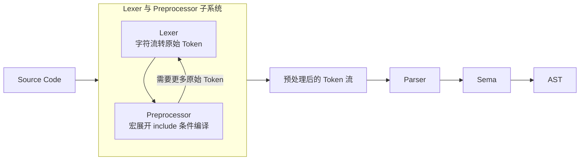

常见关注点：

| 知识点          | 理解重点                     |
| ------------ | ------------------------ |
| Lexer        | token 如何生成               |
| Parser       | 如何构建 AST                 |
| Sema         | 类型检查、重载决议、模板实例化          |
| AST          | Clang AST 和 LLVM IR 的区别  |
| CodeGen      | AST 如何降到 LLVM IR         |
| Diagnostics  | 编译错误、warning、fix-it hint |
| LibTooling   | 静态分析、代码重构工具              |
| Clang Plugin | 自定义前端扩展                  |

Clang 文档把前端明确拆成 Lexer、Preprocessor、Parser、Sema 和 LLVM IR code generation 等部分。

> 注： Lexer 先从源码字符流中按需产生原始 Token；Preprocessor 接收这些 Token，处理 #include、宏展开和条件编译；Parser 再从 Preprocessor 获取已经预处理过的 Token。Clang 官方内部文档明确说明，Lexer 和 Preprocessor 是紧密协作的组件，外部主要通过 Preprocessor::Lex() 获取下一个 Token；Parser 则不断从 Preprocessor 拉取 Token。


### 2.2 中端 Middle-end

中端处理 LLVM IR，主要做平台无关优化。

典型优化包括：

```text
mem2reg
SROA
InstCombine
SimplifyCFG
GVN
SCCP
DCE / ADCE
LICM
LoopRotate
LoopUnroll
LoopVectorize
SLPVectorize
Inliner
GlobalDCE
IPSCCP
```

LLVM 官方 Pass 文档把 pass 分为 analysis pass 和 transform pass：analysis pass 计算信息，transform pass 修改程序表示。`opt` 可以用来运行、测试和观察这些优化。


### 2.3 后端 Backend

后端把 LLVM IR 转成目标机器代码。

典型流程：

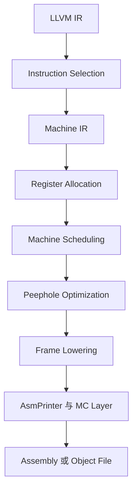

LLVM 后端有 target-independent code generator 和 target-specific backend 两部分；后端需要定义 `TargetMachine`、`DataLayout` 等接口，复用代码生成框架来支持具体架构。


### 2.4 整体链路图：从源码到机器码

不要把 LLVM 记成孤立名词，而应当能把一段 C/C++ 代码沿着下面这条链路讲到底：

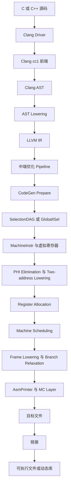

分析一个优化或机制时，建议明确：**这个优化/机制在哪一层发生、依赖什么分析、改变了什么表示、会影响后续哪一层**。

# 3. LLVM IR 核心知识

## 3.1 LLVM IR 的三种形态

LLVM IR 有三种常见形态：

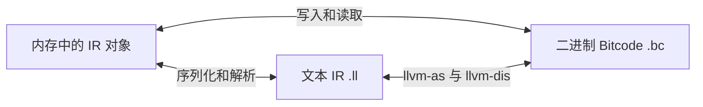

官方 LangRef 说明 LLVM 代码表示既可以作为内存中的编译器 IR，也可以作为磁盘上的 bitcode，还可以作为人类可读的 assembly language 表示。


## 3.2 IR 基本层次结构

LLVM IR 的核心对象层级：

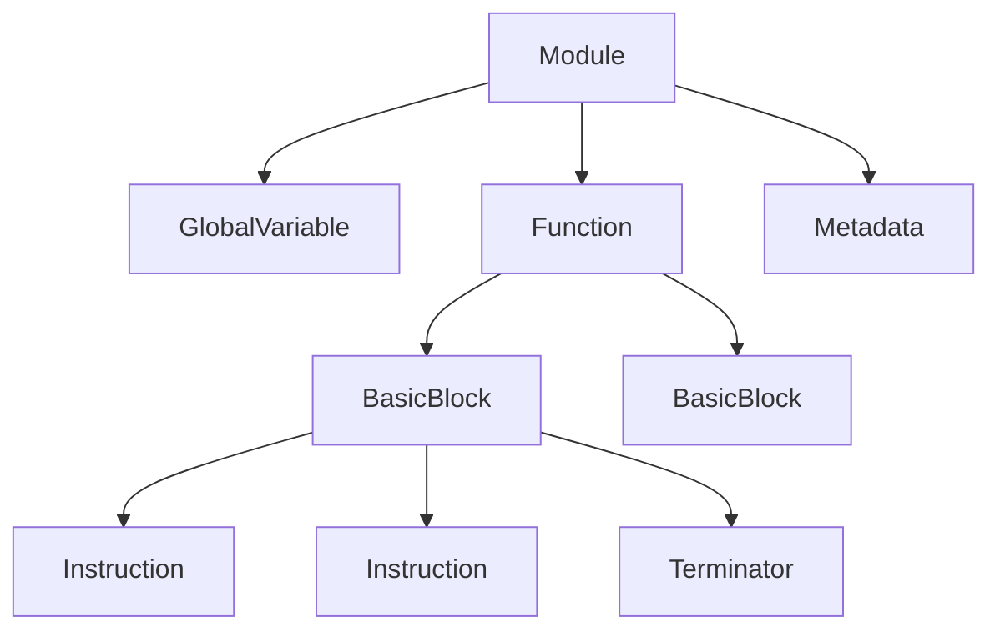

概括表达：

> Module 对应一个编译单元或者链接单元；Function 对应函数；BasicBlock 是单入口、单出口的基本块；Instruction 是 SSA 值，同时也可能有副作用；基本块最后必须以 terminator instruction 结束，比如 `br`、`ret`、`switch`、`invoke`。


## 3.3 SSA 形式

LLVM IR 是 SSA 风格的中间表示。

SSA 的核心特点：


例如：

```llvm
define i32 @max(i32 %a, i32 %b) {
entry:
  %cmp = icmp sgt i32 %a, %b
  br i1 %cmp, label %then, label %else

then:
  br label %merge

else:
  br label %merge

merge:
  %res = phi i32 [ %a, %then ], [ %b, %else ]
  ret i32 %res
}
```

理解重点：

| 问题              | 回答要点                                                  |
| --------------- | ----------------------------------------------------- |
| 为什么用 SSA？       | 便于数据流分析、常量传播、DCE、GVN、寄存器分配                            |
| phi 是什么？        | 控制流合流点根据前驱块选择值                                        |
| alloca 是 SSA 吗？ | alloca 是内存对象，mem2reg 可以把可提升的 alloca 转成 SSA register   |
| SSA 怎么回到机器代码？   | 后端通过寄存器分配、phi elimination、copy insertion 等机制 lowering |


### 3.3.1 `alloca`、内存对象和真正 SSA 值

严格来说，`%p = alloca i32` 这条指令产生的 `%p` 是一个 SSA value，因为 `%p` 只定义一次；但 `%p` 指向的是一块栈内存，这块内存的内容可以被多次 `store` 修改，所以**内存对象本身不是 SSA register**。

```llvm
%a = alloca i32
store i32 1, ptr %a
store i32 2, ptr %a
%v = load i32, ptr %a
```

这里 `%a` 这个指针没有变，但 `*%a` 的内容变了。前端在 `-O0` 或调试友好 IR 中经常用 `alloca + load/store` 表示源码局部变量：赋值就是 `store`，读取就是 `load`。优化时，`mem2reg` 会把可提升的 alloca 转成 SSA value。

可提升 alloca 通常满足：

```text
1. alloca 通常位于 entry block
2. 只被直接 load/store 使用
3. 地址没有逃逸到未知函数或全局位置
4. 没有复杂 GEP/bitcast/指针运算破坏可分析性
5. 对象可以表示成标量 SSA value
```

例如：

```llvm
%a = alloca i32
store i32 %x, ptr %a
%v = load i32, ptr %a
%r = add i32 %v, 1
ret i32 %r
```

经过 mem2reg 后可以变成：

```llvm
%r = add i32 %x, 1
ret i32 %r
```

如果控制流合流，则 mem2reg 会插入 `phi`：

```llvm
then:
  br label %merge
else:
  br label %merge
merge:
  %a = phi i32 [ 1, %then ], [ 2, %else ]
  ret i32 %a
```

### 3.3.2 SSA 如何回到机器代码？

LLVM IR 的 SSA value 不能直接变成机器码，因为真实机器：

```text
1. 没有无限寄存器
2. 没有 phi 指令
3. 某些指令有二地址约束
4. 寄存器数量有限，不够时要 spill 到栈上
```

后端大致这样 lowering：

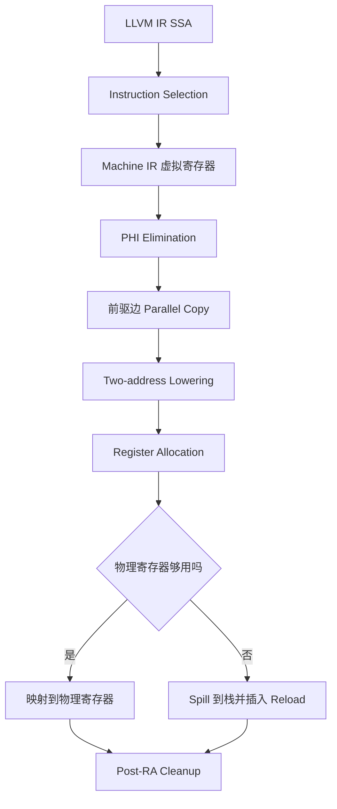

`phi` 的语义是“根据前驱块选择值”：

```llvm
%x = phi i32 [ %a, %bb1 ], [ %b, %bb2 ]
```

机器层没有这样的指令，所以后端会在前驱边插入 copy：

```text
bb1:
  v_x = COPY v_a
  jump merge

bb2:
  v_x = COPY v_b
  jump merge

merge:
  use v_x
```

多个 phi 同时存在时，这些 copy 语义上是 **parallel copy**。如果出现交换：

```text
x_new = y_old
y_new = x_old
```

不能天真生成：

```text
x = y
y = x
```

因为第二句里的 `x` 已经被覆盖。后端需要临时寄存器或更复杂的 copy lowering。后续寄存器分配和 copy coalescing 会尽量让这些 copy 消失。

### 3.3.3 `phi` 为什么不是普通运行时指令？

`phi` 描述的是 **CFG 边上的值选择**，它必须位于基本块开头，但语义发生在控制流从某个前驱进入当前块的瞬间。它不是“进入 merge 块后再执行一次判断”，也不应被理解为普通的条件移动指令。

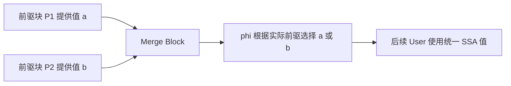

Lowering 时通常在前驱边插入 copy。若某条边同时连接多个后继或某个后继拥有多个前驱，插入 copy 可能会改变其他路径语义，这类边称为 **critical edge**。编译器可能先拆分 critical edge，再放置 copy。

多个 `phi` 需要按照 parallel copy 语义同时完成。寄存器分配器会尝试通过 coalescing 给源值和目标值分配同一物理寄存器，从而消除 copy；若存在交换环，则需要临时寄存器或 spill slot 打破环。


## 3.4 Opaque Pointer

现代 LLVM 默认使用 opaque pointer。

旧 IR：

```llvm
%p = alloca i32
%q = bitcast i32* %p to i8*
```

opaque pointer 模式：

```llvm
%p = alloca i32
; pointer 类型统一为 ptr
```

官方文档说明，在 opaque pointer 模式中，所有 pointer 都是 opaque；这也是默认模式。

理解要点：

> 过去 LLVM IR 的 pointer type 携带 pointee type，比如 `i32*`、`i8*`。但这容易导致大量无意义 bitcast，也容易让人误以为 pointer type 表示真实内存对象类型。opaque pointer 统一用 `ptr`，真正的访问类型由 load/store/GEP 等指令决定。


## 3.5 `undef`、`poison`、`freeze` 与 UB

这是 LLVM IR 正确性中的核心难点。它们都可能在 `.ll` 文本 IR 中出现，但出现方式不一样：

| 名称 | 会不会直接出现在 `.ll` | 含义 | 
|---|---|---|
| `undef` | 会 | `undefined` 的缩写, 未指定值，每次 use 可以取不同合法值 |
| `poison` | 会，但更多时候由指令隐式产生 | 有毒值，违反 IR 约束后的错误传播值 |
| `freeze` | 会 | 一条 IR 指令，把 undef/poison 固定成普通值 |

### 3.5.1 UB 是什么？

`UB` 是 **Undefined Behavior，未定义行为**。一旦某条执行路径触发 UB，LLVM 优化器可以认为这条路径不会发生，并基于这个假设做优化。

C/C++ 中常见 UB：

```c
int x = INT_MAX;
int y = x + 1;   // signed overflow，UB

int a[10];
int z = a[100];  // 越界访问，UB

int *p = nullptr;
int v = *p;      // 空指针解引用，UB
```

UB 不等于“一定崩溃”，而是“语义不再受约束”。优化器可以删代码、重排、假设条件恒真，最终表现可能随编译器、优化等级和平台变化。

### 3.5.2 `undef`

`undef` 表示某个未指定值，每次使用都可以选择任意合法 bit pattern。

```llvm
%r = xor i32 undef, undef
```

不能把它优化成 0，因为两个 `undef` 使用点可以取不同值。`undef` 不是运行时随机数，而是优化器在每个 use 点都可以任选一个合法值。现代 LLVM 中 `undef` 已经不鼓励随便使用，常见于未初始化内存、旧 IR、测试用例或某些“不关心值”的场景。

### 3.5.3 `poison`

`poison` 表示某个操作违反了 IR 约束后产生的有毒值。它不一定立刻 UB，但会通过大多数指令传播。

典型来源：

```llvm
%a = add nsw i32 %x, 1      ; signed overflow 时 poison
%b = add nuw i32 %x, 1      ; unsigned overflow 时 poison
%c = shl i32 %x, %s         ; %s >= bitwidth 时 poison
%p = getelementptr inbounds i32, ptr %base, i64 %i  ; inbounds 约束违反时 poison
```

`nsw` 是 `no signed wrap`，`nuw` 是 `no unsigned wrap`。这些 flag 是给优化器的强承诺：如果承诺被违反，结果不是普通 wraparound，而是 poison。

poison 大多数时候会继续传播：

```llvm
%a = add nsw i32 %x, 1   ; overflow 时 %a poison
%b = mul i32 %a, 2       ; %b 也 poison
```

但一旦 poison 进入控制流或有强语义要求的位置，就会触发 immediate UB：

```llvm
br i1 %poison, label %T, label %F   ; 控制流条件是 poison -> UB
%v = load i32, ptr %poison_ptr      ; 指针是 poison -> UB
%q = udiv i32 %x, %poison_divisor   ; divisor 是 poison -> UB
```

### 3.5.4 `freeze`

`freeze` 是一条 LLVM IR 指令，用来把 `undef` 或 `poison` 固定成一个具体但不可预测的普通值。

```llvm
%y = freeze i32 %x
```

如果 `%x` 是普通值，`freeze` 基本等价于 no-op；如果 `%x` 是 `undef` 或 `poison`，`%y` 会变成某个固定的 i32，同一个 `%y` 的所有 use 都看到同一个值。

例如：

```llvm
%u = freeze i32 undef
%r = xor i32 %u, %u   ; 这里可以是 0
```

`freeze` 常用于让某些优化合法，尤其是 `LoopUnswitch`、speculation 等会把原本不一定被观察的值提前观察的场景。如果提前对可能 poison 的条件做 `br`，会引入新的 UB；先 `freeze` 就能避免这种问题。

### 3.5.5 机制概括

> `undef` 是未指定值，每次 use 可以看到不同合法值；`poison` 是违反 LLVM IR 约束后产生的错误传播值，例如 `add nsw` 溢出、`inbounds gep` 越界、shift amount 越界等；`freeze` 把 undef/poison 固定成一个普通但不可预测的值，阻止 poison 继续传播。poison 本身属于 deferred UB，但如果用于 `br` 条件、load/store 指针、除法分母、`noundef` 参数等位置，就会触发真正 UB。

### 3.5.6 `undef`、`poison`、`freeze` 的判断路径

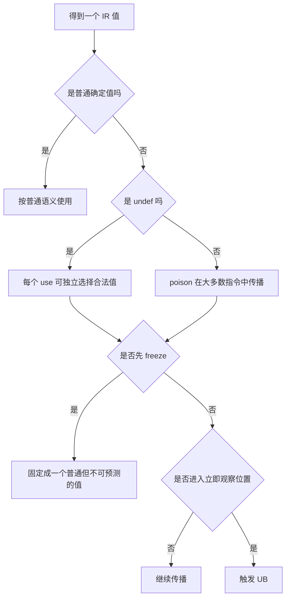

几个容易混淆的点：

1. `undef` 不是“读取一个随机数”。同一个 `undef` 的不同 use 可以被优化器选择成不同值。
2. `poison` 也不是立即崩溃。它更像一项已经被违反但尚未被观察的语义承诺。
3. `br i1 poison` 会立即触发 UB；而某些普通算术指令接收 poison 后只会得到新的 poison。
4. `freeze` 不会把值固定成 0，而是固定成某个合法、不可预测、但之后保持一致的 bit pattern。
5. Pass 若把一个原本条件执行的计算提前执行，需要考虑该计算是否可能产生 poison 或 trap；这也是 speculation、LoopUnswitch 和 `freeze` 经常联系在一起的原因。


## 3.6 GEP 指令

GEP，全称 `getelementptr`，用于地址计算。

例子：

```llvm
%p = getelementptr inbounds i32, ptr %arr, i64 %idx
```

常见误区：

| 误区           | 正确理解                     |
| ------------ | ------------------------ |
| GEP 会访问内存    | 不会，它只算地址                 |
| GEP 等价于加字节偏移 | 它根据元素类型和 DataLayout 计算偏移 |
| inbounds 没影响 | 有影响，越界会产生 poison         |
| GEP 修改指针指向对象 | 不修改，只产生新地址               |

常见疑问：

> GEP 和 ptrtoint + add + inttoptr 有什么区别？

回答：

> GEP 保留了 LLVM 的对象 provenance、别名分析和类型布局信息，更利于优化；ptrtoint/inttoptr 会丢失很多高级语义，可能影响 alias analysis 和优化正确性。


## 3.7 Metadata 和 Debug Info

Metadata 是 LLVM IR 主体指令之外的“额外信息”。它不是普通操作数，不直接产生机器指令，但会影响调试、优化、别名分析、PGO、循环优化等。

例如：

```llvm
%v = load i32, ptr %p, align 4, !dbg !12, !tbaa !8
br i1 %cond, label %hot, label %cold, !prof !20
```

这里 `!dbg`、`!tbaa`、`!prof` 都是 metadata。它们不是计算输入，但优化器、调试器、后端会读取它们。

| Metadata | 用途 | 常见位置 | 理解要点 |
|---|---|---|---|
| `!dbg` | 调试信息 | 几乎所有指令 | 源码行号、变量位置、内联栈 |
| `!tbaa` | Type-Based Alias Analysis | load/store/call | 基于类型系统辅助别名分析 |
| `!prof` | Profile 信息 | br/switch/call/function | 分支权重、函数热度、PGO |
| `!range` | 值范围信息 | load/call/invoke | 不满足范围会产生 poison |
| `!alias.scope` / `!noalias` | 更精确的 noalias 信息 | load/store/call | 常来自 restrict、参数 noalias、inlining |
| `!llvm.loop` | 循环 hint | 循环 latch branch | vectorize、unroll、interleave 等提示 |

### 3.7.1 `!dbg`：调试信息

`!dbg` 把 IR 指令映射回源代码位置：

```llvm
%add = add nsw i32 %x, 1, !dbg !17
!17 = !DILocation(line: 2, column: 15, scope: !10)
```

它用于：

```text
1. gdb/lldb 显示当前源代码行
2. 崩溃栈回溯显示文件名、行号、函数名
3. 变量调试信息
4. Sample PGO 将采样热点映射回 IR
5. perf/profile 工具关联机器码和源代码
```

优化会删除、合并、移动指令，所以 Pass 作者需要尽量维护 `!dbg`，否则调试体验会变差。

### 3.7.2 `!tbaa`：基于类型的别名分析

`tbaa` 是 `Type-Based Alias Analysis`。LLVM IR 的内存本身没有 C/C++ 高层类型，所以前端通过 `!tbaa` 告诉优化器某次内存访问对应的源语言类型。

> 基于类型的别名分析: 两个内存访问是否可能访问同一块内存，从而帮助编译器进行更激进的优化。

```llvm
store i32 1, ptr %p, align 4, !tbaa !8
store float 2.0, ptr %q, align 4, !tbaa !12
%v = load i32, ptr %p, align 4, !tbaa !8
```

上面代码中 p 和 q 可能会指向同一块内存地址。

如果根据 C/C++ strict aliasing，`int*` 和 `float*` 通常不 alias，那么优化器可以认为 `store float` 不会改变 `load int` 的值。错误的 TBAA 很危险，会导致 GVN、LICM、DSE 等做出错误优化。

### 3.7.3 `!prof`：Profile / Branch Weight

`!prof` 常用于分支权重：

```llvm
br i1 %cond, label %hot, label %cold, !prof !20
!20 = !{!"branch_weights", i32 9000, i32 1}
```

表示 true 分支更热。它会影响：

```text
基本块布局
分支预测
内联决策
热冷代码分离
循环优化 cost model
Machine Block Placement
```

来源包括 PGO、SamplePGO、`__builtin_expect`、前端属性或优化器推断。

### 3.7.4 `!range`：值范围

`!range` 表示某个整数值的可能范围：

```llvm
%v = load i32, ptr %p, !range !0
!0 = !{i32 0, i32 10}   ; [0, 10)
```

优化器可以据此简化比较、消除边界检查、简化 switch。如果实际值不在范围内，结果会变成 poison，所以 `!range` 是强约束，不是“猜测”。

### 3.7.5 `!alias.scope` / `!noalias`

这两个 metadata 用于描述一组内存访问之间更精确的 noalias 关系，常见于 `restrict`、函数参数 `noalias` 或 inlining 后的参数作用域。

粗略理解：

```llvm
%va = load i32, ptr %a, !alias.scope !10, !noalias !20
store i32 %x, ptr %b, !alias.scope !20, !noalias !10
```

可以表示访问 `a` 属于 scope A，并且不与 scope B alias；访问 `b` 属于 scope B，并且不与 scope A alias。

和 `!tbaa` 的区别：

```text
!tbaa：根据类型系统判断别名
!alias.scope / !noalias：根据具体访问集合和作用域判断别名
```

### 3.7.6 `!llvm.loop`：循环优化提示

`!llvm.loop` 通常挂在循环 latch branch 上：

```llvm
br i1 %exitcond, label %exit, label %loop, !llvm.loop !10

!10 = distinct !{!10, !11, !12}
!11 = !{!"llvm.loop.vectorize.enable", i1 true}
!12 = !{!"llvm.loop.unroll.count", i32 4}
```

常见 hint：

```text
llvm.loop.vectorize.enable
llvm.loop.vectorize.width
llvm.loop.interleave.count
llvm.loop.unroll.count
llvm.loop.unroll.disable
llvm.loop.unroll.full
llvm.loop.parallel_accesses
llvm.loop.mustprogress
```

多数 loop metadata 是 hint，不是绝对命令。即使用户写了 vectorize enable，如果循环存在无法解决的数据依赖，优化器也不能错误向量化。

### 3.7.7 Pass 作者处理 metadata 的原则

如果 Pass 修改了 IR，必须考虑 metadata 是否仍然正确：

```text
!dbg 错了：调试行号/变量位置错
!tbaa 错了：可能错误认为两个访问 NoAlias
!range 错了：可能把真实值变成 poison，导致错误优化
!noalias 错了：可能错误删除或重排 load/store
!llvm.loop 错了：可能错误展开/向量化循环
```

原则：**不能证明 metadata 仍然正确，就删除或更新它。**

# 4. Clang 前端知识点

## 4.1 Clang 编译流程

常用命令：

```bash
# 只预处理
clang -E test.c -o test.i

# 生成 LLVM IR 文本
clang -S -emit-llvm test.c -o test.ll

# 生成 LLVM bitcode
clang -emit-llvm -c test.c -o test.bc

# 生成汇编
clang -S test.c -o test.s

# 生成目标文件
clang -c test.c -o test.o
```

Clang command guide 说明 Clang 可根据不同 high-level mode 在完整链接前的不同阶段停止。


## 4.2 Driver 和 cc1 的区别

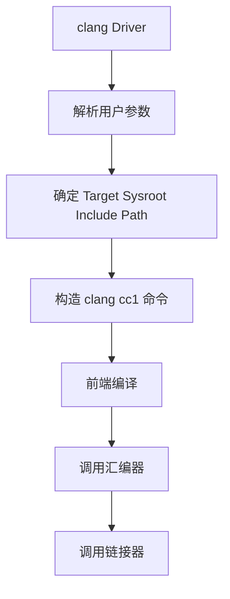

常见命令：

```bash
clang -### test.c
```

`-###` 可以打印 driver 实际调用的子命令。

简要概括：

> `clang` 默认是 driver，负责解析用户参数、选择 target、sysroot、include path、linker 等；`clang -cc1` 是真正执行前端编译动作的内部命令。调试 Clang 前端问题时，经常用 `-###` 拿到 cc1 invocation。


## 4.3 AST 和 LLVM IR 的区别

| 对比项   | Clang AST               | LLVM IR       |
| ----- | ----------------------- | ------------- |
| 层次    | 源语言级别                   | 编译器中间表示       |
| 保留信息  | C++ 类、模板、重载、语法结构        | 控制流、数据流、低级操作  |
| 类型    | C/C++ 类型系统              | LLVM 类型系统     |
| 适合做什么 | 静态检查、重构、语义分析            | 优化、代码生成       |
| 示例工具  | LibTooling、Clang Plugin | opt、LLVM Pass |

概括表达：

> AST 更接近源代码，适合做代码检查、重构、语义分析；LLVM IR 更接近机器无关的低级程序表示，适合做优化和代码生成。例如检查“函数命名规范”应该用 AST，而做循环优化、死代码删除、内联分析应该用 LLVM IR。


# 5. Pass Manager

## 5.1 Pass 是什么？

Pass 是 LLVM 中执行分析或变换的基本单元。

两类 Pass：

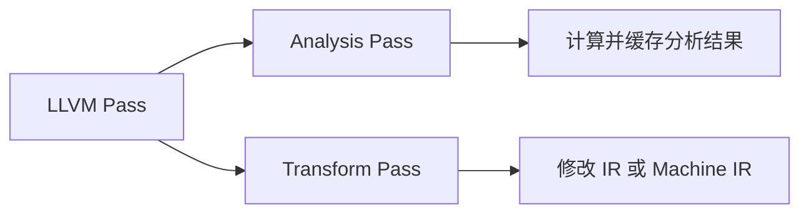

常见粒度：

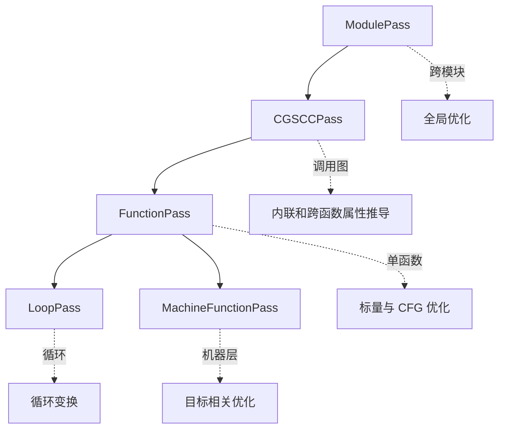

官方 Pass 文档说明 LLVM 的优化以 Pass 实现，pass 可以遍历程序的一部分来收集信息或转换程序。


## 5.2 Legacy PM 和 New PM

这是理解 Pass Manager 的重点。

当前官方 New Pass Manager 文档说明：LLVM 仍有两个 pass manager；中端优化使用 New PM，目标相关代码生成后端使用 Legacy PM。

### Legacy PM 特点

```cpp
struct MyPass : public FunctionPass {
  static char ID;
  MyPass() : FunctionPass(ID) {}

  bool runOnFunction(Function &F) override {
    return false;
  }
};
```

特点：

```text
继承 FunctionPass / ModulePass
通过 getAnalysisUsage 声明依赖
返回 bool 表示是否修改 IR
```

### LLVM New Pass Manager（New PM）

LLVM New Pass Manager（NPM）是 LLVM 新一代 Pass 框架，用于替代 Legacy Pass Manager。

核心变化：

* Pass 不再继承复杂的基类体系
* 使用模板（CRTP）和组合方式管理 Pass
* 通过 `AnalysisManager` 缓存分析结果
* 通过 `PreservedAnalyses` 精确控制分析失效


#### 1. New PM Pass 基本形式

```cpp
struct MyPass : public PassInfoMixin<MyPass> {

  PreservedAnalyses run(
      Function &F,
      FunctionAnalysisManager &AM) {

      // 修改 IR

      return PreservedAnalyses::all();
  }
};
```

结构：

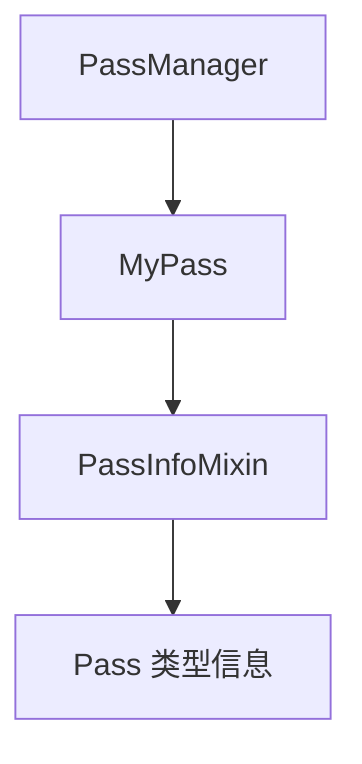

#### 2. PassInfoMixin

`PassInfoMixin<T>` 是一个 Mixin，用于给 Pass 添加元信息。

> Mixin是一种面向对象设计思想，它的核心不是表达“继承关系”，而是向一个类注入某种独立的能力。传统继承主要描述 is-a 关系，例如 Dog : Animal 表示“狗是一种动物”；而 Mixin 更关注 has-a capability，表示“这个类具有某种能力”。因此，Mixin 通常设计成小而独立的功能模块，例如序列化能力、比较能力、日志能力等，然后通过继承或模板组合的方式混入到目标类中。

> CRTP（Curiously Recurring Template Pattern，奇异递归模板模式）是一种 C++ 模板技巧：让派生类把自己的类型作为模板参数传给基类，使基类能够在编译期获取派生类信息，从而实现静态多态，避免虚函数开销。把“运行时动态绑定”提前到“编译期静态绑定”。

作用：

* 提供 Pass 名称
* 提供类型识别
* 支持 Pass 注册

它不是优化逻辑，只是让 LLVM 认识这个 Pass。


#### 3. run() 参数

```cpp
PreservedAnalyses run(
    Function &F,
    FunctionAnalysisManager &AM)
```

##### Function &F

当前处理的函数：

```text
Module
 |
 +-- Function foo
 +-- Function bar
```

Function Pass 会逐个处理 Function。

##### FunctionAnalysisManager &AM

管理 Analysis 结果。

例如：

* DominatorTree
* LoopInfo
* AliasAnalysis

Analysis 结果会缓存，避免重复计算。

#### 4. PreservedAnalyses

Pass 修改 IR 后，需要告诉 LLVM：

> 已经缓存的 Analysis 哪些仍然有效？

例如：

```cpp
return PreservedAnalyses::all();
```

表示IR 没有影响分析结果，所有缓存继续使用

```cpp
return PreservedAnalyses::none();
```

表示IR 大幅修改，所有 Analysis 失效，重新计算

部分保留：

```cpp
PA.preserve<DominatorTreeAnalysis>();
```

表示DominatorTree 仍有效，其他 Analysis 失效


流程：

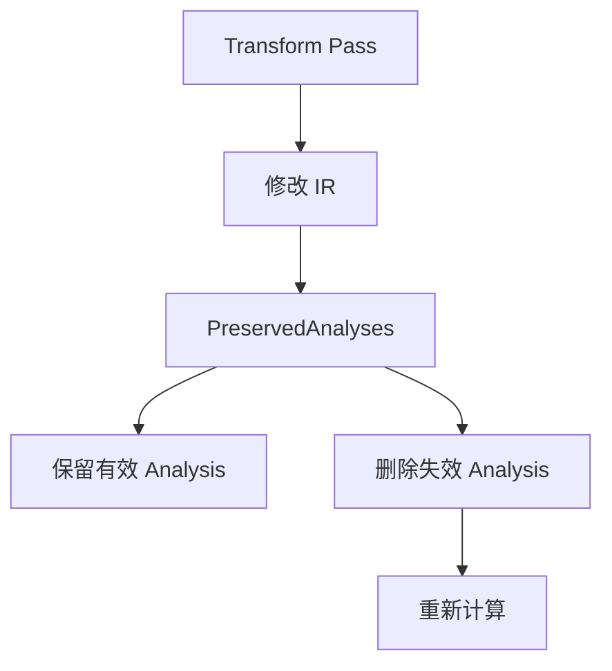


### 为什么 New PM 更高效？

Legacy PM：

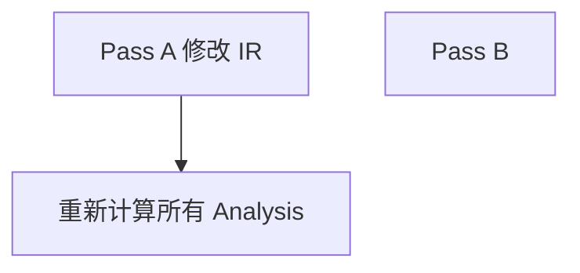

问题：

* 分析重复计算
* Pass 耦合严重

New PM：

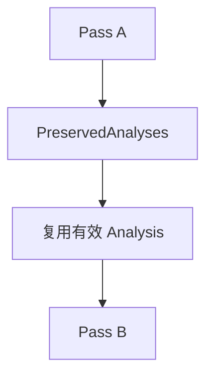

优势：

* 减少重复分析
* 提高优化 pipeline 效率

一句话：

> New PM 的核心思想是：Pass 修改 IR 后，通过 `PreservedAnalyses` 精确告诉 LLVM 哪些分析结果可以继续复用，从而避免重复计算。


## 5.3 PreservedAnalyses

New PM 中，一个 Pass 修改 IR 之后，需要告诉框架哪些 analysis 仍然有效。

例如：

```cpp
return PreservedAnalyses::all();
```

表示没有修改 IR，所有分析结果都保留。

```cpp
return PreservedAnalyses::none();
```

表示修改较大，之前分析结果都可能失效。

简要概括：

> New PM 不再简单用 bool 表示是否修改 IR，而是用 `PreservedAnalyses` 精确表达哪些分析仍然可复用。这样可以减少重复分析，提高 pipeline 效率，也让 pass 之间的依赖关系更清晰。

### 5.3.1 Analysis invalidation 为什么容易出错？

Analysis 结果通常与 IR 的某种结构绑定：

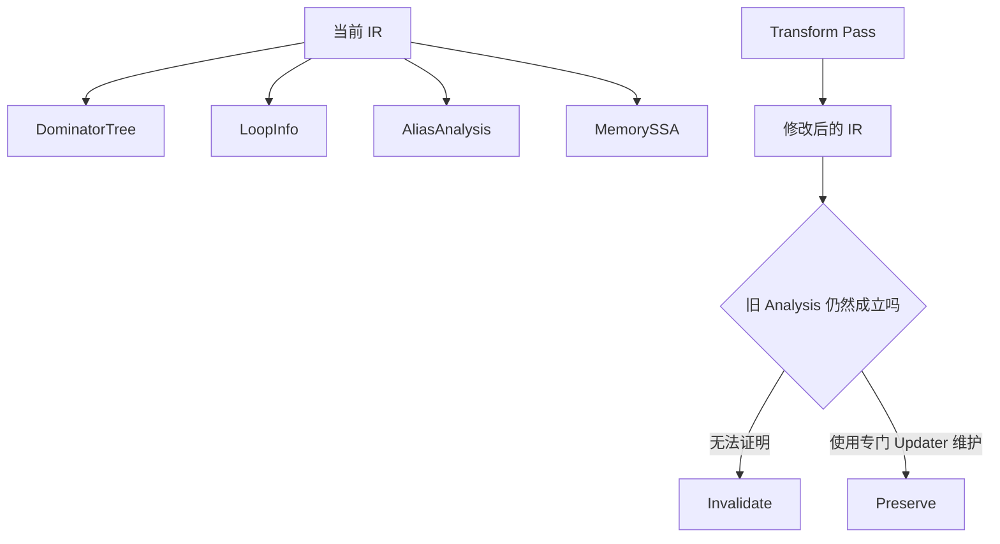

典型错误包括：

- 删除或重定向 CFG 边后仍声称保留 `DominatorTree`；
- 移动 load/store 后仍声称保留 `MemorySSA`；
- 修改循环结构却保留旧 `LoopInfo`；
- 修改函数调用属性后仍复用旧 AA 结论。

稳妥策略是：小范围、可证明维护的变换使用 `DomTreeUpdater`、`MemorySSAUpdater` 等增量更新工具；否则宁可少保留 analysis，也不要返回错误的 `PreservedAnalyses`。错误保留通常不会立刻触发 verifier，却可能让后续 Pass 基于陈旧信息产生 miscompile。


## 5.4 Pass 粒度选择

| Pass 类型             | 适合场景                             |
| ------------------- | -------------------------------- |
| ModulePass          | 全模块分析、全局变量、跨函数优化                 |
| CGSCCPass           | 调用图 SCC 级别优化，比如 inliner          |
| FunctionPass        | 单函数优化，比如 InstCombine、SimplifyCFG |
| LoopPass            | 循环优化，比如 LICM、LoopUnroll          |
| MachineFunctionPass | 后端 MachineInstr 优化               |

思考题：

> 为什么 Inliner 通常不是简单 FunctionPass？

回答：

> 因为内联需要分析调用关系，改变调用图，并且可能触发新的内联机会。它天然是跨函数、调用图相关优化，因此更适合在 CGSCC 层级处理。


## 5.5 CGSCCPass：为什么 inliner 是调用图 SCC 级别优化？

`CGSCCPass` 可以拆成：

```text
Call Graph Strongly Connected Component Pass
调用图强连通分量级别 Pass
```

调用图把函数看成节点，把调用关系看成边：


如果存在递归或互相递归：

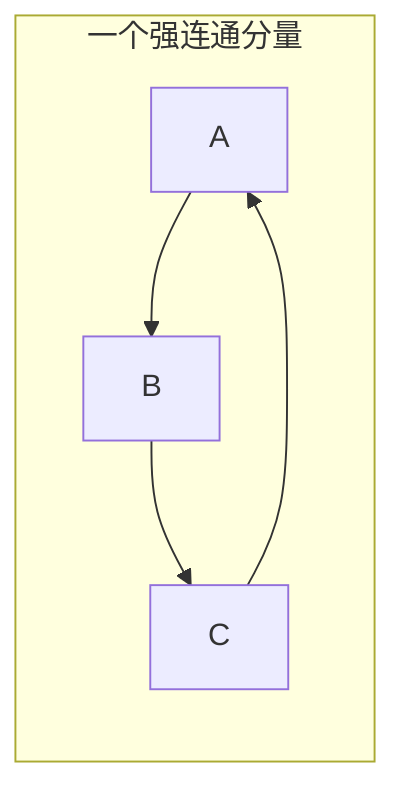

那么 `{A, B, C}` 互相可达，构成一个 SCC。跨函数优化通常需要自底向上处理：先优化 callee，再优化 caller。但递归 SCC 没有单独的“最底层”，所以必须作为整体处理。

`inliner` 不能只是 FunctionPass，因为它要考虑：

```text
callee 大小和调用开销
caller/callee 调用关系
递归和互相递归
调用频率 profile
always_inline / noinline 属性
内联后调用图如何变化
内联后是否暴露新的优化机会
代码体积成本
```

概括表达：

> CGSCCPass 运行在调用图强连通分量上，适合 inliner、函数属性推导、IPSCCP 等跨函数优化。inliner 会改变调用图，且递归函数必须作为 SCC 整体处理，因此通常不是简单 FunctionPass。

# 6. 常见中端优化 Pass

## 6.1 mem2reg

作用：

```mermaid
flowchart LR
    A[alloca] --> B[store]
    B --> C[load]
    C --> D[mem2reg]
    D --> E[SSA Value]
    E --> F{控制流是否合流}
    F -->|是| G[插入 phi]
    F -->|否| H[直接替换 load 和 store]
```

源代码：

```c
int f(int x) {
  int a = x;
  a = a + 1;
  return a;
}
```

未优化 IR 常见形式：

```llvm
%a = alloca i32
store i32 %x, ptr %a
%v = load i32, ptr %a
%add = add i32 %v, 1
store i32 %add, ptr %a
%r = load i32, ptr %a
ret i32 %r
```

优化后：

```llvm
%add = add i32 %x, 1
ret i32 %add
```

理解要点：

```text
mem2reg 基于 Dominator Tree 和 SSA 构造算法
只提升 promotable alloca
通常处理 entry block 中的 alloca
遇到地址逃逸、复杂内存使用时无法提升
```


## 6.2 SROA

SROA，全称 Scalar Replacement of Aggregates。

作用：

```text
把结构体、数组等聚合对象拆成更小的 scalar
```

例子：

```c
struct P { int x; int y; };
int f() {
  struct P p;
  p.x = 1;
  p.y = 2;
  return p.x;
}
```

优化方向：

```mermaid
flowchart TD
    A[聚合对象 alloca] --> B[SROA 按字段或切片拆分]
    B --> C[多个更小的标量 alloca]
    C --> D[mem2reg]
    D --> E[纯 SSA 标量值]
```

简要概括：

> mem2reg 更像是把简单局部变量从内存提升到 SSA；SROA 先把聚合对象拆碎，再让后续 mem2reg、InstCombine、DCE 等优化发挥作用。


## 6.3 InstCombine

InstCombine，全称 **Instruction Combining**，是 LLVM IR 层非常核心的局部优化和 canonicalization pass。

它的目标不是单纯“让某条指令更快”，而是：

```mermaid
flowchart LR
    A[非规范 IR] --> B[InstCombine]
    B --> C[更简单的表达式]
    B --> D[Canonical Form]
    C --> E[后续 GVN SCCP DCE 更易识别]
    D --> E
```

典型变换：

```llvm
%a = add i32 %x, 0      ; -> %x
%b = mul i32 %x, 1      ; -> %x
%c = and i32 %x, 0      ; -> 0
%d = mul i32 %x, 2      ; -> shl i32 %x, 1
```

它还会做：

```text
连续 cast 合并
GEP 化简
比较谓词规范化
select / icmp / zext 模式化简
代数恒等式变换
减少其他 pass 需要匹配的 pattern 数量
```

InstCombine 的关键词是 **canonicalization**。例如：

```llvm
%a = icmp ule i8 %x, 7
```

可能规范化成：

```llvm
%a = icmp ult i8 %x, 8
```

这不一定立刻让机器码更快，但能让后续 GVN、SCCP、SimplifyCFG 等更容易识别模式。

和 CSE/GVN 的区别：

| Pass | 关注点 |
|---|---|
| InstCombine | 单条或局部几条指令能否变简单、变规范 |
| CSE | 相同表达式是否重复计算 |
| GVN | 语义等价的值是否重复计算 |
| LICM | 循环内不变的东西能否搬出去 |

概括表达：

> InstCombine 是 IR 层目标无关 canonicalization pass。它做局部 peephole 化简和表达式规范化，比如 `x+0 -> x`、`x*2 -> x<<1`、比较谓词规范化。它的价值不只是减少当前指令数量，更是把 IR 变成后续优化可以稳定依赖的 canonical form。

## 6.4 SimplifyCFG

作用：

```mermaid
flowchart TD
    A[复杂 CFG] --> B[SimplifyCFG]
    B --> C[折叠常量分支]
    B --> D[删除不可达块]
    B --> E[合并基本块]
    B --> F[简化 switch]
    C --> G[更新 phi 与 CFG]
    D --> G
    E --> G
    F --> G
```

例子：

```llvm
br i1 true, label %A, label %B
```

优化成：

```llvm
br label %A
```

理解要点：

```text
会影响 CFG
可能更新 phi
常和 InstCombine 交替运行
```


## 6.5 DCE / ADCE

### DCE（Dead Code Elimination）

DCE（Dead Code Elimination，死代码消除）用于删除**不会影响程序最终结果的无用指令**。

一条指令是否可以删除，主要判断两个条件：

1. **该指令产生的结果是否被使用（Use）**
2. **该指令是否具有副作用（Side Effect）**

例如：

```llvm
%x = add i32 %a, %b
ret i32 0
```

这里：`%x`只是计算结果，但后续没有任何指令使用它：
同时`add`属于纯计算指令，不会修改内存、不影响外部状态，因此可以删除。

DCE 的核心思想：

```mermaid
flowchart TD

Inst[Instruction]

Inst --> Use{结果是否有 User}

Use -->|有| Keep[保留]

Use -->|无| Side{是否有副作用}

Side -->|有| Keep

Side -->|无| Delete[删除]
```

#### 什么是副作用（Side Effect）？

DCE 不能简单根据“返回值没人用”删除指令，因为一些指令虽然没有产生 SSA value，但可能改变程序状态。

例如`call void @foo()`

即使`foo()`没有返回值

也不能直接删除，因为`foo()`可能：
- 修改全局变量
- 写文件
- 输出日志
- 修改内存
- 访问外部资源
```

类似地, `store`

```llvm
store i32 10, ptr %p
```

不能删除：

因为它修改内存。

#### volatile load

```llvm
%v = load volatile i32, ptr %p
```

即使 `%v` 没有使用，也不能删除。

原因：

`volatile` 表示该访问本身具有语义意义，例如：

* 访问硬件寄存器
* 内存映射 IO

#### Terminator

例如：

```llvm
br label %exit
```

或者：

```llvm
ret i32 0
```

不能删除。

因为它们控制：

* CFG 结构
* 函数返回

### ADCE（Aggressive Dead Code Elimination）

ADCE 是 DCE 的增强版本。

普通 DCE：

> 从指令自身出发，看结果有没有被使用。

ADCE：

> 从程序出口反向分析，判断哪些指令真正影响程序行为。

例如：

```c
void foo()
{
    int a = 1;
    int b = a + 2;

    return;
}
```

LLVM IR：

```llvm
%a = add i32 0, 1

%b = add i32 %a, 2

ret void
```

观察`ret void`不依赖：

```
%b
 |
%b 不影响程序结果

%a
 |
%a 也不影响程序结果
```

因此 ADCE 可以把：

```llvm
%a
%b
```

全部删除。

ADCE 的核心流程：

```mermaid
flowchart TD

Start[函数入口]

Start --> Mark[标记 Live 指令]

Mark --> Roots[
程序必须保留的指令:
ret/store/call副作用/br条件
]

Roots --> Backward[反向追踪 operand]

Backward --> Live[标记依赖指令]

Live --> Delete[删除未标记指令]
```

# DCE 与 ADCE 区别

|      | DCE            | ADCE              |
| ---- | -------------- | ----------------- |
| 思路   | 发现无用指令删除       | 先找有用指令，再删除剩余      |
| 分析方向 | 基于 Use-Def     | 基于 Live Analysis  |
| 删除粒度 | 主要 Instruction | Instruction + CFG |
| 激进程度 | 较保守            | 更激进               |
| 典型用途 | 清理局部无用计算       | 删除整体不可达计算链        |

> **DCE：这个计算结果没人要，而且计算没有副作用 → 删除。**

> **ADCE：从最终程序行为出发，凡是不能影响结果的代码全部删除。**

在 LLVM 优化流程中，DCE/ADCE 通常配合 InstCombine、GVN、SimplifyCFG 等 Pass 使用，因为前面的优化经常会产生新的死代码，需要后续 Pass 清理。


## 6.6 GVN

GVN，全称 **Global Value Numbering，全局值编号**。

它解决的问题是：

```mermaid
flowchart TD
    A[表达式或 Load] --> B[计算 Value Number]
    B --> C[查找等价类]
    C --> D{已有等价值吗}
    D -->|否| E[记录新 Value Number]
    D -->|是| F{旧定义支配当前位置吗}
    F -->|否| E
    F -->|是| G{内存是否可能被 Clobber}
    G -->|是| E
    G -->|否| H[用旧值替换并删除冗余计算]
```

例如：

```llvm
%x = add i32 %a, %b
%y = add i32 %a, %b
%z = add i32 %x, %y
```

GVN 可以发现 `%x` 和 `%y` 是同一个表达式，把 `%y` 替换成 `%x`：

```llvm
%x = add i32 %a, %b
%z = add i32 %x, %x
```

### 6.6.1 Value Number 是什么？

Value Numbering 的意思是：给语义等价的值分配同一个编号。

| 指令 | 表达式 | Value Number |
|---|---|---|
| `%1 = add %a, %b` | `add(VN(a), VN(b))` | VN#10 |
| `%2 = add %a, %b` | `add(VN(a), VN(b))` | VN#10 |
| `%3 = mul %a, %b` | `mul(VN(a), VN(b))` | VN#11 |
| `%4 = add %b, %a` | canonical 后也是 `add(VN(a), VN(b))` | VN#10 |

如果两个值拥有同一个 value number，优化器认为它们运行时相等。

### 6.6.2 为什么需要支配关系？

等价不代表能替换，还要保证旧值在当前点可用。

```mermaid
flowchart TD
    Entry[Entry] --> A[A 中定义 x]
    Entry --> B[B]
    A --> C[C 中重新计算 y]
    B --> C
    A -.不支配 C.-> C
    Note[从 B 到 C 的路径没有经过 A，因此不能用 x 替换 y]
    C --- Note
```

不能用 `%x` 替换 `%y`，因为程序可能从 B 到 C，没有执行 A。正确条件是：

```text
旧值必须支配当前冗余表达式。
```

所以 GVN 的核心条件是：

```text
语义等价 + 旧定义支配新定义
```

### 6.6.3 Load 的 GVN 为什么难？

普通表达式：

```llvm
%x = add i32 %a, %b
%y = add i32 %a, %b
```

只要 operand、opcode、type、flags 等匹配，就比较容易判断。

但 load：

```llvm
%a = load i32, ptr %p
%b = load i32, ptr %p
```

能否替换取决于中间有没有修改 `*p`：

```llvm
%a = load i32, ptr %p
store i32 100, ptr %p
%b = load i32, ptr %p     ; 不能替换成 %a
```

如果中间是：

```llvm
%a = load i32, ptr %p
store i32 100, ptr %q
%b = load i32, ptr %p
```

还要问 `p` 和 `q` 是否 alias。如果 AA 只能回答 `MayAlias`，GVN 必须保守；如果能证明 `NoAlias`，第二个 load 才可能复用第一个。

Load GVN 常依赖：

```text
DominatorTree
AliasAnalysis
MemorySSA / MemoryDependence
函数属性：readonly / readnone / argmemonly
volatile / atomic 检查
```

### 6.6.4 CSE 和 GVN 的区别

CSE 更像是“表达式长得一样，所以删后一个”；GVN 更像是“值语义等价，所以归入同一个 value number”。

```llvm
%x = add i32 %a, %b
%y = add i32 %b, %a
```

如果有 canonicalization 或 GVN 支持 commutative 表达式，这两个可以被识别为等价。

概括表达：

> GVN 是基于 SSA 的全局冗余消除优化。它给表达式和值分配 value number，把编译期能证明运行时一定相等的值放到同一等价类。如果旧值支配当前指令，就能用旧值替换当前指令。对 load 来说，还需要证明中间没有可能 clobber 该地址的 store/call，因此依赖 AA 和 MemorySSA。GVN 和 CSE 的区别是：CSE 更偏语法相同，GVN 更偏语义等价。

### 6.6.5 MemorySSA 中的 clobber walk

对内存读取做 GVN 时，问题可以转化为：**从当前 load 对应的 MemoryUse 向前追溯，最近一个可能修改该地址的 MemoryDef 是谁？**

```mermaid
flowchart RL
    L2[第二个 load p] --> MU2[MemoryUse]
    MU2 --> D2[可能的 store q]
    D2 --> D1[更早的 store p]
    D1 --> L1[第一个 load p 之前的内存状态]
```

若 `store q` 与 `p` 是 `NoAlias`，clobber walk 可以跳过它；若只能得到 `MayAlias`，就必须把它视为潜在 clobber。`MemoryPhi` 表示不同 CFG 前驱带来的内存状态合流，分析可能需要沿多个来路追溯。

MemorySSA 不直接证明两个指针 NoAlias，它把内存 def-use 链组织得更高效；是否能跳过某个 MemoryDef，仍依赖 Alias Analysis、调用属性和访问大小等信息。


## 6.7 SCCP

SCCP，全称 Sparse Conditional Constant Propagation。

作用：

```mermaid
flowchart TD
    A[SSA 值与 CFG] --> B[SCCP]
    B --> C[值格分析]
    B --> D[可达边分析]
    C --> E[传播常量]
    D --> F[标记不可达分支]
    E --> G[简化指令]
    F --> H[简化 CFG]
```

例子：

```c
int f() {
  int x = 1;
  if (x)
    return 10;
  else
    return 20;
}
```

优化成：

```c
return 10;
```

简要概括：

> SCCP 同时在值 lattice 和 CFG 可达性上做稀疏分析。它不只是传播常量，还能发现某些分支不可达，从而进一步触发 CFG 简化和死代码删除。


## 6.8 LICM

LICM，全称 Loop Invariant Code Motion。

作用：

```mermaid
flowchart LR
    PH[Loop Preheader] --> H[Loop Header]
    H --> B[Loop Body 中的不变计算]
    B --> L[Latch]
    L --> H
    B -.LICM Hoist.-> PH
```

例子：

```c
for (int i = 0; i < n; i++) {
  a[i] = x * y + i;
}
```

`x * y` 如果循环内不变，可以 hoist 到循环前。

理解重点：

```text
需要 LoopInfo
需要 DominatorTree
需要 AliasAnalysis / MemorySSA 判断内存安全
必须保证移动后语义不变
可能需要循环 preheader
```


## 6.9 Loop Vectorizer 和 SLP Vectorizer

LLVM 主要有两类向量化器：

| Vectorizer      | 优化对象             | 例子                  |
| --------------- | ---------------- | ------------------- |
| Loop Vectorizer | 循环迭代             | 一次处理多个 i            |
| SLP Vectorizer  | 基本块内相似 scalar 操作 | 把多个独立标量操作打包成 vector |

官方文档说明 LLVM 有 Loop Vectorizer 和 SLP Vectorizer；Loop Vectorizer 扩宽循环指令以处理多个连续迭代，SLP Vectorizer 把多个 scalar 合并为 vector。

简要概括：

> Loop Vectorizer 关注跨迭代并行，核心问题是依赖分析、trip count、cost model、remainder loop；SLP Vectorizer 关注一个基本块或局部区域内相似 scalar expression 的打包。


## 6.10 CSE、LICM、Instruction Scheduling 的层次区别

这三个经常被一起问，但层次不同：

| 名称 | 层级 | 核心目标 |
|---|---|---|
| CSE / GVN | IR 中端 | 消除重复计算 |
| LICM | IR 中端循环优化 | 把循环不变代码移到循环外 |
| Instruction Scheduling | 后端 MachineInstr | 调整指令顺序，隐藏延迟、减少资源冲突 |

CSE 示例：

```c
x = a + b;
y = a + b;   // 可复用 x
```

LICM 示例：

```c
for (int i = 0; i < n; i++) {
    a[i] = x * y + i;   // x*y 可外提
}
```

指令调度示例：

```asm
ldr x1, [x0]       ; load 可能慢
mul x2, x3, x4     ; 与 load 无关，可放在中间隐藏延迟
add x5, x1, x6     ; 依赖 load 结果
```

调度不删除计算，只是在不破坏数据依赖、内存依赖、控制依赖的前提下重排机器指令。它还要控制 register pressure，过度提前计算会拉长 live range，导致 spill。

## 6.11 LoopRotate

LoopRotate 是循环规范化 pass，常把普通 header-first 判断循环转成更接近 do-while 的 bottom-test loop。

原始形态：

```mermaid
flowchart TD
    H[Header 判断是否进入] -->|true| B[Body]
    H -->|false| E[Exit]
    B --> L[Latch]
    L --> H
```

旋转后常见形态：

```mermaid
flowchart TD
    G[Guard 判断是否至少执行一次] -->|false| E[Exit]
    G -->|true| B[Body]
    B --> L[Latch 中判断是否继续]
    L -->|继续| B
    L -->|结束| E
```

作用不是直接删除计算，而是让后续 loop pass 更容易分析：

```mermaid
flowchart LR
    A[LoopSimplify 与 LCSSA] --> B[LoopRotate]
    B --> C[IndVarSimplify]
    C --> D[LICM]
    D --> E[LoopUnswitch]
    E --> F[LoopUnroll]
    F --> G[LoopVectorize]
    G --> H[LoopDeletion 与 Cleanup]
```

对可能零次执行的循环，LoopRotate 需要 guard，否则会把原本不执行的循环体提前执行，改变语义。

## 6.12 Loop Pass 家族：Unswitch、Unroll、Vectorize、IndVarSimplify、Deletion

### LoopUnswitch

如果循环里有不随迭代变化的条件：

```c
for (int i = 0; i < n; i++) {
    if (flag) A(i);
    else B(i);
}
```

可以变成：

```c
if (flag) {
    for (int i = 0; i < n; i++) A(i);
} else {
    for (int i = 0; i < n; i++) B(i);
}
```

收益是循环体少了分支，后续 vectorize/unroll 更容易；代价是复制循环、增加代码体积。若提前分支条件可能是 poison，LoopUnswitch 可能需要 `freeze` 来避免提前触发 UB。

### LoopUnroll

LoopUnroll 把多次迭代展开：

```c
for (int i = 0; i < 4; i++) sum += a[i];
```

可能变成：

```c
sum += a[0];
sum += a[1];
sum += a[2];
sum += a[3];
```

收益：减少循环控制开销、暴露 ILP、帮助调度和向量化。代价：代码体积、I-cache 压力、寄存器压力、spill 风险。`-Oz` 下通常更保守。

### LoopVectorize

LoopVectorize 把多个连续迭代合并成 SIMD 操作：

```c
for (int i = 0; i < n; i++)
    c[i] = a[i] + b[i];
```

变成一次处理多个元素。关键检查：

```text
跨迭代数据依赖
内存访问是否连续
指针是否 alias
trip count 和 remainder loop
reduction 识别
目标向量指令成本
runtime alias check 是否划算
```

### IndVarSimplify

IndVarSimplify 规范化 induction variable，典型目标是变成从 0 开始、步长为 1 的 canonical IV：

```c
for (int i = 5; i < n; i += 2)
```

可转化为：

```c
for (int iv = 0; iv < trip_count; iv++) {
    int i = 5 + iv * 2;
}
```

这有利于 SCEV、LoopUnroll、LoopVectorize、LoopDeletion、bounds check elimination。

### LoopDeletion

LoopDeletion 删除无副作用、结果无用、可证明不需要保留的循环：

```c
for (int i = 0; i < n; i++) {
    int x = i * 2;
}
```

不能删除的情况包括：

```text
volatile load/store
atomic
可能有副作用的 call
影响外部内存的 store
可能不终止且不终止本身不能被忽略
```

## 6.13 Machine LICM 和 IR LICM

`LICM` 工作在 LLVM IR 层，处理 `Instruction`；`MachineLICM` 工作在后端 MachineInstr 层，处理目标相关或半目标相关机器指令。

| 对比项 | LICM | Machine LICM |
|---|---|---|
| 层级 | LLVM IR 中端 | CodeGen 后端 |
| 对象 | `Instruction` | `MachineInstr` |
| 依赖 | LoopInfo、DT、AA、MemorySSA、SCEV | MachineLoopInfo、MachineDominatorTree、MachineRegisterInfo、TargetInstrInfo |
| 优势 | IR 语义更丰富，别名信息更强 | 能看到 ISel/lowering 后才暴露的不变机器指令 |
| 风险 | 移动后可能改变 UB/内存语义 | 更直接影响寄存器压力、spill、调度 |

为什么有了 IR LICM 还需要 Machine LICM？因为有些循环不变代码在后端才出现，例如常量 materialization、地址计算、target-specific pseudo、frame/global address lowering 后的指令。Machine LICM 是补充，不是 IR LICM 的替代品。

# 7. Analysis 基础

## 7.1 Dominator Tree

定义：

> 如果从入口块到 B 的所有路径都必须经过 A，则 A dominate B。

用途：

```text
SSA 构造
mem2reg
GVN
LICM
代码移动合法性判断
```

常见概念：

```text
dominate
strictly dominate
immediate dominator
dominator tree
dominance frontier
```

思考题：

> 为什么代码 hoist 需要支配关系？

回答：

> 如果把某条指令提前到某个位置，需要保证它的 operand 在该位置已经可用，也要保证它的新定义能支配所有使用点。否则会破坏 SSA def-use 关系。


## 7.2 Post Dominator Tree

定义：

> 如果从 B 到函数出口的所有路径都必须经过 A，则 A post-dominate B。

用途：

```text
控制依赖分析
异常路径分析
某些 CFG 优化
```


## 7.3 LoopInfo

LoopInfo 描述循环结构：

```mermaid
flowchart TD
    P[Preheader] --> H[Header]
    H --> B[Loop Body]
    B --> X[Exiting Block]
    X -->|继续| L[Latch]
    L --> H
    X -->|退出| E[Exit Block]
```

需要准确区分：

| 概念            | 含义                      |
| ------------- | ----------------------- |
| header        | 循环入口块                   |
| preheader     | 循环前置块，循环外唯一跳到 header 的块 |
| latch         | 有 backedge 跳回 header 的块 |
| exiting block | 循环内能跳出循环的块              |
| exit block    | 循环外接收跳出的块               |


## 7.4 ScalarEvolution

ScalarEvolution，简称 SCEV。

作用：

```text
分析循环中的标量表达式变化规律
推导 induction variable
推导 trip count
推导数组下标
辅助 loop optimization
```

例子：

```c
for (int i = 0; i < n; i++)
  a[i] = 0;
```

`i` 可以表示为：

```text
{0,+,1}<loop>
```

简要概括：

> SCEV 是 LLVM 中理解循环归纳变量和循环次数的重要分析。Loop vectorization、loop unroll、bounds check elimination 等优化都会依赖类似能力。

### 7.4.1 SCEV 不是直接的运行时代码

SCEV 是分析器构造的符号表达式，不会直接出现在最终 IR 中。它可以表示：

- 常量和未知量；
- 加法、乘法、无符号或有符号扩展；
- AddRecurrence，例如 `{Start,+,Step}<Loop>`；
- 某个循环的 backedge taken count。

```mermaid
flowchart LR
    IV[归纳变量 i] --> AR[AddRecurrence]
    AR --> TC[推导 Trip Count]
    AR --> PTR[推导地址步长]
    TC --> U[Unroll 和 Vectorize]
    PTR --> B[Bounds Check 与 Dependence Analysis]
```

SCEV 的结论依赖整数溢出语义、循环是否规范化、`nsw/nuw` 标志和控制流条件。若无法证明精确 trip count，它可能只能给出上界、范围或 `CouldNotCompute`。


## 7.5 Alias Analysis

Alias Analysis 判断两个内存访问是否可能指向同一位置。

结果通常包括：

```text
NoAlias
MayAlias
PartialAlias
MustAlias
```

用途：

```text
LICM
GVN load elimination
DSE
Vectorization
Instruction scheduling
```

简要概括：

> 优化器想移动、删除、合并内存访问时，必须知道这些访问之间是否可能别名。如果 AA 只能给出 MayAlias，优化就必须保守。


## 7.6 MemorySSA

MemorySSA 把内存操作也组织成类似 SSA 的形式：

```mermaid
flowchart TD
    D1[MemoryDef: store 或有副作用 call] --> U1[MemoryUse: load]
    D1 --> D2[后续 MemoryDef]
    D2 --> U2[后续 MemoryUse]
    P[CFG 合流] --> MP[MemoryPhi]
    MP --> U3[合流后的内存访问]
```

用途：

```text
快速查询某个 load 可能依赖哪个 store
优化 DSE、LICM、GVN 等内存相关优化
```

简要概括：

> 普通 SSA 只能表达 register value 的 def-use，不能直接表达内存状态。MemorySSA 给内存状态建模，让内存依赖查询更高效。

### 7.6.1 MemorySSA 的边界

MemorySSA 名字中有 SSA，但它并不是“每个字节都有一个版本号”。同一个 `MemoryDef` 可以代表一次 store，也可以代表一个可能修改大量未知内存的 call。它提供的是一种**保守的内存状态依赖骨架**。

- `MemoryUse`：读取内存但不定义新内存状态，例如普通 load；
- `MemoryDef`：可能产生新内存状态，例如 store 或写内存的 call；
- `MemoryPhi`：在 CFG 合流处合并来自不同前驱的内存状态。

实际判断一个 Def 是否真的 clobber 某个 Use，还需要 LocationSize、AA、函数属性、volatile/atomic 语义等信息。


# 8. 优化等级：O0 / O1 / O2 / O3 / Os / Oz

## 8.1 基本区别

| 优化等级  | 目标                 |
| ----- | ------------------ |
| `-O0` | 编译快，保留调试友好性        |
| `-O1` | 轻量优化               |
| `-O2` | 常用性能优化，平衡编译时间和运行性能 |
| `-O3` | 更激进优化，可能增加代码体积     |
| `-Os` | 优化大小，同时保持一定性能      |
| `-Oz` | 更激进优化大小            |

不要只背这个表，还要能够说明：

```text
-O0：很多优化关闭，IR 中保留大量 alloca/load/store
-O1/O2：启用常规 scalar、IPO、loop 优化
-O3：更激进 loop/vectorization/unroll/inlining
-Os/-Oz：cost model 更偏向 size，减少 aggressive inline/unroll
```


## 8.2 Oz 常见优化倾向

`-Oz` 关注代码体积，一般会倾向于：

```text
减少内联
减少循环展开
更积极合并相似代码
启用 size-oriented cost model
可能启用 Machine Outliner 等 size 优化
```

概括表达：

> `-Oz` 的核心不是“所有优化都更强”，而是 cost model 的目标从性能转向代码大小。很多性能优化会增加代码体积，比如 aggressive inlining、unrolling、vectorization remainder expansion，在 `-Oz` 下可能被抑制。


# 9. LTO、ThinLTO、PGO

## 9.1 LTO 是什么？

普通编译：

```mermaid
flowchart LR
    A[a.c] --> AO[a.o]
    B[b.c] --> BO[b.o]
    AO --> L[普通链接]
    BO --> L
    L --> EXE[可执行文件]
```

每个 `.c` 单独优化，跨文件信息有限。

LTO：

```mermaid
flowchart LR
    A[a.c] --> AB[a.bc]
    B[b.c] --> BB[b.bc]
    AB --> L[LTO 全局优化]
    BB --> L
    L --> CG[统一 CodeGen]
    CG --> EXE[可执行文件]
```

好处：

```text
跨模块内联
全局 DCE
全局常量传播
更好的 devirtualization
```

问题：

```text
链接时间变长
内存占用增大
构建系统更复杂
```


## 9.2 ThinLTO

ThinLTO 是更可扩展的 LTO 方案。

核心思想：

```mermaid
flowchart TD
    A[各模块生成 Bitcode 与 Summary] --> B[Thin Link]
    B --> C[构建全局索引]
    C --> D[决定函数 Import 与 Internalize]
    D --> E1[Backend 1 并行优化]
    D --> E2[Backend 2 并行优化]
    D --> E3[Backend N 并行优化]
    E1 --> F[链接本地目标文件]
    E2 --> F
    E3 --> F
```

Clang ThinLTO 文档说明，ThinLTO 区分快速的 serial thin link 步骤和后端步骤，并且这种模型对用户基本透明。

简要概括：

> Full LTO 把所有模块合在一起做全局优化，优化信息最完整但成本高；ThinLTO 通过 summary 和 function importing 实现可扩展的跨模块优化，兼顾构建时间、内存和优化效果。

### 9.2.1 ThinLTO 中 Summary、Import 与 Backend 的关系

ThinLTO 并不是简单地“少做一些 LTO”。它先为每个模块生成摘要，包括函数大小、调用边、引用关系、profile、可见性等。Thin Link 读取这些摘要构建全局索引，但通常不读取所有函数体。

```mermaid
flowchart TD
    A[Module A Summary] --> I[Combined Index]
    B[Module B Summary] --> I
    C[Module C Summary] --> I
    I --> D[决定 Import Export Internalize]
    D --> BA[Backend A 读取本模块和少量导入函数体]
    D --> BB[Backend B 读取本模块和少量导入函数体]
    D --> BC[Backend C 读取本模块和少量导入函数体]
```

Function Importing 的关键是成本模型：导入过少会失去跨模块优化机会，导入过多又会增加编译时间、内存和代码体积。摘要还用于跨模块 devirtualization、全局 DCE 和属性推导。


## 9.3 PGO

PGO，全称 Profile Guided Optimization。

两种常见模式：

```mermaid
flowchart TD
    A[PGO] --> I[Instrumentation PGO]
    A --> S[Sample PGO]
    I --> I1[插桩构建]
    I1 --> I2[运行训练负载]
    I2 --> I3[合并精确计数]
    S --> S1[运行采样工具]
    S1 --> S2[生成采样 Profile]
    I3 --> O[使用 Profile 重新优化]
    S2 --> O
```

Clang 用户手册说明 Clang 支持两类 PGO：低开销的 sampling profiler，以及构建插桩版本收集更详细 profile 的方式。

典型流程：

```bash
# 1. 插桩编译
clang++ -O2 -fprofile-generate app.cpp -o app.gen

# 2. 运行训练 workload
LLVM_PROFILE_FILE="app.profraw" ./app.gen

# 3. 合并 profile
llvm-profdata merge -output=app.profdata app.profraw

# 4. 使用 profile 重新编译
clang++ -O2 -fprofile-use=app.profdata app.cpp -o app.opt
```

PGO 能优化：

```text
分支概率
基本块布局
热冷代码分离
内联决策
间接调用提升 ICP
虚调用优化
循环优化 cost model
```

简要概括：

> PGO 的关键是让编译器知道真实运行时热点。没有 profile 时，优化器只能靠静态启发式；有 profile 后，inliner、block placement、branch prediction、ICP 等优化可以更贴近实际 workload。


# 10. 后端 CodeGen 深入

## 10.1 后端整体流程

```mermaid
flowchart TD
    A[LLVM IR] --> B[IR Level Preparation]
    B --> C[Instruction Selection]
    C --> D[MachineInstr 与 MachineFunction]
    D --> E[Register Allocation]
    E --> F[Post-RA Scheduling]
    F --> G[Prologue 和 Epilogue Insertion]
    G --> H[Branch Relaxation]
    H --> I[AsmPrinter]
    I --> J[MC Layer]
    J --> K[Object File]
```

`llc` 是 LLVM 静态编译器，可以把 LLVM source input 编译成指定架构的汇编输出，再交给 assembler/linker 生成 native executable。

常用命令：

```bash
clang -S -emit-llvm test.c -o test.ll

llc -mtriple=aarch64-linux-gnu test.ll -o test.s

llc -mtriple=aarch64-linux-gnu -filetype=obj test.ll -o test.o
```


## 10.2 SelectionDAG

SelectionDAG 是 LLVM 传统指令选择框架，位于 LLVM IR 和 MachineInstr 之间：

```mermaid
flowchart TD
    A[LLVM IR] --> B[Build SelectionDAG]
    B --> C[Legalize Types]
    C --> D[Legalize Operations]
    D --> E[DAG Combine]
    E --> F[Instruction Select]
    F --> G[Schedule and Emit]
    G --> H[MachineInstr]
```

### 10.2.1 为什么需要 SelectionDAG？

LLVM IR 是目标无关的，但机器有很多限制：

```text
不是所有类型都支持，例如 i64 在 32 位机器上可能不合法
不是所有操作都支持，例如 srem/frem/ctpop 可能没有对应指令
多个 IR 操作可能合并成一条机器指令
一条 IR 操作也可能展开成多条机器指令
目标架构有自己的寻址模式、立即数范围、寄存器类别、调用约定
load/store/call/ret 有副作用，不能随便重排
```

SelectionDAG 的作用是把 IR 转成适合合法化、combine 和目标指令匹配的低层 DAG。

### 10.2.2 SDNode、SDValue、MVT/EVT

```text
SDNode：DAG 节点，例如 ADD、MUL、LOAD、STORE、CALL、Constant
SDValue：某个 SDNode 的某个结果，因为一个节点可以有多个结果
MVT/EVT：机器值类型，例如 i8、i32、i64、f32、v4i32
```

有些节点可以有多个返回值，例如 divrem 同时产生 quotient 和 remainder，所以 DAG 边要标记“使用的是第几个结果”。

### 10.2.3 Chain 和 Glue

SelectionDAG 除了普通数据依赖，还有两种特殊依赖。

`Chain` 表示副作用顺序。例如：

```llvm
store i32 1, ptr %p
%a = load i32, ptr %p
ret i32 %a
```

不能让 load 跑到 store 前面，所以 DAG 用 Token Chain 串起 store、load、return。

`Glue` 表示机器隐式状态依赖，例如 x86 flags：

```asm
cmp eax, ebx
jl label
```

`cmp` 设置 EFLAGS，`jl` 使用 EFLAGS，Glue 防止调度错误拆开。

一句话：

```mermaid
flowchart LR
    V[普通数据边] --> V1[值依赖]
    C[Chain] --> C1[Load Store Call 等副作用顺序]
    G[Glue] --> G1[Flags 等机器隐式状态依赖]
```

### 10.2.4 Legalize Types：类型合法化

目标机器不一定支持所有 LLVM 类型。常见处理：

```text
Promote：小类型提升成大类型，例如 i8 add -> i32 add + truncate
Expand：大类型拆小，例如 i64 add 在 32 位机器上拆成两个 i32 add
Split：大向量拆成小向量，例如 v8i32 -> 两个 v4i32
Widen：向量扩宽到目标支持宽度
Scalarize：向量拆成多个标量操作
```

### 10.2.5 Legalize Operations：操作合法化

类型合法不代表操作合法。例如目标支持 i32，但没有 `srem i32` 指令，就可能展开为：

```text
q = sdiv x, y
m = q * y
r = x - m
```

常见动作：

```text
Legal：目标原生支持
Expand：展开成多条合法操作
Promote：换成更大类型操作
Custom：目标后端手写 lowering hook
Libcall：调用运行时库函数
```

需要区分：

```text
Type Legalization：机器能不能处理这个类型？
Operation Legalization：机器能不能处理这个操作？
```

### 10.2.6 DAG Combine

DAG Combine 类似后端版本的 InstCombine，工作在 SelectionDAG 上：

```text
add x, 0 -> x
mul x, 1 -> x
mul x, 8 -> shl x, 3
or (shl x, c), (srl x, 32-c) -> rotate
合并冗余 extend/truncate
识别目标更喜欢的 addressing mode
```

DAG Combine 会在 legalize 前后多次运行，因为合法化本身可能制造新的冗余节点。

### 10.2.7 Instruction Select

Instruction Select 把通用 DAG 节点换成目标指令节点：

```text
ISD::ADD i32       -> AArch64::ADDWrr / X86::ADD32rr
ISD::LOAD + addr   -> 目标架构带寻址模式的 load
```

主要依赖 TableGen 生成的 pattern matcher 和目标后端手写 selector。

概括表达：

> SelectionDAG 是 LLVM 传统指令选择框架。它把 LLVM IR 构造成低层数据依赖 DAG，通过类型合法化和操作合法化把 IR 操作变成目标可支持的形式，再通过 DAG Combine 做后端局部优化，最后用 TableGen pattern 和目标 selector 选择 MachineInstr。Chain 表达副作用顺序，Glue 表达 flags 等隐式状态依赖。

### 10.2.8 SelectionDAG 的一个重要限制

SelectionDAG 主要围绕基本块构建和选择 DAG，它擅长局部数据依赖、合法化和模式匹配，但跨基本块的全局信息表达不如 MIR 直接。控制流仍由 MachineBasicBlock 层面维护，DAG 的 Chain 也不是通用的全函数 MemorySSA。

这解释了为什么有些优化更适合：

- 在 LLVM IR 层做，因为类型、CFG 和高层内存语义更丰富；
- 在 gMIR 或 Machine IR 层做，因为需要跨块的寄存器与机器 CFG 信息；
- 在 SelectionDAG 中做，因为它正好位于目标合法化与指令 pattern 匹配阶段。


## 10.3 GlobalISel

GlobalISel 是较新的指令选择框架，目标是替代或补充 SelectionDAG / FastISel。它直接在 MIR 体系里完成指令选择：

```mermaid
flowchart TD
    A[LLVM IR] --> B[IRTranslator]
    B --> C[Generic MIR]
    C --> D[Legalizer]
    D --> E[RegBankSelect]
    E --> F[InstructionSelect]
    F --> G[Target Specific MIR]
```

和 SelectionDAG 的最大区别：

```mermaid
flowchart LR
    A[LLVM IR] --> SD[SelectionDAG 专用 DAG IR]
    SD --> MI1[MachineInstr]
    A --> GM[GlobalISel Generic MIR]
    GM --> MI2[Target MachineInstr]
```

### 10.3.1 gMIR 是什么？

gMIR 是 Generic Machine IR。它使用 `MachineInstr` 数据结构，但 opcode 是通用的：

```text
G_ADD
G_SUB
G_MUL
G_LOAD
G_STORE
G_ICMP
G_SELECT
G_CONSTANT
G_TRUNC
G_ZEXT
G_SEXT
G_MERGE_VALUES
G_UNMERGE_VALUES
```

例如：

```text
%0:_(s32) = COPY $w0
%1:_(s32) = COPY $w1
%2:_(s32) = G_ADD %0, %1
$w0 = COPY %2
RET_ReallyLR implicit $w0
```

`G_ADD` 表示 generic add，还不是 AArch64 或 x86 的具体加法指令。

### 10.3.2 LLT

GlobalISel 使用 LLT 描述低层类型：

```text
s1
s8
s16
s32
s64
p0
<4 x s32>
```

LLT 更贴近后端低层类型，不保留 C/C++ 高层类型。

### 10.3.3 IRTranslator

IRTranslator 把 LLVM IR 翻译成 gMIR：

```llvm
%z = add i32 %x, %y
```

变成：

```text
%z:_(s32) = G_ADD %x, %y
```

函数参数和返回值还要遵守 ABI，例如 AArch64 的 i32 参数/返回值通常通过 `$w0`、`$w1` 传递。

### 10.3.4 Legalizer

Legalizer 判断：这个 `G_* opcode + LLT` 组合目标机器是否支持。

常见动作：

```text
Legal
WidenScalar
NarrowScalar
Lower
Libcall
Custom
Unsupported
```

例如目标不支持 `s7` 加法，可能 widen 到 `s32`，计算后再 truncate。

### 10.3.5 RegBankSelect

RegBankSelect 不是寄存器分配。它只是选择寄存器银行：

```text
GPR bank：通用整数寄存器银行
FPR/SIMD bank：浮点 / SIMD 寄存器银行
```

顺序关系是：

```mermaid
flowchart LR
    A[Generic Virtual Register] --> B[Register Bank]
    B --> C[Register Class]
    C --> D[Physical Register]
```

真正的物理寄存器分配发生在 Register Allocation。

### 10.3.6 InstructionSelect

最后把 generic opcode 换成目标 opcode：

```text
%2:gpr(s32) = G_ADD %0, %1
  ↓
%2:gpr32 = ADDWrr %0, %1       ; AArch64
```

概括表达：

> GlobalISel 直接在 MIR 体系里完成指令选择。它先用 IRTranslator 把 LLVM IR 翻译成带 `G_*` opcode 的 gMIR，再由 Legalizer 合法化类型和操作，由 RegBankSelect 选择寄存器银行，最后由 InstructionSelect 选择目标机器指令。RegBankSelect 不是寄存器分配，它只是决定 GPR/FPR 等寄存器银行。

### 10.3.7 Register Bank、Register Class 与 Physical Register

三者不要混为一谈：

| 层次 | 解决的问题 | 示例 |
|---|---|---|
| Register Bank | 这类值大体应该放到哪组硬件资源 | GPR、FPR、SIMD |
| Register Class | 当前指令允许哪些具体寄存器集合与位宽 | AArch64 GPR32、GPR64 |
| Physical Register | 最终选定的真实寄存器 | W0、X9、V2 |

RegBankSelect 可能决定一个值进入 GPR bank；InstructionSelect 和约束传播进一步确定 register class；Register Allocation 才在 live range 冲突下选择具体物理寄存器。


## 10.4 MachineInstr / MachineFunction / MachineBasicBlock

后端核心对象：

```mermaid
flowchart TD
    MF[MachineFunction] --> MBB1[MachineBasicBlock]
    MF --> MBB2[MachineBasicBlock]
    MBB1 --> MI1[MachineInstr]
    MBB1 --> MI2[MachineInstr]
    MI1 --> MO1[MachineOperand]
    MI2 --> MO2[MachineOperand]
```

与 LLVM IR 的区别：

| LLVM IR              | Machine IR     |
| -------------------- | -------------- |
| 平台无关                 | 目标相关           |
| 无限虚拟寄存器              | 虚拟寄存器 + 物理寄存器  |
| load/store/GEP 等高级语义 | 接近机器指令         |
| SSA 较强               | 后端逐步破坏 SSA     |
| 类型系统清晰               | 更多依赖寄存器类、操作数约束 |


## 10.5 Two-address lowering：三地址形式到二地址机器约束

很多 LLVM IR 或早期 MachineInstr 是三地址风格：

```text
r3 = add r1, r2
```

意思是 dst 和两个 src 可以是不同寄存器。但某些真实机器指令是二地址形式，例如 x86：

```asm
add eax, ebx
```

含义是：

```text
eax = eax + ebx
```

也就是说目标寄存器同时也是一个源寄存器。如果后端早期形式是：

```text
r3 = add r1, r2
```

而目标指令要求：

```text
dst = dst + src
```

就需要改写成：

```text
r3 = copy r1
r3 = add r3, r2
```

这就是 Two-address lowering。它会插入 copy，但后续 copy coalescing 如果能把 `r3` 和 `r1` 分配到同一个物理寄存器，这条 copy 可能完全消失。

和 SSA 的关系：二地址 lowering 会让目的寄存器既是 use 又是 def，逐步破坏严格 SSA 形式，因此它发生在后端 MachineInstr 阶段，通常靠近寄存器分配。

概括表达：

> Two-address lowering 是为了满足目标 ISA 的操作数约束。LLVM 早期 MachineInstr 可能用三地址形式表达 `A = B op C`，但 x86 等架构很多指令要求 `A = A op C`，所以后端插入 copy，把它改成 `A = COPY B; A op= C`。这些 copy 后续可能被寄存器分配和 coalescing 消掉。

## 10.6 Register Allocation

寄存器分配的目标：

```mermaid
flowchart TD
    A[虚拟寄存器] --> B[计算 Live Interval]
    B --> C[构建冲突关系]
    C --> D[选择物理寄存器]
    D --> E{能够分配吗}
    E -->|能| F[完成映射]
    E -->|不能| G[选择 Spill 候选]
    G --> H[插入 Store 和 Reload]
    H --> I[Live Range Splitting]
    I --> D
```

核心概念：

```text
Live Interval
Live Range
Interference
Spill
Reload
Coalescing
Register Class
Caller-saved / Callee-saved
```

简要概括：

> 寄存器分配本质上是资源约束问题。虚拟寄存器数量无限，但物理寄存器有限；如果两个 live range 重叠，它们不能分到同一个物理寄存器。分配失败时需要 spill 到栈，但 spill 会增加 load/store，影响性能和代码大小。

### 10.6.1 寄存器分配中的三个相互冲突目标

```mermaid
flowchart TD
    A[寄存器分配] --> B[减少 Spill 和 Reload]
    A --> C[尽量 Coalesce Copy]
    A --> D[缩短 Live Range 降低冲突]
    C --> E[合并 Live Range 可能增加冲突]
    D --> F[切分 Live Range 可能增加 Copy]
    B --> G[Spill Placement 需要考虑循环深度与频率]
```

- **Coalescing** 可删除 copy，但把两个 live range 合并后可能更难着色。
- **Live range splitting** 可降低冲突，却可能在分割点插入额外 copy。
- **Spill placement** 不应只看静态指令数，还应考虑 loop depth、block frequency 和 reload 能否被消除。

因此寄存器分配不是单纯的“把虚拟寄存器编号替换成物理寄存器编号”，而是复杂的全函数成本权衡。


## 10.7 Instruction Scheduling

调度目的：

```text
隐藏 latency
提高 pipeline 利用率
减少资源冲突
改善 issue/dispatch
```

调度约束：

```text
数据依赖
内存依赖
寄存器压力
目标机器 itinerary / scheduling model
```

简要概括：

> 指令调度不能只看 latency，还要考虑寄存器压力。过度提前 load 或计算可能延长 live range，增加 register pressure，最终导致 spill，反而变慢。

### 10.7.1 Pre-RA 与 Post-RA Scheduling

- **Pre-RA Scheduling**：物理寄存器尚未确定，调度器有更大自由，但需要估计 register pressure。
- **Post-RA Scheduling**：物理寄存器已经分配，可以处理更真实的硬件 hazard，但移动自由度受到物理寄存器依赖限制。

```mermaid
flowchart LR
    ISel[Instruction Selection] --> PRE[Pre-RA Scheduling]
    PRE --> RA[Register Allocation]
    RA --> POST[Post-RA Scheduling]
    POST --> EMIT[Emit]
```

调度器必须同时满足数据依赖、内存依赖、隐式寄存器依赖、目标执行单元资源和延迟模型。只追求最短关键路径可能造成寄存器压力上升，因此调度与寄存器分配之间存在天然耦合。


## 10.8 Frame Lowering

函数栈帧相关：

```text
prologue
epilogue
callee-saved register spill/restore
stack pointer adjustment
frame pointer
red zone
stack realignment
call frame
```

AArch64 例子：

```asm
stp x29, x30, [sp, #-16]!
mov x29, sp
...
ldp x29, x30, [sp], #16
ret
```

理解重点：

```text
x29 通常是 frame pointer
x30 是 link register
sp 需要满足 ABI 对齐要求
callee-saved register 需要保存恢复
leaf function 可能省略 frame
```


## 10.9 Branch Relaxation

Branch Relaxation 解决的是机器指令编码合法性问题：

```mermaid
flowchart TD
    A[估算分支目标距离] --> B{短分支能编码吗}
    B -->|能| C[保留原分支]
    B -->|不能| D[改写为反向条件分支]
    D --> E[插入更远的无条件跳转或跳板]
    E --> F[代码大小发生变化]
    F --> A
```

很多 branch 使用 PC-relative immediate：

```text
target = current_pc + encoded_offset
```

但 `encoded_offset` 位数有限。如果目标 basic block 太远，短分支就跳不到。

条件远跳常见改写：

```asm
b.eq L_far
next_code:
```

如果 `b.eq` 跳不到 `L_far`，可以改成：

```asm
b.ne L_skip
b    L_far
L_skip:
next_code:
```

逻辑等价：原来 equal 走远目标；改后 not equal 跳过长跳，否则执行无条件长跳。

为什么需要迭代？因为 relaxation 会增加代码大小，一条 branch 可能变两条，导致后面的 block offset 变化，可能让其他原本没越界的分支也越界。因此通常要反复检查直到所有分支都能编码。

和其他 branch pass 的区别：

| Pass | 核心目的 |
|---|---|
| BranchFolding | 删除冗余跳转、合并相同尾部、简化机器 CFG |
| MachineBlockPlacement | 调整基本块顺序，让热路径 fallthrough 更好 |
| BranchRelaxation | 解决 branch immediate 跳转范围不够的问题 |

概括表达：

> Branch relaxation 主要不是高级性能优化，而是后端合法性修复。它根据最终或近似最终代码布局估算分支距离，如果短分支跳不到目标，就改写为反向条件分支加长跳转，必要时迭代处理，因为代码大小变化会影响其他分支距离。

# 11. TableGen

TableGen 是 LLVM 后端非常重要的描述语言。

用途：

```mermaid
flowchart TD
    TD[TableGen 描述] --> R[寄存器定义]
    TD --> I[指令定义]
    TD --> P[Pattern]
    TD --> CC[Calling Convention]
    TD --> SM[Scheduling Model]
    R --> GEN[生成 C++ 表和匹配器]
    I --> GEN
    P --> GEN
    CC --> GEN
    SM --> GEN
```

典型文件：

```text
X86.td
AArch64.td
RISCV.td
AArch64InstrInfo.td
AArch64RegisterInfo.td
AArch64CallingConvention.td
```

简要概括：

> TableGen 不是普通配置文件，而是一种声明式 DSL。LLVM 用它描述 target 的寄存器、指令、匹配规则、调度信息，然后生成大量重复 C++ 代码，降低后端维护成本。


# 12. Machine Outliner

Machine Outliner 是代码大小优化中的重要后端 Pass。

## 12.1 它解决什么问题？

如果机器指令中出现重复序列：

```asm
A
B
C
D

...

A
B
C
D
```

可以提取成函数：

```asm
outlined_func:
  A
  B
  C
  D
  ret
```

原位置变成：

```asm
bl outlined_func
```

收益：

```mermaid
flowchart LR
    A[函数或基本块中的重复机器指令序列] --> B[Machine Outliner]
    B --> C[创建 Outlined Function]
    C --> D1[原位置改成 Call]
    C --> D2[另一位置改成 Call]
    D1 --> E[减少重复代码体积]
    D2 --> E
```

成本：

```text
增加 call/ret 开销
可能影响性能
影响寄存器、栈帧、调试信息、异常信息
```

LLVM 源码文档中 `MachineOutliner.cpp` 的文件说明是 “Outline instructions”，相关结构里也有 occurrence count、outlining cost、frame overhead 等字段，说明其核心是从机器指令序列中寻找可 outline 的候选并进行成本评估。


## 12.2 机制概括

> Machine Outliner 和 IR 层函数抽取不同，它在 MachineInstr 层工作，看到的是目标相关指令序列。它通常通过寻找重复指令序列，结合目标架构的 call 开销、frame 开销、寄存器约束、可安全替换性等 cost model，决定是否把重复序列抽成 outlined function。它更适合 `-Oz`、嵌入式、移动端等代码体积敏感场景。

### 12.2.1 Machine Outliner 的合法性难点

真正困难的部分通常不是发现重复字节序列，而是证明替换后仍然正确。候选序列可能包含：

- 分支、调用、返回或不可重定位的 PC-relative 指令；
- 对物理寄存器、隐式 def/use、条件码的依赖；
- CFI、异常展开、调试位置和栈状态变化；
- caller-saved、callee-saved 与 scratch register 约束；
- 跳表、常量池、block address 等特殊引用。

```mermaid
flowchart TD
    A[重复 MachineInstr 序列] --> B[结构匹配]
    B --> C[控制流合法性]
    C --> D[寄存器活跃性与隐式操作数]
    D --> E[CFI Unwind Debug 信息]
    E --> F[目标架构 Cost Model]
    F --> G{收益大于开销吗}
    G -->|是| H[Outline]
    G -->|否| I[保留原序列]
```

因此，针对异常展开或跨函数元数据的 outlining 优化，必须把新增 call、栈帧变化和 unwind 表项增长计入成本，而不能只比较 `.text` 中减少了多少字节。


## 12.3 和 ICF 的区别

| 项目 | Machine Outliner    | ICF         |
| -- | ------------------- | ----------- |
| 层级 | 编译器后端               | 链接器         |
| 对象 | 函数内部/跨函数重复指令片段      | 完全相同函数/代码段  |
| 粒度 | 指令片段                | 函数或 section |
| 方式 | 抽取新函数并替换为 call      | 合并相同实体      |
| 风险 | call overhead、寄存器约束 | 地址语义、符号语义   |


# 13. JIT 和 ORC

`JIT` 是 **Just-In-Time Compilation，即时编译**。它表示程序运行过程中把代码编译成机器码并立即执行。

和解释器的区别：

```text
解释器：逐条解释 AST/bytecode
JIT：运行时生成机器码，CPU 直接执行
```

LLVM 现代 JIT 主要看 ORC JIT。

## 13.1 ORC 是什么？

`ORC` 是：

```text
On Request Compilation
按请求编译 / 按需编译
```

ORC 的核心思想是把 JIT 看成一个运行时链接过程：代码不一定一开始全部编译；当某个符号被 lookup 或第一次调用时，再触发编译、链接和装载。

## 13.2 ORC 核心对象

```text
ExecutionSession:
    一个 JIT 运行时世界，总控对象

JITDylib:
    JIT 世界里的动态库 / 符号表

Layer:
    处理不同程序表示的层，例如 IRTransformLayer、IRCompileLayer、ObjectLinkingLayer

MaterializationUnit:
    描述一组将来可以生成的符号

MaterializationResponsibility:
    本次 materialization 必须完成哪些符号的任务单

LLJIT:
    简单 eager JIT 封装

LLLazyJIT:
    支持 lazy compilation 的 JIT 封装
```

## 13.3 一次 ORC lookup 链路

```mermaid
sequenceDiagram
    participant App as 调用方
    participant ES as ExecutionSession
    participant JD as JITDylib
    participant MU as MaterializationUnit
    participant Layers as ORC Layers

    App->>ES: lookup foo
    ES->>JD: 查询符号 foo
    alt 已完成物化
        JD-->>App: 返回符号地址
    else 尚未物化
        JD->>MU: 触发 materialize
        MU->>Layers: IR 优化 编译 链接
        Layers-->>JD: 发布符号地址
        JD-->>App: 返回 foo 地址
    end
```

概括表达：

> ORC JIT 可以理解成“运行时链接器 + 按需编译调度器 + LLVM 后端封装”。它不仅负责编译 IR，还管理符号解析、materialization、lazy compilation、并发编译、可执行内存和资源释放。ORC 的 lookup 不只是查地址，它可能触发尚未编译符号的 materialization。

### 13.3.1 ORC 中符号不是只有“有地址”和“没地址”两种状态

一个符号可能经历：

```mermaid
stateDiagram-v2
    [*] --> Unmaterialized
    Unmaterialized --> Materializing: lookup 触发
    Materializing --> Resolved: 已解析地址
    Resolved --> Ready: 依赖和初始化完成
    Materializing --> Failed: 编译或链接失败
    Ready --> Removed: ResourceTracker 回收
```

`MaterializationResponsibility` 用于约束本次 materialization 必须发布哪些符号以及如何报告失败。`ResourceTracker` 则把代码、符号和内存分组，便于卸载 JIT 模块。若 lazy compile、并发 lookup 和符号依赖同时存在，错误传播和资源回收是 ORC 设计中的重要部分。


# 14. LLVM 常用工具

## 14.1 clang

```bash
clang -S -emit-llvm test.c -o test.ll
clang -O2 test.c -o test
clang -### test.c
```

## 14.2 opt

`opt` 是模块化 LLVM optimizer 和 analyzer，可以输入 LLVM IR，运行指定优化或分析，再输出优化后的文件。

```bash
opt -S -passes='instcombine,simplifycfg' test.ll -o opt.ll
opt -S -passes='default<O2>' test.ll -o o2.ll
opt -passes='print<domtree>' -disable-output test.ll
```

## 14.3 llc

`llc` 把 LLVM 输入编译成指定架构汇编。

```bash
llc test.ll -o test.s
llc -mtriple=aarch64-linux-gnu test.ll -o test.s
llc -stop-after=finalize-isel test.ll -o test.mir
```

## 14.4 llvm-dis / llvm-as

```bash
llvm-dis test.bc -o test.ll
llvm-as test.ll -o test.bc
```

## 14.5 llvm-profdata

```bash
llvm-profdata merge -output=default.profdata default.profraw
llvm-profdata show default.profdata
```

## 14.6 llvm-objdump / llvm-readobj

```bash
llvm-objdump -d a.out
llvm-readobj -h -S -r a.o
```


# 15. 调试 LLVM Pass

## 15.1 看 IR

```bash
clang -O0 -S -emit-llvm test.c -o test.O0.ll
clang -O2 -S -emit-llvm test.c -o test.O2.ll
```

## 15.2 单独运行 Pass

New PM：

```bash
opt -S -passes='instcombine,simplifycfg' input.ll -o output.ll
```

Legacy PM，老版本常见形式：

```bash
opt -S -load ./MyPass.so -my-pass input.ll -o output.ll
```

具体命令会随 LLVM 版本和 Pass 注册方式变化，重点是理解完整机制：

```mermaid
flowchart LR
    A[编写 Pass] --> B[编译为 Plugin]
    B --> C[opt 加载 Plugin]
    C --> D[指定 Pass Pipeline]
    D --> E[运行并输出 IR]
    E --> F[verify 检查合法性]
    F --> G[比较变换前后语义]
```

## 15.3 查看优化 pipeline

```bash
opt -passes='default<O2>' -debug-pass-manager input.ll -disable-output
```

## 15.4 后端调试

常用思路：

```bash
llc -stop-before=<pass-name> input.ll -o before.mir
llc -start-before=<pass-name> before.mir -o out.s
llc -print-after-all input.ll
llc -debug-only=<component> input.ll
```

简要概括：

> 中端问题优先用 `clang -S -emit-llvm` 和 `opt` 复现；后端问题优先用 `llc`、MIR、`-stop-before/-stop-after` 定位；如果是 clang driver 参数问题，用 `clang -###` 看真实 invocation。


## 15.5 工程调试补充：旧 Pass Manager、O2、自定义 Pass、MIR 定位

### 15.5.1 生成更适合 opt 调试的 IR

`-O0` 默认会给函数加 `optnone`，导致很多优化 Pass 不跑。调试中端 Pass 时常用：

```bash
clang -O0 -S -emit-llvm -Xclang -disable-O0-optnone test.c -o test.ll
```

或者直接生成较优化 IR：

```bash
clang -O1 -S -emit-llvm test.c -o test.O1.ll
clang -O2 -S -emit-llvm test.c -o test.O2.ll
```

### 15.5.2 Legacy PM 加载自定义 Pass

老版本常见方式：

```bash
opt -S -load ./MyPass.so -my-pass input.ll -o output.ll
```

如果想先跑 O2 再跑自定义 pass，可能类似：

```bash
opt -S -O2 -load ./MyPass.so -my-pass input.ll -o output.ll
```

不同 LLVM 版本和 Pass 注册方式可能不同，重点是讲清机制：用 clang 生成 IR，用 opt 加载 pass plugin，指定 pipeline 或 legacy pass option，用 verify 检查 IR 合法性，比较 pass 前后 IR。

### 15.5.3 定位 miscompile

```bash
# 打印每个 pass 后 IR
opt -S -print-after-all input.ll -disable-output

# 每个 pass 后验证 IR
opt -S -verify-each -O2 input.ll -o out.ll

# New PM 查看 pipeline
opt -passes='default<O2>' -debug-pass-manager input.ll -disable-output

# 二分 pass
opt -opt-bisect-limit=N -O2 input.ll -o out.bc
```

中端定位思路：

#### 15.5.3.1 Miscompile 定位时要区分三类错误

1. **IR 本身非法**：SSA、类型、CFG 或 dominance 被破坏，`verify-each` 往往能较快发现。
2. **IR 合法但语义错误**：错误的 AA、metadata、poison/UB 推理或 analysis invalidation，verifier 不一定能发现。
3. **IR 正确但 CodeGen 错误**：指令选择、寄存器分配、调度、分支放宽、重定位或编码阶段出错。

```mermaid
flowchart TD
    A[结果错误] --> B{优化前 IR 是否正确}
    B -->|否| C[前端或更早 Pass]
    B -->|是| D{优化后 IR 是否语义正确}
    D -->|否| E[中端 Transform 或 Analysis]
    D -->|是| F{不同后端或解释器结果是否一致}
    F -->|否| G[CodeGen 或 MC]
    F -->|是| H[运行环境或未定义行为]
```


```mermaid
flowchart TD
    A[出现 Miscompile] --> B[构造最小复现]
    B --> C[对比正确与错误优化等级]
    C --> D[使用 print-after-all 或 OptBisect]
    D --> E[定位首个产生错误 IR 的 Pass]
    E --> F[检查 SSA CFG Metadata]
    F --> G[检查 Analysis Invalidation]
    G --> H[验证修复并补回归测试]
```

### 15.5.4 后端 MIR 定位

```bash
llc -stop-after=finalize-isel input.ll -o after-isel.mir
llc -run-pass=machine-cse after-isel.mir -o after-cse.mir
llc -start-after=finalize-isel after-isel.mir -o out.s
```

后端定位公式：

```mermaid
flowchart LR
    A[LLVM IR] --> B[ISel 前后]
    B --> C[Machine SSA 与 PHI Elimination]
    C --> D[RA 前后]
    D --> E[Scheduler 前后]
    E --> F[Branch Relaxation]
    F --> G[AsmPrinter 与 MC]
    B -.检查指令选择.-> B1[错误 Target Opcode 或 Operand]
    D -.检查寄存器.-> D1[Spill Reload 或物理寄存器冲突]
    F -.检查距离.-> F1[分支范围与布局]
```

# 16. 写 LLVM Pass 的基本套路

## 16.1 New PM Function Pass 示例

```cpp
#include "llvm/IR/PassManager.h"
#include "llvm/IR/Function.h"
#include "llvm/Support/raw_ostream.h"

using namespace llvm;

struct PrintFuncNamePass : public PassInfoMixin<PrintFuncNamePass> {
  PreservedAnalyses run(Function &F, FunctionAnalysisManager &AM) {
    errs() << "Function: " << F.getName() << "\n";
    return PreservedAnalyses::all();
  }
};
```

官方 Writing New PM Pass 文档使用类似结构来说明新 PM pass 的写法。


## 16.2 修改 IR 时的注意事项

必须注意：

```text
不要在遍历 use-list 时直接删除当前 user
删除指令前必须确保 use_empty()
替换值用 replaceAllUsesWith
删除指令用 eraseFromParent
修改 CFG 后要更新 phi
保持 DominatorTree / LoopInfo / MemorySSA 等 analysis 有效性
必要时返回 PreservedAnalyses::none()
```

错误示例：

```cpp
for (auto &I : BB) {
  if (isDead(I))
    I.eraseFromParent(); // 可能导致迭代器失效
}
```

更安全：

```cpp
SmallVector<Instruction *, 8> ToErase;

for (Instruction &I : BB) {
  if (isInstructionTriviallyDead(&I))
    ToErase.push_back(&I);
}

for (Instruction *I : ToErase)
  I->eraseFromParent();
```


# 17. LLVM 核心问题与简要回答

## 17.1 LLVM IR 和机器码有什么区别？

答：

> LLVM IR 是平台无关 SSA 中间表示，保留较强类型、控制流、数据流和优化语义；机器码是目标平台相关的最终指令，受物理寄存器、ABI、指令编码、调用约定、pipeline 等约束。IR 适合中端优化，机器码适合后端调度、寄存器分配、指令选择和目标相关优化。


## 17.2 为什么 LLVM 要分前端、中端、后端？

答：

> 为了复用。不同语言前端只要生成 LLVM IR，就能复用 LLVM 中端优化和后端；不同硬件后端只要实现 LLVM 后端接口，就能支持多种语言。这样 M 种语言和 N 种硬件不需要写 M×N 个完整编译器。


## 17.3 mem2reg 和 SROA 区别？

答：

> mem2reg 把简单 alloca 提升成 SSA register；SROA 把聚合对象拆成更小的 scalar，使后续 mem2reg 和 InstCombine 等优化更容易生效。SROA 解决的是“对象太大、结构太复杂”的问题，mem2reg 解决的是“内存变量提升 SSA”的问题。


## 17.4 InstCombine 和 DAGCombine 区别？

答：

> InstCombine 是 LLVM IR 层的 canonicalization 和局部化简；DAGCombine 是 SelectionDAG 层的目标相关或半目标相关化简。前者处理平台无关 IR，后者处理 lowering 过程中的 DAG 节点，能利用目标合法类型、目标操作信息和 addressing mode。


## 17.5 GVN 删除 load 需要什么条件？

答：

> 需要证明两个 load 访问同一内存位置，并且中间没有可能修改该位置的 store/call/volatile/atomic 等操作。通常依赖 DominatorTree、AliasAnalysis、MemorySSA 或 MemoryDependence 之类分析。不能证明 NoAlias 时必须保守。


## 17.6 LICM 为什么需要 AliasAnalysis？

答：

> 因为循环中的 load/store/call 可能访问同一内存。如果要把 load 提到循环外，必须证明循环内部没有可能修改该地址的操作；如果要把 store 移出去，也必须证明移动不会改变其他内存访问观察到的顺序。AA 精度不足时，LICM 只能保守。

### 6.8.1 Hoist、Sink 与 Speculation 的区别

- **Hoist**：把指令移到更早的位置，典型目标是 preheader。
- **Sink**：把指令移到更晚的位置，常用于减少不必要执行。
- **Speculation**：让指令在原本可能不执行的路径上也执行。

```mermaid
flowchart TD
    P[Preheader] --> H[Header]
    H -->|执行循环体| B[Body 中指令 I]
    H -->|零次迭代| E[Exit]
    B -.Hoist.-> P
    P -.若循环零次也会执行 I.-> S[形成 Speculation]
```

因此，“循环不变”只是必要条件之一。若指令可能除零、越界、触发 trap、产生不可接受的 poison，或者读取的内存并非在所有路径上都安全可访问，就不能随意外提。LLVM 常使用 `isSafeToSpeculativelyExecute`、must-execute 分析、AA 和 MemorySSA 等机制共同判断合法性。


## 17.7 New PM 相比 Legacy PM 优势是什么？

答：

> New PM 更清晰地区分 analysis 和 transform，通过 AnalysisManager 管理分析结果，通过 PreservedAnalyses 描述分析失效关系，pipeline 构建更模块化，也更容易组合 Module、CGSCC、Function、Loop 层级 pass。当前 LLVM 中端优化使用 New PM，但后端代码生成仍主要使用 Legacy PM。


## 17.8 SelectionDAG 和 GlobalISel 区别？

答：

> SelectionDAG 是传统成熟的指令选择框架，用 DAG 表达低级数据依赖；GlobalISel 是较新的框架，围绕 Machine IR 构建，流程包括 IRTranslator、Legalizer、RegBankSelect、InstructionSelect，更强调模块化和统一 MIR 基础设施。GlobalISel 官方定位就是从 LLVM IR 到目标相关 MIR 的指令选择框架。


## 17.9 LTO 和 ThinLTO 区别？

答：

> Full LTO 倾向于把模块合并后做全局优化，优化信息完整但链接时间和内存压力大；ThinLTO 用 summary 和并行 backend 实现可扩展跨模块优化，thin link 阶段较快，backend 可以并行，适合大项目。


## 17.10 PGO 为什么能提升性能？

答：

> PGO 把真实运行时热点反馈给编译器。编译器可以据此调整内联、分支布局、热冷代码分离、间接调用提升、循环优化策略等。Clang 支持 instrumentation profile 和 sampling profile 两类方式。


## 17.11 Machine Outliner 和函数内联是不是相反？

答：

> 可以近似理解为方向相反，但目标不同。Inlining 把 callee 展开到 caller，通常提升性能但可能增加代码体积；Machine Outliner 把重复机器指令片段抽成函数，通常减少代码体积但可能增加 call overhead。Inlining 多发生在 IR 层，Machine Outliner 发生在 MachineInstr 层。


## 17.12 为什么 `-O3` 不一定比 `-O2` 快？

答：

> `-O3` 更激进，可能增加内联、展开、向量化等优化，但这些优化可能导致代码体积膨胀、i-cache miss 增加、寄存器压力变大、spill 增加。实际性能取决于 workload、目标架构和 profile。


## 17.13 为什么 `-Oz` 可能牺牲性能？

答：

> `-Oz` 的优化目标是尽量减小代码体积。它可能抑制 aggressive inline、loop unroll、某些 vectorization，也可能引入 outlining。代码更小不一定运行更快，尤其在 call overhead 或 hot path 上可能有性能损失。


## 17.14 alloca 是 SSA 吗？

答：`alloca` 指令返回的指针值是 SSA value，但它指向的栈内存对象不是 SSA register；该对象可以被多次 store 修改。`mem2reg` 可以把可提升的 alloca 转成真正的 SSA value，并在控制流合流处插入 phi。

## 17.15 UB 是什么？

答：UB 是 Undefined Behavior，未定义行为。LLVM 优化器可以假设 UB 路径不会发生，因此能做激进优化。`poison` 是一种 deferred UB 传播形式，如果被用于控制流条件、load/store 指针、除法分母、`noundef` 参数等位置，就会触发真正 UB。

## 17.16 Machine LICM 和 IR LICM 有什么区别？

答：IR LICM 工作在 LLVM IR 和 LoopInfo 上，移动 IR 指令，可以利用 AA、MemorySSA、SCEV 等高层分析；Machine LICM 工作在 MachineInstr 层，移动目标相关机器指令，更受寄存器压力、机器副作用、目标调度模型影响。Machine LICM 主要补充处理 lowering/ISel 后才暴露的不变机器指令。

## 17.17 Branch Relaxation 是性能优化吗？

答：首先不是。Branch Relaxation 主要是机器指令合法性修复，解决 branch offset 编码范围不够的问题。它可能影响性能，但核心目标是让最终代码能正确编码。

## 17.18 GlobalISel 的 RegBankSelect 是寄存器分配吗？

答：不是。RegBankSelect 只是选择寄存器银行，例如 GPR bank 或 FPR/SIMD bank；真正的物理寄存器分配发生在后面的 Register Allocation。

## 17.19 Two-address lowering 为什么发生在后端？

答：因为二地址约束来自目标 ISA，例如 x86 的 `add eax, ebx` 表示 `eax = eax + ebx`。LLVM IR 层不应该过早暴露这种机器约束；后端在 MachineInstr 层插入 copy 并改写为二地址形式，再让 register allocation 和 coalescing 尽量消除 copy。

## 17.20 LoopUnswitch 为什么可能需要 freeze？

答：LoopUnswitch 会把循环内的 loop-invariant condition 提到循环外。如果原循环可能一次都不执行，那么原程序可能从未观察该条件；提前 `br` 一个可能是 poison/undef 的条件会引入新的 UB。`freeze` 可以把该条件固定成普通值，使提前分支合法。

# 18. 常用命令清单

```bash
# 生成 IR
clang -S -emit-llvm test.c -o test.ll

# 生成 bitcode
clang -emit-llvm -c test.c -o test.bc

# 反汇编 bitcode
llvm-dis test.bc -o test.ll

# 汇编 IR 到 bitcode
llvm-as test.ll -o test.bc

# 跑 O2 pipeline
opt -S -passes='default<O2>' test.ll -o test.o2.ll

# 跑单个 pass
opt -S -passes='instcombine' test.ll -o test.ic.ll

# 生成 AArch64 汇编
llc -mtriple=aarch64-linux-gnu test.ll -o test.s

# 生成目标文件
llc -filetype=obj test.ll -o test.o

# 看 Clang driver 实际命令
clang -### test.c

# PGO merge
llvm-profdata merge -output=app.profdata app.profraw

# 反汇编目标文件
llvm-objdump -d app.o
```


# 19. LLVM 总结

## 第一层：LLVM 总架构

```text
Clang -> LLVM IR -> Optimizer -> CodeGen -> MC/Object
```

要能说清前端、中端、后端分别处理什么，Clang AST 和 LLVM IR 有什么区别，`opt` 和 `llc` 分别看哪一层。

## 第二层：IR 语义

```text
SSA / phi / alloca / mem2reg / GEP / opaque pointer
undef / poison / freeze / UB
metadata / debug info
```

这一层决定你能不能写正确 pass。尤其要理解：`alloca` 指针是 SSA value，但内存对象不是；`poison` 不是普通值，错误使用会触发 UB；metadata 写错会导致错误优化。

## 第三层：中端优化

```text
InstCombine / SimplifyCFG / DCE / ADCE
CSE / GVN / SCCP
LICM / LoopRotate / LoopUnswitch / LoopUnroll / LoopVectorize
IndVarSimplify / LoopDeletion / SLPVectorizer
```

不要只背名字，要能讲：它删除什么、移动什么、依赖什么 analysis、可能引入什么风险。

## 第四层：分析能力

```text
DominatorTree / PostDominatorTree
LoopInfo / SCEV
AliasAnalysis / MemorySSA
CallGraph / CGSCC
```

学习时常见的进一步问题包括：为什么 GVN 需要支配关系？为什么 LICM 需要 AA？为什么 Inliner 用 CGSCC？为什么向量化需要依赖分析？

## 第五层：Pass Manager 与工程调试

```text
Legacy PM / New PM
PreservedAnalyses / Analysis invalidation
opt pipeline / -debug-pass-manager
-print-after-all / -verify-each / -opt-bisect-limit
```

要能描述一个自定义 pass 如何加载、如何定位 miscompile、如何维护分析结果和 metadata。

## 第六层：后端 CodeGen

```text
SelectionDAG / GlobalISel
MachineInstr / MachineFunction / MachineBasicBlock
Two-address lowering / Phi elimination / Copy coalescing
Register Allocation / Spill / Reload
Instruction Scheduling / Frame Lowering / Branch Relaxation
AsmPrinter / MC Layer
```

要能把 SSA value 如何变成 virtual register，再变成 physical register 或 stack slot 讲清楚。

## 第七层：高级工程

```text
LTO / ThinLTO / PGO / SamplePGO
Machine Outliner / ICF
JIT / ORC
AArch64 ABI / x86 two-address 指令约束
编译时间分析 / pass profile / size optimization cost model
```

最终目标是能讲完整链路：

```mermaid
flowchart TD
    A[C 或 C++ 代码] --> B[Clang AST]
    B --> C[LLVM IR]
    C --> D[中端 Pass 与 Analysis]
    D --> E[Instruction Selection]
    E --> F[MachineInstr]
    F --> G[寄存器分配与调度]
    G --> H[汇编和目标文件]
    H --> I[链接]
    I --> J[可执行程序]
    J --> K[Profile 数据]
    K -.反馈.-> D
```

# 20. 可以回答了吗？

## 基础

1. LLVM、Clang、LLD、LLDB 分别是什么？
2. Clang driver 和 `clang -cc1` 有什么区别？
3. LLVM IR、bitcode、Machine IR 有什么区别？
4. SSA 是什么？phi 节点解决什么问题？
5. `alloca/load/store` 为什么经过 mem2reg 后会消失？
6. opaque pointer 解决了什么问题？
7. GEP 是否访问内存？为什么？
8. `undef`、`poison`、`freeze` 有什么区别？
9. metadata 有哪些常见用途？
10. `opt` 和 `llc` 分别用于什么？

## 中端优化

1. mem2reg 和 SROA 的区别？
2. InstCombine 为什么叫 canonicalization？
3. SimplifyCFG 会做哪些事情？
4. DCE 删除指令的条件是什么？
5. GVN 如何判断两个表达式等价？
6. LICM 为什么需要 AA？
7. SCEV 如何表示 induction variable？
8. Loop Vectorizer 和 SLP Vectorizer 区别？
9. Inliner 的 cost model 通常考虑什么？
10. New PM 如何处理 analysis invalidation？

## 后端

1. SelectionDAG 的主要阶段是什么？
2. Type Legalization 和 Operation Legalization 区别？
3. GlobalISel 的流程是什么？
4. MachineInstr 和 LLVM Instruction 有什么区别？
5. Register Allocation 解决什么问题？
6. 什么是 spill？为什么 spill 影响性能？
7. Instruction Scheduling 为什么要考虑 register pressure？
8. Prologue/Epilogue 负责什么？
9. TableGen 解决什么问题？
10. Machine Outliner 的收益和风险是什么？

## 工程实践

1. 如何写一个 New PM Function Pass？
2. 如何在 `opt` 中加载自定义 Pass？
3. 如何定位某个 Pass 导致的 miscompile？
4. 如何用 `-print-after-all` / `-stop-after` 调试？
5. 如何比较 `-O2` 和 `-Oz` 的 pipeline 差异？
6. 如何做 PGO 编译？
7. ThinLTO 的 thin link 阶段做什么？
8. 如何分析 LLVM 编译时间瓶颈？
9. 如何判断一个优化是 target-independent 还是 target-specific？
10. 如何设计一个 size optimization pass 的 cost model？
