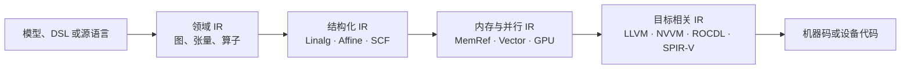
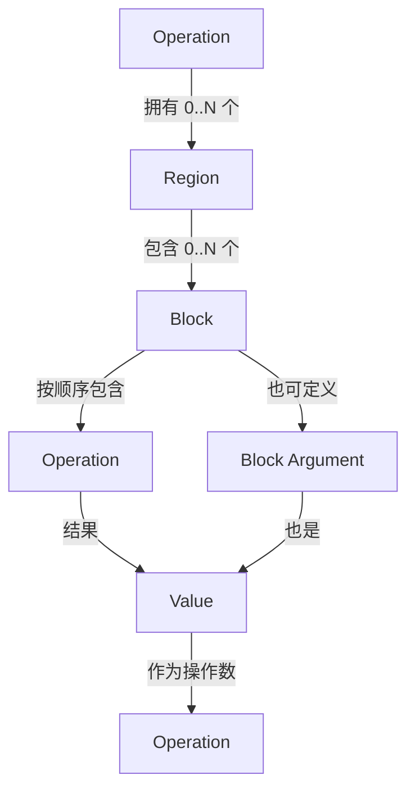
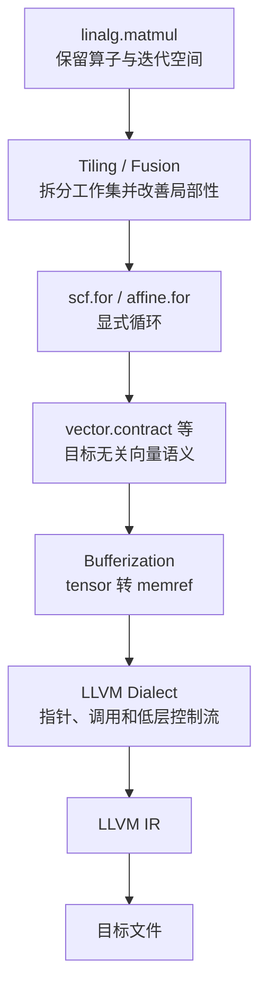
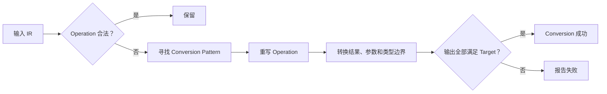
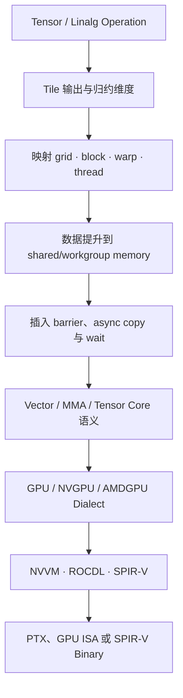
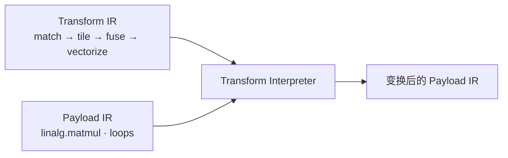

# MLIR：多层中间表示与渐进式 Lowering

# 1. 为什么需要 MLIR

LLVM IR 适合表达接近机器的控制流、标量运算和显式内存访问，却不会原生保留
“这是一次矩阵乘法”“这个张量采用什么布局”“这些循环可以映射到 GPU
workgroup”等高层语义。如果编译器过早把这些信息展开成低层循环和指针运算，后续
Pass 就必须从低层代码中重新猜测原来的结构，而且通常无法完整恢复。

MLIR（Multi-Level Intermediate Representation）不是另一套固定指令集，而是一套
**构造、验证和转换多层 IR 的编译器基础设施**。同一个程序可以在一个 Module 中
同时包含领域算子、结构化循环、向量操作、GPU 映射和接近 LLVM IR 的操作，然后用
一系列转换逐步降低抽象层级。



这里的箭头表示语义逐渐具体化，不代表所有编译器都必须使用相同的 Dialect 或 Pass
顺序。CPU、GPU、NPU 和专用加速器可以共享一部分中层表示，再在目标相关阶段分流。

## 1.1 MLIR 与 LLVM IR 的关系

| 维度 | MLIR | LLVM IR |
|---|---|---|
| 抽象层级 | 可同时表达多个层级 | 主要面向低层、目标无关代码生成 |
| 指令集合 | Dialect 可扩展 | 核心指令和类型相对固定 |
| IR 结构 | Operation 可递归包含 Region 和 Block | Function、BasicBlock、Instruction 层次较固定 |
| 类型系统 | Dialect 可定义类型和属性 | 面向整数、浮点、向量、指针、结构体等低层类型 |
| 常见用途 | DSL、张量编译、循环变换、异构硬件映射 | 通用优化、指令选择和机器码生成 |
| 衔接方式 | 可降低到 MLIR 的 LLVM Dialect | LLVM Dialect 可再翻译成 LLVM IR |

MLIR 属于 `llvm-project`，但 **LLVM Dialect 不等于 LLVM IR**：前者仍是 MLIR
Operation、Type 和 Attribute 的集合，只是语义尽量映射 LLVM IR；完成相关合法化后，
`mlir-translate` 才能把它翻译为真正的 LLVM IR。

LLVM IR、Pass Manager 和 CodeGen 的低层细节见
[LLVM 编译器基础设施](post.html?slug=llvm_review)。

# 2. MLIR 的统一 IR 结构

MLIR 用一个核心结构承载不同抽象层级：Operation 产生和使用 Value，Operation 位于
Block 中，Block 位于 Region 中，而 Operation 自己又可以拥有 Region。这种递归结构
既能表示普通 CFG，也能表示循环体、条件分支、函数、模块和计算图。



## 2.1 Operation 是唯一的基本实体

下面是一条整数加法：

```mlir
%sum = arith.addi %lhs, %rhs : i32
```

`arith.addi` 是 Operation 名称，其中 `arith` 是 Dialect 命名空间，`addi` 是
mnemonic。它使用两个 `i32` Value，并产生一个新的 `i32` Value `%sum`。

一条 Operation 最多可以包含以下部分：

| 部分 | 作用 |
|---|---|
| Name | 唯一标识操作，例如 `arith.addi` |
| Operands | 该操作使用的 SSA Value |
| Results | 该操作新产生的 SSA Value |
| Attributes / Properties | 编译期已知的配置和元数据 |
| Regions | 嵌套的控制流或图结构 |
| Successors | CFG Region 中可能跳转到的 Block |
| Location | 源位置或转换过程中保留的来源信息 |

Operation 可以没有结果，也可以产生多个结果；可以只有普通操作数，也可以同时嵌套
Region。函数、循环和模块不是核心 IR 的特殊语法树节点，它们同样由具体 Dialect 的
Operation 表示。

## 2.2 Value、SSA 与类型

MLIR 中的 Value 只有两种来源：

1. Operation Result；
2. Block Argument。

每个 Value 都有确定的 Type，并遵守 SSA 的单定义规则。Value 名称只用于文本显示，
真正的 C++ IR 使用对象关系维护 def-use chain。

```mlir
func.func @compute(%arg0: i32, %arg1: i32) -> i32 {
  %c2 = arith.constant 2 : i32
  %sum = arith.addi %arg0, %arg1 : i32
  %result = arith.muli %sum, %c2 : i32
  func.return %result : i32
}
```

这里 `%arg0` 和 `%arg1` 是入口 Block Argument，其他 Value 都是 Operation Result。
`%sum` 的所有使用者可以通过 use-list 找到，因此替换一个定义时不需要扫描整份文本。

MLIR 还定义跨嵌套 Region 的层次化支配关系。一个 Value 能否在某处使用，不只取决于
文本顺序，还取决于 Region 的语义、Block 支配关系以及父 Operation 的隔离约束。

## 2.3 Region 和 Block

`scf.if` 用嵌套 Region 表示两个分支，并通过 `scf.yield` 把 Region 的结果交给外层
Operation：

```mlir
%max = scf.if %cond -> (i32) {
  scf.yield %lhs : i32
} else {
  scf.yield %rhs : i32
}
```

这段 IR 中：

- `scf.if` 是外层 Operation；
- then 和 else 各是一个 Region；
- 每个 Region 包含一个 Block；
- `scf.yield` 是 Region 的 terminator；
- 两条分支分别交出一个 `i32`，汇合为 `%max`。

Region 的控制流含义由父 Operation 决定。常见的 SSACFG Region 允许 Block 之间显式
跳转；Graph Region 则不要求 Block 具有 CFG 语义。因此不能把所有 Region 都理解成
“函数中的基本块集合”。

## 2.4 Block Argument 相当于什么

MLIR 通常用 Block Argument 表达控制流汇合处传入的值，而不是在文本中放置 LLVM
IR 风格的 `phi`：

```mlir
func.func @choose(%cond: i1, %lhs: i32, %rhs: i32) -> i32 {
  cf.cond_br %cond, ^left, ^right

^left:
  cf.br ^merge(%lhs : i32)

^right:
  cf.br ^merge(%rhs : i32)

^merge(%selected: i32):
  func.return %selected : i32
}
```

`^merge` 的参数 `%selected` 由每条前驱边提供，语义上对应“根据实际前驱选择输入值”。
结构化控制流继续 Lowering 到 LLVM Dialect 时，这类 Block Argument 可以转换为 LLVM
IR 的 PHI 节点。

## 2.5 递归结构为什么重要

传统扁平 CFG 很适合低层控制流，却不方便保留“这是一个循环”“这是一个原子执行的
图节点”“这是一个带隔离作用域的模块”等结构。MLIR Operation 可包含 Region，使
这些语义在需要时保持显式：

```text
builtin.module
└── func.func
    └── scf.for
        └── scf.if
            └── arith.addf
```

Lowering 可以逐层展开其中一部分，而不用一次把整个程序压平。例如先把张量算子转成
`scf.for`，仍保留函数和模块；之后再把 `scf` 转成 `cf`，最后才进入 LLVM Dialect。

# 3. Type、Attribute 与 Location

## 3.1 常见 Type

```mlir
i32
f16
index
vector<8xf32>
tensor<4x?xf32>
memref<4x?xf32>
!gpu.async.token
```

- `i32`、`f16` 是标量类型；
- `index` 表示适合索引、维度和循环边界的整数，其目标位宽由后续 Lowering 决定；
- `vector<8xf32>` 表示固定形状的向量值；
- `tensor<4x?xf32>` 是秩为 2 的张量，第二维动态；
- `memref<4x?xf32>` 表示带形状和布局信息的内存引用；
- `!gpu.async.token` 是 GPU Dialect 定义的自定义类型。

`index` 不是指针，也不保证永远等于 `i64`。把它降低到某个目标时，编译器会依据目标
数据布局选择合适表示；需要和固定宽度整数交互时应使用显式转换。

## 3.2 Attribute、Property 与 SSA Value

Attribute 是 IR 中不可变的编译期数据，例如整数、字符串、数组、类型、仿射映射和
符号引用：

```mlir
%c4 = arith.constant 4 : index
%zero = arith.constant 0.0 : f32
```

这里 `4` 和 `0.0` 是 Attribute，`%c4` 和 `%zero` 是由 Operation 产生、可以沿
def-use chain 流动的 SSA Value。二者不能因为都写着“常量”就混为一谈：Attribute
配置 Operation，Value 则参与程序的数据依赖。

Property 也是 Operation 的固有配置，但它按照该 Operation 预先定义的 C++ 结构直接
存储，可以按需序列化成 Attribute；Attribute 则是由 `MLIRContext` uniquing 的不可变
值。通用打印形式通常用 `<{...}>` 表示 Properties，用 `{...}` 表示其余 Attribute。
两者都不同于运行期流动的 SSA Value，ODS 可以分别约束并生成访问接口。

静态 tile size 可以直接存为 Attribute；运行期才知道的 tile size 必须由 SSA Value
表达。这个边界会直接影响 Pass 能做多少静态推理。

## 3.3 Location

Location 记录 Operation 来自哪里。它可以指向源文件行列，也可以组合多个来源或表示
一次调用展开关系：

```mlir
%sum = arith.addi %lhs, %rhs : i32 loc("kernel.cpp":12:7)
```

诊断、调试信息和转换后问题定位依赖 Location。创建替代 Operation 时应尽量继承或
合理合并原 Location，而不是全部使用未知位置。

## 3.4 自定义语法与通用语法

Dialect 可以为 Operation 定义易读的 custom assembly format；MLIR 同时保留统一的
generic form。两种文本形式对应同一份内存 IR，custom form 不是另一种语义。

通用形式的核心轮廓是：

```text
%result = "dialect.operation"(%operand) <{properties}> {attributes}
    : (operand-types) -> result-types
```

在调试 parser/printer、自定义 Dialect 尚未提供打印格式或需要观察完整字段时，generic
form 很有用。`mlir-opt --mlir-print-op-generic` 可以要求打印通用形式。

# 4. Dialect：让多种抽象共存

Dialect 为 Operation、Type 和 Attribute 提供命名空间与语义边界。同一个 Module 可以
同时注册并使用多个 Dialect；转换 Pass 可以消费一种 Dialect，再产生另一种 Dialect。

## 4.1 常见 Dialect 的职责

| Dialect | 主要表达内容 |
|---|---|
| `builtin` | `module`、基础 Type 和通用容器 |
| `func` | 函数、调用与返回 |
| `arith`、`math` | 整数、浮点和数学运算 |
| `tensor` | 值语义张量的构造、切片和形状操作 |
| `linalg` | 结构化线性代数与通用张量计算 |
| `affine` | 仿射循环、条件和内存访问 |
| `scf` | `for`、`while`、`if` 等结构化控制流 |
| `cf` | 显式基本块跳转 |
| `memref` | 带 shape、stride、layout 的内存引用 |
| `vector` | 目标无关的多维向量操作 |
| `gpu` | grid、block、thread、barrier 和设备模块 |
| `nvgpu`、`amdgpu` | NVIDIA/AMD GPU 的 MMA、异步拷贝等目标相关中层能力 |
| `nvvm`、`rocdl` | 接近 NVIDIA/AMD LLVM intrinsic 的目标操作 |
| `spirv` | SPIR-V 模块、类型和指令 |
| `llvm` | 可映射到 LLVM IR 的低层操作和类型 |
| `transform` | 用 IR 描述如何匹配和调度其他 IR 的变换 |

Dialect 之间不存在唯一的全局“高低顺序”。`vector` 可能 Lowering 到 `scf`，也可能
直接映射目标向量指令；`linalg` 可以在 tensor 语义下优化，也可以在 buffer 语义下
执行。真正的层级由具体编译管线、目标和 Operation 语义决定。

## 4.2 Dialect 边界如何协作

如果每个 Dialect 只认识自己的具体 Operation，通用 Pass 会迅速退化成大量类型判断。
MLIR 使用 Trait 和 Interface 暴露跨 Dialect 的共同性质：

| 机制 | 回答的问题 | 示例 |
|---|---|---|
| Trait | 一个 Operation 静态具有什么性质 | 无副作用、操作数与结果同类型 |
| OpInterface | Operation 能提供什么行为 | 类型推导、分块、内存效果查询 |
| TypeInterface | Type 能提供什么行为 | 数据布局或分片信息 |
| DialectInterface | 整个 Dialect 如何参与某种机制 | inlining、bufferization 支持 |

例如通用 DCE 可以通过 `MemoryEffectOpInterface` 判断 Operation 是否具有可观察副作用；
通用 Tiling 变换可以调用 `TilingInterface`，而不必硬编码所有可分块算子的类名。

Trait 主要声明局部且静态的性质，Interface 则带有可调用的方法。ODS 声明了某个
Operation 实现 Interface 后，仍需要提供符合契约的行为实现；写上名字并不会自动
生成完整算法。

# 5. 从一段张量 IR 看渐进式 Lowering

下面的 `linalg.matmul` 仍保留“矩阵乘法”这一结构化语义：

```mlir
module {
  func.func @matmul(
      %a: tensor<64x128xf32>,
      %b: tensor<128x32xf32>,
      %init: tensor<64x32xf32>) -> tensor<64x32xf32> {
    %result = linalg.matmul
        ins(%a, %b : tensor<64x128xf32>, tensor<128x32xf32>)
        outs(%init : tensor<64x32xf32>) -> tensor<64x32xf32>
    func.return %result : tensor<64x32xf32>
  }
}
```

`outs` 指定结果写入的逻辑目的地；因为这里仍是 tensor value semantics，`%result`
是一个新的 SSA Value，不能直接推断它一定会原地覆盖 `%init`。是否复用底层 Buffer
要由后续 Bufferization 的别名和读写分析决定。

一条可能的 CPU 路径如下：



GPU 路径则可能在 Tiling 后把并行循环映射到 grid/workgroup/subgroup/thread，将数据
提升到 workgroup memory，再降低到 `gpu`、`nvgpu`、`nvvm`、`rocdl` 或 `spirv`
等目标表示。

重要的不是记住一条固定管线，而是每一步都回答三个问题：

1. 该转换要求输入满足什么不变量；
2. 它消耗了哪些高层语义，又显式引入了哪些低层决策；
3. 输出中还有哪些 Operation、Type 或内存空间尚未被目标接受。

# 6. 用 ODS 和 TableGen 定义 Operation

直接继承 C++ 类可以定义 Operation，但大量 parser、printer、builder、accessor 和
verifier 样板代码很容易不一致。MLIR 通常使用 ODS（Operation Definition
Specification）在 TableGen 文件中声明 Operation 的结构和约束，再生成 C++ 接口与
文档。

## 6.1 一个最小的自定义 Operation

下面的 ODS 片段定义 `toy.add` 的核心结构：

```tablegen
include "mlir/IR/OpBase.td"
include "mlir/Interfaces/InferTypeOpInterface.td"
include "mlir/Interfaces/SideEffectInterfaces.td"

def Toy_Dialect : Dialect {
  let name = "toy";
  let cppNamespace = "::toy";
}

class Toy_Op<string mnemonic, list<Trait> traits = []>
    : Op<Toy_Dialect, mnemonic, traits>;

def Toy_AddOp : Toy_Op<"add", [Pure, SameOperandsAndResultType]> {
  let summary = "element-wise addition";

  let arguments = (ins AnyTensor:$lhs, AnyTensor:$rhs);
  let results = (outs AnyTensor:$result);

  let assemblyFormat =
      "$lhs `,` $rhs attr-dict `:` type($result)";
}
```

它声明了：

- 文本名称为 `toy.add`；
- 有两个命名操作数和一个结果；
- 操作数与结果类型相同；
- Operation 没有可观察副作用；
- 自定义文本格式如何解析和打印。

生成的 C++ wrapper 允许使用 `op.getLhs()`、`op.getRhs()`、`op.getResult()` 等类型化
接口，而不必按下标访问裸 `Operation`。ODS 还能生成声明、定义、验证逻辑的一部分及
Dialect 文档。

这段声明仍不足以保证两个 Tensor 的 shape 可逐元素相加。ODS 适合表达局部结构约束；
涉及多个操作数之间的动态关系时，应补充自定义 `verify()`，并给出能定位具体错误的
诊断。

## 6.2 ODS 不会替你实现什么

ODS 描述的是 Operation 契约，不会自动完成：

- 高层语义到低层 Dialect 的 Lowering；
- 成本模型和变换时机；
- 复杂 shape 推导；
- Buffer 的别名和生命周期决策；
- 目标指令选择。

这些行为通常通过 Interface、RewritePattern、Pass 和 Dialect Conversion 实现。

## 6.3 Operation、Op wrapper 和 ODS 的关系

| 名称 | 含义 |
|---|---|
| `mlir::Operation` | 运行期统一 IR 节点，保存操作数、结果、属性和 Region |
| `toy::AddOp` | 对特定 Operation 的轻量类型化 C++ wrapper |
| ODS/TableGen 定义 | 用声明式方式生成 wrapper、约束和注册代码 |

`toy::AddOp` 通常像句柄一样包装 `Operation *`，并不是在 IR 里额外复制一份节点。
通用代码可以操作 `Operation *`，领域代码则使用类型化 wrapper 获得更安全的 API。

# 7. Pattern Rewriting：做局部等价变换

Pattern Rewriting 把转换拆成“匹配条件”和“如何替换”。Pattern driver 负责选择、调度
和重复应用 Pattern，`PatternRewriter` 负责通知 driver 每次 IR 变更。

下面的 Pattern 把 `%x + 0` 替换为 `%x`：

```cpp
struct FoldAddZero final : mlir::OpRewritePattern<mlir::arith::AddIOp> {
  using OpRewritePattern::OpRewritePattern;

  mlir::LogicalResult matchAndRewrite(
      mlir::arith::AddIOp op,
      mlir::PatternRewriter &rewriter) const override {
    if (!mlir::matchPattern(op.getRhs(), mlir::m_Zero()))
      return rewriter.notifyMatchFailure(op, "rhs is not zero");

    rewriter.replaceOp(op, op.getLhs());
    return mlir::success();
  }
};
```

这段代码只在整数加法右操作数能匹配零常量时成功。`replaceOp` 会把旧 Operation 所有
结果的使用改为新 Value，再删除旧 Operation。

Pattern driver 可能缓存匹配状态或维护 worklist，因此 Pattern 内的创建、替换、删除和
原地修改必须通过 `PatternRewriter` 完成，不能绕过它直接破坏 IR。

## 7.1 Pattern、Canonicalization 与 CSE

- **RewritePattern**：一条局部匹配和替换规则；
- **Canonicalization**：反复应用各 Operation 注册的规范化 Pattern 和 fold hook，趋向
  更统一、更简单的形式；
- **CSE**：根据等价性和副作用信息消除公共子表达式；
- **Pass**：在指定 Operation 层级组织完整分析或转换过程。

`canonicalize` 不是“自动运行全部优化”，也不保证得到全局最优 IR。规范化规则应该
收敛到稳定方向，避免 `A → B` 与另一条 `B → A` 反复震荡。需要成本模型、全局分析
或严格阶段边界的转换更适合放进专用 Pass。

## 7.2 原地修改与替换

当 Operation 的结果和结构保持不变，只更新 Attribute、Operand 或 Location 时，可以
使用 `modifyOpInPlace`。如果结果数量或类型变化，应创建新的 Operation 并替换旧结果。
这一区分能让 driver 正确维护 use-list、监听器和失效状态。

# 8. Pass 与 Pass Pipeline

Pass 是分析或变换的调度单元，并锚定在某种 Operation 层级。一个 `func.func` Pass
处理函数内部 IR；一个 `builtin.module` Pass 可以处理符号、跨函数关系或嵌套管线。

```cpp
struct SimplifyIntegerPass final
    : mlir::PassWrapper<SimplifyIntegerPass,
                       mlir::OperationPass<mlir::func::FuncOp>> {
  void runOnOperation() override {
    mlir::RewritePatternSet patterns(&getContext());
    patterns.add<FoldAddZero>(&getContext());

    if (mlir::failed(mlir::applyPatternsGreedily(
            getOperation(), std::move(patterns))))
      signalPassFailure();
  }
};
```

如果 Pass 可能创建其他 Dialect 的 Operation，应把对应 Dialect 声明为 dependent
dialect。Pass 发现输入不满足契约或无法保持合法 IR 时，应报告诊断并调用
`signalPassFailure()`，使后续管线停止。

## 8.1 为什么 Pipeline 具有嵌套结构

MLIR IR 本身是嵌套的，Pass Manager 也按 Operation 层级嵌套：

```bash
mlir-opt input.mlir \
  --pass-pipeline='builtin.module(func.func(canonicalize,cse))'
```

这表示先进入 `builtin.module`，再对其中可调度的 `func.func` 运行 `canonicalize` 和
`cse`。不能只根据文本先后假设任意 Pass 都能运行在任意 Operation 上；Pass 的锚点、
输入契约和并发限制都必须满足。

## 8.2 Analysis 的保存与失效

Pass 可以请求支配树、数据流结果等 Analysis。修改 IR 后，只有仍然正确的 Analysis
才能标记为 preserved；其余缓存必须失效。错误地保留过期分析会让后续 Pass 在错误
事实之上继续变换，往往比立即崩溃更难定位。

# 9. Dialect Conversion：定义阶段出口

普通 Rewrite 关心“这个局部结构能否换成另一个结构”；Dialect Conversion 进一步定义
“完成本阶段后，哪些 Operation 和 Type 被允许存在”。它由三个核心部分组成：

1. `ConversionTarget`：声明合法、动态合法和非法的 Operation/Dialect；
2. Conversion Pattern：把非法 Operation 改写为目标可接受的形式；
3. `TypeConverter`：在需要时转换 Type 和 Region/Block 签名。



## 9.1 一个转换 Pattern

下面展示 `toy.add` Lowering 到 `arith.addf` 的核心形态：

```cpp
struct LowerToyAdd final
    : mlir::OpConversionPattern<toy::AddOp> {
  using OpConversionPattern::OpConversionPattern;

  mlir::LogicalResult matchAndRewrite(
      toy::AddOp op,
      OpAdaptor adaptor,
      mlir::ConversionPatternRewriter &rewriter) const override {
    rewriter.replaceOpWithNewOp<mlir::arith::AddFOp>(
        op, adaptor.getLhs(), adaptor.getRhs());
    return mlir::success();
  }
};
```

`adaptor` 提供按 `TypeConverter` 重映射后的操作数；直接使用旧 Operation 的 Operand
可能把源类型错误地接到目标 Operation 上。实际实现还应检查 Element Type、Shape
和目标 `arith.addf` 的约束。

## 9.2 Full、Partial 与 Analysis Conversion

| 模式 | 成功条件 | 适用场景 |
|---|---|---|
| Full Conversion | 所有要求合法化的 IR 都满足 Target | 阶段边界、进入目标后端前 |
| Partial Conversion | 明确非法的内容必须消失，未声明内容可保留 | 分阶段 Lowering |
| Analysis Conversion | 只分析哪些 Operation 可被合法化，不真正改写 | 诊断和规划 |

阶段出口如果要求“不能再出现任何 `toy` Operation”，就应把 Toy Dialect 标记为非法并
执行 Full Conversion。只运行几条 Rewrite，却不检查残留非法 Operation，容易把错误
拖到更低层才暴露。

## 9.3 TypeConverter 与 Materialization

类型变换可能不是一对一。例如一个高层 Tensor Type 可以降低为 MemRef，也可能展开成
多个底层值。`TypeConverter` 描述源 Type 如何映射到目标 Type，并能更新函数签名和
Block Argument。

如果已转换 Value 仍被暂未转换的源 Operation 使用，边界上可能需要 source
materialization；反过来，未转换 Value 要传给目标 Operation 时可能需要 target
materialization。它们会显式生成桥接 IR，而不是让 Value 的 Type 在 use-list 中悄悄
改变。

`builtin.unrealized_conversion_cast` 常被用于暂时连接尚未完全协调的类型边界，但它
不是最终代码生成方案。完整管线应继续消除这些占位转换，或证明目标阶段允许保留。

## 9.4 Rewrite、Conversion 与 Lowering 的区别

| 名称 | 重点 |
|---|---|
| Rewrite | 局部结构等价替换 |
| Canonicalization | 收敛到统一、简化的表示 |
| Dialect Conversion | 依据合法性目标完成受约束的跨 Dialect/Type 转换 |
| Lowering | 更宽泛的过程：逐步把抽象语义具体化，内部可使用 Rewrite、Conversion 和 Pass |

不是每次 Lowering 都必须更接近机器。例如把一个自定义图 Dialect 降到 `linalg` 是
Lowering，把 `linalg` 分块后仍保持在同一 Dialect 也可能是 Lowering 管线的一部分。

# 10. Bufferization：从值语义到内存语义

Tensor 和 MemRef 都带 Shape，但表达的所有权与可变性不同：

| `tensor` | `memref` |
|---|---|
| 数学值语义 | 对物理 Buffer 的引用语义 |
| SSA 结果表示新的逻辑值 | 写操作可以改变所引用内存 |
| 便于做融合、重排和代数变换 | 需要处理别名、分配、释放和布局 |
| 不直接承诺存储位置 | 显式表达 address space、offset、size、stride |

Bufferization 不是把文本中的 `tensor` 替换成 `memref`。它必须决定每个 Tensor Result
落在哪个 Buffer、是否能复用已有 Buffer、何时需要复制，以及跨函数边界如何传递。

## 10.1 为什么尽量晚做 Bufferization

在 Tensor 层，两个 SSA Value 的逻辑内容关系清晰，许多 Tiling、Fusion 和 Shape
变换不必同时处理别名。过早进入 MemRef 层会引入读写顺序和别名约束，使原本合法的
算子重排需要更复杂证明。因此常见策略是先在 Tensor 层完成主要结构变换，再在进入
低层内存和代码生成前 Bufferize。

## 10.2 Destination-Passing Style

Destination-Passing Style（DPS）让 Operation 显式接收结果目的地，例如
`linalg.matmul` 的 `outs`。这给 Bufferization 提供潜在复用对象：如果分析证明目的
Buffer 与其他活跃 Value 不冲突，就可以原地写入；否则必须分配或复制。

判断能否原地复用通常依赖：

- Tensor SSA 的读写关系；
- Extract/Insert Slice 形成的别名；
- Value 是否在写入后仍需保留旧内容；
- Operation 是否实现 `BufferizableOpInterface`；
- 函数边界和递归调用限制。

One-Shot Bufferize 会在较大范围内分析这些 use-def 关系，目标是在保持语义的前提下
减少分配和复制。随后还需要处理 Buffer deallocation，避免泄漏、提前释放和重复释放。

## 10.3 MemRef 最终怎样变低

动态 MemRef 降低到 LLVM Dialect 时通常需要一个 descriptor 来携带：

```text
allocated pointer
aligned pointer
offset
sizes[rank]
strides[rank]
```

所以 `memref<?x128xf32>` 不能简单当作一个 `float *`。同一个底层 Allocation 可以通过
Subview 形成具有不同 offset、size 和 stride 的 MemRef；地址计算必须使用这些布局
元数据。

# 11. CPU 与 GPU 的典型 Lowering 路径

## 11.1 CPU 路径

CPU 管线通常围绕 Cache、SIMD 和调用约定逐步具体化：

```text
领域 / Tensor Operation
→ Linalg 的迭代空间和 indexing map
→ Tiling、Fusion、Loop Interchange
→ SCF / Affine Loop
→ Vector Operation
→ Bufferization 与 MemRef
→ LLVM Dialect
→ LLVM IR
→ LLVM CPU Backend
```

实际顺序会交错。例如 Vectorization 既可以发生在 Bufferization 前，也可能操作 MemRef；
不同目标会选择不同 Vector lowering 策略。合法性负责回答“能否这样变”，成本模型负责
回答“是否值得这样变”。

## 11.2 GPU 路径

GPU 编译还必须固定并行层级、地址空间和同步：



线程映射会改变哪些迭代并发执行；Memory Promotion 会改变数据位于 global、shared 还是
private memory；Barrier 必须覆盖所有存在跨线程依赖的路径。任何一步只考虑性能而遗漏
同步、边界 Predicate 或 address space，都可能生成快速但错误的 Kernel。

MLIR GPU Dialect 提供 `gpu.module`、`gpu.func`、线程/Block ID、launch、barrier 和
GPU address space 等抽象。NVGPU 可继续表达 NVIDIA 特定的 MMA 和异步拷贝能力；
NVVM、ROCDL 更接近相应 LLVM intrinsic；SPIR-V Dialect 则面向 SPIR-V 生态。

## 11.3 为什么不存在万能 Lowering Pipeline

同一 `matmul` 在不同 Shape、dtype 和硬件上可能选择：

- 小矩阵直接生成普通循环；
- CPU 上分块并向量化；
- GPU 上使用 shared memory 与 SIMT；
- 映射到 MMA/Tensor Core；
- 调用经过调优的外部库；
- 保留动态 Shape 的通用 Kernel，或生成多个受 Guard 保护的版本。

MLIR 提供表达与变换基础设施，但不会自动替每个项目选择最佳策略。Schedule、成本模型、
运行时信息和目标能力仍由具体编译器定义。

CFG、数据流、Tiling、GPU 映射和性能归因背后的算法见
[编译器与高性能系统算法](post.html?slug=compiler_algorithms)。

# 12. Transform Dialect：把变换顺序也表示成 IR

普通 Pass Pipeline 通常在 C++ 或命令行中固定变换顺序。高性能算子往往需要更细粒度
控制：只匹配某几个 `linalg.matmul`，先按指定尺寸 Tiling，再对产生的内层循环做
Unroll，并把某些数据提升到快速内存。

Transform Dialect 把这种调度写成另一份 IR：

- **Payload IR**：真正要被优化的程序；
- **Transform IR**：匹配 Payload 中的 Operation/Value，并描述要执行的变换；
- **Handle**：Transform IR 中指向一组 Payload Operation 或 Value 的 SSA Value；
- **Parameter**：变换执行时使用的整数、属性等配置。



Transform Dialect 不取代 Pass 和 Pattern 基础设施。它负责精确选择对象并编排顺序，
底层动作仍可以由现有 C++ Pass、RewritePattern 或 Interface 实现。

Handle 不拥有 Payload Operation。某次变换删除或替换了 Operation 后，旧 Handle 可能
失效；继续使用无效 Handle 会被 Transform Dialect 的副作用与验证机制拒绝。理解这一
点可以避免把 Handle 错当成长期稳定的裸指针。

# 13. Symbol、隔离与并行 Pass

`builtin.module` 和 `func.func` 等 Operation 可以定义符号或符号表。调用通常使用
`SymbolRefAttr` 引用函数名，而不是普通 SSA Value；符号解析沿嵌套 SymbolTable 进行。
重命名或删除符号时应使用符号表工具同步更新引用。

许多顶层容器具有 `IsolatedFromAbove` Trait，表示其内部不能隐式捕获外部 SSA Value。
这种边界让 Pass Manager 可以更安全地缓存 Analysis，并在不同函数或模块片段间并行
执行 Pass。它不是 C++ 访问控制，而是 IR 可见性和变换隔离契约。

# 14. 构建与使用 MLIR 工具

MLIR 位于 `llvm-project/mlir`。下面构建常用工具和示例：

```bash
git clone https://github.com/llvm/llvm-project.git
cd llvm-project

cmake -G Ninja -S llvm -B build \
  -DLLVM_ENABLE_PROJECTS=mlir \
  -DLLVM_BUILD_EXAMPLES=ON \
  -DLLVM_TARGETS_TO_BUILD='Native;NVPTX;AMDGPU' \
  -DCMAKE_BUILD_TYPE=Release

cmake --build build --target mlir-opt mlir-translate llc
```

只研究 CPU 路径时可以缩减 `LLVM_TARGETS_TO_BUILD`。开发上游 MLIR 时通常使用带
Assertions 的构建，以便更早暴露 IR 不变量和 API 使用错误。

## 14.1 `mlir-opt`

`mlir-opt` 负责解析 MLIR、运行 Pass Pipeline 并打印结果：

```bash
# 解析、验证并重新打印
build/bin/mlir-opt input.mlir

# 在函数层运行规范化和 CSE
build/bin/mlir-opt input.mlir \
  --pass-pipeline='builtin.module(func.func(canonicalize,cse))'

# 强制使用通用 Operation 语法打印
build/bin/mlir-opt input.mlir --mlir-print-op-generic
```

如果输入包含未注册的自定义 Dialect，`--allow-unregistered-dialect` 只能让 parser 把
未知 Operation 当作通用 Operation 接收；它不会提供 verifier、Interface、Pattern 或
Lowering 语义。真正运行项目 Pass 时仍应注册 Dialect。

## 14.2 观察每个 Pass 的 IR

```bash
build/bin/mlir-opt input.mlir \
  --pass-pipeline='builtin.module(func.func(canonicalize,cse))' \
  --mlir-disable-threading \
  --mlir-print-ir-before-all \
  --mlir-print-ir-after-all
```

关闭多线程能让嵌套 Pass 的调试输出更容易按顺序阅读。输出太大时，可只打印指定 Pass
前后，或使用 IR printing 的过滤选项。定位问题时应找到“最后一个正确 IR”和“第一个
错误 IR”，再检查该 Pass 的输入契约和新建 Operation。

## 14.3 从 LLVM Dialect 到 LLVM IR

只有当 Module 已满足 LLVM translation 的要求时，才能执行：

```bash
build/bin/mlir-translate lowered.mlir --mlir-to-llvmir > output.ll
build/bin/llc output.ll -filetype=obj -o output.o
```

如果还残留 `linalg`、`scf`、`memref` 或未处理的转换桥接 Operation，问题通常不在
`mlir-translate`，而在前面的 Conversion Target 或 Pipeline 缺少必要 Lowering。

# 15. 测试与调试

## 15.1 Verifier 放在每个阶段边界

Verifier 能检查 Operand/Result Type、Region 数量、terminator、Trait 和自定义约束。
开发转换时应在关键 Pass 后验证 IR，而不是等最终 CodeGen 才发现结构损坏。

常见错误包括：

- 替换 Operation 后留下悬空使用；
- 新 Result Type 与使用者期望不一致；
- Region 缺少 terminator；
- Block Argument 与前驱传参不匹配；
- Conversion 结束后仍残留非法 Dialect；
- 修改了 IR 却错误保留旧 Analysis；
- 创建 Operation 时丢失 Location。

## 15.2 `lit` 与 `FileCheck`

MLIR 回归测试通常把运行命令和检查模式放在 `.mlir` 文件中：

```mlir
// RUN: mlir-opt %s --canonicalize | FileCheck %s

func.func @add_zero(%arg0: i32) -> i32 {
  %c0 = arith.constant 0 : i32
  %sum = arith.addi %arg0, %c0 : i32
  func.return %sum : i32
}

// CHECK-LABEL: func.func @add_zero
// CHECK-NOT: arith.addi
// CHECK: func.return %arg0
```

检查重点应是转换契约，而不是复制整个打印结果。过度依赖临时 SSA 名称、无关
Attribute 顺序或完整 Module 文本，会让等价的 printer 变化造成大量脆弱测试。

## 15.3 分层判断错误来源

```text
Parser 失败
→ 检查 Dialect 注册、语法和 Type/Attribute 拼写

Verifier 失败
→ 检查 Operation/Region 契约和类型关系

Pattern 不匹配
→ 打开 Pattern debug，检查 root、动态条件和 benefit

Conversion 失败
→ 查找残留非法 Operation、Type 与 materialization

翻译 LLVM IR 失败
→ 检查是否完整 Lowering 到 LLVM Dialect 可翻译子集

运行结果错误
→ 比较每个阶段语义，重点检查别名、边界、同步和未定义行为

性能退化
→ 检查 tile、layout、复制、寄存器、缓存、occupancy 与 launch 数量
```

语法合法不等于语义正确，语义正确也不等于性能合理。Verifier、差分执行和性能计数器
分别覆盖不同层次，不能互相替代。

# 16. 设计自定义 Dialect 的顺序

## 16.1 先确定要保留的语义

如果一个 Operation 只把现有低层指令换了名字，却没有保存额外结构，它只会增加
Lowering 维护成本。自定义 Dialect 更适合承载标准 Dialect 暂时不能准确表达的信息，
例如领域算子约束、特殊布局、设备资源或运行时协议。

定义每个 Operation 前先写清：

- Operand、Result、Attribute 和 Region 分别是什么；
- 动态 Shape 如何表达；
- 是否有副作用、别名或资源读写；
- 哪些关系能静态验证；
- 哪些 Interface 可供通用变换使用；
- Canonical form 是什么；
- 最终降低到哪些 Dialect；
- 失败时怎样给出可定位诊断。

## 16.2 再确定 Lowering 边界

一个清晰的阶段边界应能用 Conversion Target 描述。例如：

```text
输入：允许 toy + tensor + linalg + arith + func
输出：禁止 toy，允许 linalg + tensor + arith + func
```

这样测试可以直接断言 Toy Dialect 已全部消失。若边界只写成“运行 LowerToyPass”，却
没有描述输出合法集合，后续 Pass 会逐渐依赖偶然残留的混合 IR。

## 16.3 最后补齐可组合能力

按实际需要实现：

- parser/printer 和 bytecode 支持；
- verifier、fold 和 canonicalization；
- shape/type inference；
- side-effect、tiling、bufferization 等 Interface；
- Dialect Conversion 和 TypeConverter；
- Pass Pipeline 及命令行注册；
- 单元测试、IR 回归测试和端到端执行测试。

“能打印一个自定义 Operation”只是起点。能被分析、重写、Bufferize、Lowering 和诊断，
才说明它真正接入了编译器生态。

# 17. 容易混淆的概念

## 17.1 MLIR 是不是 LLVM IR 的新版语法

不是。MLIR 是可扩展的多层 IR 框架；LLVM IR 是相对固定的低层 IR。MLIR 的 LLVM
Dialect 只是二者之间的衔接层之一。

## 17.2 Dialect 是不是彼此隔离的文件格式

不是。多个 Dialect 可以共存于同一个 Module，Value 也可以跨 Dialect Operation
连接，只要类型和语义契约允许。Dialect 提供命名空间与扩展边界，不代表每种 Dialect
必须单独存储。

## 17.3 Region 是不是 BasicBlock

不是。Region 容纳 Block，并由父 Operation 定义语义；Block 才是 Operation 的线性
序列。某些 Region 是 CFG，某些 Region 是图或其他结构。

## 17.4 `tensor` 和 `memref` 是否只差一个名字

不是。Tensor 是值语义，MemRef 是可别名的 Buffer 引用语义。二者转换需要处理原地
复用、复制、布局、分配和释放。

## 17.5 Pattern 是否等于 Pass

不是。Pattern 描述局部匹配和改写；Pass 决定在哪个 IR 层级、以什么顺序和配置运行
Pattern 或其他算法。一个 Pass 可以运行很多 Pattern，一个 Pattern 也可被不同 driver
复用。

## 17.6 Conversion 成功是否代表已经生成机器码

不是。Conversion 只保证当前 `ConversionTarget` 的合法性。高层 Dialect 到 Linalg、
Linalg 到循环、循环到 LLVM Dialect 都可以分别完成一次成功 Conversion，但离目标代码
仍有不同距离。

## 17.7 Generic form 是否比 custom form 更低层

不是。它们只是同一 Operation 的两种文本表示。Generic form 暴露统一字段，custom
form 更易读；抽象层级由 Operation 语义决定。

## 17.8 Canonicalization 是否一定提升性能

不一定。Canonicalization 主要把 IR 变得统一、消除显然冗余并为后续 Pass 创造稳定
输入。最终性能取决于后续 Tiling、Vectorization、Memory Planning、CodeGen 和硬件。

# 18. 一条可执行的学习路径

1. 用 `mlir-opt` 解析并打印 `func`、`arith`、`scf` 示例；
2. 手工阅读 Operation、Region、Block、Value 和 Block Argument；
3. 运行 `canonicalize`、`cse`，比较每个 Pass 前后 IR；
4. 用 ODS 定义一个带 verifier 的自定义 Operation；
5. 写一个 RewritePattern 和一个 `func.func` Pass；
6. 用 Conversion Target 把自定义 Dialect 完整降低到标准 Dialect；
7. 对 Tensor/Linalg IR 做 Tiling，再观察 Bufferization 后的 MemRef；
8. 分别追踪 CPU 的 LLVM Dialect 路径和 GPU 的线程/地址空间路径；
9. 用 `lit`、`FileCheck`、Verifier 和端到端执行固定每个阶段契约。

掌握 MLIR 的关键不是记住所有 Dialect 名称，而是能沿任意 Pipeline 回答：当前 IR
保留了什么语义、下一步依赖什么条件、转换后允许剩下什么，以及最终怎样验证正确性。

# 19. 参考资料

1. [MLIR Language Reference](https://mlir.llvm.org/docs/LangRef/)
2. [MLIR Dialects](https://mlir.llvm.org/docs/Dialects/)
3. [Toy Tutorial](https://mlir.llvm.org/docs/Tutorials/Toy/)
4. [Operation Definition Specification](https://mlir.llvm.org/docs/DefiningDialects/Operations/)
5. [Pattern Rewriting](https://mlir.llvm.org/docs/PatternRewriter/)
6. [Pass Infrastructure](https://mlir.llvm.org/docs/PassManagement/)
7. [Dialect Conversion](https://mlir.llvm.org/docs/DialectConversion/)
8. [Bufferization](https://mlir.llvm.org/docs/Bufferization/)
9. [Transform Dialect Tutorial](https://mlir.llvm.org/docs/Tutorials/transform/)
10. [LLVM Dialect](https://mlir.llvm.org/docs/Dialects/LLVM/)
11. [GPU Dialect](https://mlir.llvm.org/docs/Dialects/GPU/)
12. [Getting Started with MLIR](https://mlir.llvm.org/getting_started/)
