# NebulaIM 后端：从 C++ 网络编程到可靠消息系统

## 1. Overview

### 1.1 项目解决什么问题

NebulaIM 是一个 C++17 即时通信后端。它不只是实现“把字符串从 A 发给 B”，而是同时处理以下问题：

- 浏览器和原生客户端如何建立长连接；
- 一个进程如何管理大量 mostly-idle 连接；
- TCP 字节流如何恢复成完整业务消息；
- 密码、Token、设备和在线状态如何管理；
- 消息如何持久化、异步推送、重试和离线保存；
- 重复请求、重复投递和重复 ACK 如何保持幂等；
- 单聊、群聊、会话、未读数、已读和撤回如何保持一致；
- 服务故障时怎样快速失败、恢复和定位问题；
- 如何通过脚本、systemd、Nginx 和中间件完成部署。

### 1.2 当前系统全景

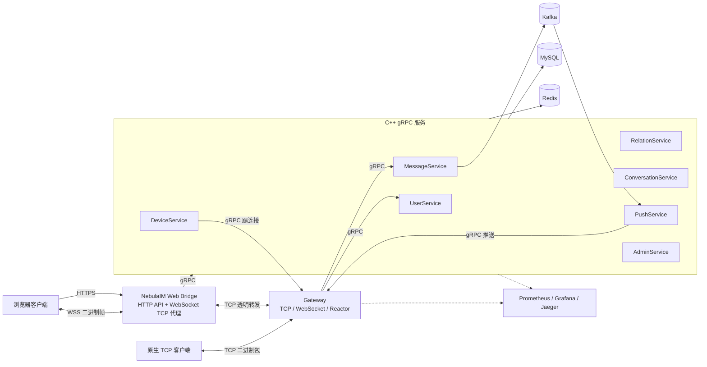

### 1.3 同步链路与异步链路

理解系统时，应把两类链路分开：

**同步请求链路**

```text
客户端 -> Gateway/Bridge -> gRPC 服务 -> MySQL/Redis -> 响应客户端
```

它适合登录、查询好友、读取历史、发送消息确认等需要立即给出结果的操作。

**异步消息投递链路**

```text
MessageService -> MySQL messages + outbox_events
               -> OutboxWorker -> Kafka
               -> PushService -> Redis 在线状态
               -> Gateway -> 接收方客户端
```

它把“消息已成功保存”和“消息已实时送达”拆开。发送方只要收到消息持久化成功的响应，就不必同步等待接收方网络。

### 1.4 系统实际保证的语义

当前实现应准确描述为：

- 消息和 Outbox 事件在同一个 MySQL 事务中原子提交；
- Kafka 和 Push 链路提供 **at-least-once** 语义；
- 依靠稳定 `message_id`、数据库唯一键和幂等更新吸收重复；
- Kafka 以 `conversation_id` 为 key，保证同一分区内有序；
- 在线推送失败会重试，最终进入 DLQ 或离线存储；
- “已发出”“已送达”“已读”是不同状态，不能混为一谈；
- 系统没有宣称端到端 exactly-once，也没有端到端加密。

---

## 2. 进程与服务边界

### 2.1 八个服务进程

| 服务 | 默认端口 | 主要职责 |
|---|---:|---|
| Gateway 客户端监听 | `9000` | TCP/WebSocket 长连接、协议解析、认证、路由 |
| UserService | `50051` | 注册、登录、Token 验证、用户查询、Token 刷新 |
| MessageService | `50052` | 单聊、群聊、历史、ACK、离线、已读、撤回 |
| RelationService | `50053` | 好友申请、好友关系、群组及成员关系 |
| PushService | `50054` | 消费 Kafka，在线投递、重试、DLQ、离线兜底 |
| GatewayService | `50055` | 向内部服务提供推送、踢连接和在线查询 |
| ConversationService | `50056` | 会话列表、删除、置顶、免打扰 |
| AdminService | `50057` | 健康、统计、清理、配置检查、审计 |
| DeviceService | `50058` | 设备列表、踢单设备、踢全部设备 |

Gateway 的 `9000` 和 `50055` 属于同一个进程，但职责不同：

- `9000` 面向客户端，是自定义长连接协议；
- `50055` 面向内部服务，是 gRPC 管理接口。

### 2.2 为什么不把所有逻辑放进 Gateway

Gateway 的核心资源是 I/O 线程。若它直接执行密码哈希、SQL、复杂关系查询和 Kafka 操作，一个慢查询就可能拖住许多连接。

拆分后的收益：

- 接入层和业务层可以分别扩容；
- 业务服务可以独立测试和部署；
- Gateway 只维护连接相关状态，职责更清晰；
- PushService 可以异步消费，不占用发送请求的响应时间；
- 故障影响范围更容易控制。

代价也要说明：

- 多了 RPC、配置和部署复杂度；
- 一次请求跨多个进程，排查需要 trace_id；
- 服务地址、超时、鉴权和证书都要统一管理；
- 本地开发比单体应用更重。

### 2.3 Proto 中的真实接口

不要描述代码里不存在的 RPC。当前主要接口如下：

**UserService**

- `Register`
- `Login`
- `ValidateToken`
- `GetUserInfo`
- `GetUserByUsername`
- `RefreshToken`

注销和设备撤销不属于 UserService，而是由 DeviceService 处理。

**RelationService**

- 删除和列出好友；
- 发送、接受、拒绝、列出好友申请；
- 创建、搜索、查询、加入、退出群组；
- 列出群组和群成员。

好友关系不是一个绕过申请流程的公开 `AddFriend` 操作。

**MessageService**

- 发送单聊和群聊；
- 按会话读取历史；
- ACK 和拉取离线消息；
- 标记单条消息或会话已读；
- 查询已读状态；
- 撤回消息。

---

## 3. Linux 非阻塞网络基础

### 3.1 socket 也是文件描述符

Linux 为 socket 分配一个整数文件描述符 `fd`。应用通过系统调用操作它：

```cpp
int fd = ::socket(AF_INET, SOCK_STREAM | SOCK_NONBLOCK | SOCK_CLOEXEC, 0);
::bind(fd, ...);
::listen(fd, ...);
int client_fd = ::accept4(fd, ..., SOCK_NONBLOCK | SOCK_CLOEXEC);
```

重要概念：

- `SOCK_NONBLOCK`：调用不能立即完成时返回 `EAGAIN/EWOULDBLOCK`；
- `SOCK_CLOEXEC`：执行新程序时自动关闭，避免 fd 泄漏；
- `accept` 返回的新 fd 表示一条独立连接；
- TCP 连接的读半部和写半部状态可以分别变化。

### 3.2 为什么不能一条连接一个线程

长连接多数时间没有数据。如果一条连接绑定一个线程，会产生：

- 大量线程栈地址空间；
- 线程调度和上下文切换；
- 共享状态锁竞争；
- 峰值连接数受线程资源约束。

Reactor 模型让少量 I/O 线程等待大量 fd 的就绪事件，更适合 IM 长连接。

### 3.3 epoll 的工作方式

```cpp
int epoll_fd = ::epoll_create1(EPOLL_CLOEXEC);
::epoll_ctl(epoll_fd, EPOLL_CTL_ADD, fd, &event);
int count = ::epoll_wait(epoll_fd, events, max_events, timeout_ms);
```

与“遍历所有连接问一遍有没有数据”不同，`epoll_wait` 返回已经就绪的 fd。

常见事件：

- `EPOLLIN`：可读；
- `EPOLLOUT`：可写；
- `EPOLLERR`：发生错误；
- `EPOLLHUP` / `EPOLLRDHUP`：连接关闭或半关闭。

### 3.4 LT 与 ET

当前实现采用 LT，也就是水平触发。

- LT：只要缓冲区仍可读，后续还会继续通知；
- ET：通常只在状态从不可读变为可读时通知，必须一直读到 `EAGAIN`。

ET 不等于天然更快。它减少重复通知，但提高实现要求。当前项目优先保证事件处理正确和易维护。

### 3.5 非阻塞读写的正确语义

`read` 的结果不能只分成成功和失败：

```text
n > 0       读到 n 字节
n == 0      对端完成关闭
n < 0
  EAGAIN    暂时没有更多数据，不是故障
  EINTR     被信号中断，可以重试
  其他错误  连接故障
```

非阻塞 `write` 也可能只写一部分，因此剩余数据必须放进输出 Buffer，等 `EPOLLOUT` 再继续发送。

项目在 socket 写路径使用 `MSG_NOSIGNAL`，并处理 SIGPIPE，避免向已关闭连接写数据时进程被信号终止。

---

## 4. Reactor 网络库

### 4.1 核心对象

代码位于 `common/net/`。

| 对象 | 职责 |
|---|---|
| `EventLoop` | 一个线程中的事件循环 |
| `Channel` | fd、关注事件和回调的绑定 |
| `EpollPoller` | 封装 epoll 注册与等待 |
| `Acceptor` | 接收新连接 |
| `TcpConnection` | 管理一条连接的状态、输入输出 Buffer 和回调 |
| `TcpServer` | 组合 Acceptor、连接表和线程池 |
| `EventLoopThread` | 在线程中运行一个 EventLoop |
| `EventLoopThreadPool` | 管理多个子 EventLoop |
| `Buffer` | 累积未处理输入和未发送输出 |
| `TimerQueue` | 基于 `timerfd` 管理定时任务 |
| `Socket` | fd 的 RAII 封装 |
| `InetAddress` | IP 与端口值对象 |

### 4.2 主从 Reactor

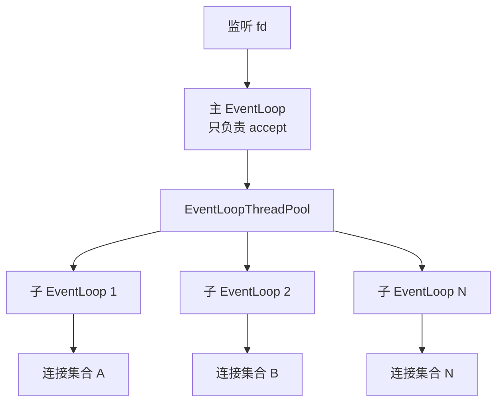

主线程负责 accept，连接按轮询策略交给子 EventLoop。连接一旦分配，就由固定 I/O 线程管理。

### 4.3 线程归属为什么重要

“一个连接固定属于一个 EventLoop”带来：

- 连接状态变化天然有序；
- 大部分连接内部状态不需要互斥锁；
- 写回操作回到所属线程，避免并发修改 Buffer；
- 更容易推理关闭、回调和析构顺序。

它不是说整个系统没有锁。跨线程任务队列仍需要互斥保护，但锁的范围更小。

### 4.4 跨线程唤醒：eventfd

业务线程完成 gRPC 请求后不能直接操作连接，而是：

```cpp
loop->queueInLoop([connection, response] {
    connection->send(response);
});
```

`queueInLoop` 将任务加入 pending functors，然后写 `eventfd`。由于 `eventfd` 也注册在 epoll 中，阻塞的 EventLoop 会立即醒来并执行任务。

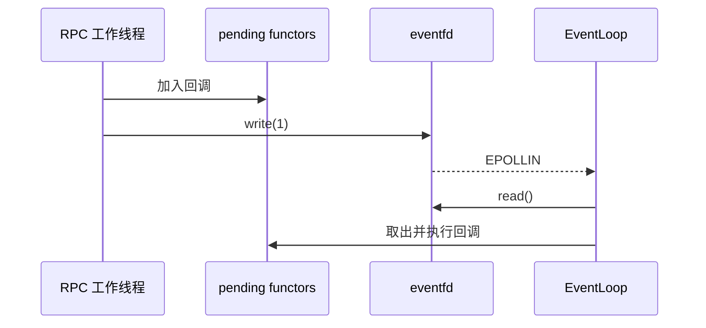

### 4.5 TcpConnection 生命周期

异步系统最危险的问题之一是悬空指针。`TcpConnection` 使用 `shared_ptr`，并通过 `enable_shared_from_this` 在回调中取得自身引用。

需要能解释：

- `unique_ptr` 表示唯一所有权；
- `shared_ptr` 用引用计数延长异步对象生命；
- `weak_ptr` 观察对象但不阻止销毁；
- `shared_from_this()` 只能在对象已由 `shared_ptr` 管理后使用；
- 连接关闭不是简单 `delete`，要先从 EventLoop 和连接表移除，再在正确线程完成销毁。

### 4.6 Buffer 为什么必不可少

Buffer 同时解决两类不完整：

1. 一次 `read` 可能只收到半个协议包；
2. 一次 `write` 可能只发送部分响应。

典型输入流程：

```text
socket -> readFd -> input Buffer -> PacketCodec::decode
                               -> 完整包：消费
                               -> 半包：保留
```

典型输出流程：

```text
send(data)
  -> 能直接写完：完成
  -> 只写一部分：剩余数据追加到 output Buffer
  -> 关注 EPOLLOUT
  -> 可写时继续 flush
```

---

## 5. 二进制协议与 TCP 消息边界

### 5.1 TCP 没有业务消息边界

发送方：

```text
send(A)
send(B)
```

接收方可能读到：

```text
[A][B]        两次完整读取
[AB]          粘包
[A前半]       半包
[A后半+B]     半包加粘包
```

这不是 TCP 错误。TCP 只承诺可靠、有序的字节流。

### 5.2 当前 16 字节协议头

```text
0               4       6       8              12             16
+---------------+-------+-------+---------------+---------------+
| magic uint32  | ver   | type  | sequence_id   | body_length   |
+---------------+-------+-------+---------------+---------------+
|                      Protobuf body ...                        |
+---------------------------------------------------------------+
```

| 字段 | 大小 | 当前语义 |
|---|---:|---|
| `magic` | 4 | `0x4E494D42`，识别 NebulaIM 包 |
| `version` | 2 | 当前版本 `1` |
| `type` | 2 | 请求、响应或推送类型 |
| `sequence_id` | 4 | 请求和响应匹配 |
| `body_length` | 4 | Protobuf Body 长度 |

最大 Body 为 `1 MiB`。长度上限既是协议约束，也是内存攻击防护。

### 5.3 为什么必须使用网络字节序

x86 通常是小端，而网络协议约定使用大端。编码时使用 `htonl/htons`，解码时使用 `ntohl/ntohs`。

不能直接发送 C++ 结构体：

- 编译器可能插入 padding；
- CPU 字节序不同；
- ABI 和对齐规则不同；
- 结构体内部可能包含指针；
- 协议演进难以控制。

### 5.4 PacketCodec 的解码算法

```text
while true:
  1. Buffer 少于 16 字节 -> INCOMPLETE，不消费
  2. 读取并校验 magic/version/type/body_length
  3. body_length 超过 1 MiB -> 协议错误
  4. Buffer 少于 16 + body_length -> INCOMPLETE，不消费
  5. 提取完整 body，消费对应字节，返回一个 Packet
  6. 外层继续循环，处理可能粘在后面的下一包
```

最关键的是：半包时不能提前移动读指针，否则下次数据到达后无法恢复原包。

### 5.5 当前消息类型

| 类型 | 数值 |
|---|---:|
| 登录请求/响应 | `1001 / 1002` |
| 注册请求/响应 | `1003 / 1004` |
| 恢复会话请求/响应 | `1005 / 1006` |
| 心跳请求/响应 | `1101 / 1102` |
| 单聊发送请求/响应 | `2001 / 2002` |
| 群聊发送请求/响应 | `2101 / 2102` |
| 服务端消息推送 | `3001` |
| ACK 请求/响应 | `4001 / 4002` |
| 拉取离线消息请求/响应 | `5001 / 5002` |
| 通用错误响应 | `9001` |

---

## 6. WebSocket 接入

### 6.1 为什么浏览器需要 WebSocket

浏览器不能直接创建任意 TCP socket。WebSocket 从 HTTP Upgrade 开始，升级后提供双向帧传输。

NebulaIM 没有为浏览器重新设计 JSON 消息协议，而是把原来的二进制 Packet 放在 WebSocket binary frame 的 payload 中：

```text
WebSocket frame
└── NebulaIM 16-byte Packet header
    └── Protobuf body
```

这样原生客户端和浏览器共享相同业务协议。

### 6.2 同端口识别

Gateway 根据连接开始部分判断：

- 以 HTTP `GET` 开始：进入 WebSocket 握手；
- 否则：按原生 TCP Packet 处理。

生产环境中浏览器通常通过：

```text
Browser WSS -> Nginx -> Web Bridge /ws -> Gateway 9000
```

Bridge 的 `/ws` 是字节级 TCP 代理，不解析业务消息。

### 6.3 WebSocket 握手

客户端发送：

```http
GET /ws HTTP/1.1
Upgrade: websocket
Connection: Upgrade
Sec-WebSocket-Key: <random-base64>
Sec-WebSocket-Version: 13
```

服务端计算：

```text
Sec-WebSocket-Accept =
Base64(SHA1(Sec-WebSocket-Key + RFC6455 GUID))
```

并返回 `101 Switching Protocols`。

### 6.4 WebSocket 帧安全检查

当前实现检查：

- 客户端帧必须 mask；
- payload 长度不能越界；
- opcode 必须受支持；
- 不接受未实现的分片组合；
- 业务数据只接受 binary frame；
- ping、pong、close 按控制帧语义处理。

WebSocket 不是“天然安全”。真正的传输加密来自 TLS，也就是 `wss://`。

---

## 7. Gateway 的请求执行模型

### 7.1 连接状态机

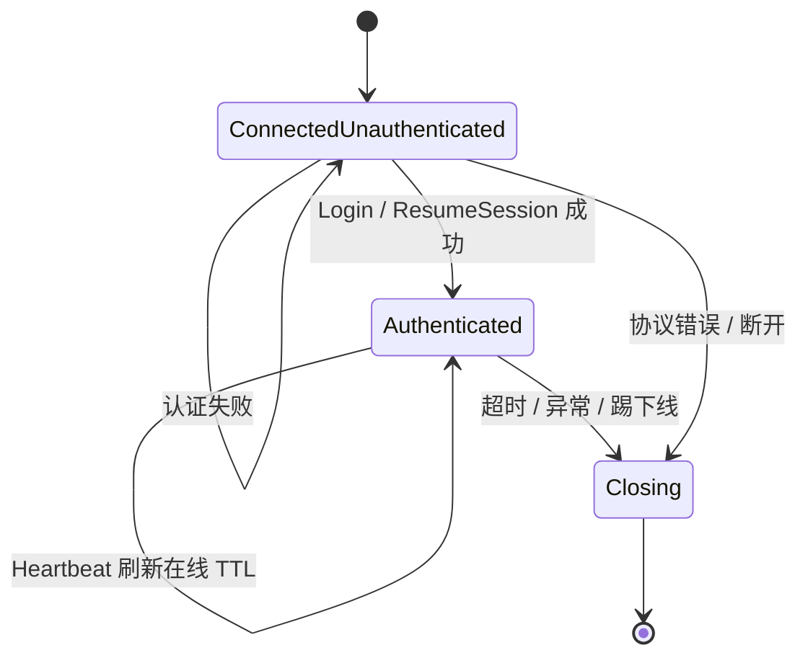

连接上下文保存：

- `connection_id`
- 是否 WebSocket
- `user_id`
- `device_id`
- 平台和设备名
- 认证状态

业务请求不能信任客户端随意填写的 `from_user_id`。Gateway 会用已认证上下文补全或校验身份。

### 7.2 为什么 gRPC 不能跑在 EventLoop 线程

当前 C++ gRPC Stub 是阻塞调用。如果直接在 EventLoop 中调用：

```text
一个 UserService 请求耗时 2 秒
-> EventLoop 2 秒不能处理该线程上的其他连接
-> 心跳、收包、发包全部被拖延
```

因此 Gateway 使用有界 `RpcExecutor`：

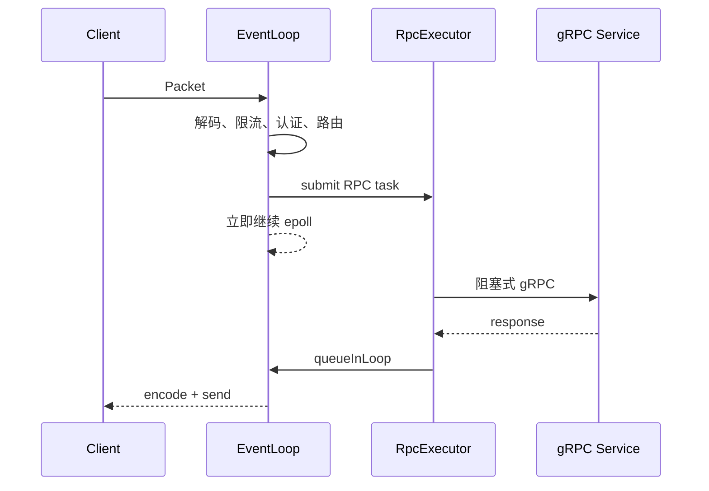

### 7.3 为什么线程池必须有界

无界队列在后端故障时会不断积压：

```text
请求进入速度 > 后端处理速度
-> 队列无限增长
-> 内存耗尽
-> 延迟越来越大
-> 最终整个 Gateway 崩溃
```

有界队列满时返回服务不可用，属于背压。快速失败比把请求无限堆在内存中更可控。

### 7.4 超时、限流和熔断

Gateway 的保护层包括：

- 每连接包速率限制；
- 每用户消息速率限制；
- 登录 IP 限制；
- gRPC deadline；
- 服务级熔断器；
- 有界 RPC 队列。

包限流发生在完整包解码后，因此一次 TCP read 中粘连的多个 Packet 会逐包计数。

熔断状态：

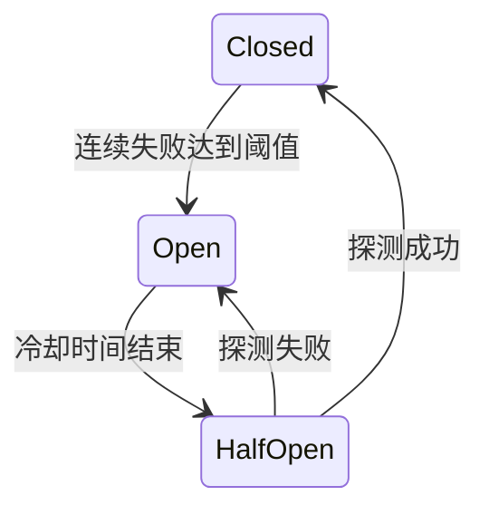

---

## 8. Protobuf 与 gRPC

### 8.1 Protobuf 解决什么问题

`.proto` 文件定义跨语言 Schema。代码生成后获得：

- 类型明确的字段；
- 二进制序列化；
- 可选字段和默认值语义；
- 向后演进所需的字段编号；
- C++、TypeScript/JavaScript 等语言之间的一致协议。

字段编号一旦发布不能随意复用。删除字段时应保留编号，避免旧数据被错误解释。

### 8.2 客户端协议与内部 RPC 的区别

| 维度 | 客户端到 Gateway | 服务之间 |
|---|---|---|
| 传输 | TCP / WebSocket | HTTP/2 |
| 外层协议 | 自定义 16 字节 Packet | gRPC |
| Body | Protobuf | Protobuf |
| 连接特点 | 长连接、推送 | 请求响应 RPC |
| 主要目标 | 低开销和自主控制 | 类型安全和服务接口治理 |

### 8.3 gRPC metadata

内部请求会带：

- `x-nebula-internal-token`
- trace_id 相关 metadata

服务端不能因为端口只绑定内网就完全取消鉴权。内网不是安全边界，尤其在容器、代理和多主机场景中。

AdminService 使用独立的：

- `x-nebula-admin-token`
- scope 权限，例如 `health`、`stats`、`outbox`、`kafka`、`cleanup`

### 8.4 deadline 和错误层次

应区分：

1. gRPC transport error：连接失败、超时、TLS 错误；
2. 业务 `CommonResponse.code`：用户不存在、权限不足、消息不存在；
3. Gateway 协议错误：非法包、未认证、限流；
4. 客户端本地错误：解码失败、请求超时。

仅检查 `grpc::Status::ok()` 不够，还要检查业务响应码。

---

## 9. ID、时间和 JavaScript 精度

### 9.1 Snowflake 风格 ID

消息 ID 是 64 位整数，布局可概括为：

```text
| timestamp | node_id | sequence |
```

收益：

- 多实例可独立生成；
- 不依赖每条消息都访问数据库自增序列；
- 大体按时间递增；
- 64 位整数便于数据库索引。

节点 ID 必须在并行实例之间唯一，否则相同毫秒、相同序列可能碰撞。

### 9.2 时钟回拨

若当前时间小于上次生成 ID 的时间，当前实现会等待时间追平。这样避免同节点生成重复 ID。

需要说明的取舍：

- 等待会短暂阻塞 ID 生成；
- 大幅回拨说明主机时间管理有问题；
- 生产环境仍需可靠 NTP 和节点 ID 管理。

### 9.3 会话 ID

单聊会话 ID 根据两个用户 ID 的稳定顺序生成，因此 A 与 B 无论谁先发消息都会得到同一个 conversation_id。

群聊使用独立命名空间，避免与单聊 ID 混淆。

### 9.4 JavaScript 为什么会丢 64 位整数

JavaScript `number` 使用 IEEE-754 双精度浮点数，精确整数范围只有：

```text
-(2^53 - 1) 到 +(2^53 - 1)
```

Snowflake ID 常常大于这个范围。若把：

```text
74052435319984128
```

转成 `number`，末位可能变为：

```text
74052435319984130
```

这会导致：

- 实时推送与历史记录 ID 不同，出现两个气泡；
- ACK 或已读请求查不到消息；
- React 列表 key 不稳定；
- URL 或 JSON 中的 ID 被悄悄改写。

当前 Web 客户端将所有 `uint64` ID 保持为字符串，并显式配置 `protobufjs + long.js`。这是跨 C++/JavaScript 协议必须掌握的边界。

---

## 10. MySQL 数据模型与事务

### 10.1 Migration 是 Schema 真相来源

当前迁移位于：

```text
deploy/mysql/migration/
  V001_init.sql
  ...
  V010_message_history_cursor.sql
```

`schema_migrations` 记录已经执行的版本。一键部署不应每次重复执行不确定的手工 SQL。

### 10.2 核心表

| 表 | 作用 |
|---|---|
| `users` | 账号、密码哈希和资料 |
| `friendships` | 双向好友关系 |
| `friend_requests` | 好友申请状态机 |
| `groups` | 群组元数据 |
| `group_members` | 群成员关系 |
| `messages` | 消息事实记录 |
| `conversations` | 每个用户自己的会话视图 |
| `outbox_events` | 待发布 Kafka 事件 |
| `offline_messages` | 离线投递状态 |
| `message_receipts` | delivered/read 时间 |
| `user_devices` | 设备、Token 哈希和撤销状态 |

### 10.3 消息表的关键约束

当前关键约束包括：

```text
UNIQUE(message_id)
UNIQUE(from_user_id, client_sequence_id)
INDEX(conversation_id, created_at, message_id)
```

用途分别是：

- 全局消息标识唯一；
- 同一发送者的客户端序列号幂等；
- 支持稳定的会话历史游标分页。

### 10.4 为什么历史索引是三列

查询模式：

```sql
WHERE conversation_id = ?
  AND (
    created_at < ?
    OR (created_at = ? AND message_id < ?)
  )
ORDER BY created_at DESC, message_id DESC
LIMIT ?
```

只用 `created_at` 作为游标不稳定，因为同一毫秒可能有多条消息。`(created_at, message_id)` 形成严格顺序。

对应索引：

```sql
INDEX idx_conversation_cursor(conversation_id, created_at, message_id)
```

这是当前 V010 的真实索引，不应继续引用旧索引名称。

### 10.5 事务和 RAII

发送消息时多个写操作必须一起成功或一起失败：

```text
BEGIN
  INSERT messages
  UPSERT sender conversation
  UPSERT receiver/member conversations
  INSERT outbox_events
COMMIT
```

`MySqlTransaction` 使用 RAII：

- 构造时开始事务；
- `commit()` 成功后结束；
- 提前 return 或异常时析构回滚。

这能减少遗漏 rollback 的路径。

### 10.6 连接池

每次请求新建数据库连接会付出 TCP、认证和初始化成本。连接池复用连接：

```text
acquire(timeout)
-> 执行 SQL
-> RAII 归还
```

连接池不是越大越好。过多连接会让数据库线程、内存和锁竞争上升，应按并发和数据库容量配置。

---

## 11. 认证、Token 与多设备在线

### 11.1 密码存储

密码不以明文保存。当前使用 PBKDF2-HMAC-SHA256：

```text
password + per-user salt + iterations -> derived key
```

知识点：

- salt 防止相同密码产生相同哈希；
- 迭代增加暴力破解成本；
- 验证使用常量时间比较，降低时间侧信道；
- 密码哈希和消息加密是两回事。

### 11.2 Token 不应原样落库

登录返回随机 Token 给客户端。服务端主要保存其哈希：

```text
raw token --SHA-256--> token_hash
```

Redis：

```text
nebula:token:{token_hash} -> user_id
```

MySQL `user_devices` 也保存 Token 哈希和设备状态，而不是把 bearer token 原样写入日志或数据库。

### 11.3 登录、恢复和刷新

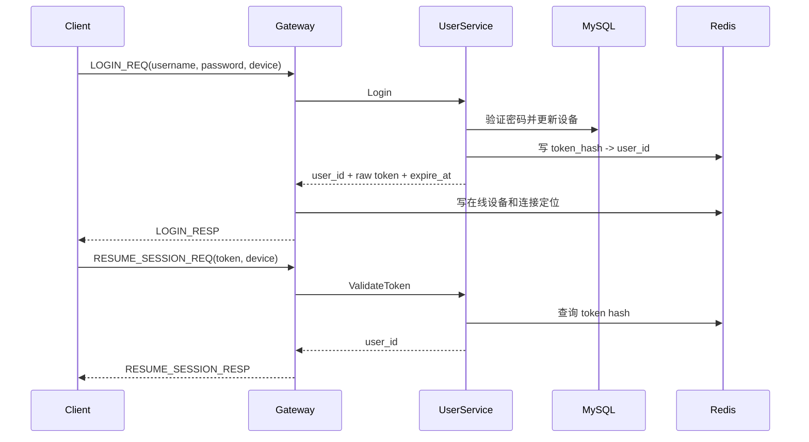

刷新 Token 时旧 Token 会失效，不能让两个长期有效 Token 都继续代表同一设备。

### 11.4 Redis 在线模型

```text
nebula:user:devices:{uid}
  SET(device_id...)

nebula:user:online:{uid}:{device_id}
  gateway_id, TTL

nebula:user:conn:{uid}:{device_id}
  connection_id, TTL
```

设备被视为在线时，online key 和 connection key 都必须存在。仅有 SET 成员不代表真实在线，陈旧成员会被清理。

### 11.5 心跳和 TTL

登录和心跳刷新 TTL；正常断开主动删除；进程崩溃时依靠 TTL 最终过期。

这是一种最终一致设计：

- Redis 短时间显示在线，但连接已断：推送 RPC 失败后重试或离线；
- 连接存在但状态临时过期：后续心跳恢复；
- 不追求跨网络故障瞬间的绝对一致在线状态。

### 11.6 DeviceService

设备接口支持：

- 列出当前账号设备；
- 撤销指定设备；
- 撤销全部设备。

撤销时不仅更新数据库和 Token，还会根据 Redis 中的 Gateway/connection_id 调用 GatewayService 踢掉活连接。

---

## 12. 单聊和群聊发送链路

### 12.1 单聊发送前的校验

MessageService 会检查：

- 发送者和接收者 ID 有效且不同；
- 用户存在；
- 两个方向的好友关系都存在；
- 内容合法；
- `client_sequence_id` 是否已经处理。

双向好友检查可以防止关系表只写入一侧时越权发送。

### 12.2 单聊事务

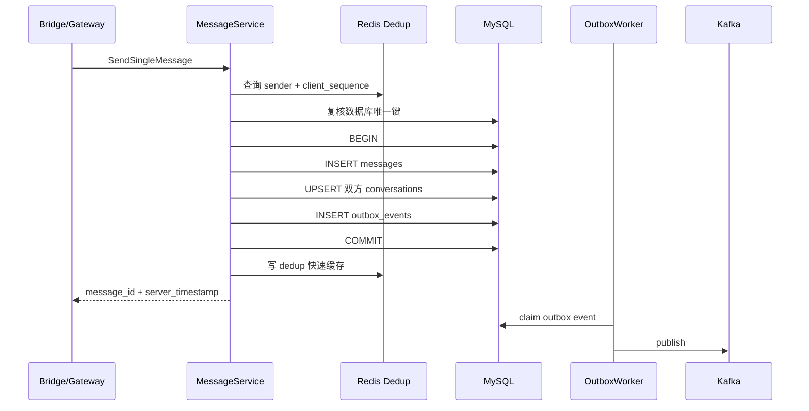

Redis 去重是快速路径，MySQL 唯一约束才是最终权威。即使 Redis 丢数据，同一 `(from_user_id, client_sequence_id)` 也不会插入两条消息。

### 12.3 群聊发送

群聊会额外检查发送者是否为群成员。事务内：

- 插入一条群消息事实；
- 为群成员更新会话视图；
- 插入群消息 Outbox 事件。

PushService 再遍历群成员推送，并可跳过发送者。

当前方案适合中小规模群组。成员非常多时，逐成员写会话和推送的成本会线性增长。

### 12.4 发送响应不等于对方已收到

前端收到 `SendSingleMessageResponse` 时，只能说明：

- 消息校验通过；
- 消息、会话和 Outbox 事件已经提交；
- 服务端返回了稳定 ID。

它不能说明：

- Kafka 已经消费；
- 接收方在线；
- Gateway 已成功写入 socket；
- 接收方已经读到。

所以 UI 要区分 `sent`、`delivered`、`read`。

---

## 13. Outbox、Kafka 与可靠投递

### 13.1 双写问题

错误方案：

```text
1. INSERT messages 成功
2. produce Kafka 失败
```

消息已经存在，但接收方永远收不到事件。

反过来先发 Kafka：

```text
1. produce Kafka 成功
2. INSERT messages 失败
```

接收方看到了数据库中不存在的消息。

MySQL 事务不能直接覆盖 Kafka，因此使用事务性 Outbox。

### 13.2 Outbox Pattern

在同一事务中写：

```text
messages
outbox_events(status=PENDING)
```

后台 Worker 再把 Outbox 发布到 Kafka。这样“业务事实”和“待发布意图”原子存在。

### 13.3 Worker claim lease

多个 Worker 不能同时发布同一事件。当前 Outbox 使用 claim token 和租约：

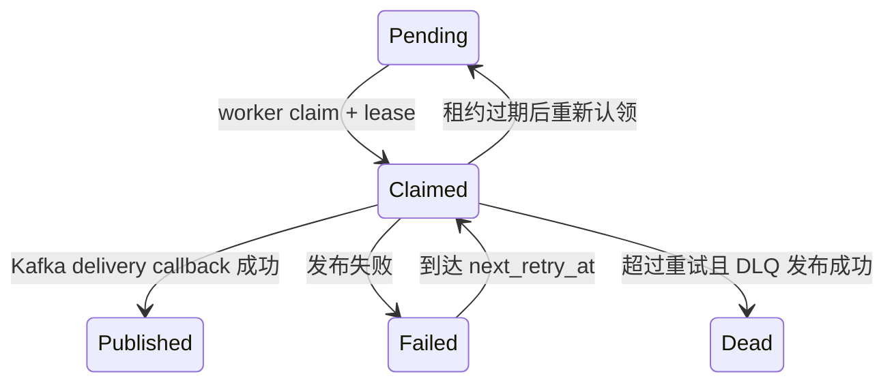

更新状态时会带 claim token 条件，防止租约已经失效的旧 Worker 覆盖新 Worker 的结果。

### 13.4 为什么要等 Kafka delivery callback

`produce()` 把消息放进本地客户端队列，不等于 broker 已确认。

正确流程是：

```text
produce
-> poll/flush
-> delivery callback 成功
-> markPublished
```

若 publish 成功但数据库状态更新失败，事件会再次发布，因此整体仍是 at-least-once。

### 13.5 Kafka key 与会话有序

消息 key 使用 `conversation_id`：

```text
hash(conversation_id) -> partition
```

Kafka 只保证同一 partition 内有序，不保证整个 topic 全局有序。将同一会话放进同一分区，满足会话内顺序需求。

分区数量变化会改变 key 到分区的映射，因此扩分区期间的严格顺序需要额外评估。

### 13.6 PushService 的 offset 语义

当前关闭自动提交。处理流程：

```text
poll
-> 反序列化
-> 在线投递成功，或离线/重试/DLQ 已可靠落地
-> commit offset
```

处理失败：

```text
seek 回原 offset
-> 退避
-> 再处理
```

如果 offset commit 失败，也会尝试 seek。不能只说“不 commit 就会在下一次 poll 自动拿到同一条”，因为消费者本地 position 可能已经前移。

### 13.7 在线投递与失败处理

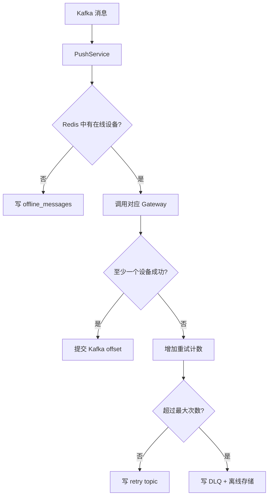

### 13.8 为什么 exactly-once 很难

考虑：

```text
Gateway 已经把消息写给客户端
-> PushService 在 commit offset 前崩溃
-> 重启后再次消费
-> 客户端再次收到同一 message_id
```

系统不能同时原子提交“远程 socket 写入”和“Kafka offset”。因此客户端和服务端必须按 `message_id` 去重。

---

## 14. ACK、离线、已读、未读与撤回

### 14.1 三个状态不要混淆

| 状态 | 含义 |
|---|---|
| `sent` | MessageService 已持久化并响应发送方 |
| `delivered` / ACK | 接收方客户端确认收到 |
| `read` | 接收方已把消息标记为已读 |

TCP `write` 成功也不等于用户已经读到，只代表数据交给了内核发送路径。

### 14.2 ACK

客户端收到 `PUSH_MSG` 后发送 `ACK_REQ`。MessageService：

- 校验 ACK 用户确实是单聊接收者，或是群成员且不是发送者；
- upsert `message_receipts.delivered_at`；
- 把对应离线消息改为 ACK 状态；
- 重复 ACK 返回成功。

幂等实现依赖唯一键和 `GREATEST` 更新时间。

### 14.3 离线消息

离线记录有阶段状态：

```text
Pending -> Pulled -> Acked
```

拉取只代表服务端已下发到响应，不代表客户端最终收到，因此不能在 pull 后立刻删除。

客户端 ACK 后才进入最终确认。过期 ACKed 记录由运维清理策略处理。

### 14.4 未读数

会话表是“每个 owner 的视图”：

- 发送者会话未读数不增加；
- 接收者或其他群成员未读数增加；
- 已读时按消息事实重新计算；
- 前端只显示真实未读，而不是总消息数。

### 14.5 为什么标记会话已读要带游标

错误设计：

```text
用户打开会话 -> UPDATE unread_count = 0
```

若更新期间新消息到达，新消息也可能被错误清零。

当前请求带 `up_to_message_id`。服务端只标记该游标及之前的消息：

```sql
created_at < cursor_time
OR (created_at = cursor_time AND message_id <= cursor_id)
```

并重新计算游标之后仍未读的消息。

### 14.6 已读状态查询

只有消息发送者可以查看接收方的 read state，避免任意用户查询他人阅读记录。

前端对自己发送的消息定期读取状态，用单勾、双勾等状态展示。

### 14.7 撤回

撤回流程检查：

- 消息存在；
- 请求用户是发送者；
- 没有重复撤回；
- 未超过配置时间窗口。

事务内：

- 更新消息 recalled 状态；
- 调整相关未读视图；
- 写撤回 Outbox 事件。

撤回不应物理删除消息，因为历史一致性、审计和多端同步仍需要稳定 message_id。

---

## 15. 好友、群组与会话模型

### 15.1 好友申请状态机

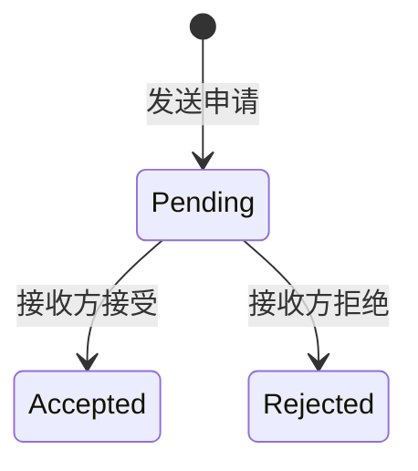

接受时在一个事务中：

- 更新申请状态；
- 插入 A -> B；
- 插入 B -> A。

双向两行让“列出我的好友”查询简单，但写入必须保持原子。

### 15.2 为什么根据 username 添加仍要转换为 user_id

username 是用户输入友好的查找键，业务关系和消息内部使用稳定 user_id：

```text
username -> UserService.GetUserByUsername -> user_id
         -> RelationService.SendFriendRequest
```

避免把可变字符串扩散到所有关系表和消息表。

### 15.3 群组权限

群组操作要检查：

- 创建者和成员身份；
- 加入、退出的状态；
- 发群消息时是否仍为成员；
- 查看成员和群信息的访问边界。

不能只依赖前端隐藏按钮。真正权限校验必须在后端。

### 15.4 会话不是消息副本

`conversations` 是查询优化后的用户视图：

```text
owner_user_id
conversation_id
conversation_type
peer_user_id / group_id
last_message_id
last_message_preview
last_message_at
unread_count
pinned
muted
deleted
```

消息事实仍在 `messages`。会话表让聊天列表无需每次聚合整张消息表。

---

## 16. 安全、稳定性和可观测性

### 16.1 传输安全

当前支持：

- Gateway 原生 TLS；
- gRPC TLS/mTLS；
- Nginx 终止 HTTPS/WSS；
- 内部 RPC Token；
- Admin scoped Token。

生产公网只应暴露 `80/443`。MySQL、Redis、Kafka、gRPC 和 metrics 端口绑定环回或受控内网。

### 16.2 输入校验

边界处要校验：

- 包 magic、版本和长度；
- Protobuf 是否可解析；
- ID 是否非零、是否有权限；
- 消息内容长度和类型；
- WebSocket opcode/mask/长度；
- RPC metadata；
- 配置中的地址、证书和哈希格式。

校验应尽量靠近输入边界，不能把非法值一路传到 SQL 层。

### 16.3 日志原则

适合记录：

- request_id、trace_id；
- 服务、方法、耗时、响应码；
- user_id、message_id、conversation_id；
- Kafka topic/partition/offset；
- 队列和重试状态。

不应记录：

- 明文密码；
- bearer token；
- Admin Token；
- MinIO Secret Key；
- 消息正文。

### 16.4 Metrics

默认 metrics 端口：

| 服务 | 端口 |
|---|---:|
| Gateway | `9100` |
| UserService | `9101` |
| MessageService | `9102` |
| RelationService | `9103` |
| PushService | `9104` |
| ConversationService | `9105` |
| AdminService | `9106` |
| DeviceService | `9107` |

常见指标类型：

- Counter：请求总数、失败数、重试数；
- Gauge：连接数、队列长度、在线用户；
- Histogram：RPC 和消息延迟分布。

trace_id 不适合做 Prometheus label，因为取值基数极高，会产生大量时间序列。

### 16.5 Tracing

当前提供轻量追踪组件：

- `TraceContext`
- `TraceSpan`
- `TraceManager`
- gRPC metadata 传播
- Kafka `MessageData.trace_id` 传播
- OTLP/HTTP 导出钩子

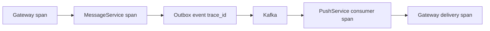

Prometheus 负责“整体是否异常”，Tracing 负责“某一次请求慢在哪里”，日志负责“具体发生了什么”。

### 16.6 管理服务

AdminService 可查询：

- 依赖健康；
- 系统统计；
- Outbox 状态；
- Kafka lag；
- 服务概览；
- 审计事件；
- 运行清理；
- 配置检查。

Admin 审计当前是进程内存数据，不是持久化审计数据库。这是必须如实说明的边界。

---

## 17. 构建、测试与部署

### 17.1 CMake 构建

典型流程：

```bash
cmake -S . -B build -DCMAKE_BUILD_TYPE=Release
cmake --build build -j
ctest --test-dir build --output-on-failure
```

项目根据依赖和选项启用 gRPC、存储等模块。Release 构建用于验证优化模式下的编译问题。

### 17.2 测试层次

应区分：

- 单元测试：Codec、Buffer、ID、工具类；
- 集成测试：MySQL、Redis、Kafka、DAO 和服务交互；
- E2E：注册、登录、好友、发送、推送、ACK、历史；
- 健康检查：部署后端口和依赖可用；
- 压测：连接数、QPS、P50/P90/P99。

“编译通过”不等于消息链路正确。“接口 200”也不等于 ACK、离线和重复消费正确。

### 17.3 Docker Compose 的职责

Docker 运行依赖：

- MySQL
- Redis
- Kafka
- Prometheus
- Grafana
- Jaeger

后端 C++ 服务在生产主机由 systemd 管理。这样可分别控制依赖容器和服务进程。

### 17.4 systemd

典型生产目录：

```text
/opt/nebulaim
/etc/nebulaim/nebula.conf
/var/log/nebulaim
/var/lib/nebulaim
```

systemd 负责：

- 启动顺序；
- 自动重启；
- 工作目录和用户；
- fd 上限；
- 文件系统和权限沙箱；
- 优雅停止。

`LimitNOFILE=1048576` 只是提高 fd 上限，不代表系统已经能承载一百万连接。实际容量还受内存、每连接 Buffer、内核参数和业务负载影响。

### 17.5 就绪检查

只检查 TCP 端口开放不够。例如 MySQL 端口打开但查询失败，服务仍不可用。

当前 `wait_ready.sh` 在客户端可用时执行真实 `SELECT 1`，比仅测试端口更接近 readiness。

### 17.6 优雅停止

服务处理 `SIGTERM/SIGINT`：

- gRPC Server `Shutdown`；
- EventLoop 退出；
- Worker 线程停止并 join；
- Kafka consumer/producer 关闭；
- systemd 等待进程退出。

优雅停止的目标是尽量减少：

- 半处理 RPC；
- 未提交 offset；
- 未 flush 的 producer；
- 悬空连接和资源泄漏。

### 17.7 观测组件端口

| 组件 | 默认端口 |
|---|---:|
| Prometheus | `9090` |
| Grafana | `3000` |
| Jaeger UI | `16686` |
| OTLP HTTP | `4318` |

这些端口通常不直接暴露公网。

---

## 18. 设计边界与后续演进

### 18.1 当前合理但有上限的设计

**单 Redis 连接加互斥锁**

实现简单且线程安全，但高并发下所有 Redis 请求被串行化。可演进为连接池或每 Worker 独立连接。

**群聊写扩散**

中小群查询快，但大群发送成本高。可按群规模切换读扩散、批处理或独立 fanout 服务。

**RelationService 的用户资料补全**

列出好友/成员时可能逐用户查询，存在 N+1 风险。可增加批量接口、JOIN 或缓存。

**静态服务地址**

当前有 resolver 抽象，但生产仍主要依赖配置。多实例自动发现、健康摘除和负载均衡可继续完善。

**轻量 tracing**

已经有上下文传播和 OTLP 钩子，但不是完整 OpenTelemetry SDK 集成。

### 18.2 当前没有实现的能力

- 端到端消息加密；
- 多地域复制和故障切换；
- Kubernetes Operator；
- 分布式持久化 Admin 审计；
- 超大群专用消息扩散；
- 自动分库分表。

准确说明边界比声称“生产级所以什么都有”更可信。

### 18.3 可执行的演进顺序

1. 先用指标确认瓶颈，而不是先做复杂架构；
2. 为 Redis 和 DAO 增加连接池与批量接口；
3. 完善服务发现和多实例路由；
4. 按群规模拆分 fanout 策略；
5. 接入完整 OpenTelemetry；
6. 增加故障注入和恢复测试；
7. 评估数据分片、多地域和合规需求。

---

## 19. 常见项目问题与回答框架

### 19.1 为什么使用 C++ 和 Reactor

回答结构：

1. IM Gateway 维护大量长连接；
2. 连接多数时间空闲，适合事件驱动；
3. C++ 可以直接控制 epoll、Buffer、对象生命周期和线程归属；
4. 主从 Reactor 利用多核，连接固定在线程中减少锁；
5. 阻塞业务通过 RpcExecutor 移出 I/O 线程。

### 19.2 一条消息如何到达接收方

```text
客户端
-> Gateway/Bridge
-> MessageService
-> MySQL messages + outbox
-> OutboxWorker
-> Kafka
-> PushService
-> Redis 在线定位
-> GatewayService
-> PUSH_MSG
-> 客户端 ACK
```

随后补充：发送响应只表示持久化成功；ACK 和 read 是后续状态。

### 19.3 如何解决粘包和半包

关键点：

- TCP 是字节流；
- 16 字节固定头包含 body_length；
- Buffer 不够完整包时不消费；
- 完整后按长度提取；
- while 循环处理粘包；
- 最大 Body 限制防止恶意长度。

### 19.4 如何保证消息不丢

不要回答“Kafka 不会丢”。

正确层次：

- 消息和 Outbox 同事务，避免数据库/Kafka 双写窗口；
- Worker 等 delivery callback；
- Kafka 消费成功后手动 commit；
- 在线失败进入 retry、DLQ 或离线；
- 客户端 ACK；
- 仍是 at-least-once，因此依靠幂等去重。

### 19.5 如何处理重复消息

- 客户端每次发送带稳定 `client_sequence_id`；
- Redis 先查快速去重；
- MySQL 唯一键 `(from_user_id, client_sequence_id)` 最终兜底；
- Kafka 可能重复投递；
- 客户端按 `message_id` 合并；
- ACK、已读和离线状态更新都是幂等。

### 19.6 如何保证顺序

- 同一会话 Kafka key 为 conversation_id；
- 同 key 进入同一 partition；
- partition 内有序；
- 历史按 `(created_at, message_id)` 排序；
- 不声称跨会话全局有序；
- 重试和多分区场景仍需稳定 ID 与客户端排序。

### 19.7 为什么未读数不能直接清零

打开会话与新消息可能并发。请求带最后可见 `up_to_message_id`，只标记游标之前消息，然后重新计算游标之后未读，避免误清新消息。

### 19.8 Redis 在线状态为什么需要 TTL

Gateway 可能崩溃，无法主动清理。TTL 让陈旧状态最终消失。心跳续期，正常断开主动删，TTL 负责故障兜底。

### 19.9 为什么浏览器端 ID 用字符串

C++ `uint64_t` 精确，但 JavaScript number 只有 53 位整数精度。Snowflake ID 必须在 Protobuf 和 JSON 两条路径都保持字符串，并配置 long.js，否则实时消息和历史消息无法按 ID 去重。

### 19.10 如果 Kafka 已发布但 Outbox 状态没更新怎么办

Worker 会再次发布，所以产生重复事件。这正是 at-least-once。下游用稳定 message_id 保持幂等，不能把 Outbox 误称为 exactly-once。

### 19.11 如果 PushService 写给客户端后 commit offset 失败怎么办

消息可能再次消费并推送。客户端按 message_id 去重并重复 ACK，服务端 ACK upsert 保持幂等。

### 19.12 系统当前最值得优化哪里

应结合指标回答，而不是泛泛说“上 Kubernetes”：

- Redis 单连接串行化；
- 好友/成员资料 N+1；
- 大群写扩散；
- 静态服务发现；
- Admin 审计持久化；
- 更完整的分布式追踪和故障注入。