# Linux 系统基础与并发编程知识体系

# 一、进程、线程、协程

> 说明：本章以现代通用操作系统为背景，涉及信号、文件描述符和调度时主要采用 Linux/POSIX 语境。不同操作系统、CPU 架构和语言运行时的实现可能不同，因此文中使用“通常”“一般”等限定词。

## 1. 进程是什么？

**进程是程序的一次运行实例，也是操作系统组织地址空间、资源和隔离边界的基本容器。**

磁盘上的可执行文件只是静态代码和数据。程序被加载后，操作系统会为其建立运行所需的地址空间和内核管理对象，并创建至少一条可执行线程，由此形成一个运行中的进程。

需要区分两个概念：

- **程序**：磁盘上的静态文件。
- **进程**：程序运行时形成的动态实体。

> CPU 最终执行的是线程中的指令。进程主要提供资源、地址空间和隔离边界，线程负责实际执行。

### 1.1 虚拟地址空间

一个用户进程通常拥有独立的虚拟地址空间。不同进程可以在相同虚拟地址上保存不同内容，也可以通过共享内存等机制显式映射同一组物理页。

典型虚拟地址空间包括：

- **代码映射**：程序机器指令，通常具有只读和可执行权限。
- **只读数据映射**：字符串常量、只读全局对象等。
- **数据段**：已初始化的全局变量和静态变量。
- **BSS 区域**：未显式初始化或初始化为零的全局变量和静态变量。
- **堆及匿名映射**：供 `malloc`、`new`、运行时和内存分配器使用。
- **文件映射和共享库映射**：由 `mmap` 或动态加载器建立。
- **线程栈**：每个线程通常拥有独立的用户栈区域。

多线程进程不是“只有一个栈”。每个线程都有自己的用户栈，但这些栈都位于同一个进程的虚拟地址空间中，因此并不形成线程间的硬隔离。

### 1.2 进程级资源

进程通常拥有或引用：

- 文件描述符表；
- 当前工作目录和根目录视图；
- 环境变量；
- 用户身份、组身份和权限信息；
- 进程级信号处置方式；
- 地址空间与内存映射；
- 定时器、资源限制和统计信息；
- IPC、命名空间、cgroup 等关联关系。

这里的“拥有”不一定表示对象完全私有。文件对象、共享内存、页缓存和内核对象都可能被多个进程共同引用。

### 1.3 内核管理信息

教材常用 **PCB（Process Control Block，进程控制块）** 抽象描述操作系统保存的进程信息，例如：

- PID 和父子关系；
- 进程或线程状态；
- 调度策略与统计信息；
- 地址空间引用；
- 文件、信号、凭据等资源引用；
- 所包含线程的信息。

实际内核实现通常不会把所有内容放进一个名为 PCB 的结构中。以 Linux 为例，进程和线程都以可调度任务的形式表示，核心结构是 `task_struct`，再通过指针引用内存描述符、文件表、信号结构等对象。

### 1.4 Linux 中的 task 模型

Linux 内核不会用两套完全不同的对象分别表示“进程”和“线程”。二者都属于 **task**，都由调度器调度。

概念上可以这样理解：

```text
task_struct
├─ 调度状态
├─ 寄存器与内核栈相关信息
├─ 地址空间引用 mm
├─ 文件表引用 files
├─ 信号结构引用 signal/sighand
└─ 凭据、命名空间等引用
```

不同 task 是否构成同一进程，主要取决于它们共享哪些资源：

```text
多个 task
├─ 共享地址空间
├─ 共享文件表
├─ 共享信号处置
└─ 共享线程组标识
        ↓
通常被用户态视为同一进程中的多个线程
```

`fork()` 通常创建资源逐步独立的子进程；线程库通常通过 `clone()` 及一组共享标志创建共享地址空间和进程资源的新 task。

> “进程是资源容器，线程是执行实体”是便于理解的抽象；在 Linux 内核内部，二者都落到可调度 task 上。

## 2. 线程是什么？

**线程是进程内部的一条执行流，也是主流操作系统调度器直接调度的执行实体。**

一个进程至少有一个线程，也可以包含多个线程。线程共享进程级资源，但每个线程具有独立的执行上下文。

### 2.1 同一进程内线程通常共享的内容

- 虚拟地址空间；
- 代码、全局变量、静态变量和堆；
- 内存映射和共享库；
- 文件描述符表；
- 当前工作目录；
- 进程级信号处置方式；
- 用户身份和大部分进程级资源。

因此，一个线程修改全局变量、释放堆内存或关闭共享文件描述符，可能直接影响同一进程中的其他线程。

### 2.2 每个线程独立或按线程维护的状态

- 用户栈；
- 内核栈；
- 程序计数器和寄存器上下文；
- 调度状态、优先级和 CPU 亲和性；
- 线程局部存储 TLS；
- 线程信号屏蔽字；
- 部分线程定向的挂起信号；
- 线程 ID。

在 Linux 中，内核 TID 可以通过 `gettid()` 获取；POSIX 的 `pthread_t` 是线程库层面的标识，两者不应直接视为同一类型。

> “线程有自己的栈”是指它使用独立的栈区域和栈指针，不表示其他线程在权限上无法访问该栈。由于同一进程的线程共享地址空间，错误指针仍可能破坏其他线程的栈。

### 2.3 为什么线程需要同步？

共享地址空间使线程通信非常直接，但也引入了：

- 数据竞争；
- 竞态条件；
- 可见性和重排序问题；
- 死锁、活锁和饥饿；
- 生命周期与所有权错误。

常用同步工具包括互斥锁、读写锁、条件变量、信号量、原子操作和无锁数据结构。

## 3. 进程和线程的区别

| 对比点 | 进程 | 线程 |
|---|---|---|
| 核心角色 | 地址空间、资源和隔离容器 | 进程中的执行流 |
| 调度关系 | 通常通过其线程参与调度 | 内核调度器直接调度 |
| 地址空间 | 不同进程默认相互独立 | 同一进程内线程共享 |
| 资源共享 | 需要显式 IPC 或共享映射 | 天然共享大部分进程资源 |
| 栈 | 一个多线程进程包含多个线程栈 | 每个线程有自己的栈 |
| 通信方式 | 管道、消息队列、共享内存、Socket 等 | 直接访问共享内存，但必须同步 |
| 创建销毁 | 通常需要建立更多独立资源 | 通常比创建独立进程轻量 |
| 故障隔离 | 通常较强 | 一个线程的越界写可能破坏整个进程 |
| 并行能力 | 多个进程可在多核并行 | 多个内核线程也可在多核并行 |
| 编程难点 | IPC、序列化、资源管理 | 数据竞争、锁、内存模型和生命周期 |

这里的“通常”很重要。进程也可以通过共享内存共享大量数据；线程创建也不一定在所有运行时中都比进程创建便宜。

### 3.1 为什么同进程线程切换通常更轻量？

无论切换发生在同一进程还是不同进程，都可能需要：

- 保存和恢复寄存器；
- 切换内核栈；
- 更新调度器状态；
- 恢复浮点、SIMD 等扩展状态；
- 扰动分支预测器和 CPU Cache。

如果两个线程属于同一进程，它们通常共享同一用户地址空间，因此不需要更换页表根或地址空间标识。

跨进程切换通常还涉及：

- 切换地址空间上下文；
- 使用另一套页表映射；
- 改变 ASID/PCID 等地址空间标识；
- 更明显的 TLB 和缓存工作集扰动。

现代处理器可通过 ASID、PCID 等机制保留不同地址空间的部分 TLB 项，所以“进程切换一定清空全部 TLB”是不准确的。

> 同进程线程切换通常比跨地址空间切换便宜，但它仍是完整的任务切换，并不是零成本。

## 4. 协程是什么？

**协程是可以暂停并在之后恢复的计算过程。**

协程通常不是内核直接调度的对象，而是由语言运行时、库、执行器或事件循环管理。协程执行时必须由某个操作系统线程承载，但它是否固定绑定该线程取决于运行时。

常见模型包括：

- **1:N**：一个线程承载多个协程，例如单线程事件循环。
- **M:N**：多个协程被调度到多个工作线程上。
- **线程绑定模型**：协程恢复时必须回到指定线程。
- **可迁移模型**：协程暂停后可以在其他工作线程恢复。

把协程称为“用户态线程”可以帮助入门，但不属于严格定义。C++20 协程甚至只提供编译器层面的暂停与恢复机制，并不自带调度器、事件循环或线程池。

### 4.1 有栈协程和无栈协程

**有栈协程**具有独立调用栈或可增长栈，挂起时需要保存栈上下文。

**无栈协程**通常被编译为状态机，把跨挂起点仍需存活的局部变量、恢复位置等保存到协程帧中。

因此，协程切换不应统一描述为“切换栈指针”：

- 有栈协程主要保存和恢复栈上下文；
- 无栈协程主要保存和恢复状态机及协程帧；
- 具体成本取决于实现和挂起点行为。

### 4.2 协程通常如何调度？

多数协程系统以协作式调度为主，协程在以下位置主动或隐式挂起：

- `await`；
- `yield`；
- 等待异步 I/O；
- 等待定时器或同步原语；
- 显式调度点。

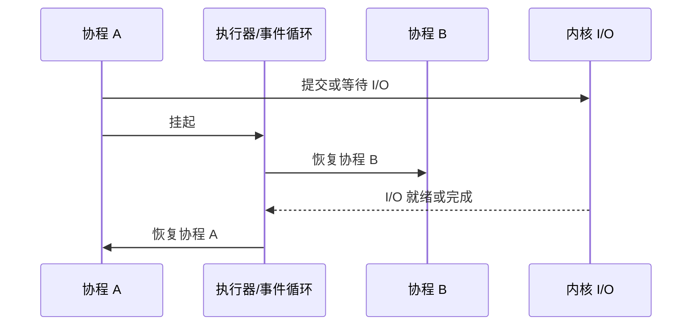

`await` 并不保证一定挂起：如果等待对象已经完成，协程可以直接继续执行。部分运行时还会加入安全点或抢占机制，避免某个任务长期独占工作线程。

### 4.3 为什么协程适合高并发 I/O？

I/O 密集任务的大部分时间花在等待网络、磁盘、数据库或定时器。协程可以在等待期间挂起，把承载线程让给其他任务，从而用少量线程维持大量逻辑任务。

典型场景包括：

- 网络服务器和网关；
- 大量 HTTP/RPC 请求；
- 数据库和消息队列客户端；
- 爬虫；
- 长连接与定时任务。

前提是等待过程能够与执行器协同，例如使用非阻塞 I/O、异步 I/O，或者把阻塞调用转移到专用线程池。

### 4.4 阻塞调用会发生什么？

如果协程直接执行阻塞系统调用或长时间 CPU 计算，阻塞的是当前承载线程：

```text
工作线程 T
├─ 协程 A：进入阻塞调用
├─ 协程 B：等待被调度
└─ 协程 C：等待被调度
```

- 单线程事件循环中，线程 T 被阻塞会使该事件循环中的其他协程停顿。
- 多线程执行器中，其他工作线程仍可运行。
- 某些运行时会把已知阻塞操作转移到阻塞线程池，或在工作线程阻塞后进行补偿。

运行时只能处理它能够识别或接管的阻塞点。任意第三方库中的阻塞函数不一定会被自动异步化。

### 4.5 协程能否利用多核？

需要区分并发与并行：

- **并发**：多个任务在一段时间内都取得进展。
- **并行**：多个任务同一时刻运行在不同计算核心上。

所有协程都运行在一个线程时，只能交替并发，不能同时在多个 CPU 核心执行。

如果执行器拥有多个工作线程，不同协程可以同时运行在不同核心：

```text
一个进程
├─ 工作线程 1：协程 A
├─ 工作线程 2：协程 B
└─ 工作线程 3：协程 C
```

单个协程在某一时刻通常只由一个线程执行；暂停后恢复到原线程还是其他线程，由运行时和调度器决定。

### 4.6 协程的典型风险

- 在事件循环中执行阻塞调用；
- 在协作式调度中运行长时间 CPU 循环而不挂起；
- 协程恢复后发生线程迁移，错误依赖线程局部状态；
- 协程对象或缓冲区在异步操作完成前失效；
- 缺少取消、超时和背压；
- 把“异步接口”误认为“底层一定没有线程或阻塞”。

## 5. 线程和协程的区别

| 对比点 | 操作系统线程 | 协程 |
|---|---|---|
| 调度者 | 内核调度器 | 运行时、执行器、事件循环或程序 |
| 内核直接感知 | 是 | 通常否 |
| 运行载体 | 可直接被调度到 CPU | 执行时依附于某个线程 |
| 切换方式 | 内核任务切换 | 通常由用户态运行时暂停和恢复 |
| 切换成本 | 通常较高 | 通常较低，但取决于实现 |
| 栈 | 通常有用户栈和内核栈 | 可能有独立栈，也可能是无栈状态机 |
| 调度方式 | 通常是抢占式 | 多数以协作式为主，也可能支持抢占 |
| 阻塞调用影响 | 阻塞当前线程 | 阻塞当前承载线程 |
| 多核并行 | 多线程可并行 | 需要多个承载线程 |
| 常见用途 | CPU 并行、阻塞式 API、系统线程 | 大量异步任务和高并发 I/O |

“线程适合 CPU 密集、协程适合 I/O 密集”只是常见经验，不是严格边界：

- 协程也可以封装 CPU 任务，但若只运行在一个线程中仍不能多核并行；
- 多线程是否能并行执行语言代码，还受运行时全局锁等机制影响；
- 高并发系统经常组合使用协程、线程池和多进程。

## 6. 三者之间的关系

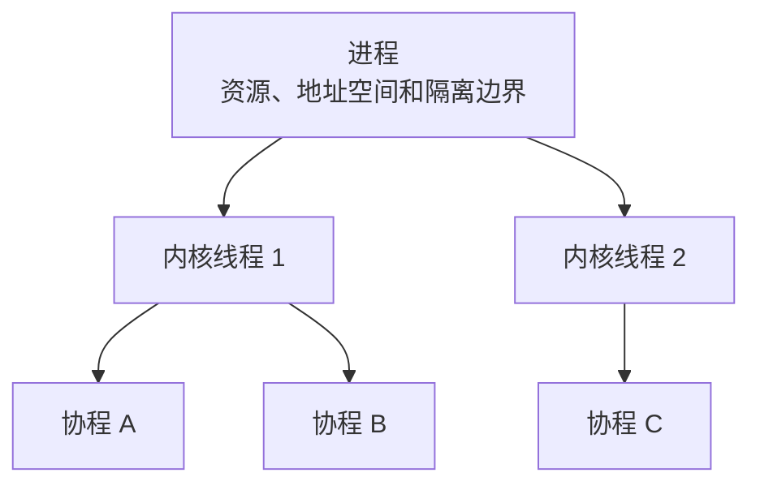

这只是概念图。协程是否固定在某个线程、线程是否共享全部资源、进程之间是否共享内存，都取决于具体配置和实现。

## 7. 总结

> **进程提供资源和隔离边界，线程承担内核可调度的执行，协程提供用户态可暂停和恢复的任务抽象。**

- 不同进程默认拥有独立地址空间，但可以显式共享内存。
- 同一进程中的线程共享大部分资源，但各自维护执行上下文。
- 同进程线程切换通常不切换用户地址空间，但仍存在调度和缓存成本。
- 协程执行时必须由线程承载，但不一定永久绑定某个线程。
- 单线程协程只能并发；多线程执行器可以让多个协程多核并行。
- 阻塞调用阻塞的是承载线程，不是抽象意义上的“协程调度器”。
- 协程不会自动把同步阻塞代码变成异步代码。

# 二、进程间通信 IPC

不同进程默认拥有相互隔离的虚拟地址空间，因此不能像同一进程中的线程那样直接访问对方的普通变量。进程间通信需要借助内核对象、共享映射或显式的数据交换协议。

## 1. 常见 IPC 方式对比

| IPC 方式 | 数据语义 | 常见通信范围 | 是否保留消息边界 | 主要特点 |
|---|---|---|---|---|
| 匿名管道 Pipe | 字节流 | 通常是具有继承或传递 fd 关系的进程 | 否 | 简单、单向数据通道 |
| 命名管道 FIFO | 字节流 | 同一主机、可通过路径找到 FIFO 的进程 | 否 | 有文件系统名称，适合简单本地通信 |
| 消息队列 | 离散消息 | 同一主机 | 是 | 内核保存消息，可按消息或类型读取 |
| 共享内存 | 共享字节区域 | 同一主机 | 由应用自行定义 | 建立映射后无需每次通信都复制载荷 |
| 信号量 | 计数与同步状态 | 线程或进程 | 不适用 | 用于同步和资源计数，不是大数据通道 |
| 信号 Signal | 异步事件 | 同一主机 | 信号编号 | 适合事件通知，不适合传输复杂数据 |
| Unix Domain Socket | 字节流或数据报 | 同一主机 | 取决于 Socket 类型 | 双向、接口统一，还可传递文件描述符 |
| TCP/UDP Socket | 字节流或数据报 | 本机或跨主机 | TCP 否，UDP 是 | 最通用的网络通信方式 |

几点需要注意：

1. **管道容量不是固定 64 KiB。** Linux 中默认容量和可调整范围受内核版本、页大小和系统配置影响，不能把某个常见默认值当成协议保证。
2. **FIFO 的路径可以长期存在，但数据不会持久保存。** 没有进程打开 FIFO 时，不存在一个永久保存消息的文件内容。
3. **共享内存通常适合大数据量和高频通信，但不保证在所有场景都最快。** 缓存一致性、伪共享、锁竞争、NUMA 和协议设计都可能成为瓶颈。
4. **共享内存不强制必须使用信号量。** 也可以使用进程共享互斥锁、条件变量、原子操作、事件 fd 等同步机制。
5. **信号可以附带极少量信息。** `sigqueue()` 和实时信号可携带整数或指针值，但信号仍不适合作为通用数据通道。
6. **“双向”不代表一次系统调用同时双向传输。** 应用仍需要设计请求、响应、半关闭和错误处理协议。

## 2. 匿名管道 Pipe

管道提供一个内核维护的字节流：

```text
写端 fd[1]  ─────>  内核管道缓冲区  ─────>  读端 fd[0]
```

特点：

- `pipe()` 返回读端 `fd[0]` 和写端 `fd[1]`；
- 数据没有消息边界，一次 `write()` 不一定对应一次 `read()`；
- 通常用于 `fork()` 后的父子进程；
- 只要文件描述符能够被继承或通过 Unix Domain Socket 等方式传递，匿名管道并非理论上只能用于父子进程；
- 管道是单向通道，需要两个管道才能建立传统的全双工请求与响应；
- 当所有写端关闭后，读端读完剩余数据会得到 EOF，即 `read()` 返回 0；
- 没有任何读端时继续写入，默认可能收到 `SIGPIPE`，同时 `write()` 返回 `EPIPE`。

下面的示例处理了部分写入、读取长度和子进程回收：

```c
#include <errno.h>
#include <stdio.h>
#include <stdlib.h>
#include <string.h>
#include <sys/wait.h>
#include <unistd.h>

static int write_all(int fd, const void *buffer, size_t size) {
    const char *p = (const char *)buffer;

    while (size > 0) {
        ssize_t n = write(fd, p, size);

        if (n > 0) {
            p += n;
            size -= (size_t)n;
            continue;
        }

        if (n == -1 && errno == EINTR) {
            continue;
        }

        return -1;
    }

    return 0;
}

int main(void) {
    int pipefd[2];

    if (pipe(pipefd) == -1) {
        perror("pipe");
        return EXIT_FAILURE;
    }

    pid_t pid = fork();

    if (pid == -1) {
        perror("fork");
        close(pipefd[0]);
        close(pipefd[1]);
        return EXIT_FAILURE;
    }

    if (pid == 0) {
        close(pipefd[1]);

        char buffer[128];
        ssize_t n;

        do {
            n = read(pipefd[0], buffer, sizeof(buffer));
        } while (n == -1 && errno == EINTR);

        if (n > 0) {
            printf("child received %zd bytes: %.*s\n",
                   n,
                   (int)n,
                   buffer);
        } else if (n == 0) {
            puts("child: EOF");
        } else {
            perror("read");
        }

        close(pipefd[0]);
        _exit(n >= 0 ? EXIT_SUCCESS : EXIT_FAILURE);
    }

    close(pipefd[0]);

    const char message[] = "hello child process";

    if (write_all(pipefd[1], message, sizeof(message) - 1) == -1) {
        perror("write");
    }

    close(pipefd[1]);

    int status = 0;
    if (waitpid(pid, &status, 0) == -1) {
        perror("waitpid");
        return EXIT_FAILURE;
    }

    return WIFEXITED(status) && WEXITSTATUS(status) == 0
        ? EXIT_SUCCESS
        : EXIT_FAILURE;
}
```

`PIPE_BUF` 还涉及一个重要保证：多个写者并发向管道写入时，长度不超过 `PIPE_BUF` 的单次写入具有原子性，不会与其他此类写入交错；这不等于管道总容量就是 `PIPE_BUF`。

## 3. 命名管道 FIFO

FIFO 是在文件系统中具有名称的管道对象。路径使无亲缘关系的进程能够找到同一通信端点。

```bash
mkfifo /tmp/myfifo
ls -l /tmp/myfifo
```

输出中第一个字符通常是 `p`：

```text
prw-r--r-- 1 user user 0 Jul 9 10:00 /tmp/myfifo
```

需要注意：

- FIFO 路径是名称，不是普通文件内容；
- 默认情况下，只读打开可能等待写者，只写打开可能等待读者；
- 使用 `O_NONBLOCK` 时，打开和读写行为会发生变化；
- FIFO 仍是无消息边界字节流；
- 若需要天然双向连接、连接管理或多客户端支持，Unix Domain Socket 通常更合适。

发送端：

```c
#include <errno.h>
#include <fcntl.h>
#include <stdio.h>
#include <string.h>
#include <unistd.h>

int main(void) {
    int fd = open("/tmp/myfifo", O_WRONLY);
    if (fd == -1) {
        perror("open");
        return 1;
    }

    const char message[] = "hello from sender";
    ssize_t n;

    do {
        n = write(fd, message, sizeof(message) - 1);
    } while (n == -1 && errno == EINTR);

    if (n == -1) {
        perror("write");
    }

    close(fd);
    return n == -1;
}
```

接收端：

```c
#include <errno.h>
#include <fcntl.h>
#include <stdio.h>
#include <unistd.h>

int main(void) {
    int fd = open("/tmp/myfifo", O_RDONLY);
    if (fd == -1) {
        perror("open");
        return 1;
    }

    char buffer[128];
    ssize_t n;

    do {
        n = read(fd, buffer, sizeof(buffer));
    } while (n == -1 && errno == EINTR);

    if (n > 0) {
        printf("receiver got %zd bytes: %.*s\n",
               n,
               (int)n,
               buffer);
    } else if (n == -1) {
        perror("read");
    }

    close(fd);
    return n == -1;
}
```

## 4. 消息队列

消息队列以离散消息为单位通信，能够保留消息边界。Linux 中常见两类接口：

- **System V 消息队列**：`msgget`、`msgsnd`、`msgrcv`、`msgctl`；
- **POSIX 消息队列**：`mq_open`、`mq_send`、`mq_receive`、`mq_unlink`。

两套接口的命名、权限、生命周期和通知机制不同，不能混为一谈。

System V 消息队列的特点：

- 消息结构第一个字段必须是正的 `long` 类型消息类型；
- `msgsz` 不包括消息类型字段；
- 可以按类型选择消息；
- 队列对象在创建进程退出后仍可能存在，必须显式 `IPC_RMID`，或由系统重启清理；
- `ftok()` 不保证全局唯一，可能发生键冲突，返回值也必须检查。

发送端示例：

```c
#include <stdio.h>
#include <stdlib.h>
#include <string.h>
#include <sys/ipc.h>
#include <sys/msg.h>

struct message {
    long type;
    char text[100];
};

int main(void) {
    key_t key = ftok("/tmp", 'Q');
    if (key == (key_t)-1) {
        perror("ftok");
        return EXIT_FAILURE;
    }

    int msgid = msgget(key, IPC_CREAT | 0600);
    if (msgid == -1) {
        perror("msgget");
        return EXIT_FAILURE;
    }

    struct message msg = {
        .type = 1
    };
    strcpy(msg.text, "hello message queue");

    size_t payload_size = strlen(msg.text) + 1;

    if (msgsnd(msgid, &msg, payload_size, 0) == -1) {
        perror("msgsnd");
        return EXIT_FAILURE;
    }

    return EXIT_SUCCESS;
}
```

接收端示例：

```c
#include <stdio.h>
#include <stdlib.h>
#include <sys/ipc.h>
#include <sys/msg.h>

struct message {
    long type;
    char text[100];
};

int main(void) {
    key_t key = ftok("/tmp", 'Q');
    if (key == (key_t)-1) {
        perror("ftok");
        return EXIT_FAILURE;
    }

    int msgid = msgget(key, 0600);
    if (msgid == -1) {
        perror("msgget");
        return EXIT_FAILURE;
    }

    struct message msg;
    ssize_t n = msgrcv(msgid, &msg, sizeof(msg.text), 1, 0);

    if (n == -1) {
        perror("msgrcv");
        return EXIT_FAILURE;
    }

    printf("receiver got %zd bytes: %.*s\n", n, (int)n, msg.text);

    if (msgctl(msgid, IPC_RMID, NULL) == -1) {
        perror("msgctl IPC_RMID");
        return EXIT_FAILURE;
    }

    return EXIT_SUCCESS;
}
```

消息队列适合较小的结构化消息。对于大块数据，常见设计是“消息队列传控制信息，共享内存传载荷”。

## 5. 共享内存

共享内存允许多个进程把同一组内存页映射到各自地址空间。映射建立后，进程可以像访问普通内存一样读写共享区域，无需每次消息都经过“发送到内核、再复制给接收进程”的路径。

需要强调：

- 共享的是底层内存页，两个进程中的虚拟地址不必相同；
- 共享内存只解决数据放置，不自动提供协议、互斥、可见性或生命周期管理；
- 进程间原子操作还需要满足类型、对齐和平台支持要求；
- 错误同步可能导致数据竞争、缓存行争用和内存破坏；
- 共享内存对象的生命周期取决于所使用的 System V、POSIX 或匿名共享映射接口。

下面使用 System V 共享内存，并在共享区域中放置一个进程共享 POSIX 信号量，避免用 `sleep()` 猜测执行顺序：

```c
#include <semaphore.h>
#include <stdio.h>
#include <stdlib.h>
#include <string.h>
#include <sys/shm.h>
#include <sys/wait.h>
#include <unistd.h>

struct shared_block {
    sem_t ready;
    char text[128];
};

int main(void) {
    int shmid = shmget(
        IPC_PRIVATE,
        sizeof(struct shared_block),
        IPC_CREAT | 0600
    );

    if (shmid == -1) {
        perror("shmget");
        return EXIT_FAILURE;
    }

    struct shared_block *block = shmat(shmid, NULL, 0);
    if (block == (void *)-1) {
        perror("shmat");
        shmctl(shmid, IPC_RMID, NULL);
        return EXIT_FAILURE;
    }

    /*
     * pshared = 1，表示该信号量位于进程间共享内存中。
     * 初始值为 0，子进程将等待父进程发布数据。
     */
    if (sem_init(&block->ready, 1, 0) == -1) {
        perror("sem_init");
        shmdt(block);
        shmctl(shmid, IPC_RMID, NULL);
        return EXIT_FAILURE;
    }

    pid_t pid = fork();

    if (pid == -1) {
        perror("fork");
        sem_destroy(&block->ready);
        shmdt(block);
        shmctl(shmid, IPC_RMID, NULL);
        return EXIT_FAILURE;
    }

    if (pid == 0) {
        if (sem_wait(&block->ready) == -1) {
            perror("sem_wait");
            _exit(EXIT_FAILURE);
        }

        printf("child read: %s\n", block->text);
        shmdt(block);
        _exit(EXIT_SUCCESS);
    }

    strcpy(block->text, "hello shared memory");

    if (sem_post(&block->ready) == -1) {
        perror("sem_post");
    }

    int status = 0;
    waitpid(pid, &status, 0);

    sem_destroy(&block->ready);
    shmdt(block);

    /*
     * IPC_RMID 标记对象删除。
     * System V 共享内存会在最后一个映射解除后真正释放。
     */
    shmctl(shmid, IPC_RMID, NULL);

    return WIFEXITED(status) && WEXITSTATUS(status) == 0
        ? EXIT_SUCCESS
        : EXIT_FAILURE;
}
```

生产代码还应处理 `sem_wait()` 被信号中断、父进程异常退出、对象初始化一致性和健壮互斥等问题。

## 6. 信号量

信号量是同步原语，本质上维护一个非负计数：

- **等待/P/down**：计数大于零时减一并继续；否则等待；
- **发布/V/up**：计数加一，并可能唤醒等待者。

常见用途：

- 限制同时使用资源的任务数量；
- 实现生产者—消费者中的空槽和数据计数；
- 进程间或线程间事件通知；
- 作为二值同步原语。

信号量与互斥锁的关键区别是**所有权**：

- 互斥锁通常要求由获得锁的线程解锁；
- 信号量没有同样的所有者语义，可以由另一个线程或进程发布；
- 因此不能把所有二值信号量都等同于互斥锁。

Linux 中还要区分：

- POSIX 未命名信号量 `sem_init`；
- POSIX 命名信号量 `sem_open`；
- System V 信号量 `semget/semop/semctl`；
- 内核内部信号量。

它们的接口、语义细节和生命周期不同。

## 7. 信号 Signal

信号是内核向进程或线程发送的异步事件通知。

常见信号：

- `SIGINT`：终端中断，通常由 `Ctrl+C` 触发；
- `SIGTERM`：请求进程有序终止；
- `SIGKILL`：强制终止，不能捕获、阻塞或忽略；
- `SIGCHLD`：子进程状态变化；
- `SIGSEGV`：无效内存访问等错误；
- `SIGPIPE`：向没有读者的管道或已关闭连接写入。

需要注意：

- 信号处置方式通常是进程级共享的；
- 信号屏蔽字按线程维护；
- 信号可以是进程定向或线程定向；
- 普通信号可能合并，多次到达不一定排队为多份；
- 实时信号具有排队和顺序语义；
- 信号处理函数运行在被打断线程的上下文中，必须遵守异步信号安全约束。

`printf()`、`malloc()`、`std::cout` 等通常不能安全地在异步信号处理函数中调用。常见做法是让处理函数只设置 `volatile sig_atomic_t` 标志，再由正常执行路径完成清理：

```c
#include <errno.h>
#include <signal.h>
#include <stdio.h>
#include <string.h>
#include <unistd.h>

static volatile sig_atomic_t stop_requested = 0;

static void handle_signal(int signo) {
    (void)signo;
    stop_requested = 1;
}

int main(void) {
    struct sigaction action;
    memset(&action, 0, sizeof(action));

    action.sa_handler = handle_signal;
    sigemptyset(&action.sa_mask);

    if (sigaction(SIGTERM, &action, NULL) == -1 ||
        sigaction(SIGINT, &action, NULL) == -1) {
        perror("sigaction");
        return 1;
    }

    printf("process started, pid=%ld\n", (long)getpid());

    while (!stop_requested) {
        /*
         * 这里用短周期 sleep 保持示例简单。
         * 生产事件循环更常使用 signalfd、自管道或
         * sigprocmask + sigsuspend，避免信号竞态并统一事件源。
         */
        sleep(1);
    }

    puts("clean shutdown in normal execution context");
    return 0;
}
```

`volatile sig_atomic_t` 只解决信号处理函数与普通执行路径之间的最小标志传递，不应被当作一般多线程同步工具。

## 8. Unix Domain Socket

Unix Domain Socket（UDS）使用 Socket 编程模型完成本机 IPC。

特点：

- 支持 `SOCK_STREAM`、`SOCK_DGRAM`、`SOCK_SEQPACKET` 等类型；
- 支持双向通信和多客户端连接；
- 路径名或 Linux 抽象命名空间可用于寻址；
- 可使用 `SCM_RIGHTS` 在进程间传递文件描述符；
- 保留凭据、权限检查等本机特性；
- 不经过 IP 路由，但仍有内核协议栈和缓冲管理成本。

### 8.1 服务端

```cpp
#include <cerrno>
#include <cstdio>
#include <cstring>
#include <iostream>
#include <string_view>

#include <sys/socket.h>
#include <sys/un.h>
#include <unistd.h>

namespace {

bool write_all(int fd, std::string_view data) {
    while (!data.empty()) {
        const ssize_t n = ::write(fd, data.data(), data.size());

        if (n > 0) {
            data.remove_prefix(static_cast<std::size_t>(n));
            continue;
        }

        if (n == -1 && errno == EINTR) {
            continue;
        }

        return false;
    }

    return true;
}

}  // namespace

int main() {
    constexpr const char* kPath = "/tmp/demo_socket";

    const int server_fd = ::socket(AF_UNIX, SOCK_STREAM | SOCK_CLOEXEC, 0);
    if (server_fd == -1) {
        std::perror("socket");
        return 1;
    }

    sockaddr_un address{};
    address.sun_family = AF_UNIX;

    if (std::strlen(kPath) >= sizeof(address.sun_path)) {
        std::cerr << "socket path is too long\n";
        ::close(server_fd);
        return 1;
    }

    std::strcpy(address.sun_path, kPath);
    ::unlink(kPath);

    if (::bind(
            server_fd,
            reinterpret_cast<const sockaddr*>(&address),
            sizeof(address)
        ) == -1) {
        std::perror("bind");
        ::close(server_fd);
        return 1;
    }

    if (::listen(server_fd, 16) == -1) {
        std::perror("listen");
        ::unlink(kPath);
        ::close(server_fd);
        return 1;
    }

    const int client_fd = ::accept4(
        server_fd,
        nullptr,
        nullptr,
        SOCK_CLOEXEC
    );

    if (client_fd == -1) {
        std::perror("accept4");
        ::unlink(kPath);
        ::close(server_fd);
        return 1;
    }

    char buffer[128];
    ssize_t n;

    do {
        n = ::read(client_fd, buffer, sizeof(buffer));
    } while (n == -1 && errno == EINTR);

    if (n > 0) {
        std::cout.write(buffer, n);
        std::cout << '\n';

        if (!write_all(
                client_fd,
                std::string_view{"Hello from server"}
            )) {
            std::perror("write");
        }
    } else if (n == -1) {
        std::perror("read");
    }

    ::close(client_fd);
    ::close(server_fd);
    ::unlink(kPath);

    return n == -1 ? 1 : 0;
}
```

### 8.2 客户端

```cpp
#include <cerrno>
#include <cstdio>
#include <cstring>
#include <iostream>
#include <string_view>

#include <sys/socket.h>
#include <sys/un.h>
#include <unistd.h>

namespace {

bool write_all(int fd, std::string_view data) {
    while (!data.empty()) {
        const ssize_t n = ::write(fd, data.data(), data.size());

        if (n > 0) {
            data.remove_prefix(static_cast<std::size_t>(n));
            continue;
        }

        if (n == -1 && errno == EINTR) {
            continue;
        }

        return false;
    }

    return true;
}

}  // namespace

int main() {
    constexpr const char* kPath = "/tmp/demo_socket";

    const int fd = ::socket(AF_UNIX, SOCK_STREAM | SOCK_CLOEXEC, 0);
    if (fd == -1) {
        std::perror("socket");
        return 1;
    }

    sockaddr_un address{};
    address.sun_family = AF_UNIX;
    std::strcpy(address.sun_path, kPath);

    if (::connect(
            fd,
            reinterpret_cast<const sockaddr*>(&address),
            sizeof(address)
        ) == -1) {
        std::perror("connect");
        ::close(fd);
        return 1;
    }

    constexpr std::string_view message = "Hello from client";

    if (!write_all(fd, message)) {
        std::perror("write");
        ::close(fd);
        return 1;
    }

    char buffer[128];
    ssize_t n;

    do {
        n = ::read(fd, buffer, sizeof(buffer));
    } while (n == -1 && errno == EINTR);

    if (n > 0) {
        std::cout.write(buffer, n);
        std::cout << '\n';
    } else if (n == -1) {
        std::perror("read");
    }

    ::close(fd);
    return n == -1 ? 1 : 0;
}
```

服务端典型流程：

```text
socket → unlink旧路径 → bind → listen → accept → read/write → close → unlink
```

客户端典型流程：

```text
socket → connect → read/write → close
```

上述示例只处理一个客户端。高并发场景通常需要非阻塞 Socket、I/O 多路复用、连接状态管理、部分读写处理和背压控制。

# 三、进程调度与上下文切换

## 1. 什么是上下文切换？

**上下文切换是 CPU 从一个可调度任务切换到另一个任务时，保存前者执行状态并恢复后者执行状态的过程。**

在现代操作系统中，调度器直接处理的对象通常是线程或内核 task。常见的执行上下文包括：

- 程序计数器；
- 通用寄存器；
- 栈指针；
- 状态寄存器；
- 浮点、向量等扩展寄存器状态；
- 内核栈和调度器维护的信息；
- 必要时还包括地址空间上下文。

并非每次上下文切换都要切换页表。只有新任务使用不同地址空间时，才通常需要切换页表根或地址空间标识。

### 1.1 模式切换不等于上下文切换

需要区分：

- **用户态/内核态切换**：同一线程因系统调用、异常或中断进入内核，再返回用户态；
- **任务上下文切换**：CPU 从线程 A 改为执行线程 B。


上图只有特权级变化，没有更换任务。


系统调用可能返回原线程，也可能在内核中触发调度后返回另一个线程。因此两种切换可能同时发生，也可能只发生一种。

## 2. 同进程线程切换与跨进程切换

两类切换都需要保存和恢复寄存器、切换内核栈、更新调度状态，并可能破坏缓存局部性。

同一进程中的线程通常共享地址空间，因此：

- 通常无需更换页表根；
- 可继续使用同一地址空间标识；
- 部分 TLB 项和共享代码、数据工作集更可能保持有效。

跨进程切换通常还要切换地址空间上下文，并可能产生更明显的：

- TLB 工作集变化；
- Cache 工作集变化；
- 分支预测状态扰动；
- 地址空间安全检查和内核 bookkeeping。

现代 CPU 使用 ASID、PCID 等机制降低地址空间切换时的 TLB 失效成本，所以不能简单表述为“进程切换必然清空 TLB”。

> 同进程线程切换通常比跨进程切换便宜，但实际差异取决于硬件、工作集、调度器、NUMA 和运行负载。

## 3. 常见调度算法

以下算法主要用于理解调度思想。真实通用操作系统通常会组合公平性、优先级、实时性、负载均衡和能耗等多种目标。

### 3.1 FCFS：先来先服务

按任务到达顺序执行。

优点：

- 实现简单；
- 顺序直观。

缺点：

- 长任务可能让大量短任务等待；
- 容易出现 convoy effect，即“护航效应”；
- 不适合需要快速响应的交互系统。

### 3.2 SJF：短作业优先

优先执行预计运行时间最短的任务。

优点：

- 在运行时间已知且不可抢占等理想条件下，可最小化平均等待时间。

缺点：

- 实际系统难以准确预测运行时间；
- 长任务可能饥饿。

可抢占版本通常称为最短剩余时间优先 SRTF。

### 3.3 RR：时间片轮转

每个可运行任务获得一个时间片，时间片耗尽后放回就绪队列。

优点：

- 响应时间相对稳定；
- 适合分时系统。

缺点：

- 时间片太小会增加切换开销；
- 时间片太大时行为接近 FCFS；
- 不考虑任务权重和实时约束。

### 3.4 优先级调度

优先执行高优先级任务，可以是抢占式或非抢占式。

风险：

- 低优先级任务可能长期得不到执行；
- 持锁的低优先级任务可能阻塞高优先级任务，形成优先级反转。

常见机制：

- 老化；
- 优先级继承；
- 优先级上限协议。

### 3.5 多级反馈队列 MLFQ

MLFQ 使用多个优先级队列，并根据任务行为动态调整位置：

- 新任务通常从高优先级队列开始；
- 持续用满调度额度的 CPU 密集型任务可能降级；
- 经常主动睡眠的交互任务倾向保留较高响应优先级；
- 系统可周期性提升任务，缓解饥饿。

> MLFQ 的核心是根据历史行为近似预测任务类型，而不是预先知道任务总运行时间。

## 4. Linux 任务状态

`ps`、`top` 展示的是用户可见状态码，它们是内核多个状态位的简化映射，不应认为每个字符都与一个唯一内核常量严格一一对应。

| 状态码 | 常见含义 | 说明 |
|---|---|---|
| `R` | Running/Runnable | 正在某个 CPU 上运行，或在运行队列中等待 |
| `S` | Interruptible Sleep | 可中断睡眠，等待事件且可被信号唤醒 |
| `D` | Uninterruptible/Killable Sleep | 通常表示内核中的不可中断或特定可杀等待 |
| `Z` | Zombie | 已退出，等待父进程读取退出状态 |
| `T` | Stopped | 被作业控制信号暂停 |
| `t` | Tracing Stop | 被调试器或 `ptrace` 停止 |
| `I` | Idle Kernel Thread | 某些内核空闲线程的显示状态 |

### 4.1 R 状态

`R` 同时包含：

- 正在 CPU 上执行；
- 已经可运行，但正在运行队列中等待 CPU。

单核 CPU 上同一时刻通常只有一个普通线程真正执行，但可以有多个线程同时处于 `R` 状态等待调度。

`R` 任务多于 CPU 核心数并不自动证明系统有问题。需要结合：

- run queue 长度；
- CPU 利用率；
- 每任务等待时间；
- 调度延迟；
- 负载是否持续。

### 4.2 S 状态

`S` 表示可中断睡眠，常见于：

- 等待网络数据；
- `sleep()` 或定时器；
- `accept()` 等待连接；
- `wait()` 等待子进程；
- 等待部分锁或事件。

收到未被屏蔽且需要处理的信号后，系统调用可能：

- 返回 `EINTR`；
- 被内核自动重启；
- 执行信号处理函数后继续等待。

具体行为受系统调用、`sigaction` 标志和实现影响。

### 4.3 D 状态

`D` 常用于表示任务在内核中等待某个不能按普通方式中断的条件。常见原因包括：

- 块设备 I/O；
- NFS 或其他远程文件系统；
- 驱动等待；
- 内核锁、内存回收或硬件响应；
- 内核缺陷。

经典 `TASK_UNINTERRUPTIBLE` 等待期间不会处理普通信号，因此即使发送 `SIGKILL`，任务也通常要等等待条件结束后才能观察到并退出。部分“killable”内核等待也可能显示为 `D`，能够响应致命信号，所以“所有 D 状态绝对无法被杀死”过于绝对。

> `SIGKILL` 不会让内核在任意指令点粗暴删除一个 task。它只是建立不可忽略的终止请求，任务仍需到达可以处理退出的状态。

排查方法：

```bash
ps -eo pid,tid,stat,wchan:32,comm
cat /proc/<pid>/stack
cat /proc/<pid>/wchan
```

读取其他进程内核栈通常需要足够权限和内核配置支持。

### 4.4 Z 状态

子进程退出后，大部分资源已经释放，但内核仍保留：

- PID；
- 退出状态；
- 资源使用统计；
- 供父进程 `wait()` 读取的最小信息。

在父进程回收之前，该进程显示为僵尸。僵尸不运行，也不持有原用户地址空间和普通文件描述符，但大量僵尸会占用 PID 和内核表项。

`kill -9` 对僵尸无效，因为其执行已经结束。正确做法是修复父进程的回收逻辑。

### 4.5 T 与 t 状态

- `T`：作业控制停止，例如 `SIGSTOP` 或 `SIGTSTP`；
- `t`：调试跟踪停止，例如 GDB 断点或 `ptrace`。

`SIGSTOP` 不能捕获或忽略；`SIGTSTP` 可以由程序处理；`SIGCONT` 使停止任务继续。

## 5. 查看调度和上下文切换信息

### 5.1 基础状态

```bash
ps -eo pid,tid,stat,ni,pri,psr,pcpu,time,comm
top
top -H -p <pid>
```

字段含义：

- `NI`：nice 值；
- `PRI/PR`：工具根据调度策略显示的优先级表示；
- `PSR`：最近运行的 CPU；
- `STAT/S`：任务状态；
- `TIME`：累计 CPU 时间。

不要把 `top` 的 `PR` 永久简化成固定公式 `20 + NI`。显示方式和实时任务表示取决于工具及调度类。

### 5.2 用户态和内核态 CPU 时间

进程 CPU 时间通常可分为：

- `utime`：用户态执行时间；
- `stime`：为该任务执行内核代码的时间。

```bash
/usr/bin/time -v ./my_program
pidstat -u -p <pid> 1
cat /proc/<pid>/stat
```

`/proc/<pid>/stat` 中时间字段通常以时钟滴答数表示，需要结合 `_SC_CLK_TCK` 换算，且字段位置固定但格式不适合人工随意切分，因为进程名可包含空格和括号。

### 5.3 上下文切换

```bash
pidstat -w -p <pid> 1
cat /proc/<pid>/status
perf stat -e context-switches,cpu-migrations ./app
perf sched record -- ./app
perf sched timehist
```

`/proc/<pid>/status` 常见字段：

- `voluntary_ctxt_switches`：任务因等待、让出等原因主动离开 CPU 的次数；
- `nonvoluntary_ctxt_switches`：任务被调度器抢占的次数。

计数高不一定代表异常。事件驱动服务器、阻塞式程序和高并发线程池的正常模式不同，应结合吞吐和延迟判断。

### 5.4 调度策略

```bash
chrt -p <pid>
taskset -cp <pid>
renice -n 5 -p <pid>
```

常见策略包括：

- `SCHED_OTHER`：普通公平调度；
- `SCHED_BATCH`；
- `SCHED_IDLE`；
- `SCHED_FIFO`；
- `SCHED_RR`；
- `SCHED_DEADLINE`。

`nice` 主要影响普通公平调度类的权重，不等于实时优先级。

# 四、同步、互斥与锁

## 1. 并发和并行

**并发**表示多个任务在同一时间段内都能取得进展。

**并行**表示多个任务在同一时刻真正由不同执行单元同时运行。

单核 CPU 可以通过抢占和切换实现并发，但同一时刻通常只能执行一个普通线程的指令流；多核 CPU 可以让多个线程并行。并发是程序结构和调度属性，并行是实际执行状态。

## 2. 同步和异步

“同步/异步”必须结合上下文理解。

在一般调用语境中：

- **同步接口**：调用方在当前控制流中获得操作结果或失败信息；
- **异步接口**：调用方先提交操作，操作完成后通过回调、Future、事件、完成队列等方式取得结果。

在并发控制语境中，“同步”还可能指协调多个执行流的顺序，例如等待条件变量、栅栏或信号量。

因此，不应只用“是否等待”一句话概括所有同步和异步语义。

## 3. 阻塞和非阻塞

阻塞/非阻塞描述一次调用在当前条件不满足时如何返回：

- **阻塞调用**：当前线程可能睡眠，直到条件满足、超时或被中断；
- **非阻塞调用**：不能立即完成时直接返回，例如 `EAGAIN` 或 `EWOULDBLOCK`。

同步与阻塞不是同义词：

- 非阻塞 `read()` 仍属于同步读取接口，因为数据可用时由本次调用完成读取；
- 异步操作的提交函数可以很快返回，但等待完成通知的另一个接口本身仍可能阻塞；
- `epoll_wait()` 会阻塞等待就绪事件，但 epoll 仍是同步 I/O 多路复用机制。

## 4. 临界区、数据竞争和竞态条件

**临界区**是访问共享状态、需要满足互斥或顺序约束的代码区域。

```cpp
count++;
```

在普通整型上通常包含读、计算和写回。多个线程无同步地读写同一对象，且至少一个操作是写，会形成数据竞争。

在 C++ 内存模型中：

> 非原子对象上的数据竞争会导致未定义行为，不只是“结果少加一次”。

需要区分：

- **数据竞争**：语言内存模型中的并发未同步冲突；
- **竞态条件**：结果依赖执行时序的更广义逻辑问题；
- **原子性问题**：一个操作是否不可分割；
- **可见性与顺序问题**：写入何时、以何种顺序被其他线程观察。

锁可以同时建立互斥和 happens-before 关系；原子操作则提供由内存序指定的同步语义。

## 5. 互斥锁 Mutex

互斥锁保证同一时刻最多一个线程持有该锁并进入受保护区域。

典型属性：

- 具有所有者语义，通常必须由加锁线程解锁；
- 无竞争时通常通过用户态原子操作完成；
- 竞争时实现可能先短暂自旋，再进入内核等待；
- 解锁时若存在睡眠等待者，可能需要系统调用唤醒；
- 可以建立锁前后操作的同步关系。

### 5.1 互斥锁并非只适合“长临界区”

互斥锁是否合适取决于：

- 临界区长度；
- 竞争概率；
- 系统是否过度订阅；
- 锁持有者是否可能被抢占或阻塞；
- 是否需要公平性或优先级继承；
- 数据结构是否可以分片。

即使临界区很短，在普通用户态程序中，成熟互斥锁也可能比自旋锁更稳妥。只有在预期等待时间极短、CPU 资源充足且锁持有者能够很快运行时，自旋才可能更有优势。

### 5.2 Linux futex 的基本思想

Linux 用户态互斥锁通常使用 **fast path + futex slow path**：

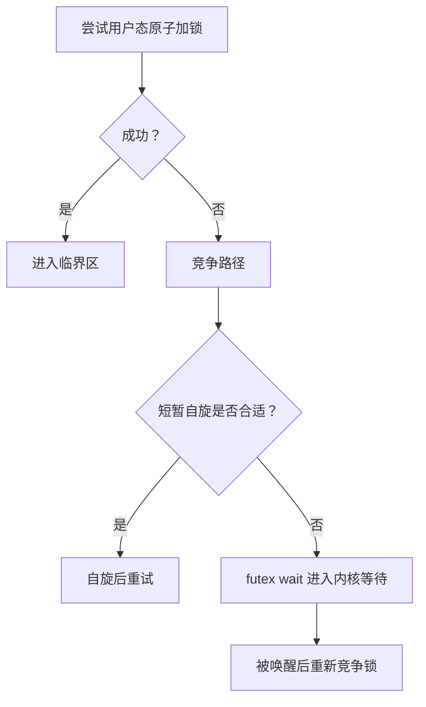

`futex` 的核心价值是：

> 内核只负责等待和唤醒；无竞争状态变化尽量由用户态完成。

真实 `pthread_mutex` 实现远比下面的概念模型复杂，通常会维护未锁定、已锁定、存在等待者等状态，还可能支持：

- 自适应自旋；
- 错误检查；
- 递归锁；
- robust mutex；
- 优先级继承；
- 所有者死亡处理。

不应把简单的 `CAS + futex_wait` 伪代码直接当作可用互斥锁实现，否则可能产生丢失唤醒、ABA、所有权和内存序错误。

### 5.3 为什么睡眠和唤醒需要内核？

用户态可以通过原子指令修改锁字，但只有内核能够：

- 把线程从可运行状态转为睡眠；
- 将线程挂到等待队列；
- 让出 CPU 并选择其他任务；
- 在事件发生后重新唤醒线程；
- 处理超时、信号和优先级关系。

因此：

```text
锁状态快速变化：通常可在用户态完成
线程睡眠、唤醒和调度：需要内核参与
```

## 6. 自旋锁 Spin Lock

自旋锁在获取失败时反复检查锁状态，而不是主动睡眠。

特点：

- 避免主动阻塞和唤醒路径；
- 等待期间持续消耗 CPU；
- 等待线程仍可能被操作系统抢占，所以不能说“绝不会发生上下文切换”；
- 适合锁持有时间极短且 CPU 不过度订阅的场景；
- 锁持有期间绝不能执行可能长期阻塞的操作。

不适合：

- 长临界区；
- 高竞争；
- 单核用户态程序；
- 线程数明显超过 CPU 数；
- 锁持有者可能被抢占或等待 I/O。

用户态自旋锁和内核自旋锁也不能简单等同。内核自旋锁常与关闭抢占、屏蔽中断等规则配合，具体语义依内核上下文而异。

## 7. 读写锁

读写锁允许：

- 多个读者同时持有读锁；
- 写者独占；
- 读写互斥。

适合读操作明显多于写操作、且读临界区足够长的场景。

需要注意：

- 读写锁自身维护状态的成本可能高于普通互斥锁；
- 高频短读操作未必受益；
- 公平性取决于实现；
- 读者优先可能使写者饥饿；
- 写者优先可能降低读吞吐；
- 锁升级和降级如果接口不明确，容易死锁。

## 8. 条件变量

条件变量用于让线程等待某个由共享状态表示的条件。

条件变量本身不保存业务条件。业务条件必须由受同一互斥锁保护的状态变量表示。

典型 C++ 用法：

```cpp
#include <condition_variable>
#include <iostream>
#include <mutex>
#include <thread>

std::mutex mutex;
std::condition_variable condition;
bool ready = false;

void worker() {
    std::unique_lock<std::mutex> lock(mutex);

    condition.wait(lock, [] {
        return ready;
    });

    // wait 返回时已经重新获得 mutex，并且谓词为 true。
    std::cout << "condition satisfied\n";
}

int main() {
    std::thread thread(worker);

    {
        std::lock_guard<std::mutex> lock(mutex);
        ready = true;
    }

    condition.notify_one();
    thread.join();
}
```

`wait(lock, predicate)` 等价于反复检查：

```cpp
while (!predicate()) {
    wait(lock);
}
```

必须循环检查的原因包括：

- 虚假唤醒；
- 多个等待者竞争同一资源；
- 线程被唤醒后，在重新获得锁之前条件又发生变化。

`wait()` 会把“释放互斥锁并加入等待”作为与通知协议协调的操作，避免在正确使用同一互斥锁时出现检查条件后、正式睡眠前的丢失唤醒窗口。

通常先在锁内修改条件，再解锁并通知，可以减少被唤醒线程立刻阻塞在互斥锁上的概率。但通知在锁内还是锁外并非一条对所有实现都绝对最优的规则，应以正确性和具体性能为准。

## 9. 信号量与互斥锁

| 对比点 | 互斥锁 | 信号量 |
|---|---|---|
| 状态 | 锁定/未锁定及实现附加状态 | 非负计数 |
| 所有者 | 通常有 | 通常没有 |
| 释放者 | 通常要求持有者解锁 | 可以由其他执行流发布 |
| 主要用途 | 保护共享不变量 | 资源计数、同步和限流 |
| 常见场景 | 临界区保护 | 连接池、生产者消费者、并发上限 |

二值信号量的计数范围可以是 0/1，但它仍不自动获得互斥锁的所有者检查、优先级继承和错误诊断语义。

## 10. 原子操作与内存序

原子操作用于对单个原子对象进行不可分割的访问。它们不等于“自动解决所有线程安全问题”。

```cpp
#include <atomic>

int data = 0;
std::atomic<bool> ready{false};

void producer() {
    data = 42;
    ready.store(true, std::memory_order_release);
}

void consumer() {
    if (ready.load(std::memory_order_acquire)) {
        // acquire 观察到 release 后，data = 42 对当前线程可见。
        use(data);
    }
}
```

这里：

- `ready` 是原子变量；
- `release` 与读取到该值的 `acquire` 建立同步关系；
- `data` 虽然不是原子变量，但只有生产者写，消费者在同步完成后读，因此没有数据竞争。

如果 `ready` 也是普通 `bool`，代码会产生数据竞争和未定义行为，不能只解释为“CPU 重排序”。

常见内存序：

- `relaxed`：只保证该原子对象的原子性；
- `acquire`：阻止后续操作越过成功的获取；
- `release`：阻止先前操作越过发布；
- `acq_rel`：用于读改写；
- `seq_cst`：提供更强的全局顺序约束。

内存序应从 happens-before 和共享不变量出发选择，而不是只根据“哪个更快”选择。

## 11. 无锁不等于无等待

并发算法常见进展保证：

- **blocking**：某线程暂停可能阻塞其他线程；
- **lock-free**：系统整体持续取得进展，但单个线程可能长期失败；
- **wait-free**：每个线程都能在有限步内完成；
- **obstruction-free**：单独运行时可以完成。

无锁算法仍可能因 CAS 重试、缓存行争用和内存回收而变慢，也更容易出现 ABA、悬空指针和复杂内存序问题。

# 五、死锁

## 1. 什么是死锁？

死锁是多个执行流形成永久等待关系，每个参与者都在等待其他参与者持有或才能产生的资源，导致所有参与者都无法继续。


死锁不仅发生在互斥锁之间，还可能涉及：

- 文件锁；
- 信号量；
- 线程 `join()`；
- 条件变量协议；
- I/O 与回调；
- 数据库事务；
- RPC 调用链；
- 线程池任务互相等待。

## 2. Coffman 四个必要条件

经典资源死锁需要同时满足：

1. **互斥**：资源不能被多个参与者以当前方式同时使用。
2. **占有且等待**：参与者持有部分资源，同时等待其他资源。
3. **不可剥夺**：资源不能被系统安全地强制回收。
4. **循环等待**：形成闭环等待关系。

破坏任一必要条件可以预防这类死锁，但代价可能是并发度下降、资源浪费或实现复杂度增加。

## 3. 死锁预防

### 3.1 固定加锁顺序

给锁建立全局顺序，所有线程按同一顺序获取：

```text
Lock A → Lock B → Lock C
```

禁止出现相反顺序，是工程中最常用的方法之一。

C++ 中同时获取多把锁时，可以使用：

```cpp
std::scoped_lock lock(mutex_a, mutex_b);
```

标准库会使用避免简单循环等待的加锁策略，但仍要求程序整体不存在其他协议死锁。

### 3.2 不在持锁期间调用不可控代码

持锁时避免：

- 阻塞 I/O；
- 用户回调；
- 虚函数或插件代码；
- 跨服务 RPC；
- 等待线程退出；
- 再次进入可能获取同一组锁的复杂函数。

这些操作会扩大锁依赖图，使死锁更难分析。

### 3.3 缩小锁范围和资源依赖

- 减少同时持有多把锁；
- 在加锁前准备不需要保护的数据；
- 使用分片锁；
- 用消息传递替代共享状态；
- 使用不可变对象或版本化数据。

### 3.4 一次性获取资源

一次申请所有资源可以破坏“占有且等待”，但会降低利用率，而且资源集合可能无法提前确定。

## 4. 死锁避免

死锁避免在每次分配资源前判断分配后是否仍处于安全状态。

银行家算法是经典示例：

> 只有在系统仍存在一个能让所有参与者最终完成的安全序列时，才批准当前资源请求。

它需要事先知道最大资源需求，因此更适合理论模型或资源需求明确的系统，不常直接用于普通锁管理。

## 5. 死锁检测

### 5.1 等待图

可以建立：

```text
线程/事务 → 正在等待的资源或持有者
```

若资源只有单实例，等待图中的环通常可直接说明死锁。

当资源存在多个实例时，仅发现环并不总是死锁的充分条件，需要结合可用数量和剩余需求进一步判断。

### 5.2 常见工具

C/C++：

```bash
gdb -p <pid>
thread apply all bt
pstack <pid>
```

Linux 锁与调度：

```bash
perf lock record ./app
perf lock report
perf sched timehist
```

Java：

```bash
jstack <pid>
```

数据库通常提供事务锁等待图和死锁日志。

## 6. 超时不是“强制释放别人的锁”

常见策略是：

- 使用 `try_lock` 或 timed lock；
- 请求超时后放弃当前操作；
- 取消事务并回滚；
- 释放自己已经安全持有的资源；
- 重试并加入随机退避。

不能由任意线程在超时后直接解锁另一线程持有的普通互斥锁，这通常违反所有者语义并破坏共享不变量。

## 7. 死锁恢复

检测到死锁后，可能采取：

- 终止或取消一个参与者；
- 回滚事务；
- 重启子系统或进程；
- 由支持抢占的资源管理器回收资源；
- 人工干预。

恢复策略要考虑：

- 已完成工作的代价；
- 数据一致性；
- 受害者选择；
- 是否会重复选择同一任务造成饥饿；
- 外部副作用能否回滚。

## 8. 死锁、活锁和饥饿

- **死锁**：参与者都无法继续。
- **活锁**：参与者不断改变状态、主动让步或重试，但没有有效进展。
- **饥饿**：某个任务长期得不到资源，其他任务仍在推进。

加锁顺序主要防死锁；公平锁、排队、退避和配额等机制则可能用于缓解饥饿和活锁。

# 六、内存管理

## 1. 操作系统为什么需要内存管理？

内存管理需要同时解决：

- 地址空间隔离；
- 访问权限保护；
- 虚拟地址到物理地址的转换；
- 物理页分配与回收；
- 文件映射和共享内存；
- 按需分配与页面回收；
- 页缓存、写回和交换；
- NUMA、Huge Page 等性能问题。

虚拟内存不仅是“让程序使用比物理内存更大的空间”，更重要的是提供统一的地址抽象、保护边界和灵活映射。

## 2. 虚拟地址与物理地址

### 2.1 虚拟地址

用户程序中的指针通常表示虚拟地址。虚拟地址由当前地址空间、页表和访问权限共同解释。

相同虚拟地址在不同进程中可以：

- 映射到不同物理页；
- 映射到同一共享物理页；
- 在一个进程中合法、另一个进程中非法。

### 2.2 物理地址

物理地址是处理器和内存系统用于访问物理地址空间的地址。该地址空间不仅可能包含 RAM，还可能包含 MMIO 等设备映射区域。

用户态程序通常不能直接操作任意物理地址。

### 2.3 地址转换

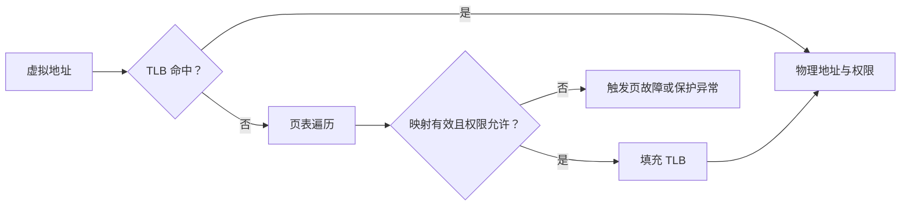

地址转换由 MMU、TLB、页表和操作系统共同完成。不同架构可能使用硬件页表遍历，也可能由软件参与处理 TLB miss。

## 3. 虚拟地址空间的作用

### 3.1 隔离

每个进程拥有自己的地址空间视图，普通错误指针通常不能直接访问另一个进程的私有内存。

### 3.2 保护

页表项可以限制：

- 用户态或内核态访问；
- 读、写和执行权限；
- 内存类型和缓存属性。

W^X、NX 等机制建立在这些权限之上。

### 3.3 按需分配

`malloc()` 返回地址不等于对应物理页已经全部分配。匿名映射可在首次访问时通过页故障分配物理页。

### 3.4 共享

多个地址空间可以把不同虚拟地址映射到同一组物理页，用于：

- 共享库；
- 共享内存；
- 文件页缓存；
- `fork()` 后的写时复制。

### 3.5 文件映射

文件内容可以映射进地址空间，进程通过普通内存访问触发页面装入、脏页跟踪和写回。

## 4. 分页

分页把虚拟地址空间划分为固定大小的虚拟页，把物理内存划分为页框。

```text
虚拟地址 = 虚拟页号 VPN + 页内偏移
物理地址 = 物理页框号 PFN + 页内偏移
```

优点：

- 基础页粒度下便于非连续物理内存分配；
- 支持按页保护和共享；
- 支持按需分页；
- 不需要为整个对象寻找同等大小的连续物理区域。

需要限定：

> “分页没有外部碎片”是教材对固定大小基础页分配的简化。物理内存仍可能因高阶连续页、大页和 DMA 连续内存需求产生碎片问题。

缺点：

- 页表占用内存；
- 地址转换有额外成本；
- 页内未使用空间形成内部碎片；
- 页故障可能产生高延迟。

## 5. 分段与现代系统中的“段”

经典硬件分段按照逻辑段保存基址、界限和权限：

```text
逻辑地址 = 段选择子 + 段内偏移
```

优点是逻辑组织和保护自然，缺点是可变长度段容易产生外部碎片。

现代 64 位通用操作系统通常以分页为主要隔离和映射机制。以 x86-64 为例，用户态通常使用近似平坦的段模型，分页承担主要地址转换工作。

因此需要区分：

- **硬件分段机制**；
- ELF 中的 Program Segment；
- 链接器中的代码段、数据段；
- Linux 中的 VMA；
- 人们口语中的“堆段、栈段”。

这些概念相关但不完全等价。代码区、堆和栈在现代 Linux 上主要表现为不同的虚拟内存映射区域，不代表系统仍使用经典可变长度硬件分段管理它们。

## 6. 分页和经典分段对比

| 对比点 | 分页 | 经典分段 |
|---|---|---|
| 划分粒度 | 固定大小页 | 可变大小逻辑段 |
| 地址形式 | 页号 + 页内偏移 | 段号 + 段内偏移 |
| 主要视角 | 地址转换与物理内存管理 | 程序逻辑结构 |
| 典型碎片 | 内部碎片 | 外部碎片 |
| 现代通用系统地位 | 主要机制 | 多数系统中弱化或采用平坦模型 |

## 7. 页表和页表项

页表描述虚拟页的映射和属性。典型页表项可能包含：

- 物理页框号；
- 是否存在或有效；
- 可读、可写、可执行权限；
- 用户/内核访问权限；
- Accessed/Referenced 位；
- Dirty 位；
- 大页标志；
- 内存类型和缓存属性；
- 操作系统自定义的软件位。

具体位布局由架构决定。对于不在内存中的页，操作系统还可能把交换位置或其他软件状态编码在非 present 页表项中。

“Present”与“页面是否在 RAM 中”也不能在所有架构和所有软件状态下机械等同，应结合内核页表语义理解。

## 8. 多级页表

单级页表需要为整个虚拟地址空间预留大量页表项。多级页表把页表本身也分页，仅为实际使用的地址范围分配下级页表。

优点：

- 适合稀疏地址空间；
- 减少页表内存；
- 可在中间层直接映射大页。

代价：

- TLB miss 时页表遍历可能访问多级内存；
- 页表页本身也占用物理内存和缓存；
- 修改映射时需要 TLB shootdown 等跨 CPU 协调。

## 9. TLB

TLB 是处理器中的地址转换缓存，通常同时缓存：

- 虚拟页到物理页框的转换；
- 访问权限；
- 页大小和部分内存属性。

### 9.1 TLB miss 不等于 page fault

- **TLB miss**：TLB 中没有缓存，可能通过页表遍历找到有效映射。
- **Page fault**：页表状态或权限要求内核处理，例如未映射、COW 或权限错误。

### 9.2 地址空间切换

不同进程的相同虚拟地址可能含义不同。处理器可以：

- 切换页表根；
- 刷新相关 TLB 项；
- 使用 ASID、PCID 等标识为不同地址空间保留 TLB 项。

ASID/PCID 数量有限，操作系统需要管理分配、复用和代际，复用时可能执行定向或全局失效。

### 9.3 TLB shootdown

一个 CPU 修改了可能被其他 CPU 缓存的页表映射时，需要通知相关 CPU 失效对应 TLB 项。这个跨核协调称为 TLB shootdown，可能成为频繁映射修改、`mprotect()` 或大规模内存回收的性能成本。

# 七、虚拟内存与页故障

## 1. 什么是虚拟内存？

虚拟内存是由硬件和操作系统共同提供的地址空间抽象。它让程序以虚拟地址访问内存，并支持：

- 隔离和权限保护；
- 按需分配；
- 非连续物理内存映射；
- 文件映射；
- 共享内存；
- 写时复制；
- 页面回收和交换。

虚拟内存不要求系统一定配置 swap，也不意味着程序可以无条件使用无限内存。提交限制、cgroup 限制、地址空间大小和 OOM 策略仍然存在。

## 2. “缺页中断”还是“页故障”？

更准确的术语是 **page fault，页故障或缺页异常**。它是处理器在执行指令时产生的同步异常，不是外部设备随机触发的硬件中断。

页故障不仅表示“页面不在物理内存中”，还可能由以下情况触发：

- 页面尚未映射；
- 首次访问匿名映射；
- 文件页尚未建立当前进程映射；
- 写时复制；
- 访问权限不允许；
- 栈按需增长；
- `userfaultfd` 等用户态缺页处理；
- 对被截断文件映射的非法访问。

## 3. 页故障处理流程

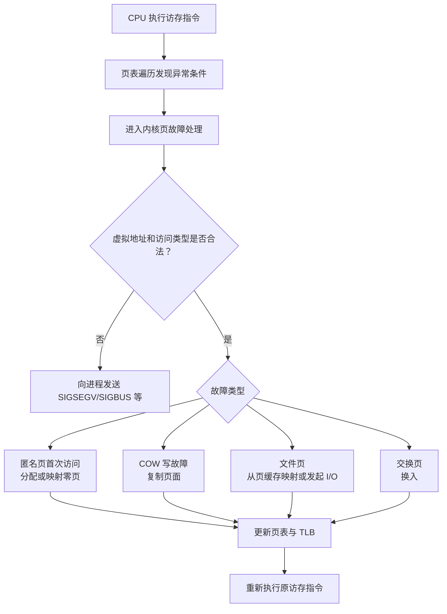

并非每次合法页故障都需要：

- 寻找空闲页；
- 淘汰页面；
- 从磁盘读取。

例如：

- 文件页已经在 page cache 中；
- COW 页已经在内存中；
- 匿名页首次读可能映射共享零页；
- 只需建立当前进程的页表映射。

## 4. Minor Fault 与 Major Fault

### 4.1 Minor Page Fault

处理故障不需要等待存储 I/O，例如：

- 文件页已在 page cache 中；
- COW 复制内存页；
- 匿名页首次实际分配；
- 只需补建页表。

Minor 不代表没有成本。分配页面、清零、复制 4 KiB 数据和更新页表都可能消耗 CPU。

### 4.2 Major Page Fault

处理故障需要等待 I/O，例如从：

- 块设备；
- 交换区；
- 网络文件系统；
- 其他后备存储

读入数据。Major fault 往往延迟明显更高。

## 5. 页面回收与置换

操作系统在内存压力下需要回收：

- 干净文件页：通常可直接丢弃，未来再从文件读取；
- 脏文件页：通常要先写回；
- 匿名页：若需要保留且配置了 swap，通常要换出；
- 可重新生成的缓存；
- 不可移动或被固定的页面通常难以回收。

下面的 OPT、FIFO、LRU、Clock、LFU 是教材算法，用于理解置换思想，不应直接宣称某个现代 Linux 版本完整采用其中某一个算法。生产内核通常使用复杂的 LRU 近似、活跃度跟踪、工作集检测、回收优先级和可选的多代 LRU 等机制。

### 5.1 OPT

淘汰未来最长时间不会再访问的页面。

它需要预知未来访问序列，无法在线实现，主要作为理论最优基准。

### 5.2 FIFO

淘汰最早进入内存的页面。

实现简单，但不反映访问热度，并可能出现 Belady 异常：增加页框后，缺页次数反而增加。

### 5.3 LRU

淘汰最长时间未访问的页面。

符合时间局部性，但精确维护全局访问顺序成本很高，实际系统一般使用近似方法。

### 5.4 Clock/Second Chance

使用访问位近似 LRU：

1. 指针循环扫描；
2. 访问位为 1 时清零并跳过；
3. 访问位为 0 时作为候选。

它是经典近似思想，不代表所有系统的完整回收实现。

### 5.5 LFU

淘汰历史访问次数最少的页面。

问题是旧热点可能长期保留，因此通常需要时间衰减或分代统计。

## 6. 内存抖动 Thrashing

内存抖动表示工作集明显超过可用内存，系统频繁回收、换入、换出或重新读取页面，CPU 和设备时间主要消耗在内存管理而非业务计算。

常见现象：

- major fault 增加；
- swap in/out 持续；
- I/O wait 升高；
- 运行队列和 direct reclaim 延迟异常；
- 吞吐下降，尾延迟激增。

常见原因：

- 并发工作集过大；
- 容器或进程内存限制过紧；
- 内存泄漏或缓存失控；
- 访问局部性差；
- 随机访问大于内存的数据集；
- 过度提交。

处理方向：

- 降低并发和工作集；
- 增加内存或调整 cgroup 限制；
- 修复泄漏和无界缓存；
- 改善数据布局与局部性；
- 使用流式、分块或外存算法；
- 观察而不是盲目扩大 swap，因为 swap 只能缓解部分压力，不能消除持续超量工作集。

# 八、文件系统

## 1. 文件系统的作用

文件系统提供：

- 文件和目录命名；
- 元数据与权限；
- 数据块分配；
- 持久化和崩溃恢复；
- 缓存与写回；
- 挂载和命名空间；
- 文件操作接口。

Linux 通过 VFS 为 ext4、XFS、Btrfs、tmpfs、NFS 等不同文件系统提供统一接口。

## 2. VFS 中几个容易混淆的对象

### 2.1 inode

inode 表示文件系统对象的元数据和数据定位信息，通常包括：

- 文件类型；
- 权限和所有者；
- 大小；
- 时间戳；
- 硬链接计数；
- 数据块或 extent 信息；
- 扩展属性等。

inode 不保存某个目录中的文件名。

### 2.2 dentry

目录项 dentry 表示“名称到 inode”的解析关系，并参与路径查找缓存：

```text
父目录 + 文件名 → dentry → inode
```

同一个 inode 可以对应多个 dentry，即多个硬链接名称。

### 2.3 open file description

`open()` 后，内核会建立或引用一个打开文件描述对象，其中通常保存：

- 当前文件偏移；
- 文件状态标志；
- 对 inode/文件对象的引用。

进程文件描述符表中的整数 fd 指向这个打开文件描述。`dup()` 和 `fork()` 后的多个 fd 可能引用同一个打开文件描述，因此共享文件偏移和状态标志。

## 3. 硬链接

硬链接是多个目录项指向同一个 inode。

特点：

- 共享文件数据和 inode 元数据；
- 不能跨文件系统；
- 普通用户通常不能为目录创建硬链接；
- 删除一个名称只减少链接计数；
- 文件数据通常在链接计数为 0 且没有任何打开文件引用后才真正释放。

因此，文件被 `unlink()` 后，已打开的 fd 仍然可以继续访问它，直到最后一个引用关闭。

## 4. 符号链接

符号链接是有自己 inode 的特殊文件，其内容保存目标路径。

特点：

- 可以跨文件系统；
- 可以指向目录；
- 目标路径可以是绝对路径或相对路径；
- 目标被删除或路径变化后可能成为悬空链接；
- 访问时路径解析会继续跟随目标，需注意循环链接和安全检查。

## 5. 硬链接和符号链接对比

| 对比点 | 硬链接 | 符号链接 |
|---|---|---|
| inode | 与目标名称指向同一 inode | 自己拥有 inode |
| 保存内容 | 目录项直接指向 inode | 保存目标路径 |
| 跨文件系统 | 不可以 | 可以 |
| 链接目录 | 通常受禁止 | 可以 |
| 原名称删除 | 只要仍有链接或打开引用，数据可继续存在 | 可能变成悬空链接 |
| 路径解析 | 直接得到同一 inode | 需要继续解析目标路径 |

## 6. 页缓存、缓冲与持久化

普通文件 I/O 通常经过 page cache：

```text
应用 read/write
      ↓
Page Cache
      ↓
文件系统与块层
      ↓
存储设备
```

`write()` 成功通常表示数据已经进入内核并被当前文件语义接受，不一定已经落到非易失介质。

常见持久化接口：

- `fsync(fd)`：同步文件数据及必要元数据；
- `fdatasync(fd)`：重点同步数据和必要元数据；
- `syncfs(fd)`：同步对应文件系统；
- `O_SYNC/O_DSYNC`：改变写入完成语义。

即使调用 `fsync()`，最终持久性仍受文件系统、设备写缓存、电源保护和硬件实现影响。数据库还需要正确处理目录项持久化、日志顺序和原子重命名协议。

# 九、I/O 模型

## 1. 一次读取通常包含哪些阶段？

以网络读取为例，可以抽象为：

1. **等待可读条件**：数据到达 Socket 接收缓冲区，或出现 EOF、错误等可读状态。
2. **完成读取操作**：应用调用读取接口，内核把可用数据交付给应用缓冲区，或者返回状态。


对于文件 I/O，数据可能来自 page cache，也可能需要设备 I/O。不同设备、Direct I/O、`mmap`、零拷贝和注册缓冲区的路径并不完全相同。

## 2. 阻塞 I/O

阻塞文件描述符上的 `read()`：

1. 若当前无法完成，调用线程可能睡眠；
2. 数据、EOF、错误、信号或超时出现后，线程被唤醒；
3. 系统调用完成并返回。

```text
read()
  ├─ 当前有数据 → 读取并返回
  └─ 当前无数据 → 线程睡眠 → 条件满足 → 返回
```

优点：

- 控制流直观；
- 适合连接数量较少或使用线程池的程序。

缺点：

- 一个连接一个线程时，空闲连接仍占用线程和栈；
- 大量线程会增加调度、内存和同步成本；
- 某个慢操作可能长期占用工作线程。

## 3. 非阻塞 I/O

文件描述符设置 `O_NONBLOCK` 后，操作不能立即完成时通常返回：

```text
-1，errno = EAGAIN 或 EWOULDBLOCK
```

非阻塞并不要求应用不停忙轮询。更常见做法是结合 `select`、`poll`、`epoll` 等就绪通知机制：

```text
等待就绪事件 → 对就绪 fd 执行非阻塞 read/write → 直到暂时不能继续
```

需要处理：

- 部分读取；
- 部分写入；
- `EINTR`；
- `EAGAIN/EWOULDBLOCK`；
- EOF；
- 连接错误；
- 输出缓冲与背压。

## 4. I/O 多路复用

I/O 多路复用让一个线程等待多个文件描述符的就绪状态。

典型接口：

- `select`；
- `poll`；
- `epoll`；
- BSD/macOS 的 `kqueue`；
- Windows 的相关事件接口。

基本流程：

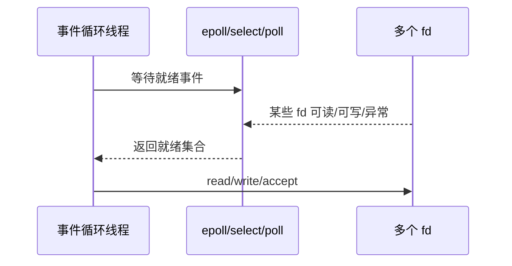

它通常被归类为同步 I/O，因为：

- 多路复用接口通知的是“可以尝试 I/O”；
- 应用之后仍调用 `read()`、`write()`、`accept()` 等同步系统调用；
- 当这些调用返回时，本次同步操作已经完成或返回当前状态。

`epoll_wait()` 本身可能阻塞，但“阻塞等待就绪”和“异步完成 I/O”是不同维度。

## 5. 信号驱动 I/O

信号驱动 I/O 允许内核在 fd 状态变化时发送 `SIGIO` 等信号。

特点：

- 通知是异步到达的；
- 信号处理和状态管理复杂；
- 普通信号存在合并语义；
- 仍常需要在通知后调用同步读取接口；
- 在通用高并发网络服务中通常不如 epoll 常见。

它一般被放入“同步 I/O 模型”一侧，因为信号多是就绪通知，而不是完整 I/O 完成通知。

## 6. 异步 I/O

异步 I/O 的核心语义是：

1. 应用提交一个操作；
2. 提交接口在操作完成前返回；
3. 内核或运行时继续推进操作；
4. 操作完成后，通过回调、信号、Future 或完成队列通知应用。

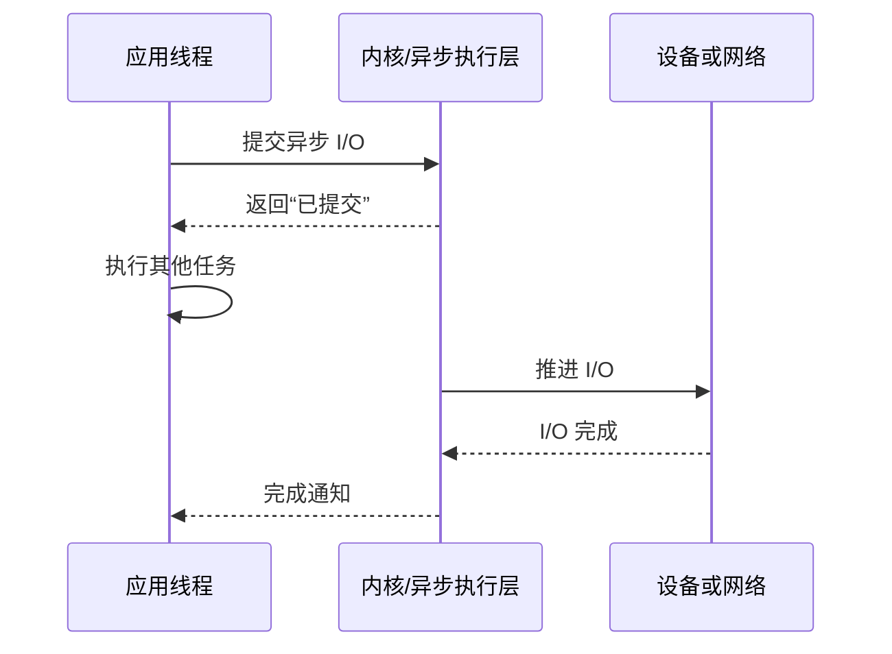

这里不应简单概括为“用户线程复制数据还是内核复制数据”。同步 `read()` 中，复制也是内核代表调用线程执行的；异步 I/O 还可能使用 Direct I/O、固定缓冲区或零拷贝路径。

更准确的区别是：

> 同步接口返回时，本次操作已经完成到接口所定义的完成点；异步提交接口可以在操作完成前返回，结果随后通过独立完成机制交付。

## 7. 同步、异步、阻塞、非阻塞对比

| 维度 | 问题 |
|---|---|
| 阻塞/非阻塞 | 当前调用暂时不能完成时，调用线程是否睡眠等待？ |
| 同步/异步 | 操作是否在提交调用返回前完成，还是之后通过独立机制报告完成？ |

可能的组合：

- 阻塞同步：普通阻塞 `read()`；
- 非阻塞同步：`O_NONBLOCK` 的 `read()`；
- 阻塞等待异步完成：提交异步请求后调用阻塞式完成队列等待；
- 非阻塞异步：提交请求后以轮询、回调或非阻塞完成队列取得结果。

## 8. I/O“就绪”与“完成”

**就绪通知 Readiness**：

```text
fd 当前可能可以进行 read/write
```

典型：`select`、`poll`、`epoll`。

**完成通知 Completion**：

```text
先前提交的具体 I/O 操作已经完成
```

典型：IOCP、部分 AIO、`io_uring` 完成队列。

需要注意：

- 就绪不保证无限量 I/O 都不阻塞；
- 多线程竞争同一 fd 时，就绪状态可能被其他线程消费；
- 完成事件也可能表示部分完成或错误；
- 异步操作期间，缓冲区和请求上下文必须保持有效。

# 十、select、poll、epoll

## 1. select

`select()` 接收多个 fd 集合，并返回其中当前就绪的 fd。

特点：

- 使用 `fd_set` 位图；
- 监听的 fd 数值必须小于 `FD_SETSIZE`，Linux/glibc 中通常是 1024；
- 限制针对 **fd 的数值**，不只是集合里有多少个 fd；
- 每次调用都要把 fd 集合传入内核；
- 内核和用户态都需要按范围扫描；
- 返回后会修改传入的集合，下一轮必须重建；
- 超时结构也可能被修改，不能盲目复用。

修正后的简单示例：

```cpp
#include <cerrno>
#include <cstdio>
#include <iostream>

#include <sys/select.h>
#include <unistd.h>

int main() {
    while (true) {
        fd_set read_set;
        FD_ZERO(&read_set);
        FD_SET(STDIN_FILENO, &read_set);

        int result;

        do {
            result = ::select(
                STDIN_FILENO + 1,
                &read_set,
                nullptr,
                nullptr,
                nullptr
            );
        } while (result == -1 && errno == EINTR);

        if (result == -1) {
            std::perror("select");
            return 1;
        }

        if (FD_ISSET(STDIN_FILENO, &read_set)) {
            char buffer[128];
            const ssize_t n = ::read(
                STDIN_FILENO,
                buffer,
                sizeof(buffer)
            );

            if (n > 0) {
                std::cout.write(buffer, n);
            } else if (n == 0) {
                break;
            } else if (errno != EINTR) {
                std::perror("read");
                return 1;
            }
        }
    }
}
```

不能直接把未补 `'\0'` 的 `read()` 缓冲区作为 C 字符串输出，因此示例使用 `std::cout.write()` 按实际长度输出。

## 2. poll

`poll()` 使用 `pollfd` 数组描述监听集合。

特点：

- 没有 `select()` 那种由 `FD_SETSIZE` 造成的固定 fd 数值上限；
- 实际规模仍受 `RLIMIT_NOFILE`、内存和系统资源限制；
- 每次调用都要传入整个数组；
- 内核通常需要遍历数组；
- 返回后应用仍需检查各元素的 `revents`；
- `events` 是输入，`revents` 是输出。

```cpp
#include <cerrno>
#include <cstdio>
#include <iostream>

#include <poll.h>
#include <unistd.h>

int main() {
    pollfd descriptor{};
    descriptor.fd = STDIN_FILENO;
    descriptor.events = POLLIN;

    while (true) {
        int result;

        do {
            result = ::poll(&descriptor, 1, -1);
        } while (result == -1 && errno == EINTR);

        if (result == -1) {
            std::perror("poll");
            return 1;
        }

        if (descriptor.revents & (POLLERR | POLLNVAL)) {
            std::cerr << "poll error\n";
            return 1;
        }

        if (descriptor.revents & (POLLIN | POLLHUP)) {
            char buffer[128];
            const ssize_t n = ::read(
                STDIN_FILENO,
                buffer,
                sizeof(buffer)
            );

            if (n > 0) {
                std::cout.write(buffer, n);
            } else if (n == 0) {
                break;
            } else if (errno != EINTR) {
                std::perror("read");
                return 1;
            }
        }
    }
}
```

## 3. epoll

epoll 是 Linux 的 I/O 事件通知接口。一个 epoll 实例从用户态角度可理解为包含：

- **interest list**：应用注册关注的 fd 及事件；
- **ready list**：当前已就绪对象的引用集合。

主要接口：

```c
epoll_create1()
epoll_ctl()
epoll_wait()
```

### 3.1 创建 epoll 实例

```cpp
int epfd = epoll_create1(EPOLL_CLOEXEC);
```

`epoll_create1()` 中的 `1` 只是函数名称的一部分。相较旧接口 `epoll_create()`，它增加了 `flags` 参数；不能解释为“第 1 版”或“因为性能提升 1 级”。

### 3.2 注册事件

```cpp
epoll_event event{};
event.events = EPOLLIN;
event.data.fd = fd;

epoll_ctl(epfd, EPOLL_CTL_ADD, fd, &event);
```

常用操作：

- `EPOLL_CTL_ADD`；
- `EPOLL_CTL_MOD`；
- `EPOLL_CTL_DEL`。

注册关系保存在内核 epoll 实例中，因此每次 `epoll_wait()` 不需要重新提交完整监听集合。但：

- `epoll_ctl()` 本身有系统调用和内核数据结构更新成本；
- `epoll_wait()` 仍要把返回事件复制到用户数组；
- epoll 并不意味着所有操作都是 O(1)；
- epoll 主要适合可轮询的 fd，普通磁盘文件通常不能像 Socket 一样注册，可能得到 `EPERM`。

### 3.3 等待事件

```cpp
epoll_event events[64];

int n = epoll_wait(
    epfd,
    events,
    64,
    -1
);
```

返回值：

- `> 0`：返回的事件数量；
- `0`：超时；
- `-1`：失败，例如被信号中断时 `errno == EINTR`。

应用只遍历本次返回的 `n` 个事件，而不必扫描所有监听 fd。

## 4. 一个正确的非阻塞 epoll 读取服务器骨架

下面的示例：

- 使用 `SOCK_NONBLOCK`；
- 循环 `accept4()` 直到 `EAGAIN`；
- 循环读取直到 `EAGAIN`；
- 正确处理 EOF 和错误；
- 只演示接收并输出数据，不实现 Echo 输出队列。

之所以不直接写成“收到后立即一次 `write()` 回去”，是因为非阻塞 Socket 的写入可能部分完成，正确服务器需要为每个连接维护输出缓冲，并在 `EPOLLOUT` 时继续发送。

```cpp
#include <arpa/inet.h>
#include <cerrno>
#include <cstdint>
#include <cstdio>
#include <cstdlib>
#include <iostream>

#include <sys/epoll.h>
#include <sys/socket.h>
#include <unistd.h>

namespace {

bool add_to_epoll(int epfd, int fd, std::uint32_t events) {
    epoll_event event{};
    event.events = events;
    event.data.fd = fd;

    return ::epoll_ctl(
        epfd,
        EPOLL_CTL_ADD,
        fd,
        &event
    ) == 0;
}

void close_connection(int epfd, int fd) {
    ::epoll_ctl(epfd, EPOLL_CTL_DEL, fd, nullptr);
    ::close(fd);
}

}  // namespace

int main() {
    const int listen_fd = ::socket(
        AF_INET,
        SOCK_STREAM | SOCK_NONBLOCK | SOCK_CLOEXEC,
        0
    );

    if (listen_fd == -1) {
        std::perror("socket");
        return 1;
    }

    int reuse = 1;
    if (::setsockopt(
            listen_fd,
            SOL_SOCKET,
            SO_REUSEADDR,
            &reuse,
            sizeof(reuse)
        ) == -1) {
        std::perror("setsockopt");
        ::close(listen_fd);
        return 1;
    }

    sockaddr_in address{};
    address.sin_family = AF_INET;
    address.sin_addr.s_addr = htonl(INADDR_ANY);
    address.sin_port = htons(8080);

    if (::bind(
            listen_fd,
            reinterpret_cast<const sockaddr*>(&address),
            sizeof(address)
        ) == -1) {
        std::perror("bind");
        ::close(listen_fd);
        return 1;
    }

    if (::listen(listen_fd, SOMAXCONN) == -1) {
        std::perror("listen");
        ::close(listen_fd);
        return 1;
    }

    const int epfd = ::epoll_create1(EPOLL_CLOEXEC);
    if (epfd == -1) {
        std::perror("epoll_create1");
        ::close(listen_fd);
        return 1;
    }

    /*
     * 使用 ET 是为了演示“处理到 EAGAIN”。
     * 生产代码也可以选择 LT，ET 并不天然保证更快。
     */
    if (!add_to_epoll(
            epfd,
            listen_fd,
            EPOLLIN | EPOLLET
        )) {
        std::perror("epoll_ctl listen");
        ::close(epfd);
        ::close(listen_fd);
        return 1;
    }

    epoll_event ready[64];

    while (true) {
        int count;

        do {
            count = ::epoll_wait(epfd, ready, 64, -1);
        } while (count == -1 && errno == EINTR);

        if (count == -1) {
            std::perror("epoll_wait");
            break;
        }

        for (int i = 0; i < count; ++i) {
            const int fd = ready[i].data.fd;
            const std::uint32_t events = ready[i].events;

            if (fd == listen_fd) {
                while (true) {
                    const int client_fd = ::accept4(
                        listen_fd,
                        nullptr,
                        nullptr,
                        SOCK_NONBLOCK | SOCK_CLOEXEC
                    );

                    if (client_fd >= 0) {
                        if (!add_to_epoll(
                                epfd,
                                client_fd,
                                EPOLLIN | EPOLLRDHUP | EPOLLET
                            )) {
                            std::perror("epoll_ctl client");
                            ::close(client_fd);
                        }
                        continue;
                    }

                    if (errno == EINTR) {
                        continue;
                    }

                    if (errno == EAGAIN || errno == EWOULDBLOCK) {
                        break;
                    }

                    std::perror("accept4");
                    break;
                }

                continue;
            }

            if (events & EPOLLERR) {
                close_connection(epfd, fd);
                continue;
            }

            bool closed = false;

            if (events & (EPOLLIN | EPOLLRDHUP | EPOLLHUP)) {
                while (true) {
                    char buffer[4096];
                    const ssize_t n = ::read(
                        fd,
                        buffer,
                        sizeof(buffer)
                    );

                    if (n > 0) {
                        std::cout.write(buffer, n);
                        continue;
                    }

                    if (n == 0) {
                        closed = true;
                        break;
                    }

                    if (errno == EINTR) {
                        continue;
                    }

                    if (errno == EAGAIN ||
                        errno == EWOULDBLOCK) {
                        break;
                    }

                    std::perror("read");
                    closed = true;
                    break;
                }
            }

            if (events & (EPOLLRDHUP | EPOLLHUP)) {
                closed = true;
            }

            if (closed) {
                close_connection(epfd, fd);
            }
        }
    }

    ::close(epfd);
    ::close(listen_fd);
    return 0;
}
```

## 5. epoll 为什么适合大量连接？

主要原因：

1. 监听集合由 epoll 实例持续维护，不必每次等待都重新提交整个 fd 集合；
2. 内核维护 ready list；
3. 应用主要遍历已经返回的事件；
4. 可配合非阻塞 I/O 和事件循环，用少量线程管理大量空闲连接。

epoll 的优势最明显于：

```text
监听 fd 很多，但每轮只有少量 fd 活跃
```

需要避免错误结论：

- epoll 不是所有负载都比 poll 快；
- 少量 fd 时差异可能很小；
- 所有连接同时活跃时，应用仍必须处理所有事件；
- `epoll_ctl`、唤醒、缓存和锁仍有成本；
- 业务处理慢时，换成 epoll 不能消除业务瓶颈。

## 6. LT 与 ET

### 6.1 LT：水平触发

默认模式。只要 fd 仍满足就绪条件，后续 `epoll_wait()` 仍可再次报告。

优点：

- 编程简单；
- 不要求一次处理到 `EAGAIN`；
- 更不容易因遗漏读取而永久丢失推进机会。

### 6.2 ET：边缘触发

使用 `EPOLLET`。主要在就绪状态发生变化时通知。

正确使用方式通常是：

1. fd 设置为非阻塞；
2. 收到事件后循环执行 `accept/read/write`；
3. 直到返回 `EAGAIN/EWOULDBLOCK`；
4. 再回到 `epoll_wait()`。

否则，缓冲区中即使仍有数据，也可能暂时得不到新的边缘通知。

### 6.3 ET 不等于一定性能更高

ET 可能减少重复就绪通知，但也增加：

- 状态机复杂度；
- 单连接一次处理过多导致其他连接饥饿的风险；
- 输出缓冲和部分写入处理难度；
- 漏读、漏写和边缘丢失类 bug。

选择 LT 还是 ET 应根据负载和实现能力，而不是把 ET 当成固定的“高级高性能模式”。

## 7. 常见事件语义

- `EPOLLIN`：可读，也可能是 EOF 到达；
- `EPOLLOUT`：当前发送缓冲区有空间，不代表一次可以写完所有数据；
- `EPOLLRDHUP`：对端关闭写方向；
- `EPOLLHUP`：挂起；
- `EPOLLERR`：错误，通常无须显式注册也会报告；
- `EPOLLONESHOT`：事件交付后临时禁用，需要 `MOD` 重新激活；
- `EPOLLEXCLUSIVE`：用于部分多等待者场景，降低惊群。

对 `EPOLLERR` 可使用 `getsockopt(fd, SOL_SOCKET, SO_ERROR, ...)` 取得具体 Socket 错误。

# 十一、Linux 常见进程机制

## 1. fork

`fork()` 创建一个新的子进程。

返回值：

- 父进程中返回子进程 PID；
- 子进程中返回 0；
- 失败时父进程返回 -1，不创建子进程。

父子进程在逻辑上拥有独立地址空间，但初始内容几乎相同。内核通常通过写时复制避免立即复制全部私有可写页面。

### 1.1 文件描述符继承

子进程获得父进程文件描述符表的副本。对应 fd 通常指向同一个 **open file description**：

```text
父进程 fd ─┐
           ├──> open file description ──> inode/socket/pipe
子进程 fd ─┘
```

因此父子进程通常共享：

- 文件偏移；
- open file status flags；
- 某些信号驱动 I/O 属性。

但每个进程拥有独立的 fd 表项，`FD_CLOEXEC` 等 descriptor flag 属于表项层面。

### 1.2 多线程程序中的 fork

多线程进程调用 `fork()` 后：

- 子进程只保留调用 `fork()` 的那个线程；
- 地址空间中却复制了其他线程可能正在修改的互斥锁、条件变量和运行时状态；
- 某把锁可能显示为已持有，但持锁线程并不存在于子进程中。

因此，多线程程序在子进程 `execve()` 之前，只应调用异步信号安全函数。复杂程序可使用：

- `pthread_atfork()`；
- `posix_spawn()`；
- 专门的进程创建线程；
- 立即 `execve()`。

## 2. 写时复制 COW

`fork()` 后，父子进程的私有可写映射通常暂时引用相同物理页，并通过页表权限阻止直接写入。

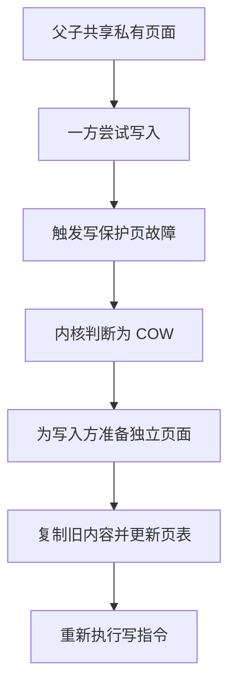

需要限定：

- 不是所有映射都会 COW；
- `MAP_SHARED` 映射本来就用于共享修改；
- 只读映射无需因普通读取复制；
- 内核可能使用更复杂的页面复用和大页拆分策略。

COW 使“fork 后立即 exec”较高效，但大型多线程进程执行 `fork()` 仍可能产生：

- 页表复制成本；
- 内存记账成本；
- 后续 COW fault；
- 大页拆分；
- 分配器锁状态问题。

## 3. exec

`exec` 通常指一组库接口，最终由 `execve()` 等系统调用把当前进程映像替换为新程序。

关键点：

- 不创建新 PID；
- 成功时不会返回原程序；
- 原代码、数据、堆、栈和大部分用户映射被替换；
- 标记为 `FD_CLOEXEC` 的 fd 会关闭，其他 fd 默认保留；
- 被捕获信号的处置通常重置为默认，忽略状态等属性按规则继承；
- 多线程进程中，成功 exec 后只剩调用线程形成的新程序；
- 当前工作目录、部分凭据、资源限制等进程属性按规则保留或变化。

典型 shell 流程：

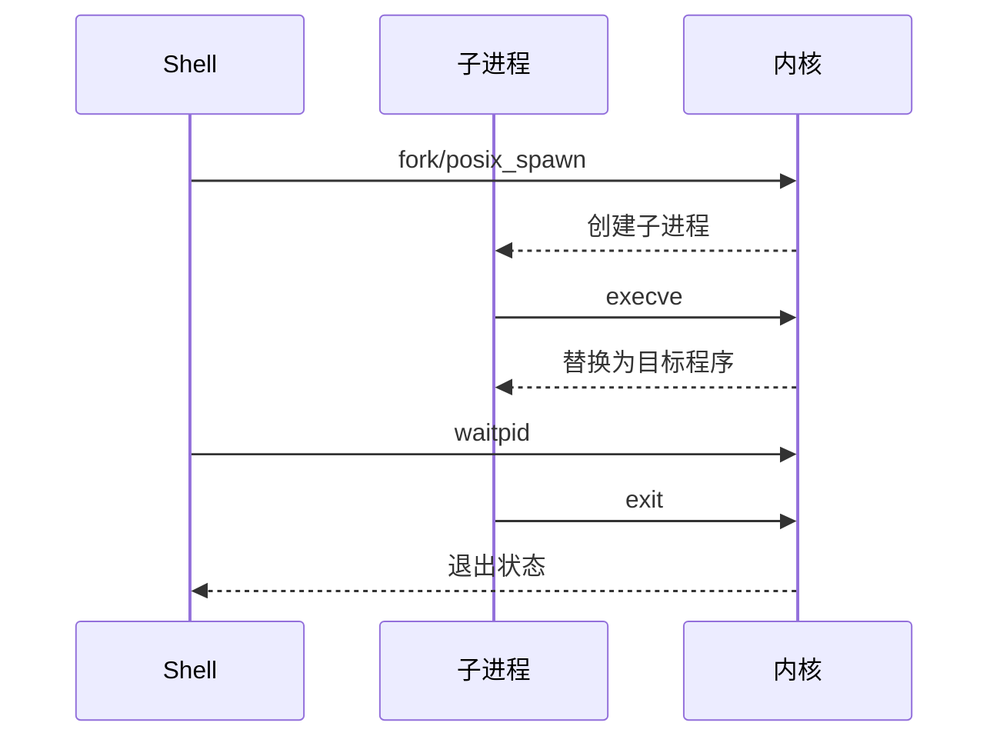

## 4. wait 和僵尸进程

父进程通过：

```c
wait()
waitpid()
waitid()
```

读取子进程状态并完成回收。

子进程退出后，在父进程读取状态前通常保留最小退出记录，称为僵尸。父进程应：

- 正常调用 `wait` 系列；
- 在 `SIGCHLD` 处理策略中回收；
- 或由专门的事件循环统一处理子进程状态。

信号处理函数中若调用 `waitpid()`，应只使用异步信号安全操作，并常见地循环使用 `WNOHANG` 回收多个子进程。

## 5. vfork

`vfork()` 的语义比“更快的 fork”严格得多：

- 子进程在 `execve()` 或 `_exit()` 前与父进程共享地址空间；
- 父进程通常被挂起；
- 子进程不能从调用 `vfork()` 的函数正常返回；
- 不能调用 `exit()`，应调用 `_exit()`；
- 不能安全修改栈和普通父进程状态；
- 在多线程程序中尤其危险。

除非明确理解平台语义和限制，优先考虑 `posix_spawn()` 或普通 `fork()+exec()`。

## 6. 孤儿进程和 subreaper

父进程先退出而子进程继续运行时，子进程会被重新指定父进程。

它不一定总是直接交给宿主机 PID 1：

- 可能交给最近的 child subreaper；
- PID namespace 中可能交给该 namespace 的 init；
- 最终由新的父进程负责回收。

容器入口进程经常需要承担 PID 1 的信号处理和僵尸回收职责。

## 7. clone 与线程创建

Linux 的 `clone()`/`clone3()` 可通过标志控制资源共享，例如概念上的：

- `CLONE_VM`：共享地址空间；
- `CLONE_FILES`：共享文件描述符表；
- `CLONE_SIGHAND`：共享信号处置；
- `CLONE_THREAD`：加入同一线程组；
- `CLONE_NEW*`：创建命名空间。

线程库不会只调用一个“专门的内核线程创建系统调用”，而是利用 Linux task 和资源共享机制构造 POSIX 线程语义。

## 8. posix_spawn

`posix_spawn()` 把创建子进程和执行新程序组合成更受约束的接口。它的实现可以根据系统选择 `fork`、`vfork` 或其他优化路径。

适合：

- 多线程程序启动外部命令；
- 不需要在子进程 exec 前运行复杂逻辑；
- 希望降低 fork 地址空间和运行时状态风险的场景。

# 十二、用户态、内核态与系统调用

## 1. 用户态和内核态

现代 CPU 提供不同特权级。操作系统通常把普通应用运行在低特权级，把内核运行在高特权级。

用户态通常：

- 不能执行特权指令；
- 不能直接访问内核地址空间；
- 不能任意配置 MMU、中断控制器和设备；
- 通过受控接口请求内核服务。

内核态可以：

- 管理页表、调度和中断；
- 访问设备和内核内存；
- 实现文件系统、网络、进程和安全检查。

这种区分限制了单个应用错误的破坏范围，但内核漏洞、驱动错误和硬件故障仍可能影响整个系统。

## 2. 系统调用是什么？

系统调用是用户程序进入内核请求服务的受控 ABI，例如：

- `read`；
- `write`；
- `openat`；
- `mmap`；
- `clone`；
- `execve`；
- `socket`；
- `futex`。

典型过程：

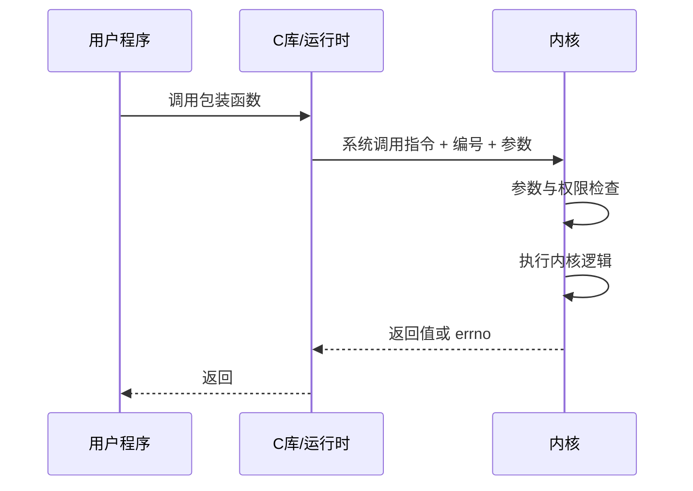

需要注意：

- 系统调用不一定必须通过 libc，程序可以按 ABI 直接发起，但通常不推荐；
- 库函数不一定产生系统调用，例如 `strlen()`；
- 一个库函数可能产生多个系统调用；
- 某些接口可通过 vDSO 在用户态完成，例如特定平台上的部分时间查询，不必真正陷入内核。

## 3. 系统调用与上下文切换的区别

执行系统调用时通常发生：

- 用户态到内核态的特权级切换；
- 切换到当前线程的内核执行上下文；
- 返回时恢复用户态。

这不等于一定从线程 A 切换到线程 B。只有调度器选择另一个任务时，才发生任务上下文切换。

因此应区分：

```text
mode switch：线程不变，特权级变化
context switch：正在运行的任务变化
```

## 4. 系统调用的成本

成本可能来自：

- 用户态/内核态边界转换；
- 安全缓解措施；
- 参数和指针校验；
- 文件描述符和对象查找；
- 锁与引用计数；
- 数据复制；
- 缺页和阻塞；
- 调度与唤醒；
- 缓存和分支预测扰动。

不能把系统调用成本只理解成一条 `syscall` 指令。不同系统调用差异很大：

- `getpid()` 与同步磁盘写入完全不是同一量级；
- 命中 page cache 的 `read()` 与触发 major fault 的读取差异巨大；
- 阻塞后发生调度时，真正成本主要可能来自等待和上下文切换。

## 5. 减少系统调用的常见方式

- 批量读写；
- 用户态缓冲；
- `readv/writev`；
- `sendmmsg/recvmmsg`；
- `mmap`；
- `sendfile/splice`；
- I/O 多路复用；
- `io_uring` 批量提交和完成；
- 连接复用；
- 合理扩大缓冲区。

减少调用次数不是唯一目标。过大批次可能增加延迟和内存占用，应在吞吐、尾延迟和背压之间平衡。

# 十三、mmap 与零拷贝

## 1. mmap 是什么？

`mmap()` 在进程虚拟地址空间中建立映射。后备对象可以是：

- 文件；
- 匿名内存；
- 共享内存对象；
- 设备内存；
- Huge Page。

典型参数涉及：

- 地址与长度；
- `PROT_READ/WRITE/EXEC`；
- `MAP_PRIVATE` 或 `MAP_SHARED`；
- 文件描述符与偏移。

### 1.1 文件映射的数据路径

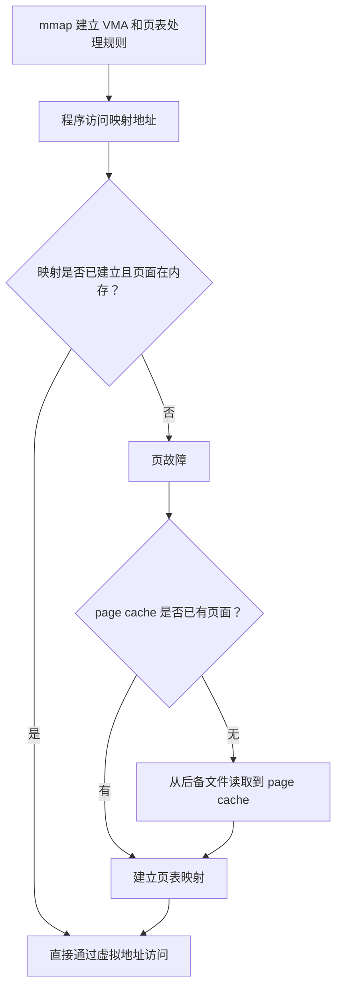

`mmap()` 主要避免普通 `read()` 中 page cache 到独立用户缓冲区的那次复制。磁盘或其他后备存储到内存的 I/O 并没有因此消失。

### 1.2 MAP_PRIVATE 与 MAP_SHARED

**MAP_PRIVATE**：

- 写入通常通过 COW 进入私有页面；
- 修改不直接写回原文件；
- 其他进程通常看不到私有修改。

**MAP_SHARED**：

- 修改对映射同一对象的其他进程可见；
- 脏页可以写回文件；
- 持久化时机仍需结合 `msync()`、`fsync()` 和文件系统语义。

### 1.3 mmap 的优点

- 避免额外用户缓冲区复制；
- 适合按地址随机访问；
- 可让多个进程共享页面；
- 由页故障按需装入；
- 简化某些索引和只读文件格式访问。

### 1.4 mmap 的风险和限制

- 页故障延迟出现在普通内存访问指令上；
- 错误恢复比 `read()` 返回错误更复杂；
- 文件被截断后访问失效范围可能触发 `SIGBUS`；
- 随机访问大文件可能造成 page cache 和 TLB 压力；
- 映射数量过多会增加 VMA 管理成本；
- `MAP_SHARED` 的并发修改仍需同步；
- 映射不等于数据已经持久化；
- 对简单顺序流式读取，`read()` 配合 readahead 可能更容易控制并且同样高效。

## 2. 什么是零拷贝？

“零拷贝”通常表示减少或消除 **CPU 在不同软件缓冲区之间复制载荷**，不代表系统中完全没有数据移动。

普通文件发送的概念路径：


`sendfile()` 的概念路径：


在支持 Scatter-Gather 的情况下，网络栈和驱动可以把多个内存片段描述给设备，避免先合并成一块连续载荷缓冲区。

具体内核版本、协议、文件系统、网卡、TLS 和 offload 配置会改变实际路径，因此图是概念模型，不是对所有平台的逐字节保证。

## 3. sendfile、splice 与其他接口

### 3.1 sendfile

常用于把文件数据发送到 Socket：

```c
sendfile(socket_fd, file_fd, &offset, count);
```

优势：

- 减少用户态缓冲；
- 减少 `read + write` 两次系统调用；
- 降低用户/内核边界往返；
- 可复用 page cache 页面。

### 3.2 splice

`splice()` 可以在支持的 fd 之间通过管道移动数据，减少显式用户态复制。

### 3.3 copy_file_range

用于文件之间复制，内核和文件系统可能使用更高效的复制、克隆或 offload。

### 3.4 MSG_ZEROCOPY 等网络机制

部分 Linux 网络接口允许减少发送路径复制，但会引入：

- 页面固定；
- 完成通知；
- 错误队列处理；
- 小消息收益不足；
- 生命周期管理复杂度。

## 4. DMA 与 Scatter-Gather

**DMA** 允许设备在主存和设备之间传输数据，CPU 主要负责配置描述符和处理完成事件。

**Scatter-Gather** 允许一次设备操作引用多个不连续内存片段：

```text
描述符 1 → 内存片段 A
描述符 2 → 内存片段 B
描述符 3 → 内存片段 C
```

设备按描述符收集或分散数据，减少 CPU 为连续缓冲区进行合并复制。

DMA 不意味着 CPU 完全不参与。CPU 仍需：

- 构建和提交描述符；
- 管理缓存一致性或同步；
- 处理完成；
- 运行协议栈和业务逻辑。

## 5. 零拷贝减少的是什么？

可能减少：

- CPU 内存复制；
- 用户缓冲区占用；
- 系统调用次数；
- 用户态/内核态模式切换；
- Cache 污染。

不应统一写成“减少上下文切换”。`read()+write()` 与 `sendfile()` 的主要差异通常是系统调用和模式边界次数；是否发生线程上下文切换取决于阻塞和调度。

## 6. 零拷贝并非总是更快

不一定适合：

- 极小消息；
- 数据必须在用户态解压、加密、修改或序列化；
- TLS 路径无法使用相应 offload；
- 页面固定成本过高；
- 输出设备和文件系统不支持有效路径；
- 数据不在 page cache 且 I/O 本身是主要瓶颈。

优化前应测量：

- CPU 周期和内存带宽；
- 系统调用次数；
- page fault；
- cache miss；
- 吞吐和尾延迟。

# 十四、高并发服务器模型

## 1. 一个连接一个线程

模型：

```text
连接 1 → 线程 1
连接 2 → 线程 2
连接 3 → 线程 3
```

优点：

- 编程模型直观；
- 阻塞式业务代码容易组织；
- 连接数有限时足够实用。

问题：

- 每个线程需要栈和内核调度对象；
- 大量空闲连接占用大量线程；
- 上下文切换和锁竞争增加；
- 线程池容易被慢请求耗尽；
- 很难自然表达背压。

现代系统不一定完全抛弃该模型。虚拟线程、轻量线程或协程可以保留“每请求一条顺序控制流”的编程体验，同时由运行时复用少量内核线程。

## 2. Reactor 模型

Reactor 是基于 **就绪事件** 的事件驱动模型。

核心组件：

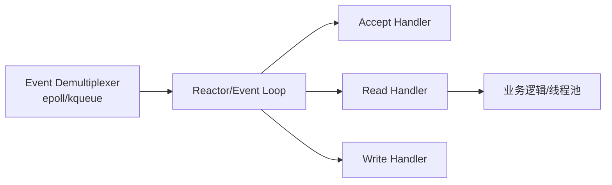

基本流程：

1. 注册感兴趣的事件；
2. 事件循环等待 fd 就绪；
3. 分发给对应 handler；
4. handler 调用 `accept/read/write`；
5. 业务逻辑同步执行或提交到工作线程池；
6. 更新监听事件和连接状态。

特点：

- 通知的是就绪，不是某次 I/O 已完成；
- 应用负责调用 I/O 系统调用；
- 少量线程可管理大量连接；
- 所有 handler 必须避免长时间阻塞事件循环；
- 必须设计输出缓冲、超时和背压。

### 2.1 常见 Reactor 变体

**单 Reactor 单线程**

```text
事件等待 + I/O + 业务逻辑都在一个线程
```

适合业务很轻的场景。

**单 Reactor + 工作线程池**

```text
Reactor 负责 I/O
业务线程池负责耗时计算
```

需要处理跨线程回写和连接生命周期。

**主从 Reactor**

```text
主 Reactor 接收连接
从 Reactor 处理连接 I/O
业务线程池处理计算
```

适合多核和大量连接，但状态迁移与负载均衡更复杂。

## 3. Proactor 模型

Proactor 基于 **完成事件**：

1. 应用提交具体异步 I/O 请求；
2. 操作系统或异步执行层完成操作；
3. 完成队列产生结果；
4. 应用处理完成结果。

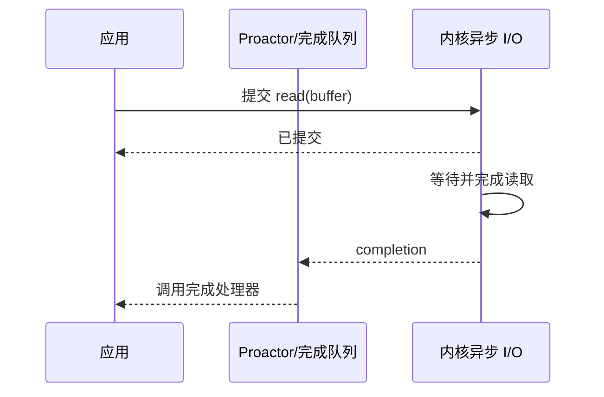

Reactor 与 Proactor 的核心区别：

| 对比点 | Reactor | Proactor |
|---|---|---|
| 通知内容 | fd 就绪 | 某个操作完成 |
| 应用何时调用 I/O | 收到就绪后调用 | 先提交具体操作 |
| 常见接口 | epoll、kqueue | IOCP、AIO、io_uring 部分用法 |
| 主要状态 | 连接就绪状态 | 请求与完成状态 |

表中不应写成“Reactor 由用户线程复制数据、Proactor 由内核复制数据”。两者的区别是操作提交和完成语义，而不是哪段代码亲自执行字节复制。

`io_uring` 能提交读写并取得 CQE，可构建 completion 风格模型；它也支持 poll 等操作，所以不应把整个接口机械等同于单一 Proactor。

## 4. 背压 Backpressure

高并发服务器不能无限：

- 接收请求；
- 分配任务；
- 提交异步 I/O；
- 缓存待发送数据。

当下游处理速度低于上游输入速度时，需要：

- 限制连接和并发请求；
- 限制每连接输出缓冲；
- 暂停读取；
- 拒绝或降级；
- 设置队列上限；
- 超时和取消；
- 按优先级丢弃。

没有背压的“高并发”通常只是把故障推迟到内存耗尽或尾延迟失控。

## 5. Redis 的单线程表述应如何理解？

“Redis 是单线程”属于过度简化。

更准确地说：

- 经典核心命令执行路径长期强调串行化，降低共享数据结构锁复杂度；
- 网络 I/O、后台持久化、异步释放和其他辅助工作可使用额外线程或进程；
- 具体线程模型随版本、配置和功能变化。

Redis 在许多负载下快，常见原因包括：

- 数据主要在内存中；
- 数据结构和协议实现紧凑；
- 事件驱动 I/O；
- 核心数据操作避免大量细粒度锁；
- 单条命令通常较短；
- 批处理和流水线减少往返。

但长时间运行的命令、热 key、大对象和内存带宽仍可能使核心执行路径成为瓶颈。

## 6. Nginx 的多进程事件模型

Nginx 常见结构：

```text
master
├─ worker 1：事件循环
├─ worker 2：事件循环
└─ worker N：事件循环
```

优点：

- 多个 worker 利用多核；
- worker 地址空间相对隔离；
- 每个 worker 用 epoll/kqueue 管理大量连接；
- 避免每连接一个线程；
- master 统一管理配置重载和 worker 生命周期。

需要限定：

- Nginx 也可以使用线程池处理某些阻塞文件 I/O；
- worker 数量并非越多越好；
- 共享状态、accept 分配、CPU 亲和性和 NUMA 都可能影响性能。

## 7. 选择模型的原则

需要同时考虑：

- 连接数与活跃比例；
- 每请求 CPU 时间；
- 是否大量调用阻塞第三方库；
- 延迟目标；
- 编程复杂度；
- 取消与超时；
- 连接状态大小；
- 多核扩展；
- 可观测性和故障隔离。

常见组合：

```text
多进程隔离
  + 每进程少量事件循环线程
  + 协程组织异步控制流
  + 工作线程池隔离阻塞或 CPU 任务
```

不存在对所有负载最优的唯一模型。

# 十五、系统实现细节

## 1. 多级页表

### 1.1 为什么需要多级页表？

页表维护：

```text
虚拟页号 VPN → 物理页框号 PFN + 权限
```

以 48 位虚拟地址、4 KiB 页、8 字节页表项为例，如果为整个虚拟地址空间建立单级页表：

```text
虚拟页数量 = 2^(48 - 12) = 2^36
页表大小 = 2^36 × 8 B = 512 GiB
```

大多数进程只使用地址空间中的少量区域，单级页表会严重浪费内存。多级页表只为实际使用的地址范围逐级分配页表页。

### 1.2 x86-64 四级页表

经典 48 位 x86-64 地址可拆分为：

```text
| 9 位 | 9 位 | 9 位 | 9 位 | 12 位 |
| PML4 | PDPT | PD   | PT   | 页内偏移 |
```

Linux 源码常使用架构无关抽象名称：

```text
PGD → P4D → PUD → PMD → PTE
```

在四级配置中，某些抽象层会折叠；在支持五级页表的 x86-64 系统中，还会增加一级索引并扩展可用虚拟地址位数。

因此：

- `PGD/PUD/PMD/PTE` 是 Linux 内核抽象；
- `PML4/PDPT/PD/PT` 是 x86-64 硬件术语；
- 不能在所有架构上都把顶级页表寄存器叫 `CR3`，`CR3` 是 x86 专用名称。

一张 4 KiB 页表页可容纳：

```text
4096 / 8 = 512 = 2^9 个页表项
```

### 1.3 页表遍历

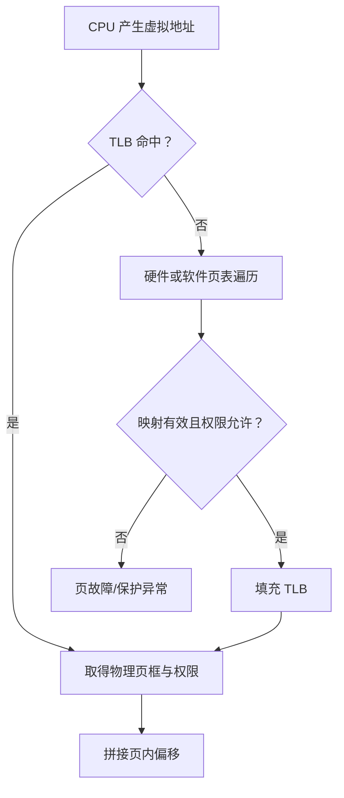

x86 通常由硬件 page walk；某些架构和场景由软件参与 TLB refill。页表遍历本身还可能受缓存和 page-walk cache 加速。

### 1.4 页表项常见属性

可能包括：

- present/valid；
- read/write；
- user/supervisor；
- accessed；
- dirty；
- execute-never/NX；
- global；
- huge page；
- 物理页框号；
- 内存类型和架构专用属性。

内核可利用 Accessed 和 Dirty 信息辅助页面回收与写回，但不同架构提供方式不同，内核也可能通过清位、软件采样等方法估算活跃度。

### 1.5 Huge Page

以 x86-64 为例，常见页大小：

- 4 KiB；
- 2 MiB；
- 1 GiB。

需要区分：

- **Transparent Huge Pages，THP**：内核自动尝试使用和拆分大页；
- **hugetlbfs/显式 HugeTLB**：预留和显式管理的大页。

优点：

- 扩大 TLB 覆盖范围；
- 减少页表层级和页表内存；
- 对连续大工作集可能降低 TLB miss。

代价：

- 内部碎片；
- 分配和整理成本；
- COW 或内存回收时拆分成本；
- 对稀疏、随机或小对象工作集未必有利；
- 可能增加页故障尾延迟。

## 2. 页故障细节

### 2.1 Minor Fault

不需要等待后备存储 I/O，例如：

- 文件页已经在 page cache；
- COW；
- 匿名页首次分配；
- 补建页表映射。

### 2.2 Major Fault

需要等待 I/O 才能完成，例如从磁盘、swap 或网络文件系统读取。

### 2.3 Copy-on-Write

```mermaid
flowchart TD
    A["多个地址空间引用同一私有页面"] --> B["页面写保护"]
    B --> C["一方执行写入"]
    C --> D["触发页故障"]
    D --> E["内核检查引用和映射语义"]
    E --> F["复制或复用为独占页面"]
    F --> G["更新写入方页表"]
    G --> H["重新执行写指令"]
```

如果页面已经只剩当前映射独占，内核可能不必实际复制，只需更新权限。具体优化取决于内核实现。

## 3. NUMA

### 3.1 基本概念

NUMA 是 Non-Uniform Memory Access，即不同 CPU 访问不同内存节点的延迟和带宽并不一致。

```mermaid
flowchart LR
    subgraph N0["NUMA Node 0"]
        C0["CPU 核心"]
        M0["本地内存"]
    end

    subgraph N1["NUMA Node 1"]
        C1["CPU 核心"]
        M1["本地内存"]
    end

    C0 -->|"本地访问"| M0
    C0 -->|"远端互连"| M1
    C1 -->|"本地访问"| M1
    C1 -->|"远端互连"| M0
```

远端内存不是不可访问，只是通常延迟更高、可用带宽更低，并消耗互连资源。

### 3.2 First Touch

Linux 默认内存策略下，匿名页面通常在发生实际物理分配时优先从当前线程所在 NUMA 节点分配。

“第一次访问”应更严谨地理解为：

- 页表和内存策略允许时的首次实际分配；
- 匿名页第一次读可能暂时映射共享零页；
- 第一次写通常更能决定真实私有物理页的位置；
- 显式 NUMA policy、内存压力和自动 NUMA balancing 都可能改变结果。

错误模式：

```text
主线程固定在 Node 0，串行初始化所有数组
工作线程固定在 Node 1，长期处理数组
```

此时页面可能主要位于 Node 0，Node 1 工作线程产生大量远端访问。

更好的并行初始化方式是让每个工作线程在未来处理数据的节点上首次写入对应分片。

### 3.3 线程迁移

线程迁移到其他节点后，数据页不会自动同步迁移：

```mermaid
flowchart LR
    T0["线程在 Node 0 初始化"] --> P["页面位于 Node 0"]
    T0 --> T1["线程迁移到 Node 1"]
    T1 --> R["从 Node 1 远端访问 Node 0 页面"]
    P --> R
```

自动 NUMA balancing 可能采样访问并迁移线程或页面，但迁移本身也有：

- 页面复制；
- TLB shootdown；
- 锁和扫描；
- 热页来回迁移

等成本。

### 3.4 常用工具

```bash
numactl --hardware
lscpu
numastat
numastat -p <pid>
cat /proc/<pid>/numa_maps

numactl --cpunodebind=0 --membind=0 ./app
taskset -c 0-7 ./app
```

`--membind` 比“优先本地分配”更严格，指定节点内存不足时可能直接分配失败。若希望优先某节点但允许回退，可以使用相应 preferred 策略。

### 3.5 优化原则

- 先测量远端访问是否真是瓶颈；
- 保持线程和主要数据的节点局部性；
- 避免无意义的跨节点迁移；
- 线程池、内存池和分片结构最好 NUMA-aware；
- 不要为了局部性造成严重 CPU 负载不均；
- 大页、页迁移和绑核策略需要一起评估。

## 4. 缓存一致性与伪共享

### 4.1 缓存层次并非固定

常见多核结构：

```mermaid
flowchart TD
    C0["Core 0"] --> L10["私有或局部 L1/L2"]
    C1["Core 1"] --> L11["私有或局部 L1/L2"]
    L10 --> LLC["共享或分片 LLC"]
    L11 --> LLC
    LLC --> M["内存"]
```

具体共享关系依微架构而异：

- L2 可能私有也可能共享；
- LLC 可能按 slice 分布；
- 非所有平台都采用 MESI；
- 还存在 MOESI、MESIF 等变体。

### 4.2 MESI 基本状态

- `M` Modified：当前缓存拥有已修改的唯一副本；
- `E` Exclusive：当前缓存独占且内容干净；
- `S` Shared：多个缓存可持有干净副本；
- `I` Invalid：当前副本无效。

当核心要写一个 Shared 缓存行时，通常需要获得所有权并使其他副本失效。

```mermaid
sequenceDiagram
    participant C0 as Core 0
    participant I as 一致性互连
    participant C1 as Core 1

    Note over C0,C1: 两个核心均持有 Shared 副本
    C0->>I: 请求写权限/所有权
    I->>C1: Invalidate
    C1-->>I: Ack
    I-->>C0: 授予所有权
    C0->>C0: 修改缓存行
```

### 4.3 伪共享

一致性以缓存行为单位，而非 C++ 变量为单位。两个线程修改不同对象，但对象位于同一缓存行时，缓存行可能在核心之间反复转移。

```cpp
struct Counters {
    std::atomic<long> left;
    std::atomic<long> right;
};
```

即使 `left` 与 `right` 逻辑独立，也可能伪共享。

缓解方法：

```cpp
#include <new>
#include <atomic>

struct alignas(std::hardware_destructive_interference_size)
PaddedCounter {
    std::atomic<long> value{0};
};
```

需要注意：

- `std::hardware_destructive_interference_size` 的可用性和取值依实现；
- 仅给结构起始地址对齐不一定解决所有嵌套布局问题；
- 填充会增加内存占用和 cache footprint；
- 应通过性能计数器验证，而不是对所有变量盲目补齐 64 字节。

### 4.4 缓存一致性不等于内存模型

缓存一致性解决同一内存位置副本的协调。

语言内存模型解决：

- 哪些并发访问构成数据竞争；
- 编译器和 CPU 可进行哪些重排序；
- 原子操作建立哪些同步关系。

错误代码：

```cpp
int data = 0;
bool ready = false;

// 线程 1
data = 42;
ready = true;

// 线程 2
if (ready) {
    use(data);
}
```

这是 C++ 数据竞争，行为未定义，不能只解释成“线程 2 可能先看到 ready”。

正确示例：

```cpp
int data = 0;
std::atomic<bool> ready{false};

// 线程 1
data = 42;
ready.store(true, std::memory_order_release);

// 线程 2
if (ready.load(std::memory_order_acquire)) {
    use(data);
}
```

### 4.5 原子操作的成本

不能笼统说“原子操作都很贵”：

- 未竞争的原子 load/store 可能非常便宜；
- `memory_order_relaxed` 不要求全局顺序；
- 原子 RMW、强内存屏障和跨核竞争可能昂贵；
- 真正的大成本往往是同一缓存行所有权反复转移。

所以：

```text
无锁 ≠ 无竞争
无锁 ≠ 一定更快
原子 ≠ 自动可扩展
```

## 5. Linux 内核调度细节

### 5.1 调度对象

Linux 调度 task。用户态线程通常对应一个可调度 task。

`task_struct` 包含或引用：

- 调度实体与策略；
- 状态和优先级；
- CPU 亲和性；
- 内核栈与体系结构状态；
- 地址空间、文件表、信号结构和凭据；
- 统计与追踪信息。

内存描述符和文件表可能被多个线程共享，因此不能简单说每个 `task_struct` 都独占完整副本。

### 5.2 每 CPU 运行队列

Linux 通常为每个逻辑 CPU 维护 runqueue：

```mermaid
flowchart LR
    R0["CPU 0 rq"] --> C0["CPU 0"]
    R1["CPU 1 rq"] --> C1["CPU 1"]
    R2["CPU 2 rq"] --> C2["CPU 2"]

    R0 <-->|"负载均衡/迁移"| R1
    R1 <-->|"负载均衡/迁移"| R2
```

优势：

- 降低全局锁竞争；
- 改善缓存局部性；
- 各 CPU 可并行调度。

代价：

- 需要负载均衡；
- 迁移影响 Cache、TLB 和 NUMA；
- CPU capacity 在大小核系统中不同，负载不能只按任务数量比较。

### 5.3 调度发生的常见时机

- 当前任务阻塞；
- 时间额度用完；
- 更高优先级或更早截止任务唤醒；
- 中断或系统调用返回前发现 `need_resched`；
- 主动 `sched_yield()`；
- CPU idle 或周期负载均衡；
- CPU hotplug、亲和性变化。

`sched_yield()` 不保证立即让特定线程运行，也不应作为普通同步机制。

### 5.4 切换成本

任务切换可能涉及：

- 保存和恢复寄存器；
- 切换内核栈；
- 地址空间切换；
- TLB 和 Cache 扰动；
- 分支预测状态影响；
- NUMA 远端访问；
- 调度器数据结构更新。

切换次数只是指标之一。大量上下文切换如果伴随高吞吐和低延迟可能正常；少量切换也不能证明系统高效。

### 5.5 调度类

概念上的优先顺序通常包括：

- stop；
- deadline；
- real-time；
- fair；
- idle。

同一调度类内部使用各自策略：

- `SCHED_DEADLINE`；
- `SCHED_FIFO/SCHED_RR`；
- `SCHED_OTHER/SCHED_BATCH/SCHED_IDLE` 等。

实时任务配置不当可能长期压制普通任务，应设置资源上限并谨慎授权。

## 6. Linux 公平调度：从 CFS 到 EEVDF

### 6.1 CFS 的历史思想

CFS（Completely Fair Scheduler）试图逼近“理想多任务 CPU”。它为普通任务维护虚拟运行时间：

```text
vruntime 增量 ≈ 实际运行时间 × 基准权重 / 任务权重
```

权重越高，`vruntime` 增长越慢，任务长期获得更多 CPU 份额。

经典 CFS 以 `vruntime` 排序可运行实体，并倾向选择虚拟运行时间较小的任务。

### 6.2 现代 Linux 的 EEVDF

现代 Linux 公平调度路径已从经典 CFS 选择逻辑逐步转向 **EEVDF（Earliest Eligible Virtual Deadline First）**。内核官方文档说明，Linux 从 6.6 开始过渡到 EEVDF。

EEVDF 仍使用虚拟时间和权重公平思想，但增加两个关键概念：

- **lag**：任务相对于公平份额是欠 CPU 时间还是超额使用；
- **virtual deadline**：任务本次请求对应的虚拟截止时间。

简化选择过程：

1. 找出 eligible 的任务，通常要求 lag 表明它没有超额占用；
2. 在 eligible 任务中选择虚拟截止时间最早者；
3. 更短的请求 slice 可以改善延迟敏感任务的响应。

```mermaid
flowchart TD
    A["可运行公平类任务"] --> B["计算/维护 lag"]
    B --> C["筛选 eligible 任务"]
    C --> D["比较 virtual deadline"]
    D --> E["选择最早虚拟截止任务"]
```

因此，把现代 Linux 普通调度完整描述为“红黑树永远选最小 vruntime”已经不够准确。

### 6.3 nice 和权重

nice 通常范围：

```text
-20 ... 19
```

- nice 越小，权重越高；
- nice 越大，权重越低；
- 它影响普通公平类任务的 CPU 份额；
- 不等同于实时优先级；
- CPU cgroup 权重、亲和性和可用 CPU 容量也会影响结果。

### 6.4 公平不等于相同运行时间

公平是按权重、层级和可用 CPU 资源分配：

- 不同 nice 值不应获得相同份额；
- cgroup 可改变组间权重；
- 睡眠、唤醒和迁移影响短期延迟；
- 长期公平也不保证硬实时截止时间。

### 6.5 为什么普通公平调度不适合硬实时？

因为普通公平调度优化长期份额和交互响应，不提供严格的最坏情况执行与截止时间保证。硬实时需要：

- 可证明的调度分析；
- 有界中断和锁延迟；
- 资源预算；
- 实时调度策略；
- 避免不可控缺页和阻塞。

## 7. io_uring

### 7.1 基本结构

`io_uring` 使用共享映射的环形队列：

- SQ：Submission Queue；
- CQ：Completion Queue；
- SQE：提交项；
- CQE：完成项。

```mermaid
flowchart LR
    A["应用填写 SQE"] --> SQ["Submission Queue"]
    SQ --> K["内核处理请求"]
    K --> CQ["Completion Queue"]
    CQ --> B["应用消费 CQE"]
```

共享映射减少了反复复制请求描述符的需要，但不能简单说“使用 io_uring 后不再有系统调用”：

- 普通模式下仍需 `io_uring_enter()` 提交或等待；
- 可以批量摊薄调用；
- SQPOLL 可由内核线程轮询 SQ，在特定条件下降低提交调用；
- 注册文件和缓冲区可减少重复查找与固定成本。

### 7.2 操作执行方式

io_uring 提供统一提交接口，但不同操作可能：

- 立即同步完成并产生 CQE；
- 使用文件的非阻塞路径；
- 进入内核异步执行；
- 转交 io-wq 工作线程；
- 被链接、取消或超时。

所以“io_uring 完全不使用线程”是不准确的。

### 7.3 基本伪代码

```cpp
io_uring ring;

if (io_uring_queue_init(256, &ring, 0) < 0) {
    // handle error
}

io_uring_sqe* sqe = io_uring_get_sqe(&ring);
if (sqe == nullptr) {
    // SQ is full; submit or apply backpressure
}

io_uring_prep_read(sqe, fd, buffer, size, offset);
io_uring_sqe_set_data64(sqe, request_id);

if (io_uring_submit(&ring) < 0) {
    // handle error
}

io_uring_cqe* cqe = nullptr;
if (io_uring_wait_cqe(&ring, &cqe) == 0) {
    const int result = cqe->res;
    const std::uint64_t id = io_uring_cqe_get_data64(cqe);
    // result < 0 时，负值通常是 -errno。
    io_uring_cqe_seen(&ring, cqe);
}

io_uring_queue_exit(&ring);
```

### 7.4 Buffer 生命周期

请求完成前：

- 普通缓冲区必须保持地址有效；
- 不能释放或复用给不兼容操作；
- 注册缓冲区也有明确注册和注销生命周期；
- CQE 到达不一定表示应用高级协议已经完成，只表示内核操作完成到对应语义点。

### 7.5 部分完成

读写操作可能：

- 返回小于请求长度；
- 遇到 EOF；
- 返回 `-EAGAIN`；
- 被取消；
- 超时；
- 与 linked operation 产生联动结果。

应用仍需维护状态机。

### 7.6 io_uring 与 epoll

| 对比点 | epoll | io_uring |
|---|---|---|
| 主要模型 | fd 就绪通知 | 操作提交与完成 |
| 应用操作 | 就绪后调用 read/write | 提前提交 read/write 等 |
| 数据结构 | interest/ready list | SQ/CQ |
| 批处理 | 返回多事件 | 批量提交与批量完成 |
| 适合范围 | Socket readiness | 文件、网络及更多异步操作 |

io_uring 也支持 poll 请求，因此两者不是完全互斥。小规模负载、简单网络服务或成熟 epoll 代码不一定因迁移 io_uring 自动变快。

### 7.7 高级特性

- registered buffers；
- registered files；
- SQPOLL；
- linked operations；
- multishot accept/recv；
- fixed buffer selection；
- cancellation；
- timeout；
- zero-copy 相关网络能力。

高级特性常伴随更严格的资源、权限、内核版本和生命周期要求。

### 7.8 背压

SQ 和 CQ 都是有限资源。应用必须限制未完成请求：

```text
提交速率 > 完成和消费速率
        ↓
SQ/CQ 拥塞、内存占用、尾延迟和取消成本上升
```

需要：

- 最大 in-flight 请求数；
- CQ 及时消费；
- 每连接/每租户配额；
- 超时和取消；
- 负载降级。

## 8. namespace 与 cgroup

### 8.1 二者分工

```mermaid
flowchart LR
    P["进程/容器"] --> N["namespace<br/>隔离可见视图"]
    P --> C["cgroup<br/>组织、统计和分配资源"]
```

namespace 主要解决“看见什么”，cgroup 主要解决“能使用多少以及如何分配”。

### 8.2 namespace

常见 namespace：

| 类型 | 隔离内容 |
|---|---|
| PID | PID 编号和进程树视图 |
| Mount | 挂载点和文件系统视图 |
| Network | 网卡、路由、端口和协议栈 |
| UTS | 主机名和域名 |
| IPC | System V IPC、POSIX 消息队列等 |
| User | UID/GID 与 capability 映射 |
| Cgroup | cgroup 路径视图 |
| Time | 部分系统时钟偏移视图 |

常用接口：

```text
clone()/clone3()
unshare()
setns()
```

命令：

```bash
unshare --pid --mount --uts --fork /bin/bash
nsenter -t <pid> -n -m -p
```

创建 PID namespace 时，通常还需要正确挂载新的 `/proc`，否则工具看到的进程视图可能与 namespace 不一致。

### 8.3 PID namespace

PID namespace 可以嵌套：

- 父 namespace 能看到子 namespace 中的任务；
- 子 namespace 看不到父 namespace 的任务；
- 同一 task 在不同层级具有不同 PID；
- namespace 中的 PID 1 有特殊信号和回收职责。

容器 PID 1 应正确：

- 回收僵尸；
- 转发终止信号；
- 处理子进程生命周期。

### 8.4 Network namespace

每个 network namespace 可拥有独立的：

- 网络设备；
- IP 地址；
- 路由表；
- Socket/端口空间；
- netfilter 规则；
- `/proc/sys/net` 部分配置。

veth pair 常连接两个 namespace：

```mermaid
flowchart LR
    C["容器 eth0"] <-->|"veth pair"| H["宿主机 veth"]
    H --> B["bridge/路由"]
    B --> E["外部网络"]
```

是否使用 bridge、NAT、路由、macvlan、ipvlan 或 eBPF 取决于网络方案。

### 8.5 cgroup v2

cgroup v2 使用统一层级，并通过控制器管理资源：

- `cpu`；
- `memory`；
- `io`；
- `pids`；
- `cpuset`。

典型路径：

```text
/sys/fs/cgroup/
```

cgroup 不只是“限制资源”，还用于：

- 分层组织；
- 统计；
- 权重分配；
- 保护；
- 压力和事件通知。

### 8.6 CPU 配额

```bash
echo "50000 100000" > cpu.max
```

表示每 100 ms 周期最多使用 50 ms CPU 时间，长期配额相当于约 0.5 个 CPU。

它不保证：

- 固定绑定半个核心；
- 每个 1 ms 窗口都能使用 0.5 ms；
- 没有节流尾延迟。

CPU quota 用完后会被 throttle，可能造成周期性延迟尖峰。

### 8.7 内存限制

```bash
echo 1G > memory.max
```

达到 hard limit 后，内核会尝试在 cgroup 内回收；无法降低使用量时可能触发 cgroup OOM。实际使用可暂时超过限制，且 page cache、匿名内存、内核记账等共同影响统计。

常用接口还包括：

- `memory.current`；
- `memory.high`；
- `memory.events`；
- `memory.stat`；
- `memory.swap.max`。

`memory.high` 常用于节流和回收压力，`memory.max` 是硬上限。

### 8.8 pids.max

```bash
echo 100 > pids.max
```

PIDs 控制器计数的是 task，通常包括线程，不只是传统意义上的进程。线程池或大量线程创建也可能触发限制。

### 8.9 线程化 cgroup

cgroup v2 默认以进程为主要迁移单位，但支持 threaded cgroup 模式，使某些控制器可以按线程组织。不能绝对表述为“所有线程在任何 cgroup v2 配置下都必须属于同一 cgroup”。

## 9. 容器底层原理

### 9.1 容器不是独立内核虚拟机

```mermaid
flowchart TD
    subgraph VM["虚拟机"]
        HW1["硬件"] --> HV["Hypervisor"]
        HV --> GK["Guest Kernel"]
        GK --> GP["Guest Process"]
    end
```

```mermaid
flowchart TD
    subgraph CT["普通 Linux 容器"]
        HW2["硬件"] --> HK["宿主机内核"]
        HK --> ISO["namespace + cgroup + rootfs + 安全策略"]
        ISO --> CP["容器进程"]
    end
```

普通容器共享宿主机内核，因此：

- 启动和资源开销通常较小；
- 系统调用 ABI 必须由宿主机内核支持；
- 内核漏洞可能跨越容器边界；
- 隔离强度通常低于拥有独立客户机内核的虚拟机。

### 9.2 核心机制

- namespace：隔离视图；
- cgroup：资源组织和控制；
- rootfs：容器文件系统视图；
- OverlayFS：镜像层合并；
- capability：拆分 root 权限；
- seccomp：过滤系统调用；
- LSM：SELinux、AppArmor 等；
- user namespace：UID/GID 映射；
- veth、路由、bridge、NAT 或 eBPF：网络；
- OCI runtime：按规范创建容器进程。

`chroot` 或 rootfs 本身不是完整安全边界，必须与 namespace、权限和 LSM 等机制组合。

### 9.3 镜像分层和 copy-up

```mermaid
flowchart TB
    W["容器可写层"]
    L3["只读应用层"]
    L2["只读运行时层"]
    L1["只读基础层"]
    M["合并视图"]

    W --> M
    L3 --> M
    L2 --> M
    L1 --> M
```

修改只读层文件时，OverlayFS 通常先 copy-up 到可写层：

```text
下层文件 → 复制到上层 → 修改上层副本
```

代价可能包括：

- 首次写放大；
- inode 和元数据变化；
- 大文件 copy-up 延迟；
- 页缓存与存储空间增加。

### 9.4 容器启动流程

```mermaid
flowchart TD
    A["解析 OCI 配置与镜像"] --> B["准备 rootfs/OverlayFS"]
    B --> C["创建 namespace"]
    C --> D["创建并配置 cgroup"]
    D --> E["配置网络"]
    E --> F["设置 UID/GID/capability/seccomp/LSM"]
    F --> G["pivot_root/chroot 等切换根视图"]
    G --> H["exec 入口程序"]
    H --> I["宿主机内核调度普通 task"]
```

实际顺序和细节取决于 runtime、网络插件和安全配置。

### 9.5 运行时栈

常见 Docker 路径：

```mermaid
flowchart TD
    CLI["Docker CLI"] --> D["dockerd"]
    D --> C["containerd"]
    C --> SHIM["containerd-shim"]
    SHIM --> R["OCI runtime，例如 runc"]
    R --> K["Linux 内核接口"]
    K --> P["容器进程"]
```

`containerd-shim` 等组件用于解耦容器生命周期和上层守护进程，不能把所有场景都简化成 Docker daemon 直接调用 runc 后永久管理进程。

### 9.6 容器安全

常见强化措施：

- 非 root；
- rootless 或 user namespace；
- 删除不需要的 capability；
- seccomp allowlist；
- SELinux/AppArmor；
- 只读 rootfs；
- 不使用 `--privileged`；
- 限制设备和宿主机目录挂载；
- 设置 cgroup 资源上限；
- 及时更新内核和 runtime；
- 对高隔离需求使用 microVM 或沙箱运行时。

容器安全不是单一开关，而是内核攻击面、配置、供应链和运行权限的组合问题。

# 十六、常见排查

性能排查应先确认现象和边界，再选择工具。不要一看到 CPU、内存或 `%util` 某个指标升高就直接下结论。

常用方法论：

- **RED**：Rate、Errors、Duration，适合服务请求；
- **USE**：Utilization、Saturation、Errors，适合系统资源；
- 对比基线、变更前后和同类实例；
- 先定位层级，再采集高开销剖析数据。

## 1. CPU 占用率高

### 1.1 基础定位

```bash
top
pidstat -u -p ALL 1
top -H -p <pid>
ps -L -p <pid> -o pid,tid,psr,stat,pcpu,comm
```

先判断：

- 单线程打满还是所有核心打满；
- 用户态 `%usr` 高还是内核态 `%sys` 高；
- 是否存在 steal time；
- 是否是短时尖峰还是持续饱和；
- run queue 是否持续大于可用 CPU。

### 1.2 C/C++

```bash
perf top -p <pid>
perf record -F 99 -g -p <pid> -- sleep 30
perf report
```

可进一步使用：

- FlameGraph；
- eBPF profiler；
- `gdb -p <pid>`；
- allocator profiler；
- 硬件性能计数器。

### 1.3 Java

```bash
top -H -p <pid>
printf '%x\n' <tid>
jstack <pid>
```

十六进制 TID 主要用于把 Linux TID 与 JVM 线程转储中的 `nid` 对应，并不是所有语言和运行时排查都需要转换。

### 1.4 常见原因

- 死循环或忙等；
- 锁竞争和 CAS 重试；
- 序列化、压缩、加密；
- 频繁 GC；
- 正则回溯；
- 小系统调用风暴；
- 日志格式化；
- cache miss、伪共享；
- 大量上下文切换；
- 中断或软中断负载。

CPU 利用率高不一定是坏事。如果吞吐按预期增加、延迟稳定，可能只是资源被充分利用。问题通常是饱和后排队和尾延迟失控。

## 2. 上下文切换和调度延迟

```bash
pidstat -w -p <pid> 1
vmstat 1
perf stat -e context-switches,cpu-migrations -p <pid> -- sleep 10
perf sched record -- sleep 10
perf sched timehist
```

需要区分：

- voluntary context switch：阻塞或主动等待；
- involuntary context switch：被抢占；
- CPU migration：任务迁移核心；
- scheduler latency：可运行后等待多久才真正运行。

常见原因：

- 线程数远多于 CPU；
- 细粒度锁和条件变量；
- 大量短任务；
- 线程池配置不当；
- CPU quota 节流；
- 实时任务压制普通任务。

## 3. 内存占用高

### 3.1 先区分指标

- **VSS/VIRT**：虚拟地址空间，不等于实际占用 RAM；
- **RSS/RES**：驻留物理页，包含共享页的重复计数视角；
- **PSS**：共享页按比例分摊，更适合估算进程实际贡献；
- **USS**：进程独占驻留内存；
- **匿名内存、文件页缓存、共享内存**：来源不同；
- **cgroup memory.current**：容器或组级记账。

```bash
free -h
cat /proc/meminfo
cat /proc/<pid>/status
cat /proc/<pid>/smaps_rollup
pmap -x <pid>
pidstat -r -p <pid> 1
```

### 3.2 检查页面行为

```bash
vmstat 1
pidstat -r -p <pid> 1
sar -B 1
cat /proc/pressure/memory
```

关注：

- minor/major fault；
- swap in/out；
- direct reclaim；
- PSI memory pressure；
- OOM 与 cgroup `memory.events`。

### 3.3 C/C++ 工具

- AddressSanitizer：越界、UAF 等，通常用于测试环境；
- LeakSanitizer；
- Valgrind Memcheck：开销较高；
- heaptrack；
- jemalloc/tcmalloc profiler；
- `perf mem`；
- core dump。

“内存高”不等于“内存泄漏”。还可能是：

- 正常缓存；
- allocator arena 和碎片；
- page cache；
- 线程栈保留；
- `mmap`；
- 共享内存；
- 大页；
- 延迟归还操作系统。

## 4. 磁盘 I/O 高

```bash
iostat -x 1
pidstat -d 1
iotop
vmstat 1
cat /proc/pressure/io
```

关注：

- IOPS；
- 吞吐；
- `await`；
- 队列深度；
- 读写比例；
- I/O PSI；
- 写回和 fsync 延迟；
- 是否发生 swap。

不要机械认为 `%util = 100%` 就一定表示现代 NVMe 已完全饱和。并行队列设备上，应结合队列深度、吞吐、延迟和设备规格判断。

常见原因：

- 数据库 checkpoint/compaction；
- 同步日志和 `fsync`；
- 大量小随机 I/O；
- page cache 失效；
- 内存压力触发回收和 swap；
- 存储设备故障或降速；
- 容器 I/O 限流；
- 文件系统锁和 journal。

## 5. 网络问题

### 5.1 基础工具

```bash
ss -s
ss -tanp
sar -n DEV,TCP,ETCP 1
nstat
ip -s link
ethtool -S <iface>
tcpdump -i <iface> -nn
```

关注：

- 建连和重置；
- retransmit；
- RTT；
- 丢包；
- listen queue；
- send/receive queue；
- TIME_WAIT；
- CLOSE_WAIT；
- conntrack；
- fd 上限；
- 网卡 drop 和 error；
- CPU 软中断。

### 5.2 状态解释

- **TIME_WAIT 多**：可能是大量主动关闭连接，也可能是正常高请求率，不应直接清理；
- **CLOSE_WAIT 多**：应用收到对端 FIN 后没有及时关闭本地 fd；
- **SYN backlog 溢出**：建连压力或服务接受不及时；
- **accept queue 堆积**：应用没有足够快地 `accept()`；
- **重传高**：可能是网络丢包、拥塞、MTU、接收端压力或设备问题。

## 6. 锁竞争和死锁

```bash
perf lock record -p <pid> -- sleep 20
perf lock report
gdb -p <pid>
```

观察：

- 哪些锁等待时间长；
- 持锁者在做什么；
- 是否持锁执行 I/O；
- 是否发生锁顺序反转；
- 原子变量是否造成缓存行争用；
- 线程池是否因同步等待耗尽。

## 7. 容器问题

```bash
cat /sys/fs/cgroup/cpu.stat
cat /sys/fs/cgroup/memory.current
cat /sys/fs/cgroup/memory.events
cat /sys/fs/cgroup/io.stat
cat /proc/pressure/cpu
cat /proc/pressure/memory
cat /proc/pressure/io
```

常见误判：

- 宿主机有空闲 CPU，但容器被 `cpu.max` 节流；
- 宿主机有内存，但 cgroup 达到 `memory.max`；
- 容器进程数少，但线程数触发 `pids.max`；
- overlay copy-up 导致首次写延迟；
- 容器内看到的指标受 namespace 和 cgroup 视图影响。

## 8. 线上服务突然变慢

推荐顺序：

1. **确认用户现象**：哪些接口、哪些区域、平均还是 P99/P999；
2. **检查错误率和超时**；
3. **查看最近变更**：代码、配置、依赖、流量、扩缩容；
4. **检查资源饱和**：CPU、内存、I/O、网络、fd、连接池；
5. **检查排队位置**：入口、线程池、数据库池、消息队列、下游；
6. **分解延迟**：DNS、建连、TLS、排队、业务、存储、下游；
7. **剖析热点**：CPU profile、off-CPU、锁和 I/O；
8. **验证假设**：通过指标、日志、trace 和对照实验；
9. **先止损再根因**：限流、降级、回滚、扩容；
10. **保留现场**：采集 profile、线程栈、cgroup、网络和系统指标。

不要同时无依据地调整多个参数，否则会破坏因果关系。

# 十七、常见疑问

## 1. malloc 一定会立刻分配物理内存吗？

不一定。

`malloc()` 是用户态分配器接口。请求可能：

- 从分配器已有空闲块满足；
- 扩展 heap；
- 建立新的匿名 `mmap`；
- 只保留虚拟地址和提交记账；
- 在首次写入时通过页故障获得物理页。

典型层次：

```mermaid
flowchart TD
    A["malloc/new"] --> B["用户态 allocator"]
    B --> C{"已有空闲块？"}
    C -->|是| D["直接返回"]
    C -->|否| E["brk/mmap 等向内核申请地址空间"]
    E --> F["返回虚拟地址"]
    F --> G["首次访问触发页故障"]
    G --> H["分配/映射物理页"]
```

需要注意：

- `malloc()` 返回非空不保证未来所有页面一定可成功物理化，系统可能启用 overcommit；
- `calloc()` 的零初始化可能利用共享零页和按需分配；
- 大块内存释放后，分配器不一定立刻把 RSS 全部还给内核。

## 2. 进程崩溃会影响其他进程吗？

通常不会直接破坏其他进程的私有地址空间，因为进程间有页表和权限隔离。

但可能产生间接影响：

- 共享内存中留下不一致状态；
- 持有文件锁或数据库事务；
- 服务不可用导致级联超时；
- 写到一半的文件或外部系统副作用；
- 共享设备、内核驱动或资源耗尽；
- 进程是关键守护程序；
- 内核漏洞或特权程序错误。

健壮进程共享互斥锁、事务日志和租约等机制可用于处理所有者异常退出。

## 3. “线程崩溃”一定导致整个进程退出吗？

要区分：

- 线程函数正常返回：只结束该线程；
- 调用 `pthread_exit()`：只结束当前线程；
- 未捕获的 C++ 异常越过线程入口：通常调用 `std::terminate()`，导致进程终止；
- `SIGSEGV`、`SIGABRT` 等致命信号使用默认处置：通常终止整个进程；
- 内存越界未立刻触发信号：可能先破坏共享状态，之后在其他线程崩溃。

因为线程共享地址空间，系统通常无法把严重内存破坏安全地限制在一个线程内。

## 4. 栈和堆有什么区别？

| 对比点 | 栈 | 堆/动态分配区域 |
|---|---|---|
| 典型用途 | 调用帧、局部对象、保存寄存器 | 动态生命周期对象 |
| 管理方式 | 编译器、ABI 和运行时自动调整 | allocator、程序或 GC 管理 |
| 生命周期 | 通常受词法作用域和调用控制 | 可跨函数和线程，取决于所有权 |
| 分配成本 | 通常只是调整栈指针 | 查找空闲块、同步、元数据等 |
| 容量 | 每线程通常有限 | 受地址空间、内存限制和 allocator 约束 |
| 常见问题 | 栈溢出、悬空栈引用 | 泄漏、UAF、碎片、double free |

“栈一定在高地址向低地址增长”不是跨平台保证；“堆一定连续向上增长”也不适用于现代 allocator 和 `mmap`。

## 5. 栈溢出是什么？

线程栈超过可用映射和保护范围。

常见原因：

- 无限或过深递归；
- 巨大局部数组；
- 调用链过深；
- 每线程栈配置过小；
- 递归中保存大对象；
- 栈内存破坏导致栈指针异常。

部分系统在栈边缘设置 guard page，越界时触发页故障和致命信号。

## 6. 内存泄漏是什么？

严格意义上的泄漏是程序失去对已分配资源的可达引用，导致无法再释放。

还需要区分：

- **真正泄漏**：对象不可达；
- **逻辑泄漏**：容器或缓存一直持有不再需要的数据；
- **allocator retention**：内存已 free，但分配器保留未归还内核；
- **碎片**：空闲总量足够，但布局难以满足请求；
- **有界缓存**：占用高但属于设计容量。

C++ 常见原因：

- 所有权不清晰；
- 异常路径漏释放；
- `shared_ptr` 环；
- 全局注册表不清理；
- 线程局部缓存；
- C API 与 RAII 混用。

## 7. 文件描述符是什么？

文件描述符是当前进程 fd 表中的非负整数索引。

```text
fd 整数
   ↓
fd table entry
   ↓
open file description
   ↓
inode / socket / pipe / eventfd / epoll instance ...
```

需要注意：

- fd 是进程级表项，但同一进程线程共享 fd 表；
- `fork()` 后父子 fd 表独立，但表项可指向同一 open file description；
- fd 被关闭后整数可能很快复用，异步代码要防止 fd reuse bug；
- `FD_CLOEXEC` 可防止不需要的 fd 泄漏到 exec 后的新程序。

标准约定：

- 0：stdin；
- 1：stdout；
- 2：stderr。

它们可以被关闭或重定向，不保证永远指向终端。

## 8. FILE* 和 fd 的区别

| 对比点 | fd | `FILE*` |
|---|---|---|
| 层次 | POSIX/系统调用接口 | C 标准 I/O 库 |
| 类型 | `int` | `FILE` 对象指针 |
| 用户态缓冲 | 通常由调用者自行管理 | 通常有 stdio 缓冲 |
| 常用接口 | `open/read/write/close` | `fopen/fread/fwrite/fclose` |
| 格式化 | 无 | `fprintf/fscanf` 等 |
| 线程同步 | 依接口和应用 | stdio 通常含内部锁 |

`FILE*` 在 POSIX 实现中通常封装一个 fd，但 C 标准本身不要求底层一定是 POSIX fd。

不要混用后忘记：

- stdio 缓冲可能尚未 flush；
- `fileno()` 取得 fd 后直接操作可能破坏缓冲区对偏移的假设；
- `fork()` 会复制用户态 stdio 缓冲，未 flush 内容可能被父子重复输出；
- `exec()` 不保留 `FILE*` 对象，但未设置 CLOEXEC 的 fd 可能保留。

## 9. 缓冲 I/O 和“非缓冲 I/O”

在 C 标准库语境中：

- 缓冲 I/O：`stdio` 在用户态聚合数据，再调用系统调用；
- 低级 fd I/O：`read/write` 没有 `FILE*` 的用户态 stdio 缓冲。

但 `read/write` 通常仍经过内核 page cache 或 Socket 缓冲，所以“非缓冲”不等于完全没有任何缓冲。

`O_DIRECT` 尝试绕过 page cache，但：

- 有严格对齐和文件系统限制；
- 不保证设备没有缓存；
- 不保证所有 I/O 都真正零拷贝；
- 需要应用自己处理缓存、对齐和并发一致性。

## 10. read/write 是否保证一次完成全部长度？

不保证。

可能原因：

- 管道或 Socket 当前只有部分数据；
- 非阻塞 fd；
- 信号中断；
- 设备和文件语义；
- 发送缓冲区空间不足；
- 到达 EOF。

因此可靠代码需要：

- 循环处理剩余长度；
- 正确处理 `EINTR`；
- 非阻塞时处理 `EAGAIN`；
- 区分 0、正数和 -1；
- 对 TCP 自行设计消息边界。

TCP 是字节流：

```text
一次 write ≠ 对端一次 read
多次 write 可能合并
一次 write 也可能被多次 read
```

## 11. TLB miss 和 page fault 有什么区别？

- TLB miss：处理器地址转换缓存未命中；
- page walk 找到有效页表项后可继续，不需要内核处理；
- page fault：映射不存在、权限不允许或需要 COW/按需装页等内核处理。

因此：

```text
TLB miss 不一定 page fault
page fault 通常发生在 TLB miss 后发现页表条件不满足
```

## 12. 用户态/内核态切换一定发生上下文切换吗？

不一定。

系统调用可以：

```text
线程 A 用户态 → 线程 A 内核态 → 线程 A 用户态
```

整个过程仍是线程 A。

只有调度器从 A 切换到 B 时，才发生任务上下文切换。

## 13. volatile 能用于线程同步吗？

普通 `volatile` 不能代替原子和锁。

在 C/C++ 中，`volatile` 主要约束编译器对特定对象访问的省略和合并，常用于：

- 内存映射 I/O；
- 信号处理中的 `volatile sig_atomic_t`；
- 特定底层场景。

它不提供：

- 原子性；
- 线程间 happens-before；
- 锁语义；
- 一般内存屏障。

多线程共享状态应使用 `std::atomic`、互斥锁或其他同步原语。

## 14. 共享内存为什么还需要同步？

两个进程映射同一物理页，只解决“双方能看到同一存储”。

它不解决：

- 谁先写；
- 何时可以读；
- 写入是否完成；
- 多字段更新是否一致；
- 对象生命周期；
- 崩溃恢复。

典型协议需要：

- 原子状态；
- 进程共享 mutex/condition variable；
- semaphore；
- sequence number；
- ring buffer head/tail；
- 内存序；
- 所有者死亡恢复。

## 15. 协程数量可以无限增加吗？

不可以。

单个协程通常比线程轻量，但仍占用：

- 协程帧或栈；
- 调度队列节点；
- Future、回调和定时器；
- 请求缓冲区；
- 连接和 fd；
- 日志、trace 和业务对象。

缺少并发上限和背压时，百万级“轻量任务”同样可能导致内存耗尽和尾延迟失控。

---

# 参考资料

以下资料用于核对本文中的 Linux/POSIX 实现细节：

1. [Linux Kernel Documentation: EEVDF Scheduler](https://docs.kernel.org/scheduler/sched-eevdf.html)
2. [Linux Kernel Documentation: Control Group v2](https://docs.kernel.org/admin-guide/cgroup-v2.html)
3. [Linux man-pages: epoll(7)](https://man7.org/linux/man-pages/man7/epoll.7.html)
4. [Linux man-pages: select(2)](https://man7.org/linux/man-pages/man2/select.2.html)
5. [Linux man-pages: poll(2)](https://man7.org/linux/man-pages/man2/poll.2.html)
6. [Linux man-pages: fork(2)](https://man7.org/linux/man-pages/man2/fork.2.html)
7. [Linux man-pages: execve(2)](https://man7.org/linux/man-pages/man2/execve.2.html)
8. [Linux man-pages: signal-safety(7)](https://man7.org/linux/man-pages/man7/signal-safety.7.html)
9. [Linux man-pages: futex(2)](https://man7.org/linux/man-pages/man2/futex.2.html)
10. [Linux man-pages: mmap(2)](https://man7.org/linux/man-pages/man2/mmap.2.html)
11. [Linux man-pages: io_uring_setup(2)](https://man7.org/linux/man-pages/man2/io_uring_setup.2.html)
12. [Linux man-pages: namespaces(7)](https://man7.org/linux/man-pages/man7/namespaces.7.html)

> 内核文档和 man-pages 会持续更新。阅读具体机器行为时，应同时检查发行版内核版本、配置选项和对应源码。

