# 一、进程、线程、协程

## 1. 进程是什么？

**进程是程序的一次运行实例。**

一个可执行文件放在磁盘上时，只是一个静态文件；当它被操作系统加载到内存中运行后，就成为一个进程。

一个进程通常包含：

* 代码段：程序指令。
* 数据段：全局变量、静态变量。
* 堆：动态申请的内存，例如 `malloc/new`。
* 栈：函数调用、局部变量、返回地址。
* 文件描述符表：打开的文件、socket 等。
* 页表：虚拟地址到物理地址的映射。
* PCB：进程控制块，操作系统用它管理进程。

> 进程是操作系统资源分配的基本单位。每个进程拥有独立的虚拟地址空间、文件描述符表、信号处理方式等资源。操作系统通过 PCB 管理进程状态、调度信息、寄存器上下文和内存映射关系。


## 2. 线程是什么？

**线程是进程内部的执行流，是 CPU 调度的基本单位。**

一个进程可以有多个线程。多个线程共享进程的大部分资源，但每个线程也有自己的执行上下文。

线程共享：

* 代码段
* 数据段
* 堆
* 打开的文件描述符
* 进程地址空间
* 信号处理方式

线程独有：

* 栈
* 程序计数器 PC
* 寄存器
* 线程 ID
* 线程局部存储 TLS
* 调度状态

> 线程是 CPU 调度的基本单位，同一进程内的多个线程共享地址空间和进程资源，但每个线程有自己的栈、寄存器和程序计数器。线程之间通信比进程简单，但也更容易出现数据竞争和线程安全问题。


## 3. 进程和线程的区别

| 对比点  | 进程        | 线程         |
| - | - | - |
| 基本角色 | 资源分配单位    | CPU 调度单位   |
| 地址空间 | 独立        | 同进程线程共享    |
| 通信方式 | IPC，较复杂   | 共享内存，较方便   |
| 切换开销 | 大         | 小          |
| 崩溃影响 | 一般不影响其他进程 | 可能导致整个进程崩溃 |
| 创建销毁 | 开销大       | 开销小        |

**为什么线程切换比进程切换快？**

因为线程切换通常不需要切换整个地址空间，也不需要切换页表；而进程切换通常涉及地址空间、页表、TLB 等切换，缓存命中率也可能下降。


## 4. 协程是什么？

**协程是用户态的轻量级执行流。**

线程由操作系统调度，协程通常由程序或运行时调度。

协程特点：

* 用户态调度，不需要频繁进入内核。
* 切换开销比线程更小。
* 适合大量 IO 密集型任务。
* 单线程协程不能天然利用多核。
* 遇到阻塞系统调用时，如果没有异步 IO 支持，可能阻塞整个线程。

**线程和协程区别：**

| 对比点  | 线程             | 协程          |
| - | -- | -- |
| 调度者  | 操作系统内核         | 用户态运行时      |
| 切换位置 | 内核态            | 用户态         |
| 开销   | 较大             | 较小          |
| 是否并行 | 多线程可多核并行       | 单线程协程不能多核并行 |
| 适合场景 | CPU 密集 + IO 密集 | 高并发 IO      |

> 协程可以理解为用户态线程，由程序主动让出执行权。协程切换不需要内核调度，开销很小，因此适合高并发 IO 场景。但单线程协程本质上还是一个线程，不能同时在多个 CPU 核心上运行。


# 二、进程间通信 IPC

进程之间地址空间相互隔离，因此不能像线程一样直接访问对方的变量。进程间通信需要操作系统提供机制。

常见 IPC 对比：

| IPC 方式 | 通信范围 | 数据格式 | 传输方向 | 速度 | 容量 | 生命周期 | 适用场景 |
|----------|----------|----------|----------|------|------|----------|----------|
| 管道（Pipe） | 父子进程 | 字节流 | 半双工 | 中 | 有限（内核缓冲区，通常 64KB） | 随进程关闭 | 父子进程简单数据传递 |
| 命名管道（FIFO） | 任意进程 | 字节流 | 半双工 | 中 | 有限 | 持久（文件系统中的路径） | 无亲缘关系进程间简单通信 |
| 消息队列 | 任意进程 | 消息（有边界） | 双向 | 中 | 有限 | 随内核重启清除 | 需要消息边界的异步通信 |
| 共享内存 | 任意进程 | 原始内存 | 双向 | **最快** | 大 | 随进程释放 | 大数据量、高频读写 |
| 信号量 | 任意进程 | 计数器 | — | 快 | 小 | 随内核重启清除 | 同步与互斥（配合共享内存） |
| 信号（Signal） | 任意进程 | 固定编号 | 单向 | 快 | 极小 | 瞬时 | 异步事件通知（如 `SIGKILL`、`SIGCHLD`） |
| Socket | 任意进程/跨机器 | 字节流/数据报 | 双向 | 较慢 | 大 | 随进程关闭 | 网络通信、本地 UDS |

> - **最快的是共享内存**：直接映射同一物理页，零拷贝，无需内核中转。但需要信号量同步。
> - **管道 vs 消息队列**：管道是无边界的字节流，消息队列有消息边界（按消息单位读取）。
> - **信号不是 IPC 的数据通道**：它只能传递一个编号，用于通知事件，不能传数据。
> - **Socket 最通用**：既可用于本地（Unix Domain Socket），也可跨网络通信。


## 1. 管道

管道是一种半双工通信方式，数据像字节流一样从一端流向另一端。

特点：

* 通常用于有亲缘关系的进程，比如父子进程。
* 半双工，单向通信。
* 本质上是内核缓冲区。
* 数据没有明确消息边界，是字节流。

例如：

```c
#include <stdio.h>
#include <unistd.h>
#include <string.h>
#include <stdlib.h>

int main()
{
    int fd[2];
    // 创建管道
    // 执行后：
    // fd[0] --> 读端
    // fd[1] --> 写端
    if (pipe(fd) == -1) {
        perror("pipe");
        exit(1);
    }
    // 创建子进程
    pid_t pid = fork();
    if (pid < 0) {
        perror("fork");
        exit(1);
    }
    // 父进程
    if (pid > 0) {
        // 父进程只负责写
        close(fd[0]);   // 关闭读端
        char msg[] = "hello child process";
        printf("Parent: send message: %s\n", msg);
        // 写入管道
        write(fd[1], msg, strlen(msg) + 1);
        // 写完关闭写端
        close(fd[1]);
    }
    // 子进程
    else {
        // 子进程只负责读
        close(fd[1]);   // 关闭写端
        char buffer[100];
        // 从管道读取
        int n = read(fd[0], buffer, sizeof(buffer));
        printf("Child: received message: %s\n", buffer);
        printf("Child: message length = %d\n", n);
        close(fd[0]);
    }
    return 0;
}
```

`fd[0]` 用于读，`fd[1]` 用于写。


## 2. 命名管道 FIFO

普通管道一般只能用于父子进程。命名管道有文件路径，因此无亲缘关系的进程也可以通过它通信。

特点：

* 存在于文件系统中。
* 本质仍然是内核缓冲区。
* 适合本机进程间简单通信。


先创建一个命名管道：
```bash
mkfifo /tmp/myfifo
ls -l /tmp/myfifo
```
可能看到：
```bash
prw-r--r-- 1 user user 0 Jul 9 10:00 /tmp/myfifo
```
注意第一个字符p表示pipe, 只是文件系统中的一个名字，指向内核中的一个管道缓冲区。只能单向字节流通信，功能比较有限。


程序1：发送消息 sender.c

```c
#include <stdio.h>
#include <fcntl.h>
#include <unistd.h>
#include <string.h>

int main()
{
    char *fifo = "/tmp/myfifo";
    // 打开FIFO，只写
    int fd = open(fifo, O_WRONLY);
    char msg[] = "hello from sender";
    // 写入管道
    write(fd, msg, strlen(msg) + 1);
    printf("sender sent: %s\n", msg);
    // 写端关闭 = 数据发送结束。
    close(fd);
    return 0;
}
```

程序2：接收消息receiver.c
```c
#include <stdio.h>
#include <fcntl.h>
#include <unistd.h>

int main()
{
    char *fifo = "/tmp/myfifo";
    // 打开FIFO，只读
    int fd = open(fifo, O_RDONLY);
    char buffer[100];
    // 读取消息
    read(fd, buffer, sizeof(buffer));
    printf("receiver got: %s\n", buffer);
    close(fd);
    return 0;
}
```


## 3. 消息队列

消息队列以“消息”为单位通信。

特点：

* 有消息边界。
* 可以按照消息类型读取。
* 内核维护队列。
* 适合传递结构化的小数据。
* 数据需要从用户态复制到内核态，再从内核态复制到另一个进程，性能不如共享内存。


发送端 sender.c
```c
#include <stdio.h>
#include <sys/msg.h>
#include <string.h>
#include <stdlib.h>


// 消息结构
struct msgbuf
{
    // 必须有 type，因为消息队列靠 type 分类。
    long type;      // 消息类型
    char text[100]; // 消息内容
};


int main()
{
    key_t key;
    int msgid;

    // 创建key 
    // ftok 的作用：把一个文件路径 + 一个数字，转换成一个唯一标识符，让多个进程能够找到同一个 IPC 对象。
    key = ftok(".", 100);
    // IPC_CREAT，如果消息队列不存在，就创建一个。
    // 0666 代表 -rw-rw-rw-
    msgid = msgget(key, IPC_CREAT | 0666);
    if(msgid == -1)
    {
        perror("msgget");
        exit(1);
    }
    struct msgbuf msg;
    msg.type = 1;
    strcpy(msg.text, "hello message queue");
    // 发送消息
    // int msgsnd(
    //     int msgid,
    //     const void *msgp,
    //     size_t msgsz,
    //     int msgflg
    // );
    
    msgsnd(
        msgid,
        &msg,
        sizeof(msg.text), // 不包含type字段的大小
        0
    );
    printf("sender: send message\n");
    return 0;
}
```
receiver.c

```c
#include <stdio.h>
#include <sys/msg.h>
#include <stdlib.h>


struct msgbuf
{
    long type;
    char text[100];
};

int main()
{

    key_t key;
    int msgid;
    key = ftok(".",100);
    // 获取已有队列
    msgid = msgget(key,0666);
    struct msgbuf msg;

    // 接收 type=1 的消息
    msgrcv(
        msgid,
        &msg,
        sizeof(msg.text), 
        1, // type
        0
    );

    printf(
        "receiver got: %s\n",
        msg.text
    );
    return 0;
}
```


## 4. 共享内存

共享内存允许多个进程映射同一块物理内存。

特点：

* 最快的 IPC 方式。
* 避免大量内核态和用户态之间的数据复制。
* 需要额外同步机制，例如信号量、互斥锁。
* 容易产生并发安全问题。

**为什么共享内存最快？**

因为进程可以直接读写同一块内存，不需要每次通信都经过内核拷贝数据。

**问题：**

共享内存只解决“数据放在哪里”，不解决“什么时候读写”。所以必须配合同步机制。

```c
#include <stdio.h>
#include <stdlib.h>
#include <unistd.h>
#include <sys/shm.h>
#include <string.h>

int main()
{
    /*
        第一步：创建一个 key
        IPC 通信对象（消息队列、共享内存、信号量）都需要一个 key 来标识。
        不同进程只要使用相同的 key，就可以找到同一个 IPC 资源。
    */
    key_t key = ftok(".", 100);

    /*
        第二步：创建共享内存
        shmget 参数：
            - key  共享内存的唯一标识
            - 共享内存大小 这里创建 1024 字节
            - 权限和创建标志 
        返回值：shmid 类似文件描述符 fd, 后面操作共享内存都靠它
    */
    int shmid = shmget(
        key,
        1024,
        IPC_CREAT | 0666
    );


    if(shmid == -1)
    {
        perror("shmget");
        exit(1);
    }

    /*
        第三步：
        将共享内存映射到当前进程地址空间
        共享内存创建后, 进程不能直接访问。
        shmat(): 把共享内存映射到进程虚拟地址空间。
        返回addr, 代表这块共享内存。
    */
    char *addr = (char *)shmat(
        shmid,
        NULL,
        0
    );

    if(addr == (char *)-1)
    {
        perror("shmat");
        exit(1);
    }

    /*
        创建子进程
        fork之后两个进程访问的是同一块共享内存。
    */
    pid_t pid = fork();

    if(pid > 0)
    {
        strcpy(
            addr,
            "hello shared memory"
        );

        printf(
            "Parent write: %s\n",
            addr
        );

        /*
            等待子进程读取
            如果没有同步机制：
            父进程可能刚写完，子进程还没来得及读。
            真实项目不能用 sleep，
            应该使用：
            - 信号量 semaphore
            - mutex
            - 条件变量
        */
        sleep(5);

        /*
            解除映射
            shmat: 建立映射
            shmdt: 删除当前进程和共享内存的映射关系
        */
        shmdt(addr);
        /*
            删除共享内存
            注意：
            IPC_RMID 不会马上删除。当所有进程都解除连接后，内核才真正释放。
        */
        shmctl(
            shmid,
            IPC_RMID,
            NULL
        );
    }
    else
    {
        /*
            子进程负责读取数据,等待父进程写入。
            这里用 sleep 简化。
            实际应该使用同步机制。
        */
        sleep(1);
        printf(
            "Child read: %s\n",
            addr
        );
        /*
            子进程解除共享内存映射
        */
        shmdt(addr);

    }
    return 0;
}
```


## 5. 信号量

信号量主要用于同步和互斥。

它本质上是一个计数器：

* `P` 操作：申请资源，计数减一。
* `V` 操作：释放资源，计数加一。

信号量可以用于：

* 控制多个进程访问有限资源。
* 保护共享内存。
* 实现生产者消费者模型。


```c
#include <stdio.h>
#include <stdlib.h>
#include <unistd.h>
#include <sys/sem.h>
#include <sys/shm.h>
#include <sys/wait.h>
/*
    信号量操作需要用到的联合体
    semctl()需要
*/
union semun
{
    int val;
};
/*
    P操作,申请资源,semaphore--;
    如果资源不足:阻塞等待
*/
void P(int semid)
{
    struct sembuf op;
    op.sem_num = 0;   // 第0个信号量
    op.sem_op = -1;   // 减1
    op.sem_flg = 0;
    semop(
        semid,
        &op,
        1
    );
}

/*
    V操作,释放资源,semaphore++;
*/
void V(int semid)
{
    struct sembuf op;

    op.sem_num = 0;
    op.sem_op = 1;
    op.sem_flg = 0;
    semop(
        semid,
        &op,
        1
    );
}

int main()
{

    /*
        创建共享内存 保存 count
    */
    int shmid = shmget(
        IPC_PRIVATE,
        sizeof(int),
        IPC_CREAT | 0666
    );

    // 映射共享内存
    int *count = (int *)shmat(
        shmid,
        NULL,
        0
    );

    // 初始值
    *count = 0;
    /*
        创建信号量
        1: 表示只有一个进程可以进入临界区,类似一把锁
    */
    int semid = semget(
        IPC_PRIVATE,
        1,
        IPC_CREAT | 0666
    );
    union semun arg;
    arg.val = 1;
    /*
        初始化信号量 semaphore = 1
        表示资源可用
    */
    semctl(
        semid,
        0,
        SETVAL,
        arg
    );

    pid_t pid = fork();
    if(pid > 0)
    {
        P(semid);  
        printf("Parent enter\n");
        (*count)++;
        sleep(2);
        printf(
            "Parent count=%d\n",
            *count
        );
        V(semid);   // 解锁
        wait(NULL);
    }
    else
    {
        P(semid);   // 加锁
        printf("Child enter\n");
        (*count)++;
        printf(
            "Child count=%d\n",
            *count
        );
        V(semid);   // 解锁
    }
    return 0;
}
```


## 6. 信号

信号是一种异步通知机制。

常见信号：

* `SIGINT`：终端中断，通常是 Ctrl+C。
* `SIGKILL`：强制杀死进程，不能被捕获。
* `SIGTERM`：请求进程终止。
* `SIGCHLD`：子进程退出时通知父进程。
* `SIGSEGV`：段错误。

信号适合做通知，不适合传递大量数据。

```c
#include <stdio.h>
#include <stdlib.h>
#include <unistd.h>
#include <signal.h>
/*
    信号处理函数
    当进程收到 SIGTERM 时，内核会调用这个函数。
    注意：
    信号处理函数不是我们主动调用的，而是内核异步调用。
*/
void handler(int sig){
    printf("收到信号: %d\n", sig);
    printf("准备退出程序...\n");
    exit(0);
}

int main(){
    /*
        注册信号处理函数
        signal:
        第1个参数: 监听哪个信号
        第2个参数: 收到信号后执行哪个函数
        这里表示收到 SIGTERM调用 handler()
    */
    signal(SIGTERM,handler);
    printf("进程启动, PID=%d\n", getpid());
    /*
        模拟程序运行
        例如：一个服务器一直等待请求
    */
    while(1)
    {
        printf("程序运行中...\n");
        sleep(2);
    }
    return 0;
}
```


## 7. Socket

Socket 不仅可以用于网络通信，也可以用于本机进程通信。

本机 IPC 可以使用 Unix Domain Socket。

特点：

* 支持双向通信。
* 可以用于无亲缘关系进程。
* 编程模型和网络 socket 类似。
* 比共享内存慢，但更通用、更易管理。


服务端(省略部分错误处理)
```cpp
// server.cpp
#include <sys/socket.h>
#include <sys/un.h>
#include <unistd.h>

#include <cstring>
#include <iostream>

int main() {
    const char* path = "/tmp/demo_socket";

    /*
     * socket(domain, type, protocol)
     * domain：AF_UNIX，表示本机 Unix Domain Socket。
     * type：SOCK_STREAM，表示可靠的字节流，类似 TCP。
     * protocol：通常填 0。
     * 返回值：成功返回文件描述符，失败返回 -1。
     */
    int server_fd = socket(AF_UNIX, SOCK_STREAM, 0);

    /* 
     * 这里的 sockaddr_un 用来描述 Unix Domain Socket 的地址，socket address Unix
     * 地址类型：AF_UNIX
     * 地址路径：/tmp/demo_socket
     */
    sockaddr_un addr{};
    addr.sun_family = AF_UNIX;
    std::strncpy(addr.sun_path, path, sizeof(addr.sun_path) - 1);

    // 其余的还有：
    // sockaddr_in：IPv4 Socket 地址
    // sockaddr_in6：IPv6 Socket 地址

    /*
     * unlink(path)
     * 删除指定路径。
     * Socket 文件已存在时，bind() 会失败，因此先删除旧文件。
     */
    unlink(path);

    /*
     * bind(fd, address, address_length) 把已经由 fd 指向的 Socket，绑定到 /tmp/demo_socket 这个地址。
     * sockaddr_un 需要转换成通用的 sockaddr*。
     * 返回值只是表示操作是否成功
     */
    bind(
        server_fd,
        reinterpret_cast<sockaddr*>(&addr),
        sizeof(addr)
    );

    /*
     * listen(fd, backlog)
     * 将 Socket 设置为监听状态。
     * backlog 表示等待连接队列的大致长度。
     */
    listen(server_fd, 5);

    std::cout << "等待客户端连接...\n";

    /*
     * accept(fd, client_address, address_length)
     * 从监听队列中取出一个客户端连接。
     * 不需要客户端地址时，后两个参数可以填 nullptr。
     * 默认会阻塞，成功后返回新的通信文件描述符。
     */
    int client_fd = accept(server_fd, nullptr, nullptr);

    char buffer[128]{};

    /*
     * read(fd, buffer, size)
     * 从 fd 中读取最多 size 字节到 buffer。
     * 返回实际读取的字节数，返回 0 表示对端已关闭连接。
     */
    read(client_fd, buffer, sizeof(buffer) - 1);
    std::cout << "收到：" << buffer << '\n';

    const char* reply = "Hello from server";

    /*
     * write(fd, buffer, size)
     * 将 buffer 中的 size 字节写入 fd。
     * 返回实际写入的字节数。
     */
    write(client_fd, reply, std::strlen(reply));

    /*
     * close(fd)
     * 关闭文件描述符并释放对应资源。
     */
    close(client_fd);
    close(server_fd);

    // 删除服务端创建的 Socket 文件。
    unlink(path);
}
```
客户端

```cpp
// client.cpp
#include <sys/socket.h>
#include <sys/un.h>
#include <unistd.h>

#include <cstring>
#include <iostream>

int main() {
    const char* path = "/tmp/demo_socket";

    /*
     * 创建 Unix Domain 字节流 Socket。
     * 成功返回文件描述符，失败返回 -1。
     */
    int fd = socket(AF_UNIX, SOCK_STREAM, 0);

    sockaddr_un addr{};
    addr.sun_family = AF_UNIX;
    std::strncpy(addr.sun_path, path, sizeof(addr.sun_path) - 1);

    /*
     * connect(fd, server_address, address_length)
     * 使用 fd 连接指定的服务端地址。
     * 服务端必须已经执行 bind() 和 listen()。
     */
    connect(
        fd,
        reinterpret_cast<sockaddr*>(&addr),
        sizeof(addr)
    );

    const char* message = "Hello from client";

    // 向服务端发送字符串，不发送结尾的 '\0'。
    write(fd, message, std::strlen(message));

    char buffer[128]{};

    // 阻塞等待并读取服务端回复。
    read(fd, buffer, sizeof(buffer) - 1);
    std::cout << "收到：" << buffer << '\n';

    // 关闭客户端 Socket。
    close(fd);
}
```

服务端：socket → unlink → bind → listen → accept → read/write → close
客户端：socket → connect → write/read → close


# 三、进程调度与上下文切换

## 1. 什么是上下文切换？

CPU 正在执行一个进程或线程时，需要切换去执行另一个进程或线程。操作系统必须保存当前执行现场，再恢复另一个执行现场，这个过程叫上下文切换。

保存和恢复的内容包括：

* 程序计数器 PC
* 通用寄存器
* 栈指针
* 状态寄存器
* 页表基地址
* 进程状态
* 调度信息

> 上下文切换是操作系统在不同进程或线程之间切换 CPU 执行权的过程。它需要保存当前任务的寄存器、程序计数器、栈指针等上下文信息，并恢复下一个任务的上下文。上下文切换本身不执行用户业务逻辑，因此过多会降低系统性能。


## 2. 进程切换和线程切换

进程切换开销通常更大，因为它可能涉及：

* 地址空间切换
* 页表切换
* TLB 失效
* 缓存局部性下降
* 内核调度开销

线程切换通常只需要切换：

* 寄存器
* 栈
* 程序计数器
* 线程状态

同一进程内线程共享地址空间，因此切换成本较低。


## 3. 常见调度算法

### FCFS：先来先服务

谁先来谁先执行。

优点：

* 简单。
* 公平性直观。

缺点：

* 短任务可能被长任务阻塞。
* 平均等待时间可能较长。


### SJF：短作业优先

优先执行运行时间短的任务。

优点：

* 平均等待时间较短。

缺点：

* 需要预估任务运行时间。
* 长任务可能饥饿。


### RR：时间片轮转

每个进程分配一个时间片，时间片用完就切换。

优点：

* 响应时间较好。
* 适合分时系统。

缺点：

* 时间片太小，上下文切换频繁。
* 时间片太大，退化成 FCFS。


### 优先级调度

优先级高的任务先执行。

问题：

* 低优先级任务可能饥饿。

解决：

* 老化机制：等待时间越长，优先级逐渐提高。


### 多级反馈队列 MLFQ

将任务放入多个优先级队列。

特点：

* 新任务先进入高优先级队列。
* **用完时间片还没执行完，就降级。**
* **等待太久可以提升优先级。**
* 兼顾交互任务和长任务。

> 多级反馈队列通过动态调整任务优先级，让短任务和交互任务获得较好响应，同时避免长任务永久饥饿。


## 4. Linux 进程状态

Linux 中每个进程都有一个状态，可以通过 `ps` 或 `top` 命令的 `STAT` 列查看：

| 状态码 | 内核常量 | 名称 | 说明 |
|--------|----------|------|------|
| `R` | `TASK_RUNNING` | 运行/就绪 | 正在运行或在运行队列中等待 CPU |
| `S` | `TASK_INTERRUPTIBLE` | 可中断睡眠 | 等待事件（如 IO 完成、信号），**可被信号唤醒** |
| `D` | `TASK_UNINTERRUPTIBLE` | 不可中断睡眠 | 等待 IO 完成，**不响应信号**，不能被 kill |
| `Z` | `EXIT_ZOMBIE` | 僵尸进程 | 已退出但父进程尚未回收（wait） |
| `T` | `TASK_STOPPED` | 停止/暂停 | 被 `SIGSTOP`/`SIGTSTP` 暂停，或被调试器断点 |

### D 状态详解

D 状态（Disk Sleep / Uninterruptible Sleep）：

* 进程在**内核态**执行时等待某个 IO 操作完成（如磁盘读、NFS 请求）。
* 处于 D 状态的进程**不响应任何信号**，包括 `SIGKILL`（`kill -9`）也无法杀死。
* 只有 IO 完成或内核超时后，进程才会脱离 D 状态。
* 常见原因：磁盘 IO 极慢、NFS 挂载卡住、内核 bug、驱动问题。
* 排查方法：`cat /proc/<pid>/stack` 查看内核栈，定位卡在哪个内核函数。

> D 状态存在的意义是保护内核数据结构的一致性。进程持有内核锁或正在修改关键数据时，如果被强制杀死会导致内核状态不一致甚至崩溃。

### R 状态详解

R 状态（Running / Runnable）：

* 进程正在 CPU 上执行，**或**在运行队列（runqueue）中等待被调度。
* R 状态并不一定意味着"此刻正在使用 CPU"，而是"可被调度执行"。
* 单核 CPU 上同一时刻只有一个进程真正在 R 状态执行；多核上可以有多个。
* `top` 中 R 状态的进程多说明 CPU 繁忙；如果 R 状态进程数远超 CPU 核心数，说明 CPU 成为瓶颈。

> R 状态包含"正在运行"和"就绪等待调度"两种情况。Linux 不区分 Running 和 Ready，统一用 `TASK_RUNNING` 表示。

### S 状态详解

S 状态（Interruptible Sleep）：

* 进程在等待某个事件（如 IO 完成、定时器到期、获取锁、子进程退出）。
* 与 D 状态的关键区别：**S 状态可以被信号唤醒**。`kill` 可以终止 S 状态的进程。
* 大部分等待 IO 的进程（如 `read()` 等待网络数据、`sleep()`、`wait()` 等待子进程）都处于 S 状态。
* 被信号唤醒后，进程会先处理信号，再决定是否继续等待或返回。

> S 是最常见的睡眠状态。`sleep()`、`read()` 阻塞、`accept()` 等待连接都是 S 状态。S 和 D 的区别是"能否被信号打断"。

### Z 状态详解

Z 状态（Zombie / 僵尸进程）：

* 子进程已调用 `exit()` 退出，但父进程尚未调用 `wait()`/`waitpid()` 回收。
* 僵尸进程**不再占用内存和 CPU**，但保留了一个 task_struct（含退出状态码、资源使用统计）。
* 僵尸进程的 PID 仍被占用，大量僵尸进程可能耗尽 PID 资源。
* 解决方法：
  * 父进程调用 `wait()`/`waitpid()` 回收。
  * 父进程注册 `SIGCHLD` 信号处理函数，在回调中调用 `waitpid()`。
  * 杀死父进程，让 init（PID 1）接管并自动回收。
* `kill -9` **无法杀死僵尸进程**，因为它已经死了，只是在等父进程收尸。

> 僵尸进程的根因是父进程没有回收子进程。解决方案是让父进程 `wait()` 或注册 `SIGCHLD` 处理。如果父进程本身有 bug 不回收，杀掉父进程让 init 接管是终极手段。

### T 状态详解

T 状态（Stopped / Traced）：

* 进程被暂停执行，不参与调度。
* 两种触发方式：
  * **信号暂停**：`SIGSTOP`（不可捕获）、`SIGTSTP`（Ctrl+Z，可捕获）使进程进入 T 状态。`SIGCONT` 恢复。
  * **调试器跟踪**：被 `ptrace` 跟踪（如 GDB 断点），进程在断点处停止，状态为 `t`（小写，表示 traced）。
* T 状态的进程不消耗 CPU，但仍占用内存。
* 常见场景：`Ctrl+Z` 暂停前台任务后用 `bg`/`fg` 恢复；GDB 调试时进程停在断点。

> `SIGSTOP` vs `SIGTSTP` 的区别——前者不可被捕获/忽略，后者可以。`Ctrl+Z` 发送的是 `SIGTSTP`。`SIGCONT` 让暂停的进程继续执行。

### 如何查看进程状态

```bash
# 查看所有进程的状态码
ps aux                   # STAT 列
ps -eo pid,stat,comm     # 精简输出

# 交互式查看
top                      # 默认显示 S 列
htop                     # 更友好的界面

# 查找 D 状态进程
ps aux | awk '$8 ~ /D/'
```


## 5. 如何查看进程的内核占用与调度信息

### CPU 占用：用户态 vs 内核态

进程的 CPU 时间分为两部分：

* **utime**：用户态执行时间（运行用户代码）
* **stime**：内核态执行时间（系统调用、缺页处理、驱动等）

```bash
# ps 显示 CPU 占用（默认含 utime + stime）
ps aux                    # %CPU 列

# 分开看用户态和内核态时间（单位：秒）
ps -o pid,utime,stime,comm <pid>

# time 命令测量进程的用户态和内核态耗时
/usr/bin/time -v ./my_program
# 输出包含：
#   User time (seconds):     用户态时间
#   System time (seconds):   内核态时间
#   Elapsed (wall clock):    墙钟时间
```

### /proc 文件系统

`/proc/<pid>/` 下有丰富的进程信息：

```bash
# 进程基本状态（state、utime、stime、优先级等）
cat /proc/<pid>/stat

# 内核栈（排查 D 状态卡在哪里）
cat /proc/<pid>/stack

# 进程状态（人类可读）
cat /proc/<pid>/status
# 关键字段：
#   State:    D (uninterruptible sleep)
#   voluntary_ctxt_switches:    主动让出 CPU 次数（如 sleep、IO 等待）
#   nonvoluntary_ctxt_switches: 被调度器抢占次数

# 调度策略和优先级
chrt -p <pid>             # 查看调度策略（SCHED_NORMAL/FIFO/RR）和优先级
nice -n <priority> <cmd>  # 设置 nice 值（-20 最高，19 最低）
```

### top/htop 中的调度相关字段

```
top - 14:30:00 up 10 days
  PID USER      PR  NI    VIRT    RES    SHR S  %CPU  %MEM     TIME+ COMMAND
1234 user      20   0  500000   8000   4000 R   5.0   0.2   1:23.45 myapp
```

| 列 | 含义 |
|----|------|
| `PR` | 调度优先级（内核内部值，越小越优先） |
| `NI` | nice 值（用户可调，-20~19，影响 PR） |
| `S` | 进程状态（R/S/D/Z/T） |
| `%CPU` | CPU 占用率（含用户态 + 内核态） |
| `TIME+` | 累计 CPU 时间（含用户态 + 内核态） |

> **要点**：`PR = 20 + NI`（普通进程）。`PR` 越小优先级越高。`nice` 值只影响普通进程（`SCHED_NORMAL`），实时进程（`SCHED_FIFO`/`SCHED_RT`）有独立的优先级范围（1~99）。


# 四、同步、互斥与锁

## 1. 并发和并行

并发：

> 多个任务在同一时间段内交替推进。

并行：

> 多个任务在同一时刻真正同时执行。

单核 CPU 可以并发，但不能真正并行。多核 CPU 才能真正并行。


## 2. 同步和异步

同步：

> 调用方发起操作后，需要等待结果返回。

异步：

> 调用方发起操作后，不需要一直等待，结果完成后通过回调、事件、通知等方式告知。


## 3. 阻塞和非阻塞

阻塞：

> 调用后，如果条件不满足，线程会被挂起等待。

非阻塞：

> 调用后立即返回，不会让线程睡眠等待。

**同步/异步关注的是结果通知机制。**

**阻塞/非阻塞关注的是调用时线程是否等待。**


## 4. 临界区

临界区是访问共享资源的代码区域。

多个线程同时进入临界区可能导致数据竞争，所以需要互斥。

例如：

```cpp
count++;
```

这不是原子操作，可能包含：

1. 从内存读取 count。
2. 加一。
3. 写回内存。

多个线程同时执行可能导致结果错误。


## 5. 互斥锁 Mutex

互斥锁用于保证同一时间只有一个线程进入临界区。

特点：

* 获取不到锁时，线程可能进入睡眠。
* 适合临界区较长的场景。
* 可能会产生用户态到内核态切换。
* 不会一直占用 CPU。

适合：

* 临界区较长。
* 锁竞争比较激烈。
* 不希望线程空转浪费 CPU。

### 互斥锁用户态到内核态切换

互斥锁**不一定**会产生用户态到内核态切换。

关键区别在于：**锁有没有竞争。**

#### 1. 无竞争时：通常只在用户态完成

线程尝试加锁时，往往先使用原子指令，例如 CAS：

```cpp
// 伪代码
if (CAS(lock, 0, 1)) {
    // 加锁成功
}
```

CPU 直接把锁从“未占用”改成“已占用”，不需要操作系统介入，因此：

1. 用户态原子操作
2. 成功获得锁
3. 没有系统调用，没有内核态切换

这也是现代互斥锁效率较高的原因。

#### 2. 有竞争时：线程需要进入内核睡眠

假设线程 A 已经持有锁，线程 B 再调用：

```cpp
pthread_mutex_lock(&mutex);
```

线程 B 发现锁被占用后，有两种选择：

1. 一直在用户态自旋等待；
2. 暂停运行，让出 CPU。

互斥锁通常不能长期自旋，否则会浪费 CPU。因此，线程 B 会请求内核把自己阻塞起来：

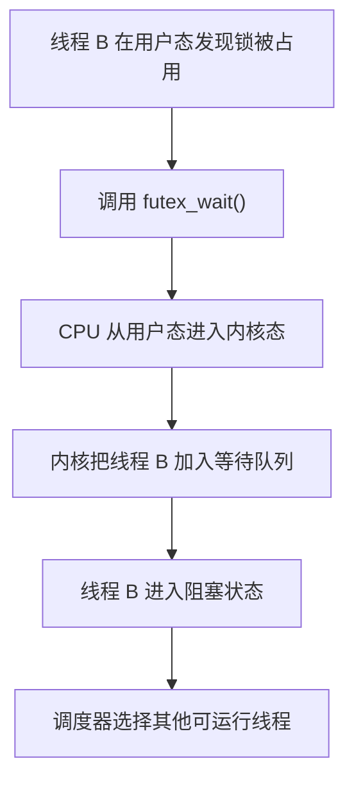

这时就产生了：

* 用户态到内核态切换；
* 线程调度；
* 可能的上下文切换。

####  3. 解锁时也可能进入内核

线程 A 解锁时，先在用户态把锁状态改为“未占用”。

如果没有等待线程，解锁也不需要进入内核。

但如果锁上有等待者，则需要通知内核唤醒一个线程：

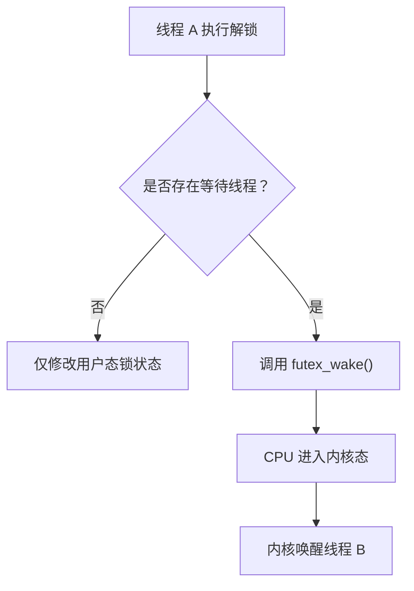

因此：

无竞争解锁：通常纯用户态
有等待者解锁：可能需要进入内核态唤醒线程

####  4. Linux 中典型的 futex 机制

Linux 的 `pthread_mutex` 通常基于 `futex`：

```text
futex = fast userspace mutex
```

它的设计思想就是：

> 无竞争时在用户态快速完成；只有发生竞争时才进入内核。

简化后的逻辑如下：

```cpp
void lock() {
    // 快速路径：纯用户态原子操作
    if (atomic_compare_exchange(lock_word, 0, 1)) {
        return;
    }

    // 慢速路径：锁被占用，进入内核睡眠
    futex_wait(lock_word, 1);
}
```

解锁：

```cpp
void unlock() {
    atomic_store(lock_word, 0);

    // 如果有等待线程，进入内核将其唤醒
    if (has_waiters) {
        futex_wake(lock_word, 1);
    }
}
```

####  5. 为什么必须让内核参与

用户态代码可以修改锁变量，但它做不了下面这些事情：

* 把当前线程设置为阻塞状态；
* 将线程从 CPU 上撤下；
* 把线程加入等待队列；
* 在锁释放后重新唤醒线程；
* 决定接下来调度哪个线程运行。

这些都属于操作系统调度器的职责，所以一旦线程需要“睡眠等待”，就必须进入内核。

可以概括为：


- 只修改锁状态：用户态可以完成
- 阻塞、调度、唤醒线程：必须由内核完成

> 互斥锁本身不必然导致用户态到内核态切换；只有锁竞争导致线程阻塞或唤醒时，通常才需要进入内核。


## 6. 自旋锁 Spin Lock

自旋锁获取不到锁时不会睡眠，而是在原地循环等待。

特点：

* 不发生线程睡眠和唤醒。
* 避免上下文切换。
* 会持续占用 CPU。
* 适合临界区非常短的场景。

不适合：

* 临界区很长。
* 单核 CPU。
* 锁持有期间可能被阻塞。

**为什么自旋锁不适合长时间持有？**

> 因为等待线程会一直占用 CPU 空转，锁持有时间越长，CPU 浪费越严重。


## 7. 读写锁

读写锁区分读操作和写操作。

规则：

* 多个读线程可以同时进入。
* 写线程必须独占。
* 读写不能同时进行。

适合：

* 读多写少。
* 读操作耗时明显。
* 共享数据读频率远高于写频率。

不适合：

* 写操作很多。
* 读操作很短。
* 容易出现写线程饥饿。

> 写线程饥饿: 写线程一直想获取写锁，但因为读线程持续不断地进入临界区，写线程长期得不到执行机会。


## 8. 条件变量

条件变量用于线程之间等待某个条件成立。

它通常和互斥锁一起使用。

典型流程：

```cpp
lock(mutex);
while (!condition) {
    wait(cond, mutex);
}
do_something();
unlock(mutex);
```

为什么要用 `while` 而不是 `if`？

因为可能出现：

* 虚假唤醒。
* 多个线程被唤醒，但只有一个真正满足条件。
* 条件被其他线程提前改变。

> 条件变量用于线程等待某个条件成立。它通常配合互斥锁使用，因为条件的检查和等待必须是原子过程，否则可能出现丢失唤醒问题。等待时线程会释放锁，唤醒后重新获取锁并再次检查条件。

```cpp
#include <condition_variable>
#include <iostream>
#include <mutex>
#include <thread>

std::mutex mutex;
std::condition_variable cond;
bool ready = false;  // 条件变量本身不保存条件，条件由 ready 表示

void worker() {
    /*
     * unique_lock(mutex)
     * 获取互斥锁。
     *
     * condition_variable::wait() 需要使用 unique_lock，
     * 因为 wait() 需要暂时释放锁，唤醒后再重新加锁。
     */
    std::unique_lock<std::mutex> lock(mutex);

    /*
     * 必须使用 while 反复检查条件：
     * 1. 可能发生虚假唤醒；
     * 2. 条件可能被其他线程再次修改；
     * 3. 多个线程醒来时，条件可能只够一个线程使用。
     */
    while (!ready) {
        /*
         * wait(lock) 会原子地完成两个操作：
         * 1. 释放 mutex；
         * 2. 让当前线程进入阻塞状态。
         *
         * 被唤醒后，wait() 会先重新获得 mutex，
         * 然后才返回并继续检查 ready。
         */
        cond.wait(lock);
    }

    // 执行到这里时，线程持有 mutex，并且 ready == true。
    std::cout << "条件成立，工作线程开始执行\n";
}

int main() {
    std::thread thread(worker);

    {
        /*
         * 修改 ready 时必须加锁，
         * 保证条件的检查和修改受到同一把锁保护。
         */
        std::lock_guard<std::mutex> lock(mutex);
        ready = true;
    }  // 离开作用域，自动释放 mutex

    /*
     * notify_one()
     * 唤醒一个正在等待 cond 的线程。
     *
     * 通常先修改条件并释放锁，再调用 notify_one()，
     * 避免被唤醒的线程立即阻塞在 mutex 上。
     */
    cond.notify_one();

    thread.join();
}
```

## 9. 信号量和互斥锁区别

| 对比点  | 互斥锁        | 信号量        |
| - | - | - |
| 本质   | 锁          | 计数器        |
| 资源数量 | 通常是 1      | 可以是多个      |
| 释放者  | 一般要求加锁线程释放 | 可以由其他线程释放  |
| 用途   | 保护临界区      | 资源计数、同步    |
| 典型场景 | 共享变量保护     | 生产者消费者、连接池 |


# 五、死锁

## 1. 什么是死锁？

死锁是指多个进程或线程互相等待对方持有的资源，导致所有任务都无法继续执行。

例子：

线程 A 持有锁 1 并等待锁 2，线程 B 持有锁 2 并等待锁 1：


两个线程形成循环等待，因此都无法继续执行。


## 2. 死锁四个必要条件

1. **互斥条件**
   资源同一时间只能被一个线程占用。

2. **占有且等待**
   已经持有资源的线程，还在等待新的资源。

3. **不可剥夺**
   资源不能被强制抢走，只能由持有者主动释放。

4. **循环等待**
   多个线程形成环形等待关系。

只要破坏其中一个条件，就可以预防死锁。


## 3. 死锁预防

死锁预防是从机制上破坏死锁条件。

常见方式：

* 一次性申请所有资源，破坏占有且等待。
* 给资源编号，按固定顺序申请，破坏循环等待。
* 允许资源被抢占，破坏不可剥夺。
* 尽量减少互斥资源。

最常用的是：

> 按固定顺序加锁。


## 4. 死锁避免

死锁避免是在资源分配前判断是否安全。

典型算法：

> 银行家算法。

银行家算法核心思想：

> 在分配资源前，先判断分配后系统是否仍处于安全状态。如果分配可能导致系统进入不安全状态，就暂时不分配。


## 5. 死锁检测和恢复

死锁检测：

* 定期检查资源分配图。
* 判断是否存在环路。

死锁恢复：

* 杀死某些进程。
* 回滚进程状态。
* 抢占资源。
* 超时释放锁。


# 六、内存管理

## 1. 为什么需要内存管理？

操作系统做内存管理是为了：

* 隔离不同进程的地址空间。
* 防止进程非法访问其他进程或内核内存。
* 提高内存利用率。
* 支持虚拟内存。
* 支持内存共享和保护。
* 简化程序员的内存使用模型。


## 2. 虚拟地址和物理地址

物理地址：

> 内存硬件中真实存在的地址。

虚拟地址：

> 程序看到的地址，由 CPU 和 MMU 转换成物理地址。

逻辑地址：

> 程序生成的地址，很多语境下和虚拟地址接近。

程序中看到的地址通常是虚拟地址，不是物理地址。


## 3. 为什么要用虚拟地址？

虚拟地址的作用：

1. 地址隔离
   每个进程以为自己独占整个内存空间。

2. 内存保护
   防止一个进程随意访问另一个进程。

3. 简化程序开发
   程序不需要关心实际物理内存位置。

4. 支持虚拟内存
   可以把暂时不用的页面换出到磁盘。

5. 支持共享内存
   多个进程可以把不同虚拟地址映射到同一物理页。


## 4. 分页

分页是把虚拟地址空间和物理内存都划分成固定大小的块。

* 虚拟内存块叫页。
* 物理内存块叫页框。
* 页表记录虚拟页到物理页框的映射。

优点：

* 不会产生外部碎片。
* 内存分配灵活。
* 便于虚拟内存实现。

缺点：

* 可能产生内部碎片。
* 页表可能很大。
* 地址转换需要额外开销。


## 5. 分段

分段是按照程序的逻辑结构划分内存。

常见段：

* 代码段
* 数据段
* 堆段
* 栈段

优点：

* 符合程序逻辑。
* 便于权限控制和共享。

缺点：

* 会产生外部碎片。
* 内存分配管理复杂。


## 6. 分页和分段区别

| 对比点  | 分页        | 分段          |
| - |  | -- |
| 划分方式 | 固定大小      | 按逻辑模块，大小不固定 |
| 面向对象 | 操作系统      | 程序员/程序逻辑    |
| 碎片   | 内部碎片      | 外部碎片        |
| 地址结构 | 页号 + 页内偏移 | 段号 + 段内偏移   |
| 保护共享 | 粒度较细      | 更符合逻辑       |


## 7. 页表

页表用于记录虚拟页到物理页框的映射。

页表项通常包含：

* 物理页框号
* 有效位
* 访问权限
* 脏位
* 访问位
* 是否在内存中


## 8. 多级页表

如果每个进程都维护一个完整线性页表，会占用大量内存。

多级页表把页表分层，只为实际使用的地址空间分配下级页表。

优点：

* 节省页表内存。
* 适合稀疏地址空间。

缺点：

* 地址转换需要多次访存。
* 需要 TLB 加速。


## 9. TLB

TLB 是快表，是 MMU 中用于缓存虚拟页到物理页映射的高速缓存。

TLB 命中：

1. CPU 生成虚拟地址。
2. MMU 查 TLB。
3. 找到物理页框。
4. 拼接页内偏移，得到物理地址。

TLB 未命中：

1. MMU 查页表。
2. 找到页表项。
3. 更新 TLB。
4. 重新完成地址转换。

**为什么进程切换可能导致 TLB 失效？**

因为不同进程的虚拟地址到物理地址映射不同。进程切换后，旧进程的 TLB 缓存对新进程通常无效，所以需要刷新或使用 ASID （Address Space Identifier，地址空间标识符）等机制区分，从而避免大多数进程切换时的 TLB 全量刷新，提高系统性能。

ASID 不会无限增长，ASID 的位数是有限的。如果系统运行的进程数量超过可用 ASID，操作系统会复用 ASID。操作系统需要管理 ASID 的生命周期和回收。


# 七、虚拟内存与缺页中断

## 1. 什么是虚拟内存？

虚拟内存是一种内存管理技术，让程序看到的地址空间可以大于实际物理内存。

它依赖：

* 分页机制
* 页表
* 缺页中断
* 页面置换
* 磁盘交换区或文件映射


## 2. 虚拟内存解决什么问题？

1. 程序可以使用连续的虚拟地址空间。
2. 多个进程可以隔离运行。
3. 物理内存可以按需分配。
4. 不活跃页面可以换出到磁盘。
5. 支持内存映射文件和共享库。


## 3. 缺页中断

当程序访问某个虚拟页时，如果该页不在物理内存中，就会触发缺页中断。

完整流程：

1. CPU 访问虚拟地址。
2. MMU 查页表，发现页不在内存。
3. 触发缺页异常，进入内核态。
4. 操作系统判断访问是否合法。
5. 如果非法，发送段错误信号。
6. 如果合法，寻找空闲物理页。
7. 如果没有空闲页，执行页面置换。
8. 从磁盘加载目标页到物理内存。
9. 更新页表。
10. 恢复用户程序继续执行。


## 4. 页面置换算法

## OPT

理论最优算法。

思想：

> 淘汰未来最长时间不会被访问的页面。

问题：

* 需要知道未来访问序列。
* 实际无法实现。
* 常用于理论比较。


## FIFO

先进先出。

思想：

> 最早进入内存的页面最先淘汰。

优点：

* 简单。

缺点：

* 可能淘汰经常使用的页面。
* 可能出现 Belady 异常，增加了物理页框（Page Frame）的数量，FIFO 只按进入内存的先后顺序淘汰页面、没有栈性质，淘汰顺序可能发生变化，导致缺页次数反而增加。


## LRU

最近最久未使用。

思想：

> 淘汰最长时间没有被访问的页面。

优点：

* 符合局部性原理。
* 效果较好。

缺点：

* 精确实现成本高。
* 需要记录访问顺序。


## Clock

Clock 是 LRU 的近似算法。

每个页面有访问位。

流程：

* 指针循环扫描页面。
* 如果访问位为 1，清 0，给第二次机会。
* 如果访问位为 0，淘汰该页。

优点：

* 实现简单。
* 性能接近 LRU。
* 操作系统中常见。


## LFU

最少使用。

思想：

> 淘汰访问次数最少的页面。

问题：

* 历史访问次数可能误导当前判断。
* 需要计数和衰减机制。


## 5. 内存抖动

内存抖动是指系统频繁发生页面换入换出，CPU 大量时间花在处理缺页和磁盘 IO 上，真正执行程序的时间很少。

原因：

* 进程太多。
* 物理内存不足。
* 工作集太大。
* 页面置换算法不合理。

解决：

* 增加物理内存。
* 减少并发进程数。
* 优化程序局部性。
* 调整页面置换策略。
* 限制进程内存占用。


# 八、文件系统

## 1. 文件系统的作用

文件系统负责管理磁盘上的数据。

主要功能：

* 文件命名。
* 目录组织。
* 权限控制。
* 空间分配。
* 元数据管理。
* 缓存管理。
* 文件读写接口。


## 2. inode

inode 是文件的元数据结构。

inode 保存：

* 文件类型。
* 文件大小。
* 权限。
* 所有者。
* 时间戳。
* 链接数。
* 数据块地址。
* inode 编号。

**inode 不保存文件名。文件名保存在目录项中。**

目录项负责：

> 文件名 → inode 编号


## 3. 硬链接

**硬链接是多个文件名指向同一个 inode。**

特点：

* 共享同一个 inode。
* 删除一个文件名，不影响 inode 中的数据，除非链接数变为 0。
* **不能跨文件系统**。
* 一般不能对目录创建硬链接。


## 4. 软链接

**软链接**也叫**符号链接**，本质上是一个**特殊文件**，里面**保存目标路径**。

特点：

* **有自己的 inode**。
* **可以跨文件系统**。
* **可以链接目录**。
* **原文件删除后，软链接会失效，变成悬空链接**。


## 5. 硬链接和软链接区别

| 对比点     | 硬链接             | 软链接         |
| - |  | -- |
| inode   | 与原文件相同          | 有自己的 inode  |
| 是否跨文件系统 | 不可以             | 可以          |
| 是否能链接目录 | 通常不可以           | 可以          |
| 原文件删除   | 数据仍在            | 链接失效        |
| 本质      | 多个目录项指向同一 inode | 保存目标路径的特殊文件 |


# 九、IO 模型

## 1. 一次 IO 分两个阶段

以网络 IO 为例，一次读取通常分为两个阶段：

1. 等待数据准备好。(等待数据到达内核)
2. 将数据从内核缓冲区拷贝到用户缓冲区。


不同 IO 模型的区别主要就在这两个阶段。


## 2. 阻塞 IO

流程：

1. 用户线程调用 `read`。
2. 如果数据没准备好，线程阻塞。
3. 数据到达后，内核把数据拷贝到用户空间。
4. `read` 返回。

特点：

* 编程简单。
* 一个连接一个线程时并发能力差。
* 线程资源消耗大。


## 3. 非阻塞 IO

流程：

1. 用户线程调用 `read`。
2. 如果数据没准备好，立即返回 `EAGAIN`。
3. 用户线程反复轮询。
4. 数据准备好后，再读取。

特点：

* 线程不会睡眠阻塞。
* 需要不断轮询，可能浪费 CPU。


## 4. IO 多路复用

**一个线程可以同时监听多个 fd**。

典型机制：

* select
* poll
* epoll

流程：

1. 线程阻塞在 `select/poll/epoll_wait`。
2. 内核监控多个 fd。
3. **某些 fd 就绪**后返回。
4. 用户线程再调用 `read/write` 处理。

特点：

* 适合高并发连接。
* 一个线程可以管理大量 socket。
* **本质上仍然是同步 IO，因为数据拷贝阶段还是用户线程自己完成**。


## 5. 信号驱动 IO

数据准备好后，内核发送信号通知进程。

特点：

* 使用较少。
* 编程复杂。
* 不如 epoll 常见。


## 6. 异步 IO

**异步 IO 中，用户发起 IO 请求后立即返回，内核完成等待数据和数据拷贝，最后通知用户**。

特点：

* 等待数据和拷贝数据都不需要用户线程阻塞。
* 真正意义上的异步 IO。
* Linux 下传统网络编程中，epoll 更常见。


## 7. 同步 IO 和异步 IO 的本质区别

* 同步 IO：用户线程发起 IO 后，必须一直等到数据被拷贝到自己的用户缓冲区（buf）后才能继续执行。
* 异步 IO：用户线程发起 IO 后立即返回，内核在后台完成等待数据和拷贝到用户缓冲区的整个过程，完成后再通知用户线程。

因此，同步与异步 IO 的本质区别不是是否阻塞，而是IO 请求的完成责任是否一直绑定在发起该请求的用户线程上。

**关键不在于是否阻塞**，而在于：

> **数据从内核空间拷贝到用户空间这一步，是由用户线程自己完成，还是由内核完成后通知用户。**

同步 IO 中，用户线程调用 `read()` 后，由该系统调用完成内核缓冲区到用户缓冲区的数据复制：

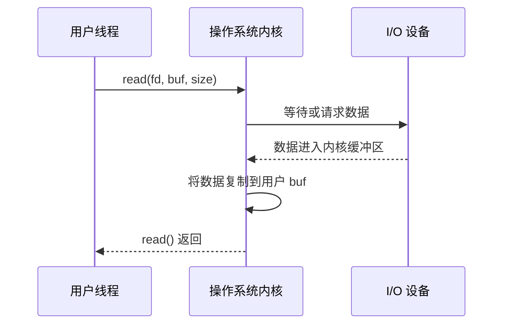

同步 IO 包括：

* 阻塞 IO
* 非阻塞 IO
* IO 多路复用
* 信号驱动 IO

异步 IO（如 AIO）中，用户线程提交请求后立即返回，由内核完成等待和数据复制：

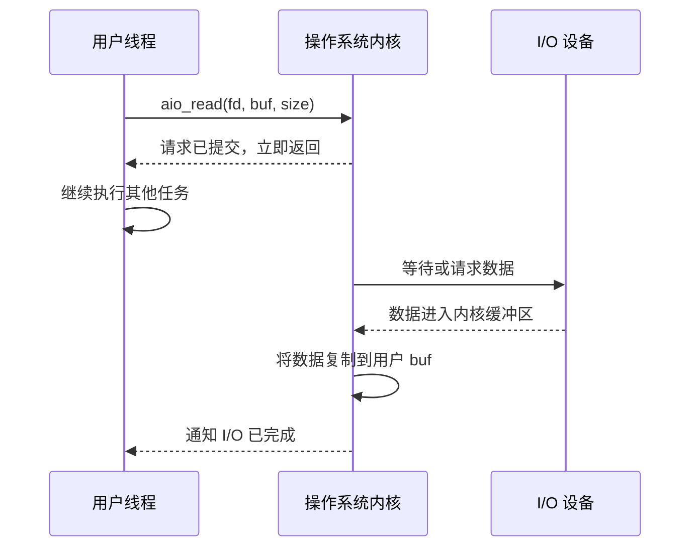

无论同步还是异步，都必须等待设备；区别在于等待和完成责任由谁承担。


# 十、select、poll、epoll

## 1. select

> select 可以理解为 从你给内核的一组文件描述符中，选出当前已经就绪的那些。

特点：

* 使用 fd_set。
* fd 数量有限制。
* 每次调用都要把 fd 集合从用户态拷贝到内核态。
* 内核需要线性扫描 fd。
* 返回后用户也要扫描哪些 fd 就绪。

缺点：

* **fd 数量限制**。
* 拷贝开销大。
* 扫描开销大。

```cpp
#include <sys/select.h>
#include <unistd.h>
#include <iostream>

int main() {
    while (true) {
        fd_set readfds;
        /*
         * FD_ZERO(fd_set*)
         * 将监听集合清空。
         * 注意：每次调用 select() 前都必须重新初始化。
         */
        FD_ZERO(&readfds);
        /*
         * FD_SET(fd, fd_set*)
         * 将 fd 加入监听集合。
         * 这里监听标准输入(STDIN_FILENO = 0)。
         */
        FD_SET(STDIN_FILENO, &readfds);
        std::cout << "等待输入...\n";
        /*
         * select(maxfd+1, readfds, writefds, exceptfds, timeout)
         *
         * maxfd+1：监听的最大 fd + 1。 应用程序自己维护 maxfd
         * readfds：监听可读事件。不是一个动态数组，而是一个位图（bitmap）。
         * 一般 #define FD_SETSIZE 1024，所以有 fd 数量限制。
         * timeout：nullptr 表示一直阻塞。
         *
         * 返回值：
         * >0：有几个 fd 就绪。
         * =0：超时。
         * <0：调用失败。
         *
         * 注意：
         * 1. select() 返回后会修改 readfds。
         * 2. 所以下一次循环必须重新 FD_ZERO、FD_SET。
         */
        int ret = select(STDIN_FILENO + 1,
                         &readfds,
                         nullptr,
                         nullptr,
                         nullptr);
        if (ret > 0 && FD_ISSET(STDIN_FILENO, &readfds)) {
            /*
             * FD_ISSET(fd, fd_set*)
             * 判断某个 fd 是否真的发生了事件。
             */
            char buf[100];
            read(STDIN_FILENO, buf, sizeof(buf));
            std::cout << "收到：" << buf;
        }
    }
}
```


## 2. poll

poll 的英文含义是“轮询、查询状态”。可以理解为

> 把一组 fd 交给内核，让内核检查这些 fd 当前发生了什么事件。

特点：

* 使用 pollfd 数组。
* 没有 select 那种固定 fd 数量限制。
* 仍然需要每次拷贝 fd 数组。
* 仍然需要线性扫描。

相比 select：

* 解决 fd 数量限制。
* 没有解决重复拷贝和线性扫描问题。

```cpp
#include <poll.h>
#include <unistd.h>
#include <iostream>

int main() {
    pollfd fds[1];
    /*
     * pollfd 结构体：
     * fd      ：监听的文件描述符
     * events  ：希望监听的事件
     * revents ：实际发生的事件（poll 返回后填写）
     */
    fds[0].fd = STDIN_FILENO;
    // POLLIN 表示监听可读事件。
    fds[0].events = POLLIN;
    while (true) {
        std::cout << "等待输入...\n";
        /*
         * poll(fds, nfds, timeout)
         *
         * fds：pollfd 数组。
         * nfds：数组元素个数。
         * timeout：
         *   -1 一直阻塞
         *    0 立即返回
         *  > 0 等待指定毫秒
         *
         * 返回值：
         * >0：有几个 fd 就绪。
         * =0：超时。
         * <0：失败。
         *
         * 注意：
         * poll 不会修改 events，
         * 但会修改 revents。
         */
        int ret = poll(fds, 1, -1);
        if (ret > 0 && (fds[0].revents & POLLIN)) {
            char buf[100];
            read(STDIN_FILENO, buf, sizeof(buf));
            std::cout << "收到：" << buf;
        }
    }
}
```


## 3. epoll

epoll 通常理解为 `event poll`, 即“事件轮询”或“事件通知式 poll”。

epoll 的核心思路是：

> 先把需要监听的文件描述符注册到内核中，之后调用 epoll_wait()，只获取已经发生事件的文件描述符。

epoll 由三个主要函数组成：

```c
epoll_create
epoll_ctl
epoll_wait
```

特点：

* 通过 `epoll_ctl` 注册 fd。
* fd 集合保存在内核中，不需要每次重复传入。
* 就绪事件放入就绪队列。
* `epoll_wait` 只返回就绪 fd。
* 适合大量连接、少量活跃的场景。

```cpp
#include <sys/epoll.h>
#include <unistd.h>
#include <iostream>

int main() {
    /*
     * epoll_create1(flags) 
     * epoll_create1() 里的 1 表示 epoll_create() 的改进版本。
     * 创建 epoll 实例。
     * flags 通常填 0。
     *
     * 返回值：
     * 成功返回 epoll 文件描述符。
     * 失败返回 -1。
     */
    int epfd = epoll_create1(0);
    epoll_event event;
    /*
     * events：
     * 希望监听的事件。
     * data：
     * 用户自定义数据，通常保存 fd。
     */
    event.events = EPOLLIN;
    event.data.fd = STDIN_FILENO;
    /*
     * epoll_ctl(epfd, op, fd, event)
     *
     * epfd：epoll 实例。
     * op：
     *   EPOLL_CTL_ADD 添加监听
     *   EPOLL_CTL_MOD 修改监听
     *   EPOLL_CTL_DEL 删除监听
     *
     * fd：需要监听的文件描述符。
     *
     * 注意：
     * 一个 fd 一般只需要 ADD 一次。
     */
    epoll_ctl(
        epfd,
        EPOLL_CTL_ADD,
        STDIN_FILENO,
        &event
    );
    epoll_event events[10];
    while (true) {
        std::cout << "等待输入...\n";
        /*
         * epoll_wait(epfd, events, maxevents, timeout)
         *
         * events：
         * 返回已经就绪的事件。
         *
         * maxevents：
         * 最多返回多少个事件。
         *
         * timeout：
         * -1 一直阻塞。
         *
         * 返回值：
         * >0：返回就绪事件个数。
         * =0：超时。
         * <0：失败。
         *
         * 注意：
         * epoll_wait() 只返回真正发生事件的 fd，
         * 不需要遍历所有监听对象。
         */
        int n = epoll_wait(
            epfd,
            events,
            10,
            -1
        );
        for (int i = 0; i < n; i++) {
            if (events[i].data.fd == STDIN_FILENO) {
                char buf[100];
                read(STDIN_FILENO, buf, sizeof(buf));
                std::cout << "收到：" << buf;
            }
        }
    }
    /*
     * close(epfd)
     * 关闭 epoll 实例，同时释放内核资源。
     */
    close(epfd);
}
```

### TCP 服务器例子

```cpp
#include <arpa/inet.h>     // sockaddr_in、htons()、INADDR_ANY
#include <cerrno>          // errno、EINTR
#include <sys/epoll.h>     // epoll_create1、epoll_ctl、epoll_wait
#include <sys/socket.h>    // socket、bind、listen、accept
#include <unistd.h>        // read、write、close

#include <iostream>

int main() {
    /*
     * socket(domain, type, protocol)
     *
     * 创建一个 Socket，并在内核中创建对应的 Socket 对象。
     *
     * domain：
     *   AF_INET 表示使用 IPv4。
     *
     * type：
     *   SOCK_STREAM 表示面向连接的字节流通信，即 TCP。
     *
     * protocol：
     *   传 0 表示让内核根据 AF_INET 和 SOCK_STREAM
     *   自动选择 TCP 协议。
     *
     * 返回值：
     *   >= 0：Socket 文件描述符。
     *   -1：创建失败，同时设置 errno。
     *
     * listen_fd 不是端口，也不是 Socket 本身，
     * 它是当前进程用于访问内核 Socket 对象的文件描述符。
     */
    int listen_fd = socket(AF_INET, SOCK_STREAM, 0);

    if (listen_fd == -1) {
        perror("socket");
        return 1;
    }

    /*
     * sockaddr_in 用于描述 IPv4 Socket 地址。
     *
     * 它主要包含：
     *   sin_family：地址族。
     *   sin_addr：IPv4 地址。
     *   sin_port：端口号。
     */
    sockaddr_in address{};

    // 必须与 socket() 使用的 AF_INET 保持一致。
    address.sin_family = AF_INET;

    /*
     * INADDR_ANY 表示绑定本机所有 IPv4 网络接口。
     *
     * 例如本机可能同时拥有：
     *   127.0.0.1
     *   192.168.1.10
     *   其他网卡地址
     *
     * 使用 INADDR_ANY 后，客户端通过这些地址访问 8080 端口，
     * 都可能连接到这个监听 Socket。
     */
    address.sin_addr.s_addr = INADDR_ANY;

    /*
     * TCP/IP 协议使用网络字节序，也就是大端序。
     *
     * htons：
     *   host to network short
     *
     * 将主机字节序的 16 位端口号 8080
     * 转换成网络字节序。
     */
    address.sin_port = htons(8080);

    /*
     * bind(fd, addr, addrlen)
     *
     * 将 listen_fd 指向的 Socket 绑定到一个本地地址：
     *
     *   0.0.0.0:8080
     *
     * 参数：
     *   listen_fd：
     *     要绑定的 Socket 文件描述符。
     *
     *   sockaddr*：
     *     bind() 使用通用地址结构 sockaddr，
     *     因此需要把 sockaddr_in* 转换成 sockaddr*。
     *
     *   sizeof(address)：
     *     地址结构体的大小。
     *
     * 返回值：
     *   0：绑定成功。
     *   -1：绑定失败。
     *
     * 常见失败原因：
     *   1. 端口已被占用。
     *   2. 没有权限绑定某些低端口。
     *   3. 地址参数错误。
     */
    if (bind(
            listen_fd,
            reinterpret_cast<sockaddr*>(&address),
            sizeof(address)
        ) == -1) {
        perror("bind");
        close(listen_fd);
        return 1;
    }

    /*
     * listen(fd, backlog)
     *
     * 将普通 TCP Socket 转换为监听 Socket。
     *
     * 此后 listen_fd 主要负责：
     *   接收客户端连接，而不是直接传输业务数据。
     *
     * backlog：
     *   表示已完成连接、等待 accept() 取出的连接队列
     *   所允许的排队规模提示。
     *
     * 它不是“最多只能连接 128 个客户端”。
     * 已经被 accept() 取出的客户端连接不在该等待队列中。
     */
    if (listen(listen_fd, 128) == -1) {
        perror("listen");
        close(listen_fd);
        return 1;
    }

    /*
     * epoll_create1(flags)
     *
     * 在内核中创建一个 epoll 实例。
     *
     * 参数 flags：
     *   0：不使用特殊选项。
     *
     * 也可以使用：
     *   EPOLL_CLOEXEC
     *
     * 表示进程执行 exec() 时自动关闭 epoll 文件描述符。
     *
     * 返回值：
     *   >= 0：epoll 实例对应的文件描述符。
     *   -1：创建失败。
     *
     * epfd 用于操作 epoll 实例，
     * 它不是被监听的网络 Socket。
     */
    int epfd = epoll_create1(0);

    if (epfd == -1) {
        perror("epoll_create1");
        close(listen_fd);
        return 1;
    }

    /*
     * epoll_event 用于描述：
     *
     * 1. 希望监听哪些事件；
     * 2. 事件发生后返回什么用户数据。
     */
    epoll_event listen_event{};

    /*
     * EPOLLIN 表示监听“可读事件”。
     *
     * 对普通客户端 Socket：
     *   可读通常表示有数据到达，或者对端关闭了连接。
     *
     * 对监听 Socket：
     *   可读表示已经有连接完成握手，
     *   可以调用 accept() 取出新连接。
     */
    listen_event.events = EPOLLIN;

    /*
     * data 是 epoll_event 中的联合体，
     * 可以保存 fd、指针或其他用户数据。
     *
     * 这里保存 listen_fd，
     * 方便 epoll_wait() 返回事件后判断是哪个 fd 就绪。
     */
    listen_event.data.fd = listen_fd;

    /*
     * epoll_ctl(epfd, op, fd, event)
     *
     * 修改 epoll 实例中的监听集合。
     *
     * epfd：
     *   要操作的 epoll 实例。
     *
     * EPOLL_CTL_ADD：
     *   把 fd 添加到监听集合。
     *
     * listen_fd：
     *   要监听的文件描述符。
     *
     * &listen_event：
     *   指定监听的事件及附带数据。
     *
     * 常用 op：
     *   EPOLL_CTL_ADD：添加监听。
     *   EPOLL_CTL_MOD：修改监听事件。
     *   EPOLL_CTL_DEL：删除监听。
     *
     * fd 添加一次后，监听关系会保存在内核中，
     * 不需要在每次 epoll_wait() 前重新添加。
     */
    if (epoll_ctl(
            epfd,
            EPOLL_CTL_ADD,
            listen_fd,
            &listen_event
        ) == -1) {
        perror("epoll_ctl ADD listen_fd");
        close(epfd);
        close(listen_fd);
        return 1;
    }

    /*
     * ready_events 是输出数组。
     *
     * epoll_wait() 返回时，
     * 内核会把已经就绪的事件写入这个数组。
     *
     * 这里数组容量为 64，
     * 表示一次最多接收 64 个就绪事件。
     *
     * 即使监听了 10000 个 fd，
     * 一次只有 3 个 fd 就绪时，
     * epoll_wait() 只会返回这 3 个事件。
     */
    epoll_event ready_events[64];

    while (true) {
        /*
         * epoll_wait(epfd, events, maxevents, timeout)
         *
         * 等待 epoll 实例中注册的 fd 发生事件。
         *
         * epfd：
         *   epoll 实例。
         *
         * ready_events：
         *   用于接收就绪事件的数组。
         *
         * 64：
         *   数组容量，本次最多返回 64 个事件。
         *
         * timeout：
         *   -1：一直阻塞，直到至少一个事件发生。
         *    0：立即返回，不等待。
         *   >0：最多等待指定毫秒数。
         *
         * 返回值：
         *   >0：就绪事件数量。
         *    0：等待超时。
         *   -1：调用失败。
         *
         * 如果被信号中断，可能返回 -1 且 errno == EINTR，
         * 通常可以直接重新调用。
         */
        int n = epoll_wait(epfd, ready_events, 64, -1);

        if (n == -1) {
            if (errno == EINTR) {
                // 被信号中断，不是致命错误，重新等待。
                continue;
            }

            perror("epoll_wait");
            break;
        }

        /*
         * 只遍历本次真正就绪的 n 个事件。
         *
         * 这与 select、poll 每次需要检查整个监听集合不同。
         */
        for (int i = 0; i < n; ++i) {
            /*
             * 取出注册事件时保存在 data.fd 中的文件描述符。
             */
            int fd = ready_events[i].data.fd;

            /*
             * 先判断是否发生错误或连接挂断。
             *
             * EPOLLERR：
             *   Socket 发生错误。
             *
             * EPOLLHUP：
             *   连接挂断。
             *
             * 实际服务器通常还会处理 EPOLLRDHUP，
             * 用于检测对端关闭写方向。
             */
            if (ready_events[i].events & (EPOLLERR | EPOLLHUP)) {
                /*
                 * 如果监听 Socket 发生错误，
                 * 通常属于服务器级异常。
                 */
                if (fd == listen_fd) {
                    std::cerr << "监听 Socket 发生错误\n";
                    continue;
                }

                /*
                 * 普通客户端发生错误时，
                 * 将其移出 epoll 并关闭。
                 */
                epoll_ctl(epfd, EPOLL_CTL_DEL, fd, nullptr);
                close(fd);
                continue;
            }

            if (fd == listen_fd) {
                /*
                 * listen_fd 出现 EPOLLIN：
                 *
                 * 表示内核的已完成连接队列中存在连接，
                 * 可以调用 accept() 取出一个客户端连接。
                 *
                 * 注意：
                 * accept() 返回的不是 listen_fd，
                 * 而是一个新的 client_fd。
                 *
                 * listen_fd：
                 *   始终负责接受新连接。
                 *
                 * client_fd：
                 *   负责与某一个具体客户端收发数据。
                 */

                /*
                 * accept(listen_fd, client_addr, addrlen)
                 *
                 * 参数：
                 *   listen_fd：
                 *     监听 Socket。
                 *
                 *   nullptr, nullptr：
                 *     表示当前不需要获取客户端 IP 和端口。
                 *
                 * 返回值：
                 *   >= 0：新的客户端连接文件描述符。
                 *   -1：失败。
                 *
                 * 每调用一次 accept()，
                 * 通常从已完成连接队列中取出一个连接。
                 */
                int client_fd = accept(listen_fd, nullptr, nullptr);

                if (client_fd == -1) {
                    /*
                     * 在当前阻塞、LT 示例中，
                     * accept() 通常应当可以成功。
                     *
                     * 实际非阻塞服务器中，
                     * errno == EAGAIN 表示连接已经取完。
                     */
                    perror("accept");
                    continue;
                }

                /*
                 * 为新客户端构造监听事件。
                 */
                epoll_event client_event{};

                /*
                 * 监听客户端 Socket 的可读事件。
                 *
                 * 本例没有添加 EPOLLET，
                 * 因此使用的是默认 LT（水平触发）模式。
                 *
                 * LT 模式下，只要接收缓冲区仍有数据，
                 * epoll_wait() 就会继续报告可读。
                 */
                client_event.events = EPOLLIN;

                // 保存 client_fd，便于事件发生后识别连接。
                client_event.data.fd = client_fd;

                /*
                 * 把 client_fd 添加到 epoll 监听集合。
                 *
                 * 之后客户端发送数据时，
                 * epoll_wait() 就会返回该 client_fd。
                 */
                if (epoll_ctl(
                        epfd,
                        EPOLL_CTL_ADD,
                        client_fd,
                        &client_event
                    ) == -1) {
                    perror("epoll_ctl ADD client_fd");
                    close(client_fd);
                    continue;
                }

                std::cout
                    << "新客户端连接，fd = "
                    << client_fd
                    << '\n';
            } else {
                /*
                 * 走到这里，fd 是某个普通客户端 Socket。
                 *
                 * EPOLLIN 通常有两种含义：
                 *
                 * 1. 客户端发送了数据；
                 * 2. 客户端关闭了连接，此时 read() 返回 0。
                 */
                char buffer[1024];

                /*
                 * read(fd, buffer, count)
                 *
                 * 从 fd 对应的 Socket 接收缓冲区读取数据。
                 *
                 * 参数：
                 *   fd：
                 *     客户端 Socket。
                 *
                 *   buffer：
                 *     保存读取结果的用户空间缓冲区。
                 *
                 *   sizeof(buffer)：
                 *     本次最多读取 1024 字节。
                 *
                 * 返回值：
                 *   >0：实际读取到的字节数。
                 *    0：对端正常关闭连接。
                 *   -1：读取失败。
                 *
                 * 注意：
                 * TCP 是字节流协议，不保留消息边界。
                 * 一次 read() 不一定对应客户端的一次 write()。
                 */
                ssize_t count = read(fd, buffer, sizeof(buffer));

                if (count > 0) {
                    /*
                     * 成功读取到 count 字节。
                     *
                     * buffer 不一定以 '\0' 结尾，
                     * 因此不能直接把它当作 C 字符串处理。
                     *
                     * 本例直接把收到的数据原样写回，
                     * 实现一个简单的 Echo Server。
                     */

                    /*
                     * write(fd, buffer, count)
                     *
                     * 向客户端发送 count 字节数据。
                     *
                     * 返回值：
                     *   >0：实际写入的字节数。
                     *   -1：写入失败。
                     *
                     * 常见问题：
                     * write() 不保证一次写完所有 count 字节。
                     * 正式代码应循环写，直到全部发送完成，
                     * 或者在非阻塞模式下保存剩余数据，
                     * 等待 EPOLLOUT 后继续发送。
                     */
                    ssize_t written = write(fd, buffer, count);

                    if (written == -1) {
                        perror("write");

                        epoll_ctl(
                            epfd,
                            EPOLL_CTL_DEL,
                            fd,
                            nullptr
                        );

                        close(fd);
                    }
                } else if (count == 0) {
                    /*
                     * read() 返回 0：
                     *
                     * 表示客户端进行了正常关闭，
                     * 即对端发送了 FIN。
                     *
                     * 此时该连接后续不会再有数据可读，
                     * 应从 epoll 中删除并关闭文件描述符。
                     */

                    /*
                     * EPOLL_CTL_DEL：
                     * 从 epoll 监听集合中删除 fd。
                     *
                     * 对已关闭的 fd，Linux 通常也会自动移除，
                     * 但显式 DEL 能让资源管理逻辑更清楚。
                     */
                    epoll_ctl(
                        epfd,
                        EPOLL_CTL_DEL,
                        fd,
                        nullptr
                    );

                    close(fd);

                    std::cout
                        << "客户端断开连接，fd = "
                        << fd
                        << '\n';
                } else {
                    /*
                     * read() 返回 -1，表示读取失败。
                     *
                     * EINTR：
                     *   read() 被信号中断，可以重新读取。
                     *
                     * 非阻塞模式下还可能出现：
                     *   EAGAIN 或 EWOULDBLOCK
                     *
                     * 表示当前已经没有数据可读，
                     * 不是连接错误。
                     */
                    if (errno == EINTR) {
                        continue;
                    }

                    perror("read");

                    epoll_ctl(
                        epfd,
                        EPOLL_CTL_DEL,
                        fd,
                        nullptr
                    );

                    close(fd);
                }
            }
        }
    }

    /*
     * 关闭 epoll 文件描述符，
     * 内核释放对应的 epoll 实例。
     */
    close(epfd);

    /*
     * 关闭监听 Socket。
     *
     * 关闭后服务器不再接受新的 TCP 连接。
     */
    close(listen_fd);

    return 0;
}
```


## 4. epoll 为什么高效？

主要原因：

1. fd 集合不需要每次重复拷贝。
2. 内核维护就绪队列。
3. 返回的是就绪 fd，不需要用户遍历所有 fd。
4. 适合高并发连接场景。
5. 事件驱动模型减少线程数量。


## 5. LT 和 ET

## LT：水平触发

> LT：Level Triggered

只要 fd 还有数据可读，epoll 就会一直通知。

特点：

* 编程简单。
* 不容易漏事件。
* 可以不一次性读完。


## ET：边缘触发

> ET：Edge Triggered

“边缘”指状态发生变化的那个瞬间。
只有 fd 状态从“不可读”变成“可读”时通知一次。

特点：

* 通知次数少。
* 性能更好。
* 必须一次性读到 `EAGAIN`。
* 通常必须配合非阻塞 IO。

**为什么 ET 要配合非阻塞 IO？**

因为 ET 模式下需要循环读取直到没有数据。如果使用阻塞 IO，读完已有数据后继续读可能会阻塞住整个线程。


# 十一、Linux 常见机制

## 1. fork

`fork()` 用于创建子进程。

返回值：

* 父进程中返回子进程 PID。
* 子进程中返回 0。
* 失败返回 -1。

fork 后：

* 父子进程拥有几乎相同的地址空间内容。
* 但它们是两个独立进程。
* **文件描述符会被复制，指向同一个打开文件表项**。
* 使用写时复制 COW 优化内存复制。


## 2. 写时复制 COW

fork 时，操作系统不会立刻复制整个地址空间，而是让父子进程共享相同物理页，并把页面标记为只读。

当某一方尝试写入时：

1. 触发缺页异常。
2. 操作系统复制该物理页。
3. 修改页表映射。
4. 写入新页面。

优点：

* 避免不必要的内存复制。
* fork 后马上 exec 的场景非常高效。


## 3. exec

`exec` 用于用新程序替换当前进程的地址空间。

注意：

* **exec 不创建新进程**。
* **PID 不变**。
* 代码段、数据段、堆栈会被新程序替换。
* 通常配合 fork 使用。

典型 shell 执行命令：

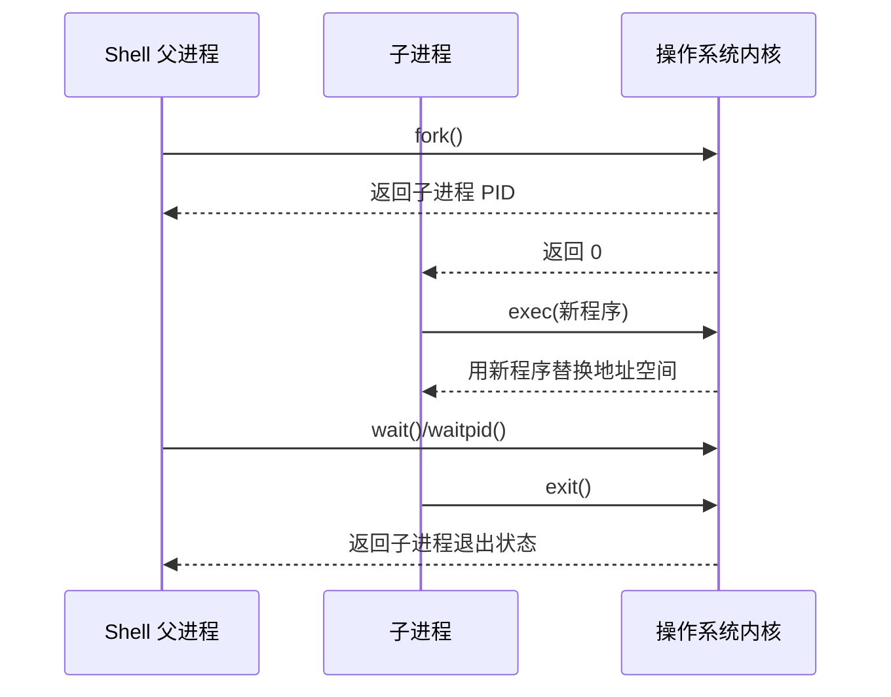


## 4. wait

父进程通过 `wait/waitpid` 等待子进程结束，并回收子进程资源。

如果父进程不 wait，子进程退出后可能变成僵尸进程。


## 5. vfork

`vfork` 创建子进程，但**子进程会暂时共享父进程地址空间，父进程阻塞，直到子进程 exec 或 exit**。

特点：

* 比 fork 更轻量。
* 使用不当很危险。
* 子进程不应该修改父进程数据。

现代系统中，很多场景 fork + COW 已经足够高效。


## 6. 僵尸进程

子进程已经退出，但父进程没有调用 wait 回收其退出状态，这个子进程就变成僵尸进程。

僵尸进程占用：

* PID
* 少量进程表项
* 退出状态信息

解决：

* 父进程调用 wait/waitpid。
* 处理 SIGCHLD。
* 父进程退出后由 init/systemd 接管回收。


## 7. 孤儿进程

父进程先退出，子进程还在运行，这个子进程就是孤儿进程。

**孤儿进程会被 init/systemd 接管，一般不是问题**。


# 十二、用户态、内核态与系统调用

## 1. 用户态和内核态

现代操作系统把 CPU 权限分成不同级别。

用户态：

* 普通程序运行状态。
* 不能直接访问硬件。
* 不能直接访问内核内存。
* 不能执行特权指令。

内核态：

* 操作系统内核运行状态。
* 可以访问硬件。
* 可以管理内存、进程、文件系统、网络等资源。
* 权限更高。


## 2. 为什么要区分用户态和内核态？

原因：

1. 安全性
   防止普通程序破坏系统。

2. 隔离性
   防止一个程序影响其他程序。

3. 稳定性
   普通程序崩溃不应该导致整个系统崩溃。

4. 资源管理
   硬件资源必须由操作系统统一管理。


## 3. 系统调用

系统调用是用户程序请求操作系统服务的接口。

例如：

* `read`
* `write`
* `open`
* `close`
* `fork`
* `exec`
* `mmap`
* `socket`

系统调用大致过程：

1. 用户程序调用库函数。
2. 库函数准备系统调用号和参数。
3. 通过特殊指令陷入内核态。
4. 内核根据系统调用号执行对应函数。
5. 内核完成操作。
6. 返回用户态。
7. 用户程序继续执行。


## 4. 系统调用为什么有开销？

因为涉及：

* 用户态到内核态切换。
* 参数检查。
* 权限检查。
* 内核执行逻辑。
* 内核态返回用户态。
* 可能发生数据拷贝。

所以高性能系统会尽量减少系统调用次数，例如：

* 批量读写。
* 缓冲区。
* mmap。
* sendfile。
* epoll。


# 十三、mmap 与零拷贝

## 1. mmap 是什么？

`mmap` 可以把文件或匿名内存映射到进程虚拟地址空间。

使用 mmap 读文件时，程序可以像访问内存一样访问文件内容。

普通 `read()` 的数据路径：


`mmap()` 的访问路径：

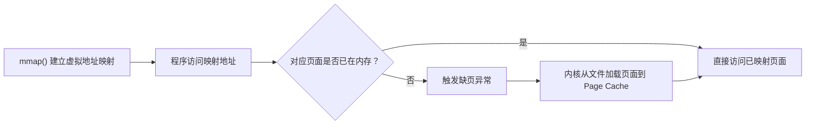

优点：

* 减少一次用户态和内核态之间的数据拷贝。
* 适合随机访问文件。
* 多进程可以共享映射区域。

缺点：

* 编程复杂。
* 页面错误可能带来不可控延迟。
* 文件过大时需要注意地址空间和映射管理。


## 2. 零拷贝

**零拷贝不是完全没有拷贝，而是减少 CPU 参与的数据拷贝**。

普通文件发送、`sendfile()` 和 DMA Scatter-Gather 的数据路径可对比如下：

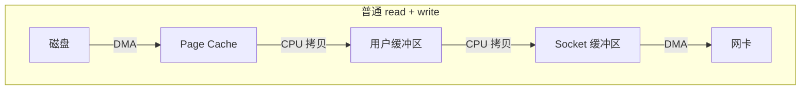
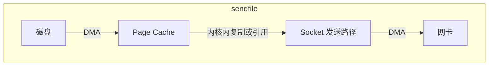
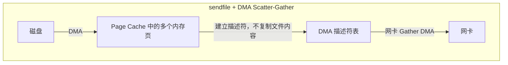
进一步支持 DMA Scatter-Gather 时，网卡可以直接按描述符读取多个不连续内存片段，从而继续减少 CPU 拷贝。

> DMA（Direct Memory Access）：设备可以直接在内存和设备之间传输数据，不需要 CPU 一字节一字节地复制。
> Scatter-Gather：一次 DMA 操作可以处理多个不连续的内存片段。scatter：把设备数据分散写入多个内存区域。gather：从多个不连续的内存区域收集数据并发送给设备。
> 支持 Scatter-Gather 后操作系统不必把数据合并到连续缓冲区，而是向网卡提供一张描述表, 网卡按照描述符依次读取, 组合成连续的网络数据发送，虽然这些数据在内存中不连续，但网卡能够通过 DMA 自己收集，因此叫 Scatter-Gather DMA，即分散—聚集 DMA。


优点：

* 减少 CPU 拷贝。
* 减少上下文切换。
* 提高大文件传输性能。

典型应用：

* Nginx 发送静态文件。
* 文件服务器。
* Kafka 等高吞吐系统。


# 十四、高并发服务器模型

## 1. 一个连接一个线程的问题

传统模型：

```text
一个客户端连接对应一个线程
```

问题：

* 线程数量太多。
* 内存占用大。
* 上下文切换频繁。
* 调度开销大。
* 高并发下性能下降明显。


## 2. Reactor 模型

Reactor 是**同步 IO 多路复用**模型。

核心思想：

> 由事件分发器监听多个 fd，当 fd 就绪后，分发给对应 handler 处理。

流程：

1. epoll 监听事件。
2. 事件就绪。
3. Reactor 分发事件。
4. Handler 执行 read/write。
5. 业务线程处理任务。

特点：

* IO 就绪通知。
* 读写由用户线程完成。
* 常见于 Redis、Nginx、Netty。


## 3. Proactor 模型

Proactor 是异步 IO 模型。


核心思想：

> 用户发起异步 IO，内核完成 IO 后通知用户。

1. 应用程序发起异步 I/O。
2. 操作系统完成实际的数据读写。
3. I/O 完成后，操作系统产生完成事件。
4. Proactor 调用对应的完成处理函数。

伪代码

```cpp
void on_read_complete(const char* data, size_t size) {
    // 执行到这里时，数据已经由操作系统读取完成。
    process(data, size);
}

int main() {
    /*
     * 提交异步读取请求。
     *
     * 调用后通常立即返回，不等待数据到达。
     * 操作系统负责完成实际的 Socket 读取。
     */
    async_read(socket_fd, buffer, on_read_complete);

    /*
     * 等待异步操作的完成通知。
     *
     * 当读取完成后，事件循环会调用
     * on_read_complete()。
     */
    run_completion_loop();
}
```

对应执行路径

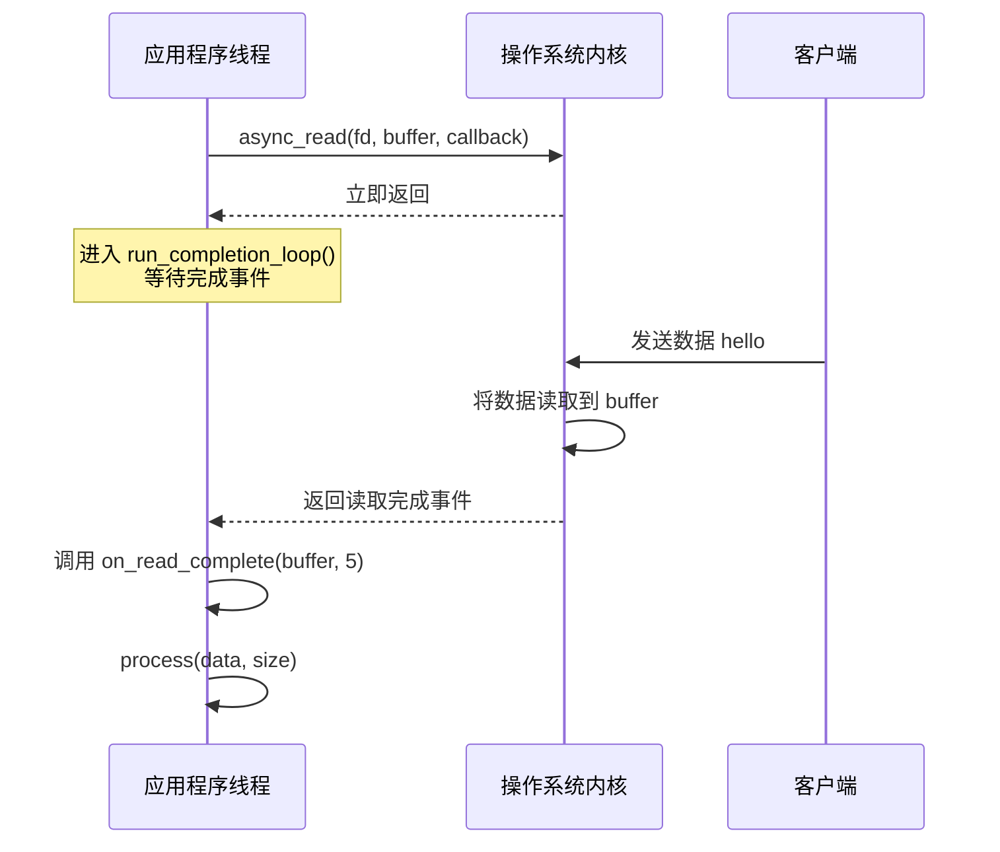


区别：

| 模型    | Reactor    | Proactor |
| -- | - | -- |
| IO 类型 | 同步 IO 多路复用 | 异步 IO    |
| 通知时机  | fd 就绪      | IO 完成    |
| 数据拷贝  | 用户线程完成     | 内核完成     |
| 典型机制  | epoll      | IOCP/AIO |


## 4. Redis 为什么单线程还快？

Redis 快的原因：

1. 主要操作在内存中完成。
2. 使用 IO 多路复用处理大量连接。
3. 单线程避免锁竞争。
4. 数据结构设计高效。
5. 命令执行通常很快。
6. **瓶颈很多时候在网络和内存，而不是 CPU。**

注意：

> Redis 不是所有部分都单线程。现代 Redis 在后台任务、网络 IO 等方面也引入了多线程优化，但核心命令执行长期保持单线程模型。


## 5. Nginx 为什么使用多进程 + IO 多路复用？

Nginx 常见模型：

- master 进程
- 多个 worker 进程
- 每个 worker 使用 epoll

优点：

* 多进程利用多核。
* worker 之间相对隔离，一个崩溃不影响全部。
* 每个 worker 使用 epoll 处理大量连接。
* 避免大量线程切换。
* 适合高并发静态资源和反向代理场景。


# 十五、 一些细节知识点

## 1. 多级页表细节

### 1.1 为什么需要多级页表

进程使用的是虚拟地址，CPU 最终访问的是物理地址。页表负责维护：

```text
虚拟页号 VPN → 物理页框号 PFN
```

如果直接为整个虚拟地址空间建立单级页表，页表会非常大。

以 48 位虚拟地址、4 KiB 页为例：

```text
虚拟页数量 = 2^48 / 2^12 = 2^36
```

如果每个页表项占 8 字节：

```text
页表大小 = 2^36 × 8 = 512 GiB
```

即使进程只使用很少的地址，也需要巨大的页表，因此需要多级页表按需分配。

### 1.2 典型四级页表

典型 x86-64 四级页表将 48 位虚拟地址拆分为：

```text
| 9 位 | 9 位 | 9 位 | 9 位 | 12 位 |
| PGD  | PUD  | PMD  | PTE  | 页内偏移 |
```

每级索引 9 位，因此每张页表有：

```text
2^9 = 512 个页表项
```

每个页表项 8 字节，一张页表正好占：

```text
512 × 8 = 4096 字节 = 1 页
```

地址翻译过程：

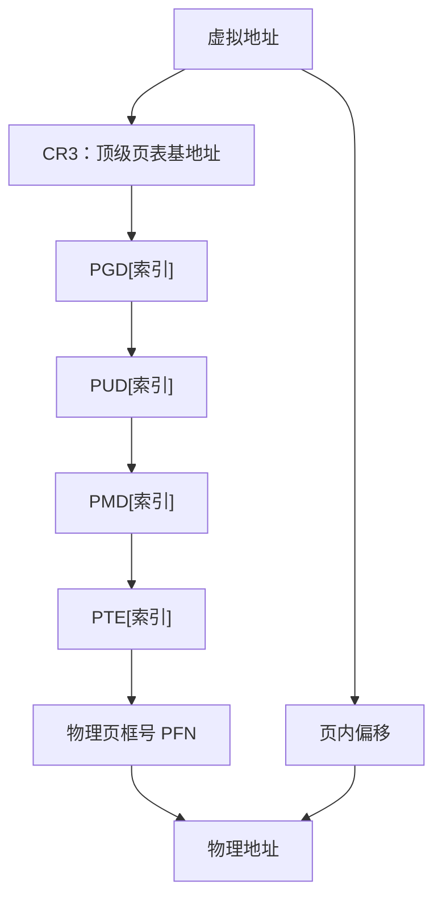

### 1.3 TLB

多级页表意味着一次内存访问可能需要多次访存。CPU 使用 TLB 缓存最近的虚拟页到物理页映射：

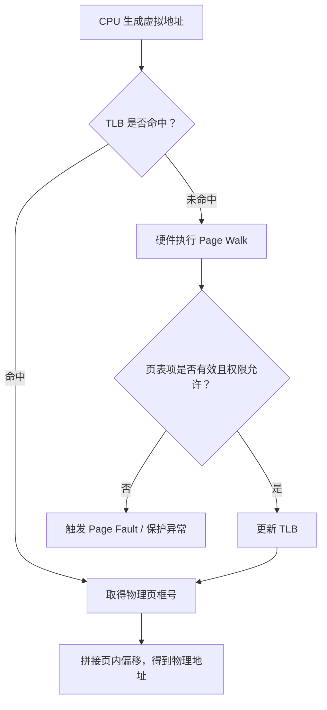

TLB 未命中不等于缺页异常：

- **TLB miss**：映射存在，只是 TLB 没缓存。
- **Page fault**：页表项不存在、权限不允许，或者页面尚未装入。


### 1.4 页表项常见标志

典型页表项包含：

- `Present`：页面是否存在。
- `Read/Write`：是否允许写。
- `User/Supervisor`：用户态是否可访问。
- `Accessed`：页面是否被访问过。
- `Dirty`：页面是否被写过。
- `NX`：禁止执行。
- 物理页框号。

内核可利用 `Accessed` 和 `Dirty` 位进行页面回收、换页和写回判断。

### 1.5 Huge Page

普通页通常为 4 KiB。大页常见为：

- 2 MiB；
- 1 GiB。

大页优点：

- 减少页表层级和页表内存；
- 减少 TLB 项数量；
- 降低 TLB miss。

缺点：

- 内存碎片更严重；
- 分配和回收成本更高；
- 可能造成内部碎片；
- 不一定适合稀疏访问。


### 1.6 缺页异常

常见缺页类型：

#### Minor Page Fault

页面已经在内存中，只是当前进程页表尚未建立映射，例如：

- `fork()` 后第一次写触发 COW；
- 文件页已在 page cache 中；
- 匿名页首次访问。

#### Major Page Fault

页面不在内存，需要从磁盘读取，延迟明显更高。

#### Copy-on-Write

`fork()` 后父子进程共享物理页，并把页表项设置为只读。某一方写入时触发缺页异常：

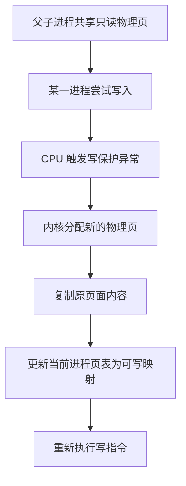

## 2. NUMA

### 2.1 基本概念

NUMA 全称 `Non-Uniform Memory Access` 非一致内存访问

多路 CPU 或多芯片系统中，每个 CPU 节点都有自己的本地内存：

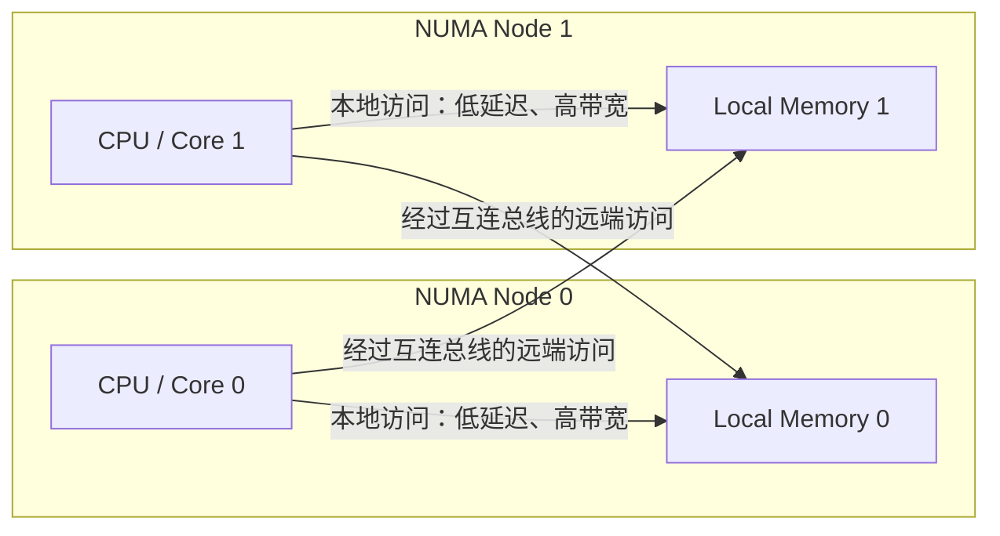

因此，内存访问延迟和带宽不是均匀的。


### 2.2 First Touch

Linux 常采用 First Touch 策略：

> 哪个 CPU 上的线程第一次实际访问某个页面，该页面通常优先分配到该 CPU 所在 NUMA 节点。

错误示例：

- 主线程在 Node 0 初始化全部数组
- 工作线程在 Node 1 处理数组

结果是工作线程大量访问远端内存。

更好的方式：

- 让各工作线程在自己的 CPU 节点上初始化自己负责的数据


### 2.3 线程迁移与远端访问

如果线程从 Node 0 迁移到 Node 1，但数据仍在 Node 0：

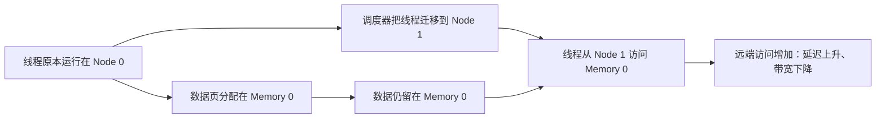

这会导致：

- 延迟升高；
- 内存带宽下降；
- CPU 利用率看似不高，但程序仍然很慢。

内核可进行 NUMA balancing，尝试迁移页面或线程，但迁移本身也有成本。


### 2.4 常用工具

```bash
# 查看 NUMA 拓扑
numactl --hardware

# 查看 CPU、NUMA 节点信息
lscpu

# 查看各 NUMA 节点内存访问情况
numastat

# 将程序绑定到指定 CPU 节点，并优先分配本地内存
numactl --cpunodebind=0 --membind=0 ./app

# 绑定 CPU
taskset -c 0-7 ./app
```


### 2.5 性能优化原则

1. 线程尽量固定在稳定的 CPU 集合。
2. 数据尽量分配在使用它的线程所在节点。
3. 避免线程频繁跨节点迁移。
4. 大型内存应用应观察 `numastat` 中的 remote access。
5. 线程池和内存池最好具有 NUMA 感知能力。


## 3. 缓存一致性

### 3.1 为什么需要缓存一致性

多核 CPU 通常每个核心都有私有缓存：

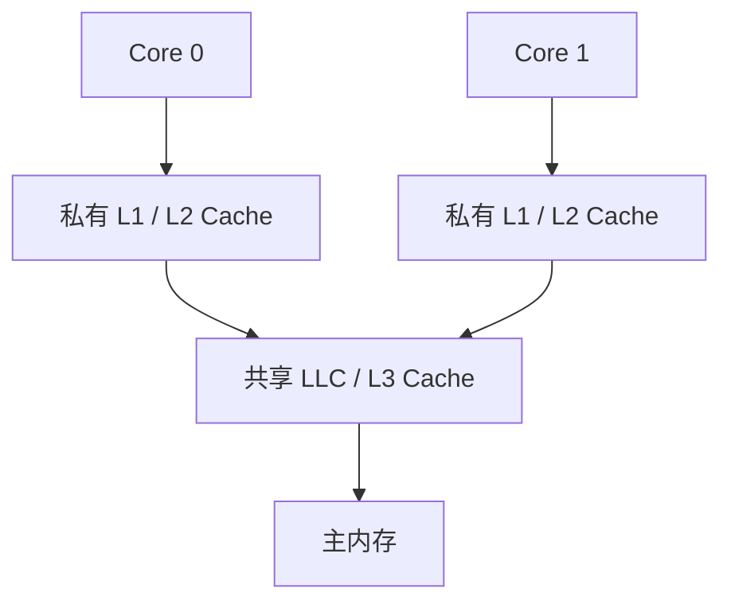

如果多个核心缓存了同一地址，缓存一致性协议必须保证写入能够使其他核心的旧副本失效。

### 3.2 MESI

MESI 的四种典型状态：

- `M`：Modified，当前缓存独占且已修改。
- `E`：Exclusive，当前缓存独占但未修改。
- `S`：Shared，多个核心共享。
- `I`：Invalid，缓存行无效。

两个核心读取同一缓存行后，都可能处于 `S` 状态；Core 0 写入时需要获得独占所有权，并使 Core 1 的副本失效：

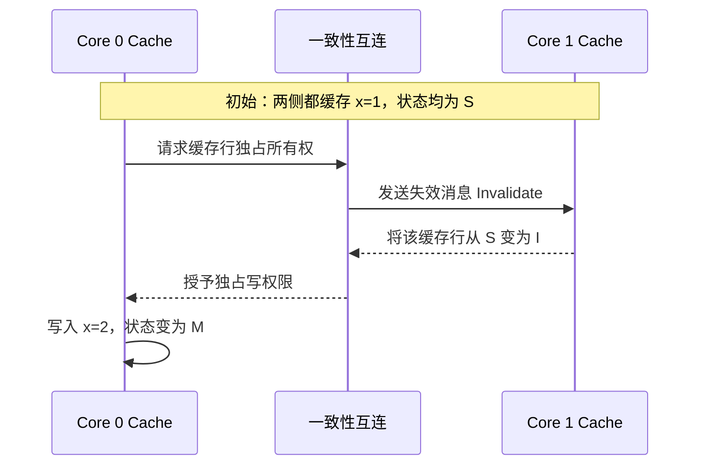

此过程会产生一致性消息和缓存行所有权转移。


### 3.3 缓存行

缓存一致性通常以缓存行为单位，而不是以变量为单位。常见缓存行大小为 64 字节。

如果两个线程修改不同变量，但变量位于同一缓存行，也会互相使缓存失效，这叫 **伪共享**。

```cpp
struct Counter {
    long a;
    long b;
};
```

线程 1 修改 `a`，线程 2 修改 `b`，即使逻辑上没有共享变量，也可能发生缓存行反复转移。

一种缓解方式：

```cpp
struct alignas(64) Counter {
    long value;
};
```

使不同线程频繁修改的数据位于不同缓存行。


### 3.4 一致性与内存顺序不是一回事

缓存一致性解决：

> 同一地址的写入最终如何被其他核心观察。

内存模型解决：

> 不同地址的读写顺序能否被重排。

例如：

```cpp
data = 42;
ready = true;
```

另一个线程可能先观察到 `ready == true`，但尚未观察到 `data == 42`。因此需要原子变量和内存序：

```cpp
data = 42;
ready.store(true, std::memory_order_release);
```

读取线程：

```cpp
if (ready.load(std::memory_order_acquire)) {
    use(data);
}
```


### 3.5 原子操作为何代价较高

原子读改写操作可能需要：

- 获取缓存行独占权；
- 使其他核心缓存副本失效；
- 防止部分指令重排；
- 在高竞争下反复转移缓存行。

所以“无锁”不一定比锁快。大量线程竞争同一原子变量时，也会产生严重缓存抖动。


## 4. 内核调度细节

### 4.1 调度对象

Linux 调度的基本对象是线程。每个线程在内核中由 `task_struct` 描述，包含：

- 线程状态；
- 寄存器上下文；
- 调度策略；
- 优先级；
- CPU 亲和性；
- 内存描述符；
- 文件描述符表等。

### 4.2 可运行队列

每个 CPU 通常有自己的运行队列：

```mermaid
flowchart LR
    R0["CPU 0 Run Queue"] --> C0["CPU 0"]
    R1["CPU 1 Run Queue"] --> C1["CPU 1"]
    R2["CPU 2 Run Queue"] --> C2["CPU 2"]

    R0 <-->|"负载均衡 / 任务迁移"| R1
    R1 <-->|"负载均衡 / 任务迁移"| R2
```

优点：

- 降低全局锁竞争；
- 提高缓存局部性；
- 允许多核并行调度。

代价是需要进行负载均衡，把任务从繁忙 CPU 迁移到空闲 CPU。

### 4.3 调度发生的典型时机

调度器可能在以下时机运行：

1. 当前线程时间片或调度额度用完。
2. 当前线程阻塞，例如等待 I/O、锁或条件变量。
3. 更高优先级线程被唤醒。
4. 当前线程主动调用 `sched_yield()`。
5. 中断返回内核或用户态前发现需要重新调度。
6. CPU 负载均衡触发任务迁移。

### 4.4 上下文切换

线程切换通常包括：

- 保存当前寄存器；
- 恢复下一个线程寄存器；
- 切换内核栈；
- 可能切换页表；
- 更新调度器状态；
- 影响 TLB、分支预测器和 CPU cache。

要区分**用户态/内核态切换**和**任务上下文切换**：

```mermaid
flowchart TD
    subgraph M["用户态 / 内核态切换：线程不变"]
        A1["线程 A：用户态"] -->|"系统调用或异常"| A2["线程 A：内核态"]
        A2 -->|"系统调用返回"| A3["线程 A：用户态"]
    end
```

```mermaid
flowchart TD
    subgraph C["上下文切换：运行任务发生变化"]
        B1["线程 A 正在运行"] -->|"保存 A 的上下文"| B2["调度器选择线程 B"]
        B2 -->|"恢复 B 的上下文"| B3["线程 B 开始运行"]
    end
```

二者可能同时发生，也可能只发生其中一种。

### 4.5 调度类

Linux 使用调度类组织不同策略。概念上包括：

- 停机类；
- Deadline；
- 实时调度；
- 普通公平调度；
- Idle。

不同调度类之间先比较类别优先级，同一类别内部再使用各自算法。

### 4.6 CPU 亲和性

CPU affinity 限制线程可以运行在哪些 CPU 上：

```bash
taskset -c 0,1 ./app
```

优点：

- 提高 cache 和 TLB 局部性；
- 降低跨 NUMA 节点迁移；
- 降低抖动。

缺点：

- 绑定不合理会造成负载不均衡；
- CPU 忙时不能灵活迁移。

## 5. Linux CFS 调度

### 5.1 核心目标

CFS 全称 `Completely Fair Scheduler` 完全公平调度器

核心思想：

> 假设存在一个理想处理器，所有可运行任务可以同时按权重分享 CPU。真实系统通过轮流运行任务来逼近这一理想状态。

### 5.2 vruntime

CFS 为每个任务维护虚拟运行时间 `vruntime`。

简化公式：

```text
vruntime += 实际运行时间 × 基准权重 / 当前任务权重
```

- 普通权重任务：`vruntime` 按正常速度增长。
- 高优先级任务：权重大，`vruntime` 增长较慢。
- 低优先级任务：权重小，`vruntime` 增长较快。

调度器倾向选择 `vruntime` 最小的任务运行。


### 5.3 nice 值

nice 值通常范围：

```text
-20 到 19
```

- nice 越小，权重越高；
- nice 越大，权重越低。

它不是简单的“固定优先级”，而是影响任务获得 CPU 的比例。


### 5.4 红黑树

经典 CFS 使用红黑树组织可运行任务，越靠左的任务 `vruntime` 越小：

```mermaid
flowchart TD
    T["按 vruntime 排序的红黑树"] --> L["最左侧任务<br/>vruntime 最小"]
    T --> R["右侧任务<br/>vruntime 较大"]
    L --> X["选择最左侧任务运行"]
    X --> U["运行后更新 vruntime"]
    U --> I["重新插入红黑树"]
    I --> T
```

调度器反复选择 `vruntime` 最小的任务运行。

红黑树使插入和删除复杂度约为`O(log n)`

### 5.5 调度周期与运行额度

CFS 没有传统意义上固定不变的时间片。它会根据：

- 可运行任务数量；
- 目标调度周期；
- 最小粒度；
- 任务权重；

计算某个任务的理想运行时间。

简化理解：

```text
任务份额 = 当前任务权重 / 所有可运行任务权重之和
```

```text
理想运行时间 = 调度周期 × 任务份额
```

### 5.6 睡眠任务唤醒

I/O 密集型任务经常睡眠。唤醒后，它的 `vruntime` 通常会被限制在合理范围内，避免因为长时间未运行而无限抢占 CPU。

这使交互式、I/O 密集型任务通常具有较好的响应性。


### 5.7 CFS 相关疑问

**CFS 是否保证每个任务获得完全相同 CPU 时间？**  
不保证。它按权重公平，不是绝对相等。

**nice 值是否等于实时优先级？**  
不是。nice 只影响普通调度类中的权重。实时调度策略优先级高于普通 CFS 任务。

**为什么 CFS 适合普通任务，不适合硬实时？**  
因为它追求长期公平，不提供严格的截止时间保证。


## 6. io_uring

### 6.1 传统 I/O 的问题

传统异步或高并发 I/O 通常涉及多次系统调用：

- 提交请求 → 系统调用
- 等待事件 → 系统调用
- 读取/写入 → 系统调用

系统调用会带来：

- 用户态与内核态切换；
- 参数复制；
- 调用和返回开销；
- 高频事件处理成本。


### 6.2 基本结构

`io_uring` 使用两个环形队列：

- SQ：Submission Queue，提交队列；
- CQ：Completion Queue，完成队列。

```mermaid
flowchart LR
    subgraph U["用户态与内核共享映射的 Ring"]
        SQ["SQ：Submission Queue<br/>提交 I/O 请求"]
        CQ["CQ：Completion Queue<br/>读取完成结果"]
    end

    K["内核 I/O 执行路径"]
    SQ -->|"提交 SQE"| K
    K -->|"写入 CQE"| CQ
```

用户态和内核通过共享内存访问队列，减少反复复制和系统调用。


### 6.3 基本执行流程


```mermaid
sequenceDiagram
    participant App as 应用程序
    participant SQ as Submission Queue
    participant Kernel as 操作系统内核
    participant CQ as Completion Queue

    App->>App: 创建 io_uring
    App->>SQ: 获取并填写 SQE
    App->>SQ: 提交操作类型、fd、buffer、长度
    SQ->>Kernel: 通知内核处理请求
    Kernel->>Kernel: 执行 I/O
    Kernel->>CQ: 写入 CQE
    App->>CQ: 读取完成结果
    App->>App: 根据 res 和 user_data 处理请求
```

伪代码：

```cpp
io_uring ring;
io_uring_queue_init(256, &ring, 0);

io_uring_sqe* sqe = io_uring_get_sqe(&ring);
io_uring_prep_read(sqe, fd, buffer, size, offset);

sqe->user_data = request_id;

io_uring_submit(&ring);

io_uring_cqe* cqe;
io_uring_wait_cqe(&ring, &cqe);

int result = cqe->res;
io_uring_cqe_seen(&ring, cqe);
```


### 6.4 SQE 与 CQE

#### SQE

描述一个待执行的 I/O 操作，例如：

- `READ`；
- `WRITE`；
- `ACCEPT`；
- `CONNECT`；
- `SEND`；
- `RECV`；
- `TIMEOUT`。

#### CQE

描述一个已完成操作：

- `res`：返回值或错误码；
- `user_data`：应用提交时关联的上下文。

通过 `user_data`，应用可以知道完成事件属于哪个请求。


### 6.5 高级特性

#### 批量提交和批量完成

一次提交多个 SQE，减少系统调用。

#### Registered Buffer

提前把缓冲区注册给内核，减少每次 I/O 的页固定和地址检查成本。

#### Registered File

提前注册文件描述符，减少重复查找。

#### SQPOLL

内核线程轮询提交队列，应用提交请求后可能不必每次执行系统调用。

#### Linked Operations

把多个操作串联：

```mermaid
flowchart LR
    A["读取文件"] -->|"成功后继续"| B["发送到网络"]
    B -->|"关联超时约束"| C["超时处理"]
    A -. "失败则取消后续操作" .-> X["终止链"]
    B -. "失败则取消后续操作" .-> X
```

前一个失败时可以取消后续操作。

### 6.6 io_uring 与 epoll

`epoll` 是就绪通知模型，`io_uring` 更接近完成通知模型：

```mermaid
flowchart LR
    subgraph E["epoll：Readiness"]
        E1["内核通知 fd 可读"] --> E2["应用调用 read()"]
        E2 --> E3["应用获得数据"]
    end

    subgraph U["io_uring：Completion"]
        U1["应用提前提交 read 请求"] --> U2["内核执行 I/O"]
        U2 --> U3["内核返回完成事件 CQE"]
    end
```

因此：

- `epoll` 更接近 Reactor；
- `io_uring` 可构建更接近 Proactor 的模型。


### 6.7 常见问题

1. 异步操作期间 buffer 必须保持有效。
2. CQ 消费过慢可能形成积压。
3. 需要处理请求取消、超时和部分完成。
4. 写操作可能只完成部分数据。
5. io_uring 不是所有场景都比 epoll 快，小规模连接下差异可能不明显。
6. 程序必须建立背压机制，不能无限提交请求。


## 7. cgroups 和 namespace

### 7.1 二者分工

一句话区分：

```mermaid
flowchart LR
    P["容器或进程组"] --> N["namespace<br/>隔离系统视图"]
    P --> C["cgroups<br/>限制和统计资源"]
    N --> N1["PID、Mount、Network、UTS、IPC、User"]
    C --> C1["CPU、Memory、I/O、PIDs、cpuset"]
```


### 7.2 namespace

namespace 为进程提供隔离的系统视图。

常见类型：

| Namespace | 隔离内容 |
|||
| PID | 进程号与进程树 |
| Mount | 挂载点和文件系统视图 |
| Network | 网卡、路由、端口、协议栈 |
| UTS | 主机名和域名 |
| IPC | System V IPC、消息队列、共享内存 |
| User | UID、GID 和 capability |
| Cgroup | cgroup 路径视图 |
| Time | 某些时间相关视图 |

创建 namespace 的常见接口：

```text
clone()
unshare()
setns()
```

命令示例：

```bash
# 创建新的 PID、Mount、UTS namespace
unshare --pid --mount --uts --fork /bin/bash

# 进入已有进程的 namespace
nsenter -t <pid> -n -m -p
```


### 7.3 PID Namespace

容器中的进程可能看到自己是 PID 1：

```text
宿主机 PID：32561
容器内 PID：1
```

PID namespace 是嵌套的。父 namespace 可以看到子 namespace 中的进程，子 namespace 不能看到父 namespace 的进程。

容器 PID 1 需要承担：

- 回收僵尸进程；
- 处理信号；
- 正确转发终止信号。


### 7.4 Network Namespace

每个网络 namespace 可以拥有独立的：

- 网卡；
- IP 地址；
- 路由表；
- iptables/nftables 规则；
- Socket 和端口空间。

容器网络常通过 veth pair 连接：

```mermaid
flowchart LR
    C["容器 Network Namespace<br/>eth0"] <-->|"veth pair"| V["宿主机 veth"]
    V --> B["Linux Bridge"]
    B --> P["宿主机物理网卡"]
```

### 7.5 cgroups

cgroups 用于：

- 资源统计；
- 资源限制；
- 优先级控制；
- 进程分组。

常见控制器：

- `cpu`；
- `memory`；
- `io`；
- `pids`；
- `cpuset`。

cgroups v2 使用统一层级：

```text
/sys/fs/cgroup/
```

### 7.6 常见限制

### CPU

`cpu.max` 可限制 CPU 配额：

```text
quota period
```

例如：

```bash
echo "50000 100000" > cpu.max
```

表示每 100 ms 最多使用 50 ms CPU 时间，相当于约 0.5 个 CPU。

#### 内存

```bash
echo 1G > memory.max
```

超过限制后，可能触发 cgroup 内部回收或 OOM。

#### 进程数量

```bash
echo 100 > pids.max
```

限制该 cgroup 最多创建 100 个进程或线程。


### 7.7 一些疑问

**namespace 是否能限制资源？**  
不能。它主要负责隔离视图。

**cgroups 是否能隐藏宿主机进程？**  
不能。隐藏进程属于 PID namespace 的职责。

**容器内存不足时一定会杀宿主机进程吗？**  
通常优先在对应 memory cgroup 内选择进程处理，但实际行为还与内核配置和系统内存状态有关。


## 8. 容器底层原理

### 8.1 容器不是虚拟机

虚拟机和容器的层级结构不同：

```mermaid
flowchart TD
    subgraph VM["虚拟机"]
        VH["宿主机硬件 / 宿主机系统"] --> HV["Hypervisor"]
        HV --> GK["客户机内核"]
        GK --> GA["客户机用户程序"]
    end
```

```mermaid
flowchart TD
    subgraph CT["容器"]
        CH["宿主机硬件"] --> HK["共享的宿主机内核"]
        HK --> ISO["namespace + cgroups + rootfs"]
        ISO --> CP["容器进程"]
    end
```

多个容器共享宿主机内核，因此：

- 启动快；
- 额外内存开销小；
- 隔离强度通常弱于虚拟机。


### 8.2 容器的核心组成

一个容器通常由以下机制共同构成：

1. namespace：隔离系统视图。
2. cgroups：限制资源。
3. rootfs：提供独立文件系统视图。
4. OverlayFS：实现镜像分层。
5. capability：拆分 root 权限。
6. seccomp：过滤系统调用。
7. LSM：SELinux/AppArmor 等安全控制。
8. veth、bridge、NAT：实现容器网络。
9. runtime：创建并管理容器进程。


### 8.3 镜像分层

容器镜像由多个只读层组成，启动容器后再叠加一个可写层：

```mermaid
flowchart TB
    W["容器可写层"]
    L3["只读 Layer 3：应用程序"]
    L2["只读 Layer 2：运行时"]
    L1["只读 Layer 1：基础系统"]
    V["OverlayFS 合并后的统一文件系统视图"]

    W --> V
    L3 --> V
    L2 --> V
    L1 --> V
```

修改只读层中的文件时，会发生 `copy-up`：

```mermaid
flowchart LR
    R["只读镜像层中的原文件"] -->|"复制到上层"| W["容器可写层"]
    W --> M["在可写副本上修改"]
    M --> V["OverlayFS 向容器呈现修改后的文件"]
```


### 8.4 容器启动流程

简化流程：

```mermaid
flowchart TD
    A["解析镜像与容器配置"] --> B["准备 rootfs 和 OverlayFS"]
    B --> C["创建各类 namespace"]
    C --> D["创建 cgroup 并设置资源限制"]
    D --> E["配置 veth、bridge、路由和 NAT"]
    E --> F["设置 UID/GID、capability、seccomp"]
    F --> G["切换根文件系统"]
    G --> H["exec 容器入口程序"]
    H --> I["容器进程作为宿主机普通进程运行"]
```


容器进程最终仍然是宿主机上的普通 Linux 进程。


### 8.5 运行时栈

常见调用链可概括为：

```mermaid
flowchart TD
    A["Docker CLI"] --> B["Docker daemon"]
    B --> C["containerd"]
    C --> D["OCI Runtime<br/>例如 runc"]
    D --> E["Linux 内核接口<br/>clone / unshare / mount / cgroups"]
    E --> F["容器进程"]
```

OCI runtime 负责最终调用内核接口创建容器进程。


### 8.6 容器网络

典型 bridge 模式：

```mermaid
flowchart LR
    C["容器 eth0"] <-->|"veth pair"| V["宿主机 veth"]
    V --> B["Linux Bridge"]
    B --> N["iptables / nftables NAT"]
    N --> E["外部网络"]
```

同一宿主机容器之间可通过 bridge 通信。访问外部网络时，通常通过 NAT 转换源地址。


### 8.7 容器安全边界

容器共享宿主机内核，因此内核漏洞可能影响所有容器。

常见强化手段：

- 非 root 用户运行；
- user namespace；
- 删除不必要 capability；
- seccomp 限制系统调用；
- SELinux/AppArmor；
- 只读 rootfs；
- 禁止 privileged；
- 限制设备访问；
- 使用独立内核的轻量虚拟化方案。

# 十六、常见排查

## 1. CPU 占用率很高怎么排查？

思路：

1. `top` 查看哪个进程 CPU 高。
2. `top -H -p pid` 查看哪个线程 CPU 高。
3. 将线程 ID 转成十六进制。
4. 对 Java 可用 `jstack` 查线程栈。
5. 对 C/C++ 可用 `perf top`、`gdb`、火焰图。
6. 判断是死循环、锁竞争、频繁 GC、系统调用过多还是上下文切换过多。

常见原因：

* 死循环。
* 忙等。
* 锁竞争。
* 频繁 GC。
* 线程数过多。
* 系统调用频繁。
* 正则、序列化、压缩等 CPU 密集任务。


## 2. 内存占用高怎么排查？

思路：

1. `free -h` 查看系统内存。
2. `top` 查看进程内存。
3. `pmap` 查看进程内存映射。
4. 查看是否有内存泄漏。
5. 查看是否频繁 swap。
6. Java 程序看堆、直接内存、元空间、线程栈。
7. C/C++ 程序可用 valgrind、asan、heap profiler。

常见原因：

* 内存泄漏。
* 缓存无限增长。
* 大对象未释放。
* 线程太多导致栈占用高。
* mmap 文件过多。
* 容器内存限制配置不合理。


## 3. 磁盘 IO 高怎么排查？

常用工具：

* `iostat`
* `iotop`
* `vmstat`
* `pidstat`

关注指标：

* 磁盘利用率。
* await 延迟。
* 读写吞吐。
* IOPS。
* 是否频繁 swap。
* 是否有大量日志写入。

常见原因：

* 日志量过大。
* 数据库刷盘。
* 频繁 swap。
* 大量小文件读写。
* 页面缓存失效。
* 磁盘故障或性能瓶颈。


## 4. 网络 IO 问题怎么排查？

常用工具：

* `ss`
* `netstat`
* `iftop`
* `tcpdump`
* `sar`
* `ping`
* `traceroute`

关注：

* 连接数。
* TIME_WAIT 数量。
* CLOSE_WAIT 数量。
* 丢包。
* 重传。
* 带宽。
* listen backlog。
* fd 是否耗尽。

常见原因：

* 连接泄漏。
* 对端不关闭连接。
* fd 上限不足。
* backlog 太小。
* 网络拥塞。
* DNS 慢。
* 下游服务慢。


## 5. 线上服务突然变慢怎么分析？

可以按这个顺序分析：

1. 先确认现象
   是整体慢，还是部分接口慢？是平均延迟升高，还是 P99 升高？

2. 看 CPU
   是否打满？是否上下文切换过多？是否锁竞争？

3. 看内存
   是否内存不足？是否 swap？是否 GC 频繁？

4. 看磁盘
   是否 IO wait 高？日志或数据库写入是否异常？

5. 看网络
   是否丢包、重传、连接数异常？

6. 看线程
   是否线程池耗尽？是否大量阻塞？

7. 看文件描述符
   是否 fd 泄漏或达到上限？

8. 看依赖服务
   数据库、缓存、RPC、消息队列是否变慢？

9. 看日志
   是否有错误、超时、OOM、连接失败？

10. 看最近变更
    是否刚上线代码、改配置、扩缩容、流量突增？


# 十七、常见疑问

## 1. malloc 一定会立刻分配物理内存吗？

不一定。

`malloc` 通常只是分配虚拟地址空间，物理内存可能在真正访问时才通过缺页中断分配。

这叫**按需分页**。


## 2. 进程崩溃会影响其他进程吗？

一般不会。

因为进程之间地址空间隔离，一个进程崩溃通常不会破坏其他进程内存。

但**如果它们共享资源，例如共享内存、文件、数据库连接、锁，可能产生间接影响**。


## 3. 线程崩溃会影响整个进程吗？

通常会。

同一进程内多个线程共享地址空间，一个线程非法写内存可能破坏整个进程的数据结构，严重时导致整个进程崩溃。


## 4. 栈和堆区别是什么？

| 对比点  | 栈           | 堆           |
| - | -- | -- |
| 管理方式 | 编译器/运行时自动管理 | 程序员或 GC 管理  |
| 生命周期 | 随函数调用创建和销毁  | 手动释放或 GC 回收 |
| 空间大小 | 通常较小        | 通常较大        |
| 分配速度 | 快           | 相对慢         |
| 常见问题 | 栈溢出         | 内存泄漏、碎片     |


## 5. 栈溢出是什么？

栈空间耗尽。

常见原因：

* 递归太深。
* 局部变量过大。
* 无限递归。


## 6. 内存泄漏是什么？

程序申请的堆内存不再使用，但没有释放，导致可用内存越来越少。

C/C++ 中常见于：

* `malloc` 后没有 `free`。
* `new` 后没有 `delete`。
* 智能指针循环引用。


## 7. 文件描述符是什么？

文件描述符是内核为进程打开的文件、socket、管道等资源分配的整数编号。

常见：

* 0：标准输入
* 1：标准输出
* 2：标准错误

**文件描述符属于进程资源**。


## 8. FILE* 和文件描述符区别

| 对比点  | 文件描述符 fd        | FILE*              |
| - |  |  |
| 层次   | 系统调用层           | C 标准库层             |
| 类型   | int             | 结构体指针              |
| 缓冲   | 通常无用户态缓冲        | 有 stdio 缓冲         |
| 常用函数 | read/write/open | fread/fwrite/fopen |

`FILE*` 底层通常封装了 fd。


## 9. 缓冲 IO 和非缓冲 IO

缓冲 IO：

* 数据先进入用户态缓冲区。
* 减少系统调用次数。
* 例如 `stdio` 的 `fread/fwrite`。

非缓冲 IO：

* 每次更直接调用系统调用。
* 控制更精细。
* 但频繁调用开销大。


