# 1. Wasm 的整体运行模型

**Wasm 是一种运行在宿主环境中的安全沙箱字节码模型。它本身只定义计算、内存、函数、表、全局变量、导入导出等抽象，不直接等价于一个完整操作系统进程。**

Wasm 的“模型”可以从三个层次理解：

- 源码语言层：C++ / Rust / Go / AssemblyScript
  
↓ 编译

- 模块层：.wasm 模块

↓ 加载、验证、实例化

- 运行层：Wasm Runtime / 浏览器 / Node.js / Wasmtime

一个 Wasm 程序不是直接裸跑在操作系统上，而是由一个 **宿主 Host** 加载并执行。

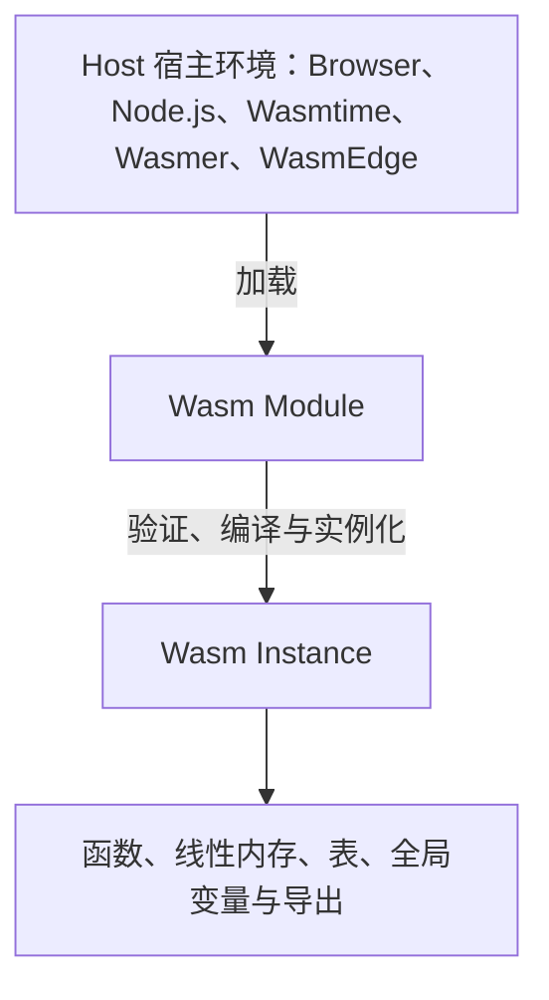

类比一下：

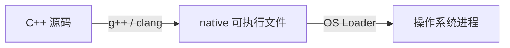

Wasm 则是：

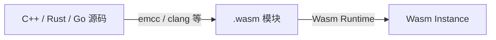

区别在于：

- native 程序：默认可以调用系统调用、访问进程虚拟地址空间、链接动态库
- Wasm 程序：默认被沙箱限制，外部能力必须由宿主明确提供

---

# 2. Wasm 的核心对象：Module 和 Instance

Wasm 模型里最重要的两个概念是：
- Module   ：静态模块，类似“可执行文件/动态库”
- Instance ：运行时实例，类似“加载后的程序实例”


## 2.1 Module：静态模块

`.wasm` 文件本质上是一个 **Module**。

包含:

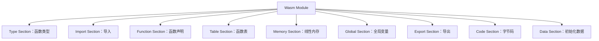

Module 是静态的，类似ELF 文件、class 文件、so 文件，它还没有真正开始运行。

---

## 2.2 Instance：运行时实例

Module 被 Runtime 加载后，会进行：

**解析 → 验证 → 编译/解释 → 实例化**

实例化之后得到 **Instance**。

Instance 中有真正的运行时状态：
- 函数实例
- 内存实例
- 表实例
- 全局变量实例
- 导入绑定
- 导出接口

同一个 `.wasm` Module 可以被实例化多次：

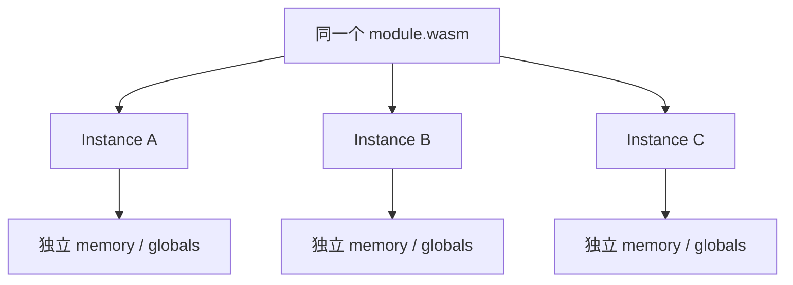

每个实例可以有独立的内存和全局变量。


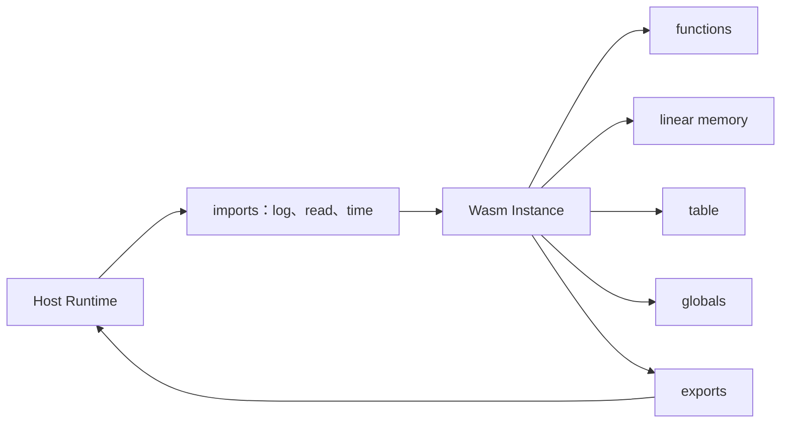

---

# 3. Wasm 的执行模型：栈式虚拟机

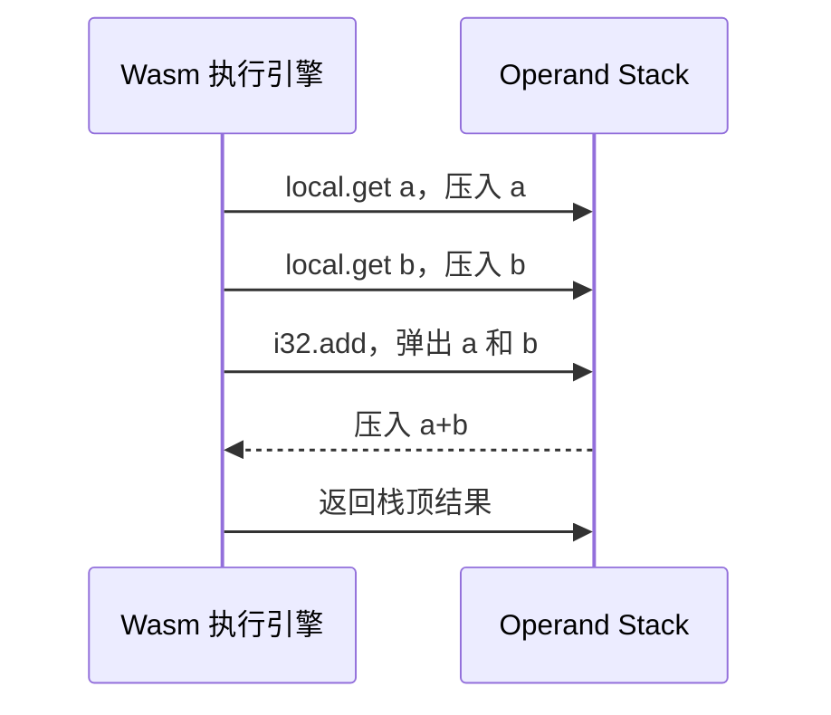


Wasm 是一种 **栈式虚拟机模型**, 主要通过一个 **操作数栈 operand stack** 传递中间值。

例如一个简单表达式：

```cpp
int add(int a, int b) {
    return a + b;
}
```

对应的 WAT 形式大概类似：

```wasm
(func $add (param $a i32) (param $b i32) (result i32)
  local.get $a
  local.get $b
  i32.add
)
```

执行过程：

```text
local.get $a   → 把 a 压入栈
local.get $b   → 把 b 压入栈
i32.add        → 弹出两个 i32，相加，再把结果压栈
return         → 返回栈顶结果
```

画出来是：

- 初始栈：
`[]`

- 执行 `local.get a`：
`[a]`

- 执行 `local.get b`：
`[a, b]`

- 执行 `i32.add`：
`[a + b]`

这就是 Wasm 的基本执行方式。

---

# 4. Wasm 的类型模型

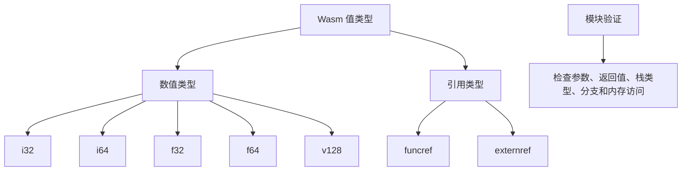


Wasm 的基础数值类型主要包括：

- i32   32 位整数
- i64   64 位整数
- f32   32 位浮点数
- f64   64 位浮点数
- v128  128 位 SIMD 向量

还有引用类型，例如：

- funcref
- externref

函数类型由参数和返回值决定：

```text
(param i32 i32) (result i32)
```

表示：

```cpp
int func(int, int);
```

Wasm 是强类型的。模块在运行前会被验证，Runtime 会检查：

- 函数参数类型是否匹配
- 返回值类型是否匹配
- 栈上的值类型是否正确
- 分支目标是否合法
- 内存访问是否合法
- 导入导出类型是否匹配


所以 Wasm 在执行前有一个重要阶段， **Validation 验证**。如果验证不通过，模块不会被执行。

---

# 5. Wasm 的内存模型：线性内存

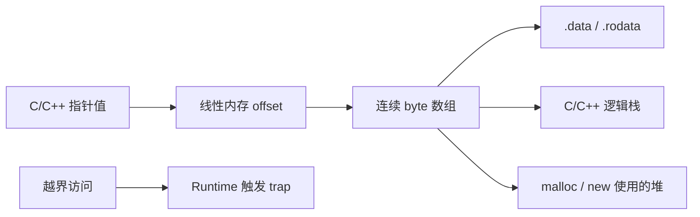


Wasm 的内存不是普通进程虚拟地址空间，而是一块连续的 **线性内存 linear memory**。

可以理解成

**memory = 一个很大的 byte 数组**


例如：

```text
Wasm Linear Memory
┌─────────────────────────────────────┐
│ byte 0                              │
│ byte 1                              │
│ byte 2                              │
│ ...                                 │
│ byte N                              │
└─────────────────────────────────────┘
```

C++ 里的指针，在 Wasm 里通常表现为**线性内存中的偏移量**

比如：

```cpp
int* p = (int*)1000;
```

在 Wasm 里，本质上就是：

**从 linear memory 的 offset = 1000 位置读写 int**

---

## 5.1 Wasm 内存以 page 为单位增长

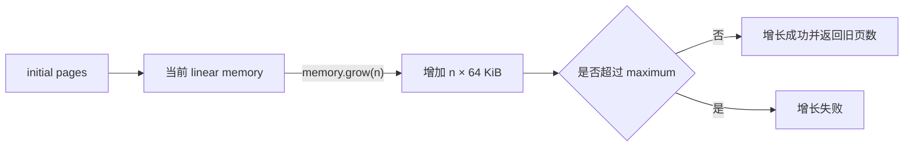


Wasm 内存以 page 为单位：

```text
1 page = 64 KiB
```

内存可以增长`memory.grow`, 但是一般不能随意缩小。

例如初始内存 10 pages, 最大内存 100 pages, 也就是初始 640 KiB，最大 6.4 MiB。当然实际项目里可能更大。

---

## 5.2 Wasm 不能越界访问内存

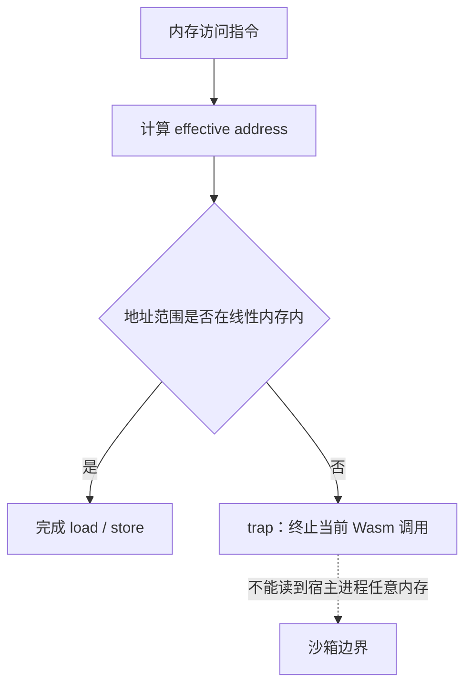


如果 Wasm 访问线性内存越界，会产生 **trap**。

例如 memory size = 1 MiB，访问 offset = 2 MiB

结果不是读到宿主进程内存，而是：

**trap：运行时异常，中止当前 Wasm 执行**

这就是 Wasm 沙箱安全的重要基础。

Native C++ 中，越界访问可能破坏进程内存；Wasm 中，越界访问会被 Runtime 检测并拦截。

---

## 5.3 C++ 的堆和栈在哪里？

C++ 编译成 Wasm 后，C++ 层面仍然有栈、堆、全局变量区、静态数据区

但这些通常都被放进 Wasm 的线性内存里。

```text
Wasm Linear Memory
┌──────────────────────────────┐      
│ .data / .rodata              │
├──────────────────────────────┤
│ C/C++  stack                 │
├──────────────────────────────┤
│ C/C++ heap                   │
│ malloc / new                 │
└──────────────────────────────┘
```

所以：

```cpp
new int(10);
malloc(1024);
std::vector<int> v;
```

这些分配出来的数据，最终也在 Wasm linear memory 里面。

---

# 6. Wasm 的函数模型

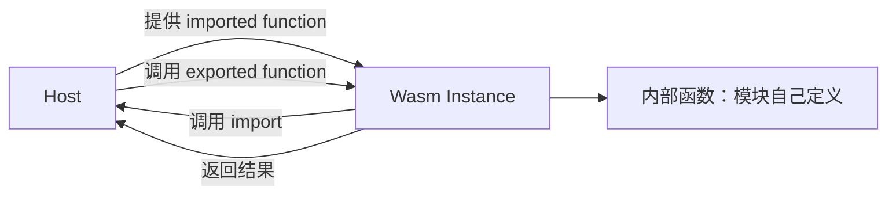


Wasm 函数分两类：

- 内部函数：模块自己定义的函数
- 导入函数：从宿主环境传进来的函数


例如一个 Wasm 模块可能导入：

```text
console.log
read_file
current_time
random
socket_send
```

不过这些能力不是 Wasm 默认拥有的，而是宿主提供的。

---

## 6.1 导出函数

Wasm 可以把函数导出给宿主调用。

例如 C++：

```cpp
extern "C" int add(int a, int b) {
    return a + b;
}
```

编译成 Wasm 后，可以导出为`exports.add`

JavaScript 里可以这样调用：

```js
const result = instance.exports.add(3, 4);
console.log(result);
```

调用链：

JavaScript -> 调用 -> Wasm exported function -> 返回结果给 JavaScript

---

## 6.2 导入函数

Wasm 也可以调用宿主提供的函数。

例如 Wasm 需要打印日志，但是Wasm 本身没有 printf 到终端的能力

它必须通过宿主导入一个函数`import log`

然后执行时 Wasm 调用 log, Host 实际执行 `console.log` 或 stdout 输出

这体现了 Wasm 的核心思想：

> **Wasm 只负责安全计算，外部能力由 Host 显式注入。**

---

# 7. Wasm 的表模型：Table

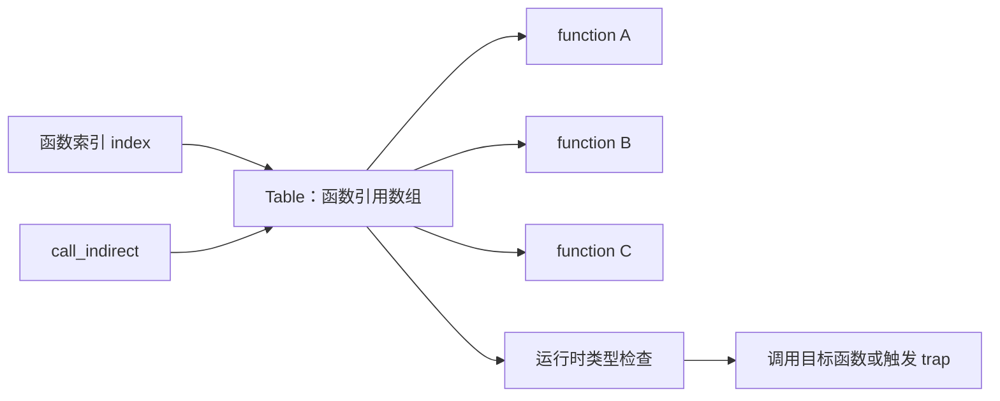


Wasm 中还有一个重要结构叫 **Table**。

Table 可以理解成函数引用数组

它主要用于：

- 间接函数调用
- 函数指针
- 虚函数调用
- 动态分发

C++ 里有函数指针：

```cpp
int (*fp)(int, int);
```

还有虚函数：

```cpp
class Base {
public:
    virtual void f();
};
```

这些编译到 Wasm 后，可能会用到 **table + call_indirect**。

**Table**:
- index 0 → function A
- index 1 → function B
- index 2 → function C

Wasm 可以通过索引调用函数：

```text
call_indirect table[index]
```

---

# 8. Wasm 的全局变量模型：Global

Wasm 支持全局变量`global`


全局变量可以是`mutable`, `immutable`

例如：

```wasm
(global $counter (mut i32) (i32.const 0))
```

表示一个可变的 i32 全局变量。

它可以用于：
- 保存栈指针
- 保存运行时状态
- 保存全局配置

C++ 程序里的某些全局变量，也会被编译到 Wasm 的数据区或 global 里。

---

# 9. Wasm 的导入/导出模型

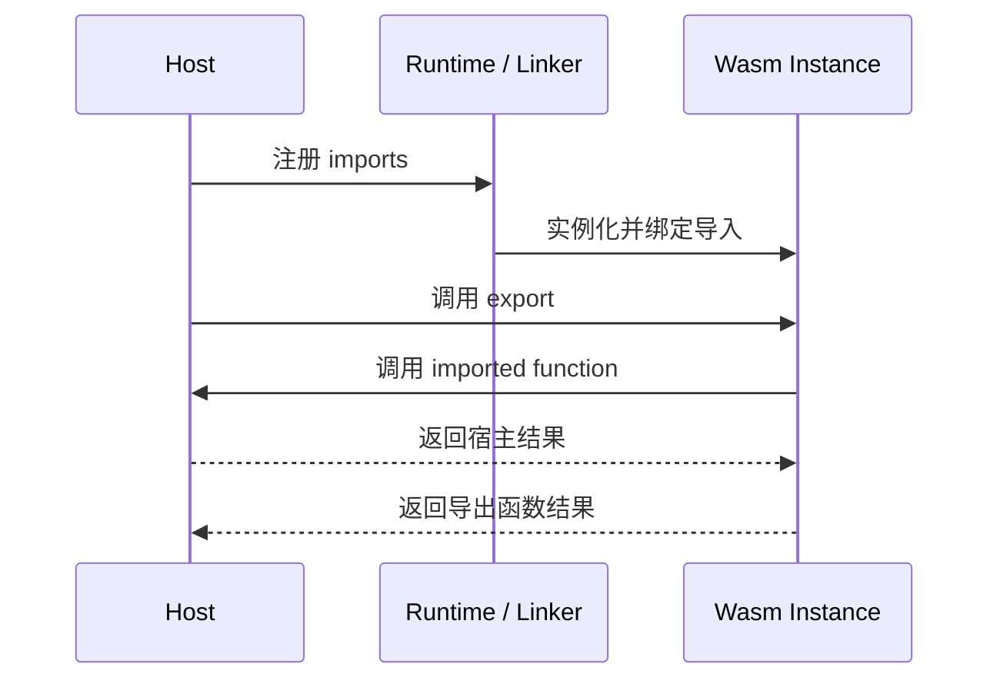


一个 Wasm 模块和宿主之间通过 **import/export** 交互。

```text
Host
 │
 │ 提供 imports
 ▼
Wasm Instance
 │
 │ 暴露 exports
 ▼
Host 调用
```

比如：

```text
imports:
  env.print
  env.now
  wasi_snapshot_preview1.fd_write

exports:
  add
  main
  memory
```

浏览器场景：
- JavaScript 提供 import
- Wasm 提供 export

服务端 WASI 场景：

- WASI Runtime 提供文件、时间、环境变量等能力
- Wasm 模块调用 WASI API

---

# 10. Wasm 的宿主模型：Host Environment

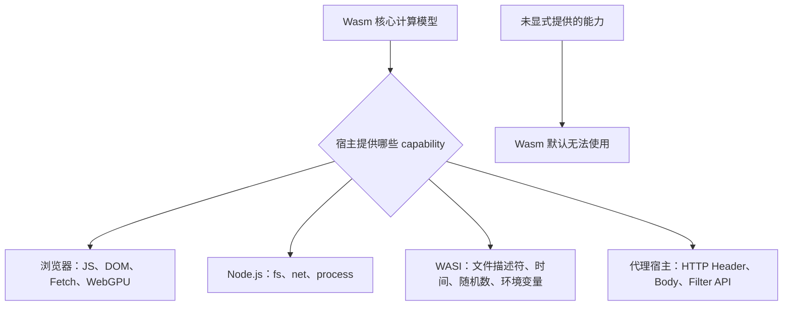


Wasm 自己不是完整操作系统。

它**没有**默认拥有：
- 文件系统
- 网络
- 线程
- 进程
- 环境变量
- 系统时间
- 随机数
- 标准输入输出
- DOM
- GPU
- 数据库连接


这些都要由 Host 提供。

不同 Host 提供的能力不同：

浏览器 Host：
- JavaScript
- DOM 间接访问
- Fetch 间接访问
- WebGL/WebGPU 间接访问
- Canvas 间接访问

Node.js Host：
- fs
- net
- process
- buffer
- JS API

WASI Host：
- 文件描述符
- 标准输入输出
- 时间
- 随机数
- 环境变量
- 受控文件访问

Envoy / Proxy Host：
- HTTP 请求上下文
- Header 操作
- Body 操作
- Filter API


所以 Wasm 的能力取决于Wasm 模块本身 + Host 注入的能力

---

# 11. Wasm 的安全模型

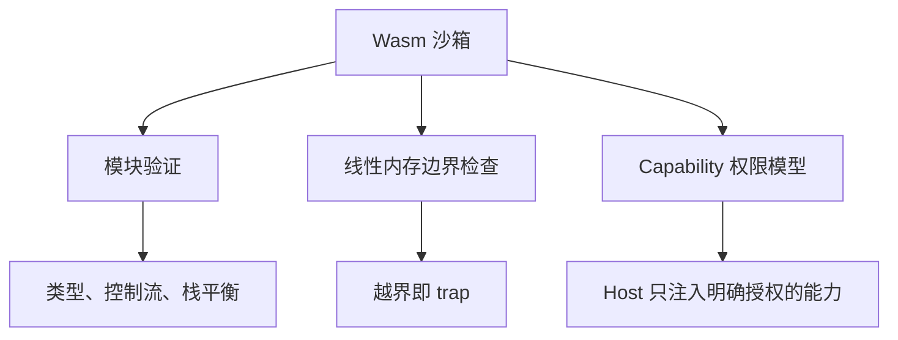


Wasm 的安全性主要来自几方面：

## 11.1 模块验证

Wasm 执行前会被验证。

- 类型是否合法
- 控制流是否合法
- 栈平衡是否合法
- 函数调用是否合法
- 内存访问指令是否合法

这能防止很多非法字节码。

---

## 11.2 线性内存隔离

Wasm 只能访问自己的 linear memory。

- 不能随意读写宿主进程内存
- 不能随意访问其他 Wasm 实例内存
- 不能构造任意 native 地址

C++ 指针只是 Wasm 内存中的 offset。

---

## 11.3 Capability-based 权限模型

尤其在 WASI 里，Wasm 默认没有系统权限。

例如你运行：

```bash
wasmtime app.wasm
```

它默认不能随便读你的整个磁盘。

如果你明确授权：

```bash
wasmtime --dir=. app.wasm
```

它才能访问当前目录。

这叫**基于能力的安全模型 capability-based security**

也就是：

- 不给权限 → 不能做
- 给什么权限 → 只能做什么

---

# 12. Wasm 的异常模型：Trap

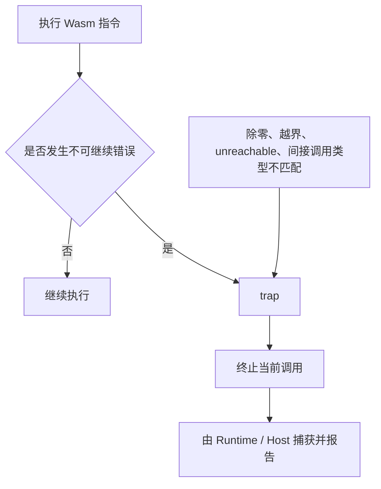


Wasm 运行时如果发生非法情况，会触发 **trap**。

常见 trap：

- 整数除以 0
- 内存越界访问
- call_indirect 类型不匹配
- unreachable 指令被执行
- 栈溢出
- 非法转换

例如：

```cpp
int x = 1 / 0;
```

或者：

```cpp
int* p = (int*)999999999;
*p = 1;
```

在 Wasm 中可能触发 trap。

trap 可以理解成 **Wasm Runtime 发现不可继续执行的错误，终止当前调用**

---

# 13. Wasm 的生命周期模型

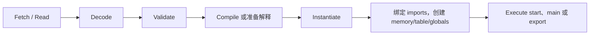


一个 Wasm 模块从文件到运行，大致经历：

1. Fetch / Read
   读取 .wasm 文件

2. Decode
   解析二进制格式

3. Validate
   验证类型、栈、控制流、内存等是否合法

4. Compile
   编译成机器码，或准备解释执行

5. Instantiate
   绑定 imports，创建 memory/table/global/function instance

6. Execute
   调用 start 函数、main 函数或导出函数

在浏览器里通常是：

```js
const wasm = await WebAssembly.instantiateStreaming(
  fetch("module.wasm"),
  imports
);

wasm.instance.exports.main();
```

在 Wasmtime 里大概是：

1. Engine 创建
2. Module 编译
3. Store 创建
4. Linker 绑定 imports
5. Instance 实例化
6. 调用导出函数

---

# 14. Wasm 和 C++ 的对应关系

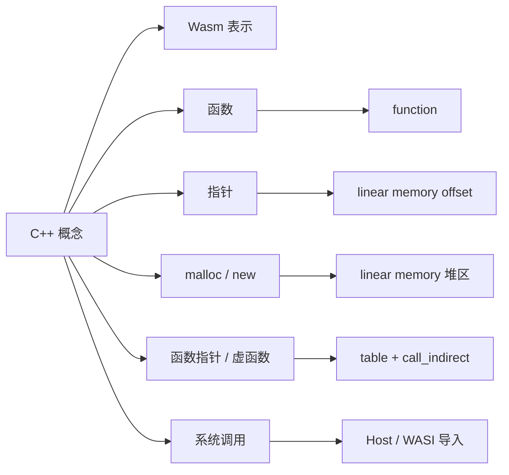


你可以把 C++ 到 Wasm 的编译结果这样理解：

| C++ 概念                      | Wasm 中的对应                       |
| --------------------------- | ------------------------------- |
| 函数                          | Wasm function                   |
| int / long / float / double | i32 / i64 / f32 / f64           |
| 指针                          | linear memory offset            |
| malloc / new                | 在 linear memory 的堆区分配           |
| 栈变量                         | Wasm local 或 linear memory 栈区   |
| 全局变量                        | data segment / global           |
| 函数指针                        | table + call_indirect           |
| 虚函数                         | table / 间接调用 / 编译器运行时结构         |
| 标准库 I/O                     | 通过 Emscripten 或 WASI runtime 实现 |
| 系统调用                        | 由 Host/WASI 模拟或提供               |
| main 函数                     | 可作为 start 或导出入口                 |

---

# 15. 一个具体例子：C++ add 函数到 Wasm

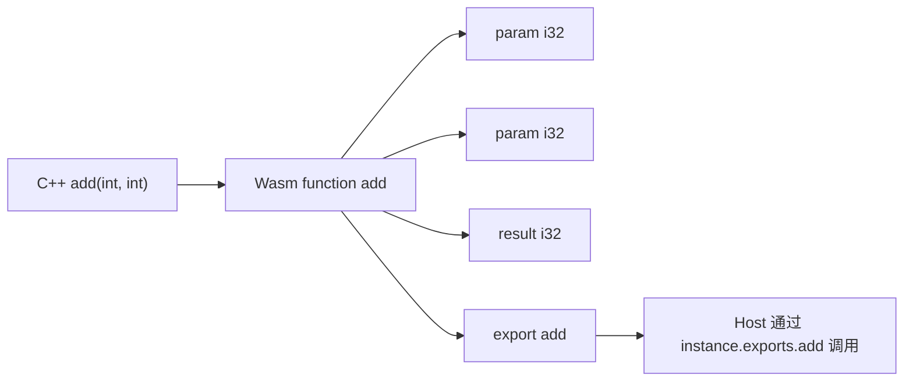


C++ 代码：

```cpp
extern "C" int add(int a, int b) {
    return a + b;
}
```

概念上会变成类似 WAT：

```wasm
(module
  (func $add (param $a i32) (param $b i32) (result i32)
    local.get $a
    local.get $b
    i32.add
  )

  (export "add" (func $add))
)
```

这个模块的结构是：

```text
Module
├── function add
│   ├── param i32
│   ├── param i32
│   └── result i32
└── export add
```
---

# 16. Wasm 的边界调用模型

```mermaid
flowchart TD
    A["跨 Host / Wasm 边界"] --> B["参数转换与类型检查"]
    B --> C["可能发生内存拷贝"]
    C --> D["边界切换成本"]
    E["大量小调用"] --> F["高边界开销"]
    G["批量写入 linear memory"] --> H["一次 Wasm 调用处理整批数据"]
    H --> I["摊薄边界成本"]
```


Wasm 和 Host 之间的调用有边界成本。

1. Host → Wasm
2. Wasm → Host


都需要进行：

- 参数转换
- 类型检查
- 边界切换
- 可能的内存拷贝

所以性能优化里有一个原则：

> **不要频繁进行小粒度 Host/Wasm 跨边界调用。**

不推荐JS 调用 wasm 一百万次，每次处理一个数字;

更推荐JS 把一批数据放入 wasm memory, Wasm 一次性处理整批数据, JS 再取结果

---

# 17. Wasm 的数据传递模型

```mermaid
sequenceDiagram
    participant Host as Host
    participant Mem as Wasm Linear Memory
    participant Fn as Wasm process(ptr, len)
    Host->>Mem: 分配并写入数组
    Host->>Fn: 传入 ptr 和 len
    Fn->>Mem: 按 offset 读取并处理
    Fn->>Mem: 写入结果
    Fn-->>Host: 返回结果位置或状态
    Host->>Mem: 读取结果
```


Wasm 函数参数只支持比较底层的值类型，它不能直接接收复杂的 C++ 对象或 JS 对象。

例如 C++：

```cpp
std::vector<int> process(std::vector<int> input);
```

不能天然直接被 JS 像普通函数一样调用。

通常需要转成：

```cpp
extern "C" int process(int ptr, int len);
```

其中：
- ptr = 数组在 Wasm linear memory 中的偏移
- len = 数组长度


调用流程：
1. Host 在 Wasm memory 中分配空间
2. Host 把数组写入 memory
3. Host 调用 wasm 函数，传 ptr 和 len
4. Wasm 处理 memory 中的数据
5. Host 从 memory 读回结果


---

# 18. Wasm 不是 JVM，也不是 Docker

```mermaid
flowchart TD
    W["Wasm"] --> W1["通用安全字节码与沙箱"]
    J["JVM"] --> J1["带对象模型、GC 和 Java 生态的语言运行时"]
    D["Docker"] --> D1["基于 OS 内核的容器隔离与完整应用部署"]
    W --> U["常见定位：插件、函数、边缘逻辑、沙箱执行"]
```


Wasm 经常被类比成 JVM 或 Docker，但它们并不一样。

## 18.1 Wasm vs JVM

| 对比   | JVM               | Wasm              |
| ---- | ----------------- | ----------------- |
| 输入   | Java bytecode     | Wasm bytecode     |
| 主要语言 | Java/Kotlin/Scala | C++/Rust/Go/C#/更多 |
| 对象模型 | JVM 内建对象模型        | Wasm 核心模型更底层      |
| GC   | JVM 内建 GC         | 核心 Wasm 原本不依赖 GC  |
| 系统接口 | JVM 标准库           | Host/WASI 提供      |
| 定位   | 语言运行时             | 通用安全字节码格式         |

## 18.2 Wasm vs Docker

| 对比   | Docker        | Wasm            |
| ---- | ------------- | --------------- |
| 隔离层级 | 操作系统级容器       | 语言/字节码沙箱        |
| 启动速度 | 较快            | 通常更快            |
| 镜像大小 | 通常较大          | 通常较小            |
| 系统调用 | 接近完整 Linux 环境 | 默认无系统调用         |
| 适合   | 部署完整应用        | 插件、函数、沙箱模块、边缘逻辑 |

Wasm 更像**轻量、安全、可移植的插件/函数执行模型**


